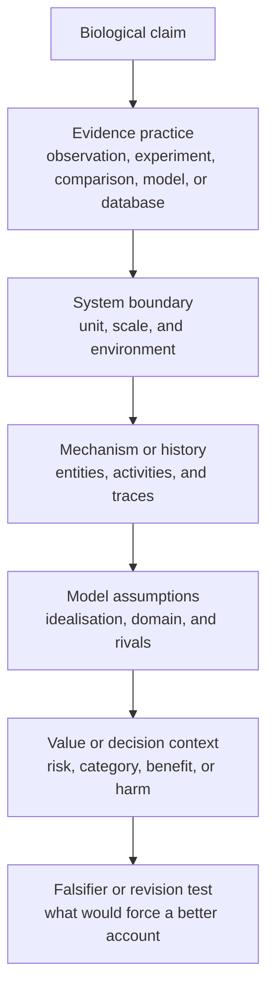

# History and Philosophy of Biology

\label{sec:unit_0_history_philosophy_biology}

\begin{figure}[htbp]
\centering
\includegraphics[width=0.9\textwidth]{../figures/biology_milestones.png}
\caption{A chronologically ordered timeline of selected milestones in the history of biology. Bars are colored by era (microscopy, classification, cell theory, evolution, genetics, molecular biology, modern synthesis, genomics). The chart compresses several thousand years of practice into a single comparative view; the underlying milestone table is reproducible from \texttt{biology.foundations.BIOLOGY\_MILESTONES}.}
\label{fig:unit_0_biology_milestones}
\end{figure}

<!-- alt: Horizontal bar chart of biology milestones from antiquity to modern times. Each bar reaches the milestone year; labels along the y-axis name the event and figure (for example, microscope, cell theory, evolution by natural selection, DNA double helix). Bars are color-coded by era. -->

<!-- chapter-metadata-badge -->
> Level 2/3 · 80 min read · 100 min lecture · Prerequisites: \cref{sec:unit_0_systems_science}, \cref{sec:unit_0_complex_adaptive_systems}, \cref{sec:unit_0_active_inference}

---

## Learning Objectives

By the end of this chapter, students will be able to:

1. Explain biology as a changing practice that combines observation, experiment, modeling, classification, interpretation, and ethical judgement.
2. Compare ancient and global biological traditions without reducing them to a simple prelude to modern European laboratory science.
3. Distinguish natural-history, experimental, mechanistic, mathematical, and computational styles of biological evidence.
4. Explain how Darwin, Wallace, Mendel, population genetics, and molecular biology reshaped biological explanation.
5. Compare mechanistic explanation, functional explanation, and teleological language in biological reasoning.
6. Apply Tinbergen's four questions (mechanism, ontogeny, adaptive significance, phylogeny) to separate complementary levels of behavioral and physiological explanation.
7. Evaluate species, organisms, genes, microbiomes, and developmental systems as different candidates for biological individuality.
8. Analyze nature-nurture claims as claims about developmental systems, inheritance, environments, and evidence.
9. Identify where values enter biological research, medicine, conservation, and public communication without treating evidence as optional.

<!-- curriculum-scaffold-start -->
### Study Blueprint

- **Big idea:** Biology is a changing evidence practice: its concepts of life, function, species, inheritance, and self are revised by new observations, instruments, models, and social values.
- **Core concepts:** biological explanation, historical evidence, function, species concepts, values in science.
- **Framework alignment:** Vision & Change: Systems, Structure and function; AP Biology: Systems Interactions; NGSS-style topics: Structure and Function, Interdependent Relationships in Ecosystems.
- **Model or quantitative lens:** Concept-map and evidence-matrix comparisons among historical claims, mechanisms, and model assumptions.
- **Data skill:** Classify source excerpts as observation, experiment, model, mechanism, or value-laden inference.
- **Practice cadence:** Questions and Methods, Representing and Describing Data, Argumentation.
- **Common misconception to repair:** History is not a list of dates; it explains why current biological concepts are powerful, limited, and revisable.
- **Primary lab:** \nameref{sec:lab_unit_0_history_philosophy_biology}.
- **Question bank:** \nameref{sec:q_unit_0_history_philosophy_biology}.
- **Transfer task:** Transfer source-analysis reasoning to modern debates about species, genetics, microbiomes, and biomedical ethics.
- **Bridge to computation:** `biology.toc.load_toc`.
<!-- curriculum-scaffold-end -->

---

## Opening Vignette: Darwin, Wallace, and Evidence Before an Audience

On 1 July 1858, members of the Linnean Society of London heard a set of papers that neither principal author presented in person. Charles Darwin, still grieving a family death, and Alfred Russel Wallace, still in the Malay Archipelago, had independently reached the same unsettling explanation: variation, inheritance, and differential survival could make adaptation without a designing hand. Joseph Hooker and Charles Lyell arranged for extracts from Darwin's unpublished work and Wallace's Ternate essay to be read together \citep{darwin1858}.

The episode matters because no one placed a finch, a beetle, or a fossil on the table that evening as decisive proof. The evidence was distributed across field observations, specimens, breeding analogies, geographic patterns, correspondence, and a causal argument about populations. Darwin's later book expanded that argument into a sustained evidential architecture: artificial selection, biogeography, homology, embryology, and the fossil record each constrained the same theory \citep{darwin1859}.

This chapter asks how biology makes such claims stable enough to teach. A biological explanation is not just a fact plus a famous name. It is a practice that chooses units, draws boundaries, builds models, handles values, and states what evidence would force revision.

---

## Why History and Philosophy Belong in Introductory Biology

Biology is not a finished catalog of facts. It is a changing evidence practice for asking how living systems are organized, how they persist, how they change, and how we should act when biological knowledge matters in medicine, agriculture, conservation, and public life. Systems science, complex adaptive systems, and active inference provide formal lenses; history and philosophy explain why those lenses exist, what they clarify, and where they can mislead. Mayr's history of biological thought and Hull's account of science as a process both emphasize that biology is deeply historical: its central objects are lineages, organisms, environments, and practices that change over time \citep{mayr1982,hull1988}.

A first-year student often meets biology as named content: cell theory, natural selection, Mendelian inheritance, the central dogma, germ theory, ecological succession. Yet each idea came from a particular practice. Hooke's microscopy made cells visible \citep{hooke1665}. Harvey's circulation experiments made physiology quantitative and interventionist \citep{harvey1628}. Darwin and Wallace turned variation, biogeography, and natural history into a causal theory of adaptation \citep{darwin1858,darwin1859}. Mendel's pea crosses became a genetics framework after later researchers recognized how particulate inheritance could be combined with population thinking \citep{mendel1866,fisher1930}. The milestone timeline in \cref{fig:unit_0_biology_milestones} clusters these episodes by era so the bursts of microscopy, classification, evolution, genetics, and molecular biology are visible at a glance.

Read this chapter as a set of modules, not as a march from ignorance to truth. Each module asks: What counted as evidence? What was treated as a biological unit? Which instruments, organisms, models, and values shaped the answer?

: Study Blueprint: Module and Guiding question. {#tbl:unit_0_history_philosophy_biology_study_blueprint}
| Module | Guiding question | Later cross-link |
| --- | --- | --- |
| Practices and traditions | How do biological facts become stable enough to teach? | \cref{sec:unit_0_systems_science} |
| Natural history and experiment | What do comparison and perturbation each reveal? | \cref{sec:unit_0_complex_adaptive_systems} |
| Evolution, genes, molecules | How do historical and mechanistic causes combine? | \cref{sec:unit_VI_evolution_and_selection} |
| Function, individuality, development | What counts as a unit, a purpose, or a cause? | \cref{sec:unit_VII_microbial_ecology} |
| Models, values, public biology | How should evidence guide action under uncertainty? | \cref{sec:unit_0_active_inference} |

---

## Biology as Practice: Instruments, Organisms, and Arguments

Scientific facts in biology travel through instruments, organisms, protocols, diagrams, model systems, databases, and arguments. A micrograph, a pedigree, a phylogenetic tree, a patch-clamp trace, a randomized clinical trial, and a genome-wide association plot are not interchangeable forms of evidence. Each filters the living world through assumptions about what counts as a unit, a cause, a measurement, and a relevant comparison.

Natural historians compare organisms across places and times. Physiologists perturb living systems and measure responses. Geneticists infer hidden inheritance rules from crosses and sequences. Evolutionary biologists use models to separate drift, selection, mutation, migration, and history. Molecular biologists connect structure to information and mechanism. Philosophers of biology ask what these practices assume when they use words such as "function", "fitness", "species", "gene", "individual", "self", and "cause" \citep{sober1984,okasha2006}.

Two lessons follow. First, biological knowledge is material: it depends on microscopes, culture media, field notebooks, model organisms, databases, and statistical tools. Second, biological knowledge is revisable: better instruments or better comparisons can change the apparent unit of explanation. Rheinberger calls experimental systems engines for producing "epistemic things", objects that are not fully known in advance but become tractable through repeated manipulation \citep{rheinberger1997}. That idea fits the rest of this textbook: a model is useful when its assumptions, boundary conditions, and failure modes are visible.

> **Concept Check:** A patch-clamp trace, a phylogenetic tree, and a randomized clinical trial each support different kinds of biological claims. Choose one claim each could support, then name the system boundary and the kind of evidence that would most directly weaken it.

---

## Ancient and Global Knowledge Traditions in Biology and Medicine

Aristotle's biological works treated organisms as structured wholes whose parts made sense in relation to activities such as nutrition, motion, perception, and reproduction \citep{aristotleParts}. Lloyd's comparative work on ancient Greek and Chinese science is useful here because it resists two simple mistakes: treating one tradition as the single template for rational inquiry, or treating traditions as isolated from social and institutional settings \citep{lloyd1996}. History is not a search for the first person to say a modern sentence. It is a way to understand how different communities made organisms, bodies, remedies, classification, and explanation intelligible.

Medical and biological thought also moved through Persian, Arabic, Chinese, Indian, Indigenous, and other knowledge traditions. Ibn Sina's *Canon of Medicine* helped organize anatomy, physiology, diagnosis, and therapeutics across centuries of medical education \citep{ibnsinaCanon}. Chinese materia medica and medical theory, summarized in part by Needham's history of Chinese science, show a different way of organizing bodies, plants, illness, and intervention \citep{needham1954}. Harding's critique of supposedly view-from-nowhere science and Haraway's account of situated knowledge help students ask a practical question: whose organisms, whose environments, and whose risks are being made visible \citep{harding1986,haraway1988}?

---

## Natural History, Classification, and Empire

Natural history made biology comparative before it was laboratory-based. Linnaeus made classification portable by standardizing binomial names and arranging organisms into nested groups \citep{linnaeus1753}. Darwin's field observations and specimens from the *Beagle* voyage became part of the evidence background for later evolutionary arguments \citep{darwin1859}. Classification did not merely name a world already sorted; it organized collections, museums, colonial routes, gardens, and commercial exchange.

That global circulation matters. Schiebinger's work on colonial bioprospecting shows how plant knowledge moved through power relations as well as notebooks and herbarium sheets \citep{schiebinger2004}. Natural history therefore has a double legacy. It is a foundational evidence practice for biodiversity, biogeography, conservation, and evolution. It is also entangled with empire, extraction, and unequal credit. A good biological explanation should keep both facts in view.

---

## Experiment, Mechanism, and the Laboratory

Natural history and experiment are complementary rather than rival practices. Hooke used microscopy to reveal a world below ordinary perception \citep{hooke1665}. Harvey used intervention and quantification to argue that blood circulates rather than being continually produced and consumed \citep{harvey1628}. Bernard's experimental medicine made controlled perturbation a central ideal for physiology: isolate a factor, intervene, measure the response, and ask whether the result generalizes \citep{bernard1865}. Bechtel and Abrahamsen describe mechanistic explanation as an alternative to merely fitting laws: explain a phenomenon by identifying parts, operations, and organization \citep{bechtelAbrahamsen2005}.

Laboratories did not replace organisms with machines. They built controlled relationships between organisms, instruments, and questions. A frog nerve-muscle preparation, a fruit-fly cross, a bacterial plate, and a cell-free protein synthesis system each make some causal relations visible while hiding others. This is why \cref{sec:unit_0_systems_science} insists on system boundaries: the same biological object can be a component, a system, or an environment depending on the question.

---

## Darwin, Wallace, and Historical Causation

Darwin and Wallace transformed biological explanation by showing how adaptation could arise from ordinary variation, heredity, differential survival, and reproduction \citep{darwin1858,darwin1859}. The explanation of a feature could be historical rather than merely mechanical: a finch beak is explained by development, material structure, ecological function, and evolutionary history together. This is a distinctive feature of biology. The present form of an organism often carries traces of past selection, constraint, drift, migration, and contingency.

Evolution also changed the meaning of biological order. Adaptation need not imply design by intention. Population variation, local environments, and inheritance can generate fit between organism and environment without a central planner. This is one reason \cref{sec:unit_0_complex_adaptive_systems} belongs before the rest of the book: natural selection is a distributed, history-sensitive process that can produce organized outcomes from local differential reproduction.

---

## Genetics, Molecular Biology, and the Modern Synthesis

Mendel showed that inheritance could be particulate even when traits appear blended at the organism scale \citep{mendel1866}. Fisher's mathematical synthesis linked relatives, variance, and natural selection \citep{fisher1930}; Haldane developed models of selection and its consequences \citep{haldane1932}; Dobzhansky, Mayr, Huxley, and others helped join genetics, systematics, paleontology, and natural selection into the Modern Synthesis \citep{dobzhansky1937,mayr1942,huxley1942}. The synthesis did not remove history from biology. It made history mathematically tractable through populations, allele frequencies, selection, drift, and speciation.

Molecular biology added another explanatory layer. Watson and Crick's DNA model linked chemical structure to copying and information storage \citep{watson1953}; Franklin and Gosling's X-ray work was part of the empirical basis for DNA structure \citep{franklin1953}; Crick's central-dogma framing clarified directional information transfer while leaving room for later discoveries about regulation, RNA, epigenetics, and genome architecture \citep{crick1958,crick1966}. Judson's history of molecular biology is useful because it shows discovery as a network of instruments, rival groups, model building, and interpretation rather than a single heroic moment \citep{judson1996}.

The same history also warns against over-tight metaphors. "Information", "program", and "blueprint" can help students reason about DNA, but Keller argues that gene-centered language often overstates control when regulation is distributed across cells, organisms, and environments \citep{keller2010}. Kimura's neutral theory and later extended-synthesis debates further show that evolutionary explanation cannot be reduced to adaptive storytelling alone \citep{kimura1983,pigliucci2010,laland2015}. Use genes as powerful explanatory units, not as the sole biological units.

---

## Mechanism, Function, and Teleology

Biologists constantly use purpose-like language: hearts are "for" pumping blood, enzymes are "for" catalysing reactions, flowers are "for" attracting pollinators. The language is useful, but it is also risky. Mechanistic explanation identifies entities, activities, organization, and causal sequence \citep{machamer2000}. Wright's account of function and Mayr's distinction between teleological and teleonomic language help separate human purpose from biological function \citep{wright1973,mayr1974teleology}.

### Tinbergen's Four Questions

In 1963 Nikolaas Tinbergen argued that a complete biological account of a trait or behavior must answer four complementary questions, not one \citep{tinbergen1963aims}. The framework remains a standard guardrail against conflating mechanism with function or development with evolutionary history \citep{bateson2013tinbergen,nesse2019tinbergen}.

: Tinbergen's four complementary questions (mechanism, ontogeny, adaptive significance, phylogeny). {#tbl:unit_0_history_philosophy_biology_tinbergen_s_four_questions}
| | Diachronic (historical) | Synchronic (current form) |
| --- | --- | --- |
| **Proximate** | **Ontogeny** — how the trait develops across the individual lifespan | **Mechanism** — what biological machinery produces the trait now |
| **Ultimate** | **Phylogeny** — how the trait evolved across lineages | **Adaptive significance** — how the trait contributes to survival and reproduction today |

Each cell asks a different question. Mechanism identifies stimuli, pathways, and molecular machinery (for example testosterone and song nuclei in birds, or pyrogens acting on hypothalamic thermoregulatory centers during fever). Ontogeny asks how the machinery is assembled and modified by genes, learning, and environment (critical periods in birdsong learning; maturation of fever responses in neonates). Adaptive significance asks what fitness advantage the trait provides in its current ecological context (male song as mate attraction; fever as an anti-pathogen response despite metabolic cost). Phylogeny asks whether the trait is ancestral or derived and how comparative evidence reconstructs its history (song types clustering on oriole phylogenies; regulated hyperthermia conserved across vertebrates).

The four questions are complementary, not competing. Explaining bird song requires syrinx anatomy, developmental learning, mate-choice function, and phylogenetic comparison together. Explaining fever requires cytokine mechanisms, developmental changes in thermoregulation, selective advantage during infection, and deep evolutionary conservation together. Bateson and Laland note that modern epigenetics, plasticity, and niche construction blur sharp proximate–ultimate boundaries, but the four-question structure still disciplines inquiry by forcing researchers to state which level they are addressing \citep{bateson2013tinbergen}.

> **Concept Check:** Choose fever or birdsong. For each of Tinbergen's four questions, write one sentence that states a testable claim and one observation that would weaken it.

This distinction matters for \cref{sec:unit_0_active_inference}. Active inference can make goal-directed behavior mathematically explicit, but it should not license vague claims that every biological process "wants" something. A good functional claim states the system, the effect, the evidence that the effect matters, and whether the explanation is about current causal contribution, selected history, or a modeled preferred state.

: Translating purpose-like language into testable biological claims. {#tbl:unit_0_history_philosophy_biology_tinbergen_s_four_questions_2}
| Purpose-like sentence | Defensible biological reading | Evidence needed |
| --- | --- | --- |
| The heart is for pumping blood | Causal role in circulation | Pressure gradients, flow, tissue perfusion, perturbation |
| Flowers are for attracting pollinators | Selected-effect or current ecological role | Visitor behavior, reproductive output, phylogenetic or manipulation evidence |
| A cell wants glucose | Modeled preference or regulatory set point | Sensor, action, uptake response, rival metabolic explanation |
| A gene controls a trait | Contribution within a developmental system | Variant effect, regulatory context, environment, intervention |

Recent debates over Markov blankets and explanatory pluralism make the same point from the active-inference side: a formal partition can clarify agency when the system boundary, observables, and rival models are explicit \citep{bruineberg2022markov,colomboWright2017}. Treating every organized process as literal inference would collapse a useful modeling tool into metaphor.

Gould and Lewontin's critique of adaptationist storytelling warns that not every trait is an optimized adaptation \citep{gouldLewontin1979}. Some traits are by-products, constraints, historical inheritances, or consequences of developmental architecture. Function is a hypothesis to test, not a decorative label.

> **Concept Check:** A textbook says that flowers are "for" attracting pollinators. Rewrite that claim as (a) a mechanistic claim, (b) a selected-effect functional claim, and (c) a causal-role claim, then state which version active inference could model without implying conscious purpose.

---

## Species, Individuals, and the Boundaries of Life

Mayr's biological species concept emphasized reproductive isolation \citep{mayr1942}; de Queiroz's general lineage account treated species concepts as different operational routes to separately evolving lineages \citep{deQueiroz2007}; Ghiselin and Hull argued that species can be understood as historical individuals rather than timeless classes \citep{ghiselin1974,hull1978}; Okasha and Clarke show why biological individuality depends on reproduction, inheritance, cooperation, conflict, and criteria that can be multiply realized \citep{okasha2006,clarke2013individuals}. This is not a vocabulary dispute. It changes how biologists count entities, assign causes, and explain change.

Microbiomes sharpen the problem because biological identity is not exhausted by one genome or one cell lineage \citep{hmp2012structure,sender2016cells}. O'Malley argues that philosophy of biology must take microbial life seriously because microbes challenge assumptions about individuality, species, sex, ecology, and evolution \citep{omalley2014}. Gilbert, Sapp, and Tauber's "symbiotic view of life" and Pradeu's work on immunological selfhood both push students to treat biological boundaries as regulated, relational, and sometimes porous \citep{gilbert2012symbiotic,pradeu2012}. Margulis's endosymbiotic theory makes the same lesson historical: some cellular parts began as organisms in relation \citep{margulis1967}.

> **Concept Check:** A lichen, a coral colony, and a human gut microbiome each blur the boundary of biological individuality. Pick one case and compare genetic, physiological, and evolutionary criteria for deciding whether it is one individual or many.

---

## Development, Nature-Nurture, and Inheritance

"Nature versus nurture" is a poor frame because development is not a competition between genes and environments. Waddington's epigenetic landscape made development visible as a canalised but perturbable process \citep{waddington1957}. Lewontin's distinction between analysis of variance and analysis of causes explains why a statistical partition in one population does not identify a simple causal essence \citep{lewontin1974}. Oyama's developmental-systems theory and West-Eberhard's account of developmental plasticity show how inheritance, environment, behavior, and plasticity can jointly shape evolutionary trajectories \citep{oyama2000,westEberhard2003}.

For first-year biology, the practical rule is simple: do not ask whether a trait is "genetic or environmental" until you have named the developmental process, the population, the environment, the measurement, and the intervention. The answer often changes when the system boundary changes.

---

## Microbiology, Disease, Symbiosis, and Self

Microbiology changed the scale at which life was understood. Germ theory made disease transmission experimentally tractable. Molecular biology made viruses and phages central to genetics. Microbial ecology made communities, biofilms, horizontal gene transfer, and metabolic cooperation central biological phenomena. The human microbiome turned "self" from a single-genome assumption into a regulated host-microbe system \citep{hmp2012structure,omalley2014}.

This module links directly to \cref{sec:unit_VII_bacteria_archaea_viruses} and \cref{sec:unit_VII_microbial_ecology}. When asking whether a microbe is part of the organism, the environment, or a disease process, name the criterion: development, metabolism, immune tolerance, ecological dependence, reproduction, or clinical outcome. Different criteria produce different boundaries, and that is a feature of the biology rather than a failure of terminology.

---

## Models, Evidence, and Explanation

Models simplify. That is their strength and their danger. Levins argued that model builders trade off realism, generality, and precision, and that robust understanding often comes from comparing several imperfect models \citep{levins1966}. Wimsatt sharpened the point: false or idealised models can still help produce truer theories when their distortions are understood \citep{wimsatt1987}. Weisberg's account of simulation and similarity gives students a useful question: similar to what, for what purpose, and under what tolerance \citep{weisberg2013}?

Historical sciences and experimental sciences use evidence differently. Cleland argues that historical sciences often work by collecting traces of past events and testing rival explanations against those traces \citep{cleland2002}. That logic is central to evolution, phylogenetics, paleontology, epidemiological reconstruction, and conservation history. Data-centric biology adds another layer: databases do not speak for themselves; Leonelli shows that data must be curated, standardized, moved, and interpreted before they become evidence \citep{leonelli2016}. Kitano's systems-biology overview makes the same point computationally: large networks require explicit models, not just lists of parts \citep{kitano2002}.

When reading a biological model, ask what unit it uses, what it leaves out, what evidence would change it, which alternatives explain the same pattern, and which decision would change if the model were wrong.

## Levels of Explanation and Causal Pluralism

Biology often needs several explanations for the same case. A bird's migration can be explained by neural circuits, developmental experience, ecological payoff, and evolutionary history. A fever can be explained by cytokine signaling, hypothalamic set-point change, pathogen suppression, and clinical risk. These explanations are not automatically rivals, because they answer different causal questions. The mistake is to let one level pretend to have completed the work of the relevant others.

Explanatory pluralism is not relativism. It does not say that any story is as good as any other. It says that a strong biological account names the level of organization, the causal relationship being claimed, and the test that would make that relationship fail. A molecular mechanism is incomplete if it cannot connect to phenotype; a population model is incomplete if it cannot state which organism-level processes supply its parameters; a social or ethical analysis is incomplete if it treats empirical constraints as optional.

: Tinbergen's Four Questions: Explanation level and Typical question. {#tbl:unit_0_history_philosophy_biology_tinbergen_s_four_questions_3}
| Explanation level | Typical question | Common failure mode | Stronger version |
| --- | --- | --- | --- |
| Molecular or cellular | What entities and activities produce the effect? | Treating the part as the whole explanation | State the organismal or environmental condition where the mechanism matters |
| Developmental | How does the trait come into being? | Treating genes and environment as separable rivals | Name the interaction, timing, and perturbation that would change the outcome |
| Evolutionary or historical | Why did this pattern arise in a lineage? | Turning adaptation into an untested just-so story | Compare selection with drift, constraint, phylogeny, and contingency |
| Ecological or social | What boundary and decision context matter? | Treating a value choice as if it were a measurement | Separate empirical constraints from risk, justice, cost, and benefit |

> **Concept Check:** A clinician says a fever is "caused by infection." Rewrite the explanation at molecular, physiological, evolutionary, and public-health levels, then identify one observation that would weaken each level-specific claim.

## First-Principles Claim Audit

A first-principles reading of biology starts by stripping a claim down to what cannot be wished away. The point is not to distrust every claim equally; it is to separate evidence, modeling choices, and inherited habits before reasoning from them.

: Tinbergen's Four Questions: Claim element and First-principles question. {#tbl:unit_0_history_philosophy_biology_tinbergen_s_four_questions_4}
| Claim element | First-principles question | Typical status | Example |
| --- | --- | --- | --- |
| Observation | What measurement or trace exists? | Hard constraint when reproducible | A sequence read, fossil layer, voltage trace, or field count |
| Boundary | Where is the system drawn? | Soft constraint | Cell, host-microbiome system, population, ecosystem |
| Mechanism | What entities and activities produce the phenomenon? | Hard if experimentally constrained; provisional if inferred | Enzyme active site, ion channel, pollinator behavior |
| Function | Is this current contribution, selected history, or modeled preference? | Often mixed | Heart pumping, flower attraction, active-inference preferred state |
| Model | What assumptions make prediction possible? | Assumption until tested outside the fitting case | Hardy-Weinberg equilibrium, logistic growth, Markov blanket partition |
| Value | Which decision, risk, or category matters? | Soft constraint that must be explicit | Disease threshold, conservation priority, research-benefit standard |

The reconstructed rule is simple: keep hard constraints, mark soft constraints, and test assumptions. If a claim cannot say what would revise it, it is not yet ready to carry explanatory weight.

### Claim Audit in Practice

The claim audit is a transfer tool for the rest of the book. Use it whenever a statement sounds obvious, final, or purpose-like. Start with the observation that cannot be ignored, then ask which boundary, mechanism, function, model, value, and revision test are being smuggled into the sentence.

<!-- alt: Graph showing claim-audit workflow: a strong biological claim states its evidence practice, boundary, mechanism or history, modeling assumptions, value context, and revision test. -->

*Claim-audit workflow: a strong biological claim states its evidence practice, boundary, mechanism or history, modeling assumptions, value context, and revision test.*

: Claim Audit in Practice: Later claim and Hard constraint. {#tbl:unit_0_history_philosophy_biology_claim_audit_in_practice}
| Later claim | Hard constraint | Soft constraint or assumption | Revision test |
| --- | --- | --- | --- |
| Flowers attract pollinators | Floral traits and visitor behavior can be observed and compared | "For" may mean selected effect, current causal role, or human purpose unless specified | A manipulation that changes floral traits without changing pollinator visits would weaken the functional claim |
| A microbiome is part of an individual | Host-microbe interactions can affect metabolism, development, immunity, and ecology | The boundary may be genetic, physiological, ecological, clinical, or evolutionary | A criterion that predicts one case but fails for lichens, corals, or gut communities needs a narrower domain |
| Active inference explains homeostasis | Organisms sense, act, and maintain viable internal ranges | A Markov blanket or generative model is a modeling choice, not proof that every process literally infers | A rival control or physiological model with better predictions should limit the active-inference interpretation |

The point is not to slow every page into philosophy. It is to prevent category mistakes before they spread: mechanism is not the same as function, a model boundary is not a natural boundary, and a useful formalism is not automatically a general law.

---

## Current Evidence and Frontier Biology: History and Philosophy of Biology

For **History and Philosophy of Biology**, frontier work belongs inside the evidence logic of the chapter. Historical and philosophical claims are strongest when they identify the source practice, comparison set, interpretive assumption, and possible counterevidence rather than merely listing famous names.

- **What to verify:** identify the primary source, scholarly synthesis, dataset, or ethical document that supports the claim.
- **What to qualify:** state the tradition, organism, period, population, or institutional setting where the claim applies.
- **What to compare:** contrast one alternative explanation, source category, or boundary choice before treating the claim as settled.
- **What to cite:** distinguish primary text, historical reconstruction, philosophical analysis, STS critique, and current biomedical guidance.

Treat every historical claim as a claim about practice: name who produced the evidence, what method made it visible, what unit was assumed, and what would revise the interpretation.

**Source practice:** Use primary sources for focal episodes and scholarly synthesis for context; avoid using chronology as a substitute for evidence.

---

## Ethics, Values, and Public Biology

Values enter biology whenever researchers choose questions, define categories, enrol participants, manage risk, communicate uncertainty, or recommend interventions. Biomedical ethics often uses principles such as autonomy, beneficence, nonmaleficence, and justice \citep{beauchamp1979}. Research ethics after the Nuremberg Code and the UNESCO declaration on the human genome made consent, dignity, and human rights central constraints on biological research \citep{nuremberg1947,unesco1997genome}. Kevles's history of eugenics shows why biology education must distinguish evidence from ideological misuse \citep{kevles1985}.

Values do not make evidence optional. They make the questions more explicit: who is affected, what harms are possible, what categories are being used, who benefits, and what uncertainty remains? Jasanoff's STS work treats science and social order as co-produced rather than sealed off from one another \citep{jasanoff2004}. Schiebinger's history of gender and science, Haraway's situated knowledge, and feminist critiques such as Fausto-Sterling's work on sex classification show that the categories used in biology can be scientifically productive, politically consequential, and revisable \citep{schiebinger1999,haraway1988,faustoSterling1993}.

Douglas's account of values in science helps distinguish epistemic values, such as explanatory power and coherence, from social and ethical values that enter when uncertainty affects policy, risk, or harm \citep{douglas2009valuefree}. A responsible biology claim should therefore say which values shaped the question and which observations still constrain the answer.

> **Concept Check:** A conservation model ranks habitats for protection using species richness, carbon storage, and local livelihoods. Classify one hard constraint, one soft constraint, and one untested assumption in the model, then name evidence that would change the ranking.

---

## Synthesis: A Checklist for Biological Claims

- **Practice:** What activity produced the evidence: observation, experiment, comparison, model, clinical study, or database analysis?
- **Unit:** What is being treated as the biological unit: gene, cell, organism, population, lineage, symbiosis, ecosystem, or patient?
- **Boundary:** Where does the system stop, and what changes if the boundary moves?
- **Mechanism:** What entities and activities are claimed to produce the phenomenon?
- **Function:** Is the claim about current contribution, selected history, modeled preference, or human purpose?
- **History:** What past events, constraints, or contingencies matter?
- **Model:** What assumptions make the model usable, and what do they leave out?
- **Values:** What decision, harm, benefit, category, or governance choice is being made?
- **Revision:** What evidence would force a better explanation?

---

## Summary

- Biology is an evidence practice, not a finished list of names, dates, and facts.
- Natural history, experiment, mechanism, historical inference, and models answer different but compatible questions.
- Function-language is useful when causal role, selected history, modeled preference, and human purpose are kept separate.
- Species and biological individuals are boundary claims, not always sharp natural kinds.
- Developmental and microbiome examples show that genes, organisms, environments, and symbioses often share explanatory work.
- Models are tools with assumptions, domains of validity, and failure modes; they should be compared against alternatives.
- Values shape questions, categories, risks, and decisions, but evidence still constrains responsible biological action.

---

## Key Terms

**biological practice** · **natural history** · **experiment** · **classification** · **mechanism** · **function** · **teleology** · **natural selection** · **Modern Synthesis** · **neutral theory** · **extended synthesis** · **species concept** · **biological individual** · **symbiosis** · **biological self** · **developmental plasticity** · **developmental systems theory** · **model trade-off** · **historical evidence** · **situated knowledge** · **value-laden science** · **bioethics**

---

## Discussion Questions

1. Choose one biological concept from later in the textbook and reconstruct its history as a change in evidence practice.
2. Explain why functional language is useful in biology but dangerous when treated as literal intention.
3. Compare two ways of defining species. What biological cases make each definition strong, and what cases make it break down?
4. Use a microbiome or endosymbiosis example to argue for or against the claim that organisms have clear boundaries.
5. Explain how a value can influence a biological research program without falsifying its evidence.
6. Apply Levins's model-building trade-off to one model from ecology, genetics, physiology, or cell biology.
7. Pick one global or colonial history example and identify what knowledge moved, who received credit, and what power relation shaped the record.
8. Compare active inference, teleonomy, and ordinary functional language. Where do they overlap, and where should they be kept distinct?

---

## Review Questions

1. Define biology as an evidence practice rather than a list of facts.
2. Contrast Aristotle's teleological explanation with a modern mechanistic explanation of the same organ or behavior.
3. Explain how Harvey's circulation work differs from Linnaean classification as a biological practice.
4. State the logic of natural selection and identify why Darwin and Wallace needed population variation.
5. Explain how Mendelian inheritance and population genetics were reconciled in the Modern Synthesis.
6. Distinguish mechanistic, functional, developmental, and evolutionary explanations using one trait.
7. Compare species as classes, species as reproductive populations, and species as historical individuals.
8. Explain why nature-nurture language can mislead when discussing development.
9. Describe one way microbiology complicates the idea of biological self.
10. Identify one place where values enter biological decision-making and state how evidence should still constrain the decision.
11. Explain why data curation is not a neutral clerical step in modern biology.
12. Use the checklist above to evaluate one claim about genes, microbes, ecosystems, or public health.

---

## Further Reading and Source Notes: History and Philosophy of Biology

- Aristotle, Ibn Sina, Needham, Lloyd, Linnaeus, Schiebinger, Hooke, Harvey, Bernard, Rheinberger, Darwin, Wallace, Mendel, Fisher, Haldane, Dobzhansky, Mayr, Huxley, Watson, Crick, Franklin, Keller, Kimura, Pigliucci, and Laland anchor the chapter's historical source spine \citep{aristotleParts,ibnsinaCanon,needham1954,lloyd1996,linnaeus1753,schiebinger2004,hooke1665,harvey1628,bernard1865,rheinberger1997,darwin1858,darwin1859,mendel1866,fisher1930,haldane1932,dobzhansky1937,mayr1942,huxley1942,watson1953,crick1958,crick1966,franklin1953,keller2010,kimura1983,pigliucci2010,laland2015}.
- Machamer, Darden, Craver, Tinbergen, Wright, Mayr, Gould, Lewontin, Sober, Hull, Ghiselin, de Queiroz, Okasha, Clarke, Bruineberg, Colombo, Douglas, Waddington, Oyama, West-Eberhard, O'Malley, Gilbert, Sapp, Tauber, Pradeu, Margulis, Levins, Wimsatt, Weisberg, Cleland, Leonelli, Kitano, Haraway, Harding, Jasanoff, Kevles, UNESCO, the Nuremberg Code, and Beauchamp and Childress anchor the philosophical, STS, modeling, and ethics spine \citep{machamer2000,tinbergen1963aims,wright1973,mayr1974teleology,gouldLewontin1979,sober1984,hull1978,ghiselin1974,deQueiroz2007,okasha2006,clarke2013individuals,bruineberg2022markov,colomboWright2017,douglas2009valuefree,waddington1957,oyama2000,westEberhard2003,omalley2014,gilbert2012symbiotic,pradeu2012,margulis1967,levins1966,wimsatt1987,weisberg2013,cleland2002,leonelli2016,kitano2002,haraway1988,harding1986,jasanoff2004,kevles1985,unesco1997genome,nuremberg1947,beauchamp1979}.

---

## Companion Source Module: History and Philosophy of Biology

**History and Philosophy of Biology** should leave a reproducible trail from a claim about biological knowledge to the evidence practice that produced it.

: Companion source surfaces for History and Philosophy of Biology. {#tbl:unit_0_history_philosophy_biology_companion_source_surfaces}
| Surface | Use it for |
| --- | --- |
| `src/biology/toc.py` (`load_toc`) | Inspect how chapter order, companion labels, and display numbers are derived from `docs/manuscript/config.yaml`. |
| `src/biology/curriculum.py` (`CURRICULUM`) | Connect historical and philosophical concepts to lab, question-bank, misconception, and transfer records. |
| `src/biology/alignment.py` (`ALIGNMENTS`) | Compare biology-as-practice ideas with course standards and skills frameworks. |
| `src/biology/crossref_validator.py` (`validate`) | Check whether claims, labels, and references remain mechanically traceable. |

**Reproducibility check:** before accepting a biological claim, name the evidence practice, the biological unit, the model assumption, and the value-laden decision if one is present. **Cross-reference:** compare this checklist with \cref{sec:unit_0_systems_science}, \cref{sec:unit_0_complex_adaptive_systems}, \cref{sec:unit_VI_evolution_and_selection}, and \cref{sec:unit_VII_microbial_ecology}.
