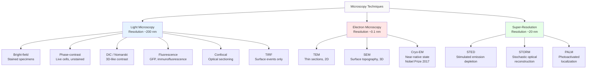
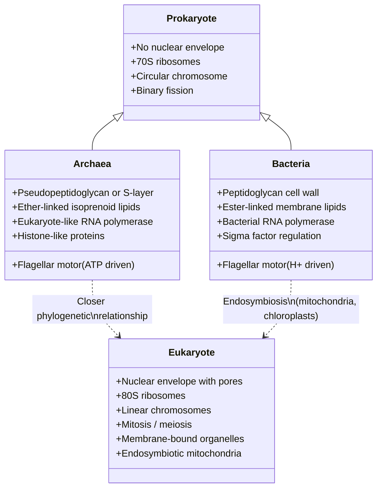

# Cell Theory and Cell Types

\label{sec:unit_II_cell_theory}


<!-- chapter-metadata-badge -->
> Level 1/3 · 45 min read · 50 min lecture · Prerequisites: \cref{sec:unit_I_macromolecules}

## Learning Objectives

1. State the three original tenets of cell theory (Schleiden, Schwann, Virchow) and the modern additions.
2. Compare the structural organization of prokaryotic, eukaryotic, and archaeal cells at the molecular level.
3. Describe the endosymbiotic \citep{margulis1967} theory and evaluate the molecular evidence supporting it.
4. Classify cells by metabolic lifestyle (autotrophic vs. heterotrophic) and oxygen relationship.
5. Quantify the surface-area-to-volume relationship and derive the mathematical constraints on cell size.
6. Explain microscopy techniques from bright-field to cryo-EM and super-resolution methods.
7. Describe the minimal cell concept (JCVI-syn3.0) and its implications for defining life.
8. Evaluate extremophile cells as evidence for the range of possible cellular adaptations and their relevance to astrobiology.

<!-- curriculum-scaffold-start -->
### Study Blueprint

- **Big idea:** Cells are bounded, evolving systems whose size and organization reflect physical constraints.
- **Core concepts:** cell theory, surface area, microscopy, prokaryote/eukaryote comparison.
- **Framework alignment:** Vision & Change: Structure and function, Systems, Information flow, exchange, and storage; AP Biology: Systems Interactions, Information Storage and Transmission; NGSS-style topics: Structure and Function.
- **Model or quantitative lens:** Surface-area-to-volume scaling.
- **Data skill:** Infer cellular constraints from measurements, micrographs, and scale bars.
- **Practice cadence:** Visual Representations, Questions and Methods, Argumentation.
- **Common misconception to repair:** Cells are not just small bags of fluid; boundaries and internal organization create function.
- **Primary lab:** \nameref{sec:lab_unit_II_cell_theory}.
- **Question bank:** \nameref{sec:q_unit_II_cell_theory}.
- **Transfer task:** Transfer scale reasoning to eggs, neurons, root hairs, and microbial colonies.
- **Bridge to computation:** `biology.cell.cell_biology.diffusion_flux`.
<!-- curriculum-scaffold-end -->

---

> **Opening Vignette: The First Cell You Ever Saw**
>
> In 1665, Robert Hooke pressed a thin sliver of cork against the lens of a compound microscope
> he had constructed himself and published his observations in *Micrographia* — a book so popular
> that Samuel Pepys stayed up until 2 a.m. reading it. Hooke saw a regular array of empty
> compartments — the remnant cell walls of dead plant cells — and named them **cellulae** (from
> Latin, "small rooms"). He had no idea that cells were alive. That insight required a further
> 174 years of microscopy, culminating in the cell theory formulations of \citet{schleiden1838}, Schwann
> (1839), and \citet{virchow1855}.
>
> Today, a single human body contains approximately 37.2 trillion cells (Bianconi et al., 2013,
> *Annals of Human Biology*) — a number so large that if laid end-to-end they would circle the
> Earth 200 times. Every one of those cells descended, by an unbroken chain of cell division, from
> a single fertilized egg roughly nine months before your birth. And every cell alive on Earth today
> is the product of 3.7 billion years of unbroken cell division since the origin of life — not one
> cell has ever been created from scratch by spontaneous generation since Leuwenhoek looked through
> his microscope in 1674.
>
> *Primary source: Bianconi, E. et al. (2013). An estimation of the number of cells in the human body. Annals of Human Biology, 40(6), 463–471.*

---

## The Cell as the Fundamental Unit of Life

### Historical Development of Cell Theory

The development of cell theory spans over two centuries and represents one of the most important unifying principles in biology.

**Robert \citet{hooke1665}** first observed "cells" (actually dead cell walls) in cork using a compound microscope he built himself. He published his observations in *Micrographia*, coining the term "cell" because the structures reminded him of monks' rooms (cellae) in a monastery.

**Antonie van Leeuwenhoek (1674-1683)** constructed single-lens microscopes achieving ~270x magnification and observed living cells for the first time --- bacteria ("animalcules"), protists, sperm cells, and red blood cells in capillary blood flow.

**Matthias \citet{schleiden1838}**, a botanist, concluded that most plant tissues are composed of cells and that the cell is the basic unit of plant structure.

**Theodor \citet{schwann1839}**, a zoologist and Schleiden's colleague, extended this principle to animals, proposing that most animal tissues are also composed of cells. Together, Schleiden and Schwann formulated the first two tenets of cell theory.

**Rudolf \citet{virchow1855}** contributed the third tenet with his famous dictum *omnis cellula e cellula* ("every cell from a cell"), establishing that cells arise primarily from pre-existing cells through division. This principle demolished the lingering notion of spontaneous generation and established the continuity of life.

```mermaid
graph LR
    A["Robert Hooke<br/>1665<br/>Observes 'cells' in cork"] --> B["van Leeuwenhoek<br/>1674<br/>First living cells observed"]
    B --> C["Robert Brown<br/>1831<br/>Discovers the nucleus"]
    C --> D["Schleiden<br/>1838<br/>All plants are cells"]
    D --> E["Schwann<br/>1839<br/>All animals are cells"]
    E --> F["Virchow<br/>1855<br/>Omnis cellula e cellula"]
    F --> G["Pasteur<br/>1859<br/>Disproves spontaneous<br/>generation"]
    G --> H["Margulis<br/>1967<br/>Endosymbiotic theory"]
    H --> I["Venter<br/>2016<br/>JCVI-syn3.0<br/>Minimal synthetic cell"]

    style A fill:#e6f3ff
    style D fill:#ffe6e6
    style E fill:#ffe6e6
    style F fill:#ffe6e6
    style I fill:#e6ffe6
```


<!-- alt: Timeline of key milestones in cell theory development, from Hooke's first observations to the modern synthetic minimal cell. -->

*Timeline of key milestones in cell theory development, from Hooke's first observations to the modern synthetic minimal cell.*

### The Three Original Postulates

The **cell theory**, formalised by \citet{schleiden1838}, \citet{schwann1839}, and \citet{virchow1855}, rests on three founding principles:

1. **Most living organisms are composed of one or more cells.**
2. **The cell is the basic structural and functional unit of cellular organisms.**
3. **Most cells arise from pre-existing cells** (*omnis cellula e cellula* --- Virchow, 1855).

A corollary of the third tenet is that life is a continuous lineage --- every cell on Earth today descends without interruption from the first cells, approximately 3.5--3.8 billion years ago. The oldest microfossils, found in Pilbara (Western Australia) and Barberton (South Africa), date to ~3.5 Ga and show morphologies consistent with filamentous prokaryotes.

### Modern Additions to Cell Theory

Modern cell biology has expanded the original three postulates:

4. **The cell contains heritable information (DNA) that directs its activities and is passed to daughter cells.** This was established by the work of Avery, MacLeod, and McCarty (1944) and confirmed by \citet{hershey1952}.

5. **Most cells have the same basic chemical composition.** Most known cells use DNA as genetic material, RNA as intermediary, [**protein**](#gl:protein)s as catalysts, and [**phospholipid bilayer**](#gl:phospholipid-bilayer)s as membranes.

6. **Energy flow (metabolism and biochemistry) occurs within cells.** Most metabolic transformations --- [**glycolysis**](#gl:glycolysis), the TCA cycle, [**oxidative phosphorylation**](#gl:oxidative-phosphorylation) --- take place within or across cell membranes.

7. **Cells contain the information necessary for their own reproduction.** The [**genome**](#gl:genome) encodes not just structural components but the regulatory logic for cell division, differentiation, and programmed cell death.

> **Clinical Connection: Virchow and the Origin of Cancer Biology**
> Virchow's principle *omnis cellula e cellula* had a profound clinical implication: if most cells come from pre-existing cells, then cancer cells must also arise from normal cells through transformation. Virchow himself applied this reasoning to pathology, founding the field of cellular pathology. Today, cancer biology rests on the understanding that [**mutation**](#gl:mutation)s accumulate in somatic cells, transforming them into malignant clones --- a direct intellectual descendant of Virchow's third postulate. see \cref{sec:unit_II_cell_signaling} (Cell Signaling) for oncogenes and tumor suppressors.

> **Concept Check 1:** Viruses are not considered "alive" by cell theory standards. List three properties of viruses that exclude them from cell theory, and one property that challenges the boundary between living and non-living.

---

## Size, Scale, and the Surface-to-Volume Constraint

### Orders of Magnitude in Biology

Biology spans an enormous range of scales. Understanding this range is essential for appreciating why cells occupy a specific size [**niche**](#gl:niche).

: Orders of Magnitude in Biology: Structure and Approximate size. {#tbl:unit_II_cell_theory_orders_of_magnitude_in_biology}
| Structure | Approximate size | Scale |
| --------- | ---------------- | ----- |
| Water molecule | 0.28 nm | Angstrom |
| Glucose molecule | 0.7 nm | Nanometre |
| Phospholipid bilayer thickness | 7--8 nm | Nanometre |
| [**Ribosome**](#gl:ribosome) | 25 nm | Nanometre |
| HIV virus | 120 nm | Nanometre |
| Mitochondrion | 1--5 μm | Micrometre |
| *E. coli* | 1--2 μm | Micrometre |
| Red blood cell | 7--8 μm | Micrometre |
| Typical animal cell | 10--30 μm | Micrometre |
| Typical plant cell | 30--100 μm | Micrometre |
| *Thiomargarita namibiensis* | 750 μm | Sub-millimetre |
| Frog egg | 1 mm | Millimetre |
| Ostrich egg (cell) | 15 cm | Centimetre |

### The Mathematics of Cell Size

Cells are small --- almost without exception. Why?

The rate of metabolism (nutrient consumption, waste generation) scales with **volume** ($V \propto r^3$). The rate of exchange with the environment (nutrient uptake, waste removal) scales with **surface area** ($A \propto r^2$). The ratio:

\begin{equation}
\frac{A}{V} = \frac{4\pi r^2}{\frac{4}{3}\pi r^3} = \frac{3}{r}
\label{eq:unit_II_cell_theory_worked_1}
\end{equation}

As $r$ increases, $A/V$ decreases. A sphere with $r = 1$ μm has $A/V = 3$ μm$^{-1}$. With $r = 1$ mm (1,000x larger), $A/V = 0.003$ μm$^{-1}$. Large cells simply cannot exchange nutrients fast enough for their metabolic demand.

## Worked Example: Surface-to-Volume Calculation

*Problem:* A spherical bacterium has radius $r = 0.5$ μm. Calculate (a) the surface area, (b) the volume, (c) the $A/V$ ratio. Then repeat for a spherical eukaryotic cell with $r = 10$ μm and compare.

*Solution:*

For the bacterium ($r = 0.5$ μm):

\begin{equation}
A = 4\pi r^2 = 4\pi(0.5)^2 = 3.14 \; \mu\text{m}^2
\label{eq:unit_II_cell_theory_worked_2}
\end{equation}

\begin{equation}
V = \frac{4}{3}\pi r^3 = \frac{4}{3}\pi(0.5)^3 = 0.524 \; \mu\text{m}^3
\label{eq:unit_II_cell_theory_worked_3}
\end{equation}

\begin{equation}
\frac{A}{V} = \frac{3.14}{0.524} = 6.0 \; \mu\text{m}^{-1}
\label{eq:unit_II_cell_theory_worked_4}
\end{equation}

For the eukaryotic cell ($r = 10$ μm):

\begin{equation}
A = 4\pi(10)^2 = 1,257 \; \mu\text{m}^2
\label{eq:unit_II_cell_theory_worked_5}
\end{equation}

\begin{equation}
V = \frac{4}{3}\pi(10)^3 = 4,189 \; \mu\text{m}^3
\label{eq:unit_II_cell_theory_worked_6}
\end{equation}

\begin{equation}
\frac{A}{V} = \frac{1,257}{4,189} = 0.30 \; \mu\text{m}^{-1}
\label{eq:unit_II_cell_theory_worked_7}
\end{equation}

The bacterium has a 20-fold higher $A/V$ ratio, enabling far more efficient diffusion-based exchange per unit metabolic volume.

### Diffusion Time and Cell Size

Diffusion time scales with the square of distance:

\begin{equation}
t = \frac{x^2}{2D}
\label{eq:unit_II_cell_theory_worked_8}
\end{equation}

where $D$ is the diffusion coefficient. For a small molecule ($D \approx 10^{-9}$ m$^2$/s) to diffuse across a 1 μm cell takes ~0.5 ms. Across a 1 mm cell, it takes ~500 s (over 8 minutes). This places an absolute upper limit on cell size for diffusion-dependent processes.

### Exceptions to Small Cell Size

**Exceptions** to small cell size achieve large size by:
- **Increasing surface area:** intestinal cells have microvilli (amplify $A$ by ~600x); root hair cells extend long projections
- **Reducing metabolically active volume:** plant vacuoles occupy >80% of cell volume but are largely metabolically inert
- **Reducing effective diffusion distance:** nerve axons can be >1 m long but about 1--20 μm in diameter; active transport supplements diffusion
- **Cytoplasmic streaming:** in giant plant cells (e.g., *Chara* internodal cells, >10 cm), [**actin**](#gl:actin)-myosin-driven streaming circulates [**cytoplasm**](#gl:cytoplasm) at ~60 μm/s, overcoming diffusion limitations
- **Multinucleation:** skeletal muscle fibers (up to 30 cm long) contain hundreds of nuclei, each governing a local cytoplasmic domain

> **Concept Check 2:** *Thiomargarita namibiensis* is a bacterium with a diameter of ~750 μm --- visible to the naked eye. How does it survive despite having an $A/V$ ratio of about 0.008 μm$^{-1}$? (Hint: consider what fills >95% of its volume.)

### The Cube Law and Why Giant Cells Are Impossible

The surface-to-volume problem can be sharpened into what physiologists call the **cube law of metabolism**. If we model a cell as a sphere of radius $r$, mass $m$, and uniform density ρ, then:

\begin{equation}
m = \rho \cdot \frac{4}{3}\pi r^3, \qquad A = 4\pi r^2
\label{eq:unit_II_cube_law_basis}
\end{equation}

Suppose every unit volume of cytoplasm consumes oxygen at a constant rate $q$ (mol O$_2$ s$^{-1}$ m$^{-3}$). The total metabolic demand $\dot{M}_\text{demand}$ scales as:

\begin{equation}
\dot{M}_\text{demand} = q \cdot V = q \cdot \tfrac{4}{3}\pi r^3
\label{eq:unit_II_cell_theory_worked_9}
\end{equation}

Maximum oxygen flux through the membrane is set by Fick's law and is bounded by surface area:

\begin{equation}
\dot{M}_\text{supply} = P_{O_2} \cdot \Delta[O_2] \cdot A = P_{O_2} \cdot \Delta[O_2] \cdot 4\pi r^2
\label{eq:unit_II_cell_theory_worked_10}
\end{equation}

A viable cell requires $\dot{M}_\text{supply} \ge \dot{M}_\text{demand}$. Setting these equal yields a **maximum admissible radius**:

\begin{equation}
r_\text{max} = \frac{3 \, P_{O_2} \, \Delta[O_2]}{q}
\label{eq:unit_II_rmax}
\end{equation}

For typical mammalian parameters ($P_{O_2} \approx 1\times10^{-4}$ m/s, $\Delta[O_2] \approx 0.2$ mM, $q \approx 1$ mol O$_2$ m$^{-3}$ s$^{-1}$), $r_\text{max} \approx 60$ μm — close to the upper bound for actively respiring animal cells. Larger cells must reduce $q$ (e.g., plant vacuoles), increase $A$ (microvilli, infoldings), or accept partial anoxia in their cores. This is the **cube law of metabolism**: demand scales with $r^3$, supply with $r^2$, so any uniform cell hits a hard ceiling on size.

> **Concept Check 3a:** Using \cref{eq:unit_II_rmax} with the parameters above, by what factor would $q$ have to drop to allow a 1 mm diameter respiring cell to survive without surface amplification?

### Quantitative Comparison: Prokaryote vs. Eukaryote

Prokaryotes and eukaryotes occupy fundamentally different scales of organization. The differences in linear dimension translate to even larger gaps in volume, surface area, and information content:

: Quantitative Comparison: Prokaryote vs. Eukaryote: Property and E. coli (prokaryote). {#tbl:unit_II_cell_theory_quantitative_comparison_prokaryote_vs_eukaryote}
| Property | *E. coli* (prokaryote) | HeLa cell (eukaryote) | Ratio (Euk/Prok) |
| -------- | ----------------------- | --------------------- | ---------------- |
| Length / diameter | 2 μm × 0.5 μm | ~20 μm | ~10–40 × |
| Volume | ~1 μm$^3$ | ~4,000 μm$^3$ | ~4,000 × |
| Surface area | ~6 μm$^2$ | ~5,000 μm$^2$ | ~830 × |
| $A/V$ | ~6 μm$^{-1}$ | ~1.25 μm$^{-1}$ | 0.21 × (lower) |
| Genome size | 4.6 Mbp | 6.4 Gbp (diploid) | ~1,400 × |
| Protein number | ~3 × 10$^6$ | ~2 × 10$^{10}$ | ~7,000 × |
| Doubling time | 20 min (rich media) | ~24 h | 70 × slower |
| ATP turnover (molecules/s) | ~10$^9$ | ~10$^{10}$ | ~10 × |

**Worked Example: Why eukaryotes need internal membranes.** A HeLa cell with $r = 10$ μm has about 1.25 μm$^{-1}$ surface-to-volume — about 5-fold less than *E. coli*. Yet the eukaryotic cell sustains roughly 10× higher absolute metabolic flux. The arithmetic closes if the eukaryote *adds internal membrane surface area* equivalent to the plasma membrane's deficit. Indeed, the inner mitochondrial membrane in a single hepatocyte provides ~$3 \times 10^4$ μm$^2$ of additional respiratory surface — roughly 6× the plasma membrane area. Compartmentalization is therefore not optional aesthetics: it is the topological solution to the cube-law constraint on a body plan that contains 1,000× more cytoplasm than a bacterium.

> **Concept Check 3b:** A spherical eukaryotic cell with $r = 10$ μm has plasma-membrane area $A_\text{PM} \approx 1{,}260$ μm$^2$. If respiratory demand scales with cytoplasmic volume and the cell needs 6× the plasma-membrane area to support its metabolism, estimate the total inner membrane area its mitochondria must provide.

> **Concept Check (Analysis):** A spherical bacterial cell has radius r = 1 μm; a giant squid neuron axon has radius r = 500 μm. (a) Calculate the surface-area-to-volume (SA/V) ratio for each. (b) Diffusion of ATP from the cell center to the periphery takes time t ∝ r²/D where D(ATP) = 300 μm²/s. Calculate the diffusion time for each cell. (c) The squid axon uses active axonal transport (kinesin at 1 μm/s) rather than diffusion for cargo delivery. At what axon length does active transport become strictly necessary (say, when diffusion time exceeds 1 hour)?

> **Worked Example --- Surface-Area-to-Volume Limits on Cell Size:** Consider a cell approximated as a sphere of radius r. Metabolic rate scales with volume V = (4/3)πr³, while nutrient/waste exchange scales with surface area SA = 4πr². Oxygen diffusion flux across the membrane: J_O2 = P × ΔCO2, where P = permeability × SA. If the cell's O2 consumption rate is q per unit volume, the cell can grow provided J_O2 > q × V, i.e., P × SA/V > q. For a typical eukaryotic cell: P(O2) ≈ 0.04 cm/s, q ≈ 10⁻¹⁰ mol/s per cell (radius 10 μm). Verify: SA/V = 3/r = 3/(10 × 10⁻⁴ cm) = 300 cm⁻¹. J = P × SA/V × ΔCO2 = 0.04 × 300 × 200 μM = 2400 μM·cm/s --- exceeds q. Now scale to r = 1 mm: SA/V = 3/0.1 = 30 cm⁻¹; J = 0.04 × 30 × 200 = 240 μM·cm/s --- still OK at periphery, but the center is now O2-limited, explaining why cells >200 μm in avascular tissue become hypoxic and die.


---

## Microscopy: Seeing the Cell

Understanding cells requires seeing them. The history of cell biology is inseparable from advances in microscopy.


<!-- alt: Flowchart showing microscopy methods grouped by resolving power: light techniques for live and stained cells, electron microscopy for ultrastructure, and super-resolution methods that beat the diffraction limit. -->

*Microscopy methods grouped by resolving power: light techniques for live and stained cells, electron microscopy for ultrastructure, and super-resolution methods that beat the diffraction limit.*

### Light Microscopy, Contrast, and Resolution

The **resolution limit** of light microscopy is governed by the Abbe diffraction limit:

\begin{equation}
d = \frac{\lambda}{2 \cdot \text{NA}}
\label{eq:unit_II_cell_theory_worked_11}
\end{equation}

where λ is the wavelength of light and NA is the numerical aperture of the objective. For visible light ($\lambda \approx 550$ nm) and a high-quality oil-immersion objective (NA = 1.4): $d \approx 200$ nm.

**Bright-field microscopy:** Transmitted light; specimens typically stained (H&E, [**Gram stain**](#gl:gram-stain)). Simple but limited contrast for living cells.

**Phase-contrast microscopy:** Converts phase differences (from refractive index variations in transparent specimens) into amplitude differences visible as contrast. Ideal for observing living, unstained cells. Invented by Frits Zernike (Nobel Prize in Physics, 1953).

**Differential interference contrast (DIC/Nomarski):** Uses polarized light split into two beams that pass through slightly different optical paths in the specimen. Produces a pseudo-3D relief image with excellent contrast. Eliminates the "halo" artifact of phase-contrast.

**Fluorescence microscopy:** Specimens labeled with fluorophores (antibodies conjugated to FITC, Cy3, Cy5; or genetically encoded GFP and derivatives). Excitation light of specific wavelength causes fluorophore emission at a longer wavelength. Enables specific protein localization, live-cell imaging, and multiplexing (multiple colors simultaneously).

**Confocal laser scanning microscopy:** Uses a pinhole to reject out-of-focus light, producing optical sections ~0.5--1 μm thick. Z-stacks can be reconstructed into 3D images. Essential for thick specimens and co-localization studies.

**Total internal reflection fluorescence (TIRF):** Evanescent wave illuminates about 100 nm of the cell adjacent to the coverslip surface. Used to study membrane dynamics, vesicle fusion events, and single-molecule behavior at the plasma membrane.

### Electron Microscopy and Ultrastructure

**Transmission electron microscopy (TEM):** Electrons pass through ultrathin sections (~50--70 nm) stained with heavy metals (uranyl acetate, osmium tetroxide). Resolution ~0.1 nm. Reveals ultrastructural details of [**organelle**](#gl:organelle)s, membranes, and macromolecular complexes.

**Scanning electron microscopy (SEM):** Electrons scan the surface of gold- or platinum-coated specimens. Produces stunning 3D topographic images of cell surfaces, tissue architecture, and microorganisms. Resolution ~1--5 nm.

**Cryo-electron microscopy (cryo-EM):** Specimens flash-frozen in vitreous ice (no staining or fixation) and imaged at liquid nitrogen temperature. Single-particle analysis reconstructs 3D structures of proteins and complexes at near-atomic resolution (2--4 angstroms). Awarded the Nobel Prize in Chemistry 2017 (Jacques Dubochet, Joachim Frank, Richard Henderson). Cryo-EM has revolutionised structural biology, enabling structures of membrane proteins, ribosomes, and viral capsids that resist crystallisation.

> **Clinical Connection: Cryo-EM and Drug Discovery**
> Cryo-EM has become indispensable in pharmaceutical development. The structure of the SARS-CoV-2 spike protein was solved by cryo-EM within weeks of the pandemic onset, enabling rapid [**vaccine**](#gl:vaccine) design (Wrapp et al., 2020, *Science*). Drug binding sites on ion channels (e.g., TRPV1 pain receptor) and GPCRs have been mapped at near-atomic resolution, accelerating rational drug design. see \cref{sec:unit_II_membrane_transport} for membrane protein structures.

### Super-Resolution Microscopy

Super-resolution methods bypass the Abbe diffraction limit, achieving resolutions of 20--50 nm with light:

**STED (Stimulated Emission Depletion):** A donut-shaped depletion beam suppresses fluorescence from the periphery of the excitation spot, shrinking the effective point spread function. Resolution ~30--50 nm. Developed by Stefan Hell (Nobel Prize in Chemistry, 2014).

**STORM (Stochastic Optical Reconstruction Microscopy):** Individual fluorophores are stochastically activated, imaged, and precisely localized over thousands of frames. The composite image achieves ~20 nm resolution. Co-developed by Xiaowei Zhuang.

**PALM (Photoactivated Localization Microscopy):** Similar to STORM but uses photoactivatable fluorescent proteins (e.g., mEos, Dendra2). Particularly suited for live-cell imaging of genetically encoded constructs. Co-developed by Eric Betzig (Nobel Prize in Chemistry, 2014).

> **Concept Check 3:** A researcher wants to study the real-time dynamics of clathrin-coated pit formation at the plasma membrane of a living cell. Which microscopy technique would be most appropriate and why?

---

## Prokaryotic Cells and Cellular Economy

Prokaryotes (**pro** = before, **karyon** = nucleus) lack membrane-bound organelles. They include the domains **Bacteria** and **[Archaea](#gl:archaea)**.

### Prokaryotic Cell Features and Constraints

: Prokaryotic Cell Features and Constraints: Feature and Bacteria. {#tbl:unit_II_cell_theory_prokaryotic_cell_features_and_constraints}
| Feature | Bacteria | Archaea |
| ------- | -------- | ------- |
| Diameter | 0.2--10 μm | 0.2--10 μm |
| Nucleus | Absent; nucleoid region | Absent; nucleoid |
| DNA | Circular; single [**chromosome**](#gl:chromosome); often [**plasmid**](#gl:plasmid)s | Circular; [**histone**](#gl:histone)s present |
| Cell wall | Peptidoglycan (most) | Pseudopeptidoglycan or S-layer |
| Ribosomes | 70S (30S + 50S subunits) | 70S similar; unique rRNA |
| Membrane lipids | Ester-linked; straight-chain fatty acids | Ether-linked; branched isoprenoids |
| [**Intron**](#gl:intron)s | Rare | Present |
| [**Transcription**](#gl:transcription) machinery | Bacterial-type RNA polymerase (4 subunits) | [**Eukaryote**](#gl:eukaryote)-like RNA polymerase (12+ subunits) |
| DNA replication | DnaA origin recognition | Eukaryote-like ORC system |
| [**CRISPR-Cas**](#gl:crispr-cas) | Common | Very common |


<!-- alt: Diagram showing classification diagram comparing Bacteria, Archaea, and Eukaryotes. Note that Archaea are phylogenetically closer to Eukaryotes in many molecular features (RNA polymerase, histones, replication machinery), while mitochondria and chloroplasts derive from bacterial endosymbionts. -->

*Classification diagram comparing Bacteria, Archaea, and Eukaryotes. Note that Archaea are phylogenetically closer to Eukaryotes in many molecular features (RNA polymerase, histones, replication machinery), while mitochondria and [**chloroplast**](#gl:chloroplast)s derive from bacterial endosymbionts.*

### Prokaryotic Cell Structure

- **Plasma membrane:** phospholipid bilayer + integral proteins. Site of chemiosmotic ATP synthesis (no mitochondria). In photosynthetic bacteria (cyanobacteria, purple bacteria), the membrane invaginates to form thylakoid-like structures for the light reactions.
- **Cell wall:** structurally rigid; resists osmotic lysis.
  - **Gram-positive** bacteria: thick peptidoglycan layer (20--80 nm), teichoic acids, no outer membrane. Crystal violet stain retained (purple).
  - **Gram-negative** bacteria: thin peptidoglycan (~2--7 nm) + outer membrane with LPS (lipopolysaccharide). Crystal violet not retained (pink after safranin counter-stain). The periplasmic space between inner and outer membranes contains degradative [**enzyme**](#gl:enzyme)s and transport proteins.
- **Capsule:** polysaccharide layer external to cell wall; anti-phagocytic (evades immune system); [**biofilm**](#gl:biofilm) formation. *Streptococcus pneumoniae* with capsule is virulent; without capsule is avirulent (Griffith's transformation experiment, 1928).
- **Flagellum:** rotating protein filament powered by proton motive force (bacteria) or ATP (archaea); each rotation of the bacterial flagellar motor ~100 Hz in *E. coli*; composed of flagellin protein subunits; the basal body contains a rotary motor with stator and rotor components.
- **Pili (fimbriae):** protein tubes for attachment, conjugation, biofilm; Type IV pili can retract to generate motile force ("twitching motility"); F-pili mediate DNA transfer during conjugation.
- **Nucleoid:** condensed region containing the circular chromosome (typically 1--6 Mbp); not bounded by a membrane; associated with nucleoid-associated proteins (NAPs: HU, H-NS, Fis, IHF) that organize chromosome topology.
- **Plasmids:** small circular DNA molecules (1--200 kb) carrying accessory [**gene**](#gl:gene)s (antibiotic resistance, [**virulence**](#gl:virulence) factors, metabolic capabilities); replicate independently; horizontally transferable between cells.

> **Clinical Connection: Gram Staining and Antibiotic Selection**
> The Gram stain, developed by Hans Christian Gram in 1884, remains the most important rapid diagnostic test in clinical microbiology. Gram-positive infections (thick peptidoglycan) respond to beta-lactam antibiotics (penicillins, cephalosporins) that inhibit peptidoglycan cross-linking by transpeptidases (PBPs). Gram-negative infections are intrinsically more resistant because the outer membrane excludes many antibiotics; treatment often requires aminoglycosides or carbapenems that penetrate through porins. The rise of multi-drug-resistant Gram-negative bacteria (e.g., carbapenem-resistant *Klebsiella pneumoniae*) is a major public health crisis. see \cref{sec:unit_II_cell_structure} for membrane permeability.

> **Concept Check 4:** Why are archaea resistant to antibiotics that target peptidoglycan synthesis (e.g., penicillin, vancomycin)?

### The Prokaryotic Cytoskeleton --- A Recent Revolution

For nearly a century, textbooks asserted that prokaryotes lack a [**cytoskeleton**](#gl:cytoskeleton). The discovery of bacterial cytoskeletal homologues over the past 25 years has overturned that view: prokaryotes contain dedicated structural and force-generating filaments that are evolutionary precursors of every major eukaryotic cytoskeletal class.

: The Prokaryotic Cytoskeleton --- A Recent Revolution: Bacterial protein and Eukaryotic homologue. {#tbl:unit_II_cell_theory_the_prokaryotic_cytoskeleton_a_recent_revolution}
| Bacterial protein | Eukaryotic homologue | Function | Year established |
| ----------------- | -------------------- | -------- | ---------------- |
| **FtsZ** | Tubulin (GTPase fold) | Z-ring assembly at midcell; recruits divisome; constricts during binary fission | 1991 (Bi & Lutkenhaus) |
| **MreB** | Actin (ATP-binding fold) | Helical filaments under inner membrane; defines rod-shaped cell geometry; coordinates peptidoglycan synthesis | 2001 (Jones et al.) |
| **Crescentin (CreS)** | Intermediate filaments (lamins) | Curves *Caulobacter crescentus* into its vibrioid shape | 2003 (Ausmees et al.) |
| **ParM** | Actin | Pushes plasmid copies apart during segregation | 2002 |
| **Bactofilins (BacA/B)** | None close | Polar localization; cell-wall remodeling | 2010 |

**FtsZ and bacterial cytokinesis.** FtsZ polymerizes GTP-dependently into protofilaments that form a contractile **Z-ring** at the future division site. The Z-ring recruits the divisome (FtsA, FtsW, FtsI/PBP3) which synthesizes septal peptidoglycan as the membrane invaginates. FtsZ treadmills around the ring at ~30 nm/s — strikingly similar in mechanism to actin treadmilling, yet evolutionarily a tubulin homologue. The GTP-bound monomer fold superimposes on alpha/beta-tubulin with RMSD < 2 Å despite < 10% sequence identity, providing direct structural evidence that the eukaryotic mitotic machinery descends from a bacterial cell-division protein.

**MreB and rod-shaped morphology.** MreB filaments rotate around the bacterial circumference, dragging the **Rod complex** (RodA, MreC, MreD, PBP2) that synthesizes lateral peptidoglycan. Loss of MreB converts rod-shaped *E. coli* into spheres (cocci) within minutes; expression in mutant cocci restores rod shape. MreB is therefore both structural (filament) and a guidance system (positional cue for cell-wall synthesis), exactly mirroring eukaryotic actin's dual roles.

**Crescentin and curvature.** *Caulobacter crescentus* gets its name from a comma-shaped curve produced by a single helical bundle of CreS filaments running along the inner curve of the cell. Mutational loss of *creS* yields straight rods. CreS is biophysically a coiled-coil of the same family as nuclear lamins and cytokeratins.

These discoveries closed a major textbook gap: **the three eukaryotic cytoskeletal classes (microfilaments, microtubules, intermediate filaments) have prokaryotic ancestors**. The cytoskeleton predates compartmentalization by at least 1.5 billion years.

> **Concept Check 4b:** A pharmaceutical company is screening for narrow-spectrum antibiotics that block bacterial cell division without affecting human cells. Why is FtsZ a more promising target than MreB? (Consider the structural and functional homology to eukaryotic counterparts and what happens when each protein is inhibited.)

### Detailed Comparison: Bacteria vs. Archaea

The discovery of Archaea by \citet{woese1977} as a separate domain transformed our view of life's deep structure. Archaea were initially described as "prokaryotes that live in extreme environments," but molecular phylogenetics revealed that Archaea share many features with eukaryotes that bacteria do not — a fact now central to debates about eukaryotic origin (the "Asgard archaea" hypothesis). The table below extends \cref{sec:unit_II_cell_theory} earlier comparison with molecular detail relevant to drug development, evolution, and astrobiology.

: Detailed Comparison: Bacteria vs. Archaea: Feature and Bacteria. {#tbl:unit_II_cell_theory_detailed_comparison_bacteria_vs_archaea}
| Feature | Bacteria | Archaea | Functional / clinical note |
| ------- | -------- | ------- | -------------------------- |
| Cell wall | Peptidoglycan (N-acetylmuramic acid + N-acetylglucosamine, beta-1,4 linked, peptide cross-bridges) | Pseudopeptidoglycan (NAG + N-acetyltalosaminuronic acid, beta-1,3 linked) or S-layer or polysaccharide | Penicillins/vancomycin target NAM and D-Ala-D-Ala — both absent in archaea |
| Membrane lipids | Glycerol-3-phosphate ester-linked to straight-chain fatty acids | Glycerol-1-phosphate ether-linked to branched isoprenoids (phytanyl); often tetraether monolayers | Stereochemistry of glycerol backbone is opposite (G3P vs G1P) — the "lipid divide" |
| Membrane topology | Bilayer | Bilayer or monolayer (tetraether) | Monolayer membranes are heat-stable to 113 °C |
| RNA polymerase | 4–5 subunits ($\alpha_2\beta\beta'\omega$); rifampicin-sensitive | 12+ subunits, eukaryote-like; rifampicin-resistant | Drug development implication |
| TATA-binding protein (TBP) | Absent | Present (homologous to eukaryotic TBP) | Promoter recognition is eukaryote-like |
| Histones | Absent (nucleoid-associated proteins HU/H-NS) | H3/H4-like archaeal histones, octameric tetramers | Asgard archaea have histones structurally indistinguishable from eukaryotic |
| Replication initiator | DnaA (single ori per chromosome) | Cdc6/Orc1 family; multiple origins | Eukaryotic-style |
| DNA topoisomerase | Topo IV; Gyrase (negative supercoiling) | Reverse gyrase (positive supercoiling) in hyperthermophiles | Reverse gyrase stabilizes DNA at >80 °C |
| tRNA introns | Rare | Common (BHB intron motif) | Used as taxonomic marker |
| Translation initiator | fMet-tRNA$^{fMet}$ (formylated) | Met-tRNA$_i^{Met}$ (not formylated) | Same as eukaryotes |
| Sensitivity: chloramphenicol, streptomycin | Sensitive | Resistant | Antibiotic discrimination |
| Sensitivity: anisomycin, diphtheria toxin | Resistant | Sensitive | Both target eukaryote-like ribosomal features |
| CRISPR–Cas | Present in ~50% | Present in ~90% | Adaptive immune systems against viruses |
| Energy metabolism | Photosynthetic (oxygenic, anoxygenic), chemoautotrophic, heterotrophic | Methanogens, halophiles, sulfate reducers, ammonia oxidisers | Methanogenesis is exclusive to archaea |

**Why this matters.** Archaea share information-processing machinery (transcription, translation, replication) with eukaryotes but housekeeping/metabolic machinery with bacteria. The leading "two-domain" tree (Embley & Williams; Spang et al. 2015) places eukaryotes *within* the Asgard archaea, with the mitochondrial endosymbiont contributing the bacterial-style metabolism. The bacteria–archaea distinction is not a curiosity — it is the structural map for the deepest split in the tree of life.

> **Concept Check 4c:** Why does penicillin kill many bacteria but no archaea, even archaea with cell walls? List the molecular features penicillin targets that distinguish bacterial from archaeal cell envelopes.

---

## Eukaryotic Cells and Compartmentalization

Eukaryotic cells (**eu** = true; **karyon** = nucleus) contain membrane-bound organelles and a true nucleus. They include protists, fungi, plants, and animals.

### Eukaryotic Organelle Inventory

**Core eukaryotic organelles and functions:**

: Eukaryotic Organelle Inventory: Organelle and Membrane. {#tbl:unit_II_cell_theory_eukaryotic_organelle_inventory}
| Organelle | Membrane | Function | Unique to |
| --------- | -------- | -------- | --------- |
| Nucleus | Double (NE) | DNA storage; transcription | Eukaryotes |
| Mitochondria | Double | ATP synthesis; TCA cycle; [**apoptosis**](#gl:apoptosis) | Eukaryotes |
| Chloroplast | Double | [**Photosynthesis**](#gl:photosynthesis) | Plants, algae |
| Rough ER | Single | Protein synthesis and folding | Eukaryotes |
| Smooth ER | Single | Lipid synthesis; Ca$^{2+}$ storage | Eukaryotes |
| Golgi apparatus | Single | Protein modification, sorting, export | Eukaryotes |
| Lysosome | Single | Intracellular digestion ([**pH**](#gl:ph) 4.5) | Animals (mainly) |
| Vacuole | Single | Water regulation; storage | Plants (large) |
| Peroxisome | Single | Fatty acid beta-oxidation; H$_2$O$_2$ detox | Eukaryotes |
| Ribosome | None | [**Translation**](#gl:translation) | Most cells |
| [**Cytoskeleton**](#gl:cytoskeleton) | None | Structural; motility; intracellular transport | Eukaryotes |
| Centrosome | None (MTOC) | Microtubule organizing center | Animal cells |

This inventory should not be read as a set of isolated boxes. Eukaryotic organelles exchange lipids, ions, metabolites, and stress signals through membrane-contact sites; mitochondria divide and fuse, the ER wraps around many organelles, lysosomes function as nutrient-sensing hubs, and biomolecular condensates add non-membrane compartments for RNA, protein, and signaling control. A modern cell-biological explanation names the compartment, the traffic route, the time scale, and the evidence type: microscopy, perturbation, biochemical fractionation, or single-cell/spatial data.

### Compartmentalization: The Eukaryotic Advantage

The defining feature of eukaryotic cells is **compartmentalization** --- the segregation of biochemical processes into membrane-bound organelles. This provides several advantages:

1. **Incompatible reactions can occur simultaneously:** Protein synthesis (cytoplasm, pH 7.2) and protein degradation (lysosomes, pH 4.5) are separated by lysosomal membranes.
2. **Concentration of substrates and enzymes:** Mitochondrial matrix concentrates TCA cycle enzymes, increasing reaction rates.
3. **Regulation of gene expression:** The nuclear envelope separates transcription (nucleus) from translation (cytoplasm), enabling post-transcriptional regulation (splicing, mRNA export, mRNA stability).
4. **Expanded membrane surface area:** Internal membranes (ER, Golgi, mitochondria) provide enormous surface area for membrane-associated reactions.

---

## Endosymbiotic Theory and Organelle Origins

Lynn Margulis formalised the **endosymbiotic theory** (1967): mitochondria and chloroplasts are the descendants of free-living bacteria engulfed by a proto-eukaryotic host ~1.5--2 billion years ago.

### Evidence for Endosymbiosis

1. **Double membranes:** Both organelles have inner (bacterial plasma membrane) and outer (phagocytic membrane) bilayers.
2. **Circular DNA:** Mitochondrial and chloroplast genomes are circular, like bacterial chromosomes.
3. **70S ribosomes:** Organelle ribosomes are structurally bacterial-type; sensitive to antibacterials (chloramphenicol, erythromycin) that inhibit 70S, not eukaryotic 80S ribosomes.
4. **Binary fission:** Organelles divide by binary fission, independently of nuclear cell division, using FtsZ-related proteins.
5. **Phylogenetics:** rRNA sequences of mitochondria are most similar to **alpha-proteobacteria** (e.g., *Rickettsia*); chloroplasts to **cyanobacteria**.
6. **Transfer of genes:** ~1,500 mitochondrial-origin genes now live in the nuclear genome (gene transfer to nucleus over evolutionary time).
7. **Cardiolipin:** The inner mitochondrial membrane contains cardiolipin, a lipid characteristic of bacterial membranes.
8. **Formylmethionine:** Mitochondrial protein synthesis initiates with N-formylmethionine, as in bacteria, not methionine as in eukaryotic cytoplasmic translation.

### Primary and Secondary Endosymbiosis

**Primary [**endosymbiosis**](#gl:endosymbiosis)** (mitochondrion; then chloroplast) explains the origin of eukaryotes. The mitochondrial endosymbiosis is believed to have occurred once in evolutionary history, as most known eukaryotes either possess mitochondria or have remnant mitochondria-derived organelles (hydrogenosomes, mitosomes).

**Secondary endosymbiosis** (a eukaryote with chloroplast engulfed by another eukaryote) explains secondary chloroplasts in dinoflagellates, euglenids, and kelp (evidenced by 3--4 bounding membranes). **Tertiary endosymbiosis** has also occurred in some dinoflagellates.

> **Concept Check 5:** If you treated a eukaryotic cell with chloramphenicol (an antibiotic that inhibits 70S ribosomes), which organelle's protein synthesis would be specifically affected? Would cytoplasmic protein synthesis be affected? Explain.

### LUCA: The Last Universal Common Ancestor

If cell theory is correct that most cells descend from pre-existing cells \citep{virchow1855}, then the lineages of bacteria, archaea, and eukaryotes converge backward in time on a single ancestral population: the **Last Comprehensive Common Ancestor (LUCA)**. LUCA is not a fossil — it is a *reconstruction* assembled from comparative molecular data. Three classes of evidence let us infer its properties.

1. **Almost universally conserved genes (the LUCA core).** Genes shared by Bacteria *and* Archaea — and absent from horizontally transferred outliers — are candidates for LUCA inheritance. Modern reconstructions (Weiss et al. 2016, *Nature Microbiology*) identify ~355 such ancient gene families. LUCA almost certainly possessed: a fully fledged DNA→RNA→protein machinery (DNA polymerase, RNA polymerase, ribosome with rRNA, ~20 aminoacyl-tRNA synthetases), the [**genetic code**](#gl:genetic-code), Wood–Ljungdahl-pathway-like CO$_2$ fixation, [Fe–S] and [Ni–Fe] metalloenzymes, ATP synthase (rotor/stator architecture), and a chemiosmotic membrane.

2. **Geochemistry-constrained habitat.** The metalloenzyme inventory (Ni, Fe, Mo, Co, W in unusual valences) suggests LUCA inhabited an **anaerobic, hydrothermal, alkaline environment** — most parsimoniously interpreted as a serpentinising hydrothermal vent system on the early ocean floor (~3.8 Ga). Dependence on natural proton gradients across thin inorganic membranes (FeS micropores in vent chimneys) preceded the modern membrane-spanning ATP synthase, suggesting LUCA was not yet a fully autonomous cell but a *pre-cellular* metabolic unit (Lane & Martin 2012).

3. **The DNA replication anomaly.** Bacterial and archaeal DNA polymerases (Family A vs. Family B) share *no* sequence similarity in their catalytic cores, despite both performing the same chemistry. The simplest explanation is that LUCA used **RNA-genome replication** and DNA replication evolved twice independently *after* the bacterial–archaeal split. This argues that LUCA was a late RNA-world organism with a stable genetic code and ribosomes but was still transitioning from RNA to DNA storage.

The reconstruction has profound implications. LUCA was not the first cell — it was the last common one. Earlier lineages may have existed but left no descendants. The vast biochemical diversity of modern life (oxygenic photosynthesis, methanogenesis, eukaryotic compartmentalization) most evolved *after* LUCA, layered onto its conserved core.

> **Concept Check 5b:** If LUCA used naturally occurring proton gradients (from inorganic vent chemistry) rather than self-generated ones, which modern molecular machinery must have evolved *before* free-living cells became possible? (Consider what a free-living cell must do that a vent-bound consortium need not.)

### Viral Replication: Lytic vs. Lysogenic Cycles

Viruses are not cells (no membranes of their own metabolism, no ribosomes, no autonomous reproduction) and so are excluded from cell theory by definition. But viruses are cellular *parasites*, and their replication strategies illuminate what cells must do to maintain integrity. Bacteriophages — viruses that infect bacteria — provide the textbook example.

**Lytic cycle (e.g., T4 bacteriophage):**
1. **Attachment:** tail fibers bind specific surface receptors (e.g., LPS, OmpC) — defines host range.
2. **Penetration:** the genome is injected into the [**cytoplasm**](#gl:cytoplasm) through a contractile tail; capsid remains outside.
3. **Hijacking:** within ~2 min, host RNA polymerase transcribes "early" phage genes that degrade the host chromosome (T4 gene 46/47 nucleases) and reprogramme cell metabolism toward phage production.
4. **Replication and assembly:** phage DNA is replicated (~100 copies per cell); structural proteins self-assemble into capsids; DNA is packaged via a portal motor (one of the strongest molecular machines known: ~57 pN of force, comparable to muscle myosin).
5. **Lysis:** ~25 min after infection, phage lysozyme + holin perforate the cell envelope. The cell bursts, releasing ~100–200 progeny phages. The host is dead.

The lytic cycle is the textbook image of viral infection: rapid, fatal, productive. The single-step **burst size** (200) and **latency time** (25 min) determine the kinetics of phage epidemics.

**Lysogenic cycle (e.g., lambda bacteriophage):**
1. **Attachment, penetration:** same as lytic.
2. **Integration:** the phage genome (linear at injection) circularises and integrates into the host chromosome at a specific site (*attB*) via phage integrase. The integrated genome is now a **prophage**.
3. **Quiescence:** the prophage is replicated passively with the host chromosome at every cell division. Lambda CI repressor blocks lytic gene expression. The bacterium grows and divides normally with the prophage as a stowaway. This state can persist for thousands of generations.
4. **Induction:** stressors (UV, mitomycin C, low nutrients) activate the host SOS response → RecA cleaves CI repressor → lytic genes are derepressed → prophage excises → enters lytic cycle.

The lysogenic cycle has profound consequences. **Specialized transduction** carries host genes between bacteria when imprecise excision packages chromosomal DNA. Many bacterial **virulence factors are phage-encoded**: diphtheria toxin (β-phage in *Corynebacterium diphtheriae*), cholera toxin (CTXφ in *Vibrio cholerae*), Shiga toxin (Stx phage in EHEC *E. coli* O157:H7), botulinum toxin types C and D. The lysogen-to-lytic switch — controlled by a single repressor — is the prototype for many developmental switches and inspired the operon model of \citet{jacob1961}.

> **Clinical Connection: Phage Therapy in the Antibiotic-Resistance Era**
> Lytic bacteriophages can target antibiotic-resistant bacteria with exquisite specificity (one phage typically infects one species or even strain). Compassionate-use phage therapy has cured otherwise-fatal infections (Steffanie Strathdee, *A. baumannii* sepsis, 2017; cystic fibrosis *Mycobacterium abscessus*, 2019). Phages are now in late-stage clinical trials for chronic urinary infections and prosthetic-joint infections. Phage cocktails — designed to evade host-resistance evolution by targeting multiple receptors — are the closest realization of the "magic bullet" concept since penicillin.

> **Concept Check 5c:** A *V. cholerae* strain loses its CTXφ prophage. The resulting strain can colonise the human gut but causes mild diarrhea. Why? What does this tell you about the relationship between cell theory's exclusion of viruses and the practical impact of viruses on cellular biology?

---

## The Minimal Cell: JCVI-syn3.0

In 2016, Craig Venter's team at the J. Craig Venter Institute created **JCVI-syn3.0**, a synthetic organism with the smallest genome of any self-replicating cell: **473 genes** (531 kb). This was achieved by systematically deleting genes from *Mycoplasma mycoides* until primarily essential genes remained.

Key findings:
- Of the 473 genes, **149 (31.5%) have unknown function** --- we do not understand why they are essential
- The minimal gene set includes genes for DNA replication, transcription, translation, membrane synthesis, and central metabolism
- No genes for cell wall synthesis, stress responses, or secondary metabolism were required under laboratory conditions
- JCVI-syn3.0 grows more slowly than its parent organism, with a doubling time of ~3 hours

This work defines the boundary between chemistry and life and raises profound questions: What is the minimal instruction set for a living system? Can we understand life by building it from scratch?

> **Clinical Connection: Synthetic Biology and Minimal Cells**
> The minimal cell concept has direct applications in biotechnology. Engineered minimal cells could serve as "chassis" organisms for producing pharmaceuticals, biofuels, or industrial chemicals with predictable behavior and reduced metabolic complexity. Understanding essential gene sets also identifies new antibiotic targets --- genes essential for bacterial survival that have no human homologues.

---

## Extremophile Cells and Environmental Limits

Extremophiles are organisms (primarily archaea, but also some bacteria and eukaryotes) that thrive in environments previously considered incompatible with life. They demonstrate the remarkable adaptability of cellular organization.

### Extremophile Cell Strategies

: Extremophile Cell Strategies: Type and Environment. {#tbl:unit_II_cell_theory_extremophile_cell_strategies}
| Type | Environment | Example organism | Cellular adaptation |
| ---- | ----------- | ---------------- | ------------------- |
| Thermophile | >60 degrees C | *Thermus aquaticus* (source of Taq polymerase) | Reverse gyrase; saturated membrane lipids |
| Hyperthermophile | >80 degrees C | *Pyrolobus fumarii* (113 degrees C) | Tetraether monolayer membranes; thermostable proteins |
| Psychrophile | <15 degrees C | *Psychrobacter* | Unsaturated membrane lipids; cold-active enzymes |
| Halophile | >2 M NaCl | *Halobacterium salinarum* | KCl accumulation; acidic surface proteins |
| Acidophile | pH <3 | *Ferroplasma acidarmanus* | Impermeable membranes; proton pumps |
| Alkaliphile | pH >9 | *Natronobacterium* | Na$^+$/H$^+$ antiporters |
| Barophile/piezophile | >100 atm | Deep-sea archaea | Unsaturated lipids; pressure-stable proteins |
| Radioresistant | High radiation | *Deinococcus radiodurans* | Redundant DNA repair; Mn$^{2+}$ antioxidant |

### Implications for Astrobiology

Extremophiles expand our understanding of habitable environments in the solar system:

- **Mars:** Psychrophilic and radiation-resistant organisms suggest that microbial life could persist in Martian subsurface brine environments
- **Europa (Jupiter's moon):** Halophilic and barophilic organisms thrive under conditions similar to those predicted for Europa's subsurface ocean
- **Enceladus (Saturn's moon):** Hydrothermal vent-associated chemolithoautotrophs provide models for life powered by water-rock chemistry
- **Titan:** While no known organisms thrive in liquid methane, the existence of extremophiles encourages consideration of exotic biochemistries

> **Concept Check 6:** *Ferroplasma acidarmanus* lives at pH 0 (equivalent to battery acid), yet its internal pH is ~5.6. Calculate the proton concentration gradient across its membrane. How many orders of magnitude difference is this?

---

## Cell Type Classification

### Nutritional Classification by Carbon and Energy Source

: Nutritional Classification by Carbon and Energy Source: Type and Carbon source. {#tbl:unit_II_cell_theory_nutritional_classification_by_carbon_and_energy_source}
| Type | Carbon source | Energy source | Examples |
| ---- | ------------- | ------------- | -------- |
| Photoautotroph | CO$_2$ | Light | Plants, cyanobacteria, algae |
| Photoheterotroph | Organic carbon | Light | Purple non-sulfur bacteria |
| Chemoautotroph | CO$_2$ | Inorganic chemicals | Nitrifiers, sulfur oxidisers |
| Chemoheterotroph | Organic carbon | Organic chemicals | Animals, fungi, most bacteria |

### Oxygen Requirements and Aerotolerance

- **Obligate aerobe:** requires O$_2$ (complex animals, *Mycobacterium tuberculosis*)
- **Facultative anaerobe:** can grow with or without O$_2$ (yeast, *E. coli*)
- **Obligate anaerobe:** killed by O$_2$ (*Clostridium botulinum*, methanogens)
- **Aerotolerant anaerobe:** not killed by O$_2$ but does not use it (*Lactobacillus*)
- **Microaerophile:** requires O$_2$ but at lower concentrations than atmospheric (*Campylobacter*, *Helicobacter pylori*)

> **Concept Check 7:** A chemoautotrophic bacterium living near a deep-sea hydrothermal vent uses H$_2$S as an electron donor and CO$_2$ as its carbon source. It rarely encounters sunlight. Is this organism ultimately dependent on solar energy? Explain.

---

## Computational Bridge

The codebase tags canonical organelle inventories by cell type --- useful when you compare compartmentalization across the three domains:

```python
from biology.cell import get_organelles_by_cell_type

animal = get_organelles_by_cell_type("animal")
plant = get_organelles_by_cell_type("plant")
print(len(animal), len(plant))
```

> **Clinical / systems note:** Antibiotic discovery still exploits differences between prokaryotic ribosomes, cell walls, and topoisomerases and their human counterparts --- the same structural dichotomy this unit formalises as cell theory.

---

## Current Evidence and Frontier Biology: Cell Theory and Cell Types

For **Cell Theory and Cell Types**, frontier biology belongs inside the evidence logic of
the chapter. Cell biology is increasingly measured as live, spatial, single-cell, and perturbational data rather than static diagrams alone. The core reading question is this: cell-theory evidence now includes microscopy, lineage tracing, omics, and synthetic-cell boundary tests.

- **What to verify:** identify the observation, model, assay, or dataset that
  would make the claim stronger or weaker.
- **What to qualify:** state the scale, organism, cell type, environmental
  condition, or population where the claim is expected to hold.
- **What to compare:** test at least one alternative explanation, baseline, or
  null model before treating the pattern as causal.
- **What to cite:** distinguish primary evidence, review synthesis, public
  dataset, and institutional guidance; for recent or numeric claims, prefer
  the source closest to the measurement and state what has changed since it was
  published.

Name the measurement scale, perturbation, and boundary condition before moving from cell-state pattern to causal explanation.

**Source practice:** For cell claims, distinguish microscopy, live-cell perturbation, single-cell sequencing, spatial transcriptomics, and biochemical assay evidence before making a causal statement.

Single-cell atlases are most useful when they clarify the sampled tissue, donor context, assay chemistry, and annotation uncertainty; Human Cell Atlas-style resources turn cell theory into a measurable census, but they do not remove the need for perturbation evidence \citep{regev2017humancellatlas,pan2024singlecellatlas}.

## Summary

- Cell theory: most organisms are cells; cells are the basic unit; cells come from cells. Modern additions include heritable DNA information and shared chemical composition.
- The surface-area-to-volume ratio ($A/V = 3/r$) constrains cell size; large cells must increase $A$ or reduce metabolic demand per unit volume. Diffusion time scales with $x^2$, imposing additional size limits.
- Microscopy techniques span light (bright-field, phase-contrast, DIC, fluorescence, confocal, TIRF), electron (TEM, SEM, cryo-EM), and super-resolution (STED, STORM, PALM) methods, with resolutions from ~200 nm to sub-nanometre.
- Prokaryotes (Bacteria + Archaea) lack membrane-bound organelles; Gram staining discriminates based on cell wall structure. Archaea share molecular features with eukaryotes.
- Eukaryotic organelles carry out compartmentalised functions; mitochondria and chloroplasts arose by endosymbiosis of bacterial ancestors.
- The minimal cell (JCVI-syn3.0, 473 genes) defines the boundary of cellular life; extremophiles demonstrate life's adaptability to extreme environments.
- **Connections:** See \cref{sec:unit_II_cell_structure} for organelle inventory, \nameref{sec:unit_VII_unit_intro} for prokaryotic diversity, and \nameref{sec:unit_VI_unit_intro} for common ancestry and LUCA reasoning.

---

## Review Questions

1. State the three original postulates of cell theory and the three modern additions. For each, identify the key experiment or discovery that established it.

2. A spherical cell has radius 5 μm. Calculate its surface area, volume, and $A/V$ ratio. If the cell doubles its radius, by what factor does $A/V$ change?

3. Compare and contrast the cell walls of Gram-positive bacteria, Gram-negative bacteria, and archaea. Why are archaea naturally resistant to penicillin?

4. List six lines of evidence supporting the endosymbiotic origin of mitochondria. Which single piece of evidence do you consider most compelling, and why?

5. Explain why TIRF microscopy would be preferred over confocal microscopy for studying single vesicle fusion events at the plasma membrane.

6. The diffusion coefficient of glucose in water is approximately $6.7 \times 10^{-10}$ m$^2$/s. Calculate the time required for glucose to diffuse across (a) a 2 μm bacterium and (b) a 100 μm plant cell.

7. JCVI-syn3.0 has 473 genes, of which 149 have unknown function. Discuss the implications of this finding for our understanding of the minimal requirements for life.

8. Describe how *Deinococcus radiodurans* survives radiation doses >1,000 times the lethal dose for humans. What cellular mechanisms enable this extreme resistance?

9. Compare the membrane lipids of bacteria, archaea, and eukaryotes. How do archaeal ether-linked isoprenoid lipids contribute to survival at extreme temperatures?

10. A pharmaceutical company is developing a new antibiotic. Using your knowledge of prokaryotic cell structure, suggest three molecular targets that are present in bacteria but absent in human cells.
11. Using `get_organelles_by_cell_type`, contrast the organelle lists for `"animal"` and `"prokaryote"`. Which entries best illustrate endosymbiotic theory?
12. A spherical bacterium and a spherical eukaryote both rely on diffusion. If the eukaryote is 20× larger in radius, by what factor does the surface-to-volume ratio change relative to the bacterium?
13. Using \cref{eq:unit_II_cube_law_basis} and \cref{eq:unit_II_rmax}, explain why every metabolically active animal cell is < 100 μm in radius unless it has internal membranes, microvilli, or partial anoxia. Identify two cell types that violate this rule and explain *how* they do so.
14. List three bacterial cytoskeletal proteins, their eukaryotic homologues, and the function of each. Why was the absence of "the cytoskeleton" in prokaryotes a textbook error rather than a fact?
15. Compare lytic and lysogenic phage cycles in terms of their (a) speed, (b) burst size, (c) consequences for the host cell, and (d) implications for evolution. Which strategy is more reminiscent of "infectious disease" and which of "horizontal gene transfer"?
16. Outline the three classes of evidence used to reconstruct LUCA. What does the absence of conserved DNA polymerase tell us about LUCA's information system?

---

## Discussion Questions

These questions have no single correct answer — they are designed to provoke debate, integrate concepts across sections, and connect cell biology to broader scientific and ethical questions.

1. **Defining life.** Is JCVI-syn3.0 alive? It self-replicates, contains a genome, performs metabolism, and responds to its environment — but every component was designed by humans. If the answer is "yes," does that mean we have created life? If "no," what definition excludes it that does not also exclude obligate intracellular pathogens like *Rickettsia* (which depend on host metabolism just as syn3.0 depends on enriched media)?

2. **Cell theory under stress.** Cell theory states that most cells come from pre-existing cells. But somatic-cell nuclear transfer (cloning), induced pluripotent stem cells (iPSCs from skin fibroblasts), and now in-vitro-generated organoids (mini-brains, mini-livers) push this principle. Are organoids "organisms"? Do they have moral status if they begin to exhibit coordinated electrical activity?

3. **The 149-gene mystery.** JCVI-syn3.0 has 149 essential genes of unknown function. Choose one approach (CRISPR screening, AlphaFold structural prediction, evolutionary co-occurrence analysis, or chemical biology) and argue why it is most likely to crack this set first. What ethical or biosafety considerations follow from understanding the minimal genome?

4. **Astrobiology and the biosignature problem.** If life on Mars or Europa derives from a separate origin, it might lack DNA, ribosomes, and ATP — making it invisible to instruments designed around terrestrial biochemistry. How might cell theory be revised if we discovered non-cellular life elsewhere? Conversely, what *cellular* features might be comprehensive across any biochemistry (compartmentalization? polymer-based information storage? membranes?) and why?

5. **Endosymbiosis and modern biotechnology.** Some researchers propose engineering new endosymbionts: introducing nitrogen-fixing bacteria into plant cells to eliminate fertiliser dependence. What lessons from the natural mitochondrial endosymbiosis (gene transfer to host nucleus, metabolite exchange, intimate cell-cycle coupling) suggest what would be needed for such a designed symbiosis to be stable across generations?

6. **The phage-resistance arms race.** Bacteria evolve CRISPR-Cas defenses; phages evolve anti-CRISPR proteins (Acrs); bacteria evolve anti-anti-CRISPR systems. This Red Queen dynamic has continued for ~3 billion years. What does it predict about the long-term success of phage therapy for antibiotic-resistant infections in humans? How might phage-cocktail design exploit or sidestep this dynamic?

---


## Further Reading and Source Notes: Cell Theory and Cell Types

- Sagan (1967). On the origin of mitosing cells. *Journal of Theoretical Biology*, 14.
- Schleiden (1838). Beitr{\"a}ge zur Phytogenesis. *M{\"u}ller's Archiv f{\"u}r Anatomie, Physiologie und wissenschaftliche Medicin*.
- Virchow (1855). Die Cellularpathologie. *Archiv f{\"u}r pathologische Anatomie und Physiologie*, 8.
- Hooke (1665). *Micrographia*. Royal Society.
- Schwann (1839). *Mikroskopische Untersuchungen {\"u}ber die {\"U}bereinstimmung in der Struktur und dem Wachsthum der Thiere und Pflanzen*. Gebr{\"u}der Borntraeger.
- Hershey & Chase (1952). Independent functions of viral protein and nucleic acid in growth of bacteriophage. *Journal of General Physiology*, 36.

---

## Key Terms

: Oxygen Requirements and Aerotolerance: Term and Definition. {#tbl:unit_II_cell_theory_oxygen_requirements_and_aerotolerance}
| Term | Definition |
| ---- | ---------- |
| **Cell theory** | Foundational principle: most organisms are composed of cells, cells are the basic unit of life, most cells arise from pre-existing cells |
| **Surface-area-to-volume ratio** | The ratio $A/V = 3/r$ for a sphere; constrains maximum cell size |
| **Prokaryote** | Cell lacking a membrane-bound nucleus; Bacteria and Archaea |
| **Eukaryote** | Cell with a true membrane-bound nucleus and organelles |
| **Gram staining** | Differential stain distinguishing thick-peptidoglycan (Gram-positive) from thin-peptidoglycan + outer membrane (Gram-negative) bacteria |
| **Endosymbiotic theory** | Mitochondria and chloroplasts originated from engulfed bacteria (alpha-proteobacteria and cyanobacteria, respectively) |
| **Photoautotroph** | Organism using light energy and CO$_2$ as carbon source |
| **Chemoheterotroph** | Organism using chemical energy from organic compounds |
| **Obligate anaerobe** | Organism killed by oxygen; uses [**anaerobic**](#gl:anaerobic) metabolism exclusively |
| **Nucleoid** | Condensed DNA-containing region of prokaryotic cells, not bounded by a membrane |
| **Peptidoglycan** | Polymer of NAG-NAM cross-linked by peptide bridges; structural component of bacterial cell walls |
| **Cryo-EM** | Electron microscopy of vitrified (flash-frozen) specimens; near-atomic resolution without staining |
| **JCVI-syn3.0** | Minimal synthetic cell with 473 genes; defines the lower boundary of self-replicating life |
| **Extremophile** | Organism thriving in extreme environments (temperature, pH, salinity, pressure, radiation) |
| **Diffusion limit** | Physical constraint on cell size imposed by the relationship $t = x^2/2D$ |
| **Compartmentalization** | Segregation of biochemical processes into membrane-bound organelles; a defining eukaryotic feature |

---

## Companion Source Module: Cell Theory and Cell Types

**Cell Theory and Cell Types** should leave a reproducible trail from a biological claim to
the code, figure, diagram, or paper-based activity that can test it. Use the
surfaces below to inspect the chapter's assumptions, rerun the relevant model,
or compare the manuscript explanation with companion labs and figures.

: Companion source surfaces for Cell Theory and Cell Types. {#tbl:unit_II_cell_theory_companion_source_surfaces}
| Surface | Use it for |
| --- | --- |
| `src/biology/cell/cell_biology.py` (`get_organelles_by_cell_type`, `count_membrane_bound_organelles`) | Turn cell-type comparisons into explicit feature lists rather than memorised diagrams. |
| `src/mermaid/biology_diagrams.py` (`organelle_function_diagram`) | Connect cell theory to structure-function evidence. |

**Reproducibility check:** identify the observation scale, specimen state, and imaging limit before deciding what counts as evidence for a cellular claim. **Cross-reference:** compare with \cref{sec:unit_II_cell_structure} and \cref{sec:unit_VII_bacteria_archaea_viruses}.
