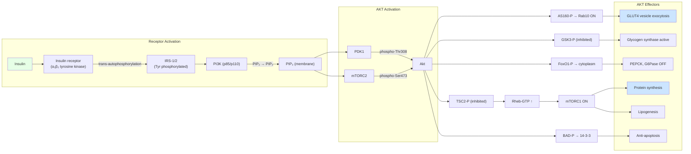
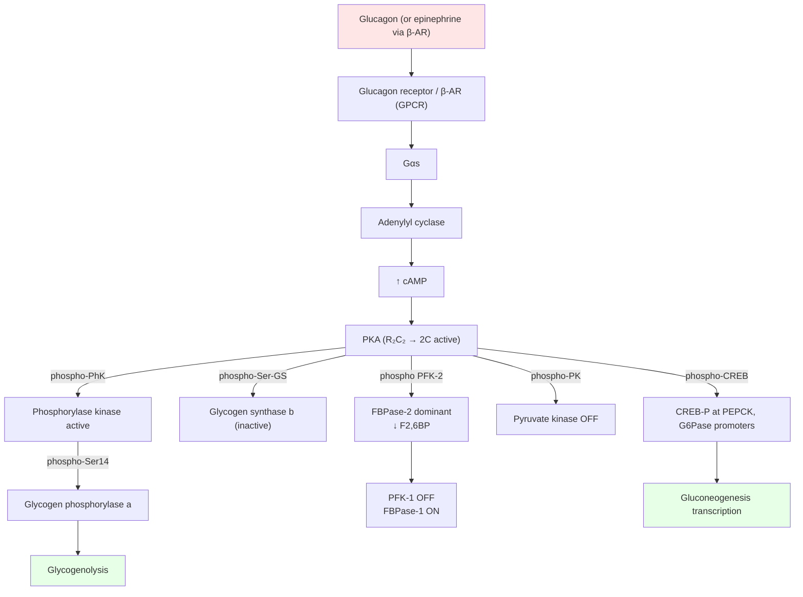
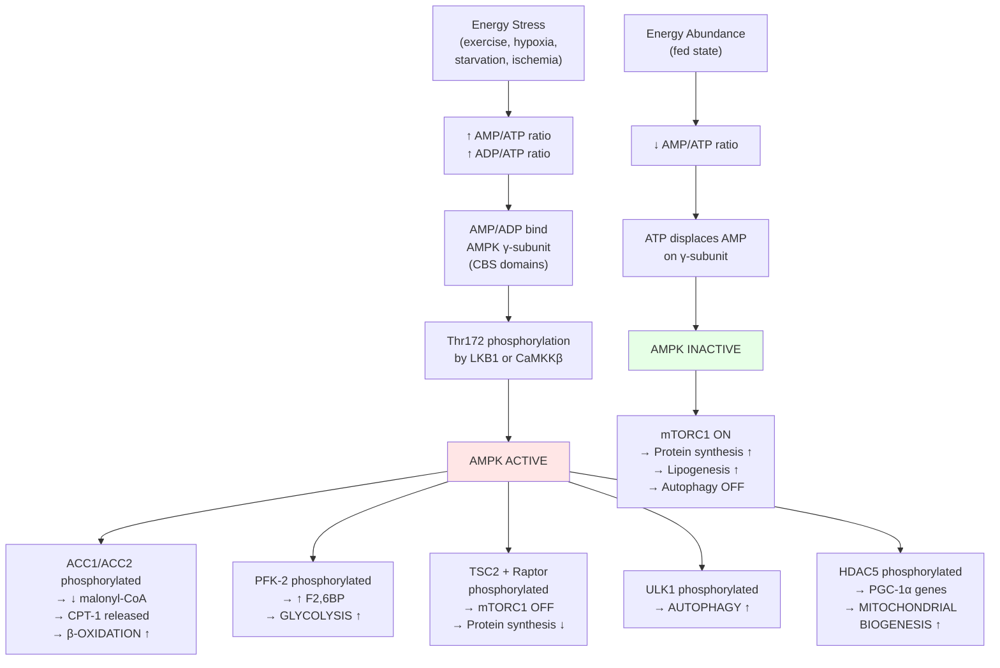
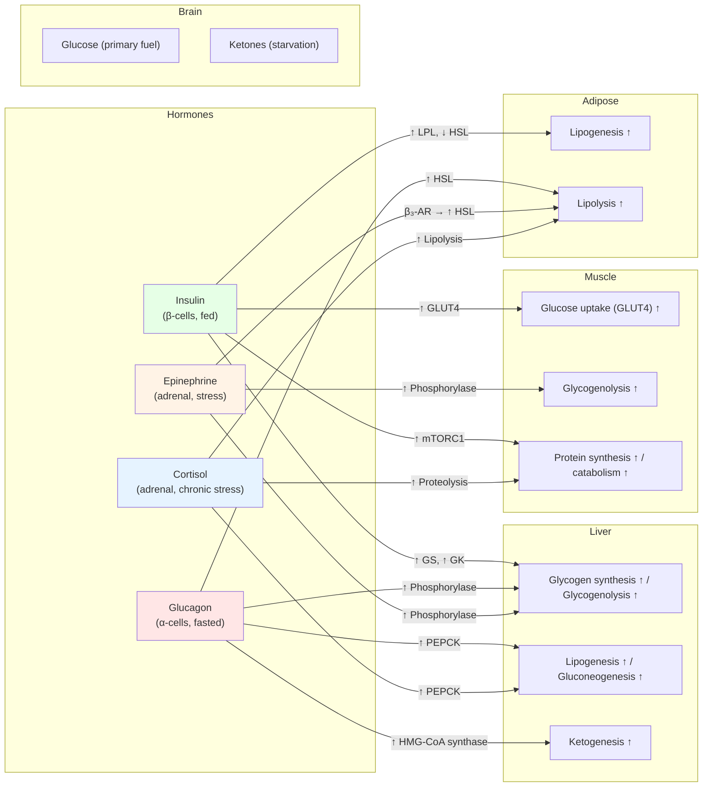

# Metabolic Integration and Regulation

\label{sec:unit_III_metabolic_integration}

\begin{figure}[htbp]
\centering
\includegraphics[width=0.9\textwidth]{../figures/atp_yield_comparison.png}
\caption{ATP yield per glucose for four catabolic strategies: anaerobic glycolysis (lactic-acid fermentation), ethanolic fermentation, fully aerobic respiration with the malate--aspartate shuttle, and aerobic respiration with the glycerol--phosphate shuttle. Stacked bars partition ATP into glycolysis, the TCA cycle, and oxidative phosphorylation. The order-of-magnitude jump between fermentation and aerobic respiration motivates the metabolic switching central to this chapter.}
\label{fig:unit_III_atp_yield_comparison}
\end{figure}

<!-- alt: Stacked bar chart of ATP yield per glucose for four catabolic pathways. Anaerobic glycolysis and ethanolic fermentation each yield about two ATP from glycolysis alone. The two aerobic columns add taller TCA-cycle and oxidative-phosphorylation segments, reaching roughly thirty ATP. -->


<!-- chapter-metadata-badge -->
> Level 3/3 · 60 min read · 100 min lecture · Prerequisites: \cref{sec:unit_III_bioenergetics_and_respiration}, \cref{sec:unit_III_photosynthesis}

## Learning Objectives

By the end of this chapter, you should be able to:

1. Trace how the cell coordinates catabolic and anabolic pathways through shared cofactors and [**allosteric**](#gl:allosteric) cross-regulation, and predict the metabolic state from cofactor and signal-molecule ratios.
2. Describe AMPK and mTORC1 as opposing energy-sensing hubs and explain how they toggle the metabolic state of the cell, including the molecular basis of mTOR's role as a nutrient sensor (Rag GTPases, Ragulator).
3. Describe the metabolic states of fed, post-absorptive, fasting, and starvation, including hormonal control and the timeline of fuel switching.
4. Explain insulin signaling in detail: the PI3K/Akt/mTOR pathway, [**GLUT4**](#gl:glut4) translocation mechanism, and glycogen synthesis.
5. Explain glucagon signaling: cAMP/PKA activation of glycogenolysis, gluconeogenesis, and the phosphorylase kinase cascade.
6. Distinguish allosteric from transcriptional metabolic regulation given an [**enzyme**](#gl:enzyme)-activity time-course, using gluconeogenesis bypass-enzyme control as the worked case.
7. Compare ATP yield and regulation of glucose versus fatty-acid oxidation, and calculate the net ATP yield from palmitoyl-CoA.
8. Explain ketone body metabolism and its role during starvation.
9. Describe AMPK structure (two catalytic + two regulatory subunits) and activation mechanisms (LKB1 vs CaMKKβ).
10. Trace flux control through the glucose-fatty-acid (Randle) cycle under fed versus fasted conditions, and predict the resulting respiratory quotient.
11. Define substrate (futile) cycles and explain their control advantages.
12. Explain obesity, metabolic syndrome, and insulin resistance at the molecular level, including visceral fat as an endocrine organ.
13. Apply metabolic control analysis (MCA): flux control coefficients $C_i^J$ and the summation theorem.
14. Calculate the adenylate energy charge from concentrations and predict the resulting AMPK activation state.
15. Describe modern metabolomics: NMR vs mass spectrometry approaches and identification challenges.

<!-- curriculum-scaffold-start -->
### Study Blueprint

- **Big idea:** Metabolism is a regulated network that reallocates flux across tissues, time, and nutrient states.
- **Core concepts:** flux, energy charge, hormonal control, fed/fasted states.
- **Framework alignment:** Vision & Change: Pathways and transformations of energy and matter, Systems; AP Biology: Energetics, Systems Interactions; NGSS-style topics: Matter and Energy in Organisms and Ecosystems.
- **Model or quantitative lens:** Energy charge, control points, and pathway-flux comparisons.
- **Data skill:** Use pathway evidence to infer which metabolic state or tissue is active.
- **Practice cadence:** Representing and Describing Data, Statistical Tests and Data Analysis.
- **Common misconception to repair:** A pathway is not a one-way assembly line; reversibility and regulation define the real route.
- **Primary lab:** \nameref{sec:lab_unit_III_metabolic_integration}.
- **Question bank:** \nameref{sec:q_unit_III_metabolic_integration}.
- **Transfer task:** Apply metabolic network reasoning to diabetes, fasting, exercise, or cancer metabolism.
- **Bridge to computation:** `biology.biochemistry.biochemistry.reaction_free_energy`.
<!-- curriculum-scaffold-end -->

---

> **Opening Vignette: The Brain on Ketones — Surviving Starvation**
>
> The human brain is extraordinarily metabolically demanding: it consumes roughly 20% of the
> body's resting energy budget despite constituting about 2% of body mass. Under normal conditions,
> it runs almost exclusively on glucose. But glucose stores — maintained as liver glycogen — last
> only about 12–24 hours of fasting. So how does the brain survive during prolonged starvation?
>
> The liver activates a metabolic program: free fatty acids released from adipose tissue are
> not completely oxidised within the liver itself. Instead, the liver packages their acetyl-CoA
> units into **ketone bodies** (acetoacetate and β-hydroxybutyrate) and exports them to the
> bloodstream. After 1–2 days of fasting, the brain begins importing ketones; after 3–5 days, it
> derives up to 75% of its energy from ketone bodies. Circulating ketone concentrations rise from
> ~0.1 mM (fed state) to 6–8 mM (prolonged starvation). This elegant metabolic switch —
> coordinated by insulin falling and glucagon rising — is one of the clearest examples of
> metabolic integration studied in this chapter.
>
> *Primary source: Owen, O. E. et al. (1967). Brain metabolism during fasting. Journal of Clinical Investigation, 46(10), 1589–1595.*

---

## Metabolic Pathways as Coupled Flux Networks

[**Glycolysis**](#gl:glycolysis), the TCA cycle, beta-oxidation, and biosynthetic pathways do not operate independently. They share intermediates, co-factors (NAD$^+$/NADH, NADP$^+$/NADPH, CoA), and are subject to **allosteric cross-regulation**. Integration of these pathways defines the **metabolic state** of the cell.

The two fundamental modes:
- **Catabolism** --- break down nutrients → ATP + reduced cofactors (NADH, FADH$_2$)
- **Anabolism** --- use ATP + reduced cofactors (chiefly NADPH) → biosynthesis of macromolecules

These modes are reciprocally regulated because of shared cofactors and master regulatory kinases. The metabolic state is encoded in:

: Study Blueprint: Signal molecule and Fed state (high energy). {#tbl:unit_III_metabolic_integration_study_blueprint}
| Signal molecule | Fed state (high energy) | Fasted state (low energy) |
| --------------- | ---------------------- | ------------------------ |
| AMP/ATP ratio | Low | High |
| NADH/NAD$^+$ ratio | High | Low (in [**cytoplasm**](#gl:cytoplasm)) |
| Acetyl-CoA | High | Low (cytoplasmic) |
| Citrate | High | Low |
| Malonyl-CoA | High | Low |
| Insulin/Glucagon ratio | High | Low |

```mermaid
flowchart LR
    subgraph FED ["FED STATE (Absorptive)"]
        direction TB
        F1["High blood glucose"] --> F2["Insulin secretion ↑"]
        F2 --> F3["Glycolysis ↑"]
        F2 --> F4["Glycogen synthesis ↑"]
        F2 --> F5["Lipogenesis ↑"]
        F2 --> F6["Protein synthesis ↑"]
        F2 --> F7["GLUT4 translocation"]
        F2 --> F8["mTORC1 ON"]
        F2 --> F9["AMPK OFF"]
    end

    subgraph FASTED ["FASTED STATE (Post-absorptive)"]
        direction TB
        FA1["Low blood glucose"] --> FA2["Glucagon secretion ↑"]
        FA2 --> FA3["Glycogenolysis ↑"]
        FA2 --> FA4["Gluconeogenesis ↑"]
        FA2 --> FA5["β-oxidation ↑"]
        FA2 --> FA6["Lipolysis ↑"]
        FA2 --> FA7["AMPK ON"]
        FA2 --> FA8["mTORC1 OFF"]
        FA2 --> FA9["Autophagy ↑"]
    end

    subgraph STARVED ["STARVATION (>72 h)"]
        direction TB
        S1["Very low glucose"] --> S2["Ketogenesis ↑↑"]
        S2 --> S3["Brain uses ketones<br/>(60% of fuel)"]
        S1 --> S4["Muscle protein<br/>catabolism ↓<br/>(protein sparing)"]
        S1 --> S5["Gluconeogenesis<br/>from glycerol + AAs"]
    end

    FED -->|"4-6 h after meal"| FASTED
    FASTED -->|">72 h"| STARVED

    style FED fill:#e6ffe6
    style FASTED fill:#fff3e6
    style STARVED fill:#ffe6e6
```


<!-- alt: Flowchart showing metabolic states from fed to starvation, showing the hormonal switches and metabolic pathway changes at each stage. Insulin dominates the fed state; glucagon dominates fasting; ketogenesis sustains the brain during starvation. -->

*Metabolic states from fed to starvation, showing the hormonal switches and metabolic pathway changes at each stage. Insulin dominates the fed state; glucagon dominates fasting; ketogenesis sustains the brain during starvation.*

### Fasting Physiology: Fuel Switch Timeline

The body switches fuels in a programmed sequence as fasting progresses. The transitions are coordinated by falling insulin and rising glucagon (and later cortisol):

: Fasting Physiology: Fuel Switch Timeline: Time post-meal and Predominant fuel. {#tbl:unit_III_metabolic_integration_fasting_physiology_fuel_switch_timeline}
| Time post-meal | Predominant fuel | Liver process | Brain fuel | Notes |
| -------------- | --------------- | ------------- | ---------- | ----- |
| 0–4 h (absorptive) | Dietary glucose | Glycogenesis, lipogenesis | Glucose | Insulin high, glucagon low |
| 4–12 h (post-absorptive) | Liver glycogen | Glycogenolysis | Glucose | Glucagon rises |
| 12–24 h (early fasting) | Liver glycogen → muscle FA | Glycogen depleting; gluconeogenesis ramping | Glucose (mostly from GNG) | Liver glycogen mostly depleted by ~24 h |
| 1–3 days | Muscle FA + early ketones | Gluconeogenesis (lactate, alanine, glycerol); ketogenesis starting | Glucose 75%, ketones 25% | Cortisol rises; protein catabolism increases |
| 3–7 days | Ketones | Maximal ketogenesis | Glucose 25%, ketones 75% | Brain adapts; muscle protein sparing |
| > 1–2 weeks | Ketones (sustained) | Ketogenesis at steady state | Ketones 65–75%, glucose 25–35% | Resting metabolic rate falls ~20% |
| > 30+ days (starvation) | Body protein (terminal) | Gluconeogenesis from muscle protein dominates | Glucose 50%, ketones 50% | Death imminent when ~50% of protein lost |

This fuel-switching timeline is one of the most elegant examples of metabolic integration. It is also clinically relevant: bariatric surgery, ketogenic diets, and prolonged fasting interventions most exploit (or perturb) this same switch.

> **Concept Check 1:** Why is it essential that glycolysis and gluconeogenesis are reciprocally regulated and rarely fully active simultaneously? What would happen if both ran at maximum rate?

---

## Insulin Signaling: The PI3K/Akt/mTOR Pathway

Insulin is the master anabolic [**hormone**](#gl:hormone), secreted by pancreatic beta-cells in response to elevated blood glucose \citep{sanger1955insulin,yalow1959}. Its signaling cascade is one of the most important in metabolic regulation:

\begin{equation}
\text{Insulin} \to \text{IR (RTK)} \to \text{IRS-1/2} \to \text{PI3K} \to \text{PIP}_3 \to \text{PDK1 + mTORC2} \to \text{Akt (Thr308 + Ser473)}
\label{eq:unit_III_metabolic_integration_worked_1}
\end{equation}


<!-- alt: Flowchart showing insulin receptor activation recruits IRS proteins, PI3K, Akt, and mTOR-linked targets to promote glucose uptake, glycogen synthesis, and anabolic metabolism. -->

*Insulin receptor activation recruits IRS proteins, PI3K, Akt, and mTOR-linked targets to promote glucose uptake, glycogen synthesis, and anabolic metabolism.*

*Insulin signaling cascade from receptor to downstream metabolic and growth effects (Mermaid).* Akt is the central node, integrating PDK1 (Thr308) and mTORC2 (Ser473) phosphorylations to drive glucose uptake, glycogen synthesis, lipogenesis, and protein synthesis.

**Downstream Akt targets:**

: Fasting Physiology: Fuel Switch Timeline: Target and Akt effect. {#tbl:unit_III_metabolic_integration_fasting_physiology_fuel_switch_timeline_2}
| Target | Akt effect | Metabolic outcome |
| ------ | ---------- | ----------------- |
| AS160 (TBC1D4) | Phosphorylation → Rab-GAP inactivated | **GLUT4 vesicle exocytosis** → glucose uptake |
| GSK3 (glycogen synthase kinase 3) | Phosphorylation → inhibited | **Glycogen synthase active** → glycogen synthesis |
| FoxO1 | Phosphorylation → nuclear exclusion | **PEPCK and G6Pase [**gene**](#gl:gene)s OFF** → gluconeogenesis inhibited |
| TSC2 | Phosphorylation → inhibited | **mTORC1 activated** → [**protein**](#gl:protein) synthesis, lipogenesis |
| BAD | Phosphorylation → binds 14-3-3 | **Anti-apoptotic** → cell survival |
| PDE3B | Phosphorylation → activated | **cAMP degradation** → opposes glucagon |

**GLUT4 translocation mechanism (in detail):**

1. **Basal state.** GLUT4 is sequestered in specialized intracellular vesicles (GSVs, GLUT4 storage vesicles) ~95% of the time, with about 5% at the plasma membrane. The vesicles are tethered by the inhibitory Rab-GAP **AS160 (TBC1D4)**, which keeps Rab10 in its GDP-bound (inactive) state.
2. **Insulin signal.** Akt phosphorylates AS160 on multiple sites (Thr642 most important), inhibiting its GAP activity.
3. **Rab10 activation.** With AS160 off, Rab10 accumulates in the GTP-bound active state, promoting vesicle docking at the plasma membrane.
4. **SNARE-mediated fusion.** Synaptobrevin-2 (VAMP2) on GSVs engages plasma-membrane syntaxin-4 + SNAP-23, driving membrane fusion.
5. **GLUT4 exposure.** GLUT4 appears at the cell surface, increasing glucose uptake 10–20-fold.
6. **Endocytosis on signal termination.** When insulin signal ends, GLUT4 is endocytosed back to GSVs via clathrin-coated pits and a slow constitutive recycling pathway.

In type 2 diabetes, this cascade is disrupted at multiple levels (see clinical box below) so that GLUT4 translocation is impaired even at high circulating insulin.

> **Clinical Connection: Insulin Resistance and Type 2 Diabetes**
> In type 2 diabetes, insulin signaling is impaired at multiple levels:
> 1. **IRS-1 serine phosphorylation** (by JNK, PKC-theta, IKK-beta) prevents tyrosine phosphorylation by the [**insulin receptor**](#gl:insulin-receptor)
> 2. **Ceramide accumulation** activates PP2A, which dephosphorylates Akt
> 3. **DAG accumulation** activates PKC-epsilon (liver) and PKC-theta (muscle), which phosphorylate IRS-1 on inhibitory serine residues
> 4. **ER stress** (from lipid overload) activates JNK → IRS-1 Ser307 phosphorylation
> The net result: GLUT4 translocation is impaired, glycogen synthesis is reduced, and gluconeogenesis is not suppressed. Metformin (first-line therapy) works partly through AMPK activation and partly through inhibition of mitochondrial Complex I. see \cref{sec:unit_II_cell_signaling} for RTK signaling.

> **Concept Check 2:** Thiazolidinediones (e.g., rosiglitazone) activate PPAR-gamma in adipose tissue, increasing adipocyte differentiation and lipid storage. Explain how increasing fat storage in adipose tissue could paradoxically improve insulin sensitivity in muscle and liver.

---

## Glucagon Signaling: cAMP/PKA Pathway

Glucagon is secreted by pancreatic alpha-cells when blood glucose falls. It acts primarily on the **liver** (hepatocytes express glucagon receptors; muscle does not), where cyclic-AMP signaling translates hormone binding into metabolic control \citep{sutherland1958cyclicamp}:

**Glucagon → Glucagon receptor (GPCR) → G$_s$ → Adenylyl cyclase → cAMP → PKA**


<!-- alt: Flowchart showing glucagon and epinephrine activate GPCR-cAMP-PKA signaling, shifting liver metabolism toward glycogen breakdown and gluconeogenesis during fasting or stress. -->

*Glucagon and epinephrine activate GPCR-cAMP-PKA signaling, shifting liver metabolism toward glycogen breakdown and gluconeogenesis during fasting or stress.*

*Glucagon (or epinephrine) signaling cascade in the liver (Mermaid).* The cAMP/PKA cascade simultaneously activates glycogenolysis (via phosphorylase kinase) and gluconeogenesis (via CREB transcription) while suppressing glycolysis (via PFK-2/pyruvate kinase phosphorylation).

### The Phosphorylase Kinase Cascade — A Signal Amplifier

The chain glucagon → GPCR → cAMP → PKA → **phosphorylase kinase** (PhK) → glycogen phosphorylase is one of biology's most elegant amplification cascades \citep{sutherland1958cyclicamp}. Each step amplifies the signal:

: The Phosphorylase Kinase Cascade — A Signal Amplifier: Step and Numerical amplification. {#tbl:unit_III_metabolic_integration_the_phosphorylase_kinase_cascade_a_signal_amplifier}
| Step | Numerical amplification |
| ---- | ----------------------- |
| 1 glucagon → 1 receptor (1:1) | 1× |
| 1 receptor → ~100 Gα$_s$ activated (during signal) | ~100× |
| 1 adenylyl cyclase → ~100 cAMP/sec | ~100× |
| 4 cAMP → 1 PKA holoenzyme dissociation (releases 2 catalytic subunits) | gating |
| 1 PKA → ~100 phosphorylase kinase | ~100× |
| 1 PhK → ~100 phosphorylase b → a | ~100× |
| 1 phosphorylase a → ~100 glucose-1-P/sec | ~100× |
| **End-to-end amplification** | **~10$^7$–10$^8$** |

A single glucagon binding event releases a burst of ~10$^7$ glucose-1-phosphate molecules within seconds. This is how a signal at femtomolar hormone concentrations produces a millimolar metabolite response.

**PKA targets in the liver:**

: The Phosphorylase Kinase Cascade — A Signal Amplifier: Target and PKA effect. {#tbl:unit_III_metabolic_integration_the_phosphorylase_kinase_cascade_a_signal_amplifier_2}
| Target | PKA effect | Metabolic outcome |
| ------ | ---------- | ----------------- |
| Phosphorylase kinase | Activated | Glycogen phosphorylase activated → **glycogenolysis** |
| Glycogen synthase | Inhibited (phosphorylated) | Glycogen synthesis OFF |
| PFK-2/FBPase-2 | FBPase-2 activated → F2,6BP destroyed | **Glycolysis inhibited** |
| Pyruvate kinase | Inhibited (phosphorylated) | Glycolysis slowed |
| CREB | Activated | **PEPCK and G6Pase gene [**transcription**](#gl:transcription)** → gluconeogenesis |
| IP3R | Sensitised | Ca$^{2+}$ release from ER |
| HSL (adipose, via β-AR) | Activated | Lipolysis (in adipose; not liver) |

---

## Gluconeogenesis and Fasting Glucose Supply

Gluconeogenesis synthesizes glucose from non-carbohydrate precursors (lactate, glycerol, glucogenic amino acids). It occurs primarily in the **liver** and to a lesser extent in the **kidney cortex**.

Gluconeogenesis is NOT simply the reverse of glycolysis. Three irreversible glycolytic steps require **bypass enzymes**:

: The Phosphorylase Kinase Cascade — A Signal Amplifier: Glycolytic step (irreversible) and Gluconeogenic bypass. {#tbl:unit_III_metabolic_integration_the_phosphorylase_kinase_cascade_a_signal_amplifier_3}
| Glycolytic step (irreversible) | Gluconeogenic bypass | Location |
| ------------------------------ | -------------------- | -------- |
| Pyruvate kinase (PEP → Pyruvate) | **Pyruvate carboxylase** (Pyruvate → OAA; biotin, ATP) + **PEPCK** (OAA → PEP; GTP) | Mitochondria + cytoplasm |
| PFK-1 (F6P → F1,6BP) | **Fructose-1,6-bisphosphatase (FBPase-1)** | Cytoplasm |
| Hexokinase (Glucose → G6P) | **Glucose-6-phosphatase (G6Pase)** | ER membrane (liver, kidney primarily) |

**Cost:** 6 ATP equivalents per glucose synthesized (4 ATP + 2 GTP).

**Regulation of gluconeogenesis:**
- **Allosteric:** Pyruvate carboxylase activated by acetyl-CoA; FBPase-1 inhibited by AMP and F2,6BP
- **Hormonal:** Glucagon (via CREB) induces PEPCK and G6Pase genes; insulin (via FoxO1) represses them
- **Reciprocal with glycolysis:** F2,6BP activates PFK-1 (glycolysis) and inhibits FBPase-1 (gluconeogenesis), ensuring they do not run simultaneously

> **Concept Check 3:** Ethanol metabolism in the liver generates excess NADH (from alcohol dehydrogenase and aldehyde dehydrogenase). Predict the effect of heavy alcohol consumption on gluconeogenesis and the risk of hypoglycaemia.

---

## Glycogen Metabolism and Rapid Glucose Storage

### Glycogen Branching and Granule Architecture

Glycogen is a branched polymer of glucose units:
- **Alpha-1,4 linkages:** linear chains (~8--12 glucose units between branch points)
- **Alpha-1,6 linkages:** branch points (~every 8--12 residues)
- **Glycogenin:** self-glucosylating primer protein at the core

Liver glycogen (~100 g): blood glucose [**buffer**](#gl:buffer). Muscle glycogen (~400 g): local fuel for contraction (rarely exported as glucose because muscle lacks G6Pase).

### Glycogen Synthase and Glycogen Phosphorylase Regulation

**Glycogen phosphorylase:** Cleaves alpha-1,4 linkages from non-reducing ends, releasing glucose-1-phosphate. Regulated by:
- **Allosteric activation:** AMP (muscle); glucose (liver, inhibitory)
- **Covalent modification:** Phosphorylase kinase phosphorylates Ser14 → active **a** form
- **Hormonal cascade:** Glucagon/epinephrine → cAMP → PKA → phosphorylase kinase → phosphorylase a

**Glycogen synthase:** Adds UDP-glucose to non-reducing ends (alpha-1,4 linkages). Active when dephosphorylated (GSK3 phosphorylates → inactive; insulin inhibits GSK3 → GS active).

**Branching enzyme:** Transfers ~7-residue segments to create alpha-1,6 branches. Increases solubility and number of non-reducing ends (more rapid mobilization).

**Debranching enzyme:** Bifunctional: transferase activity moves 3 residues from branch, then alpha-1,6-glucosidase cleaves the branch point, releasing free glucose.

> **Clinical Connection: Glycogen Storage Diseases**
> | Type | Enzyme deficiency | Features |
> | ---- | ----------------- | -------- |
> | I (von Gierke) | Glucose-6-phosphatase | Severe hypoglycaemia, hepatomegaly, lactic acidosis |
> | II (Pompe) | Lysosomal alpha-glucosidase | Cardiac/skeletal myopathy; treated by ERT |
> | V (McArdle) | Muscle glycogen phosphorylase | Exercise intolerance; "second wind" phenomenon |
> | VII (Tarui) | Muscle PFK | Exercise intolerance, hemolytic anemia |

---

## Fatty Acid Oxidation (Beta-Oxidation)

Beta-oxidation occurs in the **mitochondrial matrix** and degrades fatty acyl-CoA by removing 2-carbon units (acetyl-CoA) per cycle.

### Activation and Transport

1. **Activation:** Fatty acid + CoA + ATP → Acyl-CoA + AMP + PP$_i$ (acyl-CoA synthetase; outer mitochondrial membrane; costs 2 ATP equivalents)
2. **Carnitine shuttle:** Acyl-CoA cannot cross the IMM. Instead:
   - **CPT-1** (outer face of IMM): acyl-CoA + carnitine → acylcarnitine + CoA
   - **Translocase (CACT):** acylcarnitine crosses IMM
   - **CPT-2** (inner face of IMM): acylcarnitine + CoA → acyl-CoA + carnitine

**CPT-1 is the rate-limiting step** of beta-oxidation. **Malonyl-CoA** (the first committed intermediate of fatty acid synthesis) **allosterically inhibits CPT-1**, ensuring that fatty acid synthesis and oxidation do not occur simultaneously.

### Beta-Oxidation Steps (Each Cycle)

: Beta-Oxidation Steps (Each Cycle): Step and Enzyme. {#tbl:unit_III_metabolic_integration_beta_oxidation_steps_each_cycle}
| Step | Enzyme | Reaction | Product |
| ---- | ------ | -------- | ------- |
| 1 | Acyl-CoA dehydrogenase | Acyl-CoA → trans-enoyl-CoA | **FADH$_2$** |
| 2 | Enoyl-CoA hydratase | trans-enoyl-CoA + H$_2$O → L-3-hydroxyacyl-CoA | -- |
| 3 | 3-Hydroxyacyl-CoA DH | L-3-hydroxyacyl-CoA → 3-ketoacyl-CoA | **NADH** |
| 4 | Thiolase | 3-ketoacyl-CoA + CoA → acyl-CoA(n-2) + acetyl-CoA | **Acetyl-CoA** |

Each cycle: removes 2 carbons as acetyl-CoA, produces 1 FADH$_2$ + 1 NADH.

### ATP Yield from Palmitoyl-CoA (C16:0)

Summing the products of complete fatty-acid oxidation makes the "fat is
energy-dense" claim quantitative; the chapter-opening \cref{fig:unit_III_atp_yield_comparison} already showed the corresponding glucose-substrate comparison across fermentative and aerobic strategies. Palmitoyl-CoA (16 carbons) undergoes 7 cycles
of beta-oxidation:

: ATP Yield from Palmitoyl-CoA (C16:0): Product and Quantity. {#tbl:unit_III_metabolic_integration_atp_yield_from_palmitoyl_coa_c16_0}
| Product | Quantity | ATP per unit | Total ATP |
| ------- | -------- | ------------ | --------- |
| Acetyl-CoA (via TCA) | 8 | 10 (3 NADH x 2.5 + 1 FADH$_2$ x 1.5 + 1 GTP) | 80 |
| FADH$_2$ (beta-oxidation) | 7 | 1.5 | 10.5 |
| NADH (beta-oxidation) | 7 | 2.5 | 17.5 |
| Activation cost | | -2 | -2 |
| **Net total** | | | **106** |

Some textbooks report 108 ATP (using older P/O ratios) or 129 ATP (including palmitate rather than palmitoyl-CoA, and using maximal P/O ratios). The exact number depends on assumed H$^+$/ATP stoichiometry and shuttle costs. The key insight: fatty acids are energy-dense (~9 kcal/g vs. 4 kcal/g for carbohydrates) because they are highly reduced.

> **Clinical Connection: MCAD Deficiency**
> Medium-chain acyl-CoA dehydrogenase (MCAD) deficiency is the most common inherited disorder of fatty acid oxidation (~1:10,000 births). During fasting, patients cannot oxidise medium-chain fatty acids, leading to hypoketotic hypoglycaemia (low ketones because acetyl-CoA production is impaired, low glucose because gluconeogenesis lacks acetyl-CoA stimulation of pyruvate carboxylase). Fatal Reye-like episodes can occur. Management: avoid prolonged fasting; ensure regular carbohydrate intake.

---

## Fatty Acid Synthesis

Fatty acid synthesis occurs in the **cytoplasm** and uses fundamentally different chemistry from beta-oxidation:

: ATP Yield from Palmitoyl-CoA (C16:0): Feature and Beta-oxidation. {#tbl:unit_III_metabolic_integration_atp_yield_from_palmitoyl_coa_c16_0_2}
| Feature | Beta-oxidation | Fatty acid synthesis |
| ------- | -------------- | -------------------- |
| Location | Mitochondrial matrix | Cytoplasm |
| Carrier | CoA | ACP (acyl carrier protein) |
| Reducing agent | FAD, NAD$^+$ (oxidised) | NADPH (reduced) |
| 2C unit | Acetyl-CoA (removed) | Malonyl-CoA (added) |
| Key enzyme | Multiple separate enzymes | **FAS** (fatty acid synthase, one large multifunctional enzyme in animals) |
| Regulation | Inhibited by malonyl-CoA | Activated by citrate; inhibited by palmitoyl-CoA |

**Acetyl-CoA carboxylase (ACC)** catalyses the committed step: acetyl-CoA + CO$_2$ + ATP → malonyl-CoA. This is the key regulatory enzyme:
- **Activated by:** citrate (allosteric), insulin (dephosphorylation)
- **Inhibited by:** palmitoyl-CoA (product inhibition), AMPK phosphorylation (energy depletion), glucagon (via PKA)

---

## Ketone Body Metabolism

During prolonged fasting (>24--48 h), the liver converts excess acetyl-CoA from fatty acid oxidation into **ketone bodies**: acetoacetate, beta-hydroxybutyrate, and acetone.

**Synthesis (liver mitochondria):**
1. 2 Acetyl-CoA → Acetoacetyl-CoA (thiolase)
2. Acetoacetyl-CoA + Acetyl-CoA → HMG-CoA (HMG-CoA synthase)
3. HMG-CoA → Acetoacetate + Acetyl-CoA (HMG-CoA lyase)
4. Acetoacetate → beta-Hydroxybutyrate (beta-hydroxybutyrate DH; uses NADH)
5. Acetoacetate → Acetone (non-enzymatic decarboxylation; exhaled)

**Utilization (brain, heart, muscle):**
Beta-hydroxybutyrate → acetoacetate → acetoacetyl-CoA (via succinyl-CoA transferase, also called thiophorase) → 2 acetyl-CoA → TCA cycle.

**Key points:**
- The liver **cannot use** ketone bodies (lacks thiophorase)
- The brain normally uses primarily glucose but during starvation adapts to derive **~60--70%** of its energy from ketone bodies, sparing muscle protein
- This protein-sparing effect is essential for survival during prolonged fasting
- Diabetic ketoacidosis (DKA): uncontrolled type 1 diabetes → absent insulin → massive lipolysis → excessive ketone body production → metabolic acidosis ([**pH**](#gl:ph) <7.3), dehydration, potentially fatal

> **Concept Check 4:** Why can the liver produce ketone bodies but not use them? What is the physiological advantage of this arrangement?

---

## AMPK --- The Cellular Energy Gauge

**AMPK** (AMP-activated protein kinase) is a heterotrimer with **two catalytic α-subunits** (α1 and α2 isoforms), **two regulatory β-subunits** (β1, β2), and the **γ-subunit** that binds adenine nucleotides — though the assembled holoenzyme is α$_1$β$_1$γ$_1$. (The classic textbook description is that AMPK is "two catalytic + two regulatory subunits" referring to the assembly's binary modules: the catalytic α/β pair and the regulatory β/γ pair.) The γ-subunit contains four CBS (cystathionine β-synthase) domains, of which three bind adenine nucleotides — AMP, ADP, and ATP — competitively. This competitive binding lets the γ-subunit *integrate* the entire adenylate pool, not just one ratio.


<!-- alt: Graph showing AMPK as the cellular energy sensor. Low energy activates AMPK, which simultaneously promotes catabolic pathways and inhibits anabolic pathways. High energy inactivates AMPK, allowing mTORC1-driven anabolism. -->

*AMPK as the cellular energy sensor. Low energy activates AMPK, which simultaneously promotes catabolic pathways and inhibits anabolic pathways. High energy inactivates AMPK, allowing mTORC1-driven anabolism.*

> **Concept Check (Analysis --- Cross-Unit Connection):** In biochemistry, "free energy" (Gibbs free energy [**ΔG**](#gl:free-energy)) governs whether a reaction proceeds spontaneously. In \nameref{sec:unit_0_unit_intro}, "variational free energy" in the Free Energy Principle refers to an information-theoretic bound on surprise. These are not coincidentally named: both measure the gap between a system's current state and its expected (equilibrium or predicted) state. (a) Show that ATP hydrolysis (ΔG° ≈ −30 kJ/mol under standard conditions, but ~−50 kJ/mol in a cell where [ADP]/[ATP] ≈ 0.01) reflects the cell maintaining its biochemical states far from equilibrium --- in what sense does AMPK serve as the cell's "prediction error detector" for energy state? (b) Cellular respiration (glucose oxidation) couples a favorable reaction (ΔG ≈ −2880 kJ/mol) to multiple unfavorable ones (ATP synthesis) --- explain this as an example of how living systems use free energy to minimize biological surprise (maintain homeostasis).

### AMPK Activation: LKB1 vs CaMKKβ

AMPK is activated when its catalytic α-subunit is phosphorylated at **Thr172**. Two upstream kinases phosphorylate this site under different physiological conditions:

: AMPK Activation: LKB1 vs CaMKKβ: Upstream kinase and Trigger. {#tbl:unit_III_metabolic_integration_ampk_activation_lkb1_vs_camkk}
| Upstream kinase | Trigger | Tissue distribution | Pathological connection |
| --------------- | ------- | ------------------- | ---------------------- |
| **LKB1** (STK11) | Energy stress (high AMP); allosterically primed by AMP binding to AMPK γ | Ubiquitous; constitutively active | Loss-of-function = Peutz-Jeghers syndrome, predisposes to gastrointestinal cancers |
| **CaMKKβ** | Elevated cytosolic Ca$^{2+}$ (independent of AMP) | Brain, muscle, T cells, endothelium | Important in T-cell activation, osmotic stress |
| **TAK1** | Inflammatory cytokines (TGF-β, TNF-α) | Limited | Crosstalk between inflammation and metabolism |

**LKB1 is the dominant kinase under classical energy stress** (exercise, hypoxia, starvation): AMP binding to AMPK γ promotes LKB1 docking and Thr172 phosphorylation, while simultaneously protecting Thr172 from dephosphorylation by PP2A and PP2C. AMP is therefore not simply an "activator" but an *allosteric primer* that shifts the AMPK steady state from dephosphorylated to phosphorylated.

**CaMKKβ provides a Ca$^{2+}$-coupled activation route** — for example, in muscle contraction (where Ca$^{2+}$ release accompanies ATP demand) or in T-cell activation following T-cell receptor engagement. This route runs **in parallel** to the AMP/LKB1 pathway and lets cells anticipate energy demand from Ca$^{2+}$ signals before AMP rises.

### Adenylate Energy Charge and Metabolic State

The **energy charge (EC)** of the adenylate system was introduced by Atkinson \citep{atkinson1968} as a single scalar that captures the fractional saturation of the adenylate pool with high-energy phosphate:

\begin{equation}
\text{E.C.} = \frac{[\text{ATP}] + \tfrac{1}{2}[\text{ADP}]}{[\text{ATP}] + [\text{ADP}] + [\text{AMP}]}
\label{eq:unit_III_energy_charge}
\end{equation}

The numerator counts each phosphoanhydride bond (ATP has two phosphoanhydrides, ADP has one), while the denominator counts the total adenylate pool. So E.C. = 1.0 means most adenylates are ATP; E.C. = 0 means most are AMP.

Most cells maintain EC approximately 0.85–0.95 \citep{atkinson1968}. AMPK is highly sensitive in the range EC = 0.70–0.85 — precisely the window where rising AMP signals impending energy crisis.

## Worked Example: Energy Charge

*Problem:* A resting skeletal-muscle biopsy gives adenylate pools of [ATP] = 5.0 µmol/g, [ADP] = 0.6 µmol/g, and [AMP] = 0.05 µmol/g. Calculate the energy charge and predict whether AMPK is active.

*Solution:*

**Step 1 --- State the relation and why ADP is half-weighted.** The energy charge measures the fractional saturation of the adenylate pool with transferable phosphoanhydride bonds:

$$EC = \frac{[\text{ATP}] + \tfrac{1}{2}[\text{ADP}]}{[\text{ATP}] + [\text{ADP}] + [\text{AMP}]}$$

ATP carries two high-energy phosphoanhydride bonds and ADP carries one, so on a per-adenylate basis ADP holds exactly half the transferable phosphate of ATP --- hence the $\tfrac{1}{2}$ weighting. The denominator is the conserved total adenylate pool ([ATP]+[ADP]+[AMP]), so $EC = 1$ when every adenylate is ATP and $EC = 0$ when every adenylate is AMP.

**Step 2 --- Substitute the measured µmol/g values.**

$$EC = \frac{5.0 + \tfrac{1}{2}(0.6)}{5.0 + 0.6 + 0.05}$$

Numerator: $5.0 + 0.5 \times 0.6 = 5.0 + 0.30 = 5.30$. Denominator: $5.0 + 0.6 + 0.05 = 5.65$. The shared µmol/g units cancel, so the ratio is dimensionless.

**Step 3 --- Compute and interpret against the AMPK threshold.**

\begin{equation}
EC = \frac{5.30}{5.65} = 0.938
\label{eq:unit_III_metabolic_integration_worked_2}
\end{equation}

At $EC = 0.938$ the pool sits in the normal resting band of 0.85--0.95 and well above the AMPK-activation window of 0.70--0.85. Predict: AMPK is largely inactive and the cell is in an energy-replete state favoring anabolism. A fall toward $EC \approx 0.80$ (rising AMP) would move the pool into the AMPK-sensitive window and switch the cell toward catabolism.

> **Clinical Connection: Metformin and AMPK**
> Metformin, the most widely prescribed diabetes drug, activates AMPK indirectly by inhibiting mitochondrial Complex I, which raises the AMP/ATP ratio. AMPK activation:
> - Increases glucose uptake in muscle
> - Inhibits hepatic gluconeogenesis (via CREB coactivator CRTC2 phosphorylation)
> - Reduces lipogenesis
> - May have anti-cancer effects (mTORC1 inhibition)
> Metformin is also being investigated as an anti-aging compound (TAME trial). see \cref{sec:unit_III_bioenergetics_and_respiration} for Complex I.

> **Worked Example --- Adenylate Energy Charge Under Ischemia:** A hepatocyte under aerobic conditions has: [ATP] = 4.2 mM, [ADP] = 0.85 mM, [AMP] = 0.12 mM. Calculate the adenylate energy charge: $EC = ([\text{ATP}] + 0.5[\text{ADP}]) / ([\text{ATP}] + [\text{ADP}] + [\text{AMP}]) = (4.2 + 0.5 \times 0.85) / (4.2 + 0.85 + 0.12) = (4.2 + 0.425) / 5.17 = 4.625 / 5.17 ≈ 0.894$. This is in the normal resting range (0.85--0.95). During 30 minutes of ischemia (no O$_2$): [ATP] falls to 0.4 mM, [ADP] rises to 1.8 mM, [AMP] rises to 3.0 mM. New $EC = (0.4 + 0.9) / (0.4 + 1.8 + 3.0) = 1.3/5.2 = 0.250$. AMPK half-maximal activation threshold is approximately $EC < 0.7$ → AMPK is now strongly activated. AMPK phosphorylates ACC (inhibiting fatty-acid synthesis) and promotes GLUT4 translocation. Predict: gluconeogenesis decreases (via PFKFB1/2 reshaping), glycolysis flux increases (PFK-1 is less inhibited by the now-depleted ATP pool), and mitochondrial biogenesis is up-regulated (PGC-1α phosphorylation) --- the cell switches from anabolic to maximally catabolic mode.

> **Concept Check (Synthesis):** During cancer metabolism (the Warburg effect), many cancer cells preferentially use aerobic glycolysis even in the presence of O$_2$, producing large amounts of lactate. (a) The Warburg effect yields a mere ~2 ATP per glucose vs. ~32 by OXPHOS --- why would cancer cells "choose" this seemingly inefficient strategy? Consider: ATP production *rate* (not yield), NADPH supply (via PPP shunt), and anabolic precursor availability (ribose, glycerol-3P, serine). (b) mTORC1 integrates signals from growth factors (Akt → TSC1/2 → Rheb), amino acids (Rag GTPases at the lysosome), and energy status (AMPK). Construct the logical circuit diagram showing how mTORC1 integrates these three inputs (Boolean: growth-factor AND amino-acid AND not-energy-stressed) and predict: what happens to protein synthesis when [glucose] drops 10-fold? (c) Metformin inhibits Complex I of the mitochondrial ETC (and also inhibits mitochondrial glycerophosphate dehydrogenase). Propose the metabolic logic for metformin's anti-cancer effect in terms of energy charge → AMPK → mTORC1 inhibition → reduced anabolic flux.


---

## Worked Example: Flux Control Coefficient

*Problem:* In an isolated hepatocyte preparation, a small activator raises PFK-1 activity by 20% and the measured glycolytic flux rises by 5%. A separate manipulation raises the pyruvate-transporter activity by 30% and flux rises by 3%. Calculate each flux control coefficient and determine which step exerts more control over glycolytic flux.

*Solution:*

**Step 1 --- State the operational form of the flux control coefficient.** For a small fractional change in enzyme activity, $C_i^J = \dfrac{\partial \ln J}{\partial \ln e_i}$ is approximated by the ratio of fractional changes:

\begin{equation}
C_i^J \approx \frac{\Delta J / J}{\Delta e_i / e_i}
\label{eq:unit_III_metabolic_integration_worked_3}
\end{equation}

**Step 2 --- Substitute for PFK-1.** Here $\Delta e/e = 0.20$ and $\Delta J/J = 0.05$:

\begin{equation}
C_{\text{PFK-1}}^{J} = \frac{0.05}{0.20} = 0.25
\label{eq:unit_III_metabolic_integration_worked_4}
\end{equation}

**Step 3 --- Substitute for the pyruvate transporter.** Here $\Delta e/e = 0.30$ and $\Delta J/J = 0.03$:

$$C_{\text{transporter}}^{J} = \frac{0.03}{0.30} = 0.10$$

**Step 4 --- Interpret against the summation theorem.** Both coefficients fall in the $C_i^J \approx 0.1$--$0.3$ band reported for glycolytic enzymes. PFK-1 ($C^J = 0.25$) exerts more than twice the flux control of the pyruvate transporter ($C^J = 0.10$), so PFK-1 is the more rate-controlling step here --- yet because \cref{eq:unit_III_mca_summation} requires $\sum_i C_i^J = 1$, these two steps together account for primarily $0.25 + 0.10 = 0.35$ of total control. The remaining $0.65$ is distributed across other enzymes: no single enzyme is *the* rate-limiting step, which is why an activator targeting PFK-1 alone produces primarily a fractional, not proportional, increase in flux.

---

## mTORC1 --- The Growth Integrator and Nutrient Sensor

**mTORC1** (mechanistic Target of Rapamycin Complex 1) integrates amino acid, glucose, oxygen, and growth factor signals:

: Adenylate Energy Charge and Metabolic State: Input and Sensing mechanism. {#tbl:unit_III_metabolic_integration_adenylate_energy_charge_and_metabolic_state}
| Input | Sensing mechanism | Outcome |
| ----- | ----------------- | ------- |
| Amino acids (Leu, Arg) | Rag GTPases (Sestrin2 senses Leu; CASTOR1 senses Arg) recruit mTORC1 to lysosomal surface | mTORC1 ON |
| Insulin/IGF-1 | PI3K → Akt → phosphorylates TSC2 → Rheb-GTP accumulates | mTORC1 ON |
| Glucose | Low glucose → AMPK → TSC2/Raptor phosphorylation | mTORC1 OFF |
| Oxygen | Hypoxia → REDD1 → TSC1/2 activation | mTORC1 OFF |

### Amino Acid Sensing: The Ragulator Complex and Lysosome

mTORC1 primarily senses amino acid sufficiency by being **physically positioned** on the lysosomal surface. The structure responsible is a multi-protein scaffold called the **Ragulator complex** (LAMTOR1–5) that anchors mTORC1 to the cytoplasmic face of the lysosomal membrane. The amino acid sensing cascade works as follows:

1. **Specific amino acid sensors** detect intracellular concentrations:
   - **Sestrin2** binds and is inhibited by **leucine** — when Leu is high, Sestrin2 is displaced and stops inhibiting GATOR2.
   - **CASTOR1** binds and is inhibited by **arginine** — same logic.
   - **SAMTOR** senses S-adenosylmethionine (a proxy for methionine).
   - **SLC38A9** senses lysosomal arginine and signals from the lysosomal membrane.
2. **GATOR1/2 GAP/GEF complex.** GATOR1 is a GAP for the Rag GTPases (turning them off); GATOR2 inhibits GATOR1. When sensors release inhibition of GATOR2, GATOR1 is suppressed, allowing the Rag GTPases to enter their active conformation.
3. **Active Rag GTPases** (RagA/B-GTP + RagC/D-GDP) bind Raptor (a subunit of mTORC1) and recruit mTORC1 to the lysosomal surface.
4. **At the lysosome**, mTORC1 encounters Rheb-GTP — provided that growth factor signaling has activated it via Akt → TSC2 inhibition → Rheb-GTP accumulation.
5. **Rheb-GTP fully activates mTORC1** kinase activity. Both signals (amino acids → Rag → lysosomal positioning *and* growth factors → Rheb-GTP) must converge.

This dual-input gating is why mTORC1 is sometimes described as a **coincidence detector**: it primarily signals "build" when both raw materials (amino acids) and external commands (insulin/IGF-1) are present.

### Rapamycin: Mechanism of Action

**Rapamycin** is a macrolide originally isolated from *Streptomyces hygroscopicus* on Easter Island (Rapa Nui). It binds to the immunophilin **FKBP12** in the cytoplasm; the FKBP12-rapamycin complex then binds to the FRB domain of mTOR within mTORC1, allosterically inhibiting kinase activity *primarily in the mTORC1 complex* (mTORC2 is largely unaffected on short timescales). This inhibition:
- Suppresses cap-dependent translation (4E-BP1 phosphorylation)
- Suppresses ribosome biogenesis (S6K1 phosphorylation)
- Activates autophagy
- Extends lifespan in yeast, worms, flies, and mice (~10–15% extension at low doses)

Rapamycin and analogs (rapalogues: everolimus, temsirolimus) are clinically approved as immunosuppressants (transplant rejection prevention) and anticancer agents (renal cell carcinoma, certain breast cancers). The TAME trial and large-scale rapamycin/metformin studies are testing rapalogues as longevity interventions in humans.

**AMPK and mTORC1 reciprocal inhibition** creates a **bistable metabolic switch:** energy-rich → mTORC1 on, AMPK off → anabolism; energy-depleted → AMPK on, mTORC1 off → catabolism + autophagy.

---

## The Randle Cycle (Glucose-Fatty Acid Cycle)

Proposed by Randle et al. (1963, *The Lancet*), the Randle cycle describes **reciprocal inhibition** between glucose and fatty acid oxidation in heart and skeletal muscle:

**When fatty acids are high → glucose utilization is suppressed:**
1. Beta-oxidation → elevated acetyl-CoA → **PDH kinase (PDK) activated** → PDH phosphorylated/inactivated → less pyruvate oxidation
2. Beta-oxidation → elevated citrate (exported to cytoplasm) → **PFK-1 allosterically inhibited** → glycolysis slows
3. Elevated intracellular acyl-CoA → PKC-theta (in muscle) → serine phosphorylation of **IRS-1** → impaired insulin signaling → reduced GLUT4 translocation

**When glucose is high → fatty acid oxidation is suppressed:**
1. Insulin → ACC activated → malonyl-CoA synthesis increases → **CPT-1 inhibited** → beta-oxidation blocked
2. Elevated NADH from glycolysis → inhibits beta-oxidation dehydrogenases

### Metabolic Flexibility Across Feeding and Fasting

**Metabolic flexibility** = the ability to switch between glucose and fat oxidation in response to fuel availability. Assessed by the respiratory quotient (RQ):

\begin{equation}
RQ = \frac{\text{CO}_2 \text{ produced}}{\text{O}_2 \text{ consumed}}
\label{eq:unit_III_metabolic_integration_worked_5}
\end{equation}

- RQ = 1.0: pure glucose oxidation
- RQ = 0.7: pure fat oxidation
- Healthy individuals: RQ ~0.95 post-meal → ~0.75 fasting (rapid switching)
- Obese/T2D individuals: RQ remains ~0.85 in fasting → "metabolic inflexibility"

---

## Hormonal Coordination at the Whole-Organism Level


<!-- alt: Graph showing hormonal coordination of metabolism across organs. Insulin (green) drives anabolic responses; glucagon (red) and cortisol (blue) drive catabolic responses. Each organ has distinct metabolic roles and receptor expression patterns. -->

*Hormonal coordination of metabolism across organs. Insulin (green) drives anabolic responses; glucagon (red) and [**cortisol**](#gl:cortisol) (blue) drive catabolic responses. Each organ has distinct metabolic roles and receptor expression patterns.*

: Metabolic Flexibility Across Feeding and Fasting: Hormone and Stimulus. {#tbl:unit_III_metabolic_integration_metabolic_flexibility_across_feeding_and_fasting}
| Hormone | Stimulus | Liver | Muscle | Adipose |
| ------- | -------- | ----- | ------ | ------- |
| Insulin | High glucose | Glycogen synthesis; lipogenesis; gluconeogenesis OFF | GLUT4; glycogen synthesis; protein synthesis | GLUT4; lipogenesis; lipolysis OFF |
| Glucagon | Low glucose | Glycogenolysis; gluconeogenesis ON; ketogenesis | Minimal (no glucagon receptor) | Lipolysis (via FFA release) |
| Epinephrine | Stress/exercise | Glycogenolysis; gluconeogenesis | Glycogenolysis; glucose uptake | Lipolysis (beta$_3$-AR → cAMP → PKA → HSL) |
| Cortisol | Chronic stress | Gluconeogenesis (PEPCK gene induction) | Protein catabolism → AAs for GNG | Lipolysis (central redistribution) |
| Leptin | Adiposity signal | Central: inhibits NPY/AgRP → appetite suppression | FA oxidation (via AMPK) | Lipogenesis suppressed |

---

## Substrate (Futile) Cycles

A **substrate cycle** involves two opposing metabolic reactions operating simultaneously:

\begin{equation}
\text{Fructose-6-P} + \text{ATP} \xrightarrow{\text{PFK-1}} \text{Fructose-1,6-BP} + \text{ADP}
\label{eq:unit_III_metabolic_integration_worked_6}
\end{equation}

\begin{equation}
\text{Fructose-1,6-BP} + \text{H}_2\text{O} \xrightarrow{\text{FBPase-1}} \text{Fructose-6-P} + \text{P}_i
\label{eq:unit_III_metabolic_integration_worked_7}
\end{equation}

Net reaction: ATP → ADP + P$_i$ (energy dissipated as heat)

**Why substrate cycles are useful (Newsholme hypothesis, 1984):**

\begin{equation}
\text{Amplification factor} = \frac{v_{\text{PFK}} + v_{\text{FBPase}}}{v_{\text{PFK}} - v_{\text{FBPase}}}
\label{eq:unit_III_metabolic_integration_worked_8}
\end{equation}

When both enzymes run at 50 U/min each and net flux is 1 U/min, a 10% change in PFK produces a 500% change in net flux --- **metabolic rheostat** behavior. Substrate cycles provide ultrasensitive flux control at the cost of ATP.

**Thermogenic substrate cycles:**
- **Brown adipose tissue (BAT):** UCP1 short-circuits the ETC proton gradient → heat (non-shivering thermogenesis)
- **Sarcolipin/SERCA cycle** in skeletal muscle: sarcolipin uncouples SERCA Ca$^{2+}$ pumping from Ca$^{2+}$ retention, dissipating ATP as heat
- **Insect flight muscle:** glycolytic futile cycles generate heat rapidly to reach flight temperature (~40 degrees C)

---

## Obesity and Metabolic Syndrome

Metabolic syndrome is a cluster of conditions (central obesity, insulin resistance, dyslipidaemia, hypertension, hyperglycaemia) that dramatically increase cardiovascular disease risk.

### Visceral Fat as an Endocrine Organ

The shift in our understanding of adipose tissue — from "passive triglyceride storage depot" to "active endocrine organ" — is one of the most consequential paradigm changes in metabolism research of the last 30 years. **Visceral adipose tissue (VAT)**, the fat depot surrounding intra-abdominal organs, behaves very differently from subcutaneous adipose tissue (SAT):

: Visceral Fat as an Endocrine Organ: Property and Subcutaneous adipose (SAT). {#tbl:unit_III_metabolic_integration_visceral_fat_as_an_endocrine_organ}
| Property | Subcutaneous adipose (SAT) | Visceral adipose (VAT) |
| -------- | -------------------------- | ---------------------- |
| Adipocyte size | Smaller, more uniform | Hypertrophic, heterogeneous |
| Lipolysis sensitivity to catecholamines | Modest | High (β$_3$-AR-driven) |
| Insulin sensitivity | High | Low |
| Drainage | Systemic circulation | **Hepatic portal vein** (direct to liver) |
| Macrophage infiltration | Low (fed state) | High (M1-skewed) |
| Adipokine output | Adiponectin > leptin | Leptin > adiponectin; ↑ TNF-α, IL-6, RBP4, MCP-1 |
| Cardiovascular disease risk | Modest | High |

The portal-vein drainage means that VAT lipolytic products (FFAs, glycerol) and pro-inflammatory cytokines (TNF-α, IL-6) hit the liver at much higher concentrations than they do peripheral tissues — driving hepatic insulin resistance, NAFLD, and a chronic low-grade systemic inflammatory state.

**Key adipokines:**

: Visceral Fat as an Endocrine Organ: Adipokine and Direction in obesity. {#tbl:unit_III_metabolic_integration_visceral_fat_as_an_endocrine_organ_2}
| Adipokine | Direction in obesity | Effect |
| --------- | -------------------- | ------ |
| **Leptin** | ↑ (proportional to fat mass) | Hypothalamic POMC/AgRP signaling — appetite suppression; resistance develops with chronic elevation |
| **Adiponectin** | ↓ in obesity | Insulin-sensitizing; AMPK activator; anti-inflammatory |
| **TNF-α** | ↑ (from infiltrating macrophages) | IRS-1 Ser phosphorylation via JNK/IKK-β |
| **IL-6** | ↑ | Hepatic CRP induction; insulin resistance in liver |
| **MCP-1** | ↑ | Recruits more macrophages → vicious cycle |
| **RBP4** | ↑ | Promotes hepatic gluconeogenesis |

**Molecular mechanisms of insulin resistance in obesity:**
1. **Lipid overflow:** Adipose tissue capacity exceeded → ectopic lipid deposition in liver (NAFLD) and muscle
2. **DAG accumulation** → PKC-epsilon (liver) / PKC-theta (muscle) → IRS-1 Ser phosphorylation
3. **Ceramide accumulation** → PP2A activation → Akt dephosphorylation
4. **Adipose inflammation:** Hypertrophic adipocytes secrete TNF-alpha, IL-6, MCP-1 → macrophage infiltration → chronic low-grade inflammation → JNK/IKK-beta activation → IRS-1 serine phosphorylation
5. **ER stress:** Lipid overload overwhelms ER folding capacity → UPR → JNK → IRS-1 serine phosphorylation
6. **Mitochondrial dysfunction:** Incomplete fatty acid oxidation → ROS → oxidative stress → insulin resistance

> **Clinical Connection: GLP-1 Receptor Agonists**
> Glucagon-like peptide-1 (GLP-1) receptor agonists (semaglutide, liraglutide, tirzepatide) have revolutionised treatment of both type 2 diabetes and obesity. They:
> - Enhance glucose-dependent insulin secretion
> - Suppress glucagon secretion
> - Slow gastric emptying (satiety)
> - Act on hypothalamic appetite centers (weight loss of 15--20%)
> - Reduce cardiovascular events and NAFLD progression
> Tirzepatide is a dual GIP/GLP-1 receptor agonist achieving even greater weight loss (~22.5% in trials).

> **Concept Check 5:** Explain why [**aerobic**](#gl:aerobic) exercise improves insulin sensitivity even without weight loss. Consider the effects of exercise on AMPK, GLUT4, mitochondrial biogenesis, and intramyocellular lipid turnover.

---

## Metabolic Control Analysis

**Metabolic control analysis (MCA)** provides a quantitative framework for understanding how control of metabolic flux is distributed among pathway enzymes \citep{atkinson1968}.

**Flux control coefficient ($C_i^J$):** The fractional change in pathway flux ($J$) caused by a fractional change in enzyme activity ($e_i$), with most other variables held constant:

\begin{equation}
C_i^J = \frac{e_i}{J} \cdot \frac{\partial J}{\partial e_i} = \frac{\partial \ln J}{\partial \ln e_i}
\label{eq:unit_III_metabolic_integration_worked_9}
\end{equation}

Each $C_i^J$ ranges from 0 (this enzyme has no control over flux) to ~1 (this enzyme has near-total control). Negative values are possible for enzymes that produce inhibitors of the pathway.

**Summation theorem:** The combined flux control coefficients in a pathway sum to 1:

\begin{equation}
\sum_i C_i^J = 1
\label{eq:unit_III_mca_summation}
\end{equation}

This means control is **shared** among most enzymes, not concentrated at a single "rate-limiting step." In practice, one or a few enzymes may have larger $C_i^J$ values, but the concept of a single rate-limiting step is an oversimplification.

For example, in glycolysis under physiological conditions, the flux control coefficients for hexokinase, PFK-1, pyruvate kinase, and the pyruvate transporter are most in the range $C_i^J \approx 0.1$–$0.3$ — no single enzyme dominates, and the precise distribution shifts with cellular state. This is why drug therapies that target a single glycolytic enzyme often have surprisingly modest effects on overall flux: the pathway redistributes control.

### Metabolomics: Measuring the Metabolic State

**Metabolomics** is the systematic measurement of small-molecule metabolites — the experimental complement to MCA, since you cannot compute flux control coefficients without measuring concentrations and fluxes.

: Metabolomics: Measuring the Metabolic State: Approach and Sensitivity. {#tbl:unit_III_metabolic_integration_metabolomics_measuring_the_metabolic_state}
| Approach | Sensitivity | Resolution | Strengths | Weaknesses |
| -------- | ----------- | ---------- | --------- | ---------- |
| **NMR** ($^1$H, $^{13}$C, $^{31}$P) | µM–mM (~10$^4$ molecules) | Quantitative; structure-resolving | Non-destructive; absolute quantification; detects isomers | Lower sensitivity than MS; needs ~mg sample; chemical-shift overlap in complex mixtures |
| **LC-MS** (HILIC + reversed phase) | nM–µM (~10$^7$ molecules) | High sensitivity | Targeted and untargeted; broad metabolite coverage | Ionization bias (different molecules ionize differently); matrix effects; needs MS$^2$ for confident ID |
| **GC-MS** | nM (with derivatisation) | Very reproducible spectra | Mature databases (NIST, GMD); quantitative | Requires volatile derivatives; not most metabolites compatible |
| **CE-MS** | nM | Polar/charged metabolites | Excellent for phosphometabolites, amines | Low robustness; less mature databases |
| **Imaging MS (DESI/MALDI-MSI)** | µM | Spatially resolved | Tissue-level metabolic mapping | Lower mass accuracy than LC-MS; no separation step |

**Key challenges:**

1. **Identification.** A typical untargeted LC-MS run detects 5,000–30,000 features but about 10–20% can be confidently identified. The remaining "dark metabolome" comprises mass spectra with no database match — a major bottleneck.
2. **Compartmentation.** Metabolomics typically homogenises tissue, losing information about which metabolites were in mitochondria vs cytoplasm vs lysosome. Subcellular metabolomics (genetically encoded sensors, organelle isolation) is an emerging frontier.
3. **Flux ≠ concentration.** A high concentration of an intermediate may reflect either high flux through that step *or* a downstream block. Stable-isotope tracing ($^{13}$C-glucose, $^{15}$N-glutamine) is required to measure fluxes, not concentrations.

These data feed directly into MCA models: combining flux measurements (from $^{13}$C tracing) with elasticity coefficients (from in vitro enzyme kinetics) gives an empirical $C_i^J$ for each enzyme, validating or revising textbook claims about which step is "rate-limiting."

> **Concept Check 6:** A drug increases hexokinase activity by 50% in muscle. From fasting biopsies, the flux control coefficient $C_{HK}^J$ for hexokinase in glycolysis was estimated at 0.2. Use \cref{eq:unit_III_mca_summation} to predict the maximum fractional change in glycolytic flux. Why is the prediction an upper bound, not a precise value?

> **Concept Check 7:** A patient with chronic alcohol consumption shows elevated NADH/NAD$^+$ ratio in cytoplasm and impaired gluconeogenesis. Using \cref{eq:unit_III_energy_charge}, predict whether the energy charge is preserved or depressed, and explain why fasting hypoglycaemia is a clinical risk.

---

## Computational Bridge

Drug effects on pathway enzymes are often framed like competitive inhibitors shifting apparent $K_m$. The biochemistry module exposes both curves numerically:

```python
from biology.biochemistry import michaelis_menten, competitive_inhibition

base = michaelis_menten(4.0, Vmax=100.0, Km=5.0)
blocked = competitive_inhibition(4.0, 100.0, 5.0, inhibitor_conc=5.0, Ki=2.5)
print(round(base.reaction_rate, 2), round(blocked.reaction_rate, 2))
```

> **Clinical / systems note:** Metformin, SGLT2 inhibitors, and GLP-1 agonists reshape the same integrative network (hepatic glucose output, peripheral uptake, renal glucose loss) that insulin and glucagon command --- illustrating multi-node control rather than a single "rate-limiting" hormone.

---

## Current Evidence and Frontier Biology: Metabolic Integration and Regulation

For **Metabolic Integration and Regulation**, frontier biology belongs inside the evidence logic of
the chapter. Metabolism is now studied as a regulated network constrained by energy, redox balance, compartmentation, and environment. The core reading question is this: metabolic integration depends on compartmentation, hormone state, nutrient availability, and time scale.

- **What to verify:** identify the observation, model, assay, or dataset that
  would make the claim stronger or weaker.
- **What to qualify:** state the scale, organism, cell type, environmental
  condition, or population where the claim is expected to hold.
- **What to compare:** test at least one alternative explanation, baseline, or
  null model before treating the pattern as causal.
- **What to cite:** distinguish primary evidence, review synthesis, public
  dataset, and institutional guidance; for recent or numeric claims, prefer
  the source closest to the measurement and state what has changed since it was
  published.

A strong metabolic-integration claim names the organ, hormone signal, substrate flux, fed-fasting state, and timescale of compensation.

**Source practice:** For whole-body metabolism claims, connect pathway logic to fluxomics, hormone measurements, tissue state, or clinical biomarkers rather than pathway membership alone.

## Summary

- **AMPK** (heterotrimer of two catalytic α + two regulatory β/γ modules) is activated by elevated AMP/ATP and ADP/ATP through Thr172 phosphorylation by **LKB1** (energy stress) or **CaMKKβ** (Ca$^{2+}$); it promotes catabolism (β-oxidation, glycolysis) and inhibits mTORC1 and anabolism; activates autophagy (via ULK1) and mitochondrial biogenesis (via PGC-1α).
- **mTORC1** (activated by insulin + amino acids + oxygen) is positioned at the lysosome by Rag GTPases bound to the **Ragulator complex**; full activation requires both amino acid–driven lysosomal recruitment *and* growth factor–driven Rheb-GTP. **Rapamycin** (FKBP12 complex) inhibits mTORC1.
- **Energy charge** \cref{eq:unit_III_energy_charge} captures the fractional saturation of the adenylate pool with high-energy phosphate; cells maintain E.C. ≈ 0.85–0.95.
- **Insulin** (PI3K/Akt/mTOR pathway) drives GLUT4 translocation, glycogen synthesis, lipogenesis, and suppresses gluconeogenesis. The phosphorylase kinase / GLUT4-vesicle / 14-3-3-BAD effectors are characteristic Akt outputs.
- **Glucagon** (cAMP/PKA cascade) drives glycogenolysis (via phosphorylase kinase), gluconeogenesis (via CREB transcription), and ketogenesis. The hormonal cascade amplifies the signal ~10$^7$-fold from femtomolar hormone to millimolar metabolite.
- **Gluconeogenesis** uses four bypass enzymes (pyruvate carboxylase, PEPCK, FBPase-1, G6Pase) and costs 6 ATP equivalents per glucose.
- **Beta-oxidation** yields ~106 ATP per palmitoyl-CoA; CPT-1 is rate-limiting and inhibited by malonyl-CoA.
- **Ketone bodies** (acetoacetate, β-hydroxybutyrate) sustain the brain during starvation; liver produces but cannot use them. Fasting fuel switching follows a programmed timeline from glycogen → fatty acids → ketones over hours-to-weeks.
- **Randle cycle:** fatty acid–glucose reciprocal inhibition; disrupted in type 2 diabetes.
- **Substrate cycles** enable ultrasensitive flux control and thermogenesis; amplification factor = (v$_1$ + v$_2$)/(v$_1$ - v$_2$).
- **Metabolic flexibility** (RQ switching) is impaired in obesity/T2D due to lipid intermediate accumulation and insulin resistance.
- **Metabolic control analysis** (\cref{eq:unit_III_mca_summation}) shows that flux control is distributed, not concentrated at a single rate-limiting step.
- **Metabolomics** (NMR + LC-MS) provides the empirical basis for MCA, with $^{13}$C tracing distinguishing flux from concentration.
- **Visceral adipose** is a metabolically active endocrine organ whose portal-vein drainage drives hepatic insulin resistance, NAFLD, and chronic systemic inflammation.
- **Connections:** See \cref{sec:unit_II_cell_signaling} for [**signal transduction**](#gl:signal-transduction) to mTOR, \nameref{sec:unit_IX_unit_intro} for endocrine first messengers, and \cref{sec:unit_I_enzymes_and_kinetics} for enzyme-level kinetics.

---

## Review Questions

1. A patient presents with an inherited loss-of-function [**mutation**](#gl:mutation) in LKB1 (the primary AMPK upstream kinase). Predict four metabolic consequences in skeletal muscle during fasting.

2. Derive the energy charge equation (\cref{eq:unit_III_energy_charge}). If [ATP] = 3.5 mM, [ADP] = 0.8 mM, [AMP] = 0.2 mM, calculate EC. Is AMPK likely to be active?

3. Describe the insulin signaling cascade from receptor binding to GLUT4 translocation, including the role of AS160, Rab10, and the SNARE complex. At which steps does insulin resistance develop in type 2 diabetes?

4. Compare gluconeogenesis with glycolysis. Identify the three bypass reactions and explain why they are necessary.

5. Calculate the ATP yield from complete oxidation of palmitoyl-CoA (C16:0) to CO$_2$ and H$_2$O, showing most sources of ATP.

6. Explain ketone body synthesis and utilization. Why can the brain use ketone bodies but the liver cannot? Sketch the fuel-switching timeline from fed to 30-day fast.

7. The Randle cycle operates in heart muscle. In a patient with type 2 diabetes and chronically elevated plasma FFA: predict changes in cardiac PDH activity, cardiac efficiency, and susceptibility to ischemia.

8. Compare the amplification advantages of the PFK-1/FBPase-1 substrate cycle in liver with UCP1-mediated thermogenesis in brown adipose tissue.

9. Explain how metformin improves glycaemic control. Describe its effects on Complex I, AMPK, and hepatic gluconeogenesis.

10. Describe three molecular mechanisms by which obesity causes insulin resistance. For each, identify the lipid species involved and the downstream kinase that phosphorylates IRS-1.

11. Using the [**competitive inhibition**](#gl:competitive-inhibition) example in the bridge, explain why simply raising substrate concentration can overcome some drug interactions but not others (hint: $K_m^{app}$ vs. $V_\mathrm{max}$).

12. Estimate energy charge for [ATP]=2 mM, [ADP]=1.5 mM, [AMP]=0.5 mM. Is AMPK more likely active than at EC ≈ 0.9?

13. Describe how mTORC1 is recruited to the lysosomal surface by amino acid availability. What is the role of Sestrin2, GATOR1/2, and the Rag GTPases? Why is mTORC1 a "coincidence detector" rather than a single-input sensor?

14. Sketch the phosphorylase kinase amplification cascade and estimate the end-to-end signal gain from a single glucagon binding event to released glucose-1-phosphate. Why is this amplification physiologically necessary?

15. Compare the contributions of subcutaneous and visceral adipose tissue to whole-body insulin resistance in obesity. Why does visceral fat have a disproportionate effect on hepatic outcomes?

16. Compare NMR and LC-MS as metabolomics platforms. Which is preferable for (a) absolute quantification of glucose in serum, (b) discovery of unknown lipid species in muscle biopsies, (c) compartment-resolved metabolomics in subcellular fractions?

---


## Further Reading and Source Notes: Metabolic Integration and Regulation

- Atkinson (1968). The regulation of enzyme activity in metabolism. *Biochemical Journal*, 108 \citep{atkinson1968}.
- Mitchell (1961). Coupling of phosphorylation to electron and hydrogen transfer by a chemi-osmotic type of mechanism. *Nature*, 191 \citep{mitchell1961}.
- Hardie, Ross & Hawley (2012). AMPK: a nutrient and energy sensor that maintains energy homeostasis. *Nature Reviews Molecular Cell Biology*, 13.
- Saxton & Sabatini (2017). mTOR signaling in growth, metabolism, and disease. *Cell*, 168.
- Randle, Garland, Hales & Newsholme (1963). The glucose fatty-acid cycle. *The Lancet*, 281.

---

## Key Terms

: Metabolomics: Measuring the Metabolic State: Term and Definition. {#tbl:unit_III_metabolic_integration_metabolomics_measuring_the_metabolic_state_2}
| Term | Definition |
| ---- | ---------- |
| **AMPK** | AMP-activated protein kinase; principal energy-sensing kinase; activated by elevated AMP/ATP via LKB1 or by Ca$^{2+}$ via CaMKKβ |
| **mTORC1** | Mechanistic target of rapamycin complex 1; growth-promoting kinase; activated by insulin, amino acids, and growth factors at the lysosomal surface |
| **Ragulator** | Lysosomal scaffold (LAMTOR1–5) that anchors Rag GTPases and recruits mTORC1 in response to amino acid availability |
| **Energy charge (EC)** | ([ATP] + 1/2[ADP]) / ([ATP]+[ADP]+[AMP]); normal EC approximately 0.85--0.95 |
| **Insulin** | Anabolic hormone from beta-cells; PI3K/Akt/mTOR pathway; drives glucose uptake, glycogen synthesis, lipogenesis |
| **Glucagon** | Catabolic hormone from alpha-cells; cAMP/PKA; drives glycogenolysis, gluconeogenesis, ketogenesis |
| **Gluconeogenesis** | Synthesis of glucose from non-carbohydrate precursors; liver and kidney; costs 6 ATP |
| **CPT-1** | Carnitine palmitoyl transferase-1; rate-limiting for mitochondrial fatty acid import; inhibited by malonyl-CoA |
| **Ketone bodies** | Acetoacetate, beta-hydroxybutyrate, acetone; liver-produced; brain fuel during starvation |
| **Phosphorylase kinase** | Multi-subunit kinase activated by PKA; phosphorylates glycogen phosphorylase to active "a" form |
| **Randle cycle** | Reciprocal inhibition of glucose and fatty acid oxidation in heart and muscle |
| **Substrate cycle** | Two opposing reactions running simultaneously; amplifies flux control; generates heat |
| **Metabolic flexibility** | Ability to switch between glucose and fat oxidation; impaired in obesity and T2D |
| **SIRT1** | NAD$^+$-dependent deacetylase; caloric restriction sensor; activates PGC-1alpha |
| **Metabolic syndrome** | Cluster of central obesity, insulin resistance, dyslipidaemia, hypertension, hyperglycaemia |
| **Visceral adipose tissue** | Fat depot draining via portal vein to liver; endocrine organ secreting TNF-α, IL-6, RBP4 |
| **Adipokines** | Hormones secreted by adipose tissue (leptin, adiponectin, resistin, RBP4); regulate appetite and insulin sensitivity |
| **Warburg effect** | Aerobic glycolysis in cancer cells; rapid ATP + biosynthetic precursors |
| **Metabolic control analysis** | Quantitative framework for flux control distribution; summation theorem: sum of $C_i^J$ = 1 |
| **Metabolomics** | Systematic measurement of small-molecule metabolites; NMR and LC-MS as principal platforms |

---

## Companion Source Module: Metabolic Integration and Regulation

**Metabolic Integration and Regulation** should leave a reproducible trail from a biological claim to
the code, figure, diagram, or paper-based activity that can test it. Use the
surfaces below to inspect the chapter's assumptions, rerun the relevant model,
or compare the manuscript explanation with companion labs and figures.

: Companion source surfaces for Metabolic Integration and Regulation. {#tbl:unit_III_metabolic_integration_companion_source_surfaces}
| Surface | Use it for |
| --- | --- |
| `src/biology/biochemistry/biochemistry.py` (`glycolysis_summary`, `atp_free_energy`, `reaction_free_energy`) | Connect pathway summaries to energy and redox constraints. |
| `src/biology/physiology/physiology.py` (`homeostasis_response`) | Compare cellular flux regulation with organism-level homeostasis. |
| `src/mermaid/biology_diagrams.py` (`glycolysis_pathway_diagram`, `hormone_signaling_diagram`) | Link metabolic pathways to endocrine control. |

**Reproducibility check:** state fed/fasted status, tissue, compartment, and time scale before predicting pathway priority. **Cross-reference:** use \cref{sec:unit_III_bioenergetics_and_respiration}, \cref{sec:unit_I_enzymes_and_kinetics}, and \cref{sec:unit_IX_endocrine_signaling,sec:unit_IX_immune_system_defense}.
