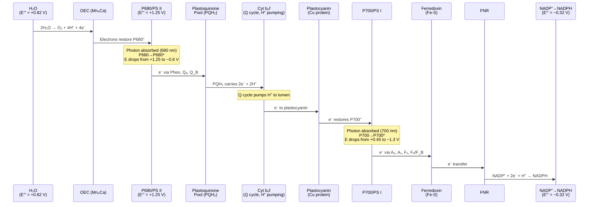
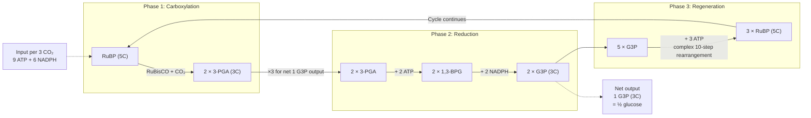
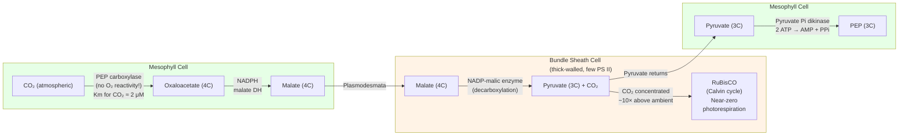
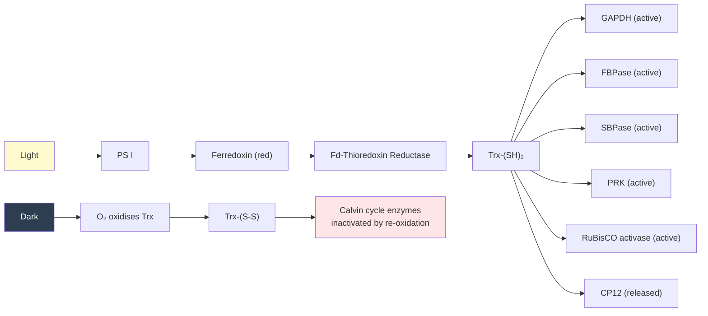
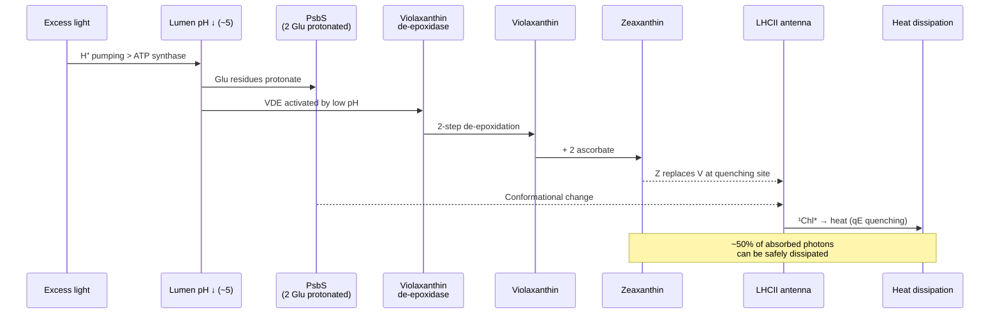
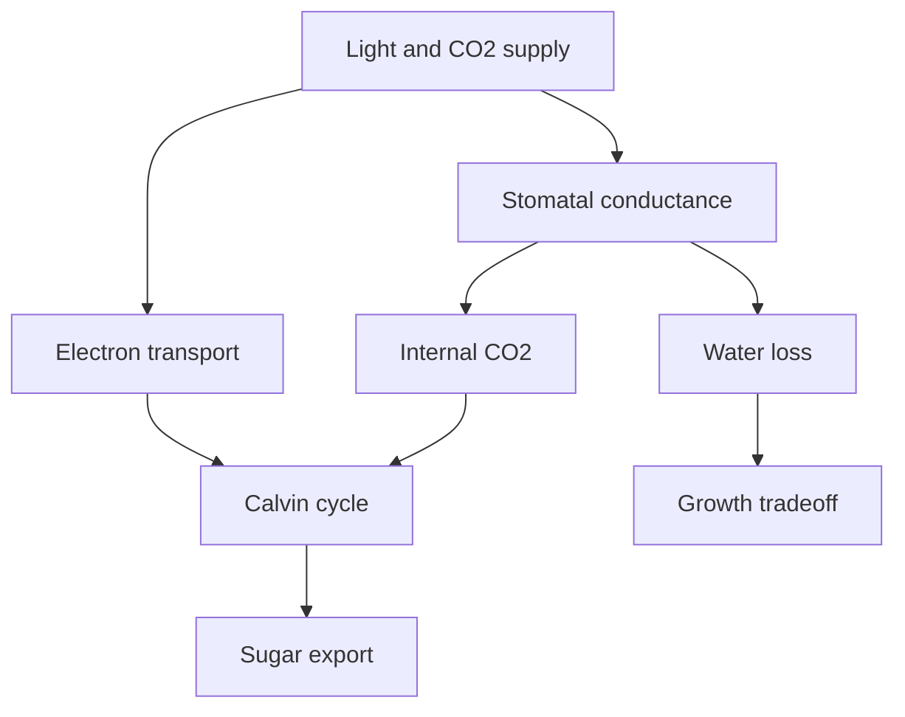

# Photosynthesis

\label{sec:unit_III_photosynthesis}


<!-- chapter-metadata-badge -->
> Level 2/3 · 55 min read · 75 min lecture · Prerequisites: \cref{sec:unit_III_bioenergetics_and_respiration}

## Learning Objectives

1. Describe [**chloroplast**](#gl:chloroplast) structure and the organization of the photosynthetic membrane.
2. Explain the light-harvesting antenna complexes, chlorophyll a/b ratio, and energy transfer mechanisms (FRET, exciton transfer).
3. Compute the energy of a photon and convert per-molecule values to per-mole values for biological calculations.
4. Describe Photosystem II, water splitting, and the Kok cycle in detail.
5. Explain the cytochrome b$_6$f complex and the Q cycle in chloroplasts.
6. Describe Photosystem I, linear and cyclic electron flow, and NADPH production.
7. Explain the Z-scheme of photosynthetic electron transport, including standard electrode potentials of each carrier.
8. Describe the three phases of the [**Calvin cycle**](#gl:calvin-cycle), including RuBisCO biochemistry, structure (L$_8$S$_8$), catalytic mechanism, and the CO$_2$/O$_2$ specificity factor (τ).
9. Explain the thioredoxin/ferredoxin redox regulation system and the activating role of stromal pH and Mg$^{2+}$.
10. Explain photorespiration and its metabolic costs.
11. Compare C3, C4, and CAM [**photosynthesis**](#gl:photosynthesis) strategies and their water-use efficiency, including quantitative trade-offs.
12. Evaluate photoprotection (NPQ, xanthophyll cycle) and artificial photosynthesis research as responses to excess light and energy demand.
13. Calculate ATP and NADPH requirements per CO$_2$ fixed; compare biological and artificial photosynthesis efficiencies.

<!-- curriculum-scaffold-start -->
### Study Blueprint

- **Big idea:** Photosynthesis couples light-driven electron flow to carbon fixation and planetary productivity.
- **Core concepts:** photosystems, electron transport, Calvin cycle, photorespiration.
- **Framework alignment:** Vision & Change: Pathways and transformations of energy and matter, Systems; AP Biology: Energetics, Systems Interactions; NGSS-style topics: Matter and Energy in Organisms and Ecosystems.
- **Model or quantitative lens:** Photon, ATP/NADPH, and Calvin-cycle stoichiometry.
- **Data skill:** Interpret light-response and carbon-fixation data.
- **Practice cadence:** Representing and Describing Data, Statistical Tests and Data Analysis.
- **Common misconception to repair:** Plants do not eat sunlight; they use light energy to reduce carbon using electrons and enzymes.
- **Primary lab:** \nameref{sec:lab_unit_III_photosynthesis}.
- **Question bank:** \nameref{sec:q_unit_III_photosynthesis}.
- **Transfer task:** Transfer photosynthetic constraints to crops, algae, climate, or ecosystem productivity.
- **Bridge to computation:** `biology.botany.botany.photosynthesis_rate`.
<!-- curriculum-scaffold-end -->

---

> **Opening Vignette: Tracing Carbon From Air to Sugar**
>
> In 1950, Melvin Calvin's team at the Lawrence Berkeley National Laboratory began exposing algae
> (*Chlorella*) to ¹⁴CO₂ — carbon dioxide labeled with radioactive carbon-14 — for very brief
> intervals (as short as 5 seconds), then rapidly killing the cells and separating their compounds
> by two-dimensional paper chromatography. By tracking which molecules became radioactively
> labeled first, then in which order, Calvin meticulously traced the path of carbon atoms from
> atmospheric CO₂ through a cycle of enzymatic reactions to eventually emerge as glucose. The
> complete cycle — the **Calvin-Benson-Bassham cycle** — was published in 1954, and Calvin
> received the Nobel Prize in Chemistry alone in 1961.
>
> The cycle's key [**enzyme**](#gl:enzyme), **RuBisCO** (ribulose-1,5-bisphosphate carboxylase/oxygenase), is
> arguably the most important enzyme on Earth: it is responsible for fixing approximately
> 10¹¹ tonnes of atmospheric carbon per year, feeding essentially most non-chemotrophic life.
> It is also probably the most abundant [**protein**](#gl:protein) on Earth (approximately 0.7 kg per person on the
> planet's surface, an estimated 7 × 10⁸ tonnes total), and notably one of the slowest enzymes
> known, with a kcat of about 3–10 s⁻¹. Improving RuBisCO efficiency is one of the holy grails
> of agricultural biotechnology.
>
> *Primary source: Calvin, M. & Benson, A. A. (1948). The path of carbon in photosynthesis. Science, 107(2784), 476–480.*

---

## Photosynthesis as Light-Driven Carbon Fixation

Photosynthesis is one of Earth's dominant chemical processes: it fixes approximately **120 Gt of carbon** from CO$_2$ per year, sustains atmospheric oxygen, and supports nearly every heterotrophic food web.

\begin{equation}
6\text{CO}_2 + 6\text{H}_2\text{O} \xrightarrow{\text{light}} \text{C}_6\text{H}_{12}\text{O}_6 + 6\text{O}_2 \quad (\Delta G^{\circ\prime} = +2{,}870 \; \text{kJ/mol})
\label{eq:unit_III_photosynthesis_overall}
\end{equation}

The reaction is highly endergonic --- it requires light energy to drive it. Photosynthesis occurs in the chloroplast (**plants and algae**) and at the plasma membrane (**cyanobacteria**). The process can be divided into:

1. **Light-dependent reactions** (thylakoid membrane): H$_2$O → O$_2$ + NADPH + ATP
2. **Light-independent reactions / Calvin cycle** (stroma): CO$_2$ + ATP + NADPH → G3P (sugar)

### Chloroplast Structure and Thylakoid Compartments

- **Outer envelope:** freely permeable (porin-like channels)
- **Inner envelope:** selective transporters (triose phosphate / phosphate antiporter, TPT)
- **Thylakoid membrane:** site of light reactions; forms stacked **grana** (5--20 thylakoids per granum) + interconnecting **stroma lamellae**
- **Lumen (thylakoid lumen):** acidified ([**pH**](#gl:ph) ~5) by proton pumping; ~1,000-fold H$^+$ gradient
- **Stroma:** site of Calvin cycle; contains RuBisCO, enzymes, chloroplast DNA, 70S [**ribosome**](#gl:ribosome)s

Thylakoid membranes are densely packed with protein complexes --- ~70% protein by mass, making them one of the most protein-rich membranes in nature. Each reaction center is associated with ~250 antenna [**chlorophyll**](#gl:chlorophyll) molecules.

**Chloroplast [**genome**](#gl:genome):** 120--200 kb circular DNA; encodes ~120 [**gene**](#gl:gene)s including RuBisCO large subunit, photosystem subunits, and ribosomal components. Like mitochondria, chloroplasts originated from [**endosymbiosis**](#gl:endosymbiosis) (cyanobacteria; see \cref{sec:unit_II_cell_theory}).

---

## Light Absorption and Energy Transfer

### Photosynthetic Pigments and Light Absorption

Chlorophylls absorb light primarily at:

- **Chlorophyll a:** 430 nm (blue-violet) and 680 nm (red)
- **Chlorophyll b:** 450 nm and 640 nm (broader absorption; accessory pigment)
- **Carotenoids:** 400--500 nm; β-carotene, lutein, zeaxanthin; also transfer energy to Chl a; function as photoprotectants

The **green wavelengths (~500--600 nm)** are reflected --- hence plant color.

### Photon Energy and Quantum Efficiency

A **photon** of red light (λ = 680 nm) carries:

\begin{equation}
E = \frac{hc}{\lambda} = \frac{(6.626 \times 10^{-34}\;\text{J·s})(3 \times 10^8\;\text{m/s})}{680 \times 10^{-9}\;\text{m}} = 2.93 \times 10^{-19}\;\text{J} = 1.82\;\text{eV}
\label{eq:unit_III_photon_energy}
\end{equation}

Per mole: $E = N_A \times E_{\text{photon}} = 176\;\text{kJ/mol}$.

By comparison, blue light (440 nm) photons carry ~272 kJ/mol — substantially more energy than red. The "red drop" in photosynthetic action spectra reflects the fact that energy in excess of the redox requirement is dissipated as heat *whichever* photon is absorbed; longer-wavelength light is therefore proportionally more efficient on a per-photon basis.

**Quantum yield of photosynthesis:** The quantum yield (Φ) is the molecules of product per photon absorbed. Two important quantum yields are defined:

- **Φ$_{\text{O}_2}$** ≈ 0.10–0.12 mol O$_2$ per mol photons absorbed (under optimal conditions)
- **Φ$_{\text{CO}_2}$** ≈ 0.08–0.10 mol CO$_2$ per mol photons (lower because of photorespiration in C3)

The **minimum quantum requirement** (1/Φ) is therefore ~8–10 photons per O$_2$ released — close to the theoretical minimum of 8 photons (4 photons through PS II + 4 through PS I per O$_2$ produced). The remaining inefficiency reflects energy losses in antenna transfer, NPQ activation, and photorespiration.

**Quantum efficiency (energy basis):**

\begin{equation}
\eta_{\text{quantum}} = \frac{n_{\text{electrons}} \cdot \Delta E_{\text{redox}}}{n_{\text{photons}} \cdot E_{\text{photon}}}
\label{eq:unit_III_quantum_efficiency}
\end{equation}

For the Z-scheme: 4 electrons span 1.14 V from H$_2$O to NADPH, requiring ~440 kJ/mol of electron flow. With 8 photons of 680 nm light supplying ~1,408 kJ/mol, the redox efficiency is ~31% — the rest is consumed by overpotentials and dissipated as heat.

**Comparison with engineered photovoltaics.** A commercial single-junction silicon solar cell at 22% efficiency converts solar irradiance into electricity that must then power *something* — and the chain from electricity → stored chemical fuel adds losses. Plants, by contrast, deliver a stored fuel (sugar) directly. The artificial-photosynthesis discussion returns to this comparison; \cref{eq:unit_III_quantum_efficiency} sets the upper biological bound.

### Antenna Complexes and Light-Harvesting Architecture

Each reaction center in plants is served by a peripheral antenna of **light-harvesting complexes (LHC)**. LHCII alone is the most abundant membrane protein on Earth (~50% of thylakoid membrane protein).

**Chlorophyll a/b ratio:**

: Antenna Complexes and Light-Harvesting Architecture: Complex and Chl a:b ratio. {#tbl:unit_III_photosynthesis_antenna_complexes_and_light_harvesting_architecture}
| Complex | Chl a:b ratio | Function |
| ------- | ------------- | -------- |
| LHCII (peripheral PS II antenna) | ~1.3 | Light harvesting; mobile under state transitions |
| CP43, CP47 (core PS II antennae) | Most Chl a | Direct excitation transfer to P680 |
| LHCI (PS I antenna) | ~3.5 | Light harvesting for P700 |
| Reaction centers (P680, P700) | Most Chl a | Charge separation chromophores |

The Chl a:b ratio of an entire leaf typically ranges from ~2.5 (sun-adapted) to ~3.5 (shade-adapted leaves invest more in Chl b–rich LHCII to broaden the absorbed spectrum). Chl b's broader 450 nm/640 nm absorption is critical for harvesting green-shifted light filtered through canopy chlorophyll above.

**Carotenoid functions:**

1. **Light harvesting** in the 450–500 nm range, where Chl absorbs poorly (~30% of the antenna's spectral coverage)
2. **Triplet quenching:** $^3$Chl* (long-lived triplet state, formed when singlet excitations are not used quickly) is rapidly quenched by carotenoids, preventing $^1$O$_2$ generation
3. **Singlet oxygen scavenging:** any $^1$O$_2$ that does form is quenched by carotenoids (the *first* line of antioxidant defense)
4. **Structural stabilization** of LHC protein folds

### Energy Transfer Mechanisms

**Förster resonance energy transfer (FRET):** Dipole–dipole coupling between donor (D*) and acceptor (A) chromophores transfers excitation without electron transfer.

\begin{equation}
k_{\text{FRET}} = \frac{1}{\tau_D} \left( \frac{R_0}{r} \right)^6
\label{eq:unit_III_fret_rate}
\end{equation}

where $r$ is donor–acceptor separation, $\tau_D$ is the donor's excited-state lifetime, and $R_0$ is the **Förster radius** (typically 5–10 nm in Chl networks). The $r^6$ dependence makes FRET extremely sensitive to distance — doubling separation reduces transfer rate 64-fold. $R_0$ depends on:

- **Spectral overlap integral** $J(\lambda)$: the donor emission must overlap the acceptor absorption (red-shifting toward the reaction center)
- **Orientation factor** $\kappa^2$: relative orientation of donor emission and acceptor absorption transition dipoles (averages to 2/3 in random orientations, but is precisely tuned in the LHCII crystal structure)

**Energy funnel architecture:** Antenna pigments are arranged with higher-energy absorbing pigments at the periphery and lower-energy pigments closer to the reaction center. Excitation cascades "downhill" toward the reaction center with each transfer step, achieving ~95% efficiency from initial absorption to charge separation.

**Exciton transfer (Dexter mechanism):** When chromophores are within ~1 nm, electronic wavefunctions overlap and excitation transfers as a coherent exciton rather than incoherent FRET hops. Recent 2D electronic spectroscopy (Fleming lab, 2007) revealed that quantum coherence may persist for picoseconds at room temperature, possibly contributing to the high transfer efficiency, though the functional importance remains debated.

> **Concept Check 1:** The antenna complex transfers excitation energy to the reaction center with ~95% efficiency. If 100 photons are absorbed by the antenna, how many excitations reach the reaction center? What happens to the energy of the ~5 photons that do not reach the reaction center?

> **Concept Check 1b:** \cref{eq:unit_III_fret_rate} shows that $k_{\text{FRET}} \propto 1/r^6$. If two chlorophylls separated by 5 nm transfer at $1 \times 10^{10}$ s$^{-1}$, predict the rate at 7.5 nm and at 10 nm. What does this mean for the spatial design of LHC complexes?

---

## Light-Dependent Reactions

### Photosystem II (PS II)

PS II is located primarily in appressed grana thylakoids. It is a large complex (~350 kDa per monomer; functions as a dimer). Key components:

- **Reaction center (P680):** Special pair of Chl a molecules that absorb at 680 nm; the primary electron donor
- **D1 and D2 proteins:** Core reaction center proteins (homologous to bacterial L and M subunits)
- **Pheophytin (Pheo):** Primary electron acceptor (chlorophyll lacking Mg$^{2+}$)
- **Q$_A$ and Q$_B$:** Plastoquinone molecules; Q$_A$ is tightly bound (one-electron acceptor), Q$_B$ is the two-electron/two-proton mobile acceptor
- **Water-splitting complex (OEC, oxygen-evolving complex):** Mn$_4$CaO$_5$ cluster; performs the most thermodynamically demanding oxidation in biology

**Water oxidation:**

\begin{equation}
2\text{H}_2\text{O} \rightarrow \text{O}_2 + 4\text{H}^+ + 4\text{e}^- \quad (E^{\circ\prime} = +0.82 \text{ V})
\label{eq:unit_III_water_splitting}
\end{equation}

Each molecule of O$_2$ requires 4 photons (one photon per electron from water). The OEC's ability to extract electrons one at a time from water — accumulating four oxidising equivalents on the Mn$_4$CaO$_5$ cluster before releasing O$_2$ in a single concerted four-electron step — was unprecedented in biology and is the inspiration for synthetic water-splitting catalysts.

**The Kok cycle (S-state cycle):** The OEC cycles through 5 oxidation states (S$_0$--S$_4$), accumulating 4 oxidising equivalents before releasing O$_2$:

\begin{equation}
\text{S}_0 \xrightarrow{h\nu} \text{S}_1 \xrightarrow{h\nu} \text{S}_2 \xrightarrow{h\nu} \text{S}_3 \xrightarrow{h\nu} \text{S}_4 \xrightarrow{-\text{O}_2} \text{S}_0
\label{eq:unit_III_photosynthesis_worked_1}
\end{equation}

Each S-state transition involves one photon absorption and one electron extraction from the Mn$_4$Ca cluster.

**Primary photochemistry:** P680 absorbs photon → excited state P680* → donates electron to pheophytin (charge separation in ~3 ps) → Q$_A$ → Q$_B$. After two electrons and two protons, PQH$_2$ (plastoquinol) leaves PS II and carries electrons to Complex III (cytochrome b$_6$f).

**D1 protein damage:** P680$^+$ is the strongest biological oxidant ($E^{\circ\prime} = +1.25$ V). The D1 protein is damaged by this oxidative stress and must be replaced every 30--60 minutes --- the most rapid protein turnover in the cell. This **photoinhibition/repair cycle** requires a dedicated FtsH protease and ribosomal machinery in the thylakoid.

> **Clinical Connection: Herbicides Targeting PS II**
> **DCMU (diuron)** and **atrazine** block the Q$_B$ binding site on D1, preventing electron flow from PS II. This kills plants by halting photosynthesis. Atrazine is one of the most widely used herbicides globally. Resistance has evolved in some weed species through a single Ser264Gly [**mutation**](#gl:mutation) in D1 that reduces atrazine binding. Understanding PS II structure is essential for developing new herbicides and for bioengineering more efficient photosynthesis.

### Cytochrome b$_6$f Complex

After PS II, PQH$_2$ is oxidised by the **cytochrome b$_6$f complex**, which pumps H$^+$ into the lumen via the **Q-cycle**, analogous to Complex III in mitochondria:

1. PQH$_2$ binds at the luminal (Q$_p$) site
2. One electron passes to the Rieske Fe-S protein → cytochrome f → **plastocyanin** (PC, soluble Cu-protein in the lumen)
3. Second electron passes to cytochrome b$_6$ (low potential) → cytochrome b$_6$ (high potential) → PQ at the stromal (Q$_n$) site
4. Net: 2 H$^+$ released to lumen per PQH$_2$ oxidised, plus 2 H$^+$ consumed from stroma per PQ reduced

The b$_6$f complex also produces superoxide as a byproduct, which can trigger signaling cascades for acclimation to changing light conditions.

### Photosystem I (PS I)

PS I reaction center: **P700** (Chl a pair absorbing at 700 nm). PS I is located primarily in non-appressed stroma lamellae and at the margins of grana.

**Electron flow through PS I:**
P700 + photon → P700* → A$_0$ (Chl a) → A$_1$ (phylloquinone) → F$_X$ (Fe-S) → F$_A$/F$_B$ (Fe-S) → **ferredoxin** (Fd, soluble Fe-S protein in stroma) → **ferredoxin-NADP$^+$ reductase (FNR)** → **NADPH**

### The Z-Scheme: Standard Electrode Potentials


<!-- alt: Sequence diagram showing z-scheme electron flow uses high-potential P680 to oxidize water, transfers electrons through plastoquinone and cytochrome b6f, and re-excites them at photosystem I for NADPH production. -->

*Z-scheme electron flow uses high-potential P680 to oxidize water, transfers electrons through plastoquinone and cytochrome b6f, and re-excites them at photosystem I for NADPH production.*

*The Z-scheme of photosynthetic electron transport (Mermaid).* Two photons (absorbed by PS II and PS I) drive each electron from water ($E^{\circ\prime} = +0.82$ V) to NADPH ($E^{\circ\prime} = -0.32$ V), spanning a total potential of 1.14 V. The "Z" shape arises from plotting electron carriers against their redox potential.

**Standard reduction potentials of key photosynthetic carriers:**

: Standard reduction potentials for selected photosynthetic electron carriers. {#tbl:unit_III_photosynthesis_the_z_scheme_standard_electrode_potentials}
| Couple | $E^{\circ\prime}$ (V, pH 7) | Role |
| ------ | --------------------------- | ---- |
| O$_2$/H$_2$O | $+0.82$ | Electron donor (oxidised by S$_4$) |
| Tyr$_Z^\bullet$/Tyr$_Z$ | $+0.97$ | OEC-to-P680$^+$ relay |
| **P680$^+$/P680 (ground)** | **$+1.25$** | The strongest biological oxidant |
| **P680*/P680 (excited)** | **$\sim -0.6$** | After photon absorption |
| Pheophytin (Pheo$^-$/Pheo) | $-0.61$ | First acceptor in PS II |
| Q$_A^-$/Q$_A$ | $-0.13$ | Tightly bound plastoquinone |
| Q$_B$/QH$_2$ | $0.0$ to $+0.10$ | Mobile plastoquinone pool |
| Cytochrome f | $+0.36$ | b$_6$f exit point |
| Plastocyanin (Cu$^{2+}$/Cu$^+$) | $+0.37$ | Lumen carrier to PS I |
| **P700$^+$/P700 (ground)** | **$+0.45$** | PS I reaction center |
| **P700*/P700 (excited)** | **$\sim -1.3$** | Strongest biological reductant |
| A$_0$ (Chl a$^-$/Chl a) | $-1.0$ | First PS I acceptor |
| Ferredoxin (Fe-S$^{2+}$/Fe-S$^+$) | $-0.42$ | Stromal reductant |
| NADP$^+$/NADPH | $-0.32$ | Final electron acceptor |

The two large upward jumps (P680→P680*, P700→P700*) require absorption of red-light photons. The intervening downward drops drive PMF buildup and NADPH formation. This gives the canonical "Z" shape.

The Gibbs free energy stored in moving 4 electrons from water to NADPH:

\begin{equation}
\Delta G^{\circ\prime} = -nF\Delta E = -(4)(96{,}485)(1.14) \approx -440\;\text{kJ/mol}_{\text{e}^-}
\label{eq:unit_III_z_scheme_energy}
\end{equation}

(N.B. negative sign indicates the *reverse* reaction is spontaneous; light energy is required to drive electrons *uphill* from water to NADPH.)

> **Concept Check 2x:** Plastocyanin ($E^{\circ\prime} = +0.37$ V) reduces P700$^+$ ($E^{\circ\prime} = +0.45$ V). Calculate $\Delta G^{\circ\prime}$ for this electron transfer per mole of electrons. Does the redox flow proceed downhill in the dark or primarily after PS I activation?

### Linear vs. Cyclic Electron Flow

**Linear electron flow (LEF):** H$_2$O → PS II → PQ → b$_6$f → PC → PS I → Fd → NADPH. Produces both ATP and NADPH. ATP:NADPH ratio ~1.3:1.

**Cyclic electron flow (CEF):** Ferredoxin returns electrons to the b$_6$f complex (via PQ), generating additional PMF for ATP synthesis without NADPH production. This adjusts the ATP:NADPH ratio to match Calvin cycle demands (3:2 per CO$_2$).

CEF is mediated by two pathways:
- **PGR5/PGRL1 pathway:** Major route; ferredoxin → PQ via PGRL1
- **NDH-dependent pathway:** Chloroplast NAD(P)H dehydrogenase complex; minor route

The functional necessity of CEF was first inferred from the gap between the ATP demand of the Calvin cycle (3 ATP per CO$_2$) and what LEF alone supplies (~2.6 ATP per CO$_2$ at 14:3 H$^+$/ATP stoichiometry); CEF closes the gap. Hager's classic experiments on the xanthophyll cycle \citep{hager1971} and subsequent work showed that the magnitude of CEF varies dynamically with light and CO$_2$ — itself a regulatory layer.

### Chemiosmotic ATP Synthesis (Chloroplast)

The PMF generated by H$^+$ accumulation in the lumen (from water splitting + PQ reduction + b$_6$f Q-cycle) drives **chloroplast [**ATP synthase**](#gl:atp-synthase) (CF$_1$F$_0$)**:

- Structure and mechanism analogous to mitochondrial ATP synthase
- c-ring has 14 subunits in spinach chloroplasts (vs. 8--15 in mitochondria)
- ~4.67 H$^+$/ATP (14 H$^+$ per revolution / 3 ATP)

**Net output of light reactions (per 2 H$_2$O oxidised / 2 NADPH produced):**

- 1 O$_2$
- 2 NADPH
- ~3 ATP (from linear flow; cyclic flow provides additional ATP)

### Worked Example: Energy Requirements for Carbon Fixation

*Problem:* Calculate the ATP and NADPH consumed to synthesize one molecule of glucose, and determine how many photons must be absorbed (assuming 8 photons per O$_2$ for linear electron flow).

*Solution:*

Net Calvin cycle stoichiometry per CO$_2$ fixed: **3 ATP + 2 NADPH**, as derived in the Calvin-cycle stoichiometry discussion below.
Per glucose (6 CO$_2$ fixed): **18 ATP + 12 NADPH**.

Linear electron flow produces NADPH at a fixed ratio of 2 NADPH per 4 e$^-$ (4 photons per electron pair), so 12 NADPH require:

\begin{equation}
n_{\text{photons}} = 12 \times 4 = 48\;\text{photons (LEF primarily)}
\label{eq:unit_III_photosynthesis_worked_2}
\end{equation}

But linear flow produces about 12 ATP from this (12 × 1.0 ATP per NADPH at ~1:1 stoichiometry — far short of the 18 ATP required). The shortfall of 6 ATP must be supplied by **cyclic electron flow**, which is estimated to require ~6–9 additional photons. Total: **~54–57 photons per glucose**.

This is why the often-cited "48 photons per glucose" is a *lower bound* assuming perfect Z-scheme efficiency; real plants need somewhat more to balance the ATP:NADPH ratio.

### Worked Example: Calvin Cycle Stoichiometry

*Problem:* Track the 18 ATP and 12 NADPH demand of the Calvin cycle through the three phases for 6 CO$_2$.

*Solution:*

: Calvin Cycle Stoichiometry: Calvin phase and Per CO_2. {#tbl:unit_III_photosynthesis_worked_example_calvin_cycle_stoichiometry}
| Calvin phase | Per CO$_2$ | Per 6 CO$_2$ | Output | Notes |
| ------------ | ---------- | ------------ | ------ | ----- |
| Carboxylation (RuBisCO) | 0 ATP, 0 NADPH | 0, 0 | 12 × 3-PGA | 6 RuBP + 6 CO$_2$ → 12 × 3-PGA |
| Reduction (PGK + GAPDH) | 2 ATP + 2 NADPH | **12 ATP + 12 NADPH** | 12 × G3P | Activation + reduction |
| Regeneration (5 G3P → 3 RuBP) | 1 ATP | **6 ATP** | 6 RuBP regenerated | PRK consumes ATP |
| **Net inputs** | **3 ATP + 2 NADPH** | **18 ATP + 12 NADPH** | **2 G3P (= 1 hexose)** | Excess 2 G3P leaves cycle |

This 18:12 = 3:2 ATP:NADPH demand is the *target* the light reactions must hit. Pure LEF delivers ATP:NADPH about 1.3, so plants tune the LEF/CEF balance to close the gap; under light limitation, CEF is upregulated.

> **Concept Check 2:** The Calvin cycle requires 3 ATP and 2 NADPH per CO$_2$ fixed. Linear electron flow produces ATP and NADPH in approximately a 1.3:1 ratio. How does cyclic electron flow help satisfy the Calvin cycle's ATP:NADPH ratio of 3:2 (= 1.5:1)?

---

## The Calvin Cycle (Light-Independent Reactions)

The Calvin cycle fixes CO$_2$ into organic compounds in the stroma. It has three phases:


<!-- alt: Flowchart showing calvin cycle fixes CO2 onto RuBP, reduces 3-PGA using ATP and NADPH, and regenerates RuBP so carbon assimilation can continue. -->

*The Calvin cycle fixes CO2 onto RuBP, reduces 3-PGA using ATP and NADPH, and regenerates RuBP so carbon assimilation can continue.*

*The three phases of the Calvin cycle (Mermaid).* For every 3 CO$_2$ fixed, 9 ATP and 6 NADPH are consumed, and 1 net G3P (3C) is produced. Six turns of the cycle produce one glucose molecule.

### RuBisCO: Structure and Catalytic Mechanism

**Structure:** Plant RuBisCO is a hexadecamer (L$_8$S$_8$) — eight large subunits (~55 kDa, plastid-encoded *rbcL* gene) and eight small subunits (~15 kDa, nucleus-encoded *RbcS* gene family). The L subunits contain the catalytic site at the L-L dimer interface (so 8 active sites per holoenzyme); the S subunits play structural and modulatory roles, contributing to the cap of the assembly. Total mass is ~520 kDa, making RuBisCO one of the largest stromal soluble enzymes.

**Activation requires CO$_2$ + Mg$^{2+}$:** A separate, *non-substrate* CO$_2$ molecule first reacts with Lys201 of the active site to form a **carbamate**, which then chelates a Mg$^{2+}$ ion. Primarily the carbamylated, Mg$^{2+}$-bound enzyme can bind RuBP and proceed with catalysis. The mechanism cleverly *senses* CO$_2$ availability twice: once to activate the enzyme and once during turnover.

**RuBisCO activase (an AAA+ ATPase)** removes inhibitory sugar phosphates (CA1P, RuBP) from RuBisCO's active site, allowing carbamylation. This step is **light-dependent** (requires ATP) — connecting Calvin cycle activation to the energy state of the chloroplast.

**Catalytic mechanism (in seven steps):**

1. RuBP binds and is deprotonated at C3 to form a 2,3-enediol intermediate (the rate-limiting enolisation)
2. The enediol attacks CO$_2$ (or O$_2$ — see photorespiration)
3. C2-C3 bond cleavage produces a six-carbon β-keto acid intermediate
4. Hydration of the C3 carbon
5. C2-C3 cleavage releases the first 3-PGA
6. Stereospecific protonation produces the second 3-PGA
7. Product release

The slow $k_{\text{cat}}$ (about 3–10 s$^{-1}$) is dominated by the enolisation step (step 1) and by the stringent steric constraints needed to *select* CO$_2$ over O$_2$ in step 2. Faster RuBisCOs leak more O$_2$ into the active site, producing photorespiration.

**The CO$_2$/O$_2$ specificity factor (S$_{c/o}$, also τ):**

\begin{equation}
S_{c/o} = \tau = \frac{V_c K_o}{V_o K_c}
\label{eq:unit_III_specificity_factor}
\end{equation}

where $V_c$, $V_o$ are maximal carboxylase/oxygenase rates and $K_c$, $K_o$ are Michaelis constants. Higher S$_{c/o}$ = more selective for CO$_2$ over O$_2$.

: RuBisCO: Structure and Catalytic Mechanism: Organism and S_{c/o} (τ). {#tbl:unit_III_photosynthesis_rubisco_structure_and_catalytic_mechanism}
| Organism | S$_{c/o}$ (τ) | $k_{\text{cat}}$ (carb., s$^{-1}$) | Note |
| -------- | --------- | ----------------------------------- | ---- |
| Higher plants (spinach) | 80–100 | 3.3 | C3 |
| Cyanobacteria (*Synechococcus*) | 40–50 | 12 | Compensates with carboxysomes |
| C4 plants (maize) | 70–80 | 4.5 | Compensates with C4 anatomy |
| Red algae (*Galdieria*) | ~240 | 2.6 | Highest known; very slow |
| Theoretical maximum | ~400 | -- | Limited by enediol mechanism |

**The fundamental trade-off:** Across the tree of life, $S_{c/o}$ and $k_{\text{cat}}$ are *negatively correlated*. Faster RuBisCOs are less selective. This appears to be a thermodynamic constraint on the enediol intermediate's reactivity — the same electronic features that make it react with CO$_2$ also make it react with O$_2$.

### Carboxylation (Carbon Fixation)

\begin{equation}
\text{RuBP (5C)} + \text{CO}_2 \xrightarrow{\text{RuBisCO}} 2 \times \text{3-PGA (3C)}
\label{eq:unit_III_photosynthesis_worked_3}
\end{equation}

**RuBisCO** is the most abundant protein on Earth (~0.7 billion tonnes globally; ~50% of leaf protein). Despite its central importance, RuBisCO has remarkable limitations:

- **Slow:** $k_{\text{cat}} = 3$--$10$ s$^{-1}$ (typical enzymes: 10$^2$--10$^3$ s$^{-1}$)
- **Indiscriminate:** also reacts with O$_2$ (**oxygenase activity**), leading to **photorespiration** and wasting ~25% of fixed carbon in C3 plants
- Plants compensate for RuBisCO's slowness by producing enormous quantities of it

### Calvin-Cycle Reduction of 3-PGA

This is the primary reductive step of the Calvin cycle: the ATP and NADPH
generated by the light reactions are spent here to convert 3-PGA into the
triose phosphate G3P. For every 6 CO$_2$ fixed, 12 G3P are produced — 2 leave
as the cycle's net carbohydrate yield and 10 are recycled to regenerate RuBP.

\begin{equation}
\text{3-PGA} + \text{ATP} \rightarrow \text{1,3-BPG} + \text{ADP} \quad (\text{phosphoglycerate kinase})
\label{eq:unit_III_photosynthesis_worked_4}
\end{equation}

\begin{equation}
\text{1,3-BPG} + \text{NADPH} \rightarrow \text{G3P} + \text{NADP}^+ + \text{P}_i \quad (\text{G3P dehydrogenase})
\label{eq:unit_III_photosynthesis_worked_5}
\end{equation}

### Regeneration of RuBP

Five G3P molecules (15 carbons) are rearranged through a complex 10-step pathway (involving transketolase, aldolase, sedoheptulose-1,7-bisphosphatase, ribulose-5-phosphate epimerase, and ribulose-5-phosphate isomerase) to regenerate 3 RuBP (15 carbons), consuming 3 ATP.

### Photosynthetic Stoichiometry and Energy Balance

**To fix 6 CO$_2$ (net gain 1 hexose):**

- 6 CO$_2$ × (3 ATP + 2 NADPH per CO$_2$) = **18 ATP + 12 NADPH**
- Light reactions must supply: 18 ATP and 12 NADPH
- Requires ~48 photons (8 per CO$_2$; 4 photons for 2 electrons through PS II + PS I × 2 electron pairs per NADPH) for NADPH; additional photons for cyclic electron flow to meet ATP demand

### Worked Example: Energy Efficiency of Photosynthesis

*Problem:* Calculate the energy efficiency of photosynthesis given that 48 photons of red light (680 nm, 176 kJ/mol each) are required to fix 6 CO$_2$ into 1 glucose ($\Delta G^{\circ\prime}$ of glucose combustion = 2,870 kJ/mol).

*Solution:*

Total light energy input: $48 \times 176 = 8{,}448$ kJ/mol

Energy stored in glucose: $2{,}870$ kJ/mol

\begin{equation}
\eta = \frac{2{,}870}{8{,}448} \times 100\% = 34\%
\label{eq:unit_III_photosynthesis_efficiency}
\end{equation}

This is remarkably efficient for an energy conversion process. Whole-canopy photosynthetic efficiency in a real crop is typically around 1–3%, because most of the year's incoming photosynthetically active radiation (PAR) is lost to (i) reflection, (ii) photorespiration, (iii) leaf shading and saturation, (iv) plant respiration, and (v) suboptimal water/nutrient supply.

**Starch vs. sucrose export:**

- **Starch** (alpha-glucose polymer) stored in chloroplast stroma during the day → remobilised at night to fuel respiration
- **Sucrose** (glucose-fructose disaccharide) exported to phloem via triose phosphate/phosphate antiporter (TPT) → transported to non-photosynthetic tissues (*source-sink* relationship)

> **Concept Check 3:** RuBisCO is the most abundant enzyme on Earth, yet it is extremely slow ($k_{cat}$ = 3--10 s$^{-1}$). Why hasn't evolution produced a faster version? Consider the trade-off between speed and specificity (CO$_2$ vs. O$_2$ discrimination) in light of the specificity-factor data above.

> **Concept Check 3b:** Spinach RuBisCO has $\tau \approx 90$. *Galdieria* (red alga) RuBisCO has $\tau \approx 240$ but $k_{\text{cat}} \approx 2.6$ s$^{-1}$ (vs. 3.3 for spinach). At ambient $[\text{CO}_2]/[\text{O}_2]$, which enzyme would maximize CO$_2$ flux per unit enzyme? When (in what environment) does the trade-off favor the *Galdieria* form?

> **Concept Check (Analysis):** The Z-scheme describes two photosystems operating in series. Photosystem II (P680*) oxidizes water at $E^{\circ\prime}$ ≈ +0.82 V (the O$_2$/H$_2$O couple); Photosystem I (P700*) reduces NADP⁺ at $E^{\circ\prime}$ ≈ -0.32 V. (a) Calculate the total electrochemical potential difference (ΔE) driving the Z-scheme from H$_2$O to NADP⁺. (b) Using $\Delta G = -nF\Delta E$ with $n=4$ electrons per O$_2$, calculate the maximum free energy stored as NADPH per mole of O$_2$ evolved. Compare with the actual energy stored in 8 ATP + 2 NADPH (i.e., the light-reaction products per O$_2$). (c) Explain why the "antenna complex" of ~200-300 chlorophyll molecules per reaction center is thermodynamically advantageous: what would happen to photosynthetic flux if the reaction center had to absorb photons directly without an antenna?

> **Concept Check (Evaluation):** C4 plants (corn, sugarcane) use a *spatial* separation of carbon fixation: mesophyll cells fix CO$_2$ into 4-carbon acids via PEP carboxylase ($K_m$(CO$_2$) ≈ 7 μM, no oxygenase activity), which are then decarboxylated in bundle-sheath cells near RuBisCO. (a) At ambient cytoplasmic [CO$_2$] ≈ 8 μM and [O$_2$] ≈ 250 μM, use C3 RuBisCO kinetic parameters ($K_c$ ≈ 9 μM, $K_o$ ≈ 480 μM, $V_\text{cmax}/V_\text{omax}$ ≈ 3.1) to compute the ratio of carboxylation to oxygenation: $v_c/v_o = (V_{cmax}/V_{omax}) \cdot ([\text{CO}_2]/K_c) / ([\text{O}_2]/K_o)$. (b) How does C4 metabolism raise the effective [CO$_2$] at bundle-sheath RuBisCO to suppress oxygenation? (c) CAM plants (cacti, agaves) separate the two reactions *temporally*. Design a 24-hour metabolic schedule for a CAM plant, including which reactions occur at night vs. day, and explain the stomatal logic (when are stomata open vs. closed, and why).


---

## Photorespiration and Rubisco Oxygenase Activity

RuBisCO's oxygenase activity produces **2-phosphoglycolate** (2C), which must be recycled through the photorespiratory pathway (C2 cycle):

\begin{equation}
\text{RuBP} + \text{O}_2 \xrightarrow{\text{RuBisCO oxygenase}} \text{3-PGA (3C)} + \text{2-phosphoglycolate (2C)}
\label{eq:unit_III_photosynthesis_worked_6}
\end{equation}

The photorespiratory pathway spans three [**organelle**](#gl:organelle)s:
1. **Chloroplast:** 2-phosphoglycolate → glycolate (phosphatase)
2. **Peroxisome:** glycolate → glyoxylate → glycine (generates H$_2$O$_2$, destroyed by catalase)
3. **Mitochondrion:** 2 glycine → serine + CO$_2$ + NH$_3$ + NADH (glycine decarboxylase)
4. **Peroxisome:** serine → hydroxypyruvate → glycerate
5. **Chloroplast:** glycerate → 3-PGA (phosphorylation by ATP)

**Cost of photorespiration:**

- Loses 1 CO$_2$ per 2 oxygenation events (25% of fixed carbon)
- Consumes ATP for recovery
- Releases NH$_3$ (must be re-assimilated)
- At 25 degrees C and current atmospheric CO$_2$, photorespiration reduces net photosynthesis by ~20--30% in C3 plants

> **Clinical Connection: Photorespiration and Global Food Security**
> Reducing photorespiration in crop plants could increase yields by 20--40%. Approaches include:
> - **Engineering a chloroplastic glycolate bypass** (South et al., 2019, *Science*): reduced photorespiratory losses by 40% and increased tobacco biomass
> - **Introducing CO$_2$-concentrating mechanisms** (CCMs) from cyanobacteria into C3 crops
> - **Engineering RuBisCO** with improved CO$_2$/O$_2$ specificity (challenging due to the speed-specificity trade-off)
> These efforts matter because the UN World Population Prospects 2024 projects roughly 9.7 billion people by 2050, while climate stress, land limits, food loss, and inequitable access constrain the food system \citep{un2024population}. Higher photosynthetic efficiency can raise yield potential, but it is not a stand-alone solution to nutrition, distribution, soil health, or water scarcity.

---

## C3, C4, and CAM Photosynthesis

### Why CO$_2$-Concentrating Mechanisms Evolved

The atmospheric CO$_2$:O$_2$ ratio (~0.04%/21% ≈ 1:525) is hostile to RuBisCO. The fraction of carboxylation versus oxygenation reactions is approximately:

\begin{equation}
\frac{v_c}{v_o} = S_{c/o} \cdot \frac{[\text{CO}_2]}{[\text{O}_2]}
\label{eq:unit_III_carb_oxy_ratio}
\end{equation}

For C3 plants at 25 °C, typical leaf-internal CO$_2$ ≈ 7 µM and O$_2$ ≈ 250 µM, so $v_c/v_o ≈ 80 \times (7/250) \approx 2.2$ — meaning ~30% of RuBisCO turnovers are oxygenations. C4 and CAM plants have evolved spatial or temporal CO$_2$-concentrating mechanisms (CCMs) that raise the local [CO$_2$] around RuBisCO ~10× above ambient, suppressing photorespiration.

### C3 Photosynthesis (First stable product: 3-PGA)

Standard Calvin cycle. Used by ~85% of plant species (wheat, rice, soybeans, most trees). Problem: **photorespiration** is severe at high temperature and low CO$_2$ (e.g., midday in summer, when [**stomata**](#gl:stomata) close to conserve water).

### C4 Photosynthesis (First stable product: oxaloacetate, 4C)


<!-- alt: Flowchart showing C4 photosynthesis separates initial PEP-carboxylase fixation in mesophyll cells from Rubisco activity in bundle-sheath cells, concentrating CO2 around Rubisco. -->

*C4 photosynthesis separates initial PEP-carboxylase fixation in mesophyll cells from Rubisco activity in bundle-sheath cells, concentrating CO2 around Rubisco.*

*C4 photosynthesis (Mermaid).* Spatial separation of initial CO$_2$ fixation (mesophyll cells, PEP carboxylase) and the Calvin cycle (bundle sheath cells, RuBisCO). This CO$_2$-concentrating mechanism virtually eliminates photorespiration.

**CO$_2$-concentrating mechanism:** CO$_2$ is captured in **mesophyll cells** by PEP carboxylase (no O$_2$ reactivity; $K_m$ for CO$_2$ ~ 2 μM, vs. RuBisCO $K_m$ ~10 μM) as oxaloacetate → malate → transported to **bundle sheath cells** via plasmodesmata → decarboxylated → CO$_2$ concentrated (10x above ambient) → RuBisCO operates at saturating CO$_2$ → negligible photorespiration.

C4 plants (maize, sugarcane, sorghum, millet) require **2 additional ATP per CO$_2$** fixed (total: 5 ATP + 2 NADPH per CO$_2$) but are more efficient at high temperature and high light. Spatial separation of carboxylation (mesophyll) and Calvin cycle (bundle sheath) requires specialized leaf anatomy = **Kranz anatomy** (German: "wreath").

**C4 subtypes** differ in the decarboxylation enzyme in bundle sheath cells:

- **NADP-ME type:** NADP-malic enzyme (maize, sorghum, sugarcane)
- **NAD-ME type:** NAD-malic enzyme (millet, Amaranthus)
- **PEP-CK type:** PEP carboxykinase (guinea grass, Panicum)

### CAM Photosynthesis (Temporal separation)

**Crassulacean Acid Metabolism:** stomata open at **night** (cool, high humidity → low [**transpiration**](#gl:transpiration)) → CO$_2$ fixed by PEP carboxylase → malate stored in vacuole (vacuolar pH drops from ~7 to ~4 as malic acid accumulates). Stomata **close during the day** (prevent water loss) → malate decarboxylated → CO$_2$ concentrated around RuBisCO → Calvin cycle proceeds.

CAM plants (cacti, agaves, pineapple, orchids, jade plant) have extremely high water-use efficiency (WUE: ~3--5x higher than C3). The tradeoff: slow growth due to nighttime carbon storage limitation and vacuolar capacity.

### Water-Use Efficiency

Water-use efficiency (WUE) is defined as carbon gained per unit water lost:

\begin{equation}
\text{WUE} = \frac{A}{E} = \frac{\text{net CO}_2 \text{ assimilation}}{\text{transpiration rate}}
\label{eq:unit_III_water_use_efficiency}
\end{equation}

The intrinsic WUE depends on the leaf-internal:atmospheric CO$_2$ gradient:

\begin{equation}
\text{WUE}_{\text{intrinsic}} = \frac{c_a - c_i}{1.6 \cdot (e_i - e_a)}
\label{eq:unit_III_intrinsic_wue}
\end{equation}

where $c_a$ and $c_i$ are atmospheric and intercellular CO$_2$ concentrations, $e_a$ and $e_i$ are ambient and intercellular water vapor pressures, and 1.6 is the ratio of water-vapor to CO$_2$ diffusivity in air.

**Typical WUE values (mol CO$_2$ fixed / mol H$_2$O transpired):**

: Water-Use Efficiency: Plant type and WUE (×10^{-3}). {#tbl:unit_III_photosynthesis_water_use_efficiency}
| Plant type | WUE (×10$^{-3}$) | Mechanism |
| ---------- | ---------------- | --------- |
| C3 | 1–3 | Standard Calvin cycle; high transpiration |
| C4 | 3–6 | CCM allows lower $c_i$ → smaller stomatal aperture |
| CAM | 10–40 | Nocturnal stomatal opening drastically reduces $e_i - e_a$ |

CAM is the extreme: by opening stomata at night when air is cool and humid (small $e_i - e_a$), CAM plants lose ~10× less water per CO$_2$ fixed than C3 plants do midday — a huge advantage in deserts but at the cost of slow growth.

### Comparing C3, C4, and CAM Photosynthesis

: Comparing C3, C4, and CAM Photosynthesis: Feature and C3. {#tbl:unit_III_photosynthesis_comparing_c3_c4_and_cam_photosynthesis}
| Feature | C3 | C4 | CAM |
| ------- | -- | -- | --- |
| First stable product | 3-PGA (3C) | Oxaloacetate (4C) | Oxaloacetate (4C) |
| CO$_2$ fixation enzyme | RuBisCO | PEP carboxylase (initial) | PEP carboxylase (night) |
| Photorespiration | High (20--30% loss) | Near zero | Near zero |
| Stomata pattern | Open day | Open day | Open night |
| Optimal temperature | 15--25 degrees C | 30--40 degrees C | Variable |
| Water use efficiency | Moderate | High | Very high |
| ATP cost per CO$_2$ | 3 | 5 | 5.5--6.5 |
| Examples | Wheat, rice, trees | Maize, sugarcane, millet | Cactus, agave, pineapple |
| % of plant species | ~85% | ~3% (~7,500 species) | ~6--8% |
| Leaf anatomy | Standard mesophyll | Kranz anatomy | Thick, succulent |

> **Concept Check 4:** Why is C4 photosynthesis advantageous at high temperatures but not at low temperatures? Consider the temperature dependence of RuBisCO oxygenase activity and the ATP cost of the C4 pump.

> **Concept Check 4b:** Bermuda grass (C4) and tall fescue (C3) compete in temperate lawns. In a cool, wet spring, fescue dominates; in a hot, dry summer, Bermuda dominates. Use \cref{eq:unit_III_carb_oxy_ratio} and \cref{eq:unit_III_intrinsic_wue} to explain this seasonal turnover quantitatively.

---

## Regulation of the Calvin Cycle

The Calvin cycle does not run in the dark --- several enzymes are regulated by light-dependent mechanisms to prevent futile cycling with [**glycolysis**](#gl:glycolysis) and the oxidative pentose phosphate pathway.

### The Thioredoxin/Ferredoxin Redox Regulation System

Light reduces the chloroplast thioredoxin pool through a precisely engineered cascade:

\begin{equation}
\text{PS I} \to \text{Fd}_{\text{red}} \to \text{FTR} \to \text{Trx}_{\text{red}} \to \text{target enzyme (S–S} \to \text{2 SH)}
\label{eq:unit_III_thioredoxin_cascade}
\end{equation}

In detail:

1. PS I reduces ferredoxin (Fd, $E^{\circ\prime} = -0.42$ V).
2. Fd-thioredoxin reductase (FTR) — a unique [4Fe-4S] enzyme — transfers two electrons to thioredoxin, converting an internal disulfide to two free thiols.
3. Reduced thioredoxin (Trx-(SH)$_2$) reduces specific regulatory disulfides on target enzymes.
4. Reduction *activates* the target enzyme (in most cases) by relieving an inhibitory conformational lock.


<!-- alt: Flowchart showing light-driven ferredoxin reduces thioredoxin, which switches Calvin-cycle enzymes toward daytime carbon fixation. -->

*Light-driven ferredoxin reduces thioredoxin, which switches Calvin-cycle enzymes toward daytime carbon fixation.*

*The thioredoxin/ferredoxin system as the master light-dependent redox switch (Mermaid).* Calvin-cycle enzymes carry regulatory disulfides that are reduced (activated) in the light and re-oxidised (inactivated) in the dark. This prevents futile ATP/NADPH consumption during darkness.

Thioredoxin-controlled Calvin-cycle targets include:

- **GAPDH (NADP-linked):** activated directly; catalyses the second reduction-phase step.
- **Fructose-1,6-bisphosphatase (FBPase):** activated directly; supports carbon regeneration.
- **Sedoheptulose-1,7-bisphosphatase (SBPase):** activated directly; a major regeneration-phase flux-control enzyme.
- **PRK (phosphoribulokinase):** activated directly; regenerates RuBP.
- **RuBisCO activase:** regulated indirectly; maintains RuBisCO in an active, carbamylated state.
- **CP12:** reduction releases the GAPDH/PRK complex, reversing dark-state inactivation.

In the dark, the target disulfides re-oxidise (catalysed by 2-Cys peroxiredoxins coupled to H$_2$O$_2$), inactivating the enzymes. This prevents the Calvin cycle from consuming ATP and NADPH when they are not being regenerated by the light reactions.

### CO$_2$ Concentration Effects

The flux through the Calvin cycle is also acutely sensitive to CO$_2$ supply:

- At low [CO$_2$] (e.g., closed stomata, drought), RuBisCO is the rate-limiting step and the cycle is "carboxylation-limited."
- At intermediate [CO$_2$], the cycle becomes "RuBP regeneration-limited" — flux limited by the supply of RuBP from the regeneration phase, which in turn depends on the rate of light-dependent ATP/NADPH supply.
- At very high [CO$_2$] (e.g., > ambient × 2), the cycle can become "P$_i$-limited" — phosphate becomes scarce as triose phosphate is exported.

This three-zone behavior underlies the classic Farquhar-von Caemmerer-Berry (FvCB) photosynthesis model, the workhorse of crop and ecosystem modeling.

### Stromal pH and Mg$^{2+}$ in the Light

In the light, H$^+$ pumping from stroma to lumen has two activating effects:

- Stromal pH rises from ~7.0 to ~8.0 (RuBisCO and FBPase pH optimum is ~8.0–8.5)
- Stromal [Mg$^{2+}$] rises by ~3 mM as Mg$^{2+}$ exits the lumen with the H$^+$ flux. Mg$^{2+}$ is required for RuBisCO carbamylation and FBPase activity.

This is a beautifully integrated example of physical chemistry: the *same* H$^+$ transport that builds the PMF for ATP synthesis simultaneously activates the carbon-fixation enzymes that consume that ATP.

### CP12 Regulation of Calvin-Cycle Enzymes

**CP12** is a small regulatory protein that forms a ternary complex with GAPDH and PRK in the dark, inactivating both enzymes simultaneously. Light-dependent reduction of CP12 by thioredoxin releases GAPDH and PRK, activating the Calvin cycle.

> **Concept Check 5:** If a mutation in ferredoxin-thioredoxin reductase (FTR) prevented thioredoxin from being reduced, what would happen to Calvin cycle activity in the light? Would the light reactions be affected?

---

## Photoprotection: Non-Photochemical Quenching

Excess light energy (when absorbed photons exceed the rate at which electrons can be productively used) can damage the photosynthetic apparatus through generation of reactive oxygen species, particularly singlet oxygen ($^1$O$_2$) from triplet chlorophyll ($^3$Chl*). Plants must dissipate excess excitation safely.

### The Three Components of NPQ

NPQ is operationally defined as fluorescence quenching that does not arise from photochemistry:

\begin{equation}
\text{NPQ} = \frac{F_m - F_m'}{F_m'}
\label{eq:unit_III_npq_definition}
\end{equation}

where $F_m$ is maximum fluorescence in the dark-adapted state and $F_m'$ is the maximum fluorescence in the light-adapted state. NPQ has three kinetic components:

: The Three Components of NPQ: Component and Timescale. {#tbl:unit_III_photosynthesis_the_three_components_of_npq}
| Component | Timescale | Mechanism |
| --------- | --------- | --------- |
| **qE (energy quenching)** | seconds | Low lumen pH; PsbS protonation; xanthophyll cycle |
| **qT (state transitions)** | minutes | LHCII phosphorylation; antenna redistribution between PS II and PS I |
| **qI (photoinhibition)** | hours | D1 damage and repair |

### qE: The Xanthophyll Cycle in Detail

When light is in excess, the lumen pH falls below ~5.5, triggering two parallel events:

1. **PsbS protonation:** PsbS is a small (~22 kDa) intrinsic membrane protein with two lumen-exposed glutamate residues that protonate at low pH. Protonation triggers a conformational change that brings antenna pigments into close contact, promoting energy transfer to a quenching site (a zeaxanthin-Chl heterodimer).

2. **Violaxanthin → zeaxanthin:** **Violaxanthin de-epoxidase (VDE)**, activated by low pH, catalyses sequential de-epoxidation \citep{hager1971}:

\begin{equation}
\text{Violaxanthin (V)} \xrightarrow[+\text{ascorbate}]{\text{VDE, low pH}} \text{Antheraxanthin (A)} \xrightarrow[+\text{ascorbate}]{\text{VDE}} \text{Zeaxanthin (Z)}
\label{eq:unit_III_xanthophyll_cycle}
\end{equation}

Zeaxanthin (without epoxide groups) has a lower-energy first excited state than chlorophyll, so it can act as an energy sink — accepting excitation from $^1$Chl* and dissipating it as heat. The reverse reaction (Z → V) is catalysed by zeaxanthin epoxidase (ZE) in the dark or low-light conditions.


<!-- alt: Sequence diagram showing excess light acidifies the thylakoid lumen, activating PsbS and the xanthophyll cycle so excitation energy is safely dissipated as heat. -->

*Excess light acidifies the thylakoid lumen, activating PsbS and the xanthophyll cycle so excitation energy is safely dissipated as heat.*

*The xanthophyll cycle and qE quenching cascade (Mermaid).* Lumen acidification (signal of excess light) protonates PsbS and activates VDE. Zeaxanthin appears at the LHCII quenching site within seconds and dissipates excess excitation as heat. When light decreases, lumen pH rises and the whole system reverses over minutes.

### Carotenoid Quenching of Triplet States

Carotenoids (β-carotene, zeaxanthin) directly quench triplet chlorophyll ($^3$Chl*) and singlet oxygen ($^1$O$_2$), converting the energy to heat. Without carotenoids, photosynthesis is lethal — mutants lacking carotenoid biosynthesis (e.g., norflurazon-treated plants) bleach and die in light.

The carotenoid triplet state (~80 kJ/mol) is below both $^3$Chl* (~110 kJ/mol) and $^1$O$_2$ (~94 kJ/mol), so energy transfer is downhill in both cases.

### State Transitions (qT)

When PS II is over-excited relative to PS I (e.g., under blue light, which preferentially excites PS II), the plastoquinone pool becomes reduced. Reduced PQ activates **STN7 kinase**, which phosphorylates LHCII. Phosphorylated LHCII detaches from PS II in grana and migrates to PS I in stroma lamellae, rebalancing excitation pressure. Under far-red light (preferentially exciting PS I), PQ becomes oxidised, STN7 is inactive, and a phosphatase (PPH1/TAP38) returns LHCII to PS II.

### Other Photoprotective Mechanisms

1. **Chloroplast movements:** In high light, chloroplasts align parallel to the light direction (low cross-section); in low light, they spread perpendicular (high cross-section). Mediated by phototropins.

2. **Reactive oxygen scavenging:** Superoxide dismutase (SOD), ascorbate peroxidase (APX), and the glutathione-ascorbate (Foyer-Halliwell) cycle detoxify ROS generated by PS I (Mehler reaction).

3. **Photorespiration as a safety valve:** Counter-intuitively, photorespiration consumes ATP and reductant, draining excess electron flow when CO$_2$ is limiting — a "release valve" that reduces ROS pressure on the chloroplast.

> **Concept Check 6:** Explain why a plant mutant lacking carotenoids would die in the light but survive in the dark. What specific photodamage mechanism would cause cell death?

> **Concept Check 6b:** A *psbs* knockout *Arabidopsis* lacks the PsbS protein and shows almost no qE, although LHCII and the xanthophyll cycle are intact. Predict the plant's growth phenotype under (a) constant moderate light and (b) fluctuating light (sun → shade → sun every minute). Why is the fluctuating-light phenotype more severe?

---

## Evolutionary Origins of Photosynthesis

Photosynthesis has a complex evolutionary history spanning ~3.5 billion years:

1. **Anoxygenic photosynthesis** (~3.5 Ga): Early photosynthetic bacteria (e.g., purple bacteria, green sulfur bacteria) used a single reaction center (Type I or Type II) and electron donors other than water (H$_2$S, Fe$^{2+}$, H$_2$). No O$_2$ produced.

2. **Origin of oxygenic photosynthesis** (~2.7--3.0 Ga): Cyanobacteria evolved the ability to link two photosystems (PS II and PS I) in series (Z-scheme), enabling water as an electron donor. This was the most transformative evolutionary innovation on Earth.

3. **Great Oxidation Event** (~2.4 Ga): Cyanobacterial O$_2$ production overwhelmed geological sinks (reduced iron, sulfur), causing atmospheric O$_2$ to rise from <0.001% to ~2%. This was catastrophic for obligate anaerobes (the "Oxygen Holocaust") but enabled [**aerobic**](#gl:aerobic) respiration (~18x more efficient ATP production than [**fermentation**](#gl:fermentation)).

4. **Primary endosymbiosis** (~1.5 Ga): A cyanobacterium was engulfed by a eukaryotic ancestor, becoming the chloroplast. Evidence: double membrane, 70S ribosomes, circular DNA, sensitivity to chloramphenicol.

5. **Secondary and tertiary endosymbiosis:** Algae engulfed other algae, creating organelles with 3--4 membranes (e.g., chloroplasts of brown algae, diatoms, euglenoids). This accounts for the remarkable diversity of photosynthetic pigments and chloroplast structures across algal lineages.

> **Concept Check 7:** The reaction centers of PS II (D1/D2 proteins) and purple bacteria (L/M subunits) share significant structural and sequence homology, yet PS II can oxidise water and purple bacterial reaction centers cannot. What structural innovation in PS II enabled water oxidation?

---

## Artificial Photosynthesis and Solar Fuels

Inspired by natural photosynthesis, researchers are developing artificial systems to convert solar energy into fuels. The diversity of approaches reveals a tension between *efficiency* (where photovoltaics excel) and *fuel storage* (where chemistry excels).

### Comparison: Natural vs. Artificial Light Conversion

**Biological systems.**

- **C3 photosynthesis (whole plant):** 0.5--1.5% solar-to-stored-carbon efficiency, producing glucose and starch. Its advantage is complete self-assembly and repair; its limit is low energy efficiency and dependence on water and mineral nutrients.
- **C4 photosynthesis (for example, sugarcane):** 1.5--3.5% solar-to-stored-carbon efficiency, producing glucose and sucrose. The CO$_2$-concentrating mechanism improves performance in hot, bright environments, but the anatomical and ATP costs restrict its ecological range.
- **Theoretical biological maximum:** about 12% for reduced carbon under idealised constraints. The main losses come from spectral mismatch, RuBisCO kinetics, photorespiration, respiration, and the ATP/NADPH cost of carbon fixation.

**Engineered energy systems.**

- **Silicon photovoltaic (single-junction):** about 22% commercial electricity conversion. It is mature and inexpensive, but electricity is not a fuel and requires downstream storage.
- **III--V tandem photovoltaics:** about 33% in high-performance laboratory cells. They maximize single-cell photovoltaic efficiency but remain costly and materials-intensive.
- **Photovoltaics plus electrolysis:** about 10--14% solar-to-H$_2$ efficiency. Hydrogen is a storable fuel, but compression, transport, leakage, and end-use infrastructure remain major constraints.

**Hybrid and chemical fuel systems.**

- **Photoelectrochemical cells:** about 4--10% solar-to-H$_2$ efficiency from water. Direct light-to-fuel integration is attractive, but catalyst durability and device stability are limiting.
- **CO$_2$ photoreduction with copper-family catalysts:** roughly 1--5% for mixtures such as CO, formate, and ethanol. The appeal is direct carbon capture into fuels; the challenge is selectivity.
- **Bio-hybrids with engineered cyanobacteria:** about 0.5--4% for products such as H$_2$, ethanol, or alkanes. They are self-replicating and tunable but slow and fragile.
- **Synthetic Mn$_4$Ca-inspired catalysts:** research-stage water-oxidation systems producing O$_2$ from H$_2$O. They teach design principles from the oxygen-evolving complex but are not yet practical devices.

### Why Plants Lag PV (and Why It May Not Matter)

A silicon solar cell at 22% beats C3 photosynthesis at 1% by an order of magnitude — but the comparison is misleading. PV converts photons to electrons; plants convert photons to *covalently stored carbon*. To match plants, a PV system must add electrolysis, gas storage, and CO$_2$ reduction — each step lossy. End-to-end PV → renewable methanol systems currently achieve ~5–8% solar-to-fuel — comparable to C4 photosynthesis. The biological system also self-assembles, self-repairs, and runs at <1 sun without exotic materials.

**Theoretical efficiency limits.** The ultimate biological limit is set by the sum of (a) photon-to-electron efficiency in the antenna (~95%), (b) thermalisation losses (longer-wavelength photons supply about 176 kJ/mol; the enthalpy of a pair of e$^-$ across the Z-scheme is ~440 kJ — so the lower bound is ~1.14 V × 4 e$^-$ / 8 photons × 176 kJ/mol = ~31% before downstream losses), and (c) Calvin cycle and respiration costs (~40% loss). The product is a theoretical ~12% solar-to-biomass efficiency.

### Key Research Directions

1. **Artificial water splitting:** Metal oxide catalysts (e.g., IrO$_2$, Co-Pi) that oxidise water, coupled to photovoltaic cells. The goal: electrochemical production of H$_2$ and O$_2$ from water using sunlight.

2. **CO$_2$ reduction:** Electrocatalytic or photocatalytic reduction of CO$_2$ to formate, methanol, or hydrocarbons. Challenges include selectivity (CO$_2$ vs. H$^+$ reduction) and catalyst durability.

3. **Bio-hybrid systems:** Living photosynthetic organisms (cyanobacteria, algae) engineered to produce hydrogen, ethanol, or alkanes directly from CO$_2$ and sunlight.

4. **Synthetic minimal photosystem:** Recreating the core PS II Mn$_4$Ca water-splitting catalyst in synthetic molecules. The Mn$_4$CaO$_5$ cluster structure (revealed by Shen et al., 2011, *Nature*, at 1.9 Å resolution) guides biomimetic catalyst design.

> **Clinical Connection: Photodynamic Therapy (PDT)**
> Photodynamic therapy exploits the same photochemistry that plants must protect against. A photosensitiser (e.g., porphyrin derivative) is administered to a patient and preferentially accumulates in tumor tissue. Upon illumination with specific wavelengths, the photosensitiser generates singlet oxygen ($^1$O$_2$), which destroys tumor cells. Understanding the photophysics of chlorophyll-like molecules (energy transfer, intersystem crossing, ROS generation) underpins PDT drug design.

---

## Computational Bridge

Net leaf CO$_2$ uptake is modeled as a saturating light response minus dark respiration; \cref{fig:unit_III_light_response} shows how net assimilation rises from the light compensation point, climbs steeply at low irradiance, and levels off at light saturation, with the C4 curve saturating at higher photon flux than C3:

\begin{figure}[htbp]
\centering
\includegraphics[width=0.85\textwidth]{../figures/light_response_curves.png}
\caption{Light-response curves for C3, C4, and CAM plants. Net CO2 assimilation is plotted against photosynthetic photon flux density, showing different saturation points and maximum assimilation rates.}
\label{fig:unit_III_light_response}
\end{figure}

<!-- alt: Three hyperbolic curves relating net photosynthesis to light intensity for C3, C4, and CAM plants, with the C4 curve saturating at higher irradiance and higher assimilation than the C3 and CAM curves. -->

```python
from biology.botany import photosynthesis_rate

anet = photosynthesis_rate(500.0)  # µmol PAR m⁻² s⁻¹
print(round(anet, 2))
```

> **Clinical / systems note:** Non-photochemical quenching and carotenoid cycles in plants parallel clinical strategies that manage photochemical ROS in tissues (e.g. PDT dosimetry), where excess excitation must be routed to harmless decay channels.

---

### Synthetic Photosynthesis and Rubisco Engineering

Rubisco (ribulose-1,5-bisphosphate carboxylase/oxygenase) is the most abundant protein on Earth, yet it is famously inefficient: $k_{\text{cat}}$ ≈ 3 s⁻¹ and an oxygenation side-reaction that drains 20–50 % of carbon in warm climates through **photorespiration**. Engineering around this rate-limiting step is the central problem of crop productivity. Three complementary strategies have matured between 2019 and 2024.

**(1) Photorespiration bypass.** The Long lab (*Science* 2019) introduced a synthetic glycolate-metabolism pathway into tobacco that shunts glycolate (the toxic product of Rubisco oxygenation) directly to pyruvate in the chloroplast rather than sending it through the peroxisome/mitochondrion loop. Field trials demonstrated a **~40 % biomass yield increase** over 2 years, without compromising photosynthetic rate. The same bypass is being translated into cowpea, soybean, and rice via the Realizing Increased Photosynthetic Efficiency (RIPE) consortium. **(2) Cyanobacterial-style carbon-concentrating mechanisms.** Cyanobacteria compartmentalise Rubisco inside **carboxysomes** that concentrate CO₂ locally, suppressing the oxygenation reaction. Expressing the bacterial **BicA** HCO₃⁻ transporter plus carboxysome shell proteins in C₃ plants is a ~10-year synthetic-biology goal; the Price/Long/Hanson labs have cleared the first milestones in *Nicotiana* and *Chlamydomonas*. **(3) Directed evolution of Rubisco itself.** Classical selection inside *E. coli* is limited because bacterial Rubisco is too different from plant Rubisco. The 2024 work by the Savage / Kortemme labs used **ribosome-display directed evolution** with MS-based screening to isolate Rubisco variants with ~2× improved specificity factor (Sc/o = 110 → 220) — approaching the theoretical maximum set by the enzyme's two-step mechanism.

Quantitative targets put the stakes in context: improving crop photosynthetic efficiency by even 10--20 % in major C3 crops would be agronomically large, but the realized food-security gain would depend on canopy architecture, sink strength, water and nitrogen supply, local climate, post-harvest losses, and access. Molecular agriculture now has the tools -- CRISPR-Cas9 in plants, synthetic biology standardization, and AI-assisted structural hypotheses for Rubisco and its chaperones -- to test ideas that were largely conceptual a decade ago \citep{abramson2024alphafold3,varadi2024alphafolddb}.

---

## Current Evidence and Frontier Biology: Photosynthesis

For **Photosynthesis**, frontier biology belongs inside the evidence logic of
the chapter. Metabolism is now studied as a regulated network constrained by energy, redox balance, compartmentation, and environment. The core reading question is this: photosynthesis claims should distinguish light capture, carbon fixation, photorespiration, water stress, and canopy context.

Global photosynthesis is also a measurement problem, not just a chloroplast pathway diagram. Carbonyl sulfide uptake, solar-induced fluorescence, isotope constraints, flux towers, and ecosystem models each see a different part of gross primary production; comparing them teaches students why the largest biological carbon flux remains an inference with method-specific uncertainty \citep{lai2024terrestrialphotosynthesis}. A strong photosynthesis claim names the scale: leaf enzyme, canopy gas exchange, crop yield, or planetary carbon cycle.

- **What to verify:** identify the observation, model, assay, or dataset that
  would make the claim stronger or weaker.
- **What to qualify:** state the scale, organism, cell type, environmental
  condition, or population where the claim is expected to hold.
- **What to compare:** test at least one alternative explanation, baseline, or
  null model before treating the pattern as causal.
- **What to cite:** distinguish primary evidence, review synthesis, public
  dataset, and institutional guidance; for recent or numeric claims, prefer
  the source closest to the measurement and state what has changed since it was
  published.

A strong photosynthesis claim names the light environment, carbon pathway, water status, and measurement scale before comparing productivity.

**Source practice:** For photosynthesis claims, pair pathway diagrams with gas-exchange, fluorescence, isotope, field, or crop-yield evidence matched to the plant context.

Carbonyl-sulfide tracer work turns global GPP into an explicitly physiological inference about CO2 diffusion through stomata and mesophyll, so carbon-cycle claims should report the tracer, diffusion assumptions, and biome context rather than treating satellite greenness as a direct proxy for photosynthesis \citep{lai2024gppcarbonylsulfide}.

### Current Evidence Map: Photosynthesis Under Stress


<!-- alt: Flowchart showing photosynthesis in a plant is a coupled carbon-water decision: high light cannot raise growth if CO2 entry, water status, or sink demand becomes limiting. -->

*Photosynthesis in a plant is a coupled carbon-water decision: high light cannot raise growth if CO2 entry, water status, or sink demand becomes limiting.*

## Summary

- Light reactions (thylakoid): light → O$_2$ (water splitting) + NADPH + ATP (\cref{eq:unit_III_photosynthesis_overall}, \cref{eq:unit_III_water_splitting}). PS II drives water oxidation (Mn$_4$CaO$_5$ cluster, Kok cycle); cytochrome b$_6$f pumps protons via Q cycle; PS I drives NADP$^+$ reduction.
- Photon energy is given by $E = hc/\lambda$ (\cref{eq:unit_III_photon_energy}); a 680 nm photon supplies 176 kJ/mol. Quantum yield Φ$_{\text{O}_2}$ ≈ 0.10 corresponds to ~10 photons per O$_2$, close to the theoretical minimum of 8.
- Antenna complexes (LHCII, LHCI) use FRET (\cref{eq:unit_III_fret_rate}) and exciton transfer to funnel excitation to reaction centers at ~95% efficiency. Chl a/b ratios and carotenoid composition are tuned to spectral and protective demands.
- The Z-scheme spans 1.14 V (\cref{eq:unit_III_z_scheme_energy}) from H$_2$O ($+0.82$ V) through P680, P680*, Pheo, PQ, b$_6$f, PC, P700, P700*, A$_0$, Fd to NADPH ($-0.32$ V), driven by two photons per electron.
- RuBisCO is hexadecameric (L$_8$S$_8$, 8 active sites), requires CO$_2$ + Mg$^{2+}$ for active-site carbamylation, and shows a fundamental specificity-factor / turnover trade-off (\cref{eq:unit_III_specificity_factor}). Plant $S_{c/o} \approx 80$–100; theoretical maximum ~400.
- Calvin cycle (stroma): 18 ATP + 12 NADPH fix 6 CO$_2$ → 1 glucose. Photorespiration costs C3 plants ~25% of fixed carbon (the carboxylation/oxygenation ratio is set by \cref{eq:unit_III_carb_oxy_ratio}).
- C4 uses Kranz anatomy (spatial separation); CAM uses temporal separation (night CO$_2$ fixation). Both have near-zero photorespiration but higher ATP costs. Water-use efficiency (\cref{eq:unit_III_water_use_efficiency}) ranks CAM > C4 > C3 by an order of magnitude.
- The thioredoxin/ferredoxin system (\cref{eq:unit_III_thioredoxin_cascade}) couples PS I activity to Calvin-cycle enzyme activation via reversible disulfide reduction. Stromal pH 8.0 and Mg$^{2+}$ release further activate RuBisCO and FBPase.
- At ecosystem scale, GPP estimates depend on measurement model: carbonyl-sulfide uptake can constrain CO$_2$ diffusion through stomata and mesophyll, so productivity claims should name tracer assumptions and biome context \citep{lai2024gppcarbonylsulfide}.
- NPQ (\cref{eq:unit_III_npq_definition}) protects the photosynthetic apparatus through the xanthophyll cycle (\cref{eq:unit_III_xanthophyll_cycle}), state transitions, and photoinhibition repair. Carotenoids quench triplet Chl and singlet O$_2$ \citep{hager1971}.
- Artificial photosynthesis bridges biology (engineered cyanobacteria) and chemistry (PEC cells, Mn$_4$Ca biomimetics); silicon PV is more efficient but does not produce storable fuel directly.
- **Connections:** See \cref{sec:unit_III_bioenergetics_and_respiration} for chemiosmotic coupling in mitochondria vs. chloroplasts, \nameref{sec:unit_VIII_unit_intro} for whole-plant carbon and water trade-offs, and \nameref{sec:unit_X_unit_intro} for primary productivity.

---

## Review Questions

1. Describe the structure of a chloroplast and explain how the organization of the thylakoid membrane is adapted for efficient photosynthesis.

2. Explain the Z-scheme of photosynthetic electron transport. Why are two photosystems needed to move electrons from water to NADP$^+$? Quote at least three intermediate redox potentials in your answer.

3. Calculate the energy of a 440 nm blue photon and a 680 nm red photon (per mole). Explain why both are equally effective at driving photochemistry despite different photon energies.

4. Describe the Kok cycle (S-state cycle) of water oxidation. Why must four photons be absorbed to produce one O$_2$?

5. Compare the Q cycle in Complex III of mitochondria with the Q cycle in cytochrome b$_6$f of chloroplasts. What is the common functional principle?

6. Describe RuBisCO's structure and catalytic mechanism. Why is the specificity factor $S_{c/o}$ inversely correlated with $k_{\text{cat}}$ across the tree of life?

7. Describe the three phases of the Calvin cycle. Calculate the total ATP and NADPH cost to fix 6 CO$_2$ into one glucose molecule, and the minimum number of photons required.

8. Explain the thioredoxin/ferredoxin redox regulation system. Which Calvin cycle enzymes are activated, and what would happen in a *trxR* (thioredoxin reductase) knockout in the light?

9. Compare C3, C4, and CAM photosynthesis in terms of leaf anatomy, biochemistry, water-use efficiency, and ecological [**niche**](#gl:niche). Use \cref{eq:unit_III_intrinsic_wue} to explain why CAM achieves the highest WUE.

10. Explain the xanthophyll cycle and qE non-photochemical quenching. Why is this mechanism essential for plant survival in fluctuating light?

11. Calculate the energy efficiency of photosynthesis if 48 photons of 680 nm light are needed to fix 6 CO$_2$. Compare this with the efficiency of a typical silicon solar cell (~22%).

12. Engineering reduced photorespiration has been proposed to increase crop yields. Describe two approaches and discuss potential risks.

13. Call `photosynthesis_rate` at 100 vs. 2000 µmol m⁻² s⁻¹ default parameters. At which irradiance are you nearer light saturation, and how does that relate to greenhouse shading trials?

14. Compare cyclic vs. linear electron flow around PS I in terms of **ATP:NADPH** balance during the Calvin cycle.

15. Compute the Förster transfer rate at $r = 7$ nm given $R_0 = 5$ nm and $\tau_D = 4$ ns using \cref{eq:unit_III_fret_rate}. Repeat for $r = 10$ nm and comment on the spatial constraint imposed.

16. Spinach has $\tau \approx 90$, atmospheric CO$_2$ = 410 ppm. Compute $v_c/v_o$ at chloroplastic CO$_2$ = 7 µM and O$_2$ = 250 µM using \cref{eq:unit_III_carb_oxy_ratio}. What fraction of RuBisCO turnovers are oxygenations?

---


## Further Reading and Source Notes: Photosynthesis

- Mitchell (1961). Coupling of phosphorylation to electron and hydrogen transfer by a chemi-osmotic type of mechanism. *Nature*, 191 \citep{mitchell1961}.
- Hager (1971). Die Reversiblen lichtabhängigen Xanthophyllumwandlungen im Chloroplasten. *Berichte der Deutschen Botanischen Gesellschaft*, 84 \citep{hager1971}.
- Lai et al. (2024). Terrestrial photosynthesis inferred from plant carbonyl sulfide uptake. *Nature*, 634 \citep{lai2024gppcarbonylsulfide}.

---

## Key Terms

: Current Evidence Map: Photosynthesis Under Stress: Term and Definition. {#tbl:unit_III_photosynthesis_current_evidence_map_photosynthesis_under_stress}
| Term | Definition |
| ---- | ---------- |
| **Photosystem II (PS II)** | Light-driven water oxidase; P680 reaction center; O$_2$ evolution via Mn$_4$CaO$_5$ cluster |
| **Photosystem I (PS I)** | Light-driven NADP$^+$ reductase; P700 reaction center; produces NADPH via ferredoxin |
| **Z-scheme** | Complete electron transport path from H$_2$O ($+0.82$ V) to NADPH ($-0.32$ V) via two photosystems |
| **RuBisCO** | Ribulose-1,5-bisphosphate carboxylase/oxygenase; L$_8$S$_8$; most abundant enzyme; CO$_2$ fixation |
| **Specificity factor** ($S_{c/o}$, τ) | $V_c K_o / V_o K_c$; quantifies CO$_2$ vs O$_2$ preference of RuBisCO |
| **Calvin cycle** | Three-phase cycle fixing CO$_2$ into G3P in the stroma; 3 ATP + 2 NADPH per CO$_2$ |
| **Thioredoxin** | Small redox protein that reduces regulatory disulfides on Calvin-cycle enzymes in the light |
| **Photorespiration** | RuBisCO oxygenase activity; wastes ~25% of fixed carbon in C3 plants; releases CO$_2$ |
| **C4 photosynthesis** | CO$_2$ concentrating mechanism using PEP carboxylase and Kranz anatomy |
| **CAM** | Crassulacean acid metabolism; temporal separation of CO$_2$ fixation (night) and Calvin cycle (day) |
| **Water-use efficiency (WUE)** | Carbon fixed per water lost; CAM > C4 > C3 |
| **Kok cycle** | S-state cycle of the OEC; accumulates 4 oxidising equivalents before O$_2$ release |
| **Antenna complex** | Light-harvesting pigment-protein complex; funnels energy to reaction center |
| **FRET** | Förster Resonance Energy Transfer; dipole-dipole energy transfer between pigments; rate ∝ 1/r$^6$ |
| **Quantum yield** | Molecules of product per photon absorbed; Φ$_{\text{O}_2}$ ≈ 0.10 |
| **Non-photochemical quenching (NPQ)** | Thermal dissipation of excess light energy; comprises qE, qT, qI components |
| **Xanthophyll cycle** | Violaxanthin ↔ zeaxanthin interconversion; regulates qE |
| **PsbS** | PS II protein with two lumen-exposed Glu residues; protonated at low pH; triggers qE |
| **Plastocyanin** | Soluble copper protein carrying electrons from b$_6$f to PS I in the lumen |
| **Kranz anatomy** | Wreath-like leaf anatomy of C4 plants; bundle sheath surrounds vascular tissue |
| **Cyclic electron flow** | PS I-mediated; Fd → PQ → b$_6$f → PC → PS I; produces ATP without NADPH |

---

## Companion Source Module: Photosynthesis

**Photosynthesis** should leave a reproducible trail from a biological claim to
the code, figure, diagram, or paper-based activity that can test it. Use the
surfaces below to inspect the chapter's assumptions, rerun the relevant model,
or compare the manuscript explanation with companion labs and figures.

: Companion source surfaces for Photosynthesis. {#tbl:unit_III_photosynthesis_companion_source_surfaces}
| Surface | Use it for |
| --- | --- |
| `src/biology/botany/botany.py` (`photosynthesis_rate`, `light_response_curve`) | Reproduce light-response and environmental-limitation scenarios. |
| `src/visualization/plots.py` (`plot_light_response_curve`) | Inspect saturation, compensation points, and axis labeling. |
| `src/mermaid/biology_diagrams.py` (`photosynthesis_light_dark_diagram`) | Separate light reactions, carbon fixation, and regulation. |

**Reproducibility check:** report light intensity, CO2, temperature, water status, and plant pathway before comparing photosynthetic rates. **Cross-reference:** compare with \cref{sec:unit_VIII_plant_responses} and \cref{sec:unit_X_ecosystem_ecology}.
