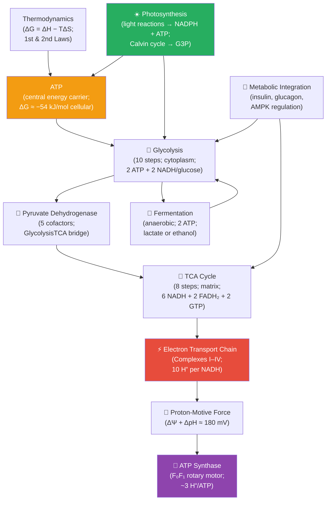

# Unit III — Energy and Metabolism: Introduction {#sec:unit_III_unit_intro .unnumbered}


## Why This Unit Matters {.unnumbered}

Life is, at its core, an ongoing argument with the second law of thermodynamics. The second law
demands that disorder increases in any closed system; living organisms are ordered, and they maintain
that order at the price of consuming energy and exporting entropy to their surroundings. A resting human
adult dissipates approximately 80 watts — the same as an incandescent light bulb — in the form of body
heat, CO₂, and metabolic waste. Every breath you take, every protein you synthesize, every ion you pump
against its gradient, uses energy extracted from the oxidation of food.

The molecular currency of this energy economy is ATP (adenosine triphosphate). At any moment, your
cells contain ~50 g of ATP, yet you consume roughly 40 kg of ATP every day at rest. This means each
ATP molecule is recycled approximately 800 times — phosphorylated from ADP in mitochondria, hydrolysed
to ADP in the cytoplasm, and regenerated in an endless chemical cycle. During vigorous exercise, ATP
turnover in muscle can exceed 0.5 kg per minute.

This unit traces energy from its entry point — sunlight captured by chlorophyll, or chemical bonds in
food — through the interconnected pathways of glycolysis, the TCA cycle, oxidative phosphorylation,
and photosynthesis, to its exit as heat and CO₂. Each pathway is treated quantitatively: you will
derive ATP yields, calculate free energy changes, and model the regulatory logic that switches
metabolism between fed and fasted states. The central thread is Peter Mitchell's chemiosmosis
(Nobel Prize 1978): ion gradients across membranes couple electron flow to ATP synthesis, and the
same principle operates in both mitochondria and chloroplasts.

---

## Landmark Discoveries {.unnumbered}

| Discoverer(s) | Year | Journal / Source | Discovery | Significance |
| ------------- | ---- | ---------------- | --------- | ------------ |
| Hans Krebs | 1937 | \citep{krebs1937} | Citric acid (Krebs/TCA) cycle | Identified the central hub of aerobic catabolism; Nobel Prize 1953 |
| Otto Warburg | 1923–1930 | \citep{warburg1924carcinomzelle} | Respiratory enzyme and Warburg effect | First measured oxygen consumption in cancer; discovered aerobic glycolysis |
| Peter Mitchell | 1961 | \citep{mitchell1961} | Chemiosmotic hypothesis | Proposed proton gradients drive ATP synthesis; revolutionary paradigm shift; Nobel Prize 1978 |
| Paul Boyer & John Walker | 1994–1997 | \citep{boyer1997} | Binding-change mechanism of ATP synthase | Explained rotary catalysis of F₁F₀-ATP synthase; Nobel Prize 1997 |
| Melvin Calvin, Andrew Benson & James Bassham | 1950 | \citep{calvin1961} | Calvin cycle (carbon fixation) | Traced ¹⁴C through photosynthesis; established the biochemistry of C₃ fixation; Nobel Prize 1961 |
| Racker & Stoeckenius | 1974 | \citep{racker1974} | Bacteriorhodopsin + ATP synthase reconstitution | Direct experimental proof of Mitchell's chemiosmosis using purified components |

---

## Key Concepts and Connections {.unnumbered}


<!-- alt: Graph showing energy-and-metabolism concept map — orange = ATP currency; red = oxidative phosphorylation; green = photosynthesis; purple = ATP synthase. -->

*Energy-and-metabolism concept map — orange = ATP currency; red = oxidative phosphorylation; green = photosynthesis; purple = ATP synthase.*

---

## Current Evidence Thread {.unnumbered}

Read this unit as one regulated network rather than three separate pathways: respiration, the integrated fasting/fed economy, and photosynthesis are most constrained by the same currencies of energy charge, redox poise, and compartmentation, and a claim in one chapter is primarily as strong as the flux, sensor, and condition it specifies. Metabolism is now studied as a regulated network constrained by energy, redox balance, compartmentation, and environment. As you
move through the chapters, keep a two-column note: **claim** on the left,
**evidence that would change my confidence** on the right. By the end of the
unit, each major idea should be tied to a measurement, model, citation, or
paper-based lab decision.

## Chapter Roadmap {.unnumbered}

| Chapter | Title | Core Question | Key Equation / Model |
| ------- | ----- | ------------- | -------------------- |
| **9** | Bioenergetics and Cellular Respiration | How do cells extract and convert chemical energy from glucose? | $\Delta G = \Delta G^{\circ\prime} + RT\ln Q$; P/O ratios |
| **10** | Photosynthesis | How do plants capture solar energy and fix CO₂? | Light-harvesting cross-section; Z-scheme; Calvin cycle stoichiometry |
| **11** | Metabolic Integration | How do hormones and allosteric signals coordinate anabolic and catabolic pathways? | AMPK activation; insulin/glucagon signaling logic |

---

## Connections Across the Textbook {.unnumbered}

- **ATP and free energy** introduced here underpin most driven processes in \nameref{sec:unit_IV_unit_intro} (DNA replication, transcription, translation), \nameref{sec:unit_VIII_unit_intro} (active transport in phloem), and \nameref{sec:unit_IX_unit_intro} (Na⁺/K⁺-ATPase in neurons).
- **The TCA cycle as metabolic hub** is integrated in \cref{sec:unit_III_metabolic_integration} and connects to amino acid catabolism (\nameref{sec:unit_IV_unit_intro}), fatty acid oxidation, and nucleotide synthesis.
- **Proton-motive force** is the conceptual bridge between mitochondrial ATP synthesis (this unit) and chloroplast ATP synthesis (\cref{sec:unit_III_photosynthesis}), and between bacterial physiology (\nameref{sec:unit_VII_unit_intro}) and the evolution of eukaryotes (\nameref{sec:unit_II_unit_intro}, endosymbiosis).
- **Warburg effect** (cancer cells performing aerobic glycolysis) appears in \nameref{sec:unit_II_unit_intro} (cell signaling oncogenes), \nameref{sec:unit_IV_unit_intro} (genomic instability), and the clinical connection sections throughout.

> **Key vocabulary introduced here:** free energy, enthalpy, entropy, ATP hydrolysis, glycolysis, oxidative phosphorylation, proton-motive force, chemiosmosis, electron transport chain, substrate-level phosphorylation, fermentation, Calvin cycle, Warburg effect.


## Computational Toolbox — Unit III {.unnumbered}

```python
from biology.biochemistry import atp_free_energy, glycolysis_summary

# ATP hydrolysis free energy under physiological conditions
delta_g = atp_free_energy(atp_conc_mM=3.0, adp_conc_mM=1.0, pi_conc_mM=10.0)
print(f"ΔG (ATP hydrolysis) = {delta_g:.1f} kJ/mol")
# Expected: ΔG (ATP hydrolysis) ≈ -45.2 kJ/mol
# (Standard ΔG°' = -30.5 kJ/mol; physiological conditions make it more negative
#  due to low [ADP][Pi] and high [ATP] in active cells)

# Comparing aerobic vs anaerobic ATP yield
aerobic = glycolysis_summary()
print(f"Glycolysis only: {aerobic.net_atp} ATP per glucose")
# 2 ATP (substrate-level only); aerobic adds ~32 more via oxidative phosphorylation

# The complete aerobic yield
total_aerobic_atp = aerobic.net_atp + 2 + 10*2.5 + 2*1.5  # GTP + NADH + FADH2
print(f"Aerobic total (estimate): ~{total_aerobic_atp:.0f} ATP per glucose")
# Expected: Aerobic total (estimate): ~32 ATP per glucose
```

> **Try it yourself:** The P/O ratio (ATP per oxygen atom) is 2.5 for NADH and 1.5 for
> FADH₂. Calculate the theoretical maximum yield from one glucose:
> 10 NADH × 2.5 + 2 FADH₂ × 1.5 + 4 substrate-level = __?

---

*Source modules: `src/biology/biochemistry/biochemistry.py` — `glycolysis_summary()`, `atp_free_energy()`, `michaelis_menten()`.*
*Figures: `src/visualization/` (ETC diagrams, ATP yield tables); `src/mermaid/biology_diagrams.py` (metabolic pathway diagrams).*

## Cross-Unit Integration {.unnumbered}

The metabolic pathways of \nameref{sec:unit_III_unit_intro} — glycolysis, the TCA cycle, oxidative phosphorylation, photosynthesis — generate the ATP, NADPH, and carbon skeletons that make every other cellular activity possible. Among the most demanding consumers of that energy is the storage, replication, and expression of genetic information, which \nameref{sec:unit_IV_unit_intro} opens with. DNA replication, transcription, and translation are ATP- and GTP-dependent, kinetically tuned to the metabolic state of the cell, and tightly regulated by metabolic intermediates (acetyl-CoA controls histone acetylation; SAM levels control DNA methylation; alpha-ketoglutarate controls TET-driven demethylation). Read \nameref{sec:unit_IV_unit_intro} with one eye on the energetic budget you just internalized — the cell does not "decide" to express a gene without paying a metabolic bill.
