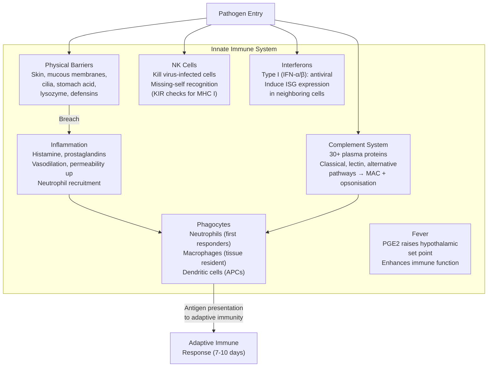
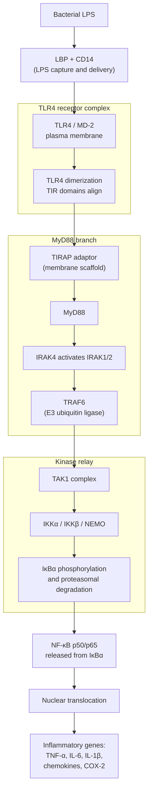
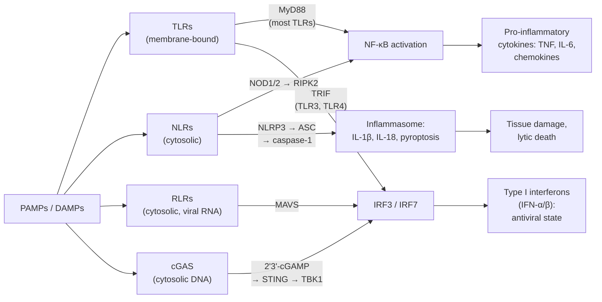
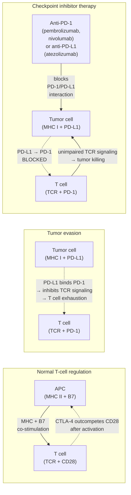
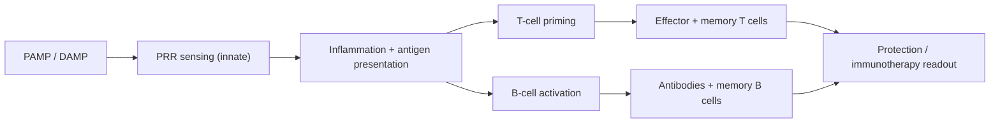

# Immune System Architecture

\label{sec:unit_IX_immune_system_defense}

<!-- chapter-metadata-badge -->
> Level 2/3 · 30 min read · 40 min lecture · Prerequisites: \cref{sec:unit_IX_endocrine_signaling}

## Learning Objectives

1. Distinguish innate and adaptive immunity, including PRRs and downstream signaling pathways.
2. Explain the complement system, phagocytosis, and antigen presentation.
3. Describe T and B cell development, activation, and immunological memory.
4. Explain tolerance, autoimmunity, hypersensitivity, and immunotherapy approaches.

5. Design a vaccination schedule argument using primary, booster, and herd-immunity reasoning.
6. Compare innate and adaptive effector mechanisms using measurable readouts and controls.
7. Evaluate checkpoint and CAR-T claims against current product labels and surveillance requirements.

---

## Immune System Architecture and Effector Logic

The immune system protects against pathogens and tumor cells while preserving tolerance to self \citep{chaplin2010immuneresponse}. It comprises two integrated arms: **innate immunity** (rapid, non-specific, germline-encoded) and **adaptive immunity** (slow, antigen-specific, somatically generated).

### Innate Immunity

[**Innate immunity**](#gl:innate-immunity) provides immediate (seconds to hours), non-specific protection:


<!-- alt: Graph showing components of innate immunity Physical barriers form the first line of defense. When breached, inflammation recruits phagocytes, complement activates, NK cells kill infected cells, and interferons establish an antiviral state. Antigen-presenting cells bridge innate to adaptive immunity. -->

*Components of innate immunity Physical barriers form the first line of defense. When breached, inflammation recruits phagocytes, complement activates, NK cells kill infected cells, and interferons establish an antiviral state. Antigen-presenting cells bridge innate to adaptive immunity.*

**Key innate immune cells:**

: Innate Immunity: Cell Type and Function. {#tbl:unit_IX_immune_system_defense_innate_immunity}
| Cell Type | Function | Key Features |
| --------- | -------- | ------------ |
| **Neutrophils** | First responders; phagocytosis; NETs; oxidative burst | Most abundant WBC (60–70%); short-lived (hours) |
| **Macrophages** | Phagocytosis; antigen presentation; cytokine production | Tissue-resident (Kupffer cells in liver, microglia in brain, alveolar macrophages in lung) |
| **Dendritic cells** | Professional APCs; bridge innate and adaptive | Most potent antigen presenters |
| **NK cells** | Kill virus-infected and tumor cells | "Missing self" detection via KIR receptors |
| **Mast cells** | Histamine release; IgE-mediated degranulation | Allergy; [**parasite**](#gl:parasite) defense |
| **Eosinophils** | Parasite defense; allergic inflammation | Major basic protein toxic to helminths |
| **Basophils** | Histamine; IL-4 production | Rarest WBC (<1%) |

### Pattern Recognition Receptors (PRRs)

Innate immune cells detect pathogens through germline-encoded **PRRs** that recognize conserved molecular signatures unique to pathogens — **pathogen-associated molecular patterns (PAMPs)** — or signals of cellular damage — **damage-associated molecular patterns (DAMPs)** \citep{medzhitov2007recognition}. PRRs fall into four major families based on cellular location and ligand class.

#### Toll-like receptors (TLRs)

Membrane-bound (plasma membrane or endosomal). Humans express 10 TLRs.

Species specificity matters here. Human TLR1--TLR10 are not a comprehensive mammalian template: mice lack a direct functional equivalent of human TLR10 but retain TLR11--TLR13, which detect microbial ligands such as profilin-like proteins and bacterial RNA. TLR10 itself remains less mechanistically settled than TLR4, TLR7/8, or TLR9. When comparing innate-immunity experiments across humans, mice, and cell lines, students should ask whether the receptor repertoire and ligand preparation actually match the claimed pathogen-sensing pathway.

: Toll-like receptors (TLRs): TLR and Location. {#tbl:unit_IX_immune_system_defense_toll_like_receptors_tlrs}
| TLR | Location | Ligand | Pathogen class |
| --- | -------- | ------ | -------------- |
| TLR1/2 | Plasma membrane | Triacyl lipopeptides | Bacteria (mycobacteria) |
| TLR2/6 | Plasma membrane | Diacyl lipopeptides, peptidoglycan | Gram+ bacteria, fungi |
| TLR3 | Endosomal | dsRNA | Viruses |
| **TLR4** | Plasma membrane | **LPS (lipopolysaccharide)** | Gram− bacteria |
| TLR5 | Plasma membrane | Flagellin | Motile bacteria |
| TLR7/8 | Endosomal | ssRNA | RNA viruses |
| TLR9 | Endosomal | Unmethylated CpG DNA | Bacteria, DNA viruses |

#### TLR4 → MyD88 → NF-κB pathway (bacterial LPS response)


<!-- alt: Flowchart showing TLR4/MyD88/NF-κB pathway. LBP and CD14 deliver bacterial LPS to TLR4/MD-2, TLR4 dimerization recruits TIRAP and MyD88, IRAK kinases and TRAF6 activate TAK1 and IKK, and IκBα degradation releases NF-κB to induce inflammatory genes. -->

*TLR4/MyD88/NF-κB pathway. LBP and CD14 deliver bacterial LPS to TLR4/MD-2, TLR4 dimerization recruits TIRAP and MyD88, IRAK kinases and TRAF6 activate TAK1 and IKK, and IκBα degradation releases NF-κB to induce inflammatory genes.*

#### TLR3/TRIF → IRF3 → IFN-β pathway (antiviral response)

A parallel branch is engaged by TLR3 (endosomal dsRNA) and the late-endosome pool of TLR4. The adaptor **TRIF** recruits TBK1, which phosphorylates **IRF3**. Phospho-IRF3 dimerises, enters the nucleus, and drives transcription of **type I interferons (IFN-α/β)**. IFN-β released into the extracellular space binds IFNAR on neighboring cells, activating JAK1/TYK2 → STAT1/STAT2 → ISGF3 → induction of hundreds of **interferon-stimulated genes (ISGs)** that establish an antiviral state. The MyD88/NF-κB vs TRIF/IRF3 dichotomy explains why bacterial LPS produces fever and inflammation while viral dsRNA produces an interferon-driven antiviral state.

#### NOD-like receptors (NLRs) and the NLRP3 inflammasome

Cytosolic. Detect intracellular bacterial components (peptidoglycan derivatives) and danger signals.

- **NOD1** detects iE-DAP (Gram−); **NOD2** detects MDP (comprehensive). Both activate NF-κB. NOD2 mutations cause Crohn's disease (impaired mucosal immunity → dysbiosis → inflammation).

The **NLRP3 inflammasome** illustrates the **two-signal** model:

- **Signal 1 (priming):** TLR or cytokine engagement → NF-κB → upregulates NLRP3 and pro-IL-1β transcription. Without this, no inflammasome assembly.
- **Signal 2 (activation):** Diverse triggers — extracellular ATP (P2X7), K$^+$ efflux, lysosomal rupture (urate crystals, cholesterol crystals, silica, alum), mitochondrial ROS, mitochondrial DNA in cytosol — activate NLRP3.
- **Assembly:** NLRP3 oligomerises via its NACHT domain; recruits ASC adaptor via PYD–PYD interactions; ASC nucleates pro-caspase-1 via CARD–CARD; pro-caspase-1 self-cleaves to active caspase-1.
- **Output:** Caspase-1 cleaves pro-IL-1β → IL-1β (released via gasdermin D pores) and pro-IL-18 → IL-18; cleaves gasdermin D, whose N-terminal fragment forms 10–20 nm pores in the plasma membrane causing **pyroptosis** (lytic cell death with massive cytokine release).

NLRP3 mutations cause cryopyrin-associated periodic syndromes (CAPS); chronic NLRP3 activity drives gout (urate crystals), atherosclerosis (cholesterol crystals), Alzheimer's-related neuroinflammation, and type 2 diabetes. **Anakinra** (recombinant IL-1Ra) and **canakinumab** (anti-IL-1β) target the inflammasome output.

#### RIG-I-like receptors (RLRs)

Cytosolic RNA sensors detecting viral replication.

- **RIG-I:** detects 5'-triphosphate RNA (host RNA is capped; viral RNA is not).
- **MDA5:** detects long dsRNA.
- Signal via **MAVS** (mitochondrial antiviral signaling protein) → IRF3/IRF7 → type I interferons.

#### cGAS–STING pathway (cytosolic DNA sensing)

The **cGAS–STING** axis is the principal sensor for cytosolic DNA — a hallmark of intracellular bacterial or viral infection (and, problematically, mislocalized mitochondrial or self DNA).

- **cGAS (cyclic GMP–AMP synthase)** binds dsDNA non-sequence-specifically through a phase-separation-like condensation. Activated cGAS catalyses synthesis of the cyclic dinucleotide **2'3'-cGAMP** from ATP and GTP.
- **STING (stimulator of interferon genes)**, an ER-resident transmembrane protein, binds 2'3'-cGAMP, undergoes a major conformational change, traffics from ER to ERGIC/Golgi, and recruits **TBK1**, which phosphorylates **IRF3** → type I interferon transcription. STING also activates NF-κB via a parallel branch.

The cGAS–STING pathway is essential for control of HSV-1, vaccinia, and many cytosolic bacteria. **Dysregulation drives autoimmunity:** mutations causing constitutive STING activation produce **SAVI (STING-associated vasculopathy with onset in infancy)**, an interferonopathy. Aicardi-Goutières syndrome arises when defective DNases (TREX1, RNASEH2) cannot clear cytoplasmic nucleic acids, chronically engaging cGAS-STING. Pharmacologically, STING agonists (ADU-S100) are being trialled as cancer adjuvants because tumor-induced type I IFN can boost antitumour immunity.


<!-- alt: Flowchart showing PRR signaling pathways TLRs, NLRs, RLRs, and cGAS converge on transcription factors NF-κB (inflammation), IRF3/7 (interferons), and the inflammasome (IL-1β, pyroptosis). Different pathogen classes preferentially engage different sensors. -->

*PRR signaling pathways TLRs, NLRs, RLRs, and cGAS converge on transcription factors NF-κB (inflammation), IRF3/7 (interferons), and the inflammasome (IL-1β, pyroptosis). Different pathogen classes preferentially engage different sensors.*

### Complement System Overview

The complement system comprises ~30 plasma proteins that amplify innate responses through enzymatic cascades. There are three pathways of activation, most converging on a common terminal pathway.

#### Three activation pathways

: Three activation pathways: Pathway and Trigger. {#tbl:unit_IX_immune_system_defense_three_activation_pathways}
| Pathway | Trigger | Initiation step | Convergence |
| ------- | ------- | --------------- | ----------- |
| **Classical** | Antibody (IgM, IgG) bound to antigen on pathogen | C1q binds Fc → activates C1r → C1s → cleaves C4 + C2 | C3 convertase = C4b2a |
| **Lectin** | Pathogen surface mannose / GlcNAc | MBL or ficolins bind sugars → MASP1/MASP2 (analogous to C1r/C1s) → cleave C4 + C2 | C3 convertase = C4b2a |
| **Alternative** | Spontaneous "tick-over" hydrolysis of C3; amplified on pathogen surfaces lacking complement regulators | C3(H$_2$O) + factor B + factor D → C3(H$_2$O)Bb (initial fluid-phase convertase) → deposits C3b on surface → C3bBb (surface convertase, stabilized by properdin) | C3 convertase = C3bBb |

#### C3 convertase, C5 convertase, MAC

The classical, lectin, and alternative pathways each generate a **C3 convertase** (C4b2a or C3bBb) that cleaves **C3 → C3a + C3b**. C3b is deposited on the pathogen surface; binding of an additional C3b to the existing C3 convertase yields the **C5 convertase** (C4b2aC3b or C3bBbC3b) that cleaves **C5 → C5a + C5b**.

C5b initiates the **terminal pathway**: C5b → C5b-C6 → C5b-C6-C7 (membrane-inserting) → C5b-C6-C7-C8 → addition of multiple C9 monomers polymerizing into the **membrane attack complex (MAC, C5b-9)**. The MAC forms a 10 nm transmembrane pore that lyses the target cell. Gram-negative bacteria are particularly vulnerable; encapsulated bacteria (*Neisseria*) require complement for clearance, which is why C5–C9 deficiencies present with recurrent meningococcal infection.

#### Effector functions

- **Opsonisation:** C3b coats pathogen → recognized by phagocyte receptors **CR1** (C3b/C4b), **CR3** (iC3b), **CR4**. Opsonised particles are 1000-fold more efficiently phagocytosed.
- **Membrane attack complex (MAC):** C5b-9 polymerizes in target membrane, forming a 10 nm pore.
- **Anaphylatoxins (chemotaxis and inflammation):** C3a and **C5a** (the most potent) recruit neutrophils, activate mast cells, increase vascular permeability, and amplify local inflammation.
- **Immune complex clearance:** CR1 on erythrocytes binds C3b-coated immune complexes and ferries them to liver/spleen for disposal.
- **B cell co-stimulation:** C3d coupled to antigen lowers the BCR signaling threshold ~10,000 fold via CR2 (CD21).

#### Amplification dynamics and regulation

The cascade is intrinsically amplifying because each enzyme cleaves many substrates. If one C3 convertase cleaves N copies of C3 per second, with decay rate $k_d$, the steady-state C3b concentration scales as

\begin{equation}
[\text{C3b}] = \frac{[\text{C3conv}] \cdot N}{k_d}
\label{eq:unit_IX_amplification}
\end{equation}

The **alternative pathway amplification loop** is positive: each new C3b binds factor B → C3 convertase → cleaves more C3 → more C3b. Without regulators, this loop would consume most plasma C3 within minutes.

Regulators confine the cascade to pathogen surfaces:

: Amplification dynamics and regulation: Regulator and Location. {#tbl:unit_IX_immune_system_defense_amplification_dynamics_and_regulation}
| Regulator | Location | Function |
| --------- | -------- | -------- |
| **DAF (CD55)** | GPI-anchored on host cells | Accelerates C3/C5 convertase decay |
| **CD59** | GPI-anchored on host cells | Blocks MAC assembly (C9 incorporation) |
| **Factor H** | Soluble plasma protein | Binds host-specific sialic acid; cofactor for factor I cleavage of C3b |
| **C4BP (C4b binding protein)** | Soluble | Inactivates C4b |
| **C1-INH (C1 esterase inhibitor)** | Soluble | Inhibits C1r/C1s and MASPs |
| **CR1 (CD35)** | Erythrocytes, lymphocytes | Cofactor for factor I; immune complex clearance |

Patients with **paroxysmal nocturnal hemoglobinuria (PNH)** lack the GPI anchor that tethers DAF and CD59 to RBCs → uncontrolled complement activation → hemolysis. Treated with **eculizumab** (anti-C5 monoclonal antibody; blocks C5 cleavage and MAC formation). **C1-INH deficiency** causes **hereditary angioedema** (uncontrolled C1 → bradykinin generation via the kinin–kallikrein system → sudden tissue swelling).

### Adaptive Immunity Overview

[**Adaptive immunity**](#gl:adaptive-immunity) is slower (7–10 days for primary response) but provides **specificity** (each lymphocyte recognizes a unique antigen) and **memory** (faster, stronger response on re-exposure — basis of vaccination) \citep{iwasaki2015innateadaptive}.

**Two arms:**

- **Cell-mediated:** T cells (CD8+ cytotoxic kill infected cells; CD4+ helper coordinate response)
- **Humoral:** B cells produce antibodies that neutralize pathogens, opsonise, activate complement

**Antigen presentation via MHC:**

- **MHC class I** (on most nucleated cells): presents endogenous peptides (8–10 aa) from cytosolic proteins. Pathway: cytosolic protein → proteasome → TAP transporter → ER → loaded onto MHC I → surface. Presented to **CD8+ T cells**.
- **MHC class II** (on professional APCs: dendritic cells, macrophages, B cells): presents exogenous peptides (12–25 aa) from internalised pathogens. Pathway: phagocytosis → endolysosome → cathepsin cleavage → loaded onto MHC II (after CLIP removal by HLA-DM) → surface. Presented to **CD4+ T cells**.
- **Cross-presentation:** Dendritic cells can also load exogenous antigens onto MHC I, important for activating CD8+ responses against viruses that don't directly infect APCs.

### T Cell Development and Selection

T cell precursors leave the bone marrow as immature CD4$^-$CD8$^-$ "double-negative" thymocytes and migrate to the thymus, where they undergo somatic recombination and selection.

#### Double-negative (DN1–DN4) staging

Within the thymic cortex, double-negative thymocytes pass through four sequential stages defined by surface CD44 and CD25 expression:

: Double-negative (DN1–DN4) staging: Stage and CD44. {#tbl:unit_IX_immune_system_defense_double_negative_dn1_dn4_staging}
| Stage | CD44 | CD25 | Major event |
| ----- | ---- | ---- | ----------- |
| **DN1** | + | − | Early thymic progenitor; multipotent (T/NK/myeloid) |
| **DN2** | + | + | Lineage commitment; TCR β/γ/δ rearrangement begins |
| **DN3** | − | + | TCR β rearrangement complete; **β-selection checkpoint** (primarily cells with productive TCR β survive, via signaling from pre-TCR with surrogate α chain pTα) |
| **DN4** | − | − | Proliferative burst; transition to double-positive (CD4+CD8+) |

Cells then become **double-positive (CD4+CD8+)** and rearrange TCR α. With both TCR chains expressed, they undergo **positive** then **negative** selection.

#### TCR diversity generation

Like immunoglobulin loci, the T cell receptor (TCR) loci undergo **V(D)J recombination** mediated by RAG1/RAG2 endonucleases:

- TCR β chain: V–D–J recombination (~52 V × 2 D × 13 J segments → ~1,400 combinations)
- TCR α chain: V–J recombination (~70 V × ~61 J segments → ~4,300 combinations)
- **Junctional diversity:** TdT (terminal deoxynucleotidyl transferase) adds non-templated N-nucleotides at junctions
- **Combinatorial diversity:** αβ pairing creates ~6 × 10$^6$ unique receptors before junctional diversity
- **With junctional diversity:** the theoretical TCR repertoire exceeds 10$^{18}$, far larger than the ~10$^{11}$ T cells in the human body — most TCRs are rarely realized.

Rough calculation: $1{,}400 \times 4{,}300 \approx 6 \times 10^6$ V(D)J combinations × ~10$^{12}$ junctional possibilities ≈ 10$^{18}$ theoretical receptors.

Defects in this recombination machinery cause severe combined immunodeficiencies (RAG1/RAG2 SCID — "bubble boy" disease); ataxia-telangiectasia (ATM mutation) causes radiosensitivity and lymphoid malignancy.

#### Positive selection (cortex)

In the thymic cortex, double-positive (CD4+CD8+) thymocytes encounter **cortical thymic epithelial cells (cTECs)** displaying self-peptide–MHC complexes. T cells whose TCR engages MHC with sufficient (but not excessive) affinity receive a survival signal. T cells with no MHC affinity die by neglect (~95% of thymocytes).

- TCR engagement of MHC I → CD8+ single-positive T cell
- TCR engagement of MHC II → CD4+ single-positive T cell

Positive selection ensures the surviving repertoire is **MHC-restricted** — primarily recognizes antigen presented in the context of self MHC.

#### Negative selection (medulla) — AIRE and Treg generation

Surviving thymocytes migrate to the medulla and encounter **medullary thymic epithelial cells (mTECs)** and dendritic cells. mTECs express the autoimmune regulator **AIRE** transcription factor, which drives ectopic expression of thousands of tissue-specific antigens (insulin, thyroglobulin, myelin proteins) normally restricted to peripheral tissues. T cells whose TCR binds self-peptide–MHC complexes with **high affinity** undergo apoptosis (clonal deletion). A small fraction with intermediate self-reactivity become **regulatory T cells (Tregs)** — CD4+CD25+FoxP3+ cells that police self-tolerance in the periphery.

**AIRE mutations** cause autoimmune polyendocrinopathy syndrome type 1 (APS-1, APECED) — patients fail to delete autoreactive T cells against multiple endocrine organs, developing chronic mucocutaneous candidiasis, hypoparathyroidism, and adrenal insufficiency. **FoxP3 mutations** cause IPEX syndrome — fatal multi-organ autoimmunity in infancy from absent Tregs.

### B Cell Activation and Antibody Diversification

#### Stepwise B cell activation

1. **Antigen encounter.** Naïve B cell in lymphoid follicle encounters cognate antigen (in soluble form, or displayed on subcapsular sinus macrophages and follicular dendritic cells).
2. **BCR cross-linking.** Multivalent antigen cross-links several BCRs → tyrosine phosphorylation of Igα/Igβ ITAMs by Lyn/Fyn → recruitment of Syk → activation of PI3K, PLCγ2, Ras/MAPK cascades.
3. **Antigen internalization.** B cell internalises antigen via BCR, processes peptides in MHC class II compartment.
4. **Migration to T-B border.** Activated B cell upregulates CCR7, migrates to T-cell zone of lymph node.
5. **T cell help.** Cognate Tfh (follicular helper T cell) recognizes B cell-presented peptide on MHC II. Engagement of **CD40L (Tfh) – CD40 (B cell)** plus cytokines (IL-4, IL-21) provides "second signal."
6. **Outcome:** B cells either differentiate into **short-lived extrafollicular plasmablasts** (rapid IgM, low affinity) or enter the germinal center.

#### B cell activation modes

- **T-independent (TI) responses:** Polysaccharide and repetitive antigens cross-link many BCRs simultaneously. Produces predominantly IgM, no germinal center, no affinity maturation, weak memory. Important for encapsulated bacteria (*Streptococcus pneumoniae*, *Haemophilus influenzae*); explains why polysaccharide vaccines work poorly in children <2 years.
- **T-dependent (TD) responses:** Protein antigens. B cell internalises antigen via BCR, processes it, presents peptide on MHC II, is recognized by cognate CD4+ T helper cell (specifically Tfh — follicular helper T cell). T:B interaction at the T-B border activates the B cell to enter the **germinal center reaction**. Produces high-affinity, class-switched antibodies and long-lived memory.

#### Germinal center reaction — somatic hypermutation and affinity maturation

In secondary lymphoid organs (lymph nodes, spleen, Peyer's patches), activated B cells form **germinal centers** with two zones:

- **Dark zone (centroblasts):** Rapid proliferation. **Activation-induced cytidine deaminase (AID)** introduces somatic point mutations into the variable regions of immunoglobulin genes — **somatic hypermutation (SHM)**, ~10$^{-3}$ mutations per base per generation (~10$^6$ × normal mutation rate).
- **Light zone (centrocytes):** B cells re-encounter antigen displayed on follicular dendritic cells (FDCs). Cells whose mutated BCR has improved antigen affinity capture more antigen, internalise it, present more peptide on MHC II, and receive stronger Tfh help → survival and re-cycling. Cells with reduced affinity die by apoptosis. This is **affinity maturation** — Darwinian selection at the cellular level, driving 1000-fold increases in antibody affinity over weeks.

Light-zone cells differentiate into:

- **Plasma cells** (long-lived in bone marrow, secrete antibodies for years/decades)
- **Memory B cells** (rapidly mobilized on antigen re-encounter)

#### Class switch recombination (CSR)

Initially B cells produce IgM (default isotype). Cytokines from Tfh cells direct **class switching** to IgG, IgA, or IgE by recombining the heavy chain constant region (the variable region — and thus antigen specificity — is preserved). At the molecular level, **AID** deaminates cytidines in switch (S) regions upstream of each constant-region gene; subsequent base-excision repair generates double-strand breaks that are joined by NHEJ to produce switch recombination, deleting intervening DNA.

: Class switch recombination (CSR): Cytokine and Switch to. {#tbl:unit_IX_immune_system_defense_class_switch_recombination_csr}
| Cytokine | Switch to | Function |
| -------- | --------- | -------- |
| IFN-γ | IgG1, IgG3 | Opsonisation, complement, intracellular pathogens |
| IL-4 | IgG4, IgE | Allergy, helminth defense |
| TGF-β | IgA | Mucosal immunity |
| IL-21 | IgG1, IgG3 | Synergises with other switches |

Defects in AID cause **hyper-IgM syndrome** (HIGM2 — failure of class switching and somatic hypermutation; primarily IgM is produced). CD40L mutations cause an X-linked form (HIGM1) — failure of cognate T-cell help.

#### Antibody isotypes

: Antibody isotypes: Class and Form. {#tbl:unit_IX_immune_system_defense_antibody_isotypes}
| Class | Form | Half-life | Function |
| ----- | ---- | --------- | -------- |
| **IgM** | Pentamer | ~5 d | Primary response; complement activation |
| **IgG** | Monomer | ~21 d | Secondary response; opsonisation; placental transfer; complement |
| **IgA** | Dimer (mucosal) | ~6 d | Mucosal immunity (gut, respiratory, breast milk) |
| **IgE** | Monomer | ~2 d (3 weeks bound to FcεR on mast cells) | Allergy; helminth defense |
| **IgD** | Monomer | ~3 d | B cell receptor (function unclear) |

### Cytokine Network Reference

Cytokines are small (~15–25 kDa) signaling proteins that coordinate immune cell function. They act locally (paracrine/autocrine) at very low concentrations (pM–nM) via JAK/STAT or other receptor families.

: Cytokine Network Reference: Cytokine and Major Source. {#tbl:unit_IX_immune_system_defense_cytokine_network_reference}
| Cytokine | Major Source | Major Targets | Receptor / Signaling | Key effects |
| -------- | ------------ | ------------- | --------------------- | ----------- |
| **IL-1 (α/β)** | Macrophages, DCs (NLRP3 inflammasome for IL-1β) | Endothelium, hypothalamus, T cells | IL-1R / MyD88 → NF-κB | Fever (PGE$_2$), endothelial activation, T cell co-stimulation |
| **IL-2** | Activated CD4+ T cells | T cells, NK cells, Tregs | IL-2R (αβγ) / JAK1/3 → STAT5 | T cell proliferation; Treg survival (Treg uses IL-2 as 'sink') |
| **IL-4** | Th2 cells, mast cells, basophils | B cells, Th2 polarization | IL-4R / JAK1/3 → STAT6 | IgE class switch; Th2 differentiation; allergy |
| **IL-5** | Th2 cells, ILC2 | Eosinophils | IL-5R / JAK2 → STAT5 | Eosinophil growth/activation (helminths, allergy) |
| **IL-6** | Macrophages, T cells, hepatocytes | Liver, B cells, T cells | IL-6R/gp130 / JAK1/2 → STAT3 | Acute phase response (CRP, fibrinogen); Th17 differentiation; B cell maturation |
| **IL-7** | Stromal cells (BM, thymus) | Naïve and memory T cells | IL-7R / JAK1/3 → STAT5 | T cell development and homeostatic survival |
| **IL-8 (CXCL8)** | Macrophages, endothelium | Neutrophils | CXCR1/CXCR2 (G$_i$ GPCRs) | Neutrophil chemotaxis |
| **IL-10** | Tregs, macrophages, B cells | Macrophages, T cells | IL-10R / JAK1/TYK2 → STAT3 | **Anti-inflammatory** — suppresses Th1 and macrophage activation |
| **IL-12** | Macrophages, DCs | NK cells, T cells | IL-12R / TYK2/JAK2 → STAT4 | Th1 differentiation; IFN-γ induction |
| **IL-13** | Th2, ILC2, mast cells | B cells, smooth muscle, epithelium | IL-13Rα1/IL-4Rα / STAT6 | Allergy/asthma; goblet cell mucus; tissue remodeling; target of dupilumab |
| **IL-15** | DCs, monocytes | NK, memory CD8+ T cells | IL-15R / JAK1/3 → STAT5 | NK and memory T cell maintenance |
| **IL-17** | Th17 cells, γδ T cells | Epithelium, neutrophils | IL-17R / Act1 → NF-κB | Mucocutaneous defense (fungi, extracellular bacteria); psoriasis, IBD when dysregulated |
| **IL-21** | Tfh cells | B cells, T cells | IL-21R / JAK1/3 → STAT3 | Germinal center reactions, class switching |
| **IL-22** | Th17, Th22, ILC3 | Epithelium | IL-22R / JAK1/2 → STAT3 | Mucosal barrier defense; antimicrobial peptide production |
| **IL-23** | Macrophages, DCs | Th17 cells | IL-23R / JAK2/TYK2 → STAT3 | Th17 stabilization; target of ustekinumab/risankizumab in psoriasis/IBD |
| **TNF-α** | Macrophages, T cells | Endothelium, tumor cells | TNFR1/2 → NF-κB / apoptosis | Inflammation, septic shock, apoptosis; target of anti-TNF biologics |
| **IFN-α/β (Type I)** | Most cells (esp. plasmacytoid DCs) | Most nucleated cells | IFNAR1/2 / JAK1/TYK2 → STAT1/2 → ISGF3 | Antiviral state (induces hundreds of ISGs); MHC I upregulation |
| **IFN-γ (Type II)** | Th1 cells, NK cells, CD8+ | Macrophages, most cells | IFNGR1/2 / JAK1/2 → STAT1 | Macrophage activation; MHC upregulation; intracellular pathogen defense |
| **TGF-β** | Tregs, many cells | Many | TβR-I/II / SMAD2/3 | Treg induction; tissue repair; wound healing; oncogenic in late cancer |
| **GM-CSF** | T cells, macrophages, endothelium | Myeloid progenitors | CSF2R / JAK2 → STAT5 | Granulocyte/macrophage growth; DC differentiation; therapeutic in neutropenia |

**Th polarization:**

- **Th1** (driven by IL-12; produces IFN-γ): intracellular pathogens, viruses, autoimmunity (MS, T1DM)
- **Th2** (driven by IL-4; produces IL-4/5/13): helminths, allergy, asthma
- **Th17** (driven by IL-6 + TGF-β; produces IL-17): extracellular bacteria, fungi; psoriasis, IBD
- **Treg** (driven by TGF-β; FoxP3+): peripheral tolerance, suppression
- **Tfh** (in germinal centers; produces IL-21): B cell help

### Immunological Memory — Why Memory Cells Respond Faster

After antigen clearance, ~95% of effector T and B cells die by apoptosis (contraction phase). The remaining 5% become long-lived memory cells. Memory cells respond to re-exposure 100–1000× faster and stronger than naïve cells:

: Immunological Memory — Why Memory Cells Respond Faster: Property and Naïve cell. {#tbl:unit_IX_immune_system_defense_immunological_memory_why_memory_cells_respond_faster}
| Property | Naïve cell | Memory cell |
| -------- | ---------- | ----------- |
| **Frequency for given antigen** | ~1 in 10$^6$ | 100–1000-fold higher (clonal expansion preserved) |
| **Activation threshold** | High (needs 24–48 h priming, full co-stimulation) | Low (rapid proliferation on re-encounter) |
| **Effector repertoire** | Naïve, must differentiate | Pre-armed; rapid cytokine production / class-switched antibody |
| **Tissue distribution** | Recirculate through 2° lymphoid organs | T$_{CM}$ recirculate; T$_{EM}$/T$_{RM}$ patrol peripheral and barrier tissues |
| **Homeostatic maintenance** | None | Tonic IL-7 + IL-15; long lifespan (decades for some clones) |

The signaling determinants of effector vs memory differentiation include:

- **Strong, prolonged TCR signaling + IL-2** → effector (terminally differentiated, short-lived, KLRG1$^{hi}$)
- **Brief TCR signaling + IL-7, IL-15** → memory precursors (CD127$^{hi}$, CD62L$^+$)
- **Memory subsets:**
  - **Central memory (T$_{CM}$):** CCR7$^+$, CD62L$^+$; recirculate through lymph nodes; high proliferative potential
  - **Effector memory (T$_{EM}$):** CCR7$^-$; patrol peripheral tissues; immediate effector function
  - **Tissue-resident memory (T$_{RM}$):** CD69$^+$, CD103$^+$; reside in barrier tissues (skin, gut, lung); first to detect re-infection

Memory persistence depends on tonic IL-7 and IL-15 cytokine signaling and homeostatic proliferation, not antigen re-stimulation. This is why vaccine immunity can last decades despite no reinfection — and why immunosuppressive therapies that cripple homeostatic cytokines (e.g., IL-7 axis blockade) reduce memory.

> **Concept Check (Synthesis --- Cross-Unit Connection):** The immune system can be reframed as an active inference agent. The adaptive immune system maintains a generative model of self (MHC-presented peptides) and non-self (pathogen-associated patterns). B and T cell clonal selection = model updating; clonal expansion = precision-weighting of high-evidence hypotheses; immunological memory = compressed posterior over past pathogens; autoimmunity = failure of the self/non-self model. (a) In Bayesian terms, what does the MHC-peptide-TCR recognition step represent --- the likelihood, the prior, or the posterior? Justify. (b) Vaccination trains the immune system's generative model with attenuated antigen: in FEP terms, why does repeated low-dose exposure (prime-boost) produce stronger immunity than a single high-dose exposure? (c) Tolerance to commensal gut bacteria requires the immune system to hold stable priors despite constant microbial exposure --- identify the cellular mechanism that maintains this prior and predict what happens when it fails (as in IBD).

### Tolerance and Autoimmunity

Self-tolerance is maintained at two levels:

Autoimmunity is rarely explained by a single broken checkpoint. Susceptibility alleles, sex-biased immune regulation, molecular mimicry, epitope spreading, tissue damage, microbiome state, and timing of infection can most shift the threshold between protective immunity and self-damage. A precise answer should therefore distinguish the initiating trigger, the self-antigen or tissue compartment, the effector mechanism, and the evidence that tolerance failed rather than merely inflammation increased.

#### Central tolerance (thymus and bone marrow)

- T cells: Negative selection in thymic medulla (AIRE-driven self-antigen expression)
- B cells: Receptor editing and clonal deletion in bone marrow upon BCR engagement of self-antigen

Failure modes: AIRE mutations (APS-1); central tolerance is incomplete because not most self-antigens can be expressed in primary lymphoid organs.

#### Peripheral tolerance

- **Anergy:** TCR engagement without co-stimulation (CD28 by B7) inactivates rather than activates the T cell.
- **Treg suppression:** FoxP3+ regulatory T cells suppress conventional T cell activation by IL-2 consumption, IL-10/TGF-β secretion, CTLA-4 outcompeting CD28, and granzyme killing.
- **Inhibitory checkpoints:** **CTLA-4** and **PD-1** restrain T cell responses (see immunotherapy below).
- **Activation-induced cell death (AICD):** Repeatedly activated T cells upregulate Fas → undergo apoptosis on Fas ligation.

#### Mechanisms of autoimmunity

Failures of tolerance produce autoimmunity through several archetypal mechanisms:

- **Molecular mimicry:** A pathogen antigen shares structural similarity with self-antigen. Memory cells generated to fight the pathogen cross-react with self.
  - *Example:* Group A *Streptococcus* M protein mimics cardiac myosin → **rheumatic heart disease** after streptococcal pharyngitis.
  - *Example:* *Campylobacter jejuni* lipo-oligosaccharide mimics peripheral nerve gangliosides → **Guillain-Barré syndrome**.
- **Bystander activation:** Local infection/inflammation drives massive cytokine release, MHC upregulation, and APC maturation. Autoreactive T cells that escaped thymic deletion are activated by their cognate self-antigen now presented in a strongly stimulatory context.
- **Epitope spreading:** Initial response to one self-antigen broadens over time as tissue damage releases additional self-antigens that are taken up by APCs and presented to new autoreactive T cell clones.
  - *Example:* In **Type 1 diabetes**, autoantibodies often appear in stereotyped sequence (insulin → GAD65 → IA-2 → ZnT8) over months to years before clinical onset, reflecting progressive epitope spreading within the islet.
  - *Example:* In **multiple sclerosis**, initial myelin basic protein (MBP) response can spread to PLP, MOG, and other myelin antigens.
- **Loss of regulatory T cells:** FoxP3 mutations cause IPEX syndrome (Immunodysregulation Polyendocrinopathy Enteropathy X-linked) — fatal multi-organ autoimmunity in infancy.
- **Defective apoptosis:** Fas / FasL mutations (autoimmune lymphoproliferative syndrome, ALPS) prevent AICD → accumulation of self-reactive lymphocytes.

: Mechanisms of autoimmunity: Autoimmune disease and Target tissue. {#tbl:unit_IX_immune_system_defense_mechanisms_of_autoimmunity}
| Autoimmune disease | Target tissue | Type | Mechanism |
| ----------------- | ------------- | ---- | --------- |
| Type 1 diabetes | β-cells | Cell-mediated (CD8+) | Anti-GAD65, anti-IA-2 antibodies; T cell destruction; epitope spreading |
| Multiple sclerosis | CNS myelin | Cell-mediated (Th1/Th17) | Anti-MBP T cells; molecular mimicry to EBV nuclear antigen 1 implicated |
| Rheumatoid arthritis | Synovial joints | Mixed | Anti-CCP, RF antibodies; TNF-driven |
| SLE | Multi-organ | Antibody/IC | Anti-dsDNA, anti-Sm; immune complex deposition |
| Hashimoto's | Thyroid | Antibody | Anti-TPO, anti-Tg |
| Graves' | Thyroid | Antibody (stimulating) | Anti-TSH-R (agonist) |
| Myasthenia gravis | NMJ | Antibody | Anti-AChR antibodies block receptors |
| Goodpasture's | Kidney, lung | Antibody (Type II) | Anti-α3(IV) collagen |

### Hypersensitivity Reactions (Gell-Coombs Classification)

The four-tier Gell-Coombs classification organizes immune-mediated hypersensitivity by mechanism, time course, and treatment.

: Hypersensitivity Reactions (Gell-Coombs Classification): Type and Mechanism. {#tbl:unit_IX_immune_system_defense_hypersensitivity_reactions_gell_coombs_classification}
| Type | Mechanism | Onset | Examples | Treatment |
| ---- | --------- | ----- | -------- | --------- |
| **Type I (immediate)** | IgE-mediated; mast cell degranulation; histamine, leukotrienes, tryptase | Minutes | Anaphylaxis, allergic asthma, food allergy, hay fever | Epinephrine (anaphylaxis), antihistamines (H1 blockers — diphenhydramine, cetirizine), inhaled corticosteroids, cromolyn (mast cell stabiliser), allergen immunotherapy (gradual desensitisation), anti-IgE (omalizumab) |
| **Type II (cytotoxic)** | IgG/IgM antibody against cell-surface antigen → complement, ADCC | Hours | Autoimmune hemolytic anemia, transfusion reaction, Goodpasture's, Graves' (stimulating) | Plasmapheresis, IVIG, immunosuppression (rituximab anti-CD20 for ITP/AIHA) |
| **Type III (immune complex)** | Soluble antigen-antibody complexes deposit in tissues → complement, neutrophils | Hours to days | SLE, serum sickness, post-streptococcal glomerulonephritis, hypersensitivity pneumonitis | Corticosteroids, cyclophosphamide, removal of antigen source, plasmapheresis |
| **Type IV (delayed/cell-mediated)** | T cell-mediated; no antibody | 24–72 h | Contact dermatitis (poison ivy, nickel), tuberculin/PPD test, Type 1 diabetes onset, MS, contact allergy to nickel | Topical/systemic corticosteroids, calcineurin inhibitors (tacrolimus), allergen avoidance |

#### Type I — molecular detail

Sensitisation: First encounter with allergen → APCs prime Th2 → IL-4 drives B cells to class-switch to **IgE**. IgE binds **FcεRI** on mast cells and basophils with extraordinarily high affinity (K$_d$ ~10$^{-10}$ M) and remains bound for weeks.

Effector: Re-encounter with allergen cross-links mast cell-bound IgE → degranulation within seconds: **histamine** (vasodilation, vascular leak, smooth muscle contraction, pruritus), **tryptase** (tissue damage), **leukotrienes (C4, D4, E4)** (delayed bronchoconstriction), **prostaglandins**, **TNF**, **IL-4/IL-5/IL-13** (late phase, 4–8 h: eosinophil and Th2 recruitment).

Clinical spectrum: localized (allergic rhinitis, urticaria) → systemic (anaphylaxis with hypotension, bronchospasm, laryngeal edema). Treatment of anaphylaxis: **intramuscular epinephrine** (α$_1$ vasoconstriction reverses hypotension; β$_2$ bronchodilates; β$_2$ stabilizes mast cells), oxygen, fluids, antihistamines, corticosteroids, possible airway management. **Allergen immunotherapy (AIT)** gradually shifts the response from Th2/IgE toward Th1/IgG4 ("blocking antibodies") and induces Tregs — the primary disease-modifying therapy for allergy.

### Immunotherapy

Modern oncology has been transformed by therapies that release brakes on antitumour immunity (**checkpoint inhibitors**) or redirect T cells (**CAR-T**). Because the product roster and safety language change, treatment tables below should be read with current FDA product pages and labels, not as a permanent formulary \citep{fda2026cellulargeneproducts,fda2024cartwarning}.

#### Immune checkpoint inhibitors — PD-1/PD-L1 and CTLA-4 biology

**PD-1 (programmed death 1)** is an inhibitory receptor expressed on activated T cells (and B cells, NK cells, Tregs). Its ligand **PD-L1** is widely expressed under inflammatory conditions and constitutively on many tumors; **PD-L2** is more restricted to APCs. PD-1 engagement recruits the SHP-2 phosphatase to the immune synapse, dephosphorylating proximal TCR-signaling components (CD3ζ, ZAP70) — this functionally "exhausts" chronically activated T cells and limits collateral damage. Tumors hijack this brake by upregulating PD-L1 (often in response to local IFN-γ from infiltrating T cells — a paradoxical "adaptive resistance"), tonically inhibiting tumor-infiltrating T cells. Current drug examples and approved-use language should be checked against NCI or regulatory pages before publication because checkpoint indications change by tumor type, biomarker, and line of therapy \citep{nci2026checkpointinhibitors}.

**CTLA-4 (cytotoxic T-lymphocyte-associated 4, CD152)** is also inhibitory but acts at the priming stage in lymph nodes. Resting T cells receive co-stimulation when CD28 binds B7-1/B7-2 (CD80/CD86) on APCs. Upon activation, CTLA-4 is upregulated and translocates to the immune synapse, where it binds B7 with much higher affinity than CD28 and trans-endocytoses B7 from the APC — depriving CD28 of its co-stimulus. CTLA-4 is also constitutively expressed on Tregs, contributing to their suppressive function. CTLA-4 blockade therefore acts earlier and more broadly than PD-1 blockade, with stronger autoimmune toxicity.


<!-- alt: Flowchart showing immune checkpoint blockade Normal T cells use CTLA-4 and PD-1 as brakes to prevent over-activation. Tumors exploit PD-L1 to suppress local T cells. Anti-PD-1 antibodies (pembrolizumab) and anti-CTLA-4 antibodies (ipilimumab) block these interactions, releasing the immune brake on antitumour T cells. -->

*Immune checkpoint blockade Normal T cells use CTLA-4 and PD-1 as brakes to prevent over-activation. Tumors exploit PD-L1 to suppress local T cells. Anti-PD-1 antibodies (pembrolizumab) and anti-CTLA-4 antibodies (ipilimumab) block these interactions, releasing the immune brake on antitumour T cells.*

: Immune checkpoint inhibitors — PD-1/PD-L1 and CTLA-4 biology: Drug and Target. {#tbl:unit_IX_immune_system_defense_immune_checkpoint_inhibitors_pd_1_pd_l1_and_ctla_4_biology}
| Drug | Target | Approved indications | Approx. response rate |
| ---- | ------ | -------------------- | --------------------- |
| **Ipilimumab** | CTLA-4 | Melanoma, RCC (combined with nivolumab) | ~10–15% monotherapy, ~50% with anti-PD-1 |
| **Nivolumab, pembrolizumab** | PD-1 | Melanoma, NSCLC, RCC, head/neck, Hodgkin, MMR-deficient cancers | ~20–40% across indications |
| **Atezolizumab, durvalumab** | PD-L1 | NSCLC, urothelial, TNBC | ~15–30% |
| **Relatlimab** | LAG-3 | Melanoma (combined with nivolumab) | Combination effect; LAG-3 alone modest |
| **Tislelizumab, cemiplimab** | PD-1 | NSCLC, cutaneous SCC | Variable |

The 2018 Nobel Prize in Physiology or Medicine was awarded to James Allison (CTLA-4) and Tasuku Honjo (PD-1) for the discoveries underlying this field. Response rates vary widely by tumor type, biomarker status, line of therapy, and combination regimen; the table's approximate ranges are orientation values, not patient-level predictions. A key qualitative pattern remains **durable remissions** in some responders (the "tail of the curve"). Side effects: **immune-related adverse events (irAEs)** — colitis, pneumonitis, hypophysitis, thyroiditis, hepatitis, dermatitis — reflecting the breaking of self-tolerance. Management: corticosteroids; if severe, infliximab (anti-TNF) for colitis.

#### CAR-T cell therapy — design and clinical outcomes

**Chimeric antigen receptor T cells:** Patient T cells are removed by leukapheresis, genetically engineered ex vivo (lentiviral or retroviral vector) to express a synthetic receptor combining:

- **Extracellular antigen-binding domain:** Single-chain variable fragment (scFv) derived from a tumor-specific monoclonal antibody (e.g., anti-CD19 scFv from FMC63 antibody).
- **Hinge and transmembrane:** From CD8α or IgG.
- **Co-stimulatory domain:** CD28 (rapid effector function, shorter persistence) or 4-1BB/CD137 (slower expansion, longer persistence).
- **Activation domain:** CD3ζ (TCR-derived ITAMs).

Modified T cells are expanded in vitro and infused back into the patient. The CAR-T cells recognize the surface antigen (e.g., CD19 on B-cell malignancies) **without MHC restriction**, which enables recognition of MHC-low tumors that escape conventional T cells.

: CAR-T cell therapy — design and clinical outcomes: Product and Target. {#tbl:unit_IX_immune_system_defense_car_t_cell_therapy_design_and_clinical_outcomes}
| Product | Target | Approved indication | Co-stim | Remission rate |
| ------- | ------ | ------------------- | ------- | --------------- |
| **Tisagenlecleucel (Kymriah)** | CD19 | Pediatric/young adult B-cell acute lymphoblastic leukaemia | 4-1BB | ~80% at 3 months |
| **Axicabtagene ciloleucel (Yescarta)** | CD19 | DLBCL (3rd line+, then earlier) | CD28 | ~50–60% complete response |
| **Brexucabtagene autoleucel (Tecartus)** | CD19 | Mantle cell lymphoma; B-cell acute lymphoblastic leukaemia | CD28 | ~67% in MCL |
| **Idecabtagene vicleucel (Abecma)** | BCMA | Multiple myeloma | 4-1BB | ~30% complete response |
| **Ciltacabtagene autoleucel (Carvykti)** | BCMA | Multiple myeloma | 4-1BB | ~80% overall response |

**Toxicity:**

- **Cytokine release syndrome (CRS):** fever, hypotension, hypoxia within hours-to-days from massive cytokine release (esp. IL-6, IFN-γ, TNF) — graded 1–4. Treatment: **tocilizumab** (anti-IL-6R), corticosteroids if severe.
- **Immune effector cell-associated neurotoxicity syndrome (ICANS):** confusion, aphasia, seizures, cerebral edema; treated with corticosteroids.
- **B cell aplasia:** Anti-CD19 CAR-T kills normal B cells too; long-term IVIG replacement may be needed.
- **Second-malignancy surveillance:** FDA required boxed-warning language for T-cell malignancies after BCMA-directed or CD19-directed autologous CAR-T products in 2024, making long-term follow-up part of the source-governance burden for any current CAR-T table \citep{fda2024cartwarning}.

> **Concept Check 4:** A patient on pembrolizumab (anti-PD-1) for metastatic melanoma develops new-onset hyperthyroidism with elevated free T4 and undetectable TSH. Explain mechanistically why checkpoint blockade can trigger autoimmune endocrinopathy. What does this teach us about the normal role of PD-1 in maintaining peripheral tolerance to thyroid antigens?

> **Concept Check 5:** Why do polysaccharide vaccines (e.g., the original 23-valent pneumococcal vaccine) fail in children younger than 2 years, while conjugate vaccines (PCV13 — same polysaccharides covalently linked to a carrier protein) work well? Connect your answer to T-dependent vs T-independent B cell activation and germinal center formation.

> **Concept Check 6:** A patient with Type 1 diabetes is found to have autoantibodies against multiple islet antigens (GAD65, IA-2, ZnT8) in addition to the originally targeted insulin. Explain this observation in terms of **epitope spreading** and discuss why early immunomodulatory therapy (before extensive β-cell destruction) might be more effective than later intervention.

> **Concept Check 7:** During a CAR-T infusion for B-cell acute lymphoblastic leukaemia, the patient develops high fever, hypotension, and elevated IL-6. Why does CAR-T therapy frequently cause cytokine release syndrome, and why is anti-IL-6R (tocilizumab) effective without abrogating the antitumour response?

> **Concept Check 8:** Compare central and peripheral tolerance. A patient with FoxP3 mutation (IPEX syndrome) develops autoimmunity in infancy despite intact thymic negative selection. What does this teach us about the redundancy and complementarity of these two tolerance mechanisms?

> **Concept Check 9:** A patient with hereditary angioedema has frequent episodes of facial/laryngeal swelling. Genetic testing reveals a C1-INH (C1-inhibitor) deficiency. Why does deficiency of this complement regulator cause swelling — and why is the swelling primarily mediated by **bradykinin** rather than complement-derived anaphylatoxins?

> **Concept Check 10 (Analyze) — Complement cascade, MAC, and capsule resistance.** The classical pathway proceeds C1q (antibody-antigen) $\rightarrow$ C4b2a (C3 convertase) $\rightarrow$ C3b deposition + C5 convertase (C4b2a3b) $\rightarrow$ C5b–9 (MAC) — a 10 nm transmembrane pore that lyses the target. The alternative pathway loops back through factor B and properdin to amplify C3b deposition on any surface lacking host regulators. (a) Trace the molecular requirements for MAC formation on a Gram-negative bacterial surface and identify the single most rate-limiting step (C3b deposition density on the surface). (b) *Neisseria meningitidis* has a polysaccharide capsule but is famously vulnerable to MAC-mediated lysis — explaining why C5–C9 complement deficiencies present as recurrent meningococcal infection. *Klebsiella pneumoniae*, also encapsulated, *resists* MAC by binding host factor H to its capsule, accelerating C3 convertase decay locally. Analyze (i) what biochemical feature of the *Klebsiella* capsule allows factor H recruitment, (ii) why *Neisseria* lacks this property, and (iii) why repeated meningococcal disease in young adults should trigger a complement-component screen (CH50, AH50) rather than an immunoglobulin work-up.

> **Concept Check 11 (Evaluate) — Checkpoint inhibitors, response heterogeneity, and rational combinations.** Anti-PD-1 (pembrolizumab, nivolumab) blocks the PD-1/PD-L1 brake on T-cell exhaustion and produces durable remissions in approximately 20–40% of patients across many solid tumors. Anti-CTLA-4 (ipilimumab) acts earlier, at T-cell priming, with stronger autoimmune toxicity. (a) Evaluate why monotherapy fails the *majority* of patients despite high target expression, drawing on at least three biological factors (low tumor mutational burden; loss of MHC-I presentation; T-cell exhaustion irreversibility; immunosuppressive tumor microenvironment). (b) Propose three biomarkers — tumor mutational burden (TMB), PD-L1 immunohistochemistry score, and tumor-infiltrating lymphocyte (TIL) density — and rank them by predictive power per available evidence; identify which biomarker has the strongest mechanistic justification and which is the most commercially deployed. (c) Evaluate two combination strategies expected to convert non-responders into responders: anti-CTLA-4 + anti-PD-1 (broader brake release) and anti-VEGF + anti-PD-1 (normalizing tumor vasculature so T cells can infiltrate). For each combination, identify the most likely mechanism of synergy, the principal toxicity risk, and one tumor type where the combination is now standard of care.


> **Concept Check 10:** Why do anti-IL-17 (secukinumab) and anti-IL-23 (risankizumab) biologics treat psoriasis but exacerbate Crohn's disease in some patients? Connect your answer to the dual role of Th17 in barrier defense and pathological inflammation.

---

<!-- curriculum-scaffold-start -->
### Study Blueprint

- **Big idea:** Innate and adaptive immunity integrate recognition, effector function, tolerance, and memory.
- **Core concepts:** innate immunity, adaptive immunity, tolerance, immunotherapy.
- **Framework alignment:** Vision & Change: Structure and function, Systems; AP Biology: Systems Interactions, Energetics; NGSS-style topics: Structure and Function.
- **Model or quantitative lens:** Immune-memory, cytokine, and recognition reasoning.
- **Data skill:** Interpret immune titers, cytokine profiles, or perturbation data.
- **Practice cadence:** Visual Representations, Statistical Tests and Data Analysis, Argumentation.
- **Common misconception to repair:** Immunity is not just attack; recognition, tolerance, memory, and regulation are equally central.
- **Primary lab:** \nameref{sec:lab_unit_IX_immune_system_defense}.
- **Question bank:** \nameref{sec:q_unit_IX_immune_system_defense}.
- **Transfer task:** Transfer immunity reasoning to vaccination, autoimmunity, infection, and cancer therapy.
- **Bridge to computation:** `biology.physiology.physiology.homeostasis_response`.
<!-- curriculum-scaffold-end -->

---

> **Opening Vignette — Immune System Architecture**
>
> This chapter connects immune system architecture and defense to measurable evidence: models, datasets, and experiments that can strengthen or weaken each claim.

## Worked Example: Innate Recognition to Effector Response

**Problem:** A Gram-negative bacterium enters a wound. The alternative complement pathway runs continuously at a low "tick-over" rate, but surface-bound C3b nucleates an amplification loop: each C3 convertase cleaves ~1000 C3 molecules before it decays, and a fraction $p$ of the resulting C3b deposits nearby to seed new convertases. (a) Compute the per-cycle amplification factor on an unregulated pathogen surface where $p = 0.10$, and on a host cell whose regulators (DAF, factor H) cut effective deposition to $p = 0.0005$. (b) Explain why this single parameter separates explosive opsonization from self-tolerance.

**Solution:**

**Step 1.** Define the amplification factor $a$ as the number of C3 molecules cleaved per convertase times the fraction that reforms a convertase:

$$a = (\text{C3 cleaved per convertase}) \times p \label{eq:unit_IX_immune_system_defense_innate_1}$$

**Step 2.** Evaluate on each surface. On the pathogen, $a = 1000 \times 0.10 = 100 \gg 1$, so C3b deposition grows geometrically each cycle. On the host cell, regulators drop the effective fraction and the loop dies out:

$$a_{\text{pathogen}} = 100, \qquad a_{\text{host}} = 1000 \times 0.0005 = 0.5 < 1 \label{eq:unit_IX_immune_system_defense_innate_2}$$

**Step 3.** Connect to the effector response: once C3b passes the deposition threshold, opsonization (phagocyte CR1/CR3), anaphylatoxin chemotaxis (C5a), and the membrane attack complex follow — turning a molecular recognition event into neutrophil recruitment and target lysis.

**Answer:** Innate recognition is fast and germline-encoded, yet it still discriminates self from non-self through an amplification factor gated by host-restricted regulators: $a > 1$ on pathogens drives explosive complement deposition, while $a < 1$ on host cells (DAF, factor H, CD59) keeps the same cascade silent. Losing those regulators is exactly what causes paroxysmal nocturnal hemoglobinuria — host red cells without CD59/DAF are attacked by their own complement.

---

## Worked Example: Clonal Expansion

**Problem:** During a T-dependent germinal-center response, an antigen-specific B-cell clone proliferates in the dark zone with a doubling time of $t_d = 6$ h. Starting from $N_0 = 100$ antigen-specific cells, calculate the fold expansion and the absolute clone size after $t = 72$ h (3 days). Compare the result with the 100--1000-fold higher precursor frequency that defines an established memory pool.

**Solution:**

**Step 1.** State the exponential-growth relation for a clone dividing with a fixed doubling time. Each doubling multiplies cell number by 2, and the number of doublings in time $t$ is $t/t_d$:

$$N = N_0 \cdot 2^{\,t/t_d} \label{eq:unit_IX_immune_system_defense_clonal_1}$$

**Step 2.** Substitute the measured values. With $t = 72$ h and $t_d = 6$ h, the number of doublings is $t/t_d = 72/6 = 12$. The fold expansion is therefore $2^{12}$:

$$\frac{N}{N_0} = 2^{72/6} = 2^{12} = 4096 \label{eq:unit_IX_immune_system_defense_clonal_2}$$

**Step 3.** Compute the absolute clone size: $N = 100 \times 4096 = 4.10 \times 10^{5}$ cells --- a roughly 4000-fold expansion in three days.

**Answer:** A 6-hour doubling time yields 12 doublings in 72 h, expanding the clone ~4096-fold (from 100 to ~4.1 × 10$^5$ cells). This magnitude matches the chapter's account of dark-zone proliferation and explains how a naive precursor frequency of ~1 in 10$^6$ can be driven up to the 100--1000-fold higher frequency that characterizes an established memory pool. The same $N = N_0 \cdot 2^{\,t/t_d}$ relation predicts that even a one-hour increase in doubling time markedly slows the response --- which is why memory cells, with their lower activation threshold and shorter effective doubling time, clear a re-challenge far faster than naive cells.

---

## Computational Bridge

Generic negative-feedback controllers map errors to corrective outputs:

```python
from biology.physiology import homeostasis_response

h = homeostasis_response(37.0, 38.5, gain=0.8)
print(round(h.corrective_response, 3), h.is_within_tolerance)
```

> **Clinical / systems note:** The same proportional-feedback logic governs immune set points — IL-2 consumed by regulatory T cells damps effector T-cell expansion, holding a response within tolerance.

---

## Current Evidence and Frontier Biology: Immune System Architecture

For **Immune System Architecture**, frontier biology belongs inside the evidence logic of
the chapter. Immunology is moving fast: single-cell and spatial atlases now resolve immune-cell states in situ, structural vaccinology and mRNA platforms have compressed antigen-design timelines, checkpoint inhibitors and engineered cell therapies (CAR-T, TCR-T) are redrawing oncology, and neoantigen prediction couples immunology to genomics. The core reading question is this: immune claims should specify the arm (innate vs adaptive), the effector mechanism, the readout (titer, cytotoxicity, protection), and the evidence scale from single molecule to randomized trial.

- **What to verify:** identify the observation, model, assay, or dataset that
  would make the claim stronger or weaker.
- **What to qualify:** state the scale, organism, cell type, environmental
  condition, or population where the claim is expected to hold.
- **What to compare:** test at least one alternative explanation, baseline, or
  null model before treating the pattern as causal.
- **What to cite:** distinguish primary evidence, review synthesis, public
  dataset, and institutional guidance; for recent or numeric claims, prefer
  the source closest to the measurement and state what has changed since it was
  published.

Separate recognition, activation, effector function, and memory before interpreting an immune dataset, and distinguish a protective response from immunopathology.

**Source practice:** For immune claims, cite the recognition event and the effector readout, and distinguish mechanism (assay or structure), population evidence (cohort or trial), and clinical guidance (product label or surveillance report).

### Current Evidence Map: From Pattern Recognition to Protective Memory


<!-- alt: Flowchart showing an immune response reads as a chain -- recognition, activation, effector function, and memory -- so a claim should name which link the evidence actually measures. -->

*An immune response reads as a chain --- recognition, activation, effector function, and memory --- so a claim should name which link the evidence actually measures.*

## Summary

- **Innate immunity:** Immediate, non-specific. Physical barriers, complement (opsonisation, MAC, chemotaxis with positive amplification feedback), phagocytes (neutrophils, macrophages, DCs), NK cells (missing self), inflammation, interferons, fever. PRRs: TLRs (membrane; TLR4→MyD88→NF-κB or TLR3→TRIF→IRF3→IFN-β); NLRs (cytosolic; NLRP3 inflammasome → caspase-1 → IL-1β + pyroptosis); RLRs (viral RNA); cGAS-STING (cytosolic DNA → IFN-β).
- **Complement:** Three pathways converge on C3 convertase → C5 convertase → MAC. Effector functions: opsonisation (C3b), MAC (C5b-9), anaphylatoxins (C3a, C5a). Regulators (DAF, CD59, factor H, C1-INH) confine to pathogen surfaces. PNH, hereditary angioedema, eculizumab.
- **Adaptive immunity:** Specific, slow (7–10 days), memory. MHC I (endogenous) → CD8+ CTL. MHC II (exogenous) → CD4+ Th. T cell development DN1→DN4→DP→positive selection (cTECs)→negative selection (mTECs/AIRE/Tregs). Th polarization: Th1, Th2, Th17, Treg, Tfh.
- **B cells:** T-dependent vs T-independent activation. Germinal center reaction: SHM (AID) → affinity maturation; CSR → IgG/IgA/IgE. Antibody isotypes: IgM (primary), IgG (secondary, opsonisation, placenta), IgA (mucosal), IgE (allergy).
- **Cytokine network:** IL-1/IL-6/TNF (inflammation), IL-2 (T cell expansion), IL-4 (Th2/IgE), IL-17 (Th17/barrier), IFN-γ (Th1/macrophage activation), IL-10/TGF-β (anti-inflammatory).
- **Memory:** T$_{CM}$ (recirculating), T$_{EM}$ (peripheral), T$_{RM}$ (tissue-resident); maintained by IL-7/IL-15. Pre-existing antigen-specific cells, lower activation threshold, pre-armed effector machinery explain the rapid recall response.
- **Tolerance and autoimmunity:** Central (thymic/BM deletion, AIRE) and peripheral (Treg, anergy, PD-1, CTLA-4). Mechanisms of failure: molecular mimicry, bystander activation, epitope spreading, defective Tregs/apoptosis. Diseases: SLE, RA, T1DM, MS. Hypersensitivity I–IV.
- **Immunotherapy:** Checkpoint inhibitors (anti-PD-1, anti-CTLA-4, anti-LAG-3) — 2018 Nobel Prize; response rates vary by tumor, biomarker, line of therapy, and combination strategy, with durable "tail of the curve" remissions in some responders. CAR-T for haematological malignancies (anti-CD19 for B-cell acute lymphoblastic leukaemia and DLBCL; anti-BCMA for myeloma); CRS managed by tocilizumab.
- **Connections:** See \cref{sec:unit_III_metabolic_integration} for insulin/glucagon integration, \cref{sec:unit_VII_host_immunity_and_vaccines} for PAMP recognition, and \cref{sec:unit_IX_circulation_respiration_homeostasis} for stress axes.
---

## Review Questions

1. Compare innate and adaptive immunity across speed, specificity, memory, and the nature of their recognition receptors (germline-encoded vs somatically rearranged). Why does the body need both arms rather than relying on the more precise adaptive system alone?

2. Describe how the three complement activation pathways (classical, lectin, alternative) are each triggered and how they converge on the C3 convertase. Distinguish the three effector outcomes — opsonization, the membrane attack complex, and anaphylatoxin-driven inflammation — and give one example of each.

3. Compare the four families of pattern-recognition receptors — TLRs, NLRs, RLRs, and cGAS-STING — by cellular location, the class of PAMP or DAMP each detects, and the dominant signaling output (NF-κB-driven inflammation vs IRF-driven type I interferon). Why is germline-encoded pattern recognition fast but unable to provide immunological memory?

4. Contrast MHC class I and class II antigen-presentation pathways — peptide source, processing compartment, loading machinery, and the T-cell subset each engages. What is cross-presentation, why is it essential for priming CD8+ responses against viruses that do not infect dendritic cells, and how does this constrain vaccine design?

5. Explain the "missing-self" hypothesis for NK-cell recognition in terms of the balance between activating receptors and inhibitory KIRs that read MHC class I. Why does this make NK cells especially effective against virus-infected and tumor cells that downregulate MHC I, and how does antibody-dependent cellular cytotoxicity (ADCC) link NK cells to therapeutic antibodies?

6. Distinguish the type I interferon response (IFN-α/β) from type II interferon (IFN-γ): the cells that produce each, the triggers, and the effector states they induce. Outline how type I IFN establishes an antiviral state (e.g., PKR, OAS/RNase L, Mx proteins) and why this is induced within hours of infection.

7. Trace the vascular and cellular events of acute inflammation, from local mediator release (histamine, prostaglandins, chemokines) through the neutrophil recruitment cascade (rolling on selectins → integrin-mediated firm adhesion → transmigration). Explain the four cardinal signs mechanistically and contrast resolution with the transition to chronic inflammation.

8. Describe TLR4 signaling in response to bacterial LPS. Compare with the TRIF-IRF3 branch and the cGAS-STING pathway. Why does septic shock result from massive cytokine release, and what is the mechanism of action of "anti-TNF" therapeutics like infliximab?

9. Explain how the alternative complement pathway amplifies its own activation. Describe the formation of C3 convertase, C5 convertase, and the MAC. Why is complement activity restricted to pathogen surfaces and not host cells? What goes wrong in PNH, and how does eculizumab work?

10. Describe the DN1–DN4 stages of T cell development. What is β-selection? Then describe positive and negative T cell selection in the thymus. What is the role of AIRE, and what disease results from its mutation?

11. Compare T-dependent and T-independent B cell responses. Why are conjugate vaccines (PCV13, Hib) more effective in young children than pure polysaccharide vaccines? Trace the steps from naïve B cell antigen encounter to long-lived plasma cell.

12. Explain the molecular basis of affinity maturation in the germinal center. How does AID-mediated somatic hypermutation combined with antigen-driven selection produce 1000-fold increases in antibody affinity?

13. Compare the four types of hypersensitivity reactions. Identify a clinical example and treatment for each. Explain the difference in time course between Type I and Type IV.

14. Explain the difference between molecular mimicry, bystander activation, and epitope spreading as mechanisms of autoimmunity. Give a specific clinical example for each.

15. A patient on pembrolizumab develops new-onset hypothyroidism, vitiligo, and colitis. Explain mechanistically why anti-PD-1 therapy causes these immune-related adverse events. What does this reveal about the normal role of PD-1?

16. Describe the design of an anti-CD19 CAR-T cell — antigen recognition domain, hinge, transmembrane, co-stimulatory, and activation domains. Why does CAR-T therapy frequently cause cytokine release syndrome, and how does anti-IL-6R tocilizumab treat CRS without compromising tumor killing?

17. Mucosal surfaces are the entry point for most pathogens. Explain how secretory IgA is produced and transported across the epithelium, the role of M cells and Peyer's patches in sampling luminal antigen, and the concept of oral tolerance. Why does the gut require an immune strategy distinct from systemic immunity?

18. Compare live-attenuated, inactivated, subunit/conjugate, viral-vector, and mRNA vaccine platforms on immunogenicity, the balance of humoral vs cellular immunity they elicit, safety, and cold-chain requirements. What is a "correlate of protection," and why is establishing one essential before a vaccine can be licensed?

19. Explain why memory T and B cells respond more rapidly and strongly to re-exposure than naïve cells. Identify at least four mechanistic differences.

20. A patient develops anaphylaxis after a wasp sting. Trace the cellular and molecular events from prior sensitisation through the acute reaction. Explain why intramuscular epinephrine is the first-line treatment and how each of its receptor effects (α$_1$, β$_1$, β$_2$) addresses different components of anaphylaxis.

---

## Further Reading and Source Notes: Immune System Architecture

- Medzhitov & Janeway (1997). Innate immunity: the virtues of a nonclonal system of recognition. *Cell*, 91.
- Tonegawa (1983). Somatic generation of antibody diversity. *Nature*, 302.
- Zinkernagel & Doherty (1974). Restriction of in vitro T cell-mediated cytotoxicity in lymphocytic choriomeningitis. *Nature*, 248.
- Leach, Krummel & Allison (1996). Enhancement of antitumor immunity by CTLA-4 blockade. *Science*, 271.
- Murphy & Weaver (2016). *Janeway's Immunobiology* (9th ed.). Garland Science.

---

## Key Terms

: Key Terms: Term and Definition. {#tbl:unit_IX_immune_system_defense_key_terms}
| Term | Definition |
| ---- | ---------- |
| **Innate immunity** | Fast, germline-encoded, non-clonal first-line defense; no immunological memory |
| **Adaptive immunity** | Slow, antigen-specific, clonal response that generates immunological memory |
| **Phagocytosis** | Engulfment of opsonized particles by neutrophils, macrophages, and dendritic cells |
| **Opsonization** | Tagging of a pathogen (C3b, IgG) to enhance phagocytic uptake |
| **NK cell** | Innate lymphocyte killing "missing-self" (low-MHC-I) and antibody-coated cells (ADCC) |
| **Type I interferon** | IFN-α/β; antiviral state induced via PRR → IRF3/7 |
| **Inflammation** | Vascular and cellular response (vasodilation, recruitment) to infection or damage |
| **Antigen presentation** | Display of peptide on MHC I (to CD8+) or MHC II (to CD4+) T cells |
| **Affinity maturation** | AID-driven somatic hypermutation plus selection that raises antibody affinity |
| **Class-switch recombination** | Constant-region switch (IgM→IgG/IgA/IgE) that preserves antigen specificity |
| **Secretory IgA** | Dimeric, J-chain + secretory-component antibody mediating mucosal immune exclusion |
| **Central vs peripheral tolerance** | Thymic/marrow deletion (AIRE) versus Treg, anergy, and checkpoints in the periphery |
| **PRR** | Pattern recognition receptor (TLR, NLR, RLR, cGAS) |
| **TLR4** | Recognizes LPS; signals via MyD88 → NF-κB |
| **NLRP3** | Cytosolic inflammasome; activates caspase-1 → IL-1β + pyroptosis |
| **cGAS-STING** | Cytosolic DNA sensor → type I interferons |
| **Complement** | Cascade producing opsonisation (C3b), MAC (C5b-9), anaphylatoxins (C3a, C5a) |
| **C3 convertase / C5 convertase** | Central enzyme amplifying complement (C4b2a or C3bBb / C4b2aC3b) |
| **MAC** | Membrane attack complex (C5b-9); 10 nm pore lyses target cell |
| **MHC I/II** | Antigen-presenting molecules to CD8+/CD4+ T cells |
| **AIRE** | Thymic transcription factor enabling expression of tissue-specific antigens for negative selection |
| **AID** | Activation-induced cytidine deaminase; somatic hypermutation and class switching |
| **Germinal center** | Lymphoid microenvironment for affinity maturation and class switching |
| **Treg** | FoxP3+ regulatory T cell; peripheral tolerance |
| **PD-1 / PD-L1** | Inhibitory checkpoint exploited by tumors; target of pembrolizumab |
| **CTLA-4** | Inhibitory checkpoint on activated T cells; target of ipilimumab |
| **CAR-T cell** | Engineered T cell with synthetic antigen receptor for tumor killing |
| **Hypersensitivity I–IV** | Allergy/anaphylaxis (IgE), cytotoxic, immune complex, delayed cell-mediated |
| **Molecular mimicry** | Pathogen antigen resembles self; triggers cross-reactive autoimmunity |
| **Epitope spreading** | Autoimmune response broadens from one self-antigen to many over time |

---

## Companion Source Module: Immune System Architecture

**Immune System Architecture** should leave a reproducible trail from a biological claim to
the code, figure, diagram, or paper-based activity that can test it. Use the
surfaces below to inspect the chapter's assumptions, rerun the relevant model,
or compare the manuscript explanation with companion labs and figures.

: Companion source surfaces for Immune System Architecture. {#tbl:unit_IX_immune_system_defense_companion_source_surfaces}
| Surface | Use it for |
| --- | --- |
| `src/biology/physiology/physiology.py` (`homeostasis_response`) | Compare hormone feedback and inflammatory regulation as control problems. |
| `src/biology/cell/cell_biology.py` (`receptor_occupancy`, `signal_amplification`) | Quantify receptor sensitivity and cascade gain. |
| `src/mermaid/biology_diagrams.py` (`immune_response_diagram`, `hormone_signaling_diagram`) | Connect endocrine and immune sequence logic. |

**Reproducibility check:** specify ligand/cytokine, receptor, timing, tissue, feedback loop, and readout before calling a response adaptive or pathological. **Cross-reference:** use \cref{sec:unit_II_cell_signaling}, \cref{sec:unit_IX_circulation_respiration_homeostasis}, and \cref{sec:unit_VII_host_immunity_and_vaccines,sec:unit_VII_antimicrobial_resistance_and_epidemiology}.
