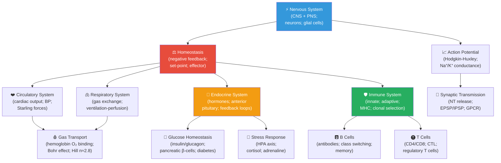

# Unit IX — Zoology and Systems Physiology: Introduction {#sec:unit_IX_unit_intro .unnumbered}


## Why This Unit Matters {.unnumbered}

In 1628, William Harvey published *Exercitatio Anatomica de Motu Cordis et Sanguinis in Animalibus*
(On the Motion of the Heart and Blood in Animals) and overturned nearly 1,500 years of Galenic medicine.
Harvey demonstrated, through quantitative reasoning alone, that the heart must be a pump recirculating
the same blood — not a furnace generating new blood from food. He calculated that the heart pushes
approximately 1.8 liters of blood per minute; if blood flowed outward and were not returned, the entire
blood volume (about 5 liters) would be exhausted in under 3 minutes. Therefore, it must circulate.
This was physiology as computational biology — numbers proving mechanism before any understanding of
cellular biology existed.

Modern systems physiology is even more mathematical. The Hodgkin-Huxley model (1952) describes the
action potential as a set of four coupled nonlinear ordinary differential equations and was solved
numerically before computers capable of doing so efficiently were widely available. Today, the same
mathematical framework underlies cardiac electrophysiology, pharmacological ion channel modeling, and
the design of neural prosthetics. Homeostasis — the maintenance of stable internal conditions — is
formalised as a negative feedback control system: a detector, comparator, and effector maintaining a
set-point, mathematically identical to engineering control systems.

This unit covers four major physiological systems — circulatory, nervous, endocrine, and immune —
with quantitative models throughout. You will apply the Hodgkin-Huxley equations to the action
potential, calculate Starling forces for capillary filtration, model hormonal negative feedback with
Hill equations, and contrast innate and adaptive immune responses as computational pattern-recognition
systems. Clinical connections appear in every section: from cardiac arrhythmias to diabetes mellitus,
from anaphylaxis to Parkinson's disease.

---

## Landmark Discoveries {.unnumbered}

| Discoverer(s) | Year | Journal / Source | Discovery | Significance |
| ------------- | ---- | ---------------- | --------- | ------------ |
| William Harvey | 1628 | \citep{harvey1628} | Systemic circulation: heart as pump | Quantitative physiology; disproved Galenic humoral theory |
| Claude Bernard | 1854–1879 | \citep{bernard1865} | Internal milieu and homeostasis | Defined the concept of regulated internal environment |
| Ernest Starling | 1918 | \citep{starling1914} | Frank-Starling law of the heart | Cardiac output proportional to venous return; basis of heart failure physiology |
| Alan Hodgkin & Andrew Huxley | 1952 | \citep{hodgkin1952quantitative} | Mathematical model of nerve action potential | Four ODEs describing Na⁺/K⁺ conductance; Nobel Prize 1963 |
| Barry Marshall & Robin Warren | 1984 | \citep{marshall1984} | *Helicobacter pylori* causes peptic ulcers | Disproved \"acid stress\" dogma; Nobel Prize 2005; key discovery in gastrointestinal physiology |
| Rosalyn Yalow & Solomon Berson | 1959 | \citep{yalow1959} | Radioimmunoassay (RIA) for insulin | Enabled measurement of hormone concentrations at picomolar levels; Nobel Prize 1977 |
| César Milstein & Georges Köhler | 1975 | \citep{milstein1975} | Monoclonal antibody production (hybridoma) | Foundation of modern immunotherapy, diagnostics, and targeted cancer therapy; Nobel Prize 1984 |

---

## Key Concepts and Connections {.unnumbered}


<!-- alt: Graph showing systems physiology concept map linking homeostasis, circulation, respiration, endocrine signaling, immunity, and neural control through feedback loops. -->

*Systems physiology concept map linking homeostasis, circulation, respiration, endocrine signaling, immunity, and neural control through feedback loops.*

**\nameref{sec:unit_IX_unit_intro} concept map — Zoology and Systems Physiology.**

---

## Current Evidence Thread {.unnumbered}

Read this unit as physiology that is known because it has been measured: every claim about action potentials, circulation, hormones, immunity, and neural circuits rests on a recording, an image, a perturbation, or a clinical measurement, and the strength of the claim is no better than the method behind it. Physiology now blends mechanism with allostasis, immune-endocrine-neural coupling, wearable data, and individualized risk without reducing bodies to simple machines. As you
move through the chapters, keep a two-column note: **claim** on the left,
**evidence that would change my confidence** on the right. By the end of the
unit, each major idea should be tied to a measurement, model, citation, or
paper-based lab decision.

## Chapter Roadmap {.unnumbered}

| Chapter | Title | Core Question | Key Equation / Model |
| ------- | ----- | ------------- | -------------------- |
| **28** | Circulation and Respiration | How do the cardiovascular and respiratory systems maintain homeostasis? | Fick's principle; Starling equation; $P_{O_2}$/Hb saturation (Hill eq.) |
| **29** | Nervous System Organization | How is the nervous system organized from molecular to systems level? | Cable equation; receptor field models |
| **30** | Action Potentials and Synapses | How do neurons generate and transmit electrical signals? | Hodgkin-Huxley: $I = C_m dV/dt + I_{Na} + I_K + I_L$ |
| **31** | Endocrine and Immune Systems | How do hormones and immune cells maintain internal defense and stability? | Negative feedback oscillator; MHC diversity; clonal selection |

---

## Connections Across the Textbook {.unnumbered}

- **Ion channels and membrane potential** (this unit) build directly on membrane transport (\cref{sec:unit_II_membrane_transport}) and electrochemistry (\nameref{sec:unit_I_unit_intro}).
- **Hemoglobin cooperativity** (Hill equation, $n \approx 2.8$) connects to enzyme allostery (\cref{sec:unit_I_enzymes_and_kinetics}) and protein structure (\cref{sec:unit_I_macromolecules}).
- **Immune system** connects to \nameref{sec:unit_VII_unit_intro} (innate response to bacteria/viruses) and \nameref{sec:unit_IV_unit_intro} (recombination of V(D)J gene segments in antibody diversity).
- **Endocrine regulation** (steroid hormones acting on nuclear receptors) links to \nameref{sec:unit_IV_unit_intro} (gene regulation) and \nameref{sec:unit_III_unit_intro} (metabolic regulation by insulin/glucagon vs. AMPK).
- **Negative feedback homeostasis** is mathematically equivalent to the control theory underlying \nameref{sec:unit_X_unit_intro} (population regulation) and \nameref{sec:unit_III_unit_intro} (metabolic feedback).

> **Key vocabulary introduced here:** homeostasis, action potential, resting membrane potential, ion channel, neurotransmitter, synapse, GPCR, second messenger, cardiac output, stroke volume, preload, afterload, Frank-Starling law, hemoglobin cooperativity, Bohr effect, hormone, receptor tyrosine kinase, antigen, MHC, clonal selection, innate immunity, adaptive immunity.


## Computational Toolbox — Unit IX {.unnumbered}

```python
from biology.physiology import oxygen_saturation
from biology.neuroscience import action_potential_hh

# Haemoglobin oxygen saturation (Hill equation): arterial vs venous
# Hill coefficient n=2.7; P50=26 mmHg for adult HbA at 37°C, pH 7.4
arterial = oxygen_saturation(pO2_mmHg=100, p50_mmHg=26, hill_coefficient=2.7)
venous = oxygen_saturation(pO2_mmHg=40, p50_mmHg=26, hill_coefficient=2.7)
print(f"Arterial SO2  (PO2=100 mmHg): {arterial.saturation:.1%}")
print(f"Venous   SO2  (PO2=40  mmHg): {venous.saturation:.1%}")
print(f"O2 extraction ratio: {(arterial.saturation - venous.saturation) / arterial.saturation:.1%}")
# Expected:
# Arterial SO2:  97.0%
# Venous   SO2:  76.2%
# O2 extraction: 21.7%  (about 5 mL O2 per 100 mL blood at rest)

# Hodgkin-Huxley action potential simulation (10 µA/cm² stimulus, 50 ms)
hh = action_potential_hh(stimulus_current_µA=10.0, t_end_ms=50.0)
peak_V = max(hh.voltage_mV)
print(f"Peak membrane voltage: {peak_V:.1f} mV")
print(f"Firing threshold crossed: {'yes' if peak_V > 0 else 'no'}")
# Expected:
# Peak membrane voltage: ~+48.0 mV (overshoot above 0 mV)
# Firing threshold crossed: yes
```

> **Try it yourself:** Reduce `stimulus_current_µA` to 5 µA/cm² — the membrane depolarizes
> but may not reach threshold. This illustrates the **most-or-none principle**.

---

*Source modules: `src/biology/physiology/` and `src/biology/neuroscience/` — `oxygen_saturation()`, `poiseuille_flow()`, `homeostasis_response()`, `action_potential_hh()`.*
*Figures: `src/visualization/` (action potential traces, hemoglobin saturation curves, hormone feedback oscillators); `src/mermaid/biology_diagrams.py` (nervous system diagrams, immune response cascades).*

## Cross-Unit Integration {.unnumbered}

The homeostatic and allostatic regulation principles of \nameref{sec:unit_IX_unit_intro} — set points, feedback loops, predictive control, integrated organ-system responses — scale beyond the individual organism. In \nameref{sec:unit_X_unit_intro} you will see these same regulatory motifs operating on populations and ecosystems: density-dependent birth and death rates are negative feedback on population size; logistic growth's carrying capacity is a set point analogous to a physiological set point; predator–prey cycles are coupled oscillators with the same mathematical structure as hormone feedback systems. As ecological dynamics unfold in \nameref{sec:unit_X_unit_intro}, recognize that the population is "regulating" itself by mechanisms structurally identical to the homeostatic loops of \nameref{sec:unit_IX_unit_intro}, just with births and deaths as the effector variables in place of hormone release.
