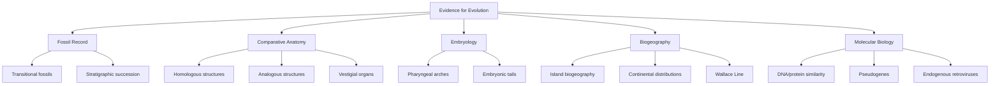
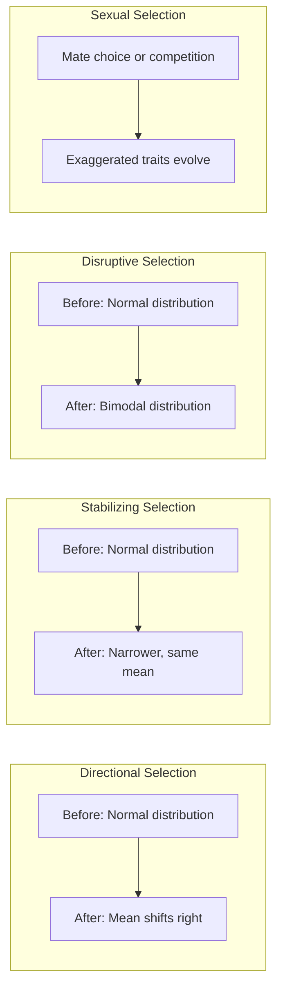
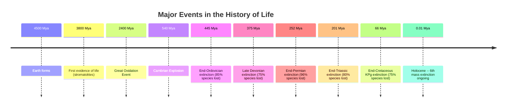

# Natural Selection and Adaptation

\label{sec:unit_VI_evolution_and_selection}


<!-- chapter-metadata-badge -->
> Level 2/3 · 60 min read · 75 min lecture · Prerequisites: \cref{sec:unit_V_population_genetics}

## Learning Objectives

By the end of this chapter, you should be able to:

1. Trace the historical development of evolutionary thought from Lamarck through Darwin \citep{darwin1858}, Wallace, and the Modern Synthesis.
2. Evaluate five independent lines of evidence supporting evolution and explain why they converge on the same conclusion.
3. Define fitness mathematically and distinguish directional, stabilizing, disruptive, sexual, kin, and frequency-dependent selection.
4. Explain adaptation, exaptation, and the constraints that limit what [**natural selection**](#gl:natural-selection) \citep{williams1966} can achieve.
5. Distinguish microevolution from macroevolution and evaluate punctuated equilibrium versus phyletic gradualism.
6. Describe coevolutionary dynamics including arms races and the Red Queen hypothesis.
7. Calculate a selection coefficient from observed allele-frequency change and predict the phenotypic response to selection using the breeder's equation $R = h^2 S$.
8. Analyze direct observations of evolution in real time — the *E. coli* long-term evolution experiment, Galápagos finch beak shifts, and cane-toad spatial sorting — and explain how each demonstrates measurable change within human timescales.
9. Evaluate the ethical responsibilities raised when evolutionary theory becomes a design framework, including gain-of-function research, gene drives, and heritable genome editing.

<!-- curriculum-scaffold-start -->
### Study Blueprint

- **Big idea:** Natural selection is differential reproductive success acting on heritable variation in context.
- **Core concepts:** variation, fitness, adaptation, selection coefficient.
- **Framework alignment:** Vision & Change: Evolution, Systems; AP Biology: Evolution, Systems Interactions; NGSS-style topics: Natural Selection and Evolution, Interdependent Relationships in Ecosystems.
- **Model or quantitative lens:** Selection coefficient and allele-frequency trajectory calculations.
- **Data skill:** Interpret fitness data and distinguish selection from other forces.
- **Practice cadence:** Visual Representations, Statistical Tests and Data Analysis, Argumentation.
- **Common misconception to repair:** Evolution is not goal-directed progress; it is local change in populations under constraints.
- **Primary lab:** \nameref{sec:lab_unit_VI_evolution_and_selection}.
- **Question bank:** \nameref{sec:q_unit_VI_evolution_and_selection}.
- **Transfer task:** Transfer selection reasoning to antibiotics, pesticide resistance, cancer, or climate adaptation.
- **Bridge to computation:** `biology.evolution.evolution.simulate_selection`.
<!-- curriculum-scaffold-end -->

---

> **Opening Vignette — Thirteen Finches, One Revelation**
> 
> In 1835, H.M.S. Beagle anchored in the Galápagos Islands for five weeks. Charles Darwin explored several islands, collecting birds and noting that their beaks differed island to island — but he initially assumed they were different species entirely. It was the ornithologist John Gould who, examining Darwin's specimens back in London in 1837, declared the 13 birds finches, each adapted to a different food source. That recognition helped Darwin understand what he had seen: a single ancestral population, blown across 900 km of ocean, had diversified into 13 species to exploit different ecological [**niche**](#gl:niche)s. The insight sparked his theory of natural selection. A century and a half later, Peter and Rosemary Grant spent 40 years documenting beak evolution in *Geospiza fortis* during drought years — measuring beaks with calipers on every individual — providing the most comprehensive real-time record of natural selection in a wild population ever assembled.

## Historical Context of Evolutionary Thought

### Pre-Darwinian Ideas

Long before Darwin, naturalists wrestled with the observation that organisms seem exquisitely matched to their environments. Three key thinkers set the stage for evolutionary biology.

**Jean-Baptiste Lamarck (1744--1829)** proposed two mechanisms of evolutionary change in his *Philosophie Zoologique* (1809). First, the **law of use and disuse** held that organs used extensively become stronger and larger, while unused organs deteriorate. Second, the **inheritance of acquired characteristics** proposed that modifications gained during an organism's lifetime pass to offspring. A blacksmith's children, by this logic, would inherit strong arms. While the inheritance mechanism was wrong, Lamarck deserves credit for proposing that species change over time -- a radical departure from the fixity of species doctrine.

**Georges Cuvier (1769--1832)** established comparative anatomy and paleontology as rigorous disciplines. Examining fossils in the Paris Basin, he documented that species in deeper (older) strata differed from living forms. His explanation was **catastrophism**: periodic catastrophic events (floods, volcanism) destroyed regional faunas, which were then replaced by immigration from unaffected areas. Cuvier vehemently opposed transmutation of species but ironically provided the fossil evidence that later supported it.

**Charles Lyell (1797--1875)** countered catastrophism with **uniformitarianism** in his *Principles of Geology* (1830--1833). He argued that the same geological processes operating today -- erosion, sedimentation, volcanism -- have typically operated, and at roughly the same rates. The Earth, therefore, must be immensely old, providing the deep time necessary for gradual biological change. Darwin carried the first volume of Lyell's *Principles* aboard HMS Beagle, and it profoundly shaped his thinking.

### Darwin's Voyage on HMS Beagle (1831--1836)

Charles Darwin boarded HMS Beagle as a gentleman naturalist at age 22. The five-year circumnavigation exposed him to patterns that would crystallize into the theory of natural selection:

- **Galapagos Islands**: Darwin collected finches, mockingbirds, and tortoises from different islands. He initially failed to label specimens by island -- an oversight he later called his greatest regret. Ornithologist John Gould identified the finches as distinct but related species, each with bill morphology matching its food source. The mockingbirds showed similar island-specific variation. Giant tortoises differed in carapace shape between islands (saddleback on arid islands with tall vegetation, dome-shaped on humid islands with low vegetation).
- **South American fauna**: Fossil glyptodonts (giant armadillos) in Argentina resembled living armadillos -- a clear example of descent with modification rather than separate creation. The rhea (South American ostrich) filled an ecological niche analogous to the African ostrich, suggesting geographic replacement driven by similar selective pressures rather than independent design.
- **Coral atolls and geological uplift**: Darwin observed raised marine terraces in Chile after the 1835 earthquake, confirming Lyell's gradualism.

### Wallace's Independent Discovery

**Alfred Russel Wallace (1823--1913)**, working as a specimen collector in the Malay Archipelago, independently conceived natural selection during a bout of malaria on the island of Ternate in February 1858. His letter to Darwin -- the famous **Ternate letter** -- outlined a mechanism virtually identical to Darwin's unpublished theory. Lyell and Joseph Hooker arranged a joint presentation to the Linnean Society of London on July 1, 1858, reading Wallace's paper alongside extracts from Darwin's 1844 essay and an 1857 letter to Asa Gray. Darwin then rushed to complete *On the Origin of Species*, published November 24, 1859.

### The Three Conditions for Natural Selection

Natural selection operates whenever three conditions are met simultaneously:

1. **Heritable variation**: Individuals in a population differ in traits, and at least some of that variation is genetically transmitted to offspring.
2. **Differential survival and reproduction**: Some variants survive longer, reproduce more, or both -- contributing disproportionately to the next generation.
3. **Environmental pressure**: Resources are limited; not most individuals can survive and reproduce equally. The environment determines which traits are advantageous.

When the three conditions hold, [**allele**](#gl:allele) frequencies shift across generations -- populations evolve.

### The Modern Synthesis and Beyond

The **Modern Synthesis** (also called the Neo-Darwinian Synthesis) emerged in the 1930s--1950s through the work of Theodosius Dobzhansky (*Genetics and the Origin of Species*, 1937), Ernst Mayr (*Systematics and the Origin of Species*, 1942), George Gaylord Simpson (*Tempo and Mode in Evolution*, 1944), and Julian Huxley (*Evolution: The Modern Synthesis*, 1942). This intellectual movement unified Darwin's mechanism of natural selection with Mendelian genetics, mathematical [**population genetics**](#gl:population-genetics) (Fisher, Wright, Haldane), paleontology, and systematics into a coherent framework. The Modern Synthesis established that:

- Evolution is the change in allele frequencies within populations over time
- Natural selection is the primary mechanism of adaptive evolution
- Gradual accumulation of small genetic changes produces large-scale evolutionary patterns
- [**Speciation**](#gl:speciation) typically involves the evolution of [**reproductive isolation**](#gl:reproductive-isolation) between geographically separated populations

The Modern Synthesis remains the foundation of evolutionary biology, though later work on evo-devo, plasticity, niche construction, epigenetic inheritance, symbiosis, and cultural evolution has expanded the synthesis.

> **Concept Check 1:** Lamarck proposed inheritance of acquired characteristics. Why does modern genetics reject this mechanism? Can you think of any biological phenomenon that superficially resembles Lamarckian inheritance? (Hint: consider epigenetic inheritance.)

---

## Evidence for Evolution Across Fossils, Genomes, and Development

Five independent lines of evidence converge to support evolution. Each alone would be suggestive; together they constitute one of the most strongly supported theories in science.


<!-- alt: Flowchart showing independent evidence streams for evolution, including fossils, anatomy, embryology, biogeography, and molecular comparison, converge on common descent and descent with modification. -->

*Independent evidence streams for evolution, including fossils, anatomy, embryology, biogeography, and molecular comparison, converge on common descent and descent with modification.*

### Fossil Record and Temporal Sequence Evidence

The fossil record documents the history of life through mineralized remains preserved in sedimentary rock. Fossils form through several processes: permineralization (minerals replace organic material), compression (organisms flattened in sediment), amber preservation (organisms entombed in tree resin), and trace fossils (footprints, burrows, coprolites). The record is inherently incomplete -- fossilization requires specific conditions (rapid burial, absence of scavengers, appropriate mineral chemistry), and soft-bodied organisms are rarely preserved. Despite this incompleteness, key transitional fossils bridge major evolutionary gaps:

- **Tiktaalik roseae** (375 Mya, Late Devonian): Discovered in 2004 on Ellesmere Island, Arctic Canada, by Neil Shubin's team. This "fishapod" possesses fish features (scales, fins, gills) alongside tetrapod features (flat head, neck, wrist bones capable of weight-bearing, ribs for lung ventilation). It bridges the fish-to-tetrapod transition.
- **Archaeopteryx lithographica** (150 Mya, Late Jurassic): Found in Solnhofen limestone, Germany. Combines dinosaur features (teeth, clawed fingers, bony tail) with bird features (asymmetric flight feathers, wishbone). Now understood as one member of a diverse radiation of feathered dinosaurs.
- **Whale evolution**: One of the best-documented evolutionary transitions. *Pakicetus* (50 Mya) was a terrestrial carnivore with cetacean ear bones. *Ambulocetus* (49 Mya) was semi-aquatic with large hind limbs for swimming. *Rodhocetus* (47 Mya) had reduced hind limbs and a more streamlined body. *Basilosaurus* (37 Mya) was fully aquatic with vestigial hind limbs. Modern cetaceans retain vestigial pelvic bones embedded in muscle.

### Comparative Anatomy and Homology

**Homologous structures** share a common developmental and evolutionary origin but may serve different functions. The vertebrate forelimb illustrates this principle: the human arm (manipulation), bat wing (flight), whale flipper (swimming), and horse leg (running) most contain the same bones -- humerus, radius, ulna, carpals, metacarpals, phalanges -- arranged in the same relative positions. The functional differences reflect modification of a shared ancestral blueprint.

**Analogous structures** arise from convergent evolution: the dolphin fin and shark fin are superficially similar but have completely different internal anatomy and developmental origins. Similarly, bird wings and insect wings evolved independently.

**Vestigial structures** are reduced remnants of organs that were functional in ancestors: the human coccyx (remnant of a tail), arrector pili muscles (produce goose bumps -- useful for fur-covered ancestors, functionless in largely hairless humans), wisdom teeth (third molars suited to ancestral diets of tough plant material), and the whale pelvis (tiny bones embedded in body wall, remnants of hind limbs).

### Embryology and Developmental Homology

**Pharyngeal arches** appear in the embryos of most vertebrates -- fish, amphibians, reptiles, birds, and mammals. In fish, these arches develop into gills and their supporting structures. In terrestrial vertebrates, the same embryonic structures are repurposed for entirely different functions: the first pharyngeal arch forms the jaw and middle ear ossicles (malleus and incus); the second arch forms the stapes, styloid process, and much of the hyoid bone; the third and fourth arches contribute to laryngeal and tracheal cartilages. This shared developmental program, using homologous embryonic structures for radically different adult functions, is compelling evidence for common ancestry.

**Haeckel's biogenetic law** ("ontogeny recapitulates phylogeny") proposed that embryonic development replays evolutionary history in sequence. While this formulation is an overstatement -- development does not literally replay adult ancestral stages -- the underlying observation remains valid: embryos of related species share developmental stages that diverge progressively later in development, reflecting their shared genetic toolkit (particularly the conserved Hox [**gene**](#gl:gene) clusters that pattern the anterior-posterior body axis across most bilaterians).

Human embryos possess a tail at approximately week 5 of development, containing 10--12 developing caudal vertebrae. By week 8, programmed cell death ([**apoptosis**](#gl:apoptosis)) reduces this to the 3--5 fused vertebrae of the adult coccyx. In rare developmental anomalies, the apoptotic program fails partially, and a "vestigial tail" is present at birth -- a striking reminder of our evolutionary heritage. Similarly, human embryos develop lanugo (fine body hair) at approximately week 20, a remnant of the fur coat that covered our mammalian ancestors.

### Biogeography and Historical Dispersal

The geographic distribution of organisms reflects evolutionary history, geological events, and patterns of dispersal and vicariance. Darwin and Wallace both recognized that biogeography provides powerful evidence for evolution -- the distribution of organisms makes sense primarily in the context of evolutionary history and plate tectonics:

- **Marsupial distribution**: Marsupials dominate Australia (kangaroos, koalas, wombats) but are largely absent from placental-dominated continents. This reflects the breakup of Gondwana: marsupials diversified in isolation on the Australian continent after its separation from Antarctica approximately 45 Mya.
- **[Island biogeography](#gl:island-biogeography)**: Oceanic islands harbor endemic species derived from mainland colonizers. Hawaiian honeycreepers, Galapagos finches, and Madagascar lemurs most represent adaptive radiations from single founding lineages.
- **Wallace Line**: A biogeographic boundary running between Borneo and Sulawesi, and between Bali and Lombok, separating the Asian and Australian faunal regions. Deep ocean trenches (reaching depths of 1,500 meters or more) prevented land bridges even during Pleistocene glacial periods when sea levels dropped by approximately 120 meters, maintaining distinct faunas on either side. West of the line: placental mammals (tigers, rhinoceroses, primates). East of the line: marsupials and monotremes (kangaroos, possums, platypuses). The line was identified by Wallace in 1859 based on his extensive collecting in the Malay Archipelago, and its correspondence with deep-water tectonic boundaries was confirmed much later by plate tectonic theory.

> **Real-World Connection: Biogeography and Conservation Hotspots**
>
> Understanding biogeographic patterns is critical for conservation. Oceanic islands and other biogeographic isolates harbor disproportionate numbers of endemic species -- organisms found nowhere else. Madagascar covers 0.4% of Earth's land surface but harbors approximately 5% of known species, nearly 90% of which are endemic. The island has been isolated from Africa for approximately 88 million years, allowing a unique biota to evolve in isolation. Conservation of island biotas requires understanding their evolutionary history: small, isolated populations are inherently vulnerable to extinction from habitat loss, introduced predators, and genetic erosion. The current extinction crisis disproportionately affects island species -- approximately 75% of recorded bird and mammal extinctions since 1500 have occurred on islands. Because "recorded extinctions" are biased toward vertebrates and well-surveyed islands, use the index as a directional warning signal, not as a complete inventory of biodiversity loss.

### Molecular Evidence from Sequence Similarity and Shared Variants

Molecular data provide the most quantitative and testable evidence for evolution. The molecular evidence is particularly powerful because it generates precise, quantitative predictions that can be verified independently:

- **Cytochrome c similarity**: This mitochondrial [**protein**](#gl:protein) is found in most [**aerobic**](#gl:aerobic) organisms. Human and chimpanzee cytochrome c sequences are 100% identical. Human and rhesus monkey differ by 1 amino acid. Human and yeast differ by approximately 40% -- yet retain the same basic function. The pattern of similarity matches phylogenetic predictions exactly.
- **Pseudogenes**: Non-functional DNA sequences that were once functional genes. Humans and chimpanzees share the same inactivating [**mutation**](#gl:mutation) in the $\psi\eta$-globin pseudogene -- an event so specific that independent occurrence is highly improbable. Shared pseudogenes are powerful evidence for common descent.
- **Endogenous retroviruses (ERVs)**: Approximately 8% of the human [**genome**](#gl:genome) consists of ancient retroviral sequences inserted into the germline of our ancestors. Humans and chimpanzees share many ERV insertion sites at identical genomic locations -- each representing an independent ancestral infection event, providing a molecular "fossil record" within the genome.
- **C-value paradox**: Genome size does not correlate with organismal complexity. The onion genome (about 16 Gb) is five times larger than the human genome (about 3.2 Gb). This reflects the accumulation of transposable elements and other non-coding sequences through evolutionary time, not design.
- **Molecular phylogenies match morphological phylogenies**: When phylogenetic trees are constructed independently from DNA sequences and from morphological characters, they produce the same branching patterns. This convergence of independent evidence is powerful confirmation that the trees reflect real historical relationships, not artifacts of either data type.

> **Real-World Connection: Forensic Phylogenetics**
>
> Molecular phylogenetics has been used in criminal investigations. In the landmark 1998 case of a Louisiana gastroenterologist accused of infecting a former lover with HIV, phylogenetic analysis of viral sequences demonstrated that the victim's HIV strain was nested within the phylogenetic cluster from one of the physician's patients -- consistent with deliberate injection of contaminated blood. The viral phylogeny, combined with epidemiological evidence, contributed to the physician's conviction. This case established molecular phylogenetics as admissible forensic evidence and demonstrated that evolutionary biology has applications far beyond the academic laboratory.

> **Concept Check 2:** A creationist argues that similarities between species reflect common design, not common descent. How would you use shared pseudogenes and endogenous retroviruses to counter this argument?

---

## Mechanisms of Natural Selection


\begin{figure}[htbp]
\centering
\includegraphics[width=0.85\textwidth]{../figures/selection_simulation.png}
\caption{Natural selection simulation: allele-frequency change over generations under directional selection, balancing selection via heterozygote advantage, and disruptive selection via heterozygote disadvantage.}
\label{fig:unit_VI_selection_simulation}
\end{figure}
<!-- alt: Three-panel line plot of allele A frequency over generations. Directional selection increases the favored allele, balancing selection trajectories converge toward an intermediate frequency, and disruptive underdominance trajectories move away from the intermediate threshold. -->


### Fitness as Reproductive Success in Context

**Darwinian fitness** ($W$) measures relative reproductive success -- the contribution of a genotype to the next generation compared to other genotypes:

\begin{equation}
W = \frac{\text{reproductive output of genotype}}{\text{mean reproductive output of population}}
\label{eq:evolution_and_selection_1}
\end{equation}

Fitness is typically relative and context-dependent. An allele conferring antibiotic resistance has $W > 1$ in the presence of antibiotics but may have $W < 1$ in their absence (due to the metabolic cost of resistance).

For a single locus with two alleles, if we assign the favored homozygote fitness $W_{AA} = 1$, then:

\begin{equation}
W_{Aa} = 1 - hs \quad \text{and} \quad W_{aa} = 1 - s
\label{eq:evolution_and_selection_2}
\end{equation}

where $s$ is the selection coefficient and $h$ is the dominance coefficient.


<!-- alt: Flowchart showing selection modes change trait distributions in different ways: directional selection shifts a mean, stabilizing selection narrows variation, disruptive selection splits a distribution, and sexual selection amplifies mating-linked traits. -->

*Selection modes change trait distributions in different ways: directional selection shifts a mean, stabilizing selection narrows variation, disruptive selection splits a distribution, and sexual selection amplifies mating-linked traits.*

\begin{equation}
\frac{d\bar{W}}{dt} = V_A(W)
\label{eq:evolution_and_selection_3}
\end{equation}

This theorem implies that natural selection typically increases mean fitness (though the environment may change, altering what "fit" means). It also implies that populations under strong selection rapidly deplete additive genetic variance -- the more efficiently selection operates, the faster it erodes its own fuel.

> **Concept Check (Synthesis --- Cross-Unit Connection):** \nameref{sec:unit_0_unit_intro} introduced the Free Energy Principle: biological systems minimize variational [**free energy**](#gl:free-energy) (prediction error) to maintain their phenotypic states. (a) Reframe natural selection in FEP terms: if fitness reflects how well an organism's phenotype predicts and responds to its environment, explain why selection pressure corresponds to the gradient of long-run expected surprise across phenotypic variation. (b) In this framing, what does "genetic drift" correspond to --- is it analogous to noise in a learning algorithm, to stochastic exploration in active inference, or to something else? Defend your choice. (c) How does the Baldwin effect (environmentally induced phenotypic change that can become genetically assimilated) illustrate the relationship between within-lifetime and across-generation free energy minimization?

### Directional Selection and Trait-Mean Shifts

Directional selection shifts the mean [**phenotype**](#gl:phenotype) toward one extreme. The population's phenotype distribution moves in one direction across generations, in contrast to the stabilizing and disruptive regimes whose divergent allele-frequency trajectories are simulated in \cref{fig:unit_VI_selection_simulation}.

**Industrial melanism in *Biston betularia***: Before the Industrial Revolution, the typical peppered moth was light-colored, camouflaged against lichen-covered tree bark. The melanic (dark) form, controlled by a [**dominant**](#gl:dominant) allele at the *cortex* locus, increased from approximately 1% in 1848 to 98% in Manchester by 1898 as industrial soot darkened tree trunks. Light moths were conspicuous to bird predators on dark bark. Following the Clean Air Act (1956), lichen recovered, and the light form returned to dominance -- a textbook example of directional selection reversing direction.

**Antibiotic resistance**: Random mutations conferring resistance arise at low frequency in bacterial populations. In the presence of antibiotics, resistant bacteria have enormous selective advantage ($s \approx 0.1$--$1.0$). With generation times of 20--30 minutes, resistance alleles can reach fixation within days -- evolution observable within a single clinical episode. Multiple mechanisms confer resistance: target modification (altered penicillin-binding proteins in MRSA), enzymatic degradation (beta-lactamases that hydrolyze penicillin), efflux pumps (that actively export antibiotics from the cell), and membrane permeability changes (reduced porin expression in Gram-negative bacteria).

The selection coefficient can be estimated from the rate of allele frequency change:

\begin{equation}
s \approx \frac{\Delta p}{p(1-p)} \cdot \frac{1}{\Delta t}
\label{eq:evolution_and_selection_4}
\end{equation}

### Worked Example: Estimating the Selection Coefficient

**Problem:**
A novel antibiotic resistance allele in a hospital population of *Staphylococcus aureus* is initially present at a frequency of $p = 0.01$. After $\Delta t = 50$ generations of continuous antibiotic exposure, the resistance allele reaches a frequency of $p' = 0.06$. Assuming the change is driven entirely by selection, estimate the selection coefficient ($s$) favoring this resistance allele.

**Solution:**

1. **Identify the change in allele frequency ($\Delta p$):**
   $$ \Delta p = p' - p = 0.06 - 0.01 = 0.05  \label{eq:unit_VI_evolution_and_selection_item_1}$$


2. **Calculate the selection coefficient using the approximation formula:**
   Substitute the initial frequency $p = 0.01$, the change $\Delta p = 0.05$, and the time $\Delta t = 50$ generations:
   $$ s \approx \frac{0.05}{0.01(1 - 0.01)} \cdot \frac{1}{50}  \label{eq:unit_VI_evolution_and_selection_item_2}$$

   $$ s \approx \frac{0.05}{0.0099} \cdot 0.02  \label{eq:unit_VI_evolution_and_selection_item_3}$$

   $$ s \approx 5.0505 \cdot 0.02 \approx 0.101  \label{eq:unit_VI_evolution_and_selection_item_4}$$

   
The selection coefficient is approximately **0.10**. This means the resistant bacteria have a roughly 10% fitness advantage over the sensitive bacteria in the presence of the antibiotic, allowing the resistance allele to rapidly sweep through the population.

In the absence of antibiotics, resistance alleles often carry a **fitness cost** (the resistant genotype grows more slowly than the sensitive genotype). This predicts that resistance frequencies should decline when antibiotic use is reduced. However, compensatory mutations can eliminate the fitness cost of resistance without eliminating resistance itself -- making resistance effectively irreversible in many clinical settings.

### Stabilizing Selection and Intermediate Optima

Stabilizing selection favors intermediate phenotypes, reducing variance without shifting the mean. It is the most common form of selection in nature.

**Human birth weight**: \citet{karn1951} documented that neonatal mortality is lowest at birth weights of approximately 3.5 kg. Both very low-birth-weight ($<$2 kg) and very high-birth-weight ($>$4.5 kg) infants suffer increased mortality from complications including respiratory distress and obstructed labor, respectively. Modern medical intervention has relaxed this selection somewhat but has not eliminated it.

**Clutch size in birds**: David Lack proposed that the most common clutch size maximizes the number of surviving offspring. Too few eggs waste reproductive potential; too many eggs lead to inadequate provisioning and higher chick mortality. Experimental studies in great tits (*Parus major*) confirmed this: broods artificially enlarged beyond the modal clutch size fledged more chicks in the short term but produced lighter, lower-quality offspring with reduced survival -- the intermediate clutch size maximizes lifetime reproductive success.

**The stabilizing selection paradox**: If stabilizing selection constantly removes extreme phenotypes and their underlying genetic variation, why does heritable variation persist? Several mechanisms maintain variation under stabilizing selection:

- Recurrent mutation continuously introduces new alleles
- Balancing selection at underlying loci (heterozygote advantage, frequency-dependent selection)
- Genotype-by-environment interactions: different genotypes may be "intermediate" in different environments
- Pleiotropic constraints: alleles affecting the stabilized trait may also affect other traits under different selective regimes
- Epistatic interactions among loci can maintain genetic variation even when the phenotypic distribution appears stable

### Disruptive (Diversifying) Selection

Disruptive selection favors both phenotypic extremes at the expense of intermediate forms, potentially producing a bimodal distribution.

**Black-bellied seedcracker (*Pyrenestes ostrinus*)**: In Cameroon, this finch exhibits a striking bimodal distribution of bill sizes. Small-billed birds efficiently crack soft sedge seeds; large-billed birds crack hard sedge seeds. Intermediate-billed birds perform poorly on both seed types and have lower fitness. Remarkably, this polymorphism is controlled by a single locus with large effect on bill width, demonstrating that major adaptive variation can have a simple genetic basis. Disruptive selection in this system maintains the polymorphism because heterozygotes (with intermediate bills) have lower fitness than either homozygote -- the opposite of heterozygote advantage.

Disruptive selection is of particular evolutionary interest because, if strong enough and accompanied by assortative mating (large-billed birds preferring to mate with other large-billed birds, and vice versa), it can drive **[sympatric speciation](#gl:sympatric-speciation)** -- the formation of new species without geographic isolation (see \cref{sec:unit_VI_genetic_drift_and_speciation}).

### Worked Example: Selection Coefficient and Allele Frequency Dynamics

**Problem:**
Consider a single-locus, two-allele model with heterozygote advantage. Starting allele frequencies are $p_0 = 0.9$ for $A_1$ and $q_0 = 0.1$ for $A_2$. Relative fitnesses are $w_{11} = 0.8$, $w_{12} = 1.0$, $w_{22} = 0.7$. (a) Compute the population mean fitness $\bar{w}$ in the current generation. (b) Compute the allele frequency $p'$ in the next generation. (c) Find the equilibrium frequency $\hat{p}$ predicted under heterozygote advantage.

**Solution:**

1. **Mean fitness $\bar{w}$:**
   $$\bar{w} = p^2 w_{11} + 2pq\,w_{12} + q^2 w_{22} = (0.81)(0.8) + (0.18)(1.0) + (0.01)(0.7) = 0.648 + 0.180 + 0.007 = 0.835.$$

2. **Next-generation frequency $p'$:**
   $$p' = \frac{p^2 w_{11} + pq\,w_{12}}{\bar{w}} = \frac{0.648 + 0.090}{0.835} = \frac{0.738}{0.835} \approx 0.884.$$

3. **Equilibrium frequency $\hat{p}$** under heterozygote advantage (setting $\Delta p = 0$):
   $$\hat{p} = \frac{w_{12} - w_{22}}{2 w_{12} - w_{11} - w_{22}} = \frac{1.0 - 0.7}{2.0 - 0.8 - 0.7} = \frac{0.3}{0.5} = 0.6, \qquad \hat{q} = 0.4.$$

**Interpretation:**
In the first generation, $p$ falls from 0.9 toward the equilibrium value $\hat{p} = 0.6$ — a balanced polymorphism is maintained because both homozygotes have reduced fitness relative to the heterozygote. This dynamic mirrors the maintenance of the sickle hemoglobin allele in malaria-endemic regions: HbAS heterozygotes carry the highest fitness, HbAA homozygotes pay a malaria-susceptibility cost, and HbSS homozygotes pay a severe anemia cost. The equilibrium frequency of HbS in such populations is the empirical analog of the $\hat{q}$ computed here.


### Sexual Selection and Mating Success

Darwin recognized that many traits -- peacock tails, elk antlers, birdsong complexity -- reduce survival but enhance mating success. **Sexual selection** operates through two mechanisms: **intrasexual selection** (typically male-male competition for access to mates or to resources mates require) and **intersexual selection** (mate choice, typically by females among displaying males).

#### Intrasexual selection: competition within the same sex

Intrasexual selection acts when members of one sex (most commonly males) compete directly with one another for reproductive access. Three modes of competition predominate:

- **Direct contest competition** (combat, ritualized fighting): Males fight to displace rivals. Red deer (*Cervus elaphus*) stags engage in roaring contests followed by antler-locked pushing matches; mass and antler size predict victory and harem retention. Bighorn sheep (*Ovis canadensis*) rams meet head-on at velocities of ~36 km/h; horn size and the bony reinforcement of the skull are direct outcomes of intrasexual selection. Northern elephant seal (*Mirounga angustirostris*) bulls grow to 3-4× the female mass — the most extreme sexual size dimorphism in mammals — because beachmaster males monopolize harems of 30–100 females through direct combat.
- **Resource defense (territoriality)**: Males defend territories containing critical resources (food, nest sites, oviposition substrate); females mate with the holder of the best territory. Red-winged blackbirds (*Agelaius phoeniceus*) defend marsh territories whose vegetation density predicts female settlement. Cichlid males defend pebble-bottom spawning sites whose orientation to currents affects egg survival. The trait under selection is the **capacity to acquire and defend** the territory, not necessarily a morphological ornament.
- **Scramble competition**: When females are widely distributed and rapidly receptive, the male who locates and reaches receptive females fastest wins. *Drosophila* species in the wild engage in scramble competition for emerging virgin females; selection favors visual acuity, locomotor performance, and pheromone detection. In thirteen-lined ground squirrels, males that emerge earliest from hibernation locate the most receptive females. Scramble competition selects for **endurance, sensory acuity, and search efficiency** rather than weaponry.

A fourth mode, **sperm competition**, operates after copulation when females mate with multiple males within a single fertile period. Selection acts on sperm number, sperm motility, and copulatory plug deposition. Testis-to-body-mass ratio is a quantitative correlate of sperm competition intensity: chimpanzees (highly polyandrous) have testes ~3× the size of gorillas (harem-guarding) on a body-mass-corrected basis.

#### Intersexual selection: mate choice

In intersexual selection, members of one sex (typically females) choose among displaying members of the other. The peacock's elaborate tail is the canonical example. Three complementary hypotheses explain female preference for costly ornaments — they are not mutually exclusive, and empirical examples often combine elements of the three mechanisms.

**Sensory exploitation** provides a fourth, mechanistically distinct hypothesis: female preferences may arise initially from pre-existing sensory biases unrelated to mate choice (e.g., sensitivity to a frequency band useful for prey detection), and males evolve traits that exploit those biases. The túngara frog (*Engystomops pustulosus*) "chuck" call exploits a sensory bias inherited from a common ancestor: females of related species that have rarely produced "chucks" themselves still prefer males that add the syllable. Sensory exploitation grounds preference in **pre-existing neural architecture** rather than in genetic correlation or signal honesty.

#### Honest signaling (Zahavi handicap principle)

Amotz Zahavi (1975) proposed that **costly ornaments are honest signals of male quality** precisely because they are costly. A male who can survive the metabolic, predation, and parasite-related costs of an elaborate tail must have superior underlying genetic quality (immunity, foraging ability, parasite resistance). Females that select males with the most extravagant ornaments preferentially choose mates who carry "good genes" — the genes their offspring will inherit.

The handicap principle predicts that **ornaments should be condition-dependent**: primarily individuals in good condition can produce the most extreme display. \citet{hamilton1982} extended this with the **parasite-mediated sexual selection hypothesis**: bright male coloration in birds, bright tail color in fish, and similar ornaments depend on physiological condition that itself depends on parasite resistance. Female choice based on ornament brilliance is therefore choice for parasite-resistance alleles.

**Empirical support**: In the satin bowerbird (*Ptilonorhynchus violaceus*), males build elaborate bowers and decorate them with blue objects to attract females. Males with brighter plumage and more extensive bowers also have lower parasite loads — consistent with the handicap principle. In barn swallows (*Hirundo rustica*), males with longer outer tail feathers (a sexually selected trait) carry fewer feather mites.

#### Fisher-Lande runaway selection

R.A. Fisher (1930) and Russell Lande (1981) developed the **runaway selection model**, which can produce arbitrarily extreme ornaments through a positive-feedback loop between female preference and male trait — without requiring that the ornament signal anything about quality.

The model proceeds in three stages:

1. **Initial preference**: A small genetic predisposition for some male trait variant exists in females (e.g., females prefer males with slightly longer tails because long tails happen to indicate flight performance).
2. **Genetic correlation**: When females with the preference allele mate with males possessing the preferred trait, their **offspring inherit both genetic linkage groups** — daughters receive the preference allele *and* sons receive the trait allele. The two loci become genetically correlated.
3. **Runaway**: Now selection on the trait drives correlated change in the preference, and vice versa. The two loci can spiral together to extreme values, **even when the trait becomes maladaptive** by other survival measures, because the trait is now selected purely by its effect on mating success.

Runaway is balanced eventually by natural selection against the ornament becoming dangerous (predation, energetic costs). The equilibrium can be at moderate ornament size or, depending on parameters, can produce the bizarre extremes seen in birds of paradise and peacocks.

#### Good genes model

The **good genes model** is closely related to but distinguishable from the handicap principle. The handicap requires that the ornament itself be costly and condition-dependent. The good genes model primarily requires that some heritable component of male quality (immunity, growth rate, viability, foraging skill) be correlated with the trait females prefer. The female who chooses a higher-quality male produces higher-quality offspring through both **autosomal good genes** (offspring inherit advantageous viability alleles) and **viability genes**.

Empirical tests are difficult because they require demonstrating heritable variance in fitness correlated with the trait — a very high data bar.

#### Worked scenario: peacock tail evolution

Imagine an ancestral peafowl population in which a small subset of females have a slight genetic preference for males with longer tails ("preference allele" frequency = 0.05). Long-tailed males are 5% more likely to be mated than short-tailed males, but they pay a 10% survival cost from increased predation. The genetic correlation between preference and trait builds over generations — initially weakly, but accelerating once the correlation becomes substantial. After ~100 generations of runaway, both preference frequency and tail length have escalated dramatically. The system reaches equilibrium when the survival cost (10% per unit tail length) balances the mating advantage (5% × tail length), producing tail lengths far beyond what natural selection alone would favor.

**The peacock's tail thus is** simultaneously: (a) an honest signal of genetic quality (Zahavi handicap), (b) the equilibrium of a Fisherian runaway between preference and trait, and (c) a marker for "good genes" (parasite resistance) \citep{hamilton1982}. The three mechanisms can operate together. Modern empirical work emphasizes that real peacock tail evolution — and most sexual ornaments — combines these forces in proportions that vary across species and contexts.

> **Concept Check (Synthesis):** Zahavian handicap theory proposes that elaborate ornaments (peacock tail, elk antlers) are honest signals of genetic quality precisely because they are costly to produce and maintain. A male with poor parasite resistance would struggle to bear the cost of a large peacock tail without paying a survival penalty — so females who prefer larger tails are selecting indirectly for the immune-gene variants that permit them. (a) Formalize this with a two-locus toy model: an ornament allele $O$ (cost $c$, viability $1 - c$) paired with a resistance allele $R$ (benefit $b$, viability $1 + b$). Under what condition (relationship between $b$ and $c$, allowing for the genetic correlation between $O$ and $R$ that female preference generates) does the female preference for $O$ spread? (b) Fisher's *sexy sons* (runaway) mechanism is an alternative: female preference and male ornament become genetically correlated and co-evolve as a positive-feedback loop, independent of any signal honesty. Contrast the predictions of the two models for what happens when parasites are experimentally removed from a population — which model predicts that ornament size declines, and which predicts that ornament size remains high (or continues to drift upward) for several generations after the parasite pressure is lifted?


### Kin Selection and Inclusive Fitness

**Hamilton's rule** explains altruistic behavior: an altruistic act is favored when \citep{hamilton1964geneticalI,hamilton1964geneticalII}:

\begin{equation}
rB > C
\label{eq:unit_VI_hamilton_rule}
\end{equation}

where $r$ is the coefficient of relatedness between actor and recipient, $B$ is the reproductive benefit to the recipient, and $C$ is the reproductive cost to the actor.

Coefficients of relatedness:

- Full siblings: $r = 0.5$
- Half-siblings: $r = 0.25$
- First cousins: $r = 0.125$
- Parent–offspring: $r = 0.5$

**[Eusociality](#gl:eusociality) in insects**: Eusocial societies combine cooperative brood care, overlapping generations, and a reproductive division of labor in which some individuals reproduce little or do not reproduce \citep{crespi1995definition,bourke2011principles}. In [**haplodiploid**](#gl:haplodiploidy) Hymenoptera (many ants, bees, and wasps), females are diploid and males are haploid. Full sisters can share $r = 0.75$ (the full paternal genome plus, on average, half of the maternal genome), so helping a mother produce sisters can satisfy Hamilton's rule more easily than producing one's own offspring. The honeybee genome made this a concrete genomic system for studying sociality, chemical communication, immunity, and caste biology \citep{honeybeeGenome2006}.

Haplodiploidy is a useful entry point but not a sufficient explanation. Many haplodiploid insects are solitary, while termites are diploid and nevertheless evolved eusocial colonies. Comparative evidence points to ancestral monogamy, kin structure, defensible nests, progressive brood provisioning, and ecological risks of independent nesting as interacting conditions that make helping profitable \citep{hughes2008ancestral,bourke2011principles}. Termites are especially important because phylogenetic work places them within cockroaches, showing that eusociality evolved independently outside Hymenoptera \citep{inward2007death}.

### Evolutionary Game Theory: Hawk–Dove and the ESS

Evolutionary game theory analyzes situations in which an individual's payoff depends on the **strategies adopted by others** in the population. The framework was introduced by John Maynard Smith and George Price (1973) to explain ritualized animal contests. The cornerstone concept is the **evolutionarily stable strategy (ESS)**: a strategy that, once common in a population, cannot be invaded by any rare alternative strategy.

The classic example is the **Hawk–Dove game**. Two individuals contest a resource of value $V$. A "Hawk" escalates the contest, risking injury at cost $C$ if it loses. A "Dove" displays but retreats from escalation. The expected payoffs:

: Evolutionary Game Theory: Hawk–Dove and the ESS. {#tbl:unit_VI_evolution_and_selection_evolutionary_game_theory_hawk_dove_and_the_ess}
| Opponent → | Hawk | Dove |
|----------:|:----:|:----:|
| **Hawk plays** | $\frac{V-C}{2}$ | $V$ |
| **Dove plays** | $0$ | $\frac{V}{2}$ |

When two Hawks meet, each wins half the time and pays the cost half the time, giving expected payoff $(V-C)/2$. A Hawk against a Dove takes the resource ($V$). Two Doves share peacefully ($V/2$ each).

If $V > C$ (resource exceeds the cost of injury), pure Hawk is the ESS — escalation typically pays. If $V < C$ (more interesting biological case), neither pure strategy is stable: pure Dove can be invaded by Hawks (who exploit the peaceful population), but pure Hawk can be invaded by Doves (who avoid the cost of constant fighting). The stable outcome is a **mixed ESS** with frequencies determined by the cost–benefit structure:

\begin{equation}
p^*_{\text{Hawk}} = \frac{V}{C}
\label{eq:unit_VI_ess_hawkdove}
\end{equation}

#### Numerical illustration of the Hawk–Dove ESS

Suppose the contested resource is worth $V = 10$ (e.g., a breeding territory worth 10 offspring) and the cost of injury in a fight is $C = 40$ (a serious wound costing 40 future offspring). Because $V < C$, the mixed ESS predicts $p^*_{\text{Hawk}} = 10/40 = 0.25$ — twenty-five percent of contests are escalated to fighting. At equilibrium, the **expected payoff is identical** for both strategies:

- $E[\text{Hawk}] = 0.25 \cdot \frac{10-40}{2} + 0.75 \cdot 10 = -3.75 + 7.5 = 3.75$
- $E[\text{Dove}] = 0.25 \cdot 0 + 0.75 \cdot 5 = 3.75$

This frequency-dependence is the engine that maintains the polymorphism: any deviation from $p = 0.25$ creates a fitness gradient that pulls the population back. A population of 30% Hawks rewards Doves more than Hawks; a population of 20% Hawks rewards Hawks more than Doves. The ESS is **negatively frequency-dependent at the strategy level** — the rarer strategy typically has the higher payoff.

When everyone plays Hawk with probability $V/C$, no individual gains by deviating. The same equilibrium can be realized in two ways: each individual mixes Hawk and Dove with probability $V/C$, or the population is a polymorphism with fraction $V/C$ committed Hawks and $1 - V/C$ committed Doves. **Behavioral dimorphisms in spider mating tactics, frog calling strategies, and male-morph polymorphisms in side-blotched lizards** match Hawk–Dove or related ESS predictions quantitatively.

Game theory generalizes to many other biological problems: parental investment (Trivers 1972), public-goods cooperation (Tragedy of the Commons), the evolution of virulence in pathogens, and host–parasite coevolution. The ESS concept formalizes Darwin's insight that "the rules of the game" can themselves be evolutionary outcomes — selection acts on strategies, not just on traits.

### The Breeder's Equation

While population-genetic models track allele frequencies under selection, **quantitative genetics** describes the response of continuously varying phenotypes (height, milk yield, beak depth) to selection. The central result is the **breeder's equation**:

\begin{equation}
R = h^2 S
\label{eq:unit_VI_breeders_equation}
\end{equation}

where $R$ is the **response to selection** (the change in mean phenotype across one generation), $S$ is the **selection differential** (the difference between the mean of selected parents and the mean of the entire parental population), and $h^2$ is the **narrow-sense heritability** — the proportion of phenotypic variance attributable to additive genetic variance:

\begin{equation}
h^2 = \frac{V_A}{V_P} = \frac{V_A}{V_A + V_D + V_E}
\label{eq:unit_VI_heritability}
\end{equation}

with $V_A$ = additive genetic variance, $V_D$ = dominance variance, $V_E$ = environmental variance.

#### Worked example: Galapagos finches

Peter and Rosemary Grant measured beak depth in *Geospiza fortis* during the 1977 Galapagos drought. The selection differential (mean beak depth of survivors minus mean of original population) was $S = +0.6$ mm. Heritability of beak depth, estimated from parent–offspring regression, was $h^2 = 0.74$. The predicted response is:

$$R = h^2 \times S = 0.74 \times 0.6 \text{ mm} = 0.44 \text{ mm} \label{eq:unit_VI_evolution_and_selection_item_5}$$


The observed response in the next generation (offspring of the 1977 survivors) was +0.43 mm — a strikingly precise prediction confirming both the heritability estimate and the breeder's equation. The drought selected for deeper beaks (better at cracking large, hard seeds that remained when small seeds were exhausted), and this trait responded to selection within a single generation.

#### Worked example: artificial selection on plant height

Suppose a maize breeder wishes to increase mean plant height. The base population has mean height $\bar{z}_0 = 200$ cm with phenotypic standard deviation $\sigma_P = 15$ cm. The breeder selects the tallest 10% of plants as parents of the next generation, whose mean height is $\bar{z}_{\text{selected}} = 205$ cm. Heritability has been estimated by parent–offspring regression at $h^2 = 0.8$ (a high but realistic value for plant height under controlled conditions).

1. **Selection differential**: $S = \bar{z}_{\text{selected}} - \bar{z}_0 = 205 - 200 = 5$ cm.
2. **Predicted response**: $R = h^2 \cdot S = 0.8 \times 5 = 4$ cm. The next generation's mean is predicted at $\bar{z}_1 = 200 + 4 = 204$ cm.
3. **After multiple generations**: If $h^2$ stays roughly constant and the selection differential is reapplied each generation, the population gains ~4 cm per generation in expectation. After 10 generations under unrelaxed selection, mean height could rise to ~240 cm — although in practice $h^2$ erodes as additive variance is depleted, and physiological constraints (lodging, mechanical failure under wind load) eventually limit the response.

This calculation illustrates two practical points. **First, $h^2$ matters more than the apparent strength of selection**: doubling the selection differential to $S = 10$ would produce $R = 8$ cm, but halving $h^2$ to 0.4 (more realistic for height in a wild population) produces $R = 2$ cm even at $S = 5$. **Second, response decelerates over time** as additive variance is consumed by directional selection — long-term selection experiments (the Illinois corn protein/oil lines, now over 100 generations) eventually plateau as genetic variance is exhausted unless mutation refills the supply.

#### Worked example: directional selection on *Drosophila* bristle number

A classic *Drosophila melanogaster* selection experiment measures abdominal bristle number, a quantitative trait under polygenic control. Suppose the base population has mean bristle number $\bar{z}_0 = 40$, and parent–offspring regression has established narrow-sense heritability $h^2 = 0.4$. The investigator selects breeding parents whose mean bristle number is $\bar{z}_{\text{selected}} = 50$, giving selection differential $S = 50 - 40 = 10$ bristles.

1. **Predicted response per generation**: $R = h^2 \cdot S = 0.4 \times 10 = 4$ bristles. After one generation the offspring mean is predicted at $\bar{z}_1 = 40 + 4 = 44$ bristles.
2. **Response after 5 generations of unrelaxed selection** (assuming constant $h^2$ and constant $S$): $\bar{z}_5 \approx \bar{z}_0 + 5R = 40 + 5 \times 4 = 60$ bristles — a 50 % gain over the base mean.
3. **Plateau dynamics**: Real *Drosophila* bristle-number experiments (Mather & Harrison 1949; Clayton, Morris & Robertson 1957) confirm linear gains for ~15–25 generations followed by a plateau as additive variance is depleted. When selection is relaxed, populations often partially regress toward the base mean — evidence that some response was achieved through linkage disequilibrium of mildly deleterious alleles dragged along with the favored variants. New mutational input refills $V_A$ on a timescale of $4N_e$ generations (the neutral coalescent time), so very long-term experiments can show a second slower phase of response sustained by mutation–selection balance.

This worked example illustrates **why agricultural breeders monitor $V_A$ erosion**: the breeder's equation is exact in expectation but predicts the rate of variance depletion as well as the rate of mean gain. Once $V_A$ approaches zero, response approaches zero regardless of how strongly the breeder selects.

### Worked Example: Response to Selection Over Multiple Generations

**Problem:**
A wild population of medium ground finch has mean beak depth $\mu_0 = 100$ mm and narrow-sense heritability $h^2 = 0.45$. Each generation, parents are selected whose mean beak depth is $\mu_{\text{parents}} = 110$ mm, giving selection differential $S = 10$ mm. (a) Project the population mean for three generations under the constant-$h^2$ form of the breeder's equation. (b) Now relax constancy: assume additive genetic variance $V_A$ erodes by 5% per generation, so $h^2$ in generation $t$ is $h^2_t = 0.45 \times (0.95)^t$. Recompute the response $R_3$ and the projected mean at generation 3.

**Solution:**

1. **Constant-$h^2$ projection:**
   - Response per generation: $R = h^2 S = 0.45 \times 10 = 4.5$ mm.
   - $\mu_1 = 100 + 4.5 = 104.5$ mm.
   - $\mu_2 = 104.5 + 4.5 = 109.0$ mm.
   - $\mu_3 = 109.0 + 4.5 = 113.5$ mm.

2. **Variance-eroding projection:**
   - Heritability at generation 3: $h^2_3 = 0.45 \times (0.95)^3 \approx 0.45 \times 0.857 \approx 0.386$.
   - Response in generation 3: $R_3 = 0.386 \times 10 = 3.86$ mm.
   - Projected mean (summing the eroded responses): $\mu_3 \approx 100 + 4.50 + 4.28 + 4.06 \approx 112.8$ mm.

**Interpretation:**
The constant-$h^2$ projection over-predicts the gain because it ignores variance depletion. Real long-term artificial-selection responses decelerate for this reason: directional selection consumes additive variance faster than mutation replenishes it. The pattern connects to Galton's regression toward the mean, to the plateaus observed in long-term *Drosophila* bristle and Illinois corn protein–oil experiments, and to the agricultural rule of thumb that gains slow once a single trait has been pushed for many generations on a closed gene pool.


#### Why the breeder's equation works

The equation reflects a simple algebraic truth: primarily the **additive** genetic component of phenotypic variation is reliably transmitted from parents to offspring. Dominance variance ($V_D$) reflects allele-pairing combinations that are scrambled by meiosis. Epistatic interactions ($V_I$) similarly do not transmit faithfully. Environmental variance ($V_E$) is non-heritable. Thus the **realized** response equals the additive heritability times the selection that was actually applied. The breeder's equation is the workhorse of agricultural selection (dairy cattle, corn, tomatoes), animal breeding (racehorses, dogs), and the analysis of natural selection in wild populations.

#### Limitations and the multivariate breeder's equation

The simple form assumes a single trait under direct selection, with stable heritability across generations and a stable environment. In practice, traits are correlated through pleiotropy and linkage; selection on one trait drags correlated traits along. The **multivariate breeder's equation** generalizes:

$$\Delta\bar{z} = G P^{-1} S \label{eq:unit_VI_evolution_and_selection_item_6}$$


where $\Delta\bar{z}$ is the vector of phenotypic responses, $G$ is the genetic covariance matrix, $P$ is the phenotypic covariance matrix, and $S$ is the vector of selection differentials. This Lande–Arnold framework (1983) underlies modern multivariate quantitative genetics and explains why trait evolution can be **constrained by genetic correlations** even when selection on each trait individually is strong.

### Evolvability, Modularity, and Developmental Constraints

The capacity of a population to respond to selection is itself a heritable, evolving property called **evolvability**. Two organizational features make some lineages dramatically more evolvable than others.

#### Modularity

A **modular** genotype–phenotype map partitions traits into semi-independent units, each controlled by largely separate gene networks. Selection on one module — say, fin shape in cichlids, or beak depth in finches — leaves other modules undisturbed. Modular architectures evolve faster because beneficial modifications in one module do not derail traits in other modules. The **butterfly wing eyespot system** is a paradigm of modularity: each eyespot is patterned by a conserved gene-regulatory module (Distal-less, Engrailed, Spalt) that can be redeployed independently across wing positions, allowing rapid diversification of eyespot patterns across species without disturbing wing structure or other traits.

In contrast, **highly integrated** (non-modular) systems show **pleiotropic constraint**: every mutation affects many traits simultaneously, most beneficial mutations also produce deleterious side-effects, and adaptive evolution is slow. The **vertebrate skull** is intermediate — highly integrated for biomechanical reasons (the bones must articulate properly), but with enough modularity that snakes, birds, and toothed whales evolved radically divergent skull shapes from the same ancestral plan.

#### Developmental constraints, canalization, and cryptic variation

**Canalization** is the developmental buffering that produces the same phenotype across a range of genetic and environmental perturbations. Conrad Waddington (1942) introduced the metaphor of the **epigenetic landscape**, in which developmental trajectories follow valleys of low resistance toward stable phenotypic outcomes. Canalization implies that **genetic variation is hidden** beneath robust development — many segregating alleles do not affect phenotype because development buffers their effects.

When buffering is overwhelmed — by extreme environmental stress, by a chaperone disruption (HSP90 inhibition reveals abundant cryptic variation in *Drosophila*), or by a major mutation — **cryptic genetic variation** is exposed. The newly visible phenotypic variation can then respond to selection. **Genetic assimilation** is the process by which a phenotype originally produced primarily under stress becomes fixed and is produced under most conditions, having recruited cryptic variation along the way.

**Cryptic variation as evolutionary fuel**: Recent studies in zebrafish, threespine stickleback, and *Drosophila* show that populations with deeper reservoirs of cryptic variation respond to novel selection pressures faster than populations with shallow reservoirs. Modular development plus cryptic variation thus form a paired pair of features that increase evolvability — modularity by allowing independent change, cryptic variation by storing adaptive material.

**[Inclusive fitness](#gl:inclusive-fitness)**: Hamilton's insight extended the concept of fitness beyond direct reproduction. An individual's inclusive fitness includes both its direct fitness (own offspring) and the fitness gained indirectly by helping relatives reproduce — weighted by the coefficient of relatedness \citep{hamilton1964geneticalI,hamilton1964geneticalII}. A sterile worker bee with zero direct fitness can still have high inclusive fitness if she helps her queen mother produce many full sisters; the same logic also explains why social evolution is sensitive to queen mating number, colony founding ecology, and whether helpers are assisting full siblings, half-siblings, or more distant kin.

### Frequency-Dependent Selection

**Negative frequency-dependent selection**: Rare phenotypes have a fitness advantage. As a phenotype becomes common, its fitness decreases. This maintains polymorphism.

**Side-blotched lizards (*Uta stansburiana*)**: Males have three throat color morphs engaged in rock-paper-scissors dynamics. Orange-throated males are aggressive and defeat blue-throated males. Blue-throated males form pair bonds that resist sneaking by yellow-throated males. Yellow-throated males (female mimics) successfully sneak copulations from orange-throated males. No morph can dominate permanently; frequencies cycle over approximately 6-year periods — a real-world realization of a multi-strategy ESS.

**Positive frequency-dependent selection**: The common phenotype has an advantage (e.g., warning coloration in Mullerian mimicry — predators learn to avoid the most common pattern).

> **Concept Check 3:** A population of side-blotched lizards has roughly equal frequencies of orange, blue, and yellow male morphs. Each year, biologists notice that the frequency of orange males rises sharply for two years, then yellow males rise as orange decline, then blue males rise as yellow decline — and the cycle repeats. Why does negative frequency-dependent selection produce **cycles** rather than a stable equilibrium with the three morphs at constant frequencies? (Hint: think about what happens when one morph's fitness depends on the *current* frequencies of the other two, not a one-step-ahead average.)

> **Concept Check on quantitative genetics:** A dairy farmer practices artificial selection on milk yield, with selection differential $S = 1{,}000$ kg/lactation and observed response $R = 200$ kg in the next generation. (a) What is the implied narrow-sense heritability? (b) The same selection regime applied for 20 generations produces about 3,000 kg total response (not 4,000 kg as naive multiplication would predict). Give two reasons the response decelerates.

> **Concept Check (Evaluate — Genetic Load):** A deleterious recessive allele has selection coefficient $s = 0.01$ against homozygotes and mutation rate $\mu = 10^{-5}$ per generation. At mutation–selection balance, the equilibrium frequency is $\hat{q} = \sqrt{\mu/s} = \sqrt{10^{-3}} \approx 0.032$. (a) Explain why purifying selection alone cannot eliminate every copy of this allele from the population, even given infinite time. (b) If medical intervention reduces $s$ to $0.001$ (a tenfold relaxation), predict the new equilibrium frequency and estimate how many generations are needed to approach it. (c) Articulate the genetic-load concept this illustrates and evaluate the population-level cost of carrying a non-zero frequency of mildly deleterious alleles.

> **Concept Check (Synthesis — Industrial Melanism Revisited):** The classical peppered-moth story (rise of *carbonaria* during the Industrial Revolution; recovery of *typica* after the Clean Air Act) is sometimes told as pure directional selection on a single locus. Re-synthesize the case as follows: (a) why did the *carbonaria* allele not reach 100 % even at peak pollution, given the apparent strong selection — what role might **heterozygote dynamics**, frequency-dependent predation, or microhabitat heterogeneity play? (b) The selection coefficient reversed direction within ~50 years (industrialisation → Clean Air Act); design an **evolutionary rescue experiment** in the laboratory that uses *Biston betularia* or a comparable lepidopteran to test whether the trait can re-evolve when the environment shifts again. Specify the population sizes, selection intensities, and number of generations needed to detect a response above noise.


### Balancing Selection and Maintained Polymorphism

Several mechanisms maintain genetic polymorphism within populations, collectively termed **balancing selection**:

- **Heterozygote advantage (overdominance)**: The heterozygote has higher fitness than either homozygote. The classic example is sickle cell anemia: $HbA/HbS$ heterozygotes have resistance to *Plasmodium falciparum* malaria without the severe anemia of $HbS/HbS$ homozygotes. Equilibrium frequency of $HbS$ in malaria-endemic regions is approximately $q = h_1/(h_1 + h_2)$ where $h_1$ and $h_2$ are the selection coefficients against the two homozygotes.
- **Negative frequency-dependent selection**: As described above, rare phenotypes have higher fitness, preventing fixation.
- **Spatially varying selection**: Different alleles are favored in different environments within the species' range. Migration connects subpopulations, maintaining polymorphism across the metapopulation.
- **Temporally varying selection**: The fitness ranking of genotypes fluctuates across seasons or years, preventing any single allele from reaching fixation.

> **Real-World Connection: Antibiotic Resistance as Evolution in Real Time**
>
> Methicillin-resistant *Staphylococcus aureus* (MRSA) illustrates evolution by natural selection operating on a clinically devastating timescale. Penicillin was introduced in 1943; penicillin-resistant *S. aureus* appeared by 1947. Methicillin was introduced in 1961; MRSA was reported by 1962. The ESKAPE pathogens (*Enterococcus faecium*, *Staphylococcus aureus*, *Klebsiella pneumoniae*, *Acinetobacter baumannii*, *Pseudomonas aeruginosa*, *Enterobacter* species) represent the most urgent antibiotic resistance threats. Each has evolved resistance through the standard Darwinian mechanism: heritable variation (resistance mutations or horizontally acquired genes), differential reproduction (resistant bacteria survive antibiotic exposure), and environmental pressure (antibiotic use in hospitals and agriculture). The evolution of resistance is predictable, repeatable, and observable in real time -- providing one of the clearest demonstrations that natural selection is not merely a historical phenomenon but an ongoing process with immediate consequences for human health.

---

## Adaptation and Its Limits

### Adaptation and Exaptation

An **adaptation** is a heritable feature shaped by natural selection that increases fitness in the organism's current environment. Adaptations are not perfect solutions but rather the best available modifications of pre-existing structures.

An **exaptation** is a feature that was originally shaped by natural selection for one function but has been co-opted for a different function:

- **Feathers** evolved initially for [**thermoregulation**](#gl:thermoregulation) in small theropod dinosaurs. Flight capability was a later co-option of an existing structure.
- **Swim bladders** in bony fish are homologous with lungs in terrestrial vertebrates. The ancestral structure was likely a vascularized outpocketing of the pharynx used for gas exchange in oxygen-poor water, later modified for buoyancy control in derived fish lineages and for terrestrial respiration in the lineage leading to tetrapods.

### Phylogenetic Constraints on Adaptive Pathways

Evolution cannot start from scratch. Natural selection can primarily modify existing structures, constrained by the organism's **bauplan** (body plan):

- **Panda's "thumb"**: The giant panda's thumb is not a true digit but an enlarged radial sesamoid bone. The true thumb is committed to the bear-like paw. Natural selection co-opted a wrist bone to create a functional but imperfect food-handling structure -- a testament to evolutionary tinkering rather than design.
- **Recurrent laryngeal nerve**: In mammals, this branch of the vagus nerve loops from the brainstem down around the aortic arch and back up to the larynx. In giraffes, this detour adds approximately 4.5 meters of unnecessary nerve length. The path makes developmental sense given the ancestral fish anatomy (where the nerve innervated the sixth gill arch) but is a suboptimal arrangement in a long-necked mammal.

### Developmental Constraints on Phenotypic Variation

Body plans established during embryonic development are deeply conserved and difficult to alter fundamentally. The basic organization of body segments, limb positions, and organ systems is established by deeply conserved developmental gene networks (Hox genes, signaling pathways such as Hedgehog, Wnt, and BMP). Tetrapods are ancestrally four-limbed -- not because four is optimal for every ecological situation but because the tetrapod body plan was established approximately 375 Mya and is embedded so deeply in the developmental genetic toolkit that altering limb number would require simultaneously reorganizing multiple interconnected developmental pathways. No tetrapod has evolved six limbs, despite the potential utility of additional appendages. Snakes have lost their limbs entirely (through modification of Hox gene expression domains), demonstrating that reduction is possible even when addition is not.

Similarly, the vertebrate eye is built "backwards" -- with photoreceptors behind the retinal [**neuron**](#gl:neuron)s and blood vessels, creating a blind spot where the optic nerve exits. Cephalopod eyes evolved independently with photoreceptors facing forward, lacking a blind spot. The vertebrate arrangement persists because the ancestral developmental program cannot easily be reorganized without disrupting the entire eye structure.

### Evolutionary Trade-Offs and Constraint Surfaces

Organisms cannot maximize most fitness components simultaneously:

- **Immune function versus reproduction**: Mounting an immune response is energetically costly. In many species, individuals investing heavily in reproduction show suppressed immune function and increased susceptibility to parasites.
- **Speed versus endurance**: Cheetahs achieve 110 km/h but sustain peak sprints for roughly 200--300 meters. Wolves run at 55 km/h but can maintain pursuit for kilometers.
- **Crypsis versus mate attraction**: Brightly colored males attract both mates and predators. The optimal coloration balances sexual selection for conspicuousness against natural selection for camouflage. In guppies (*Poecilia reticulata*), males in low-predation streams are more colorful than those in high-predation streams -- demonstrating the trade-off between sexual selection (favoring bright colors) and natural selection (favoring drab colors that avoid predator detection).
- **Fecundity versus offspring quality**: Organisms face a fundamental trade-off between producing many small offspring (r-strategy) or few large offspring (K-strategy). Each egg or seed requires maternal investment; allocating more to each offspring reduces the total number that can be produced.
- **Current reproduction versus future survival**: Investing heavily in current reproduction often reduces an organism's probability of surviving to reproduce again. Semelparous organisms (salmon, annual plants) invest everything in a single reproductive event and then die. Iteroparous organisms (most mammals, perennial plants) reproduce multiple times but invest less per reproductive event.

### Coevolution and Reciprocal Selection

**Coevolution** occurs when two or more species exert reciprocal selective pressures on each other, driving evolutionary change in both lineages.

**Predator-prey arms race**: Rough-skinned newts (*Taricha granulosa*) produce tetrodotoxin (TTX), one of the most potent neurotoxins known. Common garter snakes (*Thamnophis sirtalis*) in sympatric populations have evolved resistance through amino acid substitutions in their sodium channel genes. The level of newt toxicity and snake resistance are geographically correlated -- populations with more toxic newts have more resistant snakes, and vice versa. This represents a classic coevolutionary arms race.

**Plant-herbivore coevolution**: Brassicaceae (mustard family) plants produce glucosinolates as herbivore deterrents. Specialist herbivores (Pieridae butterflies) have evolved glucosinolate-specific detoxification [**enzyme**](#gl:enzyme)s. This escalation of defense and counter-defense has been linked to diversification in both plant and insect lineages.

**Red Queen hypothesis** (Van Valen, 1973): Species must continually evolve simply to maintain their current fitness relative to coevolving partners, particularly parasites. Like the Red Queen in *Through the Looking-Glass*, organisms must keep running just to stay in place. This hypothesis explains the maintenance of sexual reproduction: the genetic variation generated by [**recombination**](#gl:recombination) provides a moving target for parasites adapted to common host genotypes.

> **Real-World Connection: Coevolution in Agriculture**
>
> The coevolutionary arms race between crops and pathogens has enormous agricultural significance. When a new resistance gene is deployed in a crop variety, pathogen populations rapidly evolve [**virulence**](#gl:virulence) alleles that overcome it -- often within 3--5 years. This "boom-and-bust cycle" has driven the development of gene pyramiding (stacking multiple resistance genes), multiline varieties (mixtures of genetically different cultivars), and integrated pest management. The Irish Potato Famine (1845--1849) resulted partly from the genetic uniformity of Irish potato crops -- a single clone susceptible to *Phytophthora infestans*. Modern agricultural genetics applies evolutionary principles to stay ahead of rapidly evolving pathogens.

> **Concept Check 4:** The panda's "thumb" is often cited as evidence against intelligent design and for evolution. Explain why an imperfect structure supports the evolutionary explanation better than a designed explanation.

---

## Macroevolution and Evolutionary Rates

### Microevolution and Macroevolution

**Microevolution** refers to changes in allele frequencies within populations over relatively short timescales -- the processes described across \cref{sec:unit_V_population_genetics,sec:unit_VI_evolution_and_selection}. These include mutation, natural selection, [**genetic drift**](#gl:genetic-drift), and gene flow operating within species. **Macroevolution** encompasses large-scale patterns observed over geological time: the origin of major body plans, mass extinctions and subsequent radiations, long-term trends in biodiversity, and the emergence of evolutionary novelties such as the vertebrate eye or the flower.

A central question in evolutionary biology is whether macroevolution is simply the accumulation of microevolutionary changes over vast timescales, or whether additional processes operate at higher levels of biological organization. Most evolutionary biologists accept that the same fundamental mechanisms (mutation, selection, drift, gene flow) underlie both scales, but that emergent properties (species selection, developmental constraints, contingency) shape macroevolutionary patterns.

### Punctuated Equilibrium and Tempo of Change

**Punctuated equilibrium** \citep{gould1972} proposes that most species experience long periods of morphological stasis (millions of years) interrupted by brief episodes of rapid evolutionary change associated with speciation events. This pattern contrasts with **phyletic gradualism**, which predicts slow, continuous morphological change.

Evidence supporting punctuated equilibrium:
- The fossil record frequently shows species appearing abruptly (in geological terms), persisting with little change, and disappearing suddenly.
- Stasis is the dominant pattern for many well-documented fossil lineages (bryozoans, trilobites, mollusks).
- Rapid change during speciation is consistent with peripatric speciation in small, isolated populations where fossil preservation is unlikely.

#### Stasis as the dominant pattern in the fossil record

The most surprising aspect of \citet{gould1972}'s argument was not that change can be rapid but that **stasis is so prevalent**. Quantitative analyses of well-sampled fossil sequences confirm: most species, once established, exhibit little net morphological change for millions of years. Cheetham's analysis of Caribbean bryozoan (*Metrarabdotos*) species across the past 15 million years measured 46 morphological traits in 1,200 specimens; lineages persisted for 2–10 million years with mean morphological drift below the standard deviation of within-population variation. Williamson's snail (*Bulinus*) sequences from Lake Turkana show prolonged stasis broken by rapid bursts of change correlated with regional climate shifts. The **stasis itself requires explanation** — even with shifting environments and ongoing mutation, species somehow remain morphologically constrained. Proposed mechanisms include strong stabilizing selection, gene-flow homogenization across the species range, developmental canalization (\cref{sec:unit_VI_evolution_and_selection}), and frequency-dependent selection at species boundaries.

#### Correlated evolutionary change

A complementary observation is that morphological change, when it occurs, is **correlated across traits**. The Galapagos finch beak responds to drought as an integrated unit (depth, width, and length most change together), reflecting shared developmental and genetic architecture. In the Cheetham bryozoan data, the burst of change at speciation events involves multiple coordinated character shifts — rarely a single trait changing alone. This pattern has two interpretations: (i) genetic correlations among traits cause selection on one trait to produce correlated responses in others, as predicted by the multivariate breeder's equation; (ii) speciation events reorganize developmental modules in coordinated ways. Both processes likely contribute, and disentangling them is an active research program in evolutionary developmental biology.

The debate between punctuated equilibrium and gradualism is largely resolved: both patterns occur, and the dominant mode varies among lineages and environments. The significance of punctuated equilibrium lies not in negating Darwinian mechanisms but in recognizing that the tempo of evolution is uneven -- periods of rapid change (often associated with speciation events in peripheral populations) alternate with long intervals of morphological conservatism (stabilizing selection maintaining adaptation to a stable environment).

### Evolutionary Novelties and Key Innovations

**Key innovations** are traits that open new adaptive zones, enabling diversification. Examples include:

- The evolution of **jaws** in gnathostome vertebrates (about 450 Mya), enabling active predation and driving the diversification of jawed vertebrates
- The evolution of the **amniotic egg** (about 340 Mya), freeing tetrapods from dependence on water for reproduction
- The evolution of **flowers** in [**angiosperm**](#gl:angiosperm)s (about 130 Mya), enabling coevolution with pollinators and explosive diversification
- The evolution of **flight** in insects (about 350 Mya), birds (about 150 Mya), and bats (about 55 Mya), each opening vast ecological opportunities
- The evolution of **eusocial colonies** in ants, some bees and wasps, and termites, converting related individuals into coordinated units that forage, defend nests, rear brood, and modify environments at scales difficult for solitary insects to achieve \citep{crespi1995definition,bourke2011principles}

Key innovations often trigger **adaptive radiations** (see \cref{sec:unit_VI_genetic_drift_and_speciation}) by allowing lineages to exploit previously inaccessible resources.

### Mass Extinctions and Selective Regime Shifts


<!-- alt: Diagram showing geological timeline of life's major milestones and the five mass extinctions, with the proportion of species lost at each event. -->

*Geological timeline of life's major milestones and the five mass extinctions, with the proportion of species lost at each event.*

Five major mass extinctions punctuate the history of life:

1. **End-Ordovician** (about 445 Mya): Glaciation of Gondwana caused sea-level drop; approximately 85% of marine species lost. Two pulses of extinction separated by approximately 1 million years.
2. **Late Devonian** (about 375 Mya): Prolonged extinction over approximately 20 million years; 75% of species lost. Causes debated -- possible anoxia, climate change, or bolide impact.
3. **End-Permian** (about 252 Mya): The "Great Dying" -- approximately 96% of marine species and 70% of terrestrial vertebrate species lost. Linked to Siberian Traps volcanism (massive flood basalts releasing CO$_2$, SO$_2$, and methane, causing ocean acidification, anoxia, and extreme warming).
4. **End-Triassic** (about 201 Mya): Approximately 80% of species lost. Associated with Central Atlantic Magmatic Province volcanism. Cleared ecological space for dinosaur diversification.
5. **End-Cretaceous (KPg)** (about 66 Mya): Approximately 75% of species lost, including most non-avian dinosaurs. Caused by the Chicxulub asteroid impact (Yucatan Peninsula, Mexico) producing a 180 km diameter crater. Impact winter, acid rain, and global fires devastated ecosystems. Deccan Traps volcanism may have contributed to pre-impact stress.

**Current Holocene/Anthropocene extinction**: Background extinction rate is approximately 0.1--1 species per million species-years. Current rates are estimated at 100--1,000 times higher due to habitat destruction, overexploitation, pollution, invasive species, and climate change. The International Union for Conservation of Nature (IUCN) estimates that approximately 28% of assessed species are threatened with extinction.

### The Modern Extended Evolutionary Synthesis

The **Modern Synthesis** (1930s--1950s) unified Darwinian natural selection with Mendelian genetics and population genetics. The **Extended Evolutionary Synthesis** (EES) proposes additional mechanisms that may play significant evolutionary roles:

- **Developmental plasticity**: A single genotype can produce multiple phenotypes in response to environmental conditions. Plasticity may facilitate (or hinder) evolutionary change by exposing hidden genetic variation to selection.
- **Epigenetic inheritance**: Heritable changes in gene expression not encoded in DNA sequence (DNA methylation, [**histone**](#gl:histone) modifications) can persist across generations in some organisms.
- **Niche construction**: Organisms modify their own environments, altering the selective pressures they and other species experience. Beaver dams, earthworm soil modification, and human agriculture are examples.
- **Cultural evolution**: In species with social learning, culturally transmitted behaviors can evolve and influence genetic evolution. Tool use in chimpanzees, song dialects in birds, and the entirety of human cultural evolution exemplify this process.

The status of the EES is actively debated. Laland *et al.* (2015, *Nature*) argued that the EES has distinctive empirical content because plasticity, inclusive inheritance, and niche construction cause biased variation, motivate organisms as agents, and make evolution more predictable than random mutation and selection alone. Wray *et al.* (2014, *Evolution*) and others contested that the original Modern Synthesis already has sufficient conceptual flexibility to accommodate these phenomena within its mathematical framework. Pigliucci & Müller (2010, *Cambridge University Press*) provided the most comprehensive EES framework.

: The Modern Extended Evolutionary Synthesis: Dimension and Classic Modern Synthesis (MS). {#tbl:unit_VI_evolution_and_selection_the_modern_extended_evolutionary_synthesis}
| Dimension | Classic Modern Synthesis (MS) | Extended Evolutionary Synthesis (EES) |
| --------- | ----------------------------- | -------------------------------------- |
| **Mechanism focus** | Selection on random genetic mutations | Plus: developmental bias, niche construction, [**epigenetics**](#gl:epigenetics), learning |
| **Inheritance** | Genetic (DNA sequence) | Plus: epigenetic, cultural, ecological |
| **Phenotypic variation** | Genotype → phenotype (near 1-to-1 mapping) | Many genotypes → many phenotypes (reaction norms, polyphenism) |
| **Evolutionary tempo** | Gradual (Fisher's infinitesimal model) | Plus: rapid phenotypic evolution via plasticity → genetic assimilation |
| **Organism role** | Passive target of selection | Active evolvability agent (niche construction, behavior-driven evolution) |
| **Example** | Antibiotic resistance via mutation | Sticklebacks rapidly evolving freshwater morphs via plastic bone density |

#### Niche construction in detail

**Niche construction** — organisms modifying their environment in ways that change selective pressures on themselves and other species — is one of the most empirically grounded EES claims. Rather than viewing the environment as a fixed selective filter, niche-construction theory (Odling-Smee, Laland, Feldman 2003) treats the **organism–environment relationship as bidirectional**: organisms inherit not only genes but also a modified environment from their ancestors (an "ecological inheritance"). Examples:

- **Beaver dams** create wetland environments that persist for centuries and modify selection on the beavers themselves (favoring traits useful in lodge-based aquatic life), on aquatic plants and fish (which evolve in response to slowed water and altered hydrology), and on terrestrial herbivores in surrounding meadows.
- **Earthworms** modify soil pH, structure, drainage, and nutrient cycling. Plants in earthworm-modified soils experience radically different selective regimes than they would in unmodified soils. Earthworm presence has measurably changed plant community composition and microbial diversity over millennia.
- **Termites and ants** excavate galleries, concentrate organic matter, move mineral soil upward, and alter infiltration and nutrient availability. In dry systems, these nests and mounds can create fertile patches that change plant recruitment and competitive context \citep{evans2011antsTermites}. Termites add a microbial dimension because gut symbionts unlock lignocellulose and return carbon and nitrogen to ecosystem cycling \citep{brune2014symbiotic}.
- **Cyanobacteria** transformed Earth's atmosphere from anoxic to oxygenic over the Great Oxidation Event (~2.4 Ga), simultaneously enabling the evolution of aerobic respiration and constraining (or extinguishing) the anaerobic life forms that had previously dominated. The largest niche-construction event in Earth history.
- **Human agriculture** is the most extreme recent example: humans modified plant and animal genomes through artificial selection while simultaneously modifying their own selective environment (creating new disease pressures from livestock, dietary shifts, sedentary lifestyles).

#### Phenotypic plasticity and developmental induction

**Phenotypic plasticity** is the production of different phenotypes by the same genotype in response to different environments. The same caterpillar genotype can produce a green form in summer and a brown form in autumn (*Nemoria arizonaria*). The same *Daphnia* genotype produces a helmeted, defended form in the presence of fish predator cues and an unhelmeted form in their absence.

Plasticity matters for evolution because **plastic responses can later be assimilated by genetic change** (genetic assimilation, Waddington 1953). When a plastic response is consistently advantageous, selection will favor genetic backgrounds that produce that response constitutively — even when the original environmental cue is absent. This pathway, sometimes called "**plasticity-led evolution**," allows populations to respond to novel environments faster than mutation-led evolution alone would predict. Documented cases include rapid evolution of freshwater stickleback morphs from anadromous ancestors, and the freshwater colonization of marine sticklebacks where ancestral plasticity in body armor preceded eventual genetic fixation of low-armor freshwater forms.

#### Epigenetic inheritance across generations

Most epigenetic marks are reset during gametogenesis and embryogenesis, but documented examples of **transgenerational epigenetic inheritance** (TEI) exist:

- ***A. thaliana FWA*** epi-allele: an unmethylated state at the *FWA* locus produces flowering-time variation that is heritable across many generations without DNA sequence change.
- **Dutch Hunger Winter cohort**: Individuals exposed prenatally to severe famine (1944–1945) showed altered DNA methylation patterns at *IGF2* and other loci, and increased risk of metabolic disease in adulthood. Limited evidence suggests these patterns may persist into the next generation.
- ***C. elegans*** small-RNA inheritance: Specific small RNAs can be transmitted across generations in *C. elegans*, where they have been documented to silence target genes for over 80 generations under some conditions.
- **Mammalian paramutation**: At a few loci (*Kit* in mice, *agouti viable yellow*), parental phenotypes influence offspring phenotypes through epigenetic mechanisms despite identical DNA sequences.
- **Rodent transgenerational stress and odor-conditioning**: In the Dias & Ressler (2014) experiments, male mice conditioned to fear acetophenone odor produced F1 and F2 offspring (rarely themselves exposed) with elevated startle to that specific odor and detectable changes in the olfactory bulb glomerular map. The effect attenuates by F3, consistent with **2–3 generations of detectable transgenerational transmission** in rodents — a pattern recurring across stress, dietary-restriction, and toxin-exposure paradigms in the rodent transgenerational literature.

The evolutionary significance of TEI in mammals (especially humans) remains debated — the pervasive epigenetic reprogramming in early embryos limits its scope, and most documented mammalian effects fade within 2–3 generations. Nonetheless, the existence of even rare TEI events forces a more nuanced view of inheritance than the strictly genetic view of the Modern Synthesis.

> **Real-World Connection: The Sixth Mass Extinction**
>
> Current extinction rates vastly exceed background levels. The Living Planet Report 2024 documents a 73% average decline in monitored vertebrate population indices since 1970; this is a trend in monitored populations, not a census of wild animals \citep{wwf2024livingplanet}. Unlike previous mass extinctions driven by geological or astronomical events, the current crisis is driven largely by human land use, exploitation, pollution, invasive species, and climate change. Conservation biology applies evolutionary principles to preserve biodiversity: maintaining genetic diversity within populations, preserving evolutionary potential, and protecting phylogenetically distinct lineages.

> **Concept Check 5:** Punctuated equilibrium predicts long periods of stasis interrupted by rapid change. How would you distinguish this pattern from gradual change that simply was not preserved in the fossil record?

---

## Evolution Observed in Real Time

One of the most powerful confirmations of evolutionary theory is the direct observation of evolution occurring within human timescales.

### Laboratory Evolution as Experimental Selection

**Richard Lenski's Long-Term Evolution Experiment (LTEE)**: Since 1988, 12 populations of *Escherichia coli* have been propagated daily in minimal glucose medium at Michigan State University. By 2024, these populations have undergone over 80,000 generations. Key results include:

- Fitness increased rapidly in the first 2,000 generations, then more slowly -- consistent with Fisher's geometric model of adaptation.
- Around generation 31,500, one population evolved the ability to metabolize citrate under aerobic conditions -- a trait previously considered a defining characteristic distinguishing *E. coli* from other enteric bacteria. This required multiple mutations occurring in a specific order, demonstrating the role of historical contingency in evolution.
- Mutations in mutator genes (DNA repair) increased the mutation rate in some lineages, accelerating adaptation but also accumulating slightly deleterious mutations.

### Natural Experiments in Contemporary Evolution

**Darwin's finch beak evolution**: Peter and Rosemary Grant's 40-year field study on Daphne Major island documented directional selection on beak depth in medium ground finches (*Geospiza fortis*) during the 1977 drought (beak depth increased 4%) and the 1983 El Nino (beak depth decreased as small seeds became abundant again). This provided real-time quantitative evidence that selection can produce measurable morphological change within a single generation.

**Anolis lizard evolution**: Jonathan Losos and colleagues demonstrated rapid evolutionary divergence in Caribbean anole lizards. When populations of *Anolis sagrei* were experimentally introduced to small islands, they evolved shorter hindlimbs within approximately 10 generations -- an adaptation to the narrower perching surfaces available on small islands versus the mainland.

**Cane toad invasion of Australia**: Since their introduction in 1935, cane toads (*Rhinella marina*) have expanded across northern Australia at accelerating rates -- the invasion front advanced approximately 10 km per year in the 1940s but now advances over 55 km per year. Toads at the invasion front have evolved longer legs and greater endurance compared to toads in established populations -- they are literally evolving to be better invaders. This is **spatial sorting**: individuals at the front encounter and mate with other front-runners, concentrating dispersal-enhancing alleles at the leading edge.

Meanwhile, native predators in newly colonized areas have evolved rapidly in response. Red-bellied black snakes (*Pseudechis porphyriacus*) and green tree snakes (*Dendrelaphis punctulatus*) have evolved smaller heads relative to body size (reducing their ability to consume the large, toxic toads -- a behavioral and morphological adaptation that reduces mortality). Some snake populations have also evolved increased physiological resistance to toad toxins (bufadienolides). This represents rapid, reciprocal coevolutionary response to an invasive species.

> **Concept Check 6:** The LTEE citrate-utilization mutation required multiple genetic changes occurring in a specific sequence. How does this observation relate to the concept of historical contingency in evolution? Would you expect the same mutation to arise across the 12 replicate populations?

### Punctuated Equilibrium versus Phyletic Gradualism: Empirical Signatures

The choice between **punctuated equilibrium** and **phyletic gradualism** is not strictly either/or — both modes are observed in different lineages, and the empirical signatures of each differ:

: Punctuated Equilibrium versus Phyletic Gradualism: Empirical Signatures: Feature and Phyletic gradualism. {#tbl:unit_VI_evolution_and_selection_punctuated_equilibrium_versus_phyletic_gradualism_empirical_signatures}
| Feature | Phyletic gradualism | Punctuated equilibrium |
|---------|--------------------|--------------------------|
| **Tempo** | Slow, continuous change | Long stasis interrupted by rapid bursts |
| **Locus of change** | Throughout lineage history | Concentrated at speciation events |
| **Population structure** | Large, panmictic populations | Small peripheral isolates (peripatric) |
| **Predicted fossil pattern** | Smooth morphological intermediates | Abrupt transitions between successive forms |
| **Stasis explanation** | Apparent stasis = preservation gaps | Genuine evolutionary stasis from stabilizing selection |
| **Speciation linkage** | Speciation not associated with morphological change | Speciation drives morphological change |

\citet{gould1972} introduced punctuated equilibrium based on observations of marine invertebrate fossil sequences (bryozoans, trilobites) where species persisted essentially unchanged for millions of years, then were replaced by morphologically distinct relatives without obvious gradual transitional sequences. Critics initially countered that the gaps were artifacts of incomplete preservation. Subsequent quantitative work has shown that **stasis is real** in many groups: dense fossil sequences from sites with high preservation (Caribbean coral reefs, Plio-Pleistocene foraminifera) confirm that species often remain morphologically constant for geologic intervals. **Phyletic gradualism** is also observed — particularly in foraminifera and some mammalian lineages — but punctuated equilibrium with extended stasis is the dominant pattern across well-sampled lineages.

The biological mechanism for stasis remains debated: stabilizing selection on a well-adapted phenotype, **canalization** of development that buffers genetic variation, **genetic constraints** that limit morphological evolution, or simply persistence in widespread species that average across local selective pressures. The mechanism of **punctuation** is more clearly understood — peripatric speciation in small isolated populations allows rapid morphological change through founder effects and altered selective regimes, after which the new species expands and stabilizes.

### Species Selection: Macroevolution as a Higher-Level Process

If species themselves vary in heritable properties that affect their own propagation and persistence, then **species selection** can occur — analogous to natural selection, but operating on species rather than on individuals. Species selection requires that:

1. **Variation among species** in traits affecting either speciation rate or extinction rate.
2. **Heritability**: daughter species inherit those traits from parent species.
3. **Differential reproduction/persistence**: species with favored traits diversify more rapidly or persist longer.

Examples that may reflect species selection (though contested in the literature):

- **Dispersal ability**: Marine invertebrates with **planktotrophic larvae** (broadly dispersing) speciate slowly but persist long; species with **direct development** (poorly dispersing) speciate rapidly but go extinct often. This produces a macroevolutionary trade-off in lineage diversification.
- **Asexual versus sexual reproduction**: Asexual lineages tend to be evolutionarily ephemeral despite outcompeting sexual relatives in the short term. Species-rich and ancient clades are overwhelmingly sexual — suggesting species selection has favored sexuality despite its twofold cost.
- **Body size**: In many lineages, body size shows a long-term increase ("Cope's rule") that cannot easily be explained by individual-level selection alone. Species selection on extinction risk may contribute.

Whether species selection is a genuinely separate force from cumulative individual-level selection remains controversial. The strongest case is for traits like **dispersal ability** that affect speciation/extinction rates intrinsically rather than individual fitness — the property is irreducibly species-level. Under this view, microevolutionary mechanisms still produce most evolutionary change, but emergent macroevolutionary patterns reflect higher-order selection on species-level properties.

These examples of real-time evolution are important not only as scientific confirmations but also as pedagogical tools: they demonstrate that evolution is not merely a historical narrative about the distant past but a present, ongoing, and experimentally testable process.

> **Clinical Connection — Antibiotic resistance as natural selection in hospital time.** *Staphylococcus aureus* isolates from UK hospitals have been genome-sequenced longitudinally since 1960. Each new β-lactam antibiotic introduced (penicillin → methicillin → vancomycin → linezolid → daptomycin) triggered the spread of resistance alleles within 2–15 years, driven by [**plasmid**](#gl:plasmid)-borne *mecA*, *vanA*, or chromosomal mutations. This is directional selection with an imposed fitness landscape whose peaks move with every new drug. Combination therapy (two antibiotics targeting different molecular machinery) slows resistance because a bacterium now requires two simultaneous mutations — the product of two low probabilities. The same Fisherian selection mathematics that describes pepper-moth evolution quantitatively predicts multi-drug regimen design in infectious disease and cancer.

> **Clinical Connection — Darwinian oncology.** A tumor is a population of cells with heritable genetic variation and differential reproductive success under treatment pressure — a Darwinian system. Classic cytotoxic chemotherapy selects rapidly-dividing cells; the surviving slow-cyclers (the *persister* population) become the seed for relapse. Modern "adaptive therapy" exploits frequency-dependent selection: by intermittently *withholding* drug once the tumor shrinks, a sensitive subpopulation is kept alive to competitively suppress resistant clones. Trials in metastatic prostate cancer (abiraterone cycling) show median progression-free survival gains of 10–18 months versus continuous dosing, directly derived from evolutionary game theory.

---

## Computational Bridge

Mean fitness $\bar W$ as a function of $p$ is tabulated by `fitness_landscape_1d`:

```python
from biology.evolution import fitness_landscape_1d

p_vals = [0.0, 0.25, 0.5, 0.75, 1.0]
w_bar = fitness_landscape_1d(p_vals, fitness_AA=1.0, fitness_Aa=0.95, fitness_aa=0.7)
print([round(w, 4) for w in w_bar])
```

> **Clinical / systems note:** Antimicrobial stewardship explicitly manipulates $s$ and $N_e$ (host population colonization load) to keep resistance alleles from fixing --- the same selection algebra taught for moths and finches.

---

### Evolution in the Synthetic Age: CRISPR Gain-of-Function Research and Evolutionary Ethics

The same experimental tools that make evolution a tractable laboratory science — CRISPR-Cas9 genome engineering, directed evolution via phage-assisted continuous evolution (PACE), and *in silico* fitness-landscape modeling — have forced evolutionary biologists into ethics that Darwin rarely anticipated. The 2011–2012 **H5N1 gain-of-function experiments** (Fouchier lab, Kawaoka lab) demonstrated that primarily a handful of spike-protein mutations were needed to make avian influenza airborne-transmissible in ferrets — effectively *running a natural experiment in the laboratory* on a pathogen that kills ~60 % of infected humans. The dual-use research of concern (DURC) framework that emerged from the ensuing moratorium (2012–2014, 2017–present) now governs any research whose foreseeable output is "enhanced potential pandemic pathogens."

Beyond viruses, the ethical landscape expands rapidly: **gene drives** (Crisanti lab, *Nat. Biotechnol.* 2018) use CRISPR-Cas9 to bias inheritance toward a designed allele at rates approaching 99 % — demonstrated in caged *Anopheles gambiae* populations eradicated in 7–11 generations. Gene drives could plausibly eliminate malaria, but also represent an irrevocable alteration of an evolutionary trajectory involving an entire species. **CRISPR germline editing** in humans (He Jiankui, 2018) targeting CCR5 to confer HIV resistance produced two living children (Lulu and Nana) with off-target effects in the same gene of unknown phenotypic consequence, and generated a unanimous international moratorium on heritable genome editing. **Resurrection biology** (Colossal Biosciences woolly-mammoth project, 2024) uses Asian-elephant fibroblast editing to re-create approximations of extinct phenotypes, provoking debate about whether a mammoth is "brought back" or "created anew."

The common thread: the tools of evolutionary biology are now potent enough that the theory is no longer merely descriptive. Students entering this field must internalise that evolutionary theory is actively being used as a design framework (for directed evolution of enzymes, for gene-drive deployment, for pandemic preparedness) — evolutionary literacy now carries an ethical dimension inseparable from the scientific one. The Asilomar Conference (1975), the DURC frameworks (2012 onward), and the heritable genome-editing summits (2015, 2018, 2023) represent the biology community confronting responsibilities that basic evolutionary training must prepare us for.

---

## Current Evidence and Frontier Biology: Natural Selection and Adaptation

For **Natural Selection and Adaptation**, frontier biology belongs inside the evidence logic of
the chapter. Evolutionary claims are strongest when they combine mechanism, comparative evidence, population process, and explicit uncertainty. The core reading question is this: selection claims need fitness components, ecological context, genetic variation, and alternative hypotheses.

- **What to verify:** identify the observation, model, assay, or dataset that
  would make the claim stronger or weaker.
- **What to qualify:** state the scale, organism, cell type, environmental
  condition, or population where the claim is expected to hold.
- **What to compare:** test at least one alternative explanation, baseline, or
  null model before treating the pattern as causal.
- **What to cite:** distinguish primary evidence, review synthesis, public
  dataset, and institutional guidance; for recent or numeric claims, prefer
  the source closest to the measurement and state what has changed since it was
  published.

For selection claims, separate fitness differences from storytelling by naming the trait, environment, heritable variation, and plausible nonadaptive alternative.

**Source practice:** For adaptation claims, prefer evidence that compares selection with drift, constraint, plasticity, and shared ancestry before assigning function.

## Summary

- Pre-Darwinian thinkers (Lamarck, Cuvier, Lyell) established concepts of species change, extinction, and deep geological time that set the stage for Darwin and Wallace.
- Five independent lines of evidence support evolution: fossil record (transitional forms), comparative anatomy (homology, vestigiality), embryology (shared developmental stages), biogeography (geographic distributions reflecting history), and molecular biology (sequence similarity, shared pseudogenes, ERVs).
- Natural selection requires heritable variation, differential reproduction, and environmental pressure. It operates through multiple modes: directional, stabilizing, disruptive, sexual, kin, and frequency-dependent selection.
- Fitness ($W$) is relative reproductive success. Hamilton's rule ($rB > C$) extends selection theory to explain altruism among relatives; eusocial insects show why relatedness, monogamy, ecology, and phylogeny must be evaluated together rather than reduced to haplodiploidy alone.
- Adaptation is constrained by phylogenetic history, developmental programs, and trade-offs. Exaptations demonstrate co-option of existing structures for new functions.
- Coevolution produces arms races (newt-snake toxin resistance) and maintains the Red Queen dynamic.
- Macroevolutionary patterns include punctuated equilibrium, mass extinctions (5 major events plus the ongoing 6th), and the Extended Evolutionary Synthesis incorporating plasticity, epigenetics, niche construction, and cultural evolution.
- **Connections:** See \cref{sec:unit_V_population_genetics} for formal $p$ recursions, \cref{sec:unit_VI_genetic_drift_and_speciation} for drift vs. selection, and \nameref{sec:unit_X_unit_intro} for spatial sorting and range expansion.

---

## Key Terms

: Evolution in the Synthetic Age: CRISPR Gain-of-Function Research and Evolutionary Ethics: Term and Definition. {#tbl:unit_VI_evolution_and_selection_evolution_in_the_synthetic_age_crispr_gain_of_function_research_and_evolutionary_ethics}
| Term | Definition |
| ---- | ---------- |
| **Natural selection** | Differential survival and reproduction of individuals based on heritable variation in fitness-related traits |
| **[Fitness (w)](#gl:fitness)** | Relative reproductive success of a genotype compared to the population mean |
| **Directional selection** | Selection favoring one phenotypic extreme, shifting the population mean |
| **Stabilizing selection** | Selection favoring intermediate phenotypes, reducing phenotypic variance |
| **Disruptive selection** | Selection favoring both phenotypic extremes at the expense of intermediates |
| **Sexual selection** | Selection arising from variation in mating success; includes intersexual (mate choice) and intrasexual (competition) components |
| **Kin selection** | Natural selection favoring altruistic behaviors toward genetic relatives, governed by Hamilton's rule ($rB > C$) |
| **[Eusociality](#gl:eusociality)** | Social system with cooperative brood care, overlapping generations, and reproductive division of labor |
| **[Haplodiploidy](#gl:haplodiploidy)** | Sex-determination system in which haploid males develop from unfertilised eggs and diploid females from fertilized eggs |
| **Frequency-dependent selection** | Fitness of a phenotype depends on its frequency in the population; negative form maintains polymorphism |
| **Adaptation** | A heritable trait shaped by natural selection that increases fitness in the current environment |
| **Exaptation** | A trait originally shaped by selection for one function that has been co-opted for a different function |
| **Coevolution** | Reciprocal evolutionary change between interacting species driven by mutual selective pressures |
| **Red Queen hypothesis** | Organisms must continually evolve to maintain fitness relative to coevolving species |
| **Punctuated equilibrium** | Macroevolutionary pattern of long stasis interrupted by rapid change during speciation |
| **Mass extinction** | Geologically rapid loss of a large percentage of species; five major events documented |
| **Convergent evolution** | Independent evolution of similar features in unrelated lineages subject to similar selective pressures |
| **Vestigial structure** | Reduced remnant of an organ that was functional in an ancestor |
| **Homologous structures** | Features in different species sharing common developmental and evolutionary origin |
| **Analogous structures** | Features in different species similar in function but with different developmental and evolutionary origins |
| **Modern Synthesis** | Unification of Darwinian selection with Mendelian genetics, population genetics, paleontology, and systematics (1930s--1950s) |
| **Extended Evolutionary Synthesis** | Expansion of the Modern Synthesis to include developmental plasticity, epigenetic inheritance, niche construction, and cultural evolution |
| **[Inclusive fitness](#gl:inclusive-fitness)** | Total fitness including direct reproduction plus indirect fitness gained by helping relatives reproduce |
| **Phyletic gradualism** | Model proposing slow, continuous morphological change throughout a lineage's history |
| **Uniformitarianism** | Principle that the same geological processes operating today have typically operated at similar rates |
| **Catastrophism** | Doctrine that Earth's features and fossil [**succession**](#gl:succession) result from sudden, violent events |
| **[Selection coefficient (s)](#gl:selection-coefficient)** | A measure of the fitness difference between genotypes; $s = 0$ means no selection, $s = 1$ means the disfavored genotype is lethal |
| **Overdominance** | Heterozygote advantage; the [**heterozygous**](#gl:heterozygous) genotype has higher fitness than either homozygote |

---

## Review Questions

1. Darwin and Wallace independently proposed natural selection. Describe the three conditions necessary for natural selection to operate, and explain why Mendelian genetics was essential for completing the theory.

2. Explain how *Tiktaalik roseae* serves as a transitional fossil. What specific features bridge the gap between fish and tetrapods? Why was its discovery predicted by paleontologists based on the age and type of rock formations?

3. Distinguish between homologous and analogous structures. For each, provide an example not discussed in this chapter, and explain how you would determine which category a given structure belongs to.

4. A population of moths is subject to directional selection with selection coefficient $s = 0.05$ favoring a dominant allele currently at frequency $p = 0.01$. Using $\Delta p \approx sp(1-p)$, estimate the change in allele frequency after one generation. How many generations would be required for the allele to reach $p = 0.50$ (qualitative answer)?

5. Explain why the recurrent laryngeal nerve in giraffes is considered evidence for evolution rather than design. What developmental and phylogenetic constraints explain its circuitous path?

6. Using Hamilton's rule, determine whether a sterile worker bee ($C$ = lifetime reproduction about 50 offspring) should help her queen mother produce additional sisters ($B$ = 100 additional sisters) given $r = 0.75$ for full sisters in haplodiploid species. Show your calculation.

7. Compare and contrast punctuated equilibrium with phyletic gradualism. What types of fossil evidence would distinguish between these two models? Can both patterns coexist in the same clade?

8. The End-Permian extinction eliminated approximately 96% of marine species. Describe two proposed causes and explain how mass extinctions can paradoxically promote long-term diversification by opening ecological opportunities for surviving lineages.

9. Define coevolution and provide an example of a coevolutionary arms race. How does the Red Queen hypothesis explain the maintenance of sexual reproduction in the face of its twofold cost?

10. The Extended Evolutionary Synthesis proposes mechanisms beyond those in the Modern Synthesis. Choose one (developmental plasticity, epigenetic inheritance, niche construction, or cultural evolution) and explain how it might influence evolutionary trajectories in ways not captured by standard population genetics models.
11. At which $p$ is $\bar W$ maximized for the fitness set in the bridge code? Relate to equilibrium under one-locus selection.
12. Give one example where **kin selection** predicts a behavior that violates individual fitness maximization yet spreads in haplodiploid hymenoptera.
## Further Reading and Source Notes: Natural Selection and Adaptation

- Darwin & Wallace (1858). On the Tendency of Species to form Varieties. *Journal of the Proceedings of the Linnean Society: Zoology*, 3.
- Williams (1966). *Adaptation and Natural Selection*. Princeton University Press.
- Hamilton (1964). The genetical evolution of social behavior I and II. *Journal of Theoretical Biology*.
- Crespi & Yanega (1995). The definition of eusociality. *Behavioral Ecology*.
- Bourke (2011). *Principles of Social Evolution*. Oxford University Press.
- Karn & Penrose (1951). Birth weight and gestation time in relation to maternal age, parity and infant survival. *Annals of Eugenics*, 16.
- Hamilton & Zuk (1982). Heritable true fitness and bright birds: A role for parasites?. *Science*, 218.
- Gould & Eldredge (1972). Punctuated equilibria: an alternative to phyletic gradualism. *Models in Paleobiology*.
- Dobzhansky (1973). Nothing in biology makes sense except in the light of evolution. *The American Biology Teacher*, 35.

---

## Companion Source Module: Natural Selection and Adaptation

**Natural Selection and Adaptation** should leave a reproducible trail from a biological claim to
the code, figure, diagram, or paper-based activity that can test it. Use the
surfaces below to inspect the chapter's assumptions, rerun the relevant model,
or compare the manuscript explanation with companion labs and figures.

: Companion source surfaces for Natural Selection and Adaptation. {#tbl:unit_VI_evolution_and_selection_companion_source_surfaces}
| Surface | Use it for |
| --- | --- |
| `src/biology/evolution/evolution.py` (`selection_one_generation`, `simulate_selection`, `fitness_landscape_1d`) | Reproduce selection trajectories and landscape reasoning. |
| `src/visualization/plots.py` (`plot_selection_simulation`) | Compare fitness assumptions with plotted allele-frequency change. |
| `src/mermaid/biology_diagrams.py` (`natural_selection_diagram`) | Keep variation, inheritance, differential survival, and adaptation distinct. |

**Reproducibility check:** define fitness component, environment, heritable variation, and alternative explanation before calling a trait adaptive. **Cross-reference:** use \cref{sec:unit_V_population_genetics} and \cref{sec:unit_VI_genetic_drift_and_speciation}.
