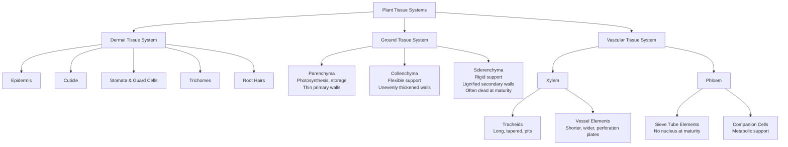
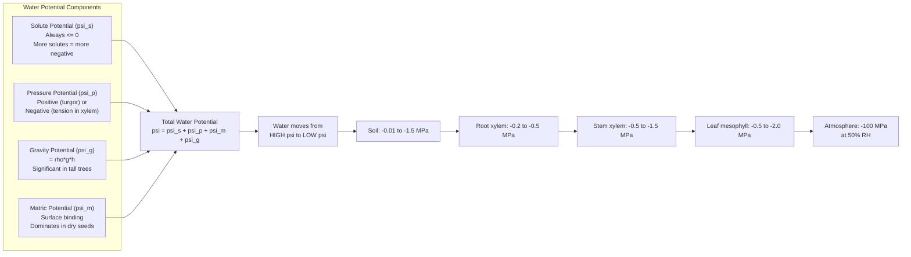
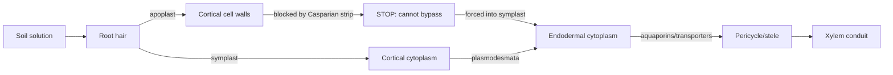
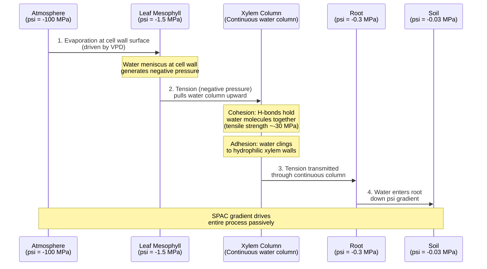
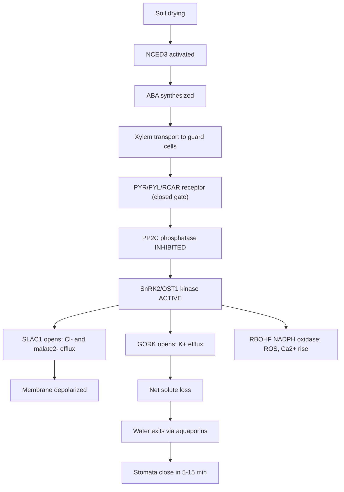
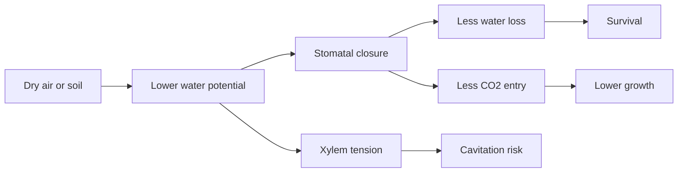

# Plant Structure and Water Relations

\label{sec:unit_VIII_plant_structure_and_water}


<!-- chapter-metadata-badge -->
> Level 2/3 · 55 min read · 75 min lecture · Prerequisites: \cref{sec:unit_II_membrane_transport}

## Learning Objectives

1. Describe the major organ systems of [**angiosperm**](#gl:angiosperm)s: root system (taproot vs fibrous), shoot system, and leaf.
2. Compare the three plant tissue systems: dermal, ground, and vascular, including cell types within each.
3. Explain water relations in plants using the four-component water potential equation $\Psi = \Psi_s + \Psi_p + \Psi_m + \Psi_g$.
4. Describe [**transpiration**](#gl:transpiration) and the cohesion-tension \citep{dixon1894}-adhesion (TACT) mechanism of water ascent and critically evaluate its supporting evidence.
5. Explain the apoplast vs symplast pathways and the role of the Casparian strip and suberin lamella.
6. Explain phloem transport and the Münch pressure-flow hypothesis \citep{munch1930}, including apoplastic vs symplastic loading.
7. Describe stomatal regulation and the role of ABA in drought response at the molecular level.
8. Explain nutrient uptake strategies including mycorrhizal associations and quantitative turgor relations.
9. Quantify water-use efficiency at the leaf level and connect it to C3, C4, and CAM photosynthetic trade-offs.

<!-- curriculum-scaffold-start -->
### Study Blueprint

- **Big idea:** Plant form is an engineering solution to water movement, support, gas exchange, and growth.
- **Core concepts:** xylem, phloem, water potential, transpiration.
- **Framework alignment:** Vision & Change: Structure and function, Pathways and transformations of energy and matter, Systems; AP Biology: Energetics, Systems Interactions; NGSS-style topics: Structure and Function, Matter and Energy in Organisms and Ecosystems.
- **Model or quantitative lens:** Water-potential and transpiration-flux calculations.
- **Data skill:** Interpret plant-water data from pressure, solute, and humidity measurements.
- **Practice cadence:** Visual Representations, Questions and Methods, Argumentation.
- **Common misconception to repair:** Water does not move because plants pull with intention; it follows potential gradients and cohesion.
- **Primary lab:** \nameref{sec:lab_unit_VIII_plant_structure_and_water}.
- **Question bank:** \nameref{sec:q_unit_VIII_plant_structure_and_water}.
- **Transfer task:** Transfer plant-water reasoning to drought, irrigation, forest physiology, and crop breeding.
- **Bridge to computation:** `biology.botany.botany.water_potential`.
<!-- curriculum-scaffold-end -->

\begin{figure}[htbp]
\centering
\includegraphics[width=0.85\textwidth]{../figures/water_potential_transpiration.png}
\caption{Plant water relations in two panels. Left: solute potential grows more negative with concentration while turgor pressure raises total water potential. Right: transpiration flux falls as external vapour approaches leaf interior and rises with stomatal conductance.}
\label{fig:unit_VIII_water_potential_transpiration}
\end{figure}
<!-- alt: Two-panel plant-water figure. The water-potential panel shows solute potential becoming more negative with concentration and total water potential offset by turgor pressure; the transpiration panel shows flux decreasing as outside vapor concentration approaches the leaf interior, with higher conductance producing higher flux. -->

---

> **Opening Vignette — How a Giant Sequoia Pulls Water 100 Meters Up**
>
> A mature coast redwood (*Sequoia sempervirens*) can stand 115 meters tall. Getting water from soil to the topmost leaves requires lifting it against a gravitational pull of roughly 1.1 MPa — while simultaneously overcoming resistance to flow through millions of microscopic [**xylem**](#gl:xylem) conduits. How? The answer, worked out by Henry Dixon and John Joly in 1894 \citep{dixon1894} and validated with pressure-bomb measurements in the 1960s, is cohesion-tension: water molecules cohere to each other and adhere to xylem walls so strongly that evaporation from leaf [**stomata**](#gl:stomata) creates a continuous negative-pressure column (tension) that pulls water up from the roots. The column can sustain tensions as low as −10 MPa before xylem embolism shatters it. The bulk-flow ascent itself is passive — the xylem column requires no direct metabolic energy — though it is gated by active stomatal regulation; this mechanism moves trillions of liters of water into Earth's atmosphere annually, so elegantly that engineers studying microfluidics still struggle to replicate it artificially.

## The Plant Body Plan

Flowering plants (angiosperms, ~300,000 species) are organized into two major organ systems that work together to acquire resources from both soil and atmosphere.

### Root System Architecture and Soil Exploration

The root system anchors the plant, absorbs water and minerals, and stores nutrients. Two major architectural types exist:

- **Taproot system:** A single [**dominant**](#gl:dominant) primary root (derived from the embryonic radicle) with smaller lateral roots branching off. Common in eudicots (e.g., carrots, dandelions, oaks). Deep taproot systems can access water tables several meters below the surface.
- **Fibrous root system:** A dense mat of similarly sized adventitious roots arising from the stem base. The primary root is short-lived. Common in monocots (e.g., grasses, wheat, rice). Excellent for soil stabilization and surface nutrient capture.

**Root apical meristem (RAM):** Located near the root tip, protected by the root cap. The RAM contains slowly dividing cells in the quiescent center (QC) surrounded by rapidly dividing initial cells that produce most root tissues. The root tip is organized into distinct zones:

1. **Root cap** -- protects the meristem; secretes mucilage for lubrication; columella cells contain starch-filled amyloplasts (statoliths) for gravity sensing
2. **Meristematic zone** -- active cell division
3. **Elongation zone** -- cells expand primarily in length (up to 10-fold); driven by [**turgor pressure**](#gl:turgor-pressure) and cell wall loosening
4. **Maturation zone** -- cells differentiate into specialized types; root hairs develop here

**Root hairs** are single elongated epidermal cells that dramatically amplify surface area (~600 cm$^2$ per cm of root length). Mineral ions are absorbed actively against their electrochemical gradients by specific transporters (NO$_3^-$ by NRT1/NRT2; K$^+$ by HKT; Fe$^{2+}$ by IRT1).

### Plant Architecture: Phytomers and Plastochrons

The shoot is built as a series of repeating modular units called **phytomers**. Each phytomer comprises one node, the internode immediately below it, the leaf attached at the node, and the axillary bud subtending the leaf. Phytomer iteration generates the entire shoot — a tree is, formally, a clonal colony of phytomers expressed by a single genotype.

The temporal scaffolding is provided by the **plastochron index (PI)**, defined as the time interval between successive leaf-primordium initiations at the SAM (Erickson and Michelini, 1957). At constant temperature the plastochron is approximately constant for a given genotype (~24 h in *Arabidopsis*, ~36 h in maize), permitting developmental time to be expressed in plastochron units rather than chronological time. The **leaf plastochron index (LPI)** ranks leaves by developmental age — LPI 0 is the youngest visible leaf, LPI 1 the next, and so on — and is the standard developmental clock for maize and tobacco physiology experiments.

**Meristematic zones at the SAM** are organized radially and clonally:

- **L1 (tunica outer layer):** Strictly anticlinal divisions; gives rise to epidermis
- **L2 (tunica inner layer):** Mostly anticlinal; produces mesophyll, gametes
- **L3 (corpus):** Anticlinal and periclinal divisions; produces vascular and ground tissue

Genetic chimeras (e.g., variegated geraniums) reveal these clonal layers as stable, parallel cell lineages whose interactions specify organ identity.

### Shoot System Architecture and Light Capture

The shoot system comprises the stem and leaves and is responsible for [**photosynthesis**](#gl:photosynthesis), reproduction, and support.

**Shoot apical meristem (SAM):** Maintains a pool of pluripotent stem cells at the shoot tip throughout the plant's life. The SAM is organized into:

- **Central zone (CZ):** Slowly dividing stem cells maintained by the WUS-CLV3 negative feedback loop
- **Peripheral zone (PZ):** Faster-dividing cells that form lateral organ primordia (leaves, flowers)
- **Rib zone:** Cells below the CZ that contribute to stem internodes

Leaves are initiated at the PZ where PIN1-mediated auxin maxima form, producing the characteristic phyllotaxis pattern (often 137.5 degrees divergence angle).

### Leaf Anatomy for Gas Exchange and Photosynthesis

Leaf cross-section layers (adaxial to abaxial):

1. Upper epidermis + cuticle (waxy layer of cutin; reduces water loss)
2. Palisade mesophyll (densely packed columnar cells with abundant [**chloroplast**](#gl:chloroplast)s; principal photosynthetic layer)
3. Spongy mesophyll (loosely packed; CO$_2$ diffusion through intercellular air spaces; ~30-40% air space)
4. Lower epidermis + cuticle

**Stomata:** Pores bounded by two kidney-shaped **[guard cell](#gl:guard-cell)s**. Stomatal aperture is controlled by guard cell turgor:

- Light activates blue-light phototropins and red-light photosynthesis in guard cell chloroplasts. K$^+$ influx (via K$^+$ inward-rectifying channels) lowers osmotic potential. Water enters by [**osmosis**](#gl:osmosis). Guard cells swell and bow apart. Stomata open.
- Drought triggers ABA signaling. ABA activates SnRK2 kinases. SLAC1 anion channels open, releasing Cl$^-$. Membrane depolarizes. K$^+$ leaves via GORK channels. Water follows osmotically. Guard cells deflate. Stomata close.

Typical stomatal density: ~200 stomata/mm$^2$ in many mesophytes. Each stoma can open or close in minutes. Stomata allow CO$_2$ in and O$_2$ plus water vapor out -- the inevitable tradeoff between photosynthesis and transpiration.

> **Clinical Connection:** Understanding stomatal biology is essential for crop engineering. Overexpression of the SLAC1 [**gene**](#gl:gene) in barley produced plants with more responsive stomata and 40% greater water-use efficiency in field trials, directly relevant to agriculture in drought-prone regions.

**Concept Check 1:** Why are most stomata located on the lower (abaxial) epidermis of leaves rather than the upper surface?

**Concept Check 2:** A botanist counts an average plastochron of 30 hours in a tomato plant. After 15 days, approximately how many leaf primordia will have been initiated by the SAM, assuming temperature is constant?

---

## Plant Tissue Systems

Most plant organs are composed of three tissue systems: dermal, ground, and vascular.


<!-- alt: Graph showing organization of the three plant tissue systems showing major cell types within each Dermal tissue forms the outer covering, ground tissue fills the interior, and vascular tissue provides transport. -->

*Organization of the three plant tissue systems showing major cell types within each Dermal tissue forms the outer covering, ground tissue fills the interior, and vascular tissue provides transport.*

### Dermal Tissue System

The dermal tissue system is the outer protective covering of the plant:

- **Epidermis:** A single layer of tightly packed cells covering most surfaces. Secretes the cuticle.
- **Cuticle:** A waxy layer composed of cutin (a polyester of hydroxylated fatty acids) and epicuticular waxes. Minimizes water loss from non-stomatal surfaces. The cuticle can reduce transpiration by 95% compared to an unprotected surface.
- **Trichomes:** Hair-like epidermal appendages. Diverse functions: reduce wind speed at leaf surface (boundary layer), reflect excess light, secrete defensive compounds (glandular trichomes of tomato produce toxic sesquiterpenes), deter [**herbivory**](#gl:herbivory).
- **Root hairs:** Tubular extensions of single epidermal cells in the root maturation zone. Increase absorptive surface area by 2-10-fold.

### Ground Tissue System

Ground tissue fills the space between dermal and vascular tissues. Three cell types:

**Parenchyma cells:** Living at maturity. Thin primary cell walls. Functions include photosynthesis (mesophyll), storage (starch in potato tubers, sugar in sugar beet roots), and wound healing (dedifferentiate to form callus tissue). Parenchyma cells retain the ability to divide, making them critical for regeneration.

**Collenchyma cells:** Living at maturity. Unevenly thickened primary cell walls (thicker at corners). Provide flexible mechanical support to growing organs. Found in petioles and young stems. Celery "strings" are collenchyma strands.

**Sclerenchyma cells:** Typically dead at maturity. Thick, lignified secondary cell walls. Provide rigid support. Two types: fibers (elongated cells in bundles; flax, hemp) and sclereids (short, irregular cells; the gritty texture in pears; the hard shell of walnuts).

### Vascular Tissue System -- Xylem in Detail

The vascular tissue system is the plant's long-distance transport network.

**Xylem** (water and mineral transport, upward) develops in two temporally distinct phases that yield mechanically distinct conduits:

**Protoxylem** matures while the surrounding tissue is still elongating. Its conduits must therefore stretch with the growing organ, so secondary-wall lignification is restricted to **annular** (ring-shaped) or **helical** (spiral) thickenings. These thickenings allow elongation but provide limited collapse-resistance under tension; protoxylem conduits are typically narrow (5–25 µm) and frequently obliterated as the tissue matures, leaving an air-filled lacuna.

**Metaxylem** differentiates after elongation has ceased. With no constraint on extensibility, metaxylem develops continuous lignified walls with **scalariform** (ladder-like), **reticulate** (net-like), or **pitted** thickenings. Metaxylem conduits are wider (50–500 µm in some lianas), longer-lived, and bear the bulk of mature transpiration flux.

A simple mnemonic: **proto = first** (extensible, ephemeral), **meta = mature** (durable, mechanically robust). The transition can be visualized in any longitudinal section of an elongating maize root: closer to the tip, narrow protoxylem dominates; further back in the maturation zone, metaxylem vessels of much greater caliber come on-line.

The two principal cell types of xylem differ markedly in mechanics:

- **Tracheids:** Long (1-5 mm), tapered cells with lignified secondary walls. Dead at maturity. Water moves between tracheids through bordered pit pairs (thin regions in the cell wall where secondary wall is absent). The pit membrane consists of the unmodified primary walls of the two adjacent cells plus the middle lamella; in conifers it bears a thickened central **torus** suspended by a porous **margo**, allowing the torus to seal the pit aperture if the adjacent conduit cavitates (an **aspirated pit**). Tracheids are found in most vascular plants and constitute the primary conducting element in most gymnosperms.
- **Vessel elements:** Shorter (0.2-1 mm) but wider (up to 500 µm diameter in some lianas) than tracheids. Stacked end-to-end with **perforation plates** (partial or complete dissolution of end walls) forming continuous tubes called vessels. Found primarily in angiosperms. More efficient but more vulnerable to cavitation than tracheids.

**Bordered pit mechanics — the torus-margo valve:**

The conifer bordered pit is one of the most elegant valve structures in biology. The pit membrane is differentiated into two regions:

- **Torus:** A thickened, impermeable central disc (~5 µm diameter) made of cellulose microfibrils embedded in a lignified matrix
- **Margo:** A porous mesh of radial cellulose strands surrounding the torus, with pore sizes of 50–200 nm

Under normal flow, the torus floats centrally and water moves freely through the porous margo. When one tracheid embolises, the pressure differential between the air-filled (atmospheric) and water-filled (negative pressure) conduits displaces the torus laterally; the torus seats firmly against the pit aperture, **aspirating** the pit. The seal is reinforced by surface tension at the air-water interface inside the margo pores. Air seeding through this valve requires breaking the meniscus at the smallest margo pore — typically requiring tensions of $-3$ to $-10$ MPa, which sets the species' cavitation safety margin.

Angiosperm pit membranes lack a torus; instead they have a homogeneous, semi-porous structure (typical pore size ~5–20 nm). These membranes resist air seeding at higher tensions per unit area but lack the most-or-nothing valving of conifer pits — once a single membrane breach opens, the entire vessel cavitates rapidly.

**Mechanical properties — the safety-efficiency tradeoff:**

The Hagen-Poiseuille equation predicts that volumetric flow scales as the *fourth power* of conduit radius:

\begin{equation}
Q = \frac{\pi r^4 \Delta P}{8 \eta L}
\label{eq:unit_VIII_hagen_poiseuille}
\end{equation}

where $Q$ is volumetric flow (m³/s), $r$ is conduit radius (m), $\Delta P$ is pressure drop (Pa), η is dynamic viscosity (≈ 10⁻³ Pa·s for water at 20 °C), and $L$ is conduit length (m). Doubling the radius therefore increases conductance 16-fold. Wide vessels (oaks, ring-porous wood) dominate spring transpiration; narrow tracheids (conifers, drought-adapted woody species) trade efficiency for resistance to embolism propagation, since narrower conduits maintain larger surface-tension forces relative to the column volume.

**Phloem** (sugar and organic compound transport, bidirectional):

- **Sieve tube elements:** Living at maturity but lack nucleus, [**ribosome**](#gl:ribosome)s, and tonoplast at maturity. Connected end-to-end at sieve plates (modified cell walls perforated by sieve pores, 1-15 µm diameter). P-[**protein**](#gl:protein) (phloem protein) plugs sieve pores when cells are damaged, preventing phloem sap loss.
- **Companion cells:** Retain full complement of [**organelle**](#gl:organelle)s. Connected to sieve tube elements by numerous plasmodesmata. Provide metabolic support including ATP for active sugar loading. Transfer cells (specialized companion cells with wall ingrowths) increase membrane surface area for active transport.

**Concept Check 3:** Why must xylem conducting cells be dead at maturity, while phloem sieve tube elements must remain alive?

**Concept Check 4:** Using the Hagen-Poiseuille relation, calculate the ratio of volumetric flow between a vessel of radius 100 µm and a tracheid of radius 25 µm, holding pressure gradient and length constant. Explain why drought-prone species may nevertheless favor the narrower conduit.

**Concept Check 5:** A botanist examines a longitudinal section of an emerging shoot from a deciduous tree. She notes spirally banded conduits near the apex but reticulate-pitted conduits 5 cm behind. Identify each conduit type and explain the developmental logic of the difference.

---

## Water Relations -- Water Potential

Plants control water movement using **water potential** (Ψ, units: MPa). The complete four-component formulation captures every thermodynamically relevant contribution to water's free energy:

\begin{equation}
\Psi = \Psi_s + \Psi_p + \Psi_m + \Psi_g
\label{eq:unit_VIII_water_potential}
\end{equation}

where:

- **$\Psi_s$** = osmotic (solute) potential = $-iCRT$ (typically $\leq 0$; solutes decrease water potential). $i$ is the van 't Hoff dissociation factor, $C$ is molar concentration, $R$ is the gas constant, $T$ is temperature in Kelvin.
- **$\Psi_p$** = pressure (turgor) potential. Positive in turgid cells (turgor pressure against cell wall). Negative in xylem under tension. Can range from +2 MPa in highly turgid cells to $-10$ MPa or lower in xylem of tall trees.
- **$\Psi_m$** = matric potential. Reflects water binding to colloidal surfaces (cell walls, soil clay particles, dry seeds). Typically $\leq 0$. Typically negligible in well-hydrated cells but dominates in dry seeds (where $\Psi_m$ can reach $-100$ MPa) and in dry soils.
- **$\Psi_g$** = gravitational potential = $\rho g h$. Significant primarily in tall trees. At 10 m height, $\Psi_g = -0.1$ MPa. At 100 m (coast redwood), $\Psi_g = -1.0$ MPa.

In well-hydrated, free-flowing systems (most active leaf and root cells) $\Psi_m$ is folded into $\Psi_p$ and the simplified three-component form $\Psi = \Psi_s + \Psi_p + \Psi_g$ is used. In dry seeds, lichens, and very dry soils, $\Psi_m$ must be retained explicitly. See \cref{eq:unit_VIII_water_potential}. \cref{fig:unit_VIII_water_potential_transpiration} links solute-driven $\Psi_s$ shifts to Fick-law transpiration flux under varying stomatal conductance.

### Worked Example: Calculating Water Potential

**Problem:**
A plant cell has a solute concentration of $C = 0.3 \text{ mol L}^{-1}$ sucrose ($i=1$) at $T = 293 \text{ K}$ (20 °C) and a turgor pressure ($\Psi_p$) of $0.5 \text{ MPa}$. Assuming normal height where $\Psi_g = 0$ and the cell is well hydrated so $\Psi_m \approx 0$, what is the cell's total [**water potential (Ψ)**](#gl:water-potential)? If this cell is placed in an open beaker of pure water ($\Psi = 0$), will water flow into or out of the cell?

**Solution:**

1. **Calculate the osmotic potential ($\Psi_s$):**
   Using the van 't Hoff equation $\Psi_s = -iCRT$, where $R = 0.00831 \text{ L MPa mol}^{-1}\text{ K}^{-1}$:
   $$ \Psi_s = -(1) \cdot (0.3 \text{ mol L}^{-1}) \cdot (0.00831 \text{ L MPa mol}^{-1}\text{ K}^{-1}) \cdot (293 \text{ K})  \label{eq:unit_VIII_plant_structure_and_water_item_1}$$

   $$ \Psi_s \approx -0.73 \text{ MPa}  \label{eq:unit_VIII_plant_structure_and_water_item_2}$$


2. **Calculate the total water potential (Ψ):**
   $$ \Psi = \Psi_s + \Psi_p + \Psi_m + \Psi_g  \label{eq:unit_VIII_plant_structure_and_water_item_3}$$

   $$ \Psi = -0.73 \text{ MPa} + 0.5 \text{ MPa} + 0 + 0  \label{eq:unit_VIII_plant_structure_and_water_item_4}$$

   $$ \Psi = -0.23 \text{ MPa}  \label{eq:unit_VIII_plant_structure_and_water_item_5}$$


3. **Determine the direction of water flow:**
   Water typically moves from higher water potential to lower water potential. Since the beaker of pure water is at $\Psi = 0$ and the cell is at $\Psi = -0.23 \text{ MPa}$, water will flow **into the cell** until the cell's turgor pressure rises sufficiently to reach equilibrium ($\Psi = 0$).

Water typically moves from **higher to lower water potential** (down the Ψ gradient).

### Worked Example: A Leaf Cell at Dawn vs Midday

**Problem:** A mesophyll cell at dawn (cool, humid, stomata closed) has $\Psi_s = -1.1$ MPa, $\Psi_p = +0.9$ MPa, $\Psi_m \approx 0$, $\Psi_g \approx 0$. By midday (hot, dry, stomata open and transpiring), the cell loses water: $\Psi_s = -1.4$ MPa (solutes concentrated by ~27% volume loss), $\Psi_p = +0.2$ MPa. Compute Ψ in both states and identify which component drives the change.

**Solution:**

- Dawn: $\Psi = -1.1 + 0.9 = -0.2$ MPa
- Midday: $\Psi = -1.4 + 0.2 = -1.2$ MPa

Total Ψ has fallen by 1.0 MPa. Decomposing the change:

- $\Delta\Psi_s = -0.3$ MPa (small contribution from solute concentration)
- $\Delta\Psi_p = -0.7$ MPa (dominant contribution)

The midday plunge is driven primarily by **loss of turgor**. The cell remains alive and below the wilting threshold, but it is approaching the limit at which growth (which requires $\Psi_p > Y$ in the Lockhart equation) ceases. This is the molecular basis of midday "growth pause" almost universally observed in field crops.


<!-- alt: Flowchart showing components of water potential and the soil-plant-atmosphere continuum (SPAC) Water moves passively down the water potential gradient from soil to atmosphere. The enormous gradient between leaf and atmosphere drives transpiration. -->

*Components of water potential and the soil-plant-atmosphere continuum (SPAC) Water moves passively down the water potential gradient from soil to atmosphere. The enormous gradient between leaf and atmosphere drives transpiration.*

### Quantitative Turgor Relations and Plasmolysis

**Turgor pressure** ($\Psi_p$) is generated when a cell with low internal $\Psi_s$ takes up water until the cell wall resists further expansion. The cell-wall yield curve is described by the **Lockhart equation** for irreversible expansion:

\begin{equation}
\frac{1}{V}\frac{dV}{dt} = \phi (\Psi_p - Y)
\label{eq:unit_VIII_lockhart}
\end{equation}

where φ is wall extensibility (a measure of how readily the wall yields), $\Psi_p$ is current turgor, and $Y$ is the yield threshold below which the wall behaves elastically (no growth). Cells grow primarily when $\Psi_p > Y$. In the elongation zone, expansin-mediated wall loosening reduces $Y$, allowing growth even at modest turgor.

**Plasmolysis** is the separation of the protoplast from the cell wall when the cell is placed in a hypertonic solution (external $\Psi_s$ more negative than internal). Three phases:

1. **Incipient plasmolysis:** Turgor reaches zero ($\Psi_p = 0$); at this point $\Psi = \Psi_s$. The protoplast is just losing contact with the wall.
2. **Concave plasmolysis:** Protoplast withdraws inward; plasma membrane appears scalloped at the corners.
3. **Convex plasmolysis:** Protoplast becomes a small spherical body in the center of the cell; reversible if rehydrated within minutes, but prolonged plasmolysis kills the cell.

**Worked Example — Quantitative Plasmolysis:** A cell at $\Psi_p = 0.5$ MPa, $\Psi_s = -0.73$ MPa is placed in a sucrose solution at $\Psi_s = -1.0$ MPa. Water leaves the cell. As water exits, $\Psi_s$ becomes more negative (solutes concentrate; assume volume change of 20% from full turgor to incipient plasmolysis). At incipient plasmolysis, $\Psi_p = 0$ and $\Psi_{cell} = \Psi_s$ must equal $\Psi_{external} = -1.0$ MPa. Since $\Psi_s$ scales inversely with cell volume ($\Psi_s \cdot V$ ≈ constant for ideal solutes), we calculate the relative volume at incipient plasmolysis as $V_p / V_0 = \Psi_{s,0} / \Psi_{s,p} = -0.73 / -1.0 = 0.73$, i.e., the cell loses ~27% of its initial volume before plasmolysing.

At full turgor: $\Psi_p = -\Psi_s$, so $\Psi = 0$ (cell is in equilibrium with pure water).

> **Clinical Connection:** Agricultural irrigation management relies on measuring soil water potential with tensiometers. When soil Ψ falls below $-1.5$ MPa (the permanent wilting point), most crop plants cannot extract water. Precision irrigation triggered at species-specific Ψ thresholds saves 20-40% of water compared to schedule-based irrigation.

**Concept Check 6:** A seed at storage moisture has $\Psi_m \approx -100$ MPa, $\Psi_s \approx -2$ MPa, and $\Psi_p = 0$. When placed on moist filter paper at $\Psi = -0.05$ MPa, water is rapidly imbibed. Explain which component dominates the imbibition gradient and why imbibition is a one-way process.

---

## Water Transport Pathways

### Apoplast vs Symplast Pathways

Water and dissolved minerals travel from the root surface to the xylem via two parallel routes:

**Apoplast pathway:** Water moves through the continuum of cell walls and intercellular spaces without crossing any membranes. Fast and non-selective. Driven by mass flow along pressure gradients.

**Symplast pathway:** Water moves through the continuum of [**cytoplasm**](#gl:cytoplasm) connected by plasmodesmata (channels through cell walls, 40-60 nm diameter, lined by ER). Requires crossing the plasma membrane at entry. Slower but allows selective transport.

**Transmembrane pathway:** Water crosses plasma membranes via aquaporins (water channel proteins, PIP and TIP families; ~35 aquaporin genes in *Arabidopsis*). Aquaporin activity is regulated by phosphorylation, [**pH**](#gl:ph), and Ca$^{2+}$.

### Root Anatomy in Depth — The Endodermis as Filter

Radial anatomy of a young dicot root (from outside inward):

1. **Epidermis** with root hairs — initial absorption surface
2. **Cortex** — multiple layers of parenchyma; storage and apoplastic transport corridor; rich in plasmodesmata
3. **Endodermis** — single layer; the critical apoplastic checkpoint
4. **Pericycle** — cell layer giving rise to lateral roots
5. **Vascular cylinder (stele)** — central xylem and phloem strands

**The Casparian strip — chemistry and synthesis:**

The Casparian strip is a band of **lignin and suberin** deposited in the radial and transverse walls of endodermal cells. The two polymers play distinct, sequential roles:

- **Lignin** (a phenylpropanoid polymer of monolignol units p-coumaryl, coniferyl, and sinapyl alcohol cross-linked by oxidative coupling) is deposited first, forming the **Casparian strip proper** — a discontinuous belt that fuses cell wall to plasma membrane. CASP1–CASP5 transmembrane proteins assemble into a hexagonal scaffold that recruits ESB1 (a dirigent protein) and PER64 (a peroxidase), localizing lignification to a precise sub-micron belt. *casp1 casp3* double mutants have discontinuous strips and leak ions into the stele.
- **Suberin** (an aliphatic-aromatic polyester of long-chain ω-hydroxy fatty acids and ferulate esters) is deposited later as the **suberin lamella** on the inner face of the cell wall, after the Casparian strip is mature. Suberisation is regulated by SGN3-CIF1/CIF2 receptor-peptide signaling, which monitors the integrity of the Casparian strip via leakage of CIF peptides from stele to cortex.

**Why both polymers?** Lignin is hydrophobic and rigid but porous to small molecules; suberin is even more hydrophobic and seals against water and ion flow. The two-stage system gives a fast-acting initial seal (lignin Casparian strip) followed by a slow-developing reinforcement (suberin lamella) that further restricts symplastic transport across the inner endodermal face.

**Bypass routes — apoplastic leakage at lateral root junctions:**

Where lateral roots emerge from the pericycle, they must rupture the endodermis and overlying cortex. During the brief window before the lateral root re-establishes its own endodermis, an **apoplastic bypass** allows ions (and pathogens) to enter the stele without crossing a plasma membrane. This window can be hours to days long. Quantitatively, ~70% of soil-borne Na$^+$ entering the stele of rice and wheat does so via these junctional leaks rather than through the proper symplast. The bypass may explain seasonal salt accumulation in glycophytes (salt-sensitive species) under saline irrigation.

**Symplastic vs transmembrane pathways:**

- **Pure symplastic transport** uses plasmodesmata to bypass plasma membranes entirely. Plasmodesmal aperture is regulated by callose deposition at the neck region; under stress, callose deposition closes plasmodesmata, isolating cells.
- **Transmembrane pathway** crosses plasma membranes twice per cell (entry + exit) via aquaporins for water and selective transporters for ions. Slowest but most selective.

In practice, the three pathways operate simultaneously; the relative contribution shifts with developmental stage, salinity, and mycorrhizal colonization.

**Passage cells:** In older roots, most endodermal cells deposit a continuous suberin lamella covering the entire inner surface of the cell wall. **Passage cells** — endodermal cells that retain a thin wall and lack the suberin lamella, located opposite protoxylem poles — provide selective transport routes through the otherwise sealed older endodermis.

In rice, the endodermis is supplemented by an inner **exodermis** (a Casparian-strip-bearing layer just inside the epidermis), giving a double filter. Rice ranks among the most salt-tolerant cereals partly because the exodermis blocks Na$^+$ at the root surface itself.


<!-- alt: Flowchart showing apoplast vs symplast routes through a young root and the Casparian-strip checkpoint at the endodermis Most water and ions reaching the xylem must traverse at least one plasma membrane. -->

*Apoplast vs symplast routes through a young root and the Casparian-strip checkpoint at the endodermis Most water and ions reaching the xylem must traverse at least one plasma membrane.*

---

## Transpiration and the Cohesion-Tension Mechanism

### Historical Context: The Birth of Cohesion-Tension Theory \citep{dixon1894}

The question of how water reaches the canopy of a tall tree exercised plant physiologists throughout the 19th century. Early proposals invoked **root pressure** (positive xylem pressure generated by active mineral secretion overnight; can be measured by exudation from cut stumps at 0.05–0.5 MPa), but this manifestly cannot lift water more than ~5 m and is absent during the day in most species. **Capillarity** in xylem conduits could lift water about 1 m given typical conduit radii. **Atmospheric pressure** can support a column of about 10.3 m. None of these mechanisms could account for water rising to 100 m in *Sequoia*.

In 1894, Henry Dixon (Trinity College Dublin) and John Joly proposed a radical alternative: water in the xylem is under **tension** (negative pressure), pulled from above by evaporation rather than pushed from below \citep{dixon1894}. The idea was counter-intuitive — bulk water at $-1$ MPa is metastable; a single nucleation event should cause spontaneous boiling — but the cohesive forces of water (hydrogen bonds, theoretical tensile strength $-140$ MPa) and the small radii of xylem conduits (which suppress nucleation) make the metastable state biologically sustainable.

### Detailed TACT Mechanism

Water ascent in tall trees is explained by the **cohesion-tension-adhesion (TACT) mechanism**, refined by Renner (1911), and validated with pressure probes and MRI:


<!-- alt: Sequence diagram showing transpiration-cohesion-tension mechanism of water ascent Evaporation at the leaf surface generates tension (negative pressure) that is transmitted through the continuous water column in the xylem, pulling water upward from the roots. Cohesion between water molecules and adhesion to xylem walls maintain the column. -->

*The transpiration-cohesion-tension mechanism of water ascent Evaporation at the leaf surface generates tension (negative pressure) that is transmitted through the continuous water column in the xylem, pulling water upward from the roots. Cohesion between water molecules and adhesion to xylem walls maintain the column.*

1. **Transpiration** from leaves drives evaporation at the mesophyll cell wall surface. Water evaporates from the thin film coating the cell wall into the substomatal air space, then diffuses out through open stomata.

2. As water evaporates, the air-water interface retreats into the nanoscale pores of the cell wall. Surface tension at this curved meniscus generates a large negative pressure (tension), following the Young-Laplace equation:

\begin{equation}
\Delta P = \frac{2\gamma \cos\theta}{r}
\label{eq:unit_VIII_young_laplace}
\end{equation}

where γ is surface tension of water (0.0728 N/m), θ is contact angle, and $r$ is pore radius. For cell wall pores ($r \approx$ 5-10 nm), this generates tensions of $-10$ to $-30$ MPa.

3. This tension propagates through the continuous water columns in xylem conduits (tracheids and vessels) because of water's strong **cohesion** ([**hydrogen bond**](#gl:hydrogen-bond)s). The theoretical tensile strength of water is approximately $-140$ MPa; in practice, xylem water columns sustain tensions of $-1$ to $-10$ MPa, with some trees reaching $-15$ MPa.

4. **Adhesion** of water to the hydrophilic, lignified xylem walls prevents the water column from pulling away from the conduit walls.

5. The tension at the top of the column draws water from the roots, which in turn absorbs water from the soil down the water potential gradient.

### Cohesion-Tension Theory: Embolism Evidence and Synchrotron Imaging

The cohesion-tension model is not without controversy, and its mature form represents a triumph of integrating ecological, physical, and microscopic evidence — together with rebuttals to specific objections.

**Lines of supporting evidence:**

1. **Pressure-bomb measurements** (Scholander *et al.*, 1965) directly demonstrate that excised stems of transpiring trees release water primarily when external pressure is applied, consistent with negative xylem pressure prior to excision. Pressure required matches predictions of the tension hypothesis (typically $-1$ to $-3$ MPa for well-watered crops; $-6$ to $-10$ MPa under drought).
2. **Magnetic resonance imaging (MRI)** in vivo (Holbrook *et al.*, 2001) visualizes continuous water columns in mature angiosperm trunks, with abrupt transitions to embolised conduits matching predictions of tension-induced cavitation.
3. **Pressure probes** (Steudle, 1995) in living root cortex cells confirm steep tension gradients between epidermis and stele consistent with bulk-flow-driven uptake.
4. **Acoustic emission** of xylem during drought (Tyree and Sperry, 1989) records sharp clicks corresponding to individual cavitation events, the count of which scales with drought severity.

**The embolism debate:**

Critics (most prominently U. Zimmermann and colleagues, 1990s–2000s) argued that water columns under tensions of $-1$ MPa or more should be metastable and would cavitate continuously, making sustained negative pressures of $-10$ MPa physiologically implausible. The Zimmermann school proposed alternative "tissue tension" models in which water moved by mechanisms other than bulk flow.

This challenge has been progressively resolved by direct visualization:

- **Improved pressure probes** (Wei *et al.*, 1999) confirmed predicted tensions in living conduits without artifact.
- **Synthetic-tree experiments** (Wheeler and Stroock, *Nature* 2008) constructed transparent microfluidic devices replicating the geometry of a leaf's evaporative surface; these "synthetic trees" sustained water under tension to $-22$ MPa, mirroring biological systems and proving that cell wall pore geometry alone is sufficient to support the predicted tensions.
- **Synchrotron X-ray micro-CT** (Brodersen *et al.*, *Plant Physiol.* 2010; Choat *et al.*, *Nature* 2012) imaged living xylem in real time and showed that under moderate drought, embolisms are confined to a small fraction of conduits — settling the long-running argument over how prevalent embolism is in actively transpiring plants. Synchrotron imaging also visualized **embolism repair** under daily root pressure: embolised conduits refill overnight in *Vitis* and *Laurus*.

**Mechanism of embolism repair:** Two complementary mechanisms are now well-attested:

- **Root pressure refilling:** Active mineral secretion into xylem at night generates positive xylem pressure (0.05–0.5 MPa) sufficient to push water back into embolised conduits. Common in herbaceous species and in many trees overnight.
- **Phloem-driven refilling:** Phloem-derived sugars osmotically draw water into embolised conduits via parenchyma cells lining the xylem (Salleo *et al.*, 2004; Nardini *et al.*, 2011). This mechanism operates against negative bulk xylem pressure and is observed during the day.

**Net assessment:** The TACT mechanism is correct in its essentials. Water in xylem is genuinely under tension; the column is stabilized by cohesion and adhesion at scales where pore geometry sustains negative pressures far beyond what bulk water could endure. The system is metastable but biologically sufficient — and the cost of occasional cavitation is mitigated by redundant pathways and active repair.

### Xylem Transport Parameters

**Xylem sap velocity** measured by MRI and heat pulse methods: 3-45 m/h in trees; 15-50 m/h in herbaceous plants. Ring-porous trees (oak, elm) can reach velocities of 40+ m/h in their large early-wood vessels.

**Transpiration flux** (Fick's first law for water vapor):

\begin{equation}
E = g_s \cdot \Delta w
\label{eq:unit_VIII_transpiration_flux}
\end{equation}

where $g_s$ = stomatal conductance (mmol m$^{-2}$ s$^{-1}$) and $\Delta w$ = vapor pressure difference between leaf interior and ambient air (mol mol$^{-1}$).

A well-watered broadleaf tree can transpire 200-400 liters of water per day. A large oak may transpire over 150,000 liters during a growing season.

### Cavitation and Embolism

When xylem tension exceeds the capacity of the water column, dissolved gas comes out of solution forming a bubble -- **cavitation**. The gas bubble expands to fill the conduit, creating an **embolism** (air lock) that blocks water flow.

Plants have evolved multiple strategies to manage cavitation:

- **Vessel element size:** Smaller conduits are more resistant to cavitation (higher surface-tension forces maintain the column) but less efficient for transport. This creates a safety-efficiency tradeoff.
- **Pit membranes:** In tracheids, bordered pits have a torus-margo structure. When one tracheid cavitates, the torus seals against the pit aperture, preventing air from spreading to adjacent conduits.
- **Embolism repair:** Some plants can refill embolisms overnight when transpiration ceases and root pressure (positive xylem pressure generated by active mineral secretion into xylem) pushes water back into embolised conduits.
- **Redundant pathways:** Multiple parallel conduits ensure that loss of some to embolism does not stop water transport entirely.

> **Clinical Connection:** The vulnerability of xylem to cavitation explains why drought-adapted species (e.g., desert shrubs) have narrow xylem vessels while tropical rainforest trees have wide ones. Climate change-driven drought is causing widespread forest die-off globally as tree xylem systems experience unprecedented cavitation stress, termed "hydraulic failure." The 2011 Texas drought killed an estimated 300 million trees.

**Concept Check 8:** Modern synchrotron imaging shows that conifer xylem can withstand tensions of $-6$ MPa with little embolism, while many ring-porous angiosperms cavitate at $-2$ MPa. Explain this difference in terms of pit membrane structure (torus-margo vs homogeneous) and conduit dimensions.

### Worked Example: Water Potential in the Transpiration Stream

**Problem:** Track the water-potential ($\Psi = \Psi_s + \Psi_p$) gradient that drives water from a leaf mesophyll cell into the xylem before and after stomatal opening, and identify the cavitation threshold.

Initial (pre-dawn, stomata closed):

- Leaf mesophyll cell: $\Psi_s = -1.2$ MPa, $\Psi_p = +0.3$ MPa $\Rightarrow \Psi_{\text{leaf}} = -0.9$ MPa
- Adjacent xylem sap: $\Psi_s \approx -0.1$ MPa, $\Psi_p = -0.8$ MPa (modest standing tension) $\Rightarrow \Psi_{\text{xylem}} = -0.9$ MPa

The cell is at equilibrium with the xylem ($\Delta\Psi = 0$). No net flow.

**Stomata open at sunrise; transpiration raises xylem tension:**

- Xylem now: $\Psi_s \approx -0.1$ MPa, $\Psi_p = -1.5$ MPa $\Rightarrow \Psi_{\text{xylem}} = -1.6$ MPa
- Leaf cell (assume solutes unchanged on a short timescale): $\Psi_{\text{leaf}} = -0.9$ MPa

**Solution:**

1. **Driving force.** $\Delta\Psi = \Psi_{\text{leaf}} - \Psi_{\text{xylem}} = -0.9 - (-1.6) = +0.7$ MPa.
2. **Direction.** Water flows from higher $\Psi$ (leaf, $-0.9$ MPa) to lower $\Psi$ (xylem, $-1.6$ MPa) — *out of* the mesophyll cell and *into* the xylem, replacing water evaporated at the stomatal pore.
3. **Cavitation safety.** For many angiosperms, the air-seeding pressure of the largest pit pores is about $-1.5$ to $-2$ MPa. The new xylem $\Psi_p = -1.5$ MPa sits at the edge of that threshold — any further drop and the most vulnerable conduits cavitate, embolising and dropping out of the transport network.

**Interpretation.** Stomatal opening is bought at the price of increased xylem tension. Plants live with hydraulic safety margins of typically 0.5–1.0 MPa between operating tension and the cavitation threshold (P$_{50}$, the tension at which 50% of conductivity is lost). Drought narrows this margin; species whose operating tensions routinely cross P$_{50}$ are the first to drop branches and die during heatwaves — the mechanistic basis of climate-driven forest die-back. Cavitation thresholds vary by species: drought-adapted shrubs may safely operate at $-6$ MPa, while mesic angiosperms with wide vessels cavitate near $-1.5$ MPa.


---

## Stomatal Regulation of Water Loss and CO2 Uptake

Stomata represent the critical control point where plants balance carbon gain (CO$_2$ uptake for photosynthesis) against water loss (transpiration).

### Stomatal Opening — Guard Cell Ion Fluxes

The mechanism of stomatal opening involves a coordinated cascade of ion fluxes that generate the osmotic gradient driving water entry. The molecular logic is one of the best-characterized electrophysiological systems in plants:

1. **Blue light (peak 450 nm)** activates phototropin receptors (PHOT1/PHOT2) on guard cells via FMN photoreduction
2. **PHOTs activate plasma membrane H$^+$-ATPases** (AHA1, AHA2) via 14-3-3-mediated phosphorylation of the C-terminal autoinhibitory domain
3. **H$^+$ extrusion hyperpolarises** the membrane (interior becomes more negative, $V_m$ shifts from $-100$ to $-180$ mV) and acidifies the apoplast (pH 6 → 5)
4. **K$^+$ inward-rectifying channels** (KAT1 in *Arabidopsis*; voltage-gated, six-transmembrane Shaker family) open at hyperpolarised potentials. K$^+$ flows down its electrochemical gradient into the guard cell, accumulating at concentrations of 400–800 mM. KAT1 is the rate-limiting K$^+$ entry channel for stomatal opening; *kat1* knockouts have severely reduced light-induced opening.
5. **Cl$^-$ accumulates** as a charge-balancing **counterion** through SLAH3 and CLC channels operating in reverse mode under hyperpolarization
6. **Malate$^{2-}$** is synthesized from chloroplast-derived starch via PEP carboxylase and converted by NADP-malate dehydrogenase, providing additional charge-balancing osmoticum
7. **Sucrose** accumulates in late-afternoon stomata, supplementing K$^+$/malate as an osmoticum (afternoon stomata may be 50% sucrose-driven)
8. **Decreased osmotic potential** ($\Psi_s$ more negative, by 1.5–2 MPa) drives water influx through aquaporins (PIP1, PIP2)
9. **Guard cells swell.** Their differentially thickened walls (thicker on the inner pore-facing wall, thinner on the outer wall) cause the cells to bow apart asymmetrically
10. **Stomatal aperture** opens by 5–25 µm depending on species

### Stomatal Closure -- ABA Signaling Cascade in Detail

Under drought stress, abscisic acid (ABA) triggers rapid stomatal closure through a molecular relay that has become a textbook example of plant signal transduction. The pathway can be summarized in five steps:

> **ABA → PYR1 → PP2C → SnRK2 → SLAC1**

Each step in this cascade has been crystallographically resolved (PYR1-ABA-PP2C ternary complex, Melcher *et al.*, *Nature* 2009; SnRK2-PP2C complex, Soon *et al.*, *Science* 2012) and is now textbook signaling.

1. **ABA synthesis:** Soil drying activates NCED3 (9-*cis*-epoxycarotenoid dioxygenase) in roots, cleaving 9'-*cis*-violaxanthin/neoxanthin to xanthoxin (ABA precursor). Local ABA biosynthesis also occurs in leaf vasculature and guard cells themselves.
2. **ABA distribution:** ABA travels via xylem to guard cells and is concentrated by the AIT1/NPF4 family of ABA importers and the ABCG25 exporter.
3. **Receptor binding:** ABA binds **PYR/PYL/RCAR** receptors (14 paralogs in *Arabidopsis*) at a START-domain pocket. This binding "closes" the receptor's gate loop over the binding pocket.
4. **PP2C inhibition:** The closed ABA-PYR complex docks onto and **inhibits Type-2C protein phosphatases** (ABI1, ABI2, HAB1). PP2Cs normally dephosphorylate (and thereby inactivate) downstream kinases.
5. **SnRK2 activation:** Released from PP2C inhibition, **SnRK2 kinases** (especially OST1/SnRK2.6) autophosphorylate and become active. OST1 phosphorylates downstream targets including:
   - **SLAC1** anion channel: phosphorylation at Ser120 opens the channel; massive Cl$^-$ and malate$^{2-}$ efflux **depolarizes** the membrane (V$_m$ shifts to $-30$ to $-50$ mV)
   - **GORK** outward-rectifying K$^+$ channel: opens at depolarized potentials; K$^+$ leaves the cell down its electrochemical gradient
   - **AKT1/KAT1**: inward-rectifying K$^+$ channels are inhibited (preventing K$^+$ re-entry)
   - **NADPH oxidase RBOHF**: produces reactive oxygen species (ROS) that activate Ca$^{2+}$-permeable channels, raising cytosolic Ca$^{2+}$ and amplifying SLAC1/GORK responses
6. **Osmotic deflation:** Loss of K$^+$, Cl$^-$, and malate raises $\Psi_s$ by 1.5 MPa; water exits via aquaporins; turgor drops
7. **Aperture closure:** Stomata close within 5-15 minutes

The ABA cascade integrates with a parallel **CO$_2$-sensing pathway** (HT1 kinase, MPK4/12) and an **immune pathway** (FLS2 receptor activated by bacterial flagellin) at the level of SLAC1, which serves as a hub for diverse closure stimuli.


<!-- alt: Flowchart showing ABA signaling cascade in guard cells ABA binding releases SnRK2 kinases from PP2C inhibition; SnRK2 then drives the ion-flux changes that osmotically deflate the guard cell. -->

*The ABA signaling cascade in guard cells ABA binding releases SnRK2 kinases from PP2C inhibition; SnRK2 then drives the ion-flux changes that osmotically deflate the guard cell.*

### Other Factors Affecting Stomata

- **CO$_2$ concentration:** Elevated internal CO$_2$ promotes closure (reduces need for gas exchange). This is significant under rising atmospheric CO$_2$, where plants partially close stomata, reducing transpiration but potentially increasing leaf temperature.
- **Humidity:** Low humidity (high vapor pressure deficit, VPD) promotes closure as a protective response against excessive water loss
- **Photosynthetically active radiation (PAR):** Drives opening via both blue-light specific and photosynthesis-dependent pathways
- **Circadian clock:** Stomata show anticipatory opening before dawn, controlled by the plant circadian clock

### Water-Use Efficiency

Stomatal opening trades CO$_2$ acquisition against water loss. The intrinsic water-use efficiency captures this trade-off at the leaf level:

\begin{equation}
iWUE = \frac{A_n}{g_s}
\label{eq:unit_VIII_iwue}
\end{equation}

where $A_n$ is net CO$_2$ assimilation rate (µmol CO$_2$ m$^{-2}$ s$^{-1}$) and $g_s$ is stomatal conductance to water vapor (mol H$_2$O m$^{-2}$ s$^{-1}$). Higher iWUE means more carbon fixed per unit water transpired.

**C3, C4, and CAM trade-offs:**

- **C3 plants** (most temperate species; rice, wheat, soybean) have iWUE ~50–100 µmol CO$_2$ mol$^{-1}$ H$_2$O. Their primary CO$_2$-fixing enzyme RuBisCO operates at near-atmospheric [CO$_2$] inside the leaf, limiting iWUE.
- **C4 plants** (maize, sorghum, sugarcane, many tropical grasses) concentrate CO$_2$ in bundle-sheath cells via the C4 pump. Mesophyll [CO$_2$] is amplified ~10-fold relative to ambient, allowing stomata to be partially closed without limiting photosynthesis. iWUE ~150–250 µmol mol$^{-1}$.
- **CAM plants** (succulents, cacti, agaves, pineapple) open stomata primarily at night, when VPD is low. CO$_2$ is fixed as malate and stored in vacuoles; during the day, decarboxylation releases CO$_2$ inside closed leaves for photosynthesis. iWUE can exceed 500 µmol mol$^{-1}$ — an order of magnitude above C3.

The progression C3 → C4 → CAM represents progressive specialization for water-limited environments, with CAM as the most extreme adaptation. The iWUE differential explains why C4 maize outperforms C3 wheat in hot, semi-arid climates and why CAM cacti dominate true deserts.

**Concept Check 9:** A researcher fumigates a leaf with elevated CO$_2$ while simultaneously illuminating it with blue light. Predict the net effect on stomatal aperture and explain the competing signals at the level of OST1/SLAC1.

**Concept Check 10:** An *ost1* loss-of-function *Arabidopsis* mutant is subjected to drought. Predict its phenotype relative to wild type. What would happen if the same mutant carried a constitutively active SLAC1 transgene?

**Concept Check 11 (Analyze) — Guard-cell ion logic at opening and closing.** Blue light activates the guard-cell H$^+$-ATPase, hyperpolarising the plasma membrane to roughly $-180$ mV. This opens inward-rectifying K$^+$ channels (KAT1); K$^+$ floods in, water follows via aquaporins, turgor rises, and stomata open. ABA reverses the logic by activating SLAC1, which exports Cl$^-$ and malate$^{2-}$, depolarizing the membrane to roughly $-30$ mV; outward-rectifying GORK then exports K$^+$ and the guard cell shrinks. (a) Map the sign of the driving force on K$^+$ at $-180$ mV vs $-30$ mV given $E_{\text{K}} \approx -90$ mV, and explain why the same K$^+$ permeability supports opposite net fluxes in the two states. (b) Predict the phenotype of a *slac1* knockout exposed to a 24-hour drought: what fraction of the closure response is lost, and which residual mechanisms (if any) still contribute? (c) Design a single-cell patch-clamp experiment that would distinguish "loss of depolarization drive" from "loss of K$^+$ efflux capacity" as the dominant cause of impaired closure in your knockout.

**Concept Check 12 (Evaluate) — Casparian strip and ion exclusion at the endodermis.** The Casparian strip blocks the apoplastic route at the endodermis, forcing every solute through at least one plasma membrane crossing. Mature roots typically exclude approximately 99% of soil Na$^+$ from the shoot while concentrating K$^+$ approximately 100-fold above soil levels in the xylem sap. (a) Explain how the strip converts a non-selective bulk-flow path into a transporter-gated selectivity filter, and identify which membrane (epidermal, cortical, endodermal) carries the K$^+$-selecting machinery (HKT, AKT1, HAK5). (b) A mutant disrupts CASP1/CASP3-mediated lignification so the strip becomes discontinuous. Predict, with direction and order-of-magnitude estimate, the change in xylem Na$^+$ : K$^+$ ratio of a young plant exposed to 50 mM NaCl irrigation. (c) Evaluate whether this loss-of-function could ever be adaptive — for example, in a halophyte that uses Na$^+$ as a cheap osmoticum — and contrast with a glycophyte crop where the same mutation would be agronomically lethal.


---

## Phloem Transport -- The Münch Pressure-Flow Model

Unlike xylem (upward, driven by transpiration tension), **phloem** transports photosynthate (sucrose at 0.3-0.9 M plus amino acids, [**hormone**](#gl:hormone)s, mRNAs, and small proteins) **bidirectionally** from sources to sinks.

### Phloem Loading — Apoplastic vs Symplastic Pathways

How sugars enter sieve tubes from photosynthetic mesophyll determines key physiological properties: loading rate, concentration limits, and the species-specific tradeoffs between transport efficiency and protection from herbivores. The choice of loading strategy is one of the most striking ecophysiological dichotomies in plants.

**Apoplastic loading** (Type 2; most herbaceous crops, including most major cereals, *Arabidopsis*, sugar beet, soybean, tomato):

1. Sucrose is exported from mesophyll cells to the apoplast (cell-wall space) via **SWEET11/SWEET12** sucrose efflux carriers (uniporters, facilitated diffusion)
2. The H$^+$-ATPase on the companion-cell plasma membrane creates a steep proton gradient (apoplast pH ~5.5; cytoplasm pH ~7.5) and a hyperpolarised membrane potential
3. **SUT1** (Sucrose-H$^+$ symporter; also known as SUC2 in *Arabidopsis*) uses the proton gradient to import sucrose against its concentration gradient (10–50× concentration step). The full family of **sucrose transporters (SUTs)** comprises three clades with distinct cellular localisations and kinetic properties: SUT1/SUC2 is the workhorse loader on companion cells (low $K_m$ ~1 mM); SUT4 localizes to tonoplasts and mediates vacuolar sucrose mobilization; SUT2 has been proposed as a sucrose sensor with high $K_m$. Knockout of *SUT1* in maize (*sut1* mutants) causes sugar accumulation in source leaves and starvation in sinks, confirming its role as the rate-limiting loader.
4. Imported sucrose moves through plasmodesmata between companion cell and sieve element to enter the conducting stream
5. Loading rate: 5–15 µmol sucrose per cm$^2$ of leaf per hour

Apoplastic loading is energetically costly (one ATP per sucrose) but allows very high sieve-tube concentrations (up to 1 M sucrose) by "uphill" transport against the concentration gradient.

**Symplastic loading** (Type 1; many trees, especially temperate broadleaves like willow, poplar; also many tropical species):

1. Sucrose moves from mesophyll to companion cells **predominantly through plasmodesmata**, largely without crossing a membrane (real leaves show some apoplastic leakage even in symplastic loaders). Plasmodesmal density at the mesophyll–companion cell interface is 10–100 × higher in symplastic loaders than in apoplastic loaders. This is the diagnostic anatomical feature of symplastic loading — first established by Gamalei (1989) in his comparative survey of >300 species.
2. In specialized "intermediary cells" (companion-cell variant), sucrose is converted to larger oligosaccharides (raffinose, stachyose) by **galactinol synthase + raffinose synthase**. These larger oligosaccharides cannot diffuse back through the narrow plasmodesmal aperture (~3 nm size limit at the desmotubule).
3. The accumulated raffinose-family oligosaccharides (RFOs) form a one-way **polymer trap** (Turgeon, 1991), lowering $\Psi_s$ and drawing water into the sieve tube.

Symplastic loading is energetically cheap (no membrane transport) but limited in concentration. Some temperate trees (apple, *Malus*) use a third hybrid strategy — passive symplastic loading without polymer trapping, where the source-sink concentration gradient alone drives unloading.

**Plasmodesmatal conductance and regulation:**

Plasmodesmata are dynamic; their aperture is set by the deposition of callose (β-1,3-glucan) at the neck. Callose synthases (CalS1/3/7/8) and β-1,3-glucanases (BG_pap, BG_ppap) act antagonistically. Under stress (wounding, pathogen attack), callose deposition closes plasmodesmata within minutes, isolating affected cells. SUT1-dependent (apoplastic) loading is unaffected by plasmodesmal closure; symplastic loaders are critically dependent on open plasmodesmata and are more vulnerable to wounding-induced flow disruption.

**Comparison across plant groups:**

: Phloem Loading — Apoplastic vs Symplastic Pathways: Loading type and Plant groups. {#tbl:unit_VIII_plant_structure_and_water_phloem_loading_apoplastic_vs_symplastic_pathways}
| Loading type | Plant groups | Plasmodesmata at mesophyll-CC interface | Rate-limiting step | Phloem sap [sucrose] |
| ------------ | ------------ | --------------------------------------- | ------------------ | -------------------- |
| Apoplastic (SUT1) | Most herbaceous crops, cereals, *Arabidopsis*, *Solanum* | Few (<1 per µm$^2$) | SUT1 H$^+$-symport | Up to 1.0 M |
| Symplastic active (polymer trap) | Many temperate broadleaves: *Salix*, *Populus*, *Cucurbita*, *Coleus* | Many (>10 per µm$^2$) | Raffinose synthase rate | 0.3–0.8 M |
| Symplastic passive | Some trees (apple, *Quercus*?) | Many | None (diffusion-limited) | 0.2–0.4 M |

### The Münch Pressure-Flow Hypothesis \citep{munch1930}

Ernst Münch's 1930 model remains the consensus explanation for bidirectional phloem flow, supplemented by ~95 years of experimental refinement.

**Mechanism:**

1. **Sugar loading at source** (mature leaves) raises sucrose concentration in sieve tubes to 0.5–1 M, lowering $\Psi_s$ to $-2$ to $-3$ MPa
2. Water enters by osmosis from adjacent xylem (where Ψ is more positive). Turgor pressure ($\Psi_p$) rises to +1 to +2 MPa at the source
3. **Sugar unloading at sink** (roots, developing fruit, growing tips, storage organs) removes sucrose. Sucrose may be cleaved by invertase (to glucose + fructose) or sucrose synthase. As sucrose is removed, $\Psi_s$ rises, water exits to surrounding tissues, and turgor pressure falls to +0.3 to +0.6 MPa
4. The **pressure gradient** between source (high turgor) and sink (low turgor) drives bulk flow through the sieve-tube network along the path of least resistance
5. The unloaded water re-enters the xylem and is recycled to the source (closing the loop)

**Unloading mechanisms** are sink-specific:

- **Symplastic unloading** (most growing sinks, e.g., root tips, developing leaves): sucrose moves through plasmodesmata into surrounding cells; intracellular sucrose synthase or invertase cleaves it for use.
- **Apoplastic unloading** (storage sinks isolated by suberin, e.g., developing seeds and grains): sucrose is exported by SWEETs into the apoplast, then cleaved by cell-wall invertase to glucose + fructose, which are imported via hexose transporters. The maternal-filial boundary in seeds is typically apoplastic, ensuring genetic isolation between mother plant and developing offspring.

Flow rates: 0.5-1.5 m/h; rates up to 3 m/h have been measured.

**Supporting evidence for Münch flow:**

1. **Aphid-stylet sap collection** (Mittler, 1953): aphids cleanly tap individual sieve tubes; collected sap shows sucrose concentrations of 10–25% w/v, consistent with osmotically active loading
2. **Pressure probes** on individual sieve elements directly measure positive turgor of +1–2 MPa near the source and lower turgor near sinks
3. **Cessation of flow on cooling** the petiole (which inhibits H$^+$-ATPase but does not block plasmodesmata) confirms active loading is required
4. **Source–sink reversal:** Removing the lower leaves of a soybean plant reverses flow direction in the stem (downward to upward) within hours, consistent with passive bulk flow following the pressure gradient
5. **Mathematical modeling** with realistic sieve-tube geometry (Thompson and Holbrook, 2003) shows Münch flow can readily account for observed transport rates in trees up to ~100 m, provided sieve tubes are wide enough

**Evidence against (and modifications to) Münch flow:**

1. The **giant-vine objection** (T.W. Mason, 1922): flow rates in long vines were measured to exceed Münch's predictions for narrow conduits. This was resolved when measurements showed sieve-tube radii in such species are actually larger than initially supposed.
2. **Pressure-driven model alone cannot account for observations of sieve plate occlusion** (P-protein, callose) in healthy phloem, suggesting flow regulation through dynamic plate gating
3. **High-velocity, short-distance flow** in some tropical lianas (>3 m/h) approaches the upper bound of Münch flow and may require a supplementary "relay" mechanism

The current consensus: Münch pressure-flow is the **dominant** mechanism, supplemented by molecular regulators (sieve-plate occlusion, P-protein gating) that fine-tune flow without overturning the basic pressure-driven principle.

> **Clinical Connection:** Girdling (removal of a ring of bark including phloem) causes sugar accumulation above the girdle and starvation below, eventually killing the tree. This principle explains why bark-stripping by elephants, deer, or porcupines can be lethal. Conversely, targeted phloem disruption is used as a management tool to kill invasive tree species.

**Concept Check 11:** Predict the consequence for phloem flow if a chemical inhibitor of the H$^+$-ATPase is locally applied to the source leaf petiole of an apoplastic-loading species. Would the same treatment have the same effect in a symplastic-loading tree?

**Concept Check 12:** A maize *sut1* mutant accumulates sucrose to 200 mM in mesophyll but 10 mM in sieve tubes (wild-type values: 50 mM and 800 mM, respectively). Trace this phenotype through the apoplastic loading pathway and predict the appearance of source leaves and roots.

---

## Nutrient Uptake and Mineral Nutrition

### Essential Mineral Nutrients and Deficiency Logic

Plants require 17 essential elements, divided into macronutrients and micronutrients:

**Macronutrients** (required in large quantities):

: Essential Mineral Nutrients and Deficiency Logic: Element and Symbol. {#tbl:unit_VIII_plant_structure_and_water_essential_mineral_nutrients_and_deficiency_logic}
| Element | Symbol | Primary Functions | Deficiency Symptoms |
| ------- | ------ | ----------------- | ------------------- |
| Nitrogen | N | Amino acids, [**nucleotide**](#gl:nucleotide)s, [**chlorophyll**](#gl:chlorophyll) | Chlorosis (yellowing) of older leaves first |
| Phosphorus | P | ATP, nucleic acids, membranes | Purple/dark green leaves; stunted growth |
| Potassium | K | Osmotic regulation, [**enzyme**](#gl:enzyme) activation, stomata | Marginal leaf necrosis; weak stems |
| Calcium | Ca | Cell wall (middle lamella), signaling | Growing point death; blossom-end rot |
| Magnesium | Mg | Chlorophyll center, enzyme cofactor | Interveinal chlorosis of older leaves |
| Sulfur | S | Cysteine, methionine, coenzyme A | General chlorosis; stunted growth |

**Micronutrients** (required in trace quantities):

: Essential Mineral Nutrients and Deficiency Logic: Element and Symbol. {#tbl:unit_VIII_plant_structure_and_water_essential_mineral_nutrients_and_deficiency_logic_2}
| Element | Symbol | Primary Functions |
| ------- | ------ | ----------------- |
| Iron | Fe | Electron transport, chlorophyll synthesis |
| Manganese | Mn | Photosystem II (water-splitting complex) |
| Boron | B | Cell wall cross-linking, pollen tube growth |
| Zinc | Zn | Enzyme cofactor (carbonic anhydrase, SOD) |
| Copper | Cu | Plastocyanin, lignin biosynthesis |
| Molybdenum | Mo | Nitrate reductase, nitrogenase cofactor |
| Chlorine | Cl | Photosystem II, osmotic regulation |
| Nickel | Ni | Urease cofactor |

### Nitrogen Fixation Symbiosis

Atmospheric N$_2$ is inaccessible to plants directly. Some plants form symbiotic associations with nitrogen-fixing bacteria:

**Rhizobium-legume symbiosis:**

1. Legume roots secrete flavonoids into the rhizosphere
2. Flavonoids activate *nod* genes in *Rhizobium*, producing Nod factors (lipochitooligosaccharides)
3. Nod factors bind NFR1/NFR5 receptors on root hair cells, triggering root hair curling and infection thread formation
4. Bacteria enter root cortex via infection thread, released into host cells, and differentiate into bacteroids within specialized structures called nodules
5. Bacteroids express **nitrogenase** (enzyme complex: Fe-protein + MoFe-protein) which catalyses:

\begin{equation}
N_2 + 8H^+ + 8e^- + 16\text{ATP} \rightarrow 2NH_3 + H_2 + 16\text{ADP} + 16P_i
\label{eq:unit_VIII_nitrogenase}
\end{equation}

6. **Leghemoglobin** (produced by host, gives nodules pink color) maintains low O$_2$ concentration (nitrogenase is irreversibly inhibited by O$_2$) while supplying O$_2$ for bacteroid respiration

The plant provides photosynthate (sucrose, then metabolized to malate/succinate) to the bacteroid; the bacteroid provides fixed nitrogen as NH$_4^+$ or amino acids (alanine, aspartate).

Other nitrogen-fixing associations: *Frankia* (actinobacterium) with alder, bayberry; *Anabaena* with water fern *Azolla* (used as green manure in rice paddies for millennia).

### Mycorrhizal Associations and Nutrient Exchange

**Mycorrhizae** ("fungus-root") are mutualistic associations between plant roots and soil fungi. Approximately **80% of land plant species** form mycorrhizal associations. Two major types:

**Arbuscular mycorrhizae (AM, Glomeromycota):**
- Obligate plant symbionts; cannot grow without host
- Fungal hyphae penetrate root cortical cells and form branched structures called **arbuscules** (sites of nutrient exchange, turn over every 4-10 days)
- Extraradical hyphae extend several centimetres into soil, accessing a far greater soil volume than roots alone
- Primary benefit: phosphorus delivery (hyphae secrete phosphatases and organic acids to solubilise bound P)
- Plant provides up to 20-30% of photosynthate to fungus
- Found in ~80% of land plant species; ancestral association dating to >400 million years ago

**Ectomycorrhizae (EM, Basidiomycota + Ascomycota):**
- Hyphae form a dense sheath (mantle) around root tips
- **Hartig net:** Hyphae penetrate between cortical cells but do not enter cells
- Provide nitrogen (via proteolytic enzymes that break down soil organic matter) and phosphorus
- Dominant in temperate and boreal forest trees (*Pinus*, *Betula*, *Fagus*, *Quercus*)
- Many EM fungi produce mushrooms (e.g., chanterelles, truffles, *Amanita*)

**Common mycorrhizal networks (CMNs):** Mycorrhizal fungi can connect multiple plants, forming underground networks. Carbon, water, and nutrient signals have been documented moving between plants via these networks, though the ecological significance of active plant-plant signaling through CMNs remains debated.

**Concept Check 13:** A farmer notices that legume crops planted alongside non-legume crops improve the growth of both. Explain the mechanisms by which nitrogen fixed by rhizobia in legume nodules can become available to neighboring non-legume plants.

---

## Adaptations for Water and Nutrient Acquisition

### Xerophyte Adaptations to Water Deficit

Plants in arid environments have evolved numerous strategies to minimize water loss and maximize water uptake:

- **Thick cuticle and epicuticular waxes** (reduce cuticular transpiration)
- **Sunken stomata** in pits or grooves (create humid microenvironment; *Nerium oleander*)
- **Reduced leaf surface area** (needles, spines) or deciduousness during dry season
- **CAM photosynthesis** (stomata open at night, close during day; CO$_2$ stored as malate)
- **Succulence** (water storage in stems or leaves; *Opuntia*, *Aloe*)
- **Deep or extensive root systems** (mesquite roots can reach 50+ m depth)

### Hydrophyte Adaptations to Flooded Environments

Aquatic and wetland plants face the opposite challenge -- too much water and often [**anaerobic**](#gl:anaerobic) substrates:

- **Aerenchyma** (large air-filled cortical spaces for gas transport to submerged roots)
- **Thin or absent cuticle** (CO$_2$ and O$_2$ diffuse directly from water)
- **Dissected or thin leaves** (maximize surface area for gas exchange in water)
- **Adventitious roots** from stem nodes

### Carnivorous Plants and Nutrient Acquisition

In nutrient-poor environments (bogs, sandy soils), some plants supplement mineral nutrition by capturing and digesting insects and other small animals:

- **Pitcher plants** (*Nepenthes*, *Sarracenia*): modified leaves form pitfall traps with slippery surfaces and digestive enzymes
- **Sundews** (*Drosera*): sticky mucilage on tentacle-like trichomes; leaf slowly curls around prey
- **Venus flytrap** (*Dionaea muscipula*): snap trap triggered by touch-sensitive trigger hairs; requires two stimulations within 20 seconds (counting mechanism involves Ca$^{2+}$ signaling)

Most carnivorous plants derive primarily nitrogen and phosphorus from prey.

**Concept Check 14:** Sketch a pressure-flow circuit (source–sink) for a CAM plant during the night when stomata are open. How does CAM-driven nighttime malate accumulation interact with phloem loading dynamics in the same tissue?

---

## Computational Bridge

Whole-cell water potential sums osmotic and pressure components in MPa:

```python
from biology.botany import water_potential

psi = water_potential(0.3, turgor_pressure_MPa=0.5)
print(round(psi.water_potential_MPa, 4))
```

> **Clinical / systems note:** Crop drought breeding screens often proxy cellular osmotic adjustment --- the same $\Psi_s$ shifts you estimate from solute accumulation.

---

## Current Evidence and Frontier Biology: Plant Structure and Water Relations

For **Plant Structure and Water Relations**, frontier biology belongs inside the evidence logic of
the chapter. Plant biology links molecular regulation to climate stress, water limitation, crop resilience, phenology, and ecosystem feedbacks. The core reading question is this: plant-water claims require water potential, hydraulic pathway, stomatal control, tissue anatomy, and stress context.

- **What to verify:** identify the observation, model, assay, or dataset that
  would make the claim stronger or weaker.
- **What to qualify:** state the scale, organism, cell type, environmental
  condition, or population where the claim is expected to hold.
- **What to compare:** test at least one alternative explanation, baseline, or
  null model before treating the pattern as causal.
- **What to cite:** distinguish primary evidence, review synthesis, public
  dataset, and institutional guidance; for recent or numeric claims, prefer
  the source closest to the measurement and state what has changed since it was
  published.

A strong plant-transport claim names the tissue, water-potential component, environmental driver, measurable flow, and tradeoff with growth or defense.

**Source practice:** For plant-water claims, connect anatomy and physiology to water-potential measurements, field context, and growth-reproduction tradeoffs.

Hydraulic safety claims should also be benchmarked against comparative vulnerability data: globally, many forest species operate close to xylem failure thresholds, so drought tolerance must be framed as a margin rather than a binary trait \citep{choat2012hydraulicmargins}.

### Current Evidence Map: Hydraulic Safety Tradeoff


<!-- alt: Flowchart showing drought responses should be read as tradeoffs among carbon gain, water loss, hydraulic safety, and growth rather than as simple stress resistance. -->

*Drought responses should be read as tradeoffs among carbon gain, water loss, hydraulic safety, and growth rather than as simple stress resistance.*

## Summary

- **Plant body plan:** Root system (taproot or fibrous) + shoot system (stem + leaves). Phytomers (node + internode + leaf + axillary bud) are the modular building units; plastochron index sets developmental time.
- **Three tissue systems:** Dermal (protection, cuticle, stomata, trichomes), ground (parenchyma for photosynthesis/storage, collenchyma for flexible support, sclerenchyma for rigid support), vascular (xylem: tracheids/vessels for water; phloem: sieve tubes/companion cells for sugars).
- **Xylem development:** Protoxylem (annular/helical, extensible) precedes metaxylem (scalariform/pitted, mechanically robust). Vessels are wider and more efficient than tracheids but more cavitation-prone (Hagen-Poiseuille r⁴ scaling). Conifer pits with torus-margo valves provide most-or-nothing cavitation isolation; angiosperm homogeneous pit membranes are more vulnerable.
- **Water potential:** Full four-component form $\Psi = \Psi_s + \Psi_p + \Psi_m + \Psi_g$ (\cref{eq:unit_VIII_water_potential}) governs direction of water flow; matric potential dominates in dry seeds and soils. The SPAC has a steep gradient driving water from soil ($-0.01$ to $-1.5$ MPa) to atmosphere ($-100$ MPa).
- **Transport pathways:** Apoplast (cell walls, fast, non-selective) vs symplast (cytoplasm via plasmodesmata, selective) vs transmembrane (aquaporins + transporters, selective). Casparian strip (lignin) + suberin lamella in endodermis force water into symplast for quality control; passage cells provide selective bypasses; lateral root emergence creates transient apoplastic bypass.
- **TACT mechanism \citep{dixon1894}:** Transpiration creates tension in xylem; water's cohesive H-bonds maintain continuous column; adhesion to xylem walls supports the column; water rises passively. Critical evaluation: pressure probes, MRI, synthetic-tree experiments, and synchrotron X-ray micro-CT confirm tensions of $-1$ to $-22$ MPa; embolism repair via overnight root pressure and phloem-driven refilling mitigates cavitation losses.
- **Stomatal regulation:** Opening via H$^+$-ATPase, KAT1, malate accumulation (blue light, phototropins); closure via ABA-PYR-PP2C-SnRK2-SLAC1/GORK cascade. Balances CO$_2$ gain vs water loss; iWUE = $A_n/g_s$ (\cref{eq:unit_VIII_iwue}). C4 and CAM plants achieve iWUE 2–10× C3 by concentrating CO$_2$ behind partially-closed stomata.
- **Phloem:** Münch pressure-flow \citep{munch1930} with apoplastic loading (SUT1 cotransporter; herbaceous crops; high sieve-tube concentration) or symplastic loading via polymer trap (raffinose; many trees; many plasmodesmata; lower concentration) at source. Bidirectional flow follows turgor gradient; symplastic vs apoplastic unloading varies by sink type.
- **Nutrient uptake:** 17 essential elements (6 macro, 8 micro, plus C/H/O). [**Nitrogen fixation**](#gl:nitrogen-fixation) by rhizobia in legume nodules. Mycorrhizae (AM and EM) enhance P and N uptake in 80% of plant species.
- **Connections:** See \cref{sec:unit_VIII_plant_reproduction} and \cref{sec:unit_VIII_plant_responses} for reproduction and signaling, \cref{sec:unit_I_water_and_life} for water [**thermodynamics**](#gl:thermodynamics), and \cref{sec:unit_X_biomes_and_conservation} for primary production.

---

## Key Terms

: Current Evidence Map: Hydraulic Safety Tradeoff: Term and Definition. {#tbl:unit_VIII_plant_structure_and_water_current_evidence_map_hydraulic_safety_tradeoff}
| Term | Definition |
| ---- | ---------- |
| **Water potential (Ψ)** | Free energy of water per unit volume; determines direction of water movement; units MPa |
| **Osmotic potential ($\Psi_s$)** | Component of water potential due to solute concentration; typically negative |
| **Turgor pressure ($\Psi_p$)** | Positive pressure exerted by cell contents against the cell wall |
| **Matric potential ($\Psi_m$)** | Component due to water binding on colloidal surfaces; dominant in dry seeds and soils |
| **Casparian strip** | Lignin (then suberin) band in endodermal cell walls; forces water through symplast |
| **Suberin lamella** | Continuous suberin layer in mature endodermal cells; further restricts apoplast |
| **Passage cell** | Endodermal cell lacking suberin lamella; provides selective transport bypass |
| **Cohesion-tension mechanism** | Transpiration-driven water ascent relying on hydrogen bond cohesion |
| **Cavitation** | Formation of gas bubble in xylem under excessive tension |
| **Stomata** | Pores bounded by guard cells; regulate gas exchange and transpiration |
| **Apoplast** | Continuum of cell walls and intercellular spaces |
| **Symplast** | Continuum of cytoplasm connected by plasmodesmata |
| **Tracheids** | Elongated, tapered xylem cells with bordered pits; found in most vascular plants |
| **Vessel elements** | Wide xylem cells with perforation plates; primarily in angiosperms |
| **Bordered pit (torus-margo)** | Conifer pit with thickened central torus suspended in porous margo; valves on cavitation |
| **Protoxylem** | Early xylem with annular/helical thickenings; extensible during organ growth |
| **Metaxylem** | Late xylem with scalariform/pitted thickenings; mechanically robust |
| **Sieve tube elements** | Enucleate phloem cells connected by sieve plates; conduct sugars |
| **Companion cells** | Nucleate cells that metabolically support sieve tube elements |
| **SUT1 (SUC2)** | Sucrose-H$^+$ symporter on companion cells; rate-limiting loader in apoplastic species |
| **SWEET11/12** | Sucrose efflux carriers; export sucrose from mesophyll to apoplast |
| **Polymer trap** | Symplastic loading mechanism using raffinose-family oligosaccharides |
| **Plasmodesmatal conductance** | Bulk transfer rate through plasmodesmata; regulated by callose deposition |
| **Münch pressure-flow** | Model of phloem transport driven by turgor pressure gradient from source to sink |
| **Phytomer** | Modular shoot unit: node + internode + leaf + axillary bud |
| **Plastochron index** | Time interval between successive leaf-primordium initiations |
| **Mycorrhizae** | Mutualistic root-fungus associations; enhance nutrient uptake |
| **Arbuscular mycorrhizae** | AM fungi that form arbuscules inside root cortical cells; deliver P |
| **Ectomycorrhizae** | EM fungi that form external mantle and Hartig net; deliver N and P |
| **Nitrogenase** | Enzyme complex in nitrogen-fixing bacteria; converts N$_2$ to NH$_3$ |
| **Aquaporins** | Water channel proteins (PIP, TIP families) in plant cell membranes |
| **OST1/SnRK2.6** | Master kinase of guard-cell ABA response; phosphorylates SLAC1 |
| **iWUE (intrinsic WUE)** | $A_n/g_s$; net CO$_2$ assimilated per unit stomatal conductance |

---

## Review Questions

1. A plant cell has a solute concentration of 0.4 M, turgor pressure of 0.3 MPa, and is at ground level. Using $\Psi_s = -iCRT$ with $i = 1$, $R = 0.00831$ L MPa mol$^{-1}$ K$^{-1}$, and $T = 298$ K, calculate the total water potential. If this cell is adjacent to another cell with $\Psi = -0.5$ MPa, which direction will water flow?

2. Explain why xylem vessels are more efficient than tracheids for water transport but also more vulnerable to cavitation. What structural features of tracheids (torus-margo pits) help prevent the spread of embolisms? Contrast with angiosperm pit membranes.

3. Describe the complete pathway of a water molecule from the soil solution to the atmosphere, naming each structure it passes through. At which points must the molecule cross a cell membrane?

4. Compare apoplastic and symplastic phloem loading. Which is more common in herbaceous crop plants? What is the energetic cost of each, and why might symplastic loading be advantageous in some environments? Cite SUT1 and the polymer-trap mechanism in your answer.

5. A farmer observes that phosphorus-deficient plants show improved growth when inoculated with arbuscular mycorrhizal fungi but not when given additional phosphorus fertiliser alone. Explain this observation in terms of the spatial distribution of phosphorus in soil and the relative surface area of roots vs mycorrhizal hyphae.

6. Explain how the Casparian strip (lignin) and suberin lamella of the endodermis act as a quality control checkpoint. What would happen to plant ion [**homeostasis**](#gl:homeostasis) if the Casparian strip were absent? What is the role of passage cells in older roots? Account for apoplastic bypasses at lateral root emergence sites.

7. During a heat wave, a crop plant simultaneously experiences high temperatures (stomatal opening signal from photosynthesis demand) and soil drying (ABA-mediated stomatal closure signal). Trace the molecular competition between these signals at the level of OST1/SLAC1 in guard cells and predict which typically dominates.

8. Compare and contrast water movement in xylem and phloem in terms of: driving force, direction, conducting cell viability, and substances transported.

9. Describe the nitrogen fixation symbiosis between *Rhizobium* and legumes. Why must nitrogenase be protected from oxygen, and how does the nodule accomplish this?

10. A coast redwood (*Sequoia sempervirens*) is 100 m tall. Calculate the gravitational component of water potential at the top of the tree. Given that atmospheric Ψ can reach $-100$ MPa at 50% humidity, explain why the tree can still pull water to the canopy.

11. Critically evaluate the cohesion-tension theory \citep{dixon1894}. Identify two lines of evidence supporting it (including synchrotron imaging) and one historical objection that has been resolved. What is the air-seeding hypothesis, and how does it apply to torus-margo pits?

12. Using `transpiration_flux`, predict whether doubling stomatal conductance doubles water loss if the leaf-to-air vapor gradient is held fixed. Then compute the iWUE consequence assuming $A_n$ saturates at 80% of the doubled $g_s$.

13. Contrast **hydraulic redistribution** via roots with capillary rise in soil --- when does each dominate overnight water status?

14. Use the Hagen-Poiseuille equation \cref{eq:unit_VIII_hagen_poiseuille} to estimate the relative volumetric flow capacity of a 200-µm vessel versus a 30-µm tracheid (same length and pressure gradient). How does this calculation explain the prevalence of vessels in fast-transpiring angiosperms?

15. A C3 wheat plant achieves iWUE of 80 µmol CO$_2$ mol$^{-1}$ H$_2$O; an adjacent C4 maize plant achieves iWUE of 200. Both have nearly identical $A_n$ when measured at noon. Calculate the relative $g_s$ of the two species and explain why C4 plants outcompete C3 in semi-arid regions.

---


## Further Reading and Source Notes: Plant Structure and Water Relations

- \citet{dixon1894} — On the ascent of sap. *Philosophical Transactions of the Royal Society B*, 186.
- \citet{munch1930} — Die Stoffbewegungen in der Pflanze. *Gustav Fischer Verlag*.

---

## Companion Source Module: Plant Structure and Water Relations

**Plant Structure and Water Relations** should leave a reproducible trail from a biological claim to
the code, figure, diagram, or paper-based activity that can test it. Use the
surfaces below to inspect the chapter's assumptions, rerun the relevant model,
or compare the manuscript explanation with companion labs and figures.

: Companion source surfaces for Plant Structure and Water Relations. {#tbl:unit_VIII_plant_structure_and_water_companion_source_surfaces}
| Surface | Use it for |
| --- | --- |
| `src/biology/botany/botany.py` (`water_potential`, `transpiration_flux`) | Reproduce plant-water calculations and hydraulic tradeoffs. |
| `src/biology/cell/cell_biology.py` (`osmotic_pressure`) | Connect cellular osmotic pressure to tissue-level water movement. |
| `src/visualization/plots.py` (`plot_light_response_curve`) | Practice graph interpretation for environmental-response curves. |

**Reproducibility check:** list solute potential, pressure potential, tissue, humidity, temperature, and stomatal state before predicting water movement. **Cross-reference:** use \cref{sec:unit_I_water_and_life} and \cref{sec:unit_VIII_plant_responses}.
