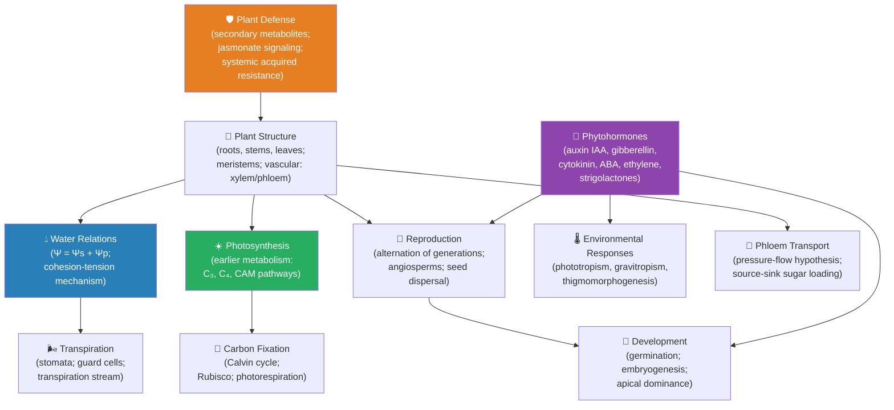

# Unit VIII — Botany — Plant Biology: Introduction {#sec:unit_VIII_unit_intro .unnumbered}


## Why This Unit Matters {.unnumbered}

Plants are the foundation of almost every terrestrial food web, the source of roughly half the oxygen
in the atmosphere, and the origin of many medicines in human pharmacopoeia — from aspirin (salicylate,
first identified in willow bark) to taxol (from Pacific yew, *Taxus brevifolia*), morphine, quinine,
and artemisinin. More fundamentally, plants are solar-energy collectors that translate photons into
chemical bonds, feeding the entire biosphere. Each year, land plants and algae fix approximately
120 billion tonnes of carbon from atmospheric CO₂ via photosynthesis — a flux so large that it
modulates global atmospheric chemistry.

Plant biology is also a discipline of extremes. The tallest trees (coast redwoods, *Sequoia
sempervirens*, 115 m) move water 115 meters against gravity using primarily cohesion-tension and solar
energy, achieving flow rates in excess of 1 m/hour. Some desert plants survive total desiccation and
revive on rehydration. Others flower in response to photoperiod cues measured in the phytochrome
system with a resolution of minutes. The *Arabidopsis thaliana* genome was the first plant genome
sequenced (2000), and this small weed has since become the \"*E. coli* of plant biology\" — a model
organism for the molecular dissection of everything from root development to pathogen resistance.

This unit integrates anatomy (vascular organization, meristems, root-shoot polarity), physiology
(transpiration, water potential, phloem loading), reproductive biology (alternation of generations,
angiosperm diversity, seed development), and signaling (phytohormones: auxin, gibberellin, cytokinin,
abscisic acid, ethylene). The quantitative spine is water potential ($\Psi = \Psi_s + \Psi_p$) and
transpiration modeled by the van den Honert equation.

---

## Landmark Discoveries {.unnumbered}

| Discoverer(s) | Year | Journal / Source | Discovery | Significance |
| ------------- | ---- | ---------------- | --------- | ------------ |
| Jan Ingenhousz | 1779 | \citep{ingenhouss1779} | Plants produce oxygen in light, CO₂ in dark | Established the light-dependency of photosynthesis |
| Julius von Sachs | 1862 | \citep{sachs1862} | Starch as first visible product of photosynthesis | Linked CO₂ fixation to carbohydrate storage in chloroplasts |
| Frits Went | 1926 | \citep{went1926} | Isolation of auxin; phototropism mechanism | First plant hormone identified; explained Darwinian canary grass bending |
| Henry Dixon & John Joly | 1894 | \citep{dixon1894} | Cohesion-tension theory of water ascent | Explained how trees move water 100+ m with no pump |
| Chailakhyan | 1936 | \citep{chailakhyan1936} | Florigen hypothesis (day-length controls flowering) | Proposed a systemic flowering stimulus; later identified as FT protein |
| *Arabidopsis* Genome Initiative | 2000 | \citep{arabidopsis2000} | First plant genome sequence (125 Mb; ~25,500 genes) | Model organism for molecular plant biology; comparative genomics |
| Gómez-Roldán et al. | 2008 | \citep{umehara2008strigolactone} | Strigolactones: new class of plant hormones | Sixth plant hormone class; regulates branching and mycorrhizal symbiosis |

---

## Key Concepts and Connections {.unnumbered}


<!-- alt: Graph showing plant-biology concept map linking structure, water transport, transpiration, reproduction, and environmental responses with photosynthesis as a shared physiological constraint. -->

*Plant-biology concept map linking structure, water transport, transpiration, reproduction, and environmental responses with photosynthesis as a shared physiological constraint.*

---

## Current Evidence Thread {.unnumbered}

In this unit, treat plant biology as a body of evidence: each claim about structure, water transport, environmental response, or reproduction should rest on physiological measurement, in vivo imaging, or a field or engineering trial, not on description alone. Plant biology links molecular regulation to climate stress, water limitation, crop resilience, phenology, and ecosystem feedbacks. As you
move through the chapters, keep a two-column note: **claim** on the left,
**evidence that would change my confidence** on the right. By the end of the
unit, each major idea should be tied to a measurement, model, citation, or
paper-based lab decision.

## Chapter Roadmap {.unnumbered}

| Chapter | Title | Core Question | Key Equation / Model |
| ------- | ----- | ------------- | -------------------- |
| **25** | Plant Structure and Water Transport | How is plant body plan organized, and how does water move from roots to leaves? | $\Psi = \Psi_s + \Psi_p$; Poiseuille's law (xylem flow) |
| **26** | Plant Reproduction | How do plants reproduce sexually and asexually, and how did flowering plant diversity arise? | Alternation of generations; polyploidy speciation rates |
| **27** | Plant Responses to the Environment | How do phytohormones integrate environmental signals into growth and defense responses? | Auxin polar transport; ethylene activation kinetics |

---

## Connections Across the Textbook {.unnumbered}

- **Photosynthesis** (\cref{sec:unit_III_photosynthesis}) is the biochemical foundation of plant carbon metabolism; this unit extends it by covering C₄ and CAM pathways and carbon assimilation in leaves.
- **Water potential and osmosis** (\cref{sec:unit_I_atoms_molecules}; \cref{sec:unit_II_membrane_transport}) directly underlie the transpiration stream model.
- **Plant hormone receptor signaling** (auxin, ABA) uses the same signaling classes covered in \nameref{sec:unit_II_unit_intro} (cell signaling: receptor kinases, second messengers).
- **Plant-pollinator, myrmecochory, and plant-mycorrhizal interactions** connect to \nameref{sec:unit_X_unit_intro} (community ecology, mutualism, co-evolution).
- **Secondary metabolites as medicines** (alkaloids, terpenoids) link to \nameref{sec:unit_I_unit_intro} (functional groups) and \nameref{sec:unit_VII_unit_intro} (antimicrobial compounds).

> **Key vocabulary introduced here:** meristem, apical dominance, cohesion-tension, water potential (Ψ), transpiration, turgor pressure, phloem, xylem, stomata, guard cell, photoperiodism, phytochrome, auxin, gibberellin, cytokinin, abscisic acid (ABA), ethylene, alternation of generations, angiosperm, gymnosperm, double fertilization.


## Computational Toolbox — Unit VIII {.unnumbered}

```python
from biology.botany import water_potential, transpiration_flux, photosynthesis_rate

# Water potential: mesophyll cell with 0.30 M solutes and 0.20 MPa turgor
psi = water_potential(solute_concentration_M=0.30, turgor_pressure_MPa=0.20)
print(f"Cell water potential Ψ = {psi.water_potential_MPa:.2f} MPa")
# Expected: Ψ ≈ -0.54 MPa
# Water moves from higher Ψ (soil, ≈ -0.03 MPa) to lower Ψ (leaf, ≈ -1.5 MPa)

# Stomatal conductance and transpiration
# g = stomatal conductance; concentration gradient is leaf minus air vapour
trans = transpiration_flux(
    stomatal_conductance_mol_m2_s=0.20,
    internal_vapor_conc_mol_m3=1.25,
    external_vapor_conc_mol_m3=0.85,
)
print(f"Transpiration flux = {trans.flux_mmol_m2_s:.1f} mmol m⁻² s⁻¹")
print(f"Net photosynthesis at PAR 1000 = {photosynthesis_rate(1000):.1f} µmol CO₂ m⁻² s⁻¹")
# Expected:
# Transpiration flux = 80.0 mmol m⁻² s⁻¹
# Net photosynthesis at PAR 1000 = 9.6 µmol CO₂ m⁻² s⁻¹
```

> **Try it yourself:** Compare `stomatal_conductance_mol_m2_s = 0.05` (drought stress, ABA-closed stomata) vs `0.3` (well-watered).
> How does the CO₂ assimilation rate (linked to photosynthesis) change proportionally?

---

*Source note: botany helpers support water potential, transpiration, photosynthesis, and C3/C4/CAM pathway comparisons.*
*Figures: `src/visualization/` (water potential diagrams, transpiration curves); `src/mermaid/biology_diagrams.py` (plant life cycle, hormone signaling diagrams).*

## Cross-Unit Integration {.unnumbered}

Plants are not "simpler" animals — they are organisms that solved the regulation problem without nervous tissue or circulating endocrine glands. The hormone signaling networks of \nameref{sec:unit_VIII_unit_intro} (auxin polar transport, ABA stomatal control, ethylene ripening cascades, jasmonate defense signaling) are functionally analogous to the nervous and endocrine systems \nameref{sec:unit_IX_unit_intro} develops in animals: both implement long-distance, context-sensitive coordination of dispersed tissues. When \nameref{sec:unit_IX_unit_intro} introduces neurotransmitter signaling, hormone–receptor binding, and feedback regulation of physiological set points, compare each mechanism to its plant counterpart from \nameref{sec:unit_VIII_unit_intro}. The shared architectural principle — local sensors, diffusing signal molecules, threshold responses, negative feedback for stability — is one of the deepest convergences in biology and a clean illustration of why systems thinking (\nameref{sec:unit_0_unit_intro}) outranks taxonomic vocabulary.
