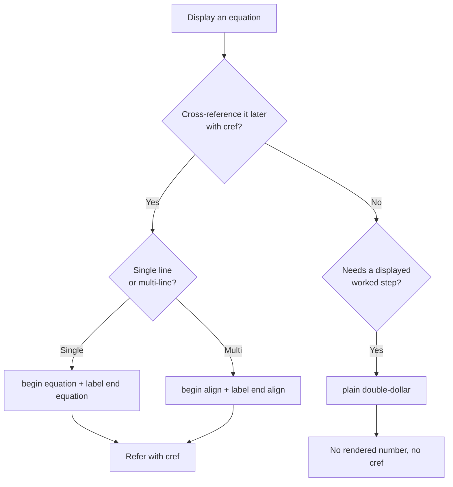

# Manuscript Writing Guide

> [!NOTE]
> **See also:** [composable_authoring.md](composable_authoring.md) for stable `sec:` / `fig:` / `eq:` IDs, ordered checklists for new chapters and figures, and which invariant tests apply. **This guide** keeps **templates** and **LaTeX patterns**; composable authoring ties them to `config.yaml`, `ChapterMeta`, and CI. For **editorial voice** (tone, vignette construction, clinical boxes) see [agent_instructions.md](agent_instructions.md).

---

## Table of contents

- [File naming convention](#file-naming-convention)
- [Template for a new chapter](#template-for-a-new-chapter)
- [Equations](#equations) — decision tree, side-by-side correct/incorrect, multi-line aligned
- [Figures](#figures) — embedding, alt text placement, naming, error messages
- [Citations and references](#citations-and-references)
- [Cross-references](#cross-references)
- [Tables](#tables)
- [Mermaid diagrams](#mermaid-diagrams)
- [Code examples](#code-examples)
- [PDF layout (margins and type)](#pdf-layout-margins-and-type)
- [Chapter checklist](#chapter-checklist)
- [Vision & Change unit map](#vision--change-and-unit-map-curriculum)

---

## File naming convention

> [!IMPORTANT]
> Chapter files must use **descriptive names with no numeric prefix**. Numbers are assigned at render time from `manuscript/config.yaml`.

| Status | Filename |
| ------ | -------- |
| Correct | `enzymes_and_kinetics.md` |
| Correct | `water_and_life.md` |
| **Incorrect** | `ch04_enzymes_and_kinetics.md` |
| **Incorrect** | `04_enzymes.md` |
| **Incorrect** | `Enzymes-And-Kinetics.md` (uppercase / hyphens) |

Filenames must match the `chapter_id` after the `unit_<X>_` prefix:

| Filename | `chapter_id` (in `ChapterMeta`) | Section label |
| -------- | ------------------------------- | ------------- |
| `water_and_life.md` (in `unit_I/`) | `unit_I_water_and_life` | `\label{sec:unit_I_water_and_life}` |

---

## Template for a new chapter

```markdown
# Chapter Title (Will be Numbered Automatically)

\label{sec:unit_X_my_new_chapter}


<!-- chapter-metadata-badge -->
> **Ch N** · Level 2/3 · 50 min read · 75 min lecture · Prerequisites: \cref{sec:unit_I_atoms_molecules}

## Learning Objectives

1. First objective (action verb + measurable outcome) ...
2. Second objective ...

---

> **Opening Vignette — A Historical Discovery**
>
> 150–300 words of historically-grounded narrative.

---

## 1 Section Title

Section text...

### 1.1 Subsection

Content...

---

## Summary

- Bullet per major section.

## Key Terms

| Term | Definition |
| ---- | ---------- |
| [**chemiosmosis**](#gl:chemiosmosis) | Coupling of electron transport to ATP synthesis via a transmembrane proton gradient |

---

*Module: `src/biology/<domain>/<file>.py` (key functions)*
*Figure: `src/visualization/plots.py` — function_name()*
*Diagram: `src/mermaid/biology_diagrams.py` — function_name()*
*Cross-references: \cref{sec:unit_X_...} (short topic), \cref{sec:unit_Z_...} (short topic)*
```

> [!TIP]
> Both the `\label{sec:…}` and the metadata badge are inserted **automatically** by `scripts/insert_crossref_labels.py` and `scripts/insert_chapter_metadata.py` once the chapter file is added to `manuscript/config.yaml` and a matching `ChapterMeta(…)` record is added to `src/biology/chapter_metadata.py`. The test `tests/test_build_invariants.py::test_every_chapter_has_section_label` enforces their presence.

---

## Equations

### Decision tree: which form should I use?



### The four valid patterns

| Pattern | Use when | Cross-reference? |
| ------- | -------- | ---------------- |
| `\begin{equation}\label{eq:...}…\end{equation}` | You will refer to the equation elsewhere. | **Yes** — `\cref{eq:...}` |
| `\begin{align}\label{eq:...}…\end{align}` | Multi-line derivation that needs cross-reference. | **Yes** — `\cref{eq:...}` |
| `$$ … $$` (plain) | Display math without numbering. | No |
| `$ … $` | Inline math. | No |

> [!WARNING]
> Do not use manual equation-number tags in manuscript prose. Use a labeled equation or align environment when a display equation needs a rendered number or cross-reference.

### Side-by-side: correct vs incorrect

#### Cross-referenced single equation

```latex
%% CORRECT — referenceable, renders cleanly
\begin{equation}
p^2 + 2pq + q^2 = 1
\label{eq:unit_V_hardy_weinberg}
\end{equation}

Hardy–Weinberg equilibrium (\cref{eq:unit_V_hardy_weinberg}) is violated when…
```

```latex
%% INCORRECT — manual numbering plus a label on a $$ line aborts xelatex.
%% Use the labelled equation environment above instead.
```

```latex
%% INCORRECT — \label outside the math environment: silently orphaned,
%% \cref{eq:unit_V_hardy_weinberg} renders as "??" in the PDF
$$
p^2 + 2pq + q^2 = 1
$$
\label{eq:unit_V_hardy_weinberg}
```

#### Multi-line (aligned) cross-referenced equation

```latex
%% CORRECT — single label on the whole align block, referenceable as one unit
\begin{align}
\label{eq:unit_VII_hodgkin_huxley_currents}
C_m \frac{dV}{dt} &= -I_{\text{Na}} - I_{\text{K}} - I_{\text{leak}} + I_{\text{stim}} \\
I_{\text{Na}}     &= \bar{g}_{\text{Na}}\, m^3 h\,(V - E_{\text{Na}}) \\
I_{\text{K}}      &= \bar{g}_{\text{K}}\,  n^4   \,(V - E_{\text{K}})
\end{align}

The current-balance equations (\cref{eq:unit_VII_hodgkin_huxley_currents}) underlie…
```

```latex
%% Per-line labels: only when each line is referenced separately.
\begin{align}
C_m \frac{dV}{dt} &= -I_{\text{Na}} - I_{\text{K}} + I_{\text{stim}} \label{eq:unit_VII_hh_membrane} \\
I_{\text{Na}}     &= \bar{g}_{\text{Na}} m^3 h (V - E_{\text{Na}})  \label{eq:unit_VII_hh_sodium}
\end{align}
```

#### Plain display math (no number, no reference)

```markdown
$$
\Delta G = -RT \ln K_{eq}
$$
```

### Naming convention for equation labels

| Slot | Rule | Example |
| ---- | ---- | ------- |
| Prefix | Always `eq:` | `eq:` |
| Unit | `unit_<X>_` matching the chapter | `unit_V_` |
| Descriptor | Short, lowercase, underscore-separated | `hardy_weinberg` |
| Full label | `eq:unit_<X>_<descriptor>` | `eq:unit_V_hardy_weinberg` |

> [!TIP]
> If a label may be referenced from **multiple chapters** (e.g. a fundamental equation re-cited later), pick the *defining* chapter for the unit slot and `\cref` it from anywhere.

---

## Figures

### Complete embedding example

Chapters embed matplotlib figures as **raw-LaTeX `\begin{figure}`** blocks so captions, labels, and alt text compose cleanly. Note the **alt-text comment placement** — it must come **immediately** after `\end{figure}`, with no blank line between.

```latex
%% CORRECT — alt-text immediately after \end{figure}
\begin{figure}[htbp]
\centering
\includegraphics[width=0.85\textwidth]{../figures/michaelis_menten.png}
\caption{Michaelis–Menten kinetics: initial velocity ($v_0$) versus
substrate concentration, approaching $V_{\max}$ asymptotically as
$[S] \to \infty$. Curve fit with $V_{\max}=10$ and $K_m=2$ mM.}
\label{fig:unit_I_michaelis_menten}
\end{figure}
<!-- alt: Smooth saturating curve of reaction velocity versus substrate concentration, plateauing at V max with the half-saturation point K m marked on the substrate axis. -->
```

Refer to the figure later with cleveref:

```latex
enzyme rate follows \cref{fig:unit_I_michaelis_menten}
```

### Common mistake — alt text placed inside the figure environment

```latex
%% INCORRECT — alt text comment is INSIDE \begin{figure}…\end{figure},
%% so test_accessibility.py cannot find it (looks AFTER \end{figure})
\begin{figure}[htbp]
\centering
\includegraphics[width=0.85\textwidth]{../figures/michaelis_menten.png}
<!-- alt: ... -->                              %% wrong location
\caption{Michaelis–Menten kinetics: ...}
\label{fig:unit_I_michaelis_menten}
\end{figure}
```

```latex
%% INCORRECT — blank line separates \end{figure} from the alt comment.
%% test_accessibility.py allows ~3 lines slack but a blank line plus
%% prose before the comment is fragile; keep the comment adjacent.
\begin{figure}[htbp]
…
\end{figure}

The Michaelis–Menten curve shows…       %% prose first

<!-- alt: ... -->                        %% comment too far away
```

### Alt text — placement and content

> [!IMPORTANT]
> Alt text must appear in an **HTML comment** placed **immediately after `\end{figure}`** (no blank line between). `tests/test_accessibility.py` checks both **proximity** (within ~3 lines) and **substance** (must describe the visual content, not just repeat the caption).

| Rule | Example |
| ---- | ------- |
| Comment marker | `<!-- alt: ... -->` |
| Position | The very next non-blank line after `\end{figure}` |
| Length | One sentence, ~15–35 words |
| Content | Describe what is **visually shown** — axes, trend, salient features — not the conclusion |

| Bad alt | Good alt |
| ------- | -------- |
| `<!-- alt: Figure 4.2 -->` | `<!-- alt: Two superimposed sigmoid curves of oxygen saturation versus pO2; left curve is fetal hemoglobin shifted left of maternal HbA. -->` |
| `<!-- alt: Michaelis-Menten -->` | `<!-- alt: Smooth saturating curve of reaction velocity versus substrate concentration, plateauing at V_max with K_m marked on the x-axis. -->` |
| `<!-- alt: A graph -->` | `<!-- alt: Bar chart of equilibrium potentials for Na+, K+, Ca2+, Cl- in a typical neuron, with positive values for Na+ and Ca2+ and negative values for K+ and Cl-. -->` |

### Naming convention for figure labels

| Slot | Rule | Example |
| ---- | ---- | ------- |
| Prefix | Always `fig:` | `fig:` |
| Unit | `unit_<X>_` matching the chapter where the figure lives | `unit_I_` |
| Descriptor | Same as the matplotlib generator name without `plot_`, or a short descriptor | `michaelis_menten` |
| Full label | `fig:unit_<X>_<descriptor>` (**globally unique** across all chapters) | `fig:unit_I_michaelis_menten` |

> [!IMPORTANT]
> Figure labels must be **globally unique** across the whole manuscript — even between different units. Two `\label{fig:foo}` statements in different files cause `test_crossref_validator.py::test_no_duplicate_labels` to fail and produce a warning during the LaTeX run (the second definition is silently shadowed).

If you register a new figure in `src/visualization/plots.py` (`ALL_FIGURE_GENERATORS`) but forget to add an `\includegraphics{…}` for it, `tests/test_build_invariants.py::test_every_registered_figure_is_referenced` will fail. Use `scripts/insert_orphan_figures.py --dry-run` to scaffold the block.

### Path conventions and what fails when they are wrong

> [!WARNING]
> `\includegraphics{}` paths are **relative to `output/manuscript/`** (where chapters are concatenated at render time) — **not** relative to the source `manuscript/` tree.

| Status | Path | Outcome |
| ------ | ---- | ------- |
| **Correct** | `\includegraphics{../figures/michaelis_menten.png}` | Resolves to `output/figures/michaelis_menten.png` |
| **Wrong** | `\includegraphics{output/figures/michaelis_menten.png}` | xelatex: `! LaTeX Error: File 'output/figures/michaelis_menten.png' not found.` (build aborts) |
| **Wrong** | `\includegraphics{../../output/figures/michaelis_menten.png}` | Same `File … not found` error |
| **Wrong** | `\includegraphics{michaelis_menten.png}` | Found locally during dev, but breaks at PDF render in CI |

When the path is wrong, pandoc/xelatex emits `! LaTeX Error: File '..' not found.` and the PDF aborts at the **first** such figure (subsequent figure errors are not reported until the first is fixed). Re-run `scripts/biology_analysis.py` to regenerate `output/manuscript/` if a path looks correct but the file is missing.

### Figure size recommendations

| Use case | `\includegraphics` width | Typical caption length |
| -------- | ------------------------ | ---------------------- |
| Full-width hero figure (chapter opener, key result) | `width=0.95\textwidth` | 40–80 words |
| Standard figure (most cases) | `width=0.85\textwidth` | 25–50 words |
| Two figures side-by-side (`subfigure` package) | `width=0.45\textwidth` each | 15–25 words each |
| Small inline schematic | `width=0.55\textwidth` | 10–20 words |
| Square plot (e.g. Punnett, heatmap) | `width=0.65\textwidth` | 20–40 words |

> [!TIP]
> Avoid `width=\textwidth` — even with 2 mm margins it rarely renders well. Cap at `0.95\textwidth` for the largest figures.

---

## Citations and references

Citations use **natbib** (loaded automatically by pandoc) from the single master `manuscript/references.bib`. The shared parser used by tests, audits, and maintenance scripts recognizes the commands documented below, including starred forms and one or two optional arguments such as `\citet[p.~12]{key}`. Prefer `\citep{}` and `\citet{}` in ordinary prose; reserve the other forms for the rare cases described here.

### Which citation command?

| Command | Renders as | When to use |
| ------- | ---------- | ----------- |
| `\citet{watson1953}` | Watson and Crick (1953) | Author's name is part of your sentence: *"as \citet{watson1953} showed…"* |
| `\citep{watson1953}` | (Watson and Crick, 1953) | Citation is parenthetical at the end of a clause |
| `\citealt{watson1953}` | Watson and Crick 1953 | Author year inline **without parentheses** (rare) |
| `\citealp{watson1953}` | Watson and Crick, 1953 | Inside an existing parenthetical (also rare) |
| `\citep{watson1953, crick1958}` | (Watson and Crick, 1953; Crick, 1958) | Multiple sources, parenthetical |
| `\citet[p.~12]{watson1953}` | Watson and Crick (1953, p. 12) | Page-specific reference |
| `\citeauthor{watson1953}` | Watson and Crick | Author only, no year |
| `\citeyear{watson1953}` | 1953 | Year only |

### Quick rule of thumb

| When the author's name is | Use |
| ------------------------- | --- |
| **Subject of the sentence** ("Watson et al. (1953) showed…") | `\citet{}` |
| **At the end of a clause** ("…the double helix (Watson et al., 1953).") | `\citep{}` |
| **Already inside parentheses** ("…the helix model (proposed by Watson and Crick, 1953)") | `\citealp{}` |
| **A list of multiple sources** | `\citep{key1, key2, key3}` |

### Examples — in prose

```markdown
The double-helix structure was proposed by \citet{watson1953} in a short *Nature* letter,
overturning earlier triple-helix models \citep{pauling1953triple, sayre1975}.
Three-domain phylogeny \citep{woese1977} transformed microbial systematics —
later refined when archaeal-specific lineages were resolved \citep{woese1990, spang2015}.
The original Hodgkin–Huxley currents (\citealp{hodgkin1952quantitative}, p.~520) anchor today's
biophysical models.
```

### Closure invariants — what fails when

> [!WARNING]
> **Every documented natbib cite command must resolve to an entry in `references.bib`.**
> **Every entry in `references.bib` must be cited at least once in the manuscript.**
> Both directions are enforced by `tests/test_bibliography_closure.py`.

| Failure mode | What pytest reports | Fix |
| ------------ | ------------------- | --- |
| Citekey in chapter but **missing** in `references.bib` | `dangling citation: <key>` | Add a BibTeX entry to `references.bib` |
| BibTeX entry exists but **never cited** | `orphan bib entry: <key>` | Cite it in the most relevant chapter, or use `scripts/integrate_orphan_citations.py` to weave it in |
| Citekey typo | `dangling citation: watson1593` | Fix the typo |
| Mid-word `\citep{}` artifact | `mid-word citation: ...` | Surround citation by spaces or punctuation |

### Adding a new entry to `references.bib`

```bibtex
@article{hodgkin1952,
  author    = {Hodgkin, A. L. and Huxley, A. F.},
  title     = {A quantitative description of membrane current and its application
               to conduction and excitation in nerve},
  journal   = {The Journal of Physiology},
  volume    = {117},
  number    = {4},
  pages     = {500--544},
  year      = {1952},
  doi       = {10.1113/jphysiol.1952.sp004764}
}

@book{darwin1859,
  author    = {Darwin, Charles},
  title     = {On the Origin of Species by Means of Natural Selection},
  publisher = {John Murray},
  address   = {London},
  year      = {1859}
}
```

Conventions:

| Field | Convention |
| ----- | ---------- |
| `author` | `Last, F. M. and Last, F. M.` (BibTeX style; **not** `F. M. Last`) |
| `title` | Sentence case; preserve capitalisation of proper nouns with `{Hox}` braces if needed |
| `journal` | Full journal name (no abbreviations) |
| `pages` | Two hyphens for an en-dash (`500--544`) |
| `doi` | Bare DOI (no `https://doi.org/` prefix) |
| `year` | 4-digit integer, no quotes |
| `month` | Optional; only if the journal uses it for ordering |

To weave a newly-added entry into a natural chapter home, use:

```bash
uv run python scripts/integrate_orphan_citations.py
```

Edit the script's `INSERTIONS` list with a citekey, target file, and anchor phrase before running.

---

## Cross-references

This manuscript uses **cleveref** for all cross-references. `\cref` automatically prepends the right type word ("Section 3", "Figure 4.2", "Equation 7.1", etc.) and handles ranges/lists.

### Reference prefixes — the full set

| Prefix | Refers to | Defined by | Renders as |
| ------ | --------- | ---------- | ---------- |
| `sec:` | Chapter sections | `\label{sec:unit_X_<stem>}` after the H1 | "section 3" / "Section 3" |
| `fig:` | Figures | `\label{fig:unit_X_<descriptor>}` inside `\begin{figure}` | "figure 4.2" / "Figure 4.2" |
| `eq:` | Equations | `\label{eq:unit_X_<descriptor>}` inside `\begin{equation}` / `\begin{align}` | "equation 7.1" / "Equation 7.1" |
| `tbl:` | Tables | `\label{tbl:unit_X_<descriptor>}` after table caption | "table 2.3" / "Table 2.3" |
| `gl:` | Glossary terms | `{#gl:<slug>}` anchor in `glossary.md`; linked from prose as `[**term**](#gl:<slug>)` | (markdown link, not cleveref) |

### `\cref` vs `\Cref` capitalisation

| Form | Renders as | Use when |
| ---- | ---------- | -------- |
| `\cref{sec:unit_I_atoms}` | "section 3" (lowercase) | Mid-sentence — *"see \cref{sec:...}"* |
| `\Cref{sec:unit_I_atoms}` | "Section 3" (capitalised) | Sentence start — *"\Cref{sec:...} introduces..."* |
| `\cref{fig:a, fig:b}` | "figures 1 and 2" | Multiple references (cleveref handles the conjunction automatically) |
| `\cref{fig:a, fig:b, fig:c}` | "figures 1, 2 and 3" | Three or more (Oxford comma per LaTeX style) |
| `\crefrange{sec:a}{sec:c}` | "sections 3 to 5" | Numerical range |

> [!TIP]
> Cleveref auto-detects the **type** from the label prefix (`sec:`, `fig:`, `eq:`, `tbl:`). You never write "see Figure" — cleveref injects the right word for you. **The single rule**: pick the right prefix when defining the label, and `\cref{}` will render correctly everywhere.

### Examples — in prose

```markdown
The Hardy–Weinberg equilibrium (\cref{eq:unit_V_hardy_weinberg}) is violated when…
\Cref{sec:unit_VI_natural_selection} extends this to changing allele frequencies.
The original derivation appears in \citet{hardy1908} and \citet{weinberg1908};
modern treatments (\cref{fig:unit_V_hw_equilibrium}, \cref{tbl:unit_V_hw_examples}) include drift correction.
The Hodgkin–Huxley currents (\cref{eq:unit_VII_hodgkin_huxley_currents}) generalise to non-spiking neurons in \cref{sec:unit_IX_synaptic_integration}.
```

### Forward vs circular references

| Pattern | OK? | Notes |
| ------- | --- | ----- |
| Forward reference: Ch 3 → `\cref{sec:unit_VII_neurons}` | **Yes** | Cleveref resolves on second LaTeX pass; standard practice |
| Backward reference: Ch 7 → `\cref{sec:unit_I_water}` | Yes | Encouraged for review/integration |
| Circular reference: Ch 3 prereqs Ch 7, Ch 7 prereqs Ch 3 | **No** | Will trip `test_chapter_metadata.py` (prerequisites must be acyclic) |
| Self-reference: Ch 3 cites `\cref{sec:unit_X_self}` | **Avoid** | Use plain "this chapter" prose instead |

### What NOT to do

> [!WARNING]
> Do **not** hand-type "Chapter 11" / "Figure 4.3" / "Equation (5.7)" / "Section 2" / "§2" in renderable prose — chapter, figure, equation, and section numbers are **auto-assigned at render time** from `config.yaml` order and LaTeX counters. Always use `\cref{sec:...}` / `\cref{fig:...}` / `\cref{eq:...}` or rephrase local roadmap prose descriptively.

`scripts/insert_crossref_labels.py` maintains chapter labels and rewrites legacy chapter-number prose when a canonical chapter target exists. `scripts/link_glossary.py --check` maintains glossary anchors and rejects unresolved glossary links, duplicate anchors, or legacy `→ Chapter N` / `→ Ch N` back-references in generated appendices.

---

## Tables

All tables use **Markdown pipe syntax**. For tables you need to cross-reference, attach a `{#tbl:...}` after the caption (pandoc converts the markdown into a `longtable` or `tabular` and applies the label).

### Plain table (not cross-referenced)

```markdown
| Organism | Doubling time | Optimal temp |
| -------- | ------------- | ------------ |
| *E. coli* | 20 min | 37°C |
| *B. subtilis* | 26 min | 30°C |
```

### Cross-referenceable table

```markdown
: Doubling times for representative bacteria. {#tbl:unit_VII_bacterial_doubling}

| Organism | Doubling time | Optimal temp |
| -------- | ------------- | ------------ |
| *E. coli* | 20 min | 37°C |
| *B. subtilis* | 26 min | 30°C |
```

Reference with cleveref:

```latex
\cref{tbl:unit_VII_bacterial_doubling} summarises…
%% Renders as: "table 7.1 summarises…"
```

> [!IMPORTANT]
> The same `unit_X_<descriptor>` naming rule used for figures and equations applies here. `tbl:unit_VII_bacterial_doubling`, **not** `tbl:bacterial_doubling`. Globally unique within the manuscript.

### Column alignment

| Syntax | Alignment |
| ------ | --------- |
| `| -------- |` | Left (default) |
| `| --------:|` | Right |
| `|:--------:|` | Center |
| `|:-------- |` | Left (explicit) |

> [!TIP]
> Use **right-alignment for numeric columns**. The default left alignment makes decimal points jagged.

### Booktabs vs default style

The preamble loads `booktabs`, so pandoc will emit `\toprule`, `\midrule`, `\bottomrule` for cleaner horizontal rules instead of the default `\hline`-everywhere style. **No author action required** — markdown pipe tables get the booktabs treatment automatically.

If you write **raw LaTeX** tables, prefer:

```latex
\begin{tabular}{lcr}
\toprule
Organism & Doubling time & Optimal temp \\
\midrule
\emph{E. coli} & 20 min & 37°C \\
\bottomrule
\end{tabular}
```

---

## Mermaid diagrams

Mermaid diagrams may be authored **inline** (recommended for fast iteration) or registered in `src/mermaid/biology_diagrams.py` (when a static PNG is needed).

### Diagram type guide — pick the right shape for the content

| Mermaid declaration | Use for | Biology examples |
| ------------------- | ------- | ---------------- |
| `flowchart LR` | Pathways and cascades read left-to-right | Glycolysis steps; signal transduction; mRNA → protein flow |
| `flowchart TD` | Top-down processes; pipelines | Protein synthesis (DNA → mRNA → protein); maturation steps |
| `graph TD` | Hierarchical classification, taxonomies | Macromolecule classification; eukaryotic supergroups; CYP450 family |
| `sequenceDiagram` | Time-ordered interactions between actors | Hormone-receptor binding; immune cell signaling; viral entry steps; multi-step enzymatic reactions |
| `stateDiagram-v2` | Discrete states with transitions | Cell cycle (G1 → S → G2 → M); ion-channel gating states (closed / open / inactivated); enzyme inhibition states; protein conformations |
| `pie` | Proportional composition | Cell-mass composition; codon redundancy distribution; biome carbon allocation |
| `gantt` | Time-line activities | Course planning, lab schedules — rarely in textbook prose |
| `erDiagram` | Entity-relationship | Rare in biology textbook |

> [!TIP]
> When in doubt between `flowchart` and `graph`: prefer `flowchart` (modern syntax, better layout). When in doubt between `flowchart TD` and `flowchart LR`: choose by **reading direction** — `LR` for processes that progress (glycolysis, signal cascades); `TD` for hierarchies that branch (taxonomy, classification trees).

### Inline mermaid in a chapter

````markdown

<!-- alt: Flowchart showing DNA template information moving through mRNA to a functional polypeptide. -->

*Central dogma of molecular biology: information flow from DNA template to functional polypeptide.*
````

> [!IMPORTANT]
> Every `mermaid` fence must be followed by **exactly one** `<!-- alt: ... -->` comment and **exactly one** short *italic* descriptive caption. `tests/test_accessibility.py` enforces both within the immediate post-fence metadata. The alt text describes the visual structure; the italic caption explains the biological meaning.

### Mermaid styling

````markdown

````

| Property | Syntax | Notes |
| -------- | ------ | ----- |
| Fill color | `fill:#1f77b4` | Use CVD-friendly hex (see [visualization_guide.md](visualization_guide.md)) |
| Stroke color | `stroke:#0b3d91` | Darker shade of fill |
| Text color | `color:#fff` | Use `#fff` on dark fills, `#000` on light fills |
| Class application | `class NodeId className` | Apply a `classDef` to specific nodes |
| Per-node inline style | `style NodeId fill:#hex,color:#hex` | Use sparingly; classes scale better |

### Size and rendering limits

| Limit | Default | Notes |
| ----- | ------- | ----- |
| Node label length | < 30 characters | Longer labels break layout |
| Total nodes per diagram | < 15 strongly preferred | Beyond 20, split into two diagrams |
| Total edges per node | < 6 | Dense crossings reduce legibility |
| Special characters in labels | Wrap in `"..."` | Required for `(`, `)`, `:`, `,`, `<`, `>` |
| Render size (PNG) | 1200×1200 px default | Set with `mmdc -w 1200 -H 1200`; the project pads rendered Mermaid PNGs to a square canvas for review and print consistency |

> [!WARNING]
> **Special characters in node labels** are the #1 cause of mermaid render failures. Always wrap labels with parentheses, colons, or commas in double quotes:
>
> - **Wrong:** `A[Glucose (C6H12O6)] --> B[Pyruvate]`
> - **Right:** `A["Glucose (C6H12O6)"] --> B[Pyruvate]`

### Registered (static-PNG) mermaid

When a chapter needs a guaranteed-stable PNG (e.g. for print-only editions), register the diagram:

1. Add a factory in [src/mermaid/biology_diagrams.py](../src/mermaid/biology_diagrams.py) and append it to `ALL_BIOLOGY_DIAGRAMS`.
2. Run `uv run python scripts/generate_diagrams.py` from the project directory.
3. Reference the resulting PNG with standard markdown image syntax:

   ```markdown
   
   ```

---

## Code examples

All code examples must import from real `src/biology/` modules — no pseudocode, no fabricated output.

```python
from biology.biochemistry import michaelis_menten

result = michaelis_menten(substrate_conc=5.0, Vmax=10.0, Km=2.0)
print(f"Rate = {result.reaction_rate:.2f}")  # Real computed output: 7.14
```

> [!TIP]
> When you write a code block, run it once in a Python REPL with `MPLBACKEND=Agg` set, and copy the **actual** output as a comment. This is enforced informally by editorial review and formally by the no-mock policy in `tests/`.

---

## PDF layout (margins and type)

Letter PDFs use:

| Setting | `manuscript/config.yaml` | `manuscript/preamble.md` |
| ------- | ------------------------ | ------------------------ |
| Margins | `layout.margin_*_mm: 2` | `geometry: 2mm` all sides |
| Body size | `typography.base_font_size_pt: 9` | `\renewcommand{\normalsize}{...9}{10.8}...` |
| Line spacing | `layout.line_height: 1.28` | `\setstretch{1.28}` |

> [!WARNING]
> Changing density requires editing **both files** so YAML comments and the rendered PDF stay aligned. See [accessibility.md](accessibility.md) for the alternative "reader profile" recipe (10–12 mm margins, 10.5–11 pt body).

Authoritative allowlists for `plot_*` and `*_diagram()` names live in [manuscript/AGENTS.md](../manuscript/AGENTS.md).

---

## Chapter checklist

- [ ] H1 title matches `manuscript/config.yaml` and is followed by `\label{sec:unit_X_<stem>}` (automatable: `scripts/sync_curriculum_materials.py` + `scripts/insert_crossref_labels.py`)
- [ ] `<!-- chapter-metadata-badge -->` with difficulty / time / prereqs (automatable: `scripts/insert_chapter_metadata.py`)
- [ ] Learning Objectives listed (7–9 per chapter, each starting with an action verb)
- [ ] Opening Vignette (150–300 words, historically grounded)
- [ ] All major sections at `##` level
- [ ] All subsections at `###` level
- [ ] Equations using the correct form (see [Equations](#equations) decision tree)
- [ ] Figures with `\caption{...}`, `\label{fig:unit_X_<descriptor>}`, and an `<!-- alt: ... -->` comment immediately after `\end{figure}`
- [ ] All cross-references use `\cref{sec:|fig:|eq:|tbl:}` — no hand-typed "Chapter 11"
- [ ] Citations use `\citet{}` / `\citep{}`; every key in `references.bib`; every entry cited
- [ ] Code examples use real imports and real outputs
- [ ] Summary section at end (one bullet per major section)
- [ ] Key Terms list at end (glossary terms linked via `[**term**](#gl:term-slug)`)
- [ ] Module/Figure/Diagram footer at very end
- [ ] Corresponding lab and question bank exist in `manuscript/labs/unit_X/` and `manuscript/questions/unit_X/`, both `\cref`-linking back
- [ ] A `ChapterMeta(…)` record is added to `src/biology/chapter_metadata.py`
- [ ] `tests/test_toc_consistency.py`, `tests/test_build_invariants.py`, `tests/test_chapter_metadata.py`, and `tests/test_bibliography_closure.py` all pass

---

## Vision & Change and unit map (curriculum)

The preface's **Five Big Ideas** align with the AAAS *Vision and Change* core concepts (cited in the preface as `visionandchange2011`). A coarse map for instructors:

| Big idea (preface) | Primary units in this book |
| ------------------ | --------------------------- |
| Evolution | Unit VI; Units IV–V; selections in Unit VII (viral evolution) |
| Structure and function | Units I–II; Unit IX; Unit VIII (plant form) |
| Information (storage, flow, expression) | Units IV–V; parts of Units II, VII |
| Pathways and transformations of energy and matter | Units I, III, VIII (photosynthesis) |
| Systems (living systems, interfaces with physical world) | Unit 0; Unit X; Unit III (metabolic networks); Unit IX (integration) |
| (Cross-cutting) Biology as a research practice; modeling | `src/biology` modules; quant labs |

Use this as a **guide**, not a rigid standard — chapters often touch several ideas.

---

## See also

- [composable_authoring.md](composable_authoring.md) — stable IDs, workflows, validation commands
- [agent_instructions.md](agent_instructions.md) — editorial voice, vignette construction, clinical boxes
- [visualization_guide.md](visualization_guide.md) — figure generation, CVD palette, mermaid styling
- [testing_guide.md](testing_guide.md) — what test catches what mistake
- [accessibility.md](accessibility.md) — alt text rules, reader-profile recipe
- [pipeline_guide.md](pipeline_guide.md) — full pipeline and maintenance script table
- [../manuscript/AGENTS.md](../manuscript/AGENTS.md) — manuscript contract (allowlists, paths, invariants)
