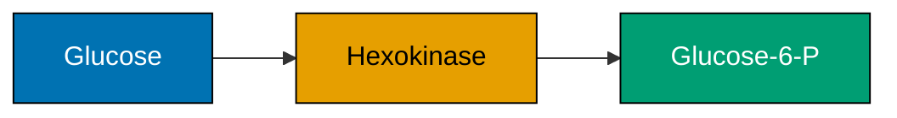
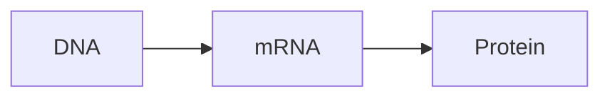

# Visualization Guide

> [!NOTE]
> **See also:** [composable_authoring.md](composable_authoring.md) for registry rules and `test_every_registered_figure_is_referenced`; [manuscript_guide.md](manuscript_guide.md#figures) for embedding/alt-text rules; [accessibility.md](accessibility.md) for the CVD policy.

---

## Table of contents

- [Visual Output Contract](#visual-output-contract)
- [Six-step checklist for new figures](#six-step-checklist-for-new-figures)
- [Generating figures](#generating-figures)
- [Matplotlib figure conventions](#matplotlib-figure-conventions)
- [CVD-friendly palette (exact hex)](#cvd-friendly-palette-exact-hex)
- [Wong/Okabe-Ito reference palette](#wongokabe-ito-reference-palette)
- [Mermaid diagram conventions](#mermaid-diagram-conventions)
- [Embedding in manuscript](#embedding-in-manuscript)
- [Figure size guidance](#figure-size-guidance)
- [Common mistakes](#common-mistakes)
- [Workflows](#workflows)

---

## Visual Output Contract

The `biology_textbook` project generates **three types of visual output**:

1. **Matplotlib figures** — 32 quantitative plots from `src/visualization/plots.py` (`ALL_FIGURE_GENERATORS`)
2. **Registered Mermaid diagrams** — 24 biological pathway/network diagrams from `src/mermaid/biology_diagrams.py` (`ALL_BIOLOGY_DIAGRAMS`), rendered to PNG via the `mmdc` CLI
3. **Inline Mermaid fences** — 196 manuscript-local diagrams rendered during PDF preprocessing and optional visual-contract review

Matplotlib figures and registered Mermaid diagrams are square-padded after rendering so labels and legends do not change the final canvas shape. The visual-contract audit measures all 252 records and fails `--check` when a normal matplotlib figure falls outside aspect ratio `0.85-1.18`, or a Mermaid PNG falls outside `0.75-1.33`, unless the record carries a reviewed exception reason. Use temporary review roots for verification:

```bash
tmp=$(mktemp -d)
uv run python scripts/generate_figures.py --output-dir "$tmp/figures"
uv run python scripts/generate_diagrams.py --strict-png --output-dir "$tmp/figures/mermaid"
uv run python scripts/audit_visual_contracts.py --figures-root "$tmp/figures" --output "$tmp/visual_manifest.json" --render-inline --check
```

---

## Six-step checklist for new figures

Use this every time you add a new visualization. Each step maps to an enforced or advisory test.

| # | Step | Where | Enforced by |
| - | ---- | ----- | ----------- |
| 1 | **Implement** the generator: `plot_<descriptor>(*, output_path: Path) -> Path` | `src/visualization/plots.py` | Coverage gate (≥ 90 %) — `test_mermaid_and_visualization.py` |
| 2 | **Register** the generator in `ALL_FIGURE_GENERATORS` (key matches allowlist) | `src/visualization/plots.py` | Allowlist in [manuscript/AGENTS.md](../manuscript/AGENTS.md) |
| 3 | **Generate** the PNG: `uv run python scripts/generate_figures.py` | from project dir | Inspect `output/figures/<file>.png`; square padding is applied by `_save_figure` |
| 4 | **Embed** the figure in the chapter using raw-LaTeX `\begin{figure}…\label{fig:unit_X_<descriptor>}…\end{figure}` and an `<!-- alt: … -->` comment **immediately after** `\end{figure}` | `manuscript/unit_<X>/<chapter>.md` | `test_accessibility.py`, `test_build_invariants.py` |
| 5 | **Cross-reference** the figure from prose with `\cref{fig:unit_X_<descriptor>}` (no hand-typed "Figure 4.2") | same chapter or any other | `test_crossref_validator.py` |
| 6 | **Validate**: `uv run python -m pytest tests/test_build_invariants.py tests/test_accessibility.py -v` and run the temp-root visual-contract audit above | from project dir | CI gate |

> [!TIP]
> If a generator is registered but never embedded, `test_every_registered_figure_is_referenced` fails. Use `scripts/insert_orphan_figures.py --dry-run` to scaffold an embedding block automatically.

---

## Generating figures

From the active project directory:

```bash
uv run python scripts/generate_figures.py
ls output/figures/*.png
```

For a single figure during development:

```python
from pathlib import Path
from visualization import plot_michaelis_menten

plot_michaelis_menten(
    output_dir=Path("output/figures"),
    Vmax=10.0,
    Km=2.0,
)
```

---

## Matplotlib figure conventions

All figure generators must follow these rules (enforced by `tests/test_mermaid_and_visualization.py` and editorial review):

| # | Rule | Why |
| - | ---- | --- |
| 1 | **Headless backend.** Set `MPLBACKEND=Agg`; never call `plt.show()` in library code. | CI has no display. |
| 2 | **Font sizes.** Titles 15–18 pt; axis labels 14 pt; tick labels 12 pt; legend 11 pt. | Readable at 2 mm-margin print density. |
| 3 | **DPI = 150 and square output.** Use `visualization._scaffold._save_figure`; it saves with a tight bounding box, closes the figure, and pads the PNG to a square canvas. | Crisp on screen and print without bloated file size or aspect-ratio drift. |
| 4 | **CVD palette.** Import from `src/visualization/cvd.py`; never use red and green as the only two-way distinction. | Colorvision-deficiency safety. |
| 5 | **Legends with handles.** When multiple series appear, pass explicit `handles, labels`. | Avoids fragile auto-legend ordering. |
| 6 | **Pathlib for I/O.** Use `pathlib.Path`; resolve at call time. | Cross-platform; no hardcoded `/tmp`. |
| 7 | **Deterministic.** Set `np.random.seed(42)` (or pass `seed=` argument) before any stochastic plot. | Reproducible PNGs across CI runs. |
| 8 | **No globals.** Each `plot_*` function creates its own `fig, ax` and closes them. | Prevents matplotlib state leaking between figures. |

### Canonical save pattern

```python
import matplotlib
matplotlib.use("Agg")
import matplotlib.pyplot as plt
from pathlib import Path
from visualization._scaffold import _save_figure
```

### Canonical generator skeleton

```python
import numpy as np
import matplotlib.pyplot as plt
from pathlib import Path
from visualization.cvd import SERIES2
from visualization._scaffold import _save_figure

def plot_my_descriptor(
    output_dir: Path,
    *,
    seed: int = 42,
) -> Path:
    """One-line summary used by test_mermaid_and_visualization.py."""
    rng = np.random.default_rng(seed)
    x = np.linspace(0, 10, 200)
    y1 = np.sin(x)
    y2 = np.cos(x) + 0.1 * rng.standard_normal(200)

    fig, ax = plt.subplots(figsize=(6, 6))
    ax.plot(x, y1, color=SERIES2[0], linestyle="-", linewidth=2, label="Sine")
    ax.plot(x, y2, color=SERIES2[1], linestyle="--", linewidth=2, label="Noisy cosine")
    ax.set_xlabel("Time (s)", fontsize=14)
    ax.set_ylabel("Amplitude", fontsize=14)
    ax.set_title("Descriptive title", fontsize=16)
    ax.legend(fontsize=11)
    ax.grid(True, alpha=0.3)
    fig.tight_layout()

    return _save_figure(fig, output_dir, "my_descriptor.png")
```

---

## CVD-friendly palette (exact hex)

The palette is defined in `src/visualization/cvd.py`. **Always import from there** — do not hardcode hex values.

| Symbol | Hex | RGB | Use |
| ------ | --- | --- | --- |
| `BAR_POS` | `#1f77b4` | (31, 119, 180) | Positive bars (e.g. depolarizing Nernst potentials) |
| `BAR_NEG` | `#d62728` | (214, 39, 40) | Negative bars (e.g. hyperpolarising Nernst potentials) |
| `PUNNETT_DOMINANT` | `#1f77b4` | (31, 119, 180) | Dominant Punnett-square cells (with `//` hatch) |
| `PUNNETT_RECESSIVE` | `#ff7f0e` | (255, 127, 14) | Recessive Punnett-square cells (with `xx` hatch) |
| `SERIES2[0]` | `#1f77b4` | (31, 119, 180) | Two-series default — primary (blue) |
| `SERIES2[1]` | `#ff7f0e` | (255, 127, 14) | Two-series default — secondary (orange) |
| `SERIES3[0]` | `#1f77b4` | (31, 119, 180) | Three-series — primary (blue) |
| `SERIES3[1]` | `#ff7f0e` | (255, 127, 14) | Three-series — secondary (orange) |
| `SERIES3[2]` | `#2ca02c` | (44, 160, 44) | Three-series — tertiary (green; only safe with line-style differentiation) |

### When to use which

| Situation | Strategy |
| --------- | -------- |
| Two overlapping curves | `SERIES2[0]` solid + `SERIES2[1]` dashed — color **and** line-style |
| Three overlapping curves | `SERIES3` + line styles `-`, `--`, `:` — never rely on color alone |
| Signed bar chart | `BAR_POS` for positive, `BAR_NEG` for negative |
| Punnett square cells | `PUNNETT_*` constants + hatching (`hatch="//"` / `hatch="xx"`) |
| Heatmap | `cmap="viridis"` (perceptually uniform). **Never** `cmap="RdYlGn"` without an additional channel. |
| Categorical (≥4 categories) | `cmap="tab10"` is acceptable but include direct labels on the plot |

> [!WARNING]
> **Never** use red and green as the only two-way distinction. ~8 % of biological-male readers and ~0.5 % of biological-female readers cannot reliably distinguish them. The CVD palette and line-style/hatch redundancy implements `accessibility.color_blindness_safe: true` from `manuscript/config.yaml`. See [accessibility.md](accessibility.md).

---

## Wong/Okabe-Ito reference palette

For new generators or **mermaid `classDef` styling**, prefer the **Wong/Okabe-Ito 8-color palette** — the de-facto standard for colorblind-safe scientific figures (Wong, *Nature Methods* 8, 441, 2011). All eight hues are distinguishable under deuteranopia, protanopia, and tritanopia.

| Name | Hex | RGB | Typical use |
| ---- | --- | --- | ----------- |
| **Black** | `#000000` | (0, 0, 0) | Outlines, axes, neutral text |
| **Blue** | `#0072B2` | (0, 114, 178) | Primary series; controls; reference |
| **Orange** | `#E69F00` | (230, 159, 0) | Secondary series; treatment; perturbation |
| **Teal (bluish-green)** | `#009E73` | (0, 158, 115) | Tertiary series; "go"/positive direction |
| **Yellow** | `#F0E442` | (240, 228, 66) | Highlight; rare 4th series; **avoid as the only distinction on white background** |
| **Navy (dark blue)** | `#0000B2` | (0, 0, 178) | Alternative to Blue when Blue is reserved |
| **Vermillion (red-orange)** | `#D55E00` | (213, 94, 0) | "Stop"/danger/negative direction |
| **Sky blue** | `#56B4E9` | (86, 180, 233) | Lighter tint of Blue; pairs well with Vermillion |
| **Reddish purple (pink)** | `#CC79A7` | (204, 121, 167) | 4th–5th series; gentle accent |

### Mermaid `classDef` example using Wong palette

````markdown


*Two-step phosphorylation: glucose enters and is phosphorylated by hexokinase to glucose-6-phosphate, committing the substrate to glycolysis.*
````

> [!TIP]
> When you only need **one** color beyond black, use **Blue (`#0072B2`)**. When you need **two**, add **Orange (`#E69F00`)** — these two hues remain distinct under all common forms of color vision deficiency. Add **Vermillion (`#D55E00`)** as the third only when red-orange is semantically right (e.g. signaling "stop").

---

## Mermaid diagram conventions

Mermaid diagrams are defined in Python as string-returning factories in `src/mermaid/biology_diagrams.py`, then rendered to PNG using `mmdc` (Mermaid CLI):

```python
from pathlib import Path
from mermaid.biology_diagrams import enzyme_kinetics_diagram
from mermaid.renderer import MermaidRenderer

diagram = enzyme_kinetics_diagram()
out = Path("output/figures/mermaid")
MermaidRenderer(out).render(diagram.name, diagram.source)
```

### Generation

```bash
# Bulk regeneration of all 24 registered diagrams
uv run python scripts/generate_diagrams.py

# Single diagram (requires mmdc on PATH)
mmdc -i /tmp/diagram.mmd -o output/figures/mermaid/diagram.png -w 1200 -H 1200
```

> [!TIP]
> Optional **`.puppeteer.json`** at the project root is passed to `mmdc --puppeteerConfigFile` so a system Chrome binary can be used. Adjust paths on non-macOS systems. If `mmdc` is missing, the renderer writes `.mmd` source files only — useful for review-only HTML builds.

### Diagram type — quick reference

| Mermaid declaration | Use for |
| ------------------- | ------- |
| `flowchart LR` | Pathways and cascades (left-to-right reading) |
| `flowchart TD` | Hierarchies, classifications (top-down) |
| `sequenceDiagram` | Time-ordered actor interactions (signal cascades) |
| `stateDiagram-v2` | Discrete states with transitions (cell cycle, channel gating) |
| `pie` | Proportional composition (rare; usually a bar chart is clearer) |

For the full diagram-type → biology-content mapping, see [manuscript_guide.md#mermaid-diagrams](manuscript_guide.md#mermaid-diagrams).

### Syntax conventions

- Sentence-case node labels under 30 characters.
- Wrap labels containing `(`, `)`, `:`, `,`, `<`, `>` in double quotes: `A["Glucose (C6)"]`.
- Style with `classDef` blocks; use Wong/Okabe-Ito hex (see palette table above).
- Per-node inline style is accepted: `style NodeId fill:#0072B2,color:#FFFFFF` — use `classDef` whenever 2+ nodes share styling.
- After every inline `mermaid` fence in a chapter, write exactly one `<!-- alt: ... -->` comment and exactly one short *italic* descriptive caption — `tests/test_accessibility.py` enforces both.

### Available registered diagrams

See [api_reference.md](api_reference.md#mermaidbiology_diagrams) for the full list of 24 `*_diagram()` factories.

---

## Embedding in manuscript

### Matplotlib figures

Embed with raw-LaTeX `\begin{figure}…\end{figure}` blocks — paths relative to `output/manuscript/`:

```latex
\begin{figure}[htbp]
\centering
\includegraphics[width=0.85\textwidth]{../figures/michaelis_menten.png}
\caption{Michaelis–Menten kinetics: initial velocity ($v_0$) versus substrate concentration, approaching $V_{\max}$ asymptotically as $[S] \to \infty$.}
\label{fig:unit_I_michaelis_menten}
\end{figure}
<!-- alt: Smooth saturating curve of reaction velocity versus substrate concentration, plateauing at V_max with the half-saturation point K_m marked on the substrate axis. -->
```

Reference elsewhere with cleveref:

```latex
enzyme rate follows \cref{fig:unit_I_michaelis_menten}
```

> [!WARNING]
> **Path is relative to `output/manuscript/`**, not `manuscript/`. Use `../figures/<name>.png`. See [manuscript_guide.md](manuscript_guide.md#path-conventions-and-what-fails-when-they-are-wrong) for the failure messages produced by wrong paths.

### Mermaid (inline)

Drop a `mermaid` fenced block directly in the markdown; the renderer converts each block to a PNG at build time:

````markdown

<!-- alt: Flowchart showing DNA transcribed into mRNA and translated into protein. -->

*Central dogma of molecular biology: DNA template → mRNA transcript → polypeptide.*
````

### Mermaid (registered PNG)

When a chapter requires a guaranteed-stable PNG (instead of inline rendering):

```markdown

```

### Captioning conventions

- Captions describe **what is shown** (axes, salient features, parameter values), not just name the figure.
- Include axis labels and any important threshold values in the caption.
- For diagrams: describe the key process and what elements are connected.
- Inline Mermaid metadata is maintained by `uv run python scripts/add_mermaid_alt_text.py`; use `--check` during review to fail on duplicate, missing, or stale Mermaid metadata.
- Every generator registered in `ALL_FIGURE_GENERATORS` **must** be referenced at least once — `tests/test_build_invariants.py::test_every_registered_figure_is_referenced` enforces this.
- Every `\label{fig:…}` **must** have at least one prose `\cref{fig:…}` — `tests/test_build_invariants.py::test_every_figure_label_has_prose_cref` enforces this (2026-05-23 figure expansion pass).

---

## Figure size guidance

| Use case | matplotlib `figsize=` | LaTeX `width=` | Notes |
| -------- | --------------------- | -------------- | ----- |
| Full-width hero (chapter opener, key result) | `(10, 6)` | `0.95\textwidth` | One per chapter at most |
| Standard plot (most cases) | `(8, 5)` | `0.85\textwidth` | Default — start here |
| Half-width (paired with another figure) | `(6, 4)` | `0.45\textwidth` | Use `subfigure` package |
| Small inline schematic | `(5, 3.5)` | `0.55\textwidth` | For supporting illustrations |
| Square plot (Punnett, heatmap) | `(6, 6)` | `0.65\textwidth` | Maintain aspect ratio |
| Wide panel (multiple series, time-series) | `(12, 4)` | `0.95\textwidth` | Aspect 3:1; useful for HH traces |

> [!TIP]
> Default to **half-width (`0.45\textwidth`)** when two related plots can sit side-by-side — saves vertical space at the 2 mm-margin density. Reserve **full-width (`0.85\textwidth`)** for the section's "key result" figure.

> [!WARNING]
> Avoid `width=\textwidth` (no fraction). Even with 2 mm margins, content tends to bleed past expected bounds. Cap at `0.95\textwidth`.

---

## Common mistakes

| Mistake | Symptom | Fix |
| ------- | ------- | --- |
| `plt.show()` in library code | Test hangs in CI | Remove; use `_save_figure()` and `plt.close(fig)` |
| Hardcoded `/tmp/figures` path | Works locally, fails in CI | Accept `output_dir: Path` parameter |
| `plt.savefig("foo.png")` (no path) | File appears in `cwd`, not `output/figures/` | Use the `_save_figure()` helper |
| Missing `plt.close(fig)` | Memory growth across many figures | Always close after save |
| Forgetting `MPLBACKEND=Agg` | `tkinter.TclError` on headless CI | Set in `conftest.py` (already done) and `_save_figure` callers |
| Red+green only color distinction | Fails accessibility review | Use `cvd.SERIES2` / `cvd.SERIES3` + line styles |
| `cmap="RdYlGn"` for heatmap | CVD-unfriendly | Use `cmap="viridis"` |
| Hand-typed "Figure 4.2" in caption text | Number drifts on chapter reorder | Let cleveref handle: `\cref{fig:...}` in prose only |
| Forgetting `<!-- alt: ... -->` after `\end{figure}` | `test_accessibility.py` fails | Add a one-sentence visual description immediately after `\end{figure}` |
| Forgetting Mermaid alt/caption after fence | `test_accessibility.py` fails | Add one `<!-- alt: ... -->` comment and one italic caption immediately after the fence |
| Mermaid label with unquoted parens: `A[Glucose (C6H12O6)]` | mmdc render fails | Wrap: `A["Glucose (C6H12O6)"]` |
| Path `output/figures/foo.png` in `\includegraphics` | LaTeX `File not found` error | Use `../figures/foo.png` (relative to `output/manuscript/`) |
| Hardcoded hex (`color="#FF0000"`) instead of `cvd.*` | Accessibility regression | Import from `visualization.cvd`; for new diagrams use Wong/Okabe-Ito (`#0072B2`, `#E69F00`, …) |
| Mermaid node label > 30 characters | Layout breaks; text overflows | Move detail to caption / italic line; keep node label short |

---

## Workflows

### Adding a new matplotlib figure (`plot_*`)

1. Implement `plot_<descriptor>(output_dir: Path, ...)` in [src/visualization/plots.py](../src/visualization/plots.py) and register it in `ALL_FIGURE_GENERATORS`. Name must appear on the allowlist in [manuscript/AGENTS.md](../manuscript/AGENTS.md).
2. From the project directory: `uv run python scripts/generate_figures.py`.
3. Embed in the chapter with raw LaTeX `\begin{figure}…\includegraphics{../figures/<file>.png}…\label{fig:unit_X_<descriptor>}…\end{figure}` and an `<!-- alt: … -->` comment.
4. Reference with `\cref{fig:...}` in prose.
5. Confirm `tests/test_build_invariants.py::test_every_registered_figure_is_referenced`, `tests/test_accessibility.py`, and `scripts/audit_visual_contracts.py --figures-root <tmp>/figures --output <tmp>/visual_manifest.json --render-inline --check` pass. Optional: `scripts/insert_orphan_figures.py --dry-run`.

### Adding a new registered Mermaid diagram

1. Add a factory `*_diagram()` in [src/mermaid/biology_diagrams.py](../src/mermaid/biology_diagrams.py) and register it in `ALL_BIOLOGY_DIAGRAMS`. Allowlist in [manuscript/AGENTS.md](../manuscript/AGENTS.md).
2. From the project directory: `uv run python scripts/generate_diagrams.py`.
3. `tests/test_mermaid_and_visualization.py` exercises the registry.
4. Reference the diagram from manuscript as required by your chapter. Inline fences need one `<!-- alt: ... -->` comment plus one italic caption; static PNGs need descriptive markdown image alt text.
5. Use balanced `flowchart TD`/`LR` directions, short wrapped labels, and subgraphs/phase blocks so the rendered PNG remains square-ish without misrepresenting sequence semantics.

---

## See also

- [composable_authoring.md](composable_authoring.md) — registry rules and authoring workflows
- [manuscript_guide.md](manuscript_guide.md) — embedding, alt text, equations, citations
- [accessibility.md](accessibility.md) — CVD policy, alt text rules, reader-profile recipe
- [api_reference.md](api_reference.md) — full list of `plot_*` and `*_diagram()` registered names
- [../manuscript/AGENTS.md](../manuscript/AGENTS.md) — allowlist of figure and diagram names
