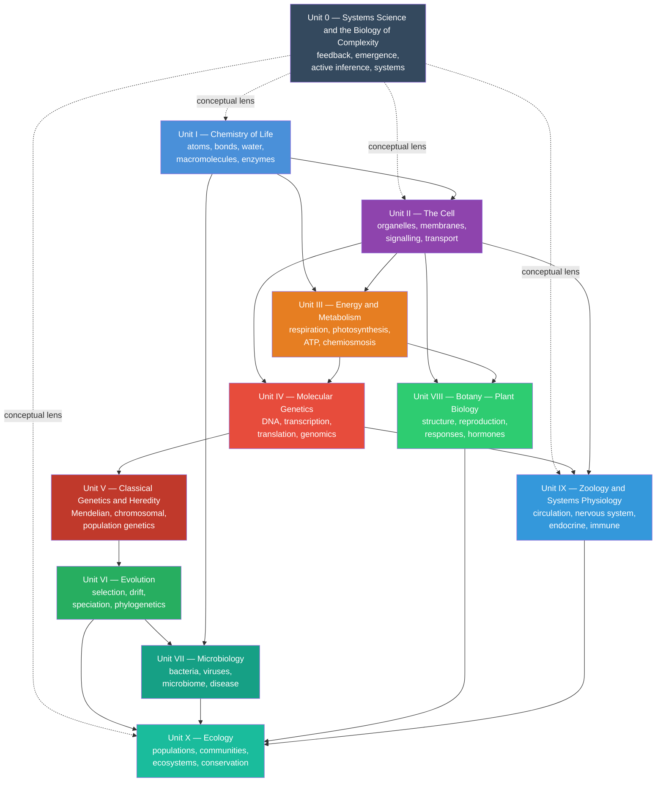

---
# Front matter metadata — read by biology_analysis.py and scripts/03_render_pdf.py
# This file is rendered before the Preface and all chapters.
front_matter: true
page_break_after: true
---

# Front Matter {.unnumbered}

## Dedication {.unnumbered}

*To the active minds who encounter biology not as a collection of facts,  
but as a living, computable, immersive, and mathematically rich discipline —  
and to those who show them the way.*

\newpage

---

## Acknowledgements {.unnumbered}

The author gratefully acknowledges many contributions, learnings, and sources of inspiration.

**Scientific foundations.** This textbook builds on the foundational scholarship of
too many to name, and in particular the textbooks of Alberts et al. (*Molecular Biology of the Cell*), Campbell & Reece (*Biology*),
Stryer (*Biochemistry*), Lehninger (*Principles of Biochemistry*), the primary literature cited throughout each chapter, and a variety of other sources. We aim to cite specific experimental results at point of use with full author credit. The vision of this textbook is informed by the open curriculum [OpenStax Biology 2e](https://openstax.org/details/books/biology-2e). We pause in gratitude and awe to those who have gone before us in Epistemia (like Academic but think bigger), and to those who will come after us.

**Open science.** This textbook is open source and open access. The source code is licensed under the Apache-2.0 license, and the text is licensed under the Creative Commons Attribution 4.0 International license. The source code is available in the [biology textbook source repository](https://github.com/docxology/biology_textbook). The text is available in the [biology textbook repository](https://github.com/docxology/biology_textbook). The work builds on, and contributes to, the open-science community whose code, data, lifeways, and scholarship have made this work freely available, computationally grounded, and broadly accessible.*

**Biology education.** This textbook is designed to be used in a  biology course (it is an exercise left to the reader, what kind of course this will be), and is therefore grounded in the principles of active learning and student-centered teaching. The textbook is designed to be used in a first-year biology course, and is therefore grounded in the principles of active learning and student-centered teaching. The textbook is designed to be used in a first-year biology course, and is therefore grounded in the principles of active learning and student-centered teaching.

**Research project template.** The build pipeline, testing infrastructure, and
multi-project architecture are based on the author's own Project Template
maintained in the [Research Project Template repository](https://github.com/docxology/template).
This textbook’s sources, figures, and tests live in the dedicated book repository
[biology textbook source repository](https://github.com/docxology/biology_textbook).
The template is a comprehensive framework for reproducible research, including
version control, testing, documentation, and publication. It is a model for
this work, and the template is used to build this textbook.

\newpage

---

## About This Textbook {.unnumbered}

### Computational Philosophy {.unnumbered}

This *Introduction to Biology: A Generative Approach* integrates biological narrative explanation and conceptual elaboration, with formalisms, models, computational connections, and empirical studies.
When a chapter introduces a model (enzyme kinetics, predator–prey dynamics, action
potentials), the corresponding computation is implemented in the accompanying Python
modules and used to generate figures where appropriate. Every aspect of this textbook is designed to help students move between mechanisms, measurements, and models: what a system does, how we know, and what a simple quantitative model can predict (and where it breaks).

This approach aims to help students move between mechanisms, measurements, and
models: what a system does, how we know, and what a simple quantitative model can
predict (and where it breaks).

### What Makes This Textbook Different {.unnumbered}

| Feature | This Textbook | Traditional Textbook |
| ------- | ---------------- | ----------------- |
| **Figures** | Generated from mathematical models; reproducible | Static graphics |
| **Equations** | Derived and numerically validated | Stated without derivation |
| **Code** | Python modules for every major model | Absent |
| **Diagrams** | Mermaid process diagrams; automatically rendered | Hand-drawn |
| **Opening vignettes** | Landmark experiment narrative opening each chapter | Absent |
| **Curriculum map** | Generated chapter/lab/question/standards alignment | Usually external |
| **Master glossary** | 220 terms with etymology and chapter cross-references | Chapter-end lists |
| **Open access** | CC BY 4.0; fully open source | Copyright restricted |
| **Citations** | Inline, with year and journal | Often chapter-end primarily |

### How to Navigate This Book {.unnumbered}

<!-- toc-navigation-start -->
The textbook is organized from systems-level orientation through molecular,
cellular, organismal, evolutionary, and ecological scales. The entries below
are generated from `manuscript/config.yaml` so navigation stays aligned with
the rendered table of contents.

- **\nameref{sec:unit_0_unit_intro}:** \nameref{sec:unit_0_systems_science}; \nameref{sec:unit_0_complex_adaptive_systems}; \nameref{sec:unit_0_active_inference}.
- **\nameref{sec:unit_I_unit_intro}:** \nameref{sec:unit_I_atoms_molecules}; \nameref{sec:unit_I_water_and_life}; \nameref{sec:unit_I_macromolecules}; \nameref{sec:unit_I_enzymes_and_kinetics}.
- **\nameref{sec:unit_II_unit_intro}:** \nameref{sec:unit_II_cell_theory}; \nameref{sec:unit_II_cell_structure}; \nameref{sec:unit_II_membrane_transport}; \nameref{sec:unit_II_cell_signaling}.
- **\nameref{sec:unit_III_unit_intro}:** \nameref{sec:unit_III_bioenergetics_and_respiration}; \nameref{sec:unit_III_photosynthesis}; \nameref{sec:unit_III_metabolic_integration}.
- **\nameref{sec:unit_IV_unit_intro}:** \nameref{sec:unit_IV_dna_replication_and_cell_cycle}; \nameref{sec:unit_IV_gene_expression}; \nameref{sec:unit_IV_mutations_and_genomics}; \nameref{sec:unit_IV_epigenetics_and_gene_regulation}.
- **\nameref{sec:unit_V_unit_intro}:** \nameref{sec:unit_V_mendelian_genetics}; \nameref{sec:unit_V_chromosomal_inheritance}; \nameref{sec:unit_V_population_genetics}.
- **\nameref{sec:unit_VI_unit_intro}:** \nameref{sec:unit_VI_evolution_and_selection}; \nameref{sec:unit_VI_genetic_drift_and_speciation}; \nameref{sec:unit_VI_phylogenetics}.
- **\nameref{sec:unit_VII_unit_intro}:** \nameref{sec:unit_VII_bacteria_archaea_viruses}; \nameref{sec:unit_VII_microbial_ecology}; \nameref{sec:unit_VII_infectious_disease}.
- **\nameref{sec:unit_VIII_unit_intro}:** \nameref{sec:unit_VIII_plant_structure_and_water}; \nameref{sec:unit_VIII_plant_reproduction}; \nameref{sec:unit_VIII_plant_responses}.
- **\nameref{sec:unit_IX_unit_intro}:** \nameref{sec:unit_IX_circulation_respiration_homeostasis}; \nameref{sec:unit_IX_nervous_system}; \nameref{sec:unit_IX_action_potential_synapses}; \nameref{sec:unit_IX_endocrine_and_immune}.
- **\nameref{sec:unit_X_unit_intro}:** \nameref{sec:unit_X_population_ecology}; \nameref{sec:unit_X_community_ecology}; \nameref{sec:unit_X_ecosystem_ecology}; \nameref{sec:unit_X_biomes_and_conservation}.
- **Laboratory activities:** one companion lab follows each chapter in the
same canonical order.
- **Question banks:** one 30-item question bank follows each chapter in the
same canonical order.
- **\nameref{sec:appendix_curriculum_map}:** reference material generated or ordered from the same manifest.
- **\nameref{sec:appendix_instructor_orchestration}:** reference material generated or ordered from the same manifest.
- **\nameref{sec:appendix_math_review}:** reference material generated or ordered from the same manifest.
- **\nameref{sec:appendix_units_and_constants}:** reference material generated or ordered from the same manifest.
- **\nameref{sec:appendix_periodic_table}:** reference material generated or ordered from the same manifest.
- **\nameref{sec:glossary}:** reference material generated or ordered from the same manifest.
- **\nameref{sec:appendix_index}:** reference material generated or ordered from the same manifest.
- **Source modules:** `src/biology/<domain>/` contains the tested Python
implementations for the quantitative models used throughout the book.
<!-- toc-navigation-end -->

### Suggested reading paths {.unnumbered}

<!-- suggested-reading-paths-start -->
| Path | Emphasis | Notes |
| ---- | -------- | ----- |
| **AP / first-year survey** | \nameref{sec:unit_I_unit_intro}; \nameref{sec:unit_II_unit_intro}; \nameref{sec:unit_III_unit_intro}; selected genetics/evolution chapters; \nameref{sec:unit_X_unit_intro} | Skim the systems orientation; prioritise metabolism and genetics core narratives. |
| **Pre-health / majors** | \nameref{sec:unit_I_unit_intro} through \nameref{sec:unit_IX_unit_intro}; \nameref{sec:unit_X_unit_intro}; systems orientation as setup | Add labs for quantitative skills; pair each physiology chapter with its Python bridge. |
| **Ecology / environmental focus** | \nameref{sec:unit_I_unit_intro} and \nameref{sec:unit_II_unit_intro} as review; \nameref{sec:unit_III_photosynthesis}; \nameref{sec:unit_VI_unit_intro}; \nameref{sec:unit_VII_unit_intro}; \nameref{sec:unit_X_unit_intro} | Emphasise population models, biogeochemistry, conservation metrics in `ecology.py`. |
| **Computation-first** | \nameref{sec:unit_0_unit_intro} plus any later unit | Read “Bridge to computation” blocks first, then narrative; run `scripts/generate_figures.py`. |
<!-- suggested-reading-paths-end -->

### Notation and conventions {.unnumbered}

- **Logarithms:** $\ln$ = natural log; $\log_{10}$ used where orders of magnitude matter (pH, viral titre, doubling time).
- **Concentrations:** square brackets $[X]$ denote molarity unless a chapter states otherwise.
- **Genetics:** italic gene symbols (*lacZ*); protein products often Roman with capital initial (LacZ) where conventional.
- **Units:** SI base units; physiology at 37 °C, pH 7.4, sea level unless noted.
- **Glossary and cross-link numbering** in the glossary and cross-links match the PDF table of contents (sequential numbering from `config.yaml`, including \nameref{sec:unit_0_unit_intro} when present).

### Scholarship and source practice {.unnumbered}

Biology changes because methods change: better microscopes, longer reads,
larger cohorts, improved models, and more inclusive sampling can most revise a
claim that once looked settled. When reading this book, treat every important
statement as part of a source chain:

| Source type | Best use | Question to ask |
| --- | --- | --- |
| Primary research article | Evidence for a specific method, dataset, result, or mechanism | What exactly was measured, and in which organism, cell type, population, or environment? |
| Review or textbook synthesis | Orientation across a field or controversy | Which primary findings does the synthesis depend on, and are any newer results likely to change it? |
| Public dataset or database | Reusable evidence for comparison, reanalysis, and reproducibility | How were samples selected, processed, filtered, and annotated? |
| Institutional report or guideline | Current public-health, clinical, biodiversity, or policy status | What date, jurisdiction, and decision context does the guidance assume? |
| Model or simulation | A testable simplification of a mechanism | Which assumptions, parameters, or boundary conditions would change the conclusion? |

For recent or numeric claims, prefer the source closest to the measurement and
write one sentence naming what would change your confidence. For example, a
claim about antimicrobial resistance should identify the organism-resistance
pair, surveillance population, and selection pressure; a claim about
biodiversity loss should separate population trends, extinction risk, land-use
drivers, and value judgments. This is why chapter answer keys ask for both a
core response and a scholarship check.

### Textbook Concept Map {.unnumbered}

<!-- textbook-concept-map-start -->
The instructional blocks form an interdependent architecture. The diagram
below shows primary dependency paths and integrative threads.

<!-- alt: Graph showing generated dependency map derived from manuscript/config.yaml: dashed links show the systems orientation as a conceptual lens, and solid arrows show dependencies through the canonical unit sequence. -->

*Generated dependency map derived from `manuscript/config.yaml`: dashed links show the systems orientation as a conceptual lens, and solid arrows show dependencies through the canonical unit sequence.*

<!-- textbook-concept-map-end -->

### Accessing source materials {.unnumbered}

| Resource | Location |
| -------- | -------- |
| **Living source (Git)** | [biology textbook source repository](https://github.com/docxology/biology_textbook) — manuscript Markdown, `src/biology/` modules, maintenance scripts, and tests |
| **Archival citation (DOI)** | [Zenodo archival DOI record](https://doi.org/10.5281/zenodo.20286478) — cite this record for a fixed edition snapshot |
| **Combined PDF / HTML** | Build from the repository with `uv run python scripts/03_render_pdf.py --project biology_textbook` (from the template root) or the project’s `biology_analysis.py` workflow |
| **Figures and diagrams** | `scripts/generate_figures.py` (matplotlib) and `scripts/generate_diagrams.py` (registered Mermaid); inline Mermaid in chapters renders during PDF preprocessing |
| **Corrections and extensions** | Open an issue or pull request on the book repository; substantive edits should keep chapter `\cref` labels and `config.yaml` ordering in sync |

Text is licensed **CC BY 4.0**; source code is **Apache-2.0** (see `manuscript/config.yaml` → `book`).

## Course Planning Grid {.unnumbered}

The table below provides a per-chapter difficulty rating (Level 1/3 to Level 3/3), an
estimated student reading time, and a suggested lecture allotment. Unit and chapter
cells are semantic references resolved at render time. The grid is
auto-generated by ``scripts/insert_chapter_metadata.py`` from the
canonical table of contents in ``manuscript/config.yaml`` plus
``src/biology/chapter_metadata.py`` — edit those sources and re-run the
script to refresh this grid.

<!-- course-planning-grid-start -->
| Unit | Number | Chapter | Difficulty | Reading | Lecture |
|------|--------|---------|------------|---------|---------|
| \nameref{sec:unit_0_unit_intro} | 0.1 | \nameref{sec:unit_0_systems_science} | Level 2/3 | 35 min | 50 min |
| \nameref{sec:unit_0_unit_intro} | 0.2 | \nameref{sec:unit_0_complex_adaptive_systems} | Level 2/3 | 35 min | 50 min |
| \nameref{sec:unit_0_unit_intro} | 0.3 | \nameref{sec:unit_0_active_inference} | Level 3/3 | 45 min | 75 min |
| \nameref{sec:unit_I_unit_intro} | 1 | \nameref{sec:unit_I_atoms_molecules} | Level 1/3 | 40 min | 50 min |
| \nameref{sec:unit_I_unit_intro} | 2 | \nameref{sec:unit_I_water_and_life} | Level 1/3 | 40 min | 50 min |
| \nameref{sec:unit_I_unit_intro} | 3 | \nameref{sec:unit_I_macromolecules} | Level 2/3 | 55 min | 75 min |
| \nameref{sec:unit_I_unit_intro} | 4 | \nameref{sec:unit_I_enzymes_and_kinetics} | Level 3/3 | 60 min | 75 min |
| \nameref{sec:unit_II_unit_intro} | 5 | \nameref{sec:unit_II_cell_theory} | Level 1/3 | 45 min | 50 min |
| \nameref{sec:unit_II_unit_intro} | 6 | \nameref{sec:unit_II_cell_structure} | Level 2/3 | 50 min | 75 min |
| \nameref{sec:unit_II_unit_intro} | 7 | \nameref{sec:unit_II_membrane_transport} | Level 2/3 | 50 min | 75 min |
| \nameref{sec:unit_II_unit_intro} | 8 | \nameref{sec:unit_II_cell_signaling} | Level 3/3 | 55 min | 75 min |
| \nameref{sec:unit_III_unit_intro} | 9 | \nameref{sec:unit_III_bioenergetics_and_respiration} | Level 3/3 | 60 min | 100 min |
| \nameref{sec:unit_III_unit_intro} | 10 | \nameref{sec:unit_III_photosynthesis} | Level 2/3 | 55 min | 75 min |
| \nameref{sec:unit_III_unit_intro} | 11 | \nameref{sec:unit_III_metabolic_integration} | Level 3/3 | 60 min | 100 min |
| \nameref{sec:unit_IV_unit_intro} | 12 | \nameref{sec:unit_IV_dna_replication_and_cell_cycle} | Level 2/3 | 55 min | 75 min |
| \nameref{sec:unit_IV_unit_intro} | 13 | \nameref{sec:unit_IV_gene_expression} | Level 2/3 | 60 min | 100 min |
| \nameref{sec:unit_IV_unit_intro} | 14 | \nameref{sec:unit_IV_mutations_and_genomics} | Level 2/3 | 55 min | 75 min |
| \nameref{sec:unit_IV_unit_intro} | 15 | \nameref{sec:unit_IV_epigenetics_and_gene_regulation} | Level 3/3 | 50 min | 75 min |
| \nameref{sec:unit_V_unit_intro} | 16 | \nameref{sec:unit_V_mendelian_genetics} | Level 2/3 | 65 min | 100 min |
| \nameref{sec:unit_V_unit_intro} | 17 | \nameref{sec:unit_V_chromosomal_inheritance} | Level 2/3 | 60 min | 75 min |
| \nameref{sec:unit_V_unit_intro} | 18 | \nameref{sec:unit_V_population_genetics} | Level 3/3 | 75 min | 100 min |
| \nameref{sec:unit_VI_unit_intro} | 19 | \nameref{sec:unit_VI_evolution_and_selection} | Level 2/3 | 60 min | 75 min |
| \nameref{sec:unit_VI_unit_intro} | 20 | \nameref{sec:unit_VI_genetic_drift_and_speciation} | Level 3/3 | 60 min | 75 min |
| \nameref{sec:unit_VI_unit_intro} | 21 | \nameref{sec:unit_VI_phylogenetics} | Level 3/3 | 60 min | 100 min |
| \nameref{sec:unit_VII_unit_intro} | 22 | \nameref{sec:unit_VII_bacteria_archaea_viruses} | Level 2/3 | 65 min | 75 min |
| \nameref{sec:unit_VII_unit_intro} | 23 | \nameref{sec:unit_VII_microbial_ecology} | Level 2/3 | 60 min | 75 min |
| \nameref{sec:unit_VII_unit_intro} | 24 | \nameref{sec:unit_VII_infectious_disease} | Level 2/3 | 60 min | 75 min |
| \nameref{sec:unit_VIII_unit_intro} | 25 | \nameref{sec:unit_VIII_plant_structure_and_water} | Level 2/3 | 55 min | 75 min |
| \nameref{sec:unit_VIII_unit_intro} | 26 | \nameref{sec:unit_VIII_plant_reproduction} | Level 2/3 | 55 min | 75 min |
| \nameref{sec:unit_VIII_unit_intro} | 27 | \nameref{sec:unit_VIII_plant_responses} | Level 2/3 | 55 min | 75 min |
| \nameref{sec:unit_IX_unit_intro} | 28 | \nameref{sec:unit_IX_circulation_respiration_homeostasis} | Level 3/3 | 60 min | 100 min |
| \nameref{sec:unit_IX_unit_intro} | 29 | \nameref{sec:unit_IX_nervous_system} | Level 3/3 | 55 min | 75 min |
| \nameref{sec:unit_IX_unit_intro} | 30 | \nameref{sec:unit_IX_action_potential_synapses} | Level 3/3 | 55 min | 100 min |
| \nameref{sec:unit_IX_unit_intro} | 31 | \nameref{sec:unit_IX_endocrine_and_immune} | Level 2/3 | 55 min | 75 min |
| \nameref{sec:unit_X_unit_intro} | 32 | \nameref{sec:unit_X_population_ecology} | Level 3/3 | 75 min | 100 min |
| \nameref{sec:unit_X_unit_intro} | 33 | \nameref{sec:unit_X_community_ecology} | Level 2/3 | 80 min | 100 min |
| \nameref{sec:unit_X_unit_intro} | 34 | \nameref{sec:unit_X_ecosystem_ecology} | Level 2/3 | 65 min | 75 min |
| \nameref{sec:unit_X_unit_intro} | 35 | \nameref{sec:unit_X_biomes_and_conservation} | Level 2/3 | 70 min | 75 min |
| | | **Totals** | | **2150 min (35 h)** | **2975 min (49 h)** |
<!-- course-planning-grid-end -->

\newpage
\newpage
