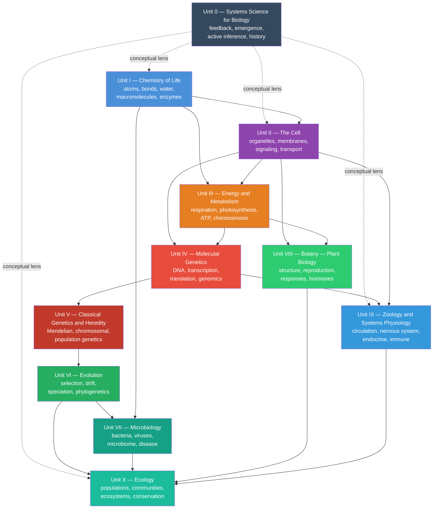

---
# Front matter metadata — read by biology_analysis.py and scripts/03_render_pdf.py
# This file is rendered before the Preface and all chapters.
front_matter: true
page_break_after: true
---

# Front Matter {.unnumbered}

## Dedication {.unnumbered}

*To the active minds who encounter biology not as a collection of facts,  
but as a living, computable, immersive, and mathematically rich discipline —  
and to those who show them the way.*

\newpage

---

## Acknowledgements {.unnumbered}

The author gratefully acknowledges many contributions, learnings, and sources of inspiration.

**Scientific foundations.** This textbook builds on foundational scholarship in molecular biology, biochemistry, physiology, ecology, and evolution—including the textbooks of Alberts et al. (*Molecular Biology of the Cell*), Campbell & Reece (*Biology*), Stryer (*Biochemistry*), Lehninger (*Principles of Biochemistry*), the primary literature cited throughout each chapter, and the open curriculum [OpenStax Biology 2e](https://openstax.org/details/books/biology-2e). We cite specific experimental results at point of use with full author credit and pause in gratitude to the researchers whose work makes this synthesis possible.

**Open science.** This textbook is open source and open access. The source code is licensed under the Apache-2.0 license, and the text is licensed under the Creative Commons Attribution 4.0 International license. Sources, figures, tests, and rendered outputs are maintained in the [biology textbook repository](https://github.com/docxology/biology_textbook). The work builds on, and contributes to, the open-science community whose code, data, lifeways, and scholarship have made this work freely available, computationally grounded, and broadly accessible.

**Open educational resources.** Open textbook adoption in U.S. and Canadian higher education has grown from roughly 1-in-400 classes in 2013 to about 1-in-80 by 2023, measured from syllabus-assigned titles rather than download counts \citep{opensyllabus2023oer}. At the University of Georgia, courses that switched to OpenStax materials---including introductory biology---showed improved grade distributions and lower D/F/W rates compared with prior commercial-textbook terms \citep{colvard2018oer}. This book treats [OpenStax Biology 2e](https://openstax.org/details/books/biology-2e) as conceptual inspiration and a public reference point, not as a derivative work.

**Biology education.** This textbook supports introductory through upper-division biology courses—survey, majors, pre-health, and computation-first reading paths—with active learning, companion labs, and question banks aligned to each chapter. Suggested reading paths in the navigation section below map units to common course designs.

**Research project template.** The build pipeline, testing infrastructure, and multi-project architecture are based on the author's [Research Project Template](https://github.com/docxology/template). The template provides version control, testing, documentation, and publication tooling used to build this textbook.

\newpage

---

## About This Textbook {.unnumbered}

### Computational Philosophy {.unnumbered}

This *Introduction to Biology: A Generative Approach* integrates biological narrative explanation and conceptual elaboration, with formalisms, models, computational connections, and empirical studies.
When a chapter introduces a model (enzyme kinetics, predator–prey dynamics, action
potentials), the corresponding computation is implemented in the accompanying Python
modules and used to generate figures where appropriate. Every aspect of this textbook is designed to help students move between mechanisms, measurements, and models: what a system does, how we know, and what a simple quantitative model can predict (and where it breaks).

### What Makes This Textbook Different {.unnumbered}

| Feature | This Textbook | Traditional Textbook |
| ------- | ---------------- | ----------------- |
| **Figures** | Generated from mathematical models; reproducible | Static graphics |
| **Equations** | Derived and numerically validated | Stated without derivation |
| **Code** | Python modules for every major model | Absent |
| **Diagrams** | Mermaid process diagrams; automatically rendered | Hand-drawn |
| **Opening vignettes** | Landmark experiment narrative opening each chapter | Absent |
| **Curriculum map** | Generated chapter/lab/question/standards alignment | Usually external |
| **Master glossary** | 225 terms with etymology and chapter cross-references | Chapter-end lists |
| **Instructor edition** | Question-bank model answers rendered as blockquotes (`export.include_solutions: true`) | Student edition hides solutions |
| **Open access** | CC BY 4.0; fully open source | Copyright restricted |
| **Citations** | Inline, with year and journal | Often chapter-end primarily |

### How to Navigate This Book {.unnumbered}

<!-- toc-navigation-start -->
The textbook is organized from systems-level orientation through molecular,
cellular, organismal, evolutionary, and ecological scales. The entries below
are generated from `manuscript/config.yaml` so navigation stays aligned with
the rendered table of contents.

- **\hyperref[sec:unit_0_unit_intro]{Unit 0 — Systems Science for Biology}:** \hyperref[sec:unit_0_systems_science]{Systems Science and Emergence}; \hyperref[sec:unit_0_complex_adaptive_systems]{Complex Adaptive Systems}; \hyperref[sec:unit_0_active_inference]{Active Inference and Free Energy}; \hyperref[sec:unit_0_history_philosophy_biology]{History and Philosophy of Biology}.
- **\hyperref[sec:unit_I_unit_intro]{Unit I — Chemistry of Life}:** \hyperref[sec:unit_I_atoms_molecules]{Atoms, Molecules, and Chemical Bonds}; \hyperref[sec:unit_I_water_and_life]{Water — The Molecule of Life}; \hyperref[sec:unit_I_macromolecules]{Biological Macromolecules}; \hyperref[sec:unit_I_enzymes_and_kinetics]{Enzymes and the Kinetics of Catalysis}.
- **\hyperref[sec:unit_II_unit_intro]{Unit II — The Cell}:** \hyperref[sec:unit_II_cell_theory]{Cell Theory and Cell Types}; \hyperref[sec:unit_II_cell_structure]{Cell Structure and Organelles}; \hyperref[sec:unit_II_membrane_transport]{Membrane Structure and Transport}; \hyperref[sec:unit_II_cell_signaling]{Cell Signaling and Communication}.
- **\hyperref[sec:unit_III_unit_intro]{Unit III — Energy and Metabolism}:** \hyperref[sec:unit_III_bioenergetics_and_respiration]{Bioenergetics and Cellular Respiration}; \hyperref[sec:unit_III_photosynthesis]{Photosynthesis}; \hyperref[sec:unit_III_metabolic_integration]{Metabolic Integration and Regulation}.
- **\hyperref[sec:unit_IV_unit_intro]{Unit IV — Molecular Genetics}:** \hyperref[sec:unit_IV_dna_replication_and_cell_cycle]{DNA Replication and the Cell Cycle}; \hyperref[sec:unit_IV_gene_expression]{Gene Expression}; \hyperref[sec:unit_IV_mutations_and_genomics]{Mutations, CRISPR, and Genomics}; \hyperref[sec:unit_IV_chromatin_and_epigenetic_mechanisms]{Chromatin and Epigenetic Mechanisms}; \hyperref[sec:unit_IV_epigenetic_inheritance_and_disease]{Epigenetic Inheritance and Disease}.
- **\hyperref[sec:unit_V_unit_intro]{Unit V — Classical Genetics and Heredity}:** \hyperref[sec:unit_V_mendelian_principles]{Mendelian Principles and Probability}; \hyperref[sec:unit_V_mendelian_extensions_and_human_genetics]{Mendelian Extensions and Human Genetics}; \hyperref[sec:unit_V_chromosomal_inheritance]{Chromosomal Inheritance and Linkage}; \hyperref[sec:unit_V_population_genetics]{Population Genetics}.
- **\hyperref[sec:unit_VI_unit_intro]{Unit VI — Evolution}:** \hyperref[sec:unit_VI_evolution_and_selection]{Natural Selection and Adaptation}; \hyperref[sec:unit_VI_genetic_drift_and_speciation]{Genetic Drift, Gene Flow, and Speciation}; \hyperref[sec:unit_VI_phylogenetics]{Phylogenetics and the Tree of Life}.
- **\hyperref[sec:unit_VII_unit_intro]{Unit VII — Microbiology}:** \hyperref[sec:unit_VII_bacteria_archaea_viruses]{Bacteria, Archaea, and Viruses}; \hyperref[sec:unit_VII_microbial_ecology]{Microbial Ecology and the Microbiome}; \hyperref[sec:unit_VII_host_immunity_and_vaccines]{Host Immunity and Vaccines}; \hyperref[sec:unit_VII_antimicrobial_resistance_and_epidemiology]{Antimicrobial Resistance and Epidemiology}.
- **\hyperref[sec:unit_VIII_unit_intro]{Unit VIII — Botany — Plant Biology}:** \hyperref[sec:unit_VIII_plant_structure_and_water]{Plant Structure and Water Relations}; \hyperref[sec:unit_VIII_plant_reproduction]{Plant Reproduction and Development}; \hyperref[sec:unit_VIII_plant_responses]{Plant Responses to the Environment}.
- **\hyperref[sec:unit_IX_unit_intro]{Unit IX — Zoology and Systems Physiology}:** \hyperref[sec:unit_IX_circulation_respiration_homeostasis]{Circulation and Respiration}; \hyperref[sec:unit_IX_nervous_system]{Nervous System and Neural Signaling}; \hyperref[sec:unit_IX_action_potential_synapses]{Action Potentials and Synaptic Transmission}; \hyperref[sec:unit_IX_endocrine_signaling]{Endocrine Signaling and Homeostasis}; \hyperref[sec:unit_IX_immune_system_defense]{Immune System Architecture}.
- **\hyperref[sec:unit_X_unit_intro]{Unit X — Ecology}:** \hyperref[sec:unit_X_population_ecology]{Population Ecology and Growth Models}; \hyperref[sec:unit_X_community_interactions]{Community Interactions and Succession}; \hyperref[sec:unit_X_biodiversity_and_food_webs]{Biodiversity and Food Webs}; \hyperref[sec:unit_X_ecosystem_ecology]{Ecosystem Ecology}; \hyperref[sec:unit_X_biomes_and_conservation]{Biomes and Conservation Biology}.
- **Laboratory activities:** one companion lab follows each chapter in the
same canonical order.
- **Question banks:** one 30-item question bank follows each chapter in the
same canonical order.
- **\hyperref[sec:appendix_curriculum_map]{Appendix A — Curriculum Map}:** reference material generated or ordered from the same manifest.
- **\hyperref[sec:appendix_instructor_orchestration]{Appendix B — Instructor Orchestration Guide}:** reference material generated or ordered from the same manifest.
- **\hyperref[sec:appendix_math_review]{Appendix C — Mathematical Review for Biology}:** reference material generated or ordered from the same manifest.
- **\hyperref[sec:appendix_units_and_constants]{Appendix D — Units, Physical Constants, and Biological Ranges}:** reference material generated or ordered from the same manifest.
- **\hyperref[sec:appendix_periodic_table]{Appendix E — A Periodic Table for Biology}:** reference material generated or ordered from the same manifest.
- **\hyperref[sec:glossary]{Appendix F — Master Glossary of Biological Terms}:** reference material generated or ordered from the same manifest.
- **\hyperref[sec:appendix_index]{Appendix G — Index of Key Terms}:** reference material generated or ordered from the same manifest.
- **Source modules:** `src/biology/<domain>/` contains the tested Python
implementations for the quantitative models used throughout the book.
<!-- toc-navigation-end -->

### Suggested reading paths {.unnumbered}

<!-- suggested-reading-paths-start -->
| Path | Emphasis | Notes |
| ---- | -------- | ----- |
| **AP / first-year survey** | \hyperref[sec:unit_I_unit_intro]{Unit I — Chemistry of Life: Introduction}; \hyperref[sec:unit_II_unit_intro]{Unit II — The Cell: Introduction}; \hyperref[sec:unit_III_unit_intro]{Unit III — Energy and Metabolism: Introduction}; selected genetics/evolution chapters; \hyperref[sec:unit_X_unit_intro]{Unit X — Ecology: Introduction} | Skim the systems orientation; prioritize metabolism and genetics core narratives. |
| **Pre-health / majors** | \hyperref[sec:unit_I_unit_intro]{Unit I — Chemistry of Life: Introduction} through \hyperref[sec:unit_IX_unit_intro]{Unit IX — Zoology and Systems Physiology: Introduction}; \hyperref[sec:unit_X_unit_intro]{Unit X — Ecology: Introduction}; systems orientation as setup | Add labs for quantitative skills; pair each physiology chapter with its Python bridge. |
| **Ecology / environmental focus** | \hyperref[sec:unit_I_unit_intro]{Unit I — Chemistry of Life: Introduction} and \hyperref[sec:unit_II_unit_intro]{Unit II — The Cell: Introduction} as review; \hyperref[sec:unit_III_photosynthesis]{Photosynthesis}; \hyperref[sec:unit_VI_unit_intro]{Unit VI — Evolution: Introduction}; \hyperref[sec:unit_VII_unit_intro]{Unit VII — Microbiology: Introduction}; \hyperref[sec:unit_X_unit_intro]{Unit X — Ecology: Introduction} | Emphasize population models, biogeochemistry, conservation metrics in `ecology.py`. |
| **Computation-first** | \hyperref[sec:unit_0_unit_intro]{Unit 0 — Systems Science for Biology: Introduction} plus any later unit | Read “Bridge to computation” blocks first, then narrative; run `scripts/generate_figures.py`. |
<!-- suggested-reading-paths-end -->

### Notation and conventions {.unnumbered}

- **Logarithms:** $\ln$ = natural log; $\log_{10}$ used where orders of magnitude matter (pH, viral titre, doubling time).
- **Concentrations:** square brackets $[X]$ denote molarity unless a chapter states otherwise.
- **Genetics:** italic gene symbols (*lacZ*); protein products often Roman with capital initial (LacZ) where conventional.
- **Units:** SI base units; physiology at 37 °C, pH 7.4, sea level unless noted.
- **Glossary and cross-link numbering** in the glossary and cross-links match the PDF table of contents (sequential numbering from `config.yaml`, including Unit 0 — Systems Science for Biology: Introduction when present).

### Scholarship and source practice {.unnumbered}

Biology changes because methods change: better microscopes, longer reads,
larger cohorts, improved models, and more inclusive sampling can most revise a
claim that once looked settled. When reading this book, treat every important
statement as part of a source chain:

| Source type | Best use | Question to ask |
| --- | --- | --- |
| Primary research article | Evidence for a specific method, dataset, result, or mechanism | What exactly was measured, and in which organism, cell type, population, or environment? |
| Review or textbook synthesis | Orientation across a field or controversy | Which primary findings does the synthesis depend on, and are any newer results likely to change it? |
| Public dataset or database | Reusable evidence for comparison, reanalysis, and reproducibility | How were samples selected, processed, filtered, and annotated? |
| Institutional report or guideline | Current public-health, clinical, biodiversity, or policy status | What date, jurisdiction, and decision context does the guidance assume? |
| Model or simulation | A testable simplification of a mechanism | Which assumptions, parameters, or boundary conditions would change the conclusion? |

For recent or numeric claims, prefer the source closest to the measurement and
write one sentence naming what would change your confidence. For example, a
claim about antimicrobial resistance should identify the organism-resistance
pair, surveillance population, and selection pressure; a claim about
biodiversity loss should separate population trends, extinction risk, land-use
drivers, and value judgments. This is why chapter answer keys ask for both a
core response and a scholarship check.

### Textbook Concept Map {.unnumbered}

<!-- textbook-concept-map-start -->
The instructional blocks form an interdependent architecture. The diagram
below shows primary dependency paths and integrative threads.

<!-- alt: Graph showing generated dependency map derived from manuscript/config.yaml: dashed links show the systems orientation as a conceptual lens, and solid arrows show dependencies through the canonical unit sequence. -->

*Generated dependency map derived from `manuscript/config.yaml`: dashed links show the systems orientation as a conceptual lens, and solid arrows show dependencies through the canonical unit sequence.*

<!-- textbook-concept-map-end -->

### Accessing source materials {.unnumbered}

| Resource | Location |
| -------- | -------- |
| **Living source (Git)** | [biology textbook source repository](https://github.com/docxology/biology_textbook) — manuscript Markdown, `src/biology/` modules, maintenance scripts, and tests |
| **Archival citation (DOI)** | [Zenodo archival DOI record](https://doi.org/10.5281/zenodo.20286478) — cite this record for a fixed edition snapshot |
| **Combined PDF / HTML** | Build from the repository with `uv run python scripts/03_render_pdf.py --project biology_textbook` (from the template root) or the project’s `biology_analysis.py` workflow |
| **Figures and diagrams** | `scripts/generate_figures.py` (matplotlib) and `scripts/generate_diagrams.py` (registered Mermaid); inline Mermaid in chapters renders during PDF preprocessing |
| **Corrections and extensions** | Open an issue or pull request on the book repository; substantive edits should keep chapter `\cref` labels and `config.yaml` ordering in sync |

Text is licensed **CC BY 4.0**; source code is **Apache-2.0** (see `manuscript/config.yaml` → `book`).

## Course Planning Grid {.unnumbered}

The table below provides a per-chapter difficulty rating (Level 1/3 to Level 3/3), an
estimated student reading time, and a suggested lecture allotment. Unit and chapter
cells list canonical titles from ``manuscript/config.yaml`` as clickable ``\hyperref`` links to each section. The grid is
auto-generated by ``scripts/insert_chapter_metadata.py`` from the
canonical table of contents in ``manuscript/config.yaml`` plus
``src/biology/chapter_metadata.py`` — edit those sources and re-run the
script to refresh this grid.

<!-- course-planning-grid-start -->
\begin{table}[htbp]
\centering
\footnotesize
\setlength{\tabcolsep}{2pt}
\renewcommand{\arraystretch}{1.12}
\begin{tabular}{>{\raggedright\arraybackslash}p{0.34\textwidth}>{\centering\arraybackslash}p{0.05\textwidth}>{\raggedright\arraybackslash}p{0.31\textwidth}>{\centering\arraybackslash}p{0.10\textwidth}>{\centering\arraybackslash}p{0.10\textwidth}>{\centering\arraybackslash}p{0.10\textwidth}}
\hline
\textbf{Unit} & \textbf{Number} & \textbf{Chapter} & \textbf{Difficulty} & \textbf{Reading} & \textbf{Lecture} \\
\hline
\hyperref[sec:unit_0_unit_intro]{Unit 0 — Systems Science for Biology: Introduction} & 0.1 & \hyperref[sec:unit_0_systems_science]{Systems Science and Emergence} & Level 2/3 & 35 min & 50 min \\
\hyperref[sec:unit_0_unit_intro]{Unit 0 — Systems Science for Biology: Introduction} & 0.2 & \hyperref[sec:unit_0_complex_adaptive_systems]{Complex Adaptive Systems} & Level 2/3 & 35 min & 50 min \\
\hyperref[sec:unit_0_unit_intro]{Unit 0 — Systems Science for Biology: Introduction} & 0.3 & \hyperref[sec:unit_0_active_inference]{Active Inference and Free Energy} & Level 3/3 & 45 min & 75 min \\
\hyperref[sec:unit_0_unit_intro]{Unit 0 — Systems Science for Biology: Introduction} & 0.4 & \hyperref[sec:unit_0_history_philosophy_biology]{History and Philosophy of Biology} & Level 2/3 & 80 min & 100 min \\
\hyperref[sec:unit_I_unit_intro]{Unit I — Chemistry of Life: Introduction} & 1 & \hyperref[sec:unit_I_atoms_molecules]{Atoms, Molecules, and Chemical Bonds} & Level 1/3 & 40 min & 50 min \\
\hyperref[sec:unit_I_unit_intro]{Unit I — Chemistry of Life: Introduction} & 2 & \hyperref[sec:unit_I_water_and_life]{Water — The Molecule of Life} & Level 1/3 & 40 min & 50 min \\
\hyperref[sec:unit_I_unit_intro]{Unit I — Chemistry of Life: Introduction} & 3 & \hyperref[sec:unit_I_macromolecules]{Biological Macromolecules} & Level 2/3 & 55 min & 75 min \\
\hyperref[sec:unit_I_unit_intro]{Unit I — Chemistry of Life: Introduction} & 4 & \hyperref[sec:unit_I_enzymes_and_kinetics]{Enzymes and the Kinetics of Catalysis} & Level 3/3 & 60 min & 75 min \\
\hyperref[sec:unit_II_unit_intro]{Unit II — The Cell: Introduction} & 5 & \hyperref[sec:unit_II_cell_theory]{Cell Theory and Cell Types} & Level 1/3 & 45 min & 50 min \\
\hyperref[sec:unit_II_unit_intro]{Unit II — The Cell: Introduction} & 6 & \hyperref[sec:unit_II_cell_structure]{Cell Structure and Organelles} & Level 2/3 & 50 min & 75 min \\
\hyperref[sec:unit_II_unit_intro]{Unit II — The Cell: Introduction} & 7 & \hyperref[sec:unit_II_membrane_transport]{Membrane Structure and Transport} & Level 2/3 & 50 min & 75 min \\
\hyperref[sec:unit_II_unit_intro]{Unit II — The Cell: Introduction} & 8 & \hyperref[sec:unit_II_cell_signaling]{Cell Signaling and Communication} & Level 3/3 & 55 min & 75 min \\
\hyperref[sec:unit_III_unit_intro]{Unit III — Energy and Metabolism: Introduction} & 9 & \hyperref[sec:unit_III_bioenergetics_and_respiration]{Bioenergetics and Cellular Respiration} & Level 3/3 & 60 min & 100 min \\
\hyperref[sec:unit_III_unit_intro]{Unit III — Energy and Metabolism: Introduction} & 10 & \hyperref[sec:unit_III_photosynthesis]{Photosynthesis} & Level 2/3 & 55 min & 75 min \\
\hyperref[sec:unit_III_unit_intro]{Unit III — Energy and Metabolism: Introduction} & 11 & \hyperref[sec:unit_III_metabolic_integration]{Metabolic Integration and Regulation} & Level 3/3 & 60 min & 100 min \\
\hyperref[sec:unit_IV_unit_intro]{Unit IV — Molecular Genetics: Introduction} & 12 & \hyperref[sec:unit_IV_dna_replication_and_cell_cycle]{DNA Replication and the Cell Cycle} & Level 2/3 & 55 min & 75 min \\
\hyperref[sec:unit_IV_unit_intro]{Unit IV — Molecular Genetics: Introduction} & 13 & \hyperref[sec:unit_IV_gene_expression]{Gene Expression} & Level 2/3 & 60 min & 100 min \\
\hyperref[sec:unit_IV_unit_intro]{Unit IV — Molecular Genetics: Introduction} & 14 & \hyperref[sec:unit_IV_mutations_and_genomics]{Mutations, CRISPR, and Genomics} & Level 2/3 & 55 min & 75 min \\
\hyperref[sec:unit_IV_unit_intro]{Unit IV — Molecular Genetics: Introduction} & 15 & \hyperref[sec:unit_IV_chromatin_and_epigenetic_mechanisms]{Chromatin and Epigenetic Mechanisms} & Level 3/3 & 28 min & 40 min \\
\hyperref[sec:unit_IV_unit_intro]{Unit IV — Molecular Genetics: Introduction} & 16 & \hyperref[sec:unit_IV_epigenetic_inheritance_and_disease]{Epigenetic Inheritance and Disease} & Level 3/3 & 28 min & 40 min \\
\hyperref[sec:unit_V_unit_intro]{Unit V — Classical Genetics and Heredity: Introduction} & 17 & \hyperref[sec:unit_V_mendelian_principles]{Mendelian Principles and Probability} & Level 2/3 & 35 min & 55 min \\
\hyperref[sec:unit_V_unit_intro]{Unit V — Classical Genetics and Heredity: Introduction} & 18 & \hyperref[sec:unit_V_mendelian_extensions_and_human_genetics]{Mendelian Extensions and Human Genetics} & Level 2/3 & 35 min & 55 min \\
\hyperref[sec:unit_V_unit_intro]{Unit V — Classical Genetics and Heredity: Introduction} & 19 & \hyperref[sec:unit_V_chromosomal_inheritance]{Chromosomal Inheritance and Linkage} & Level 2/3 & 60 min & 75 min \\
\hyperref[sec:unit_V_unit_intro]{Unit V — Classical Genetics and Heredity: Introduction} & 20 & \hyperref[sec:unit_V_population_genetics]{Population Genetics} & Level 3/3 & 75 min & 100 min \\
\hyperref[sec:unit_VI_unit_intro]{Unit VI — Evolution: Introduction} & 21 & \hyperref[sec:unit_VI_evolution_and_selection]{Natural Selection and Adaptation} & Level 2/3 & 60 min & 75 min \\
\hyperref[sec:unit_VI_unit_intro]{Unit VI — Evolution: Introduction} & 22 & \hyperref[sec:unit_VI_genetic_drift_and_speciation]{Genetic Drift, Gene Flow, and Speciation} & Level 3/3 & 60 min & 75 min \\
\hyperref[sec:unit_VI_unit_intro]{Unit VI — Evolution: Introduction} & 23 & \hyperref[sec:unit_VI_phylogenetics]{Phylogenetics and the Tree of Life} & Level 3/3 & 60 min & 100 min \\
\hyperref[sec:unit_VII_unit_intro]{Unit VII — Microbiology: Introduction} & 24 & \hyperref[sec:unit_VII_bacteria_archaea_viruses]{Bacteria, Archaea, and Viruses} & Level 2/3 & 65 min & 75 min \\
\hyperref[sec:unit_VII_unit_intro]{Unit VII — Microbiology: Introduction} & 25 & \hyperref[sec:unit_VII_microbial_ecology]{Microbial Ecology and the Microbiome} & Level 2/3 & 60 min & 75 min \\
\hyperref[sec:unit_VII_unit_intro]{Unit VII — Microbiology: Introduction} & 26 & \hyperref[sec:unit_VII_host_immunity_and_vaccines]{Host Immunity and Vaccines} & Level 2/3 & 30 min & 40 min \\
\hyperref[sec:unit_VII_unit_intro]{Unit VII — Microbiology: Introduction} & 27 & \hyperref[sec:unit_VII_antimicrobial_resistance_and_epidemiology]{Antimicrobial Resistance and Epidemiology} & Level 2/3 & 35 min & 45 min \\
\hyperref[sec:unit_VIII_unit_intro]{Unit VIII — Botany — Plant Biology: Introduction} & 28 & \hyperref[sec:unit_VIII_plant_structure_and_water]{Plant Structure and Water Relations} & Level 2/3 & 55 min & 75 min \\
\hyperref[sec:unit_VIII_unit_intro]{Unit VIII — Botany — Plant Biology: Introduction} & 29 & \hyperref[sec:unit_VIII_plant_reproduction]{Plant Reproduction and Development} & Level 2/3 & 55 min & 75 min \\
\hyperref[sec:unit_VIII_unit_intro]{Unit VIII — Botany — Plant Biology: Introduction} & 30 & \hyperref[sec:unit_VIII_plant_responses]{Plant Responses to the Environment} & Level 2/3 & 55 min & 75 min \\
\hyperref[sec:unit_IX_unit_intro]{Unit IX — Zoology and Systems Physiology: Introduction} & 31 & \hyperref[sec:unit_IX_circulation_respiration_homeostasis]{Circulation and Respiration} & Level 3/3 & 60 min & 100 min \\
\hyperref[sec:unit_IX_unit_intro]{Unit IX — Zoology and Systems Physiology: Introduction} & 32 & \hyperref[sec:unit_IX_nervous_system]{Nervous System and Neural Signaling} & Level 3/3 & 55 min & 75 min \\
\hyperref[sec:unit_IX_unit_intro]{Unit IX — Zoology and Systems Physiology: Introduction} & 33 & \hyperref[sec:unit_IX_action_potential_synapses]{Action Potentials and Synaptic Transmission} & Level 3/3 & 55 min & 100 min \\
\hyperref[sec:unit_IX_unit_intro]{Unit IX — Zoology and Systems Physiology: Introduction} & 34 & \hyperref[sec:unit_IX_endocrine_signaling]{Endocrine Signaling and Homeostasis} & Level 2/3 & 30 min & 40 min \\
\hyperref[sec:unit_IX_unit_intro]{Unit IX — Zoology and Systems Physiology: Introduction} & 35 & \hyperref[sec:unit_IX_immune_system_defense]{Immune System Architecture} & Level 2/3 & 30 min & 40 min \\
\hyperref[sec:unit_X_unit_intro]{Unit X — Ecology: Introduction} & 36 & \hyperref[sec:unit_X_population_ecology]{Population Ecology and Growth Models} & Level 3/3 & 75 min & 100 min \\
\hyperref[sec:unit_X_unit_intro]{Unit X — Ecology: Introduction} & 37 & \hyperref[sec:unit_X_community_interactions]{Community Interactions and Succession} & Level 2/3 & 45 min & 55 min \\
\hyperref[sec:unit_X_unit_intro]{Unit X — Ecology: Introduction} & 38 & \hyperref[sec:unit_X_biodiversity_and_food_webs]{Biodiversity and Food Webs} & Level 2/3 & 40 min & 50 min \\
\hyperref[sec:unit_X_unit_intro]{Unit X — Ecology: Introduction} & 39 & \hyperref[sec:unit_X_ecosystem_ecology]{Ecosystem Ecology} & Level 2/3 & 65 min & 75 min \\
\hyperref[sec:unit_X_unit_intro]{Unit X — Ecology: Introduction} & 40 & \hyperref[sec:unit_X_biomes_and_conservation]{Biomes and Conservation Biology} & Level 2/3 & 70 min & 75 min \\
\hline
 & & \textbf{Totals} & & \textbf{2256 min (37 h)} & \textbf{3110 min (51 h)} \\
\hline
\end{tabular}
\end{table}
<!-- course-planning-grid-end -->

\newpage
\newpage
