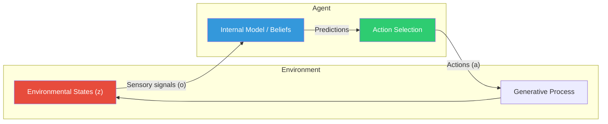
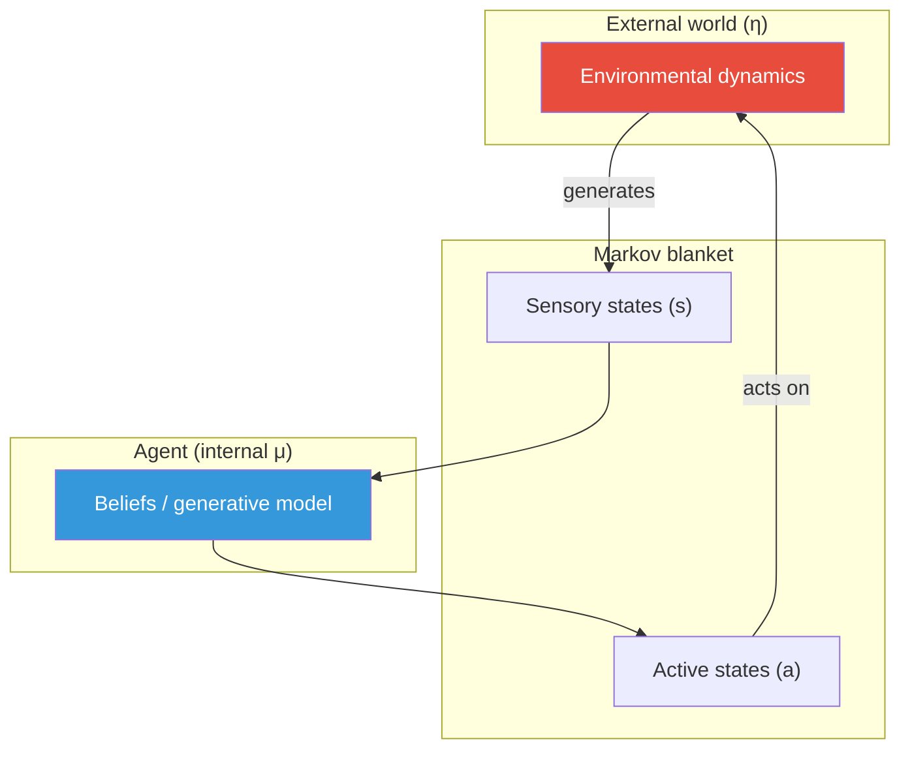
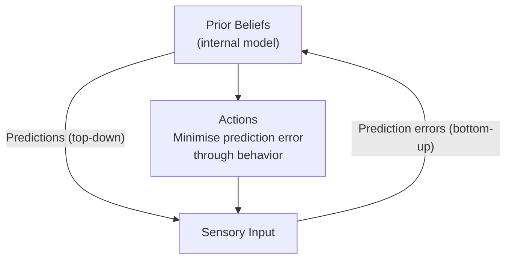
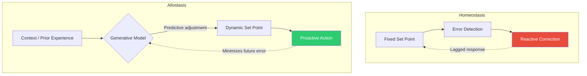

# Active Inference and the Free Energy Principle

\label{sec:unit_0_active_inference}

<!-- chapter-metadata-badge -->
> Level 3/3 · 45 min read · 75 min lecture · Prerequisites: \cref{sec:unit_0_systems_science}, \cref{sec:unit_0_complex_adaptive_systems}

---

## Learning Objectives

By the end of this chapter, students will be able to:

1. Explain what the free energy principle \citep{friston2010} states and why it is relevant to biology.
2. Describe the Bayesian brain hypothesis and how prediction-error minimization drives perception.
3. Distinguish between perceptual inference (changing beliefs to match sensory input) and active inference \citep{friston2017} (acting to fulfil predictions).
4. Connect active inference to [**homeostasis**](#gl:homeostasis), allostasis \citep{sterling2015}, and interoception.
5. Define a Markov blanket and identify its four state-classes (internal, external, sensory, active) in a biological system.
6. Apply expected free energy to explain how an organism balances goal-directed reward and information-gathering.
7. Describe canonical predictive-processing microcircuits in the cortex and how they implement hierarchical inference.
8. Identify connections between active inference and other frameworks in the textbook (metabolism, neural signaling, evolution, immunology, computational psychiatry).

<!-- curriculum-scaffold-start -->
### Study Blueprint

- **Big idea:** Living systems reduce uncertainty by acting on the world as well as by updating internal models.
- **Core concepts:** prediction error, Bayesian updating, policy selection, homeostasis.
- **Framework alignment:** Vision & Change: Systems, Structure and function; AP Biology: Systems Interactions; NGSS-style topics: Structure and Function, Interdependent Relationships in Ecosystems.
- **Model or quantitative lens:** Bayesian belief updating and expected-free-energy-style policy comparison.
- **Data skill:** Read a small probability table and update a prediction after new evidence.
- **Practice cadence:** Questions and Methods, Representing and Describing Data, Argumentation.
- **Common misconception to repair:** Active inference is not passive prediction; action changes the sensory data that arrive next.
- **Primary lab:** \nameref{sec:lab_unit_0_active_inference}.
- **Question bank:** \nameref{sec:q_unit_0_active_inference}.
- **Transfer task:** Map prediction-error reasoning onto chemotaxis, thermoregulation, and attention.
- **Bridge to computation:** `biology.physiology.physiology.homeostasis_response`.
<!-- curriculum-scaffold-end -->

---

## Opening Vignette: Helmholtz and the Unconscious Inference

In 1867, Hermann von Helmholtz proposed that perception is not passive recording but **unconscious inference**: the brain interprets noisy sensory signals by combining them with prior knowledge about the world. When you perceive a flat photograph as three-dimensional, your brain is making an inference — filling in depth from shadow, texture, and perspective cues that it has learned through a lifetime of experience.

For over a century, Helmholtz's insight remained a philosophical curiosity. Then, in the early 2000s, neuroscientist Karl Friston formulated the **free energy principle (FEP)** — a mathematical framework that makes Helmholtz's intuition precise. The FEP proposes that many living systems, from single cells to entire organisms, can be modeled as systems that minimize **variational free energy**: a tractable upper bound on the surprise (negative log-probability) of their sensory observations \citep{friston2010}. The bacterium swimming up a glucose gradient and the neuroscientist modeling the brain can, under this framework, be described with the same inferential vocabulary — inference under uncertainty.

The free energy principle does not merely explain perception. By extending inference to *action* — organisms act to make their predictions come true — it offers a broad account of sensation, movement, homeostasis, development, and evolutionary modeling \citep{friston2017,parr2022activeinference}. This chapter introduces the framework as an **optional graduate-depth systems lens** and shows how it connects to major themes in this textbook while remaining one model among competing biological explanations.

---

## Maintaining Viable States Under Uncertainty

Most living organisms face a fundamental challenge: they must maintain their internal organization in the face of a ceaselessly changing and uncertain environment. To survive, an organism must:

- **Model** its environment — build and update an internal representation of what is out there.
- **Sense** — gather information that reduces uncertainty about environmental states.
- **Act** — change the environment or its own internal state to remain within viable bounds.

This three-part loop — *model → sense → act* — is the core of what the **free energy principle (FEP)** formalises.

<!-- alt: Graph showing agent–environment loop under active inference. -->

*Agent–environment loop under active inference.*

---

## Markov Blankets: The Mathematical Skin of an Agent

Before formalising free energy, we need a way to make rigorous the boundary between an agent and its environment. The **Markov blanket** provides exactly this.

### Markov Blanket Definition

For a set of random variables, the Markov blanket of a node is the minimal set of nodes that, once conditioned on, render the node statistically independent of every other variable in the network. For an agent that persists in time, this generalizes to a partition of states into four disjoint classes:

- **External states** η — the world outside the agent.
- **Sensory states** $s$ — variables through which the world influences the agent (photoreceptor activations, mechanoreceptor strain, chemosensor occupancy).
- **Active states** $a$ — variables through which the agent influences the world (motor neuron output, secretory activity, ciliary beating).
- **Internal states** μ — everything inside the agent (gene expression, membrane potentials, synaptic weights).

The blanket itself is the union $b = s \cup a$. The defining property is that internal states are conditionally independent of external states given the blanket:

\begin{equation}
P(\mu, \eta \mid s, a) = P(\mu \mid s, a)\,P(\eta \mid s, a)
\label{eq:unit_0_markov_blanket}
\end{equation}

The internal states "see" the world primarily through $s$ and "touch" it primarily through $a$.

### Why Markov Blankets Matter

Markov blankets give a principled definition of an agent: anything that maintains a recognisable boundary in state space *has* a Markov blanket, almost by definition. The same partition applies to a bacterium (cell membrane), a neuron (axonal/dendritic membrane), an organism (skin and sensorimotor apparatus), and a colony (collective foraging interface). Because the partition is recursive — the blanket of a blanket is a blanket — it naturally accommodates hierarchical biological organization. Here a *generative model* is the organism's internal probabilistic model that predicts its sensory inputs from hypothesized hidden causes in the environment.

<!-- alt: Graph showing markov-blanket partition: internal states couple to external states primarily through sensory and active states. -->

*Markov-blanket partition: internal states couple to external states primarily through sensory and active states.*

> **Concept Check 1:** Identify sensory states, active states, internal states, and external states for (a) an *E. coli* cell performing chemotaxis, (b) a single hepatocyte, and (c) a foraging honeybee. Which states would be hardest to assign in each case, and why?

---

## The Free Energy Principle

The free energy principle, developed principally by Karl Friston (UCL), proposes that many living systems can be modeled as systems that **minimize variational free energy** under explicit assumptions about the agent, its boundary, its observations, and its generative model.

Formally, variational free energy $F$ provides an upper bound on **surprisal** (the log-probability of sensory observations under a model):

\begin{equation}
F = \underbrace{D_{KL}\bigl[ Q(\mathbf{z}) \,\|\, P(\mathbf{z} \mid \mathbf{o}) \bigr]}_{\text{complexity (posterior mismatch)}} - \underbrace{\ln P(\mathbf{o})}_{\text{surprise (negative log-evidence)}}
\label{eq:unit_0_free_energy}
\end{equation}

where:

- $Q(\mathbf{z})$ is the agent's approximate posterior belief over hidden causes $\mathbf{z}$.
- $P(\mathbf{z}|\mathbf{o})$ is the true posterior.
- $D_{KL}$ is the Kullback–Leibler divergence.
- $P(\mathbf{o})$ is the probability of observations $\mathbf{o}$ under the generative model.

Because the true posterior is generally intractable, agents minimize $F$ as a proxy for maximizing their **evidence** (model fit to sensory data).

Equivalently, free energy decomposes as:

\begin{equation}
F = \underbrace{\mathbb{E}_{Q}\bigl[ \ln Q(\mathbf{z}) - \ln P(\mathbf{z}) \bigr]}_{\text{complexity (prior mismatch)}} - \underbrace{\mathbb{E}_{Q}\bigl[ \ln P(\mathbf{o} \mid \mathbf{z}) \bigr]}_{\text{expected log-likelihood (accuracy)}}
\label{eq:unit_0_free_energy_decomp}
\end{equation}

The first term penalises beliefs that deviate from priors; the second rewards beliefs that predict observations well. Minimizing $F$ balances prior expectations against sensory evidence — exactly the logic of Bayesian inference.

> **Concept Check 2:** An organism's ecological [**niche**](#gl:niche) can be described as the set of states its generative model treats as probable. Why does a penguin housed in a tropical aquarium experience persistent free energy, even when fed and safe? Describe two distinct strategies the penguin might use to minimize it and explain why behavioral change (return to cold water) is usually faster than belief update.

---

## Predictive Processing and the Bayesian Brain Hypothesis

The **Bayesian brain hypothesis** (Helmholtz 1867; Friston 2005; Clark 2013) proposes that the brain is fundamentally a **prediction machine**: it maintains a hierarchical generative model of the world and continuously uses that model to predict incoming sensory signals.

### Hierarchical Predictive Coding

In the predictive processing framework, the brain generates **top-down predictions** from higher cortical areas toward lower sensory areas. Lower areas compute the **prediction error** — the difference between what was predicted and what was received:

\begin{equation}
\varepsilon = \mathbf{o} - \hat{\mathbf{o}}
\label{eq:unit_0_prediction_error}
\end{equation}

Prediction errors propagate upward, driving updates to the generative model. When predictions are accurate, prediction errors approach zero and neural activity is minimized — an energetically efficient coding strategy.

### The Canonical Microcircuit

Anatomical and physiological evidence suggests the cortex implements predictive coding through a **canonical microcircuit** repeated across cortical areas. The simplified picture:

- **Superficial pyramidal neurons** (layers II/III) send forward signals that empirically encode prediction errors, projecting to higher cortical areas.
- **Deep pyramidal neurons** (layers V/VI) send backward signals that empirically encode predictions, projecting to lower areas.
- **Inhibitory interneurons** modulate the *gain* of error units, implementing the precision weighting described in the earlier predictive-processing discussion.

In the laminar reading of predictive coding, each cortical area is a small inference engine: it receives ascending prediction errors from below, compares them with descending predictions from above, and outputs both an updated internal state (forward) and a refined prediction (backward). The same architecture helps interpret visual cortical hierarchies (V1→V2→V4→IT), auditory streams, and somatosensory pathways, suggesting predictive coding is a broad candidate principle for cortical computation rather than a settled one-size-fits-most algorithm.

### Precision and Attention

Each prediction error can be weighted by **precision** (inverse variance): high precision means "trust this channel." Mathematically, a precision-weighted prediction error is

\begin{equation}
\xi = \pi \cdot (\mathbf{o} - \hat{\mathbf{o}})
\label{eq:unit_0_precision}
\end{equation}

where $\pi = 1/\sigma^2$ is the precision. **Attention** — from spatial orienting to feature selection — can be read as **optimizing precision** over sensory hierarchies: amplify unexpected but reliable signals, attenuate predictable ones. **Sensory attenuation** during self-generated movement (you tickle yourself less than others tickle you) follows because the motor command predicts somatic input, down-weighting proprioceptive precision so the tickle does not register as surprising. Disorders that mis-estimate precision (autism-spectrum hypotheses; schizophrenia-spectrum **aberrant salience**) reinterpret noise as meaningful structure or vice versa, producing false inference at the perceptual or interoceptive level.

### Worked Example: Bayesian Updating and Prediction Error

**Problem:**
A foraging bird maintains a prior belief about the spatial location $x$ of a food source, modeled as a Gaussian distribution with mean $\mu_{prior} = 10 \text{ m}$ and variance $\sigma^2_{prior} = 4$. The bird receives a noisy sensory observation indicating food at $o = 16 \text{ m}$, with a sensory variance $\sigma^2_{obs} = 12$. Calculate the prediction error and the new updated (posterior) belief about the food's location.

**Solution:**

1. **Calculate the prediction error:**

   The generative model's prediction is the mean of the prior ($\hat{o} = 10$).
   $$ \varepsilon = o - \hat{o} = 16 - 10 = 6 \text{ m}  \label{eq:unit_0_active_inference_item_1}$$

2. **Calculate the optimal updating weight (Kalman gain):**

   In Bayesian inference with Gaussians, the weight given to the sensory evidence depends on the relative precision (inverse variance) of the prior vs the observation.
   $$ K = \frac{\sigma^2_{prior}}{\sigma^2_{prior} + \sigma^2_{obs}} = \frac{4}{4 + 12} = \frac{4}{16} = 0.25  \label{eq:unit_0_active_inference_item_2}$$

3. **Calculate the posterior mean:**

   The new belief ($\mu_{post}$) is the old belief plus the prediction error scaled by the optimal weight:
   $$ \mu_{post} = \mu_{prior} + K \cdot \varepsilon  \label{eq:unit_0_active_inference_item_3}$$

   $$ \mu_{post} = 10 + 0.25 \cdot 6 = 10 + 1.5 = 11.5 \text{ m}  \label{eq:unit_0_active_inference_item_4}$$

Due to the high uncertainty of the sensory observation compared to the prior ($\sigma^2_{obs} = 12$ vs $\sigma^2_{prior} = 4$), the bird primarily slightly adjusts its internal model (moving beliefs from 10 to 11.5) despite a large prediction error of 6. This formalises how sensory evidence shifts the generative model under the Free Energy Principle.

<!-- alt: Graph showing predictive processing: top-down predictions, bottom-up errors, and action. -->

*Predictive processing: top-down predictions, bottom-up errors, and action.*

> **Concept Check 3:** Repeat the worked example with $\sigma^2_{prior} = 12$ and $\sigma^2_{obs} = 4$ (i.e. a vague prior and a precise observation). Compute the new Kalman gain and the posterior mean for the same prior mean (10) and observation (16). What does the comparison reveal about how priors and likelihoods compete?

---

## Active Inference as a Perception-Action Loop

**Active inference** extends predictive coding from perception to **action**. An organism can reduce prediction error in two ways:

1. **Perceptual inference** — update internal beliefs to match incoming sensory data (classic Bayesian inference).
2. **Active inference** — act on the world to make sensory data match the predictions generated by the generative model.

Under the FEP, behavior is the fulfilment of prior expectations. An organism with a prior that its body temperature will remain at 37 °C will *act* to make that prediction true when it is falsified by cold exposure (seek warmth, shiver, vasoconstrict).

This reframes homeostasis: not as the passive correction of deviations, but as the **active fulfilment of generative model predictions about body state**.

### Homeostasis vs. Allostasis

: Homeostasis vs. Allostasis. {#tbl:unit_0_active_inference_homeostasis_vs_allostasis}
| Concept | Core idea | Active inference framing |
| ------- | --------- | ------------------------ |
| **Homeostasis** | Maintain a fixed set point | Precise prior over a target internal state |
| **Allostasis** | Proactively adjust the set point in anticipation of need | Updating prior expectations based on context |

Allostasis — popularised by \citet{sterling1988} — is naturally captured by active inference: the generative model changes its predictions (set points) before the perturbation arrives, explaining why the heart rate rises before exercise begins.

<!-- alt: Graph showing reactive homeostasis versus predictive allostasis. -->

*Reactive homeostasis versus predictive allostasis.*

### Worked Example — Free Energy Minimization via Action

Consider an organism whose generative model encodes a prior on body temperature $T$:

\begin{equation}
P(T) = \mathcal{N}(37, 0.5^2) \qquad \text{(prior: body temperature should be 37 °C, tight precision)}
\label{eq:unit_0_temp_prior}
\end{equation}

Its interoceptive sensor is noisy, $P(o \mid T) = \mathcal{N}(T, 1.0^2)$. Suppose the sensor reports $o = 34$ °C (cold). The posterior belief about $T$ is a Gaussian with mean:

\begin{equation}
\mu_{\mathrm{post}} = \frac{\sigma^2_o \cdot 37 + \sigma^2_{\mathrm{prior}} \cdot 34}{\sigma^2_o + \sigma^2_{\mathrm{prior}}}
= \frac{1.0 \cdot 37 + 0.25 \cdot 34}{1.0 + 0.25}
= 36.4 \; \mathrm{°C}
\label{eq:unit_0_temp_posterior}
\end{equation}

The variational free energy associated with this observation is approximately $F_{\mathrm{before}} \approx 4.5$ nats (dominated by the log-likelihood of $o = 34$ under the prior). The agent has two ways to reduce it:

1. **Perceptual inference (passive)** — accept $\mu_{\mathrm{post}} = 36.4$ °C as its new belief. $F$ drops to ~2.1 nats.
2. **Active inference** — act to change the world so that future $o$ matches the 37 °C prior. Shiver, vasoconstrict, seek warmth. After one minute of shivering the sensor reads 36.5 °C; after five minutes, 37.0 °C. $F$ approaches 0.

**Key insight:** acting reduces free energy *more completely* than updating beliefs, because the prior is tight — the organism would rather change the world than its expectations. This is the formal expression of what Helmholtz intuited in 1867 and what the FEP quantifies today: *organisms do not merely represent the world; they re-shape it to match their models.*

> **Applied Systems / Clinical Connection — dyspnoea as prediction error.**
> Shortness of breath is not a raw oxygen sensor. It is an inferred body state built from chemoreceptor input, lung stretch, motor command, prior experience, and context. A patient with asthma, panic, or deconditioning can therefore experience similar dyspnoea through different precision settings: airway resistance may be high, interoceptive prediction error may be overweighted, or motor effort may be predicted poorly. Active inference does not replace spirometry or blood gases; it explains why objective physiology and subjective distress can diverge and why treatment may need both bronchodilation and recalibration of threat priors \citep{friston2010,friston2017}.

### Expected Free Energy and Policy Selection

Selecting an action requires not only minimizing current free energy but also predicting the consequences of future actions. **Expected free energy** $G$ for a policy π (sequence of actions) is

\begin{equation}
G(\pi) = \underbrace{\mathbb{E}_{Q(o, z \mid \pi)}\!\bigl[\ln Q(z \mid \pi) - \ln Q(z \mid o, \pi)\bigr]}_{\text{epistemic value}} - \underbrace{\mathbb{E}_{Q(o \mid \pi)}\!\bigl[\ln P(o \mid C)\bigr]}_{\text{instrumental value}}
\label{eq:unit_0_expected_free_energy}
\end{equation}

where $C$ encodes the agent's preferences (which observations are valuable). The two terms decompose action selection into:

- **Epistemic (information) value** — the expected reduction in uncertainty about latent causes; high for exploratory or "curious" policies.
- **Instrumental (pragmatic) value** — the expected log-probability of preferred outcomes; high for goal-directed policies.

Policies are selected with probability $Q(\pi) \propto e^{-G(\pi)}$: the agent prefers policies with low expected free energy. Crucially, when no information remains to be gained, the agent reduces to a reward-maximiser; when no extrinsic reward differs across policies, the agent reduces to a pure information-seeker (curiosity). This single equation thereby unifies reinforcement learning, optimal experimental design, and exploration–exploitation trade-offs that previously occupied separate literatures.

> **Concept Check 4:** A rat in a novel maze runs in apparently random directions even when food is reliably available in one corner. Decompose this behavior into epistemic and instrumental value. What would change if the rat had explored the maze for an hour first?

> **Concept Check (Synthesis):** During the COVID-19 pandemic, behavioral scientists documented "prediction-error fatigue" --- people initially updated their beliefs rapidly about transmission risk, then stopped updating despite continued novel evidence. Using the active inference framework: (a) Model this as a precision-weighting problem --- what happened to the precision assigned to new COVID-related observations over time? (b) How does this relate to the distinction between expected free energy's epistemic and instrumental components? (c) Propose a public-health intervention that would restore appropriate precision weighting without exploiting anxiety.

### Epistemic vs. Instrumental Value (worked numerical example)

Suppose an agent considers two policies, $\pi_A$ and $\pi_B$, with epistemic values 1.0 and 3.0 nats and instrumental values 4.0 and 2.5 nats respectively. Then

$$G(\pi_A) = -(1.0 + 4.0) = -5.0, \qquad G(\pi_B) = -(3.0 + 2.5) = -5.5 \label{eq:unit_0_active_inference_item_5}$$

Both are roughly comparable, but $\pi_B$ has slightly lower expected free energy because its higher information gain compensates for somewhat lower expected reward. Under softmax selection $Q(\pi_B)/Q(\pi_A) = e^{0.5} \approx 1.65$ — the agent is about 1.65× more likely to choose the more informative policy. Reducing temperature (sharpening the softmax) makes the choice nearly deterministic; raising temperature flattens it. This single mechanism can reproduce explore-exploit phenomena across species and contexts.

---

## Embodied Active Inference

Active inference is inherently **embodied** and **enactive** — it requires a body that can act. The agent's generative model must represent:

- **Exteroceptive states** — sensory information about the external environment.
- **Interoceptive states** — sensory information about the internal body (viscera, blood chemistry, proprioception).
- **Action affordances** — possible actions the agent can take, and their predicted sensory consequences.

The body is not merely the carrier of the brain; the brain's generative model is shaped by bodily form, evolutionary history, and developmental experience. This **4E cognition** framework — embodied, embedded, enacted, extended — is directly implied by active inference.

> **Concept Check 5:** A patient with a pacemaker experiences "phantom palpitations" — strong sensations of irregular heart rhythm that the device rhythm itself rarely produces. Within the active-inference framework, why might long-standing tight priors about heart rhythm *create* a prediction error when the rhythm is in fact perfectly regular? What strategies — pharmacological, cognitive, or behavioral — would widen those priors?

---

## Active Inference and Evolution

The free energy principle provides a formal bridge between individual-level adaptive behavior and evolutionary dynamics:

- [**Natural selection**](#gl:natural-selection) filters for organisms whose generative models minimize free energy (are accurate predictors of their ecological niche).
- The **ecological niche** is itself the set of environmental states that the organism's generative model implicitly expects.
- **Niche construction** — organisms actively shape their environments to match their generative models — is a direct prediction of active inference applied to evolutionary time scales.

The evolutionary emergence of increasingly sophisticated generative models (from chemotaxis in bacteria to abstract planning in primates) can be framed as the phylogenetic history of free energy minimization.

### Free Energy Minimization Beyond Brains

The FEP was developed in neuroscience but is not limited to it. Recent work extends active inference to:

- **Single cells.** A bacterium running E. coli chemotaxis can be cast as an active-inference agent whose generative model encodes a prior over "high glucose," whose sensors read receptor occupancy, and whose actions are tumble probability and run length. Berg-and-Purcell information bounds reappear as bounds on free energy minimization.
- **Immune system.** B-cell affinity maturation can be read as Bayesian inference over antigen "causes," with somatic hypermutation as a proposal distribution and selection as a posterior update. Memory cells embody high-precision priors against re-infection.
- **Development.** Morphogen gradients pattern tissues by reducing free energy of cell-fate "predictions"; experimentally induced perturbations are absorbed when the developmental model can re-infer position from remaining cues.
- **Evolution.** Natural selection itself can be framed as gradient descent on a long-timescale free energy functional, with the species' generative model encoded in its genome and the niche acting as the sensory environment. This is the most ambitious and the most contested of the FEP's extensions.

The unifying claim is that **many systems that resist dispersion — systems modeled as maintaining a Markov blanket against thermodynamic noise — *behave as if* they minimize free energy**. The "as-if" is important: the FEP is a candidate modeling description of self-organizing systems at selected timescales, not a claim that any particular molecule "computes" free energy or that Markov blankets automatically settle biological individuality.

---

## Computational Psychiatry and Precision-Weighting Disorders

If the brain is a prediction machine, many psychiatric conditions admit a generative-model interpretation. The framework is provisional but increasingly testable.

### Anxiety and Interoceptive Hyper-precision

If priors over "safe body state" are too tight (high precision), ordinary interoceptive fluctuations (a normal heartbeat, gut peristalsis) generate large prediction errors that the system experiences as alarming. Therapeutic interventions that improve interoceptive accuracy (mindfulness training, graded exposure, beta-blocker pharmacology) can be re-interpreted as recalibrating prior precisions and likelihood widths. Classical exposure therapy reads naturally as deliberate prediction-error minimization: the patient repeatedly experiences a feared stimulus without consequence, and Bayesian belief updating attenuates the conditioned association.

### Depression and the Dark-Room Problem

Depression has been modeled as an over-precise prior on negative outcomes combined with under-weighted reward signals — the agent's generative model "knows" that nothing it does will help, so policies with high epistemic or instrumental value are systematically discounted. Predictive-processing accounts of anhedonia explain reduced exploratory behavior as a rational response to a prior of hopelessness. The "dark-room problem" — why don't agents simply hide in a dark room to minimize sensory surprise? — is solved by noting that prolonged darkness *itself* generates surprise relative to the organism's evolved generative model, which expects some level of stimulation.

### Schizophrenia and Aberrant Salience

Schizophrenia-spectrum hypotheses suggest a *failure* of precision regulation: prediction errors that ought to be down-weighted (because they are noise) are instead amplified, while reliable signals are attenuated. This produces "aberrant salience," in which random noise feels meaningful and structured signals feel hollow. Some accounts link this directly to dopaminergic precision modulation in striatal circuits; clozapine and other antipsychotics may, on this reading, restore appropriate precision weighting. Hallucinations, on this view, are not failures of perception but failures of inference — top-down predictions overruling weak sensory evidence.

### Autism-Spectrum Predictive Differences

A complementary account proposes that autism involves *reduced* precision on top-down priors (or *increased* precision on bottom-up sensory signals), so the world is experienced in raw sensory detail without the smoothing influence of predictions. This may explain hypersensitivity, attention to fine detail, and difficulty with rapidly changing social cues — most of which require high-prior precision to integrate noisy data into coherent interpretations.

> **Connection (clinical) — limitations.** These accounts are conceptually attractive but the empirical evidence for any specific computational reading is still developing. They should be read as *hypotheses* that organize current research rather than diagnostic frameworks. Patients deserve evidence-based treatments, and the FEP is a complement to — not a replacement for — careful clinical psychiatry.

> **Concept Check 6:** A patient describes a constant feeling that "something is about to go wrong" despite no objective threat. Describe how this could arise from (a) over-precise priors on negative outcomes, (b) under-precise interoceptive likelihoods, or (c) hyperactive dopaminergic precision. What experimental measurement might distinguish the three?

---

## Active Inference Applications Beyond Neuroscience

The active-inference framework has been applied — with varying degrees of empirical support — well beyond brain science.

### Immune Recognition as Population-Level Inference

The adaptive immune system can be framed as a multi-agent active-inference system. Each B-cell embodies a hypothesis (its receptor specificity); the population of B-cells maintains a distribution over possible antigens; somatic hypermutation generates new hypotheses; clonal selection performs Bayesian update; and memory cells are high-precision priors that minimize future free energy of re-infection. The thymic deletion of self-reactive T-cells corresponds to clipping the prior to exclude hypotheses that would generate persistent self-reactive prediction errors.

### Developmental Patterning as Hierarchical Inference

Embryonic development can be modeled as a hierarchical inference: each cell receives morphogen "observations," combines them with priors encoded in its genome and current state, and performs an active update (differentiation, migration, division). Robustness to perturbation is then explained as *Bayesian inference over a redundant generative model*: removing one cue still leaves enough information to infer position.

### Evolutionary Active Inference

If natural selection filters for free-energy-minimizing organisms, the long-time evolutionary dynamics can themselves be cast as inference over a "species-level" generative model encoded in the genome and implemented through development. Niche construction (beavers building dams, plants oxygenating the atmosphere) becomes the evolutionary analog of action: organisms reshape the world to match their inherited expectations.

### Ecology and Collective Behavior

Schooling fish, foraging ants, honeybee swarms, and coordinated bacteria can be analyzed as collective active-inference systems whose Markov blankets are larger than any individual organism. The mathematical formalism predicts when collective behavior can outperform individual behavior: when individual sensory data are noisy and the environment is partially observable, a collective Bayesian posterior can be sharper than a single individual's estimate.

Social insects make the boundary conditions unusually concrete. In ant foraging, pheromone trails are a form of [**stigmergy**](#gl:stigmergy): each worker changes the environment, and later workers sample that changed environment as evidence for food location or trail quality \citep{grasse1959stigmergy,dorigo2004ant}. In honeybee house-hunting and foraging, waggle-dance communication lets many scouts turn fragmentary spatial observations into a colony-level choice, while flight-track experiments show that dances can transmit usable vector information about distant resources \citep{riley2005flight,seeley2010honeybee}. An active-inference reading should keep the "as-if" qualifier visible: the model is useful when observations, actions, uncertainty, and updating rules can be specified, not when collective behavior is merely renamed as inference.

---

## Connections to Other Units

: Ecology and Collective Behavior: Unit and Active inference connection. {#tbl:unit_0_active_inference_ecology_and_collective_behaviour}
| Unit | Active inference connection |
| ---- | -------------------------- |
| **\nameref{sec:unit_III_unit_intro} — Metabolism** | ATP production and allostasis maintain the energetic constraints required for inference |
| **\nameref{sec:unit_VIII_unit_intro} — Botany** | Stomatal regulation and tropisms can be modeled as active inference by plant systems |
| **\nameref{sec:unit_IX_unit_intro} — Neuroscience** | Predictive coding instantiates active inference at the neural circuit level |
| **\nameref{sec:unit_X_unit_intro} — Ecology** | Niche construction and habitat selection as ecosystem-level active inference |

### Interoceptive active inference and psychiatry (conceptual)

**Interoception** — the sense of the visceral body — supplies observations about heart rate, gut distension, inflammation, and temperature. If priors over "safe body state" are too tight, ordinary fluctuations may generate persistent prediction-error signals experienced as **anxiety**; if priors are too loose, allostatic forecasting may fail. This is not a replacement for clinical diagnosis but a **generative** framing that links behavior (avoidance, reassurance seeking, substance use) to error-minimization strategies. Therapies that improve interoceptive accuracy (certain mindfulness protocols, graded exposure, interoceptive training) can be understood as recalibrating precisions and priors — though the neuroscience is still being mapped experimentally.

---

## The Free Energy Principle in Context

The FEP is a **theoretical framework**, not a claim about specific neural mechanisms. It provides a unifying mathematical language, but multiple neural implementations are consistent with it, and critics argue that broad FEP explanations must still earn discriminating predictions and clear system boundaries \citep{bruineberg2022markov,colomboWright2017}. It should be understood alongside:

- **Reinforcement learning** (reward-maximizing agents). Active inference subsumes RL in the limit where epistemic value is zero (no information-seeking).
- **Optimal control theory** (minimum-cost action selection). Active inference subsumes OC in the limit where the generative model perfectly captures dynamics.
- **Information-theoretic accounts** of neural coding. Predictive coding implements rate-distortion-optimal sensory compression.
- **Cybernetics** (Wiener; Ashby). Cybernetic homeostasis is the special case of active inference with a fixed prior and reactive correction.

The FEP is useful as a **design principle**: selected living systems can be modeled as if they are minimizing free energy, just as the lens can be modeled as if it minimizes the time of light travel (Fermat's principle). Whether neurons "really" compute KL divergences or just behave as if they do is a separate empirical question.

> **Concept Check 7:** Reinforcement learning maximizes expected reward; optimal control minimizes expected cost; active inference minimizes expected free energy. State a biological prediction that would distinguish active inference from pure RL — i.e. a behavior that an RL agent would not produce but an active-inference agent would.

---

## Current Evidence and Frontier Biology: Active Inference and the Free Energy Principle

For **Active Inference and the Free Energy Principle**, frontier biology belongs inside the evidence logic of
the chapter. Systems models are useful when they expose assumptions, uncertainty, and failure modes rather than merely producing elegant diagrams. The core reading question is this: active-inference explanations must connect hidden states, sensory evidence, action, and measurable prediction error.

- **What to verify:** identify the observation, model, assay, or dataset that
  would make the claim stronger or weaker.
- **What to qualify:** state the scale, organism, cell type, environmental
  condition, or population where the claim is expected to hold.
- **What to compare:** test at least one alternative explanation, baseline, or
  null model before treating the pattern as causal.
- **What to cite:** distinguish primary evidence, review synthesis, public
  dataset, and institutional guidance; for recent or numeric claims, prefer
  the source closest to the measurement and state what has changed since it was
  published.

For active-inference claims, identify the agent boundary, observed state, generative-model assumption, and rival control account before calling the behavior inference.

**Source practice:** Cite formal FEP/active-inference work for the model, empirical physiology or behavior studies for the organism, and explicit boundary critiques when Markov blankets carry the explanation.

## Unit 0 Integration: When Active Inference Is the Right Tool

Active inference is strongest when a biological case has these four ingredients:

1. **Hidden state:** something important is not directly observed, such as temperature threat, nutrient availability, body-water status, or social risk.
2. **Observation:** the organism receives noisy sensory evidence about that hidden state.
3. **Action:** the organism can change the world or its body to make future observations more expected.
4. **Precision control:** the system weights some errors more than others because not every signal is equally reliable or equally important.

If a case lacks action, active inference may reduce to perceptual inference or Bayesian updating. If it lacks a plausible generative model, the explanation may be little more than metaphor. If it cannot be distinguished from reinforcement learning, optimal control, or ordinary feedback, the active-inference label has not yet earned its keep.

### Bridge to history and philosophy

\nameref{sec:unit_0_history_philosophy_biology} is the check on overextension. It asks whether "function", "goal", "model", "self", and "boundary" are being used as causal claims, historical claims, modeling assumptions, or value-laden descriptions. Active inference can clarify biological agency when those meanings are kept separate.

## Summary

- The free energy principle proposes that living systems can often be modeled as minimizing variational free energy — a measure of the gap between their generative model and sensory evidence.
- Markov blankets formalise the boundary between an agent and its environment, partitioning most states into internal, sensory, active, and external classes.
- The Bayesian brain maintains hierarchical generative models that generate top-down predictions; prediction errors drive belief updating; the canonical microcircuit implements this in cortical layers.
- Active inference distinguishes perceptual inference (update beliefs) from active inference (act to fulfil predictions).
- Homeostasis and allostasis are naturally captured as prior-driven active fulfilment of body-state predictions.
- Expected free energy unifies exploration (epistemic value) and exploitation (instrumental value) in a single functional, recovering reinforcement learning and optimal experimental design as special cases.
- Active inference connects to evolution (niche construction), metabolism (energetic constraints on inference), neuroscience (predictive coding circuits), immunology, development, and computational psychiatry.
- **Precision** weights prediction errors; **attention** and **sensory attenuation** are interpretable as precision control; **interoception** links body state to psychiatric phenomenology at a systems level.
- Computational psychiatry offers FEP-grounded provisional accounts of anxiety, depression, schizophrenia, and autism — useful as research frameworks while clinical practice continues to rely on evidence-based treatment.

---

## Key Terms

**free energy** · **variational free energy** · **expected free energy** · **Markov blanket** · **generative model** · **prior belief** · **prediction error** · **predictive coding** · **canonical microcircuit** · **Bayesian brain** · **active inference** · **homeostasis** · **allostasis** · **interoception** · **niche construction** · **4E cognition** · **precision** · **sensory attenuation** · **aberrant salience** · **epistemic value** · **instrumental value** · **policy selection**

---

## Discussion Questions

1. Explain the difference between **perceptual inference** and **active inference** using a concrete physiological example (e.g., cardiovascular regulation during exercise, or immune response to infection). Why does the distinction matter clinically?

2. A patient with **interoceptive dysregulation** has a poorly calibrated internal model of body states — they cannot accurately predict or infer their own visceral sensations. Using active inference, explain how this might manifest as anxiety, depression, or eating disorders. What therapeutic interventions might improve interoceptive precision?

3. The bacterium *E. coli* performs chemotaxis — swimming toward attractants, tumbling to reorient — guided by a two-component receptor-kinase system. Can this behavior be described in active inference terms? What would the "generative model," "prediction error," and "action" be for *E. coli*? Identify its Markov blanket explicitly.

4. Consider the **allostatic** adjustment of blood pressure in anticipation of orthostatic challenge (standing up). Compare this to the homeostatic model where blood pressure is corrected *after* it drops. Which better fits the empirical timeline of cardiovascular adjustment? How does this support an active inference account of autonomic regulation?

5. The free energy principle has been compared to Helmholtz's observation that perception is "unconscious inference." Is this analogy illuminating or misleading? What does the FEP add beyond classical Bayesian perception theories \citep{friston2010}? What does it risk conflating?

6. In one paragraph, explain why down-regulating somatosensory precision during a self-generated movement might prevent you from tickling yourself. How could a failure of this mechanism feel subjectively?

7. Propose an experiment (behavioral or neuroimaging) that would test whether anxious individuals assign **too much** precision to interoceptive prediction errors compared with controls. What would falsify your hypothesis?

8. The expected free energy functional contains both an epistemic (information-gain) term and an instrumental (reward) term. Construct a hypothetical scenario in which a pure reinforcement-learning agent and a pure active-inference agent would behave differently, and explain which behavior seems more biologically realistic.

---

## Review Questions

1. Define the four state classes of a Markov blanket (η, $s$, $a$, μ) and state the conditional-independence property they enforce. Why does this partition make the boundary between an organism and its environment mathematically precise rather than merely intuitive?

2. Explain in your own words why minimizing variational free energy $F$ is a tractable proxy for maximizing model evidence, given that the true posterior $P(\mathbf{z}\mid\mathbf{o})$ is generally intractable. Which term of $F$ penalises over-complex beliefs, and which rewards accurate ones?

3. Distinguish perceptual inference from active inference using the chapter's body-temperature worked example. The agent's free energy falls from ~4.5 nats to ~2.1 nats by belief update but approaches 0 by shivering. Explain why action reduces free energy *more completely* when the temperature prior is tight.

4. Apply the Markov-blanket partition to *E. coli* chemotaxis: assign concrete molecular identities to the sensory, active, internal, and external states, and identify which assignment is least clear-cut and why.

5. Using the expected-free-energy functional $G(\pi)$, analyze the worked policy comparison ($\pi_A$: epistemic 1.0, instrumental 4.0; $\pi_B$: epistemic 3.0, instrumental 2.5). Recompute $G$ for each, justify why $\pi_B$ is selected slightly more often, and predict how lowering the softmax temperature changes the choice.

6. The chapter reframes homeostasis and allostasis in active-inference terms. Compare the two as claims about prior precision and set-point dynamics, and explain why allostasis predicts heart rate rising *before* exercise begins whereas a purely homeostatic model does not.

7. Computational psychiatry interprets anxiety, depression, schizophrenia, and autism as different failures of precision regulation. Analyze how "over-precise priors on negative outcomes" versus "aberrant salience from amplified noise prediction errors" would produce different observable behaviors, and propose one measurement that could distinguish them.

8. Evaluate the claim that natural selection itself can be cast as gradient descent on a long-timescale free-energy functional. What does the "as-if" qualifier protect against, and what evidence would make this extension more (or less) defensible than the neuroscience applications?

9. Critically assess the FEP as a unifying framework that subsumes reinforcement learning and optimal control as limiting cases. Construct a biological prediction that an active-inference agent would make but a pure reward-maximiser would not, and explain why the difference is empirically meaningful.

10. Synthesis: the chapter argues that the current frontier is *identifiability* — very different generative models can fit the same behavior. Design a research strategy (combining out-of-sample prediction, parameter recovery, and a falsifiable neural or behavioral observable) that would let a sceptic decide whether an active-inference model genuinely explains a given dataset rather than merely curve-fitting it.

---

## Further Reading and Source Notes: Active Inference and the Free Energy Principle

- Friston, K. (2010). The free-energy principle: A unified brain theory? \citep{friston2010} *Nature Reviews Neuroscience*, 11(2), 127–138.
- Friston, K., FitzGerald, T., Rigoli, F., Schwartenbeck, P., & Pezzulo, G. (2017). Active inference: A process theory \citep{friston2017}. *Neural Computation*, 29(1), 1–49.
- Sterling, P., & Laughlin, S. (2015). *Principles of Neural Design* \citep{sterlingLaughlin2015}. MIT Press.
- Sterling, P., & Eyer, J. (1988). Allostasis: A new paradigm to explain arousal pathology \citep{sterling1988}.
- Clark, A. (2016). *Surfing Uncertainty: Prediction, Action, and the Embodied Mind*. Oxford University Press.
- Parr, T., Pezzulo, G., & Friston, K. J. (2022). *Active Inference: The Free Energy Principle in Mind, Brain, and Behavior*. MIT Press.

---

## Companion Source Module: Active Inference and the Free Energy Principle

**Active Inference and the Free Energy Principle** should leave a reproducible trail from a biological claim to
the code, figure, diagram, or paper-based activity that can test it. Use the
surfaces below to inspect the chapter's assumptions, rerun the relevant model,
or compare the manuscript explanation with companion labs and figures.

: Companion source surfaces for Active Inference and the Free Energy Principle. {#tbl:unit_0_active_inference_companion_source_surfaces}
| Surface | Use it for |
| --- | --- |
| `src/biology/neuroscience/neuroscience.py` (`action_potential_hh`, `hebbian_weight_update`) | Connect prediction, update, and plasticity to measurable neural variables. |
| `src/biology/physiology/physiology.py` (`homeostasis_response`) | Compare allostatic regulation with error-correcting control. |
| `src/biology/cell/cell_biology.py` (`receptor_occupancy`, `signal_amplification`) | Make sensing and gain explicit rather than metaphorical. |
| `src/mermaid/biology_diagrams.py` (`nervous_system_reflex_diagram`, `hormone_signaling_diagram`) | Contrast reflex arcs, endocrine loops, and inference-style control diagrams. |

**Reproducibility check:** name the hidden state, observation, action, and error term before treating a biological feedback loop as active inference. **Cross-reference:** compare with \cref{sec:unit_IX_nervous_system}, \cref{sec:unit_IX_circulation_respiration_homeostasis}, and \cref{sec:unit_II_cell_signaling}.
