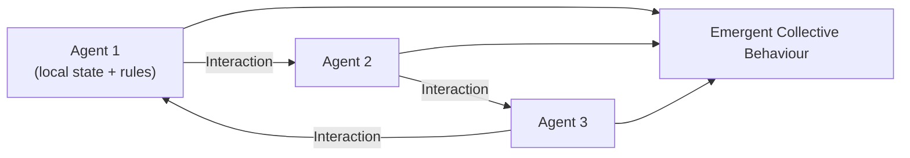
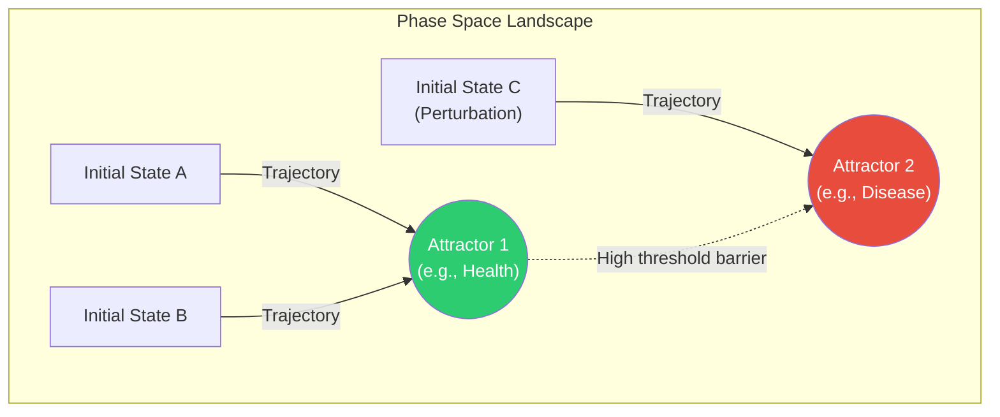
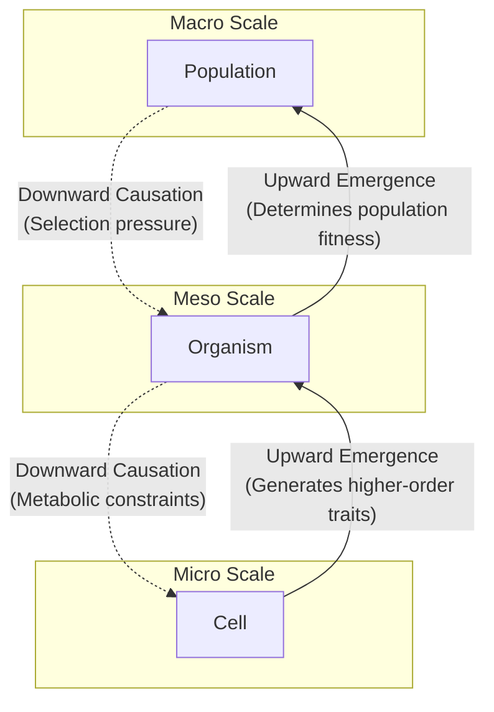

# Complex Adaptive Systems

\label{sec:unit_0_complex_adaptive_systems}


<!-- chapter-metadata-badge -->
> Level 2/3 · 35 min read · 50 min lecture · Prerequisites: \cref{sec:unit_0_systems_science}

---

## Learning Objectives

By the end of this chapter, students will be able to:

1. Define a complex adaptive system and identify its distinguishing characteristics.
2. Describe how local rules among agents give rise to global order without a central controller.
3. Explain the roles of selection, variation, and adaptation in biological CAS.
4. Identify phase transitions and attractors in biological systems.
5. Recognise CAS dynamics at cellular, organismal, population, and ecosystem levels.
6. Analyse fitness landscapes using the NK model and predict the consequences of ruggedness.
7. Apply the logistic map to demonstrate how a single nonlinear equation can generate fixed points, oscillations, and chaos.
8. Connect biological CAS to engineered analogues such as genetic algorithms, neural networks, and ant-colony optimisation.

<!-- curriculum-scaffold-start -->
### Study Blueprint

- **Big idea:** Local rules can generate population-level patterns without a central controller.
- **Core concepts:** nonlinearity, self-organization, attractors, power laws.
- **Framework alignment:** Vision & Change: Systems, Structure and function; AP Biology: Systems Interactions; NGSS-style topics: Structure and Function, Interdependent Relationships in Ecosystems.
- **Model or quantitative lens:** Agent-rule and scaling arguments for emergent biological patterns.
- **Data skill:** Distinguish deterministic trends from stochastic variation in repeated simulations.
- **Practice cadence:** Questions and Methods, Representing and Describing Data, Argumentation.
- **Common misconception to repair:** Emergence is not mysterious; it is a reproducible consequence of interactions plus constraints.
- **Primary lab:** \cref{sec:lab_unit_0_complex_adaptive_systems}.
- **Question bank:** \cref{sec:q_unit_0_complex_adaptive_systems}.
- **Transfer task:** Compare flocking, immune activation, and microbial biofilms as adaptive systems.
- **Bridge to computation:** `biology.ecology.ecology.logistic_growth`.
<!-- curriculum-scaffold-end -->

---

## Opening Vignette: From Sandpiles to the Santa Fe Institute

In 1987, physicist Per Bak placed grains of sand one-by-one onto a pile and discovered a startling regularity: the pile spontaneously organised itself to a "critical" state where avalanches across a wide size range obeyed a power law — many small, few large, with no characteristic scale. He called this **self-organised criticality** \citep{bak1987} and argued it was a signature of complex adaptive systems throughout nature, from earthquakes to extinction cascades to neural firing patterns (*Physical Review Letters*, 1987).

That same year, the Santa Fe Institute was founded in New Mexico with an audacious charter: to study complex systems across disciplinary boundaries. Economists (W. Brian Arthur), biologists (Stuart Kauffman \citep{kauffman1993}), computer scientists (John Holland \citep{holland1992}), and physicists (Murray Gell-Mann) worked shoulder-to-shoulder, discovering that the same mathematics — agent-based models, fitness landscapes, power-law distributions — described stock markets, immune systems, and ecosystems alike.

The central biological insight: the immune system does not have a commander. The brain does not have a central processor. An ant colony does not have a foreman. In each case, simple agents following local rules generate intelligent collective behaviour — **emergence** without design. This chapter explores how that principle operates from the molecular to the planetary scale, equipping you with tools (fitness landscapes, attractor analysis, power-law diagnostics, agent-based simulation, bifurcation theory) you will use throughout the rest of the textbook.

---

## What Is a Complex Adaptive System?

A **complex adaptive system (CAS)** is a network of many interacting agents that:

1. **Adapt** — agents alter their behaviour based on experience or selection.
2. **Self-organise** — ordered collective behaviour emerges from local interactions without central control.
3. **Co-evolve** — the environment of each agent is partly constituted by the other agents; most adapt together.
4. **Exhibit nonlinear dynamics** — small perturbations can cascade into large effects (or large inputs may have minimal impact).

The central insight of CAS theory is that **complexity is endogenous**: it is generated by the interaction rules themselves, not imposed from outside.

CAS theory unifies vocabulary that previously belonged to separate disciplines. The "selection pressure" of an evolutionary biologist, the "energy landscape" of a chemist, the "objective function" of a computer scientist, and the "potential well" of a physicist are different names for the same mathematical object: a real-valued function over agent state that rules drive the system to extremise.

---

## Agents and Agent Rules

In a CAS, the fundamental unit is the **agent** — an entity with internal state, sensors, and action capabilities. Agents follow local rules based on local information. No agent knows the global state.

### Boids and Flocking

Computer scientist Craig \citet{reynolds1987} demonstrated that three simple rules produce realistic flocking behaviour in simulated birds ("boids"):

1. **Cohesion** — steer towards the average position of nearby boids.
2. **Alignment** — steer toward the average heading of nearby boids.
3. **Separation** — avoid crowding; steer away from nearby boids.

No boid knows the global shape of the flock. The flock emerges from purely local interaction.

This principle recurs throughout biology:

- Quorum sensing in bacteria produces [**biofilm**](#gl:biofilm) formation.
- Cytokine gradients direct immune cell recruitment.
- [**Action potential**](#gl:action-potential) propagation in cardiac muscle coordinates the heartbeat.
- Schooling fish escape predators by aligning with neighbours faster than the predator can re-target.

### Ant-Colony Optimisation and Stigmergy

Ant foraging is a paradigmatic CAS. An ant deposits a pheromone trail as it returns from a food source; subsequent ants probabilistically follow stronger trails and reinforce them. Shorter trails are reinforced faster (more round-trips per unit time), while pheromone evaporation weakens abandoned routes. The colony therefore converges on near-optimal paths through local reinforcement and decay, not through any ant holding a map.

This [**stigmergic**](#gl:stigmergy) mechanism — communication through environmental modification — was named from termite nest-building work and then abstracted into ant-colony-optimisation algorithms for routing, scheduling, and search problems \citep{grasse1959stigmergy,dorigo2004ant}. The lesson is precise: a single ant is noisy and limited, but the colony can act as a distributed solver because the environment stores partial information.

Social insects also make the boundary between organism and collective negotiable. A honeybee swarm deciding where to nest integrates waggle dances, quorum-like thresholds, and inhibitory signals; field tracking confirms that dance-recruited bees fly toward advertised locations rather than merely becoming more active \citep{riley2005flight,seeley2010honeybee}. The colony behaves like a [**superorganism**](#gl:superorganism) as an analogy grounded in task allocation, communication, and colony-level reproduction, not as a claim that the group has a literal brain.

### Immune Surveillance as Distributed Adaptation

Each lymphocyte carries a single antigen receptor specificity. The immune system as a whole performs continuous surveillance not because any cell is "smart" but because billions of differently-specific cells circulate, sample, and clonally expand on contact with cognate antigen. Negative selection in the thymus removes self-reactive clones; affinity maturation in the germinal centre runs micro-evolution within the lymph node. The system has no commander; collective decision emerges from local rules.


<!-- alt: Graph showing local agent interactions and emergent collective behaviour. -->

*Local agent interactions and emergent collective behaviour.*

> **Concept Check 1:** A swarm-intelligence start-up wants to control a fleet of drones using boid rules but discovers that during certain wind conditions the flock fragments. Hypothesise which of the three rules (cohesion, alignment, separation) most likely needs reweighting and explain how a change in radius of "nearby" might restore coherence.

---

## Self-Organisation in Biology

### Slime Moulds: A Class Example

*Dictyostelium discoideum* (slime mould) spends most of its life as independent amoebae. When starved, individual cells begin secreting cyclic AMP (cAMP), triggering a **collective aggregation** into a multicellular slug and eventually a fruiting body. No single cell plans the fruiting body; the entire developmental programme is orchestrated by local cAMP gradients — a spectacular example of biological self-organisation.

### Termite Mounds as Collective Construction

Termites build elaborate mounds by following primarily local construction rules (place, remove, or reinforce soil pellets where cues indicate work). The architecture emerges from millions of local decisions, not from a blueprint read by any individual termite. Modern mound-physics work shows that the structure can couple wind, solar heating, and internal porosity to gas exchange, so "air conditioning" is an emergent physical consequence of collective construction rather than a designed appliance \citep{ocko2017solar}. Termite mounds are therefore a clean bridge between behaviour, architecture, and physiology: local building rules alter the abiotic environment, and that altered environment feeds back on colony survival.

### Embryonic Development as Coordinated Self-Organisation

The body plan of a vertebrate emerges from a single fertilised cell through cell division, migration, and differentiation guided by local chemical gradients (morphogens). The French flag model of positional information — cells adopt different fates depending on the local concentration of a morphogen — captures the CAS logic of development.

### Turing Patterns and Reaction–Diffusion

Alan Turing's 1952 paper on morphogenesis showed that two interacting chemicals — a local activator and a long-range inhibitor — can spontaneously break spatial symmetry to produce stripes, spots, or hexagonal patterns. The minimal model is

\begin{equation}
\frac{\partial u}{\partial t} = D_u \nabla^{2} u + f(u, v), \qquad \frac{\partial v}{\partial t} = D_v \nabla^{2} v + g(u, v)
\label{eq:unit_0_turing}
\end{equation}

with $D_v \gg D_u$ (the inhibitor diffuses faster than the activator). Empirical examples include zebrafish stripe patterning, mouse hair-follicle spacing, and digit number in tetrapod limbs. Turing's logic is the cleanest example of order-from-instability: the homogeneous state is unstable to spatial perturbations precisely because the inhibitor outruns the activator.

---

## Attractors and Phase Space

The concept of an **attractor** is central to understanding CAS dynamics. An attractor is a set of states toward which a system tends to evolve over time.

| Attractor type | Description | Biological example |
| -------------- | ----------- | ------------------ |
| Fixed point | System converges to a single stable state | Biochemical equilibrium; homeostatic set point |
| Limit cycle | System oscillates periodically | Circadian rhythm; [**cell cycle**](#gl:cell-cycle); cardiac pacemaker |
| Torus | System oscillates quasi-periodically | Coupled biological clocks |
| Strange attractor | Deterministic chaos; sensitive initial conditions | Some ECG arrhythmias; neuronal population dynamics |

**Phase space** is the abstract space in which most possible system states are points. Attractors are embedded in phase space; trajectories flow toward them. Understanding biological regulation means understanding the attractor landscape of the relevant phase space.

### Basins of Attraction and Landscape Geometry

The **basin of attraction** of an attractor $A$ is the set of states from which trajectories flow to $A$. Basins are separated by **separatrices** — codimension-one manifolds across which a small perturbation flips the system between attractors. In Waddington's classical metaphor for development, the embryo rolls down a "landscape" whose valleys (basins) correspond to differentiated cell types and whose ridges (separatrices) correspond to bistable cell-fate decisions. Modern single-cell RNA-seq data can be used to reconstruct an empirical analogue of this landscape from observed cell-state densities.

The **depth** of a basin (the energy barrier to escape) determines its noise robustness; the **width** determines the range of initial conditions that converge to it. A deep, narrow basin is robust but inflexible; a shallow, wide basin is flexible but easily perturbed. Cancer cells often inhabit basins that are *wider* than normal (higher phenotypic plasticity) and *shallower* (easier to perturb stochastically), explaining their resistance to single-target therapy.


<!-- alt: Graph showing conceptual phase space with disjoint attractor basins. -->

*Conceptual phase space with disjoint attractor basins.*

> **Concept Check 2:** Both cancer cells and healthy cells inhabit a [**gene**](#gl:gene)-expression phase space with multiple attractors (proliferative, quiescent, senescent, apoptotic). Many targeted therapies try to push malignant cells out of the proliferative basin. Why does this often fail — what does the landscape analogy predict about recurrence when the basin barrier is lower than the therapy's "kick" amplitude? Propose a CAS-aware rationale for drug *combinations* rather than single agents.

---

## Phase Transitions and Criticality

A **phase transition** is a qualitative change in system behaviour at a critical parameter value. In biology:

- **[Protein](#gl:protein) folding** — a polypeptide transitions from disordered to folded at a critical temperature.
- **The lac [**operon**](#gl:operon)** — bistable switch with two stable attractors (ON and OFF) separated by an unstable threshold.
- **The immune system** — a subclinical infection (low pathogen load) may persist or be cleared; above a threshold, an acute inflammatory response is triggered.
- **Ecosystems** — beyond a critical level of nutrient loading, a clear lake can collapse into a eutrophic state — an ecological phase transition.
- **Cytoplasm condensation** — at high macromolecular crowding the cytoplasm transitions from liquid-like to glass-like, drastically slowing diffusion. Stress granules and P-bodies are physiological liquid-liquid phase separations.

### The Ising Picture of Cell-Fate Switching

A toy mathematical bridge between physics and biology is the Ising model, in which spins $s_i \in \{+1, -1\}$ on a lattice interact through

\begin{equation}
H = -J \sum_{\langle i, j \rangle} s_i s_j - h \sum_{i} s_i
\label{eq:unit_0_ising}
\end{equation}

with coupling $J$ and external field $h$. Below a critical temperature $T_c$ the system spontaneously magnetises (most spins agree); above it the system is disordered. Mapping spin-up to "gene ON" and spin-down to "gene OFF" recasts cell-fate commitment as a magnetisation phase transition: at low effective "temperature" (low gene-expression noise), tightly-coupled networks lock into one of a few discrete cell types; at high temperature, expression patterns are disordered. The same mathematics describes binary opinion dynamics in social networks, illustrating how comprehensive these critical phenomena are.

### Power Laws and Scale-Free Behaviour

Many CAS, especially those poised near a critical phase transition (**critical systems**), display **power-law** distributions:

\begin{equation}
P(x) \propto x^{-\alpha}
\label{eq:unit_0_powerlaw}
\end{equation}

where α is the scaling exponent. Power-law distributions in biology arise in:

- Protein interaction network degree distributions (α ≈ 2–3).
- Species abundance distributions (Preston's lognormal-like, with power-law tail).
- Neuronal avalanche sizes \citep{beggs2003} (α ≈ 1.5).
- Forest fire size distributions and earthquake magnitudes (Gutenberg–Richter law).
- Sizes of mass extinctions in the fossil record.
- Citations of academic papers and population sizes of cities.

The hypothesis of **self-organised criticality** (Bak, Tang & Wiesenfeld, 1987 \citep{bak1987}) proposes that many living systems automatically tune themselves to criticality, because critical systems are maximally responsive and information-transmitting. Critical neural networks have the longest correlation lengths, the highest dynamic range of stimulus encoding, and the maximum mutual information between input and output — most desirable for a brain.

### Worked Example: Scaling in Power-Law Distributions

**Problem:**
Neuronal avalanche sizes (the number of [**neuron**](#gl:neuron)s firing synchronously in a cascade) in cortical slices have been empirically shown to follow a power law probability distribution $P(x) = C x^{-\alpha}$, where the scaling exponent $\alpha \approx 1.5$. If a small avalanche involving $x = 10$ neurons occurs with a probability of $0.05$ (5%), what is the probability of a massive avalanche involving $x = 100$ neurons?

**Solution:**

**Set up the probability ratio.**  Because $C$ is a constant, the ratio of probabilities for any two event sizes depends primarily on the ratio of those sizes to the negative power of α :

\begin{equation}
\frac{P(x_2)}{P(x_1)} = \left(\frac{x_2}{x_1}\right)^{-\alpha}
\label{eq:unit_0_complex_adaptive_systems_item_1}
\end{equation}

**Substitute the known values** ($x_1 = 10$, $x_2 = 100$, $\alpha = 1.5$):

\begin{equation}
\frac{P(100)}{P(10)} = \left(\frac{100}{10}\right)^{-1.5}
\label{eq:unit_0_complex_adaptive_systems_item_2}
\end{equation}

\begin{equation}
\frac{P(100)}{P(10)} = (10)^{-1.5}
\label{eq:unit_0_complex_adaptive_systems_item_3}
\end{equation}

\begin{equation}
(10)^{-1.5} = \frac{1}{\sqrt{10^3}} = \frac{1}{\sqrt{1000}} \approx \frac{1}{31.62} \approx 0.0316
\label{eq:unit_0_complex_adaptive_systems_item_4}
\end{equation}

**Calculate the final probability.**

\begin{equation}
P(100) = P(10) \times 0.0316 = 0.05 \times 0.0316 \approx 0.00158
\label{eq:unit_0_complex_adaptive_systems_item_5}
\end{equation}

A neuronal avalanche involving 100 neurons occurs with a probability of approximately **0.16%**. Because power-law distributions possess a "fat tail" relative to Gaussian distributions, extreme outlier events (massive avalanches) remain statistically probable, illustrating how a CAS poised near criticality can periodically undergo massive, system-wide state changes.

> **Connection (clinical) — epileptic seizures as critical events.** Cortical recordings near seizure onset show increasing mutual information between regions and rising statistical signatures of approach to a critical bifurcation. This is consistent with the brain operating just below a critical line, with seizures representing excursions across it. Closed-loop responsive neurostimulation devices (e.g. NeuroPace) detect these pre-critical signatures and deliver counter-stimulation to keep the system in the subcritical basin.

---

## Adaptation and Evolution as CAS Processes

Evolution by [**natural selection**](#gl:natural-selection) is a CAS at the population level:

- **Agents**: individual organisms.
- **Local rules**: reproduction, survival, [**mutation**](#gl:mutation), migration.
- **Environment**: partly constituted by other organisms.
- **Emergent outcome**: population-level adaptation, [**speciation**](#gl:speciation), co-evolution.

The evolutionary process is not guided toward any particular solution. It is open-ended and path-dependent. Fitness landscapes capture the attractor structure of adaptive evolution.

### Fitness Landscapes and Adaptive Walks

A **fitness landscape** \citep{kauffman1993} is a surface in which each point represents a possible genotype and the height represents the fitness that genotype confers. Selection drives populations "uphill" toward local peaks. The metaphor was first made concrete by Sewall Wright (1932) and later formalised by Stuart Kauffman's **NK models**, which vary the number of loci $N$ and the epistatic coupling $K$ between them:

- $K = 0$ (no epistasis) — the landscape is a single smooth peak; evolution is a deterministic climb.
- $K = N - 1$ (maximal epistasis) — the landscape is maximally rugged, with $\sim 2^N / (N + 1)$ local peaks. Populations get trapped.
- Intermediate $K$ — there are dozens to thousands of local peaks with valleys of mildly reduced fitness between them.

Mathematically, in an NK model with binary loci the fitness of a genotype is

\begin{equation}
W(\mathbf{x}) = \frac{1}{N} \sum_{i=1}^{N} w_{i}\!\left(x_{i}, x_{i_{1}}, \ldots, x_{i_{K}}\right)
\label{eq:unit_0_nk}
\end{equation}

where each locus contribution $w_i$ depends on its own state $x_i$ and on $K$ partner loci. For $K = 0$ each locus is independent, so the global optimum can be found one locus at a time. For $K > 0$ the contributions become entangled, generating the rugged landscape. Empirical fitness landscapes (for HIV-1 protease, the *E. coli* ribosomal protein S6, and *Aspergillus* enzymes) consistently land at intermediate $K$ — rugged enough to trap evolution on local peaks, smooth enough that occasional valleys can be crossed.

Ruggedness predicts why evolution can take several different paths to similar fitness and why identical starting populations (as in the Lenski *E. coli* long-term evolution experiment) reach *different* adaptive solutions. In cancer, the same principle explains why single-agent targeted therapy traps tumours on a local peak; combination therapy shifts the landscape so the old peak is no longer fit, forcing movement into valleys where the tumour is more vulnerable.

> **Connection (clinical) — antimicrobial cycling.** Hospital antibiotic stewardship sometimes deliberately *cycles* between drug classes, exploiting the fact that resistance mutations to one class may carry fitness costs on another. Each cycle reshapes the fitness landscape; resistance peaks that were locally fit under cefazolin become valleys under ciprofloxacin, evicting the population. The same logic is being explored for cancer ("evolutionary therapy" with adaptive dosing).

> **Applied Systems / Clinical Connection — combination therapy as landscape engineering.**
> In a rugged disease landscape, the goal is not only to hit the current dominant clone; it is to make the next adaptive move costly. A cancer cell resistant to drug A may pay a growth-rate cost that makes it sensitive to drug B, while a bacterial mutant resistant to one antibiotic may lose the efflux or cell-wall state that protected it under another. Combination and sequence designs therefore ask a CAS question: what nearby peaks will selection reveal after the first intervention? The best regimen changes the topology of the landscape, not just the height of today's peak \citep{kauffman1993}.

### Worked Example: Escape From a Fitness Valley

**Problem:** A bacterial population sits on a resistance peak. A double mutant would be more fit under the next drug, but the first mutation alone has a 2% fitness cost. Assume an effective population size $N_e = 10^5$ and selection coefficient against the intermediate $s = 0.02$. Is the intermediate likely to drift to appreciable frequency before being removed by selection?

**Solution:** A simple rule of thumb compares selection with drift using $N_e s$:

\begin{equation}
N_e s = 10^5 \times 0.02 = 2000
\label{eq:unit_0_fitness_valley_selection_drift}
\end{equation}

Because $N_e s \gg 1$, selection dominates drift. The deleterious intermediate is unlikely to persist long enough for the second mutation unless mutation supply is enormous, spatial structure protects a subpopulation, or the environment changes so the intermediate cost falls. This is why drug sequencing can work: if each step toward multidrug resistance requires crossing a valley, the treatment schedule can keep the population from climbing the next peak.

> **Concept Check (Analysis):** A population of *E. coli* bacteria in a nutrient gradient follows a fitness landscape with two local maxima: one at [glucose] = 1 mM (metabolic optimum) and one at [glucose] = 0.1 mM (growth-rate optimum in competition). (a) Explain why natural selection alone cannot cross the fitness valley between these peaks. (b) Name two stochastic mechanisms that could move the population across the valley. (c) In which population-size regime ($N_e \ll 1/s$ or $N_e \gg 1/s$) does crossing become more likely, and why?

> **Concept Check (Evaluation):** The sandpile model shows self-organised criticality (SOC): the distribution of avalanche sizes follows a power law $P(s) \sim s^{-\tau}$ with $\tau \approx 1.5$. Cortical neural activity in awake mammals also follows a power law with $\tau \approx 1.5$ for neuronal cascades. (a) What does this quantitative similarity suggest about the operating regime of the cortex? (b) Propose one experimental manipulation that would push the cortex below criticality (subcritical) and one that would push it above (supercritical). (c) What would be the functional cost of each deviation?

### Genetic Algorithms: Evolution in a Computer

John Holland's **genetic algorithm** \citep{holland1992} formalises Darwinian evolution as an optimisation procedure. A population of candidate solutions (each encoded as a "chromosome") is evaluated, the fittest are selected for reproduction, and offspring are produced by crossover (recombining parental chromosomes) and mutation. Genetic algorithms have designed:

- Antenna geometries for NASA satellites that outperform human-designed alternatives.
- Aerodynamic profiles for racing yachts.
- Schedule optimisers for hospitals.
- Trading strategies that survive market regime change.

The *biological* lesson is the inverse: just as artificial evolution solves design problems by sampling, recombining, and selecting, biological evolution discovers the metabolic and morphological inventions of life by exactly the same process — with the difference that biological "fitness functions" are themselves changing because the agents alter their environment.

### Quorum sensing: a molecular vote without a mayor

Many bacteria secrete **autoinducer** molecules whose extracellular concentration rises with local cell density. Below a threshold, the signal is noise; above it, receptors synchronise gene expression — biofilm formation, bioluminescence (*Vibrio*), or [**virulence**](#gl:virulence) factor deployment (*Staphylococcus*). No cell counts its neighbours; each cell integrates a **local concentration** that *implicitly* encodes population size. Mathematically, positive feedback on autoinducer synthesis once a threshold is crossed is a **bistable switch** — a CAS motif duplicated in synthetic gene circuits. Antibiotics that fail to penetrate biofilms often select for **persister** subpopulations, illustrating how multicellular bacterial collectives occupy a different attractor than planktonic growth.

### Trophic cascades: top-down reshaping of food webs

Removing an apex predator (wolves from Yellowstone pre-1995 \citep{ripple2012}; large sharks from coral reefs) can trigger **cascading** changes in herbivores, plants, and even geomorphology — not because the predator "controlled" each species, but because the **network of interactions** rewires. Reintroduction experiments show that restoration is not the reverse movie of removal: history and initial conditions matter (**hysteresis**), another CAS signature. Levin's classic argument \citep{levin1998} that ecosystems and the biosphere are themselves complex adaptive systems rests on exactly this combination of nonlinear dynamics, history dependence, and multi-scale interaction.

### The Immune System as CAS

The adaptive immune system is perhaps the most striking interorganismal CAS:

- B-cell clonal expansion generates antigen-specific population growth.
- Affinity maturation (somatic hypermutation + selection) is micro-evolution within the germinal centre.
- Memory is a stable population-level attractor that persists after antigen clearance.

> **Concept Check 3:** A bacterial population is grown for 1000 generations under cycling exposure to drugs A and B. Resistance mutations to A typically reduce growth rate on B and vice versa. Sketch how the population-mean fitness on each drug evolves over time, and explain in CAS vocabulary why the drug-cycling regime keeps the population on a "treadmill" rather than letting it climb a single peak.

---

## Noise, Stochasticity, and Bifurcation

Deterministic CAS models capture the *average* trajectory but miss two crucial features of real biology: **noise** (stochastic fluctuations in component numbers) and **bifurcation** (qualitative changes in system behaviour at parameter boundaries).

### Noise in Genetic Switches

A bistable switch such as the *lac* operon ideally sits in either a fully-repressed or fully-induced state. In individual cells, however, [**transcription**](#gl:transcription) factor copy numbers are low (tens to hundreds per cell), so thermal fluctuations produce **stochastic transitions** between the two attractors. The rate of spontaneous switching follows a Kramers-like relation:

\begin{equation}
k_{\mathrm{switch}} \approx \omega_{0} \, e^{-\Delta U / k_B T_{\mathrm{eff}}}
\label{eq:unit_0_kramers}
\end{equation}

where $\Delta U$ is the height of the barrier between attractors and $T_{\mathrm{eff}}$ is an effective noise temperature set by molecule copy number. This has direct clinical consequences: bacterial **persister cells** escape antibiotics by stochastically entering a dormant attractor; cancer cells sample a phenotypic landscape and survive chemotherapy in rare sub-states — a Darwinian process on a CAS landscape rather than on genetic variation alone.

### Fold Bifurcations and Hysteresis: Lake Eutrophication

[**Eutrophication**](#gl:eutrophication) is the textbook ecological example of a **fold bifurcation**. Let $P$ = phosphorus load and $A$ = algal biomass. For low $P$ the system has a single clear-water equilibrium; as $P$ exceeds a critical value $P_1$ the clear state loses stability and the lake flips to a turbid, algae-dominated state. Crucially, *reducing* $P$ below $P_1$ does **not** restore the clear state — recovery requires that $P$ falls below a lower threshold $P_2 < P_1$. This **hysteresis loop** is why eutrophication management is so expensive: undoing the transition requires substantially more reduction than preventing it in the first place. The same mathematics describes coral-reef to algal-reef transitions and some epileptic-focus formation in the brain.

### The Logistic Map: A Worked Bifurcation Diagram

The logistic map

\begin{equation}
x_{n+1} = r\,x_{n}\,(1 - x_{n})
\label{eq:unit_0_logistic_map}
\end{equation}

with $r \in [0, 4]$ and $x \in [0, 1]$ is one of the simplest nonlinear systems and exhibits a complete cascade from order to chaos as $r$ increases:

| Range of $r$ | Long-term behaviour |
| ------------ | ------------------- |
| $0 \le r < 1$ | Population dies out: $x_n \to 0$ |
| $1 \le r < 3$ | Single stable fixed point $x^{*} = 1 - 1/r$ |
| $3 \le r < 3.449...$ | Period-2 limit cycle |
| $3.449... \le r < 3.544...$ | Period-4 limit cycle |
| Period-doubling cascade | Periods 8, 16, 32, ... accumulating at $r_{\infty} \approx 3.5699$ |
| $r \ge r_{\infty}$ | Chaos with periodic windows (notably period-3 near $r = 3.83$) |
| $r = 4$ | Fully developed chaos on $[0, 1]$ |

The successive period-doubling thresholds approach $r_{\infty}$ at a comprehensive ratio (the **Feigenbaum constant** $\delta \approx 4.6692$) that recurs in any smooth unimodal one-dimensional map and even in measurements of dripping faucets and convection rolls. This **universality** is part of why the logistic map matters: it predicts that systems as different as insect populations and turbulent fluids will display the same quantitative route to chaos.

**Worked numerical iteration ($r = 3.2$, $x_0 = 0.5$):** $x_1 = 3.2 \cdot 0.5 \cdot 0.5 = 0.800$. $x_2 = 3.2 \cdot 0.8 \cdot 0.2 = 0.512$. $x_3 = 3.2 \cdot 0.512 \cdot 0.488 = 0.799$. $x_4 = 3.2 \cdot 0.799 \cdot 0.201 = 0.514$. The iterates settle into a period-2 oscillation between roughly 0.513 and 0.800 — a discrete-time biological oscillator from one line of code.

> **Connection (ecology) — boom-bust population cycles.** Some insect populations (notably Australian budworm) show empirical period-doubling and chaotic dynamics that are well-modelled by logistic-like equations. Whether populations are "really chaotic" or merely noisy depends on detailed model fitting; the pedagogical point is that *no exotic mechanism* is required to generate complex temporal patterns — a single nonlinear feedback suffices.

> **Concept Check 4:** Iterate the logistic map by hand for $r = 2.5$, $x_0 = 0.1$, four steps. Predict the long-term value, then iterate a few more steps to confirm. What does this tell you about the basin of attraction of the fixed point?

---

## Robustness and Fragility

CAS often exhibit **robustness** — the ability to maintain function in the face of perturbation — paired with occasional **catastrophic fragility** in specific directions.

Biological robustness is achieved through:

- **Redundancy** — multiple components performing similar functions.
- **Degeneracy** — structurally distinct components can perform the same function in some contexts.
- **Modularity** — failure in one module is localised.
- **Negative feedback** — deviations are automatically opposed.
- **Distributed encoding** — important information is represented across many components, not localised in one.

However, the same architectural features that confer robustness to typical perturbations make the system fragile to novel, coordinated, or cross-module perturbations. Antibiotic resistance evolution, autoimmunity, and cancer most reflect such fragility. This trade-off is sometimes called the **robust-yet-fragile** signature of CAS: highly optimised systems are *more* robust to expected perturbations and *more* fragile to unexpected ones. Carlson and Doyle named this "highly optimised tolerance" (HOT), and it explains why mature ecosystems suffer catastrophically when novel invasive species or climate regimes appear.

> **Concept Check 5:** Consider a CAS with strong negative feedback, modular organisation, and five-fold redundant sensors. Name one category of perturbation it will handle easily and one category that will nonetheless catastrophically break it. Why do the same architectural features that create robustness also create specific fragilities?

---

## CAS Across Biological Scales

| Scale | CAS | Agents | Emergent collective property |
| ----- | --- | ------ | ---------------------------- |
| Molecular | Gene regulatory network | Transcription factors, RNAs | Gene expression pattern, cell fate |
| Cellular | Intracellular signalling | Signal proteins, second messengers | Robust most-or-none responses |
| Tissue | Neural network | Neurons | Cognition, memory, perception |
| Organism | Immune system | B and T cells, innate cells | Adaptive immunity |
| Population | Evolving population | Individual organisms | Adaptation, speciation |
| Ecosystem | Community ecology | Species populations | Food web structure, [**succession**](#gl:succession) |
| Biosphere | Gaia / planetary metabolism | Biomes, ocean basins | Atmospheric composition, climate |


<!-- alt: Graph showing cross-scale interactions: upward emergence and downward causation. -->

*Cross-scale interactions: upward emergence and downward causation.*

### Agent-Based Models Across Biological Scales

| Phenomenon | Agents | Local rules | Emergent property |
| ---------- | ------ | ----------- | ----------------- |
| Bird flocks | Boids | Cohesion, alignment, separation | Coordinated flight |
| Ant trails | Ants + pheromone | Deposit, follow, evaporate | Shortest path |
| Slime mould | *Dictyostelium* | cAMP secretion, chemotaxis | Multicellular fruiting body |
| Schelling segregation | Households | Move if too few neighbours of "type" | Macroscopic segregation |
| Game of Life | Cells on grid | Birth/death rules from neighbourhood | Gliders, oscillators, computers |
| SIR epidemic | S, I, R classes | Contact + recovery probability | Outbreak peak, herd-immunity threshold |
| T-cell repertoire | Lymphocytes | Random receptor + clonal selection | Adaptive specificity |

The pattern is comprehensive: the rules are absurdly simple, the global behaviour is rich. This is why agent-based modelling has become a standard tool in epidemiology (COVID-19 contact networks), behavioural ecology, and synthetic biology.

```mermaid
flowchart LR
    A[Initialise N agents\nwith random states] --> B[For each agent:\nsense local neighbourhood]
    B --> C[Apply local rules\nto update internal state\nand action]
    C --> D[Update environment\n(pheromones, chemicals,\nphysical positions)]
    D --> E{Stop?\n(time / convergence)}
    E -->|No| B
    E -->|Yes| F[Measure global\nemergent properties]
```
<!-- alt: Flowchart showing agent-based modelling loop linking local rules to measured emergent behaviour. -->

*Agent-based modelling loop linking local rules to measured emergent behaviour.*

---

## Synthesis and Practical Implications

CAS is not merely a metaphor; it is a *toolkit* with specific predictions:

- If you suspect a system sits at criticality, look for power-law statistics in size, duration, or wait-time distributions.
- If you suspect bistability, look for hysteresis: probe the system in both forward and reverse directions and watch for trajectory mismatch.
- If you suspect a rugged fitness landscape, look for path-dependent endpoints in replicate evolution experiments.
- If you suspect agent-based emergence, ask which global property would *not* survive removing the local rules — that is the emergent component.
- If you suspect chaos, estimate the leading Lyapunov exponent from time-series data and check for sensitive dependence on initial conditions.

These diagnostics turn CAS theory from rhetorical to actionable.

---

## Current Evidence and Frontier Biology: Complex Adaptive Systems

For **Complex Adaptive Systems**, frontier biology belongs inside the evidence logic of
the chapter. Systems models are useful when they expose assumptions, uncertainty, and failure modes rather than merely producing elegant diagrams. The core reading question is this: agent rules, heterogeneity, stochasticity, and path dependence make biological prediction conditional rather than absolute.

- **What to verify:** identify the observation, model, assay, or dataset that
  would make the claim stronger or weaker.
- **What to qualify:** state the scale, organism, cell type, environmental
  condition, or population where the claim is expected to hold.
- **What to compare:** test at least one alternative explanation, baseline, or
  null model before treating the pattern as causal.
- **What to cite:** distinguish primary evidence, review synthesis, public
  dataset, and institutional guidance; for recent or numeric claims, prefer
  the source closest to the measurement and state what has changed since it was
  published.

For complexity claims, name the interacting agents, update rule, feedback loop, and attractor or phase-space evidence before treating emergence as more than description.

**Source practice:** Pair simulation or network models with empirical traces of local interaction, perturbation, or time-series behaviour; state what simpler linear model would miss.

## Unit 0 Integration: From Systems to Adaptive Agents

\nameref{sec:unit_0_systems_science} defines boundaries, feedback, and dynamics. CAS reasoning adds three commitments:

1. **Agents are heterogeneous.** Cells, organisms, immune clones, microbial taxa, or firms in a food system do not all share the same state, history, or rule set.
2. **Rules are local.** Global patterns emerge from local sensing, movement, reproduction, death, learning, or signalling.
3. **History matters.** The same perturbation can have different outcomes after a system has crossed a threshold, acquired a mutation, changed a niche, or settled into a new attractor.

These commitments are what let CAS connect evolution, immunity, cancer, neural circuits, microbial ecology, and conservation. They also prevent a common overclaim. A system is not complex-adaptive merely because it has many parts. It becomes CAS-like when local adaptive rules, heterogeneity, and path dependence explain a global pattern better than a single representative-agent model.

### Diagnostic Workflow for CAS Explanations

When you meet a later chapter case, ask:

- What are the agents?
- What local rule does each agent follow?
- What variable changes through feedback or selection?
- What global property appears after the agents interact?
- What perturbation would distinguish emergence from ordinary aggregation?

## Summary

- A complex adaptive system is a collection of interacting agents with adaptive rules that generate emergent collective behaviour.
- Self-organisation arises from local interactions without central control; Turing patterns and Dictyostelium aggregation are paradigmatic examples.
- Attractors define the landscape of stable system states; phase transitions separate distinct regimes.
- Power laws and scale-free properties often signal systems poised near criticality; the Bak sandpile, neuronal avalanches, and earthquakes share statistical signatures.
- Fitness landscapes (Wright's metaphor; Kauffman's NK formalism) capture the structure of adaptive evolution; ruggedness predicts replicate divergence and resistance evolution.
- Genetic algorithms transplant biological evolution into computational design problems, illustrating that the search-by-variation-and-selection logic is substrate-independent.
- The logistic map demonstrates that a single nonlinear feedback can produce fixed points, period doubling, and chaos at the Feigenbaum point.
- Evolution, social-insect colonies, the immune system, neural networks, and ecosystems are major biological CAS — and so are the engineered swarm of drones, the genetic algorithm, and the social network.

---

## Key Terms

**complex adaptive system** · **agent** · **stigmergy** · **superorganism** · **self-organisation** · **attractor** · **basin of attraction** · **phase space** · **phase transition** · **critical system** · **power law** · **scale-free** · **fitness landscape** · **NK model** · **genetic algorithm** · **logistic map** · **Feigenbaum constant** · **robustness** · **degeneracy** · **limit cycle** · **strange attractor** · **Turing pattern** · **bistable switch** · **hysteresis**

---

## Discussion Questions

1. The human gut [**microbiome**](#gl:microbiome) contains ~10¹³ microbial cells from hundreds of species, interacting through metabolic cross-feeding, competition, and quorum sensing. Describe this as a CAS. What are the agents, local rules, and emergent properties? What could perturb the microbiome into a different attractor?

2. Explain why a cancer tumour is itself a CAS. What "selection pressure" drives cancer evolution? Why does targeting a single driver mutation often fail to permanently eliminate a tumour? How might CAS thinking guide combination therapies?

3. Neural networks in the brain and artificial neural networks in deep learning both exhibit emergent computation from simple local rules. Compare and contrast the biological and artificial cases in terms of (a) learning rules, (b) architecture, (c) energy consumption, and (d) generalisation vs. overfitting.

4. Many ecosystems exhibit hysteresis: a lake may tolerate increasing nutrient loading up to a threshold, then abruptly collapse to a eutrophic state, which cannot be reversed simply by reducing nutrient input to pre-collapse levels. What does this asymmetry imply for conservation management? How does CAS theory explain the hysteresis?

5. The concept of "self-organised criticality" suggests that many biological networks operate near a critical point between order and disorder. What functional advantages might this confer on neural networks? What experimental evidence (e.g., neuronal avalanches \citep{beggs2003}) supports or challenges this hypothesis?

6. Explain quorum sensing in *Pseudomonas aeruginosa* or *Vibrio fischeri* using CAS vocabulary (agents, local rules, emergent behaviour). How might blocking autoinducer synthesis differ from traditional bactericidal antibiotics in terms of resistance evolution?

7. After wolf reintroduction in Yellowstone \citep{ripple2012}, willow recovery along streams was attributed partly to reduced elk browsing. What other biotic or [**abiotic**](#gl:abiotic) variables could confound a simple "predator → herbivore → plant" chain? How would you design a study to separate correlation from causation?

8. The Lenski long-term evolution experiment in *E. coli* has run for >75 000 generations across 12 replicate populations on a single fitness landscape. Roughly half the populations independently evolved hypermutator phenotypes, and one acquired the ability to use citrate aerobically — but primarily after ~31 000 generations of "potentiating" mutations. What does this pattern of divergent yet partially convergent evolution reveal about fitness landscape ruggedness, contingency, and the predictability of evolutionary outcomes?

---

## Review Questions

1. List the four defining properties of a complex adaptive system (adaptation, self-organisation, co-evolution, nonlinear dynamics) and give one biological example that exhibits the complete set simultaneously.

2. Explain the chapter's claim that "complexity is endogenous." Using the boids model, describe how three local rules (cohesion, alignment, separation) generate a global flock that no individual agent represents.

3. Distinguish a fixed-point attractor, a limit cycle, and a strange attractor, giving one biological example of each. For the limit cycle, name the feedback feature that sustains the oscillation.

4. Apply the basin-of-attraction landscape to cancer therapy. A targeted drug delivers a "kick" that displaces malignant cells from the proliferative basin. Explain, in terms of basin depth and barrier height, why recurrence is likely when the barrier is lower than the kick amplitude, and why combination therapy reshapes rather than merely perturbs the landscape.

5. Iterate the logistic map $x_{n+1}=r x_n(1-x_n)$ by hand for $r=3.2$, $x_0=0.5$ for four steps, and classify the long-term behaviour using the chapter's $r$-regime table. Then explain what the Feigenbaum constant $\delta\approx4.669$ implies about the *universality* of the route to chaos across unrelated systems.

6. Analyse self-organised criticality: identify the statistical signature (power-law size distributions) and explain, using neuronal avalanches, why a system poised near criticality maximises dynamic range and mutual information. Why is this functionally advantageous for a brain?

7. Using Kauffman's NK model, explain how the epistatic coupling $K$ controls landscape ruggedness. Predict the qualitative outcome of replicate evolution experiments (e.g. the Lenski long-term *E. coli* lines) at $K=0$, intermediate $K$, and $K=N-1$, and connect ruggedness to the failure of single-agent targeted therapy.

8. Distinguish robustness, redundancy, and degeneracy. Then explain the "robust-yet-fragile" (highly-optimised-tolerance) signature: why do the same architectural features that confer robustness to expected perturbations create catastrophic fragility to novel, coordinated ones? Give one clinical or ecological example.

9. Evaluate the fold-bifurcation/hysteresis account of lake eutrophication. Why does reducing phosphorus below the original tipping point $P_1$ fail to restore the clear state, and what does the lower threshold $P_2$ imply for the cost asymmetry between prevention and remediation? Identify one other biological system governed by the same mathematics.

10. Synthesis: the chapter offers five diagnostic tests (power-law statistics, hysteresis probing, path-dependent replicate endpoints, the "remove-the-local-rules" emergence test, Lyapunov-exponent estimation). Choose a biological system of your choice, propose which two diagnostics you would run, state the falsifiable prediction each makes, and explain why a no-transition null model is essential before declaring an early-warning signal real.

---

## Further Reading and Source Notes: Complex Adaptive Systems

- Holland, J. H. (1992). *Adaptation in Natural and Artificial Systems* (2nd ed.) \citep{holland1992}. MIT Press.
- Kauffman, S. A. (1993). *The Origins of Order: Self-Organisation and Selection in Evolution* \citep{kauffman1993}. Oxford University Press.
- Bak, P., Tang, C., & Wiesenfeld, K. (1987). Self-organized criticality \citep{bak1987}. *Physical Review Letters*, 59(4), 381–384.
- Levin, S. A. (1998). Ecosystems and the biosphere as complex adaptive systems \citep{levin1998}. *Ecosystems*, 1(5), 431–436.
- Beggs, J. M., & Plenz, D. (2003). Neuronal avalanches in neocortical circuits \citep{beggs2003}. *Journal of Neuroscience*, 23(35), 11167–11177.
- Strogatz, S. H. (2018). *Nonlinear Dynamics and Chaos* (2nd ed.) \citep{strogatz2018}. Westview Press.

---

## Companion Source Module: Complex Adaptive Systems

**Complex Adaptive Systems** should leave a reproducible trail from a biological claim to
the code, figure, diagram, or paper-based activity that can test it. Use the
surfaces below to inspect the chapter's assumptions, rerun the relevant model,
or compare the manuscript explanation with companion labs and figures.

| Surface | Use it for |
| --- | --- |
| `src/biology/ecology/ecology.py` (`lotka_volterra`, `biodiversity_indices`, `logistic_growth`) | Explore feedback, interaction strength, and diversity metrics as emergent summaries. |
| `src/biology/evolution/evolution.py` (`simulate_selection`, `wright_fisher_drift`, `fitness_landscape_1d`) | Compare selection, drift, and landscape ruggedness as agent-level rules. |
| `src/visualization/plots.py` (`plot_lotka_volterra`, `plot_selection_simulation`) | Inspect how oscillations and allele-frequency trajectories depend on starting conditions. |
| `src/mermaid/biology_diagrams.py` (`food_web_diagram`, `population_growth_stages_diagram`) | Link network structure to emergent population outcomes. |

**Reproducibility check:** rerun or recalculate a scenario from two initial states and ask whether convergence, hysteresis, or path dependence is doing the explanatory work. **Cross-reference:** use \cref{sec:unit_0_systems_science}, \cref{sec:unit_V_population_genetics}, and \cref{sec:unit_X_community_interactions,sec:unit_X_biodiversity_and_food_webs} as comparison cases.
