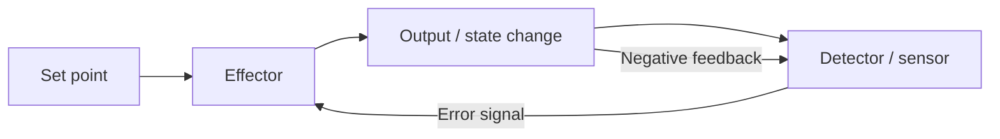
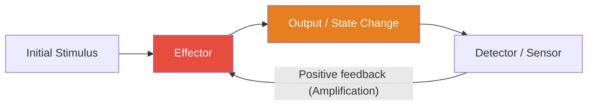
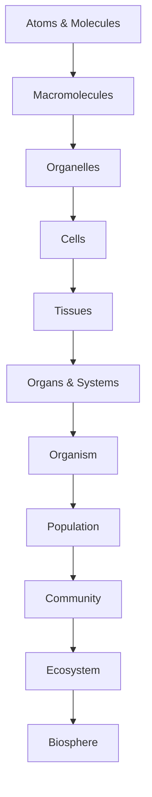

# Systems Science and the Logic of Emergence

\label{sec:unit_0_systems_science}


<!-- chapter-metadata-badge -->
> Level 2/3 · 35 min read · 50 min lecture · Prerequisites: none

---

## Learning Objectives

By the end of this chapter, students will be able to:

1. Define *system* and identify boundary, components, environment, and relationships in biological examples.
2. Describe positive and negative feedback loops and give biological examples of each.
3. Explain what emergence is and why it cannot be predicted from component-level analysis alone.
4. Apply the concepts of hierarchy, modularity, and scale to cellular and organismal biology.
5. Distinguish between linear and nonlinear system behaviour.
6. Analyse delayed feedback loops and predict whether they will damp, oscillate, or destabilise.
7. Recognise hub-heavy network structure in biological data, test scale-free claims cautiously, and explain functional implications.
8. Apply the Hill equation, the chemostat equations, and simple oscillator models to quantitative problems.

<!-- curriculum-scaffold-start -->
### Study Blueprint

- **Big idea:** Biological explanation improves when parts, interactions, feedback, and scale are kept in view together.
- **Core concepts:** systems boundaries, feedback, emergence, state variables.
- **Framework alignment:** Vision & Change: Systems, Structure and function; AP Biology: Systems Interactions; NGSS-style topics: Structure and Function, Interdependent Relationships in Ecosystems.
- **Model or quantitative lens:** Box-and-arrow causal models with explicit inputs, outputs, and feedback signs.
- **Data skill:** Translate a verbal biological system into variables, links, and testable predictions.
- **Practice cadence:** Questions and Methods, Representing and Describing Data, Argumentation.
- **Common misconception to repair:** A system is not just a list of parts; the interactions are part of the explanation.
- **Primary lab:** \cref{sec:lab_unit_0_systems_science}.
- **Question bank:** \cref{sec:q_unit_0_systems_science}.
- **Transfer task:** Apply the same feedback map to a cell, organism, and ecosystem, then name what changes at each scale.
- **Bridge to computation:** `biology.crossref_validator.validate`.
<!-- curriculum-scaffold-end -->

---

## Opening Vignette: The Birth of Systems Thinking

In 1948, Norbert Wiener published *Cybernetics: or Control and Communication in the Animal and the Machine*, arguing that the same mathematical principles of feedback and self-regulation govern thermostats, servomechanisms, and the human nervous system. Two decades later, Ludwig von Bertalanffy's *General System Theory* (1968) \citep{bertalanffy1968} proposed that most complex phenomena — from a cell to a city — share comprehensive organisational laws: openness, hierarchy, equifinality, and emergent order.

Their insight was radical: biology cannot be understood by dissecting organisms into parts and studying each in isolation. Instead, one must study *relationships* — the flows of matter, energy, and information that connect components and give rise to behaviour no component possesses alone. When Walter Cannon coined **[homeostasis](#gl:homeostasis)** in 1932 \citep{cannon1932}, he was describing a systems-level property: the blood glucose concentration of 5 mM is not a property of any single cell but an emergent steady-state of millions of feedback interactions between pancreatic β-cells, hepatocytes, skeletal myocytes, and adipocytes.

This chapter introduces the core vocabulary and conceptual toolkit of systems science — the intellectual scaffolding that unifies every subsequent chapter in this textbook. We will move from definitions (what is a system?) through dynamics (feedback, delay, oscillation, chaos) to architecture (hierarchy, modularity, hub-heavy networks), then close with information, entropy, and the practical implications of a systems perspective for biomedicine.

---

## What Is a System?

A **system** is a set of components that interact to produce collective behaviour. Three elements define any system:

- **Components** — the identifiable parts (atoms, molecules, cells, organisms, species).
- **Relationships** — the interactions and constraints between components (chemical bonds, metabolic pathways, predator–prey links).
- **Boundary** — the interface that separates the system from its environment, through which matter and energy may flow.

### Isolated, Closed, and Open Systems

| Type | Energy exchange | Matter exchange | Biological occurrence |
| ---- | --------------- | --------------- | --------------------- |
| Isolated | None | None | Idealised primarily — not found in nature |
| Closed | Yes | No | Rare; some thermal models |
| **Open** | **Yes** | **Yes** | **Most living systems** |

Most living systems are open systems. They import free energy and matter (food, sunlight), perform work, and export entropy (heat, excreta). This continuous throughput is what allows them to maintain internal order — a thermodynamic feat that distinguishes the living from the non-living.

### Equifinality and Multifinality

Bertalanffy emphasised that open systems often display **equifinality**: the same final state can be reached from different starting conditions and along different trajectories. A vertebrate embryo robustly produces the species-typical body plan despite considerable variation in initial cell positions, ploidy, or even surgical perturbation. Conversely, **multifinality** describes the same starting condition giving rise to different outcomes — identical twins acquiring distinct microbiomes, for example. Both properties contradict naive linear cause-and-effect intuition and motivate the systems-level vocabulary that follows.

> **Concept Check 1:** A surgeon removes part of an early sea-urchin embryo. The remaining cells reorganise to produce a smaller but otherwise normal larva. Identify which open-system property (equifinality, multifinality, or neither) this illustrates, and explain why a watch — a non-living complicated system — would not behave this way.

---

## Feedback: The Grammar of Self-Regulation

**Feedback** occurs when a fraction of a system's output is returned as input, altering subsequent behaviour. Biological regulation is almost entirely feedback-based.

### Negative (Stabilising) Feedback

Negative feedback opposes deviations from a set point. It is the mechanistic basis of **homeostasis**.

**Examples:**

- Body temperature regulation — warming activates sweating and vasodilation, cooling activates shivering and vasoconstriction.
- Blood glucose — rising glucose triggers insulin secretion, promoting uptake; falling glucose triggers glucagon, promoting glycogenolysis.
- [**Gene**](#gl:gene) expression — product inhibition of the first [**enzyme**](#gl:enzyme) in a biosynthetic pathway (end-product inhibition).
- Baroreceptor reflex — a fall in arterial pressure unloads stretch receptors in the carotid sinus, increasing sympathetic tone within seconds.
- Renin–angiotensin–aldosterone system — falling renal perfusion pressure activates a hormonal cascade that retains sodium and water on a slower (minutes-to-hours) timescale.

> **Connection (clinical) — glucose, insulin, and type 2 diabetes**
> Fasting plasma glucose near **5 mM** is maintained by a negative-feedback loop: β-cells release **insulin** when glucose rises; insulin increases [**GLUT4**](#gl:glut4)-mediated uptake in muscle and adipose and restrains hepatic glucose output; **glucagon** opposes insulin when glucose falls. In **type 2 diabetes mellitus**, **insulin resistance** shifts the loop: the same insulin concentration produces less effect, so higher glucose is "needed" to clear a meal; β-cells compensate until they fail. Drugs target *nodes* in this network — **metformin** (hepatic gluconeogenesis), **GLP-1 agonists** (incretin axis), **SGLT2 inhibitors** (renal glucose excretion) — illustrating how systems biology informs combination therapy rather than single-molecule "magic bullets."

### A Linear Negative-Feedback Worked Example

Consider a regulator with set point $x^* = 5$ mM, current state $x$, and proportional response

\begin{equation}
\frac{dx}{dt} = -k\,(x - x^{*}) + d(t)
\label{eq:unit_0_negative_feedback}
\end{equation}

where $k > 0$ is the gain and $d(t)$ is a disturbance. With $k = 0.5$ min$^{-1}$, an injection that lifts $x$ to 8 mM at $t = 0$ produces an exponential return $x(t) - x^{*} = 3\,e^{-0.5\,t}$ mM. The deviation halves every $\ln 2 / k \approx 1.4$ minutes. Doubling the gain to $k = 1$ min$^{-1}$ halves the half-time to 0.7 minutes. **Higher gain returns the system faster**, but delayed feedback can turn excessive gain into oscillation or instability. This trade-off — speed versus stability — is the central design problem of every physiological control system.


<!-- alt: Graph showing canonical negative-feedback control loop: set point to effector to output, with the detector returning an error signal that opposes deviation. -->

*Canonical negative-feedback control loop: set point to effector to output, with the detector returning an error signal that opposes deviation.*

> **Concept Check (Analysis):** A negative-feedback loop controlling blood glucose has a time delay $\tau$ of 15 minutes between insulin secretion and glucose uptake. Using the Barkhausen criterion for oscillation (gain $\times$ phase shift $\geq 1$ at some frequency), explain why this delay could produce insulin oscillations of approximately $2\tau$ period. What pharmacological intervention would damp the oscillations without eliminating glucose regulation?

> **Concept Check (Evaluation):** A bistable genetic switch (lac operon) shows hysteresis: it requires inducer concentration [I] > 0.8 mM to switch ON, but once ON, remains ON until [I] < 0.2 mM. (a) Sketch the bifurcation diagram (steady-state vs. [I]). (b) Explain why hysteresis is adaptive for the cell: what would happen if the switch were monostable? (c) Identify one molecular mechanism that could eliminate hysteresis, and one that could widen the hysteresis loop.

> **Worked Example --- Steady-State Analysis of a Negative-Feedback Loop:** Consider a simple model of cortisol regulation: cortisol $C$ is produced at rate $\alpha$, cleared at rate $\beta C$, and inhibits its own production with Hill coefficient $n=2$ and half-saturation $K$. The steady state satisfies $\alpha/(1+(C/K)^2) = \beta C$. With $\alpha = 100$ nM/h, $\beta = 0.5$ h$^{-1}$, $K = 50$ nM, solve for the steady-state cortisol concentration, then predict how a stress event that doubles $\alpha$ transiently shifts the steady state and how negative feedback returns it. *Solution:* Setting $100/(1+(C/50)^2) = 0.5C$ and letting $x = C/50$ gives $100/(1+x^2) = 25x \Rightarrow 4 = x(1+x^2) \Rightarrow x \approx 1.28 \Rightarrow C \approx 64$ nM. After stress doubles $\alpha$ to 200 nM/h, the new steady state satisfies $200/(1+x^2) = 25x \Rightarrow 8 = x(1+x^2) \Rightarrow x \approx 1.65 \Rightarrow C \approx 82$ nM --- a 28% increase despite a 100% increase in production. Negative feedback strongly attenuates the stress response because the Hill-2 self-inhibition concentrates around $K$.

### Positive (Amplifying) Feedback

Positive feedback amplifies deviations. It underlies rapid, switch-like biological transitions.

**Examples:**

- [**Action potential**](#gl:action-potential) initiation — sodium influx depolarises membrane, opening more Na⁺ channels (Hodgkin cycle).
- Childbirth contraction — oxytocin stimulates contractions, which stimulate more oxytocin release.
- [**Apoptosis**](#gl:apoptosis) — executioner [**caspase**](#gl:caspase)s activate upstream caspases, accelerating cell death.
- Blood-clotting cascade — thrombin generates more thrombin via factor V and factor VIII activation, producing exponential burst once a threshold is crossed.
- LH surge — rising oestradiol switches from negative to positive feedback on the hypothalamic-pituitary axis, triggering ovulation.

Positive feedback systems are inherently unstable unless ultimately bounded by a negative feedback or a hard limit (refractory period, resource exhaustion, anatomical constraint).


<!-- alt: Graph showing canonical positive-feedback loop driving rapid state transitions. -->

*Canonical positive-feedback loop driving rapid state transitions.*

> **Concept Check 2:** Childbirth and the action potential are both positive-feedback processes, yet neither runs away forever. Identify the *bounding* mechanism in each case (anatomical, refractory, or chemical) and explain why pure positive feedback without an explicit bound would be lethal.

### Feedback With Delay: Period and Damping

Real biology is rarely instantaneous. Gene expression requires [**transcription**](#gl:transcription) and [**translation**](#gl:translation) (minutes to hours); vascular responses require perfusion (seconds); neural reflexes require axonal conduction (milliseconds). A delay τ between detecting a perturbation and responding to it fundamentally changes feedback behaviour:

\begin{equation}
\frac{dx}{dt} = -k\,x(t - \tau)
\label{eq:unit_0_delay}
\end{equation}

- When $k\tau \ll 1$: the system returns smoothly to equilibrium (overdamped).
- When $k\tau \approx 1/2$: damped oscillations appear — the system overshoots, undershoots, and asymptotes over several cycles.
- When $k\tau > \pi/2$: the damping turns negative and the system breaks into **sustained oscillations** with angular frequency $\omega \approx \sqrt{k/\tau}$.

This last regime is where biological **clocks** live. Circadian oscillators (PER/CRY feedback, ~24 h), cardiac pacemakers (HCN channel gating, ~1 s), and cell-cycle oscillators (cyclin–CDK, ~24 h) most exploit delayed negative feedback to generate rhythms. The period is approximately twice the transcriptional and translational delay plus degradation lag.

**Worked Example — Circadian period from delay.** Suppose mammalian *PER* transcription takes 45 min, mRNA export and translation 30 min, and PER [**protein**](#gl:protein) degradation has half-life 6 h. The total negative-feedback delay is $\tau \approx 7.5$ h, and because oscillation period $\approx 2\pi\tau/\sqrt{k\tau}$ the characteristic rhythm lands near 24 h for plausible rate constants. [**Mutation**](#gl:mutation)s that shorten PER stability (e.g. familial advanced sleep-phase syndrome, *PER2* S662G) empirically shorten the period to ~20 h — consistent with reducing τ. This is why "biological clocks" are as much about delays as about reaction rates.

### Feed-Forward and Anticipatory Control

Purely reactive feedback can primarily correct an error after it has developed. Many biological systems add a **feed-forward** pathway that uses an upstream signal to predict and pre-empt the disturbance. Examples:

- The cephalic phase of digestion releases insulin before glucose enters the bloodstream, smoothing post-prandial spikes.
- Sensory cortex anticipates expected stimuli and subtracts prediction from input, improving signal-to-noise.
- Cerebellar internal models generate predicted motor outcomes before execution, allowing correction mid-movement.

Feed-forward without feedback is brittle — any mis-prediction persists uncorrected — so real biology layers the two. This is the formal bridge to **allostasis** (\cref{sec:unit_0_active_inference}): predictive control of internal state with dynamic set-points, anticipating rather than merely correcting.

> **Connection (clinical) — diabetic insulin pumps.** Hybrid closed-loop pumps combine continuous glucose monitoring (feedback) with announcements of meals or exercise (feed-forward). Pumps that respond purely to measured glucose chronically lag behind meals because gut absorption dynamics are faster than subcutaneous insulin uptake; adding a feed-forward "meal bolus" reduces post-prandial excursions by 30–50% without raising hypoglycaemia rates. The engineering principle is identical to the cephalic phase the body evolved millions of years ago.

---

## Emergence Across Biological Levels

**Emergence** refers to properties of a system that cannot be explained solely by properties of its components. Emergent properties are *relational* — they arise from the pattern of interaction, not from any single part.

> "The whole is more than the sum of its parts." — Aristotle, *Metaphysics* (paraphrase)

### Levels of Biological Emergence

| Level | Emergent properties | Components |
| ----- | ------------------- | ---------- |
| Molecular | Enzyme catalysis, membrane fluidity | Atoms and bonds |
| Cellular | Metabolism, replication, signalling | [**Organelle**](#gl:organelle)s and molecules |
| Tissue | Contractility, conductance, secretion | Cells |
| Organism | Consciousness, immunity, homeostasis | Tissues and organs |
| Colony / social group | Task allocation, swarm choice, nest climate regulation | Related or interacting organisms plus signals and modified habitat |
| Population | Heredity, selection, drift | Individual organisms |
| Ecosystem | Nutrient cycling, energy flow | Populations and [**abiotic**](#gl:abiotic) factors |

Social-insect colonies are useful boundary cases for this table because they sit between organism-level physiology and population-level ecology. A honeybee swarm choosing a nest site, an ant colony allocating workers to foraging trails, or a termite colony regulating mound airflow has colony-level properties that no worker possesses in isolation \citep{seeley2010honeybee,dorigo2004ant,ocko2017solar}. Calling such a colony a [**superorganism**](#gl:superorganism) is an analogy with limits, but it can be a productive systems model when the analysis names the boundary, the colony-level regulated variable, and the worker-level interactions that generate it \citep{bourke2011principles}.

### Strong and Weak Emergence

Philosophers distinguish:

- **Weak emergence** — properties are novel relative to component-level description but *in principle* derivable from it (e.g., liquidity from molecular interactions).
- **Strong emergence** — properties that cannot, even in principle, be reduced to component interaction (consciousness remains a contested candidate).

For practical biology, the key insight is that *explaining components is not the same as explaining the system*. A complete molecular catalogue of a neuron does not explain perception; a complete genome does not specify the body plan without the cytoplasmic and developmental context that interprets it.

> **Concept Check 3:** Liquidity is often given as a paradigm of weak emergence: it is not a property of any single H₂O molecule but is in principle derivable from the molecular interaction Hamiltonian. Identify *one* biological property that is plausibly weakly emergent and *one* that is contested as possibly strongly emergent. What would it take to upgrade the contested property from "we cannot yet derive it" to "it is in principle underivable"?

---

## Hierarchy and Scale

Biological organisation is **hierarchical**. Each level exhibits emergent properties relative to the level below, and is *nested* within levels above.


<!-- alt: Graph showing nested hierarchy of biological organisation, from atoms and molecules up through cells and organisms to the biosphere, each level emergent from the one below. -->

*Nested hierarchy of biological organisation, from atoms and molecules up through cells and organisms to the biosphere, each level emergent from the one below.*

### Cross-Scale Constraints

Higher-level organisation *constrains* lower-level behaviour (downward causation), while lower-level mechanisms *generate* higher-level properties (upward causation). For example:

- A cell's membrane potential (tissue-level context) constrains which genes are expressed.
- A mutation (molecular level) can alter the organismal [**phenotype**](#gl:phenotype) and hence population fitness.
- Tissue architecture constrains diffusion gradients that, in turn, pattern gene expression (developmental biology's central feedback).

### Modular Organization and Evolvable Interfaces

Living systems are modular — composed of semi-independent subsystems with defined interfaces. Modularity confers:

- **Robustness**: a failure in one module need not propagate to others.
- **Evolvability**: modules can be rewired or duplicated with limited pleiotropic effects.
- **Decomposability**: scientists can study modules in isolation (the logic underlying reductionism's power).

> **Concept Check 4:** The MAPK cascade (Ras → Raf → MEK → ERK) is often described as a module with a well-defined input (Ras activation) and output (ERK phosphorylation). List two biological consequences of this modularity — one that is *evolutionarily* useful (robust to rewiring) and one that is *clinically* worrisome (a single drug target that blocks many cell types).

> **Applied Systems / Clinical Connection — multimorbidity as boundary choice.**
> A patient with heart failure, chronic kidney disease, and type 2 diabetes is poorly represented as three isolated "organ problems." Diuretics improve pulmonary congestion but change renal perfusion and electrolyte balance; SGLT2 inhibitors alter renal glucose handling and intravascular volume; beta-blockers reshape autonomic feedback. A systems map makes the first modelling decision explicit: where is the boundary? A cardiology-focused boundary may optimise ejection fraction while missing renal compensation; a whole-patient boundary treats drug choice as intervention on coupled feedback loops. This is the practical clinical meaning of emergence, hierarchy, and allostatic regulation \citep{cannon1932,sterling2015}.

---

## Nonlinearity and Thresholds

Simple systems obey *linear* relationships: double the input, double the output. Most biological systems are **nonlinear** — small changes can produce large effects, or large changes may produce negligible effects.

Key nonlinear phenomena in biology:

| Phenomenon | Description | Example |
| ---------- | ----------- | ------- |
| Threshold effects | Response absent below a critical input, present above | Action potential firing threshold (~−55 mV) |
| Bistability | System flips between two stable states | Lac [**operon**](#gl:operon) switch; cell-cycle entry |
| Hysteresis | History-dependent state | Epigenetic gene silencing |
| Oscillations | Sustained rhythmic output | Circadian clocks; cardiac pacemakers |
| Chaos | Aperiodic but deterministic dynamics | Some cardiac arrhythmias; population cycles |

### A Simple Nonlinear Equation: The Hill Function

Cooperative binding (e.g., haemoglobin–oxygen, transcription factors) follows the **Hill equation**:

\begin{equation}
\theta = \frac{[L]^n}{K_d^n + [L]^n}
\label{eq:unit_0_hill}
\end{equation}

where θ is fractional occupancy, $[L]$ is ligand concentration, $K_d$ is the dissociation constant, and $n$ is the Hill coefficient. For $n > 1$, binding is cooperative, producing a sigmoidal (switch-like) response. The slope at half-occupancy scales with $n$, so a Hill coefficient of $n = 4$ produces a transition that is roughly four times sharper than a $n = 1$ saturable response.

### Worked Example: Calculating Cooperative Binding

**Problem:**
A dimeric transcription factor binds to DNA cooperatively with a Hill coefficient of $n = 2$. The dissociation constant $K_d$ for the DNA binding site is $5 \text{ nM}$. What fraction of target [**promoter**](#gl:promoter)s (θ) will be bound by the transcription factor when its intracellular concentration is $10 \text{ nM}$? What would the occupancy be if binding were non-cooperative ($n = 1$)?

**Solution:**

1. **Calculate occupancy for cooperative binding ($n = 2$):**

   Using the Hill equation:
   $$ \theta = \frac{[L]^n}{K_d^n + [L]^n}  \label{eq:unit_0_systems_science_item_1}$$

   Substitute $[L] = 10$ and $K_d = 5$:
   $$ \theta = \frac{10^2}{5^2 + 10^2} = \frac{100}{25 + 100} = \frac{100}{125} = 0.80  \label{eq:unit_0_systems_science_item_2}$$

   The transcription factor occupies **80%** of the promoters.

2. **Calculate occupancy for non-cooperative binding ($n = 1$):**

   $$ \theta = \frac{10^1}{5^1 + 10^1} = \frac{10}{5 + 10} = \frac{10}{15} \approx 0.67  \label{eq:unit_0_systems_science_item_3}$$

   Without cooperativity, primarily **67%** of promoters are bound.

This calculation demonstrates how positive cooperativity steepens the dose-response curve, allowing a system to switch from off (unbound) to on (bound) over a narrower range of ligand concentrations, underpinning nonlinear threshold effects in biology.

### Bistability and the Toggle Switch

Combine two mutually inhibiting genes and you obtain a **toggle switch** with two stable attractors and an unstable separator. Mathematically the rate equations look like

\begin{equation}
\frac{du}{dt} = \frac{\alpha_1}{1 + v^{n}} - u, \qquad \frac{dv}{dt} = \frac{\alpha_2}{1 + u^{n}} - v
\label{eq:unit_0_toggle}
\end{equation}

For $n > 1$ and balanced production rates $\alpha_1 \approx \alpha_2$, the system has three fixed points: $(u_{\mathrm{high}}, v_{\mathrm{low}})$, $(u_{\mathrm{low}}, v_{\mathrm{high}})$, and an unstable saddle in between. Each cell commits to one of the two outcomes as a function of initial conditions and noise — the molecular embodiment of cell-fate decision-making. Variations on this motif underlie phage λ lysis-vs-lysogeny, the lac operon's bistable response to lactose, and embryonic stem-cell differentiation.

> **Concept Check 5:** A biotechnology company engineers a synthetic toggle switch into *E. coli* and observes that, when both inducer ligands are equal, roughly half the population sits in state A and half in state B. Why does the population split rather than every cell choosing the same state? Sketch the relevant phase portrait and identify the role of stochastic gene expression noise.

---

## Nonlinear Dynamics: Bifurcations, Limit Cycles, and Chaos

The earlier feedback and bistability examples hinted at oscillations and alternative stable states. Nonlinear dynamics \citep{strogatz2018} provides the formal vocabulary for these and other behaviours.

### Phase Space and Trajectories

The **phase space** of a system is the space of possible internal states. A two-variable system (e.g. predator–prey densities, or a gene's mRNA and protein abundance) has a 2-D phase plane in which each system trajectory is a curve. **Fixed points** are states where the derivatives vanish; **limit cycles** are closed trajectories that nearby trajectories spiral towards or away from.

### Bifurcations and Qualitative State Changes

A **bifurcation** is a qualitative change in the structure of phase space as a control parameter varies. Three biologically important kinds:

- **Saddle-node (fold) bifurcation** — two fixed points (one stable, one unstable) collide and annihilate. Underlies catastrophic transitions in lake eutrophication and ecological regime shifts.
- **Hopf bifurcation** — a stable fixed point loses stability and is replaced by a small-amplitude limit cycle. Underlies the *birth* of biological oscillations (cardiac pacing, circadian rhythm onset in development).
- **Pitchfork bifurcation** — one fixed point splits into three, generating bistability. Underlies cell-fate commitment and morphogenetic symmetry breaking.

### Limit Cycles and Biological Oscillators

A **limit cycle** is a closed trajectory toward which neighbouring trajectories converge. Biological oscillators that are robustly limit-cycle:

- **Circadian clocks** (~24 h period) — TTFLs (transcription–translation feedback loops) involving *CLOCK/BMAL1* and *PER/CRY* in mammals; *KaiABC* in cyanobacteria — the latter operates without transcription, demonstrating that a phosphorylation cycle alone can implement a biological clock.
- **Cardiac pacemaker** (~1 s) — sino-atrial node cells use HCN ("funny") current and Ca²⁺ cycling; their limit cycle is robust to ±20 % perturbations of any single ionic conductance.
- **Cell-cycle oscillator** (~24 h) — cyclin synthesis and APC-mediated cyclin destruction; phosphorylation of CDK targets reaches threshold, triggers mitosis, then resets the loop.
- **Glycolytic oscillations** in yeast (~30 s–10 min) — feedback between phosphofructokinase and downstream metabolites.

### Chaos and the Lorenz Attractor

When a deterministic nonlinear system has at least three dynamical variables, sustained motion can be **chaotic** — bounded, aperiodic, and exquisitely sensitive to initial conditions. The Lorenz system

\begin{equation}
\dot{x} = \sigma(y - x), \qquad \dot{y} = x(\rho - z) - y, \qquad \dot{z} = xy - \beta z
\label{eq:unit_0_lorenz}
\end{equation}

was originally derived as a toy model of atmospheric convection but applies (with reinterpreted variables) to laser dynamics, glycolysis, and population ecology. Trajectories are confined to a butterfly-shaped **strange attractor** with non-integer (fractal) dimension. Two trajectories that start within $10^{-6}$ of each other diverge until they separate by order unity within a finite time set by the system's leading **Lyapunov exponent** λ: the separation grows like $\delta(t) \approx \delta_0 e^{\lambda t}$.

Biological chaos is documented (with varying confidence) in:

- Polymorphic ventricular tachycardia ("torsades de pointes" exhibits chaotic cardiac dynamics).
- Some EEG dynamics in seizure transitions.
- Population cycles of the Canadian lynx and Soay sheep, modulated by weather and density-dependent disease.
- Single-neuron interspike intervals in some cortical recordings.

> **Connection (clinical) — defibrillation as state-space reset.** Ventricular fibrillation can be modelled as the heart's pacemaker leaving its limit cycle and entering a chaotic regime in which thousands of small re-entrant circuits prevent coordinated contraction. A defibrillator delivers a brief, high-energy shock that depolarises essentially every myocyte simultaneously, "resetting" the system to the basin of attraction of the normal sinus-rhythm limit cycle. The intervention is a phase-space *kick*, not a chemical correction — pure dynamical-systems medicine.

> **Concept Check 6:** A phase-plane portrait shows a stable spiral that, as a parameter μ is increased past a critical value $\mu_c$, becomes encircled by a small closed orbit. (a) Name the bifurcation. (b) Predict whether the resulting oscillation amplitude depends linearly or quadratically on $\mu - \mu_c$ near the bifurcation. (c) Name one cardiac or circadian disorder consistent with a Hopf bifurcation gone wrong.

---

## Biological Oscillators: From Genes to Heartbeats

Biological oscillators are textbook applications of delayed negative feedback (\cref{eq:unit_0_delay}) and limit-cycle dynamics.

### The Circadian Clock

The mammalian circadian clock is a **transcription–translation feedback loop** (TTFL). CLOCK and BMAL1 heterodimerise and activate transcription of *Per1*, *Per2*, *Cry1*, and *Cry2*. PER and CRY proteins accumulate, translocate to the nucleus, and inhibit CLOCK/BMAL1, closing a negative-feedback loop with a delay set by transcription, translation, dimerisation, and post-translational modification (notably casein-kinase-1ε phosphorylation of PER). Mutations that alter CK1ε or PER2 phosphorylation sites shift the clock's period from the wild-type ~24 h to as little as 20 h or as much as 28 h, providing molecular evidence for the delay-period relationship of \cref{eq:unit_0_delay}.

### The Cardiac Pacemaker

Sino-atrial node cells lack a true resting potential. Instead, their membrane potential oscillates between roughly −60 mV (maximum diastolic potential) and 0 mV (peak of action potential). Three ionic currents — funny current $I_f$, T-type Ca²⁺ current $I_{Ca,T}$, and L-type Ca²⁺ current $I_{Ca,L}$ — operate on different timescales to generate the pacemaker limit cycle, which is robust to ±20 % changes in any one conductance.

### The Cell Cycle

In rapidly dividing cells the cyclin–CDK system is the master oscillator. M-cyclin accumulates linearly during interphase; once a threshold is reached, M-CDK activity is amplified by a positive-feedback bistable switch (Wee1 inactivation, Cdc25 activation), driving entry into mitosis. APC/C-mediated cyclin destruction collapses M-CDK activity, the bistable switch flips back, and the cycle resets. This is a **relaxation oscillator**: a slow build-up followed by a fast release, mathematically distinct from the harmonic oscillation of the circadian clock.

### Shared Feedback Architecture of Biological Oscillators

| Oscillator | Period | Mechanism class |
| ---------- | ------ | --------------- |
| Circadian (PER/CRY) | ~24 h | Delayed transcriptional negative feedback |
| Cardiac (SAN) | ~1 s | Coupled ionic currents, limit cycle |
| Cell cycle (cyclin–CDK) | hours–days | Relaxation oscillator with bistable switch |
| Glycolysis (yeast PFK) | seconds–minutes | Allosteric metabolic feedback |
| Calcium spikes | seconds | IP3R/RyR feedback with diffusion |

The lesson: oscillators are not exotic; they are nature's default solution to the problem of *temporal coordination*, and the same handful of feedback architectures appears across kingdoms and timescales.

---

## Scale-Free Networks in Biology

Many biological networks are **hub-heavy** rather than random: a few nodes have many interactions, while most nodes have few. Some datasets are well approximated by **scale-free** degree distributions, $P(k) \propto k^{-\gamma}$, but the universality of strict power laws is contested and depends on sampling, curation, and statistical testing \citep{barabasi1999,barabasi2004network,broido2019scalefree}. The durable biological lesson is therefore not "everything is scale-free"; it is that hub structure, modularity, and heavy-tailed connectivity can change robustness, vulnerability, and controllability.

Biologically validated examples include:

- **Protein–protein interaction networks** of yeast, fly, and human (γ ≈ 2.5).
- **Metabolic networks** — substrates such as ATP, NADH, and water are hubs connecting hundreds of reactions.
- **Gene-regulatory networks** — master regulators like *p53* or *MYC* control hundreds of downstream targets.
- **Food webs** — apex species with broad diets contrast with specialist links.
- **Brain connectomes** — cortical "rich-club" hubs disproportionately interconnect distant brain regions.

### Mechanisms Generating Scale-Free Biological Networks

Two mechanisms can generate scale-free-like or hub-heavy architecture:

1. **Preferential attachment** — new nodes preferentially connect to already-popular nodes (Barabási-Albert model). In biology this maps onto **gene duplication**: a duplicated gene inherits its parent's interaction partners, so highly-connected proteins beget more highly-connected proteins.
2. **Optimisation under cost-and-benefit** — connections have wiring cost; a few high-degree hubs minimise total path length while limiting cost.

### Functional Consequences of Hub-Dominated Networks

| Property | Random network | Scale-free network |
| -------- | -------------- | ------------------ |
| Robustness to random failure | Fragile | Robust (random hits usually miss hubs) |
| Robustness to targeted attack on hubs | Robust | Fragile |
| Path length between random nodes | $\propto \ln N$ | $\propto \ln \ln N$ (ultra-small) |
| Clustering coefficient | Low | High |

This has direct biomedical implications. *Random* genetic perturbations (background mutation rates) usually miss hubs, so cells tolerate them. But *targeted* perturbation of hub proteins — exactly what cancer-driver mutations and many viral effectors do — can cripple the network. The same logic underlies the success of TP53, MYC, and KRAS as cancer drivers: they sit at network hubs.

> **Connection (medical) — antibiotic targets and the metabolic hub.** Many successful antibiotics target hub enzymes in bacterial metabolism (e.g. RNA polymerase, ribosome, dihydrofolate reductase). Hubs are tempting because perturbing one node disables many downstream pathways; they are also dangerous because human homologues, where they exist, suffer comparable disruption — explaining the side-effect profiles of trimethoprim or rifampin.

---

## Information, Entropy, and Self-Organisation

Living systems process **information**: they detect signals (genetic, chemical, mechanical, photonic) and use that information to generate ordered responses. From a thermodynamic perspective:

\begin{equation}
\Delta G = \Delta H - T\Delta S
\label{eq:unit_0_gibbs}
\end{equation}

Life builds local order (decreases local entropy) by doing work, and in so doing increases entropy of the surroundings. Self-organisation — spontaneous formation of ordered structures — occurs when energy dissipation enables pattern formation (e.g., Bénard cells, Turing patterns in morphogenesis, the spiral waves of slime-mould aggregation).

### Shannon Information and Biological Signal Content

Claude Shannon defined the information content of a discrete probability distribution as

\begin{equation}
H(X) = -\sum_{i} p_i \log_2 p_i
\label{eq:unit_0_shannon}
\end{equation}

with units of bits when the logarithm is base 2. A signalling pathway that distinguishes "ligand absent" from "ligand present" carries at most one bit; a four-state developmental switch carries at most two; a transcription factor that selects among 1000 target promoters carries up to ~10 bits. Empirical studies of cytokine signalling pathways suggest mammalian cells extract on the order of 1 bit per pathway from ligand concentration — far less than the upper bound, because biological noise eats most of the channel capacity.

### Mutual Information and Signalling Fidelity

The **mutual information** $I(X; Y) = H(Y) - H(Y \mid X)$ measures how much knowing the input $X$ reduces uncertainty about output $Y$. For a noisy biological channel,

\begin{equation}
I(X; Y) = \frac{1}{2} \log_2 \!\left( 1 + \frac{\sigma_{\mathrm{signal}}^{2}}{\sigma_{\mathrm{noise}}^{2}} \right)
\label{eq:unit_0_mutual_info}
\end{equation}

Doubling the signal-to-noise ratio adds about half a bit. The diminishing returns of this expression explain why cells often build *parallel* signalling channels (multiple receptor tyrosine kinases, multiple cytokine receptors) rather than refining one channel indefinitely — additional channels add capacity additively, not logarithmically.

> **Concept Check 7:** A yeast cell at steady state maintains an intracellular K⁺ concentration of 140 mM against an extracellular concentration of 5 mM. From the perspective of the second law of [**thermodynamics**](#gl:thermodynamics), is this local concentration gradient a violation of entropy increase? Identify the ultimate entropy source and the thermodynamic machinery (at least two molecular components) that sustains the gradient.

> **Concept Check 8:** Empirical estimates suggest a single mammalian cytokine pathway carries about 1 bit of mutual information about ligand concentration. What does this imply about the distinguishability of "low," "medium," and "high" concentrations from a single pathway alone, and why might inflammation cascades evolve to use multiple cytokines rather than ever-finer measurements of one?

---

## Systems Thinking in Biology: Practical Implications

| Principle | Biomedical implication |
| --------- | ---------------------- |
| Emergence | Drug targets must be evaluated in system context, not in isolation |
| Feedback | Blocking one regulatory loop often activates compensatory loops |
| Hierarchy | A mutation's effect depends on its network context |
| Nonlinearity | Dose–response curves are rarely linear; threshold effects matter |
| Modularity | Synthetic biology exploits modular parts to engineer novel circuits |
| Scale-free | Hub targeting is potent but risks broad collateral damage |

### From Hill kinetics to a computational switch

The earlier nonlinear-threshold discussion introduced the **Hill equation** as a model of cooperative binding. The same mathematics appears when transcription factors bind clustered sites, when oxygen binds haemoglobin, and when receptors oligomerise. Running the project code makes the **threshold** tangible:

```python
from biology.cell.cell_biology import hill_equation

kd, n = 10.0, 3.0
for L in (1.0, 5.0, 10.0, 20.0):
    theta = hill_equation(ligand_concentration=L, kd=kd, hill_coefficient=n)
    print(f"[L] = {L:5.1f} µM  →  fractional occupancy θ = {theta:.3f}")
```

For **n > 1**, a narrow concentration band separates "mostly off" from "mostly on" — the molecular implementation of a **bistable** or **switch-like** response that subsequent units link to gene circuits, metabolism, and neural firing.

### Feed-forward and feedback motifs in gene networks

Beyond simple loops, **network motifs** \citep{alon2019} recur in transcriptional regulation: **coherent feed-forward loops** (two parallel paths to the same target, both activating or both repressing) can filter noise and enforce delays; **incoherent feed-forward loops** can generate pulses or adaptation. These motifs appear thousands of times in *E. coli* and yeast regulatory graphs. Recognising them helps you predict how a drug that blocks one edge may reroute flux through another — the **compensatory feedback** that often limits single-target therapy. Tyson, Chen and Novak \citep{tyson2003} catalogue the recurring "sniffers, buzzers, toggles and blinkers" of cell biology, each of which corresponds to a small network motif with a stereotyped temporal signature.

### Why systems biology is not "fancy reductionism"

A naive reading of systems biology is that it builds bigger models of more parts. The deeper claim is methodological: certain *questions* (will the loop oscillate? Is the basin deep enough to resist noise? Does the network tolerate hub deletion?) cannot be answered by any amount of better single-component data. They require *system-level* metrics — gain, delay, basin depth, Lyapunov exponent, mutual information — which primarily acquire meaning at the level of the assembled system. Reductionism delivers parts; systems biology delivers grammars.

---

## Current Evidence and Frontier Biology: Systems Science and the Logic of Emergence

For **Systems Science and the Logic of Emergence**, frontier biology belongs inside the evidence logic of
the chapter. Systems models are useful when they expose assumptions, uncertainty, and failure modes rather than merely producing elegant diagrams. The core reading question is this: system boundary choice, feedback sign, and scale determine whether a model explains or hides the biology.

- **What to verify:** identify the observation, model, assay, or dataset that
  would make the claim stronger or weaker.
- **What to qualify:** state the scale, organism, cell type, environmental
  condition, or population where the claim is expected to hold.
- **What to compare:** test at least one alternative explanation, baseline, or
  null model before treating the pattern as causal.
- **What to cite:** distinguish primary evidence, review synthesis, public
  dataset, and institutional guidance; for recent or numeric claims, prefer
  the source closest to the measurement and state what has changed since it was
  published.

For systems claims, identify the regulated variable, feedback sign, sensor, comparator, effector, and delay before naming a loop or emergent property.

Single-cell and spatial technologies now sharpen that source practice: a modern systems-biology claim should ask which scale was actually measured, whether the tissue context was preserved, and how perturbation closes the loop between discovery and mechanism \citep{fischer2025systemsbio}. A beautiful network inferred from snapshots is a hypothesis until perturbation, time-series, or independent validation tests its causal edges.

**Source practice:** Use control, network, perturbation, or measurement sources that expose system boundaries and feedback evidence rather than treating a diagram as proof.

## Unit 0 Integration: Using Systems Science Without Overclaiming

Systems language is powerful because it travels across scales, but that portability can become vagueness. Before calling something a system, write down four commitments:

1. **Boundary:** what is inside, what is outside, and what crosses the boundary?
2. **State variables:** what quantities describe the system well enough to answer the question?
3. **Interactions:** which edges are causal, which are correlations, and which are unknown?
4. **Timescale:** what changes fast, what changes slowly, and what has already been assumed constant?

This checklist connects the rest of this opening unit. \nameref{sec:unit_0_complex_adaptive_systems} asks what happens when many bounded systems act as agents. \nameref{sec:unit_0_active_inference} asks when the boundary can be formalised as a Markov blanket with sensory and active states. \nameref{sec:unit_0_history_philosophy_biology} asks how boundaries, variables, and mechanisms became accepted scientific categories in the first place.

### Failure Modes of Systems Explanations

A systems explanation is weak when it merely renames complexity. "Everything is connected" is not a model. A usable systems claim should predict what happens when one connection is cut, one delay is shortened, one module is isolated, or one boundary is redrawn. If none of those perturbations would change the explanation, the diagram is decorative rather than explanatory.

## Summary

- A system is defined by components, relationships, and boundary; equifinality and multifinality distinguish living open systems from contrived isolated ones.
- Most living systems are open systems that import free energy and export entropy.
- Negative feedback achieves homeostasis; positive feedback generates rapid transitions; delay turns stabilising loops into oscillators.
- Emergent properties arise from patterns of interaction and cannot be reduced to component properties alone.
- Emergence also appears at colony scale: social-insect colonies can regulate nest climate, food discovery, or collective choice through worker interactions and environmental signals.
- Biological organisation is hierarchical, modular, predominantly nonlinear, and often hub-heavy; strict scale-free claims require explicit statistical tests.
- Bifurcations classify how qualitative dynamical behaviour changes — saddle-node (catastrophes), Hopf (oscillation onset), pitchfork (symmetry-breaking commitment).
- Biological oscillators (circadian, cardiac, cell-cycle) realise delayed-feedback limit cycles; chaos appears in some cardiac and population dynamics.
- Hill-type cooperativity implements sharp molecular thresholds; the toggle switch implements bistable cell-fate decisions; network motifs (feed-forward loops) shape dynamics and compensation under perturbation.
- Information theory bounds how much a noisy biological channel can convey, motivating parallel rather than refined signalling architecture.

---

## Key Terms

**system** · **emergence** · **negative feedback** · **positive feedback** · **homeostasis** · **allostasis** · **hierarchy** · **modularity** · **nonlinearity** · **bistability** · **bifurcation** · **limit cycle** · **chaos** · **Lyapunov exponent** · **scale-free network** · **hub** · **self-organisation** · **superorganism** · **Hill equation** · **toggle switch** · **open system** · **network motif** · **feed-forward loop** · **mutual information** · **equifinality**

---

## Discussion Questions

1. Name a biological process at each of three hierarchical levels (molecular, cellular, organismal). For each, identify what would be lost by studying primarily the level below it.

2. Describe a biological example of hysteresis — a system where the current state depends on history, not just the present inputs. How might hysteresis contribute to cell identity or memory?

3. The bacterium *E. coli* regulates the *lac* operon with a bistable switch: cells either fully express or fully repress the operon, with very few in intermediate states. Why might bistability be advantageous compared to a graded (linear) response? Under what physiological contexts might a graded response be preferred?

4. A patient takes a drug that blocks a key kinase in an oncogenic signalling pathway. Initial tumour regression is observed, but within months the tumour re-grows. Propose at least two systems-level mechanisms (feedback compensation, alternative pathway activation, or selection) that could explain this relapse. How would systems science inform rational combination therapy?

5. Turing patterns — periodic spatial self-organisation arising from reaction–diffusion kinetics — have been proposed to explain animal coat markings, digit spacing, and hair follicle arrangement. What does the existence of Turing patterns in biology suggest about the relationship between physics, chemistry, and life?

6. Sketch the glucose–insulin–glucagon feedback graph. Annotate where metformin, GLP-1 receptor agonists, and SGLT2 inhibitors act. Why might adding a second drug class outperform doubling the dose of one class?

7. Using the Hill equation with $n = 4$ and $K_d = 8\,\mu\text{M}$, estimate θ at $[L] = 4\,\mu\text{M}$ and at $[L] = 16\,\mu\text{M}$. How does cooperativity sharpen the transition compared with $n = 1$?

8. Explain how a delay τ in a negative-feedback loop with gain $k$ can convert a stable equilibrium into a sustained oscillation. Use the conditions $k\tau \ll 1$, $k\tau \approx 1/2$, and $k\tau > \pi/2$ to predict three qualitatively different behaviours and give a biological example of each.

9. Protein–protein interaction networks often contain hubs, even when a strict scale-free law is not established. Why can hub-heavy architecture make cells robust to many random gene losses yet vulnerable to perturbations that target hub proteins (e.g., adenovirus E1B targeting p53)? How would you design an antiviral that exploits this asymmetry without overclaiming the network model?

10. The cardiac pacemaker is extraordinarily robust to ±20% perturbation of any single ionic conductance. Why might this robustness be a general property of well-designed limit-cycle oscillators, and what does it predict about the genetic redundancy you would expect to find in clock genes?

---

## Review Questions

1. State the three elements that define any system (components, relationships, boundary) and classify isolated, closed, and open systems by their matter and energy exchange. Why are most living systems necessarily open?

2. Define equifinality and multifinality and give a biological example of each. Explain why a surgically reduced sea-urchin embryo producing a normal small larva illustrates equifinality, whereas a damaged watch does not behave this way.

3. Contrast negative and positive feedback by sign and biological role. For one positive-feedback process (action potential, childbirth, or the clotting cascade), identify the explicit bounding mechanism and explain why unbounded positive feedback would be lethal.

4. Using the delayed-feedback equation $dx/dt = -k\,x(t-\tau)$, predict the qualitative behaviour for $k\tau \ll 1$, $k\tau \approx 1/2$, and $k\tau > \pi/2$. Explain why biological clocks (circadian, cardiac, cell-cycle) live in the last regime and how shortening PER stability shortens the circadian period.

5. Using the Hill equation with $K_d = 5$ nM and a dimeric ($n=2$) transcription factor at $[L]=10$ nM, compute fractional occupancy, then recompute for $n=1$. Explain quantitatively how cooperativity sharpens a dose–response curve into a switch.

6. Distinguish weak from strong emergence. Give one biological property that is plausibly weakly emergent and one that is contested as possibly strongly emergent, and state what evidence would upgrade the contested case from "not yet derivable" to "in principle underivable."

7. Compare saddle-node, Hopf, and pitchfork bifurcations by what happens to fixed points and which biological transition each underlies (catastrophic regime shift, oscillation onset, cell-fate commitment). For a stable spiral that gains a small limit cycle as a parameter crosses $\mu_c$, name the bifurcation and a disorder consistent with it failing.

8. Explain why hub-heavy protein-interaction networks can be robust to random gene loss but fragile to targeted hub attack. Use this asymmetry to explain why TP53, MYC, and KRAS are potent cancer drivers and to propose the logic of a hub-exploiting antiviral.

9. Evaluate, using the mutual-information expression $I = \tfrac12\log_2(1 + \sigma^2_{\text{signal}}/\sigma^2_{\text{noise}})$, why a single cytokine pathway conveying ~1 bit cannot reliably distinguish "low/medium/high" concentrations, and why evolution favours parallel signalling channels over ever-finer measurement of one channel.

10. Synthesis: the chapter argues systems biology is "not fancy reductionism." Defend or challenge this claim by identifying at least three system-level metrics (e.g. gain, delay, basin depth, Lyapunov exponent, mutual information) that acquire meaning primarily at the assembled-system level, and give a concrete question that no amount of better single-component data could answer.

---

## Further Reading and Source Notes: Systems Science and the Logic of Emergence

- Bertalanffy, L. von (1968). *General System Theory* \citep{bertalanffy1968}. Braziller.
- Strogatz, S. H. (2018). *Nonlinear Dynamics and Chaos* (2nd ed.) \citep{strogatz2018}. Westview Press.
- Tyson, J. J., Chen, K. C., & Novak, B. (2003). Sniffers, buzzers, toggles and blinkers: dynamics of regulatory and signalling pathways in the cell \citep{tyson2003}. *Current Opinion in Cell Biology*, 15(2), 221–231.
- Alon, U. (2019). *An Introduction to Systems Biology: Design Principles of Biological Circuits* (2nd ed.) \citep{alon2019}. CRC Press.
- Cannon, W. B. (1932). *The Wisdom of the Body* \citep{cannon1932}. W. W. Norton.
- Mitchell, P. (1961). Coupling of phosphorylation to electron and hydrogen transfer by a chemi-osmotic type of mechanism \citep{mitchell1961}. *Nature*, 191, 144–148. *(A worked example of a feedback motif powering metabolism.)*

---

## Companion Source Module: Systems Science and the Logic of Emergence

**Systems Science and the Logic of Emergence** should leave a reproducible trail from a biological claim to
the code, figure, diagram, or paper-based activity that can test it. Use the
surfaces below to inspect the chapter's assumptions, rerun the relevant model,
or compare the manuscript explanation with companion labs and figures.

| Surface | Use it for |
| --- | --- |
| `src/biology/cell/cell_biology.py` (`hill_equation`, `receptor_occupancy`, `signal_amplification`) | Turn feedback, thresholds, and signalling gain into inspectable calculations. |
| `src/biology/ecology/ecology.py` (`logistic_growth`) | Compare linear intuition with bounded growth and carrying-capacity dynamics. |
| `src/biology/biochemistry/biochemistry.py` (`reaction_free_energy`) | Connect system directionality to thermodynamic constraints. |
| `src/visualization/plots.py` (`plot_logistic_growth`) and `src/mermaid/biology_diagrams.py` (`population_growth_stages_diagram`) | Check whether graphical summaries preserve the same model assumptions. |

**Reproducibility check:** change one parameter at a time, record the sign of the response, and explain whether the result reflects feedback, saturation, or an arbitrary boundary choice. **Cross-reference:** pair this with \cref{sec:unit_0_complex_adaptive_systems}, \cref{sec:unit_III_bioenergetics_and_respiration}, and \cref{sec:unit_X_population_ecology}.
