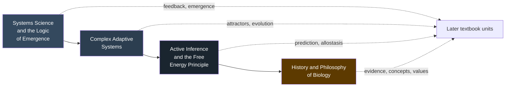

# Unit 0 — Systems Science and the Biology of Complexity: Introduction {.unnumbered}

\label{sec:unit_0_unit_intro}
**\nameref{sec:unit_0_unit_intro} · Introduction**

---

## Why This Unit Matters {.unnumbered}

The modern study of biology began by reducing living phenomena to their smallest parts — cells, molecules, genes. This reductionist strategy yielded extraordinary insight. Yet the more we learned about individual components, the clearer it became that biology cannot be explained by parts alone: a neuron firing is not a thought, a gene is not a behaviour, a metabolic pathway is not a cell. What emerges from the *interaction* of parts — properties no single component possesses in isolation — is the subject of **systems science**.

\nameref{sec:unit_0_unit_intro} introduces four interlocking frameworks that recur in every subsequent unit:

1. **Systems science** — the general theory of organised complexity: how hierarchical systems form, how feedback governs their behaviour, how new properties emerge.
2. **Complex adaptive systems** — how populations of agents with local rules give rise to robust, evolvable, collective behaviour.
3. **Active inference and the free energy principle** — a mathematically grounded account of how living agents maintain themselves by predicting and acting on their environments.
4. **History and philosophy of biology** — the source-critical practice of asking where biological concepts came from, what they assume, and how evidence and values revise them.

Reading \nameref{sec:unit_0_unit_intro} is optional but recommended: it supplies the vocabulary of emergence, attractors, bifurcations, allostasis, and precision that makes \nameref{sec:unit_I_unit_intro} through \nameref{sec:unit_X_unit_intro} fit together as a single coherent theory of living organisation.

---

## Landmark Discoveries {.unnumbered}

| Year | Contribution | Significance |
| ---- | ------------ | ------------ |
| 1867 | Hermann von Helmholtz — *Handbook of Physiological Optics* | First framing of perception as unconscious inference |
| 1932 | Walter Cannon — *The Wisdom of the Body* | Coined *homeostasis*; proposed regulated internal milieu |
| 1948 | Norbert Wiener — *Cybernetics* | Formalised feedback control; bridged engineering and biology |
| 1968 | Ludwig von Bertalanffy — *General System Theory* | Articulated open systems and hierarchy across disciplines |
| 1977 | Ilya Prigogine — Nobel in Chemistry | Dissipative structures and non-equilibrium self-organisation |
| 1987 | Per Bak, Tang & Wiesenfeld — *Phys. Rev. Lett.* | Self-organised criticality and power-law scaling in CAS |
| 1992 | John Holland — *Adaptation in Natural and Artificial Systems* | Genetic algorithms; formal CAS framework |
| 2010 | Karl Friston — *Nature Rev. Neurosci.* | Free energy principle as a unified theory of brain function |
| 2015 | Peter Sterling — *Allostasis* | Proactive predictive regulation, contrasting homeostasis |

---

## Key Concepts and Connections {.unnumbered}

- **System** — a set of interacting components forming an integrated whole; open systems exchange matter and energy with their environment.
- **Emergence** — properties of a system that cannot be explained solely by properties of its components (e.g., consciousness emerges from neural circuits; life emerges from biochemistry).
- **Feedback** — output fed back as input, shaping future behaviour; negative feedback stabilises, positive feedback amplifies.
- **Attractor** — a region of phase space toward which trajectories converge; phase transitions move a system between attractors.
- **Complex adaptive system (CAS)** — a system of adaptive agents whose collective behaviour self-organises without central control.
- **Free energy** — a variational upper bound on surprise; minimising it unifies perception, action, and learning.
- **Homeostasis vs. allostasis** — passive correction to a fixed set-point vs. predictive adjustment of set-points based on context.

These ideas are deliberately general: every subsequent unit of the textbook re-encounters them. Feedback appears in enzyme regulation (\nameref{sec:unit_I_unit_intro}), in signalling cascades (\nameref{sec:unit_II_unit_intro}), in metabolic flux (\nameref{sec:unit_III_unit_intro}), in population dynamics (\nameref{sec:unit_X_unit_intro}), and in neural control (\nameref{sec:unit_IX_unit_intro}). Attractors describe cell-fate decisions (\nameref{sec:unit_II_unit_intro}), bistable genetic switches (\nameref{sec:unit_IV_unit_intro}), and ecosystem stable states (\nameref{sec:unit_X_unit_intro}). Active inference recurs as the unifying framework for physiology (\nameref{sec:unit_IX_unit_intro}) and behaviour.

---

## Current Evidence Thread {.unnumbered}

Systems-science and complexity claims are not evidenced the way a single-gene knockout is; the evidence is whether a model's assumptions survive contact with data. A claim earns confidence when its generative model exposes the parameters and boundary that matter, when a perturbation or time-series test could have falsified it but did not, and when an explicit null or alternative model fails where it succeeds. Across this unit — emergence, adaptive agents, active inference, and the history/philosophy of biological concepts — read each idea as such a model and ask what observation would move you. As you
move through the chapters, keep a two-column note: **claim** on the left,
**evidence that would change my confidence** on the right. By the end of the
unit, each major idea should be tied to a measurement, model, citation, or
paper-based lab decision.

## Chapter Roadmap {.unnumbered}

<!-- alt: Graph showing the opening-unit roadmap: systems science introduces feedback and emergence, complex adaptive systems adds attractors and evolution, active inference connects prediction and allostasis, and history/philosophy connects evidence, concepts, and values to later units. -->

*\nameref{sec:unit_0_unit_intro} roadmap: systems science introduces feedback and emergence, complex adaptive systems adds attractors and evolution, active inference connects prediction and allostasis, and history/philosophy connects evidence, concepts, and values to later units.*

| Chapter | Core question | Key tools |
| ------- | ------------- | --------- |
| 0.1 Systems Science | *How does organisation arise from interaction?* | Feedback, hierarchy, Hill equation, delay oscillation |
| 0.2 Complex Adaptive Systems | *How do simple local rules produce robust global behaviour?* | Phase space, bifurcation, fitness landscape, power laws |
| 0.3 Active Inference | *How do living agents maintain themselves against disorder?* | Bayesian inference, free energy, precision, allostasis |
| 0.4 History and Philosophy of Biology | *How did biology's concepts, evidence practices, and values become what they are?* | Source analysis, mechanism/function, individuality, model critique |

---

## Connections Across the Textbook {.unnumbered}

- **\nameref{sec:unit_I_unit_intro} — Chemistry of Life**: thermodynamic gradients (\cref{sec:unit_0_systems_science}) explain why proteins fold spontaneously; catalysis is a feedback-regulated modular system.
- **\nameref{sec:unit_II_unit_intro} — The Cell**: organelles are modules; the fluid-mosaic membrane is a self-organised phase; signalling cascades are hierarchical feedback loops.
- **\nameref{sec:unit_III_unit_intro} — Energy and Metabolism**: glycolysis and the TCA cycle are classic examples of allosteric feedback and feed-forward control.
- **\nameref{sec:unit_IV_unit_intro}–V — Genetics**: regulatory networks, bistable switches, and epigenetic memory are CAS par excellence.
- **\nameref{sec:unit_VI_unit_intro} — Evolution**: fitness landscapes from \cref{sec:unit_0_complex_adaptive_systems} are the formal substrate of selection.
- **\nameref{sec:unit_VII_unit_intro} — Microbiology**: biological-self questions from \cref{sec:unit_0_history_philosophy_biology} clarify microbiomes, symbiosis, pathogens, and host boundaries.
- **\nameref{sec:unit_IX_unit_intro} — Physiology and Neuroscience**: allostasis from \cref{sec:unit_0_active_inference} and predictive coding replace simple fixed-set-point homeostasis as the model of central control.
- **\nameref{sec:unit_X_unit_intro} — Ecology**: phase transitions, alternative stable states, and tipping points apply the mathematics of \cref{sec:unit_0_complex_adaptive_systems} directly.

---

## Computational Toolbox — Unit 0 {.unnumbered}

The four \nameref{sec:unit_0_unit_intro} chapters are conceptual rather than algorithmic, but they motivate every piece of code and evidence check used later:

- **Hill cooperative binding:** cell-biology helpers, especially `hill_equation()`.
- **Receptor occupancy:** cell-signalling helpers for ligand binding and response.
- **Logistic dynamics:** ecology helpers for growth under carrying capacity.
- **Lotka–Volterra oscillation:** ecology helpers for predator–prey cycles.
- **Bayesian update:** neuroscience-style posterior inference, illustrated in \cref{sec:unit_0_active_inference}.
- **Source and citation closure:** table-of-contents, bibliography, cross-reference, and curriculum helpers that keep claims traceable across chapters, labs, and question banks.

Each concrete chapter later in the textbook either uses one of these helpers or gives the reader a chance to write the next one.

---

*Source modules: `src/biology/` (general framework across most domains).*
*Figures: `src/mermaid/biology_diagrams.py` — systems-level diagrams reused throughout the book.*

## Cross-Unit Integration {.unnumbered}

\nameref{sec:unit_0_unit_intro} closes by foreshadowing the chemistry to come. The thermodynamic gradients, feedback regulation, and emergent-property arguments you just met are not abstract — they will reappear in \nameref{sec:unit_I_unit_intro} as the physical reason why proteins fold spontaneously, why enzymes shift activation-energy landscapes without changing equilibria, and why membrane lipids self-assemble into bilayers without any genetic "instruction." The free-energy minimization framework that organized this unit's discussion of active inference is the same Gibbs free energy that determines whether a covalent bond forms or hydrolyzes. When you encounter \nameref{sec:unit_I_unit_intro}'s chemistry, read it not as a separate vocabulary but as the molecular substrate where the systems principles of \nameref{sec:unit_0_unit_intro} are first realized in matter.
