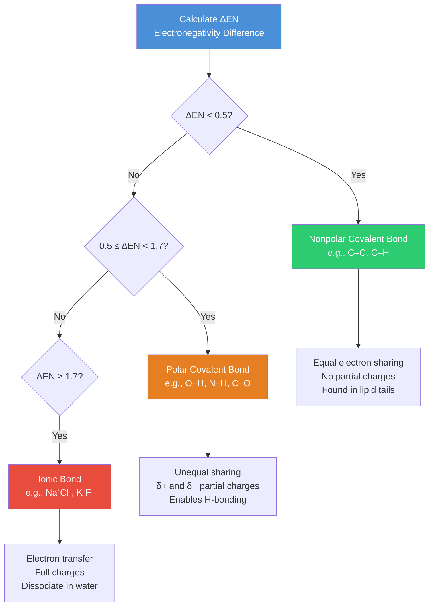
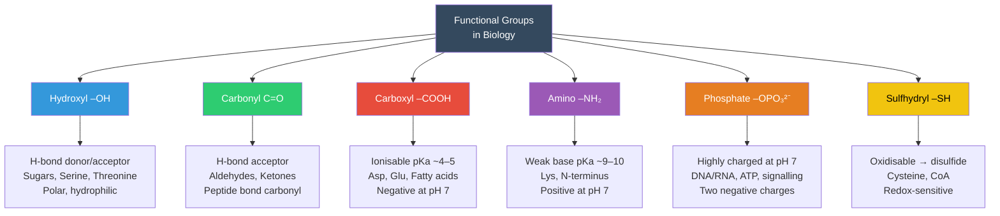
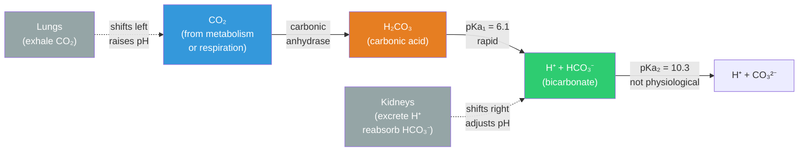

# Atoms, Molecules, and Chemical Bonds

\label{sec:unit_I_atoms_molecules}


<!-- chapter-metadata-badge -->
> **Ch 1** · Level 1/3 · 40 min read · 50 min lecture · Prerequisites: none

## Learning Objectives

By the end of this chapter, you should be able to:

1. Describe the structure of an atom, including subatomic particles and their quantum mechanical behaviour.
2. Explain how [**electronegativity**](#gl:electronegativity) governs covalent and ionic bond formation.
3. Distinguish between polar covalent, nonpolar covalent, and ionic bonds with biological examples.
4. Explain the roles of [**hydrogen bond**](#gl:hydrogen-bond)s and [**van der Waals forces**](#gl:van-der-waals-forces) in biological macromolecules.
5. Interpret the concept of [**pH**](#gl:ph), [**buffer**](#gl:buffer)s, and their physiological significance.
6. Describe [**chirality**](#gl:chirality) and stereoisomerism in biological molecules.
7. Explain redox reactions and their central role in bioenergetics.
8. Apply isotope chemistry to biomedical imaging and radiotherapy.

<!-- curriculum-scaffold-start -->
### Study Blueprint

- **Big idea:** Atomic structure constrains the bonds, charges, and geometries that make biological molecules possible.
- **Core concepts:** valence, electronegativity, formal charge, isotopes.
- **Framework alignment:** Vision & Change: Structure and function, Pathways and transformations of energy and matter; AP Biology: Energetics, Systems Interactions; NGSS-style topics: Matter and Energy in Organisms and Ecosystems, Structure and Function.
- **Model or quantitative lens:** Formal charge and electronegativity-difference reasoning.
- **Data skill:** Use tabular atomic data to predict polarity, solubility, and biological reactivity.
- **Practice cadence:** Concept Explanation, Statistical Tests and Data Analysis, Argumentation.
- **Common misconception to repair:** Weak interactions are not unimportant; many weak interactions together dominate structure and specificity.
- **Primary lab:** \cref{sec:lab_unit_I_atoms_molecules}.
- **Question bank:** \cref{sec:q_unit_I_atoms_molecules}.
- **Transfer task:** Use atomic reasoning to explain a medical tracer, enzyme cofactor, or membrane-solubility problem.
- **Bridge to computation:** `biology.biochemistry.biochemistry.atp_free_energy`.
<!-- curriculum-scaffold-end -->

---

> **Opening Vignette: The Radioactive Tracer That Exposed Cancer**
>
> In 1973, chemist Alfred Wolf and colleagues at Brookhaven National Laboratory synthesised a new
> molecule: fluorine-18-labelled deoxyglucose ($^{18}$F-FDG). Because $^{18}$F decays with a
> half-life of just 109.8 minutes, emitting a positron that collides with a nearby electron to
> produce a pair of detectable gamma rays, the molecule could be tracked in real time inside a
> living body. Because FDG mimics glucose, metabolically hungry cells take it up — and cancer cells,
> with their vastly elevated glucose consumption (the **Warburg effect**, first described by Otto
> Warburg in 1924 \citep{warburg1924carcinomzelle}), accumulate it at concentrations 2–10× higher than surrounding normal tissue.
>
> Today, PET (positron emission tomography) scanning using $^{18}$F-FDG is performed over 2 million
> times per year in the United States alone, guiding cancer diagnosis, staging, and treatment
> response assessment. None of it would be possible without understanding the atomic and subatomic
> physics of radioactive decay, the electronegativity that distinguishes O–H from C–H bonds, and
> the biochemistry of glucose transport — precisely the subjects of this chapter.
>
> *Primary sources: Warburg's tumour-metabolism report \citep{warburg1924carcinomzelle}, the first labelled FDG chemistry \citep{ido1978fdg}, and human PET validation with FDG \citep{phelps1979fdg}.*

---


Life is fundamentally chemistry. Every organism, from a bacterium to a blue whale, is composed of atoms obeying the same physical laws discovered in the nineteenth and twentieth centuries. Understanding life therefore begins with understanding atoms.

Of the 118 known elements, only about 25 are essential to life. Just six elements --- carbon, hydrogen, nitrogen, oxygen, phosphorus, and sulfur (CHNOPS) --- account for approximately 97% of the mass of a human body. Trace elements such as iron, zinc, copper, manganese, and selenium perform critical catalytic roles despite being present in minuscule quantities.

### Subatomic Particles

An atom consists of three primary subatomic particles:

| Particle | Charge | Mass (Da) | Location |
| -------- | ------ | --------- | -------- |
| Proton | +1 | 1.007 | Nucleus |
| Neutron | 0 | 1.008 | Nucleus |
| Electron | −1 | 0.000549 | Orbital shells |

The **atomic number** (Z) equals the number of protons, defining the element. The **mass number** (A) equals protons plus neutrons. **Isotopes** share the same atomic number but differ in neutron count.

### Isotopes and Their Biological Applications

Isotopes are classified as **stable** or **radioactive** (radioisotopes). Radioisotopes undergo spontaneous nuclear decay, emitting alpha particles, beta particles, or gamma rays.

| Isotope | Half-life | Decay Type | Biological/Medical Application |
| ------- | --------- | ---------- | ------------------------------ |
| $^{14}$C | 5,730 years | $\beta^-$ | Radiocarbon dating of fossils and archaeological specimens |
| $^{3}$H (tritium) | 12.3 years | $\beta^-$ | Tracing metabolic pathways in autoradiography |
| $^{32}$P | 14.3 days | $\beta^-$ | Labelling DNA/RNA in molecular biology |
| $^{18}$F | 109.8 min | $\beta^+$ | PET (positron emission tomography) imaging |
| $^{131}$I | 8.0 days | $\beta^-$, γ | Thyroid cancer radiotherapy |
| $^{99m}$Tc | 6.0 hours | γ | SPECT imaging of bones, heart, kidneys |

> **Clinical Connection: PET Imaging and $^{18}$F-FDG**
>
> Positron emission tomography (PET) exploits the short half-life of $^{18}$F. The glucose analogue $^{18}$F-fluorodeoxyglucose ($^{18}$F-FDG) is taken up by metabolically active cells. Because cancer cells have elevated glucose uptake (the Warburg effect), PET scans reveal tumours as "hot spots." The emitted positron annihilates with a nearby electron, producing two 511 keV gamma photons detected by the scanner in coincidence.

> **Concept Check 1:** Carbon-14 has a half-life of 5,730 years. If a fossilised bone contains 12.5% of its original $^{14}$C, approximately how old is it? (Hint: How many half-lives reduce 100% to 12.5%?)

### Electron Shells, Orbitals, and Valence

Electrons occupy discrete energy levels called **shells** (principal quantum number n = 1, 2, 3, ...). Within each shell, electrons occupy **orbitals** --- three-dimensional regions of space where the probability of finding an electron exceeds 90%.

| Shell (n) | Subshells | Orbitals | Max Electrons |
| --------- | --------- | -------- | ------------- |
| 1 | 1s | 1 | 2 |
| 2 | 2s, 2p | 4 | 8 |
| 3 | 3s, 3p, 3d | 9 | 18 |

The outermost occupied shell is the **valence shell** --- its electron count determines chemical reactivity. Atoms are most stable when their valence shell is complete (the **octet rule** for second-period elements).

**Key biological elements and their valences:**

| Element | Symbol | Atomic Number | Valence Electrons | Typical Bonds |
| ------- | ------ | ------------- | ----------------- | ------------- |
| Hydrogen | H | 1 | 1 | 1 |
| Carbon | C | 6 | 4 | 4 |
| Nitrogen | N | 7 | 5 | 3 |
| Oxygen | O | 8 | 6 | 2 |
| Phosphorus | P | 15 | 5 | 5 |
| Sulfur | S | 16 | 6 | 2, 4, or 6 |

Carbon's four valence electrons allow it to form four strong covalent bonds in a tetrahedral geometry ($sp^3$ hybridisation, bond angle 109.5 degrees), enabling virtually unlimited structural complexity --- the molecular foundation of life.

### Orbital Hybridisation in Biological Molecules

Carbon's bonding versatility arises from orbital hybridisation --- the linear combination of atomic $s$ and $p$ orbitals to form new hybrid orbitals matched to molecular geometry.

- **$sp^3$:** One $s$ + three $p$ orbitals -> four equivalent hybrid orbitals pointing to the corners of a tetrahedron (109.5 degrees). Each forms a single (σ) bond. Example: methane, saturated carbons in [**fatty acid**](#gl:fatty-acid) tails, the α-carbon of every amino acid.
- **$sp^2$:** One $s$ + two $p$ orbitals -> three coplanar hybrid orbitals (120 degrees) plus one unhybridised $p$ orbital perpendicular to the plane that overlaps with another $p$ orbital to form a π-bond. Example: C=C in unsaturated fatty acids, the carbonyl carbon of every [**peptide bond**](#gl:peptide-bond), aromatic rings.
- **$sp$:** One $s$ + one $p$ orbital -> two collinear hybrid orbitals (180 degrees) plus two $p$ orbitals available for two π-bonds. Example: C$\equiv$N in hydrogen cyanide; the C$\equiv$C of acetylene; rare in biology except in some natural products.

Nitrogen exhibits analogous hybridisation: in primary amines (--NH$_2$) and the α-amino group of amino acids, nitrogen is $sp^3$ with one lone pair (pyramidal geometry, bond angle ~107 degrees). In the planar peptide bond, however, the nitrogen lone pair is delocalised into the carbonyl π system; the nitrogen behaves as effectively $sp^2$, locking the six atoms of the peptide unit (C$_\alpha$--C(=O)--N(H)--C$_\alpha$) into a plane.

The **peptide bond** between amino acids has partial double-bond character (~40%) because of resonance between the $sp^2$-hybridised C and N atoms, enforcing planarity and the *trans* configuration that constrains [**protein**](#gl:protein) backbone geometry. The *cis* form is destabilised by ~8 kJ/mol relative to *trans* (except before proline, where the steric penalty is smaller and ~5% of X-Pro bonds are *cis*).

### Lewis Structures and Formal Charge

A **Lewis structure** depicts every valence electron --- as bonding pairs (lines) or lone pairs (dots) --- making explicit which atoms share which electrons. The **formal charge** on an atom is what its charge would be if most bonds were nonpolar (electrons shared equally):

\begin{equation}
\text{Formal charge} = (\text{valence electrons}) - (\text{lone-pair electrons}) - \tfrac{1}{2}(\text{bonding electrons})
\label{eq:unit_I_formal_charge}
\end{equation}

Formal charges sum to the molecular charge and help select among possible Lewis structures: the best structure minimises formal charges and places any negative formal charge on the most electronegative atom.

**Worked example --- formal charge on phosphate (PO$_4^{3-}$):** Phosphate has central P bonded to four O atoms. In the most common textbook structure, three P--O are single bonds (each O carries three lone pairs) and one P=O is a double bond (the doubly bonded O carries two lone pairs).

- *Phosphorus (group 5, 5 valence electrons):* 0 lone-pair electrons; 5 bonds $\times$ 2 electrons / 2 = 5 bonding electrons assigned. FC = 5 − 0 − 5 = **0**.
- *Each single-bonded O (with three lone pairs):* 6 lone-pair electrons; 1 bond $\times$ 2 / 2 = 1 bonding electron assigned. FC = 6 − 6 − 1 = **−1** ($\times$ 3 oxygens = −3).
- *Double-bonded O (with two lone pairs):* 4 lone-pair electrons; 2 bonds $\times$ 2 / 2 = 2 bonding electrons. FC = 6 − 4 − 2 = **0**.

Total: 0 + 3(−1) + 0 = −3, matching the overall charge. By symmetry the four oxygens are actually equivalent; resonance delocalises the three negative charges and the double-bond character across the four P--O bonds, giving an average bond order of 1.25 and bond length 154 pm (intermediate between a P--O single bond at 163 pm and a P=O double bond at 145 pm). This delocalisation explains why phosphate is such a stable leaving group --- a key feature exploited by ATP, GTP, and the DNA/RNA backbone.

### Electronegativity Drives Polarity in Biology

The Pauling **electronegativity** (χ) of an element predicts how strongly it pulls bonding electrons \citep{pauling1932electronegativity}. Differences in χ across a bond ($\Delta\chi$) determine the partial charges that drive [**hydrogen bond**](#gl:hydrogen-bond)ing, dipole--dipole interactions, and acid-base behaviour throughout biology.

| Element | χ (Pauling) | Period | Biological role |
| ------- | ---------------- | ------ | --------------- |
| F | 3.98 | 2 | Fluorinated drugs (5-FU, FDG) |
| O | 3.44 | 2 | Backbone of polar bonds in water, hydroxyl, carbonyl |
| N | 3.04 | 2 | Amino, amide, peptide, nucleobase H-bonds |
| Cl | 3.16 | 3 | Cl$^-$ ion (electroneutrality, gastric HCl) |
| S | 2.58 | 3 | Disulfides, Fe--S clusters; weaker H-bonds than O |
| C | 2.55 | 2 | Backbone of organic chemistry |
| P | 2.19 | 3 | Phosphate (most polarity comes from O, not P) |
| H | 2.20 | 1 | H-bond donor when bonded to N/O/F |
| Na | 0.93 | 3 | Forms ionic Na$^+$ in solution |
| K | 0.82 | 4 | Forms ionic K$^+$ in solution |

Three observations follow:

1. **C--H bonds are nearly nonpolar** ($\Delta\chi$ = 0.35), which is why the saturated tails of phospholipids and the methyl groups of valine/leucine/isoleucine drive the [**hydrophobic effect**](#gl:hydrophobic-effect).
2. **O--H and N--H bonds are strongly polar** ($\Delta\chi$ = 1.24 and 0.84), creating the partial charges that allow water, alcohols, and amides to form [**hydrogen bond**](#gl:hydrogen-bond)s and to dissolve in aqueous environments.
3. **C=O is more polar than C--O** because in the carbonyl the π electrons pile up on oxygen; this polarity makes the carbonyl carbon electrophilic --- the site attacked by serine in trypsin, by water in [**hydrolysis**](#gl:hydrolysis), and by amine nucleophiles in transamination.

The peptide bond's polarity (carbonyl O is $\delta^-$, amide H is $\delta^+$) is what enables the regular hydrogen bond pattern of α-helices and β-sheets. Without the electronegativity difference between O and C, there would be no protein secondary structure.

---

## Chemical Bonds


<!-- alt: Flowchart showing electronegativity and bond type. Classification of chemical bonds by electronegativity difference (ΔEN). The boundaries (0.5 and 1.7) are approximate; real bonds exist on a continuum. -->

*Electronegativity and bond type. Classification of chemical bonds by electronegativity difference (ΔEN). The boundaries (0.5 and 1.7) are approximate; real bonds exist on a continuum.*

### Covalent Bonds

A **covalent bond** forms when two atoms share one or more pairs of electrons. The strength of a covalent bond is approximately 150--950 kJ/mol, far greater than thermal energy at body temperature (~2.5 kJ/mol), making them the primary structural bonds of organic molecules.

**Bond energies of biologically important bonds:**

| Bond | Energy (kJ/mol) | Bond Length (pm) | Biological Context |
| ---- | --------------- | ---------------- | ------------------ |
| C--C | 346 | 154 | Hydrocarbon chains |
| C=C | 614 | 134 | Unsaturated fatty acids |
| C--H | 413 | 109 | Ubiquitous in organics |
| C--O | 360 | 143 | Sugars, amino acids |
| C=O | 745 | 123 | Peptide bonds, carboxyl groups |
| C--N | 305 | 147 | Amino acids |
| O--H | 463 | 96 | Water, hydroxyl groups |
| N--H | 391 | 101 | Amino groups, peptide bonds |
| S--S | 266 | 205 | Disulfide bridges in proteins |
| P--O | 335 | 163 | DNA/RNA backbone, ATP |

**Electronegativity** is the tendency of an atom to attract electron pairs. The Pauling electronegativity scale (F = 3.98; O = 3.44; N = 3.04; C = 2.55; H = 2.20) governs bond polarity \citep{pauling1932electronegativity}:

- **Nonpolar covalent:** $\Delta\chi$ < 0.5 (e.g., C--C, C--H). Electrons shared equally. Found abundantly in lipid hydrocarbon tails.
- **Polar covalent:** $0.5 \le \Delta\chi < 1.7$ (e.g., O--H, N--H, C--O). Partial charges (δ+ and δ−) arise. Critical for hydrogen bonding.
- **Ionic:** $\Delta\chi \ge 1.7$ (e.g., Na$^+$Cl$^-$). One atom effectively captures the electron(s). In solution, ionic compounds dissociate.

**Worked example:** Water (H$_2$O). Oxygen's electronegativity (3.44) vs. hydrogen's (2.20) gives $\Delta\chi$ = 1.24 --- a polar covalent bond. The two O--H bonds create a partial negative charge on oxygen (δ− = −0.834 in formal charge terms) and partial positive charges on each hydrogen (δ+ = +0.417 each). This polarity drives water's exceptional biological properties (see \cref{sec:unit_I_water_and_life}).

### Ionic Bonds

Ionic bonds form when one atom transfers electrons to another, generating oppositely charged ions. In aqueous biological environments, ionic bonds are typically disrupted by water molecules competing for the ions. The **lattice energy** of NaCl is 787 kJ/mol, yet it dissolves readily because of the high dielectric constant of water ($\varepsilon \approx 80$).

In proteins, ionic interactions (**salt bridges**) between oppositely charged residues stabilise higher-order structure. Aspartate (Asp, D, --COO$^-$) and lysine (Lys, K, --NH$_3^+$) frequently form salt bridges in [**enzyme**](#gl:enzyme) active sites. A typical salt bridge contributes 5--20 kJ/mol to protein stability, with the strength depending on the local dielectric environment (buried salt bridges are stronger because of lower effective dielectric constant).

> **Concept Check 2:** Why do salt bridges buried in the hydrophobic core of a protein contribute more to stability than those on the protein surface? Consider the role of the dielectric constant.

### Hydrogen Bonds

A **hydrogen bond** forms when a hydrogen atom covalently bonded to an electronegative atom (N, O, or F) is attracted to another electronegative atom. The bond energy is 2--40 kJ/mol --- weaker than covalent bonds but stronger than van der Waals forces. Hydrogen bond strengths and distances vary systematically with donor and acceptor identity:

| H-bond type | Donor--Acceptor distance (pm) | Energy (kJ/mol) | Biological occurrence |
| ----------- | ----------------------------- | --------------- | --------------------- |
| F--H$\cdots$F$^-$ (low-barrier) | 240 | 50--170 | Rare in biology; fluoride enzymes |
| O--H$\cdots$O$^-$ (charged) | 250--260 | 25--40 | Salt bridges with carboxylates |
| N$^+$--H$\cdots$O (charged) | 260--270 | 15--30 | Lys/Arg with Asp/Glu |
| O--H$\cdots$O (neutral) | 270--280 | 15--25 | Water, hydroxyl groups |
| N--H$\cdots$O=C (peptide) | 285--310 | 8--20 | α-helices, β-sheets |
| O--H$\cdots$N (neutral) | 280--295 | 10--20 | Ser--His in catalytic triads |
| C--H$\cdots$O (weak) | 320--350 | 1--4 | β-sheet edges, base stacking |
| S--H$\cdots$O | 320--360 | 4--10 | Cys hydrogen bonds (rare) |

Despite their individual weakness, hydrogen bonds collectively confer enormous structural stability:

- Water's liquid state at room temperature (vs. the expected gas-phase at ~−100 degrees C as predicted from homologous compounds H$_2$S, H$_2$Se)
- DNA double-helix stability: ~2 H-bonds per A--T base pair, ~3 H-bonds per G--C pair
- Protein secondary structure: α-helices (intrachain H-bonds every 4 residues), β-sheets (interchain H-bonds)
- Cellulose microfibrils: interchain H-bonds between glucose polymers create immense tensile strength

**Geometry of hydrogen bonds:**

```
D–H ···· A
```

Optimal: D--H$\cdots$A angle about 180 degrees; H$\cdots$A distance about 1.8--2.0 angstroms; D$\cdots$A distance about 2.7--3.0 angstroms. Deviations from linearity weaken the bond approximately as $\cos^2\theta$, where θ is the deviation from 180 degrees.

**Types of hydrogen bonds in biology:**

| Type | Donor | Acceptor | Example |
| ---- | ----- | -------- | ------- |
| N--H$\cdots$O | Peptide N--H | Peptide C=O | α-helix backbone |
| O--H$\cdots$O | Water O--H | Carbonyl C=O | Hydration shells |
| N--H$\cdots$N | Adenine N--H | Thymine N | A--T base pair |
| O--H$\cdots$N | Serine O--H | Histidine N | Enzyme active sites |

### Van der Waals Forces and Lipid Packing

Van der Waals forces arise from transient dipoles induced by quantum fluctuations in electron clouds. They are extremely weak (~0.1--10 kJ/mol) but ubiquitous. Because they scale with surface area, **nonpolar molecules with large surface areas** (such as cholesterol or hydrophobic protein cores) benefit significantly from van der Waals interactions.

There are three components of van der Waals forces:

1. **Keesom forces** (permanent dipole--permanent dipole): orientation-dependent attraction between polar molecules.
2. **Debye forces** (permanent dipole--induced dipole): a polar molecule induces a dipole in a nearby nonpolar molecule.
3. **London dispersion forces** (induced dipole--induced dipole): the main attractive forces available between nonpolar molecules; arise from instantaneous fluctuations in electron density.

The **van der Waals radius** defines the effective "size" of an atom. When two non-bonded atoms approach closer than the sum of their van der Waals radii, repulsive forces dominate (Pauli exclusion). This steric effect constrains the conformational space of macromolecules, as described by Ramachandran plots for proteins (see \cref{sec:unit_I_macromolecules}).

**London dispersion forces and lipid packing.** The strength of dispersion forces between two nonpolar surfaces grows roughly with the polarisability and the contact area: longer alkyl chains have more electrons whose instantaneous dipoles correlate more strongly. For two parallel hydrocarbon chains, the dispersion energy of attraction is approximately 2 kJ/mol per CH$_2$ pair --- modest individually but additive. A 16-carbon palmitic acid tail in close van der Waals contact with a neighbouring tail in a phospholipid bilayer thus contributes ~30 kJ/mol of attractive interaction per chain pair, which (combined with the [**hydrophobic effect**](#gl:hydrophobic-effect); see \cref{sec:unit_I_water_and_life}) holds the bilayer together. Longer chains (24 carbons in sphingolipids) and saturated chains (which can pack closely) give more rigid membranes; introducing a single *cis* double bond into oleic acid kinks the chain by ~30 degrees, weakening dispersion contacts and raising membrane fluidity --- the molecular reason vegetable oils are liquid while butter is solid at room temperature.

These same forces explain why geckos can walk on walls: their toe pads have millions of setae maximising van der Waals contact with smooth surfaces, generating up to 10 N/cm$^2$ of adhesive force.

---

## Functional Groups

Six major functional groups determine the chemical reactivity of organic molecules:


<!-- alt: Graph showing major functional groups. The six major functional groups of biological chemistry, their key properties, and representative biomolecules. -->

*Major functional groups. The six major functional groups of biological chemistry, their key properties, and representative biomolecules.*

| Functional Group | Structure | Properties | Biological Role |
| --------------- | --------- | ---------- | --------------- |
| Hydroxyl | --OH | Polar, H-bond donor/acceptor | Alcohols, sugars, serine |
| Carbonyl | C=O | Polar, H-bond acceptor | Ketones, aldehydes, amide bonds |
| Carboxyl | --COOH | Polar, ionisable (pKa~4--5) | Amino acids, fatty acids |
| Amino | --NH$_2$ | Polar, weak base, H-bond donor | Amino acids, [**nucleotide**](#gl:nucleotide)s, ATP |
| Phosphate | --OPO$_3^{2-}$ | Highly polar, charged at pH 7 | DNA/RNA backbone, ATP, signalling |
| Sulfhydryl | --SH | Polar, oxidisable | Cysteine disulfide bridges |

The **phosphate group** deserves special attention in biochemistry. At physiological pH, phosphate groups carry two negative charges. In ATP (adenosine triphosphate), the three sequential phosphate groups are electrostatically repulsed, storing energy that is released upon hydrolysis (~30.5 kJ/mol under standard conditions; ~50 kJ/mol under cellular conditions; see \cref{sec:unit_III_bioenergetics_and_respiration}).

**Additional functional groups encountered in biochemistry:**

| Functional Group | Structure | Example |
| --------------- | --------- | ------- |
| Methyl | --CH$_3$ | DNA methylation (epigenetic silencing) |
| Ester | --COO-- | Triacylglycerols, phospholipids |
| Ether | --O-- | Ether lipids (plasmalogens in myelin) |
| Amide | --CONH-- | Peptide bonds, asparagine side chain |
| Thioester | --COS-- | Acetyl-CoA (high-energy bond) |
| Imine (Schiff base) | C=N | Retinal in rhodopsin, PLP-dependent enzymes |

> **Concept Check 3:** Acetyl-CoA contains a thioester bond (--COS--) with a $\Delta G^{\circ'}$ of hydrolysis of approximately --31.4 kJ/mol, comparable to ATP hydrolysis. Why might cells use thioester bonds as "activated" carriers of acyl groups?

---

## Resonance Structures and Delocalised Electrons

Many biologically important molecules cannot be accurately described by a single Lewis structure. **Resonance** occurs when electrons (particularly π electrons and lone pairs) are delocalised across multiple atoms.

### The Peptide Bond as a Resonance Hybrid

The peptide bond (C--N) in proteins has significant double-bond character because of resonance between two contributing structures:

**Structure I:** C=O with C--N single bond (nitrogen has a lone pair)

**Structure II:** C--O$^-$ with C=N$^+$ double bond (lone pair delocalised into π system)

The actual bond is a **resonance hybrid** --- the C--N bond length (132 pm) is intermediate between a single C--N (147 pm) and a double C=N (127 pm). This partial double-bond character enforces planarity and restricts rotation around the peptide bond, which is fundamental to protein backbone geometry.

### Resonance in Carboxylate Ions

When a carboxyl group (--COOH) loses its proton at physiological pH, the resulting carboxylate (--COO$^-$) has two equivalent C--O bonds (bond length 126 pm each) due to delocalisation of the negative charge over both oxygen atoms. This resonance stabilisation explains why carboxylate ions are weaker bases (pKa ~4--5) than alcohols (pKa ~16).

### Aromatic Systems in Biology

The aromatic amino acids phenylalanine, tyrosine, and tryptophan contain **aromatic rings** with fully delocalised π electrons. These systems absorb UV light at characteristic wavelengths:

| Amino Acid | $\lambda_{max}$ (nm) | $\varepsilon$ (M$^{-1}$ cm$^{-1}$) | Application |
| ---------- | -------------------- | ----------------------------------- | ----------- |
| Tryptophan | 280 | 5,500 | Protein concentration (A280) |
| Tyrosine | 274 | 1,490 | Protein concentration |
| Phenylalanine | 257 | 200 | Minor contribution |

The adenine and guanine bases in nucleic acids are also aromatic heterocycles. Their π-stacking interactions contribute significantly to DNA double-helix stability (see \cref{sec:unit_I_macromolecules}).

---

## Chirality and Stereochemistry

### Enantiomers and Biological Specificity

A **chiral** (asymmetric) carbon is bonded to four different substituents. Such a carbon exists in two mirror-image forms called **enantiomers** that cannot be superimposed. Life is remarkably stereospecific:

- **L-amino acids** are used exclusively in proteins (D-amino acids are found primarily in bacterial cell walls and some antibiotics)
- **D-sugars** predominate in metabolism (D-glucose, D-ribose)
- Enzymes bind a single enantiomer --- the "wrong" one simply does not fit the active site

### R/S Configuration

The Cahn-Ingold-Prelog (CIP) system assigns **R** (rectus) or **S** (sinister) designations based on the priority of substituents around the chiral centre. Priority rules:

1. Higher atomic number = higher priority
2. If tied, move outward until a difference is found
3. View from opposite the lowest-priority group: clockwise = R, anticlockwise = S

For α-amino acids, the L-configuration corresponds to S in most cases (except cysteine, which is R due to sulfur's high atomic number).

### Geometric Isomerism in Fatty Acids

Double bonds in unsaturated fatty acids adopt either **cis** (Z) or **trans** (E) configurations:

- **cis** double bonds introduce a ~30-degree kink, disrupting membrane packing and increasing fluidity
- **trans** double bonds (produced by industrial hydrogenation) behave like saturated chains, packing tightly

> **Clinical Connection: Thalidomide and Chirality**
>
> The drug thalidomide was prescribed as a racemic mixture (both R and S forms) in the 1950s as a sedative for pregnant women. While the R-enantiomer is an effective sedative, the S-enantiomer is teratogenic, causing severe birth defects. This tragedy revolutionised pharmaceutical regulation, leading to requirements for enantiomeric purity testing. Tragically, even administering the pure R-form would not have prevented harm, as thalidomide racemises *in vivo*.

> **Concept Check 4:** Why can't enzymes catalyse reactions on both enantiomers of a chiral substrate with equal efficiency? Consider the three-dimensional geometry of the active site.

---

## Redox Reactions in Biology

### Oxidation and Reduction

**Oxidation** is the loss of electrons; **reduction** is the gain of electrons. The mnemonic "OIL RIG" (Oxidation Is Loss, Reduction Is Gain) applies. In biology, redox reactions frequently involve the transfer of hydrogen atoms (H$^+$ + $e^-$) rather than bare electrons.

**Oxidation states of carbon:**

$$\text{CH}_4 \xrightarrow{-2e^-} \text{CH}_3\text{OH} \xrightarrow{-2e^-} \text{HCHO} \xrightarrow{-2e^-} \text{HCOOH} \xrightarrow{-2e^-} \text{CO}_2 \tag{1.1} \label{eq:unit_I_atoms_molecules_item_1}$$


Each step represents a two-electron oxidation. Carbon in methane has oxidation state --4; in CO$_2$ it is +4. The complete oxidation of one mole of glucose releases 2,870 kJ:

$$\text{C}_6\text{H}_{12}\text{O}_6 + 6\text{O}_2 \rightarrow 6\text{CO}_2 + 6\text{H}_2\text{O} \quad \Delta G^{\circ'} = -2,870 \; \text{kJ/mol} \tag{1.2} \label{eq:unit_I_atoms_molecules_item_2}$$


### Reduction Potentials

The **standard reduction potential** ($E^{\circ'}$) measures the tendency of a half-reaction to gain electrons under standard biochemical conditions (pH 7, 25 degrees C, 1 M concentrations):

| Half-Reaction | $E^{\circ'}$ (V) |
| ------------- | ---------------- |
| O$_2$ + 4H$^+$ + 4$e^-$ -> 2H$_2$O | +0.816 |
| Cytochrome c (Fe$^{3+}$) + $e^-$ -> Cyt c (Fe$^{2+}$) | +0.254 |
| NAD$^+$ + H$^+$ + 2$e^-$ -> NADH | --0.320 |
| 2H$^+$ + 2$e^-$ -> H$_2$ | --0.414 |

The **free energy change** of a redox reaction is related to the potential difference:

$$\Delta G^{\circ'} = -nF\Delta E^{\circ'} \tag{1.3} \label{eq:unit_I_atoms_molecules_item_3}$$


where $n$ = number of electrons transferred and $F$ = Faraday constant (96,485 C/mol).

### Biological Electron Carriers

The major electron carriers in metabolism are:

- **NAD$^+$/NADH:** carries two electrons as a hydride ion (H$^-$); central to catabolic pathways
- **FAD/FADH$_2$:** carries two electrons; tightly bound to enzymes (flavoproteins)
- **NADP$^+$/NADPH:** carries two electrons; central to anabolic (biosynthetic) pathways
- **Ubiquinone (CoQ)/Ubiquinol:** lipid-soluble electron carrier in the mitochondrial inner membrane
- **Cytochromes:** iron-containing proteins that transfer single electrons via Fe$^{2+}$/Fe$^{3+}$ cycling

> **Concept Check 5:** In the electron transport chain, electrons flow from NADH ($E^{\circ'} = -0.320$ V) to O$_2$ ($E^{\circ'} = +0.816$ V). Calculate $\Delta G^{\circ'}$ for the transfer of 2 electrons. Is this process thermodynamically favourable?

---

> **Concept Check (Analysis):** Selenium (Se) is an essential trace element with electronegativity 2.55 (the same as carbon), but it replaces the sulfur in cysteine to form selenocysteine --- the 21st amino acid, encoded by UGA (normally a stop codon). (a) Given the near-identical electronegativities of Se and S, explain what chemical property makes Se(II) a superior nucleophile for glutathione peroxidase's catalytic mechanism. (b) Why would replacing selenocysteine with cysteine reduce catalytic efficiency by $\sim 100$-fold? (c) Selenium forms diselenide bonds (Se--Se) analogous to disulfide bonds but with a reduction potential of approximately $-0.39$ V vs $-0.23$ V for S--S. What does this tell you about selenoprotein redox function?

> **Worked Example --- Radioactive Decay Kinetics in Medicine:** Technetium-99m ($^{99\mathrm{m}}$Tc, $t_{1/2} = 6.0$ h) is used in bone scans. A patient receives 740 MBq (20 mCi) at 8:00 AM for a scan at 11:00 AM (3 h later); biological clearance follows first-order kinetics with biological half-life $t_{\text{biol}} = 24$ h. The effective half-life is $1/t_{\text{eff}} = 1/t_{\text{phys}} + 1/t_{\text{biol}} = 1/6 + 1/24 = 5/24 \Rightarrow t_{\text{eff}} = 4.8$ h. Activity at scan time: $A = 740 \times (1/2)^{3/4.8} = 740 \times (1/2)^{0.625} = 740 \times 0.648 \approx 480$ MBq. Cumulated activity (integrating over $\sim 10$ effective half-lives): $\tilde{A} = A_0 \times t_{\text{eff}}/\ln 2 = 480 \times 4.8/0.693 \approx 3320$ MBq$\cdot$h. With a bone $S$-value of 0.0067 mGy/(MBq$\cdot$h), the absorbed dose is $3320 \times 0.0067 \approx 22$ mGy --- within accepted diagnostic limits (<50 mGy) while delivering adequate image quality. This illustrates how dose planning combines physical and biological half-lives.

---

## The Mole Concept and Molarity

The **mole** (mol) is the SI unit for amount of substance, equal to Avogadro's number ($N_A$):

$$N_A = 6.022 \times 10^{23} \; \text{mol}^{-1} \tag{1.4} \label{eq:unit_I_atoms_molecules_item_4}$$


**Molarity (M)** is defined as moles of solute per litre of solution:

$$[C] = \frac{n}{V} \quad \text{(mol L}^{-1}\text{)} \tag{1.5} \label{eq:unit_I_atoms_molecules_item_5}$$


In biochemistry, cellular concentrations are typically in the millimolar (mM) to micromolar (μM) range. ATP concentration in a liver cell is approximately 3--5 mM. The dissociation constant $K_d$ of a high-affinity antibody for its antigen might be $10^{-10}$ M (100 pM).

**Comparison of concentration scales used in biology:**

| Unit | Abbreviation | Value | Typical Use |
| ---- | ------------ | ----- | ----------- |
| Molar | M | mol/L | Standard solutions |
| Millimolar | mM | $10^{-3}$ M | Metabolite concentrations |
| Micromolar | μM | $10^{-6}$ M | Enzyme concentrations |
| Nanomolar | nM | $10^{-9}$ M | [**Hormone**](#gl:hormone) concentrations |
| Picomolar | pM | $10^{-12}$ M | High-affinity ligand $K_d$ |

---

## pH and Buffers

### The pH Scale

Water autoionises:

$$\text{H}_2\text{O} \rightleftharpoons \text{H}^+ + \text{OH}^- \tag{1.6} \label{eq:unit_I_atoms_molecules_item_6}$$


with the equilibrium constant at 25 degrees C: $K_w = [\text{H}^+][\text{OH}^-] = 10^{-14} \, \text{M}^2$.

The **pH** is defined as:

$$\text{pH} = -\log_{10}[\text{H}^+] \tag{1.7} \label{eq:unit_I_atoms_molecules_item_7}$$


At 37 degrees C (body temperature), $K_w \approx 2.4 \times 10^{-14}$, so neutral pH is about 6.81. The slight shift is physiologically meaningful.

**Key physiological pH values:**

| Compartment | pH | Significance |
| ----------- | -- | ------------ |
| Blood plasma | 7.35--7.45 | Tight regulation; acidosis/alkalosis outside this range |
| Lysosomes | 4.5--5.0 | Acid hydrolases active |
| Gastric juice | 1.5--3.5 | Pepsin active; kills pathogens |
| [**Cytoplasm**](#gl:cytoplasm) (liver) | 7.2 | Most enzyme optima |
| Mitochondrial matrix | 7.8--8.0 | pH gradient drives ATP synthesis |
| Pancreatic secretions | 8.0--8.5 | Neutralises gastric acid |

> **Clinical Connection: Diabetic Ketoacidosis**
>
> In uncontrolled diabetes mellitus, insufficient insulin causes the body to rely on fatty acid oxidation, producing excess acetoacetate and β-hydroxybutyrate (ketone bodies). These are moderately strong acids (pKa ~4.7), overwhelming the bicarbonate buffer system. Blood pH can drop to 7.0--7.1, a life-threatening emergency called **diabetic ketoacidosis (DKA)**. Treatment involves intravenous insulin, fluid replacement, and careful potassium monitoring.

### Henderson-Hasselbalch Equation

For a weak acid HA with dissociation constant $K_a$:

\begin{equation}
\text{pH} = \text{pK}_a + \log\frac{[\text{A}^-]}{[\text{HA}]}
\label{eq:unit_I_henderson_hasselbalch}
\end{equation}

A buffer resists pH change when [A$^-$]/[HA] is near 1 (i.e., pH is about pK$_a$). The effective buffer range is typically pK$_a \pm$ 1. Outside this range, one component is depleted and buffer capacity drops sharply.

### Buffer Capacity

The **buffer capacity** β measures how much strong acid or base a buffer can absorb before pH shifts appreciably. Formally, β is the moles of strong base added per litre per unit pH increase:

\begin{equation}
\beta = \frac{dC_b}{d\text{pH}} = 2.303\left([\text{H}^+] + [\text{OH}^-] + \frac{C_T \, K_a [\text{H}^+]}{(K_a + [\text{H}^+])^2}\right)
\label{eq:unit_I_buffer_capacity}
\end{equation}

where $C_T = [\text{HA}] + [\text{A}^-]$ is the total buffer concentration. The third term peaks when $\mathrm{H}^+ = K_a$ (i.e., pH = pKa), where it reaches its maximum value of $\beta_{\max} = 2.303 \cdot C_T / 4 \approx 0.576\, C_T$. Two practical consequences follow:

1. **Buffer capacity scales linearly with total buffer concentration.** A 0.1 M phosphate buffer has 10$\times$ the capacity of a 0.01 M phosphate buffer.
2. **Capacity is maximal at pH = pKa and falls off rapidly outside pKa $\pm$ 1.** This is why the bicarbonate buffer (pKa = 6.1) is theoretically a poor blood buffer at pH 7.4 --- it is rescued primarily because the system is *open* (CO$_2$ is exhaled).

**Worked buffer problem.** A biochemist needs to prepare 1.0 L of 0.1 M Tris buffer (pKa = 8.1) at pH 7.6 for an enzyme assay, starting from solid Tris base ($\text{A}^-$, MW 121) and 1 M HCl. How much of each is required?

*Solution:* From \cref{eq:unit_I_henderson_hasselbalch}: $7.6 = 8.1 + \log\frac{[\text{A}^-]}{[\text{HA}]}$, so $\log\frac{[\text{A}^-]}{[\text{HA}]} = -0.5$ and $[\text{A}^-]/[\text{HA}] = 10^{-0.5} = 0.316$. With $[\text{HA}] + [\text{A}^-] = 0.10\, \text{M}$:

$$[\text{A}^-] = 0.0240\,\text{M}, \quad [\text{HA}] = 0.0760\,\text{M}. \label{eq:unit_I_atoms_molecules_item_8}$$


Dissolve 0.10 mol $\times$ 121 g/mol = **12.1 g of Tris base** in ~800 mL water, then titrate with 1 M HCl until pH 7.6 (requiring ~76 mL HCl, since each mole of HCl converts one mole of A$^-$ to HA). Bring the volume to 1.0 L. Because pH is 0.5 units below pKa, $\beta \approx 0.45 \cdot 0.1 = 0.045\,\text{mol L}^{-1}\,\text{(pH unit)}^{-1}$ --- adding 4.5 mmol of strong acid would lower the pH by ~0.1 unit.


<!-- alt: Flowchart showing bicarbonate buffer system. The bicarbonate buffer system. CO_2 produced by metabolism combines with water (catalysed by carbonic anhydrase) to form carbonic acid, which dissociates to bicarbonate and H^+. The lungs and kidneys regulate the two ends of the equilibrium. -->

*Bicarbonate buffer system. The bicarbonate buffer system. CO$_2$ produced by metabolism combines with water (catalysed by carbonic anhydrase) to form carbonic acid, which dissociates to bicarbonate and H$^+$. The lungs and kidneys regulate the two ends of the equilibrium.*

The **bicarbonate buffer system** in blood operates at pH 7.4 with:

$$\text{CO}_2 + \text{H}_2\text{O} \rightleftharpoons \text{H}_2\text{CO}_3 \rightleftharpoons \text{H}^+ + \text{HCO}_3^- \tag{1.9} \label{eq:unit_I_atoms_molecules_item_9}$$


where pKa$_1$ = 6.1. Despite the pH/pKa offset of ~1.3 units, the bicarbonate system is effective because CO$_2$ can be rapidly exhaled to shift the equilibrium (an **open system**). The normal ratio of [HCO$_3^-$]/[CO$_2$] is approximately 20:1.

The **phosphate buffer** (H$_2$PO$_4^-$ / HPO$_4^{2-}$; pKa = 6.8) buffers intracellular pH and is crucial in renal pH regulation.

**Protein buffers** --- particularly histidine residues (imidazole pKa = 6.0) --- provide significant intracellular buffering. Haemoglobin alone accounts for ~60% of the buffering capacity of blood because it contains 38 histidine residues per tetramer.

### Comparison of Biological pH Buffering Systems

| System | Conjugate pair | pKa (37 $^\circ$C) | Concentration | Compartment | Special features |
| ------ | -------------- | ------------------ | ------------- | ----------- | ---------------- |
| Bicarbonate | H$_2$CO$_3$ / HCO$_3^-$ | 6.10 (apparent) | ~24 mM | Plasma, ECF | Open system: CO$_2$ exhaled by lungs |
| Phosphate | H$_2$PO$_4^-$ / HPO$_4^{2-}$ | 6.86 | 1--2 mM (plasma); 100 mM (cells) | ICF, urine | Major intracellular buffer |
| Imidazole (His) | His-H$^+$ / His | 6.00 | 38 sites/Hb tetramer | RBC | Biggest blood buffer; Bohr effect |
| Ammonia | NH$_4^+$ / NH$_3$ | 9.25 | Variable | Renal tubule | H$^+$ excretion in acidosis |
| Carbonyl/amide | --COOH / --COO$^-$ | 4--5 | Many sites | Proteins | Side-chain buffering |
| Sulfonate | --SO$_3$H / --SO$_3^-$ | < 1 | Glycosaminoglycans | ECM | Typically ionised at cellular pH |

The blood buffering hierarchy: **bicarbonate (~75% of capacity) > haemoglobin (~24%) > plasma proteins/phosphate (~1%)**. Despite its inferior pKa, bicarbonate dominates because (i) it is at high concentration and (ii) it is the main *open* system, with CO$_2$ disposal by lungs (minutes timescale) and HCO$_3^-$ disposal/regeneration by kidneys (hours-to-days timescale). This three-compartment design --- a chemistry buffer coupled to two organ-system control loops --- is the body's solution to the problem that any closed buffer will eventually be titrated to exhaustion.

> **Concept Check 6:** A patient is hyperventilating after a panic attack. Their pCO$_2$ falls from 40 mmHg to 25 mmHg while [HCO$_3^-$] is briefly unchanged at 24 mM. Use \cref{eq:unit_I_henderson_hasselbalch} to predict the resulting blood pH. Will this be respiratory acidosis or alkalosis? Why does breathing into a paper bag help?

> **Concept Check 7:** You are designing a buffer for an enzyme that has its optimum at pH 6.5. Two candidates are available: 100 mM MES (pKa 6.15) and 100 mM HEPES (pKa 7.55). Using \cref{eq:unit_I_buffer_capacity}, decide which provides greater buffer capacity at pH 6.5 and explain your reasoning.

### Titration Curves

A titration curve plots pH against the volume of added base (or acid). For a monoprotic weak acid:

- At the **half-equivalence point**, pH = pKa (50% ionised)
- The **buffer region** extends from approximately pKa -- 1 to pKa + 1
- At the **equivalence point**, most acid has been converted to conjugate base

Amino acids with ionisable side chains show **multiphasic titration curves** with two or three pKa values:

| Amino Acid | pKa$_1$ (α-COOH) | pKa$_2$ (α-NH$_3^+$) | pKa$_R$ (side chain) | pI |
| ---------- | ---------------------- | -------------------------- | -------------------- | -- |
| Glycine | 2.34 | 9.60 | --- | 5.97 |
| Aspartate | 2.09 | 9.82 | 3.86 (--COOH) | 2.77 |
| Histidine | 1.82 | 9.17 | 6.00 (imidazole) | 7.59 |
| Lysine | 2.18 | 8.95 | 10.53 (--NH$_3^+$) | 9.74 |

The **isoelectric point** (pI) is the pH at which the amino acid carries zero net charge. For amino acids without ionisable side chains, pI = (pKa$_1$ + pKa$_2$)/2.

---

## Worked Examples

**Problem 1:** A solution contains 0.05 M acetic acid (CH$_3$COOH, pKa = 4.76) and 0.15 M sodium acetate. What is the pH?

*Solution:*
$$\text{pH} = 4.76 + \log\frac{0.15}{0.05} = 4.76 + \log 3 = 4.76 + 0.477 = 5.24 \tag{1.10} \label{eq:unit_I_atoms_molecules_item_10}$$


**Problem 2:** What fraction of histidine's imidazole group (pKa = 6.0) is protonated at pH 7.0?

*Solution:*
$$\frac{[\text{HA}]}{[\text{HA}] + [\text{A}^-]} = \frac{1}{1 + 10^{\text{pH} - \text{pK}_a}} = \frac{1}{1 + 10^{7.0 - 6.0}} = \frac{1}{11} \approx 0.091 = 9.1\% \tag{1.11} \label{eq:unit_I_atoms_molecules_item_11}$$


**Problem 3:** Calculate the free energy released when 2 electrons are transferred from NADH ($E^{\circ'} = -0.320$ V) to O$_2$ ($E^{\circ'} = +0.816$ V).

*Solution:*
$$\Delta E^{\circ'} = E^{\circ'}_{\text{acceptor}} - E^{\circ'}_{\text{donor}} = +0.816 - (-0.320) = +1.136 \; \text{V} \tag{1.12} \label{eq:unit_I_atoms_molecules_item_12}$$

$$\Delta G^{\circ'} = -nF\Delta E^{\circ'} = -(2)(96{,}485)(1.136) = -219{,}213 \; \text{J/mol} \approx -219.2 \; \text{kJ/mol} \tag{1.13} \label{eq:unit_I_atoms_molecules_item_13}$$


This large negative $\Delta G^{\circ'}$ drives [**oxidative phosphorylation**](#gl:oxidative-phosphorylation), ultimately producing ~2.5 ATP per NADH (see \cref{sec:unit_III_bioenergetics_and_respiration}).

**Problem 4:** A patient's arterial blood shows [HCO$_3^-$] = 12 mM and pCO$_2$ = 40 mmHg. Using the Henderson-Hasselbalch equation with [CO$_2$] = 0.03 $\times$ pCO$_2$ mM and pKa = 6.1, calculate the blood pH. Is this acidosis or alkalosis?

*Solution:*
$$[\text{CO}_2] = 0.03 \times 40 = 1.2 \; \text{mM} \tag{1.14} \label{eq:unit_I_atoms_molecules_item_14}$$

$$\text{pH} = 6.1 + \log\frac{12}{1.2} = 6.1 + \log 10 = 6.1 + 1.0 = 7.1 \tag{1.15} \label{eq:unit_I_atoms_molecules_item_15}$$


The pH of 7.1 is below the normal range of 7.35--7.45, indicating **metabolic acidosis** (low bicarbonate with normal pCO$_2$). Normal [HCO$_3^-$] is 24 mM; this patient's value is halved.

**Problem 5:** The Ka of lactic acid is $1.38 \times 10^{-4}$. Calculate the pKa. If a muscle cell produces lactic acid during intense exercise, what percentage is ionised at intracellular pH 6.8?

*Solution:*
$$\text{pK}_a = -\log(1.38 \times 10^{-4}) = 3.86 \tag{1.16} \label{eq:unit_I_atoms_molecules_item_16}$$

$$\frac{[\text{A}^-]}{[\text{HA}]} = 10^{\text{pH} - \text{pK}_a} = 10^{6.8 - 3.86} = 10^{2.94} = 871 \tag{1.17} \label{eq:unit_I_atoms_molecules_item_17}$$

$$\text{Fraction ionised} = \frac{871}{1 + 871} = 0.9989 = 99.9\% \tag{1.18} \label{eq:unit_I_atoms_molecules_item_18}$$


At physiological pH, the Henderson-Hasselbalch relationship predicts that the ionised form (lactate$^-$) strongly dominates over protonated lactic acid. This is why we typically refer to "lactate" rather than "lactic acid" in biological contexts.

---

## Key Comparison: Bond Types in Biology

| Property | Covalent | Ionic | Hydrogen Bond | Van der Waals |
| -------- | -------- | ----- | ------------- | ------------- |
| **Strength (kJ/mol)** | 150--950 | 20--200 (in solution) | 2--40 | 0.1--10 |
| **Distance** | 0.1--0.2 nm | 0.2--0.3 nm | 0.2--0.3 nm | 0.3--0.5 nm |
| **Directionality** | Highly directional | Non-directional | Directional (about 180 degrees) | Non-directional |
| **In water** | Stable | Often disrupted | Dynamic | Very weak |
| **Biological role** | Molecular skeleton | Salt bridges, electrolytes | Structure, recognition | Packing, complementarity |
| **Thermal disruption at 37 degrees C** | No | Sometimes | Constantly breaking/reforming | Constantly fluctuating |

---

## Computational Bridge

Cellular [**thermodynamics**](#gl:thermodynamics) uses the same $\Delta G = \Delta G^\circ + RT\ln Q$ form as introductory chemistry. The project implements the concentration correction explicitly:

```python
from biology.biochemistry import reaction_free_energy

# ATP hydrolysis: ΔG°' ≈ -30.5 kJ/mol; equal 1 mM pools → Q = 1, so ΔG = ΔG°'
dg = reaction_free_energy(-30.5, product_conc=1e-3, reactant_conc=1e-3)
print(round(dg, 2))  # -30.5
```

> **Clinical / systems note:** Arterial blood gas interpretation in critical care applies the same logarithmic definition of pH and buffer ratios you use with the Henderson–Hasselbalch equation; the machine-reported bicarbonate and CO$_2$ tension are coupled through an open buffer system analogous to the models in this chapter.

---

## Current Evidence and Frontier Biology

For **Atoms, Molecules, and Chemical Bonds**, frontier biology belongs inside the evidence logic of
the chapter. Chemistry-of-life claims now connect classical bonding and thermodynamics with AI-guided structure prediction and experimental validation. The core reading question is this: molecular claims need charge, polarity, geometry, concentration, and solvent context.

- **What to verify:** identify the observation, model, assay, or dataset that
  would make the claim stronger or weaker.
- **What to qualify:** state the scale, organism, cell type, environmental
  condition, or population where the claim is expected to hold.
- **What to compare:** test at least one alternative explanation, baseline, or
  null model before treating the pattern as causal.
- **What to cite:** distinguish primary evidence, review synthesis, public
  dataset, and institutional guidance; for recent or numeric claims, prefer
  the source closest to the measurement and state what has changed since it was
  published.

Use AI biomolecular models as hypothesis generators: compare confidence, conservation, solvent exposure, and assay evidence before turning a predicted contact into a biological claim \citep{abramson2024alphafold3}.

**Source practice:** For structure and interaction claims, cite experimental structures when available and treat AlphaFold 3 or AFDB complex predictions as hypotheses to validate with confidence metrics, conservation, mutagenesis, binding, or cryo-EM/X-ray/NMR evidence \citep{abramson2024alphafold3,velankar2026alphafolddb2025,emblebi2026alphafoldcomplexes}.

## Summary

- Atoms consist of protons (nuclear charge), neutrons (nuclear mass), and electrons (chemical reactivity).
- Electronegativity differences determine bond polarity: life exploits polar O--H and N--H bonds for hydrogen bonding.
- Carbon's tetravalency and capacity for $sp^3$/$sp^2$/$sp$ hybridisation is the structural basis of most organic molecules.
- Resonance delocalisation stabilises peptide bonds, carboxylate ions, and aromatic rings.
- Chirality (L-amino acids, D-sugars) is a hallmark of biological specificity.
- Redox reactions (electron transfer) drive energy metabolism; $\Delta G^{\circ'} = -nF\Delta E^{\circ'}$.
- Isotopes serve as tracers (metabolic studies) and therapeutic agents (radiotherapy, PET imaging).
- pH = $-\log[\text{H}^+]$; buffers maintain physiological pH by resisting acid/base addition through weak acid/conjugate base pairs.
- The bicarbonate buffer system is an open system regulated by lungs (CO$_2$) and kidneys (HCO$_3^-$).
- **Connections:** See \nameref{sec:unit_III_unit_intro} (bioenergetics) for how exergonic hydrolysis of ATP couples to cellular work; \nameref{sec:unit_IX_unit_intro} (physiology) links blood gas chemistry to ventilation and renal compensation.

## Key Terms

- **Atomic number (Z):** Number of protons; defines the element
- **Isotope:** Atoms of the same element with different neutron counts
- **Electronegativity:** Tendency of an atom to attract bonding electrons
- **Polar covalent bond:** Unequal electron sharing producing partial charges
- **Hydrogen bond:** Weak bond between H bonded to N/O/F and another electronegative atom
- **Van der Waals force:** Weak attractions from transient or induced dipoles
- **Functional group:** Characteristic chemical group determining reactivity
- **Resonance:** Delocalisation of electrons across multiple atoms
- **Chirality:** Property of a molecule with a non-superimposable mirror image
- **Enantiomer:** One of two mirror-image forms of a chiral molecule
- **Oxidation:** Loss of electrons
- **Reduction:** Gain of electrons
- **Reduction potential ($E^{\circ'}$):** Tendency of a half-reaction to gain electrons
- **Molarity:** Concentration in moles per litre
- **pH:** Negative log of hydrogen ion concentration
- **Buffer:** Solution that resists pH change
- **Henderson-Hasselbalch equation:** pH = pKa + log([A$^-$]/[HA])
- **pI (isoelectric point):** pH at which a molecule has zero net charge

## Review Questions

1. Draw electron-dot structures for CH$_4$, NH$_3$, and H$_2$O. Predict the bond angles using VSEPR theory and explain any deviations from ideal tetrahedral geometry.
2. Why does the boiling point of water (100 degrees C) far exceed that of H$_2$S (--60 degrees C), despite both having similar molecular masses?
3. A patient's blood pH is measured at 7.25. Is this acidosis or alkalosis? Using the Henderson-Hasselbalch equation, calculate the [HCO$_3^-$]/[CO$_2$] ratio this implies.
4. Explain why phosphate groups in DNA confer structural stability while also making DNA polyanionic.
5. Carbon-11 ($^{11}$C) has a half-life of 20.4 minutes. Why is this isotope useful for PET imaging of brain metabolism but impractical for studies lasting several hours?
6. Explain why the peptide bond is planar. Include the concept of resonance in your answer, and describe how this planarity constrains protein structure.
7. A pharmaceutical company synthesises a chiral drug as a racemic mixture. Explain why both enantiomers might not have the same therapeutic effect, and give a historical example.
8. Using the $\Delta G^{\circ'} = -nF\Delta E^{\circ'}$ relationship, predict whether the following reaction is spontaneous: cytochrome c (reduced) donating an electron to O$_2$. Refer to the table of standard reduction potentials.
9. Calculate the pI of aspartate (pKa$_1$ = 2.09, pKa$_R$ = 3.86, pKa$_2$ = 9.82). At pH 7.4, what is the net charge on aspartate?
10. A buffer is prepared with 0.1 M NaH$_2$PO$_4$ and 0.1 M Na$_2$HPO$_4$ (pKa = 6.8). Calculate the pH. If 10 mL of 1 M HCl is added to 1 L of this buffer, what is the new pH?
11. Using `reaction_free_energy` with ΔG°' = -30.5 kJ/mol, compute ΔG when [ADP][Pi]/[ATP] = 0.1 vs. 2.0 (take concentrations in a consistent molar basis). Which condition better matches a working muscle fibre?
12. Compare how a **closed** phosphate buffer in a test tube and the **open** HCO$_3^-$/CO$_2$ system in blood respond to a bolus of strong acid. Which system restores pH faster in vivo, and which organ systems do the work?
13. Using the formal-charge formula \cref{eq:unit_I_formal_charge}, draw a Lewis structure for the carboxylate ion --COO$^-$ and assign the formal charge on each atom. Explain how resonance equalises the two C--O bond lengths.
14. Sort C--C, C=C, O--H, N--H, and C--H bonds by polarity using the Pauling electronegativity table. For each bond, predict whether the H atom (where present) can serve as a hydrogen bond donor.
15. Use \cref{eq:unit_I_buffer_capacity} to compare the buffer capacity at pH 7.4 of (a) 25 mM bicarbonate (pKa 6.1) and (b) 25 mM phosphate (pKa 6.8). Why does the actual buffering importance of bicarbonate in blood far exceed what this calculation predicts?

---


## Further Reading and Source Notes

- Henderson (1913). *The Fitness of the Environment*. Macmillan.
- Pauling (1932; 1939). Electronegativity and *The Nature of the Chemical Bond* \citep{pauling1932electronegativity}.
- Lewis (1916). The atom and the molecule. *Journal of the American Chemical Society*, 38.
- Atkins & de Paula (latest ed.). *Atkins' Physical Chemistry* (chapters on chemical bonding and molecular structure). Oxford University Press.
- Sanderson (1976). *Chemical Bonds and Bond Energy*. Academic Press.
- Schrödinger (1944). *What Is Life?* Cambridge University Press.

---

### Companion Source Module

**Atoms, Molecules, and Chemical Bonds** should leave a reproducible trail from a biological claim to
the code, figure, diagram, or paper-based activity that can test it. Use the
surfaces below to inspect the chapter's assumptions, rerun the relevant model,
or compare the manuscript explanation with companion labs and figures.

| Surface | Use it for |
| --- | --- |
| `src/biology/biochemistry/biochemistry.py` (`reaction_free_energy`, `atp_free_energy`) | Tie bonding and reaction direction to energy accounting. |
| `src/biology/cell/cell_biology.py` (`osmotic_pressure`, `diffusion_flux`) | Connect charge, solubility, and concentration gradients to cell-scale outcomes. |
| `src/mermaid/biology_diagrams.py` (`macromolecule_classification_diagram`) | Place atomic and bond-level concepts inside the larger biomolecule map. |

**Reproducibility check:** for every molecular claim, write the charge/polarity, solvent context, and unit-bearing quantity that would make the claim testable. **Cross-reference:** extend the same logic in \cref{sec:unit_I_water_and_life}, \cref{sec:unit_I_macromolecules}, and \cref{sec:unit_II_membrane_transport}.
