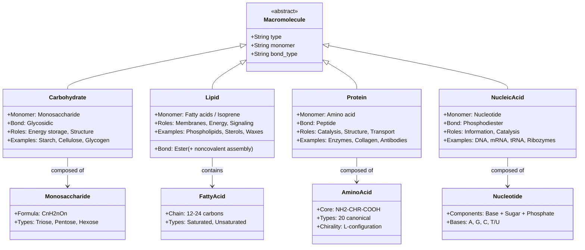
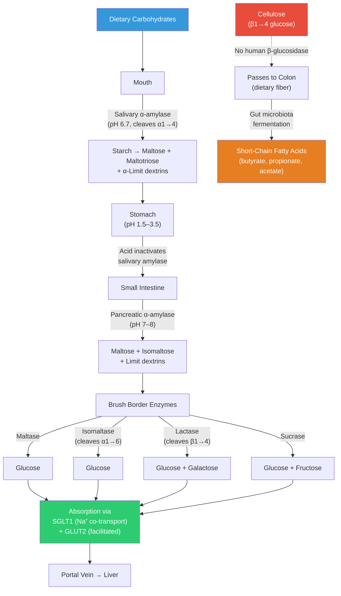
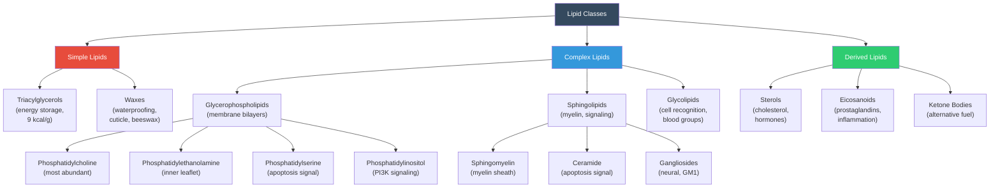
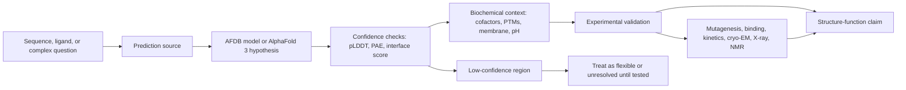

# Biological Macromolecules

\label{sec:unit_I_macromolecules}

\begin{figure}[htbp]
\centering
\includegraphics[width=0.95\textwidth]{../figures/polymer_hierarchy.png}
\caption{Hierarchy of biological macromolecules from monomer to polymer to assembly. Each row groups a polymer family (proteins, nucleic acids, carbohydrates, lipids) and the four columns expose the same four-step pattern: monomer, polymer, assembly, and example function. Arrows show the monomer-to-polymer-to-assembly direction; the function column anchors the chemistry to a recognisable biological role.}
\label{fig:unit_I_polymer_hierarchy}
\end{figure}

<!-- alt: Schematic grid of biological macromolecule families. Each row labels one family (proteins, nucleic acids, carbohydrates, lipids) along the left edge and contains four colored cells (monomer, polymer, assembly, function) connected by left-to-right arrows. -->


<!-- chapter-metadata-badge -->
> Level 2/3 · 55 min read · 75 min lecture · Prerequisites: \cref{sec:unit_I_atoms_molecules}, \cref{sec:unit_I_water_and_life}

## Learning Objectives

1. Classify and compare the four classes of biological macromolecules.
2. Explain condensation (dehydration) and hydrolysis reactions as the basis of polymer chemistry.
3. Describe the structural levels of [**protein**](#gl:protein)s and relate each level to function, including modern concepts such as intrinsically disordered proteins.
4. Explain nucleic acid structure, including A-form, B-form, and Z-form DNA, as well as RNA secondary structures.
5. Distinguish the structures and roles of carbohydrates and lipids, including glycoproteins and sphingolipids.
6. Describe ribozymes, their discovery, and their significance for the RNA World hypothesis.
7. Compare storage and structural roles of polysaccharides using starch, glycogen, and cellulose as examples.

<!-- curriculum-scaffold-start -->
### Study Blueprint

- **Big idea:** Macromolecule structure links monomer chemistry to biological function and information storage.
- **Core concepts:** polymers, dehydration synthesis, protein structure, nucleic acids.
- **Framework alignment:** Vision & Change: Structure and function, Pathways and transformations of energy and matter; AP Biology: Energetics, Systems Interactions; NGSS-style topics: Matter and Energy in Organisms and Ecosystems, Structure and Function.
- **Model or quantitative lens:** Polymerization energetics and sequence-to-structure reasoning.
- **Data skill:** Classify molecules from structural evidence rather than names alone.
- **Practice cadence:** Concept Explanation, Statistical Tests and Data Analysis, Argumentation.
- **Common misconception to repair:** Structure is not decoration; small chemical changes can redirect function and recognition.
- **Primary lab:** \nameref{sec:lab_unit_I_macromolecules}.
- **Question bank:** \nameref{sec:q_unit_I_macromolecules}.
- **Transfer task:** Explain how a mutation, lipid substitution, or glycosylation change propagates to phenotype.
- **Bridge to computation:** `biology.genetics.genetics.translate_mrna`.
<!-- curriculum-scaffold-end -->

---

> **Opening Vignette: The Protein That Won Two Nobel Prizes**
>
> In 1955, Frederick Sanger published the complete amino acid sequence of bovine insulin: 51 amino
> acids in two chains (A and B) linked by two disulfide bonds. It had taken him 10 years and was
> considered one of the most technically difficult achievements in biochemistry at the time. The
> revelation was not just the sequence itself, but what it implied: proteins are not random polymers
> — they are precisely specified sequences, encoded in [**gene**](#gl:gene)s, determining unique three-dimensional
> structures. This work earned Sanger his first Nobel Prize in Chemistry (1958).
>
> The same molecule — insulin — would later become the first human protein produced by recombinant
> DNA technology (1982), when the human insulin gene was inserted into *E. coli* to manufacture
> pharmaceutical insulin for diabetics. Before recombinant insulin, most medical insulin came from
> pig and cow pancreas, with shortages, immunological reactions, and ethical concerns. Today,
> an estimated 589 million adults aged 20--79 with diabetes worldwide \citep{magliano2025idfdiabetesatlas11},
> including those who require insulin, use a product whose existence depends on understanding the
> four classes of biological macromolecules this chapter explores.
>
> *Primary source: Sanger, F. & Thompson, E. O. P. (1953). The amino-acid sequence in the glycyl chain of insulin. Biochem. J., 53(3), 353–374.*

---


Biological macromolecules fall into four major classes: **carbohydrates**, **lipids**, **proteins**, and **nucleic acids**. The first three are polymers of small repeating units (monomers); lipids are an important exception --- they form assemblies through noncovalent hydrophobic interactions rather than covalent polymerization. \cref{fig:unit_I_polymer_hierarchy} lays out the monomer-to-polymer-to-assembly progression family by family so the same chemistry is recognizable across the four classes.


<!-- alt: Diagram showing four biological macromolecule families — carbohydrates, lipids, proteins, and nucleic acids — with their monomers, characteristic bonds, and cellular roles. -->

*The four biological macromolecule families — carbohydrates, lipids, proteins, and nucleic acids — with their monomers, characteristic bonds, and cellular roles.*

### Condensation and Hydrolysis

Most biological polymers are built by **condensation (dehydration) reactions**, in which two monomers are joined with the release of one water molecule per bond:

\begin{equation}
\text{Monomer}_1\text{--OH} + \text{H--Monomer}_2 \rightarrow \text{Monomer}_1\text{--Monomer}_2 + \text{H}_2\text{O}
\label{eq:unit_I_macromolecules_item_1}
\end{equation}


The reverse, **hydrolysis**, uses water to cleave the bond. These reactions require [**enzyme**](#gl:enzyme) catalysis (see \cref{sec:unit_I_enzymes_and_kinetics}) and energy input for condensation.

**[Thermodynamics](#gl:thermodynamics) of bond formation:**

: Hydrolysis free energies for selected biological bond types. {#tbl:unit_I_macromolecules_condensation_and_hydrolysis}
| Bond Type | $\Delta G^{\circ'}$ of Hydrolysis (kJ/mol) | Required Energy Source |
| --------- | ------------------------------------------ | --------------------- |
| Glycosidic | --15 to --20 | UDP-glucose (activated sugar) |
| Peptide | --8 to --16 | GTP (ribosomal [**translation**](#gl:translation)) |
| Phosphodiester | --25 | NTP (DNA/RNA polymerase) |
| Ester (lipid) | --20 | Acyl-CoA (activated fatty acid) |

In each case, the monomers must first be "activated" by coupling to a high-energy carrier molecule. This coupling makes the condensation reaction thermodynamically favorable.

### Worked Example: The Thermodynamics of Polymerization

**Problem:**
The hydrolysis of a [**peptide bond**](#gl:peptide-bond) releases approximately $\Delta G^{\circ'} = -10 \text{ kJ/mol}$. 
1. What is the standard free energy change ($\Delta G^{\circ'}$) for the condensation reaction to form a single peptide bond?
2. Why does the cell require the hydrolysis of high-energy bonds (like GTP, where $\Delta G^{\circ'} \approx -30 \text{ kJ/mol}$) to drive this reaction during protein synthesis in the [**ribosome**](#gl:ribosome)?

**Solution:**

1. **Calculate the condensation $\Delta G^{\circ'}$:**
   Because condensation is the exact reverse of hydrolysis, the standard free energy change has the same magnitude but the opposite sign:
   $$ \Delta G^{\circ'}_{\text{condensation}} = -(\Delta G^{\circ'}_{\text{hydrolysis}}) = -(-10 \text{ kJ/mol}) = +10 \text{ kJ/mol}  \label{eq:unit_I_macromolecules_item_2}$$

   As $\Delta G^{\circ'} > 0$, the formation of a peptide bond is thermodynamically unfavorable (endergonic) and will not occur spontaneously.

2. **Calculate the coupled reaction thermodynamics:**
   To drive an endergonic reaction forward, the cell couples it to a highly exergonic reaction. During translation elongation, the ribosome couples the formation of a peptide bond to the hydrolysis of GTP down to GDP + P$_i$.
   
   Summing the free energy changes:
   $$ \Delta G^{\circ'}_{\text{total}} = \Delta G^{\circ'}_{\text{condensation}} + \Delta G^{\circ'}_{\text{GTP\_hydrolysis}}  \label{eq:unit_I_macromolecules_item_3}$$

   $$ \Delta G^{\circ'}_{\text{total}} = (+10 \text{ kJ/mol}) + (-30 \text{ kJ/mol}) = -20 \text{ kJ/mol}  \label{eq:unit_I_macromolecules_item_4}$$


By coupling the unfavorable peptide bond formation (+10 kJ/mol) to the favorable hydrolysis of GTP (--30 kJ/mol), the overall coupled reaction becomes highly favorable (--20 kJ/mol), driving protein synthesis forward with near-perfect unidirectionality.

> **Concept Check 1:** Hydrolysis reactions are thermodynamically spontaneous ($\Delta G < 0$), yet polymers are kinetically stable in cells. What prevents the spontaneous hydrolysis of your DNA, proteins, and carbohydrates?

---

## Carbohydrates as Energy Stores and Structural Polymers

### Monosaccharides and Ring Chemistry

The simplest carbohydrates are **monosaccharides** with the empirical formula (CH$_2$O)$_n$. They are classified by:
- **Number of carbons:** trioses (3C), tetroses (4C), pentoses (5C), hexoses (6C)
- **Functional group:** aldoses (aldehyde) or ketoses (ketone)

Common examples:

: Monosaccharides and Ring Chemistry: Sugar and Formula. {#tbl:unit_I_macromolecules_monosaccharides_and_ring_chemistry}
| Sugar | Formula | n | Type | Role |
| ----- | ------- | - | ---- | ---- |
| Glyceraldehyde | C$_3$H$_6$O$_3$ | 3 | Aldotriose | Central metabolite ([**glycolysis**](#gl:glycolysis)) |
| Dihydroxyacetone | C$_3$H$_6$O$_3$ | 3 | Ketotriose | Glycolysis intermediate |
| Ribose | C$_5$H$_{10}$O$_5$ | 5 | Aldopentose | RNA backbone, ATP, NAD$^+$ |
| Deoxyribose | C$_5$H$_{10}$O$_4$ | 5 | Aldopentose | DNA backbone |
| Glucose | C$_6$H$_{12}$O$_6$ | 6 | Aldohexose | Primary fuel molecule |
| Galactose | C$_6$H$_{12}$O$_6$ | 6 | Aldohexose | Lactose component |
| Fructose | C$_6$H$_{12}$O$_6$ | 6 | Ketohexose | Fruit sugar, sweetest natural sugar |
| Mannose | C$_6$H$_{12}$O$_6$ | 6 | Aldohexose | Glycoprotein glycans |

Glucose, galactose, and fructose are **structural isomers** --- identical molecular formulas, different atom arrangements. In solution, glucose exists primarily in the **ring form** (pyranose, ~99%) rather than the open-chain aldehyde form. The two ring anomers, α-D-glucose and β-D-glucose, differ primarily in the orientation of the C1 hydroxyl group, but this distinction has enormous biochemical significance --- enzymes discriminate exquisitely between them.

### Disaccharides and Polysaccharides

Two monosaccharides join via a **glycosidic bond** to form a disaccharide:

: Disaccharides and Polysaccharides: Disaccharide and Monomers. {#tbl:unit_I_macromolecules_disaccharides_and_polysaccharides}
| Disaccharide | Monomers | Bond | Biological source |
| ------------ | -------- | ---- | ----------------- |
| Sucrose | Glucose + Fructose | $\alpha(1\to2)\beta$ | Plants (transport sugar) |
| Lactose | Glucose + Galactose | $\beta(1\to4)$ | Milk |
| Maltose | Glucose + Glucose | $\alpha(1\to4)$ | Starch digestion |
| Trehalose | Glucose + Glucose | $\alpha(1\to1)\alpha$ | Insect hemolymph, desiccation protectant |
| Cellobiose | Glucose + Glucose | $\beta(1\to4)$ | Cellulose degradation product |

**Polysaccharides** are long chains of monosaccharides serving structural or storage functions:

- **Starch (amylose + amylopectin):** $\alpha(1\to4)$ linkages, branching via $\alpha(1\to6)$ at intervals (~25 residues for amylopectin). Storage in plants.
- **Glycogen:** Like amylopectin but more heavily branched (every ~10 residues). Glucose storage in animal liver (~100 g) and muscle (~400 g).
- **Cellulose:** $\beta(1\to4)$ glucose. Structural component of plant cell walls. Humans cannot digest it (no beta-glucosidase), but gut [**microbiota**](#gl:microbiota) can; cellulose is dietary fiber.
- **Chitin:** $\beta(1\to4)$ N-acetylglucosamine. Structural component of fungal cell walls and arthropod exoskeletons --- the second most abundant biopolymer on Earth after cellulose.
- **Hyaluronic acid:** alternating $\beta(1\to4)$ glucuronic acid and $\beta(1\to3)$ N-acetylglucosamine. Major component of extracellular matrix and synovial fluid.

The difference between starch and cellulose --- both glucose polymers --- lies solely in the glycosidic bond geometry (α vs. β). Yet this single difference makes cellulose rigid and indigestible versus starch flexible and readily hydrolysed.


<!-- alt: Flowchart showing digestible alpha-linked carbohydrates pass through amylase, brush-border enzymes, and portal absorption, while beta-linked cellulose bypasses human enzymes and reaches microbial fermentation in the colon. -->

*Digestible alpha-linked carbohydrates pass through amylase, brush-border enzymes, and portal absorption, while beta-linked cellulose bypasses human enzymes and reaches microbial [**fermentation**](#gl:fermentation) in the colon.*

> **Clinical Connection: Lactose Intolerance**
>
> Approximately 65--75% of the global adult population has reduced expression of lactase (the brush border enzyme that cleaves lactose) after weaning --- the ancestral state called **lactase non-persistence**. Undigested lactose reaches the colon, where bacterial fermentation produces H$_2$, CO$_2$, and short-chain fatty acids, causing bloating, flatulence, and diarrhea. **Lactase persistence** (the ability to digest lactose as an adult) evolved independently in pastoral populations in Europe (~7,500 years ago) and East Africa (~3,000 years ago) due to strong selection pressure from dairy farming. This is one of the clearest examples of recent human evolution driven by cultural practices.

> **Concept Check 2:** Glycogen is more heavily branched than amylopectin (α1->6 branch every ~10 residues vs. every ~25 residues). How does this increased branching benefit an animal that needs rapid glucose mobilization during a "fight or flight" response?

### The Glycosidic Bond: α vs. β

The single greatest source of carbohydrate structural diversity is the **glycosidic bond** geometry. When a hemiacetal hydroxyl (at the anomeric carbon, C1 of the cyclic sugar) condenses with a hydroxyl of another sugar, the resulting linkage can be either **α** (the OH/OR on C1 points down in the standard Haworth projection, *trans* to the C6 substituent) or **β** (OH/OR points up, *cis* to C6).

: The Glycosidic Bond: α vs. β: Linkage and Geometry. {#tbl:unit_I_macromolecules_the_glycosidic_bond_vs}
| Linkage | Geometry | Polysaccharide example | Conformation | Digestible by humans? |
| ------- | -------- | ---------------------- | ------------ | --------------------- |
| $\alpha(1\to4)$ (Glc--Glc) | bent | amylose, glycogen | helix | yes (amylase) |
| $\alpha(1\to6)$ | branchpoint | amylopectin, glycogen branches | branched helix | yes (isomaltase) |
| $\beta(1\to4)$ (Glc--Glc) | straight | cellulose | extended ribbons | **no** (no β-glucosidase) |
| $\beta(1\to3)$ | extended | callose, paramylon (algae) | linear | no |
| $\beta(1\to4)$ (GlcNAc--GlcNAc) | straight | chitin | extended | no |
| $\alpha(1\to2)$ (Glc--Fru) | mixed | sucrose | non-reducing | yes (sucrase) |
| $\beta(1\to4)$ (Gal--Glc) | mixed | lactose | linear | yes (lactase) until weaning |

The biological consequences of this single stereochemical choice are profound: α-linked glucose polymers (starch, glycogen) form helices that pack as soft granules and are readily hydrolysed for energy storage. β-linked glucose polymers (cellulose) form extended, hydrogen-bonded sheets that pack into rigid microfibrils with tensile strength rivalling steel by weight; nature uses them as structural material (plant cell walls) precisely because they resist enzymatic attack.

### Branching, Linkages, and Polymer Diversity

Even within the same monosaccharide and same anomeric configuration, **branching frequency** dramatically alters function. Glycogen (animal storage) has $\alpha(1\to6)$ branches every ~10 residues; amylopectin (plant storage) every ~25 residues. Heavier branching gives glycogen many more non-reducing ends per molecule --- and since both glycogen synthase and glycogen phosphorylase work primarily at non-reducing ends, branching directly accelerates the rate at which glucose can be added to or removed from the polymer. During a "fight or flight" response, a hepatocyte mobilizes glucose from glycogen at ~10 mM/s; this rate would be unattainable from a linear polymer with a single non-reducing end.

### Glycoproteins and Proteoglycans

Many proteins are covalently modified with carbohydrate chains (glycans):

**Glycoproteins** have relatively short, branched oligosaccharide chains attached via:
- **N-linked glycosylation:** to asparagine (Asn) in the consensus sequence Asn-X-Ser/Thr (where X is any amino acid except Pro). Built up co-translationally on dolichol phosphate in the ER, then trimmed and modified in the Golgi.
- **O-linked glycosylation:** to serine (Ser) or threonine (Thr); built up sequentially in the Golgi.
- **Other linkages:** O-GlcNAc (a single GlcNAc on Ser/Thr; common cytosolic/nuclear signal), C-mannose (on Trp), GPI-anchor glycolipids (link some proteins to the membrane outer leaflet).

: Glycoproteins and Proteoglycans: Feature and N-linked. {#tbl:unit_I_macromolecules_glycoproteins_and_proteoglycans}
| Feature | N-linked | O-linked |
| ------- | -------- | -------- |
| Attachment residue | Asn (in Asn-X-Ser/Thr motif) | Ser, Thr |
| Linker sugar | GlcNAc | GalNAc (mucin-type), Gal, others |
| Site of attachment | ER (co-translational) | Golgi (post-translational) |
| Initial structure | Dolichol-P-P-GlcNAc$_2$Man$_9$Glc$_3$ | Single sugar at a time |
| Examples | Antibodies, integrins, EPO, viral spike | Mucins, blood group antigens, EGF repeats |
| Disease | Congenital disorders of glycosylation (CDG-I, II) | Tn syndrome (cancer marker) |

Glycoproteins are ubiquitous: antibodies (IgG), blood group antigens (ABO), mucins (airway protection), and many secreted or surface proteins carry glycans. Glycosylation affects protein folding, stability, half-life, and cell-cell recognition. The SARS-CoV-2 spike protein is heavily N-glycosylated, with at least 22 sites; these glycans shield the protein from antibody neutralization, and their removal is a strategy under exploration for vaccine improvement.

**Proteoglycans** have very long, unbranched glycosaminoglycan (GAG) chains:

: Glycoproteins and Proteoglycans: GAG and Repeating Unit. {#tbl:unit_I_macromolecules_glycoproteins_and_proteoglycans_2}
| GAG | Repeating Unit | Location | Function |
| --- | -------------- | -------- | -------- |
| Hyaluronic acid | GlcUA-GlcNAc | Synovial fluid, vitreous humour | Lubrication, shock absorption |
| Chondroitin sulfate | GlcUA-GalNAc(SO$_4$) | Cartilage, bone | Compression resistance |
| Heparan sulfate | GlcUA/IdoUA-GlcNAc(SO$_4$) | Cell surfaces, basement membrane | Growth factor binding |
| Keratan sulfate | Gal-GlcNAc(SO$_4$) | Cornea, cartilage | Transparency, hydration |

The highly negatively charged GAGs attract enormous amounts of water (via osmotic pressure), creating a hydrated gel that resists compression --- this is why cartilage can support the body's weight.

---

## Lipids, Membranes, and Energy Storage

Lipids are not polymers but are grouped together by their **hydrophobicity** --- they do not form regular covalent polymers, yet their self-assembly into bilayers, vesicles, and membranes is central to cellular life \citep{dill1990proteinfolding}.

### Fatty Acids and Membrane Fluidity

Fatty acids are long-chain carboxylic acids. Food-relevant examples:

: Fatty Acids and Membrane Fluidity: Fatty Acid and Chain. {#tbl:unit_I_macromolecules_fatty_acids_and_membrane_fluidity}
| Fatty Acid | Chain | Double Bonds | Name | Source |
| ---------- | ----- | ------------ | ---- | ------ |
| CH$_3$(CH$_2$)$_{14}$COOH | 16:0 | 0 | Palmitic acid (saturated) | Palm oil, meat |
| CH$_3$(CH$_2$)$_{16}$COOH | 18:0 | 0 | Stearic acid (saturated) | Cocoa butter |
| C18:1 $\Delta^9$ | 18:1 | 1 | Oleic acid (monounsaturated) | Olive oil |
| C18:2 $\Delta^{9,12}$ | 18:2 | 2 | Linoleic acid (ω-6 PUFA) | Vegetable oils |
| C18:3 $\Delta^{9,12,15}$ | 18:3 | 3 | α-Linolenic acid (ω-3 PUFA) | Flaxseed, walnuts |
| C20:4 $\Delta^{5,8,11,14}$ | 20:4 | 4 | Arachidonic acid (ω-6) | Meat, eggs |
| C20:5 $\Delta^{5,8,11,14,17}$ | 20:5 | 5 | EPA (ω-3) | Oily fish |
| C22:6 $\Delta^{4,7,10,13,16,19}$ | 22:6 | 6 | DHA (ω-3) | Fish oil, brain |

**Saturated** fatty acids have no double bonds and pack tightly --- solid at room temperature (butter, lard). **Unsaturated** fatty acids have *cis* double bonds introducing kinks that prevent tight packing --- liquid at room temperature (olive oil). **Trans** fats have *trans* double bonds that pack like saturated fats --- they are artificial (from industrial hydrogenation) and have adverse cardiovascular effects.

**Essential fatty acids:** Linoleic acid (ω-6) and α-linolenic acid (ω-3) cannot be synthesized by humans (we lack Δ12 and Δ15 desaturases) and must be obtained from the diet.


<!-- alt: Graph showing lipid classes and roles. Classification of lipids. Unlike other macromolecules, lipids are classified by solubility (hydrophobicity) rather than by a common monomer structure. Note the diversity of roles: energy storage, membrane structure, signaling, and waterproofing. -->

*Lipid classes and roles. Classification of lipids. Unlike other macromolecules, lipids are classified by solubility (hydrophobicity) rather than by a common monomer structure. Note the diversity of roles: energy storage, membrane structure, signaling, and waterproofing.*

### Glycerophospholipids and Bilayer Architecture

Glycerophospholipids (also called phosphoglycerides) are the most abundant membrane lipids. Their structure: glycerol backbone + 2 fatty acid chains at positions sn-1 and sn-2 + phosphate group at sn-3 + polar head group attached to the phosphate.

: Glycerophospholipids and Bilayer Architecture: Head Group and Phospholipid. {#tbl:unit_I_macromolecules_glycerophospholipids_and_bilayer_architecture}
| Head Group | Phospholipid | Charge at [**pH**](#gl:ph) 7 | Location/Function |
| ---------- | ------------ | -------------- | ----------------- |
| Choline | Phosphatidylcholine (PC) | Zwitterionic | Outer leaflet; most abundant |
| Ethanolamine | Phosphatidylethanolamine (PE) | Zwitterionic | Inner leaflet; membrane curvature |
| Serine | Phosphatidylserine (PS) | Net negative | Inner leaflet; flipped to outer in [**apoptosis**](#gl:apoptosis) |
| Inositol | Phosphatidylinositol (PI) | Net negative | Inner leaflet; PI3K signaling cascade |

The **amphipathic** structure spontaneously forms bilayers in water --- a thermodynamic consequence of the hydrophobic effect (see \cref{sec:unit_I_water_and_life}).

### Quantitative Properties of the Lipid Bilayer

The "fluid mosaic" model of Singer and Nicolson (1972) proposed that membranes are 2D fluids in which proteins and lipids diffuse laterally. Quantitative measurements --- especially by fluorescence recovery after photobleaching (FRAP) and single-particle tracking --- have refined this picture into a richer, multi-domain landscape.

: Quantitative Properties of the Lipid Bilayer: Property and Typical value. {#tbl:unit_I_macromolecules_quantitative_properties_of_the_lipid_bilayer}
| Property | Typical value | Notes |
| -------- | ------------- | ----- |
| Bilayer thickness | 4--5 nm | Hydrophobic core ~3 nm; head-group region ~1 nm each |
| Area per phospholipid | 60--70 \AA{}$^2$ | Determined by NMR, X-ray on monolayers |
| Lateral diffusion coefficient ($D$, lipid) | 1--10 μm$^2$/s | A lipid traverses 1 μm in ~1 s |
| Lateral diffusion coefficient ($D$, integral protein) | 0.01--1 μm$^2$/s | 10--1000$\times$ slower than lipids |
| Rotational correlation time (lipid) | ~100 ps | Acyl chains "wag" on this timescale |
| Transbilayer flip-flop (phospholipid, spontaneous) | hours--days | Energy barrier from polar head moving through hydrophobic core |
| Transbilayer flip-flop (catalysed by flippase) | seconds | ATP-dependent; maintains lipid asymmetry |
| Bilayer surface tension | ~0 mN/m | Unlike air-water interface; key for vesicle stability |
| Bending modulus (κ) | 10--40 $k_B T$ | Resistance to curvature; depends on lipid shape, sterol content |
| Compressibility modulus ($K_A$) | 100--300 mN/m | Resistance to area change |
| Permeability to water | 10--100 μm/s | Surprisingly high due to small size; aquaporins boost ~10$\times$ |
| Permeability to Na$^+$ | $10^{-12}$--$10^{-14}$ cm/s | Vanishingly small without channels |

**Lipid asymmetry.** The two leaflets of the plasma membrane have very different compositions: the outer leaflet is enriched in PC, sphingomyelin, and glycolipids; the inner leaflet in PE, PS, and PI. This asymmetry is actively maintained by ATP-dependent flippases (move lipids from outer to inner) and floppases (inner to outer). When PS appears on the outer leaflet --- the result of activated scramblases during apoptosis --- it serves as an "eat-me" signal for macrophages. Loss of asymmetry is also a feature of activated platelets (where PS exposure on the outer leaflet provides a surface for the coagulation cascade).

**Lipid rafts.** Cholesterol and sphingolipids self-segregate into liquid-ordered ($L_o$) microdomains within a sea of liquid-disordered ($L_d$) phospholipids. These ~10--200 nm rafts concentrate specific signaling proteins (GPI-anchored proteins, Src-family kinases) and are now recognized as functional platforms for receptor signaling, virus budding, and immune-cell synapse assembly.

> **Concept Check 7:** A typical phospholipid diffuses ~1 μm/s laterally in a fluid bilayer but flips between leaflets primarily once every several hours unaided. Use the structure of a phospholipid (charged head, hydrocarbon tails) and the energetics of the hydrophobic effect to explain this 10$^{12}$-fold difference. Why must cells expend ATP on flippases to break this asymmetry?

### Sphingolipids in Membranes and Signaling

Sphingolipids use **sphingosine** (rather than glycerol) as the backbone. Ceramide (sphingosine + fatty acid) is the core structure:

- **Sphingomyelin:** ceramide + phosphocholine. Major component of the myelin sheath that insulates axons; critical for nerve impulse conduction velocity.
- **Cerebrosides:** ceramide + single sugar (glucose or galactose). Abundant in brain.
- **Gangliosides:** ceramide + complex oligosaccharide containing sialic acid (Neu5Ac). GM1 is the receptor for cholera toxin.

> **Clinical Connection: Tay-Sachs Disease and Sphingolipid Storage**
>
> Tay-Sachs disease results from deficiency of the lysosomal enzyme hexosaminidase A, which normally degrades the ganglioside GM2. Without this enzyme, GM2 accumulates in [**neuron**](#gl:neuron)s, causing progressive neurodegeneration. Symptoms of the classic infantile form appear at ~6 months and include cherry-red macular spots, seizures, and developmental regression; this form is invariably fatal by age 3--5. Rarer juvenile and late-onset forms, which retain partial hexosaminidase A activity, progress more slowly and are compatible with substantially longer survival. Carrier frequency is ~1/30 in Ashkenazi Jewish populations due to a [**founder effect**](#gl:founder-effect). This is one of ~50 known **lysosomal storage diseases**, most caused by deficient hydrolytic enzymes.

### Sterols and Steroid Hormones

**Cholesterol** has a four-ring steroid nucleus (three 6-carbon rings + one 5-carbon ring) and a hydroxyl group at C3. In membranes, cholesterol:
- Inserts between phospholipids with its hydroxyl group near the head groups and its rings among the acyl chains
- At high temperatures: reduces membrane fluidity by restricting phospholipid movement
- At low temperatures: prevents crystallisation by disrupting ordered packing
- Net effect: **homeoviscous regulation** that maintains consistent membrane fluidity across a temperature range

Cholesterol is the precursor to most steroid [**hormone**](#gl:hormone)s:
- **Glucocorticoids** ([**cortisol**](#gl:cortisol)): stress response, anti-inflammatory
- **Mineralocorticoids** (aldosterone): sodium/potassium balance
- **Androgens** (testosterone): male sexual development
- **Oestrogens** (oestradiol): female sexual development
- **Progestagens** (progesterone): pregnancy maintenance
- **Vitamin D$_3$** (cholecalciferol): calcium absorption
- **Bile acids** (cholic acid, chenodeoxycholic acid): fat emulsification in the duodenum

### Waxes and Other Lipids

- **Waxes:** esters of long-chain fatty acids and long-chain alcohols; waterproofing (plant cuticle, bee honeycomb, whale head oil, ear wax)
- **Eicosanoids:** signaling lipids derived from arachidonic acid (C20:4); include prostaglandins (inflammation, fever, pain), thromboxanes (platelet aggregation), and leukotrienes (immune response)
- **Isoprenoids:** built from isoprene units (5C); include terpenes, carotenoids, ubiquinone (CoQ), and dolichol

> **Concept Check 3:** Aspirin (acetylsalicylic acid) irreversibly inhibits cyclooxygenase (COX), the enzyme that converts arachidonic acid to prostaglandins and thromboxanes. Explain why aspirin reduces both pain/inflammation and the risk of heart attacks.

---

## Proteins as Folded Catalytic and Structural Polymers

Proteins are the most structurally and functionally diverse macromolecules. They serve as:
- Structural elements (collagen, keratin, [**actin**](#gl:actin), tubulin)
- Enzymes (catalysts; see \cref{sec:unit_I_enzymes_and_kinetics})
- Signaling molecules (growth factors, receptors, G proteins)
- Transport proteins (hemoglobin, albumin, aquaporins)
- Immune molecules (antibodies)
- Motor proteins (myosin, kinesin, dynein)

### Amino Acid Chemistry and Side-Chain Diversity

The 20 canonical amino acids share a common backbone:

```
    NH₂
     |
H — C — COOH
     |
     R (side chain)
```

The **α-amino group** (pKa ~9.0) and **α-carboxyl group** (pKa ~2.0) flank the α-carbon, to which the variable **R group** is attached. At physiological pH 7.4, the amino group is --NH$_3^+$ and the carboxyl is --COO$^-$, forming a **zwitterion**.

**Classification by R group character:**

: Amino Acid Chemistry and Side-Chain Diversity: Class and Examples. {#tbl:unit_I_macromolecules_amino_acid_chemistry_and_side_chain_diversity}
| Class | Examples | Side chain | Properties |
| ----- | -------- | ---------- | ---------- |
| Nonpolar aliphatic | Ala, Val, Leu, Ile, Met, Pro | Hydrocarbon | Hydrophobic core |
| Aromatic | Phe, Tyr, Trp | Benzene/indole rings | UV absorption, stacking |
| Polar uncharged | Ser, Thr, Cys, Asn, Gln | --OH, --SH, --CONH$_2$ | H-bonding, disulfides |
| Positively charged | Lys, Arg, His | --NH$_3^+$, guanidinium, imidazole | Salt bridges, catalysis |
| Negatively charged | Asp, Glu | --COO$^-$ | Salt bridges, metal binding |

**Special amino acids:**
- **Glycine** (R = H) has no stereogenic center and maximal conformational flexibility --- often found in tight turns
- **Proline** has a cyclic side chain bonded to the backbone nitrogen, restricting rotation and introducing kinks in α-helices
- **Cysteine** can form **disulfide bonds** (--S--S--) with other cysteines under oxidising conditions (ER lumen, extracellular space)
- **Selenocysteine** (the "21st amino acid") contains selenium instead of sulfur and is encoded by UGA [**codon**](#gl:codon)s with a special stem-loop (SECIS element)

### The Peptide Bond

A peptide bond forms by condensation between the carboxyl of one amino acid and the amino group of the next:

\begin{equation}
\text{--NH--CHR}_1\text{--CO--NH--CHR}_2\text{--CO--} \ldots
\label{eq:unit_I_macromolecules_item_5}
\end{equation}


The peptide bond has **partial double-bond character** (~40% double bond due to resonance), making it planar and **trans** (almost typically; *cis* occurs ~0.03% of the time, except before proline where *cis* occurs ~5%). This rigidity limits rotation around the C$_\alpha$--C bond to the backbone dihedral angles φ and ψ (described on a Ramachandran plot), constraining protein conformational space.

### Ramachandran Plots and Backbone Dihedral Angles

The polypeptide backbone has three torsional degrees of freedom per residue:

- **ω** (omega): rotation about the peptide C--N bond. Effectively fixed at 180$^\circ$ (*trans*) due to partial double-bond character; ~5% of X-Pro bonds adopt *cis* (ω = 0$^\circ$).
- **$\varphi$** (phi): rotation about the N--C$_\alpha$ bond.
- **ψ** (psi): rotation about the C$_\alpha$--C bond.

Because each peptide unit is rigid and planar, primarily $\varphi$ and ψ can vary. The 1963 paper of G. N. Ramachandran plotted $\varphi$ vs. ψ for most amino acids in known protein structures; the plot reveals dramatic clustering caused by steric clashes (Pauli repulsion between side chain, carbonyl, and amide atoms when the dihedrals approach forbidden values).

: Allowed backbone dihedral-angle regions in a Ramachandran plot. {#tbl:unit_I_macromolecules_ramachandran_plots_and_backbone_dihedral_angles}
| Region | Approximate ($\varphi$, ψ) | Secondary structure |
| ------ | ------------------------------- | -------------------- |
| Right-handed α-helix | (--60$^\circ$, --45$^\circ$) | α-helix |
| Left-handed α-helix | (+60$^\circ$, +45$^\circ$) | Rare; primarily Gly residues |
| β-sheet (parallel) | (--120$^\circ$, +120$^\circ$) | Parallel β-sheet |
| β-sheet (antiparallel) | (--140$^\circ$, +135$^\circ$) | Antiparallel β-sheet |
| Polyproline II | (--75$^\circ$, +145$^\circ$) | Collagen, IDR motifs |
| 3$_{10}$-helix | (--49$^\circ$, --26$^\circ$) | Tight helix at N/C-termini |

Two amino acids escape the standard restrictions:

- **Glycine** has primarily an H atom for its side chain --- no steric clash --- and so populates the entire $(\varphi, \psi)$ plane, including the disallowed regions used by left-handed helices.
- **Proline's** side-chain ring fixes $\varphi \approx -65^\circ$, severely restricting backbone flexibility. Proline cannot occur in a regular α-helix beyond position 4 (no N--H proton available as H-bond donor) and is famous as a "helix breaker."

Real proteins occupy the allowed regions ~98% of the time; deviations into "outlier" regions are validated indicators of either (a) genuine functional constraints (e.g., catalytic glycines in a strained conformation) or (b) modeling errors in low-resolution X-ray structures. Ramachandran statistics are now a standard quality metric for crystallographic and AlphaFold-predicted structures.

> **Concept Check 6:** Why does Pro almost rarely occur in the middle of an α-helix, while Gly is over-represented in tight turns and loops? Frame your answer in terms of $(\varphi, \psi)$ allowed regions on the Ramachandran plot.

### Levels of Protein Structure

**Primary structure:** The amino acid sequence --- the covalent backbone. Written conventionally from N-terminus to C-terminus. Primary structure is encoded by genes and determines most higher levels of structure (Anfinsen's dogma).

**Secondary structure:** Local regular patterns of backbone H-bonds:
- **α-Helix:** 3.6 residues/turn, rise 0.15 nm/residue, H-bond between residue $i$ and $i+4$. 100% right-handed in natural proteins. Helix dipole (N-terminus δ+; C-terminus δ-) affects function. Helix-breaking residues: Pro (kinks), Gly (too flexible).
- **β-Sheet:** extended chains (strands) running parallel or antiparallel, H-bonded between adjacent strands. Most β-sheets are twisted. β-sheets are the structural basis of silk (fibroin) and amyloid fibrils.
- **$3_{10}$-helix:** tighter than α-helix (3 residues/turn), H-bond between $i$ and $i+3$. Less common; often found at helix termini.
- **Turns and loops:** allow the polypeptide chain to reverse direction; typically on protein surface, often functionally important (e.g., CDR loops in antibodies).

**Tertiary structure:** The complete 3D fold, stabilized by:
- Hydrophobic core packing ([**dominant**](#gl:dominant) driving force)
- Disulfide bonds (Cys--S--S--Cys; formed in oxidising compartments like ER lumen)
- Salt bridges (Asp/Glu with Lys/Arg)
- H-bonds and van der Waals contacts

**Common protein folds:**

: Levels of Protein Structure: Fold and Description. {#tbl:unit_I_macromolecules_levels_of_protein_structure}
| Fold | Description | Example |
| ---- | ----------- | ------- |
| Globin fold | 8 α-helices surrounding a haem pocket | Myoglobin, hemoglobin |
| TIM barrel | 8 alternating $\beta\alpha$ units forming a barrel | Triosephosphate isomerase |
| β-barrel | β-sheets curved into a closed barrel | Porins, GFP |
| Immunoglobulin fold | Two β-sheets packed face-to-face | Antibodies, MHC |
| Leucine-rich repeat | Horseshoe of repeating units | Toll-like receptors |

**Quaternary structure:** Assembly of two or more polypeptide chains (subunits). Examples:
- **Hemoglobin:** $\alpha_2\beta_2$ tetramer; cooperative O$_2$ binding
- **Collagen:** triple helix of three chains with Gly-X-Y repeats (X often Pro, Y often Hyp)
- **Immunoglobulin G:** two heavy chains + two light chains; Y-shaped
- **Ribosome:** RNA + >50 protein subunits

**Protein denaturation:** Disruption of secondary/tertiary/quaternary structure by heat, pH extremes, denaturants (urea, guanidinium), reducing agents (break disulfides). Primary structure intact; activity lost. Often irreversible (cooked egg white), but many small proteins refold spontaneously (Anfinsen's experiment with ribonuclease A).

### Thermodynamics of Protein Folding

Protein folding is governed by the same Gibbs equation that governs most spontaneous processes:

\begin{equation}
\Delta G_{\text{fold}} = \Delta H_{\text{fold}} - T\,\Delta S_{\text{fold}}
\label{eq:unit_I_protein_folding_dG}
\end{equation}

The total $\Delta G_{\text{fold}}$ for a typical small globular protein is primarily --20 to --60 kJ/mol --- the difference between two enormous, partially cancelling terms.

**Decomposing the folding free energy:**

: Thermodynamics of Protein Folding: Contribution and Sign. {#tbl:unit_I_macromolecules_thermodynamics_of_protein_folding}
| Contribution | Sign | Magnitude (typical) | Origin |
| ------------ | ---- | ------------------- | ------ |
| Conformational entropy of backbone | $-T\Delta S < 0$ unfavorable | $+500$ to $+1500$ kJ/mol | Loss of $\varphi$/ψ freedom |
| Conformational entropy of side chains | unfavorable | $+200$ to $+400$ kJ/mol | Side chains lock in place |
| Hydrophobic effect | favorable | $-300$ to $-1000$ kJ/mol | Burial of nonpolar surface; entropy of water released |
| Backbone H-bonds | small | $\pm 0$ to $-100$ kJ/mol | Replace H-bonds to water with intramolecular ones |
| Van der Waals packing | favorable | $-200$ to $-500$ kJ/mol | Tight core packing |
| Disulfide bonds (if present) | favorable | $-15$ to $-30$ kJ/mol per S--S | Topology constraint |
| **Net $\Delta G_{\text{fold}}$** | favorable, marginal | **$-20$ to $-60$ kJ/mol** | Sum of large opposing terms |

**The hydrophobic collapse model.** The dominant driving force is the [**hydrophobic effect**](#gl:hydrophobic-effect) (see \cref{sec:unit_I_water_and_life}) \citep{dill1990proteinfolding}. Folding occurs in two stages:

1. **Hydrophobic collapse** (microseconds): Water-exposed nonpolar side chains rapidly aggregate into a "molten globule" --- a compact but loosely packed intermediate with most secondary structure formed but tertiary contacts not yet locked in.
2. **Specific tertiary contact formation** (milliseconds--seconds): Slow rearrangement to the unique native fold; backbone H-bonds and van der Waals packing optimize.

The marginal stability of folded proteins ($|\Delta G| \approx$ a few H-bonds' worth) has profound consequences: small mutations can destabilise proteins enough to cause disease (e.g., a single Glu6->Val substitution causes sickle-cell hemoglobin to polymerize), and many proteins exist in a fragile balance with disordered or misfolded states.

**Levinthal's paradox and the folding funnel.** A 100-residue chain with 3 backbone conformations per residue would have $3^{100} \approx 10^{47}$ possible conformations --- searching them randomly at 10$^{12}$ trials per second would take longer than the age of the universe, yet proteins fold in milliseconds. The resolution is the **folding funnel**: the energy landscape is biased so that energy and conformational entropy *both* decrease as the protein nears the native state. The chain rolls down the funnel via many parallel pathways rather than searching exhaustively. This conceptual breakthrough is now supported by molecular dynamics simulations and by structure-prediction systems. AlphaFold 3 extends the classroom question from "what fold does this protein adopt?" to "what complex does this protein form with DNA, RNA, ligands, ions, or modified residues?" It should be read as a powerful hypothesis generator whose confidence metrics and biochemical context still need experimental validation, especially for dynamics, alternative conformations, and low-confidence interfaces \citep{abramson2024alphafold3}.

**Current evidence: AI structure models and molecular interaction claims.** The AlphaFold Protein Structure Database update reported for the 2025 UniProt release improved the entry interface and structural interpretation of hundreds of millions of predicted protein models, while a 2026 EMBL-EBI/Google DeepMind/NVIDIA/SNU update began adding predicted protein complexes, starting with high-confidence homodimers \citep{velankar2026alphafolddb2025,emblebi2026alphafoldcomplexes}. For a biology student, the key habit is not "the computer solved the protein" but "the model proposes a testable molecular hypothesis." A predicted active-site pocket, ligand pose, or interface should be checked against confidence metrics, conservation, mutagenesis, binding, kinetics, cryo-EM/X-ray/NMR evidence, and whether the biological state is static, dynamic, membrane-embedded, modified, or allosterically regulated.


<!-- alt: Flowchart showing AI biomolecular modeling workflow. Predicted structures and complexes are evidence-generating tools; confidence metrics and independent assays determine whether a predicted contact supports a biological mechanism. -->

*AI biomolecular modeling workflow. Predicted structures and complexes are evidence-generating tools; confidence metrics and independent assays determine whether a predicted contact supports a biological mechanism.*

> **Concept Check (Evaluation):** Intrinsically disordered proteins (IDPs) lack stable tertiary structure but are functionally critical --- roughly 30% of human proteins are fully disordered, and 70% have disordered regions. (a) Using the hydrophobic effect and entropy arguments, explain why a protein rich in charged (Asp, Glu, Lys, Arg) and polar (Ser, Thr, Gln, Asn) residues would resist folding into a compact globule. (b) IDPs often form transient ordered structures when binding partners --- propose the thermodynamic driving force for this "coupled folding and binding." (c) Why might disorder confer an evolutionary advantage for hub proteins that interact with many partners?

> **Concept Check (Analysis):** The amyloid fibril formed by the Alzheimer's A$\beta$(1--42) peptide consists of antiparallel $\beta$-sheets stacked perpendicular to the fibril axis with $\sim 4.7$ angstrom inter-strand spacing and $\sim 10$ angstrom inter-sheet spacing. (a) Estimate the number of hydrogen bonds per meter of fibril if each strand contributes 2 backbone H-bonds and strands are 4.7 angstrom apart. (b) Why is amyloid kinetically trapped --- why does a cell not simply unfold and refold the fibril? (c) Propose one molecular intervention (small molecule, antibody, or modified peptide) targeting fibril nucleation vs. one targeting fibril elongation, and explain the kinetic difference.

### Intrinsically Disordered Proteins (IDPs)

A revolutionary modern discovery challenged the classical "structure = function" paradigm: approximately 30--50% of eukaryotic proteins contain **intrinsically disordered regions** (IDRs) --- segments that do not adopt a fixed 3D structure under physiological conditions.

Properties of IDPs/IDRs:
- Enriched in charged and polar residues (Lys, Arg, Glu, Ser, Pro, Gly); depleted in hydrophobic residues
- Exist as dynamic ensembles of rapidly interconverting conformations
- Often undergo **coupled folding and binding** --- they fold upon interacting with their binding partner

**Biological advantages of disorder:**
- **Promiscuous binding:** one IDR can bind multiple partners (hub proteins in signaling networks)
- **Large interaction surfaces:** extended conformations provide large binding interfaces from a short sequence
- **Rapid binding kinetics:** "fly-casting" mechanism allows faster association rates
- **Regulation by post-translational modification:** many phosphorylation sites are in disordered regions

**Examples:**
- **p53 transactivation domain:** disordered; folds into a helix upon binding MDM2
- **Tau protein:** intrinsically disordered; pathological aggregation into neurofibrillary tangles causes Alzheimer's disease
- **Nucleoporin FG repeats:** disordered regions form the permeability barrier of nuclear pores
- **α-Synuclein:** disordered; aggregation into Lewy bodies is the hallmark of Parkinson's disease

**IDPs and biomolecular condensates --- liquid--liquid phase separation (LLPS).** A revolutionary insight of the 2010s: many cellular compartments have no membrane. The nucleolus, P-bodies, stress granules, the centrosome, heterochromatin domains, and synaptic puncta are **biomolecular condensates** formed by liquid--liquid phase separation. The driving force is multivalent, weak interactions between IDR-containing proteins and/or RNAs. Above a threshold concentration, the polymer-rich solution demixes into a dense droplet phase coexisting with a dilute phase, much like oil droplets in a vinaigrette.

Key features of LLPS-driven condensates:
- **Multivalency** (multiple weak interaction modules) is required; single-site interactions give simple complexes, not phases.
- **Aromatic (π--π) and electrostatic ($+$/$-$)** interactions between IDR residues (especially Arg, Tyr, Phe, Glu, Asp) drive demixing.
- **Functional consequence:** condensates concentrate biochemical reactants ~100-fold above bulk cytosol, dramatically accelerating reactions.
- **Disease link:** ALS-causing mutations in FUS and TDP-43 transition liquid condensates into solid amyloid-like aggregates (the "liquid-to-solid" transition). Understanding LLPS is now central to neurodegeneration research.

This discovery transformed cell biology: the nucleus is not a uniform compartment but a phase-organized mosaic of dozens of distinct liquid bodies, each enriching specific molecules without membranes to maintain identity.

> **Clinical Connection: Amyloid Diseases and Protein Misfolding**
>
> When normally soluble proteins or IDPs misfold and aggregate into ordered, cross-β **amyloid fibrils**, the result can be devastating disease. Alzheimer's disease involves amyloid-β plaques and tau tangles; Parkinson's involves α-synuclein Lewy bodies; prion diseases (CJD, mad cow disease) involve PrP$^{Sc}$ amyloid. Type 2 diabetes involves islet amyloid polypeptide (IAPP/amylin) deposits in pancreatic islets. Understanding protein misfolding is one of the grand challenges of molecular medicine.

> **Concept Check 4:** If a protein with an intrinsically disordered region can bind multiple different partner proteins, what advantage does this provide to [**signal transduction**](#gl:signal-transduction) networks? What are the risks?

### Post-Translational Modifications (PTMs)

A typical eukaryotic protein is modified by a "code" of covalent chemistry layered on top of the genetic sequence. Over 400 distinct PTMs are now catalogued; the major ones are summarized below.

: Post-Translational Modifications (PTMs): PTM and Adding enzyme. {#tbl:unit_I_macromolecules_post_translational_modifications_ptms}
| PTM | Adding enzyme | Removing enzyme | Target residue(s) | Functional role |
| --- | ------------- | --------------- | ----------------- | --------------- |
| Phosphorylation | Kinases (518 in human) | Phosphatases | Ser, Thr, Tyr (rare on His) | Reversible "switch"; signaling, enzyme activity |
| Acetylation | Acetyltransferases (HATs, GCN5) | Deacetylases (HDACs, sirtuins) | Lys $\varepsilon$-NH$_2$, N-terminus | Chromatin opening (histones); metabolic regulation |
| Methylation | Methyltransferases (SET domain, PRMT) | Demethylases (KDMs, LSD1) | Lys, Arg, His; DNA at C5 of cytosine | Gene silencing/activation; epigenetic memory |
| Ubiquitination | E1->E2->E3 cascade | DUBs (deubiquitinases) | Lys $\varepsilon$-NH$_2$ | Protein turnover (proteasome); signaling (K63 chains) |
| SUMOylation | SUMO E1, E2, E3 | SENPs | Lys (often in ΨKX(D/E) motif) | Nuclear transport; transcription; DNA repair |
| Glycosylation | Glycosyltransferases | Glycosidases | Asn (N-linked); Ser/Thr (O-linked); Trp (C-mannose) | Protein folding, half-life, recognition |
| O-GlcNAc | OGT | OGA | Ser, Thr (cytosolic/nuclear) | Reciprocal cross-talk with phosphorylation; nutrient sensing |
| Hydroxylation | Prolyl/lysyl hydroxylases | --- (irreversible) | Pro, Lys (collagen, HIF-1α) | Collagen stability; oxygen sensing |
| Lipidation | NMTs, palmitoyltransferases | Acyl-protein thioesterases | N-terminal Gly (myristate); Cys (palmitate, prenyl) | Membrane targeting |
| ADP-ribosylation | PARPs | PARGs, ARH3 | Glu, Asp, Arg | DNA damage signaling |
| Disulfide | PDI in ER | Reductants | Cys pairs | Structural; secreted protein stability |
| Proteolytic cleavage | Proteases | (irreversible) | Specific peptide bonds | Activation (zymogens); destruction; signal release |

**Phosphorylation** is the most-studied PTM: ~30% of human proteins are phosphorylated on at least one residue at some point in their life cycle, controlled by 518 kinases and ~150 phosphatases. A single phosphate group adds two negative charges and ~30 kJ/mol of binding energy with phospho-recognition domains (SH2, 14-3-3, FHA), enabling switch-like regulation of activity, localization, or partnerships. **Histone PTMs** (acetylation of Lys, methylation of Lys/Arg, phosphorylation of Ser/Thr) write the "histone code" that organizes chromatin into transcriptionally active and silent states (see \nameref{sec:unit_IV_unit_intro}).

**Ubiquitin** is itself a small (76-residue) protein that is covalently attached to other proteins, usually through an isopeptide bond between its C-terminal Gly76 and a Lys $\varepsilon$-NH$_2$ on the substrate. Polyubiquitin chains can grow on any of ubiquitin's seven Lys residues (or its own N-terminus), creating different chain topologies with different fates: K48 chains target proteins for proteasomal destruction; K63 chains regulate signaling and DNA repair; M1 (linear) chains regulate NF-κB inflammation. The 2004 Nobel Prize in Chemistry recognized Aaron Ciechanover, Avram Hershko, and Irwin Rose for discovering this regulated proteolysis system.

> **Concept Check 8:** Phosphorylation of a Ser residue adds two negative charges and ~80 Da of mass --- a tiny chemical change. Yet kinase signaling cascades transmit information through millions of phosphorylation events per second across thousands of substrates. Identify two structural features of phosphate (charge, geometry, H-bond capacity) that make it an ideal "switch" molecule for biology, and contrast with why methylation (a smaller, neutral modification) is used for slower, longer-lived regulation.

---

## Nucleic Acids as Information Polymers

### Nucleotide Monomers and Phosphodiester Linkages

Each [**nucleotide**](#gl:nucleotide) consists of:
1. A pentose sugar (ribose in RNA; 2'-deoxyribose in DNA)
2. A nitrogenous base (purine or pyrimidine)
3. One to three phosphate groups

**Bases:**
- Purines (two-ring): Adenine (A), Guanine (G)
- Pyrimidines (one-ring): Cytosine (C), Thymine (T; DNA primarily), Uracil (U; RNA primarily)

The **nucleoside** is base + sugar. The **nucleotide** is nucleoside + phosphate(s).

**Phosphodiester bond:** Nucleotides are linked 3'->5' by phosphodiester bonds, forming the sugar-phosphate backbone. This backbone is highly uniform and carries a negative charge at every phosphate (one negative charge per nucleotide at physiological pH).

### DNA Structure, Base Pairing, and Helical Geometry

DNA (deoxyribonucleic acid) is a double-stranded helix discovered by Watson and Crick in 1953, guided by X-ray diffraction data from Franklin and Wilkins and Chargaff's rules:

- **Chargaff's rules:** [A] = [T]; [G] = [C] in any double-stranded DNA
- **Complementary base pairs:** A--T (2 [**hydrogen bond**](#gl:hydrogen-bond)s) and G--C (3 hydrogen bonds)
- **Antiparallel strands:** one runs 5'->3', its complement runs 3'->5'

**Structural forms of DNA:**

: DNA Structure, Base Pairing, and Helical Geometry: Feature and A-form. {#tbl:unit_I_macromolecules_dna_structure_base_pairing_and_helical_geometry}
| Feature | A-form | B-form | Z-form |
| ------- | ------ | ------ | ------ |
| Helix direction | Right-handed | Right-handed | Left-handed |
| Base pairs/turn | 11 | 10.5 | 12 |
| Rise per bp | 0.26 nm | 0.34 nm | 0.37 nm |
| Helix diameter | 2.3 nm | 2.0 nm | 1.8 nm |
| Groove pattern | Deep narrow major, wide shallow minor | Wide major, narrow minor | Flat major, narrow deep minor |
| Conditions | Dehydrated, RNA-DNA hybrids | Physiological | High salt, alternating purine-pyrimidine |
| Biological role | dsRNA, RNA-DNA hybrids | Primary cellular form | Gene regulation ([**CpG island**](#gl:cpg-island)s?) |

The **B-form** is the biologically dominant form at physiological ionic strength:
- Right-handed helix; 10.5 base pairs/turn; rise 0.34 nm/bp; pitch ≈3.6 nm; diameter 2.0 nm
- Major groove (wide, ~1.2 nm) and minor groove (~0.6 nm) --- proteins bind these grooves

**Base stacking:** Beyond hydrogen bonding between complementary bases, the flat aromatic rings of adjacent bases stack on top of each other via π-π interactions and [**van der Waals forces**](#gl:van-der-waals-forces). These stacking interactions contribute more to duplex stability than hydrogen bonding. This is why DNA melting temperature ($T_m$) increases with GC content (three H-bonds + stronger stacking) and with ionic strength (cations neutralize backbone charges).

**Quantitative base-stacking energies.** Nearest-neighbor stacking energies (the contribution of each adjacent base-pair *step*, not each individual base) have been calibrated from melting curves and computational chemistry:

: DNA base-stacking enthalpy for selected nearest-neighbor steps. {#tbl:unit_I_macromolecules_dna_structure_base_pairing_and_helical_geometry_2}
| Step (5'->3' top strand) | Stacking $\Delta H$ (kJ/mol) | Stacking $\Delta S$ (J mol$^{-1}$ K$^{-1}$) | $\Delta G$ at 37 $^\circ$C (kJ/mol) |
| --------------------------- | ---------------------------- | -------------------------------------------- | ----------------------------------- |
| AA / TT | --33.1 | --92.9 | --4.3 |
| AT / AT | --30.1 | --85.4 | --3.6 |
| TA / TA | --30.1 | --89.1 | --2.4 |
| CA / GT | --35.6 | --95.0 | --6.2 |
| GT / CA | --35.1 | --93.7 | --6.1 |
| CT / GA | --32.6 | --87.9 | --5.4 |
| GA / CT | --34.3 | --92.9 | --5.5 |
| CG / CG | --44.4 | --113.8 | --9.1 |
| GC / GC | --41.0 | --102.1 | --9.4 |
| GG / CC | --33.5 | --83.3 | --7.7 |

Notice that **GC steps have the strongest stacking** (and therefore highest melting temperature) --- this is why GC-rich regions (CpG islands, gene promoters) require greater thermal energy to denature, and why PCR primers are usually designed to be ~50% GC. The total free energy of a duplex is summed over most $n - 1$ stacking steps in an $n$-base-pair duplex, plus initiation/end corrections; this nearest-neighbor model (Santa Lucia, 1998) predicts $T_m$ values within ~2 $^\circ$C of measurement and is the basis of every PCR primer design tool.

**A-, B-, and Z-DNA in detail.** The three structural forms differ in geometry and biological occurrence:

- **B-form DNA** (the canonical Watson-Crick form): right-handed, 10.5 bp/turn, helical rise 0.34 nm, diameter 2.0 nm; major groove 1.2 nm wide and 0.85 nm deep; minor groove 0.6 nm wide and 0.75 nm deep. Adopted under physiological hydration. The wide, deep major groove is the principal site of sequence-specific protein binding (most transcription factors read here).
- **A-form** (right-handed, more compact): 11 bp/turn, rise 0.26 nm, diameter 2.3 nm; deep, narrow major groove and shallow, broad minor groove. Adopted by RNA-DNA hybrids (e.g., during transcription) and by double-stranded RNA. Forced by the 2'-OH of ribose, which sterically excludes B-geometry. The A-form transition during transcription is essential for RNA polymerase to thread its product.
- **Z-form** (left-handed): 12 bp/turn, rise 0.37 nm, diameter 1.8 nm; zigzag backbone (hence "Z"); flat major groove with no protein-binding pocket; narrow, deep minor groove. Adopted by sequences with alternating purine--pyrimidine patterns ((CG)$_n$ being the canonical case) under high ionic strength or negative supercoiling. Z-DNA-binding proteins (ADAR1, ZBP1) play roles in innate immunity and CpG island regulation.

The conformational equilibrium B $\rightleftharpoons$ Z is sensitive to negative supercoiling generated behind a transcribing RNA polymerase; transient Z-DNA tracts have been observed at active promoters and are believed to participate in transcription regulation.

Human [**genome**](#gl:genome): $3.2 \times 10^9$ base pairs; if laid end-to-end, 2.2 m long but compressed into 6 μm nucleus via [**nucleosome**](#gl:nucleosome) packaging (DNA wound around [**histone**](#gl:histone) octamers in 147 bp segments).


### Worked Example: DNA Melting Temperature from %GC

**Problem:**
A laboratory amplifies a $100$-bp segment of a CpG island whose G+C content is $50\%$, in a buffer of $[\text{Na}^+] = 50 \text{ mM}$. Using the length-corrected empirical relation
$$ T_m = 81.5 + 0.41\,(\%GC) - \frac{675}{N}  \label{eq:unit_I_macromolecules_item_6}$$

estimate the melting temperature $T_m$. Then repeat for a GC-rich variant of the same length with $\%GC = 70$, and interpret the difference.

**Solution:**

1. **Substitute the $50\%$-GC duplex** ($\%GC = 50$, $N = 100$, $[\text{Na}^+] = 50 \text{ mM}$):
   $$ T_m = 81.5 + 0.41 \times 50 - \frac{675}{100} = 81.5 + 20.5 - 6.75  \label{eq:unit_I_macromolecules_item_7}$$

   $$ T_m = 95.25\ ^\circ\text{C}  \label{eq:unit_I_macromolecules_item_8}$$

2. **Substitute the $70\%$-GC duplex** (same $N = 100$, same $[\text{Na}^+]$):
   $$ T_m = 81.5 + 0.41 \times 70 - \frac{675}{100} = 81.5 + 28.7 - 6.75 = 103.45\ ^\circ\text{C}  \label{eq:unit_I_macromolecules_item_9}$$

   The $20$-percentage-point rise in G+C raises $T_m$ by $103.45 - 95.25 = 8.20\ ^\circ\text{C}$.

Because every G--C pair contributes three hydrogen bonds and stronger base-stacking than an A--T pair, a more GC-rich duplex of the same length resists thermal denaturation more strongly --- which is why GC-rich promoters and CpG islands melt last, and why PCR primers are designed around predictable $T_m$ values.

### RNA Structure and Diversity

RNA is single-stranded and uses uracil instead of thymine. The 2'-OH on ribose makes RNA more chemically labile than DNA (susceptible to base-catalysed hydrolysis: the 2'-OH attacks the adjacent phosphate, cleaving the backbone). This is why RNA's evolutionary niche is short-lived information (mRNA, miRNA, sRNAs) while the longer-term archive is DNA.

RNA folds on itself via intramolecular base pairing, forming complex secondary and tertiary structures. Unlike DNA's relatively uniform B-form duplex, RNA structure is wildly diverse --- ribozymes, tRNAs, and ribosomal RNAs adopt 3D shapes as elaborate as folded proteins, often with deep clefts and pockets that are functional active sites.

**RNA secondary structure elements:**

: RNA Structure and Diversity: Element and Description. {#tbl:unit_I_macromolecules_rna_structure_and_diversity}
| Element | Description | Function |
| ------- | ----------- | -------- |
| Stem-loop (hairpin) | Complementary bases form a stem; unpaired bases form a loop | Most common motif; regulatory elements |
| Internal loop | Mismatched bases within a stem | Protein binding sites |
| Bulge | Unpaired nucleotides on one strand of a stem | Flexibility, protein recognition |
| Pseudoknot | Loop base-pairs with downstream sequence | Ribosome frameshifting, telomerase |
| G-quadruplex | Four guanines form a planar quartet via Hoogsteen H-bonds | [**Telomere**](#gl:telomere)s, oncogene regulation |
| Kissing loop | Two hairpin loops interact via complementary sequences | Viral RNA dimerization |

**Pseudoknots** illustrate the topological complexity unique to RNA. After a hairpin loop forms, *unpaired* loop bases pair with a complementary sequence located *downstream*, creating a second helix that threads through the first. The HIV-1 frameshift element is a pseudoknot that pauses the ribosome, forcing a --1 frameshift to translate the *gag-pol* polyprotein. Telomerase contains a pseudoknot in its RNA template that is essential for catalysis; mutations in this pseudoknot cause dyskeratosis congenita (a hereditary bone-marrow failure syndrome).

**RNA secondary structure prediction.** Whether a given RNA sequence will adopt a particular fold can be predicted computationally using thermodynamic models. The free energy of a fold is the sum of nearest-neighbor stacking energies (similar to the DNA table above) minus penalties for loops, bulges, and unpaired regions. The Zuker algorithm finds the minimum-free-energy structure in $O(n^3)$ time for a sequence of length $n$. Modern tools (RNAfold, ViennaRNA, NUPACK) extend this to ensembles of suboptimal structures, base-pairing probabilities, and pseudoknot prediction. Predicted folds are now routinely used to design siRNAs, mRNA vaccines (e.g., the Pfizer/Moderna COVID-19 mRNAs were sequence-optimized to favor stable secondary structures and avoid immunogenic motifs), and guide RNAs for CRISPR systems.

**Ribozymes revisited --- 3D structure shapes catalysis.** The hammerhead ribozyme (~40 nt, the smallest known) folds into three coaxially stacked helices that position a 2'-OH for nucleophilic attack on the adjacent phosphodiester, cleaving the backbone via an in-line mechanism. The hepatitis delta ribozyme uses a cytosine as a general acid catalyst with shifted pKa --- demonstrating that RNA bases can perform acid-base chemistry analogous to enzyme side chains.

**RNA types and functions:**

: RNA Structure and Diversity: RNA type and Abbreviation. {#tbl:unit_I_macromolecules_rna_structure_and_diversity_2}
| RNA type | Abbreviation | Function |
| -------- | ------------ | -------- |
| Messenger RNA | mRNA | Carries protein-coding sequence |
| Transfer RNA | tRNA | Carrier of amino acids to ribosome |
| Ribosomal RNA | rRNA | Structural/catalytic core of ribosome |
| Small nuclear RNA | snRNA | Pre-mRNA splicing (spliceosome) |
| MicroRNA | miRNA | Post-transcriptional gene silencing |
| Long non-coding RNA | lncRNA | [**Chromatin**](#gl:chromatin) regulation, imprinting |
| Small interfering RNA | siRNA | RNA interference (gene silencing) |
| CRISPR RNA | crRNA | Guide for Cas nuclease (adaptive immunity) |
| Piwi-interacting RNA | piRNA | Transposon silencing in germ cells |

### Ribozymes: Catalytic RNA

The **ribozymes** --- catalytically active RNAs --- demonstrate that RNA was likely the primordial molecule of life in the **RNA World** hypothesis.

**Discovery:** In 1982, Thomas Cech discovered that the Group I [**intron**](#gl:intron) of *Tetrahymena* rRNA catalyses its own excision (self-splicing) without any protein enzyme. Shortly after, Sidney Altman showed that the RNA component of RNase P catalyses tRNA maturation. Both received the **1989 Nobel Prize in Chemistry** for demonstrating RNA catalysis.

**Known ribozymes:**

: Ribozymes: Catalytic RNA: Ribozyme and Reaction. {#tbl:unit_I_macromolecules_ribozymes_catalytic_rna}
| Ribozyme | Reaction | Significance |
| -------- | -------- | ------------ |
| Group I intron | Phosphoester transfer (self-splicing) | First discovered ribozyme |
| Group II intron | Self-splicing (lariat intermediate) | Ancestor of spliceosome |
| RNase P | Endonuclease (tRNA 5'-end processing) | Essential in most domains of life |
| Hammerhead ribozyme | Self-cleavage (phosphodiester) | Smallest known ribozyme (~40 nt) |
| Hepatitis delta ribozyme | Self-cleavage | Viral replication |
| **Ribosome (23S rRNA)** | **Peptidyl transfer** | **The ribosome is a ribozyme!** |

The discovery that the ribosome's peptidyl transferase activity resides in rRNA (not ribosomal proteins) was arguably the most important confirmation of the RNA World hypothesis. Thomas Steitz, Venkatraman Ramakrishnan, and Ada Yonath shared the **2009 Nobel Prize in Chemistry** for elucidating ribosome structure at atomic resolution.

> **Clinical Connection: Ribozyme-Based Therapeutics**
>
> Engineered ribozymes (e.g., hammerhead ribozymes targeting specific mRNAs) have been explored as gene therapy tools. More practically, **riboswitches** --- RNA elements that bind small molecules and regulate gene expression --- are promising antibiotic targets. Because riboswitches are found in bacteria but not humans, drugs that interfere with riboswitch function could selectively kill pathogens. The antibiotic roseoflavin targets the FMN riboswitch in Gram-positive bacteria.

> **Concept Check 5:** The RNA World hypothesis proposes that RNA preceded both DNA and proteins as the primordial macromolecule of life. What three properties must RNA possess to fulfil this role, and does RNA actually possess the full set?

---

## Key Comparisons Among Macromolecule Classes

### The Four Macromolecule Classes Compared

: The Four Macromolecule Classes Compared: Feature and Carbohydrates. {#tbl:unit_I_macromolecules_the_four_macromolecule_classes_compared}
| Feature | Carbohydrates | Lipids | Proteins | Nucleic Acids |
| ------- | ------------- | ------ | -------- | ------------- |
| **Monomer** | Monosaccharide | Fatty acid / isoprene | Amino acid | Nucleotide |
| **Bond** | Glycosidic | Ester / noncovalent | Peptide | Phosphodiester |
| **Elements** | C, H, O | C, H, O (+ P, N) | C, H, O, N, S | C, H, O, N, P |
| **Energy (kcal/g)** | 4 | 9 | 4 | --- |
| **Informational?** | Somewhat (glycan code) | No | Partially (sequence) | Yes (genetic code) |
| **Typical size** | 1--10$^6$ residues | 14--24C chains | 50--30,000 residues | 70--$10^9$ nt |
| **Water solubility** | Most soluble | Insoluble | Variable | Soluble (highly charged) |

### Storage vs. Structural Polysaccharides

: Storage vs. Structural Polysaccharides: Feature and Starch/Glycogen (Storage). {#tbl:unit_I_macromolecules_storage_vs_structural_polysaccharides}
| Feature | Starch/Glycogen (Storage) | Cellulose/Chitin (Structural) |
| ------- | ------------------------- | ----------------------------- |
| Bond type | α-glycosidic | β-glycosidic |
| Chain conformation | Helical (amylose) or branched | Extended, straight chains |
| Inter-chain interactions | Weak | Strong H-bonds between chains |
| Digestibility (humans) | Yes (α-amylase) | No (no β-glucosidase) |
| Physical properties | Granular, amorphous | Fibrous, high tensile strength |

---

## Computational Bridge

Base composition of nucleic acids feeds directly into melting temperature and PCR design. The genetics module exposes a simple GC fraction:

```python
from biology.genetics import gc_content

seq = "ATGCGCGCATAA"
print(round(gc_content(seq), 3))  # 0.583
```

> **Clinical / systems note:** Antisense oligonucleotide and siRNA therapies rely on predictable hybridization thermodynamics (GC content, length, salt) to avoid off-target binding while silencing disease [**allele**](#gl:allele)s --- the same sequence statistics you summarize with $G{+}C$ fraction.

---

## Current Evidence and Frontier Biology: Biological Macromolecules

For **Biological Macromolecules**, frontier biology belongs inside the evidence logic of
the chapter. Chemistry-of-life claims now connect classical bonding and thermodynamics with AI-guided structure prediction and experimental validation. The core reading question is this: macromolecule explanations should connect sequence, structure, dynamics, modification, interaction, and assay evidence.

- **What to verify:** identify the observation, model, assay, or dataset that
  would make the claim stronger or weaker.
- **What to qualify:** state the scale, organism, cell type, environmental
  condition, or population where the claim is expected to hold.
- **What to compare:** test at least one alternative explanation, baseline, or
  null model before treating the pattern as causal.
- **What to cite:** distinguish primary evidence, review synthesis, public
  dataset, and institutional guidance; for recent or numeric claims, prefer
  the source closest to the measurement and state what has changed since it was
  published.

Use AI biomolecular models as hypotheses about folding, contact, or complex formation; compare confidence, conservation, solvent exposure, and assay evidence before treating them as structure \citep{abramson2024alphafold3}.

Protein evidence now has a provenance stack. UniProt stabilizes protein names, accessions, isoforms, sequence features, and curated functional annotations; the wwPDB archive and PDBe entry pages connect atomic coordinates to deposition metadata, methods, ligands, and validation reports; EMDB supplies the density-map layer for cryo-EM structures. A defensible macromolecule claim should name the UniProt accession, PDB identifier or EMDB map when available, and whether the structural support is experimental, predicted, or an experimentally constrained model \citep{uniprot2025,wwpdb2026,pdbe2026,emdb2026}.

**Source practice:** For macromolecular structure claims, prefer experimental structures when available and validate predictions with confidence metrics, conservation, mutagenesis, binding, or cryo-EM/X-ray/NMR evidence \citep{abramson2024alphafold3,velankar2026alphafolddb2025,emblebi2026alphafoldcomplexes}.

### Current Evidence Map: AI Structure Claims Need Validation


<!-- alt: Flowchart showing AI structure models are strongest when confidence, interface geometry, conservation, mutagenesis, and experimental assays converge rather than when a model is treated as final evidence. -->

*AI structure models are strongest when confidence, interface geometry, conservation, mutagenesis, and experimental assays converge rather than when a model is treated as final evidence \citep{abramson2024alphafold3,velankar2026alphafolddb2025,emblebi2026alphafoldcomplexes}.*

## Summary

- The four biological macromolecule classes (carbohydrates, lipids, proteins, nucleic acids) perform most structural and functional roles in living systems.
- Carbohydrates are linked by glycosidic bonds; proteins by peptide bonds; nucleic acids by phosphodiester bonds. Most built/broken by condensation/hydrolysis.
- Carbohydrate digestion proceeds from mouth (salivary amylase) through intestine (pancreatic amylase + brush border enzymes); cellulose passes undigested to the colon.
- Lipids are diverse: glycerophospholipids and sphingolipids form membranes; triacylglycerols store energy; sterols regulate membranes and serve as hormone precursors; eicosanoids mediate inflammation.
- Protein structure has four hierarchical levels; function depends on 3D structure, which is lost upon denaturation. Intrinsically disordered proteins challenge the classical structure-function paradigm.
- DNA exists in A, B, and Z forms; B-form dominates under physiological conditions. RNA forms complex secondary structures including pseudoknots and G-quadruplexes.
- DNA's double helix uses complementary A--T and G--C pairing; this complementarity is the structural basis of heredity and information transfer.
- Ribozymes (catalytic RNAs) demonstrate RNA's dual role as information carrier and catalyst, supporting the RNA World hypothesis. The ribosome itself is a ribozyme.
- **Connections:** See \cref{sec:unit_IV_dna_replication_and_cell_cycle} and \cref{sec:unit_IV_gene_expression} for replication, [**transcription**](#gl:transcription), and translation; \cref{sec:unit_V_mendelian_principles} for segregation of alleles; and \cref{sec:unit_I_enzymes_and_kinetics} for enzymes that polymerize and hydrolyse these macromolecules.

## Key Terms

- **Condensation reaction:** Joining of monomers with loss of water
- **Hydrolysis:** Cleavage of a bond by addition of water
- **Glycosidic bond:** Covalent bond between monosaccharides
- **Anomer:** Stereoisomers differing at the anomeric carbon (α vs. β)
- **Glycoprotein:** Protein with covalently attached oligosaccharide chains
- **Proteoglycan:** Protein with long glycosaminoglycan chains
- **Amphipathic:** Having both hydrophilic and hydrophobic regions
- **Sphingolipid:** Lipid built on a sphingosine backbone
- **Eicosanoid:** Signaling lipid derived from arachidonic acid
- **Peptide bond:** Amide bond between amino acids; partial double-bond character
- **Ramachandran plot:** Map of allowed backbone dihedral angles φ and ψ
- **Denaturing:** Loss of higher-order protein structure
- **Intrinsically disordered protein (IDP):** Protein lacking fixed tertiary structure
- **Amyloid fibril:** Ordered cross-β aggregate of misfolded protein
- **Chargaff's rules:** [A] = [T] and [G] = [C] in double-stranded DNA
- **Base stacking:** π-π interactions between adjacent bases in nucleic acids
- **Ribozyme:** Catalytic RNA molecule
- **RNA World:** Hypothesis that RNA preceded DNA and proteins in early life
- **Pseudoknot:** RNA structure where loop bases pair with downstream sequence

## Review Questions

1. Draw the condensation reaction between two glucose molecules to form maltose. Label the glycosidic bond and identify whether it is α or β.
2. Explain why cellulose is indigestible by humans but starch is not, despite both being polymers of glucose.
3. A patient with suspected lactose intolerance undergoes a hydrogen breath test. Explain the biochemical basis of this test.
4. Compare the membrane structures formed by glycerophospholipids and sphingolipids. Why is sphingomyelin particularly abundant in the myelin sheath?
5. A protein biochemist denatures ribonuclease A with urea and β-mercaptoethanol, then slowly removes both denaturants. The enzyme regains full activity. What does this tell us about the information needed for protein folding?
6. Explain why G--C rich DNA has a higher melting temperature than A--T rich DNA. Include both hydrogen bonding and base stacking in your answer.
7. Compare the structural features of B-form and Z-form DNA. Under what conditions might Z-DNA form, and what biological significance might it have?
8. The ribosome is often called a "ribozyme." What evidence supports this claim, and what are its implications for the RNA World hypothesis?
9. Intrinsically disordered proteins defy the classical structure-function paradigm. Describe two biological advantages of protein disorder and give a clinical example of disease caused by IDP aggregation.
10. A nutritionist claims that "a calorie from fat is more energy-dense than a calorie from carbohydrate." Explain the biochemical basis for the statement that fats provide 9 kcal/g vs. 4 kcal/g for carbohydrates, considering the oxidation states of carbon.
11. For a 24 bp primer with `gc_content` = 0.50, explain why raising annealing temperature in PCR reduces off-target amplification. How would raising GC to 0.75 change your Tm estimate qualitatively?
12. Compare **one** way lipids and proteins each contribute to membrane curvature generation during vesicular trafficking. Tie your answer to amphipathic molecular architecture.
13. Use \cref{eq:unit_I_protein_folding_dG} and the table of folding contributions to estimate the change in $\Delta G_{\text{fold}}$ when a single buried Ile (~140 \AA{}$^2$ of nonpolar surface) is mutated to Ala (~70 \AA{}$^2$). Take 0.10 kJ mol$^{-1}$ \AA{}$^{-2}$ as the cost of exposing nonpolar surface. Predict whether the mutant will be folded at body temperature.
14. Sketch a Ramachandran plot showing the two main allowed regions (α and β) for a non-Gly, non-Pro residue. Mark where collagen's polyproline-II helix appears and explain why α-helix is forbidden after a proline.
15. Two sequences of equal length differ in GC content: 30% vs. 70%. Using the nearest-neighbor stacking table above, predict which has the higher melting temperature and estimate the difference in $\Delta G$ (37 $^\circ$C) per 10 base-pair stretch.
16. Liquid--liquid phase separation forms the nucleolus, P-bodies, and stress granules. Explain why **multivalent** weak interactions are essential and why a protein with a single high-affinity binding site for its partner does not phase separate.
17. List three reasons why cells use post-translational modifications (PTMs) rather than relying solely on transcription/translation to regulate protein activity. Include time scales, energetic cost, and reversibility in your answer.

## Further Reading and Source Notes: Biological Macromolecules

- Pauling, Corey & Branson (1951). The structure of proteins: Two hydrogen-bonded helical configurations of the polypeptide chain. *Proceedings of the National Academy of Sciences*, 37.
- Anfinsen (1973). Principles that govern the folding of protein chains. *Science*, 181.
- Watson & Crick (1953). Molecular structure of nucleic acids: A structure for deoxyribose nucleic acid. *Nature*, 171.
- Kornberg (1974). *Chromatin Structure: A Repeating Unit of Histones and DNA*. *Science*, 184.
- Fischer (1894). Einfluss der Configuration auf die Wirkung der Enzyme. *Berichte der deutschen chemischen Gesellschaft*, 27.
- Lehninger, Nelson & Cox (latest ed.). *Lehninger Principles of Biochemistry* (chapters on carbohydrates, lipids, proteins, and nucleotides). W. H. Freeman.
- Banani, Lee, Hyman & Rosen (2017). Biomolecular condensates: Organizers of cellular biochemistry. *Nature Reviews Molecular Cell Biology*, 18.

---

## Companion Source Module: Biological Macromolecules

**Biological Macromolecules** should leave a reproducible trail from a biological claim to
the code, figure, diagram, or paper-based activity that can test it. Use the
surfaces below to inspect the chapter's assumptions, rerun the relevant model,
or compare the manuscript explanation with companion labs and figures.

: Companion source surfaces for Biological Macromolecules. {#tbl:unit_I_macromolecules_companion_source_surfaces}
| Surface | Use it for |
| --- | --- |
| `src/biology/biochemistry/biochemistry.py` (`reaction_free_energy`, `glycolysis_summary`) | Relate polymer chemistry and hydrolysis to energy flow. |
| `src/biology/genetics/genetics.py` (`dna_complement`, `transcribe_dna_to_mrna`, `translate_mrna`) | Connect nucleic-acid structure to information transfer. |
| `src/mermaid/biology_diagrams.py` (`macromolecule_classification_diagram`, `transcription_translation_diagram`) | Compare classification diagrams with sequence-to-function pathways. |

**Reproducibility check:** separate sequence, three-dimensional structure, modification state, and assay evidence before claiming function. **Cross-reference:** use this bridge with \cref{sec:unit_I_enzymes_and_kinetics}, \cref{sec:unit_IV_gene_expression}, and \cref{sec:unit_IV_mutations_and_genomics}.
