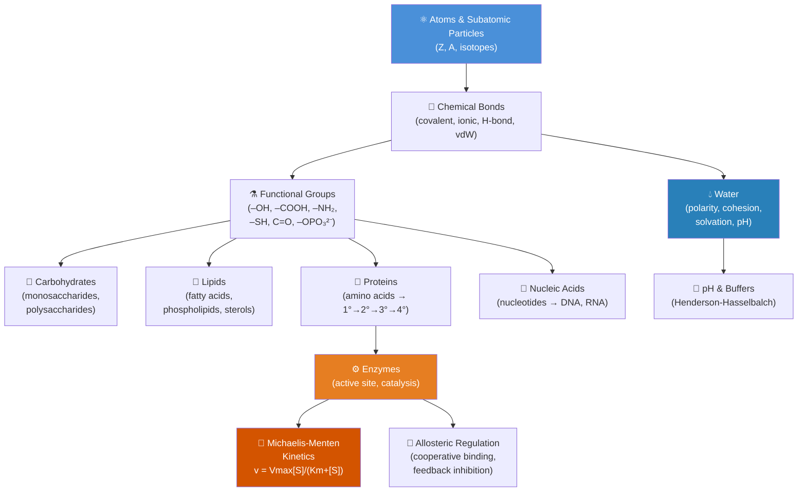

# Unit I — Chemistry of Life: Introduction {.unnumbered}


\label{sec:unit_I_unit_intro}
## Why This Unit Matters {.unnumbered}

Every organism on Earth — a bacterium dividing in a hydrothermal vent, a redwood drawing water through
100 metres of trunk, a neuron firing in your brain right now — is made of the same ~25 elements obeying
the same quantum-mechanical rules identified over the last two centuries. Chemistry is not merely a
prerequisite for biology; it **is** biology at its most fundamental level. Understanding the electron
orbitals of carbon explains why proteins fold. Understanding electronegativity explains why DNA holds its
shape. Understanding pH buffers explains why a runner's muscles do not seize in their own acid.

This unit begins with atoms and ends with molecular machines. We trace how the CHNOPS elements (carbon,
hydrogen, nitrogen, oxygen, phosphorus, sulfur) combine into functional groups, how functional groups
assemble into the four classes of biological macromolecules, and how enzymes — protein catalysts evolved
over billions of years — accelerate reactions to the speeds that life demands. Along the way you will
encounter the Pauling electronegativity scale, the Henderson-Hasselbalch equation, the Michaelis-Menten
model, and the principle of chirality: the mirror-image selectivity that means L-amino acids build your
proteins while D-sugars fuel your cells.

A thread connecting every chapter: **water**. The anomalous properties of water — its high boiling
point, the cohesion-tension mechanism in plants, its role as both solvent and reactant — make Earth
habitable and make most aqueous biochemistry possible. As the physical chemist Lawrence Henderson (1913)
argued in *The Fitness of the Environment*, water is not an incidental solvent but the molecule around
which life has been shaped by evolution.

---

## Landmark Discoveries {.unnumbered}

| Discoverer(s) | Year | Journal / Source | Discovery | Significance |
| ------------- | ---- | ---------------- | --------- | ------------ |
| Friedrich Wöhler | 1828 | *Annalen der Physik* | Synthesis of urea from inorganic ammonium cyanate | Disproved vitalism; showed organic compounds obey the same chemistry as inorganic ones |
| Linus Pauling & Robert Corey | 1951 | *Proc. Natl. Acad. Sci.* | α-helix and β-sheet structures of proteins | Established that protein secondary structure is stabilised by H-bonds; first use of electronegativity to predict biological structure |
| James Watson & Francis Crick | 1953 | *Nature* | Double-helix structure of DNA | Anti-parallel, complementary base-pairing via H-bonds; immediately suggested replication mechanism |
| Frederic Sanger | 1955 | *Biochemical Journal* | Complete amino acid sequence of bovine insulin | Proved proteins are defined covalent sequences, not random polymers; introduced sequence concept |
| Leonor Michaelis & Maud Menten | 1913 | *Biochemische Zeitschrift* | Enzyme-substrate saturation kinetics | Derived $v = V_{max}[S]/(K_m + [S])$; quantitative foundation of enzymology |
| Daniel Koshland | 1958 | *Proc. Natl. Acad. Sci.* | Induced-fit model of enzyme catalysis | Replaced lock-and-key; explained conformational changes in enzyme-substrate interaction |
| Jacques Monod, Jeffries Wyman & Jean-Pierre Changeux | 1965 | *J. Mol. Biol.* | MWC model of allosteric regulation | Showed enzymes have distinct regulatory and catalytic sites; explains cooperative binding |

---

## Key Concepts and Connections {.unnumbered}


<!-- alt: Graph showing chemistry-of-life concept map — arrows show conceptual dependencies; colour groups: blue = atomic/molecular; orange = enzyme function. -->

*Chemistry-of-life concept map — arrows show conceptual dependencies; colour groups: blue = atomic/molecular; orange = enzyme function.*

---

## Current Evidence Thread {.unnumbered}

Read \nameref{sec:unit_I_unit_intro} as the point where the chemistry of life becomes measurable. Bond polarity, hydrogen bonding, and reaction thermodynamics are not abstractions here -- they are quantities now read off cryo-EM maps, ultrafast spectroscopy, and kinetic assays, and structure predictions for macromolecules are accepted primarily once cryo-EM, NMR, or mutagenesis confirms them. As you
move through the chapters, keep a two-column note: **claim** on the left,
**evidence that would change my confidence** on the right. By the end of the
unit, each major idea should be tied to a measurement, model, citation, or
paper-based lab decision.

## Chapter Roadmap {.unnumbered}

| Chapter | Title | Core Question | Key Equation / Model |
| ------- | ----- | ------------- | -------------------- |
| **1** | Atoms, Molecules, and Chemical Bonds | Why do atoms bond, and how does bond type determine biological function? | $\Delta G^{\circ\prime} = -nF\Delta E^{\circ\prime}$ |
| **2** | Water — The Molecule of Life | What makes water anomalous, and why is that anomaly essential for life? | $\pi = iCRT$ (osmotic pressure) |
| **3** | Biological Macromolecules | How do four classes of polymer encode and carry out life's functions? | Molecular weight, degree of polymerisation |
| **4** | Enzymes and the Kinetics of Catalysis | How do enzymes lower activation energy, and how is their activity regulated? | $v = V_{max}[S]/(K_m + [S])$ |

---

## Connections Across the Textbook {.unnumbered}

\nameref{sec:unit_I_unit_intro} establishes the chemical vocabulary for the entire textbook:

- The **bond energies and functional groups** introduced here reappear in \nameref{sec:unit_III_unit_intro} (energy released by glucose oxidation), \nameref{sec:unit_IV_unit_intro} (phosphodiester bonds of DNA), and \nameref{sec:unit_V_unit_intro} (crossing-over in chromatin).
- **Enzyme kinetics** (\cref{sec:unit_I_enzymes_and_kinetics}) reappears in \nameref{sec:unit_III_unit_intro} (PFK-1 allosteric regulation), \nameref{sec:unit_VII_unit_intro} (antibiotic targets on bacterial enzymes), and \nameref{sec:unit_IX_unit_intro} (haemoglobin co-operativity).
- **pH and buffers** link directly to \nameref{sec:unit_II_unit_intro} (lysosomal pH 4.5 vs. cytoplasmic pH 7.2), \nameref{sec:unit_III_unit_intro} (mitochondrial proton gradient), and \nameref{sec:unit_IX_unit_intro} (blood acid-base balance in clinical contexts).
- **Chirality** of L-amino acids and D-sugars reappears in \nameref{sec:unit_VII_unit_intro} (D-amino acids in bacterial cell walls) and \nameref{sec:unit_V_unit_intro} (enzyme specificity in DNA repair).

> **Before you begin:** You should be comfortable with scientific notation, logarithms, and basic algebra. No prior chemistry or biology is assumed.


## Computational Toolbox — Unit I {.unnumbered}

The following demonstrates the real `src/biology/biochemistry` functions used to
generate figures and worked examples throughout \nameref{sec:unit_I_unit_intro}.

```python
from biology.biochemistry import michaelis_menten, glycolysis_summary

# Michaelis-Menten kinetics: lactate dehydrogenase (LDH)
# Vmax = 12.0 mM/s, Km = 0.8 mM (pyruvate as substrate)
result = michaelis_menten(substrate_conc=2.0, Vmax=12.0, Km=0.8)
print(f"Reaction rate at [S]=2 mM: {result.reaction_rate:.2f} mM/s")
# Expected: Reaction rate at [S]=2 mM: 8.57 mM/s
# (= 12.0 × 2.0 / (0.8 + 2.0); Vmax/2 occurs at [S]=Km=0.8 mM)

# Glycolysis summary: net products per glucose
summary = glycolysis_summary()
print(f"Net ATP yield: {summary.net_atp} ATP per glucose")
print(f"NADH produced: {summary.net_nadh} NADH per glucose")
print(f"Steps represented: {len(summary.steps)}")
# Expected:
# Net ATP yield: 2 ATP per glucose
# NADH produced: 2 NADH per glucose
# Steps represented: 10
```

> **Try it yourself:** Install the project environment (`uv sync`) and run
> `python3 -c "from biology.biochemistry import michaelis_menten; print(michaelis_menten(5, 10, 2))"`.
> Modify substrate concentration to trace the full saturation curve.

---

*Source modules: `src/biology/biochemistry/biochemistry.py` — enzyme kinetics models, macromolecule analysis.*
*Figures generated by `src/visualization/plots.py` (Michaelis-Menten plots) and `src/mermaid/biology_diagrams.py`.*

## Cross-Unit Integration {.unnumbered}

The chemistry of \nameref{sec:unit_I_unit_intro} is the necessary prelude to the cell. Every concept introduced here — covalent and non-covalent bonds, hydrophobicity, weak interactions, protein folding driven by entropy and enthalpy — becomes operational in \nameref{sec:unit_II_unit_intro}'s account of the cell membrane and the cytoskeleton. The phospholipid bilayer is a direct expression of the hydrophobic effect; membrane proteins fold so that hydrophobic side chains face the lipid interior and polar residues face the aqueous environment; ion channels exploit the same electrostatic and hydrogen-bonding logic you saw in protein structure. As you read \nameref{sec:unit_II_unit_intro}, return to the bonding diagrams of \nameref{sec:unit_I_unit_intro} whenever a transport mechanism or membrane property feels arbitrary — it is almost always a chemistry consequence.
