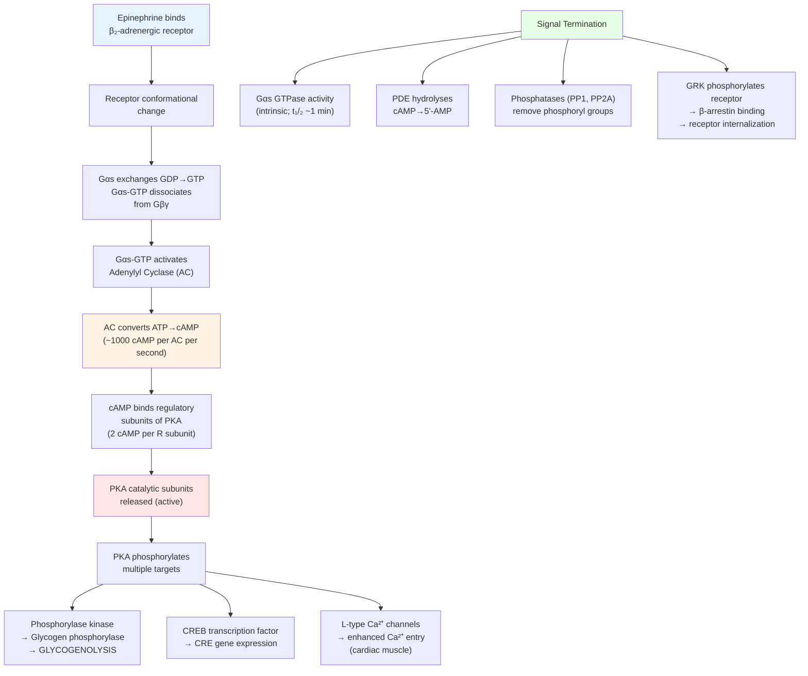
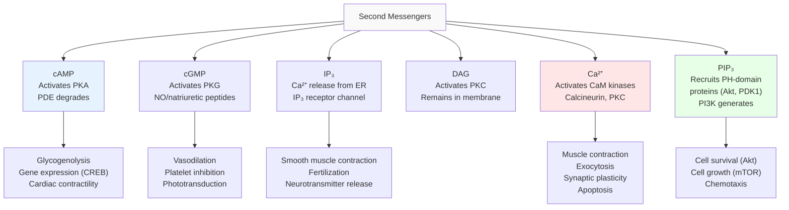
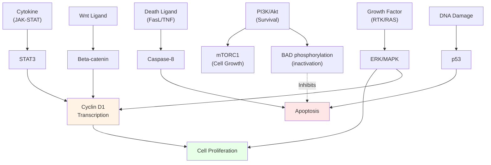
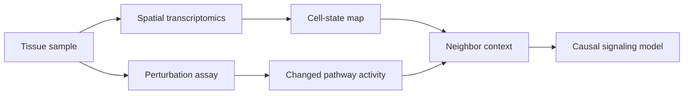

# Cell Signaling and Communication

\label{sec:unit_II_cell_signaling}


<!-- chapter-metadata-badge -->
> Level 3/3 · 55 min read · 75 min lecture · Prerequisites: \cref{sec:unit_II_membrane_transport}, \cref{sec:unit_I_enzymes_and_kinetics}

## Learning Objectives

1. Classify signaling molecules by their mode of delivery and explain signal amplification logic.
2. Describe the major families of cell-surface receptors (GPCRs, RTKs, ion channels) and their signaling mechanisms.
3. Explain the cAMP, PIP$_2$/DAG/IP$_3$, and RTK-MAP kinase [**signal transduction**](#gl:signal-transduction) cascades in detail.
4. Compare the Wnt/beta-catenin, JAK-STAT, and Notch pathways by their route from receptor to nuclear effector.
5. Explain signal termination mechanisms: GTPase activity, phosphodiesterases, phosphatases, and receptor internalization.
6. Predict how cyclin-CDK checkpoint failure alters [**cell cycle**](#gl:cell-cycle) progression, relating it to the stages of [**mitosis**](#gl:mitosis).
7. Explain the mechanisms of [**apoptosis**](#gl:apoptosis) (intrinsic and extrinsic pathways).
8. Explain cancer as dysregulated signaling and evaluate current targeted therapies.

<!-- curriculum-scaffold-start -->
### Study Blueprint

- **Big idea:** Cells communicate by converting external signals into regulated intracellular decisions.
- **Core concepts:** receptors, second messengers, signal amplification, feedback.
- **Framework alignment:** Vision & Change: Structure and function, Systems, Information flow, exchange, and storage; AP Biology: Systems Interactions, Information Storage and Transmission; NGSS-style topics: Structure and Function.
- **Model or quantitative lens:** Ligand-receptor occupancy and dose-response reasoning.
- **Data skill:** Read pathway diagrams and infer the effect of agonists, antagonists, or mutations.
- **Practice cadence:** Visual Representations, Questions and Methods, Argumentation.
- **Common misconception to repair:** A pathway diagram is a causal model, not a memorization chart.
- **Primary lab:** \nameref{sec:lab_unit_II_cell_signaling}.
- **Question bank:** \nameref{sec:q_unit_II_cell_signaling}.
- **Transfer task:** Apply signaling logic to hormones, neurotransmitters, immune receptors, or cancer mutations.
- **Bridge to computation:** `biology.physiology.physiology.homeostasis_response`.
<!-- curriculum-scaffold-end -->

---

> **Opening Vignette: When Signals Go Wrong — HER2 Breast Cancer**
>
> In 1987, Dennis Slamon's team at UCLA reported that about 25% of breast cancers showed amplification
> of the HER2 [**gene**](#gl:gene), which encodes a receptor tyrosine kinase embedded in the plasma membrane
> \citep{slamon1987her2}. In normal cells, HER2 is transiently activated when it binds
> its ligand — triggering a cascade of phosphorylation events that ultimately drive cell
> proliferation and survival. In tumors with HER2 amplification, the [**protein**](#gl:protein) is expressed at 40–100
> times the normal level; even without ligand, HER2 molecules are close enough together to activate
> each other constantly, delivering an unrelenting "grow and divide" signal.
>
> The consequences of understanding this single signaling pathway have been transformative. In 1998,
> the FDA approved trastuzumab (Herceptin), a monoclonal antibody that binds the extracellular domain
> of HER2 and blocks its dimerization and downstream signaling. In HER2-positive breast cancer,
> trastuzumab plus chemotherapy improved time to progression, response rate, and survival in metastatic HER2-overexpressing breast cancer \citep{slamon2001trastuzumab}. Every step in this therapeutic triumph
> required understanding how cells receive, transduce, and amplify molecular signals — precisely the
> subject of this chapter.
>
> *Primary sources: HER2 amplification and prognosis \citep{slamon1987her2}; trastuzumab clinical benefit \citep{slamon2001trastuzumab}.*

---


Cells receive and interpret thousands of extracellular signals simultaneously. Signaling systems share a general architecture:

**Signal (ligand) → Receptor (detection) → Transduction cascade (amplification) → Effector → Response → Termination**

### Types of Cell Signaling by Distance

: Types of Cell Signaling by Distance: Mode and Description. {#tbl:unit_II_cell_signaling_types_of_cell_signalling_by_distance}
| Mode | Description | Example | Distance |
| ---- | ----------- | ------- | -------- |
| **Endocrine** | [**Hormone**](#gl:hormone)s in bloodstream | Insulin, [**cortisol**](#gl:cortisol) | Meters |
| **Paracrine** | Local diffusion | Growth factors, prostaglandins | <1 mm |
| **Autocrine** | Self-stimulation | Tumor self-growth signals, IL-2 in T cells | Same cell |
| **Juxtacrine** | Membrane-bound ligand/receptor | Notch-Delta, ephrin-Eph | Cell contact |
| **Synaptic** | Neurotransmitter across synapse | Glutamate, GABA, acetylcholine | ~20 nm |

### Signal Transduction Logic

Signal transduction cascades exhibit four fundamental properties:

1. **Amplification:** One activated receptor activates multiple G proteins; each G protein activates multiple adenylyl cyclase molecules; each adenylyl cyclase produces many cAMP molecules. The cAMP second messenger system was established biochemically before G proteins were recognized as the transducers linking receptors to adenylyl cyclase \citep{sutherland1958cyclicamp,gilman1987gproteins}. A single epinephrine molecule can trigger release of ~10$^8$ glucose molecules from glycogen (10$^6$-fold amplification).

2. **Specificity:** Different cell types express different receptor subtypes, G proteins, and effectors. Epinephrine causes glycogen breakdown in liver (beta$_2$-adrenergic receptor, G$_s$, cAMP) but smooth muscle relaxation in bronchi (same receptor, same second messenger, different downstream targets).

3. **Integration:** Multiple signals converge on shared effectors. A cell's response reflects the integrated sum of active signaling pathways. For example, cell proliferation requires simultaneous growth factor (RTK), integrin (adhesion), and survival factor signaling.

4. **Adaptation/desensitisation:** Prolonged stimulation leads to reduced response. Mechanisms include receptor phosphorylation (by GRKs), arrestin binding, receptor internalization, and negative feedback loops \citep{alon2019}.

### Signal Amplification Cascades --- A Quantitative Treatment

Signal amplification is the architectural reason a single hormone molecule can drive a macroscopic physiological response. Three concepts make the amplification quantitative: gain per step, overall gain, and dynamic range.

**Gain per step.** Each level of a cascade has a gain $A_i$ defined as the number of activated downstream molecules per active upstream molecule (per unit time). For example, a single G$_s$α-GTP activates ~10 adenylyl cyclase molecules during its ~1 minute lifetime; each adenylyl cyclase produces ~1,000 cAMP per second, so over 30 s the gain at this step is roughly $10 \times 30{,}000 = 3 \times 10^5$.

**Overall gain.** For an $n$-step cascade, the total amplification is the product of step gains:

\begin{equation}
G_\text{total} = \prod_{i=1}^{n} A_i
\label{eq:unit_II_signaling_total_gain}
\end{equation}

This product structure means that *removing one step* of a cascade cuts gain by orders of magnitude, while *adding one step* multiplies it. The classic epinephrine→glycogenolysis cascade has 4 enzymatic amplification steps (receptor → G$_s$ → adenylyl cyclase → PKA → phosphorylase kinase → glycogen phosphorylase), each contributing $A_i \approx 10^{1.5}$, for $G_\text{total} \approx 10^{6}$. A single epinephrine molecule binding a $\beta_2$ receptor releases ~$10^8$ glucose molecules from glycogen — exactly the gain measured in liver perfusion experiments.

**Why so many steps?** A simpler cascade with the same gain — e.g., one step of $A = 10^6$ — would be biologically implausible: few signaling enzymes have $k_\text{cat} > 10^4$ s$^{-1}$ (the diffusion-limited outliers catalase and carbonic anhydrase are exceptions), and no cell could sustain enzyme concentrations giving $10^6$-fold amplification in a single reaction. The cascade architecture solves this by *multiplying* modest gains.

**Time delay and adaptation.** Each step also adds a time constant $\tau_i$ (the lifetime of the activated species). The total response time is:

\begin{equation}
\tau_\text{total} \approx \sqrt{\sum_i \tau_i^2}
\label{eq:unit_II_cell_signaling_item_1}
\end{equation}


For visual transduction (rhodopsin → transducin → PDE6 → cGMP fall): individual $\tau_i$ are ~10 ms, total response ~50 ms. For epinephrine: hundreds of milliseconds to seconds. The cascade thus also serves as a **temporal filter** — fast inputs reach the effector quickly, slow inputs are integrated.

**Cooperativity sharpens the response.** \cref{fig:unit_II_hill_equation} contrasts Hill coefficients that steepen receptor occupancy around $K_d$. A linear cascade has gain but not steepness — the dose–response is hyperbolic (Hill coefficient 1). To make a switch-like response, cells use:
- *Multiple binding sites* (hemoglobin O$_2$, $n_H = 2.8$).
- *Multi-site phosphorylation requiring full occupancy* (ERK requires both Thr and Tyr phosphorylation; effective $n_H \approx 5$ in the MAP kinase cascade).
- *Positive feedback loops* (ERK → SOS feedback creates bistability).

\begin{figure}[htbp]
\centering
\includegraphics[width=0.85\textwidth]{../figures/hill_equation.png}
\caption{Hill-equation receptor occupancy for cooperative binding. Higher Hill coefficients steepen the dose-response curve around the dissociation constant $K_d$.}
\label{fig:unit_II_hill_equation}
\end{figure}

<!-- alt: Sigmoid occupancy curves for Hill coefficients n equals 1, 2, and 4 on a log-scaled ligand axis. -->

The Huang–Ferrell analysis of the MAPK cascade showed mathematically that *three sequential switches* (each with $n_H = 1.7$ from its dual phosphorylation requirement) compose to give an overall Hill coefficient near 5 — converting a graded growth-factor input into an essentially digital ERK output. This is the molecular substrate of the cell's "decision making" between proliferation and quiescence.

> **Concept Check 1a:** A six-step cascade has a gain of 10 per step. What is the total gain? If a single step is removed (now five steps), by what factor does the total gain change?

### Quantitative Foundations of Signal Transduction

**Receptor--ligand binding equilibrium.** The dissociation constant $K_d$ quantifies receptor affinity:

\begin{equation}
K_d = \frac{[\text{R}][\text{L}]}{[\text{RL}]}
\label{eq:unit_II_cell_signaling_item_2}
\end{equation}


where $[\text{R}]$ is free receptor concentration, $[\text{L}]$ is free ligand concentration, and $[\text{RL}]$ is the receptor--ligand complex. The fraction of receptors occupied at a given ligand concentration is:

\begin{equation}
\theta = \frac{[\text{L}]}{[\text{L}] + K_d}
\label{eq:unit_II_cell_signaling_item_3}
\end{equation}


When $[\text{L}] = K_d$, exactly 50% of receptors are occupied. Typical $K_d$ values: [**insulin receptor**](#gl:insulin-receptor) ~0.1 nM; epinephrine--beta$_2$ receptor ~1 μM.

**The Hill equation** models cooperative binding and switch-like signaling responses:

\begin{equation}
\theta = \frac{[\text{L}]^{n_H}}{K_d^{n_H} + [\text{L}]^{n_H}}
\label{eq:unit_II_cell_signaling_item_4}
\end{equation}


where $n_H$ is the Hill coefficient. $n_H = 1$ gives a hyperbolic (Michaelis--Menten-like) curve; $n_H > 1$ produces a sigmoidal (switch-like) response. The MAPK cascade achieves an effective $n_H \approx 5$, creating the ultrasensitive most-or-none ERK activation observed experimentally (Huang \& Ferrell, 1996, *PNAS*).

**Signal amplification cascade.** If each step in a cascade has amplification factor $A_i$, the total amplification is:

\begin{equation}
G_{\text{total}} = \prod_{i=1}^{n} A_i = A_1 \times A_2 \times \cdots \times A_n
\label{eq:unit_II_cell_signaling_item_5}
\end{equation}


For the epinephrine--glycogen cascade ($n = 4$ steps, $A_i \approx 10^{1.5}$ per step): $G_{\text{total}} \approx 10^6$, explaining how one hormone molecule triggers release of $\sim 10^8$ glucose molecules.

### Worked Example: Receptor Fractional Occupancy

**Problem:**
The epidermal growth factor receptor (EGFR) is an RTK with a dissociation constant ($K_d$) for its ligand, EGF, of approximately $2.0 \text{ nM}$ ($2.0 \times 10^{-9} \text{ M}$). 
Assuming standard non-cooperative binding behavior ($n_H = 1$), calculate the fractional occupancy (θ) of the EGFR population on a cell surface when the extracellular concentration of EGF is $6.0 \text{ nM}$. What concentration of EGF would be required to achieve 90% receptor occupancy?

**Solution:**

1. **Calculate occupancy at 6.0 nM:**
   Using the receptor fractional occupancy equation:
   $$ \theta = \frac{[\text{L}]}{[\text{L}] + K_d}  \label{eq:unit_II_cell_signaling_item_6}$$

   Substitute the given values ($[\text{L}] = 6.0 \text{ nM}$, $K_d = 2.0 \text{ nM}$):
   $$ \theta = \frac{6.0}{6.0 + 2.0} = \frac{6.0}{8.0} = 0.75  \label{eq:unit_II_cell_signaling_item_7}$$

   Thus, **75%** of the EGF receptors are bound to ligand.

2. **Calculate the ligand concentration required for 90% occupancy:**
   Set $\theta = 0.90$ and solve for $[\text{L}]$:
   $$ 0.90 = \frac{[\text{L}]}{[\text{L}] + 2.0}  \label{eq:unit_II_cell_signaling_item_8}$$

   $$ 0.90([\text{L}] + 2.0) = [\text{L}]  \label{eq:unit_II_cell_signaling_item_9}$$

   $$ 0.90[\text{L}] + 1.80 = [\text{L}]  \label{eq:unit_II_cell_signaling_item_10}$$

   $$ 1.80 = 0.10[\text{L}]  \label{eq:unit_II_cell_signaling_item_11}$$

   $$ [\text{L}] = \frac{1.80}{0.10} = 18.0 \text{ nM}  \label{eq:unit_II_cell_signaling_item_12}$$

   An EGF concentration of **18.0 nM** is required to saturate 90% of the receptors. Note that achieving $90\%$ occupancy requires a ligand concentration exactly $9 \times K_d$.

> **Concept Check 1:** Epinephrine stimulates both beta$_2$-adrenergic receptors (G$_s$-coupled, cAMP elevation) on bronchial smooth muscle and alpha$_1$-adrenergic receptors (G$_q$-coupled, IP$_3$/Ca$^{2+}$) on vascular smooth muscle. Why does the same hormone cause bronchodilation in the lungs but vasoconstriction in skin blood vessels?


### Worked Example: Signal Amplification Through a Kinase Cascade

**Problem:**
The MAP kinase module is a three-tier cascade (Raf $\rightarrow$ MEK $\rightarrow$ ERK) in which each activated kinase phosphorylates and activates roughly $10$ molecules of the next kinase ($A_1 = A_2 = A_3 = 10$).

1. Using the cascade gain relation, what is the total amplification of the three-tier module?
2. If $50$ growth-factor receptors are activated, how many ERK molecules are activated?
3. What happens to the total gain if one tier is bypassed (a two-step cascade)?

**Solution:**

1. **Total gain is the product of the per-step gains:**
   $$ G_{\text{total}} = \prod_{i=1}^{3} A_i = A_1 \times A_2 \times A_3 = 10 \times 10 \times 10 = 10^3  \label{eq:unit_II_cell_signaling_item_13}$$

   The three-tier module amplifies the input $1{,}000$-fold.

2. **Scale by the number of activated receptors** ($N_R = 50$):
   $$ N_{\text{ERK}} = N_R \times G_{\text{total}} = 50 \times 10^3 = 5.0 \times 10^4  \label{eq:unit_II_cell_signaling_item_14}$$

   So $50$ activated receptors yield about $50{,}000$ activated ERK molecules.

3. **Drop one tier** (now a two-step cascade, $G = A_1 \times A_2$):
   $$ G_{\text{2-step}} = 10 \times 10 = 10^2  \label{eq:unit_II_cell_signaling_item_15}$$

   Removing a single tier cuts the gain by a factor of $10^3 / 10^2 = 10$.

Because the cascade gain is a product rather than a sum, each added tier multiplies the response while a lost tier divides it --- a small number of detected ligand molecules can therefore drive a large, switch-like cellular decision, and dropping or inhibiting one kinase tier (a common drug strategy) sharply attenuates the output.


---

## Cell-Surface Receptors and Signal Initiation

### G Protein-Coupled Receptors (GPCRs)

GPCRs are the largest receptor superfamily (~800 in humans; ~34% of approved drug targets). They have 7 transmembrane alpha-helices, an extracellular N-terminus, and an intracellular C-terminus. Binding of ligand activates the heterotrimeric G protein (G-alpha, G-beta-gamma), the receptor-coupled switch formalised in classic G-protein biochemistry \citep{gilman1987gproteins}:


<!-- alt: Flowchart showing g_s-cAMP-PKA signaling cascade and its termination mechanisms. Signal amplification occurs at multiple levels: one receptor activates multiple G proteins, each adenylyl cyclase produces ~1,000 cAMP/s, and PKA phosphorylates multiple substrates. -->

*The G$_s$-cAMP-PKA signaling cascade and its termination mechanisms. Signal amplification occurs at multiple levels: one receptor activates multiple G proteins, each adenylyl cyclase produces ~1,000 cAMP/s, and PKA phosphorylates multiple substrates.*

**G$_s$ pathway (stimulatory):**
Hormone (e.g., epinephrine) → beta$_2$-adrenergic receptor → G$_s$ → **adenylyl cyclase** activated → ATP → **cAMP** → **Protein Kinase A (PKA)** → phosphorylates multiple downstream targets (glycogen phosphorylase kinase, CREB [**transcription**](#gl:transcription) factor, ion channels, etc.) \citep{sutherland1958cyclicamp,gilman1987gproteins}

**G$_i$ pathway (inhibitory):**
Inhibits adenylyl cyclase, reducing cAMP. Examples: opioid receptors (mu, delta, kappa), muscarinic M2 receptors (cardiac parasympathetic), alpha$_2$-adrenergic receptors.

**G$_q$ pathway:**
Activates **phospholipase C-beta** → cleaves PIP$_2$ → **IP$_3$** (Ca$^{2+}$ release from ER via IP$_3$ receptors) + **DAG** (activates Protein Kinase C, PKC). This dual second messenger system controls smooth muscle contraction, platelet activation, and secretion.

**G$_{12/13}$ pathway:**
Activates Rho GEFs → Rho GTPase → ROCK (Rho-associated kinase) → cytoskeletal remodeling, cell migration, smooth muscle contraction.

**cAMP signaling components:**
- **PDE (phosphodiesterase):** hydrolyses cAMP to 5'-AMP, terminating the signal. Caffeine and theophylline inhibit PDE → elevated cAMP → CNS stimulation, bronchodilation. Sildenafil (Viagra) inhibits PDE5 (specific for cGMP in penile smooth muscle).
- **AKAP (A Kinase Anchoring Proteins):** target PKA to specific subcellular locations, providing spatial specificity to cAMP signaling.
- **GTPase activity of G-alpha:** G-alpha is a self-inactivating molecular switch (built-in GTPase; k$_{\text{cat}}$ ~1 min$^{-1}$). RGS (Regulators of G-protein Signaling) proteins accelerate GTP hydrolysis, shortening signal duration.

### The G-Protein Cycle in Detail

Heterotrimeric G proteins (Gα + Gβγ) are molecular switches that integrate three biochemical events: GDP release, GTP binding, and GTP hydrolysis. The cycle is canonical for most GTPases — Ras, Rho, Rab, Ran, and the heterotrimeric G proteins most follow the same logic, with different specifics.

: The G-Protein Cycle in Detail: State and Composition. {#tbl:unit_II_cell_signaling_the_g_protein_cycle_in_detail}
| State | Composition | Conformation | Signaling |
| ----- | ----------- | ------------ | ---------- |
| **Inactive (GDP)** | Gα-GDP·Gβγ heterotrimer | "Off" | No effector activation |
| **Receptor-bound** | Gα-GDP·Gβγ + activated GPCR | GPCR catalyses GDP release | Transient |
| **Empty** | Gα·Gβγ + GPCR (very brief) | Nucleotide-free | Allows GTP binding |
| **Active (GTP)** | Gα-GTP + free Gβγ | "On"; conformational change in switch I/II/III | Activates effectors |
| **Hydrolysing** | Gα-GTP intrinsic GTPase | Slow ($k_\text{cat}$ ~0.05 s$^{-1}$, $t_{1/2}$ ~15 s) | Self-inactivation |
| **GAP-accelerated** | Gα-GTP + RGS protein | Stabilizes transition state | $t_{1/2}$ shortens to ~1 s |
| **Reassembly** | Gα-GDP + Gβγ | Heterotrimer reforms | Cycle closes |

**Rate constants and cellular consequences.** For Gα$_s$, the intrinsic GTP hydrolysis rate is ~0.05 s$^{-1}$ (so the active state lasts ~20 s without acceleration). RGS proteins (RGS2, RGS4, RGS9) accelerate this 100–1,000×, shortening the signal to ~50 ms. Disease example: RGS9 deficiency causes **bradyopsia** — a visual disorder where bright lights produce after-images that linger because transducin (the rod photoreceptor Gα) cannot be turned off rapidly.

**Why the cycle is reversible.** Each step is in principle reversible at thermodynamic equilibrium. The cycle is driven *forward* by:
- Receptor activation (provides the catalytic step for GDP release);
- High cellular [GTP]:[GDP] ratio (~10:1, maintained by metabolism);
- Coupling of GTP hydrolysis to effector dissociation (mass-action irreversibility).

Without metabolic GTP, the cycle would stall. ATP-depleted cells therefore lose most GPCR-mediated signaling — one reason why ischemic damage propagates so quickly in tissues.

### GPCR Desensitisation and β-Arrestin

Continuous stimulation of a GPCR rapidly attenuates its response — within seconds to minutes, the system **desensitises**. This is a textbook example of a homeostatic negative feedback loop and the mechanistic basis for clinically important phenomena: tachyphylaxis (rapid loss of drug effect), tolerance (e.g., to opioids, β-agonists), and receptor downregulation.

**Three layers of desensitisation:**

1. **Homologous desensitisation (rapid, agonist-specific; seconds).**
   - Active GPCR is phosphorylated by **GRKs (G-protein-coupled receptor kinases)**, especially GRK2 and GRK3. GRK2 specifically recognizes *active* receptor conformation; ligand-free or inactive receptors are not phosphorylated.
   - Phosphorylated GPCR recruits **β-arrestin** (β-arrestin-1 or -2). β-arrestin binding sterically blocks G-protein coupling — the receptor is now "uncoupled" from G$_s$/G$_q$ but still on the cell surface.
2. **Heterologous desensitisation (slower, cross-pathway; seconds to minutes).**
   - PKA and PKC phosphorylate GPCRs at distinct sites, attenuating responses to any agonist that activates that receptor (regardless of whether it's currently bound). This integrates signaling across pathways.
3. **Receptor internalization (slow, persistent; minutes to hours).**
   - β-arrestin recruits clathrin and AP2 → receptor is internalised in clathrin-coated vesicles → enters the early endosome.
   - From the endosome: receptors can be **recycled** back to the plasma membrane (rapid, restores response within minutes — the path of β$_2$-adrenergic receptor) or sorted to **lysosomes** for **downregulation** (slow, requires hours-to-days for new receptor synthesis to restore response — the path of opioid receptors after chronic agonist exposure).

**Beyond G-protein signaling: β-arrestin as a signaling scaffold.** Originally thought to "merely" terminate G-protein signaling, β-arrestins are now recognized as scaffolds for their own kinase cascades — ERK, JNK, p38 MAPK can be activated by β-arrestin-bound receptors *after* internalization, generating a second wave of signaling distinct from the initial G-protein wave. Some agonists (called **biased agonists**) preferentially activate one pathway:
- **Carvedilol** (β-blocker) inhibits G$_s$ but activates β-arrestin signaling — this dual action may underlie its superior efficacy in heart failure compared to other β-blockers.
- **TRV130 / oliceridine** (μ-opioid agonist, FDA-approved 2020) is biased toward G-protein signaling and away from β-arrestin — this reduces respiratory depression and constipation while preserving analgesia.

> **Concept Check 1b:** A patient with asthma uses an inhaled β$_2$-agonist (albuterol) every 4 hours for several days. The drug becomes progressively less effective (tachyphylaxis). Explain at the molecular level — which mechanism (homologous, heterologous, internalization/downregulation) is most likely responsible for each time-scale of tolerance?

### Second Messenger Kinetics

Second messengers are diffusible small molecules that connect receptors to downstream effectors. Their effective signaling depends on three quantitative parameters: production rate, diffusion (and spatial spread), and degradation rate.

**cAMP kinetics.** Adenylyl cyclase produces cAMP at ~1,000 molecules/s per active enzyme. cAMP degradation by **phosphodiesterases (PDEs)** has half-lives ranging from ~50 ms (cardiac muscle, near-membrane PDE3/PDE4 microdomains) to several seconds (cytoplasmic bulk). Diffusion coefficient $D \approx 300$ μm$^2$/s in cytoplasm; diffusion length $\ell = \sqrt{D \tau}$. With $\tau_{1/2} = 100$ ms, $\ell \approx 5$ μm — short enough to create spatial gradients within a single cell. AKAP scaffolds and PDE microdomains create "cAMP nano-domains" of just ~100 nm where local concentrations can be 10–100× the cell average. This explains how a single cell can use cAMP to signal *locally* (e.g., individual ion channels) without flooding the whole cell.

**The PDE family and pharmacology.** Eleven PDE families exist in humans, each with tissue-specific expression:

: Second Messenger Kinetics: PDE family and Substrate. {#tbl:unit_II_cell_signaling_second_messenger_kinetics}
| PDE family | Substrate | Tissue / function | Inhibitor (drug) | Clinical use |
| ---------- | --------- | ----------------- | ---------------- | ------------ |
| PDE3 | cAMP > cGMP | Cardiac, vascular smooth muscle | Milrinone, Cilostazol | Heart failure, claudication |
| PDE4 | cAMP | Inflammatory, CNS | Roflumilast, Apremilast | COPD, psoriasis |
| **PDE5** | cGMP primarily | Vascular smooth muscle (penile, pulmonary) | **Sildenafil (Viagra)**, Tadalafil | Erectile dysfunction, pulmonary hypertension |
| PDE6 | cGMP | Photoreceptors | None therapeutic | (Mutated in retinitis pigmentosa) |
| PDE9, PDE10 | cAMP, cGMP | Brain, smooth muscle | Various | Cognitive disorders (trial) |

**The Viagra story (a quintessential mechanism-to-medicine path).** Pfizer scientists were originally testing sildenafil in 1989 as a treatment for angina (the rationale: PDE5 inhibition → cGMP buildup → vasodilation → coronary blood flow). Its anti-anginal effects were modest, but male patients in trials reported a striking side effect. Pfizer pivoted; sildenafil was approved for erectile dysfunction in 1998 and became a major pharmaceutical product. The mechanism is exquisitely specific: nitric oxide → guanylyl cyclase → cGMP → PKG → relaxation of penile smooth muscle. PDE5 normally degrades cGMP; sildenafil blocks PDE5; cGMP accumulates *primarily where it is being made* (i.e., where NO is released). This "context-conditional" pharmacology — drug effect primarily where the natural signal is active — now informs many other targeted therapies. Tadalafil (Cialis) has a longer half-life (17.5 h vs. 4 h for sildenafil) due to its different binding kinetics in the PDE5 active site.

**IP$_3$ / Ca$^{2+}$ kinetics.** IP$_3$ has a half-life of ~1 second (rapid dephosphorylation by IP$_3$-5-phosphatase); Ca$^{2+}$ signals are buffered by ~99% by cytoplasmic proteins (calbindin, calretinin) and re-sequestered by SERCA in <1 second. Therefore Ca$^{2+}$ "spikes" and "waves" propagate at controllable, intermediate speeds (~10–50 μm/s), enabling spatially organized signaling such as the fertilization Ca$^{2+}$ wave that sweeps a sea urchin egg in ~15 seconds.


<!-- alt: Graph showing major second messenger systems and their downstream effects. Each second messenger activates specific protein kinases or effectors that mediate distinct cellular responses. -->

*Major second messenger systems and their downstream effects. Each second messenger activates specific protein kinases or effectors that mediate distinct cellular responses.*

> **Clinical Connection: Cholera and Pertussis Toxins**
> **Cholera toxin** ADP-ribosylates G$_s$-alpha, preventing GTP hydrolysis. G$_s$ is constitutively active → massive cAMP production in intestinal epithelial cells → CFTR Cl$^-$ channels open → Cl$^-$ and water secretion → severe watery diarrhea (up to 20 L/day), potentially fatal from dehydration.
> **Pertussis toxin** (whooping cough) ADP-ribosylates G$_i$-alpha, preventing its activation. Without G$_i$ inhibition, adenylyl cyclase is overactive → elevated cAMP in respiratory epithelial cells → impaired mucociliary clearance → persistent cough. see \cref{sec:unit_II_membrane_transport} for CFTR.

### Receptor Tyrosine Kinases (RTKs)

RTKs are single-pass transmembrane receptors with a cytoplasmic tyrosine kinase domain. Ligand binding (e.g., EGF, PDGF, insulin, FGF, VEGF) → receptor **dimerization** → **trans-autophosphorylation** of tyrosines → phosphotyrosines recruit adaptor proteins via SH2 and PTB domains.

```mermaid
sequenceDiagram
    participant L as Ligand (EGF)
    participant R as EGFR (RTK)
    participant A as Adaptor (Grb2/SOS)
    participant RAS as RAS GTPase
    participant RAF as RAF (MAPKKK)
    participant MEK as MEK (MAPKK)
    participant ERK as ERK (MAPK)
    participant TF as Transcription Factors

    L->>R: EGF binds extracellular domain
    R->>R: Receptor dimerization + trans-autophosphorylation
    R->>A: pTyr binds Grb2 SH2 domain; Grb2 recruits SOS (GEF)
    A->>RAS: SOS catalyses GDP→GTP exchange on RAS
    Note over RAS: RAS-GTP = active (molecular switch ON)
    RAS->>RAF: RAS-GTP recruits RAF to membrane → RAF activation
    RAF->>MEK: RAF phosphorylates MEK (Ser218/Ser222)
    MEK->>ERK: MEK phosphorylates ERK (Thr/Tyr dual phosphorylation)
    ERK->>TF: ERK translocates to nucleus
    TF->>TF: Phosphorylates Elk-1, Myc, Fos → gene expression
    Note over TF: Cell proliferation, differentiation, survival

    Note over RAS: SIGNAL OFF: GAPs (NF1) accelerate RAS GTPase → RAS-GDP
    Note over ERK: SIGNAL OFF: MKPs (DUSP) dephosphorylate ERK
```
<!-- alt: Sequence diagram showing RTK/RAS/MAPK signaling cascade. Each step amplifies the signal: one activated EGFR can activate ~100 RAS molecules, producing ~10,000 activated ERK molecules. -->

*The RTK/RAS/MAPK signaling cascade. Each step amplifies the signal: one activated EGFR can activate ~100 RAS molecules, producing ~10,000 activated ERK molecules.*

Each step amplifies: one activated EGFR → ~100 RAS → ~10,000 activated ERK molecules.

### Receptor Tyrosine Kinase Activation in Detail

RTKs are activated by **ligand-induced dimerization** — and the choreography is more elegant than the cartoon suggests. Different RTK families use different dimerization strategies:

1. **Bivalent ligand** (e.g., PDGF, VEGF, SCF): the ligand is a dimer that bridges two receptor monomers. Binding stoichiometry is 2 ligands : 2 receptors.
2. **Receptor-mediated dimerization** (e.g., EGFR, HER2/3/4): the ligand is monomeric but binding induces a conformational change that exposes a "dimerization arm" on the extracellular domain; two ligand-bound receptors then pair through these arms. Stoichiometry: 2 ligands : 2 receptors.
3. **Pre-formed dimers** (e.g., insulin receptor, IGF-1R): exist as covalent (α$_2$β$_2$) tetramers held together by disulphide bonds. Ligand binding does not change quaternary structure but does induce a conformational change that brings the two intracellular kinase domains into productive juxtaposition.

**Trans-autophosphorylation.** Upon dimerization, the two intracellular kinase domains phosphorylate each other on multiple tyrosine residues in trans (kinase A phosphorylates kinase B and vice versa). This serves three purposes:
- Increases kinase activity ~100-fold by stabilizing the active conformation.
- Creates docking sites for downstream adaptor proteins.
- Sets a stoichiometric "code" — different receptors phosphorylate different tyrosine combinations, recruiting different adaptors.

**SH2 and PTB domains: phosphotyrosine readers.** Phosphorylated tyrosines are recognized by two protein-domain types:
- **SH2 (Src homology 2)** domains, ~100 amino acids, recognize pTyr in a sequence-specific context (the +1 to +3 residues C-terminal to pTyr determine specificity). Each SH2 domain has a characteristic preference (e.g., Grb2 SH2 prefers pYXNX; PI3K-p85 SH2 prefers pYXXM; Src family SH2 prefers pYEEI).
- **PTB (Phosphotyrosine Binding)** domains recognize the residues *N-terminal* to pTyr. Examples: Shc, IRS-1.

The combinatorial code of pTyr sites and SH2/PTB readers explains how the same kinase domain (intrinsically not sequence-specific) can produce highly specific signaling outputs.

**Specific RTK examples:**

: Receptor Tyrosine Kinase Activation in Detail: RTK and Ligand. {#tbl:unit_II_cell_signaling_receptor_tyrosine_kinase_activation_in_detail}
| RTK | Ligand | Dimerization type | Key adaptors recruited |
| --- | ------ | ----------------- | ---------------------- |
| EGFR (HER1) | EGF, TGF-α | Receptor-mediated | Grb2 (→ RAS); PLC-γ (→ DAG/IP$_3$); STAT3 |
| HER2 | None known | Heterodimerises with HER1/3/4 | Same as above; HER2-HER3 strongest mitogen |
| Insulin R | Insulin | Pre-formed | IRS-1/2 (→ PI3K, Grb2); Shc |
| FGFR | FGF + heparan sulfate | Bivalent ligand + co-receptor | FRS2 (→ Grb2, Shp2); PLC-γ |
| VEGFR2 | VEGF-A | Bivalent ligand | TSAd; PLC-γ; Shc |
| Trk receptors | NGF, BDNF | Bivalent (TrkA: 1 NGF dimer / 2 receptors) | Shc; PLC-γ; FRS2 |

> **Clinical Connection: HER2 and Trastuzumab Reconsidered.** Trastuzumab binds the membrane-proximal extracellular subdomain IV of HER2 — *not* the dimerization arm. So how does it work? Multiple mechanisms: (1) it sterically interferes with HER2-HER2 self-dimerization in amplified cancers; (2) it triggers **antibody-dependent cellular cytotoxicity (ADCC)** by recruiting NK cells via Fc receptors; (3) it accelerates HER2 internalization and degradation. Trastuzumab-resistant HER2$^+$ tumors often retain ADCC sensitivity, which is why **trastuzumab-emtansine (T-DM1)** — an antibody–drug conjugate carrying a microtubule poison — works after trastuzumab failure: it exploits residual ADCC and adds direct cytotoxicity. The original trastuzumab trial is a useful evidence anchor because it tied receptor overexpression to a matched intervention and patient outcomes, not just a pathway diagram \citep{slamon2001trastuzumab}.

### The MAP Kinase Cascade --- Three-Tier Hierarchy

The MAP kinase (MAPK) cascade is the canonical example of a multi-tier signaling cascade. Eukaryotes have multiple parallel MAPK cascades; the best-studied is the **classical (ERK) MAPK cascade**, but JNK and p38 stress-activated cascades follow the same architecture:

1. **MAPKKK (MAP kinase kinase kinase)** — activated by upstream signals (e.g., Ras-GTP for ERK; MEKK1 for JNK; ASK1 for p38).
2. **MAPKK (MAP kinase kinase)** — phosphorylated and activated by MAPKKK on two serines/threonines; in turn, dual-specificity kinase (Ser/Thr/Tyr) for the next tier.
3. **MAPK** — phosphorylated by MAPKK on Thr-X-Tyr motif in the activation loop; both phosphorylations required for activity.

: The MAP Kinase Cascade --- Three-Tier Hierarchy: Cascade and MAPKKK. {#tbl:unit_II_cell_signaling_the_map_kinase_cascade_three_tier_hierarchy}
| Cascade | MAPKKK | MAPKK | MAPK | Activated by | Output |
| ------- | ------ | ----- | ---- | ------------ | ------ |
| Classical (ERK) | RAF (A-, B-, C-RAF) | MEK1/2 | ERK1/2 | Growth factors (RTKs); RAS-GTP | Proliferation, differentiation |
| JNK | MEKK1, MLK1-3, ASK1 | MKK4, MKK7 | JNK1/2/3 | Cytokines, UV, stress | Stress response, apoptosis |
| p38 | MTK1, MEKK3, ASK1 | MKK3, MKK6 | p38 (α, β, γ, δ) | Inflammation, osmotic stress | Cytokine production, cell-cycle arrest |
| ERK5 | MEKK2, MEKK3 | MEK5 | ERK5 | Growth factors, oxidative stress | Proliferation, vascular development |

**Why three tiers?** The architecture provides:
- **Amplification** — three sequential gain stages (each ~10×) → 1000× total amplification.
- **Ultrasensitivity** — dual-phosphorylation requirement at the MAPK tier creates an effective $n_H \approx 5$ at the output, converting graded input into switch-like ERK activity (Huang & Ferrell 1996).
- **Insulation by scaffolds** — KSR1 binds RAF, MEK1, and ERK1; this prevents undesired cross-activation between parallel MAPK cascades that share components. Yeast pheromone-response cascade uses **Ste5** scaffold; mammals use KSR1 (ERK), JIP1 (JNK), OSM (p38).
- **Negative feedback by specific phosphatases** — DUSP1-6 (dual-specificity phosphatases / MKPs) selectively dephosphorylate specific MAPKs; their expression is itself induced by ERK, creating a delayed negative feedback that produces transient ERK activation.

The combination of cascade ultrasensitivity + scaffold insulation + DUSP feedback is why activation of "the same RAS-MAPK pathway" can produce *opposite* outcomes depending on context: transient activation → proliferation (ERK off before cell-cycle arrest); sustained activation → differentiation (ERK on long enough to upregulate p21 and exit the cycle); even higher activation → senescence (ERK-driven oncogene-induced senescence). Cell fate is encoded in the *temporal pattern* of ERK, not just its peak amplitude.

**Key pathway components:**

: The MAP Kinase Cascade --- Three-Tier Hierarchy: Component and Function. {#tbl:unit_II_cell_signaling_the_map_kinase_cascade_three_tier_hierarchy_2}
| Component | Function | Human disease when mutated |
| --------- | -------- | ------------------------- |
| EGFR (ErbB1) | RTK; EGF binding | Non-small cell lung cancer |
| HER2 (ErbB2) | RTK; no known ligand; heterodimerises | Breast cancer (amplified in ~25%) |
| RAS (K-RAS, H-RAS, N-RAS) | Small GTPase; molecular switch | Pancreatic (~95%), colorectal (~40%), lung (~30%) |
| RAF (B-RAF) | Ser/Thr kinase (MAPKKK) | Melanoma (V600E, ~50%), thyroid cancer |
| NF1 (neurofibromin) | RAS-GAP (turns RAS off) | Neurofibromatosis type 1 |
| PTEN | PIP$_3$ phosphatase (opposes PI3K) | Glioblastoma, prostate, endometrial cancer |

### Ligand-Gated Ion Channels

Direct coupling of ligand binding to ion flow, bypassing G proteins. Fastest signaling (~ms).

- **Nicotinic acetylcholine receptor (nAChR):** pentameric (alpha$_2$-beta-gamma-delta); 2 ACh bind → conformational change → Na$^+$/K$^+$ channel opens → [**depolarization**](#gl:depolarization) → muscle contraction
- **GABA$_A$ receptor:** Cl$^-$ channel; GABA binding → Cl$^-$ influx → hyperpolarization → inhibition. Target of benzodiazepines (bind [**allosteric**](#gl:allosteric) site → enhanced Cl$^-$ flux → sedation/anxiolysis). Also target of barbiturates, ethanol, and general anaesthetics.
- **NMDA glutamate receptor:** requires simultaneous glutamate + glycine binding AND membrane depolarization to remove Mg$^{2+}$ block; Ca$^{2+}$ entry → CaMKII activation → LTP (Learning and memory). Coincidence detector for Hebbian learning.

> **Concept Check 2:** Curare blocks nAChRs at the neuromuscular junction. Predict the clinical effects. How does this differ from the effect of an acetylcholinesterase inhibitor (e.g., neostigmine)?

> **Concept Check (Analysis):** Receptor tyrosine kinases (RTKs) activate Ras through the SOS-GEF mechanism. The Ras-GTP → Ras-GDP step is intrinsically slow ($k_\text{cat} \sim 10^{-4}$ s$^{-1}$) but is ~10$^5$-fold accelerated by GAPs (GTPase-Activating Proteins). (a) Why does the cell need both intrinsic GTPase activity and GAP acceleration --- what would happen to Ras signaling if GAPs were absent? (b) Oncogenic Ras mutations (G12V, Q61L) abolish GAP sensitivity while retaining GTP binding --- calculate how long Ras-GTP would persist in a cell with [GTP] = 0.5 mM if solely intrinsic GTPase operates ($t_{1/2} = \ln 2 / k_\text{cat} \approx 7000$ s ≈ 2 h). (c) The drug sotorasib (AMG-510) covalently targets KRAS G12C specifically. Explain the chemical basis of this selectivity (G12C introduces a cysteine near the switch-II/GTPase active site, accessible to a Michael-acceptor warhead) and why this approach cannot work for G12V or G12D mutations.

> **Worked Example --- cAMP Cascade Amplification:** Epinephrine at [Epi] = 1 nM binds β-adrenergic receptors ($K_d$ = 0.3 nM; fractional occupancy = $1/(1 + K_d/[\text{Epi}])$ = $1/(1+0.3) \approx 0.77$, or 77%). Each occupied receptor activates ~100 G$\alpha_s$ molecules over its active lifetime (~10 s at ~10 activations/s). Each active G$\alpha_s$ activates one adenylyl cyclase for ~10 s, producing ~1,000 cAMP molecules. Each PKA molecule, once activated by 2 cAMP, phosphorylates ~100 substrate molecules per minute. Cascade amplification per 1 receptor: 1 × 100 G$\alpha_s$ × 1,000 cAMP × 100 substrates ≈ 10$^7$. Starting from a single hormone molecule and 77% receptor occupancy across the cell-surface receptor population, the integrated amplification factor reaches ~10$^8$--10$^9$ phosphorylated glycogen-phosphorylase molecules per bound hormone. This is why a single epinephrine release event can produce a measurable physiological response (heart-rate, glycogenolysis) within ~30 seconds.


---

## Intracellular Receptors for Lipid-Soluble Signals

Lipophilic signaling molecules (steroid hormones, thyroid hormone, retinoic acid, vitamin D) diffuse through the membrane and bind **cytoplasmic or nuclear receptors** --- ligand-activated transcription factors. The nuclear receptor superfamily includes 48 members in humans.

**Classic glucocorticoid pathway:**
1. Cortisol crosses membrane (lipophilic)
2. Binds glucocorticoid receptor (GR) in [**cytoplasm**](#gl:cytoplasm)
3. Hsp90 dissociates; GR dimerises
4. Translocates to nucleus via NLS
5. Binds glucocorticoid response elements (GREs) in DNA (consensus: AGAACAnnnTGTTCT)
6. Recruits coactivators (SRC-1, p300/CBP) → transcriptional activation

Target genes include anti-inflammatory (IkB-alpha, annexin A1), gluconeogenic (PEPCK, G6Pase), and immunosuppressive genes. Dexamethasone (synthetic glucocorticoid) is widely used for inflammation and autoimmune disease.

**Other nuclear receptors:**
- **Estrogen receptor (ER-alpha, ER-beta):** breast development, bone density; tamoxifen (antagonist) for breast cancer
- **PPAR-gamma:** lipid metabolism, adipocyte differentiation; thiazolidinediones (rosiglitazone) for type 2 diabetes
- **Thyroid hormone receptor (TR):** metabolic rate; T3 binding activates genes for thermogenesis and development
- **Vitamin D receptor (VDR):** calcium [**homeostasis**](#gl:homeostasis); calcitriol binding activates genes for Ca$^{2+}$ absorption

---

## Developmental, Cytokine, and Termination Pathways

### Wnt/Beta-Catenin Pathway

**Without Wnt signal:** Beta-catenin is phosphorylated by the "destruction complex" (APC + Axin + GSK-3-beta + CK1-alpha) → ubiquitinated by beta-TrCP → proteasomal degradation. Target genes are off.

**With Wnt signal:** Wnt binds Frizzled receptor + LRP5/6 co-receptor → Dishevelled recruited → destruction complex inhibited (Axin sequestered to LRP6) → beta-catenin accumulates → enters nucleus → binds TCF/LEF transcription factors → activates target genes (c-Myc, cyclin D1, Axin2).

**Clinical significance:** APC [**mutation**](#gl:mutation)s (loss of destruction complex function) are found in >80% of colorectal cancers (familial adenomatous polyposis, FAP). Beta-catenin is also critical for stem cell maintenance in the intestinal crypt.

### JAK-STAT Pathway

Cytokine receptors (e.g., IL-6R, IFN receptors, erythropoietin receptor) lack intrinsic kinase activity. Instead, they associate with **Janus kinases (JAK1, JAK2, JAK3, TYK2)**:

1. Cytokine binding → receptor dimerization
2. JAKs trans-phosphorylate each other and the receptor
3. **STAT** proteins (Signal Transducers and Activators of Transcription) bind phosphotyrosines via SH2 domains
4. JAKs phosphorylate STATs
5. Phospho-STATs dimerise and translocate to the nucleus
6. STAT dimers bind DNA → activate target genes

**Clinical significance:**
- JAK2 V617F mutation: found in >95% of polycythaemia vera (constitutive JAK2 activation → excess red blood cell production)
- JAK inhibitors (ruxolitinib, tofacitinib) are used for myeloproliferative disorders and rheumatoid arthritis
- STAT3 is constitutively active in many cancers → survival and proliferation

### Notch Pathway and Contact-Dependent Cell Fate

Direct cell-cell signaling (juxtacrine):
1. Delta/Jagged ligand on one cell binds Notch receptor on adjacent cell
2. Ligand [**endocytosis**](#gl:endocytosis) generates mechanical force
3. ADAM protease cleaves Notch extracellular domain
4. Gamma-secretase cleaves transmembrane domain, releasing **NICD** (Notch intracellular domain)
5. NICD translocates to nucleus → binds CSL (RBP-J) transcription factor → activates Hes/Hey target genes

**Clinical significance:** Notch1 activating mutations occur in ~60% of T-cell acute lymphoblastic leukaemia. Gamma-secretase inhibitors are in clinical trials.

### Signal Termination Mechanisms

: Signal Termination Mechanisms: Mechanism and Target. {#tbl:unit_II_cell_signaling_signal_termination_mechanisms}
| Mechanism | Target | Example |
| --------- | ------ | ------- |
| GTPase activity | G proteins, RAS | Intrinsic GTPase + GAPs (RGS, NF1) |
| Phosphodiesterases | cAMP, cGMP | PDE4 (lung), PDE5 (smooth muscle) |
| Protein phosphatases | Phosphoproteins | PP1, PP2A, calcineurin, PTEN, MKPs |
| Receptor internalization | Surface receptors | GRK/beta-arrestin → clathrin-mediated endocytosis |
| Ubiquitin-proteasome | Signaling proteins | c-Cbl ubiquitinates EGFR; SCF targets beta-catenin |
| Negative feedback | Pathway components | SOCS proteins inhibit JAK-STAT; Sprouty inhibits RAS-MAPK |

> **Concept Check 3:** A mutation in NF1 (neurofibromin, a RAS-GAP) causes neurofibromatosis type 1. Explain why loss of a GAP protein leads to tumor formation, and predict the effect on RAS-GTP levels.

---

## Crosstalk and Signal Integration

Cells rarely respond to a single signal in isolation. Instead, multiple pathways interact through **crosstalk** --- shared components, convergent effectors, or mutual regulation. Signal integration is what allows a cell to make complex decisions (proliferate, differentiate, or die) based on the totality of its signaling environment.

### Convergence and Divergence

**Convergence:** Multiple upstream signals activate the same downstream effector. For example, both RTK/RAS/MAPK and Wnt/beta-catenin pathways converge on cyclin D1 transcription, reinforcing the G1-to-S transition. Both growth factor (PI3K/Akt) and integrin signaling converge on mTORC1 to control cell growth.

**Divergence:** A single activated receptor triggers multiple downstream cascades simultaneously. EGFR activation simultaneously engages:
- RAS-MAPK (proliferation)
- PI3K-Akt (survival)
- PLC-gamma/IP$_3$/Ca$^{2+}$ (immediate responses)
- JAK-STAT (gene expression)
- c-Src (cytoskeletal remodeling)

### Scaffold Proteins and Signaling Specificity

Scaffold proteins physically assemble pathway components, ensuring speed, specificity, and prevention of unwanted crosstalk:

: Scaffold Proteins and Signaling Specificity: Scaffold and Pathway. {#tbl:unit_II_cell_signaling_scaffold_proteins_and_signalling_specificity}
| Scaffold | Pathway | Function |
| -------- | ------- | -------- |
| KSR1 | RAS-MAPK | Brings RAF, MEK, and ERK together; promotes efficient cascade activation |
| AKAP79/150 | cAMP-PKA | Anchors PKA, calcineurin (PP2B), and PKC near substrates (e.g., ion channels) |
| Axin | Wnt | Core scaffold of the beta-catenin destruction complex |
| InaD | Drosophila phototransduction | PDZ-domain scaffold holding PLC, TRP channel, and PKC |
| mTORC1/2 | PI3K-mTOR | Raptor (mTORC1) vs. Rictor (mTORC2) determine substrate access |

Scaffold proteins explain how the same MAPK cascade can produce different outcomes in different cell types: the scaffold determines which substrates are phosphorylated.

### Positive and Negative Feedback Loops

**Positive feedback** creates switch-like (bistable \citep{tyson2003}) responses:
- ERK phosphorylates and activates SOS (its own upstream GEF), creating an ultrasensitive on/off switch
- p53 activates MDM2, which degrades p53 --- but also activates PUMA/NOXA, creating a "point of no return" for apoptosis once the death threshold is crossed
- [**Caspase**](#gl:caspase)-3 cleaves and activates caspase-9 (amplification loop in apoptosis)

**Negative feedback** limits signal duration and creates adaptation:
- ERK phosphorylates SOS at inhibitory sites (slow negative feedback counteracts fast positive feedback)
- SOCS proteins induced by JAK-STAT signaling bind JAKs and target them for degradation
- Sprouty (SPRY) proteins inhibit RAS-MAPK at the level of GRB2-SOS recruitment

> **Concept Check 5:** The MAPK cascade exhibits both positive feedback (ERK activates SOS) and negative feedback (ERK inhibits SOS at different sites). How might the relative timing of these feedbacks create a transient burst of ERK activity followed by adaptation? What would happen if the negative feedback were eliminated by mutation?

> **Concept Check 6:** A patient with BRAF V600E melanoma is treated with vemurafenib (BRAF inhibitor) alone. Initial response is dramatic, but resistance develops in 6–12 months. Sequencing reveals upregulation of CRAF, NRAS amplification, or MEK1 mutations in different patients. Explain why each of these "bypasses" vemurafenib and why combination therapy with trametinib (MEK inhibitor) achieves more durable responses.

> **Concept Check 7:** A neuron at rest contains ~10$^{−7}$ M cytoplasmic [Ca$^{2+}$]. Following an action potential, [Ca$^{2+}$] near a synaptic vesicle rises to ~10$^{−5}$ M for ~1 ms before being buffered and pumped back. Synaptotagmin has 2 C2 domains, each binding 2–3 Ca$^{2+}$ ions cooperatively (Hill coefficient ~3). Explain why this molecular architecture produces an essentially "most-or-nothing" exocytotic response to the brief calcium pulse, and how this differs from the sustained calcium signals used in CaMKII-mediated long-term potentiation.

> **Concept Check 8:** A scaffold protein binds both an upstream kinase (RAF) and a downstream substrate (ERK) but does not bind the intermediate kinase (MEK). Predict the qualitative effect on signal transmission. What does this suggest about why the three components must be present on the scaffold for productive signaling?


<!-- alt: Graph showing signal integration: multiple pathways converge on key decision nodes. Proliferative signals (RTK, Wnt, cytokines) converge on cyclin D1 transcription. Survival signals (PI3K/Akt) antagonise apoptosis by phosphorylating BAD. The cell's fate (proliferation, growth, or death) depends on the balance of active pathways. -->

*Signal integration: multiple pathways converge on key decision nodes. Proliferative signals (RTK, Wnt, cytokines) converge on cyclin D1 transcription. Survival signals (PI3K/Akt) antagonise apoptosis by phosphorylating BAD. The cell's fate (proliferation, growth, or death) depends on the balance of active pathways.*

### Computational Approaches to Signaling Networks

Modern systems biology uses mathematical modeling to understand signaling network behavior:

- **Boolean networks:** model each node as ON/OFF; useful for large networks
- **Ordinary differential equations (ODEs):** model concentration changes over time; quantitative predictions
- **Stochastic modeling:** accounts for molecular noise in low-copy-number signaling (important in stem cell fate decisions)

The Huang-Ferrell model of the MAPK cascade demonstrated that the cascade acts as an ultrasensitive switch: small changes in input (growth factor concentration) produce most-or-none output (ERK activation). This switch-like behavior arises from the dual phosphorylation requirement for ERK activation.

---

## The Cell Cycle --- Control Through CDK-Cyclin Complexes

Cell division is controlled by cyclin-dependent kinases (CDKs) activated by their partner cyclins (Nobel Prize 2001: Hartwell, Hunt, Nurse).

### Cell-Cycle Phases and CDK-Cyclin Control

: Cell-Cycle Phases and CDK-Cyclin Control: Phase and Event. {#tbl:unit_II_cell_signaling_cell_cycle_phases_and_cdk_cyclin_control}
| Phase | Event | Duration (typical animal cell) | Key CDK-Cyclin |
| ----- | ----- | ------------------------------- | --------------- |
| G1 | Growth; protein synthesis | 6--12 h | CDK4/6-Cyclin D |
| S | DNA replication | 6--8 h | CDK2-Cyclin E/A |
| G2 | Growth; mitosis preparation | 3--5 h | CDK1-Cyclin A |
| M | Mitosis + cytokinesis | ~1 h | CDK1-Cyclin B (MPF) |

**Checkpoints** ensure cell cycle quality:
- **G1 checkpoint (restriction point):** cell size adequate? DNA intact? Growth factors present? CDK4/6-Cyclin D drives pRB phosphorylation → E2F release → S-phase genes (cyclin E, DNA polymerase, thymidine kinase)
- **G2/M checkpoint:** DNA repair complete? CDK1-Cyclin B (MPF --- maturation-promoting factor) triggers mitotic entry. Activated by CDC25 phosphatase; inhibited by Wee1 kinase.
- **Spindle assembly checkpoint (SAC):** most kinetochores attached to microtubules? Mad2/BubR1 inhibit [**Anaphase**](#gl:anaphase) Promoting Complex (APC/C) until satisfied. APC/C then ubiquitinates securin → separase released → cleaves cohesin → sister chromatid separation.

### Tumor Suppressors and Checkpoint Control

- **p53:** "guardian of the [**genome**](#gl:genome)"; activated by DNA damage (via ATM/ATR kinases, Chk1/Chk2) → arrests cell cycle (via p21/WAF1 inhibiting CDK2) or triggers apoptosis (via PUMA, NOXA); mutated in ~50% of human cancers. MDM2 is the E3 ubiquitin ligase that normally keeps p53 levels low; MDM2 inhibitors (nutlins) are in clinical trials.
- **pRB:** binds and represses E2F in G1; CDK4/6 phosphorylation releases E2F → S phase entry; mutated/deleted in retinoblastoma and many cancers. CDK4/6 inhibitors (palbociclib, ribociclib) are used in HR$^+$ breast cancer.

> **Clinical Connection: CDK4/6 Inhibitors in Cancer**
> Palbociclib, ribociclib, and abemaciclib specifically inhibit CDK4/6, preventing pRB phosphorylation and maintaining E2F repression. This arrests cancer cells in G1. These drugs have transformed treatment of hormone receptor-positive, HER2-negative metastatic breast cancer, doubling progression-free survival when combined with anti-estrogen therapy.

---

## Apoptosis --- Programmed Cell Death

Apoptosis eliminates ~80 billion cells per day in the adult human (equal to approximate cell proliferation). It differs fundamentally from necrosis:

: Tumor Suppressors and Checkpoint Control: Feature and Apoptosis. {#tbl:unit_II_cell_signaling_tumour_suppressors_and_checkpoint_control}
| Feature | Apoptosis | Necrosis |
| ------- | --------- | -------- |
| Initiation | Genetically programmed | Accidental |
| Morphology | Cell shrinkage; DNA laddering; apoptotic bodies | Cell rupture; inflammation |
| Inflammation | None (PS "eat me" signal) | Severe (DAMPs released) |
| ATP required | Yes | No |
| Caspases | Activated | Not involved |

### Intrinsic (Mitochondrial) Pathway

Triggered by DNA damage, oxidative stress, growth factor withdrawal:

1. **BH3-primarily proteins** (Bad, Bid, Puma, NOXA) activated by cellular stress
2. BH3-primarily proteins neutralize anti-apoptotic Bcl-2/Bcl-xL
3. **BAX/BAK** oligomerise in the OMM → form pores (MAC channel)
4. **Cytochrome c** released from intermembrane space into cytoplasm
5. Cytochrome c + Apaf-1 + ATP/dATP → **apoptosome** (7-subunit wheel, ~1 MDa)
6. Apoptosome activates **caspase-9** (initiator caspase)
7. Caspase-9 activates **caspase-3/-7** (executioner caspases)
8. Caspases cleave structural proteins (nuclear lamins, ICAD releasing CAD endonuclease → DNA fragmentation into ~180 bp nucleosomal ladders)

**Bcl-2 family:** anti-apoptotic members (Bcl-2, Bcl-xL, Mcl-1) bind and inhibit BAX/BAK. Bcl-2 overexpression in follicular lymphoma (t(14;18) translocation) → cells cannot die. **Venetoclax** is a BH3 mimetic drug that inhibits Bcl-2, restoring apoptosis in chronic lymphocytic leukaemia (CLL).

### Extrinsic (Death Receptor) Pathway

Triggered by extracellular death ligands (FasL, TNF-alpha, TRAIL):

1. Ligand binds death receptor (FAS/CD95, TNFR1, DR4/DR5)
2. Death domain oligomers recruit FADD (Fas-associated death domain protein)
3. Procaspase-8 recruited → **DISC (Death-Inducing Signaling Complex)**
4. Caspase-8 auto-activated
5. In Type I cells: caspase-8 directly activates caspase-3 (sufficient DISC formation)
6. In Type II cells: caspase-8 cleaves Bid → tBid → activates mitochondrial pathway (amplification loop)

---

### Other Forms of Regulated Cell Death

Beyond classical apoptosis, several other regulated cell death pathways have been identified:

- **Necroptosis:** Programmed necrosis triggered by TNF when caspase-8 is inhibited. RIPK1 and RIPK3 kinases phosphorylate MLKL, which oligomerises and permeabilises the plasma membrane. Important in host defense against viruses that express caspase inhibitors.
- **Pyroptosis:** Inflammatory cell death mediated by gasdermin D (GSDMD). Inflammasome activation (NLRP3, NLRC4, AIM2) activates caspase-1, which cleaves GSDMD. The N-terminal fragment forms pores in the plasma membrane, releasing IL-1-beta and IL-18. Critical in [**innate immunity**](#gl:innate-immunity) and sepsis.
- **Ferroptosis:** Iron-dependent cell death characterized by lipid peroxidation. GPX4 (glutathione peroxidase 4) normally prevents lethal lipid ROS accumulation. GPX4 inhibition or glutathione depletion triggers ferroptosis. Relevant in neurodegeneration, kidney injury, and cancer therapy (some drug-resistant tumors are susceptible to ferroptosis inducers).

> **Clinical Connection: Ferroptosis in Cancer Therapy**
> Drug-resistant cancer cells that have undergone epithelial-mesenchymal transition (EMT) become highly susceptible to ferroptosis. This vulnerability arises because EMT upregulates polyunsaturated fatty acid (PUFA) incorporation into membrane phospholipids, increasing susceptibility to lipid peroxidation. Ferroptosis-inducing agents (erastin, RSL3) are being investigated as therapies for therapy-resistant cancers. Understanding cell death pathway diversity is critical for developing next-generation anti-cancer strategies.

---

## Cancer as Dysregulated Signaling

Cancer results from accumulated mutations that activate oncogenes (gain-of-function) and inactivate tumor suppressors (loss-of-function), disrupting normal signaling control.

### Oncogenes and Their Normal Counterparts

: Oncogenes and Their Normal Counterparts: Proto-oncogene and Normal function. {#tbl:unit_II_cell_signaling_oncogenes_and_their_normal_counterparts}
| Proto-oncogene | Normal function | Oncogenic mutation | Cancer type |
| -------------- | --------------- | ------------------ | ----------- |
| RAS (K-RAS, N-RAS) | Small GTPase (MAPK pathway) | Point mutations (G12D, G12V, Q61L) lock in GTP state | Pancreatic, colorectal, lung |
| RAF (B-RAF) | Ser/Thr kinase (MAPK pathway) | V600E constitutive activation | Melanoma, thyroid, colorectal |
| EGFR (ErbB1) | RTK (growth factor receptor) | Amplification; activating mutations | Lung (NSCLC), glioblastoma |
| HER2 (ErbB2) | RTK (no ligand, heterodimerises) | Gene amplification (~25% breast cancer) | Breast, gastric |
| MYC | Transcription factor (cell growth) | Amplification; translocation (t(8;14)) | Burkitt lymphoma, many cancers |
| BCR-ABL | Constitutive tyrosine kinase | t(9;22) Philadelphia [**chromosome**](#gl:chromosome) | CML |
| PIK3CA | PI3K catalytic subunit | E545K, H1047R activating mutations | Breast, endometrial, colorectal |

### Targeted Cancer Therapies

: Targeted Cancer Therapies: Drug and Target. {#tbl:unit_II_cell_signaling_targeted_cancer_therapies}
| Drug | Target | Mechanism | Cancer |
| ---- | ------ | --------- | ------ |
| **Imatinib** (Gleevec) | BCR-ABL tyrosine kinase | ATP-competitive inhibitor | CML |
| **Trastuzumab** (Herceptin) | HER2 extracellular domain | Monoclonal antibody; ADCC + signaling block | HER2$^+$ breast cancer |
| **Vemurafenib** | B-RAF V600E | ATP-competitive inhibitor | Melanoma |
| **Erlotinib/Gefitinib** | EGFR kinase domain | ATP-competitive inhibitor | NSCLC |
| **Palbociclib** | CDK4/6 | Prevents pRB phosphorylation | HR$^+$ breast cancer |
| **Venetoclax** | Bcl-2 | BH3 mimetic; restores apoptosis | CLL |
| **Pembrolizumab** | PD-1 | Immune checkpoint inhibitor | Melanoma, lung, many others |
| **Sotorasib** | K-RAS G12C | Covalent inhibitor (first RAS drug) | NSCLC |

> **Clinical Connection: Imatinib --- The Paradigm of Targeted Therapy**
> Chronic myeloid leukaemia (CML) is caused by the Philadelphia chromosome --- a t(9;22) translocation creating the BCR-ABL fusion protein (constitutively active tyrosine kinase). Before imatinib, 5-year survival was ~30%. Imatinib specifically inhibits BCR-ABL by occupying the ATP-binding site, achieving complete cytogenetic response in >80% of patients and transforming CML into a manageable chronic disease. This "bench-to-bedside" success story (Brian Druker, Nicholas Lydon) demonstrated that understanding signaling pathways at the molecular level can lead to revolutionary therapies.

### Clinical Pharmacology of Cell Signaling

Cell signaling is the most pharmacologically tractable layer of cellular biology — most major drug classes either activate, inhibit, or compete with components of a signaling cascade. Understanding the molecular logic of signaling therefore translates directly into rational pharmacology. Three case studies illustrate the depth of this connection.

**β-Blockers: from signal blockade to chronic-disease treatment.** Propranolol (1964, James Black, Nobel Prize 1988) was the first β-adrenergic receptor antagonist. It blocks β$_1$ receptors on cardiomyocytes (reducing heart rate and contractility, lowering oxygen demand) and β$_2$ receptors on bronchial smooth muscle (sometimes causing wheeze in asthmatics). Modern β-blockers are graded by selectivity:
- **Non-selective:** propranolol, carvedilol — block β$_1$, β$_2$, sometimes α$_1$.
- **β$_1$-selective ("cardioselective"):** metoprolol, atenolol, bisoprolol — preferred when bronchospasm is a concern.
- **Inverse agonists:** carvedilol — actively reduces basal G-protein activity, not just blocks ligand binding.
- **Biased agonists/antagonists:** carvedilol, alprenolol — block G$_s$ but activate β-arrestin signaling, possibly explaining superior heart failure outcomes.

The mechanistic depth has grown over 60 years: from "block adrenaline binding" → "reduce cAMP" → "decouple from G-protein" → "biased toward β-arrestin/ERK" → "remodel chronic gene expression patterns in failing heart." A drug class that began as symptomatic therapy for angina is now first-line in heart failure precisely *because* it modulates the chronic-stress signaling fingerprint.

**Statins: targeting the substrate of a regulatory cascade.** HMG-CoA reductase catalyses the rate-limiting step of cholesterol biosynthesis. Statins (lovastatin from *Aspergillus* in 1976; simvastatin, atorvastatin, rosuvastatin) are competitive inhibitors with IC$_{50}$ ~10 nM. Lower hepatic cholesterol synthesis → upregulation of LDL receptor (via SREBP-2 transcription factor) → increased LDL clearance from blood → ~30–50% reduction in LDL cholesterol. Beyond cholesterol, statins have **pleiotropic effects** mediated by reduced isoprenoid (farnesyl, geranylgeranyl) production: reduced membrane localization of Rho/Rac GTPases (anti-inflammatory), reduced platelet aggregation, improved endothelial function. Many of these effects are arguably more important than cholesterol lowering for cardiovascular outcomes — supported by clinical trials showing benefit even in patients with normal LDL.

**Imatinib in detail: lessons in resistance.** Imatinib (Gleevec, 2001) binds the inactive ("DFG-out") conformation of the BCR-ABL kinase domain at its ATP-binding site. The drug exploits a structural quirk: the BCR-ABL kinase domain has a hydrophobic pocket that becomes accessible primarily in the inactive conformation; this pocket is *not* present in most other kinases, providing remarkable selectivity. Resistance develops through several mechanisms:

: Clinical Pharmacology of Cell Signaling: Mechanism and Frequency. {#tbl:unit_II_cell_signaling_clinical_pharmacology_of_cell_signalling}
| Mechanism | Frequency | Example | Solution |
| --------- | --------- | ------- | -------- |
| Point mutations in kinase domain | Most common | T315I (gatekeeper residue) | Ponatinib (third-generation, designed against T315I) |
| BCR-ABL amplification | Less common | More fusion protein than drug can inhibit | Higher dose or switch class |
| Activation of bypass pathways | Variable | SRC family kinases, PI3K | Add SRC inhibitor (dasatinib) |
| Decreased intracellular drug | Variable | OCT1 transporter loss; MDR1 export | Drug-uptake-independent agents |

This pattern — initial dramatic response, eventual development of resistance via mutation or bypass — is now the norm in targeted oncology. Modern strategies use **combination therapy** designed against the resistance landscape: BRAF + MEK inhibitors in melanoma, BCR-ABL + PI3K in CML resistance, EGFR + MEK in lung cancer.

> **Concept Check 4b:** A patient with CML on imatinib for 3 years develops disease progression. Sequencing reveals a T315I mutation in BCR-ABL. Why does this single amino-acid change confer resistance, and which next-generation drug would you choose? (Hint: T315 is the "gatekeeper" residue lining the imatinib binding pocket.)

### Crosstalk and Signal Integration --- How Cells Process Multiple Signals

A real cell is not exposed to a single ligand at a time. A hepatocyte receives glucagon, insulin, growth factors, fatty acids, cytokines, and adhesion signals *simultaneously*, and must integrate most of them into a coherent metabolic and proliferative response. Three architectural features make this integration possible:

1. **Shared second messengers.** Many pathways feed into Ca$^{2+}$, cAMP, or phosphoinositides. The cell's "state" is encoded in the time-integrated and spatially-resolved levels of these second messengers, not in any single signaling event.
2. **Coincidence detection.** Some effectors require *two simultaneous* inputs: **PKC** is fully activated primarily when both DAG (membrane targeting) and Ca$^{2+}$ (cytosolic increase) are present; **NMDA receptor** opens primarily when glutamate binds *and* the membrane is sufficiently depolarized. Coincidence detection prevents false alarms.
3. **Conditional rules (logic gates).** Cells implement Boolean-like decision rules. Cell proliferation in normal epithelia requires growth factor (mitogen) AND adhesion (integrin) AND survival (PI3K/Akt). Loss of any one input causes anoikis (death by detachment) or quiescence. Cancer typically defeats these rules by activating each independently.

**Concrete examples of crosstalk:**

- **Insulin–glucagon antagonism in liver.** Both signals reach the same hepatocyte. Insulin (via Akt) inhibits gluconeogenic gene expression; glucagon (via cAMP/PKA) activates it. The PEPCK and G6Pase promoters are bound by both insulin-responsive (FoxO1) and cAMP-responsive (CREB) transcription factors with opposing effects — the integrated transcriptional output reflects the [insulin]/[glucagon] ratio.
- **Growth factor + integrin convergence on mTORC1.** Growth factor → RTK → PI3K → Akt → TSC1/2 inhibition → Rheb-GTP → mTORC1. Integrin → FAK → PI3K → same Akt step. Both inputs are required for full mTORC1 activation; loss of either prevents protein synthesis and cell growth, providing a checkpoint against unanchored proliferation.
- **Stress → MAPK pathway crosstalk.** TNF-α activates IKK → NF-κB (survival) AND MEKK1 → JNK (apoptosis). The ratio determines outcome: brief TNF → NF-κB dominates → survival; prolonged TNF or with cyclohexamide (NF-κB-blocking) → JNK dominates → apoptosis.

**Computational modeling of integration.** Modern systems biology builds these rules into ordinary differential equations (ODEs) or Boolean networks. A 2009 paper by Janes & Yaffe (*Nature Reviews MCB*) showed that 200+ measurements of signaling components in TNF-treated cells could be reduced to a few **partial least squares (PLS)** components that predicted apoptosis vs. survival outcomes. The lesson: cells appear to combine many inputs in a low-dimensional decision space — a finding that simplifies both basic understanding and drug design (modulate the dominant principal components, not 200 individual proteins).

> **Concept Check 4:** Why would a combination of a BRAF inhibitor (vemurafenib) and a MEK inhibitor (trametinib) be more effective than either alone in BRAF V600E melanoma? Consider pathway reactivation mechanisms.

---

## Computational Bridge

Cooperative ligand binding (Hill) captures RTK/RAS-MAPK dosage responses in reduced form:

```python
from biology.cell import hill_equation

theta = hill_equation(8.0, kd=10.0, hill_coefficient=2.8)
print(round(theta, 4))
```

> **Clinical / systems note:** Dose-response steepness from cooperativity is one reason combination targeted therapy can widen the therapeutic window compared with single-agent saturation of one node.

---

### Spatial Transcriptomics: Signaling in Tissue Context

Single-cell RNA-sequencing (scRNA-seq) dissociates tissues and so loses the spatial information that is often the point — you can measure what each cell expresses but not **where it sits relative to its neighbors**. **Spatial transcriptomics (ST)** recovers that geometry by coupling *in situ* RNA capture or detection to high-throughput sequencing or imaging.

Two commercial platforms dominate. **10× Genomics Visium** prints a glass slide with ~5000 barcoded spots (55 μm diameter, ~100 μm spacing); a fresh-frozen tissue section is placed on the slide, RNA diffuses into the spots, and each spot's transcriptome is sequenced with its spot barcode. Resolution is sub-cellular to small-cluster (1–10 cells per spot). **MERFISH (Multiplexed Error-Robust FISH)** and **seqFISH+** instead use combinatorial error-correcting fluorescent in situ hybridization to detect thousands of transcripts at **diffraction-limited (~100 nm) resolution** — true single-molecule, single-cell spatial mapping. **Slide-seq** and **Stereo-seq** push sequencing-based approaches toward 10 μm and 500 nm spot sizes respectively.

Why this matters for signaling: paracrine and juxtacrine signaling — Notch–Delta, ephrin–Eph, WNT morphogen gradients — depend on cells *being close to each other*. Spatial transcriptomics lets investigators map ligand-expressing cells next to receptor-expressing cells across a whole tissue section and infer **ligand-receptor interaction networks in situ** (tools: CellChat, NicheNet, SpatialCellChat, 2022-2024). In tumor biology, ST reveals [**niches**](#gl:niche) of exhausted T cells in immunologically "cold" regions of the same tumor, motivating spatially-guided immunotherapy combinations. In developmental biology, ST in mouse embryos (Stereo-seq, *Cell* 2022) produced the first cell-resolved, tissue-resolved organogenesis atlas. The technology cost has dropped ~10x every two years; a whole-slide Visium experiment costs ~$2000 in 2024. For the student, ST is the bridge between molecular cell biology ("what genes are on?") and anatomy ("where?") — and it is the platform on which the next decade of in situ discovery will be built.

---

## Current Evidence and Frontier Biology: Cell Signaling and Communication

For **Cell Signaling and Communication**, frontier biology belongs inside the evidence logic of
the chapter. Cell biology is increasingly measured as live, spatial, single-cell, and perturbational data rather than static diagrams alone. The core reading question is this: signaling explanations should include receptor context, dose, timing, feedback, crosstalk, and cellular state.

- **What to verify:** identify the observation, model, assay, or dataset that
  would make the claim stronger or weaker.
- **What to qualify:** state the scale, organism, cell type, environmental
  condition, or population where the claim is expected to hold.
- **What to compare:** test at least one alternative explanation, baseline, or
  null model before treating the pattern as causal.
- **What to cite:** distinguish primary evidence, review synthesis, public
  dataset, and institutional guidance; for recent or numeric claims, prefer
  the source closest to the measurement and state what has changed since it was
  published.

For signaling claims, identify the ligand, receptor state, second messenger, timescale, and feedback branch before naming a pathway as causal.

**Source practice:** Separate live-cell perturbation, phosphoproteomics, reporter assays, and single-cell data before inferring pathway direction or decision logic.

### Current Evidence Map: Spatial Single-Cell Signaling Evidence


<!-- alt: Flowchart showing a signaling claim is stronger when receptor state, ligand source, cell neighborhood, and perturbation response point to the same mechanism. -->

*A signaling claim is stronger when receptor state, ligand source, cell neighborhood, and perturbation response point to the same mechanism.*

## Summary

- Cell signaling: ligand → receptor → cascade → response. GPCRs use cAMP or IP$_3$/DAG via heterotrimeric G proteins; RTKs use tyrosine phosphorylation and the RAS-MAPK cascade; ion channels open immediately upon ligand binding.
- Second messengers (cAMP, cGMP, IP$_3$, DAG, Ca$^{2+}$, PIP$_3$) amplify and diversify signals within the cell.
- Signal termination involves GTPase activity, phosphodiesterases, protein phosphatases, receptor internalization, and ubiquitin-mediated degradation.
- The Wnt/beta-catenin, JAK-STAT, and Notch pathways control development, immune function, and stem cell maintenance.
- The cell cycle is governed by CDK-cyclin complexes; checkpoints (G1, G2/M, SAC) ensure fidelity. p53 and pRB are the primary tumor suppressors.
- Apoptosis (programmed cell death) proceeds via intrinsic (mitochondrial) or extrinsic (death receptor) pathways, both converging on executioner caspases.
- Cancer results from dysregulated signaling (oncogenes + tumor suppressor loss); targeted therapies exploit specific pathway dependencies.
- **Connections:** See \nameref{sec:unit_IV_unit_intro} (growth-factor-driven transcription), \nameref{sec:unit_V_unit_intro} (tumor suppressor [**allele**](#gl:allele)s), \nameref{sec:unit_IX_unit_intro} (endocrine first messengers).

---

## Review Questions

1. Draw the complete G$_s$-cAMP-PKA signaling cascade from epinephrine binding to glycogen breakdown. Identify most amplification steps and termination mechanisms.

2. Compare and contrast GPCRs and RTKs in terms of structure, mechanism of activation, downstream signaling, and examples of each.

3. Explain the RAS-MAPK pathway. Why is RAS one of the most commonly mutated oncogenes in human cancer?

4. Describe the Wnt/beta-catenin pathway. Why do APC mutations lead to colorectal cancer?

5. A patient has a gain-of-function mutation in JAK2 (V617F). Explain the molecular mechanism and predict the clinical [**phenotype**](#gl:phenotype).

6. Compare the intrinsic and extrinsic apoptosis pathways. Where do they converge, and what is the significance of BH3-primarily proteins?

7. Explain the mechanism of action of imatinib in CML. Why does resistance eventually develop, and how might it be overcome?

8. Describe four mechanisms by which cells terminate signaling responses. For each, give a specific molecular example.

9. Explain how CDK4/6 inhibitors (palbociclib) arrest the cell cycle in G1. Why are they used specifically in HR$^+$ breast cancer?

10. Venetoclax is a BH3 mimetic that inhibits Bcl-2. Explain its mechanism of action and why it is effective in cancers that overexpress Bcl-2.
11. Using `hill_equation`, compare fractional occupancy at $[L] = K_d$ for $n = 1$ vs. $n = 4$. Which curve better matches oxygen binding to hemoglobin, and why?
12. Sketch how receptor internalization provides **signal termination** for RTKs; link to one resistance mechanism in targeted cancer therapy.

---


## Further Reading and Source Notes: Cell Signaling and Communication

- Alon (2019). *An Introduction to Systems Biology: Design Principles of Biological Circuits*. Chapman and Hall/CRC.
- Tyson et al. (2003). Sniffers, buzzers, toggles and blinkers: dynamics of regulatory and signaling pathways in the cell. *Current Opinion in Cell Biology*, 15.
- Rall and Sutherland (1958) and Gilman (1987) for the cAMP/G-protein evidence chain \citep{sutherland1958cyclicamp,gilman1987gproteins}.
- Slamon et al. for HER2 amplification and targeted therapy evidence \citep{slamon1987her2,slamon2001trastuzumab}.

---

## Key Terms

: Current Evidence Map: Spatial Single-Cell Signaling Evidence: Term and Definition. {#tbl:unit_II_cell_signaling_current_evidence_map_spatial_single_cell_signalling_evidence}
| Term | Definition |
| ---- | ---------- |
| **GPCR** | G protein-coupled receptor; 7-TM superfamily; largest receptor family (~800 in humans) |
| **Adenylyl cyclase** | [**Enzyme**](#gl:enzyme) converting ATP to cAMP; activated by G$_s$, inhibited by G$_i$ |
| **cAMP** | Cyclic AMP; second messenger activating PKA; degraded by phosphodiesterases |
| **PKA** | Protein kinase A; cAMP-activated Ser/Thr kinase; phosphorylates diverse substrates |
| **PIP$_2$** | Phosphatidylinositol 4,5-bisphosphate; PLC substrate yielding IP$_3$ + DAG |
| **IP$_3$** | Inositol 1,4,5-trisphosphate; releases Ca$^{2+}$ from ER via IP$_3$ receptor channels |
| **RTK** | Receptor tyrosine kinase; dimerization-activated; autophosphorylation recruits SH2 proteins |
| **MAP kinase** | Mitogen-activated protein kinase (ERK); activated by dual phosphorylation (Thr/Tyr) |
| **RAS** | Small GTPase; molecular switch; most commonly mutated oncogene family |
| **CDK-cyclin** | Cyclin-dependent kinase paired with regulatory cyclin; drives cell cycle progression |
| **Apoptosome** | Apaf-1/cytochrome c/caspase-9 complex; activates executioner caspases |
| **Caspase** | Cysteine-aspartate protease; initiator (8, 9, 10) and executioner (3, 6, 7) types |
| **Bcl-2** | Anti-apoptotic protein; inhibits BAX/BAK pore formation; overexpressed in follicular lymphoma |
| **Wnt** | Secreted glycoprotein; activates beta-catenin signaling; critical for development and stem cells |
| **JAK-STAT** | Janus kinase-Signal Transducer and Activator of Transcription; cytokine signaling pathway |
| **Oncogene** | Mutated proto-oncogene with gain-of-function; drives uncontrolled cell growth |
| **p53** | Tumor suppressor transcription factor; "guardian of the genome"; mutated in ~50% of cancers |

---

## Companion Source Module: Cell Signaling and Communication

**Cell Signaling and Communication** should leave a reproducible trail from a biological claim to
the code, figure, diagram, or paper-based activity that can test it. Use the
surfaces below to inspect the chapter's assumptions, rerun the relevant model,
or compare the manuscript explanation with companion labs and figures.

: Companion source surfaces for Cell Signaling and Communication. {#tbl:unit_II_cell_signaling_companion_source_surfaces}
| Surface | Use it for |
| --- | --- |
| `src/biology/cell/cell_biology.py` (`receptor_occupancy`, `hill_equation`, `signal_amplification`) | Quantify ligand binding, cooperativity, and cascade gain. |
| `src/mermaid/biology_diagrams.py` (`hormone_signaling_diagram`, `immune_response_diagram`) | Compare receptor logic across endocrine and immune examples. |

**Reproducibility check:** specify dose, timing, receptor context, feedback, and readout before inferring pathway causality. **Cross-reference:** extend the same logic in \cref{sec:unit_IX_endocrine_signaling,sec:unit_IX_immune_system_defense} and \cref{sec:unit_IV_chromatin_and_epigenetic_mechanisms,sec:unit_IV_epigenetic_inheritance_and_disease}.
