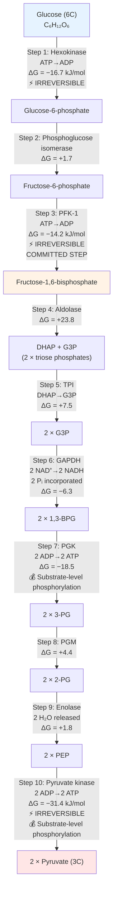
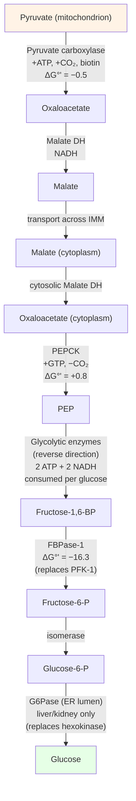
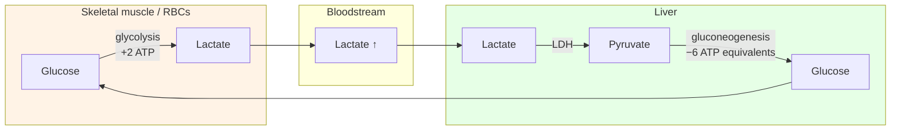
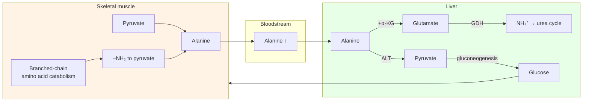
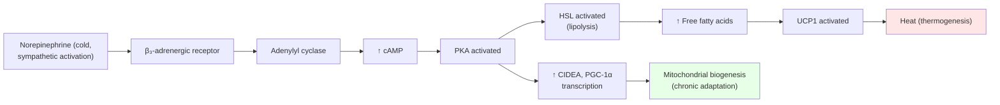
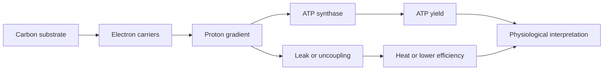

# Bioenergetics and Cellular Respiration

\label{sec:unit_III_bioenergetics_and_respiration}


<!-- chapter-metadata-badge -->
> Level 3/3 · 60 min read · 100 min lecture · Prerequisites: \cref{sec:unit_II_cell_structure}, \cref{sec:unit_I_enzymes_and_kinetics}

## Learning Objectives

1. Define the laws of [**thermodynamics**](#gl:thermodynamics) and apply them to biological reactions, distinguishing standard ($\Delta G^{\circ\prime}$) from physiological ($\Delta G$) free energies.
2. Explain the role of ATP as a central phosphoryl-group donor and short-term energy carrier, including the molecular basis of its high phosphoryl group transfer potential.
3. Describe the 10 steps of [**glycolysis**](#gl:glycolysis) with [**enzyme**](#gl:enzyme)s, intermediates, and regulatory mechanisms.
4. Explain the pyruvate dehydrogenase complex and its regulation.
5. Describe the 8 steps of the TCA cycle with carbon tracking, cofactor yields, and regulation.
6. Describe the electron transport chain complexes I--IV, including proton stoichiometry and the Q cycle.
7. Explain [**ATP synthase**](#gl:atp-synthase) structure and the rotary catalysis mechanism, including the proton-motive force equation.
8. Calculate net ATP yield from glucose oxidation using modern P/O ratios (~2.5 for NADH, ~1.5 for FADH$_2$) and explain how the "30--32 ATP" number is derived.
9. Compare substrate-level and [**oxidative phosphorylation**](#gl:oxidative-phosphorylation) quantitatively across yield, speed, sustainability, and physiological niche.
10. Describe [**fermentation**](#gl:fermentation) pathways, the Cori cycle, and the glucose-alanine cycle as inter-organ shuttles.
11. Explain gluconeogenesis (four bypass enzymes) and its reciprocal regulation with glycolysis.
12. Quantify reactive oxygen species (ROS) production at the ETC and the antioxidant defenses that constrain it.
13. Distinguish anaplerotic and cataplerotic flux through the TCA cycle in the context of inter-organ metabolism.
14. Explain physiological (UCP1, brown adipose) and pharmacological (DNP) uncoupling at a molecular level.
15. Compute the thermodynamic efficiency of glucose oxidation from standard free energies of formation.

\begin{figure}[htbp]
\centering
\includegraphics[width=0.85\textwidth]{../figures/glycolysis_summary.png}
\caption{Glycolysis energetics by pathway step. Net ATP and NADH yields per reaction summarise the investment and payoff phases of the ten-step pathway.}
\label{fig:unit_III_glycolysis_summary}
\end{figure}

<!-- alt: Grouped bar chart of ATP and NADH yield for each glycolysis step. -->

<!-- curriculum-scaffold-start -->
### Study Blueprint

- **Big idea:** Cells harvest free energy by coupling redox chemistry to phosphoryl transfer and ion gradients.
- **Core concepts:** free energy, redox, glycolysis, oxidative phosphorylation.
- **Framework alignment:** Vision & Change: Pathways and transformations of energy and matter, Systems; AP Biology: Energetics, Systems Interactions; NGSS-style topics: Matter and Energy in Organisms and Ecosystems.
- **Model or quantitative lens:** Delta G, ATP yield, and electron-carrier accounting.
- **Data skill:** Track carbon, electrons, and ATP across a pathway.
- **Practice cadence:** Representing and Describing Data, Statistical Tests and Data Analysis.
- **Common misconception to repair:** ATP is not stored energy in a vague sense; it is a coupling currency with defined reaction chemistry.
- **Primary lab:** \nameref{sec:lab_unit_III_bioenergetics_and_respiration}.
- **Question bank:** \nameref{sec:q_unit_III_bioenergetics_and_respiration}.
- **Transfer task:** Transfer energy accounting to exercise, fermentation, hypoxia, and mitochondrial disease.
- **Bridge to computation:** `biology.biochemistry.biochemistry.glycolysis_summary`.
<!-- curriculum-scaffold-end -->

---

> **Opening Vignette: The Heretic Who Was Right About ATP**
>
> In 1961, British biochemist Peter Mitchell proposed something that nearly the entire biochemistry
> community considered preposterous: that the synthesis of ATP was not driven by a hypothetical
> high-energy chemical intermediate but by a **proton gradient across a membrane** — a
> **proton-motive force** \citep{mitchell1961}. Mitchell's "chemiosmotic hypothesis" met
> with fierce resistance. Efraim Racker, one of biochemistry's most respected voices, called it
> "an act of faith, not of reason." Mitchell spent years defending his idea from private funds
> after leaving a university position.
>
> In 1978, the Nobel Committee awarded Peter Mitchell the Nobel Prize in Chemistry — alone, without
> co-recipients — specifically for the chemiosmotic hypothesis. It was a stunning vindication.
> Today we know that the ~28 molecules of ATP produced per glucose in oxidative phosphorylation are
> most driven by the proton gradient that Mitchell described. The mitochondrion — and the [**chloroplast**](#gl:chloroplast)
> — are essentially biological batteries, storing energy as a proton electrochemical gradient.
> This chapter explains exactly how they are charged and discharged.
>
> *Primary source: Mitchell, P. (1961). Coupling of phosphorylation to electron and hydrogen transfer by a chemi-osmotic type of mechanism. Nature, 191(4784), 144–148.*

---

## Thermodynamics of Life

> **Mathematical Background:** Bioenergetics uses logarithms and thermodynamic equations. For a review of logarithmic functions and their biological applications, see \nameref{sec:appendix_math_review}.

### First and Second Laws

The **First Law of Thermodynamics:** Energy cannot be created or destroyed --- primarily converted. Life obeys this law: every metabolic reaction converts one form of energy to another, with total energy conserved.

The **Second Law of Thermodynamics:** In any spontaneous process, the total entropy (disorder) of the universe increases. This means no energy conversion is 100% efficient --- some energy is typically dispersed as heat. Living organisms maintain internal order (low entropy) at the expense of increasing entropy in their surroundings (heat release, CO$_2$ production, waste generation).

A useful schematic: a cell is a **dissipative structure** in the sense of Prigogine — its internal order is maintained by a continuous through-flux of free energy (food, sunlight) and a continuous out-flux of low-grade heat. Stop the through-flux, and the cell relaxes to thermal equilibrium — which is to say, dies.

### Gibbs Free Energy: A Derivation From First Principles

For a process at constant temperature $T$ and constant pressure $P$ (the conditions inside virtually every cell), the relevant thermodynamic potential is the **Gibbs free energy** $G$. Starting from the second law, we have for the universe (system + surroundings):

\begin{equation}
\Delta S_{\text{universe}} = \Delta S_{\text{system}} + \Delta S_{\text{surroundings}} \geq 0
\label{eq:unit_III_bioenergetics_and_respiration_worked_1}
\end{equation}

Heat released by the system at constant pressure equals $-\Delta H_{\text{system}}$, and this heat increases the entropy of the surroundings by $-\Delta H_{\text{system}}/T$. Substituting:

\begin{equation}
\Delta S_{\text{universe}} = \Delta S_{\text{system}} - \frac{\Delta H_{\text{system}}}{T} \geq 0
\label{eq:unit_III_bioenergetics_and_respiration_worked_2}
\end{equation}

Multiplying both sides by $-T$ and dropping the "system" subscript yields the **defining inequality of spontaneity at constant $T$, $P$**:

\begin{equation}
\Delta G = \Delta H - T\Delta S \leq 0
\label{eq:unit_III_gibbs_free_energy}
\end{equation}

- **$\Delta G < 0$:** reaction is spontaneous (exergonic); energy released
- **$\Delta G > 0$:** reaction is non-spontaneous (endergonic); energy input required
- **$\Delta G = 0$:** system is at equilibrium (no net reaction)

This is profound: a quantity that depends primarily on the *system* (not the surroundings) tells us whether the *universe's* entropy will increase. It is the workhorse of biochemical thermodynamics.

### Standard Free Energy and Actual Free Energy

The standard free energy change ($\Delta G^{\circ\prime}$) is measured under biochemical standard conditions (1 M concentrations for reactants except H$^+$, [**pH**](#gl:ph) 7.0, 25 degrees C, 1 atm, and water at unit activity). Under cellular conditions (not standard state), $\Delta G$ differs from $\Delta G^{\circ\prime}$:

\begin{equation}
\Delta G = \Delta G^{\circ\prime} + RT \ln Q
\label{eq:unit_III_bioenergetics_and_respiration_worked_3}
\end{equation}

where $Q$ = [products]/[reactants] (mass action ratio, reaction quotient).

The relationship between $\Delta G^{\circ\prime}$ and the equilibrium constant:

\begin{equation}
\Delta G^{\circ\prime} = -RT \ln K_{eq}
\label{eq:unit_III_bioenergetics_and_respiration_worked_4}
\end{equation}

**Standard versus physiological $\Delta G^{\circ\prime}$ for key hydrolysis reactions** (37 °C, pH 7.0, 1 mM Mg$^{2+}$):

: Standard and physiological free energy changes for selected hydrolysis reactions. {#tbl:unit_III_bioenergetics_and_respiration_standard_free_energy_and_actual_free_energy}
| Reaction | $\Delta G^{\circ\prime}$ (kJ/mol) | Cellular $\Delta G$ (kJ/mol) | Notes |
| -------- | --------------------------------- | ---------------------------- | ----- |
| Phosphoenolpyruvate (PEP) → Pyruvate + P$_i$ | $-61.9$ | about $-65$ | Highest-energy phosphate bond in cells |
| 1,3-Bisphosphoglycerate → 3-PG + P$_i$ | $-49.3$ | about $-52$ | Drives ATP synthesis at glycolysis step 7 |
| Phosphocreatine → Creatine + P$_i$ | $-43.0$ | about $-47$ | Muscle ATP buffer (phosphagen) |
| **ATP → ADP + P$_i$** | **$-30.5$** | **$-50$ to $-54$** | The "energy currency benchmark" |
| ATP → AMP + PP$_i$ | $-45.6$ | about $-50$ | PP$_i$ further hydrolysed (irreversibility) |
| Glucose-1-P → Glucose + P$_i$ | $-20.9$ | $-21$ | Low-energy ester |
| Glucose-6-P → Glucose + P$_i$ | $-13.8$ | $-14$ | Low-energy phosphate ester |

**Key insight:** ATP sits in the *middle* of this spectrum. It is energetically capable of phosphorylating many low-energy compounds (glucose, F6P) but can itself be re-synthesized from higher-energy intermediates such as PEP and 1,3-BPG. This intermediate position is what makes ATP an effective "energy currency" rather than the highest-potential molecule in the cell.

**Why cells maintain far-from-equilibrium conditions:** At equilibrium, $\Delta G = 0$ and no net work can be done. Cells maintain metabolite concentrations far from equilibrium ($Q \neq K_{eq}$), keeping $\Delta G$ strongly negative for exergonic reactions. This is why cells must continuously consume nutrients --- to maintain the far-from-equilibrium state that enables life.

### Worked Example: Free Energy and Equilibrium

*Problem:* The $\Delta G^{\circ\prime}$ for glucose-6-phosphate isomerase (G6P to F6P) is +1.7 kJ/mol. Calculate $K_{eq}$ at 37 degrees C. Is this reaction spontaneous under standard conditions?

*Solution:*

\begin{equation}
\Delta G^{\circ\prime} = -RT \ln K_{eq}
\label{eq:unit_III_bioenergetics_and_respiration_worked_5}
\end{equation}

\begin{equation}
1{,}700 = -(8.314)(310) \ln K_{eq}
\label{eq:unit_III_bioenergetics_and_respiration_worked_6}
\end{equation}

\begin{equation}
\ln K_{eq} = \frac{-1{,}700}{2{,}577} = -0.660
\label{eq:unit_III_bioenergetics_and_respiration_worked_7}
\end{equation}

\begin{equation}
K_{eq} = e^{-0.660} = 0.517
\label{eq:unit_III_bioenergetics_and_respiration_worked_8}
\end{equation}

Under standard conditions, this reaction is slightly non-spontaneous ($\Delta G^{\circ\prime} > 0$). However, in the cell, the mass action ratio $Q$ is kept well below $K_{eq}$ because F6P is rapidly consumed by PFK-1, making the actual $\Delta G$ negative.

### Worked Example: Complete Glucose Oxidation

*Problem:* Calculate the standard free energy of complete glucose oxidation (glucose + 6 O$_2$ → 6 CO$_2$ + 6 H$_2$O) from tabulated standard free energies of formation, and compare it with the energy harvested as ATP.

*Solution:* Using $\Delta G^{\circ}_f$ values (kJ/mol) at 25 °C — glucose: $-910.4$; CO$_2$ (aq): $-394.4$; H$_2$O (l): $-237.1$; O$_2$: 0:

\begin{equation}
\Delta G^{\circ\prime}_{\text{rxn}} = \sum \Delta G^{\circ}_f(\text{products}) - \sum \Delta G^{\circ}_f(\text{reactants})
\label{eq:unit_III_bioenergetics_and_respiration_worked_9}
\end{equation}

\begin{equation}
= [6(-394.4) + 6(-237.1)] - [(-910.4) + 6(0)] = -3{,}789 + 910.4 \approx -2{,}870 \; \text{kJ/mol}
\label{eq:unit_III_bioenergetics_and_respiration_worked_10}
\end{equation}

If 32 ATP are produced per glucose at a cellular hydrolysis $\Delta G$ of $-50$ kJ/mol, the energy captured as ATP is $32 \times 50 = 1{,}600$ kJ/mol. The thermodynamic efficiency of glucose oxidation in cells is therefore:

\begin{equation}
\eta = \frac{1{,}600}{2{,}870} \approx 56\%
\label{eq:unit_III_bioenergetics_and_respiration_worked_11}
\end{equation}

The remaining ~44% is dissipated as heat — useful for mammals to maintain body temperature, but ultimately a payment to the second law. For comparison: a modern combined-cycle gas turbine power plant achieves ~60% thermal efficiency at >800 K, while an automobile engine averages ~25%. A 56%-efficient isothermal energy converter operating at 310 K is, by any engineering standard, remarkable.

### ATP as Energy Currency

ATP (adenosine triphosphate) is the cell's central short-term energy carrier and phosphoryl-group donor for many endergonic reactions \citep{boyer1997}. The phrase "energy currency" is useful shorthand, but the cell also uses ion gradients, redox cofactors such as NADH/NADPH, thioesters such as acetyl-CoA, and activated carriers such as UDP-glucose.

The high negative $\Delta G$ of ATP hydrolysis under cellular conditions ($-50$ to $-54$ kJ/mol; $\Delta G^{\circ\prime} = -30.5$ kJ/mol) arises from:
1. **Electrostatic repulsion** between closely spaced negative charges on the gamma-phosphate (relieved on hydrolysis)
2. **Resonance stabilization** of inorganic phosphate (P$_i$) product --- P$_i$ has more resonance forms than the terminal phosphate of ATP
3. **Hydration** (solvation enthalpy) of P$_i$ and ADP --- products are better hydrated than reactants
4. **Entropy increase** --- one molecule becomes two

ATP couples exergonic reactions to endergonic ones via **phosphoryl group transfer**. The cell maintains a very high ATP/ADP ratio (~10 in most cells; ATP ~3--5 mM, ADP ~0.5 mM), keeping the cellular $\Delta G$ of hydrolysis more negative than $\Delta G^{\circ\prime}$.

**Daily ATP turnover:** A resting adult uses ~40 kg of ATP per day (body contains about 50 g at any time, so each ATP molecule is recycled ~800 times/day). During vigorous exercise, ATP turnover can reach ~0.5 kg/min — roughly the body's mass in ATP equivalents flowing through the adenylate pool every two hours.

> **Concept Check 1:** The $\Delta G^{\circ\prime}$ of ATP hydrolysis is $-30.5$ kJ/mol, but the actual cellular $\Delta G$ is approximately $-54$ kJ/mol. Using the equation $\Delta G = \Delta G^{\circ\prime} + RT \ln Q$, calculate the mass action ratio $Q$ = [ADP][P$_i$]/[ATP] in the cell at 37 degrees C.

> **Concept Check 1b:** A cell experiences a sudden drop in ATP (from 4 mM to 1 mM) without changes in ADP or P$_i$. Predict the qualitative effect on (a) the cellular $\Delta G$ of ATP hydrolysis, (b) the ATP/ADP ratio, and (c) the activity of AMPK.

---

## Glycolysis as Cytosolic Glucose Oxidation

\cref{fig:unit_III_glycolysis_summary} summarizes net ATP and NADH yields across the ten glycolytic steps, separating the investment and payoff phases.

Glycolysis (Greek: *glykys* = sweet; *lysis* = splitting) converts one glucose (6C) to two pyruvate (3C), netting 2 ATP and 2 NADH. It occurs in the **[cytoplasm](#gl:cytoplasm)** of most cells and does not require oxygen.


<!-- alt: Flowchart showing glycolysis commits glucose through ATP-investment steps, harvests reducing power, and conserves energy as ATP and pyruvate; irreversible steps mark the main regulatory checkpoints. -->

*Glycolysis commits glucose through ATP-investment steps, harvests reducing power, and conserves energy as ATP and pyruvate; irreversible steps mark the main regulatory checkpoints.*

*The 10 steps of glycolysis (Mermaid).* The energy investment phase (steps 1--5) consumes 2 ATP. The energy payoff phase (steps 6--10) produces 4 ATP and 2 NADH. The three irreversible steps (1, 3, 10) are the regulatory control points.

### Ten Enzymatic Steps

: Ten Enzymatic Steps: Step and Enzyme. {#tbl:unit_III_bioenergetics_and_respiration_ten_enzymatic_steps}
| Step | Enzyme | Reaction | $\Delta G$ (kJ/mol) | Notes |
| ---- | ------ | -------- | ------------------- | ----- |
| 1 | Hexokinase | Glucose + ATP → G6P + ADP | $-16.7$ | Traps glucose in cell |
| 2 | Phosphoglucose isomerase | G6P → F6P | $+1.7$ | Aldose to ketose |
| 3 | **PFK-1** | F6P + ATP → F1,6BP + ADP | $-14.2$ | **Committed step; rate-limiting** |
| 4 | Aldolase | F1,6BP → DHAP + G3P | $+23.8$ | Pulled forward by step 5 |
| 5 | Triose phosphate isomerase | DHAP → G3P | $+7.5$ | "Perfect enzyme" ($k_{cat}/K_m$ near diffusion limit) |
| 6 | GAPDH | G3P + P$_i$ + NAD$^+$ → 1,3BPG + NADH | $-6.3$ | First NADH production |
| 7 | Phosphoglycerate kinase | 1,3BPG + ADP → 3PG + ATP | $-18.5$ | First ATP production |
| 8 | Phosphoglycerate mutase | 3PG → 2PG | $+4.4$ | Phosphate shift |
| 9 | Enolase | 2PG → PEP + H$_2$O | $+1.8$ | Dehydration |
| 10 | Pyruvate kinase | PEP + ADP → Pyruvate + ATP | $-31.4$ | Largest energy release |

### Regulation of Glycolysis

**PFK-1 is the master regulator** of glycolysis. It integrates energy status, biosynthetic needs, and hormonal signals \citep{atkinson1968}:

: Regulation of Glycolysis: Activators and Inhibitors. {#tbl:unit_III_bioenergetics_and_respiration_regulation_of_glycolysis}
| Activators | Inhibitors |
| ---------- | ---------- |
| AMP (low energy) | ATP (high energy, [**allosteric**](#gl:allosteric) at regulatory site) |
| Fructose-2,6-bisphosphate (F2,6BP, most potent) | Citrate (TCA cycle intermediate = adequate supply) |
| ADP | H$^+$ (low pH; prevents excessive lactate acidosis) |
| P$_i$ | |

**Fructose-2,6-bisphosphate (F2,6BP)** is the most potent activator of PFK-1 (lowers $K_m$ for F6P by 50-fold). It is produced by **PFK-2** (a bifunctional enzyme with both kinase and phosphatase domains). Insulin activates PFK-2 kinase activity (producing F2,6BP, stimulating glycolysis). Glucagon (via PKA) activates PFK-2 phosphatase activity (destroying F2,6BP, inhibiting glycolysis in liver).

### ATP and Reducing-Equivalent Accounting

Net output from 1 glucose:
- 2 ATP (from steps 7 and 10, minus 2 ATP consumed at steps 1 and 3)
- 2 NADH (from step 6; each NADH worth ~2.5 ATP via oxidative phosphorylation in [**aerobic**](#gl:aerobic) conditions)

> **Clinical Connection: The Warburg Effect**
> Cancer cells often exhibit the **Warburg effect** --- high rates of glycolysis even in the presence of oxygen ("aerobic glycolysis"). Rather than fully oxidising glucose to CO$_2$ via the TCA cycle and ETC, cancer cells convert most glucose to lactate. This seems wasteful (2 ATP vs. 30--32 ATP per glucose), but it provides rapid ATP production and generates biosynthetic precursors (G6P for pentose phosphate pathway, 3PG for serine biosynthesis) needed for rapid cell division. PET scanning exploits this by detecting tumor uptake of $^{18}$F-fluorodeoxyglucose (FDG). see \cref{sec:unit_III_metabolic_integration} for metabolic integration.

> **Concept Check 2:** Steps 4 and 5 of glycolysis have very positive $\Delta G^{\circ\prime}$ values (+23.8 and +7.5 kJ/mol). How do these reactions proceed in vivo despite being thermodynamically unfavorable under standard conditions?

---

## Gluconeogenesis: Reverse But Not the Reverse

Gluconeogenesis is *not* glycolysis run backwards. Three glycolytic steps (hexokinase, PFK-1, pyruvate kinase) are **physiologically irreversible** in the forward direction --- their cellular $\Delta G$ values are too negative. Gluconeogenesis bypasses each of these three steps with dedicated enzymes that use different chemistry, often paying additional ATP/GTP to make the reverse direction thermodynamically favorable.

### The Four Bypass Reactions


<!-- alt: Flowchart showing gluconeogenesis bypasses irreversible glycolytic steps by moving carbon through mitochondrial oxaloacetate, malate export, and cytosolic phosphoenolpyruvate formation. -->

*Gluconeogenesis bypasses irreversible glycolytic steps by moving carbon through mitochondrial oxaloacetate, malate export, and cytosolic phosphoenolpyruvate formation.*

*Gluconeogenesis from pyruvate to glucose (Mermaid).* Four bypass enzymes (pyruvate carboxylase, PEPCK, FBPase-1, G6Pase) replace the three irreversible glycolytic steps. The pyruvate-to-PEP conversion requires two enzymes — pyruvate carboxylase consumes ATP and PEPCK consumes GTP — so the bypass spans two energy-consuming steps.

### The Four Bypass Enzymes in Detail

**1. Pyruvate carboxylase (PC):** A mitochondrial biotin-dependent carboxylase that converts pyruvate + CO$_2$ + ATP → oxaloacetate + ADP + P$_i$. Two key features: (a) **allosterically activated by acetyl-CoA**, providing a feed-forward signal that fat oxidation (which produces acetyl-CoA) supplies the OAA needed for both gluconeogenesis and TCA flux; (b) requires biotin as a covalently bound prosthetic group that carries the activated CO$_2$ (–N–COO$^-$). Biotin deficiency (rare; most often from chronic raw-egg consumption due to avidin) disrupts pyruvate carboxylase and three other carboxylases simultaneously, producing lactic acidosis and ketogenic dysregulation.

**2. PEPCK (phosphoenolpyruvate carboxykinase):** A cytosolic (and partially mitochondrial) GTP-dependent decarboxylase that converts OAA + GTP → PEP + CO$_2$ + GDP. This enzyme is unusual among gluconeogenic enzymes in that it is regulated almost entirely at the level of *transcription* — glucagon (via cAMP→PKA→CREB) and cortisol (via the glucocorticoid receptor) potently induce PEPCK mRNA, while insulin (via FoxO1 phosphorylation and exclusion from the nucleus) potently represses it. PEPCK transcription has a half-time of ~1 hour, making it a slow but powerful long-term switch.

**3. Fructose-1,6-bisphosphatase (FBPase-1):** Cytosolic phosphatase that converts F1,6BP + H$_2$O → F6P + P$_i$ ($\Delta G^{\circ\prime} = -16.3$ kJ/mol). Critically regulated **allosterically** by F2,6BP (strong inhibitor) and AMP (inhibitor) — both signals of glycolytic demand or low energy. The same F2,6BP that *activates* PFK-1 *inhibits* FBPase-1, so a single second messenger flips the entire futile-cycle node.

**4. Glucose-6-phosphatase (G6Pase):** A 9-transmembrane-helix protein whose catalytic site faces the **lumen of the endoplasmic reticulum**, accessed by a phosphate transporter (SLC37A4) and a glucose efflux transporter (GLUT2). Critically, G6Pase is expressed almost exclusively in **liver and renal cortex** — muscle and brain lack it, which is why these tissues cannot release free glucose to the blood even though they produce G6P internally. Mutations in G6Pase cause **von Gierke disease (GSD I)**: severe fasting hypoglycaemia with hepatomegaly.

: The Four Bypass Enzymes in Detail: Glycolytic step (irreversible) and Gluconeogenic bypass. {#tbl:unit_III_bioenergetics_and_respiration_the_four_bypass_enzymes_in_detail}
| Glycolytic step (irreversible) | Gluconeogenic bypass | Energy cost | Compartment |
| ------------------------------ | -------------------- | ----------- | ----------- |
| Pyruvate kinase | **Pyruvate carboxylase** + **PEPCK** | +1 ATP + 1 GTP per pyruvate | Mitochondrion + cytoplasm |
| PFK-1 | **Fructose-1,6-bisphosphatase (FBPase-1)** | None (hydrolysis is exergonic) | Cytoplasm |
| Hexokinase | **Glucose-6-phosphatase (G6Pase)** | None (hydrolysis is exergonic) | ER lumen (liver, kidney primarily) |

**Net cost:** Synthesizing one glucose from two pyruvate consumes **6 ATP equivalents** (2 ATP at pyruvate carboxylase × 2, 2 GTP at PEPCK × 2, 2 ATP at PGK × 2 in the reverse direction). This is why gluconeogenesis is restricted to tissues with substantial ATP-generating capacity (liver, renal cortex).

### Reciprocal Regulation of Glycolysis and Gluconeogenesis

The same allosteric and hormonal signals that activate glycolysis inhibit gluconeogenesis, ensuring the two pathways do not run as a futile cycle:

: Reciprocal Regulation of Glycolysis and Gluconeogenesis: Signal and Glycolysis (PFK-1). {#tbl:unit_III_bioenergetics_and_respiration_reciprocal_regulation_of_glycolysis_and_gluconeogenesis}
| Signal | Glycolysis (PFK-1) | Gluconeogenesis (FBPase-1) |
| ------ | ------------------ | -------------------------- |
| Fructose-2,6-bisphosphate | Strong activator | Strong inhibitor |
| AMP | Activator | Inhibitor |
| Citrate | Inhibitor | Activator |
| Acetyl-CoA | (no direct effect) | Activates pyruvate carboxylase |
| Insulin | ↑ PFK-2 kinase → ↑ F2,6BP → glycolysis ON | ↓ PEPCK / G6Pase transcription |
| Glucagon | ↑ PFK-2 phosphatase → ↓ F2,6BP → glycolysis OFF | ↑ PEPCK / G6Pase transcription |

Glucagon-driven phosphorylation of PFK-2/FBPase-2 simultaneously turns *off* PFK-1 (glycolysis) and turns *on* FBPase-1 (gluconeogenesis) by destroying F2,6BP. This is a textbook example of how a single bifunctional enzyme can act as a metabolic switch.

> **Concept Check 2b:** A patient with renal cortex damage but intact liver presents with mild fasting hypoglycaemia after prolonged exercise. Explain the contribution of renal gluconeogenesis to whole-body glucose homeostasis, and why it is invisible in healthy individuals.

---

## The Cori Cycle and the Glucose-Alanine Cycle

Inter-organ metabolism allows tissues to specialize: muscle generates ATP rapidly via glycolysis, while liver shoulders the gluconeogenic burden. Two complementary inter-organ shuttles dominate fasting and exercise physiology.

### The Cori Cycle (Lactate Shuttle)


<!-- alt: Flowchart showing cori cycle moves lactate from anaerobic tissues to liver gluconeogenesis, trading rapid local ATP production for whole-body glucose recycling. -->

*The Cori cycle moves lactate from anaerobic tissues to liver gluconeogenesis, trading rapid local ATP production for whole-body glucose recycling.*

*Cori cycle: lactate from anaerobic muscle is regenerated to glucose in the liver (Mermaid).* Each turn nets +2 ATP for muscle but −6 ATP for liver, a 4-ATP net loss to the organism — the metabolic cost of supporting hypoxic tissue.

### The Glucose-Alanine Cycle

When muscle proteins are catabolised, branched-chain amino acid carbon skeletons donate amino groups to pyruvate, forming **alanine**. Alanine carries both carbon and nitrogen safely to the liver:

1. Muscle: Pyruvate + Glutamate → Alanine + α-Ketoglutarate (alanine aminotransferase)
2. Alanine travels via blood to liver
3. Liver: Alanine + α-KG → Pyruvate + Glutamate (alanine aminotransferase, reverse)
4. Glutamate releases NH$_4^+$ into the urea cycle; pyruvate enters gluconeogenesis
5. Glucose returns to muscle via blood


<!-- alt: Flowchart showing glucose-alanine cycle couples muscle nitrogen disposal to hepatic gluconeogenesis: amino groups move as alanine while liver returns glucose. -->

*The glucose-alanine cycle couples muscle nitrogen disposal to hepatic gluconeogenesis: amino groups move as alanine while liver returns glucose.*

*Glucose-alanine cycle: alanine simultaneously carries gluconeogenic carbon and waste nitrogen from muscle to liver (Mermaid).* The liver disposes of NH$_4^+$ via the urea cycle and exports glucose back to muscle.

**Why this is clever:** Alanine simultaneously transports gluconeogenic carbon and waste nitrogen, replacing the need for two separate transport systems. It also keeps free ammonia (toxic to the brain) out of circulation — nitrogen is delivered directly to the urea-cycling liver.

> **Concept Check 3:** During an acute sprint, muscle lactate output rises from 1 mM/min to 8 mM/min. Estimate the additional hepatic ATP demand (in ATP equivalents per minute) required to recycle this lactate via the Cori cycle, assuming most lactate reaches the liver.

---

## Pyruvate Oxidation and the Citric Acid Cycle

Under aerobic conditions, pyruvate enters the mitochondria (via the MPC, mitochondrial pyruvate carrier) and is oxidised.

### Pyruvate Dehydrogenase Complex (PDC)

\begin{equation}
\text{Pyruvate (3C)} + \text{CoA} + \text{NAD}^+ \rightarrow \text{Acetyl-CoA (2C)} + \text{CO}_2 + \text{NADH}
\label{eq:unit_III_bioenergetics_and_respiration_worked_12}
\end{equation}

Catalysed by PDC --- a 9.5 MDa multienzyme complex with three catalytic components (E1: pyruvate dehydrogenase; E2: dihydrolipoyl transacetylase; E3: dihydrolipoyl dehydrogenase) using **five cofactors**: TPP (thiamine pyrophosphate, vitamin B$_1$), lipoic acid, FAD (vitamin B$_2$), NAD$^+$ (vitamin B$_3$), CoA (vitamin B$_5$).

**PDC regulation:**

: Pyruvate Dehydrogenase Complex (PDC): Condition and PDC activity. {#tbl:unit_III_bioenergetics_and_respiration_pyruvate_dehydrogenase_complex_pdc}
| Condition | PDC activity | Mechanism |
| --------- | ------------ | --------- |
| High acetyl-CoA, NADH, ATP | Inhibited | PDH kinase (PDK) phosphorylates E1 → inactive |
| High CoA, NAD$^+$, AMP, Ca$^{2+}$ | Activated | PDH phosphatase (PDP) dephosphorylates E1 → active |
| Insulin | Activated | Activates PDP in adipose tissue |
| Exercise (Ca$^{2+}$) | Activated | Ca$^{2+}$ activates PDP |

> **Clinical Connection: PDC Deficiency**
> Pyruvate dehydrogenase deficiency is the most common genetic cause of lactic acidosis. Without PDC, pyruvate cannot enter the TCA cycle and is instead reduced to lactate. Neurological damage results from the brain's dependence on glucose oxidation. Treatment: **ketogenic diet** (high fat, very low carbohydrate) provides acetyl-CoA directly from fatty acid beta-oxidation, bypassing the PDC block. Dichloroacetate (DCA) inhibits PDK, keeping residual PDC active.

### TCA Cycle (Krebs Cycle / Citric Acid Cycle)

The TCA cycle occurs in the mitochondrial matrix. It oxidises acetyl-CoA to CO$_2$, generating reduced cofactors (NADH, FADH$_2$) that feed the ETC \citep{krebs1937}.

```mermaid
flowchart LR
    OAA["Oxaloacetate (4C)"]
    Citrate["Citrate (6C)"]
    Isocitrate["Isocitrate (6C)"]
    alphaKG["α-Ketoglutarate (5C)"]
    SuccCoA["Succinyl-CoA (4C)"]
    Succ["Succinate (4C)"]
    Fum["Fumarate (4C)"]
    Mal["Malate (4C)"]

    OAA -->|"Step 1: Citrate synthase<br/>Acetyl-CoA + H₂O<br/>ΔG°' = −32.2"| Citrate
    Citrate -->|"Step 2: Aconitase<br/>(via cis-aconitate)<br/>ΔG°' = +6.3"| Isocitrate
    Isocitrate -->|"Step 3: Isocitrate DH<br/>NAD⁺→NADH + CO₂<br/>ΔG°' = −20.9<br/>REGULATED"| alphaKG
    alphaKG -->|"Step 4: α-KG DH complex<br/>NAD⁺→NADH + CO₂<br/>ΔG°' = −33.5<br/>REGULATED"| SuccCoA
    SuccCoA -->|"Step 5: Succinyl-CoA synthetase<br/>GDP→GTP (or ADP→ATP)<br/>ΔG°' = −2.9"| Succ
    Succ -->|"Step 6: Succinate DH (Complex II)<br/>FAD→FADH₂<br/>ΔG°' = 0"| Fum
    Fum -->|"Step 7: Fumarase<br/>H₂O added<br/>ΔG°' = −3.8"| Mal
    Mal -->|"Step 8: Malate DH<br/>NAD⁺→NADH<br/>ΔG°' = +29.7"| OAA
```


<!-- alt: Flowchart showing TCA cycle oxidizes acetyl-CoA to regenerate oxaloacetate while producing NADH, FADH2, and GTP for oxidative phosphorylation. -->

*The TCA cycle oxidizes acetyl-CoA to regenerate oxaloacetate while producing NADH, FADH2, and GTP for oxidative phosphorylation.*

*The eight steps of the TCA cycle (Mermaid).* Each turn oxidises one acetyl group (2C) to 2 CO$_2$, producing 3 NADH, 1 FADH$_2$, and 1 GTP. The cycle turns twice per glucose molecule.

**Eight steps with details:**

: TCA Cycle (Krebs Cycle / Citric Acid Cycle): Step and Enzyme. {#tbl:unit_III_bioenergetics_and_respiration_tca_cycle_krebs_cycle_citric_acid_cycle}
| Step | Enzyme | Reaction | Products |
| ---- | ------ | -------- | -------- |
| 1 | Citrate synthase | Acetyl-CoA + OAA → Citrate + CoA | -- |
| 2 | Aconitase | Citrate → Isocitrate (via cis-aconitate) | -- |
| 3 | **Isocitrate dehydrogenase** | Isocitrate → alpha-KG + CO$_2$ | **NADH** |
| 4 | **alpha-KG dehydrogenase complex** | alpha-KG → Succinyl-CoA + CO$_2$ | **NADH** |
| 5 | Succinyl-CoA synthetase | Succinyl-CoA → Succinate | **GTP** |
| 6 | Succinate dehydrogenase (Complex II) | Succinate → Fumarate | **FADH$_2$** |
| 7 | Fumarase | Fumarate + H$_2$O → Malate | -- |
| 8 | Malate dehydrogenase | Malate → OAA | **NADH** |

**Carbon tracking:** The two carbons entering as acetyl-CoA are NOT the same two carbons lost as CO$_2$ in the first turn --- they are released in subsequent turns. This can be demonstrated using $^{14}$C-labeled acetyl-CoA.

**Net per turn:** 3 NADH + 1 FADH$_2$ + 1 GTP + 2 CO$_2$

**Total from 2 turns (per glucose):** 6 NADH + 2 FADH$_2$ + 2 GTP + 4 CO$_2$

**TCA cycle regulation:**

: TCA Cycle (Krebs Cycle / Citric Acid Cycle): Enzyme and Activators. {#tbl:unit_III_bioenergetics_and_respiration_tca_cycle_krebs_cycle_citric_acid_cycle_2}
| Enzyme | Activators | Inhibitors |
| ------ | ---------- | ---------- |
| Citrate synthase | OAA, acetyl-CoA (substrates) | ATP, NADH, succinyl-CoA, citrate |
| Isocitrate DH | ADP, Ca$^{2+}$ | ATP, NADH |
| alpha-KG DH | Ca$^{2+}$, AMP | ATP, NADH, succinyl-CoA |

### Anaplerotic and Cataplerotic Reactions

The TCA cycle is not a closed loop in vivo — intermediates flow in and out for biosynthesis. **Anaplerotic** ("filling-up") reactions replenish drained intermediates; **cataplerotic** ("emptying") reactions remove intermediates for downstream pathways.

**Major anaplerotic inputs:**

: Anaplerotic and Cataplerotic Reactions: Reaction and Enzyme. {#tbl:unit_III_bioenergetics_and_respiration_anaplerotic_and_cataplerotic_reactions}
| Reaction | Enzyme | Cofactor | Tissue | Function |
| -------- | ------ | -------- | ------ | -------- |
| Pyruvate + CO$_2$ + ATP → OAA | **Pyruvate carboxylase** | Biotin (vitamin B$_7$) | Liver, kidney | Replenishes OAA; primary anaplerotic source |
| Glutamate → α-KG + NH$_4^+$ | Glutamate dehydrogenase | NAD(P)$^+$ | Liver | Amino-acid catabolism |
| Glutamine → Glutamate + NH$_4^+$ → α-KG | Glutaminase + GDH | -- | Most tissues | Amino-acid catabolism |
| Aspartate → OAA | Aspartate aminotransferase | PLP | Most tissues | Direct anaplerosis |
| Propionyl-CoA → Succinyl-CoA | Propionyl-CoA carboxylase + methylmalonyl-CoA mutase | Biotin, B$_{12}$ | Liver | Odd-chain fatty acid + Val/Ile/Met catabolism |

Pyruvate carboxylase is **allosterically activated by acetyl-CoA**. This is biologically elegant: when acetyl-CoA accumulates (high fat oxidation, fed state) and OAA becomes limiting, the cell senses the imbalance and replenishes OAA so that citrate synthase can continue.

**Glutamate dehydrogenase (GDH)** catalyses the reversible deamination of glutamate to α-ketoglutarate, releasing NH$_4^+$. It uses *either* NAD$^+$ (catabolic direction) or NADP$^+$ (anabolic direction) and is allosterically regulated by ADP (activator) and GTP (inhibitor) — making it a sensor of mitochondrial energy state. In hepatocytes, GDH-driven glutamate catabolism feeds α-KG into the TCA cycle and NH$_4^+$ into the urea cycle, integrating amino-acid catabolism with both energy production and nitrogen disposal.

**Major cataplerotic outflows:**

: Anaplerotic and Cataplerotic Reactions: Intermediate withdrawn and Destination pathway. {#tbl:unit_III_bioenergetics_and_respiration_anaplerotic_and_cataplerotic_reactions_2}
| Intermediate withdrawn | Destination pathway | Example product |
| ---------------------- | ------------------- | --------------- |
| α-Ketoglutarate | Glutamate / glutamine biosynthesis; collagen hydroxylation | Glu, Gln, hydroxyproline |
| Succinyl-CoA | Heme biosynthesis (δ-ALA synthase) | Heme, cytochromes |
| Oxaloacetate | Gluconeogenesis (via PEPCK); aspartate, asparagine biosynthesis | Glucose, Asp, Asn |
| Citrate | Cytosolic acetyl-CoA for fatty acid synthesis; cholesterol | Palmitate, cholesterol |

**Clinical connection — biotin deficiency:** Because pyruvate carboxylase, propionyl-CoA carboxylase, and acetyl-CoA carboxylase most depend on biotin, dietary biotin deficiency (rare; sometimes seen with chronic raw-egg consumption due to avidin) causes lactic acidosis, neurological symptoms, and ketogenic dysregulation simultaneously.

> **Concept Check 4:** If fluoroacetate (a metabolic poison) inhibits aconitase (step 2), predict the immediate effect on (a) citrate levels, (b) isocitrate levels, (c) NADH production, and (d) ATP synthesis.

---

## Oxidative Phosphorylation and Proton-Motive Force

Oxidative phosphorylation (OxPhos) accounts for ~90% of ATP production in aerobic organisms. It takes place at the inner mitochondrial membrane, where reconstitution experiments helped establish proton-gradient-driven ATP formation \citep{racker1974}.

### Electron Transport Chain (ETC)

```mermaid
sequenceDiagram
    participant NADH as NADH (matrix)
    participant CI as Complex I<br/>(NADH:UQ oxidoreductase)<br/>46 subunits, 1 MDa<br/>Pumps 4 H⁺
    participant Q as Ubiquinone (Q)<br/>Lipid-soluble<br/>mobile carrier
    participant CII as Complex II<br/>(Succinate DH)<br/>4 subunits<br/>No H⁺ pumping
    participant CIII as Complex III<br/>(Cytochrome bc₁)<br/>Q cycle<br/>Pumps 4 H⁺/2e⁻
    participant CytC as Cytochrome c<br/>Soluble<br/>IMS carrier
    participant CIV as Complex IV<br/>(Cytochrome c oxidase)<br/>Pumps 2 H⁺/2e⁻
    participant O2 as O₂ → H₂O
    participant CV as Complex V<br/>(ATP synthase)<br/>~3 H⁺ per ATP

    NADH->>CI: 2 electrons (NADH → NAD⁺ + H⁺)
    CI->>Q: Electrons via FMN → Fe-S clusters → Q
    Note over CI: 4 H⁺ pumped to IMS

    CII->>Q: FADH₂ → FAD (from succinate)
    Note over CII: 0 H⁺ pumped (no energy)

    Q->>CIII: QH₂ delivers electrons
    Note over CIII: Q cycle: 4 H⁺ per 2e⁻
    CIII->>CytC: Electron to cytochrome c

    CytC->>CIV: Electron delivery
    Note over CIV: 2 H⁺ pumped; 2 H⁺ consumed
    CIV->>O2: 4e⁻ + 4H⁺ + O₂ → 2H₂O

    Note over CV: PMF drives H⁺ through F₀ channel
    Note over CV: γ-subunit rotates 120° per ATP
    Note over CV: ~3 H⁺ per ATP synthesized
```
<!-- alt: Sequence diagram showing electron transport passes reducing equivalents from NADH and FADH2 through complexes I-IV to oxygen, with proton pumping by complexes I, III, and IV building the gradient for ATP synthase. -->

*Electron transport passes reducing equivalents from NADH and FADH2 through complexes I-IV to oxygen, with proton pumping by complexes I, III, and IV building the gradient for ATP synthase.*

*Electron flow through the ETC complexes I--IV and proton pumping that generates the proton motive force (Mermaid).* ATP synthase (Complex V) uses this PMF to synthesize ATP via rotary catalysis.

**Complex I (NADH:ubiquinone oxidoreductase):**
- Largest ETC complex (~46 subunits in mammals, ~1 MDa)
- L-shaped structure: hydrophilic arm in matrix (electron transfer), membrane arm (proton pumping)
- Electron path: NADH → FMN → 7 Fe-S clusters → ubiquinone (Q)
- Pumps **4 H$^+$** per NADH oxidised
- Inhibited by **rotenone** (fish poison, pesticide) and **piericidin A**

**Complex II (succinate:ubiquinone oxidoreductase):**
- Also is step 6 of the TCA cycle (succinate dehydrogenase)
- 4 subunits; FAD covalently bound
- Electron path: succinate → FAD → Fe-S clusters → ubiquinone (Q)
- Pumps **0 H$^+$** (insufficient energy from FADH$_2$ oxidation to pump protons)
- This is why FADH$_2$ yields less ATP than NADH

**Complex III (cytochrome bc$_1$ complex):**
- The **Q cycle** mechanism (Mitchell, Nobel Prize 1978) \citep{mitchell1961}:
  1. QH$_2$ binds Q$_o$ site; one electron goes to Fe-S cluster → cytochrome c$_1$ → cytochrome c (high potential path)
  2. Second electron goes to cytochrome b$_L$ → cytochrome b$_H$ → Q at Q$_i$ site, forming Q$^{\bullet-}$ (semiquinone)
  3. Second QH$_2$ repeats; second electron to Q$_i$ completes QH$_2$ formation
  4. Net: 2 QH$_2$ oxidised, 1 Q reduced, 2 cytochrome c reduced, **4 H$^+$ pumped per 2e$^-$**
- Inhibited by **antimycin A** (Q$_i$ site) and **myxothiazol** (Q$_o$ site)

**Complex IV (cytochrome c oxidase):**
- Contains Cu$_A$, heme a, heme a$_3$-Cu$_B$ centers
- Transfers 4 electrons to O$_2$: $\text{O}_2 + 4\text{e}^- + 4\text{H}^+_{\text{matrix}} \rightarrow 2\text{H}_2\text{O}$
- Pumps **2 H$^+$ per 2 electrons** (plus 2 H$^+$ consumed in water formation)
- Inhibited by **cyanide** (CN$^-$), **carbon monoxide** (CO), and **azide** (N$_3^-$) --- most bind heme a$_3$-Cu$_B$

> **Clinical Connection: Cyanide Poisoning**
> Cyanide irreversibly inhibits Complex IV by binding to the Fe$^{3+}$ of heme a$_3$. Most electron flow stops, the proton gradient collapses, and ATP synthesis ceases. Cells switch to [**anaerobic**](#gl:anaerobic) glycolysis, producing lactic acid. Death results from inability to produce sufficient ATP, especially in the brain and heart. Treatment: hydroxocobalamin (vitamin B$_{12a}$) chelates cyanide, or sodium thiosulphate converts it to less toxic thiocyanate.

### Reactive Oxygen Species and Antioxidant Defense

The ETC's job is to deliver four electrons safely onto O$_2$ to produce water — but ~0.1–2% of electrons "leak" prematurely, producing **reactive oxygen species (ROS)**.

**Sites of ROS production in the ETC:**

: Reactive Oxygen Species and Antioxidant Defense: Site and Primary ROS. {#tbl:unit_III_bioenergetics_and_respiration_reactive_oxygen_species_and_antioxidant_defence}
| Site | Primary ROS | Mechanism | Inhibitor that *increases* ROS |
| ---- | ----------- | --------- | ------------------------------ |
| Complex I (FMN, Fe-S clusters) | Superoxide (O$_2^{\bullet-}$) into matrix | Reverse electron transfer when ETC is reduced; FMNH$_2$ donates 1e$^-$ to O$_2$ | Rotenone |
| Complex III (Q$_o$ site) | Superoxide into both matrix and IMS | Q$^{\bullet-}$ semiquinone donates 1e$^-$ to O$_2$ | Antimycin A |
| Glycerol-3-P dehydrogenase, ETF-QO | Superoxide | Flavoprotein leakage | -- |
| Monoamine oxidase (outer membrane) | H$_2$O$_2$ | 2e$^-$ donation to O$_2$ | -- |

**The ROS cascade:**

\begin{equation}
\text{O}_2 \xrightarrow{1\text{e}^-} \text{O}_2^{\bullet-} \xrightarrow{\text{SOD}} \text{H}_2\text{O}_2 \xrightarrow{\text{Fe}^{2+}} \text{HO}^\bullet + \text{OH}^- + \text{Fe}^{3+}
\label{eq:unit_III_ros_cascade}
\end{equation}

The Fenton reaction (last step) is particularly dangerous: hydroxyl radicals (HO$^\bullet$) are the most reactive biological oxidants and damage essentially any nearby molecule (DNA, lipids, proteins).

**Antioxidant defense enzymes:**

: Reactive Oxygen Species and Antioxidant Defense: Enzyme and Reaction. {#tbl:unit_III_bioenergetics_and_respiration_reactive_oxygen_species_and_antioxidant_defence_2}
| Enzyme | Reaction | Cofactor | Localization |
| ------ | -------- | -------- | ------------ |
| Superoxide dismutase (SOD1, cytosolic) | 2 O$_2^{\bullet-}$ + 2 H$^+$ → H$_2$O$_2$ + O$_2$ | Cu, Zn | Cytoplasm, IMS |
| Superoxide dismutase (SOD2, mitochondrial) | 2 O$_2^{\bullet-}$ + 2 H$^+$ → H$_2$O$_2$ + O$_2$ | Mn | Mitochondrial matrix |
| Superoxide dismutase (SOD3, extracellular) | 2 O$_2^{\bullet-}$ + 2 H$^+$ → H$_2$O$_2$ + O$_2$ | Cu, Zn | Plasma, ECM |
| Catalase | 2 H$_2$O$_2$ → 2 H$_2$O + O$_2$ | Heme | Peroxisomes |
| Glutathione peroxidase (GPx) | H$_2$O$_2$ + 2 GSH → 2 H$_2$O + GSSG | Selenocysteine | Cytoplasm, mitochondria |
| Peroxiredoxins (Prx1–6) | H$_2$O$_2$ + 2 R-SH → 2 H$_2$O + R-S-S-R | Cysteine | Multiple compartments |

**Non-enzymatic antioxidants:** Glutathione (GSH; ~5 mM cytosolic), ascorbate (vitamin C), α-tocopherol (vitamin E, lipid-soluble), ubiquinone (also acts as antioxidant in its reduced QH$_2$ form), and uric acid (~50% of plasma antioxidant capacity in humans).

**Clinical relevance:**

- **Mitochondrial diseases:** Complex I and III deficiencies often present with elevated lactate AND elevated ROS damage markers (8-oxoguanine in mtDNA, malondialdehyde in lipids).
- **Aging (mitochondrial free-radical theory):** Cumulative mtDNA damage from ROS may underlie age-related mitochondrial decline. Modern data suggests ROS are also signaling molecules, complicating the simple "oxidative damage = aging" model.
- **Reperfusion injury:** During ischemia, ETC carriers become highly reduced. Upon reoxygenation, a burst of ROS is released — paradoxically, the *return* of oxygen causes the worst tissue damage in stroke and heart attack.
- **ALS:** Mutations in SOD1 cause ~20% of familial amyotrophic lateral sclerosis. The pathology is gain-of-function (toxic SOD1 aggregates), not simple loss of antioxidant activity.

> **Concept Check 4b:** Antimycin A blocks the Q$_i$ site of Complex III. Predict the effects on (a) electron flow upstream (Complexes I, II), (b) downstream (Complex IV), (c) PMF magnitude, and (d) ROS production. Explain why this combination of effects makes antimycin A particularly cytotoxic.

> **Concept Check (Synthesis):** Mitochondrial diseases such as Leigh syndrome arise from mutations in ETC subunits (SURF1 in Complex IV, NDUFS4 in Complex I). (a) A patient with a Complex I mutation has 80% reduction in Complex I activity. Predict the quantitative consequences for: (i) NADH/NAD⁺ ratio, (ii) proton-motive force (pmf), (iii) ATP/ADP ratio, and (iv) ROS production. (b) Why are brain and muscle affected most severely (not liver), even though every cell has mitochondria? (c) The "threshold effect" --- tissues tolerate mitochondrial dysfunction until heteroplasmy exceeds ~60-80%. Explain the mechanistic basis: why does a small reserve of normal mitochondria protect function?

> **Worked Example --- P/O Ratio Calculation from Modern Stoichiometry:** Using current best estimates: NADH provides electrons that pump ~10 H⁺ across the inner membrane (4 at Complex I, 4 at III, 2 at IV). FADH₂ pumps ~6 H⁺ (0 at Complex I, 4 at III, 2 at IV). ATP synthase requires ~8/3 ≈ 2.67 H⁺ per ATP (mammalian c-ring with 8 subunits, 3 ATP per full c-ring rotation), plus ~1/3 H⁺ per ATP returned via the Pi/H⁺ symporter, giving a *whole-cycle* cost of 8/3 + 1/3 = 3 H⁺ per ATP exported to the cytosol. Thus: P/O(NADH) = 10/3 ≈ 3.3 (theoretical); empirically ~2.5 (thermodynamic and proton-leak losses). P/O(FADH₂) = 6/3 = 2.0 theoretical, ~1.5 empirical. Per glucose: 10 NADH × 2.5 + 2 FADH₂ × 1.5 + 4 substrate-level ATP (2 from glycolysis, 2 GTP from TCA) = 25 + 3 + 4 = **32 ATP**. This reconciles the modern "30-32 ATP" range with the older "36-38" figure by showing that the legacy textbook assumed 3.0 ATP/NADH and 2.0 ATP/FADH₂ --- an overestimate by ~15-20% relative to measured P/O ratios in mammalian mitochondria.


### ATP Synthase --- the Rotary Nanomotor

The **proton-motive force** (PMF) consists of two components --- the electrical potential ($\Delta\Psi$) and the chemical gradient (ΔpH):

\begin{equation}
\text{PMF} = \Delta\Psi - \frac{2.303RT}{F}\Delta\text{pH} \approx 180 \; \text{mV}
\label{eq:unit_III_proton_motive_force}
\end{equation}

In mitochondria, $\Delta\Psi \approx 150$ mV contributes ~80% of the PMF, while ΔpH ~0.5 units contributes ~20%.

The free energy stored per mole of protons translocated against this PMF is:

\begin{equation}
\Delta G_{\text{H}^+} = F \cdot \text{PMF} \approx 96{,}485 \times 0.180 \approx 17.4 \; \text{kJ/mol}
\label{eq:unit_III_bioenergetics_and_respiration_worked_13}
\end{equation}

So pumping ~3.67 H$^+$ to make one ATP requires ~64 kJ/mol of stored gradient energy — the budget that funds an ATP whose cellular hydrolysis $\Delta G \approx -54$ kJ/mol. The ~10 kJ/mol surplus is the thermodynamic driving force that keeps net ATP synthesis flowing forward and sets the response time of the system to ATP demand.

**ATP synthase (Complex V)** is a molecular rotary motor:

**F$_1$ (catalytic head, matrix-facing):**
- alpha$_3$-beta$_3$-gamma-delta-epsilon
- Three catalytic sites on beta subunits (binding change mechanism, Boyer)
- Each beta subunit cycles through three states: **O** (open, empty), **L** (loose, binds ADP + P$_i$), **T** (tight, catalyses ATP synthesis)
- 120-degree rotation of gamma converts O→L→T→O

**F$_0$ (membrane-spanning proton channel):**
- Subunit a (proton channel) + c-ring (c$_{10-15}$, varies by species)
- Each c-subunit binds one H$^+$ from IMS, rotates, releases H$^+$ to matrix
- Full c-ring rotation (360 degrees) produces 3 ATP

**Stoichiometry:** If the c-ring has 10 subunits, then 10 H$^+$ per revolution, producing 3 ATP, so ~3.3 H$^+$ per ATP. With 8 c-subunits (yeast), ~2.7 H$^+$ per ATP.

Paul Boyer (binding change mechanism) and John Walker (crystal structure of F$_1$) shared the Nobel Prize in Chemistry, 1997. The rotation of the gamma subunit was directly visualized by Yoshida and colleagues using fluorescent [**actin**](#gl:actin) filaments attached to gamma --- one of the most beautiful experiments in biochemistry.

### How the "30–32 ATP" Number Is Calculated: P/O Ratios

The classical undergraduate value of 38 ATP/glucose came from *assumed* round-number stoichiometries (3 ATP/NADH, 2 ATP/FADH$_2$, 1 ATP per substrate-level step). Modern biochemistry uses **measured P/O ratios** based on actual c-ring stoichiometry and proton transport:

**Proton pumping per substrate:**

: How the "30–32 ATP" Number Is Calculated: P/O Ratios. {#tbl:unit_III_bioenergetics_and_respiration_how_the_30_32_atp_number_is_calculated_p_o_ratios}
| Substrate | Complex I | Complex III | Complex IV | Total H$^+$ pumped |
| --------- | --------- | ----------- | ---------- | ------------------ |
| 1 NADH (matrix) | 4 | 4 | 2 | **10 H$^+$** |
| 1 FADH$_2$ (Complex II) | 0 | 4 | 2 | **6 H$^+$** |

**Mammalian mitochondrial c-ring:** 8 subunits (recent cryo-EM data).
**ATP synthase stoichiometry:** 8 H$^+$ per full revolution → 3 ATP per revolution → **2.67 H$^+$/ATP**.
**Add P$_i$ transport:** importing P$_i$ via the phosphate carrier costs **1 additional H$^+$** per ATP. So the *effective* H$^+$ cost per ATP is approximately **3.67 H$^+$/ATP**.

\begin{equation}
\text{P/O ratio (NADH)} = \frac{10\;\text{H}^+}{3.67\;\text{H}^+/\text{ATP}} \approx 2.5\;\text{ATP per NADH}
\label{eq:unit_III_po_ratio_nadh}
\end{equation}

\begin{equation}
\text{P/O ratio (FADH}_2\text{)} = \frac{6\;\text{H}^+}{3.67\;\text{H}^+/\text{ATP}} \approx 1.5\;\text{ATP per FADH}_2
\label{eq:unit_III_po_ratio_fadh2}
\end{equation}

**Total ATP per glucose (aerobic):**

\begin{equation}
\text{ATP}_{\text{glucose}} = \underbrace{2}_{\text{glycolysis SLP}} + \underbrace{2}_{\text{TCA SLP (2 GTP)}} + \underbrace{10 \times 2.5}_{\text{NADH via OxPhos}} + \underbrace{2 \times 1.5}_{\text{FADH}_2\text{ via OxPhos}} \approx 32\;\text{ATP}
\label{eq:unit_III_atp_yield}
\end{equation}

(if cytoplasmic NADH uses the malate-aspartate shuttle; ~30 ATP if the glycerol-3-P shuttle is used in muscle and brain).

: How the "30–32 ATP" Number Is Calculated: P/O Ratios: Stage and NADH. {#tbl:unit_III_bioenergetics_and_respiration_how_the_30_32_atp_number_is_calculated_p_o_ratios_2}
| Stage | NADH | FADH$_2$ | ATP direct | ATP via OxPhos | Subtotal |
| ----- | ---- | -------- | ---------- | -------------- | -------- |
| Glycolysis | 2 | 0 | 2 | 2 × 2.5 = 5* | 7 |
| Pyruvate oxidation | 2 | 0 | 0 | 2 × 2.5 = 5 | 5 |
| TCA cycle | 6 | 2 | 2 | 6 × 2.5 + 2 × 1.5 = 18 | 20 |
| **Total** | **10** | **2** | **4** | **28** | **~30–32** |

*Glycolytic NADH yields 2.5 ATP (malate-aspartate shuttle) or 1.5 ATP (glycerol-3-phosphate shuttle), giving 30 or 32 ATP total.

**The glycerol-3-phosphate shuttle vs. malate-aspartate shuttle:**

- Cytoplasmic NADH cannot cross the IMM directly.
- **Malate-aspartate shuttle** (liver, heart, kidney): NADH electrons enter the matrix via OAA→malate→OAA at full reducing potential → **2.5 ATP each**.
- **Glycerol-3-phosphate shuttle** (skeletal muscle, brain): NADH electrons enter directly into Q via FAD-linked mitochondrial G3PDH → **1.5 ATP each** (skips Complex I).

### Worked Example: Total ATP Yield

*Problem:* Calculate the total ATP yield from one molecule of glucose using the malate-aspartate shuttle for most glycolytic NADH.

*Solution:*

: Total ATP Yield: Source and Quantity. {#tbl:unit_III_bioenergetics_and_respiration_worked_example_total_atp_yield}
| Source | Quantity | ATP per unit | ATP |
| ------ | -------- | ------------ | --- |
| Glycolysis substrate-level | 2 ATP | 1 | 2 |
| TCA substrate-level (GTP) | 2 GTP | 1 | 2 |
| Glycolytic NADH (malate-aspartate) | 2 NADH | 2.5 | 5 |
| Pyruvate DH NADH | 2 NADH | 2.5 | 5 |
| TCA NADH | 6 NADH | 2.5 | 15 |
| TCA FADH$_2$ | 2 FADH$_2$ | 1.5 | 3 |
| **Total** | | | **32** |

The thermodynamic efficiency:

\begin{equation}
\eta = \frac{32 \times 30.5}{2{,}870} \times 100\% = 34\%
\label{eq:unit_III_bioenergetics_and_respiration_worked_14}
\end{equation}

Using the more realistic *cellular* $\Delta G$ of $-50$ kJ/mol, efficiency rises to ~56%, comparable to the best internal combustion engines and considerably better than most human-engineered energy converters.

> **Concept Check 5:** Why does FADH$_2$ yield fewer ATP than NADH? Trace the difference back to the ETC entry point and proton pumping stoichiometry.

> **Concept Check 5b:** Consult \cref{eq:unit_III_atp_yield}. If a mutation altered the c-ring stoichiometry from 8 to 12 subunits (raising H$^+$/ATP from 2.67 to 4), recompute the P/O ratios for NADH and FADH$_2$ and the total ATP yield per glucose. Comment on what this would mean for daily ATP turnover and whole-organism metabolism.

---

## Substrate-Level vs. Oxidative Phosphorylation: A Quantitative Comparison

: Total ATP Yield: Feature and Substrate-level phosphorylation. {#tbl:unit_III_bioenergetics_and_respiration_worked_example_total_atp_yield_2}
| Feature | Substrate-level phosphorylation | Oxidative phosphorylation |
| ------- | ------------------------------- | ------------------------- |
| Location | Cytoplasm (glycolysis), matrix (TCA) | Inner mitochondrial membrane |
| Energy source | High-energy phosphorylated intermediate | Proton motive force |
| O$_2$ required? | No | Yes (terminal electron acceptor) |
| Energy "currency" intermediate | 1,3-BPG, PEP, succinyl-CoA | $\Delta\mu_{\text{H}^+}$ (electrochemical) |
| Maximum theoretical efficiency | ~60% (per intermediate) | ~70% (PMF → ATP) |
| ATP per glucose (aerobic, 32 total) | 4 ATP (12.5%) | 28 ATP (87.5%) |
| Speed of onset | Immediate (ms) | Seconds (requires PMF buildup) |
| Sustainability | Limited (substrate-bound) | Continuous (as long as fuel + O$_2$) |
| Examples | PGK, pyruvate kinase, succinyl-CoA synthetase | ATP synthase |
| Inhibited by | Specific enzyme inhibitors | ETC inhibitors, uncouplers, oligomycin |

**Quantitative leverage:** Although substrate-level phosphorylation contributes roughly 12.5% of total ATP in this accounting, it is critical in two scenarios:

1. **Anaerobic conditions:** It is the *primarily* source of ATP, so 4 ATP/glucose is everything.
2. **Sprint exercise:** It can produce ATP in milliseconds, before mitochondrial respiration ramps up; the phosphocreatine system extends this further.

This illustrates why metabolic systems are layered: fast-but-low-yield substrate-level phosphorylation handles transients while slow-but-high-yield OxPhos handles steady state.

**Numerical leverage at the organism level.** A 70 kg adult at rest uses ~1,400 kcal/day, equivalent to ~250 mol ATP turned over. If primarily substrate-level phosphorylation operated, with ~4 ATP/glucose, the body would need to oxidise ~62 mol glucose/day (= 11 kg). Aerobic OxPhos at ~32 ATP/glucose reduces the requirement to ~8 mol = 1.4 kg glucose/day — a more achievable dietary intake. The 8-fold yield improvement of OxPhos is precisely what enables active multicellular life on a planet with bulk-food-supply constraints.

---

## Fermentation and NAD+ Regeneration

Without O$_2$ (or in cells that lack mitochondria), pyruvate is not oxidised aerobically. Instead, **fermentation** regenerates NAD$^+$ so glycolysis can continue:

**Alcoholic fermentation** (yeast, some bacteria):
\begin{equation}
\text{Pyruvate} \xrightarrow[\text{TPP}]{\text{pyruvate decarboxylase}} \text{Acetaldehyde} + \text{CO}_2 \xrightarrow[\text{NADH} \rightarrow \text{NAD}^+]{\text{alcohol dehydrogenase}} \text{Ethanol}
\label{eq:unit_III_bioenergetics_and_respiration_worked_15}
\end{equation}

**Lactic acid fermentation** (muscle, erythrocytes, *Lactobacillus*):
\begin{equation}
\text{Pyruvate} + \text{NADH} \xrightarrow{\text{lactate dehydrogenase}} \text{Lactate} + \text{NAD}^+
\label{eq:unit_III_bioenergetics_and_respiration_worked_16}
\end{equation}

Both pathways yield primarily **2 ATP per glucose** (from glycolysis alone).

**The Cori Cycle:**
In exercising muscle, lactate is exported to the blood, taken up by the liver, and converted back to glucose via **gluconeogenesis** at the cost of 6 ATP. This glucose returns to the muscle via the blood. The Cori cycle shifts the metabolic burden of gluconeogenesis from the oxygen-limited muscle to the well-oxygenated liver.

**Pasteur Effect:** In the presence of oxygen, yeast switches from fermentation to aerobic respiration, dramatically reducing glucose consumption (because 32 ATP/glucose aerobically vs. 2 ATP/glucose by fermentation --- 16x more efficient).

> **Clinical Connection: Lactic Acidosis**
> Lactic acidosis occurs when lactate production exceeds clearance. **Type A** (most common): tissue hypoxia (shock, cardiac arrest, severe anemia) forces reliance on glycolysis. **Type B**: metabolic causes (liver failure preventing lactate clearance, metformin in renal impairment, thiamine deficiency preventing PDC function, mitochondrial diseases). Blood lactate >4 mmol/L with pH <7.35 indicates lactic acidosis. Treatment focuses on addressing the underlying cause and restoring tissue oxygenation.

> **Clinical Connection: Mitochondrial Complex Disorders**
> [**Mutation**](#gl:mutation)s in nuclear or mitochondrial [**gene**](#gl:gene)s encoding ETC complex subunits cause a spectrum of diseases:
> - **Complex I deficiency:** Most common ETC disorder (~30% of pediatric mitochondrial disease); Leigh syndrome (necrotising encephalopathy), optic atrophy, cardiomyopathy
> - **Complex II deficiency:** Rare; associated with paragangliomas and pheochromocytomas (SDH mutations are tumor suppressors)
> - **Complex III deficiency:** Exercise intolerance, lactic acidosis
> - **Complex IV (COX) deficiency:** Leigh syndrome, cardiomyopathy; reversible COX deficiency in infants
> Most are characterized by lactic acidosis, neurological dysfunction, and exercise intolerance --- tissues with high energy demands (brain, heart, muscle) are most affected.

> **Concept Check 6:** A patient with a mitochondrial Complex I mutation has reduced NADH oxidation. Would you expect succinate-linked respiration (via Complex II) to be normal or impaired in this patient? Explain.

---

## Uncoupling Proteins and Brown Adipose Thermogenesis

In most cells, the primary "exit" for protons in the IMS back to the matrix is through ATP synthase. **Uncoupling proteins (UCPs)** provide an alternative path that dissipates the proton gradient as heat — uncoupling electron transport from ATP synthesis.

### UCP1: The Brown Adipose Thermogenin

**Structure:** UCP1 is a 32-kDa, six-transmembrane-helix protein in the IMM of brown adipocytes. It belongs to the SLC25 mitochondrial carrier family.

**Mechanism (proton transport, not pure leak):**

\begin{equation}
\text{H}^+_{\text{IMS}} + \text{FA}^- \xrightarrow{\text{UCP1}} \text{H}^+_{\text{matrix}} + \text{FA}^-
\label{eq:unit_III_ucp1_mechanism}
\end{equation}

Long-chain fatty acid anions (FA$^-$) act as cofactors: they bind H$^+$ in the IMS, traverse the membrane via UCP1, and release H$^+$ in the matrix. UCP1 is **inhibited by purine nucleotides** (ATP, ADP, GTP, GDP) and **activated by fatty acids** released from intracellular triglyceride stores.

**Activation cascade in brown adipose tissue (BAT):**


<!-- alt: Flowchart showing cold-triggered sympathetic signaling activates brown-adipose UCP1, allowing proton flow to produce heat instead of ATP. -->

*Cold-triggered sympathetic signaling activates brown-adipose UCP1, allowing proton flow to produce heat instead of ATP.*

*Sympathetic activation of brown adipose thermogenesis (Mermaid).* Norepinephrine binds β$_3$-adrenergic receptors → cAMP → PKA → simultaneous lipolysis (acute fuel) and PGC-1α transcription (chronic mitochondrial biogenesis). UCP1 short-circuits the proton gradient, releasing energy as heat.

### Physiological Roles of Lactate

: Physiological Roles of Lactate: Setting and Role of UCP1 / brown fat. {#tbl:unit_III_bioenergetics_and_respiration_physiological_roles_of_lactate}
| Setting | Role of UCP1 / brown fat |
| ------- | ------------------------ |
| **Neonates** | Critical for non-shivering thermogenesis; lack effective shivering due to small muscle mass; ~5% body weight is BAT |
| **Hibernating mammals** | Massive BAT depots maintain ~5 °C body temp; explosive arousal phase warms the body in hours |
| **Adult humans** | Active BAT discovered in 2009 in the supraclavicular and paraspinal regions; activated by cold exposure; declines with age and obesity |
| **Cold acclimation** | Chronic cold exposure increases BAT mass and UCP1 expression — a target for obesity therapy |
| **Beige (brite) adipocytes** | UCP1$^+$ cells that emerge from white adipose under cold/exercise; an inducible thermogenic compartment |

**Other UCPs:**

- **UCP2**: ubiquitously expressed; modest uncoupling activity; thought to attenuate ROS and modulate insulin secretion.
- **UCP3**: skeletal muscle and BAT; possible role in lipid handling; debated thermogenic relevance.
- **Plant UCPs** (PUMPs): present in mitochondria of e.g. *Arum* species, where they generate the heat (~46 °C) that volatilises odors to attract pollinator insects.

> **Clinical Connection: DNP — A Cautionary Tale**
> 2,4-Dinitrophenol (DNP) is a synthetic chemical uncoupler that dissipates PMF as heat, mimicking UCP1 across most tissues. In the 1930s, DNP was sold as a weight-loss drug — patients lost ~1 kg/week as their basal metabolic rate increased ~50%. But the therapeutic window is dangerously narrow: at slightly higher doses, body temperature rises to >40 °C (fatal hyperthermia), and unregulated tissue uncoupling causes cataracts, neuropathy, and sudden death. DNP was banned in 1938 but remains a recurrent source of bodybuilding deaths today. The takeaway: physiological uncoupling is *regulated* (UCP1 activated primarily in BAT, primarily on demand) — pharmacological uncoupling is unregulated and potentially lethal.

> **Concept Check 6b:** A 3-month-old infant is brought to the ED in mild hypothermia after exposure to cold. Imaging reveals normal BAT volume and PET activity. Predict (a) whether shivering or non-shivering thermogenesis dominates the infant's response, (b) the role of β$_3$-AR signaling, and (c) the metabolic consequences of repeated cold exposures.

---

## Metabolic Poisons and Inhibitors

Understanding the ETC and oxidative phosphorylation has been greatly advanced by studying specific inhibitors and metabolic poisons:

### Electron-Transport Chain Inhibitors

: Electron-Transport Chain Inhibitors: Inhibitor and Target. {#tbl:unit_III_bioenergetics_and_respiration_electron_transport_chain_inhibitors}
| Inhibitor | Target | Effect |
| --------- | ------ | ------ |
| **Rotenone** | Complex I (NADH dehydrogenase) | Blocks electron transfer from Fe-S clusters to ubiquinone; NADH-linked respiration stops; used as fish poison and pesticide |
| **Antimycin A** | Complex III (Q$_i$ site) | Blocks electron transfer at the Q$_i$ site of the Q cycle; generates superoxide |
| **Cyanide (CN$^-$)** | Complex IV (CuB/a$_3$) | Binds Fe$^{3+}$ in cytochrome a$_3$, blocking O$_2$ reduction; rapidly fatal |
| **Carbon monoxide (CO)** | Complex IV (haem a$_3$) | Competes with O$_2$ for binding; also binds hemoglobin (200x affinity vs O$_2$) |
| **Hydrogen sulfide (H$_2$S)** | Complex IV | Similar to cyanide; binds haem iron; toxic at >50 ppm in air |

### Uncouplers and Proton Leak

**Uncouplers** dissipate the proton gradient without inhibiting electron transport, allowing respiration to continue at maximum rate without ATP production:

- **2,4-dinitrophenol (DNP):** A lipid-soluble weak acid; carries H$^+$ across the IMM. Was used as a weight-loss drug in the 1930s (burns fat by dissipating energy as heat) but was banned due to narrow therapeutic window and fatal hyperthermia.
- **FCCP/CCCP:** Research uncouplers; commonly used in mitochondrial stress tests (Seahorse assays)
- **Thermogenin (UCP1):** The physiological uncoupler in brown adipose tissue, developed in the thermogenesis discussion above.

### ATP Synthase Inhibitors

- **Oligomycin:** Blocks the H$^+$ channel in the c-ring of F$_0$; prevents H$^+$ flow and ATP synthesis; also halts electron transport (because PMF builds up, preventing further H$^+$ pumping by the ETC)
- **DCCD (dicyclohexylcarbodiimide):** Reacts with a specific Asp/Glu residue in the c-subunit, blocking H$^+$ translocation

> **Concept Check 7:** If oligomycin is added to mitochondria, electron transport stops. If DNP (an uncoupler) is then added, electron transport resumes. Explain these observations in terms of the chemiosmotic model.

> **Concept Check 7b:** A researcher exposes isolated mitochondria sequentially to: (1) succinate, (2) ADP + P$_i$, (3) rotenone, (4) DNP. For each addition, predict whether O$_2$ consumption increases, decreases, or stays the same, and explain why — referring to \cref{eq:unit_III_proton_motive_force} and \cref{eq:unit_III_atp_yield}.

---

## Computational Bridge

Cellular ATP hydrolysis free energy is adjusted by the mass-action ratio $Q = [\mathrm{ADP}][\mathrm{P_i}]/[\mathrm{ATP}]$:

```python
from biology.biochemistry import atp_free_energy

print(round(atp_free_energy(atp_conc_mM=3.0, adp_conc_mM=1.0, pi_conc_mM=10.0), 2))
```

> **Clinical / systems note:** Mitochondrial poisons (cyanide, carbon monoxide) and uncouplers like DNP illustrate how collapsing PMF or bypassing ATP synthase converts energy to heat --- the same gradient you model when counting protons per ATP. UCP1 is a regulated example of the same principle.

---

## Current Evidence and Frontier Biology: Bioenergetics and Cellular Respiration

For **Bioenergetics and Cellular Respiration**, frontier biology belongs inside the evidence logic of
the chapter. Metabolism is now studied as a regulated network constrained by energy, redox balance, compartmentation, and environment. The core reading question is this: respiration claims should track electrons, protons, redox poise, ATP yield, and uncoupling.

- **What to verify:** identify the observation, model, assay, or dataset that
  would make the claim stronger or weaker.
- **What to qualify:** state the scale, organism, cell type, environmental
  condition, or population where the claim is expected to hold.
- **What to compare:** test at least one alternative explanation, baseline, or
  null model before treating the pattern as causal.
- **What to cite:** distinguish primary evidence, review synthesis, public
  dataset, and institutional guidance; for recent or numeric claims, prefer
  the source closest to the measurement and state what has changed since it was
  published.

A strong respiration claim names the compartment, redox carrier, coupling site, and energetic condition under which ATP yield or flux changes.

**Source practice:** For respiration claims, keep organism, tissue, substrate, oxygen status, and measurement method visible; pathway maps need flux or concentration evidence.

### Current Evidence Map: Respiration Evidence Accounting


<!-- alt: Flowchart showing ATP-yield claims are conditional on shuttle use, proton leak, coupling efficiency, tissue state, and measurement method rather than one fixed number. -->

*ATP-yield claims are conditional on shuttle use, proton leak, coupling efficiency, tissue state, and measurement method rather than one fixed number.*

## Summary

- $\Delta G = \Delta H - T\Delta S$ (\cref{eq:unit_III_gibbs_free_energy}); cellular reactions are coupled to ATP hydrolysis ($\Delta G \approx -54$ kJ/mol) to drive endergonic processes. Cells maintain far-from-equilibrium conditions.
- ATP turnover is ~40 kg/day; the high $\Delta G$ of hydrolysis arises from charge repulsion, resonance stabilization, and hydration of products. ATP sits in the *middle* of the phosphoryl-transfer hierarchy, between very high (PEP, 1,3-BPG) and very low (glucose-6-P).
- Glucose oxidation has a standard free energy of $\approx -2{,}870$ kJ/mol; cells capture ~56% of this as ATP, dissipating the rest as heat.
- Glycolysis: 10 cytoplasmic steps; net 2 ATP + 2 NADH per glucose; regulated by PFK-1 (activated by AMP, F2,6BP; inhibited by ATP, citrate).
- Gluconeogenesis: not the reverse of glycolysis — uses four bypass enzymes (pyruvate carboxylase, PEPCK, FBPase-1, G6Pase) at a cost of 6 ATP equivalents per glucose; reciprocally regulated with glycolysis via F2,6BP.
- The Cori cycle and glucose-alanine cycle distribute metabolic burden between muscle and liver, supporting hypoxic tissues at a 4-ATP-per-glucose net cost to the organism.
- PDC links glycolysis to TCA; regulated by phosphorylation/dephosphorylation; deficiency causes lactic acidosis.
- TCA cycle: 8 mitochondrial matrix steps; 6 NADH + 2 FADH$_2$ + 2 GTP per glucose; regulated by isocitrate DH and α-KG DH; anaplerotic (pyruvate carboxylase, glutamate dehydrogenase) and cataplerotic flux balance the cycle.
- ETC: Complex I (4 H$^+$), II (0 H$^+$), III (4 H$^+$ via Q cycle), IV (2 H$^+$); final electron acceptor = O$_2$. Modest electron leak produces ROS (\cref{eq:unit_III_ros_cascade}); SOD, catalase, GPx, and peroxiredoxins constrain damage.
- ATP synthase: F$_0$F$_1$ rotary motor; binding change mechanism; ~3.67 H$^+$ per ATP (including phosphate import). Proton-motive force ≈ 180 mV (\cref{eq:unit_III_proton_motive_force}).
- Modern ATP yield: ~30–32 ATP per glucose aerobically (\cref{eq:unit_III_atp_yield}, \cref{eq:unit_III_po_ratio_nadh}, \cref{eq:unit_III_po_ratio_fadh2}); 2 ATP per glucose anaerobically.
- Uncoupling proteins (UCP1) regulate physiological thermogenesis in brown adipose tissue; pharmacological uncouplers (DNP) dissipate the same PMF unregulated and are dangerous.
- **Connections:** See \cref{sec:unit_III_photosynthesis} for light-driven phosphorylation, \cref{sec:unit_III_metabolic_integration} for hormonal integration, and \nameref{sec:unit_X_unit_intro} for ecosystem productivity and reduced carbon.

---

## Review Questions

1. Explain why cells must maintain metabolite concentrations far from equilibrium. What would happen to ATP synthesis if the cell reached thermodynamic equilibrium?

2. Describe the 10 steps of glycolysis. Which three steps are irreversible and why are these the regulatory control points?

3. Compare the four bypass enzymes of gluconeogenesis with the three irreversible glycolytic steps they replace. Why is each bypass thermodynamically favorable in the gluconeogenic direction?

4. Explain the structure and regulation of the pyruvate dehydrogenase complex. Why does it require five cofactors?

5. Track the fate of both carbon atoms in acetyl-CoA through one turn of the TCA cycle. Are these the same carbons released as CO$_2$?

6. Distinguish between anaplerotic and cataplerotic reactions. Give two examples of each, and explain why pyruvate carboxylase is allosterically activated by acetyl-CoA.

7. Describe the Q cycle in Complex III. Why is this mechanism necessary, and how does it contribute to proton pumping?

8. Identify the major ETC sites of ROS production and the antioxidant enzymes that detoxify each downstream species. Why is the Fenton reaction particularly dangerous?

9. Explain the binding change mechanism of ATP synthase. How was the rotation of the gamma subunit experimentally demonstrated?

10. Calculate the ATP yield from complete oxidation of one molecule of glucose via glycolysis, PDC, TCA cycle, and oxidative phosphorylation (\cref{eq:unit_III_atp_yield}). Explain why the answer is 30 or 32 depending on the NADH shuttle used, and trace each number back to specific P/O ratios.

11. Compare alcoholic and lactic acid fermentation. Why is fermentation essential even though it produces far less ATP than aerobic respiration?

12. Compare physiological (UCP1) and pharmacological (DNP) uncoupling. Why does the body tolerate UCP1 activity but not DNP, even though both dissipate the same PMF as heat?

13. A patient presents with exercise intolerance and lactic acidosis. Genetic testing reveals a mutation in the ND1 gene (Complex I subunit). Explain the biochemical basis of each symptom.

14. Explain the Pasteur effect and the Warburg effect. How do they represent opposite metabolic strategies?

15. Recompute `atp_free_energy` when cytosolic ATP drops to 1 mM while ADP rises to 4 mM (Pi fixed). Does hydrolysis become more or less exergonic, and why does that matter during exercise?

16. Using `glycolysis_summary()` from the same module, state the net ATP and NADH from one glucose without writing the ten steps.

17. Using $\Delta G^{\circ\prime}$ values for ATP and PEP hydrolysis, compute the standard free energy change of pyruvate kinase (PEP + ADP → pyruvate + ATP). Compare with the cellular $\Delta G$ and explain the irreversibility.

18. Compute the proton motive force from $\Delta\Psi = -160$ mV and $\Delta\text{pH} = 0.6$ at 37 °C using \cref{eq:unit_III_proton_motive_force}. Convert to free energy per mole of protons.

---


## Further Reading and Source Notes: Bioenergetics and Cellular Respiration

- Mitchell (1961). Coupling of phosphorylation to electron and hydrogen transfer by a chemi-osmotic type of mechanism. *Nature*, 191 \citep{mitchell1961}.
- Atkinson (1968). The regulation of enzyme activity in metabolism. *Biochemical Journal*, 108 \citep{atkinson1968}.
- Krebs & Johnson (1937). The role of citric acid in intermediate metabolism in animal tissues. *Enzymologia*, 4.
- Boyer (1997). The ATP synthase --- a splendid molecular machine. *Annual Review of Biochemistry*, 66.
- Rich (2003). The molecular machinery of Keilin's respiratory chain. *Biochemical Society Transactions*, 31.

---

## Key Terms

: Current Evidence Map: Respiration Evidence Accounting: Term and Definition. {#tbl:unit_III_bioenergetics_and_respiration_current_evidence_map_respiration_evidence_accounting}
| Term | Definition |
| ---- | ---------- |
| **Gibbs free energy ($\Delta G$)** | Thermodynamic quantity predicting reaction spontaneity; $\Delta G < 0$ = spontaneous |
| **ATP** | Adenosine triphosphate; central phosphoryl-group donor and short-term energy carrier; $\Delta G$ hydrolysis $\approx -54$ kJ/mol (cellular) |
| **Glycolysis** | 10-step cytoplasmic pathway converting glucose to 2 pyruvate + 2 ATP + 2 NADH |
| **Gluconeogenesis** | Synthesis of glucose from non-carbohydrate precursors using four bypass enzymes; 6 ATP equivalents per glucose |
| **PFK-1** | Phosphofructokinase-1; committed step of glycolysis; allosterically regulated |
| **Pyruvate dehydrogenase complex** | Multienzyme complex linking glycolysis to TCA; 5 cofactors; regulated by phosphorylation |
| **TCA cycle** | 8-step mitochondrial cycle oxidising acetyl-CoA; produces 3 NADH + 1 FADH$_2$ + 1 GTP per turn |
| **Anaplerotic reaction** | Reaction replenishing TCA cycle intermediates (e.g., pyruvate carboxylase) |
| **Cataplerotic reaction** | Reaction removing TCA intermediates for biosynthesis (e.g., citrate → acetyl-CoA for FA synthesis) |
| **Electron transport chain** | Complexes I--IV on IMM; transfers electrons from NADH/FADH$_2$ to O$_2$, pumping H$^+$ |
| **Q cycle** | Complex III mechanism doubling H$^+$ pumping efficiency per electron pair |
| **ATP synthase** | F$_0$F$_1$ rotary motor using PMF to synthesize ATP; ~3.67 H$^+$/ATP including P$_i$ import |
| **Proton motive force (PMF)** | Electrochemical gradient of H$^+$ across IMM; $\approx 180$ mV; drives ATP synthesis |
| **P/O ratio** | ATP molecules produced per oxygen atom reduced; ~2.5 for NADH, ~1.5 for FADH$_2$ |
| **Reactive oxygen species (ROS)** | O$_2^{\bullet-}$, H$_2$O$_2$, HO$^\bullet$ produced by electron leak; constrained by SOD, catalase, GPx |
| **Uncoupling protein (UCP1)** | IMM proton channel in brown adipose tissue; dissipates PMF as heat |
| **Fermentation** | Anaerobic regeneration of NAD$^+$; lactic acid or ethanol pathways; 2 ATP per glucose |
| **Cori cycle** | Lactate (muscle) to glucose (liver) shuttle; shifts gluconeogenic cost to liver |
| **Glucose-alanine cycle** | Inter-organ shuttle carrying both carbon and waste nitrogen from muscle to liver |
| **Warburg effect** | Aerobic glycolysis in cancer cells; rapid ATP + biosynthetic precursors despite O$_2$ |
| **Substrate-level phosphorylation** | Direct transfer of phosphoryl group from high-energy intermediate to ADP |

---

## Companion Source Module: Bioenergetics and Cellular Respiration

**Bioenergetics and Cellular Respiration** should leave a reproducible trail from a biological claim to
the code, figure, diagram, or paper-based activity that can test it. Use the
surfaces below to inspect the chapter's assumptions, rerun the relevant model,
or compare the manuscript explanation with companion labs and figures.

: Companion source surfaces for Bioenergetics and Cellular Respiration. {#tbl:unit_III_bioenergetics_and_respiration_companion_source_surfaces}
| Surface | Use it for |
| --- | --- |
| `src/biology/biochemistry/biochemistry.py` (`reaction_free_energy`, `atp_free_energy`, `glycolysis_summary`) | Track energy accounting across glycolysis, respiration, and ATP coupling. |
| `src/mermaid/biology_diagrams.py` (`glycolysis_pathway_diagram`, `atp_synthesis_diagram`) | Check pathway order and coupling between electron flow and proton motive force. |

**Reproducibility check:** name the electron donor, acceptor, compartment, proton path, and ATP-yield assumption before comparing respiratory claims. **Cross-reference:** connect with \cref{sec:unit_III_photosynthesis}, \cref{sec:unit_III_metabolic_integration}, and \cref{sec:unit_I_enzymes_and_kinetics}.
