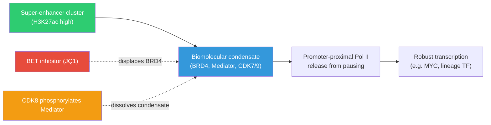
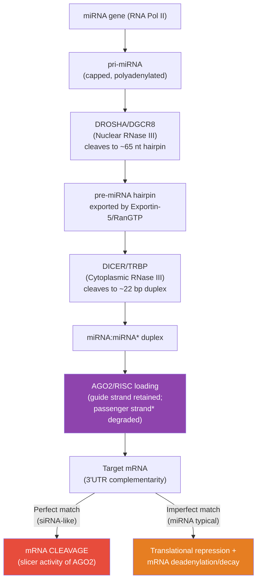
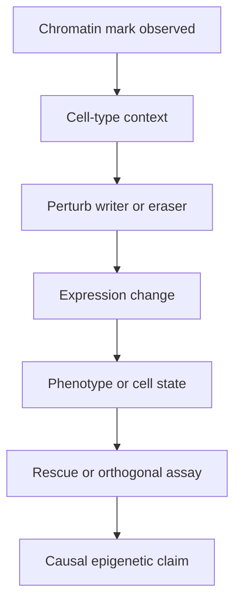

# Epigenetic Inheritance and Disease

\label{sec:unit_IV_epigenetic_inheritance_and_disease}

<!-- chapter-metadata-badge -->
> Level 3/3 · 28 min read · 40 min lecture · Prerequisites: \cref{sec:unit_IV_chromatin_and_epigenetic_mechanisms}

## Learning Objectives

1. Explain three-dimensional genome organization, TADs, and phase-separated condensates.
2. Interpret transgenerational and imprinting evidence with causal caution.
3. Connect epigenetic dysregulation to cancer and developmental disease.
4. Evaluate therapeutic strategies targeting epigenetic marks.

5. Compare chromatin condensates with conventional transcription-factor binding at enhancers.
6. Analyze evidence for transgenerational epigenetic inheritance with explicit controls for genetic confounding.
7. Interpret clinical epigenetic therapies using pathway, biomarker, and response-kinetics evidence.

---

## Three-Dimensional Genome Organization and Phase Separation

### TADs, Loops, and Compartments — Spatial Layers

The genome is folded across multiple length scales, and each scale contributes to gene regulation:

: TADs, Loops, and Compartments — Spatial Layers: Length scale and Structural unit. {#tbl:unit_IV_epigenetic_inheritance_and_disease_tads_loops_and_compartments_spatial_layers}
| Length scale | Structural unit | Marker / detection | Functional role |
| ------------ | --------------- | ------------------ | --------------- |
| 1 kb–100 kb | Promoter–enhancer loops | ChIA-PET, HiChIP, Capture-Hi-C | Direct enhancer–TSS contact for activation |
| 100 kb–1 Mb | TADs | Hi-C insulation score; CTCF/cohesin ChIP | Constrains enhancer search to local genes |
| 1 Mb–100 Mb | A/B compartments | Hi-C eigenvector | Active vs. repressed neighborhoods |
| Chromosome | Chromosome territories | DNA FISH | Each chromosome occupies a distinct nuclear domain |
| Nuclear scale | LADs, NADs, speckles | DamID, TSA-seq | Nuclear lamina, nucleolus, nuclear speckle proximity |

**LADs (Lamina-Associated Domains):** ~1,300 genomic regions (median ~1 Mb) attached to the nuclear lamina via lamin B receptor, marked by H3K9me2/me3, gene-poor and transcriptionally repressive. Lamina detachment correlates with gene activation during differentiation.

### Biomolecular Condensates and Phase Separation

Chromatin is not a static polymer; many regulatory proteins undergo **liquid–liquid phase separation** (LLPS) or form **condensates** with elevated local concentration. Intrinsically disordered regions (IDRs) on transcription factors (e.g., **BRD4**, **Mediator** subunits, **RNA Pol II** CTD-associated factors) promote clustering at **super-enhancers** — unusually large clusters of enhancers densely occupied by Mediator, co-activators, and active histone marks (**H3K27ac**), one example of the broader histone-mark logic formalized by the histone-code framework \citep{strahl2000}. The resulting **transcriptional condensate** concentrates the phosphorylation machinery that releases promoter-proximal paused Pol II, explaining why some loci fire at very high rates (oncogenes such as *MYC* in selected cancers).

**Quantitative criteria for LLPS in cells:**
- IDR-rich proteins above a saturation concentration $c_{\text{sat}}$
- Multivalent interactions (low-affinity, high-valency) between IDRs, with $K_d \sim 1$–$100$ μM
- Round, dynamic droplets that fuse and undergo FRAP recovery on the seconds-to-minutes timescale
- Disassembly upon 1,6-hexanediol (a hallmark, though imperfect, test)

**Examples in chromatin biology:**

: Biomolecular Condensates and Phase Separation: Condensate and Constituents. {#tbl:unit_IV_epigenetic_inheritance_and_disease_biomolecular_condensates_and_phase_separation}
| Condensate | Constituents | Function |
| ---------- | ------------ | -------- |
| Heterochromatin foci | HP1α, H3K9me3 | Concentrates H3K9 methyltransferases; phase-separated repressive compartment |
| Nucleolus | NPM1, fibrillarin, Pol I, rRNA | Ribosome biogenesis; multiphase (FC/DFC/GC sub-compartments) |
| Nuclear speckles | SRSF, SON, MALAT1 | Storage and assembly of splicing factors |
| Cajal bodies | Coilin, snRNPs | snRNP and telomerase RNP biogenesis |
| PML bodies | PML, SUMO, p53 | DNA damage response; senescence; viral defense |
| Super-enhancer condensates | BRD4, Mediator, Pol II CTD | Robust transcription of cell-identity genes |
| Polycomb bodies | CBX2 (PRC1) phase-separated | Polycomb domain compaction in *cis* |

**Conceptual link to TADs:** Condensates operate *within* TADs and at promoter–enhancer loops; disrupting CTCF boundaries can move an oncogenic enhancer adjacent to a silent proto-oncogene (**enhancer hijacking**), a structural-variant mechanism increasingly catalogued in pediatric tumors.


<!-- alt: Flowchart showing super-enhancer–associated condensate bridging enhancers to paused Pol II; BET inhibitors weaken acetyl-lysine engagement of BRD4 and dissolve the condensate; CDK8-mediated phosphorylation of Mediator disrupts condensate integrity. -->

*Super-enhancer–associated condensate bridging enhancers to paused Pol II; BET inhibitors weaken acetyl-lysine engagement of BRD4 and dissolve the condensate; CDK8-mediated phosphorylation of Mediator disrupts condensate integrity.*

**Clinical angle — drugging condensates:**
- **BET bromodomain inhibitors** (e.g., JQ1, OTX015, birabresib, molibresib, mivebresib) displace BRD4 from acetylated chromatin, collapsing condensate-associated transcription at *MYC* and other dependency genes.
- **CDK7 inhibitors** (THZ1, SY-5609) and **CDK9 inhibitors** target the kinases concentrated in transcription condensates.
- **EZH2 inhibitors** (tazemetostat) shrink PRC2-mediated repressive domains.
- **Tumor cells with super-enhancer-driven oncogenes (MYCN-amplified neuroblastoma, MLL-rearranged leukaemia, *TAL1*-driven T-cell acute lymphoblastic leukaemia) can be highly sensitive** to BET inhibition, but response depends on enhancer wiring, compensatory transcription factors, and therapeutic window rather than on super-enhancer status alone.

> **Worked Example 4 — Polymer Statistics in Hi-C:**
>
> **Setup:** A human gene at chromosome 7p15 harbors an enhancer 700 kb upstream. We model intra-chromosomal contact probability with the fractal-globule scaling \cref{eq:hic_scaling}, $P(s) \propto s^{-\alpha}$, with α = 1.1.
>
> **Question:** Estimate the probability of physical contact between enhancer and promoter (s = 700,000 bp). Compare to (a) within-TAD contact at s = 50 kb and (b) trans-chromosomal contact (genome-wide Hi-C average ≈ 10⁻⁶).
>
> **Solution:**
> Setting *P*(50 kb) ≈ 1 (within-TAD baseline), the relative *P*(700 kb) = (700/50)⁻¹·¹ = 14⁻¹·¹ ≈ 0.063. The enhancer–promoter contact probability is ~6 % of the within-TAD baseline.
>
> Compare to trans-chromosomal: 6 × 10⁻² (intra-TAD-distant) versus 1 × 10⁻⁶ (trans) = a **~60,000-fold preference** for intra-chromosomal contacts even at long distances.
>
> **Insight:** CTCF/cohesin loop extrusion concentrates this 60,000-fold enrichment of intra-TAD contacts onto specific enhancer–promoter pairs, raising effective contact probability another 10–100×. This is why disrupting a single CTCF anchor (~20 bp deletion) can completely abolish enhancer–promoter looping and silence the target gene — even though the enhancer DNA is unchanged.

---

<!-- curriculum-scaffold-start -->
### Study Blueprint

- **Big idea:** Three-dimensional genome organization and epigenetic inheritance link regulatory architecture to disease phenotypes.
- **Core concepts:** 3D genome, phase separation, imprinting, epigenetic inheritance.
- **Framework alignment:** Vision & Change: Information flow, exchange, and storage, Structure and function; AP Biology: Information Storage and Transmission, Systems Interactions; NGSS-style topics: Inheritance and Variation of Traits, Structure and Function.
- **Model or quantitative lens:** Chromatin-loop, inheritance, and disease-risk reasoning.
- **Data skill:** Interpret Hi-C, imprinting, or transgenerational datasets with causal caution.
- **Practice cadence:** Concept Explanation, Questions and Methods, Argumentation.
- **Common misconception to repair:** A chromatin contact map is not proof of function without perturbation.
- **Primary lab:** \nameref{sec:lab_unit_IV_epigenetic_inheritance_and_disease}.
- **Question bank:** \nameref{sec:q_unit_IV_epigenetic_inheritance_and_disease}.
- **Transfer task:** Apply inheritance logic to cancer, developmental disorders, and environmental exposure.
- **Bridge to computation:** `biology.genetics.genetics.histone_modification_state`.
<!-- curriculum-scaffold-end -->

---

> **Opening Vignette — Epigenetic Inheritance and Disease**
>
> This chapter connects epigenetic inheritance and disease to measurable evidence: models, datasets, and experiments that can strengthen or weaken each claim.

## Non-Coding RNAs in Gene Regulation

### MicroRNAs (miRNAs) and Post-Transcriptional Repression

miRNAs are ~22 nt single-stranded RNAs that direct post-transcriptional silencing. Over 2,000 annotated human miRNAs collectively regulate ~60% of protein-coding genes \citep{fire1998}.


<!-- alt: Flowchart showing miRNA biogenesis and RISC-mediated silencing. Drosha in the nucleus produces pre-miRNA; DICER in the cytoplasm generates the duplex; AGO2 incorporates the guide strand into RISC; partial 3′ UTR complementarity leads to translational repression and mRNA decay. -->

*miRNA biogenesis and RISC-mediated silencing. Drosha in the nucleus produces pre-miRNA; DICER in the [**cytoplasm**](#gl:cytoplasm) generates the duplex; AGO2 incorporates the guide strand into RISC; partial 3′ UTR complementarity leads to translational repression and mRNA decay.*

**Key oncogenic miRNA examples:**
- **miR-21** (oncomiR): Overexpressed in most cancers; targets PTEN, PDCD4, RECK (tumor suppressors)
- **miR-155** (oncomiR): Overexpressed in B-cell lymphomas; targets SHIP1 (AKT suppressor)
- **miR-34a** (tumor suppressor miR): Downstream of p53; targets CDK6, BCL2, SNAIL; methylated/silenced in many cancers

### Long Non-Coding RNAs (lncRNAs)

lncRNAs are >200 nt functional RNA transcripts with no protein-coding potential. >100,000 annotated in the human genome. Mechanisms of action are diverse:

- **XIST:** Coats the inactive X chromosome; recruits PRC2 to spread H3K27me3, as described in the X-inactivation section.
- **HOTAIR:** Transcribed from HOXC; binds PRC2 to direct H3K27me3 deposition at HOXD and other loci
- **MALAT1:** Nuclear speckle-associated; regulates alternative splicing; highly expressed in cancer
- **H19:** Reservoir for miR-675; tumor suppressor function; imprinted, as described in the genomic-imprinting section.
- **NEAT1:** Paraspeckle scaffold; regulates gene expression by nuclear retention of specific mRNAs

### Small Interfering RNAs (siRNAs) and piRNAs

**siRNAs:** 21–23 nt, perfect complementarity to target; processed by DICER from long double-stranded RNA (dsRNA) \citep{fire1998}. In plants and nematodes, siRNA pathways mediate transposon silencing and antiviral immunity. In mammals, dsRNA triggers interferon responses rather than siRNA pathways in somatic cells; siRNA silencing is more prominent in germ cells and stem cells.

**piRNAs (PIWI-interacting RNAs):** 26–31 nt; DICER-independent (processed by "ping-pong" amplification cycle involving PIWI clade Argonautes: PIWIL1/MILI, PIWIL4/MIWI2). Essential for silencing transposable elements in the germline. Loss of piRNA pathway in *Drosophila* or mice causes transposon derepression and infertility.

---

## Epigenetic Reprogramming and Inheritance

### Mitotic Heritability of Epigenetic Marks — Detailed Mechanism

For an epigenetic mark to be "heritable," it must survive DNA replication and cell division rather than merely correlate with a transcriptional state \citep{jaenisch2003epigeneticregulation}. Different marks have different mechanisms:

: Mitotic Heritability of Epigenetic Marks — Detailed Mechanism: Mark and Mitotic heritability mechanism. {#tbl:unit_IV_epigenetic_inheritance_and_disease_mitotic_heritability_of_epigenetic_marks_detailed_mechanism}
| Mark | Mitotic heritability mechanism | Half-life through divisions |
| ---- | ------------------------------ | ---------------------------- |
| 5mC at CpGs | DNMT1/UHRF1 maintenance at replication fork | High (>10 divisions, ~95% efficiency) |
| H3K27me3 | Read-write feedback (PRC2 EED reads, EZH2 writes); inherited on parental nucleosomes which are randomly distributed to both daughter strands | Medium; restored within 1–2 divisions |
| H3K9me3 | Suv39H1/H2 reads HP1 → recruits more Suv39H; DNMT3A coupling | High at constitutive heterochromatin |
| H3K4me3 | Inherited via parental nucleosomes; rapidly re-established by transcription | Medium |
| H3K27ac | Diluted by half each division; restored by transcription factor activity | Low; not stably heritable |
| H2AK119ub | Inherited via parental nucleosomes; restored by PRC1 | Medium |

**Key conceptual point — parental nucleosome recycling:** During DNA replication, parental nucleosomes are split between the two daughter strands. The histone chaperones **MCM2** (binds H3-H4 dimers via its H3-H4 binding domain), **ASF1** (general H3-H4 chaperone), and **FACT** (Spt16-SSRP1, helps recycle H2A-H2B during transcription and replication) mediate this recycling. The current model:

1. **Parental nucleosome split:** As the replisome opens, parental histones are transiently released from DNA.
2. **Asymmetric recycling:** H3-H4 tetramers preferentially deposit on the **leading strand** (via Polε/MCM2 interaction) or **lagging strand** (via Polα/MCM2-7 helicase-associated MCM2). Recent work shows this is biased toward the leading strand in proliferating cells (~60:40), explaining strand-asymmetric mark inheritance.
3. **CAF-1 deposits new H3.1-H4:** The chromatin assembly factor CAF-1 (CHAF1A/B + RBBP4) is recruited by PCNA at the replication fork. CAF-1 deposits **new** H3.1-H4 tetramers (synthesized from S-phase histone gene bursts).
4. **Newly synthesized histones are deposited UNMODIFIED.** Daughter chromatin starts at half-density of any given mark.
5. **Restoration to full density depends on the read-write feedback loop** — the existing parental marks recruit the writer enzyme, which copies the mark onto neighboring new histones.

**PRC2 propagation through replication.** EED reads H3K27me3 on a parental nucleosome → allosterically activates EZH2 → EZH2 deposits H3K27me3 on a neighboring (newly assembled) nucleosome. Quantitative imaging shows that PRC2 activity at recently replicated chromatin is ~3-fold higher than at established chromatin — explaining how the mark "fills in" the daughter strand within ~6 hours of fork passage.

**DNMT1/UHRF1 mechanism in detail at the fork.** UHRF1 is loaded onto the replication fork by PCNA. UHRF1 SRA binds hemi-methylated CpG (the parental strand carries 5mC; the daughter strand has unmodified C). The UHRF1 RING domain ubiquitinates H3K18 — creating a docking site for DNMT1's RFTS domain. DNMT1 transfers a methyl group from SAM to the daughter cytosine. This coupled mechanism ensures methylation is restored within seconds of fork passage at active replication.

### Germline Reprogramming and Epigenetic Resetting

Somatic epigenetic marks must be erased and re-established in each generation to prevent transmission of acquired somatic states, which is why transgenerational inheritance claims require careful separation of direct exposure, germline exposure, and true inheritance \citep{heard2014transgenerational}:

1. **Post-fertilization reprogramming:** After fertilization, the paternal genome undergoes rapid active demethylation (TET3-mediated 5mC oxidation) within hours. The maternal genome is demethylated more slowly (replication-dependent passive demethylation). Both reach a methylation minimum at the blastocyst stage.
2. **Primordial germ cell (PGC) reprogramming:** PGCs migrate to the gonads (~E7.5–E10.5 in mouse; ~weeks 3–5 in human). They erase CpG methylation genome-wide (including imprint control regions) — the most complete demethylation in the mammalian life cycle.
3. **Re-establishment:** DNMT3A/3B with DNMT3L re-methylate the genome in a sex-specific pattern during gametogenesis (prospermatogonia in males; oocyte growth in females). Imprinted loci are methylated in a sex-specific order: paternal imprints in spermatogonia (before meiosis); maternal imprints in growing oocytes (after meiosis I arrest, prior to ovulation).

### Evidence for Transgenerational Epigenetic Inheritance in Humans

The Dutch Hunger Winter (Hongerwinter, 1944–1945) provides the most studied human evidence. Dutch civilians subjected to severe famine (500–1,000 kcal/day) during WWII German occupation showed:

- **F1 offspring** (exposed in utero): Increased rates of obesity, diabetes, schizophrenia, and CVD in adult life — consistent with developmental programming via altered methylation.
- **F2 offspring** (children of F1): Increased rates of obesity and metabolic syndrome — suggesting transmission across one germline generation.
- **Mechanism:** Reduced methylation at IGF2 differentially methylated regions (DMRs) persists for decades in blood cells of F1 individuals, detectable compared to unexposed siblings.

**Other lines of evidence:**
- Överkalix cohort (Sweden): Paternal grandfather's food supply during slow-growth period correlates with grandsons' diabetes mortality.
- *Agouti* viable yellow ($A^{vy}$) mouse model: Maternal methyl-donor diet (folate, B12, methionine, choline) during pregnancy shifts coat-color distribution by altering methylation of an upstream IAP retrotransposon.
- piRNA-mediated transposon silencing: piRNAs in sperm carry information about active transposons across generations.

> [!NOTE]
> The evidence for true transgenerational epigenetic inheritance in humans (affecting F2 and beyond without continued environmental exposure) is suggestive but not yet definitive. Confounding by shared post-natal environment and direct exposure of the F1 germline (the F2 was a primordial germ cell in the F0 grandmother during the F1 in utero exposure) remains difficult to exclude. Mechanistically, piRNA-mediated transposon silencing and small-RNA transmission in sperm provide plausible vehicles, but a clean causal chain in humans has not been established.

> **Concept Check 7:** Imagine a dCas9 fusion protein is targeted to the *BRCA1* promoter in a breast-cancer cell line, carrying a DNMT3A catalytic domain. Over several cell divisions, the promoter becomes hypermethylated and transcription drops. Once dCas9 is withdrawn, does the methylation persist, relax over mitoses, or become heritable between cells? Explain in terms of DNMT1 maintenance methylation, passive demethylation during S-phase, and the absence of active demethylation by TET enzymes under these conditions.

> **Concept Check 8:** A scientist treats cells with the DNMT inhibitor decitabine for 48 hours, then washes it out. Predicting that DNMT1 will resume normal activity after washout, will the demethylation persist, partially recover, or fully recover over the subsequent 10 cell generations? Sketch a quantitative model assuming ε returns to 0.95 instantaneously after washout and starting *f₀* = 0.10 (10 % methylated post-decitabine).

---

## Cancer Epigenetics and Clinical Translation

Cancer cells display **systemic epigenetic dysregulation**: typically global DNA hypomethylation (especially of repetitive elements), focal hypermethylation of tumor-suppressor CGI promoters, broad H3K27me3/H3K9me3 redistribution, and aberrant chromatin remodeling complex composition \citep{feinberg2016cancerepigenetics}. The therapeutic implication is that, unlike genetic mutations, epigenetic states are **reversible** — and several drug classes now target each layer.

### The Cancer Epigenome — Two Concurrent Patterns

**Pattern 1: Global hypomethylation.** Repetitive elements (LINE-1, SINE, IAP, satellite repeats), normally heavily methylated, lose methylation in nearly every cancer type. Consequences:
- **Chromosomal instability:** demethylation of pericentromeric satellite-2 sequences disrupts heterochromatin, leading to chromosome bridges, lagging chromosomes, and aneuploidy.
- **LINE-1 reactivation:** transposition of L1 elements can disrupt tumor-suppressor genes (e.g., L1 insertion in *APC* contributes to colorectal cancer).
- **Mis-regulated lineage genes:** demethylation of normally repressed germline genes (e.g., MAGE, NY-ESO-1) creates **cancer-testis antigens** that can be exploited for immunotherapy (e.g., NY-ESO-1 TCR-T cells).
- **Mechanism:** likely loss of DNMT1 maintenance (UHRF1 dysregulation) and/or genome-wide TET2-mediated demethylation in CHIP-derived clones.

**Pattern 2: Focal CGI hypermethylation.** Tumor-suppressor gene promoters become hypermethylated, silencing them. The illustrative beta-value heatmap in \cref{fig:unit_IV_methylation_heatmap} should be read as a pattern across loci and samples, not as patient-specific evidence. Examples and clinical relevance:

: The Cancer Epigenome — Two Concurrent Patterns: Gene and Hypermethylated in. {#tbl:unit_IV_epigenetic_inheritance_and_disease_the_cancer_epigenome_two_concurrent_patterns}
| Gene | Hypermethylated in | Functional consequence | Therapeutic angle |
| ---- | ------------------ | ---------------------- | ----------------- |
| *MLH1* | CIMP-high colorectal cancer | Microsatellite instability | Pembrolizumab in MSI-high tumors |
| *BRCA1* | Triple-negative breast cancer | Homologous-recombination deficiency | PARP inhibitors |
| *VHL* | Renal cell carcinoma | HIF stabilization | HIF-2α inhibitors (belzutifan) |
| *CDKN2A/p16* | Many cancers | RB1 pathway loss → unrestrained G1/S | CDK4/6 inhibitors |
| *MGMT* | Glioblastoma | DNA repair loss | Temozolomide (sensitivity) |
| *DAPK* | Lung, head/neck cancer | Apoptosis loss | Combination with TRAIL agonists (clinical trials) |

The two patterns can coexist — a single tumor can have global hypomethylation of repeats AND focal hypermethylation of tumor suppressors. The mechanism appears to be partial: CGI-targeted DNMT3A/B activity becomes mis-localized to actively transcribed regions, while genome-wide DNMT1 maintenance fails at heterochromatin.

### Approved and Investigational Epigenetic Drugs

: Approved and Investigational Epigenetic Drugs: Class and Examples. {#tbl:unit_IV_epigenetic_inheritance_and_disease_approved_and_investigational_epigenetic_drugs}
| Class | Examples | Targets | Approved Indications | Clinical-trial highlights |
| ----- | -------- | ------- | -------------------- | ------------------------- |
| **DNMT inhibitors** | Azacitidine (Vidaza), decitabine (Dacogen); oral cedazuridine/decitabine (Inqovi) | DNMT1 (covalent trap) | MDS, AML (low-intensity), CMML | Aza + venetoclax: ORR 70 % in elderly AML (VIALE-A); decitabine-cedazuridine in CMML |
| **HDAC inhibitors** | Vorinostat (SAHA), romidepsin, panobinostat, belinostat, tucidinostat | Pan-HDAC or class-selective | CTCL, PTCL, multiple myeloma (panobinostat) | Romidepsin ORR 34 % in PTCL; panobinostat-bortezomib-dex in MM |
| **EZH2 / PRC2 inhibitors** | Tazemetostat, valemetostat | EZH2 SET domain (and EZH1) | Epithelioid sarcoma (INI1-loss); EZH2-mut follicular lymphoma; ATL (valemetostat) | Tazemetostat: median PFS 5.5 mo in INI1-loss ES |
| **IDH1/IDH2 inhibitors** | Ivosidenib (IDH1), enasidenib (IDH2), vorasidenib | Mutant IDH neomorphic activity (2-HG) | IDH-mut AML; IDH-mut grade-2 glioma (vorasidenib, 2024) | Vorasidenib INDIGO trial: median PFS 27 vs 11 mo |
| **BET inhibitors** | OTX015 (birabresib), molibresib, mivebresib, BMS-986158 | BRD2/3/4 bromodomains | Investigational: NUT carcinoma, MYC-driven tumors | NUT-carcinoma ORR ~35 %; pancreatic cancer combination trials |
| **LSD1 inhibitors** | Tranylcypromine, iadademstat, bomedemstat | KDM1A/LSD1 demethylase | Investigational: AML, SCLC, MPN | Iadademstat + azacitidine in AML; bomedemstat in essential thrombocythaemia |
| **Menin–MLL inhibitors** | Revumenib (FDA 2024) | Menin–MLL/KMT2A interface | Approved KMT2A-rearranged AML | Revumenib AUGMENT-101 trial: ORR 53 %, CR 23 % |
| **PROTAC bromodomain degraders** | ARV-771, dBET6, ARV-825 | BRD4 (degradation) | Investigational | Targets the three BET family members; deeper BRD4 depletion than inhibition |
| **DOT1L inhibitors** | Pinometostat (EPZ-5676) | H3K79 methyltransferase | Investigational MLL-rearranged AML | Phase 2 ORR ~10 % monotherapy; combination strategies in trial |
| **CDK7/9 inhibitors** | THZ1, SY-5609 (CDK7); AZD4573 (CDK9) | Transcription-cycle CDKs | Investigational | Disrupts super-enhancer-driven oncogene transcription |
| **Combination DNMTi + HDACi or DNMTi + venetoclax** | Aza + venetoclax (FDA 2018) | DNMT1 + BCL2 | Standard-of-care AML in unfit patients | Aza-venetoclax: median OS 14.7 mo vs 9.6 mo aza alone |

### Clinical Trial Vignettes — Three Paradigm Therapies

**(1) Tazemetostat for INI1-loss epithelioid sarcoma.** In 2020, tazemetostat became the first epigenetic-pathway-defined targeted therapy. INI1/SMARCB1-loss epithelioid sarcoma has no chemotherapy or surgical option in metastatic setting; the agent reactivates SWI/SNF-suppressed targets via EZH2 inhibition. Pivotal trial (NCT02601950): 62 patients enrolled, ORR 15 %, median time to response 3.6 mo, median PFS 5.5 mo. The slow response kinetics reflect epigenetic reprogramming requiring multiple cell divisions. FDA approval (Jan 2020) was a landmark for synthetic-lethal epigenetic therapy \citep{fda2020tazverik}.

**(2) Vorasidenib for IDH1-mutant grade-2 glioma.** In 2024, vorasidenib became the first targeted therapy approved for grade-2 glioma. IDH1-R132H mutation produces oncometabolite 2-HG, which inhibits TET demethylases → CIMP+ phenotype → genome-wide hypermethylation → differentiation block. Vorasidenib is a brain-penetrant mutant-IDH1 inhibitor. INDIGO trial (NCT04164901): 331 patients with grade-2 IDH-mut glioma post-surgery, median PFS 27.7 mo (vorasidenib) vs 11.1 mo (placebo); 85 % reduction in time-to-next-intervention. The trial demonstrated that depleting 2-HG is sufficient to restore demethylation and slow tumor growth without cytotoxicity.

**(3) Revumenib for KMT2A-rearranged AML.** In 2024, revumenib became the first menin–MLL inhibitor approved by FDA. KMT2A-rearranged (ex-MLL-rearranged) AML accounts for ~10 % of pediatric AML and ~5 % of adult AML; menin is required for MLL-fusion-driven HOXA9 expression. AUGMENT-101 trial (NCT04065399): ORR 53 % in relapsed/refractory KMT2Ar AML, CR 23 %, median DoR 6.4 mo. The drug demonstrated that targeting protein–protein interaction (menin-MLL) within an aberrant chromatin complex is therapeutically viable.

### A Checklist for Interpreting Cancer Epigenomes

When you encounter a tumor **multi-omics** report, integrate:

1. **DNA methylation** — focal CGI hypermethylation (TSG silencing) vs. global hypomethylation (genomic instability); CIMP (CpG island methylator phenotype) as a class.
2. **Histone marks** — **H3K27me3** (PRC2 silencing), **H3K4me3** (promoter activity), **H3K27ac** (active enhancers), **H3K36me3** (transcribed gene bodies; loss in renal cell carcinoma with SETD2 mutation).
3. **Chromatin accessibility** (ATAC-seq) — nucleosome-depleted regions at enhancers; super-enhancers identified by Mediator/H3K27ac density.
4. **3D genome** (Hi-C) — TAD boundary loss, **enhancer hijacking**.
5. **Histone mutations (oncohistones)** — H3K27M (pediatric DIPG), H3G34R/V (pediatric high-grade glioma), H3K36M (chondroblastoma): these are *gain-of-function* mutants that act as PRC2 / SETD2 inhibitors in trans, producing genome-wide chromatin redistribution despite occurring in about 5–10 % of nucleosomes.
6. **Chromatin-remodeller mutations** — ARID1A, SMARCA4, SMARCB1, PBRM1 (SWI/SNF); KMT2C/D, EZH2 (PRC2).
7. **RNA** — fusion oncoproteins that recruit aberrant chromatin complexes (**MLL** fusions to AF4/AF9/ENL, **SS18–SSX** in synovial sarcoma, **BRD4–NUT** in NUT carcinoma).

This checklist mirrors how clinicians and trialists rationalise **DNMT + HDAC** combinations, **EZH2** monotherapy in defined molecular subtypes, and emerging **BET + BCL2** regimens in haematological malignancies.

> **Worked Example 5 — CpG Island Methylation and Transcriptional Silencing**
>
> **Problem:** A molecular biologist treats cancer cells with 5-azacytidine (azacitidine), a DNMT inhibitor. They observe re-expression of the tumor suppressor gene *CDKN2B* (p15). Before treatment, bisulfite sequencing showed 90% CpG methylation at the *CDKN2B* promoter CGI. The drug is incorporated into DNA during replication and forms a covalent adduct with DNMT1, preventing maintenance methylation.
>
> **(a)** After 3 cell divisions with the drug present, what methylation level would you predict at the CGI if no de novo methylation occurs?
>
> **(b)** Why do HDAC inhibitors (e.g., vorinostat) often synergise with DNMT inhibitors in cancer treatment?
>
> **Solution:**
>
> **(a)** Maintenance methylation requires DNMT1 to copy hemi-methylated CpGs after replication. With DNMT1 blocked, after each division sister strands receive no methylation:
>
> \begin{equation}f_n = f_0 \times \left(\frac{1}{2}\right)^n\label{eq:f_n}\end{equation}
>
> \begin{equation}f_3 = 0.90 \times \left(\frac{1}{2}\right)^3 = 0.90 \times 0.125 = 0.1125 \approx 11\%\label{eq:f_3}\end{equation}
>
> After 3 divisions: ~11% methylation (down from 90%). Since ~50% methylation is the threshold for silencing at most CGIs, *CDKN2B* should be significantly re-expressed.
>
> **(b)** Two distinct repressive layers maintain CGI-silenced genes:
> 1. **CpG methylation** → methyl-CpG binding proteins (MBD2) recruit HDAC → deacetylated histones
> 2. **Deacetylated histones** → compact chromatin, transcription factor exclusion
>
> DNMT inhibition removes layer 1 but may not immediately open chromatin if deacetylated histones persist. HDAC inhibitors (remove layer 2) accumulate acetylation independently of methylation. **Together**, both layers are removed simultaneously → synergistic re-activation of silenced tumor suppressors.

> **Worked Example 6 — IDH1 Mutation and the Methylator Phenotype**
>
> **Problem:** A glioma tumor carries the IDH1-R132H mutation. The mutant enzyme converts α-ketoglutarate (αKG) to 2-hydroxyglutarate (2-HG), which competitively inhibits αKG-dependent dioxygenases including TET demethylases, KDM Jumonji-domain demethylases, and prolyl hydroxylases. Predict three genome-wide chromatin consequences of IDH1-R132H, and explain why vorasidenib is therapeutic.
>
> **Solution:**
> 1. **Global hypermethylation of CpG islands** (CIMP+): TET inhibition prevents demethylation → progressive CpG accumulation.
> 2. **H3K27me3 and H3K9me3 accumulation**: Jumonji KDM6A/B and KDM4 inhibition prevents demethylation of repressive marks → genome-wide silencing of differentiation genes (the "differentiation block" of IDH-mut AML and glioma).
> 3. **HIF-1α stabilization**: prolyl hydroxylase inhibition stabilizes HIF-1α → pseudohypoxia → angiogenesis, glycolysis upregulation.
>
> Vorasidenib (FDA 2024 for IDH1-mut grade-2 glioma) crosses the blood–brain barrier and inhibits mutant IDH1, depleting 2-HG and partially reversing TET/KDM/PHD inhibition — restoring demethylation and re-engaging differentiation. Median progression-free survival doubled (27 vs. 11 months) in the INDIGO trial.

---

## Computational Bridge

Promoter CpG islands are GC-rich; summarizing composition links chromatin biology to sequence statistics:

```python
from biology.genetics import gc_content

cgi_like = "CGCGCGCGCGATATATAT"
print(round(gc_content(cgi_like), 3))
```

Methylation decay through cell divisions is a one-line simulation:

```python
def methylation_decay(f0: float, generations: int, eps: float = 0.95) -> list[float]:
    """Predict CpG methylation fraction over `generations` divisions
    given maintenance efficiency `eps`.

    f_{n+1} = (eps + (1 - eps) / 2) * f_n  (per-CpG approximation)
    """
    factor = eps + (1 - eps) / 2
    return [f0 * factor ** n for n in range(generations + 1)]

print([round(v, 3) for v in methylation_decay(0.90, 5, eps=0.0)])  # DNMT1-null
```

Setting ε = 0 simulates a DNMT1-null (or azacitidine-trapped) cell — the fraction halves each generation.

A Polycomb-spreading simulator with the EED–allosteric read-write feedback:

```python
def polycomb_spread(seeds: int, generations: int, k: float, n_nucleosomes: int = 50) -> list[float]:
    """Simulate H3K27me3 occupancy over generations.

    seeds: initial number of H3K27me3-marked nucleosomes
    k: marks deposited per generation per existing mark (read-write coupling)
    n_nucleosomes: total nucleosomes available
    """
    history = [seeds]
    m = seeds
    for _ in range(generations):
        m = m / 2 + k          # passive halving + spreading
        m = min(m, n_nucleosomes)  # saturation
        history.append(m)
    return history

print(polycomb_spread(seeds=2, generations=5, k=10))
# [2, 11.0, 16.5, 18.25, 19.125, 19.5625]  → reaches ~20 marked nucleosomes
```

> **Clinical / systems note:** Azacitidine/decitabine and HDAC inhibitors are approved where malignant clones depend on silenced differentiation programs — therapies that **reverse layers of repression** rather than mutating oncogenes. Newer entries (tazemetostat for EZH2; menin–MLL inhibitors for KMT2A-rearranged AML; vorasidenib for IDH-mut glioma) extend the same logic to writers, readers, and metabolic upstream regulators.

---

## Current Evidence and Frontier Biology: Epigenetic Inheritance and Disease

For **Epigenetic Inheritance and Disease**, frontier biology belongs inside the evidence logic of
the chapter. Molecular genetics now spans single-reference sequences, telomere-to-telomere assemblies, pangenome graphs, long-read sequencing, CRISPR medicines, and ethical deployment. The core reading question is this: epigenetic claims require causal perturbation, cell-type specificity, timing, and inheritance controls.

- **What to verify:** identify the observation, model, assay, or dataset that
  would make the claim stronger or weaker.
- **What to qualify:** state the scale, organism, cell type, environmental
  condition, or population where the claim is expected to hold.
- **What to compare:** test at least one alternative explanation, baseline, or
  null model before treating the pattern as causal.
- **What to cite:** distinguish primary evidence, review synthesis, public
  dataset, and institutional guidance; for recent or numeric claims, prefer
  the source closest to the measurement and state what has changed since it was
  published.

For reference-dependent genetic claims, ask whether read length, structural variation, ancestry representation, phasing, or clinical validation changes the interpretation \citep{humanpangenome2023,fda2023casgevy,fda2024casgevythalassemia}.

**Source practice:** For genomics and editing claims, distinguish discovery from clinical actionability, and cite reference resources, regulatory records, or primary editing studies close to the claim \citep{humanpangenome2023,fda2026casgevy,chalumeau2025primeediting}.

### Current Evidence Map: Epigenetic Causality Ladder


<!-- alt: Flowchart showing an epigenetic mark is not automatically a cause; causal claims need perturbation, timing, cell-type specificity, expression readout, and rescue or orthogonal evidence. -->

*An epigenetic mark is not automatically a cause; causal claims need perturbation, timing, cell-type specificity, expression readout, and rescue or orthogonal evidence.*

## Summary

- **Chromatin** is organized around the nucleosome (147 bp DNA + histone octamer H2A/H2B/H3/H4). Histone variants (H3.3, CENP-A, H2A.Z, H2A.X, macroH2A) define specialized chromatin states. Higher-order compaction creates TADs (CTCF/cohesin) and A/B compartments.
- **Histone acetylation** (HATs; activating, e.g., H3K27ac, H3K9ac, H4K16ac) and **deacetylation** (HDACs; repressive) regulate accessibility. Newer acyl marks (lactylation, β-hydroxybutyrylation, crotonylation, butyrylation) couple chromatin to metabolism.
- **Histone methylation** has context-dependent effects. H3K4me3 = active promoters; H3K36me3 = gene bodies; H3K27me3 = Polycomb (PRC2) silencing; H3K9me3 = constitutive heterochromatin (HP1); H4K20me3 = pericentric heterochromatin. Bivalent domains (H3K4me3 + H3K27me3) mark poised developmental genes in ES cells.
- **Polycomb / Trithorax cellular memory:** PRC2 (EZH2) writes H3K27me3 → recruits PRC1 (RING1B → H2AK119ub). MLL/COMPASS writes H3K4me3; UTX/JMJD3 erase H3K27me3; SWI/SNF evicts PRC1/2 — together antagonising Polycomb at active genes.
- **DNA methylation** at CpG islands (DNMT3A/3B *de novo*; DNMT1+UHRF1 maintenance) causes stable gene silencing. **TET enzymes** oxidise 5mC → 5hmC → 5fC → 5caC for active demethylation; 5hmC is itself a stable mark. IDH1/2 mutations produce 2-HG, blocking TET and creating the CIMP phenotype.
- **Genomic imprinting:** ~150 genes from ~30 ICR-controlled clusters expressed monoallelically by parent of origin. IGF2/H19 (CTCF-insulator), 15q11–q13 (Prader–Willi/Angelman), 11p15 BWS/SRS exemplify mechanisms and reciprocal phenotypes.
- **X-chromosome inactivation:** XIST lncRNA (cis-coating) → SPEN-HDAC3 + PRC2 → H3K27me3 + DNMT3 → CGI methylation; ~15–25 % escape genes (mostly PAR). Skewed XCI explains variable X-linked disease in heterozygous females. iPSC reprogramming reactivates Xi.
- **Chromatin remodellers:** SWI/SNF (BAF/PBAF — slide+eject; mutated in ~20 % cancers), ISWI (spacing), CHD/NuRD (repressive sliding + HDAC), INO80/SWR1 (H2A.Z exchange).
- **3D genome:** TADs by loop extrusion (CTCF + cohesin); A/B compartments; LADs at the lamina; phase-separated condensates at super-enhancers (BRD4, Mediator, Pol II CTD); CDK8 dissolves condensates by phosphorylating Mediator.
- **miRNA / lncRNA / piRNA:** DROSHA → DICER → RISC for miRNA; lncRNAs (XIST, HOTAIR, MALAT1, NEAT1) scaffold complexes; piRNAs silence transposons in germline.
- **Mitotic / germline reprogramming:** Maintenance via DNMT1+UHRF1 (H3K18ub-coupled) and read-write feedback for histone marks. CAF-1 deposits new histones at the fork. Two waves of epigenetic erasure (post-fertilization; PGC). Imprints protected from PGC erasure and re-set sex-specifically during gametogenesis.
- **Cancer epigenetics & clinical translation:** Approved drugs target each layer — DNMTi, HDACi, EZH2i, IDH-mut inhibitors, BET inhibitors, menin–MLL inhibitors, oncohistone H3K27M biology, condensate-targeting agents.
- **Connections:** See \cref{sec:unit_IV_gene_expression} for transcriptional output, \cref{sec:unit_IV_mutations_and_genomics} for CRISPR-based epigenome editing, \nameref{sec:unit_V_unit_intro} for imprinting and pedigree patterns, and \nameref{sec:unit_IX_unit_intro} for nuclear receptor chromatin targeting.

---

## Review Questions

1. A gene has 95% CpG methylation at its promoter CGI. A researcher applies 5-azacytidine for 5 cell divisions with no de novo methylation. Using the formula $f_n = f_0 / 2^n$, what methylation level remains? If the transcription threshold is 30%, at which division does the gene first become potentially active?
2. Explain why H3K27me3 is a **repressive** mark while H3K4me3 is an **activating** mark, even though both involve lysine methylation on histone H3. Include the relevant enzymes (HMT and KDM) and reader proteins for each.
3. Draw and annotate the IGF2/H19 imprinting mechanism. Explain why a maternal deletion at the ICR/DMR causes Beckwith-Wiedemann syndrome (biallelic IGF2 expression), while a paternal deletion causes Silver-Russell syndrome (biallelic IGF2 silencing).
4. A female patient presents with Rett syndrome. Genetic testing shows a missense mutation in *MECP2* (methyl-CpG binding protein 2) on one X chromosome. Explain why Rett syndrome shows variable severity between affected females, using the concept of X-chromosome inactivation skewing.
5. A cancer biopsy shows the following ChIP-seq results at a tumor-suppressor gene promoter: H3K27me3 high, H3K4me3 absent, H3K27ac absent, and 85% CpG methylation. A second tumor from the same patient shows H3K27me3 low, H3K27ac present, H3K4me3 high, and 5% methylation — with the tumor-suppressor gene transcribed. Propose two mechanisms by which the epigenetic state could have switched, and describe the specific enzymes involved.
6. Compare piRNAs and miRNAs in terms of: (a) size, (b) biogenesis pathway (DICER-dependent vs. independent), (c) primary biological function in mammals, and (d) what happens when the pathway is disrupted genetically.
7. A developmental biologist shows that a *Drosophila* gene is in a "bivalent domain" in neural stem cells (H3K4me3 + H3K27me3). After neural differentiation, H3K27me3 is removed by KDM6A. What molecular events would you expect at this gene promoter? What histone remodeling complex would facilitate nucleosome repositioning for full activation?
8. The Dutch Hunger Winter cohort shows that caloric restriction in pregnant women led to measurable methylation differences at the IGF2 DMR in their children, persisting for 60 years. Critically evaluate this as evidence for transgenerational epigenetic inheritance, noting the key confounders and what additional data would conclusively demonstrate germline transmission.
9. A clinical trial combines azacitidine (DNMT inhibitor) with vorinostat (HDAC inhibitor) for treating a myeloid cancer. Using your knowledge of the two repressive layers at silenced CGI promoters, predict which order of drug administration would be more effective. Support your reasoning with the molecular mechanism.
10. CRISPR-dCas9 (catalytically dead Cas9) fused to DNMT3A can write DNA methylation at specific genomic loci. Design an experiment using this tool to test whether the methylation at the *BRCA1* promoter in a cancer cell line is the **cause** of silencing (not merely a consequence). Describe the expected result if methylation is causal vs. if there is an upstream histone modification driving silencing.
11. Explain how a **BET bromodomain inhibitor** might reduce *MYC* transcription without mutating the *MYC* locus. How would you test whether the drug acts via loss of BRD4 at super-enhancers rather than a global transcription shutdown?
12. A pediatric tumor harbors a **CTCF** site deletion that fuses two **TADs**. Propose how this structural variant could activate an oncogene — and one experiment (Hi-C, CRISPR excision rescue, or luciferase reporter) to support enhancer hijacking.
13. A patient with myelodysplastic syndrome has a TET2 loss-of-function mutation. Predict the genome-wide methylation phenotype, and explain why this patient might respond to azacitidine *better* than a TET2-wild-type patient.
14. A diffuse intrinsic pontine glioma harbors an H3K27M oncohistone. Explain why ~10 % of nucleosomes carrying this mutation can produce a genome-wide H3K27me3 reduction (gain-of-function effect on PRC2 in trans). What is the rationale for EZH2 inhibitors in this setting?
15. Quantitatively compare the half-lives of H3K27ac and 5mC marks across cell divisions. Why does this difference imply that long-term cellular memory is encoded primarily in DNA methylation and Polycomb marks, not acetylation?
16. A glioma is diagnosed with IDH1-R132H mutation. Plasma 2-HG is 200 µM (vs. < 10 µM in healthy individuals). The patient is treated with vorasidenib (mutant-IDH1 inhibitor). After 3 months, plasma 2-HG drops to 12 µM. Predict the time-course of DNA methylation reversal at CIMP+ loci. Why does clinical response (radiographic improvement) typically lag 6–12 months behind 2-HG normalization?
17. A laboratory generates a mouse with a homozygous deletion of the *Cbx7* gene (encoding a PRC1 chromobox subunit). Predict the hematopoietic phenotype. Would you expect the phenotype to be more or less severe than a *Bmi1* (PCGF4) homozygous deletion? Justify your answer in terms of redundancy among canonical-PRC1 paralogs.
18. A 35-year-old woman is found to have CHIP with a *DNMT3A* R882H mutation at 15 % VAF. Three years later she develops AML. Sequencing of the AML shows the same DNMT3A R882H plus a new *FLT3-ITD* mutation. Discuss the implications: (i) why is DNMT3A loss often a CHIP-precursor mutation rather than the AML-driver itself? (ii) How does R882H differ from a complete loss-of-function? (iii) What treatment would target both the epigenetic and signaling layers?

---

## Further Reading and Source Notes: Epigenetic Inheritance and Disease

- Strahl & Allis (2000). The language of covalent histone modifications. *Nature*, 403.
- Lyon (1961). Gene action in the X-chromosome of the mouse (*Mus musculus L.*). *Nature*, 190.
- Fire et al. (1998). Potent and specific genetic interference by double-stranded RNA in *Caenorhabditis elegans*. *Nature*, 391.
- Doudna & Charpentier (2014). The new frontier of genome engineering with CRISPR-Cas9. *Science*, 346.

---

## Key Terms

: Current Evidence Map: Epigenetic Causality Ladder: Term and Definition. {#tbl:unit_IV_epigenetic_inheritance_and_disease_current_evidence_map_epigenetic_causality_ladder}
| Term | Definition |
| ---- | ---------- |
| **Epigenetics** | Heritable changes in gene expression that do not alter the DNA sequence |
| **Nucleosome** | 147 bp DNA + histone octamer (H2A, H2B, H3, H4 × 2); fundamental chromatin unit |
| **Histone variant** | Non-canonical histone (H3.3, CENP-A, H2A.Z, H2A.X, macroH2A) deposited at specialized loci |
| **Histone code** | Combinatorial histone modifications specify chromatin states and downstream regulatory outcomes |
| **HAT / HDAC** | Histone acetyltransferase (writer) / deacetylase (eraser); regulate H3K9/H3K14/H3K27/H4K16 acetylation |
| **H3K27me3** | PRC2/EZH2-deposited Polycomb repressive mark |
| **H3K4me3** | MLL/SET1-deposited active promoter mark |
| **H3K9me3** | SUV39H/SETDB1-deposited constitutive heterochromatin mark; HP1 reader |
| **H3K36me3** | SETD2-deposited transcribed gene body mark |
| **PRC1 / PRC2** | Polycomb complexes; PRC2 writes H3K27me3 (EZH2), PRC1 writes H2AK119ub (RING1B) |
| **Trithorax (TrxG)** | MLL/COMPASS, KDM6A/B, BAF — antagonise Polycomb |
| **CpG island** | ~500 bp–2 kb region of high CpG density; methylation at promoter CGIs silences genes |
| **DNMT1** | Maintenance DNA methyltransferase; copies hemimethylated CpGs at replication fork (UHRF1-recruited) |
| **DNMT3A/3B** | De novo methyltransferases; require DNMT3L cofactor |
| **UHRF1** | Hemi-methyl-CpG reader (SRA); H3K9me reader (TTD); recruits DNMT1 to fork |
| **TET enzymes** | Fe(II)/αKG-dependent dioxygenases; oxidise 5mC → 5hmC → 5fC → 5caC for active demethylation |
| **5-methylcytosine** | The "fifth base"; methylated cytosine at CpG dinucleotides |
| **5hmC** | 5-hydroxymethylcytosine; TET oxidation product; stable mark in neurons |
| **Genomic imprinting** | Parent-of-origin-specific monoallelic gene expression; ~150 human genes |
| **ICR / DMR** | Imprint control region / differentially methylated region |
| **XIST** | X-inactive specific transcript; 17 kb lncRNA; coats inactive X chromosome in cis |
| **Skewed XCI** | Non-50/50 X-inactivation distribution; explains variable X-linked disease in females |
| **miRNA** | ~22 nt RNA; DROSHA → DICER pathway; AGO2/RISC → translational repression/mRNA decay |
| **piRNA** | 26–31 nt germline RNA; PIWI pathway; silences transposable elements |
| **TAD** | Topologically Associating Domain; chromatin loop defined by CTCF/cohesin; enhancer-promoter contacts |
| **A/B compartment** | Megabase-scale active vs. repressed chromatin neighborhoods |
| **LAD** | Lamina-Associated Domain; gene-poor regions tethered to nuclear periphery |
| **LLPS / condensate** | Liquid-liquid phase separation; concentrates IDR-containing regulators at hubs |
| **Super-enhancer** | Large enhancer cluster with dense Mediator/BRD4/H3K27ac; drives high transcriptional output |
| **Bivalent domain** | Simultaneous H3K4me3 + H3K27me3 at developmental gene promoters in ES cells |
| **SWI/SNF (BAF)** | ATP-dependent remodeller; mutated in ~20 % cancers (ARID1A, SMARCB1, PBRM1) |
| **ISWI / CHD/NuRD / INO80** | Other remodeller families: spacing / repressive sliding+HDAC / H2A.Z exchange |
| **CAF-1** | Chromatin assembly factor 1; deposits new H3.1-H4 at replication fork via PCNA |
| **Azacitidine / decitabine** | DNMT inhibitors; trap DNMT1; approved for MDS/AML |
| **Vorinostat (SAHA)** | HDAC inhibitor; approved CTCL; synergises with DNMT-i |
| **Tazemetostat** | EZH2 inhibitor; FDA-approved for SMARCB1-loss epithelioid sarcoma and EZH2-mut FL |
| **BET inhibitor** | Blocks bromodomain–acetyl-lysine engagement (e.g., BRD4); collapses oncogenic transcriptional condensates |
| **Vorasidenib** | Mutant-IDH1 inhibitor; FDA-approved 2024 for grade-2 glioma; depletes 2-HG, restores TET activity |
| **Revumenib** | Menin–MLL inhibitor; FDA-approved 2024 for KMT2A-rearranged AML |
| **Oncohistone** | Recurrent gain-of-function histone mutation (H3K27M, H3G34R/V, H3K36M) acting in trans |
| **CIMP** | CpG-island methylator phenotype; cluster of hypermethylated CGIs (IDH-mut glioma, MLH1-silent CRC) |

---

## Discussion Questions

These open-ended questions require integration across multiple sections and connection to clinical or experimental practice. Suitable for graduate-style discussion or take-home essay.

1. **Cellular memory under perturbation.** PRC2 (H3K27me3) is regularly described as a "cellular memory" system. Experimentally, how would you distinguish whether Polycomb memory at a developmental gene is maintained by (a) the read-write feedback loop alone, (b) the parental nucleosome inheritance mechanism, or (c) DNA methylation acting downstream? Propose two CRISPR-based perturbations that would discriminate between these mechanisms.

2. **Aging and the epigenetic clock.** Steve Horvath's epigenetic clock predicts chronological age from CpG methylation patterns at ~353 sites with median error of 3.6 years. Why should DNA methylation drift with age? Propose three biological mechanisms (mitotic-error, oxidative-stress, lineage-replacement). What therapeutic implications would follow if epigenetic age could be reversed (e.g., via Yamanaka factors, partial reprogramming)?

3. **The "junk DNA" reckoning and 80 % functional ENCODE claim.** ENCODE (2012) claimed ≥ 80 % of the human genome has biochemical activity (chromatin accessibility, TF binding, histone marks, RNA transcription). Critics argue most of these activities are "noise" — neutral binding to GC-rich sequences. Take a position: design an experiment that would distinguish biologically functional enhancer activity from "spurious" biochemical activity at a candidate non-coding region.

4. **Synthetic biology with phase separation.** Engineering programmable transcription factors with IDR-mediated condensate formation could provide programmable control over transcription rate. Propose three design principles — and three failure modes — for an engineered IDR–dCas9 fusion that would create a tunable super-enhancer-like condensate.

5. **Trans-generational epigenetic inheritance: real or artifact?** Critique the human evidence (Dutch Hunger Winter, Överkalix, Holocaust trauma cohorts). What four experimental designs would conclusively demonstrate transgenerational inheritance through sperm/oocyte (rather than direct exposure of F1 germline)? Why is this question particularly difficult in mammals compared to *C. elegans* or *Arabidopsis*?

6. **Clinical sequencing and the epigenome.** A 70-year-old woman has DNMT3A R882H clonal-hematopoiesis (CHIP) detected on routine whole-exome sequencing. She has no AML and no cytopenia. As her physician, what counselling would you provide regarding: (i) AML risk, (ii) cardiovascular risk (CHIP elevates CHD risk independent of AML), (iii) lifestyle modifications, (iv) whether prophylactic treatment should be considered, and (v) what monitoring frequency you would recommend?

---

## Companion Source Module: Epigenetic Inheritance and Disease

**Epigenetic Inheritance and Disease** should leave a reproducible trail from a biological claim to
the code, figure, diagram, or paper-based activity that can test it. Use the
surfaces below to inspect the chapter's assumptions, rerun the relevant model,
or compare the manuscript explanation with companion labs and figures.

: Companion source surfaces for Epigenetic Inheritance and Disease. {#tbl:unit_IV_epigenetic_inheritance_and_disease_companion_source_surfaces}
| Surface | Use it for |
| --- | --- |
| `src/biology/genetics/genetics.py` (`cpg_methylation_remaining`, `histone_modification_state`) | Convert methylation maintenance and histone-mark claims into explicit state checks. |
| `src/visualization/plots.py` (`plot_methylation_heatmap`) | Inspect whether heatmap interpretation depends on color alone or includes labels. |
| `src/mermaid/biology_diagrams.py` (`mirna_biogenesis_diagram`, `x_inactivation_diagram`) | Compare RNA-mediated and chromatin-mediated regulation. |

**Reproducibility check:** require cell type, developmental time, perturbation evidence, and inheritance control before calling a mark causal. **Cross-reference:** use \cref{sec:unit_IV_gene_expression}, \cref{sec:unit_IV_mutations_and_genomics}, and \cref{sec:unit_V_chromosomal_inheritance}.
