# Gene Expression — Transcription and Translation

\label{sec:unit_IV_gene_expression}


<!-- chapter-metadata-badge -->
> **Ch 13** · Level 2/3 · 60 min read · 100 min lecture · Prerequisites: \cref{sec:unit_IV_dna_replication_and_cell_cycle}

## Learning Objectives

1. Describe the mechanism of [**transcription**](#gl:transcription) in prokaryotes and [**eukaryote**](#gl:eukaryote)s, including [**promoter**](#gl:promoter) recognition and elongation.
2. Compare prokaryotic and eukaryotic RNA polymerases in terms of subunit composition, promoter elements, and regulation.
3. Explain RNA processing in eukaryotes: 5' capping, splicing (spliceosome mechanism), and 3' polyadenylation.
4. Describe alternative splicing and its role in proteome diversity, including the mechanism of nonsense-mediated decay.
5. **Predict** the polypeptide produced from a given mRNA sequence, applying the genetic code and wobble pairing, including the effect of a single-base insertion on the reading frame.
6. Describe post-translational modifications and the ubiquitin-proteasome degradation pathway.
7. **Distinguish** transcriptional from post-transcriptional [**gene**](#gl:gene) regulation (miRNA, siRNA, lncRNA, circRNA) given Northern-blot versus Western-blot data.
8. Describe epigenetic regulation: DNA methylation, [**histone code**](#gl:histone-code), and their roles in development and disease.
9. **Predict** lac- and trp-[**operon**](#gl:operon) transcriptional output given specified inducer, repressor, and corepressor states.
10. Describe the role of Hox genes and homeodomain transcription factors in development.

<!-- curriculum-scaffold-start -->
### Study Blueprint

- **Big idea:** Gene expression translates sequence information into regulated RNA and protein products.
- **Core concepts:** transcription, translation, codons, RNA processing.
- **Framework alignment:** Vision & Change: Information flow, exchange, and storage, Structure and function; AP Biology: Information Storage and Transmission, Systems Interactions; NGSS-style topics: Inheritance and Variation of Traits, Structure and Function.
- **Model or quantitative lens:** Reading-frame, codon, and expression-output calculations.
- **Data skill:** Convert DNA/RNA sequence data into predicted molecular products.
- **Practice cadence:** Concept Explanation, Questions and Methods, Argumentation.
- **Common misconception to repair:** A gene is not simply a protein recipe; context controls when, where, and how much product appears.
- **Primary lab:** \cref{sec:lab_unit_IV_gene_expression}.
- **Question bank:** \cref{sec:q_unit_IV_gene_expression}.
- **Transfer task:** Apply expression logic to mutations, biotechnology, development, and disease diagnostics.
- **Bridge to computation:** `biology.genetics.genetics.translate_mrna`.
<!-- curriculum-scaffold-end -->

---

> **Opening Vignette — Solving the Problem of the Messenger**
> 
> In 1961, Francis Crick and colleagues knew that information flowed from DNA to [**protein**](#gl:protein), but the molecular intermediary was a mystery. Working with Sydney Brenner and François Jacob at Cambridge, Matthew Meselson performed a deceptively simple experiment: he mixed radioactively labelled [**ribosome**](#gl:ribosome)s from bacteria infected with T4 phage with unlabelled ribosomes, then centrifuged the extract through a density gradient. The new viral proteins appeared on *old* unlabelled ribosomes — proving that ribosomes are non-specific "machines," and that the specificity must come from a short-lived "messenger" molecule. Brenner named it messenger RNA. Within a decade, the entire transcription and translation apparatus — RNA polymerase, transfer RNA, [**codon**](#gl:codon)s, the genetic code — had been decoded. This vignette illustrates how a single elegant experiment can overturn received wisdom and open an entire research programme.

## Transcription

### Overview: The Central Dogma

Transcription produces RNA from a DNA template. The **central dogma** \citep{crick1958} describes the flow of genetic information:

\begin{equation}\text{DNA} \xrightarrow{\text{transcription}} \text{RNA} \xrightarrow{\text{translation}} \text{Protein} \tag{13.1}\label{eq:central_dogma}\end{equation}

Additional information flows include: **reverse transcription** (RNA to DNA; retroviruses, telomerase), **RNA replication** (RNA-dependent RNA polymerases in RNA viruses), and **direct translation regulation** (riboswitches, IREs).

### Prokaryotic Transcription

**RNA polymerase (RNAP)** in *E. coli*: core [**enzyme**](#gl:enzyme) ($\alpha_2\beta\beta'\omega$) + sigma (σ) factor:

- The σ factor recognizes the **promoter** -- specifically two conserved hexameric sequences:
  - **-10 box** (Pribnow box): consensus TATAAT (named after David Pribnow)
  - **-35 box**: consensus TTGACA
- Promoter strength correlates with similarity to consensus; strong promoters (e.g., rRNA genes) match closely at both positions
- The $\sigma^{70}$ factor is the "housekeeping" sigma; alternative sigma factors direct RNAP to stress-response promoters (e.g., $\sigma^{32}$ for heat shock, $\sigma^{54}$ for nitrogen starvation)

**Transcription cycle**:
1. **Closed complex**: RNAP + σ binds promoter DNA (double-stranded)
2. **Open complex**: ~15 bp around the -10 region melt (AT-rich, easier to denature); transcription bubble forms
3. **Initiation**: RNAP synthesizes short abortive transcripts (2-12 nt); σ factor released after ~10 nt ("promoter escape")
4. **Elongation**: RNAP moves along template 3' to 5', synthesizing RNA 5' to 3' at ~40-80 nt/s; transcription bubble is ~12-14 bp; ~8 bp RNA-DNA hybrid within the bubble
5. **Termination**: two mechanisms

**Termination mechanisms**:
- **Rho-independent (intrinsic)**: GC-rich inverted repeat in nascent RNA forms a stem-loop hairpin followed by a run of ~6-8 U residues (weak rU-dA base pairs) -- hairpin destabilizes RNAP-RNA contact, U-tract promotes dissociation
- **Rho-dependent**: Rho protein (hexameric helicase) loads onto rut (Rho utilization) sites on the nascent RNA, translocates 5' to 3' along the RNA (powered by ATP hydrolysis), catches up when RNAP pauses, and unwinds the RNA-DNA hybrid to release the transcript

### Eukaryotic Transcription

**Three nuclear RNA polymerases:**

| Feature | RNA Pol I | RNA Pol II | RNA Pol III |
|---------|----------|-----------|------------|
| **Products** | 45S pre-rRNA (18S, 5.8S, 28S rRNA) | Most mRNA; most snRNA, miRNA | tRNA, 5S rRNA, U6 snRNA, 7SL RNA |
| **Location** | Nucleolus | Nucleoplasm | Nucleoplasm |
| **Number of subunits** | 14 | 12 | 17 |
| **Sensitivity to alpha-amanitin** | Resistant | Very sensitive (1 ug/mL) | Moderately sensitive (10 ug/mL) |
| **Promoter elements** | UCE + core (recognized by UBF + SL1) | TATA box, Inr, DPE, BRE, [**CpG island**](#gl:cpg-island)s | Internal (type I, II) or upstream (type III) |

The table is primarily the entry point. In eukaryotes, transcriptional output depends on promoter architecture, enhancer-promoter looping, chromatin accessibility, Mediator, pause release, and RNA processing. RNA Pol II is especially regulated because its C-terminal domain is phosphorylated in different patterns during initiation, elongation, splicing, 3'-end formation, and termination. A strong gene-expression claim therefore asks which polymerase is involved, which regulatory DNA element is active, which chromatin state permits access, and whether nascent-RNA, chromatin, or perturbation evidence supports the proposed mechanism.

### Eukaryotic Promoter Elements

The RNA Pol II **core promoter** can contain several elements (not most are present in every promoter):

- **TATA box** (~25-30 bp upstream of TSS; consensus TATAAAA): Bound by TBP (TATA-binding protein), a subunit of TFIID. Present in ~10-20% of human gene promoters; associated with tissue-specific, highly regulated genes.
- **Initiator element (Inr)**: Overlaps the TSS; consensus PyPyAN(T/A)PyPy; recognized by TAF1/TAF2 subunits of TFIID
- **Downstream promoter element (DPE)**: Located ~+28-33 relative to TSS; works with Inr in TATA-less promoters; recognized by TAF6/TAF9
- **BRE (TFIIB recognition element)**: Immediately upstream or downstream of TATA box; directly contacts TFIIB
- **CpG islands**: Regions of >200 bp with >50% GC content and observed/expected CpG ratio >0.6; found at ~70% of human gene promoters; typically unmethylated in active genes

### The Pre-Initiation Complex (PIC) Assembly

```mermaid
sequenceDiagram
    participant DNA as Promoter DNA
    participant TFIID as TFIID (TBP + TAFs)
    participant TFIIA as TFIIA
    participant TFIIB as TFIIB
    participant PolII as RNA Pol II + TFIIF
    participant TFIIE as TFIIE
    participant TFIIH as TFIIH
    participant Med as Mediator Complex

    DNA->>TFIID: TBP binds TATA box (saddle-shaped, bends DNA ~80 degrees)
    TFIID->>TFIIA: TFIIA stabilizes TBP-DNA complex
    TFIID->>TFIIB: TFIIB bridges TBP and Pol II; determines TSS
    TFIIB->>PolII: Pol II recruited with TFIIF (prevents nonspecific DNA binding)
    PolII->>TFIIE: TFIIE recruited; stimulates TFIIH kinase/helicase
    TFIIE->>TFIIH: TFIIH XPB helicase melts ~11 bp at TSS (open complex)
    TFIIH->>TFIIH: TFIIH CDK7 kinase phosphorylates Pol II CTD at Ser5
    Note over PolII: CTD phosphorylation triggers promoter escape
    Med->>PolII: Mediator bridges enhancer-bound activators to PIC
    Note over Med: Mediator complex: ~30 subunits, 1.4 MDa
```
<!-- alt: Sequence diagram showing assembly of the eukaryotic pre-initiation complex (PIC) at a TATA-containing promoter. TFIID binding initiates an ordered assembly cascade culminating in Pol II CTD phosphorylation and promoter escape. -->

*Assembly of the eukaryotic pre-initiation complex (PIC) at a TATA-containing promoter. TFIID binding initiates an ordered assembly cascade culminating in Pol II CTD phosphorylation and promoter escape.*

| CTD Modification | Kinase | Effect |
|-----------------|--------|--------|
| Ser5-P | TFIIH (CDK7) | Recruits capping enzyme |
| Ser2-P | P-TEFb (CDK9) | Recruits splicing factors, polyadenylation machinery |
| Ser7-P | CDK7 | snRNA gene-specific processing |

> **Clinical Connection: Transcription-Targeted Cancer Therapy**
> Several cancers are "transcription-addicted" -- dependent on super-enhancers driving oncogene expression. CDK7 inhibitors (THZ1) and CDK9 inhibitors collapse super-enhancer-driven transcription programs. BET bromodomain inhibitors (JQ1, OTX015) displace BRD4 from acetylated [**histone**](#gl:histone)s at enhancers, suppressing MYC and other oncogene transcription. These represent a new class of epigenetic cancer therapeutics.

---

\newpage

## RNA Processing in Eukaryotes

```mermaid
flowchart LR
    A["Pre-mRNA Transcription Begins"] --> B["5' Capping (m7G cap added at ~20-30 nt)"]
    B --> C["Intron Recognition by U1 snRNP at 5' Splice Site"]
    C --> D["Spliceosome Assembly (U1, U2, U4/U6, U5)"]
    D --> E["First Transesterification: Branch Point A Attacks 5' SS"]
    E --> F["Second Transesterification: Exon Ligation + Lariat Release"]
    F --> G["3' Cleavage at AAUAAA Signal by CPSF/CstF"]
    G --> H["Poly-A Polymerase Adds ~200-250 A Residues"]
    H --> I["PABP Binds Poly-A Tail"]
    I --> J["Quality Control: EJC Marks Splice Junctions"]
    J --> K{Passes NMD Surveillance?}
    K -->|Yes| L["Nuclear Export via NXF1/NXT1 Through NPC"]
    K -->|No, PTC detected| M["Nonsense-Mediated Decay: mRNA Degraded"]
    L --> N["Mature mRNA in Cytoplasm Ready for Translation"]

    style A fill:#4a90d9,color:#fff
    style N fill:#5cb85c,color:#fff
    style M fill:#d9534f,color:#fff
```


<!-- alt: Flowchart showing eukaryotic mRNA processing pipeline. Pre-mRNA undergoes co-transcriptional capping, splicing, and polyadenylation before export. Transcripts with premature termination codons (PTCs) are eliminated by nonsense-mediated decay (NMD). -->

*Eukaryotic mRNA processing pipeline. Pre-mRNA undergoes co-transcriptional capping, splicing, and polyadenylation before export. Transcripts with premature termination codons (PTCs) are eliminated by nonsense-mediated decay (NMD).*

### 5' Capping

The 5' end of pre-mRNA receives a **7-methylguanosine cap** (m$^7$G) added co-transcriptionally when the transcript is 20-30 nt long. The capping reaction involves three enzymatic steps:

1. **RNA triphosphatase** removes the terminal phosphate from the 5' end
2. **Guanylyltransferase** adds GMP in a 5'-5' triphosphate [**linkage**](#gl:linkage) (unusual reverse orientation)
3. **Methyltransferase** adds a methyl group to the N-7 position of guanine (using SAM as donor)

Cap functions:
- Protects from 5' to 3' exonuclease degradation (Xrn1)
- Required for ribosome binding: eIF4E (eukaryotic initiation factor 4E) specifically recognizes the m$^7$G cap
- Signals nuclear export via the cap-binding complex (CBC: CBP20/CBP80)
- Enhances splicing of the first [**intron**](#gl:intron)

### 3' Polyadenylation

The 3' end is processed by cleavage and polyadenylation:

1. **CPSF** (cleavage and polyadenylation specificity factor) recognizes the **AAUAAA** hexamer (the polyadenylation signal, present in ~90% of human mRNAs)
2. **CstF** (cleavage stimulation factor) binds a downstream GU-rich or U-rich element
3. Cleavage occurs 10-30 nt downstream of AAUAAA
4. **Poly(A) polymerase (PAP)** adds ~200-250 adenine residues (not templated)

Poly(A) tail functions:
- Protects from 3' to 5' exonuclease degradation (exosome)
- Bound by **PABP** (poly(A)-binding protein), which interacts with eIF4G to circularize the mRNA (closed-loop model), enhancing translation efficiency
- Progressive shortening (**deadenylation** by CCR4-NOT complex) is the first and rate-limiting step in most mRNA degradation pathways

### Pre-mRNA Splicing: The Spliceosome

Introns are removed from pre-mRNA by the **spliceosome**, one of the cell's most complex molecular machines:

- **Composition**: 5 snRNPs (U1, U2, U4, U5, U6) + ~100-300 protein subunits; total mass 3-5 MDa
- **snRNPs**: Each contains one snRNA (except U4/U6, which share) + ~7 Sm proteins + snRNP-specific proteins

**Consensus splice site sequences**:
- 5' splice site (donor): GU (almost invariant)
- 3' splice site (acceptor): AG (almost invariant)
- Branch point: YNYURAY (Y = pyrimidine, R = purine, N = any); the conserved **A** (adenosine) is the branch point nucleophile
- Polypyrimidine tract: ~15-20 pyrimidines between branch point and 3' SS

**The splicing mechanism (two transesterification reactions)**:

1. **First transesterification**: The 2'-OH of the branch point adenosine attacks the phosphodiester bond at the 5' splice site (GU). This produces:
   - A free 5' [**exon**](#gl:exon) with a 3'-OH
   - A lariat intermediate: the intron circularized via a 2'-5' phosphodiester bond at the branch point A

2. **Second transesterification**: The 3'-OH of the free 5' exon attacks the phosphodiester bond at the 3' splice site (AG). This produces:
   - Ligated exons (5' exon joined to 3' exon)
   - Released lariat intron (debranched and degraded)

**Spliceosome assembly cycle**:
1. **E complex**: U1 snRNP base-pairs with 5' SS; U2AF65 binds polypyrimidine tract; U2AF35 contacts 3' SS AG; SF1/BBP binds branch point
2. **A complex**: U2 snRNP replaces SF1 at branch point (ATP-dependent); branch point A bulges out
3. **B complex**: U4/U6.U5 tri-snRNP joins; massive rearrangement
4. **B* complex**: U1 and U4 released; U6 replaces U1 at 5' SS; U6-U2 interaction positions catalytic metal ions
5. **C complex**: First transesterification occurs
6. **C* complex**: Second transesterification; exons ligated; lariat released
7. **Post-spliceosomal complex**: snRNPs recycled; EJC (exon junction complex) deposited ~20-24 nt upstream of each exon-exon junction

> **Clinical Connection: Spinal Muscular Atrophy and Splice-Modifying Therapy**
> Spinal muscular atrophy (SMA) is caused by loss of the *SMN1* gene. The paralog *SMN2* has a C-to-T transition in exon 7 that weakens an exonic splicing enhancer, causing ~90% exon 7 skipping and production of a truncated, unstable protein. **Nusinersen (Spinraza)** is an antisense oligonucleotide (ASO) that binds an intronic splicing silencer (ISS-N1) in *SMN2* intron 7, promoting exon 7 inclusion and full-length SMN protein production. Approved by FDA in 2016, it was one of the first splice-modifying therapies. **Risdiplam (Evrysdi)**, an oral small molecule that stabilizes U1 snRNP binding at the *SMN2* exon 7 5' SS, was approved in 2020.

### Alternative Splicing

Alternative splicing generates multiple protein isoforms from a single gene. An estimated >95% of human multi-exon genes undergo alternative splicing.

**Types of alternative splicing**:

| Type | Description | Example |
|------|------------|---------|
| Cassette exon (exon skipping) | An exon is included or excluded | Fibronectin: EDA and EDB exons (tissue-specific) |
| Alternative 5' splice site | Two different 5' SS compete | SV40 T/t antigen |
| Alternative 3' splice site | Two different 3' SS compete | Adenovirus E1A |
| Intron retention | An intron is retained in the mature mRNA | Common in plants; increasingly recognized in mammals |
| Mutually exclusive exons | One of two (or more) exons is included, rarely both | alpha-tropomyosin; DSCAM |

**DSCAM in *Drosophila***: The Down syndrome cell adhesion molecule gene contains 4 clusters of alternatively spliced exons: 12 alternatives for exon 4, 48 for exon 6, 33 for exon 9, and 2 for exon 17. Combinatorially: $12 \times 48 \times 33 \times 2 = 38,016$ possible mRNA isoforms -- more than twice the total number of genes in the *Drosophila* [**genome**](#gl:genome). DSCAM diversity is essential for neuronal self-recognition and axon guidance.

**Quantitative scope in humans.** Genome-wide RNA-seq studies show that **~95 % of human multi-exon genes undergo alternative splicing**, with 92 % producing more than one isoform per gene at detectable levels (Wang et al. 2008; Pan et al. 2008). Average number of detected isoforms per multi-exon gene: 4–7 (cell-type-dependent). Approximately 60 % of alternative-splicing events are tissue-specifically regulated. Estimates of the number of distinct splicing events:
- ~150,000 cassette-exon events
- ~60,000 alternative 5′/3′ splice sites
- ~25,000 mutually exclusive exon events
- ~30,000 retained-intron events (especially in plants and brain)

**Disease-causing splice site mutations — clinical examples:**
- ***BRCA1* IVS5+1G>A:** disrupts the consensus 5′ splice site (GT > AT), causing exon 5 skipping and frameshift; pathogenic for hereditary breast/ovarian cancer.
- ***DMD* exon 51 deletion:** removes a frame-essential exon, causing Duchenne muscular dystrophy. Antisense oligonucleotide therapies (eteplirsen, casimersen) restore the reading frame by inducing exon 51 skipping.
- ***MAPT* IVS10+16C>T:** disrupts the regulatory cis-element controlling tau exon 10 inclusion, causing fronto-temporal dementia with parkinsonism (FTDP-17). Different intronic mutations in *MAPT* alter the 4R/3R tau ratio.
- ***SMN2* C840T:** weakens an exonic splicing enhancer in *SMN2* exon 7, causing exon 7 skipping in 90 % of *SMN2* transcripts and producing truncated, unstable SMN protein. This is the basis of spinal muscular atrophy when *SMN1* is also lost; nusinersen (an antisense oligonucleotide) restores exon 7 inclusion.
- ***LMNA* c.1824C>T (Hutchinson–Gilford progeria):** activates a cryptic splice donor in exon 11, producing the truncated lamin-A "progerin" that accumulates at the nuclear envelope, driving accelerated ageing.

Approximately **15–20 % of disease-causing point mutations** disrupt splicing — either at canonical splice sites (5′ GT, 3′ AG, branch point), in regulatory elements (ESE, ESS, ISE, ISS), or by creating cryptic splice sites. This is much higher than was estimated in the 1990s, when primarily canonical splice-site mutations were recognised.

**Regulatory elements controlling alternative splicing**:
- **Exonic splicing enhancers (ESEs)**: bound by SR proteins (serine/arginine-rich); promote exon inclusion
- **Exonic splicing silencers (ESSs)**: bound by hnRNP proteins; promote exon skipping
- **Intronic splicing enhancers (ISEs)** and **intronic splicing silencers (ISSs)**: analogous elements in introns

### Nonsense-Mediated Decay (NMD)

NMD is an mRNA surveillance pathway that degrades transcripts containing **premature termination codons (PTCs)**. This protects the cell from producing truncated, potentially [**dominant**](#gl:dominant)-negative proteins.

**Mechanism**: During the first ("pioneer") round of translation, the ribosome encounters each exon junction complex (EJC). If translation terminates >50-55 nt upstream of an EJC, the ribosome cannot displace the EJC. The interaction of release factors (eRF1/eRF3) with UPF1, followed by UPF1 interaction with the downstream EJC-bound UPF2/UPF3, triggers UPF1 phosphorylation, mRNA decapping, deadenylation, and degradation.

NMD degrades ~5-10% of the human transcriptome, including many alternatively spliced isoforms with PTCs (regulated unproductive splicing and translation, or RUST).

**Concept Check 12.1**

> 1. Why is the 5' cap structure a 5'-5' triphosphate linkage rather than the usual 3'-5'? What advantage does this provide?
> 2. A [**mutation**](#gl:mutation) changes the branch point A to G in a critical intron. Predict the consequence for splicing.
> 3. Explain how nusinersen promotes exon 7 inclusion in SMN2 pre-mRNA.
> 4. Why does NMD require translation (and therefore nuclear export)?

---

## Translation

### The Genetic Code

The genetic code maps 64 codons ($4^3 = 64$) to 20 amino acids plus stop signals:

| Property | Description |
|----------|-------------|
| **Degenerate (redundant)** | Amino acids are encoded by 1-6 synonymous codons; Leu, Ser, Arg each have 6 codons; Met and Trp each have 1 |
| **Unambiguous** | Each codon specifies exactly one amino acid (or stop) |
| **Commaless and non-overlapping** | Read in consecutive, non-overlapping triplets from a fixed start point |
| **Nearly comprehensive** | Exceptions in mitochondria (*Mycoplasma*: UGA = Trp; *Tetrahymena*: UAA/UAG = Gln; mammalian mitochondria: AGA/AGG = Stop) |

**Start codon**: AUG (methionine) in eukaryotes; AUG (formylmethionine) in prokaryotes. Rarely, GUG or UUG serve as alternative start codons in prokaryotes.

**Stop codons**: UAA (ochre), UAG (amber), UGA (opal/umber).

**Wobble base pairing** \citep{crick1966}: The third codon position ("wobble position") pairs with the first [**anticodon**](#gl:anticodon) position with relaxed stringency:

| Anticodon first position | Pairs with codon third position |
|-------------------------|-------------------------------|
| U | A, G |
| C | G primarily |
| A | U primarily |
| G | C, U |
| I (inosine) | A, C, U |

Wobble explains how 45 tRNAs (in humans) can decode 61 sense codons. **Suppressor tRNAs** are mutant tRNAs that can read stop codons as amino acids, "suppressing" nonsense mutations.

```mermaid
stateDiagram-v2
    [*] --> Initiation

    state Initiation {
        [*] --> SmallSubunit: 40S binds eIF1, eIF1A, eIF3, eIF5
        SmallSubunit --> TernaryComplex: Met-tRNAi + eIF2-GTP = ternary complex
        TernaryComplex --> FortyThreeSPIC: 43S pre-initiation complex formed
        FortyThreeSPIC --> mRNABinding: eIF4F (eIF4E + eIF4G + eIF4A) recruits mRNA via cap
        mRNABinding --> Scanning: 43S scans 5' to 3' for AUG in Kozak context
        Scanning --> StartCodon: AUG recognized; eIF2 GTP hydrolysis; eIF5B joins 60S
        StartCodon --> EightyS: 80S initiation complex; Met-tRNAi in P site
    }

    EightyS --> Elongation

    state Elongation {
        [*] --> Decoding: aa-tRNA in eEF1A-GTP enters A site
        Decoding --> Proofreading: GTP hydrolysis; kinetic proofreading
        Proofreading --> PeptideBond: Peptidyl transferase (28S rRNA) forms bond
        PeptideBond --> Translocation: eEF2-GTP translocates ribosome 3 codons
        Translocation --> Decoding: tRNAs shift A to P to E; cycle repeats
    }

    Elongation --> Termination: Stop codon in A site

    state Termination {
        [*] --> ReleaseFactors: eRF1 recognizes stop codon (mimics tRNA shape)
        ReleaseFactors --> Hydrolysis: eRF3-GTP; peptidyl-tRNA hydrolysis
        Hydrolysis --> Recycling: ABCE1 splits 80S; subunits recycled
    }

    Termination --> [*]
```
<!-- alt: State diagram showing ribosomal translation cycle in eukaryotes. Initiation involves cap-dependent scanning to the start codon. Elongation cycles through decoding, peptide bond formation, and translocation. Termination occurs when a stop codon is recognized by eRF1. -->

*The ribosomal translation cycle in eukaryotes. Initiation involves cap-dependent scanning to the start codon. Elongation cycles through decoding, [**peptide bond**](#gl:peptide-bond) formation, and translocation. Termination occurs when a stop codon is recognized by eRF1.*

### Ribosome Structure

| Feature | Prokaryotic (70S) | Eukaryotic (80S) |
|---------|-------------------|------------------|
| Small subunit | 30S (16S rRNA + ~21 proteins) | 40S (18S rRNA + ~33 proteins) |
| Large subunit | 50S (23S + 5S rRNA + ~31 proteins) | 60S (28S + 5.8S + 5S rRNA + ~49 proteins) |
| Sedimentation coefficient | 70S | 80S |
| Peptidyl transferase center | 23S rRNA | 28S rRNA |
| mRNA binding | Shine-Dalgarno sequence | 5' cap scanning |

The ribosome has three tRNA-binding sites:
- **A site (aminoacyl)**: accepts incoming aminoacyl-tRNA
- **P site (peptidyl)**: holds the tRNA carrying the growing polypeptide chain
- **E site (exit)**: depleted (deacylated) tRNA exits here

**Critical insight**: The peptidyl transferase center (PTC) is composed entirely of rRNA -- no protein comes within 18 A of the active site. This demonstrates that the ribosome is a **ribozyme** (Nobel Prize 2009: Ramakrishnan, Steitz, Yonath). This supports the **RNA world hypothesis**: RNA catalyzed protein synthesis before proteins existed.

### Translation Initiation, Elongation, and Termination

**Prokaryotic initiation**: The **Shine-Dalgarno sequence** (AGGAGG, ~5-10 nt upstream of AUG) base-pairs with the anti-SD sequence at the 3' end of 16S rRNA, positioning the AUG in the P site. IF1 blocks the A site; IF2-GTP escorts fMet-tRNA$_f^{Met}$ to the P site; IF3 prevents premature 50S joining. After start codon recognition, IF2 hydrolyzes GTP, most IFs dissociate, and 50S joins.

**Eukaryotic initiation** (cap-dependent scanning model):
1. **eIF4F complex** (eIF4E + eIF4G + eIF4A helicase) binds the m$^7$G cap
2. eIF4G bridges to eIF3 on the 40S subunit and to PABP on the poly(A) tail (circularization)
3. **43S pre-initiation complex** (40S + eIF1 + eIF1A + eIF3 + eIF5 + ternary complex [eIF2-GTP-Met-tRNA$_i^{Met}$]) loads onto the mRNA near the cap
4. The 43S complex **scans** 5' to 3' (powered by eIF4A helicase activity) until it finds the first AUG in a favorable **Kozak context** (RCCAUGG, R = purine; -3 and +4 positions most critical)
5. Start codon recognition: eIF2 hydrolyzes GTP; eIF5B-GTP promotes 60S joining; most eIFs released
6. **80S initiation complex** formed with Met-tRNA$_i^{Met}$ in P site

**Elongation cycle** (~5-10 amino acids/s in eukaryotes; ~15-20 aa/s in prokaryotes):
1. **Decoding**: aminoacyl-tRNA delivered to A site as part of a ternary complex with eEF1A (EF-Tu in prokaryotes) and GTP. Correct codon-anticodon match triggers conformational change; GTP hydrolysis releases eEF1A
2. **Peptide bond formation**: Peptidyl transferase (28S rRNA catalytic activity) transfers the growing peptide from the P-site tRNA to the A-site amino acid. The reaction is spontaneous ($\Delta G < 0$) -- the aminoacyl ester bond is high-energy
3. **Translocation**: eEF2-GTP (EF-G in prokaryotes) promotes translocation; ribosome moves 3 nt (one codon) along mRNA; tRNAs shift: A to P, P to E; E-site tRNA dissociates

**Termination**: When a stop codon enters the A site:
- **eRF1** (class I release factor) recognizes most three stop codons (in eukaryotes) -- its shape mimics tRNA
- **eRF3-GTP** (class II release factor) stimulates eRF1 activity
- Water molecule attacks the peptidyl-tRNA ester bond, releasing the completed polypeptide
- **ABCE1** (ribosome recycling factor) splits the 80S ribosome into subunits for re-use

> **Clinical Connection: Antibiotics Targeting the Ribosome**
> The structural differences between prokaryotic 70S and eukaryotic 80S ribosomes make the bacterial ribosome an excellent drug target:
>
> | Antibiotic | Target | Mechanism |
> |-----------|--------|-----------|
> | Tetracycline | 30S A site | Blocks aminoacyl-tRNA binding |
> | Streptomycin | 30S decoding center | Causes misreading of mRNA |
> | Chloramphenicol | 50S PTC | Inhibits peptide bond formation |
> | Erythromycin | 50S exit tunnel | Blocks peptide exit |
> | Linezolid | 50S A site | Prevents fMet-tRNA binding |
>
> These antibiotics are selectively toxic because they do not bind eukaryotic ribosomes efficiently. However, mitochondrial ribosomes resemble prokaryotic ribosomes, explaining side effects like ototoxicity (aminoglycosides) in patients with mitochondrial rRNA mutations.

### IRES Elements — Cap-Independent Translation Initiation

While most eukaryotic translation initiates at the 5′ cap (eIF4F-mediated scanning), some mRNAs can be translated even when cap-dependent translation is shut down. They use **internal ribosome entry sites (IRES)** — RNA structural elements that directly recruit the 40S ribosomal subunit without scanning from the cap.

**IRES classes (4 main types in eukaryotic and viral mRNAs):**

| Class | Example | Initiation factors required | Mechanism |
| ----- | ------- | --------------------------- | --------- |
| Type I | Picornaviruses (poliovirus, coxsackievirus) | Most canonical eIFs except eIF4E | Internal AUG; PCBP2/3 binding |
| Type II | Picornaviruses (encephalomyocarditis virus, EMCV) | eIF1A, eIF2, eIF3, eIF4A, eIF4G; **no eIF4E** | Direct 40S placement at AUG; cleaved eIF4G is sufficient |
| Type III | Hepatitis C virus (HCV) | Primarily eIF2, eIF3 (and 40S) — minimal | Direct binding of 40S to a multi-domain RNA structure (domains II, III, IV); IIIc binds 40S like a TBP-equivalent for ribosomes |
| Type IV | Cricket paralysis virus (CrPV); intergenic IRES | None — no initiator Met-tRNA needed | Pseudoknot mimics tRNA in P site; translation starts at non-AUG codon |

**Hepatitis C IRES — structural mechanism in detail.** HCV IRES is one of the most structurally characterised. The IRES adopts a defined three-domain RNA fold:
- **Domain II** binds the 40S subunit at the head, positioning the mRNA channel
- **Domain III** (with sub-domains IIIa, IIIb, IIIc, IIId, IIIe, IIIf) directly contacts ribosomal proteins; IIIabc binds eIF3
- **Domain IV** contains the AUG start codon, positioned directly in the P site
- This bypass of cap recognition and scanning means HCV translation continues even when cellular cap-dependent translation is suppressed.

**Cellular IRES elements** drive translation of stress-response mRNAs when cap-dependent translation is inhibited (e.g., during apoptosis when eIF4G is cleaved by caspase-3, or during heat shock when eIF2α is phosphorylated). Examples: **c-Myc, p53, VEGF, BiP/HSPA5, XIAP, DAP5, BCL2.** Stress-induced translation of pro-apoptotic *p53* via its IRES is one of the host's defences against viral infection.

**Therapeutic relevance:**
- **eIF4A inhibitors** (silvestrol, zotatifin) preferentially affect cap-dependent translation of mRNAs with structured 5′ UTRs — bypassed by some IRESes. In trial for AML and CTCL.
- **Eltrombopag** (FDA-approved for thrombocytopenia) destabilises HCV-IRES–40S contacts as an off-target mechanism.

### Ribosome Profiling — A Window Into Translation Dynamics

**Ribosome profiling (Ribo-seq)** is a technique that captures and sequences the ~28-nt mRNA fragments protected by translating ribosomes. Each "ribosome footprint" identifies (a) which mRNA is being translated, (b) which codon is in the A-site at the moment of capture, and (c) the relative density of ribosomes along the message — quantifying **translation efficiency** at codon resolution.

**Key insights from ribosome profiling:**

1. **Translation efficiency varies across mRNAs by > 100-fold.** Some mRNAs have many more ribosomes loaded per unit of mRNA than others. This is regulated by 5′ UTR features (length, structure, upstream ORFs), codon usage in the ORF, and 3′ UTR sequences.
2. **Ribosome stalling on rare codons.** Codons recognised by low-abundance tRNAs (e.g., CGA-Arg, CGG-Arg in mammals) cause ribosome pausing detectable as elevated read density. Stalling can trigger:
   - **Co-translational protein folding signals** — programmed pauses allow N-terminal protein domains to fold before C-terminal segments emerge.
   - **Programmed -1 frameshifts** (e.g., HIV gag-pol, SARS-CoV-2 ORF1ab/RDR-RP).
   - **Ribosome quality control (RQC):** stalled ribosomes are split by Pelota–Hbs1L; the nascent peptide is ubiquitinated by NEMF–LTN1 and degraded.
3. **Upstream open reading frames (uORFs) regulate ~50 % of mammalian mRNAs.** A short ORF in the 5′ UTR is translated first; the scanning ribosome must reinitiate downstream. uORF translation typically suppresses main-ORF translation. Stress-induced phosphorylation of eIF2α (the integrated stress response) increases scanning past inhibitory uORFs, paradoxically enhancing translation of stress-response mRNAs (e.g., *ATF4, CHOP, GADD34*) that have inhibitory uORFs in their 5′ UTRs.
4. **Codon-level translation kinetics.** Each codon's average dwell time can be estimated from ribosome density. Codon-optimised mRNAs (e.g., synthetic mRNA vaccines, insulin) have shorter average dwell times and higher translation efficiency.
5. **Out-of-frame translation.** Ribo-seq has uncovered hidden ORFs (smORFs, 10–100 codons) in regions previously annotated as non-coding — many of which encode functional micropeptides (e.g., MOTS-c from mitochondrial 12S rRNA; HOXB-AS3 micropeptide).

### Nonsense-Mediated Decay (NMD) — Mechanism in Mechanistic Detail

NMD destroys mRNAs containing premature termination codons (PTCs), preventing the production of truncated proteins that would often act as dominant-negative or gain-of-function pathogens. The key recognition principle is the **EJC-distal PTC** rule: a stop codon is "premature" if the ribosome encounters it more than ~50 nt upstream of the last exon-exon junction.

**Key molecular components:**

| Component | Role |
| --------- | ---- |
| **EJC (exon junction complex)** | Deposited 20–24 nt upstream of every exon-exon junction during splicing; contains EIF4A3, MAGOH, Y14/RBM8A, MLN51 (CASC3) |
| **UPF1 (RENT1)** | RNA helicase + ATPase; central NMD effector; binds the 3′ UTR after stop codon |
| **UPF2 (RENT2)** | Bridges UPF1 to UPF3 |
| **UPF3A/UPF3B** | EJC component; bridges EJC to UPF1/2 |
| **SMG1** | PIKK-family kinase; phosphorylates UPF1 |
| **SMG5/6/7** | Recruit decapping (SMG7) and endonuclease cleavage (SMG6) machinery |
| **eRF1, eRF3** | Translation termination factors; eRF3 interacts with UPF1 at PTC |

**Mechanism, step-by-step:**

1. **mRNA enters first-round translation** (the "pioneer round"), still bound by CBP80/20 cap-binding complex (not yet the cytoplasmic eIF4F).
2. **Ribosome translates from cap to first stop codon.** Each EJC encountered by the elongating ribosome is dislodged. EJCs deposited downstream of the actual stop codon (in the 3′ UTR) are NOT dislodged.
3. **Stop codon recognition.** eRF1 + eRF3-GTP enter the A site; eRF3 hydrolyses GTP; nascent peptide is released by hydrolysis of the peptidyl-tRNA ester bond.
4. **UPF1 recruitment.** eRF3 (after release-factor function) recruits UPF1 to the terminating ribosome.
5. **EJC-distal proximity check.** UPF1 scans the 3′ UTR; if it encounters an EJC within ~50 nt downstream, EJC-bound UPF2/UPF3B contact UPF1, activating NMD.
6. **SMG1 phosphorylation of UPF1** at numerous Ser/Thr-Q sites — generates the "phospho-UPF1" signal.
7. **Decay execution:**
   - **SMG6 endonuclease** cleaves the mRNA near the PTC, exposing both fragments to exonucleases (XRN1 from 5′; exosome from 3′).
   - **SMG5–SMG7** recruits CCR4–NOT (deadenylation) and DCP1/2 (decapping) for canonical mRNA decay.
8. **Ribosome recycling and UPF1 dephosphorylation** by PP2A complete the cycle.

**Clinical NMD exploitation — three therapeutic strategies:**

1. **Read-through compounds** (e.g., **ataluren/Translarna**) promote ribosomal mis-decoding at PTCs (especially UGA), allowing partial production of full-length protein. Approved in EU for nonsense-mutation Duchenne muscular dystrophy (cmDMD).
2. **NMD inhibition** (e.g., NMDI-1, SMG1 inhibitors in development) prolongs the half-life of PTC-containing mRNAs, increasing the substrate pool for read-through compounds.
3. **Antisense oligonucleotides for exon skipping** (e.g., eteplirsen for DMD, nusinersen for SMA): exclude the PTC-containing exon, restoring the reading frame.

NMD also has homeostatic functions beyond pathogen detection: it degrades a large fraction of physiological alternatively-spliced isoforms that contain PTCs (regulated unproductive splicing and translation, RUST), particularly in neurons and during development. NMD perturbation in flies and mice produces brain phenotypes consistent with this regulatory role.

### Translation Fidelity — Mechanism and Error Rate

Translation fidelity is achieved through multiple kinetic checkpoints, each contributing to the overall error rate of approximately **1 in 10⁴ to 10⁵ amino acids** misincorporated:

1. **Aminoacyl-tRNA charging fidelity** by aminoacyl-tRNA synthetases (aaRS): each aaRS has high specificity for its cognate amino acid (10⁻³–10⁻⁴ error in pre-transfer step). Many aaRSs (e.g., IleRS, LeuRS, ValRS, AlaRS, PheRS, ProRS, ThrRS, MetRS) have **post-transfer editing domains** that hydrolyse mischarged tRNAs (e.g., Val-tRNA^Ile is edited by IleRS's editing domain, achieving 10⁻⁵–10⁻⁶ overall error). The "double-sieve" mechanism: synthetic site selects amino acids that fit *or are smaller than* the cognate; editing site rejects amino acids smaller than the cognate.
2. **Initial codon-anticodon recognition** (in the 30S/40S A site): Watson-Crick pairing at codon positions 1 and 2 (the wobble at position 3 is intentionally relaxed); A-form helix geometry sensing by 16S rRNA (in bacteria: A1492, A1493, G530 — the "monitor bases"). Initial selection error rate ~10⁻³.
3. **EF-Tu / eEF1A conformational proofreading** (kinetic proofreading via GTP hydrolysis): EF-Tu (in bacteria) or eEF1A (in eukaryotes) brings aa-tRNA to the A site; correct codon-anticodon pairing accelerates GTP hydrolysis. Incorrect pairings have time to dissociate before GTP is hydrolysed (an irreversible step). After GTP hydrolysis, a second selection step ("accommodation") allows further discrimination. This adds ~10⁻³ to ~10⁻⁴ improvement.
4. **Peptidyl transferase activity-coupled fidelity**: the rate of peptide bond formation depends on whether the tRNA is correctly accommodated; incorrect tRNAs have slower peptide-bond chemistry, providing another opportunity for dissociation.
5. **Quality control after translation**: misfolded proteins are degraded by the proteasome; ribosomes stalling on damaged mRNAs trigger ribosome-associated quality control (RQC) via Pelota-Hbs1L splitting and NEMF-LTN1-mediated nascent-peptide ubiquitination.

\begin{equation}\text{Overall translation error} \approx 10^{-3} \times 10^{-3} \times \text{(post-transfer editing)} \approx 10^{-4}\text{ to }10^{-5} \tag{13.4}\label{eq:translation_fidelity}\end{equation}

For a typical ~500-amino acid protein, this error rate predicts ~5 % of nascent polypeptides contain at least one misincorporation. Most are tolerated; a few drive cellular dysfunction in aging or disease (statin-induced muscle damage from low-fidelity translation; age-related aggregation diseases). Sub-cohort of mistranslated proteins are degraded by the proteasome before causing problems.

**Clinical translation:** Aminoglycosides (gentamicin, paromomycin) bind 16S rRNA monitor bases, distorting the codon-recognition geometry and increasing translation error rate (~100-fold). This explains both their bactericidal mechanism (catastrophic protein synthesis errors) and their toxicities (cochlear hair-cell apoptosis from mitochondrial mistranslation, especially in patients with the A1555G 12S rRNA variant).

**Concept Check 12.2**

> 1. Compare the roles of the Shine-Dalgarno sequence (prokaryotes) and Kozak sequence (eukaryotes) in translation initiation.
> 2. Why is the ribosome considered a ribozyme? What evidence supports this?
> 3. A patient has a mitochondrial 12S rRNA mutation (A1555G). Why might aminoglycoside antibiotics cause deafness in this patient?
> 4. Explain the wobble hypothesis and why fewer tRNAs than sense codons are needed.

> **Concept Check (Analysis):** The genetic code has 64 codons encoding 20 amino acids plus stop signals. Redundancy (degeneracy) is non-random: wobble pairing allows the first two positions to be read precisely while the third varies. (a) Using the wobble rules (G in anticodon pairs with U or C in codon; I pairs with U, C, or A), explain how 45 tRNAs can decode 61 sense codons. (b) Codon usage bias — the preferential use of some synonymous codons over others — correlates with tRNA abundance. For a highly expressed ribosomal protein gene in E. coli, predict the codon usage pattern and explain why this matters for translation speed. (c) Synonymous mutations (codon changes that don't alter amino acid) are sometimes functionally significant. Describe two mechanisms by which a synonymous mutation could alter protein function.

> **Worked Example — Operon Regulation Logic:** For the lac operon: when [lactose] = 0 and [glucose] = 0: cAMP is HIGH (glucose absent → adenylyl cyclase active), CAP is bound to DNA (activator). Repressor is bound (no allolactose present). Net: cAMP-CAP at site = +transcription; repressor at operator = -transcription. Combined: OFF. When [lactose] = HIGH and [glucose] = 0: allolactose binds repressor → repressor released → operator free; cAMP HIGH → CAP bound → full activation. Net: maximum transcription (relative rate ≈ 1,000× basal). When [lactose] = HIGH and [glucose] = HIGH: glucose suppresses adenylyl cyclase → cAMP falls → CAP released from DNA. Even though repressor is off (allolactose present), the absence of CAP reduces transcription to ~20% of maximum. This "catabolite repression" ensures cells use glucose preferentially even when lactose is available, avoiding the metabolic cost of synthesizing enzymes for a secondary carbon source.

> **Concept Check (Synthesis):** Long non-coding RNAs (lncRNAs) regulate gene expression through diverse mechanisms. XIST (X-inactive specific transcript) is a 19 kb lncRNA that coats and silences one X chromosome in female mammals. (a) XIST recruits PRC2 (Polycomb Repressive Complex 2) which deposits H3K27me3 marks — a repressive histone modification. Using the histone code concept, explain why H3K27me3 is a dominant repressive mark and how it propagates across the chromosome. (b) HOTAIR is a lncRNA transcribed from the HOXC locus that silences HOXD genes in trans by guiding PRC2. Design an experiment distinguishing HOTAIR's function via (i) sequence complementarity to HOXD DNA, (ii) secondary structure scaffold for PRC2, or (iii) displacement of activating complexes. (c) MALAT1 (nuclear-retained lncRNA) is upregulated in many cancers. If your experiment shows MALAT1 knockdown reduces cancer cell invasion but not proliferation, what does this suggest about its target pathways, and how would you distinguish alternative splicing regulation from chromatin remodeling as the mechanism?

---

## Post-Translational Modifications and Protein Degradation

### Post-Translational Modifications (PTMs)

| Modification | Enzymes | Target Residues | Function |
|-------------|---------|-----------------|----------|
| **Phosphorylation** | Kinases / Phosphatases | Ser, Thr, Tyr | [**Signal transduction**](#gl:signal-transduction); activation/inactivation; ~30% of proteins are phosphorylated |
| **Glycosylation** | Glycosyltransferases | Asn (N-linked), Ser/Thr (O-linked) | Protein folding, stability, cell-cell recognition; starts in ER, completed in Golgi |
| **Ubiquitination** | E1/E2/E3 ligase cascade | Lys (isopeptide bond) | Mono-Ub: [**endocytosis**](#gl:endocytosis), histone regulation; Poly-Ub (K48-linked): proteasomal degradation; K63-linked: signaling |
| **Acetylation** | HATs / HDACs | Lys (histones and non-histone proteins) | [**Chromatin**](#gl:chromatin) opening (histones); p53 activation; metabolic regulation |
| **Methylation** | Methyltransferases / Demethylases | Lys, Arg (histones) | Histone code: H3K4me3 = active; H3K27me3 = repressed; H3K9me3 = [**heterochromatin**](#gl:heterochromatin) |
| **SUMOylation** | E1/E2/E3 SUMO ligases | Lys | Nuclear transport, transcription regulation, DNA repair; antagonizes ubiquitination at same Lys |
| **Proteolytic cleavage** | Proteases | Specific peptide bonds | Signal peptide removal; proinsulin to insulin; [**caspase**](#gl:caspase)-mediated [**apoptosis**](#gl:apoptosis) |

### The Ubiquitin-Proteasome System

The ubiquitin-proteasome system (UPS) is the primary mechanism for targeted protein degradation:

1. **E1 (ubiquitin-activating enzyme)**: Activates ubiquitin (76-aa protein) in an ATP-dependent reaction; forms E1~Ub thioester bond; humans use 2 main E1 enzymes
2. **E2 (ubiquitin-conjugating enzyme)**: Accepts Ub from E1; ~40 E2 enzymes provide some specificity
3. **E3 (ubiquitin ligase)**: Provides substrate specificity; ~600 E3 ligases in humans. Two major families:
   - **RING E3s**: Transfer Ub directly from E2 to substrate (e.g., APC/C, SCF complex, MDM2)
   - **HECT E3s**: Accept Ub from E2, then transfer to substrate

4. Poly-ubiquitination (K48-linked chains of at least 4 Ub) marks the substrate for degradation by the **26S proteasome**
5. **26S proteasome** (2.5 MDa): 20S catalytic core (barrel-shaped; contains chymotrypsin-like, trypsin-like, and caspase-like proteases) capped by 19S regulatory particles (recognize poly-Ub, unfold substrate, feed into 20S core)
6. Deubiquitinating enzymes (DUBs, ~100 in humans) recycle ubiquitin before substrate enters the 20S core

> **Clinical Connection: Proteasome Inhibitors in Cancer**
> **Bortezomib (Velcade)** is a proteasome inhibitor approved for multiple myeloma and mantle cell lymphoma. By blocking proteasomal degradation, it causes accumulation of pro-apoptotic proteins and misfolded proteins (ER stress), triggering cell death preferentially in cancer cells with high protein synthesis rates.

---

## Gene Regulation

### Prokaryotic Gene Regulation: The Lac Operon

The *E. coli* lac operon \citep{jacob1961} (Jacob and Monod, 1961; Nobel Prize 1965) was the founding model of gene regulation:

**Components**: *lacZ* (beta-galactosidase), *lacY* (permease), *lacA* (transacetylase), preceded by the promoter (P), operator (O), and regulated by *lacI* (repressor gene, constitutively expressed from its own promoter).

**Negative control**: Lac repressor protein (tetramer, encoded by *lacI*) binds the operator sequences (O1 primary, O2 and O3 auxiliary -- DNA looping between O1 and O3 increases repression 50-fold). When lactose is present, its isomer **allolactose** (the true inducer) binds the repressor, causing a conformational change that reduces DNA-binding affinity by ~1000-fold. Repressor released; RNAP can transcribe.

**Positive control (catabolite repression)**: CAP (catabolite activator protein, also called CRP) + cAMP binds the CAP site upstream of the lac promoter, bending DNA ~90 degrees and directly contacting the alpha-CTD of RNAP to activate transcription ~50-fold. When glucose is present, the phosphotransferase system (PTS) keeps adenylyl cyclase inactive; [cAMP] is low; CAP cannot bind; lac operon expression is reduced even if lactose is present.

**Operon logic**: The lac operon is fully ON primarily when lactose is present AND glucose is absent (high cAMP, CAP active, repressor released). This makes biological sense: the cell uses glucose (more efficient) before lactose.

### The Trp Operon (Repressible System)

The *E. coli* trp operon encodes five enzymes for tryptophan biosynthesis:

- **Repression**: When tryptophan is abundant, Trp acts as a **co-repressor** -- it binds the TrpR aporepressor, activating it to bind the operator and block transcription
- **Attenuation**: A leader peptide (trpL) containing two consecutive Trp codons (UGG UGG) is located upstream of the structural genes. When Trp-tRNA is abundant, the ribosome translates the leader rapidly, allowing formation of a terminator hairpin (3-4 stem loop) in the mRNA, causing premature termination. When Trp-tRNA is scarce, the ribosome stalls at the UGG codons, allowing an anti-terminator hairpin (2-3 stem loop) to form instead, permitting read-through transcription

This provides fine-tuning: repression gives ~70-fold regulation; attenuation adds another ~8-fold; combined ~600-fold.

> **Concept Check:** Glucose is absent and lactose is present while a *lacI*⁻⁻ strain also carries a non-functional *crp* gene — predict whether the lac operon is transcribed and justify using both the repressor and CAP–cAMP states.

### Eukaryotic Gene Regulation: Multiple Levels

**Chromatin level**:
- **SWI/SNF complexes** (BAF/PBAF in mammals): ATP-dependent chromatin remodelers that slide, eject, or restructure [**nucleosome**](#gl:nucleosome)s to expose or occlude regulatory sequences
- **HATs** (histone acetyltransferases, e.g., p300/CBP, PCAF): acetylate histone tails (primarily H3K9, H3K14, H3K27, H4K16), neutralizing positive charge, weakening histone-DNA interaction, and recruiting bromodomain-containing factors -- associated with active transcription
- **HDACs** (histone deacetylases): remove acetyl groups -- associated with gene silencing; HDAC inhibitors (vorinostat, romidepsin) are approved for T-cell lymphoma

**Transcription factor combinatorics**: The human genome encodes ~1,500-2,000 transcription factors. Gene expression is controlled by the combinatorial binding of multiple TFs at enhancers, which together produce richer logic than any single TF in isolation. Three canonical principles:

1. **Synergy:** Two TFs bound at adjacent sites produce more than the sum of their individual effects. Cooperative DNA binding (when one TF stabilises the binding of the next via direct protein–protein contact or by inducing DNA bending) and synergistic activation (when each TF independently recruits a different co-activator) both contribute. The interferon-β enhanceosome shows ~10× synergy: each individual TF drives about 5-fold transcription, but together they drive > 1000-fold induction.
2. **Quenching:** A repressor TF bound near an activator can inhibit the activator without displacing it (e.g., via histone deacetylation recruitment, or by sequestering coactivators in a non-productive complex). Examples: GAL80 quenches GAL4 in yeast; BCL6 quenches NF-κB in germinal-centre B cells.
3. **Enhanceosome:** A specific stereochemical assembly where the TF binding sites are positioned such that most eight (or more) factors must bind simultaneously and cooperatively to activate transcription. Spacing between binding sites is critical (loss of even one base-pair spacing destroys cooperative assembly). The IFN-β enhanceosome (3.7 kb upstream): NF-κB (p50/p65), IRF3, IRF7, ATF2/c-Jun, plus the architectural protein HMGA1 wraps the entire 55-bp regulatory region into a defined 3D conformation that primarily forms during viral infection.

**Super-enhancers — the high-output regulatory class.** First operationally defined by Whyte and Young (2013), super-enhancers are unusually large regulatory regions (median ~10 kb, often >50 kb) characterised by:
- **H3K27ac density:** at least 10-fold higher than typical enhancers, often spanning multiple H3K27ac peaks
- **BRD4 occupancy:** the BET-family reader concentrates here, as do Mediator and lineage-defining TFs
- **MED1/MED12 enrichment:** super-enhancers are constructed largely from Mediator-bound elements
- **Transcriptional output:** drives high-output expression of cell-identity genes (e.g., *MYC* in cancer cell lines, lineage-defining TFs like *SOX2* in ES cells, *PU.1* in haematopoietic cells)
- **Phase separation:** super-enhancer condensates concentrate Pol II, BRD4, Mediator, CDK7/9 — see \cref{sec:unit_IV_epigenetics_and_gene_regulation} for detailed mechanism
- **Identification:** ROSE (Rank Ordering of Super-Enhancers) algorithm — rank H3K27ac signal across most enhancers; the inflection point distinguishes super-enhancers (top ~3 % of enhancers, accounting for ~30 % of H3K27ac signal) from typical enhancers
- **Therapeutic implication:** BET inhibitors (JQ1, OTX015, molibresib, mivebresib) preferentially collapse super-enhancer-driven transcription, providing tumour selectivity. CDK7 (THZ1, SY-5609) and CDK9 (AZD4573) inhibitors disrupt the condensate phosphorylation machinery.

The combination of synergy + enhanceosome organisation + super-enhancer condensates explains why a few hundred lineage-defining genes can be expressed at very high levels in each cell type, while the rest of the genome is largely inactive.

### RNA-Based Regulation

**[microRNA (miRNA)](#gl:microrna)**:
- ~22 nt single-stranded RNAs; ~2,000 in the human genome; regulate ~60% of protein-coding genes
- Biogenesis: pri-miRNA (transcribed by Pol II) → Drosha/DGCR8 cleave in nucleus to pre-miRNA (hairpin) → Exportin-5 exports → **Dicer** cleaves to ~22 nt duplex → one strand loaded into **RISC** (RNA-induced silencing complex, containing Argonaute protein)
- Mechanism: miRNA guides RISC to complementary sites (typically in the 3' UTR; seed sequence = positions 2-8); partial complementarity → translational repression + mRNA deadenylation and decay; perfect complementarity → mRNA cleavage (rare in animals)

**The miRNA pathway in mechanistic detail (mammalian):**

1. **DICER processing:** DICER (PAZ + DUF + RNase IIIa + RNase IIIb domains) measures ~22 nt from the pre-miRNA terminus and cleaves to produce a ~22-nt duplex with 2-nt 3′ overhangs. DICER's PAZ domain binds the 3′ overhang of the pre-miRNA hairpin; the dsRBD anchors the substrate; the two RNase III domains cleave both strands in a single catalytic event.
2. **RISC loading complex (RLC):** TRBP + DICER + AGO2 form the RLC. The thermodynamic asymmetry rule determines which strand becomes the **guide** vs. the **passenger**: the strand whose 5′ end is in a less-stable base-paired region is preferentially loaded as the guide. The passenger strand is degraded.
3. **AGO2 conformational dynamics:** AGO2 has four domains (N, PAZ, MID, PIWI). The MID domain anchors the guide's 5′ phosphate via a 5′-anchored binding pocket. The PAZ domain holds the 3′ end (when not engaged with target). The PIWI domain has the slicer (RNase H-like) active site that cleaves perfectly complementary targets.
4. **Target search and seed-pairing:** The guide miRNA's positions 2–8 (the **seed sequence**) must base-pair with the mRNA target — this is the primary recognition determinant. AGO2 conformationally remodels to "extrude" positions 2–8 in an A-form helix-ready geometry for rapid scanning.
5. **mRNA repression by deadenylation–decapping–decay:**
   - **CCR4–NOT complex** is recruited to the targeted mRNA via TNRC6/GW182 family proteins bound to AGO2.
   - **CCR4 (CNOT6/CNOT6L) and POP2 (CNOT7/CNOT8)** deadenylases progressively remove the poly-A tail (deadenylation is the rate-limiting step).
   - **DCP2 (decapping)** removes the 5′ cap, exposing the mRNA to **XRN1** 5′-to-3′ exonuclease degradation.
   - In parallel, the cytoplasmic **EXOSOME** complex degrades from the 3′ end.
6. **Translational repression in parallel:** GW182 also disrupts eIF4F–PABP interaction, preventing closed-loop translation initiation. eIF4A helicase activity is reduced. Repression and decay are coupled but partially separable.

**Seed sequence rules — quantitative target prediction:**

| Seed type | Definition | Approximate target affinity |
| --------- | ---------- | --------------------------- |
| 6-mer | Perfect 6-bp seed (positions 2–7) | Weak (10–20 % repression) |
| 7-mer-A1 | Seed + 3′ UTR adenosine at position 1 | Moderate (~30 %) |
| 7-mer-m8 | Seed + complementary base at position 8 | Moderate (~30 %) |
| 8-mer | 7-mer-A1 + 7-mer-m8 combined | Strong (~50 %) |
| 3′ supplementary | Seed + 3′ end pairing (positions 13–16) | Modest extra contribution |
| Centred site | 11-bp pairing centred on positions 4–14 | Moderate; alternative class |

Because each miRNA can have hundreds to thousands of targets (TargetScan, miRanda, DIANA-microT predictions), miRNAs typically tune target levels by 20–60 % rather than completely silencing them — they are "regulatory thermostats" rather than on/off switches.

**siRNA (small interfering RNA)**:
- 21 nt; derived from long dsRNA (exogenous: viral, experimental; endogenous: transposons)
- Biogenesis: Dicer cleaves dsRNA; one strand loaded into RISC
- Mechanism: perfect complementarity to target → Argonaute-2 (Ago2) cleaves mRNA ("slicer" activity)
- **RNAi therapeutics**: Patisiran (Onpattro) -- first FDA-approved siRNA drug (2018), targets TTR mRNA for transthyretin amyloidosis; inclisiran (Leqvio) -- targets PCSK9 mRNA for hypercholesterolemia (2021)

**Long non-coding RNA (lncRNA)**:
- >200 nt; >16,000 lncRNA genes in the human genome (likely more)
- Functions: **XIST** (X-inactivation), **HOTAIR** (recruits PRC2 to silence HOXD cluster in trans), **MALAT1** (nuclear speckle organization, splicing regulation), **NEAT1** (paraspeckle formation)

**Circular RNA (circRNA)**:
- Covalently closed RNA circles formed by "back-splicing" (a downstream 5' SS joins to an upstream 3' SS)
- Functions: miRNA sponges (ciRS-7/CDR1as sponges miR-7, containing >70 miR-7 binding sites), protein scaffolds, translated into peptides in some cases

> **Concept Check:** A circRNA bearing 70 miR-7 binding sites is over-expressed in a cell — predict the direction of change in the protein output of a miR-7 target mRNA and explain the post-transcriptional mechanism.

### Epigenetic Regulation

**DNA methylation**:
- Addition of a methyl group to the 5-position of cytosine (5mC) in CpG dinucleotides
- Catalyzed by **DNA methyltransferases**: DNMT1 (maintenance methyltransferase; copies methylation pattern after replication), DNMT3A/3B (de novo methyltransferases)
- **CpG islands** at gene promoters: usually unmethylated in active genes; methylation recruits MeCP2 and MBD proteins, which recruit HDACs and chromatin compactors, leading to stable gene silencing
- Aberrant methylation in cancer: global hypomethylation (genome instability) + focal hypermethylation of tumor suppressor promoters (e.g., RB1, p16/CDKN2A, BRCA1, MLH1)

**The histone code**:

| Modification | Location | Effect |
|-------------|----------|--------|
| H3K4me3 | Promoters | Active transcription |
| H3K36me3 | Gene bodies | Active elongation |
| H3K27ac | Enhancers | Active enhancer |
| H3K27me3 | Promoters/enhancers | Polycomb-mediated silencing |
| H3K9me3 | Heterochromatin | Constitutive silencing (HP1 binding) |
| H4K20me3 | Heterochromatin | Repression |
| H3K4me1 | Enhancers | Poised enhancer (primed but not active) |

### Gene Regulation in Development: Hox Genes

**Hox genes** encode homeodomain transcription factors that specify positional identity along the anterior-posterior body axis:

- **Homeodomain**: ~60 amino acid DNA-binding domain (helix-turn-helix motif) recognizing AT-rich sequences
- **Colinearity**: The order of Hox genes on the [**chromosome**](#gl:chromosome) corresponds to their expression domains along the body axis (spatial colinearity) and the timing of their activation (temporal colinearity)
- **Conservation**: Hox gene clusters are ancient and highly conserved from *Drosophila* (2 clusters: ANT-C and BX-C, 8 genes total) to mammals (4 clusters: HOXA-HOXD, 39 genes total)
- **Mutations**: Loss-of-function Hox mutations cause **homeotic transformations** (one body segment takes on the identity of another). In *Drosophila*: *Antennapedia* gain-of-function transforms antennae into legs; *bithorax* loss-of-function transforms halteres into wings (creating a four-winged fly)

> **Concept Check:** A posterior *Hox* gene is ectopically expressed in an anterior segment — predict the homeotic transformation that results and justify it from the spatial-colinearity rule.

**Concept Check 12.3**

> 1. Explain the dual regulation of the lac operon (negative + positive control). Under what conditions is the operon fully active?
> 2. How does the trp operon attenuation mechanism sense tryptophan levels?
> 3. Compare the functions of miRNA and siRNA. Why is RNAi a powerful research tool?
> 4. What is the histone code? Give two examples of activating marks and two of repressive marks.

---

## Worked Example: Reading Frame and Protein Prediction

**Problem**: The following mRNA sequence is expressed in a eukaryotic cell:

5'-AUGUUCAAGGACUAUUGCCCGUAGACUU-3'

(a) Translate this sequence.

**Solution**: Reading in triplets from AUG:

\begin{equation}\text{AUG-UUC-AAG-GAC-UAU-UGC-CCG-UAG-ACU-U} \tag{13.2}\label{eq:reading_frame}\end{equation}

| Codon | Amino Acid |
|-------|-----------|
| AUG | Met |
| UUC | Phe |
| AAG | Lys |
| GAC | Asp |
| UAU | Tyr |
| UGC | Cys |
| CCG | Pro |
| UAG | Stop (amber) |

**Protein**: Met-Phe-Lys-Asp-Tyr-Cys-Pro (7 amino acids)

(b) If a single G is inserted after the first codon (AUG**G**UUC...), what happens?

**Solution**: Frameshift mutation. New reading frame:

\begin{equation}\text{AUG-GUU-CAA-GGA-CUA-UUG-CCC-GUA-GAC-UU} \tag{13.3}\label{eq:frameshift}\end{equation}

Met-Val-Gln-Gly-Leu-Leu-Pro-Val-Asp... (completely different protein, no stop codon in this segment)

---

## Computational Bridge

The same genetic code table used in the text is callable from `biology.genetics`:

```python
from biology.genetics import transcribe_dna_to_mrna, translate_mrna

mrna = transcribe_dna_to_mrna("TACGGCTTGTTC")
print(" ".join(translate_mrna(mrna)[:6]))
```

> **Clinical / systems note:** NMD and cap-dependent scanning are therapeutic pressure points: nonsense mutations in tumour suppressors can be targeted with read-through compounds, while eIF4A inhibitors attempt to collapse translation of highly structured oncogenic mRNAs.

---

## Current Evidence and Frontier Biology

For **Gene Expression — Transcription and Translation**, frontier biology belongs inside the evidence logic of
the chapter. Molecular genetics now spans single-reference sequences, telomere-to-telomere assemblies, pangenome graphs, long-read sequencing, CRISPR medicines, and ethical deployment. The core reading question is this: expression claims should separate transcription, RNA processing, translation, localization, degradation, and feedback.

- **What to verify:** identify the observation, model, assay, or dataset that
  would make the claim stronger or weaker.
- **What to qualify:** state the scale, organism, cell type, environmental
  condition, or population where the claim is expected to hold.
- **What to compare:** test at least one alternative explanation, baseline, or
  null model before treating the pattern as causal.
- **What to cite:** distinguish primary evidence, review synthesis, public
  dataset, and institutional guidance; for recent or numeric claims, prefer
  the source closest to the measurement and state what has changed since it was
  published.

When a genomic claim depends on a reference, ask whether short reads, structural variants, ancestry representation, phasing, or clinical validation could change the interpretation \citep{humanpangenome2023,fda2023casgevy,fda2024casgevythalassemia}.

**Source practice:** For genomics and editing claims, distinguish discovery from clinical actionability, and cite reference resources, regulatory records, or primary editing studies close to the claim \citep{humanpangenome2023,fda2026casgevy,chalumeau2025primeediting}.

## Summary

- **Transcription**: RNAP reads the template strand 3' to 5' to produce RNA 5' to 3'. Prokaryotes use a single RNAP with sigma factors; eukaryotes use three RNA Polymerases plus general transcription factors and Mediator.
- **Promoter elements**: TATA box (TBP binding), Inr, DPE, BRE, CpG islands; enhancers act over long distances via DNA looping.
- **mRNA processing**: 5' m$^7$G cap (eIF4E recognition, stability), spliceosome-mediated intron removal (two transesterification reactions via lariat intermediate), 3' poly(A) tail (PABP, stability, translation).
- **Alternative splicing**: >95% of human multi-exon genes; generates proteome diversity; regulated by SR proteins and hnRNPs; NMD degrades transcripts with premature stop codons.
- **Translation**: cap-dependent scanning (eukaryotes) or Shine-Dalgarno (prokaryotes); A/P/E sites; elongation cycle; genetic code (64 codons, wobble pairing, nearly comprehensive); ribosome is a ribozyme.
- **Post-translational modifications**: phosphorylation, glycosylation, ubiquitination, acetylation, methylation, SUMOylation; ubiquitin-proteasome system for targeted degradation.
- **Gene regulation**: prokaryotic operons (lac: inducible; trp: repressible with attenuation); eukaryotic: chromatin remodeling, histone code, DNA methylation, transcription factor combinatorics, miRNA/siRNA/lncRNA.
- **[Epigenetics](#gl:epigenetics)**: heritable changes in gene expression without DNA sequence change; DNA methylation (CpG islands), histone modifications; dysregulated in cancer.
- **Development**: Hox genes specify positional identity; homeodomain TFs; colinearity of gene order and expression domain.
- **Connections:** See \cref{sec:unit_IV_epigenetics_and_gene_regulation} for chromatin and RNAi, \nameref{sec:unit_VI_unit_intro} for how expression variation fuels evolution, and \cref{sec:unit_II_cell_signaling} for signal-driven transcription factors.

---

## Review Questions

1. Compare the promoter recognition mechanisms in prokaryotes (sigma factor) and eukaryotes (GTF assembly). Why do eukaryotes require so many additional factors?
2. Describe the three enzymatic steps of 5' capping. Why is the cap essential for translation?
3. Explain the two transesterification reactions in splicing. What is the lariat intermediate and why does it form?
4. How does DSCAM alternative splicing generate 38,016 isoforms from a single gene? What biological function does this diversity serve?
5. Explain the NMD pathway. Why is it important to destroy mRNAs with premature stop codons?
6. Compare the mechanisms of eukaryotic and prokaryotic translation initiation. What is the Kozak sequence?
7. Describe the ubiquitin-proteasome pathway (E1/E2/E3 cascade). Why does the human genome encode ~600 E3 ligases but 2 main E1 enzymes?
8. Compare the lac operon (inducible) and trp operon (repressible). How does attenuation fine-tune trp operon expression?
9. Describe three classes of non-coding RNAs and their roles in gene regulation.
10. What is the histone code? How do writers, readers, and erasers of histone marks coordinate gene regulation?
11. Insert a single-base frameshift in a toy 30 nt mRNA after the start codon and rerun `translate_mrna` in Python. At what point do stop codons typically appear compared with in-frame controls?
12. Compare how a **uORF** upstream of a main AUG might tune translation initiation without changing DNA sequence.

---


## Further Reading and Source Notes

- Crick (1958). On protein synthesis. *Symposia of the Society for Experimental Biology*, 12.
- Crick (1966). The genetic code --- yesterday, today and tomorrow. *Cold Spring Harbor Symposia on Quantitative Biology*, 31.
- Jacob & Monod (1961). Genetic regulatory mechanisms in the synthesis of proteins. *Journal of Molecular Biology*, 3.

---

## Key Terms

1. **Central dogma** -- the flow of genetic information: DNA to RNA to protein
2. **Sigma factor** -- prokaryotic RNAP subunit that recognizes promoter sequences
3. **General transcription factors (GTFs)** -- proteins (TFIIA-H) required for basal Pol II transcription
4. **Mediator complex** -- coactivator bridging enhancer-bound TFs to basal machinery
5. **5' cap (m7G)** -- modified guanosine protecting mRNA 5' end; recognized by eIF4E
6. **Spliceosome** -- large RNP complex (U1, U2, U4, U5, U6 snRNPs) that removes introns
7. **Branch point** -- intronic adenosine whose 2'-OH attacks the 5' splice site in the first transesterification
8. **Alternative splicing** -- generation of multiple mRNA isoforms from one gene by differential exon inclusion
9. **Nonsense-mediated decay (NMD)** -- mRNA surveillance destroying transcripts with premature stop codons
10. **Wobble base pairing** -- relaxed pairing rules at codon position 3/anticodon position 1
11. **Kozak sequence** -- consensus context around eukaryotic AUG start codon (RCCAUGG)
12. **Peptidyl transferase** -- ribosomal RNA-based catalytic activity forming peptide bonds
13. **Ubiquitin-proteasome system** -- pathway for targeted protein degradation via polyubiquitination
14. **miRNA** -- ~22 nt non-coding RNA guiding RISC to target mRNAs for translational repression
15. **Epigenetics** -- heritable changes in gene expression without alterations to DNA sequence
16. **CpG island** -- GC-rich genomic region; methylation status controls gene activity
17. **Histone code** -- combinatorial histone modifications that regulate chromatin state and gene expression
18. **Homeodomain** -- 60-aa DNA-binding domain in Hox transcription factors specifying positional identity
19. **Operon** -- cluster of co-transcribed prokaryotic genes under shared regulatory control

---

### Companion Source Module

**Gene Expression — Transcription and Translation** should leave a reproducible trail from a biological claim to
the code, figure, diagram, or paper-based activity that can test it. Use the
surfaces below to inspect the chapter's assumptions, rerun the relevant model,
or compare the manuscript explanation with companion labs and figures.

| Surface | Use it for |
| --- | --- |
| `src/biology/genetics/genetics.py` (`transcribe_dna_to_mrna`, `translate_mrna`, `gc_content`) | Reproduce transcription, translation, codon lookup, and sequence-composition checks. |
| `src/mermaid/biology_diagrams.py` (`transcription_translation_diagram`, `mirna_biogenesis_diagram`) | Connect coding flow with RNA regulation. |

**Reproducibility check:** specify template strand, reading frame, RNA-processing assumptions, and regulatory layer before interpreting expression. **Cross-reference:** use \cref{sec:unit_IV_epigenetics_and_gene_regulation} and \cref{sec:unit_I_macromolecules}.
