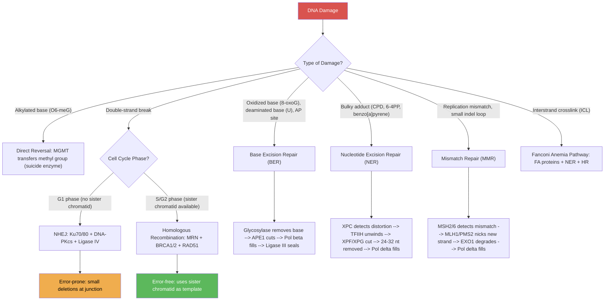
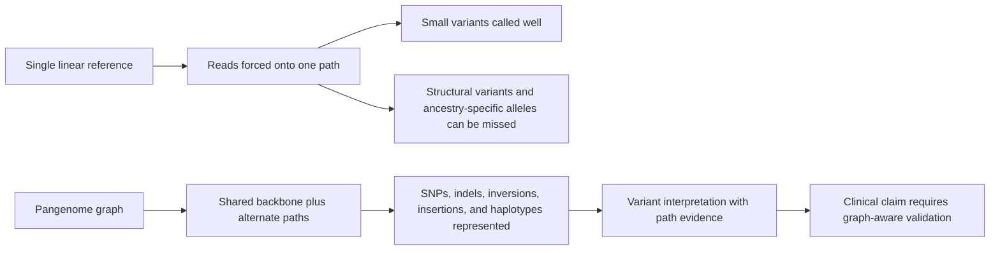

# Mutations, CRISPR, and Genomics

\label{sec:unit_IV_mutations_and_genomics}


<!-- chapter-metadata-badge -->
> Level 2/3 · 55 min read · 75 min lecture · Prerequisites: \cref{sec:unit_IV_gene_expression}

## Learning Objectives

1. Classify [**mutation**](#gl:mutation)s by type (point, frameshift, chromosomal), molecular change, and functional consequence.
2. Describe mutagenic agents and assays for mutagenicity (Ames test).
3. Explain DNA repair mechanisms and their relationship to human disease.
4. Describe the CRISPR-Cas9 mechanism in detail, including PAM recognition, DSB creation, and repair outcomes.
5. Compare CRISPR-Cas9, base editing, and prime editing technologies.
6. Define the [**genome**](#gl:genome) and describe key genomic features revealed by sequencing.
7. Explain next-generation sequencing technologies and their applications.
8. Describe GWAS methodology and its contributions to understanding complex disease.
9. Evaluate ethical issues in personal genomics and genetic testing.

<!-- curriculum-scaffold-start -->
### Study Blueprint

- **Big idea:** Genomic variation becomes biological consequence through sequence context, repair, and selection.
- **Core concepts:** mutation classes, DNA repair, CRISPR, genome analysis.
- **Framework alignment:** Vision & Change: Information flow, exchange, and storage, Structure and function; AP Biology: Information Storage and Transmission, Systems Interactions; NGSS-style topics: Inheritance and Variation of Traits, Structure and Function.
- **Model or quantitative lens:** Mutation-rate, edit-efficiency, and sequence-comparison calculations.
- **Data skill:** Classify variants and predict likely molecular effect from sequence evidence.
- **Practice cadence:** Concept Explanation, Questions and Methods, Argumentation.
- **Common misconception to repair:** Not every mutation is harmful, and not every harmful mutation changes a protein sequence.
- **Primary lab:** \nameref{sec:lab_unit_IV_mutations_and_genomics}.
- **Question bank:** \nameref{sec:q_unit_IV_mutations_and_genomics}.
- **Transfer task:** Transfer variant reasoning to cancer genomics, ancestry, gene therapy, or microbial evolution.
- **Bridge to computation:** `biology.genetics.genetics.hamming_distance`.
<!-- curriculum-scaffold-end -->

---

> **Opening Vignette — One Letter Changes Everything**
> 
> In 1949, Linus Pauling published a paper in *Science* titled "Sickle Cell Anemia, a Molecular Disease" — the first time a human illness was attributed to a chemical change in a specific [**protein**](#gl:protein). Eight years later, Vernon Ingram used the newly developed technique of protein fingerprinting to identify the precise mutation: a single amino acid substitution, glutamic acid to valine, at position 6 of the β-globin chain. Just one [**nucleotide**](#gl:nucleotide) change — GAG to GTG — makes hemoglobin polymerize under low-oxygen conditions, distorting red blood cells into rigid sickle shapes that clog capillaries. That one point mutation causes pain crises, organ damage, and shortened lifespan for millions worldwide. The sickle-cell story remains the most compelling illustration of how a single mutational event can cascade through molecular structure, protein function, cell physiology, and whole-organism health.

## Types of Mutations

A **mutation** is any heritable change in DNA sequence. Mutations are the ultimate source of most genetic variation and therefore the raw material for evolution.

### Mutation Rates: A Quantitative Framework

> **Mathematical Background:** Poisson statistics govern rare mutation events. For a review of probability distributions relevant to genetics, see \nameref{sec:appendix_math_review}.

The **per-nucleotide per-generation mutation rate** in humans is approximately $\mu \approx 1.2 \times 10^{-8}$ per bp per generation (Kong et al., 2012, *Nature*). For a diploid genome of $2N \approx 6.4 \times 10^9$ bp, the expected number of de novo mutations per offspring is:

\begin{equation}M = 2N \times \mu \approx 6.4 \times 10^9 \times 1.2 \times 10^{-8} \approx 70\text{--}80 \text{ mutations/generation}\label{eq:mutations_per_gen}\end{equation}

The probability of observing exactly $k$ mutations in a region of length $L$ follows the **Poisson distribution**:

\begin{equation}P(k) = \frac{(\mu L)^k \, e^{-\mu L}}{k!}\label{eq:poisson_mut}\end{equation}

This is used to assess whether a [**gene**](#gl:gene) or genomic region has an excess of mutations relative to the background rate — a signature of positive selection or a mutational hotspot.

For genome-wide studies, the **Bonferroni-corrected significance threshold** for $m$ independent tests is:

\begin{equation}\alpha_{\text{corrected}} = \frac{\alpha}{m} = \frac{0.05}{10^6} = 5 \times 10^{-8}\label{eq:bonferroni_correction}\end{equation}

This is the standard genome-wide significance threshold for GWAS: primarily associations with $p < 5 \times 10^{-8}$ are considered robust.

The **Ka/Ks ratio** (also called dN/dS or ω) measures the ratio of nonsynonymous to synonymous substitution rates, revealing the mode of [**natural selection**](#gl:natural-selection):

\begin{equation}\omega = \frac{K_a}{K_s} = \frac{d_N}{d_S}\label{eq:omega_ratio}\end{equation}

where $\omega < 1$ indicates purifying selection, $\omega = 1$ neutral evolution, and $\omega > 1$ positive selection.

### Nucleotide-Level (Point) Mutations

: Nucleotide-Level (Point) Mutations: Type and Description. {#tbl:unit_IV_mutations_and_genomics_nucleotide_level_point_mutations}
| Type | Description | Example Consequence |
|------|-------------|---------------------|
| **Transition** | Purine to purine (A to G) or pyrimidine to pyrimidine (C to T) | Most common; often neutral or conservative amino acid change |
| **Transversion** | Purine to pyrimidine or vice versa (A to C, A to T, G to C, G to T) | Rarer (~2:1 transition:transversion ratio); more often disruptive |
| **Silent (synonymous)** | [**Codon**](#gl:codon) change producing the same amino acid (degeneracy) | Usually no phenotypic effect; may affect splicing or mRNA stability |
| **Missense** | Codon change producing a different amino acid | Conservative (e.g., Leu to Ile) or non-conservative (e.g., Glu to Val in sickle cell) |
| **Nonsense** | Point mutation creating a premature stop codon | Truncated protein; usually non-functional; often triggers NMD |
| **Splice site** | Mutation at [**intron**](#gl:intron)-[**exon**](#gl:exon) boundary (GT/AG dinucleotides) | Exon skipping, intron retention, or cryptic splice site activation |

### Insertions, Deletions, and Frameshifts

- **Insertion**: One or more nucleotides added to the sequence
- **Deletion**: One or more nucleotides removed from the sequence
- **Frameshift**: An insertion or deletion that is NOT a multiple of 3 bp -- shifts the entire downstream reading frame, producing a completely altered amino acid sequence and usually encountering a premature stop codon
- **In-frame insertion/deletion**: A multiple of 3 bp -- adds or removes amino acids without disrupting the reading frame (e.g., the deltaF508 mutation in CFTR is a 3-bp deletion removing Phe508, causing cystic fibrosis)

### Copy Number Variants and Structural Mutations

- **Copy number variants (CNVs)**: Duplications or deletions of segments from 1 kb to several Mb. The average human genome contains ~1,000 CNVs relative to the reference. CNVs contribute more base pairs of variation between individuals than SNPs.
- **Inversions**: A chromosomal segment is reversed end-to-end. Pericentric inversions include the [**centromere**](#gl:centromere); paracentric do not. Inversions can disrupt genes at breakpoints or alter regulatory landscapes.
- **Translocations**: A segment moves to a different [**chromosome**](#gl:chromosome). **Reciprocal translocations** exchange segments between two chromosomes. **Robertsonian translocations** fuse the long arms of two acrocentric chromosomes (13, 14, 15, 21, 22).

> **Clinical Connection: The Philadelphia Chromosome**
> The t(9;22) reciprocal translocation creates the **Philadelphia chromosome** -- a derivative chromosome 22 carrying the **BCR-ABL1** fusion gene. This fusion produces a constitutively active tyrosine kinase that drives chronic myelogenous leukemia (CML). The targeted tyrosine kinase inhibitor **imatinib (Gleevec)** revolutionized CML therapy, converting a fatal disease into a manageable chronic condition (5-year survival increased from ~30% to >90%). This is a paradigm for targeted cancer therapy.

### Trinucleotide Repeat Expansion Disorders

A special class of mutations involving expansion of short tandem repeats:

: Trinucleotide Repeat Expansion Disorders: Disease and Repeat. {#tbl:unit_IV_mutations_and_genomics_trinucleotide_repeat_expansion_disorders}
| Disease | Repeat | Normal Range | Pathogenic Range | Location | Mechanism |
|---------|--------|-------------|-----------------|----------|-----------|
| Huntington disease | CAG (Gln) | 6-35 | >36 (full penetrance >40) | HTT exon 1 | Toxic polyglutamine aggregation |
| Fragile X syndrome | CGG | 5-44 | >200 (full mutation) | FMR1 5' UTR | CpG methylation silences FMR1 |
| Myotonic dystrophy type 1 | CTG | 5-34 | >50 | DMPK 3' UTR | Toxic RNA foci sequester MBNL1 |
| Friedreich ataxia | GAA | 5-33 | >66 | FXN intron 1 | [**Heterochromatin**](#gl:heterochromatin) formation silences FXN |

**Anticipation**: These diseases show **genetic anticipation** -- earlier onset and increased severity in successive generations -- because the unstable repeats tend to expand further during DNA replication (particularly during germ cell divisions).

**Concept Check 13.1**

> 1. Classify the sickle cell mutation (GAG to GUG in beta-globin codon 6) by type.
> 2. Why are frameshift mutations generally more deleterious than missense mutations?
> 3. Explain why trinucleotide repeat diseases show anticipation.
> 4. The deltaF508 CFTR mutation is a 3-bp deletion. Why is this NOT a frameshift?

> **Worked Example — Poisson Distribution of De Novo Mutations:** The human germline mutation rate is approximately 1.2 × 10⁻⁸ per base pair per generation. The diploid genome is 6.4 × 10⁹ bp. Expected de novo mutations per offspring: μ_genome = 1.2 × 10⁻⁸ × 6.4 × 10⁹ = 76.8 ≈ 77 mutations per generation. Under a Poisson model, P(k mutations) = e^(-λ)λ^k/k! with λ = 77. P(0 mutations) = e^(-77) ≈ 3 × 10⁻³⁴ (a vanishingly small probability of inheriting zero new mutations). P(>100 mutations) — using normal approximation: z = (100 - 77)/√77 = 23/8.77 = 2.62 → P(>100) = 1 - Φ(2.62) ≈ 0.0044 = 0.44%. Paternal age effect: each additional year of paternal age adds ~2 mutations (reflecting DNA replication errors in spermatogonia that undergo ~30 more divisions/year). A 45-year-old father vs. a 25-year-old father transmits ~20 extra de novo mutations — a 26% increase — contributing to the increased prevalence of some autosomal-dominant disorders with paternal age.

> **Concept Check (Evaluate):** Mutational signatures catalogued in the COSMIC database reveal that each major DNA-damaging agent leaves a characteristic pattern. UV radiation induces C→T transitions at dipyrimidine sites (especially CC→TT). Tobacco smoking causes C→A transversions (SBS4). Alkylating agents tend to produce G→A transitions at CpG dinucleotides. (a) A patient's tumor shows predominantly C→T transitions at TpCpN trinucleotides (signatures SBS2 and SBS13, characteristic of APOBEC deaminase activity). Propose a molecular mechanism explaining why APOBEC enzymes — which normally edit RNA and act on retroviral DNA intermediates — generate this signature in tumor cells, and identify which step in the cell cycle exposes single-stranded DNA to APOBEC. (b) The same patient's tumor is then exposed to a novel chemotherapy. Design a pre-clinical sequencing strategy (number of biopsies, sequencing depth, signature-decomposition approach) that would let you decide whether the therapy adds a new mutational signature or enriches the pre-existing APOBEC signature.

> **Concept Check (Synthesis):** COSMIC mutational signatures are derived by NMF decomposition of cancer mutation catalogs. Signature SBS3 (homologous recombination deficiency, HR-deficient) is characterized by: (a) What trinucleotide context patterns define SBS3 and explain the molecular mechanism producing them — why does HR deficiency produce these specific patterns rather than, say, APOBEC-driven C→T mutations at TCA/TCT contexts? (b) PARP inhibitors (olaparib) are FDA-approved for HR-deficient (BRCA1/2-mutated) cancers. Explain the concept of synthetic lethality: why does BRCA1/2 mutation sensitize cells to PARP inhibition, while PARP inhibition alone is not lethal to HR-proficient cells? (c) Cancer cells treated with platinum compounds (cisplatin, carboplatin) acquire resistance through multiple mechanisms: HR restoration (BRCA2 reversion mutations), PARP1 loss, 53BP1 loss, and REV1/pol ζ upregulation. For each mechanism, predict the mutational signature change you would observe in a post-treatment biopsy.

---

## Mutagenic Agents and DNA-Damage Mechanisms

### Physical Mutagens: Radiation and Replication Stress

**UV radiation (UVB, 280-320 nm)**:
- Creates **cyclobutane pyrimidine dimers (CPDs)**: covalent bonds form between adjacent pyrimidines (T-T most common)
- Creates **6-4 photoproducts (6-4 PPs)**: covalent bond between positions 6 and 4 of adjacent pyrimidines
- Both distort the helix and block replication/[**transcription**](#gl:transcription)
- Repaired by nucleotide excision repair (NER); failure causes xeroderma pigmentosum

**Ionizing radiation (X-rays, gamma rays)**:
- Creates reactive oxygen species (ROS) that attack bases and the sugar-phosphate backbone
- Causes single-strand breaks (SSBs) and double-strand breaks (DSBs)
- DSBs are the most dangerous lesion -- if unrepaired, lead to chromosomal translocations, deletions, or cell death
- Repaired by NHEJ and HR

### Chemical Mutagens and Base-Altering Reactions

: Chemical Mutagens and Base-Altering Reactions: Agent and Type. {#tbl:unit_IV_mutations_and_genomics_chemical_mutagens_and_base_altering_reactions}
| Agent | Type | Mechanism | Mutation Caused |
|-------|------|-----------|----------------|
| **EMS** (ethyl methanesulfonate) | Alkylating agent | Adds ethyl group to O$^6$ of guanine | G:C to A:T transitions |
| **Nitrogen mustard** | Bifunctional alkylating agent | Cross-links DNA strands | Blocks replication; DSBs |
| **Nitrous acid (HNO$_2$)** | Deaminating agent | Deaminates C to U, A to hypoxanthine | C:G to T:A and A:T to G:C transitions |
| **Ethidium bromide** | Intercalating agent | Inserts between base pairs, stretching the helix | Frameshift mutations (insertions/deletions) |
| **5-Bromouracil (5-BU)** | Base analog | Incorporated in place of T; tautomerizes to pair with G | A:T to G:C transitions |
| **Acridine orange** | Intercalating agent | Inserts between bases | Frameshift mutations |
| **Benzo[a]pyrene** (cigarette smoke) | Polycyclic aromatic hydrocarbon | Forms bulky adducts on guanine (after CYP1A1 activation) | G:C to T:A transversions; NER substrate |

**Reactive oxygen species (ROS)**: Endogenous byproducts of [**aerobic**](#gl:aerobic) metabolism (superoxide O$_2^{-}$, hydroxyl radical OH$\cdot$, hydrogen peroxide H$_2$O$_2$). ROS oxidize guanine to **8-oxoguanine (8-oxoG)**, which mispairs with adenine, causing G:C to T:A transversions. Repaired by BER (OGG1 glycosylase).

### The Ames Test

The **Ames test** (Bruce Ames, 1973) is a bacterial mutagenicity assay that uses *Salmonella typhimurium* strains carrying various **his$^-$** (histidine-requiring) mutations:

**Procedure**:
1. His$^-$ bacteria are plated on minimal medium (no histidine)
2. Test chemical applied (with and without liver microsomal extract S9 to simulate mammalian metabolic activation)
3. Count revertant colonies (his$^+$) that can grow without histidine
4. Compare to spontaneous reversion rate (negative control) and known mutagen (positive control)

**Interpretation**: A significant increase in revertant colonies indicates the chemical is mutagenic. Different tester strains detect different mutation types (e.g., TA98 detects frameshifts; TA100 detects base substitutions).

**Correlation**: ~80-90% of known carcinogens are mutagenic in the Ames test. The Ames test is a standard regulatory tool for chemical safety screening.

---

## DNA Damage and Repair

The human genome sustains ~10,000-100,000 DNA lesions per cell per day \citep{ward1988}. Multiple repair pathways maintain genomic integrity.

### DNA Damage — Quantitative Background

The endogenous and exogenous lesion load is enormous and well characterized quantitatively:

: DNA Damage — Quantitative Background: Lesion type and Source. {#tbl:unit_IV_mutations_and_genomics_dna_damage_quantitative_background}
| Lesion type | Source | Frequency (per cell per day) |
| ----------- | ------ | ---------------------------- |
| Depurinations / abasic (AP) sites | Spontaneous hydrolysis of N-glycosidic bond | ~10,000 (purine more labile than pyrimidine) |
| Depyrimidinations | Hydrolysis | ~500 |
| Cytosine deaminations (C → U) | Hydrolysis | 100–500 |
| 5-methylcytosine deaminations (5mC → T) | Hydrolysis (faster than C deamination) | ~50–100 (CpG-localized) |
| Oxidised guanines (8-oxoG) | ROS attack on guanine N7 | ~10,000 |
| Other oxidised bases (FapyG, FapyA, 5-OH-cytosine) | ROS | ~3,000 |
| Single-strand breaks (SSBs) | Direct breakage; sugar-radical chemistry | 20,000–50,000 |
| Inter-strand crosslinks (ICLs) | Endogenous aldehydes (acetaldehyde, formaldehyde) | ~10–50 |
| **Replication-induced double-strand breaks** | Fork collapse at SSBs, R-loops, repeats | **~100–500 during replication** (S-phase primarily) |
| Spontaneous DSBs (non-replicative) | Two coincident SSBs; radical-induced | ~10–50 |
| UVB-induced CPDs | UV photons (sunlight, UVB 280–320 nm) | Highly variable; up to 10⁶ per skin cell per day with sun exposure |
| Alkylated bases (O⁶-methylguanine, N3-methylpurine) | Endogenous methyl donors (S-adenosylmethionine) + exogenous alkylators | ~3,000 |
| Topoisomerase-induced breaks | Stalled topoisomerase Ic-DNA complexes | Variable; increased by camptothecin, etoposide |

**Replication-associated DSBs** (~100–500 per cell during S phase) are particularly dangerous because they break a DNA strand that is also undergoing semi-conservative replication, producing daughter molecules with persistent breaks. These represent the bulk of physiologically encountered DSBs and explain why HR, the high-fidelity DSB-repair pathway, is preferentially active in S/G2 phase.

The cell maintains genomic integrity by directing each lesion to its appropriate repair pathway. The remarkable per-base error rate of replication (~10⁻¹⁰) is achieved through a combination of polymerase fidelity, proofreading, mismatch repair (post-replicative), and the various lesion-specific pathways below.


<!-- alt: Flowchart showing DNA damage types and their corresponding repair pathways. The choice of DSB repair pathway depends on cell cycle phase: NHEJ predominates in G1, while HR requires a sister chromatid template available in S/G2. -->

*DNA damage types and their corresponding repair pathways. The choice of DSB repair pathway depends on [**cell cycle**](#gl:cell-cycle) phase: NHEJ predominates in G1, while HR requires a sister chromatid template available in S/G2.*

### DNA Repair Pathway Specificity and Disease Consequences

: DNA Repair Pathway Specificity and Disease Consequences: Damage Type and Repair Pathway. {#tbl:unit_IV_mutations_and_genomics_dna_repair_pathway_specificity_and_disease_consequences}
| Damage Type | Repair Pathway | Key Proteins | Disease if Defective |
|-------------|---------------|-------------|---------------------|
| UV dimers (CPD, 6-4PP) | Nucleotide excision repair (NER) | XPA, RPA, XPD, XPB, XPF-ERCC1, XPG, PCNA, Pol delta | Xeroderma pigmentosum (1,000x skin cancer risk) |
| Oxidized bases (8-oxoG) | Base excision repair (BER) | OGG1 glycosylase, APE1, Pol beta, XRCC1, Ligase III | MUTYH-associated polyposis |
| Alkylated bases (O$^6$-meG) | Direct reversal | MGMT (methyltransferase) | Glioblastoma (MGMT [**promoter**](#gl:promoter) methylation predicts temozolomide response) |
| Replication mismatch | Mismatch repair (MMR) | MLH1, MSH2, MSH6, PMS2 | Lynch syndrome (colorectal, endometrial cancer) |
| Double-strand break | NHEJ | Ku70/80, DNA-PKcs, Artemis, Ligase IV | SCID (severe combined immunodeficiency) |
| Double-strand break | Homologous [**recombination**](#gl:recombination) (HR) | ATM, MRN, BRCA1, BRCA2, RAD51, RPA | Hereditary breast/ovarian cancer |
| Interstrand crosslinks | Fanconi anemia pathway | FANC proteins (A-W), then NER + HR | Fanconi anemia (bone marrow failure, cancer) |

> **Clinical Connection: MGMT Methylation and Glioblastoma**
> Glioblastoma is the most aggressive brain tumor (median survival ~15 months). The alkylating agent **temozolomide** is a standard chemotherapy. Tumors with **MGMT promoter methylation** (silencing MGMT expression) cannot repair temozolomide-induced O$^6$-methylguanine lesions, making them more sensitive to the drug. MGMT promoter methylation status is therefore a critical predictive biomarker: methylated tumors have ~21-month median survival vs ~12 months for unmethylated tumors when treated with temozolomide (Hegi et al., 2005, *NEJM*).

### Base Excision Repair (BER) — Mechanism in Detail

BER handles oxidised, deaminated, and alkylated single-base lesions. The pathway has two main subdivisions:

**Short-patch BER (single-nucleotide replacement, ~80 % of events):**
1. **DNA glycosylase** recognizes the lesion and cleaves the N-glycosidic bond, producing an abasic (AP) site. There are 11 DNA glycosylases in humans, each with substrate specificity:

: Base Excision Repair (BER) — Mechanism in Detail: Glycosylase and Lesion recognized. {#tbl:unit_IV_mutations_and_genomics_base_excision_repair_ber_mechanism_in_detail}
| Glycosylase | Lesion recognized | Notes |
| ----------- | ----------------- | ----- |
| **OGG1** | 8-oxoguanine paired with C | Most clinically important; oxidative damage; bifunctional (lyase activity creates SSB) |
| **MUTYH** | Adenine misincorporated opposite 8-oxoG (post-replication mismatch) | Loss-of-function → MUTYH-associated polyposis (MAP) |
| **NTH1** | Oxidised pyrimidines (thymine glycol, dihydrouracil) | Bifunctional |
| **NEIL1, NEIL2, NEIL3** | Ring-fragmented purines (FapyG, FapyA), oxidised pyrimidines | Bifunctional; β,δ-elimination produces 3′-phosphate end |
| **MPG (AAG)** | 3-methyladenine, 7-methylguanine, ethenoadenine | Monofunctional (no lyase) |
| **UNG (uracil DNA glycosylase)** | Uracil (deamination product or U mis-incorporation) | Most active; nuclear and mitochondrial isoforms |
| **TDG** | Thymine in T:G mismatch (5mC deamination); 5fC/5caC (TET pathway) | Active in DNA demethylation |
| **SMUG1** | Uracil; backup to UNG | Monofunctional |
| **MBD4** | Thymine in T:G mismatch at CpG sites | Methylation-CpG specific |
| **MYH (MUTYH)** | A from A:8-oxoG mispair | See above |

2. **AP endonuclease (APE1, also called APE)** cuts the DNA backbone 5′ to the AP site, leaving a 3′-OH and a 5′-deoxyribose phosphate (dRP) terminus.
3. **DNA polymerase β (pol β)** has both DNA polymerase activity (fills the 1-nt gap with the correct nucleotide) and **dRP lyase activity** (removes the 5′-dRP).
4. **DNA ligase III + XRCC1** seals the resulting nick (ATP-dependent).

**Long-patch BER (2–10 nucleotide replacement, ~20 % of events):**
- Used when the dRP cannot be removed (e.g., oxidised dRP) or when the lesion creates a strand-displacement intermediate.
- DNA pol δ/ε extends, displacing the 5′ flap; **FEN1** cleaves the flap; **DNA ligase I** seals.

**OGG1 mechanism specifically** (the most studied glycosylase):
- OGG1 scans DNA for 8-oxoguanine. The 8-oxoG flips out of the helix into OGG1's catalytic pocket.
- Active-site lysine (K249) acts as nucleophile, attacking the C1′ of the deoxyribose; the N-glycosidic bond breaks via a Schiff-base intermediate.
- A second active-site residue (D268) hydrolyses the intermediate, releasing the 8-oxoG base and leaving an AP site.
- OGG1 is bifunctional: a β-elimination at the 3′ phosphate produces a 3′-α,β-unsaturated aldehyde, which APE1 must process before pol β can extend.
- 8-oxoG is mutagenic because it pairs with adenine (Hoogsteen face) instead of cytosine — leading to G:C → T:A transversions if not repaired.

**Clinical link — MUTYH-associated polyposis (MAP):** Biallelic loss-of-function mutations in MUTYH cause autosomal recessive colorectal polyposis. The mechanism: OGG1 normally removes 8-oxoG, but if 8-oxoG escapes repair and is replicated, it pairs with A. MUTYH normally removes that A; without MUTYH, the A becomes fixed as a G:C → T:A transversion. MAP tumors have a characteristic mutational signature (transversions at GAA contexts).

### Comparing NER and MMR — A Side-by-Side Table

The pathways have distinct substrates and proteins, often confused. Here is a direct comparison:

: Comparing NER and MMR — A Side-by-Side Table: Feature and Nucleotide Excision Repair (NER). {#tbl:unit_IV_mutations_and_genomics_comparing_ner_and_mmr_a_side_by_side_table}
| Feature | Nucleotide Excision Repair (NER) | Mismatch Repair (MMR) |
| ------- | --------------------------------- | --------------------- |
| **Substrate** | Bulky helix-distorting lesions: CPDs, 6-4 photoproducts, cisplatin adducts, polycyclic aromatic hydrocarbons | Mismatched bases (G-T, A-C); small (1–13 nt) insertion/deletion loops |
| **Recognition** | Helix distortion or transcription stalling | Mismatch geometry directly bound by MutSα/β |
| **Initiation timing** | Any cell-cycle phase | Post-replicative (S/G2) |
| **Strand discrimination** | Both strands repaired | New strand identified by transient nicks (5′ direction in eukaryotes; HMGB1) |
| **Primary recognition factor** | XPC-RAD23B (GG-NER); CSA-CSB (TC-NER, transcription-coupled) | MSH2-MSH6 (MutSα; mismatches and 1-nt loops); MSH2-MSH3 (MutSβ; 2–13-nt loops) |
| **Verification factor** | TFIIH (XPB-helicase 3′→5′; XPD-helicase 5′→3′) — unwinds ~25 bp | MLH1-PMS2 (MutLα; endonuclease) makes incision |
| **Excision** | XPF-ERCC1 (5′ cut), XPG (3′ cut); 24–32 nt fragment removed | Exonuclease 1 (Exo1) degrades from MutLα cut to past mismatch; ~150 nt fragment removed |
| **Synthesis** | Pol δ/ε with PCNA, RFC | Pol δ |
| **Ligation** | DNA ligase I | DNA ligase I |
| **Disease (loss-of-function)** | Xeroderma pigmentosum (XPA–XPG, ~1,000× skin cancer); Cockayne syndrome (CSA, CSB; premature aging) | Lynch syndrome / HNPCC (MLH1, MSH2, MSH6, PMS2; 50–80% lifetime CRC risk; MSI-high tumors) |
| **Therapeutic relevance** | Cisplatin sensitivity correlates with NER capacity | MSI-high tumors respond to anti-PD-1 (pembrolizumab) due to high neoantigen load |

### HR vs NHEJ — Pathway Choice Mechanism

The choice between homologous recombination (HR) and non-homologous end joining (NHEJ) is regulated by cell-cycle phase and a competition at the broken DNA ends.

**Pathway-determining factors:**

: HR vs NHEJ — Pathway Choice Mechanism: Step and NHEJ-favoring. {#tbl:unit_IV_mutations_and_genomics_hr_vs_nhej_pathway_choice_mechanism}
| Step | NHEJ-favoring | HR-favoring |
| ---- | -------------- | ------------ |
| Cell cycle phase | G1, G0 | S, G2 (sister chromatid available as template) |
| End sensor | **Ku70/Ku80** binds DSB ends rapidly | Slow accommodation; replaces Ku |
| End processing | **DNA-PKcs** recruited; minimal end resection | **MRN complex** (MRE11–RAD50–NBN) initiates short-range resection |
| End-resection regulator | **53BP1** + **RIF1** + **PTIP** + **shieldin** complex (REV7-MAD2L2-SHLD1/2/3) — protects ends from resection | **CtIP** (CDK-phosphorylated in S/G2) + **MRN** initiates resection; **EXO1** + **DNA2** + **BLM** extend resection |
| Fidelity | Error-prone — small deletions/insertions at junction | High-fidelity (uses sister chromatid template) |
| Time scale | Fast (minutes) | Slow (hours) |
| Key proteins (after end-recognition) | DNA-PKcs, Artemis (nuclease), XRCC4, Ligase IV, XLF/Cernunnos, PAXX | RPA → BRCA2 → RAD51 (filament) → strand invasion → D-loop → resolution |
| Outcome | Direct ligation of ends (often with deletions ≤ 50 bp) | Use of sister chromatid as template; restores original sequence |

**The CDK regulatory switch:** During G1, CDK activity is low; CtIP is unphosphorylated; 53BP1-shieldin protects ends; Ku70/80 dominates → NHEJ. During S/G2, CDK1/2 phosphorylates CtIP at Ser327 and Thr847, activating its end-resection function; CtIP+MRN displaces Ku → HR is initiated.

**The BRCA1 vs 53BP1 antagonism.** **BRCA1** promotes resection (HR); **53BP1** blocks resection (NHEJ). The two compete for binding at H4K20me-marked nucleosomes near the DSB. BRCA1's BRCT domain reads γH2AX-bound MDC1; 53BP1's tandem Tudor domain reads H4K20me2. Loss of 53BP1 in BRCA1-deficient cells **rescues HR** (because resection is no longer blocked) — a synthetic-lethal escape mechanism in PARP-inhibitor resistance.

**The BRCA2 mechanism.** Once ssDNA is generated by resection, RPA coats it. BRCA2 then loads RAD51 onto the RPA-coated ssDNA, displacing RPA. This is the rate-limiting step of HR. Loss of BRCA2 prevents RAD51 loading → HR fails → cells become "BRCAness"-positive → exquisitely sensitive to PARP inhibitors (synthetic lethality, see \cref{sec:unit_IV_dna_replication_and_cell_cycle}).

**Ku70/80 binding.** Ku70/80 forms a ring that threads onto the DSB end with extreme avidity (Kd ≈ 1 nM). It positions the DNA-PKcs catalytic subunit at the end and protects against resection. The Ku70/80 ring must be removed (by ubiquitination + proteasome) before HR can proceed in S/G2. This explains why NHEJ has an immediate kinetic advantage and HR requires time and active disassembly.

> **Concept Check (Analysis):** Mismatch repair (MMR) corrects errors introduced by DNA polymerase by distinguishing the template strand (methylated GATC sites in bacteria; nick-directed in eukaryotes) from the newly synthesized strand. (a) A MMR-deficient cell has a base-substitution rate roughly 100–1,000 × that of wild-type. Taking the spontaneous misincorporation rate of DNA Pol III as $10^{-7}$ per base per replication and assuming MMR corrects about 99.9% of mismatches, calculate the uncorrected mutation rate with MMR active vs. with MMR absent, and check that the fold change matches the empirical range. (b) Lynch syndrome (hereditary non-polyposis colorectal cancer) is caused by germline heterozygosity at MMR genes (typically MLH1 or MSH2). Using the two-hit model, explain why heterozygous carriers develop tumors during adulthood despite the wild-type allele being present at conception, and predict which tumor-level phenotypes (microsatellite instability score, immunohistochemistry for the MMR proteins, mutational burden) would distinguish a Lynch-driven colorectal tumor from a sporadic MMR-proficient colorectal tumor.

**Concept Check 13.2**

> 1. Why is the Ames test performed with and without liver microsomal extract (S9)?
> 2. Explain why MGMT is called a "suicide [**enzyme**](#gl:enzyme)."
> 3. A patient has mutations in both BRCA1 [**allele**](#gl:allele)s. Which repair pathway is defective? Why does this predispose to breast/ovarian cancer rather than most cancer types?
> 4. Compare the fidelity of NHEJ and HR. When would each be preferred?

---

## CRISPR-Cas9: Mechanism and Applications

**Background**: CRISPR (Clustered Regularly Interspaced Short Palindromic Repeats) is the adaptive immune system of bacteria and [**archaea**](#gl:archaea). Jennifer Doudna and Emmanuelle Charpentier received the 2020 Nobel Prize in Chemistry for demonstrating that CRISPR-Cas9 could be programmed with a synthetic guide RNA for precise genome editing (Jinek et al., 2012, *Science*).

### Natural CRISPR Immunity

In bacteria, CRISPR functions as immunological memory:

1. **Adaptation**: When a bacterium survives phage infection, a short sequence from the phage genome (the **protospacer**) is integrated into the CRISPR array as a new **spacer** between repeat sequences
2. **Expression**: The CRISPR array is transcribed into pre-crRNA, which is processed (with tracrRNA in Type II systems) into mature crRNA
3. **Interference**: The crRNA guides Cas9 to complementary foreign DNA; Cas9 cleaves it, preventing subsequent infection

### Engineered CRISPR-Cas9

```mermaid
flowchart LR
    A["Design 20-nt Guide Sequence Complementary to Target"] --> B["Synthesize sgRNA (crRNA + tracrRNA Fused)"]
    B --> C["Deliver Cas9 + sgRNA to Cell (Plasmid, RNP, or mRNA + LNP)"]
    C --> D["Cas9-sgRNA Complex Scans Genome for PAM (5'-NGG-3')"]
    D --> E["PAM Found: Local DNA Unwinding"]
    E --> F{Guide-Target Complementarity?}
    F -->|"No Match"| D
    F -->|"20-nt Match (R-loop Formation)"| G["RuvC Cleaves Non-target Strand; HNH Cleaves Target Strand"]
    G --> H["Double-Strand Break 3 bp Upstream of PAM"]
    H --> I{Repair Pathway?}
    I -->|"No Donor Template"| J["NHEJ: Error-Prone Repair"]
    J --> K["Indels at Cut Site --> Gene Knockout"]
    I -->|"Donor Template Provided (ssODN or Plasmid)"| L["HDR: Homology-Directed Repair"]
    L --> M["Precise Gene Correction or Insertion"]
    I -->|"Base Editor (no DSB)"| N["Catalytically Dead Cas9 (dCas9) + Deaminase"]
    N --> O["C-to-T or A-to-G Conversion Without DSB"]
    I -->|"Prime Editor (no DSB)"| P["Cas9 Nickase + Reverse Transcriptase + pegRNA"]
    P --> Q["Search-and-Replace: Any Small Edit Without DSB"]

    style A fill:#4a90d9,color:#fff
    style K fill:#f0ad4e,color:#000
    style M fill:#5cb85c,color:#fff
    style O fill:#5cb85c,color:#fff
    style Q fill:#5cb85c,color:#fff
```


<!-- alt: Flowchart showing CRISPR-Cas9 genome editing mechanism. The sgRNA guides Cas9 to a PAM-adjacent target sequence where a DSB is created. Repair by NHEJ produces knockouts; HDR with a donor template allows precise editing. Newer variants (base editors, prime editors) avoid DSBs entirely. -->

*The CRISPR-Cas9 genome editing mechanism. The sgRNA guides Cas9 to a PAM-adjacent target sequence where a DSB is created. Repair by NHEJ produces knockouts; HDR with a donor template allows precise editing. Newer variants (base editors, prime editors) avoid DSBs entirely.*

**Key molecular details**:
- **sgRNA (single guide RNA)**: A fusion of crRNA (20-nt spacer complementary to the target) and tracrRNA (scaffold that binds Cas9). The ~100-nt sgRNA is most that is needed to redirect Cas9.
- **PAM (protospacer adjacent motif)**: For *S. pyogenes* Cas9 (SpCas9), the PAM is **5'-NGG-3'** on the non-target strand, immediately 3' of the target sequence. PAM recognition is the first step; without PAM, Cas9 will not unwind or cleave.
- **Cleavage**: **HNH domain** cleaves the strand complementary to the sgRNA (target strand); **RuvC domain** cleaves the non-target strand. Both cuts occur ~3 bp upstream of the PAM, creating a blunt-ended DSB.

### Beyond Cas9: Expanded Toolkit

: Beyond Cas9: Expanded Toolkit: Tool and Mechanism. {#tbl:unit_IV_mutations_and_genomics_beyond_cas9_expanded_toolkit}
| Tool | Mechanism | Application |
|------|-----------|-------------|
| **Cas12a (Cpf1)** | Creates staggered DSB; T-rich PAM (TTTN); self-processes crRNA array | Multiplexed editing; organisms with AT-rich genomes |
| **Cas13 (RNA-targeting)** | Cleaves RNA (not DNA); collateral RNA cleavage in bacteria | RNA knockdown; viral RNA detection (SHERLOCK diagnostic) |
| **dCas9 (dead Cas9)** | Catalytically inactive (D10A + H840A mutations); binds but does not cut | CRISPRi (transcriptional repression with KRAB domain); CRISPRa (activation with VP64/p65/Rta) |
| **Base editors** | dCas9 or Cas9-nickase fused to deaminase | CBE (cytidine base editor): C-to-T conversion; ABE (adenine base editor): A-to-G conversion; no DSB needed |
| **Prime editors** | Cas9-H840A nickase fused to M-MLV reverse transcriptase + pegRNA | "Search-and-replace": any point mutation, small insertion, or small deletion; no DSB, no donor template needed |

**CRISPR diagnostics:** SHERLOCK and DETECTR exploit collateral nuclease activity after target recognition: Cas13 collateral RNA cleavage and Cas12a collateral ssDNA cleavage convert a sequence match into a fluorescent or lateral-flow signal \citep{gootenberg2017sherlock,chen2018detectr}. That makes CRISPR a diagnostic logic as well as an editing logic, but it does not remove the usual validation burdens: sample preparation, contamination control, limit of detection, clinical sensitivity/specificity, and variant coverage still determine whether an assay is deployable.

**Current evidence: prime editing as promoter rewriting.** Prime editing is especially useful when the desired change is not simply "cut here" but "install a small regulatory pattern." A 2025 *Blood* study used prime-editing guide RNAs to introduce multiple hereditary-persistence-of-fetal-hemoglobin-like edits into the *HBG1/HBG2* gamma-globin promoters, aiming to reactivate fetal hemoglobin without making a double-strand break \citep{chalumeau2025primeediting}. Editing efficiency varied among donor hematopoietic stem/progenitor cells, so this should be treated as early translational evidence rather than an approved therapy. The concept is powerful: regulatory DNA can be edited to change *when and where* a gene is expressed, not only whether its protein-coding sequence is intact.

### Therapeutic Applications (2024-2025)

**Casgevy (exagamglogene autotemcel)**: First CRISPR-based therapy approved by FDA for sickle cell disease (December 2023) and later for transfusion-dependent beta-thalassaemia (January 2024), with EMA authorization following in 2024. FDA's 2026 product page lists exa-cel for sickle cell disease and transfusion-dependent beta-thalassaemia in patients 12 years of age and older, with updated approval documentation \citep{fda2023casgevy,fda2024casgevythalassemia,fda2026casgevy}.

- **Indication**: Sickle cell disease (SCD) and transfusion-dependent beta-thalassemia
- **Mechanism**: Ex vivo CRISPR editing of patient hematopoietic stem cells (HSCs) to disrupt the *BCL11A* erythroid enhancer. BCL11A is a repressor of fetal hemoglobin (HbF, alpha2-gamma2). Disrupting its erythroid enhancer reactivates HbF production, which does not sickle and compensates for defective HbS.
- **Results**: In SCD, the regulatory endpoint is freedom from severe vaso-occlusive crises after treatment; transfusion independence is the endpoint used for transfusion-dependent beta-thalassaemia. Early exa-cel studies also reported sustained fetal-hemoglobin induction, so the durable teaching point is endpoint specificity: the same edited cell product is judged against different disease-specific clinical outcomes \citep{fda2023casgevy,fda2024casgevythalassemia,fda2026casgevy}.

**NTLA-2001 (in vivo CRISPR)**:
- **Indication**: Transthyretin (ATTR) amyloidosis
- **Mechanism**: Lipid nanoparticle (LNP)-delivered Cas9 mRNA + sgRNA targeting the *TTR* gene in hepatocytes -- direct in vivo editing (no cell harvest needed)
- **Results**: Single infusion achieved 80-95% serum TTR reduction (Gillmore et al., 2021, *NEJM*)

**Safety considerations**:
- **Off-target editing**: sgRNA may bind sites with 1-3 mismatches. Mitigated by high-fidelity Cas9 variants (SpCas9-HF1, eSpCas9, HiFi Cas9) and careful guide RNA design (off-target prediction algorithms: Cas-OFFinder, CRISPOR)
- **Immunogenicity**: ~79% of humans have pre-existing antibodies to SpCas9; strategies include using Cas9 from other species or transient delivery (mRNA/RNP vs. viral vectors)
- **NHEJ:HDR ratio**: ~1000:1 in non-dividing cells (most therapeutically relevant cells); S/G2 phase favors HDR; base editors and prime editors circumvent this limitation

> **Clinical Connection: Base Editing for Sickle Cell Disease**
> An alternative approach uses adenine base editing to directly convert the sickle mutation (GAG to GTG = Glu to Val) back to the wild-type or a benign Makassar variant (GAG to GCG = Glu to Ala). This avoids DSBs entirely and may be safer than Cas9-based approaches. Clinical trials are underway (Beam Therapeutics, BEAM-101).

**Mitochondrial DNA editing boundary:** Standard CRISPR-Cas systems work poorly for mtDNA because guide RNAs are difficult to import into mitochondria. DddA-derived cytosine base editors (DdCBEs) solve part of the problem by using TALE-DddA protein fusions to install targeted C$\cdot$G-to-T$\cdot$A edits in mtDNA without guide RNA \citep{mok2020mitochondrialbaseediting}. This is a major tool advance, not a general approved therapy: heteroplasmy, off-target editing, delivery, selectable mutation classes, and tissue specificity remain the current translational constraints \citep{barrerapaez2023mitochondrialediting}.

**Concept Check 13.3**

> 1. Why does Cas9 require a PAM sequence? What is the evolutionary rationale?
> 2. Compare NHEJ and HDR outcomes after Cas9-mediated DSB. Why is HDR difficult to achieve in post-mitotic cells?
> 3. What advantage does base editing offer over standard Cas9 editing for correcting point mutations?
> 4. Explain the mechanism of Casgevy: why does disrupting BCL11A treat sickle cell disease?

---

## Genomics: The Human Genome

The **Human Genome Project** (1990-2003; Venter et al., 2001 and International Human Genome Sequencing Consortium, 2001) produced the first draft reference. The **T2T Consortium** (Nurk et al., 2022) completed the first truly gapless reference genome (CHM13), filling ~8% of previously unresolvable sequence (centromeres, [**telomere**](#gl:telomere)s, segmental duplications, rDNA arrays).

### Human Genome Composition

: Human Genome Composition: Component and Fraction. {#tbl:unit_IV_mutations_and_genomics_human_genome_composition}
| Component | Fraction | Details |
|-----------|----------|---------|
| Protein-coding exons | ~1.5% | ~19,000-20,000 genes; average gene ~27 kb; average of 8.8 exons |
| Introns | ~26% | Average intron ~3.4 kb; some >100 kb |
| Transposable elements | ~46% | LINEs (21%, especially L1), SINEs (13%, especially Alu), DNA transposons (3%), LTR retrotransposons (9%) |
| Intergenic sequence | ~15% | Includes regulatory elements, structural sequences |
| Non-coding RNA genes | ~5,000+ loci | lncRNAs, miRNAs, snRNAs, snoRNAs, rRNAs, tRNAs |
| Simple sequence repeats | ~3% | Microsatellites (1-6 bp repeat units) and minisatellites (7-100 bp) |
| Segmental duplications | ~5% | Blocks >1 kb with >90% sequence identity; hotspots for chromosomal rearrangement |

### Transposable Elements — Mechanism and Genomic Impact

Transposable elements (TEs) make up ~46 % of the human genome — far more than the ~1.5 % occupied by protein-coding exons. They are ancient mobile DNA elements that have shaped genome architecture over evolutionary time. They fall into three major classes:

**Class I — RNA-mediated retrotransposons (copy-and-paste; majority of human TEs):**

1. **LINE-1 (Long Interspersed Nuclear Element 1)** — ~21 % of human genome; ~500,000 copies; ~6 kb full-length. Primarily ~80–100 are currently transposition-competent.
   - Encodes ORF1 (RNA-binding chaperone) and ORF2 (with reverse-transcriptase + endonuclease activities)
   - **Retrotransposition mechanism (Target-Primed Reverse Transcription, TPRT):**
     1. L1 transcribed by Pol II → L1 mRNA (~6 kb, capped, polyadenylated)
     2. L1 mRNA exported to cytoplasm, translated to ORF1p and ORF2p
     3. Cis-binding of ORF1p/ORF2p to their own mRNA forms a ribonucleoprotein (RNP)
     4. RNP enters nucleus
     5. ORF2p endonuclease nicks genomic DNA at TTAAAA-like sites, exposing 3′-OH
     6. The 3′-OH primes reverse transcription using L1 mRNA as template
     7. Second-strand DNA synthesis completes integration
     8. Target site duplication (TSD; 7–20 bp) flanks the new insertion, plus a poly-A tail at the 3′ end
   - Most insertions are 5′-truncated due to incomplete RT
   - L1 endonuclease nicks ~100 sites/cell per day; most fail to complete TPRT (silenced by KRAB-ZFP-driven H3K9me3 repression)

2. **Alu elements (Short Interspersed Nuclear Element 1, SINE)** — ~13 % of human genome; ~1.1 million copies; ~300 bp.
   - Derived from 7SL RNA (signal recognition particle component); contain RNA Pol III internal promoter
   - **Mobilization requires L1 machinery** (parasitic on LINE-1's ORF2p RT/endonuclease)
   - Transcription by Pol III; the Alu RNA recruits L1 ORF2p in *trans* and inserts via the same TPRT mechanism
   - Alu elements are densest in gene-rich regions; insertions in introns can disrupt splicing or create new alternative exons

3. **SVA elements (SINE-VNTR-Alu)** — ~3,000 copies; ~2 kb; younger than Alu (~25 Mya). Hybrid composite.

4. **LTR retrotransposons (HERV — human endogenous retroviruses)** — ~9 % of genome; relics of ancient retroviral insertions. Most are inactivated; some HERV-K elements remain intact and may be re-activated in cancer.

**Class II — DNA transposons (cut-and-paste; ~3 % of human genome):**
- Most inactivated in modern human genome (no active class II TE in humans)
- Mechanism: a transposase enzyme (encoded by the TE) recognizes terminal inverted repeats (TIRs) flanking the element, excises the element, and re-integrates it elsewhere
- Mariner / Tc1, hAT, P-element families most derive from class II
- Hyperactive synthetic DNA transposons (e.g., **Sleeping Beauty**, **PiggyBac**) are now used as gene-delivery tools in research and CAR-T therapy

**Genomic and clinical impact of TE insertions:**
- ~100 *de novo* L1 or Alu insertions per generation (germline)
- ~10–15 % of disease-causing mutations are TE insertions (e.g., Alu insertion in *NF1* exon 6 causing neurofibromatosis; L1 insertion in *DMD* causing Duchenne)
- TE insertions in gene regulatory regions can create new enhancers or promoters (~25 % of mammalian enhancers derive from TEs)
- Active L1 retrotransposition in the brain creates somatic mosaicism (~80 unique L1 insertions per neuron) potentially contributing to neuronal diversity
- Cancer cells often re-activate TE expression (LINE-1 demethylation is a hallmark of global cancer hypomethylation), contributing to chromosomal instability and inflammation

**Defense mechanisms against TE activity:**
- **DNA methylation** of TE promoters (DNMT3A/B targets active TE families during germline development)
- **KRAB-ZFP transcriptional repression**: > 350 KRAB-zinc finger proteins recognize specific TE families and recruit KAP1/TRIM28 → SETDB1 → H3K9me3 silencing
- **piRNA pathway** in germline: piRNAs (26–32 nt) bind PIWI clade Argonautes (PIWIL1/MILI, PIWIL4/MIWI2) and silence TEs via the "ping-pong amplification" cycle
- **APOBEC3 deaminases**: cytidine deaminases that mutate TE-derived ssDNA, restricting retrotransposition and HIV integration

### Structural Variants — Inversions, CNVs, and Disease

**Inversions** are large segments of DNA flipped end-to-end. Unlike SNPs, they are difficult to detect by short-read sequencing (the inversion preserves sequence content, primarily orientation changes). Long-read sequencing (PacBio HiFi, Oxford Nanopore) and optical mapping (Bionano Saphyr) have revealed:
- ~40,000 polymorphic inversions per human genome (most < 50 kb)
- **HbF inversion regulators**: A rare inversion at the *BCL11A* locus disrupts the erythroid-specific enhancer of *BCL11A*, derepressing fetal hemoglobin (HbF) production. This explains the high HbF persistence in some Sardinian families and provides the rationale for therapeutic disruption of *BCL11A* (Casgevy approved for sickle cell disease).
- **Pericentric inversion of chromosome 9** (inv(9)(p11q12)): a common normal variant (~1–3 % of population), classically considered benign, but recently associated with subtle effects on fertility.

**Copy Number Variants (CNVs)** are duplications or deletions of segments > 1 kb. Two major mechanisms:
- **Non-allelic homologous recombination (NAHR)** between segmental duplications (low-copy repeats, LCRs) — produces recurrent CNVs at predictable breakpoints (e.g., 22q11.2 microdeletion, 16p11.2 micro-CNV)
- **Replication-based mechanisms (FoSTeS, MMBIR)** — produce non-recurrent CNVs at variable breakpoints

**CNVs in autism and schizophrenia:**

: Structural Variants — Inversions, CNVs, and Disease: Locus and Size. {#tbl:unit_IV_mutations_and_genomics_structural_variants_inversions_cnvs_and_disease}
| Locus | Size | Phenotype | Frequency in cases vs controls |
| ----- | ---- | --------- | ----------------------------- |
| **16p11.2** (deletion or duplication) | ~600 kb | Autism, intellectual disability, obesity (deletion) | ~1 % of autism cases vs 0.04 % controls |
| **22q11.2** (deletion = DiGeorge syndrome / 22q11DS) | ~3 Mb | Schizophrenia (~25 % of carriers), congenital heart disease, palatal defects | ~25 % schizophrenia risk |
| **15q11–13** (duplication of maternal allele) | ~4 Mb | Autism, epilepsy | ~1 % of autism |
| **NRXN1** (Neurexin-1) (heterozygous deletion) | Variable, exonic | Autism, schizophrenia, intellectual disability | 5–10× enrichment |
| **CNTNAP2** (heterozygous loss) | Variable, exonic | Autism, language delay, epilepsy | Modest enrichment |
| **3q29** (microdeletion) | ~1.6 Mb | Schizophrenia (~40× risk increase) | Rare but high penetrance |
| **22q11.2** (microduplication) | ~3 Mb | Increased risk of schizophrenia | ~3× increase |
| **1q21.1** (deletion or duplication) | ~1.4 Mb | Schizophrenia, autism, microcephaly (deletion) | ~10× risk |
| **15q13.3** (deletion) | ~1.5 Mb | Schizophrenia, epilepsy (deletion) | ~10× risk |

**Why CNVs are so impactful:** Each CNV affects 1–5 dosage-sensitive genes simultaneously. The cumulative effect on neural development is large because brain development depends on stoichiometric protein interactions. Rare CNVs (occurring in < 1 % of population) collectively explain ~5 % of schizophrenia cases and ~10 % of autism cases — a substantial fraction of risk despite each individual CNV being rare.

> **Concept Check (Synthesis):** Copy number variation (CNV) is a class of structural genetic variation in which segments of $\geq 1$ kb are duplicated or deleted. A major mechanism is non-allelic homologous recombination (NAHR) between flanking segmental duplications. (a) Chromosome 15q11–q13 carries large segmental duplications that flank the Prader–Willi / Angelman syndrome region. Explain why this architecture predisposes the region to recurrent microdeletions and microduplications, and predict the phenotypic consequence of a paternally vs. maternally inherited deletion — the answer should invoke genomic imprinting at SNRPN and UBE3A. (b) The 22q11.2 deletion syndrome (the molecular basis of DiGeorge / velocardiofacial syndrome) occurs in roughly 1 in 4,000 live births, making it one of the most common recurrent microdeletion syndromes in humans. Given that NAHR drives most recurrence, sketch how the expected deletion frequency should scale with (i) the length of the flanking segmental duplications, (ii) the percent sequence identity between them, and (iii) the genomic distance separating them. Use this to argue why 22q11.2 is so structurally unstable relative to a hypothetical CNV interval flanked by 5 kb duplications at 90% identity.

### Genomic Variation Across SNVs, Structural Variants, and Haplotypes

- **Single nucleotide polymorphisms (SNPs)**: ~1 per 300 bp on average; the human genome contains ~4-5 million SNPs per individual relative to the reference. Most are neutral; ~2% in coding regions; ~0.5% are missense.
- **Indels**: ~500,000 per genome; usually 1-50 bp
- **Copy number variants (CNVs)**: ~1,000 per genome; collectively encompass ~4 Mb
- **Structural variants (SVs)**: inversions, translocations, large insertions; ~2,500 per genome
- **Two individuals differ by ~0.1% of their genomes (~3 million SNPs)**, but most variation is within populations rather than between populations (Lewontin, 1972; Fst ~0.12).

### The ENCODE Project

The **ENCODE** (Encyclopedia of DNA Elements) Project (2003-present) systematically mapped functional elements in the human genome:

- **Key finding**: >80% of the genome has at least one biochemical function ([**chromatin**](#gl:chromatin) accessibility, transcription factor binding, [**histone**](#gl:histone) modification, RNA transcription)
- **Revised "junk DNA" narrative**: Much non-coding DNA has regulatory function (enhancers, insulators, lncRNAs); however, "biochemical activity" does not necessarily mean "biologically important" (ongoing debate)
- **~400,000 enhancers** identified; most disease-associated SNPs (from GWAS) fall in non-coding regulatory regions, not protein-coding genes

---

## Next-Generation Sequencing Technologies

```mermaid
flowchart LR
    A[Genomic DNA Extracted] --> B{Sequencing Platform?}
    B -->|Short-Read| C["Illumina Sequencing-by-Synthesis"]
    B -->|Long-Read| D["Oxford Nanopore / PacBio"]

    C --> E["Fragment DNA (300-500 bp)"]
    E --> F["Ligate Adapters; Bridge Amplification on Flow Cell"]
    F --> G["Sequencing-by-Synthesis: Fluorescent Reversible Terminators"]
    G --> H["Read Length: 150-300 bp Paired-End"]
    H --> I["Output: ~600 Gb per Run (NovaSeq)"]

    D --> J["Nanopore: DNA Passes Through Protein Pore"]
    J --> K["Current Changes Identify Each Base in Real Time"]
    K --> L["Read Length: >100 kb (Record: >4 Mb)"]

    D --> M["PacBio HiFi: Circular Consensus Sequencing"]
    M --> N["Polymerase Reads Circular Template Multiple Times"]
    N --> O["Read Length: 10-25 kb; Accuracy: >99.9%"]

    I --> P{Assembly Strategy?}
    L --> P
    O --> P
    P -->|"Known Species"| Q["Reference-Guided Mapping (BWA, Minimap2)"]
    P -->|"New Species"| R["De Novo Assembly (hifiasm, Shasta)"]
    Q --> S["Variant Calling (GATK, DeepVariant)"]
    R --> T["Contig Assembly --> Scaffolding --> Gap Filling"]

    style A fill:#4a90d9,color:#fff
    style I fill:#5cb85c,color:#fff
    style L fill:#5cb85c,color:#fff
    style O fill:#5cb85c,color:#fff
```


<!-- alt: Flowchart showing genomic sequencing approaches. Short-read (Illumina) provides high throughput and accuracy for variant calling; long-read (Nanopore, PacBio HiFi) resolves structural variants, repeats, and enables de novo assembly. -->

*Genomic sequencing approaches. Short-read (Illumina) provides high throughput and accuracy for variant calling; long-read (Nanopore, PacBio HiFi) resolves structural variants, repeats, and enables de novo assembly.*

### Pangenome Graph Reasoning

The old mental model of a genome reference was a single linear string. That is still useful, but it hides ancestry-specific haplotypes, structural variants, alternate gene copies, and repeat-resolved sequence that do not align cleanly to one coordinate path. The Human Pangenome Reference Consortium's 2023 draft reference introduced a graph built from 47 diverse individuals and 94 phased haplotypes; its 2025 Release II expanded the resource to assemblies from 232 individuals with phased, near-telomere-to-telomere assemblies, annotations, and graph-based alignments \citep{humanpangenome2023,hprc2025release2}. In a graph, a variant is not merely "different from the reference"; it is a path through an explicitly represented set of alternatives. This improves reasoning about structural variation and representation, while adding new validation obligations: graph alignment, annotation transfer, clinical reporting, and population sampling must become part of the claim.


<!-- alt: Flowchart showing pangenome graph reasoning. A graph reference turns population variation into explicit alternate paths, improving structural-variant interpretation while making validation and reporting more complex. -->

*Pangenome graph reasoning. A graph reference turns population variation into explicit alternate paths, improving structural-variant interpretation while making validation and reporting more complex.*

: Pangenome Graph Reasoning: Technology and Read Length. {#tbl:unit_IV_mutations_and_genomics_pangenome_graph_reasoning}
| Technology | Read Length | Accuracy | Throughput | Cost (30x Human Genome) | Key Application |
|-----------|-----------|----------|-----------|------------------------|-----------------|
| Illumina NovaSeq X | 150-300 bp | >99.9% (Q30+) | ~600 Gb/run | ~$200 | Variant calling, RNA-seq, exome |
| PacBio Revio (HiFi) | 10-25 kb | >99.9% (consensus) | ~90 Gb/run | ~$1,000 | Structural variants, de novo assembly, [**epigenetics**](#gl:epigenetics) |
| Oxford Nanopore PromethION | >100 kb possible | ~99% (Q20+) | ~100 Gb/run | ~$500 | Real-time sequencing, field deployment, direct RNA sequencing |

---

## Genome-Wide Association Studies (GWAS)

GWAS identify genetic variants (typically SNPs) associated with complex traits or diseases by comparing allele frequencies between cases and controls.

**Methodology**:
1. Genotype hundreds of thousands to millions of SNPs across the genome in large cohorts (typically >10,000 individuals)
2. Test each SNP for association with the [**phenotype**](#gl:phenotype) using logistic regression (binary traits) or linear regression (quantitative traits)
3. Apply a stringent significance threshold ($p < 5 \times 10^{-8}$) to account for ~1 million independent tests (Bonferroni-like correction)
4. Display results on a **Manhattan plot**: genomic position (x-axis) vs. $-\log_{10}(p)$ (y-axis); significant associations appear as peaks above the genome-wide significance line

**Key concepts**:
- **[Linkage](#gl:linkage) disequilibrium (LD)**: Non-random association of alleles at nearby loci. A significant SNP may not be the causal variant but rather in LD with it (a "tag SNP").
- **Effect sizes**: Most GWAS-identified variants have small effect sizes (odds ratio 1.1-1.3); complex traits are highly polygenic
- **Missing heritability**: GWAS variants collectively explain primarily a fraction of heritability for most traits (e.g., ~25% of height heritability, despite identifying >700 loci)

**Examples of GWAS discoveries**:
- Type 2 diabetes: >400 loci, including TCF7L2 (strongest effect), PPARG, KCNJ11
- Age-related macular degeneration: CFH (complement factor H) -- led to complement-targeted therapies
- Autoimmune diseases: HLA region as the strongest risk factor for type 1 diabetes, celiac disease, rheumatoid arthritis

---

## Comparative Genomics and Molecular Evolution

**Synteny**: Conservation of gene order between species. Humans and mice share ~90% of genes in syntenic blocks, despite 75-80 million years of divergence.

**Conserved non-coding elements (CNEs)**: ~5% of the human genome is under purifying selection (much more than the ~1.5% that encodes protein). These conserved regions likely include enhancers, silencers, and structural elements essential for gene regulation.

**Ultraconserved elements (UCEs)**: A particularly remarkable subset — ~481 segments of ≥ 200 bp that are perfectly identical (100 % sequence identity) across human, mouse, and rat genomes (Bejerano et al., 2004 *Science*). These elements have remained unchanged for ~80 million years, implying extreme purifying selection. UCEs cluster near developmental transcription factors (e.g., *DACH1*, *POU3F2*) and are enriched in enhancers controlling early embryonic patterning. Their function remains incompletely understood — paradoxically, knocking out individual UCEs in mice produces primarily subtle phenotypes, raising questions about why selection is so strong if redundancy is high.

**Comparative-genomics signatures of selection:**

: Pangenome Graph Reasoning: Signature and Detection method. {#tbl:unit_IV_mutations_and_genomics_pangenome_graph_reasoning_2}
| Signature | Detection method | Interpretation |
| --------- | ----------------- | -------------- |
| Conserved across species | PhastCons, PhyloP | Purifying selection (function preserved) |
| Conserved + accelerated in lineage | HAR (Human Accelerated Regions) | Adaptive change in human lineage (e.g., HAR1 → schizophrenia, autism overlap) |
| Population-level fixation | Fst, XP-EHH | Recent positive selection in a population (e.g., LCT lactase persistence in Europeans) |
| dN/dS > 1 | PAML, codeml | Positive selection at protein level (e.g., immune genes, primate FOXP2) |
| TajimaD < 0 | Coalescent statistics | Recent selective sweep |
| Long-range LD (haplotype block) | iHS, EHH | Recent adaptive selection |

### Mutation Rates — Spontaneous vs Induced

Mutation rate varies enormously with cellular context, mutagen exposure, and DNA repair capacity. The following table contrasts representative spontaneous and induced mutation frequencies:

: Mutation Rates — Spontaneous vs Induced: Source and Mutation rate (per bp per generation/division). {#tbl:unit_IV_mutations_and_genomics_mutation_rates_spontaneous_vs_induced}
| Source | Mutation rate (per bp per generation/division) | Notes |
| ------ | ---------------------------------------------- | ----- |
| **Spontaneous mutations** | | |
| Human germline | 1.2 × 10⁻⁸ per bp per generation | Trio sequencing (Kong et al., 2012); paternal age × 2 from age 20 to 50 |
| Human somatic (most tissues) | 5 × 10⁻⁹ to 10⁻⁸ per cell division | Stem-cell-population mutation rate |
| *E. coli* (wild-type) | 5 × 10⁻¹⁰ per bp per generation | High polymerase fidelity + MMR |
| *E. coli* mutator (mutS-) | 5 × 10⁻⁷ per bp per generation | 1000× elevated due to MMR loss |
| *S. cerevisiae* (yeast) | 2 × 10⁻¹⁰ per bp per generation | |
| **Induced mutations** | | |
| UV (sub-lethal, 10 J/m²) | 10⁻⁵ to 10⁻⁴ per bp at TT, TC sites | CPDs and 6-4 photoproducts; localized to pyrimidine dimers |
| Ionizing radiation (1 Gy) | ~50–100 DSBs per cell | DSBs cluster in damage tracks; many fatal if unrepaired |
| Cigarette smoke (chronic exposure) | ~150 missense mutations/year in lung epithelium | Benzo[a]pyrene → G:C → T:A transversions (signature 4) |
| EMS (ethyl methanesulfonate, 50 mM) | 5 × 10⁻⁴ per bp per generation in *Drosophila* | Workhorse mutagen; G:C → A:T transitions |
| 5-FU treatment (cancer chemo) | 100–1000-fold elevation in dividing cells | Thymidylate synthase inhibition + mis-incorporation |
| **Disease-state elevation** | | |
| Lynch syndrome (MMR-deficient tumors) | 10⁻⁵ per bp; microsatellite instability (MSI) | Poll/Pold mutations also cause Lynch-like phenotypes |
| MUTYH-associated polyposis | 10× G:C → T:A elevation | OGG1+MUTYH-deficient |
| BRCA1/2-deficient cancer | High SV burden (BRCA1) or chromothripsis (BRCA2) | HR-defective; relies on error-prone NHEJ/MMEJ |
| POLE proofreading-deficient cancer | 10⁻⁴ to 10⁻⁵ per bp | "Ultramutator" phenotype (~100,000 mutations per tumor); responds to anti-PD-1 |

**Why the mutation rate is so finely tuned.** The germline mutation rate of ~1.2 × 10⁻⁸ produces ~70 *de novo* mutations per offspring, an upper limit set by cumulative effects across generations: too high, and "Muller's ratchet" accumulates deleterious mutations faster than selection can purge them; too low, and there is insufficient variation for adaptation. Different organisms have evolved different rates: high-fecundity microbes (10⁻⁹ to 10⁻¹⁰), mammals (10⁻⁸), and viruses with their relaxed proofreading (HIV: 10⁻⁵; influenza: 10⁻⁴) reflect different optima between fidelity costs and adaptive flexibility.

**Gene duplication and divergence** \citep{ohno1970}: Whole-genome duplications (WGD) and segmental duplications create paralogous genes. After duplication:
- **Neofunctionalization**: One copy acquires a new function
- **Subfunctionalization**: Each copy retains a subset of the original function
- **Pseudogenization**: One copy accumulates mutations and becomes a pseudogene

**Ka/Ks ratio** (dN/dS): The ratio of nonsynonymous (amino acid-changing) to synonymous (silent) substitution rates:
- Ka/Ks < 1: purifying (negative) selection (most genes)
- Ka/Ks = 1: neutral evolution
- Ka/Ks > 1: positive (adaptive) selection (rare; examples: immune genes, reproductive proteins)

---

## Personal Genomics and Ethical Issues

### Pharmacogenomics and Evidence-Governed Prescribing

Genetic variation affects drug response:

Pharmacogenomics is strongest when it is treated as one evidence layer in prescribing rather than a deterministic label. A genotype can alter enzyme activity, transporter expression, immune recognition, or drug target sensitivity, but clinical interpretation also depends on ancestry representation in the evidence base, co-medications, age, liver and kidney function, indication, and whether the variant is actually phased or captured by the assay. Pangenome and long-read resources improve the chance of detecting structural or ancestry-associated variants missed by a single linear reference, but clinical use still requires validated phenotype links and reporting standards \citep{humanpangenome2023}.

: Pharmacogenomics and Evidence-Governed Prescribing: Gene and Drug. {#tbl:unit_IV_mutations_and_genomics_pharmacogenomics_and_evidence_governed_prescribing}
| Gene | Drug | Effect of Variant |
|------|------|-------------------|
| **CYP2D6** | Codeine, tamoxifen | Poor metabolizers: codeine ineffective (cannot convert to morphine); ultra-rapid metabolizers: toxicity risk |
| **CYP2C19** | Clopidogrel (Plavix) | Poor metabolizers: reduced anti-platelet effect; increased cardiovascular risk |
| **VKORC1 + CYP2C9** | Warfarin | Variants explain ~40% of dosing variation; FDA-approved pharmacogenomic labeling |
| **HLA-B*5701** | Abacavir (HIV) | Pre-treatment testing mandatory; positive patients have ~50% risk of hypersensitivity reaction |
| **DPYD** | 5-fluorouracil | DPD deficiency: potentially fatal toxicity; pre-treatment testing recommended in EU |

### Ethical Considerations in Personal and Clinical Genomics

- **Genetic privacy**: Genetic information reveals predisposition, not certainty. The **GINA Act** (Genetic Information Nondiscrimination Act, 2008, USA) prohibits genetic discrimination in employment and health insurance but does NOT cover life insurance, disability insurance, or long-term care insurance.
- **Direct-to-consumer (DTC) testing**: Companies like 23andMe provide ancestry and health risk information. Concerns include: limited clinical validity for most variants, potential for anxiety, and data privacy (law enforcement access to databases).
- **BRCA1/2 testing decisions**: Positive results require careful genetic counseling. Prophylactic mastectomy reduces breast cancer risk by >90% but is psychologically significant. The 2013 *Myriad Genetics* Supreme Court decision (Association for Molecular Pathology v. Myriad Genetics) ruled that naturally occurring genes cannot be patented but [**cDNA**](#gl:cdna) can be.
- **Germline editing**: Editing human embryos raises profound ethical questions. The 2018 He Jiankui case (CCR5-edited babies in China) was widely condemned as premature, reckless, and ethically unacceptable. International consensus: germline editing for reproduction should not proceed until safety and efficacy are established and broad societal consensus is reached.

> **Clinical Connection: Pharmacogenomic Testing in Practice**
> The Clinical Pharmacogenetics Implementation Consortium (CPIC) publishes evidence-based guidelines for 23+ gene-drug pairs. Pre-emptive pharmacogenomic testing (genotyping a panel of pharmacogenes before any drug is prescribed) is increasingly implemented in health systems. The PREDICT study (Vanderbilt) and RIGHT study (Mayo Clinic) demonstrated that pre-emptive testing is feasible and can prevent adverse drug reactions.

---

## Worked Example: Per-Gene De Novo Mutation Probability

**Problem**: The human germline point-mutation rate is $\mu \approx 1.2 \times 10^{-8}$ per bp per generation. The dystrophin gene (*DMD*) has the largest coding sequence in the genome, $11{,}058 \text{ bp}$ (both alleles together giving a diploid coding target $L = 2 \times 11{,}058 \text{ bp}$).

(a) What is the expected number of de novo coding mutations in *DMD* per offspring?

**Solution**: The Poisson mean is the per-bp rate times the diploid coding target length:

\begin{equation}\lambda = \mu L = 1.2 \times 10^{-8} \times 22{,}116 \text{ bp} = 2.65 \times 10^{-4} \text{ mutations/generation}\label{eq:dmd_cds_lambda}\end{equation}

(b) Using the Poisson model, what is the probability that a given child carries no new coding mutation in *DMD*?

\begin{equation}P(k=0) = \frac{(\lambda)^0 e^{-\lambda}}{0!} = e^{-2.65 \times 10^{-4}} \approx 0.99973\label{eq:dmd_cds_p0}\end{equation}

(c) What is the probability of at least one new coding mutation in *DMD*?

\begin{equation}P(k \geq 1) = 1 - e^{-\lambda} \approx 2.65 \times 10^{-4} \approx \frac{1}{3{,}800} \text{ births}\label{eq:dmd_cds_pge1}\end{equation}

Even though any single child is overwhelmingly likely to inherit an intact *DMD* coding sequence, a rate of roughly $1$ in $3{,}800$ births applied across a large population continually regenerates new Duchenne muscular dystrophy alleles --- which is why this X-linked disorder persists despite strong negative selection against affected males.


## Worked Example: Mutation Analysis

**Problem**: A wild-type mRNA sequence reads:

5'-AUG-UUU-GGA-GAA-CUU-UAG-3'

(a) Translate the wild-type sequence.

: Ethical Considerations in Personal and Clinical Genomics: Codon and Amino Acid. {#tbl:unit_IV_mutations_and_genomics_ethical_considerations_in_personal_and_clinical_genomics}
| Codon | Amino Acid |
|-------|-----------|
| AUG | Met |
| UUU | Phe |
| GGA | Gly |
| GAA | Glu |
| CUU | Leu |
| UAG | Stop |

**Protein**: Met-Phe-Gly-Glu-Leu (5 amino acids)

(b) A transition mutation changes the 10th nucleotide (first position of codon 4) from G to A: GAA to AAA.

: Ethical Considerations in Personal and Clinical Genomics. {#tbl:unit_IV_mutations_and_genomics_ethical_considerations_in_personal_and_clinical_genomics_2}
| Codon | Wild-type AA | Mutant AA |
|-------|-------------|-----------|
| GAA | Glu | AAA = Lys |

This is a **missense mutation** (Glu to Lys: non-conservative, charge reversal).

(c) A transition changes the 7th nucleotide (first position of codon 3) from G to A: GGA to AGA.

GGA (Gly) to AGA (Arg): **missense** (non-conservative; small nonpolar to large positive).

(d) A deletion removes the 4th nucleotide (U): sequence becomes AUG-UUG-GAG-AAC-UUU-AG...

This is a **frameshift mutation**. New reading frame: Met-Leu-Glu-Asn-Phe... (completely different protein, no stop codon in remaining sequence -- read-through into 3' UTR).

---

## Computational Bridge

In silico [**translation**](#gl:translation) checks mutation consequences quickly:

```python
from biology.genetics import translate_mrna

wt = translate_mrna("AUGGAAUAA")
print(wt)
```

> **Clinical / systems note:** Pharmacogenomic dosing (warfarin, thiopurines, clopidogrel) is implemented as clinical algorithms over the same variant catalog GWAS discovers --- bridging population statistics to individual prescriptions.

---

### Post-Approval CRISPR Therapeutics: Casgevy and the Safety Frontier

The first CRISPR–Cas9 therapy approved by the FDA and EMA (**Casgevy / exagamglogene autotemcel**, Vertex/CRISPR Therapeutics) provides a quantitative benchmark for the entire field \citep{fda2023casgevy,fda2024casgevythalassemia,fda2026casgevy}. The therapy edits autologous CD34⁺ hematopoietic stem cells *ex vivo* at the **BCL11A enhancer** to de-repress fetal hemoglobin (HbF), then reinfuses them after conditioning chemotherapy. In the pivotal trials, **28 of 29 sickle-cell patients became free of vaso-occlusive crises for > 12 months**, and **39 of 42 β-thalassemia patients became transfusion-independent** — outcomes previously achievable primarily via allogeneic bone-marrow transplant with its attendant graft-versus-host morbidity.

The safety discussion that accompanies this approval is instructive. Off-target editing in CD34⁺ cells is measured pre-infusion by **GUIDE-seq** and **deep amplicon sequencing** at 100+ predicted sites — with Casgevy, off-target editing fell below the detection floor (~0.1 %) at most surveyed loci. Residual concerns include **large structural variants** (kilobase-scale deletions, inversions, chromothripsis) that amplicon-seq can miss; long-read WGS of treated HSC clones is the emerging gold-standard check. Longitudinal monitoring follows these patients for **15 years** for malignancy, driven by the theoretical risk that any DNA double-strand break event in a stem cell compartment could, over decades, seed a clonal expansion \citep{fda2026casgevy}. This regulatory framework — efficacy by molecular endpoint, safety by unbiased structural-variant surveillance, surveillance by decade-scale cohort — is now the template every subsequent *in vivo* CRISPR therapy (e.g., Verve's PCSK9 base editor for hypercholesterolaemia) must meet.

### The Telomere-to-Telomere (T2T) Consortium: A Truly Complete Human Genome

The human reference genome, from the Human Genome Project's 2003 draft through GRCh38 (2013), contained **> 200 Mb of unresolved gaps** — chiefly heterochromatic satellite arrays at centromeres, the short arms of acrocentric chromosomes (13, 14, 15, 21, 22), and segmental duplications. The **T2T-CHM13 assembly** (Nurk et al., *Science* 2022) closed these gaps using long-read sequencing (PacBio HiFi, Oxford Nanopore Ultra-long) on a hydatidiform mole (uniform haplotype, no [**heterozygous**](#gl:heterozygous) complications), yielding the first **gapless 3.055 Gb human genome**.

What newly resolvable sequence revealed: **centromeric α-satellite arrays** span 0.5–5 Mb per chromosome, organized into higher-order repeat (HOR) units; the **rDNA arrays** on acrocentric p-arms vary from 47 to 287 copies per haploid genome; roughly **2000 additional protein-coding genes and gene paralogs** were annotated (with duplications in immunity, olfaction, and neurogenesis). Perhaps most importantly, T2T demonstrated that prior "dark" regions harbor real medical-genetic variation: **paracentric inversions at 16p11 and 22q11** — known susceptibility loci for autism and schizophrenia — are present in ~10 % of haplotypes but invisible to GRCh38 mapping. The pangenome era extends T2T's logic: the reference is now a graph, not a single string, and clinical genomic pipelines are migrating cautiously because graph references improve representation while adding alignment, annotation, and validation complexity \citep{humanpangenome2023}.

---

## Current Evidence and Frontier Biology: Mutations, CRISPR, and Genomics

For **Mutations, CRISPR, and Genomics**, frontier biology belongs inside the evidence logic of
the chapter. Molecular genetics now spans single-reference sequences, telomere-to-telomere assemblies, pangenome graphs, long-read sequencing, CRISPR medicines, and ethical deployment. The core reading question is this: genomics claims should distinguish variant discovery, pathogenic interpretation, ancestry representation, and clinical actionability.

- **What to verify:** identify the observation, model, assay, or dataset that
  would make the claim stronger or weaker.
- **What to qualify:** state the scale, organism, cell type, environmental
  condition, or population where the claim is expected to hold.
- **What to compare:** test at least one alternative explanation, baseline, or
  null model before treating the pattern as causal.
- **What to cite:** distinguish primary evidence, review synthesis, public
  dataset, and institutional guidance; for recent or numeric claims, prefer
  the source closest to the measurement and state what has changed since it was
  published.

When a genomics claim depends on a reference, ask whether reads, structural variants, ancestry representation, phasing, or clinical validation changes the interpretation \citep{humanpangenome2023,fda2023casgevy,fda2024casgevythalassemia}.

Clinical variant interpretation must separate variant existence from medical meaning. dbSNP is useful for submitted sequence variation identifiers; ClinVar aggregates assertions about variant-disease relationships; RefSeq and the MANE collaboration stabilize the transcript and protein reference used for HGVS naming. A report-ready variant claim should include the rsID or ClinVar Variation ID when applicable, the RefSeq/MANE accession used for nomenclature, review status, and the evidence category rather than equating "listed variant" with "pathogenic variant" \citep{dbsnp2026,clinvar2026,refseq2026,mane2026}.

Translation evidence has separate ledgers as well. ClinicalTrials.gov records protocol, recruitment, and submitted-results status, while FDA product pages and approval materials determine approved indications. Casgevy and Lyfgenia are therefore best compared as distinct approved sickle-cell therapies with different molecular strategies: CRISPR-Cas9 enhancer editing for Casgevy and lentiviral gene addition for Lyfgenia \citep{clinicaltrials2026,fda2026casgevy,fda2026lyfgenia}.

**Source practice:** For mutation, genomics, and editing claims, distinguish discovery from clinical actionability, and cite reference resources, regulatory records, or primary editing studies close to the claim \citep{humanpangenome2023,fda2026casgevy,chalumeau2025primeediting}.

### Current Evidence Map: Genome Editing From Variant to Follow-Up


<!-- alt: Flowchart showing casgevy and prime-editing examples show why editing medicines require molecular endpoints, structural-variant surveillance, toxicity monitoring, and long follow-up. -->

*Casgevy and prime-editing examples show why editing medicines require molecular endpoints, structural-variant surveillance, toxicity monitoring, and long follow-up \citep{fda2026casgevy,chalumeau2025primeediting}.*

## Summary

- **Mutations** range from single nucleotide changes (transitions, transversions, silent, missense, nonsense) to large chromosomal rearrangements (deletions, duplications, inversions, translocations). Frameshifts and nonsense mutations are typically most disruptive.
- **Mutagenic agents** include UV radiation (CPDs), alkylating agents (EMS), intercalators (ethidium bromide), and ROS (8-oxoG). The Ames test screens chemicals for mutagenicity.
- **DNA repair**: BER (damaged bases), NER (bulky adducts), MMR (mismatches), NHEJ/HR (DSBs), Fanconi pathway (interstrand crosslinks). Defects cause cancer predisposition (XP, Lynch syndrome, BRCA-associated cancers, Fanconi anemia).
- **CRISPR-Cas9**: sgRNA + Cas9 creates DSB at PAM-adjacent site; NHEJ for knockouts, HDR for precise edits. Base editors (C-to-T, A-to-G) and prime editors avoid DSBs. First approved therapy: Casgevy (sickle cell disease via BCL11A disruption).
- **Human genome**: ~3.2 Gb; ~20,000 protein-coding genes (1.5%); 46% transposable elements; ENCODE shows >80% has biochemical activity. T2T consortium completed gapless reference (2022).
- **NGS technologies**: Illumina (short-read, high throughput), PacBio HiFi and Nanopore (long-read, structural variant resolution).
- **GWAS**: Identify SNP-trait associations at genome-wide significance ($p < 5 \times 10^{-8}$); most complex trait variants have small effect sizes; results displayed on Manhattan plots.
- **Ethics**: GINA Act protections, pharmacogenomic testing (CYP2D6, warfarin dosing), BRCA testing decisions, germline editing moratorium.
- **Connections:** See \cref{sec:unit_IV_dna_replication_and_cell_cycle} for repair pathways, \nameref{sec:unit_V_unit_intro} for inheritance of variants, and \nameref{sec:unit_VII_unit_intro} for CRISPR origins in bacterial immunity.

---

## Review Questions

1. Distinguish between transitions and transversions. Which is more common and why?
2. Explain why frameshift mutations are generally more deleterious than missense mutations. Give an exception where a missense mutation is highly pathogenic.
3. A patient has microsatellite instability in their colorectal tumor. What DNA repair pathway is likely defective? Name the genes involved.
4. Describe the CRISPR-Cas9 mechanism step by step, from guide design to DSB repair.
5. Compare base editing and prime editing. When would you choose each technology?
6. What is the "end-replication problem" of the Human Genome Project, and how did the T2T consortium solve it?
7. Explain GWAS methodology. Why does a Manhattan plot show peaks, and what does a significant peak mean?
8. What is linkage disequilibrium, and why is it important for interpreting GWAS results?
9. Describe the pharmacogenomic basis for warfarin dose variation. Which genes are involved?
10. Discuss the ethical issues raised by the He Jiankui CRISPR babies case. What international guidelines exist for germline editing?
11. Explain why a SNP in a **splice donor** can have larger effect sizes than a missense change in the same exon, using NMD concepts.
12. A GWAS hit lies in intronic sequence with no coding change. Propose two mechanistic classes of causal variants compatible with that pattern.

---


## Further Reading and Source Notes: Mutations, CRISPR, and Genomics

- Ward (1988). In the Shadow of the Dinosaurs: Early Mesozoic Tetrapods. *Science*, 240.
- Ohno (1970). *Evolution by Gene Duplication*. Springer-Verlag.
- Doudna & Charpentier (2014). The new frontier of genome engineering with {CRISPR-Cas9}. *Science*, 346.

---

## Key Terms

1. **Transition** -- purine-to-purine or pyrimidine-to-pyrimidine point mutation
2. **Transversion** -- purine-to-pyrimidine (or reverse) point mutation
3. **Frameshift mutation** -- insertion/deletion not a multiple of 3 bp, altering reading frame
4. **Nonsense-mediated decay (NMD)** -- mRNA surveillance pathway eliminating transcripts with premature stop codons
5. **Trinucleotide repeat expansion** -- unstable repeat growth causing anticipation in diseases like Huntington
6. **Ames test** -- bacterial mutagenicity assay using histidine-requiring Salmonella revertants
7. **CRISPR-Cas9** -- RNA-guided endonuclease for programmable genome editing
8. **PAM (protospacer adjacent motif)** -- short DNA sequence (NGG for SpCas9) required for Cas9 binding
9. **Base editor** -- dCas9/nickase fused to deaminase for C-to-T or A-to-G conversion without DSB
10. **Prime editor** -- Cas9-nickase + reverse transcriptase + pegRNA for search-and-replace editing
11. **GWAS (genome-wide association study)** -- unbiased scan for SNP-trait associations across the genome
12. **Linkage disequilibrium** -- non-random association of alleles at nearby loci
13. **Manhattan plot** -- genome-wide visualization of association p-values
14. **Pharmacogenomics** -- study of genetic variation affecting drug response
15. **ENCODE** -- Encyclopedia of DNA Elements; mapped functional elements across the human genome
16. **Copy number variant (CNV)** -- duplication or deletion of a genomic segment >1 kb
17. **Synthetic lethality** -- cell death from simultaneous loss of two compensatory pathways

---

## Companion Source Module: Mutations, CRISPR, and Genomics

**Mutations, CRISPR, and Genomics** should leave a reproducible trail from a biological claim to
the code, figure, diagram, or paper-based activity that can test it. Use the
surfaces below to inspect the chapter's assumptions, rerun the relevant model,
or compare the manuscript explanation with companion labs and figures.

: Companion source surfaces for Mutations, CRISPR, and Genomics. {#tbl:unit_IV_mutations_and_genomics_companion_source_surfaces}
| Surface | Use it for |
| --- | --- |
| `src/biology/genetics/genetics.py` (`dna_complement`, `translate_mrna`, `hamming_distance`, `jukes_cantor_distance`) | Compare sequence variants, coding effects, and corrected molecular distances. |
| `src/mermaid/biology_diagrams.py` (`transcription_translation_diagram`, `dna_replication_diagram`) | Link mutation class to replication and expression context. |

**Reproducibility check:** distinguish discovery technology, reference representation, variant class, evidence level, and clinical actionability. **Cross-reference:** connect with \cref{sec:unit_IV_dna_replication_and_cell_cycle}, \cref{sec:unit_IV_gene_expression}, and \cref{sec:unit_VII_bacteria_archaea_viruses}.
