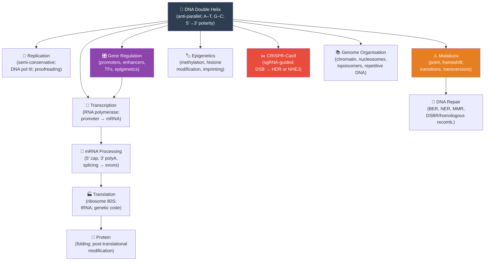

# Unit IV — Molecular Genetics: Introduction {.unnumbered}


\label{sec:unit_IV_unit_intro}
## Why This Unit Matters {.unnumbered}

In 1944, Oswald Avery, Colin MacLeod, and Maclyn McCarty performed one of the most transformative
experiments in the history of science. They showed that the \"transforming principle\" that could convert
harmless *Streptococcus pneumoniae* into a lethal strain was not protein — as virtually everyone expected
— but deoxyribonucleic acid (DNA). The announcement was met with scepticism. DNA seemed too simple:
primarily four nucleotide bases, arranged in an apparently monotonous double helix. How could such a molecule
encode the almost infinite variety of life?

The answer, revealed over the next three decades, is linguistic in structure: a four-letter alphabet
(A, T, G, C) organised into three-letter codons, read in a linear sequence, encoding twenty amino acids,
assembled by ribosomes into an effectively unlimited number of proteins. This is the molecular logic
of life: **information flows from DNA to RNA to protein**, and control is exerted at every step. The
central dogma, articulated by Francis Crick in 1958, has been refined but rarely overturned.

This unit examines the molecular machinery that reads, copies, and expresses genetic information.
You will study the multiprotein complexes that replicate DNA with an error rate of fewer than one
mistake per 10⁹ base pairs, the RNA polymerases that transcribe genes in a regulated, stimulus-responsive
manner, and the ribosome — a 2.5 MDa ribonucleoprotein machine that interprets the genetic code at
~15 amino acids per second. You will also examine how mutations drive evolution and disease, how the
genome is structurally organised, and how CRISPR-Cas9 has made precise genome editing a clinical
reality \citep{doudna2014}.

---

## Landmark Discoveries {.unnumbered}

| Discoverer(s) | Year | Journal / Source | Discovery | Significance |
| ------------- | ---- | ---------------- | --------- | ------------ |
| Avery, MacLeod & McCarty | 1944 | *J. Exp. Med.* | DNA is the genetic material | Overturned protein hypothesis; opened molecular genetics |
| Watson & Crick | 1953 | *Nature* | Double-helix structure of DNA | Anti-parallel complementary strands implied replication mechanism |
| Meselson & Stahl | 1958 | *Proc. Natl. Acad. Sci.* | Semi-conservative DNA replication | Definitive proof of how DNA is copied; used ¹⁵N density-gradient experiment |
| Nirenberg & Matthaei | 1961 | *Proc. Natl. Acad. Sci.* | Deciphering the genetic code | Used cell-free translation of poly-U to show UUU = phenylalanine; cracked the codon table |
| Jacob & Monod | 1961 | *J. Mol. Biol.* | *lac* operon — gene regulatory model | First demonstration of gene circuit logic; inducer-repressor-operator model |
| Alec Jeffreys | 1984 | *Nature* | DNA fingerprinting (RFLP-based) | Transformed forensic science, paternity testing, and population genetics |
| Doudna & Charpentier | 2012 | *Science* | CRISPR-Cas9 programmable genome editing | Created a precise molecular \"scissors\" for any target sequence; Nobel Prize 2020 |

---

## Key Concepts and Connections {.unnumbered}


<!-- alt: Graph showing molecular-genetics concept map — dark = DNA; purple = regulation; orange = mutations; red = editing technology. -->

*Molecular-genetics concept map — dark = DNA; purple = regulation; orange = mutations; red = editing technology.*

---

## Current Evidence Thread {.unnumbered}

Read this unit as molecular genetics built from stacked evidence layers: DNA sequence and replication fidelity, transcription and translation output, the chromatin and methylation state that gates that output, and the variant calls and clinical interpretations that follow from these layers. Molecular genetics now spans single-reference sequences, telomere-to-telomere assemblies, pangenome graphs, long-read sequencing, CRISPR medicines, and ethical deployment. As you
move through the chapters, keep a two-column note: **claim** on the left,
**evidence that would change my confidence** on the right. By the end of the
unit, each major idea should be tied to a measurement, model, citation, or
paper-based lab decision.

## Chapter Roadmap {.unnumbered}

| Chapter | Title | Core Question | Key Equation / Model |
| ------- | ----- | ------------- | -------------------- |
| **12** | DNA Replication and the Cell Cycle | How is DNA copied with such extraordinary accuracy, and how is replication coupled to cell division? | Error rate: ~10⁻⁹ per base; cell cycle checkpoint models |
| **13** | Gene Expression | How is genetic information transcribed and translated into functional proteins? | Rate equations for coupled transcription-translation |
| **14** | Mutations, CRISPR, and Genomics | What causes mutations, how are they repaired, and what does the human reference genome reveal? | Jukes-Cantor distance; mutation rate × generation time |
| **15** | Epigenetics and Gene Regulation | How do chromatin, methylation, and regulatory RNAs tune gene expression without changing DNA sequence? | Methylation state; histone modification; regulatory network logic |

---

## Connections Across the Textbook {.unnumbered}

- **DNA replication** directly links to \nameref{sec:unit_V_unit_intro} (meiosis and crossing-over in \cref{sec:unit_V_chromosomal_inheritance}) and \nameref{sec:unit_VI_unit_intro} (molecular clock calculations using sequence divergence).
- **Gene regulation** (operons, TFs, miRNA) reappears in \nameref{sec:unit_VIII_unit_intro} (plant hormone signal transduction) and \nameref{sec:unit_IX_unit_intro} (endocrine control of gene expression via steroid receptors).
- **Mutations and DNA repair** are essential context for \nameref{sec:unit_VI_unit_intro} (evolution as mutation + selection) and oncogene/tumour-suppressor biology in \nameref{sec:unit_II_unit_intro} and \nameref{sec:unit_IX_unit_intro}.
- **CRISPR-Cas9** appears in clinical connection boxes throughout — gene therapy (\nameref{sec:unit_V_unit_intro}), antibiotic resistance (\nameref{sec:unit_VII_unit_intro}), and plant engineering (\nameref{sec:unit_VIII_unit_intro}).

> **Key vocabulary introduced here:** nucleotide, base pair, template strand, coding strand, codon, anticodon, spliceosome, intron, exon, promoter, enhancer, transcription factor, epigenome, proto-oncogene, restriction enzyme, CRISPR.


## Computational Toolbox — Unit IV {.unnumbered}

```python
from biology.genetics import translate_mrna, dna_complement, punnett_square

# Translate an mRNA sequence into amino acids
mrna = "AUGUUUGAAGAACUUUAG"
protein = translate_mrna(mrna)
print(f"mRNA:    {mrna}")
print(f"Protein: {'-'.join(protein)}")
# Expected: Protein: Met-Phe-Glu-Glu-Leu (stop at UAG)

# Generate the DNA complement of a coding sequence
dna_template = "ATGTTCGAAATG"
complement = dna_complement(dna_template)
print(f"5'→3' complement: {complement}")
# Expected: 5'→3' complement: CATTTCGAACAT  (antiparallel)

# Punnett square: monohybrid cross Aa × Aa
result = punnett_square("Aa", "Aa")
print(f"Genotype ratios: {result.genotype_ratios}")
print(f"Phenotype ratios: {result.phenotype_ratios}")
# Expected:
# Genotype ratios: {'AA': 0.25, 'Aa': 0.5, 'aa': 0.25}
# Phenotype ratios: {'dominant': 0.75, 'recessive': 0.25}
```

> **Try it yourself:** Change the mRNA to `AUGCAGUGA` — note that UGA is a stop codon.
> Compare proteins produced from synonymous codon changes using the `GENETIC_CODE` dictionary.

---

*Source modules: `src/biology/genetics/` — `translate_mrna()`, `dna_complement()`, `punnett_square()`, `hardy_weinberg()`.*
*Figures: `src/mermaid/biology_diagrams.py` (central dogma diagrams, CRISPR mechanism).*

## Cross-Unit Integration {.unnumbered}

\nameref{sec:unit_IV_unit_intro} established how genetic information is stored, copied, and expressed within a single cell. \nameref{sec:unit_V_unit_intro} scales that story to populations and generations: how independently assorting alleles produce Mendelian ratios, how linkage modifies them, how chromosomal abnormalities arise from meiotic errors, and how allele frequencies behave across whole populations under Hardy–Weinberg equilibrium. The transcriptional regulation and epigenetic mechanisms you saw at the molecular level reappear in \nameref{sec:unit_V_unit_intro} as the proximate machinery underlying incomplete penetrance, variable expressivity, and parent-of-origin (imprinting) effects. As Mendelian patterns introduce dominance, recessiveness, and complementation, ask which \nameref{sec:unit_IV_unit_intro} molecular events would produce each pattern — \nameref{sec:unit_V_unit_intro} is essentially \nameref{sec:unit_IV_unit_intro} running across pedigrees.
