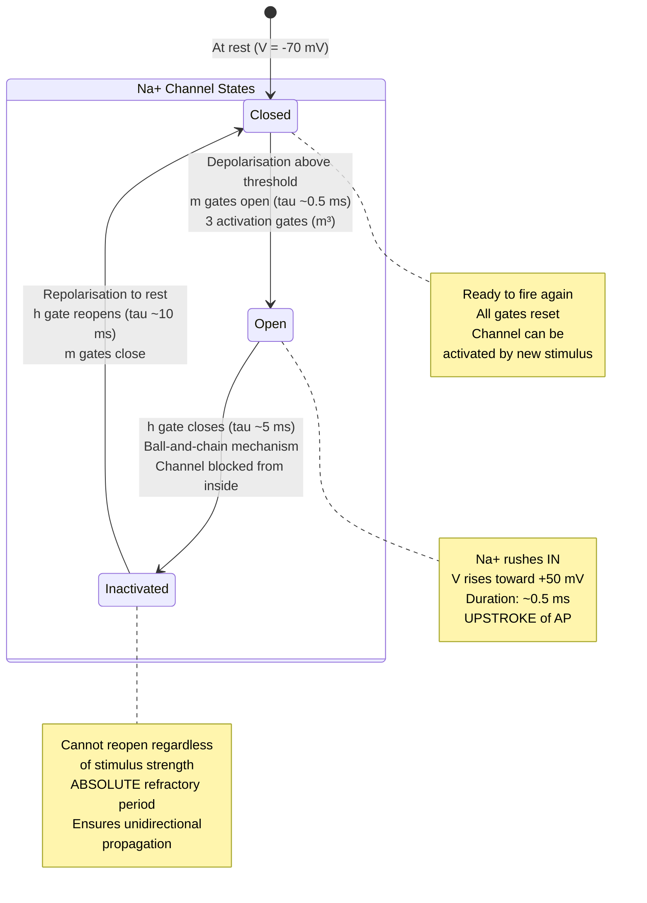
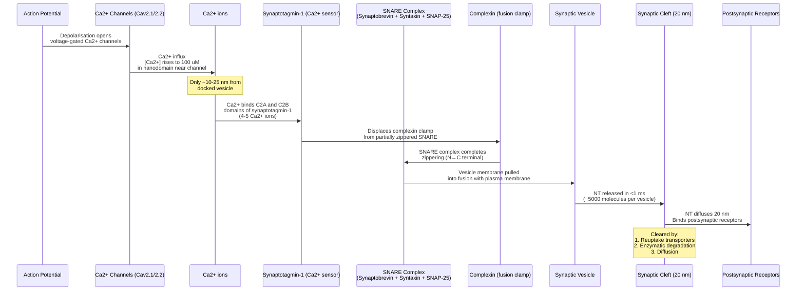
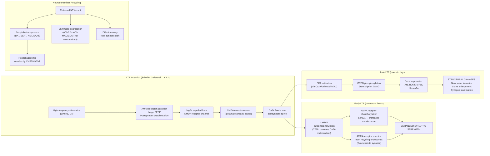

# Action Potentials and Synaptic Transmission

\label{sec:unit_IX_action_potential_synapses}


<!-- chapter-metadata-badge -->
> Level 3/3 · 55 min read · 100 min lecture · Prerequisites: \cref{sec:unit_IX_nervous_system}

## Learning Objectives

1. Write and explain the Hodgkin-Huxley equations for the [**action potential**](#gl:action-potential).
2. Explain the kinetics of Na$^+$ activation (m), inactivation (h), and K$^+$ activation (n) gating variables.
3. Describe the absolute and relative refractory periods in terms of channel states.
4. Explain myelination, [**saltatory conduction**](#gl:saltatory-conduction), and how axon diameter affects velocity.
5. Describe the molecular machinery of chemical synaptic transmission including SNARE [**protein**](#gl:protein)s and Ca$^{2+}$ triggering.
6. Compare major neurotransmitter systems and their receptor pharmacology.
7. Describe long-term potentiation \citep{frey1997} (LTP) and long-term depression (LTD) and their roles in learning and memory.
8. Explain the mechanisms of action of major neuroactive drugs.

<!-- curriculum-scaffold-start -->
### Study Blueprint

- **Big idea:** Electrical excitability and synaptic transmission convert ion gradients into rapid communication.
- **Core concepts:** action potentials, ion channels, synapses, plasticity.
- **Framework alignment:** Vision & Change: Structure and function, Systems; AP Biology: Systems Interactions, Energetics; NGSS-style topics: Structure and Function.
- **Model or quantitative lens:** Nernst/Goldman, Hodgkin-Huxley, and synaptic-current reasoning.
- **Data skill:** Interpret voltage traces, conductance changes, and synaptic perturbations.
- **Practice cadence:** Visual Representations, Statistical Tests and Data Analysis, Argumentation.
- **Common misconception to repair:** An action potential is not electricity flowing like a wire; it is regenerated ion-channel dynamics.
- **Primary lab:** \cref{sec:lab_unit_IX_action_potential_synapses}.
- **Question bank:** \cref{sec:q_unit_IX_action_potential_synapses}.
- **Transfer task:** Transfer excitability reasoning to anesthesia, toxins, epilepsy, and neuromuscular disease.
- **Bridge to computation:** `biology.neuroscience.neuroscience.action_potential_hh`.
<!-- curriculum-scaffold-end -->

---

> **Opening Vignette — The Squid That Explained the Brain**
> 
> The squid *Loligo* possesses a giant axon up to 1 mm in diameter — large enough for researchers to insert a glass micropipette electrode into the interior. In 1939, Alan Hodgkin and Andrew Huxley exploited this remarkable anatomy to make the first intracellular recordings of an action potential. By 1952, using voltage-clamp apparatus of their own construction, they had measured the time courses of sodium and potassium conductances across the membrane with stunning precision and fitted them to a set of differential equations now known as the Hodgkin-Huxley model. The equations predicted the shape, amplitude, threshold, refractory period, and propagation velocity of action potentials — most from first principles of ionic movement. The 1963 Nobel Prize in Physiology or Medicine rewarded what remains one of the most quantitatively rigorous pieces of biological science ever accomplished. Every antiepileptic, local anaesthetic, cardiac antiarrhythmic, and membrane biophysics textbook stems ultimately from that one peculiarly large squid axon.

## The Hodgkin-Huxley Model


\begin{figure}[htbp]
\centering
\includegraphics[width=0.85\textwidth]{../figures/nernst_potentials.png}
\caption{Nernst equilibrium potentials for major physiological ions (Na$^+$, K$^+$, Cl$^-$, Ca$^{2+}$) calculated from their inside/outside concentration gradients.}
\label{fig:unit_IX_nernst_potentials}
\end{figure}
<!-- alt: Bar chart of Nernst equilibrium potential in millivolts for physiological K+, Na+, Ca2+, and Cl- gradients, with positive and negative potentials distinguished by colour and a zero reference line. -->


Alan Hodgkin and Andrew Huxley recorded action potentials from the **squid giant axon** (diameter ~0.5 mm) using voltage clamp; their quantitative model remains the reference case for turning conductance measurements into a predictive excitable-membrane equation \citep{hodgkin1952quantitative}. Each ionic current is driven by the difference between $V$ and that ion's Nernst equilibrium potential, the gradient-dependent values of which are plotted in \cref{fig:unit_IX_nernst_potentials}. They described membrane current as:

\begin{equation}
C_m \frac{dV}{dt} = -I_{Na} - I_K - I_L + I_{ext}
\label{eq:action_potential_synapses_1}
\end{equation}

where:
- $C_m$ = membrane capacitance about 1 uF/cm$^2$
- $I_{Na} = \bar{g}_{Na} m^3 h (V - E_{Na})$; $\bar{g}_{Na}$ = 120 mS/cm$^2$; $E_{Na}$ = +50 mV
- $I_K = \bar{g}_K n^4 (V - E_K)$; $\bar{g}_K$ = 36 mS/cm$^2$; $E_K$ = $-77$ mV
- $I_L = g_L (V - E_L)$; $g_L$ = 0.3 mS/cm$^2$; $E_L$ = $-54.4$ mV

### Hodgkin-Huxley Gating Variables

Each gating variable ($m$, $h$, $n$) evolves according to first-order Markov kinetics:

\begin{equation}
\frac{dx}{dt} = \alpha_x(V)(1-x) - \beta_x(V)x
\label{eq:action_potential_synapses_2}
\end{equation}

At steady state: $x_\infty(V) = \alpha_x / (\alpha_x + \beta_x)$; time constant: $\tau_x(V) = 1/(\alpha_x + \beta_x)$


<!-- alt: State diagram showing voltage-gated Na^+ channel states. The channel transitions through three states: Closed (resting, ready to open), Open (conducting Na^+, brief ~0.5 ms), and Inactivated (blocked by the inactivation gate, cannot reopen until repolarisation restores the resting state). The inactivated state underlies the absolute refractory period. -->

*Voltage-gated Na$^+$ channel states. The channel transitions through three states: Closed (resting, ready to open), Open (conducting Na$^+$, brief ~0.5 ms), and Inactivated (blocked by the inactivation gate, cannot reopen until repolarisation restores the resting state). The inactivated state underlies the absolute refractory period.*

| Gating variable | $\alpha(V)$ | $\beta(V)$ |
| --------------- | ----------- | ---------- |
| m (Na$^+$ activation) | $0.1(V+40) / [1 - \exp(-(V+40)/10)]$ | $4 \exp(-(V+65)/18)$ |
| h (Na$^+$ inactivation) | $0.07 \exp(-(V+65)/20)$ | $1 / [1 + \exp(-(V+35)/10)]$ |
| n (K$^+$ activation) | $0.01(V+55) / [1 - \exp(-(V+55)/10)]$ | $0.125 \exp(-(V+65)/80)$ |

### Biophysical Interpretation of the Action Potential

- **Threshold** (~$-55$ mV): Point where inward Na$^+$ current exceeds outward K$^+$ leak. Positive feedback begins (more [**depolarisation**](#gl:depolarisation) opens more Na$^+$ channels).
- **Upstroke (depolarisation):** Rapid m-gate opening ($\tau_m \approx 0.5$ ms). Na$^+$ rushes in. Membrane potential approaches E$_{Na}$ (+50 mV) but typically peaks at +30 to +40 mV.
- **Repolarisation:** h-gate closes (Na$^+$ inactivation, $\tau_h \approx 5$ ms) AND n-gate opens (K$^+$ delayed rectifier, $\tau_n \approx 5$ ms). Na$^+$ influx stops; K$^+$ efflux drives membrane back toward E$_K$.
- **Afterhyperpolarisation (undershoot):** n-gate slow to close. K$^+$ efflux continues briefly, hyperpolarising membrane below [**resting potential**](#gl:resting-potential) (~$-80$ mV). This is the relative refractory period.

### Channel Pharmacology and Excitability

**Tetrodotoxin (TTX):** Puffer fish toxin. Blocks Nav channels from the extracellular side by occluding the selectivity filter pore. Blocks most AP generation. LD$_{50}$ in mice: ~10 ug/kg. Used extensively as a research tool to study Na$^+$-dependent processes.

**4-Aminopyridine (4-AP):** Blocks Kv (voltage-gated K$^+$) channels. Prolongs AP duration, enhances neurotransmitter release. Used clinically as dalfampridine (Ampyra) for multiple sclerosis to improve conduction in demyelinated axons.

**Nav channel subtypes:** Nav1.1-Nav1.9 encoded by SCN1A-SCN11A [**gene**](#gl:gene)s. Different subtypes have distinct tissue distributions, voltage sensitivities, and pharmacological profiles:
- Nav1.7 (SCN9A): Pain perception. Loss-of-function: congenital insensitivity to pain. Gain-of-function: erythromelalgia (burning pain).
- Nav1.5 (SCN5A): Cardiac muscle. [**Mutation**](#gl:mutation)s cause Long QT syndrome, Brugada syndrome.

**Concept Check:** TTX blocks Na$^+$ channels and abolishes action potentials. Local anaesthetics (lidocaine) also block Na$^+$ channels. Why does lidocaine preferentially block pain fibres rather than motor fibres? (Hint: consider use-dependence and fibre diameter.)

---

## Refractory Periods and Directional Propagation

**Absolute refractory period** (~1-2 ms after spike peak): Na$^+$ channels are in the inactivated state (h about 0). They cannot be re-opened regardless of stimulus strength. This supports:
- Unidirectional AP propagation (the region just behind the AP cannot be re-excited)
- Maximum firing rate (~500-1000 Hz)

**Relative refractory period** (~5-10 ms following absolute): Na$^+$ channels are recovering from inactivation (h recovering), but K$^+$ channels remain open. The membrane is more negative than resting potential (afterhyperpolarisation). A stronger-than-normal stimulus is needed to trigger a second spike. APs generated during this period have reduced amplitude.

> **Clinical Connection:** The cardiac refractory period is much longer than in [**neuron**](#gl:neuron)s (~200-300 ms vs ~2 ms) because cardiac AP duration is prolonged by L-type Ca$^{2+}$ channels (plateau phase). This prevents tetanic contraction of the heart (which would be fatal -- the heart must relax to fill). The "vulnerable period" near the end of the T wave (relative refractory period of ventricles) is when a premature stimulus can trigger ventricular fibrillation.

**Concept Check:** During the falling phase of the action potential the m, h, and n gates are most changing at once. Which single Hodgkin-Huxley gating variable is the *direct* cause of repolarisation, and why does Na$^+$ inactivation (h) alone fail to repolarise the membrane without it? (Hint: compare what each conductance does to the driving force toward $E_K$ versus $E_{Na}$.)

---

## Myelination and Conduction Velocity

### Unmyelinated Conduction and Cable Spread

In continuous conduction, the AP generates local circuits along the axon membrane:

\begin{equation}
\theta \propto \sqrt{a/r_i}
\label{eq:action_potential_synapses_3}
\end{equation}

where a = axon radius and $r_i$ = axial resistance per unit length. Increasing diameter reduces axial resistance, increasing velocity. Squid giant axon (500 um diameter) achieves ~25 m/s by brute-force gigantism.

### Myelinated Axons -- Saltatory Conduction

Myelin dramatically increases the **space constant** (λ):

\begin{equation}
\lambda = \sqrt{r_m / r_i}
\label{eq:action_potential_synapses_4}
\end{equation}

Myelin increases $r_m$ (membrane resistance, preventing current leak) and reduces $C_m$ (membrane capacitance, reducing charge needed to change voltage). The result: depolarisation spreads much further without decay.

APs can primarily arise at **nodes of Ranvier** (1-2 um gaps between myelin segments, every ~1 mm). Nodes have concentrated voltage-gated Na$^+$ channels (~1,000/um$^2$ at nodes vs ~25/um$^2$ under myelin).

**Saltatory conduction:** The AP appears to "jump" between nodes. In myelinated axons, velocity scales linearly with diameter ($\theta \propto d$), rather than as the square root:

| Fibre type | Diameter (um) | Velocity (m/s) | Myelinated? | Function |
| ---------- | ------------- | -------------- | ----------- | -------- |
| A-alpha (Ia) | 12-20 | 70-120 | Yes | Muscle spindle afferents |
| A-beta | 6-12 | 30-70 | Yes | Touch, pressure |
| A-delta | 1-5 | 5-30 | Thinly | Sharp pain, temperature |
| B | 1-3 | 3-15 | Yes | Preganglionic autonomic |
| C | 0.2-1.5 | 0.5-2 | No | Slow pain, itch, postganglionic autonomic |

### Worked Example: Myelination Gain — Saltatory vs Continuous Conduction

Suppose two unmyelinated axons of equal small diameter ($d = 1\;\mu$m) carry the same action potential. Continuous conduction velocity scales as $\theta_\text{unmyel} \propto \sqrt{d}$. From empirical data, an unmyelinated 1 μm axon conducts at ~0.5 m/s.

Now myelinate one axon with internodes ~1 mm apart and 100 wraps of myelin. Myelin increases membrane resistance ($r_m$) ~100-fold and reduces capacitance ($C_m$) ~50-fold:

- Length constant $\lambda = \sqrt{r_m / r_i}$ increases ~10-fold
- Time constant at the node $\tau_m = r_m C_m$ — although both increase, the *time to reach threshold* at the next node depends primarily on the rapid charging of node membrane (which has low capacitance) by the spreading depolarisation
- Effective conduction velocity in myelinated fibre: $\theta_\text{myel} \propto d$ (linear, not square root)

For the same 1 μm fibre with myelination, conduction approaches ~6 m/s (>10× faster). For larger myelinated fibres (10–20 μm A-α), the gain is even more striking:

| Fibre | Diameter | Conduction velocity | Myelinated? | Velocity gain |
| ----- | -------- | ------------------- | ----------- | ------------- |
| C fibre | 1 μm | 0.5 m/s | No | (baseline) |
| A-δ | 1–5 μm | 5–30 m/s | Thinly | ~10–60× |
| A-α (Ia) | 12–20 μm | 70–120 m/s | Yes (heavily) | ~150–250× |

**The fundamental insight:** Saltatory conduction provides the **same speed at ~50× lower diameter** compared to brute-force gigantism (squid giant axon, 500 μm). The vertebrate solution to fast conduction — myelinate small axons rather than grow giant ones — is enormously more space-efficient and energetically cheaper. The ~$10^{12}$ axons in the human white matter would not fit in the cranium without myelin.

The **energetic cost** of action potentials is also dramatically reduced: in unmyelinated axons, Na$^+$/K$^+$-ATPase must continuously pump out Na$^+$ along the entire length. In myelinated axons, AP-associated ion fluxes occur primarily at nodes (~0.1% of axon surface), reducing the metabolic cost of spike propagation by a similar factor.

### Multiple Sclerosis and Demyelinating Conduction Failure

**Multiple sclerosis (MS):** Autoimmune demyelination of CNS white matter. T cells recognise myelin basic protein (MBP) and proteolipid protein (PLP) as autoantigens. Inflammatory attack destroys oligodendrocyte myelin sheaths.

Consequences: Slowed or blocked conduction in demyelinated segments. Symptoms depend on lesion location: optic neuritis (visual loss), weakness, sensory loss, fatigue, cognitive impairment. Relapsing-remitting course in ~85% of patients.

Treatment: Disease-modifying therapies (interferons, natalizumab, ocrelizumab) reduce relapse frequency. 4-aminopyridine (blocks exposed K$^+$ channels in demyelinated segments) improves conduction.

**Concept Check:** A 1 μm unmyelinated axon conducts at ~0.5 m/s, yet a 1 μm myelinated axon conducts at ~6 m/s while a 20 μm unmyelinated axon would need a far larger diameter to match it. Using the velocity scalings $\theta \propto \sqrt{d}$ (unmyelinated) versus $\theta \propto d$ (myelinated), explain why myelination — not gigantism — is the space- and energy-efficient solution, and predict what happens to conduction when a node of Ranvier is demyelinated. (Hint: think about what myelin does to $r_m$, $C_m$, and the length constant λ.)

---

## Chemical Synaptic Transmission

### Synapse Types and Functional Polarity

**Electrical synapses** (gap junctions): Connexin/innexin hemichannels directly connect [**cytoplasm**](#gl:cytoplasm)s. Bidirectional, nearly instantaneous (<0.1 ms). Found in: cardiac pacemaker cells (connexin 43), retinal processing (rod-cone coupling), hippocampal interneuron synchronisation. Connexin 26/30 mutations cause hereditary deafness.

**Chemical synapses:** Unidirectional. Modifiable (plasticity). Synaptic delay: 0.5-2 ms. The [**dominant**](#gl:dominant) synapse type in the CNS.

### Presynaptic Machinery for Vesicle Fusion


<!-- alt: Sequence diagram showing molecular machinery of synaptic vesicle fusion. Depolarisation opens Ca^2+ channels. Ca^2+ binds synaptotagmin-1, which displaces the complexin fusion clamp and triggers full SNARE complex zippering, forcing the vesicle membrane to fuse with the plasma membrane and release neurotransmitter into the cleft. -->

*Molecular machinery of synaptic vesicle fusion. Depolarisation opens Ca$^{2+}$ channels. Ca$^{2+}$ binds [**synaptotagmin**](#gl:synaptotagmin)-1, which displaces the complexin fusion clamp and triggers full [**SNARE complex**](#gl:snare-complex) zippering, forcing the vesicle membrane to fuse with the plasma membrane and release neurotransmitter into the cleft.*

**Key proteins:**
- **SNARE complex:** The minimal fusion machinery. **Synaptobrevin** (v-SNARE, on vesicle membrane) + **syntaxin** + **SNAP-25** (both t-SNAREs, on plasma membrane). The four α-helices zipper together N-to-C terminally, pulling membranes into contact.
- **Synaptotagmin-1:** Ca$^{2+}$ sensor. Its C2A and C2B domains bind 4-5 Ca$^{2+}$ ions, triggering membrane insertion and SNARE complex activation. Cooperativity of Ca$^{2+}$ binding gives the steep Ca$^{2+}$-release relationship (~4th power).
- **Munc18 / Munc13:** Priming factors that prepare SNARE complexes for fast fusion
- **RIM:** Active zone scaffold protein. Positions vesicles within nanometres of Ca$^{2+}$ channels.
- **Complexin:** "Fusion clamp." Binds partially zippered SNARE complex and prevents spontaneous fusion. Ca$^{2+}$/synaptotagmin displaces complexin to trigger release.
- **NSF + alpha-SNAP:** After fusion, these AAA$^+$ ATPases disassemble SNARE complexes for recycling.

**Quantal release (Katz, Nobel 1970):** Neurotransmitter is released in discrete packets (quanta), each corresponding to the contents of one vesicle. The end-plate potential (EPP) at the NMJ = n $\times$ p $\times$ q, where n = number of release-ready vesicles, p = release probability per vesicle, q = quantal size (postsynaptic response to one vesicle).

Miniature EPPs (mEPPs) represent spontaneous release of single vesicles and have a constant amplitude (~0.5 mV at the NMJ). The evoked EPP is an integer multiple of the mEPP amplitude.

### Synaptic Vesicle Pools

A presynaptic terminal does **not** treat most its vesicles equivalently. Decades of imaging, electrophysiology, and FM dye experiments establish three functionally distinct pools that differ in their release-readiness, location, and mobilisation kinetics:

| Pool | Approximate size per active zone | Location | Release kinetics | Replenishment |
| ---- | -------------------------------- | -------- | ---------------- | ------------- |
| **Readily releasable pool (RRP)** | ~10–20 vesicles (CNS); ~50–100 (NMJ) | Docked at active zone; primed | Released within ~1 ms of Ca$^{2+}$ entry; depleted within first few APs of a high-frequency train | Refilled from recycling pool over 1–10 s |
| **Recycling pool** | ~100–200 vesicles | Near active zone; fused with PM during sustained activity then reformed locally | Sustains release during moderate-frequency activity | Cycle time ~30–60 s |
| **Reserve pool** | ~300–500+ vesicles | Tethered to actin/synapsin in the cytoplasm | Mobilised primarily during intense or prolonged activity (typically when synapsin is phosphorylated by CaMKII/PKA) | Slow refilling (minutes) from synthesis and endocytosis |

The three-pool model elegantly explains the kinetics of synaptic transmission during different activity patterns. **Brief, low-frequency stimulation** uses primarily the RRP and the system rapidly returns to baseline. **Sustained moderate activity** engages the recycling pool. **Tetanic stimulation** mobilises the reserve pool by phosphorylation of synapsin (which normally clamps reserve vesicles to the actin cytoskeleton), releasing them to refill the active zone.

### Short-term plasticity — facilitation and depression

Synaptic strength is dynamic across milliseconds-to-seconds, even before any LTP/LTD is induced. Two opposing short-term phenomena dominate:

**Synaptic facilitation** (paired-pulse facilitation; tens to hundreds of ms): If two APs arrive in close succession, the second EPSC/IPSC is *larger* than the first. Mechanism: residual presynaptic Ca$^{2+}$ from the first AP has not yet been pumped out or buffered; when the second AP triggers Ca$^{2+}$ entry, the residual Ca$^{2+}$ adds to the new flux, super-linearly increasing release probability $p$. Facilitation is most prominent at synapses with low initial $p$ (e.g., parallel-fibre to Purkinje cell synapses; ~$p \approx 0.05$); high-$p$ synapses have less room for further increase.

**Synaptic depression** (paired-pulse depression; tens of ms to seconds): If two APs arrive in close succession at a high-$p$ synapse, the second EPSC is *smaller* than the first. Mechanism: the RRP is partially depleted by the first AP and has not had time to refill. Depression is most prominent at synapses with high initial $p$ (e.g., calyx of Held auditory synapses; $p \approx 0.4$).

Whether a given synapse facilitates or depresses depends on its starting release probability, vesicle pool dynamics, and Ca$^{2+}$ handling. Some synapses transition: facilitate at low frequency, then depress as frequency rises and pools deplete.

### Tsodyks-Markram model

The classical phenomenological model of short-term plasticity (Tsodyks & Markram, 1997) treats each synapse as having two state variables:

- **$x$**: the fraction of available (un-depleted) resources (vesicles in the RRP), with $0 \le x \le 1$
- **$u$**: the utilisation parameter (effective release probability), influenced by residual Ca$^{2+}$

After each spike, $x \to x \cdot (1 - u)$ (resources depleted) and $u \to u + U \cdot (1 - u)$ (release probability incremented by Ca$^{2+}$ accumulation). Between spikes, both variables relax back to baseline with time constants $\tau_d$ (recovery, ~500 ms–2 s) and $\tau_f$ (facilitation, ~100–500 ms):

$$\frac{dx}{dt} = \frac{1 - x}{\tau_d}; \qquad \frac{du}{dt} = -\frac{u - U}{\tau_f} \label{eq:unit_IX_action_potential_synapses_item_1}$$


The post-spike EPSC amplitude is proportional to $u \cdot x$. This single model captures the full repertoire of facilitating, depressing, and mixed synapses — by varying the parameters $U$, $\tau_d$, $\tau_f$ — and is the standard building block for biologically realistic spiking neural network simulations.

> **Clinical Connection:** Lambert-Eaton myasthenic syndrome (LEMS) is an autoimmune disorder targeting presynaptic P/Q-type Ca$^{2+}$ channels at the NMJ, dramatically reducing initial release probability. The hallmark on bedside testing is **post-tetanic facilitation** — strength briefly improves after sustained voluntary contraction, reflecting accumulated Ca$^{2+}$ partially compensating for reduced channel number. Treatment with **3,4-diaminopyridine** (a K$^+$ channel blocker that prolongs presynaptic AP duration → more Ca$^{2+}$ entry per spike) increases initial $p$ and restores neuromuscular transmission.

### Worked Example: Quantal Analysis at the Neuromuscular Junction

> **Mathematical Background:** Quantal analysis uses Poisson statistics. For a review of probability and statistical reasoning, see \cref{sec:appendix_math_review}.

**Problem:** At the frog NMJ, miniature end-plate potentials and evoked end-plate potentials revealed that transmitter release occurs in vesicle-sized quanta \citep{delcastillo1954quantal}. Suppose spontaneous miniature end-plate potentials (mEPPs) have mean amplitude $q = 0.5$ mV (the postsynaptic response to one vesicle's worth of acetylcholine). An evoked end-plate potential (EPP) under normal Ca$^{2+}$ averages $V_{\text{EPP}} = 25$ mV. Estimate the quantal content $m$ (mean number of vesicles released per action potential), then predict the failure rate when extracellular Ca$^{2+}$ is reduced enough to drop $m$ to 2.

**Solution.**

1. **Quantal content from the mEPP ratio.** Quantal release theory: $V_{\text{EPP}} = m \cdot q \;\Rightarrow\; m = V_{\text{EPP}} / q = 25 / 0.5 = 50$ vesicles per AP.
2. **Poisson statistics of release.** Each release-ready vesicle has independent release probability $p$; the number released per AP, $k$, follows Poisson statistics with mean $m$. The probability of zero release ("failure") is

   $$P(k = 0) = e^{-m}.$$

   At $m = 50$: $P(\text{failure}) = e^{-50} \approx 1.9 \times 10^{-22}$. Effectively negligible failure probability — exactly the safety factor needed at the NMJ, where every motor command must reach the muscle.

3. **Low-Ca$^{2+}$ regime, $m = 2$.** Reduce extracellular [Ca$^{2+}$] enough to drop $m$ to 2 (with $p$ falling correspondingly because release probability scales as $\sim [\text{Ca}^{2+}]^4$ — a steep nonlinearity from Ca$^{2+}$-sensor cooperativity):

   $$P(\text{failure}) = e^{-2} \approx 0.135 = 13.5\%.$$

   More than one in eight spikes now triggers zero release. The EPP histogram becomes multi-modal: discrete peaks at $0, q, 2q, 3q, \ldots$ separated by the quantal step. The visibility of these peaks is the empirical signature captured in classical quantal analysis \citep{delcastillo1954quantal}.

4. **Sanity check — variance.** Poisson predicts $\text{Var}(V_{\text{EPP}}) = m \cdot q^2$ so the coefficient of variation is $1/\sqrt{m}$. At $m = 50$, CV $\approx 0.14$ (smooth, near-deterministic release). At $m = 2$, CV $\approx 0.71$ (noisy, single-vesicle steps visible in the post-synaptic record). This CV-vs-$m$ scaling is the standard tool for inferring $m$ at central synapses where mEPSCs are harder to isolate.

**Interpretation.** The NMJ deliberately operates at high safety factor ($m \approx 50$ on a $\sim 100$-vesicle RRP per active zone, so $p \approx 0.5$) precisely because failure is intolerable for survival behaviours. Central synapses, by contrast, often run at $m = 1$–$5$ — they accept failures in exchange for the ability to perform fine probabilistic computation. The quantal framework converts the same molecular machinery (vesicles + Ca$^{2+}$ + SNAREs) into wildly different reliability regimes by tuning a single biophysical knob: $p$.


### Postsynaptic Receptors and Ionotropic/Metabotropic Signalling

| Receptor class | Example | Ion selectivity | Speed | Mechanism |
| -------------- | ------- | --------------- | ----- | --------- |
| **Ionotropic** | AMPA (GluA1-4) | Na$^+$/K$^+$ (some Ca$^{2+}$) | Fast (ms) | Ligand-gated ion channel |
| Ionotropic | NMDA (GluN1/2A-D) | Na$^+$/K$^+$/Ca$^{2+}$ | Slower (10s of ms) | Voltage + ligand gated; Mg$^{2+}$ block |
| Ionotropic | GABA$_A$ | Cl$^-$ | Fast (ms) | Ligand-gated anion channel |
| Ionotropic | nAChR | Na$^+$/K$^+$ | Fast (ms) | Pentameric cation channel |
| **Metabotropic** | mGluR1-8 | N/A | Slow (100s ms-min) | GPCR to G$_q$/G$_i$ to IP$_3$/cAMP |
| Metabotropic | GABA$_B$ | K$^+$ (indirect) | Slow | G$_i$ to K$^+$ channel activation |
| Metabotropic | D1/D2 | N/A | Slow | G$_s$/G$_i$ to cAMP |
| Metabotropic | 5-HT$_{1A-7}$ | N/A | Slow | Various G protein coupling |

**NMDA receptor -- "coincidence detector":** The NMDA receptor requires BOTH glutamate binding AND postsynaptic depolarisation (to relieve Mg$^{2+}$ block) to conduct. This makes it a detector of coincident pre- and postsynaptic activity -- exactly the condition Hebb proposed should strengthen synapses. Ca$^{2+}$ entry through NMDA receptors triggers LTP.

**Concept Check:** At a synapse with $n = 10$ release-ready vesicles, release probability $p = 0.2$, and quantal size $q = 0.5$ mV, a single presynaptic spike must drive the postsynaptic membrane from $-70$ mV to a $-55$ mV threshold. Using the $n \cdot p \cdot q$ model, decide whether one spike reaches threshold and explain why a drug that raises $p$ (e.g., an aminopyridine prolonging the presynaptic AP) can convert a sub-threshold synapse to a supra-threshold one without adding any new vesicles. (Hint: compute the expected EPSP amplitude and compare it to the 15 mV gap.)

**Concept Check (Analyze) — NMDA receptor as coincidence detector and the LTP gate.** The NMDA receptor demands *both* glutamate (plus glycine/D-serine co-agonist) *and* postsynaptic depolarisation to conduct: at $-70$ mV the channel pore is occluded by extracellular Mg$^{2+}$; at $\sim -30$ mV the Mg$^{2+}$ is expelled, opening a Ca$^{2+}$-permeable pathway. (a) Draw a sketch of conductance vs $V_m$ for the NMDA receptor in the presence of saturating glutamate, marking the Mg$^{2+}$-block region and the relief threshold. (b) Explain why this voltage-dependent gating implements a *Hebbian* rule (pre and post must fire together) at the molecular level, and predict what would happen to LTP induction in a mouse engineered with the GluN1 N598Q mutation that removes the Mg$^{2+}$-binding site. (c) AMPA-receptor insertion into the post-synaptic density requires CaMKII-mediated phosphorylation of GluA1 at S831, which is triggered by NMDA-mediated Ca$^{2+}$ entry. Predict the consequence of pharmacologically blocking PKA (which co-phosphorylates GluA1 at S845 to potentiate channel open probability) during LTP induction, and explain why both kinases are needed to lock in synaptic strengthening rather than just one.

**Concept Check (Evaluate) — Parvalbumin interneurons, E/I balance, and working memory.** Cortical inhibition is parcelled by interneuron class: parvalbumin (PV) basket cells deliver fast, perisomatic GABA inhibition that gates spike timing of pyramidal neurons and pace cortical gamma oscillations (30–80 Hz); somatostatin (SST) interneurons target apical dendrites and modulate dendritic integration. (a) In a network where PV-cell density is selectively reduced by approximately 30% (as reported in post-mortem schizophrenia tissue), predict the directional change in (i) excitation/inhibition (E/I) ratio, (ii) gamma oscillation power, and (iii) pyramidal-cell spike-timing precision. (b) Working memory in prefrontal cortex relies on persistent pyramidal-cell firing during the delay period, sustained by recurrent excitation gated by PV inhibition. Evaluate why a modest PV loss would degrade working memory more than long-term memory consolidation. (c) Propose a single physiological measurement (gamma power at a specific frequency band; spike-LFP phase locking; visual-attention gain control) you would prioritise as a clinical biomarker, and justify it in terms of statistical power and translational tractability between rodent models and human EEG.


---

## Neurotransmitter Systems and Receptor Families

### Glutamate as the Major Excitatory Transmitter

The major excitatory neurotransmitter in the CNS (~90% of excitatory synapses).

**Receptors:**
- **AMPA** (GluA1-4): Fast Na$^+$/K$^+$ current. Ca$^{2+}$-permeable if lacking GluA2 (GluA2 RNA editing of Q/R site prevents Ca$^{2+}$ permeability in most adult neurons).
- **NMDA** (GluN1/GluN2A-D): Coincidence detector. Requires glutamate + glycine/D-serine co-agonist + depolarisation to relieve Mg$^{2+}$ block. High Ca$^{2+}$ permeability. Critical for LTP.
- **Kainate** (GluK1-5): Similar to AMPA; modulatory roles at some synapses.
- **mGluR** (mGluR1-8): Metabotropic. Group I (mGluR1/5): G$_q$-coupled, excitatory. Group II/III: G$_i$-coupled, inhibitory (presynaptic autoreceptors).

**[Excitotoxicity](#gl:excitotoxicity):** Excessive glutamate release (e.g., during stroke/ischaemia) overactivates NMDA receptors. Massive Ca$^{2+}$ influx activates calpains, endonucleases, and nitric oxide synthase, leading to neuronal death. This is a major mechanism of ischaemic brain damage.

### GABA as the Major Inhibitory Transmitter

The major inhibitory neurotransmitter (~30% of CNS synapses). Synthesised from glutamate by glutamic acid decarboxylase (GAD65/GAD67).

**Receptors:**
- **GABA$_A$** (ionotropic): Cl$^-$ channel. Pentameric (typically $\alpha_1\beta_2\gamma_2$). Binding sites for: GABA (agonist), benzodiazepines (positive [**allosteric**](#gl:allosteric) modulators at α/γ interface), barbiturates, neurosteroids, ethanol, anaesthetics (propofol, isoflurane).
- **GABA$_B$** (metabotropic): G$_i$-coupled GPCR. Activates K$^+$ channels (postsynaptic hyperpolarisation) and inhibits Ca$^{2+}$ channels (presynaptic, reduces NT release). Baclofen is a GABA$_B$ agonist (used for spasticity).

### Acetylcholine at Neuromuscular and Autonomic Synapses

**Receptors:**
- **Nicotinic (nAChR):** Ionotropic pentamer. Muscle type ($\alpha_1^2\beta_1\delta\epsilon$) at NMJ. Neuronal types ($\alpha_4\beta_2$, $\alpha_7$) in CNS. Na$^+$/K$^+$ channels.
- **Muscarinic (mAChR, M1-M5):** GPCRs. M1/M3/M5: G$_q$ (excitatory). M2/M4: G$_i$ (inhibitory, e.g., vagal slowing of heart rate).

**CNS cholinergic system:** Basal forebrain (nucleus basalis of Meynert) projects to cortex. Critical for attention and memory. Degeneration in Alzheimer's disease.

### Dopamine in Reward, Movement, and Precision Signals

**Receptors:** D1-D5 (most GPCRs). D1-like (D1, D5): G$_s$, increase cAMP. D2-like (D2, D3, D4): G$_i$, decrease cAMP.

**Major pathways:**
- **Nigrostriatal** (SNc to striatum): Motor control. Loss causes Parkinson's disease.
- **Mesolimbic** (VTA to nucleus accumbens): Reward prediction error, motivation. Hyperactivity linked to positive symptoms of schizophrenia.
- **Mesocortical** (VTA to prefrontal cortex): Working memory, executive function. Hypoactivity linked to negative symptoms of schizophrenia and ADHD.
- **Tuberoinfundibular** (hypothalamus to pituitary): Inhibits prolactin release.

### Serotonin (5-HT)

Synthesised from tryptophan by tryptophan hydroxylase (TPH2 in CNS). Raphe nuclei in brainstem project widely. 14 receptor subtypes (5-HT$_1$A through 5-HT$_7$).

**Functions:** Mood regulation, sleep/wake cycle, appetite, pain modulation. ~90% of body's serotonin is in enterochromaffin cells of the GI tract.

### Norepinephrine in Arousal and Autonomic Modulation

Synthesised from dopamine by dopamine β-hydroxylase (DBH). Locus coeruleus (brainstem) projects to entire cortex. Functions: arousal, attention, vigilance, stress response.

**Receptors:** $\alpha_1$ (G$_q$), $\alpha_2$ (G$_i$, presynaptic autoreceptor), $\beta_1$ (G$_s$, heart), $\beta_2$ (G$_s$, bronchial smooth muscle, blood vessels).

---

## AI and Computational Neuroscience: Modeling the Brain with Data and Algorithms

```mermaid
flowchart LR
    subgraph "Computational Neuroscience"
        direction LR
        A["Hodgkin-Huxley Equations (1952)"] --> B["Cable Theory (1960s)"]
        B --> C["Integrate-and-Fire Models (1907, 1960s)"]
        C --> D["FitzHugh-Nagumo (1960s)"]
        D --> E["Hindmarsh-Rose (1980s)"]
        E --> F["Izhikevich Model (2003)"]
        F --> G["Neural Mass Models (1990s)"]
    end

    subgraph "Machine Learning & AI"
        direction LR
        H["Perceptron (1957)"] --> I["Backpropagation (1986)"]
        I --> J["Support Vector Machines (1995)"]
        J --> K["Deep Learning (2006)"]
        K --> L["Convolutional Neural Networks (2012)"]
        L --> M["Transformers (2017)"]
        M --> N["Spiking Neural Networks (2000s)"]
    end

    subgraph "Convergence"
        direction TB
        G --> O["Biophysically Detailed Models"]
        N --> O
        O --> P["Neuromorphic Computing"]
        P --> Q["Brain-Computer Interfaces"]
        Q --> R["Neural Decoding & Encoding"]
        R --> S["AI for Drug Discovery"]
    end

    style A fill:#4a90d9,color:#fff
    style H fill:#4a90d9,color:#fff
    style G fill:#5cb85c,color:#fff
    style N fill:#5cb85c,color:#fff
    style P fill:#f0ad4e,color:#000
    style Q fill:#f0ad4e,color:#000
    style R fill:#f0ad4e,color:#000
    style S fill:#f0ad4e,color:#000
```


<!-- alt: Flowchart showing convergence of computational neuroscience and AI. Early neural models (Hodgkin-Huxley, integrate-and-fire) inspired artificial neurons, while modern deep learning architectures are now used to model brain function and analyze neural data. -->

*The convergence of computational neuroscience and AI. Early neural models (Hodgkin-Huxley, integrate-and-fire) inspired artificial neurons, while modern deep learning architectures are now used to model brain function and analyze neural data.*

### Computational Neuroscience Models

**Biophysical models**:

- **Hodgkin-Huxley model** (1952): A set of nonlinear differential equations that describe how action potentials in neurons are initiated and propagated. It remains one of the most important mathematical models in neuroscience.

- **FitzHugh-Nagumo model** (1961): A simplified two-variable model that captures the essential dynamics of the Hodgkin-Huxley model while being more mathematically tractable.

- **Izhikevich model** (2003): A hybrid model that combines the biological plausibility of Hodgkin-Huxley with the computational efficiency of integrate-and-fire models.

**Large-scale brain models**:

- **Blue Brain Project** (EPFL): Aims to create a digital reconstruction of the rodent brain and ultimately the human brain using detailed biophysical models.
- **Human Brain Project** (EU): A €1 billion initiative to simulate the entire human brain using supercomputers.
- **Spaun** (University of Waterloo): A large-scale functional brain model that can perform multiple cognitive tasks.

### Machine Learning for Neural Data Analysis

Modern neuroscience generates massive datasets (e.g., calcium imaging, EEG, fMRI, intracranial recordings). Machine learning is essential for extracting meaningful information:

- **Spike sorting**: Unsupervised learning algorithms (e.g., PCA + clustering, deep learning) to separate the activity of individual neurons from extracellular recordings.

- **Calcium imaging analysis**: Deconvolution algorithms (e.g., OASIS, CaImAn) to extract spike trains from fluorescence signals.

- **Neural decoding**: Supervised learning to predict behavior or perception from neural activity (e.g., BMI control, speech decoding).

- **fMRI pattern analysis**: Multivariate pattern analysis (MVPA) and deep learning to identify mental states from brain activity patterns.

- **Connectomics**: Computer vision and graph neural networks to map neural connectivity from electron microscopy data.

```python
import numpy as np
import torch
import torch.nn as nn
from scipy.signal import butter, filtfilt

# Example: Simple neural decoder for BMI control
class NeuralDecoder(nn.Module):
    """A simple LSTM-based decoder for predicting movement from neural spikes."""
    def __init__(self, input_dim, hidden_dim, output_dim, num_layers=2):
        super().__init__()
        self.lstm = nn.LSTM(input_dim, hidden_dim, num_layers, batch_first=True)
        self.fc = nn.Linear(hidden_dim, output_dim)

    def forward(self, x):
        # x shape: (batch, seq_len, input_dim)
        lstm_out, _ = self.lstm(x)
        # Take the last time step output
        out = self.fc(lstm_out[:, -1, :])
        return out

# Example: Spike sorting with PCA + clustering
def spike_sorting(waveforms):
    """Simple spike sorting using PCA and k-means."""
    # Perform PCA
    from sklearn.decomposition import PCA
    pca = PCA(n_components=3)
    pca_result = pca.fit_transform(waveforms)
    # Cluster
    from sklearn.cluster import KMeans
    kmeans = KMeans(n_clusters=4, random_state=0).fit(pca_result)
    return kmeans.labels_

# Example: Calcium imaging deconvolution
def oasis_deconvolution(fluor_signal, dt=0.1, lambda_=10):
    """OASIS algorithm for spike inference from calcium imaging."""
    from oasis import oasisAR1N
    # Convert to AR1N model
    result = oasisAR1N(fluor_signal, dt=dt, lambda_=lambda_, g=0.95)
    return result["spikes"]  # Estimated spike times
```

### AI for Drug Discovery in Neurology

Traditional drug discovery takes 10-15 years and billions of dollars. AI is accelerating the process:

- **Target identification**: Machine learning models analyze genomic, transcriptomic, and proteomic data to identify promising drug targets.

- **Compound screening**: Deep learning models predict the activity of millions of compounds against specific targets, enabling virtual screening.

- **De novo drug design**: Generative models (GANs, VAEs, transformers) can design novel molecules with desired properties.

- **Clinical trial optimization**: AI helps identify suitable patient populations, predict outcomes, and optimize trial design.

**Case study**: Insilico Medicine used AI to identify a novel target for idiopathic pulmonary fibrosis, design a novel molecule, and complete preclinical experiments in under 18 months (vs. typical 4-6 years).

### Brain-Computer Interfaces (BCIs)

BCIs translate neural activity into commands for external devices, offering hope for paralysis, locked-in syndrome, and other neurological conditions:

- **Signal acquisition**: Microelectrode arrays (Utah array, Blackrock), ECoG, EEG, or optical imaging.

- **Signal processing**: Filtering, spike detection, feature extraction.

- **Decoding algorithms**: Linear models (Kalman filter, Wiener filter), neural networks, and reinforcement learning to map neural signals to actions.

- **Applications**:
  - **Communication**: Typing at 20+ words per minute using imagined handwriting.
  - **Mobility**: Controlling robotic limbs or exoskeletons.
  - **Sensory restoration**: Cortical visual prostheses for the blind.

**Neuralink** and other companies are developing high-bandwidth, minimally invasive BCIs with thousands of channels, aiming to treat paralysis and eventually enhance human cognition.

### Ethical Considerations in AI and Neurotechnology

As AI becomes more integrated with neuroscience, important ethical questions arise:

- **Privacy**: Neural data is the ultimate private information. How do we protect brain data from misuse?
- **Agency and responsibility**: If a BCI-controlled prosthetic acts unintentionally, who is responsible?
- **Cognitive enhancement**: Should AI-assisted cognitive enhancement be allowed? What are the societal implications?
- **Dual-use**: The same technology that helps paralyzed patients could be used for military applications or surveillance.
- **Bias in AI**: If training data lacks diversity, AI systems may perform poorly for underrepresented groups, exacerbating health disparities.

```python
# Example: Simple neural encoding model
class NeuralEncoder(nn.Module):
    """A simple model that predicts neural response to visual stimuli."""
    def __init__(self, stimulus_dim, hidden_dim, neural_dim):
        super().__init__()
        self.conv = nn.Conv2d(stimulus_dim, 64, kernel_size=7, stride=2)
        self.fc = nn.Linear(64 * 7 * 7, hidden_dim)
        self.output = nn.Linear(hidden_dim, neural_dim)

    def forward(self, stimulus):
        x = torch.relu(self.conv(stimulus))
        x = x.view(x.size(0), -1)
        x = torch.relu(self.fc(x))
        return self.output(x)

# Example: Reinforcement learning for adaptive BCIs
import gym
from stable_baselines3 import PPO

# Create a custom environment for BCI control
class BCIEnv(gym.Env):
    def __init__(self):
        super().__init__()
        self.observation_space = gym.spaces.Box(low=-1, high=1, shape=(100,))
        self.action_space = gym.spaces.Box(low=-1, high=1, shape=(2,))

    def step(self, action):
        # Simplified: reward based on how close action is to target
        reward = -np.sum((action - self.target) ** 2)
        self.steps += 1
        done = self.steps >= 200 or reward < -10
        return self._get_observation(), reward, done, {}

    def reset(self):
        self.steps = 0
        self.target = np.random.randn(2)
        return self._get_observation()

    def _get_observation(self):
        # Simulated neural data
        return np.random.randn(100)

# Train a policy
env = BCIEnv()
model = PPO("MlpPolicy", env).learn(total_timesteps=10000)
```

**Concept Check 6.1**

> 1. What is the difference between Hodgkin-Huxley and Izhikevich models? When would you use each?
> 2. How can machine learning be used to analyze calcium imaging data?
> 3. What are some ethical concerns with brain-computer interfaces?
> 4. How might AI accelerate drug discovery for neurological disorders?

---

### Neuropeptides and Slow Modulatory Signalling

**Characteristics:** Larger molecules (3-40 amino acids); synthesised in soma (not terminals); stored in large dense-core vesicles; released by higher-frequency stimulation; diffuse farther (volume transmission); slower, longer-lasting effects.

**Examples:**
- **Substance P:** Pain transmission (dorsal horn); co-released with glutamate from nociceptors
- **Enkephalins / endorphins:** Endogenous opioids; bind mu (μ), delta (δ), kappa (κ) opioid receptors; inhibit pain pathways
- **NPY:** Appetite stimulation; anxiolysis; one of the most abundant peptides in the brain
- **Orexin/hypocretin:** Wakefulness promotion; loss causes narcolepsy type 1

---

## Synaptic Plasticity and Memory

### Long-Term Potentiation (LTP)


<!-- alt: Flowchart showing molecular mechanisms of LTP and neurotransmitter recycling. LTP induction requires NMDA receptor opening (coincidence detection) and Ca^2+ influx. Early LTP involves CaMKII-mediated AMPA receptor modification. Late LTP requires gene expression (CREB) and structural synaptic changes. Neurotransmitters are cleared by reuptake, enzymatic degradation, or diffusion. -->

*Molecular mechanisms of LTP and neurotransmitter recycling. LTP induction requires NMDA receptor opening (coincidence detection) and Ca$^{2+}$ influx. Early LTP involves CaMKII-mediated AMPA receptor modification. Late LTP requires gene expression (CREB) and structural synaptic changes. Neurotransmitters are cleared by reuptake, enzymatic degradation, or diffusion.*

**LTP at Schaffer collateral to CA1 synapse (hippocampus):**

1. High-frequency stimulation (100 Hz, 1 s) produces large EPSPs via AMPA receptors
2. Sufficient depolarisation removes Mg$^{2+}$ block from NMDA receptors
3. Ca$^{2+}$ floods into the postsynaptic spine via NMDA receptors
4. Ca$^{2+}$ activates **CaMKII** (calcium/calmodulin-dependent protein kinase II):
   - Autophosphorylation at T286 makes CaMKII constitutively active (Ca$^{2+}$-independent)
   - Phosphorylates AMPA receptors at Ser831, increasing single-channel conductance
5. AMPA receptor trafficking: New AMPA receptors inserted into the synapse from recycling endosomes
6. **Silent synapses:** Some synapses have NMDA receptors but no AMPA receptors. LTP "unmasks" these by inserting AMPA receptors, converting them to functional synapses.
7. **Late LTP** (>3 h): Requires new gene expression. Ca$^{2+}$ activates PKA, which phosphorylates CREB. CREB-mediated [**transcription**](#gl:transcription) produces Arc, BDNF, c-Fos. Structural changes include dendritic spine enlargement and formation of new spines.

### Long-Term Depression (LTD)

Low-frequency stimulation (1 Hz, 15 min) produces modest Ca$^{2+}$ entry via NMDA receptors:
- Lower Ca$^{2+}$ levels preferentially activate protein phosphatases (PP1, calcineurin/PP2B) rather than CaMKII
- Phosphatases dephosphorylate AMPA receptors
- AMPA receptors are endocytosed (clathrin-mediated) from the synapse
- Synaptic strength decreases

**Bidirectional plasticity:** The same synapse can undergo LTP or LTD depending on the pattern of Ca$^{2+}$ entry. This is captured by the **BCM (Bienenstock-Cooper-Munro) rule:** there exists a modification threshold ($\theta_M$) -- activity above $\theta_M$ causes LTP, below causes LTD. The threshold itself slides based on recent postsynaptic activity (metaplasticity).

> **Concept Check 2:** A neuroscientist finds that pharmacologically blocking the NMDA receptor abolishes LTP at hippocampal Schaffer-collateral → CA1 synapses but does not abolish LTP at mossy-fibre → CA3 synapses. Propose a mechanism that explains why these two forms of LTP differ. Given that the CA3 form is presynaptic (cAMP-PKA-dependent), which pharmacological manipulation would selectively block it without affecting NMDA-receptor-dependent LTP?

---

## Neuropharmacology: Synaptic and Ion-Channel Drug Mechanisms

| Drug | Molecular Target | Mechanism | Clinical Use |
| ---- | ---------------- | --------- | ------------ |
| **Cocaine** | DAT (dopamine transporter) | Blocks DA reuptake; DA accumulates in synapse | Abuse potential; local anaesthetic (Na$^+$ channel block) |
| **Amphetamine** | DAT, VMAT | Reverses DAT (DA efflux); releases vesicular DA | ADHD; narcolepsy; abuse |
| **SSRIs** (fluoxetine, sertraline) | SERT (serotonin transporter) | Block 5-HT reuptake | Depression; anxiety; OCD |
| **SNRIs** (venlafaxine, duloxetine) | SERT + NET | Block both 5-HT and NE reuptake | Depression; neuropathic pain; generalised anxiety disorder |
| **Morphine/heroin** | μ-opioid receptor | Agonist; inhibits GABA interneurons (disinhibition of DA) in VTA | Pain; abuse |
| **Naloxone** | μ-opioid receptor | Antagonist; reverses opioid effects | Opioid overdose reversal |
| **Buprenorphine** | μ-opioid receptor | Partial agonist; ceiling effect; long half-life | Opioid use disorder (maintenance treatment) |
| **Benzodiazepines** (diazepam) | GABA$_A$ (α/γ interface) | Positive allosteric modulator; increases Cl$^-$ channel open **frequency** | Anxiety; seizures; insomnia |
| **Barbiturates** (phenobarbital) | GABA$_A$ (transmembrane domain) | Positive allosteric modulator; increases Cl$^-$ channel open **duration**; direct activation at high doses | Seizures; anaesthesia; narrow therapeutic index |
| **Ketamine** | NMDA receptor | Non-competitive antagonist (open-channel block) | Anaesthesia; rapid-acting antidepressant (sub-anaesthetic dose) |
| **Ethanol** | GABA$_A$ + NMDA | Potentiates GABA$_A$ (increased Cl$^-$ conductance); inhibits NMDA | Recreational; anxiolytic |
| **Caffeine** | Adenosine A$_1$/A$_{2A}$ receptors | Competitive antagonist; blocks adenosine's sleep-promoting effect | Wakefulness; headache treatment |
| **L-DOPA** | AADC (aromatic amino acid decarboxylase) | Dopamine precursor; crosses BBB; converted to DA in brain | Parkinson's disease |
| **Levodopa + carbidopa** | AADC (peripheral inhibition by carbidopa) | Prevents peripheral conversion; maximises CNS L-DOPA delivery | Parkinson's disease |
| **Haloperidol** | D2 receptor | Competitive D2 antagonist | First-generation antipsychotic (schizophrenia); risk of tardive dyskinesia |
| **Clozapine** | D4, 5-HT$_{2A}$, H1, M1, $\alpha_1$ | "Atypical" antipsychotic — low D2 affinity, high 5-HT$_{2A}$ block | Treatment-resistant schizophrenia; risk of agranulocytosis requires WBC monitoring |
| **Curare (d-tubocurarine)** | Muscle nAChR | Competitive antagonist; blocks NMJ transmission | Muscle relaxant (anaesthesia) |
| **Botulinum toxin** | SNARE (SNAP-25) | Cleaves SNAP-25; blocks vesicle fusion | Focal dystonia; cosmetic (Botox); therapeutic spasticity |
| **Gabapentin; pregabalin** | Ca-channel $\alpha_2\delta$ subunit | Reduces dorsal-horn neurotransmitter release | Neuropathic pain; epilepsy; fibromyalgia; anxiety |
| **Levetiracetam** | SV2A (synaptic vesicle glycoprotein) | Binds SV2A; reduces Ca$^{2+}$-evoked vesicle release | Broad-spectrum antiepileptic; minimal drug interactions |
| **Lithium** | IMPase, GSK-3β, and others | Inhibits inositol monophosphatase (depletes PI signalling substrate); inhibits GSK-3β (neuroprotection) | Bipolar disorder (mood stabiliser); narrow therapeutic index (Li$^+$ 0.6–1.2 mEq/L) |


> **Clinical Connection:** The opioid epidemic has killed over 500,000 Americans since 1999. Understanding the molecular pharmacology is essential: opioids activate mu receptors on GABAergic interneurons in the VTA, removing tonic inhibition of dopamine neurons. The resulting dopamine surge in the nucleus accumbens produces euphoria and reinforcement. Tolerance develops as mu receptors are desensitised and downregulated. Withdrawal occurs because the compensatory upregulation of cAMP signalling is unmasked when the drug is removed. Naloxone (Narcan) competitively displaces opioids from mu receptors and can reverse respiratory depression within minutes.

---

## Worked Example: Quantal Release at the Neuromuscular Junction

**Problem:** You voltage-clamp a frog neuromuscular junction and record spontaneous miniature end-plate currents (mEPCs). From 500 events, the mean mEPC amplitude is $q = 1.2$ nA (quantal size). You then stimulate the motor nerve with single pulses and measure evoked EPCs.

Over 200 evoked trials:
- 8 trials produce no response (failures)
- 72 trials produce a single quantal event (~1.2 nA)
- 68 trials produce two quantal events (~2.4 nA)
- 36 trials produce three quantal events (~3.6 nA)
- 12 trials produce four quantal events (~4.8 nA)
- 4 trials produce five quantal events (~6.0 nA)

**(a)** Calculate the mean quantal content $\bar{m}$ = mean number of quanta released per stimulus.

\begin{equation}
\bar{m} = \frac{0(8) + 1(72) + 2(68) + 3(36) + 4(12) + 5(4)}{200} = \frac{0 + 72 + 136 + 108 + 48 + 20}{200} = \frac{384}{200} = 1.92
\label{eq:action_potential_synapses_5}
\end{equation}

**(b)** Use the Poisson approximation to estimate the number of failures expected if $\bar{m}$ = 1.92:

For a Poisson process, the fraction of failures $P(0) = e^{-\bar{m}} = e^{-1.92} = 0.146$

Expected failures = $0.146 \times 200 = 29.3$. Observed failures = 8. **The discrepancy** suggests the release is **not** strictly Poisson — there may be heterogeneity in vesicle release probabilities across active zones, or the preparation has an unusually low failure rate due to high quantal content.

**(c)** Use the method of failures to give an alternative estimate of $\bar{m}$:

\begin{equation}
\bar{m} = \ln\left(\frac{N}{n_0}\right) = \ln\left(\frac{200}{8}\right) = \ln(25) = 3.22
\label{eq:action_potential_synapses_6}
\end{equation}

The discrepancy between the two estimates (1.92 by direct count vs 3.22 by method of failures) indicates that the **binomial model** (with heterogeneous release probabilities) fits better than the simple Poisson. This is a classic result: real synapses have multiple active zones with heterogeneous $p$ values, violating the simple Poisson assumption (Zucker 1973; Bhumbra & Bhatt 2022).

**(d)** Given $\bar{m} = 1.92$ and the number of release-ready vesicles $n = 10$ (estimated by high-osmotic sucrose stimulation), estimate the mean release probability $\bar{p}$:

\begin{equation}
\bar{p} = \frac{\bar{m}}{n} = \frac{1.92}{10} = 0.192
\label{eq:action_potential_synapses_7}
\end{equation}

This is a typical resting release probability for a vertebrate neuromuscular junction (0.1–0.4 at physiological Ca$^{2+}$). The $n \cdot p \cdot q$ synaptic model predicts that drugs which increase $p$ (e.g., by prolonging the AP and increasing Ca$^{2+}$ influx, such as aminopyridines) will linearly increase $\bar{m}$ and thus EPP amplitude — a pharmacological basis for treatments in Lambert-Eaton myasthenic syndrome.

---

## Current Evidence and Frontier Biology: Action Potentials and Synaptic Transmission

For **Action Potentials and Synaptic Transmission**, frontier biology belongs inside the evidence logic of
the chapter. Physiology now blends mechanism with allostasis, immune-endocrine-neural coupling, wearable data, and individualized risk without reducing bodies to simple machines. The core reading question is this: synaptic claims require ion-channel timing, driving force, transmitter release, receptor dynamics, and plasticity.

- **What to verify:** identify the observation, model, assay, or dataset that
  would make the claim stronger or weaker.
- **What to qualify:** state the scale, organism, cell type, environmental
  condition, or population where the claim is expected to hold.
- **What to compare:** test at least one alternative explanation, baseline, or
  null model before treating the pattern as causal.
- **What to cite:** distinguish primary evidence, review synthesis, public
  dataset, and institutional guidance; for recent or numeric claims, prefer
  the source closest to the measurement and state what has changed since it was
  published.

Interpret synaptic data by separating resting state, channel kinetics, perturbation response, plasticity, and pathological threshold.

**Source practice:** For action-potential and synapse claims, cite voltage traces, conductance models, pharmacology, or perturbation evidence matched to the mechanism.

## Key Terms

| Term | Definition |
| ---- | ---------- |
| **Hodgkin-Huxley model** | Mathematical description of AP using gating variables m, h, n for Na$^+$ and K$^+$ conductances |
| **Threshold** | Membrane potential (~$-55$ mV) at which inward Na$^+$ current exceeds outward K$^+$ current |
| **Absolute refractory period** | ~1-2 ms when Na$^+$ channels are inactivated; no AP possible regardless of stimulus |
| **Relative refractory period** | ~5-10 ms when Na$^+$ channels recovering; stronger stimulus needed for AP |
| **Saltatory conduction** | AP jumps between nodes of Ranvier in myelinated axons |
| **SNARE complex** | Synaptobrevin + syntaxin + SNAP-25: core vesicle fusion machinery |
| **Synaptotagmin** | Ca$^{2+}$ sensor that triggers vesicle fusion; C2 domains bind 4-5 Ca$^{2+}$ ions |
| **Quantal release** | Neurotransmitter released in discrete vesicle-sized packets (Katz, 1950s) |
| **NMDA receptor** | Coincidence detector: requires glutamate + depolarisation; Ca$^{2+}$ permeable |
| **CaMKII** | Calcium/calmodulin kinase II; autophosphorylation at T286; key LTP effector |
| **LTP** | Long-term potentiation: persistent increase in synaptic strength |
| **LTD** | Long-term depression: persistent decrease in synaptic strength |
| **Excitotoxicity** | Neuronal death from excessive glutamate/Ca$^{2+}$ (stroke, epilepsy) |
| **Tetrodotoxin (TTX)** | Puffer fish toxin blocking Nav channels |
| **BCM rule** | Sliding modification threshold determining LTP vs LTD |
| **Silent synapse** | Synapse with NMDA but no AMPA receptors; "unmasked" during LTP |

---

## Review Questions

1. Using the Hodgkin-Huxley equations, explain why the peak of the action potential does not reach E$_{Na}$ (+50 mV) but instead peaks at approximately +30 to +40 mV. Which gating variable is responsible?

2. Explain the molecular basis of the absolute refractory period. Why is this essential for unidirectional AP propagation?

3. Compare saltatory conduction in myelinated axons with continuous conduction in unmyelinated axons. Why does velocity scale as $\sqrt{d}$ in unmyelinated axons but as $d$ in myelinated axons?

4. Describe the roles of the five key presynaptic proteins: synaptobrevin, syntaxin, SNAP-25, synaptotagmin-1, and complexin. What happens if each is eliminated?

5. The NMDA receptor is often called the "Hebbian synapse detector." Explain this concept, linking the receptor's biophysical properties to Hebb's postulate and to LTP induction.

6. A patient presents with progressive muscle weakness. Antibodies against the nicotinic ACh receptor are detected. Name the disease, explain the pathophysiology, and describe two treatment strategies based on cholinergic pharmacology.

7. Compare the mechanisms of cocaine and amphetamine at dopaminergic synapses. Both increase synaptic dopamine, but by different mechanisms. Why might their clinical effects and addiction profiles differ?

8. Explain why benzodiazepines are safer in overdose than barbiturates, despite both acting on GABA$_A$ receptors. (Hint: consider the difference between increasing channel open **frequency** vs open **duration**, and the concept of ceiling effect.)

9. Design a hypothetical drug that could enhance memory formation by targeting the LTP pathway. Identify the molecular target, predict the therapeutic effect, and discuss potential side effects (excitotoxicity risk).

10. Why does multiple sclerosis cause such diverse neurological symptoms? Explain the relationship between lesion location in white matter tracts and the specific symptoms produced.

11. At a synapse, you observe mEPP amplitude of 0.5 mV and mean EPP amplitude of 4.5 mV (low-Ca$^{2+}$ conditions to allow quantal resolution). (a) Estimate the mean quantal content $\bar{m}$. (b) Use the Poisson failure method to calculate the expected probability of a failure. (c) If you increase extracellular Ca$^{2+}$ from 1 mM to 2 mM, predict whether $\bar{m}$ will increase linearly, quadratically, or via a 4th-power relationship (based on synaptotagmin cooperativity), and explain the molecular basis.

12. Clozapine is described as an "atypical" antipsychotic with lower risk of tardive dyskinesia compared to haloperidol, despite both treating positive symptoms of schizophrenia. Using the drug table, explain: (a) their differing receptor binding profiles; (b) why high D2 occupancy causes tardive dyskinesia; (c) why clozapine's unique receptor profile (including 5-HT$_{2A}$ blockade) may explain its superior efficacy in treatment-resistant schizophrenia.

---


## Further Reading and Source Notes: Action Potentials and Synaptic Transmission

- Frey & Morris (1997). Synaptic tagging and long-term potentiation. *Nature*, 385.
- Hodgkin & Huxley (1952). A quantitative description of membrane current and its application to conduction and excitation in nerve. *Journal of Physiology*, 117.
- Katz (1969). *The Release of Neural Transmitter Substances*. Liverpool University Press.
- Bliss & Lømo (1973). Long-lasting potentiation of synaptic transmission in the dentate area of the anaesthetized rabbit. *Journal of Physiology*, 232.
- Kandel et al. (latest ed.). *Principles of Neural Science* (action potential and synaptic transmission chapters). McGraw-Hill.
- Neher & Sakmann (1976). Single-channel currents recorded from membrane of denervated frog muscle fibres. *Nature*, 260.

---

## Computational Bridge

Driving-force synaptic current in pA follows $I = g\,(V_m - E_\mathrm{rev})$:

```python
from biology.neuroscience import synaptic_current

exc = synaptic_current(0.0, -65.0, 12.0)
inh = synaptic_current(-70.0, -65.0, 20.0)
print(round(exc.peak_current_pA, 2), round(inh.peak_current_pA, 2))
```

> **Clinical / systems note:** Benzodiazepines increase GABA$_A$ **frequency** without changing $E_\mathrm{rev}$; barbiturates prolong open time --- both shift inhibitory current but with different overdose ceilings.

---

## Summary

- **Hodgkin-Huxley:** $I_{Na} = \bar{g}_{Na} m^3 h (V - E_{Na})$, $I_K = \bar{g}_K n^4 (V - E_K)$. Gating variables obey first-order kinetics. m (fast activation), h (slow inactivation), n (slow activation).
- **Refractory periods:** Absolute (Na$^+$ inactivated, h about 0, 1-2 ms): cannot fire. Relative (K$^+$ channels open, membrane hyperpolarised, 5-10 ms): stronger stimulus needed.
- **Na$^+$ channel states:** Closed (ready) to Open (conducting, ~0.5 ms) to Inactivated (blocked from inside, cannot reopen). TTX and local anaesthetics block the pore.
- **Myelination:** Saltatory conduction between nodes of Ranvier. Velocity proportional to diameter (linear). A-alpha fibres: 70-120 m/s; C fibres: 0.5-2 m/s. MS: autoimmune demyelination.
- **Chemical synapse:** AP opens Cav2.1/2.2 channels. Ca$^{2+}$ binds synaptotagmin-1. Complexin displaced. SNARE complex zippers. Vesicle fuses. NT released in <1 ms. Quantal release (Katz).
- **Neurotransmitters:** Glutamate (AMPA/NMDA/mGluR, excitatory); GABA (GABA$_A$/GABA$_B$, inhibitory); ACh (nicotinic/muscarinic); DA (D1-D5, reward/motor); 5-HT (mood/sleep); NE (arousal); neuropeptides (volume transmission, pain, reward).
- **LTP:** NMDA-Ca$^{2+}$-CaMKII-AMPA pathway. Early: phosphorylation and insertion of AMPA receptors. Late: CREB-dependent gene expression, structural spine changes. LTD: opposite; phosphatases remove AMPA receptors.
- **Drug mechanisms:** Cocaine (DAT block), morphine (mu agonist), SSRIs (SERT block), benzodiazepines (GABA$_A$ PAM), ketamine (NMDA block), botulinum toxin (SNAP-25 cleavage).
- **Connections:** See \cref{sec:unit_IX_nervous_system} for resting potential and integration, \cref{sec:unit_VII_antimicrobial_resistance_and_epidemiology} for synaptic pathogens and toxins, and \cref{sec:unit_II_membrane_transport} for ion channels.

---

## Companion Source Module: Action Potentials and Synaptic Transmission

**Action Potentials and Synaptic Transmission** should leave a reproducible trail from a biological claim to
the code, figure, diagram, or paper-based activity that can test it. Use the
surfaces below to inspect the chapter's assumptions, rerun the relevant model,
or compare the manuscript explanation with companion labs and figures.

| Surface | Use it for |
| --- | --- |
| `src/biology/neuroscience/neuroscience.py` (`action_potential_hh`, `synaptic_current`, `cable_voltage_attenuation`) | Reproduce spike timing, postsynaptic currents, and passive spread. |
| `src/biology/cell/cell_biology.py` (`nernst_potential`, `goldman_equation`) | Check ion gradients and membrane-voltage assumptions. |
| `src/visualization/plots.py` (`plot_action_potential`, `plot_nernst_potentials`) | Compare calculated voltages with plotted signals. |

**Reproducibility check:** list ion concentrations, conductances, reversal potentials, synaptic delay, and receptor type before interpreting excitability. **Cross-reference:** connect with \cref{sec:unit_II_membrane_transport} and \cref{sec:unit_IX_nervous_system}.
