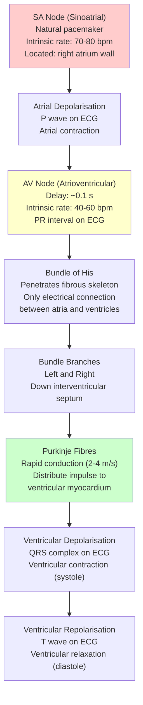
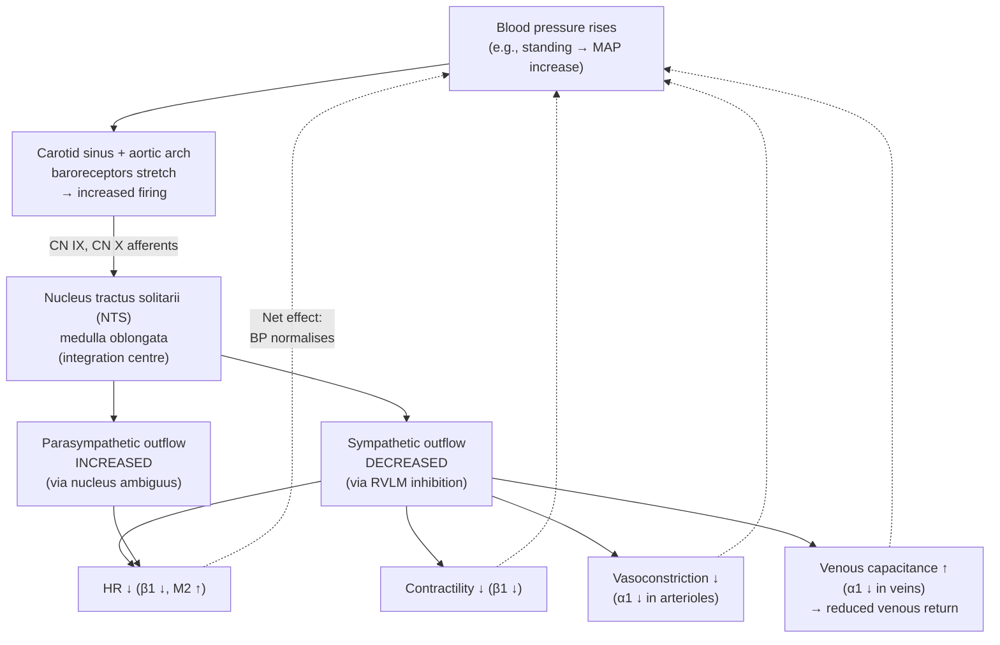
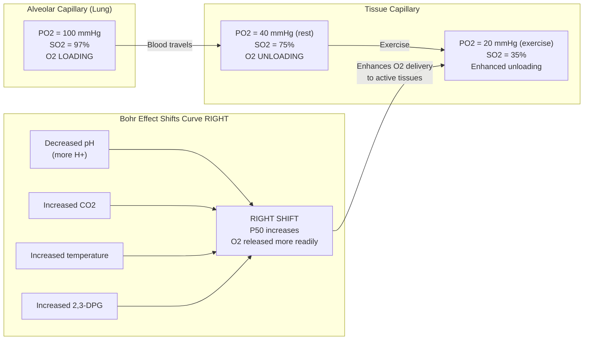
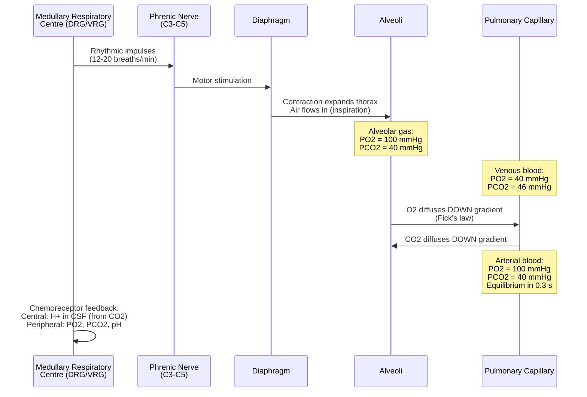
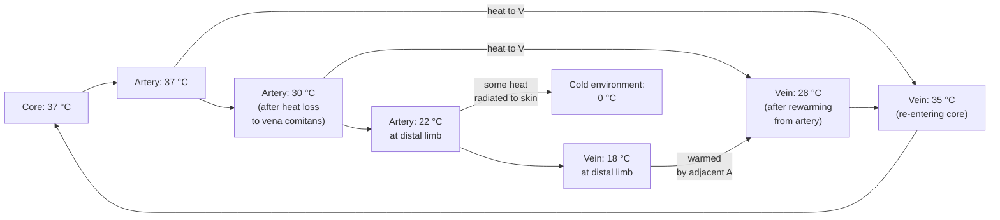

# Circulation, Respiration, and Homeostasis

\label{sec:unit_IX_circulation_respiration_homeostasis}


<!-- chapter-metadata-badge -->
> **Ch 28** · Level 3/3 · 60 min read · 100 min lecture · Prerequisites: \cref{sec:unit_II_membrane_transport}, \cref{sec:unit_III_bioenergetics_and_respiration}

## Learning Objectives

1. Describe the evolutionary progression of cardiovascular systems from open to closed, and from 2-chamber to 4-chamber hearts.
2. Explain the cardiac cycle including electrical conduction, mechanical events, and the ECG.
3. Apply Poiseuille's law to blood flow and explain arteriolar regulation of vascular resistance.
4. Describe oxygen transport by haemoglobin using the Hill equation, including the Bohr and Haldane effects.
5. Explain CO$_2$ transport mechanisms and the chloride shift.
6. Describe pulmonary ventilation mechanics, lung volumes, and spirometry.
7. Apply Fick's law to alveolar gas exchange.
8. Explain respiratory control by medullary centres and chemoreceptors.
9. Describe homeostatic control systems, [**thermoregulation**](#gl:thermoregulation), and fluid balance.

<!-- curriculum-scaffold-start -->
### Study Blueprint

- **Big idea:** Animal transport systems maintain gradients that let cells exchange gases, nutrients, heat, and wastes.
- **Core concepts:** cardiac output, gas exchange, homeostasis, feedback.
- **Framework alignment:** Vision & Change: Structure and function, Systems; AP Biology: Systems Interactions, Energetics; NGSS-style topics: Structure and Function.
- **Model or quantitative lens:** Cardiac-output, diffusion, oxygen-saturation, and feedback calculations.
- **Data skill:** Interpret physiological data from pressure, flow, saturation, or set-point changes.
- **Practice cadence:** Visual Representations, Statistical Tests and Data Analysis, Argumentation.
- **Common misconception to repair:** Homeostasis is dynamic regulation, not an unchanging internal state.
- **Primary lab:** \cref{sec:lab_unit_IX_circulation_respiration_homeostasis}.
- **Question bank:** \cref{sec:q_unit_IX_circulation_respiration_homeostasis}.
- **Transfer task:** Transfer homeostatic reasoning to exercise, altitude, hemorrhage, fever, and shock.
- **Bridge to computation:** `biology.physiology.physiology.oxygen_saturation`.
<!-- curriculum-scaffold-end -->

---

> **Opening Vignette — The Doctor Who Proved the Heart Was a Pump**
> 
> In 1628, William Harvey published *Exercitatio Anatomica de Motu Cordis et Sanguinis* — a slim 72-page monograph that demolished 1,400 years of medical dogma. The [**dominant**](#gl:dominant) Galenic view held that blood was continuously manufactured from food in the liver and consumed by tissues. Harvey's insight was quantitative: he calculated the volume expelled by the heart with each beat (about 60 mL) and multiplied by heart rate. The heart expels roughly 4.3 kg of blood per minute — far more than the body could possibly generate from food. The primarily explanation was that blood circulates, continuously recirculated by the heart. Harvey's argument was revolutionary in method as much as finding: he used mathematical reasoning, vivisection, and comparative anatomy across many species rather than received authority. He was ridiculed widely and lost patients; he died in 1657. Modern cardiology, cardiac surgery, and pharmacology of the cardiovascular system most stand on the foundation he built alone.

## Evolution of Cardiovascular Systems

The cardiovascular system evolved to overcome the limitations of diffusion for O$_2$ and nutrient delivery in large organisms:

**Open circulatory systems** (arthropods, most molluscs): Heart pumps haemolymph into open sinuses (haemocoel). Haemolymph bathes tissues directly. Low pressure, slow flow. Adequate for small ectotherms with low metabolic rates.

**Closed circulatory systems** (annelids, cephalopods, most vertebrates): Blood confined within vessels. Higher pressure enables faster, more directed flow. Allows separate regulation of blood flow to different organs.

**Vertebrate heart evolution:**

| Heart Type | Chambers | Organisms | Key Features |
| ---------- | -------- | --------- | ------------ |
| 2-chamber | 1 atrium + 1 ventricle | Fish | Single circuit: heart to gills to body to heart |
| 3-chamber | 2 atria + 1 ventricle | Amphibians, most reptiles | Double circuit with some mixing in ventricle |
| 3.5-chamber | Partial septum | Crocodilians | Nearly complete ventricular separation |
| 4-chamber | 2 atria + 2 ventricles | Birds, mammals | Complete separation of pulmonary and systemic circuits |

The 4-chamber heart enables complete separation of oxygenated and deoxygenated blood, supporting the high metabolic rates required for endothermy.

---

## Heart Anatomy and the Cardiac Cycle

### Cardiac Conduction System

The heart is a self-exciting organ. Its electrical conduction system ensures coordinated contraction:


<!-- alt: Flowchart showing cardiac conduction system and corresponding ECG waves. The SA node initiates depolarisation, which spreads through the atria (P wave), is delayed at the AV node, then rapidly conducted through the bundle of His and Purkinje fibres to the ventricles (QRS complex). Ventricular repolarisation produces the T wave. -->

*Cardiac conduction system and corresponding ECG waves. The SA node initiates [**depolarisation**](#gl:depolarisation), which spreads through the atria (P wave), is delayed at the AV node, then rapidly conducted through the bundle of His and Purkinje fibres to the ventricles (QRS complex). Ventricular repolarisation produces the T wave.*

**ECG waves and their significance:**
- **P wave:** Atrial depolarisation and contraction
- **PR interval:** Time from atrial depolarisation to ventricular depolarisation (0.12-0.20 s). Prolonged PR = AV block.
- **QRS complex:** Ventricular depolarisation (0.06-0.10 s). Wide QRS = conduction defect or ventricular origin.
- **T wave:** Ventricular repolarisation
- **QT interval:** Total ventricular electrical activity. Prolonged QT = risk of torsade de pointes arrhythmia.

### The Cardiac Cycle

At a heart rate of 70 bpm, one cardiac cycle lasts ~0.8 seconds:

- **Systole** (contraction, ~0.3 s):
  - Isovolumetric contraction: Most valves closed, ventricular pressure rises rapidly
  - Ejection phase: Ventricular pressure exceeds aortic pressure (~80 mmHg), aortic valve opens, blood ejected
  - Peak systolic pressure: ~120 mmHg in left ventricle

- **Diastole** (relaxation, ~0.5 s):
  - Isovolumetric relaxation: Most valves closed, ventricular pressure falls
  - Rapid filling: Ventricular pressure falls below atrial pressure, AV valve opens, blood flows passively (accounts for ~80% of filling)
  - Atrial systole ("atrial kick"): Final ~20% of ventricular filling

**Starling's Law of the Heart (Frank-Starling \citep{starling1914} mechanism):** Ventricular stroke volume increases with end-diastolic volume (preload). Increased venous return stretches ventricular cardiomyocytes, optimising [**actin**](#gl:actin)-myosin overlap and increasing Ca$^{2+}$ sensitivity of troponin C. This intrinsic mechanism ensures that left and right cardiac outputs remain matched.

\begin{equation}
SV \propto EDV \quad \text{(within physiological range)}
\label{eq:circulation_respiration_homeostasis_1}
\end{equation}

> **Clinical Connection:** Heart failure occurs when the Frank-Starling mechanism can no longer compensate for reduced contractility. In systolic heart failure (HFrEF, ejection fraction <40%), the weakened ventricle operates on a depressed Starling curve. Treatments include ACE inhibitors (reduce afterload), beta-blockers (reduce myocardial demand), and SGLT2 inhibitors (reduce preload). The 2024 ESC guidelines emphasise early combination therapy.

---

## Cardiac Output and Blood Pressure

### Cardiac Output

\begin{equation}
CO = HR \times SV
\label{eq:unit_IX_cardiac_output}
\end{equation}

- At rest: $CO = 70\;\text{bpm} \times 70\;\text{mL} \approx 5\;\text{L/min}$
- Maximum exercise: $CO = 200\;\text{bpm} \times 130\;\text{mL} \approx 26\;\text{L/min}$ (elite athletes — up to 35 L/min documented)

**The Frank-Starling mechanism** \citep{starling1914} is the heart's intrinsic capacity to match its output to venous return on a beat-to-beat basis. Within physiological limits, increased end-diastolic volume (preload) stretches ventricular cardiomyocytes, optimising actin-myosin overlap (length-tension relationship) and increasing the Ca$^{2+}$-sensitivity of troponin C. The result is an increased stroke volume *without* any extrinsic neural or hormonal command. Because the right and left hearts are in series, this intrinsic matching is essential — any sustained mismatch would cause pulmonary or systemic congestion. Acutely transfusing fluid or rising from supine to legs-up posture both expand venous return, and the Frank-Starling mechanism translates that into matched increases in both ventricles.

**Regulation of cardiac output:**

- **Sympathetic stimulation** ($\beta_1$ adrenergic receptors): Increases both HR (positive chronotropy via SA node) and SV (positive inotropy via increased Ca$^{2+}$ entry through L-type Ca$^{2+}$ channels and SR Ca$^{2+}$ release)
- **Parasympathetic stimulation** (M$_2$ muscarinic receptors via vagus nerve): Decreases HR primarily (negative chronotropy). Vagal tone dominates at rest, which is why resting HR is ~70 bpm rather than the SA node's intrinsic 100 bpm.
- **Frank-Starling mechanism:** Intrinsic matching of SV to venous return (see above)

### Blood Pressure

\begin{equation}
MAP = DP + \frac{1}{3}PP = DP + \frac{1}{3}(SP - DP)
\label{eq:circulation_respiration_homeostasis_3}
\end{equation}

where MAP = mean arterial pressure, DP = diastolic pressure, SP = systolic pressure, PP = pulse pressure.

Normal: SP/DP = 120/80 mmHg, MAP about 93 mmHg.

\begin{equation}
MAP = CO \times TPR
\label{eq:circulation_respiration_homeostasis_4}
\end{equation}

where TPR = total peripheral resistance. Blood pressure is regulated by:
- Cardiac output (HR, SV, blood volume)
- Total peripheral resistance (arteriolar diameter -- the dominant factor)

### Blood Flow -- Poiseuille's Law

\begin{equation}
Q = \frac{\pi r^4 \Delta P}{8 \eta L}
\label{eq:circulation_respiration_homeostasis_5}
\end{equation}

The **r$^4$ dependence** is the most physiologically critical feature: halving vessel radius reduces flow by 16-fold. Arterioles (radius ~50-100 um) serve as the primary resistance vessels.

**Regulation of arteriolar tone:**
- **Local autoregulation:**
  - Myogenic response: Smooth muscle contracts in response to stretch (maintains constant flow despite pressure changes)
  - Metabolic: CO$_2$, H$^+$, K$^+$, adenosine from active tissues cause vasodilation
  - Endothelial: Shear stress stimulates NO (nitric oxide) production via eNOS. NO diffuses to smooth muscle, activates guanylyl cyclase to cGMP to PKG to smooth muscle relaxation.
- **Neural (sympathetic):** Noradrenaline acts on $\alpha_1$ receptors causing vasoconstriction in most vascular beds. Exceptions: skeletal muscle during exercise (cholinergic vasodilation and metabolic override).
- **Hormonal:** Angiotensin II (potent vasoconstrictor), ANP (vasodilator), ADH/vasopressin (vasoconstrictor at high doses).

**Concept Check:** During exercise, cardiac output increases from 5 to 25 L/min, but blood pressure increases primarily modestly (e.g., 120/80 to 160/80). How is this possible? (Consider what happens to TPR.)

### Worked Example: Cardiac Reserve

A healthy 40-year-old has resting cardiac output of 5 L/min (HR 70 bpm × SV 70 mL). The **age-predicted maximum heart rate** is given by:

\begin{equation}
HR_{\max} \approx 220 - \text{age (years)}
\label{eq:unit_IX_hrmax}
\end{equation}

(The Tanaka 2001 formula $HR_{\max} = 208 - 0.7 \cdot \text{age}$ is more accurate for older adults and is now preferred in cardiology.)

For our 40-year-old, $HR_{\max} \approx 180$ bpm. With exercise-induced sympathetic activation increasing stroke volume to ~120 mL via the **Frank-Starling mechanism** \citep{starling1914} and ↑contractility (β$_1$):

$$CO_{\max} = 180 \times 120 = 21{,}600\;\text{mL/min} \approx 21.6\;\text{L/min} \label{eq:unit_IX_circulation_respiration_homeostasis_item_1}$$

This represents a **~4.3-fold increase** over rest — typical for an untrained adult. Endurance training increases the SV reserve more than the HR reserve, allowing elite athletes to reach 30–35 L/min cardiac output despite *lower* maximum heart rates than untrained subjects.

**Cardiac reserve $= CO_{\max} - CO_{\text{rest}} \approx 16.6\;\text{L/min}$** in this example. Cardiac reserve is the master variable that limits exercise tolerance: heart-failure patients with reduced ejection fraction may have a reserve of 3–5 L/min and become symptomatic with mild activity.

**Concept Check (Analyze) — Frank-Starling, preload, and the operating point.** Within physiological limits, increased end-diastolic volume (EDV) stretches ventricular cardiomyocytes, optimising actin-myosin overlap and titin-restored geometry, and raises Ca$^{2+}$ sensitivity of troponin C; stroke volume (SV) consequently rises *intrinsically* without neural or hormonal input. A typical Starling curve gives SV $= 70$ mL at EDV $= 120$ mL and SV $= 90$ mL at EDV $= 150$ mL. (a) Compute the slope $\Delta SV / \Delta EDV$ in this range and explain what this slope physically represents (the *contractility-independent* component of the response). (b) An acute haemorrhage drops circulating volume by 1 L (about 20%); predict the new operating point on the Starling curve (direction and approximate magnitude of EDV, SV, and CO change) before baroreflex compensation. (c) Sympathetic activation raises contractility (positive inotropy), which shifts the entire Starling curve upward — at any given EDV, SV is larger. Diagram the haemorrhage + sympathetic response on a single Starling plot, and predict why patients on $\beta$-blockers may decompensate faster from acute blood loss than untreated patients.


### Baroreceptor Reflex — Beat-to-Beat Blood Pressure Control

The arterial **baroreceptor reflex** is the body's primary short-term blood pressure stabiliser, operating on a beat-to-beat timescale (seconds). Stretch-sensitive mechanoreceptors in the **carotid sinus** (innervated by the glossopharyngeal nerve, CN IX) and **aortic arch** (innervated by the vagus, CN X) increase their firing rate when arterial wall stretch increases.


<!-- alt: Flowchart showing baroreceptor reflex Pressure rise stretches arterial baroreceptors, increasing firing to the NTS in the medulla. The NTS inhibits the rostral ventrolateral medulla (RVLM, sympathetic premotor neurons) and excites the nucleus ambiguus (parasympathetic). Reduced sympathetic and increased parasympathetic outflow lower HR, contractility, and TPR — restoring normal MAP within seconds. -->

*Baroreceptor reflex Pressure rise stretches arterial baroreceptors, increasing firing to the NTS in the medulla. The NTS inhibits the rostral ventrolateral medulla (RVLM, sympathetic premotor neurons) and excites the nucleus ambiguus (parasympathetic). Reduced sympathetic and increased parasympathetic outflow lower HR, contractility, and TPR — restoring normal MAP within seconds.*

The reflex is **bidirectional**: low MAP unloads baroreceptors → reduced firing → disinhibition of sympathetic outflow → tachycardia, vasoconstriction, increased contractility. **Orthostatic hypotension** results from impaired baroreflex (autonomic neuropathy in diabetes, ageing, or pure autonomic failure).

**Baroreceptor adaptation:** With sustained hypertension over hours to days, baroreceptors **reset** to the elevated pressure — they fire less for a given pressure than in a normotensive person. This is why chronic hypertension is not corrected by the reflex: the system has adapted to defend the new (elevated) set point. Long-term blood pressure control requires the renin-angiotensin-aldosterone system (RAAS) and renal pressure-natriuresis, not the baroreflex.

### RAAS Cascade — Long-term Blood Pressure and Volume Control

The **renin-angiotensin-aldosterone system** is the dominant long-term BP regulator, operating over hours to days through changes in vascular tone, sodium retention, and blood volume.

\begin{equation}
\text{Angiotensinogen} \xrightarrow{\text{renin}} \text{Angiotensin I} \xrightarrow{\text{ACE}} \text{Angiotensin II}
\label{eq:circulation_respiration_homeostasis_raas}
\end{equation}

**Trigger signals for renin release** from juxtaglomerular cells in afferent arterioles:
1. **Reduced renal perfusion pressure** (sensed by JG cells as stretch ↓)
2. **Reduced NaCl delivery** to the macula densa (sensed in distal tubule via NKCC2)
3. **Sympathetic activation** (β$_1$ adrenergic stimulation of JG cells)

**Angiotensin II effects (multi-organ):**
- **Vasoconstriction** at AT$_1$ receptors (potent direct effect on arterioles → ↑TPR → ↑MAP)
- **Aldosterone release** from adrenal zona glomerulosa → renal Na$^+$ reabsorption (ENaC) and K$^+$ secretion → ↑blood volume
- **ADH release** from posterior pituitary → renal water reabsorption (aquaporin-2) → ↑blood volume
- **Sympathetic facilitation** (central and peripheral)
- **Thirst** (subfornical organ)
- **Direct renal effects:** preferential constriction of efferent arteriole (preserves GFR during hypoperfusion); proximal tubule Na$^+$ reabsorption

> **Clinical Connection — RAAS pharmacology:** ACE inhibitors (lisinopril, enalapril) block conversion of Ang I to Ang II. ARBs (losartan, valsartan) block AT$_1$ receptors. Direct renin inhibitors (aliskiren) block at the top. Aldosterone antagonists (spironolactone, eplerenone) block the mineralocorticoid receptor. These four classes are foundational for hypertension, heart failure (HFrEF), diabetic nephropathy, and post-MI ventricular remodelling. The 2024 PARADIGM-HF trials established **ARNI (angiotensin receptor-neprilysin inhibitor; sacubitril/valsartan)** as superior to ACE inhibition alone in HFrEF — neprilysin inhibition prolongs natriuretic peptides (ANP/BNP) while ARB blocks AT$_1$.

## Digestive, Nutritional, Renal, and Excretory Integration

Animal homeostasis also depends on how the gut, liver, kidney, and excretory surfaces couple intake to internal composition. Digestion is not just "food breakdown"; it is staged chemical and mechanical processing: stomach acid denatures proteins and limits microbes, pancreatic enzymes and bile complete macromolecule hydrolysis in the small intestine, and villi plus microvilli expand absorptive surface for monosaccharides, amino acids, lipids, vitamins, and ions \citep{niddk2024digestivesystem}. Nutritional status then becomes a systems variable. A high-protein meal changes hepatic urea production and renal nitrogen excretion; a low-salt or dehydrating environment recruits RAAS and ADH; and malnutrition weakens immune barriers, wound repair, growth, and reproductive function \citep{fao2025sofi}.

The vertebrate kidney stabilises plasma volume, osmolality, pH, electrolytes, and nitrogen balance by filtering plasma, reclaiming useful solutes, secreting selected wastes, and concentrating urine \citep{niddk2024kidneys}. Filtration at the glomerulus is pressure-driven; proximal tubules reclaim most filtered Na$^+$, glucose, amino acids, and bicarbonate; the loop of Henle builds the corticomedullary osmotic gradient; distal nephron segments fine-tune Na$^+$, K$^+$, acid-base, and water balance under aldosterone and ADH. Across animals, excretory designs solve the same problem with different constraints: aquatic fishes can excrete ammonia directly, mammals convert nitrogen to urea, and birds/reptiles conserve water by excreting uric acid. The unifying claim is comparative and mechanistic: excretion trades ATP, water, and toxicity risk against the environment an organism inhabits.

---

## Capillary Fluid Exchange and the Lymphatic System

### Starling Forces

At the capillary level, O$_2$ and nutrients are delivered to tissues while CO$_2$ and waste products are removed. Fluid exchange across the capillary wall is governed by the **Starling forces** (Ernest Starling, 1896):

\begin{equation}
J_v = L_p \left[(P_c - P_{if}) - \sigma(\pi_c - \pi_{if})\right]
\label{eq:circulation_respiration_homeostasis_6}
\end{equation}

where:
- $J_v$ = net fluid flux (positive = filtration out of capillary)
- $L_p$ = hydraulic conductivity of the capillary wall
- $P_c$ = capillary hydrostatic pressure
- $P_{if}$ = interstitial fluid hydrostatic pressure
- σ = reflection coefficient (0 = fully permeable to [**protein**](#gl:protein); 1 = impermeable)
- $\pi_c$ = capillary oncotic pressure (colloid osmotic pressure, from plasma proteins, mainly albumin)
- $\pi_{if}$ = interstitial oncotic pressure

**Typical values at the arteriolar end of a skeletal muscle capillary:**

| Force | Value (mmHg) | Direction |
| ----- | ------------- | --------- |
| Capillary hydrostatic pressure ($P_c$) | 35 | Out (filtration) |
| Interstitial hydrostatic pressure ($P_{if}$) | $-3$ | Out (filtration) |
| Capillary oncotic pressure ($\pi_c$) | 26 | In (reabsorption) |
| Interstitial oncotic pressure ($\pi_{if}$) | 1 | Out (filtration) |

**Net filtration pressure (arteriolar end):**

\begin{equation}
\text{NFP} = (P_c + \pi_{if}) - (\pi_c + P_{if}) = (35 + 1) - (26 + (-3)) = 36 - 23 = +13\;\text{mmHg}
\label{eq:circulation_respiration_homeostasis_7}
\end{equation}

Positive NFP: fluid filters **out** of capillary at the arteriolar end.

**At the venular end** ($P_c$ drops to ~15 mmHg due to resistance loss):

\begin{equation}
\text{NFP} = (15 + 1) - (26 + (-3)) = 16 - 23 = -7\;\text{mmHg}
\label{eq:circulation_respiration_homeostasis_8}
\end{equation}

Negative NFP: fluid is **reabsorbed** into capillary at the venular end.

**Net result:** ~90% of filtered fluid is reabsorbed at the venular end. The remaining ~10% (about 2–3 L/day) must be returned via the **lymphatic system**.

### The Lymphatic System

The lymphatic system drains excess interstitial fluid and returned plasma proteins that leak out of capillaries:

- **Blind-ended lymphatic capillaries** in tissues are highly permeable; interstitial fluid + proteins enter by bulk flow
- Lymph flows through lymph vessels (propelled by skeletal muscle compression and one-way valves) into lymph nodes
- Lymph nodes filter lymph, removing pathogens and debris, and add lymphocytes
- Right lymphatic duct (drains right chest, arm, head) and thoracic duct (drains everything else) return lymph to venous circulation (subclavian veins)
- Flow: ~2–3 L/day; lymph protein concentration ~2 g/dL (compared with plasma ~7 g/dL)

> **Clinical Connection:** **Lymphoedema** occurs when lymphatic return is impaired, causing protein-rich fluid to accumulate in the interstitium. Causes: filariasis (*Wuchereria bancrofti*, the leading worldwide cause), surgical lymph node dissection (common after breast cancer surgery), or radiation damage. Unlike simple oedema (protein-poor), lymphoedema is high-protein, making it prone to skin fibrosis, infection (cellulitis), and functional impairment. **Pitting oedema** (non-lymphoedema) results from elevated $P_c$ (heart failure, portal hypertension) or reduced $\pi_c$ (hypoalbuminaemia from cirrhosis or nephrotic syndrome).

## Worked Example: Hypoalbuminaemia and Net Filtration Pressure

A patient has serum albumin of 2 g/dL (normal 4 g/dL), reducing $\pi_c$ from 26 mmHg to 13 mmHg (oncotic pressure $\propto$ protein concentration). At the arteriolar end ($P_c$ = 35 mmHg):

\begin{equation}
\text{NFP} = (35 + 1) - (13 + (-3)) = 36 - 10 = +26\;\text{mmHg}
\label{eq:circulation_respiration_homeostasis_9}
\end{equation}

And at the venular end ($P_c$ = 15 mmHg):

\begin{equation}
\text{NFP} = (15 + 1) - (13 + (-3)) = 16 - 10 = +6\;\text{mmHg}
\label{eq:circulation_respiration_homeostasis_10}
\end{equation}

Both ends now show net filtration — fluid cannot be reabsorbed, leading to progressive oedema. The lymphatics are overwhelmed. This explains the **anasarca** (generalised oedema) seen in severe hypoalbuminaemia from nephrotic syndrome or liver failure.

**Concept Check:** Using the Starling equation with arteriolar $P_c = 35$ mmHg, $P_{if} = -3$ mmHg, $\pi_{if} = 1$ mmHg, predict the sign of the net filtration pressure when plasma albumin halves ($\pi_c$: 26 \to 13 mmHg), and explain why nephrotic-syndrome oedema arises even though capillary hydrostatic pressure is unchanged. (Hint: compute NFP at both the arteriolar and venular ends before and after the $\pi_c$ fall.)

---

## Oxygen Transport


\begin{figure}[htbp]
\centering
\includegraphics[width=0.85\textwidth]{../figures/oxygen_dissociation_curve.png}
\caption{Oxygen--haemoglobin dissociation curves showing percent saturation versus $p\mathrm{O}_2$ for normal adult haemoglobin, a right-shifted fever/exercise condition, and a left-shifted fetal-haemoglobin condition.}
\label{fig:unit_IX_oxygen_dissociation}
\end{figure}
<!-- alt: Three sigmoidal haemoglobin saturation curves plotted against oxygen partial pressure. The fever/exercise curve is shifted right, the fetal haemoglobin curve is shifted left, and vertical guides mark typical tissue and alveolar oxygen pressures. -->


### Haemoglobin Structure

Haemoglobin (Hb) is an $\alpha_2\beta_2$ tetramer. Each subunit contains a **haeme** group (iron-porphyrin; Fe$^{2+}$) that binds one O$_2$. Oxygen-carrying capacity: 1.34 mL O$_2$ per gram Hb; typical Hb concentration: 150 g/L blood. Total: ~201 mL O$_2$/L blood bound to Hb. Plasma dissolved O$_2$: 0.003 $\times$ PO$_2$ (mL/L/mmHg), giving about 0.3 mL/L at PO$_2$ = 100 mmHg. Hb carries ~670$\times$ more O$_2$ than plasma alone.

### O$_2$-Hb Dissociation Curve and the Hill Equation


<!-- alt: Flowchart showing oxygen delivery from lung to tissue and the Bohr effect. In the lungs (high PO_2), haemoglobin loads O_2 to 97% saturation. In tissues (lower PO_2), O_2 is released. The Bohr effect rightward shift of the dissociation curve in metabolically active tissues (low pH, high CO_2, high temperature) enhances O_2 delivery where it is most needed. -->

*Oxygen delivery from lung to tissue and the Bohr effect. In the lungs (high PO$_2$), haemoglobin loads O$_2$ to 97% saturation. In tissues (lower PO$_2$), O$_2$ is released. The Bohr effect rightward shift of the dissociation curve in metabolically active tissues (low [**pH**](#gl:ph), high CO$_2$, high temperature) enhances O$_2$ delivery where it is most needed.*

Hb-O$_2$ binding is **cooperative** (T-state to R-state conformational switch). The resulting sigmoidal binding curve, together with physiological affinity shifts (\cref{fig:unit_IX_oxygen_dissociation}), follows the Hill equation:

\begin{equation}
SO_2 = \frac{(PO_2 / P_{50})^n}{1 + (PO_2 / P_{50})^n}
\label{eq:circulation_respiration_homeostasis_11}
\end{equation}

where **P$_{50}$** = PO$_2$ at 50% saturation (about 26 mmHg for human HbA at 37 degrees C, pH 7.4) and **n** is about 2.7 (Hill coefficient; n = 1 would be non-cooperative; n = 4 would be perfectly cooperative for a tetramer).

**Bohr effect:** The curve shifts rightward (P$_{50}$ increases, affinity decreases) with:
- Increased [H$^+$] (lower pH): Protons bind to histidine residues on Hb, stabilising T-state
- Increased CO$_2$: Forms carbaminohaemoglobin and generates H$^+$
- Increased temperature: Weakens Hb-O$_2$ bond
- Increased 2,3-DPG (2,3-diphosphoglycerate): Binds between β chains, stabilising T-state

**Physiological significance:** In metabolically active tissues (low pH, high CO$_2$, high temperature), Hb releases more O$_2$ exactly where it is needed.

## Worked Example: 28.Z — Bohr Effect and 2,3-BPG in Exercise

A trained cyclist's vastus lateralis at maximal exercise has tissue $P\mathrm{O}_2 = 18$ mmHg, pH = 7.20 (lactic acidosis), and temperature = 39 °C. At rest, the same muscle has $P\mathrm{O}_2 = 40$ mmHg, pH = 7.40, and 37 °C. Estimate the resulting **shift in P$_{50}$** and the resulting **fractional change in O$_2$ unloading per cycle of blood**.

**Step 1.** Quantify the rightward shift in P$_{50}$ from exercise conditions. Empirical relations (Severinghaus correction):

$$\Delta \log P_{50} = -0.48(\Delta \text{pH}) + 0.024(\Delta T) + 0.061 \log\left(\frac{[\text{2,3-BPG}]}{4.6\;\text{mM}}\right) \label{eq:unit_IX_circulation_respiration_homeostasis_item_2}$$


For pH change 7.40 → 7.20 (ΔpH = −0.20) and $T$ change 37 → 39 °C ($\Delta T$ = +2):

$$\Delta \log P_{50} = -0.48(-0.20) + 0.024(2) = 0.096 + 0.048 = 0.144 \label{eq:unit_IX_circulation_respiration_homeostasis_item_3}$$


$$P_{50}^{\text{exercise}} = P_{50}^{\text{rest}} \times 10^{0.144} = 26 \times 1.39 \approx 36\;\text{mmHg} \label{eq:unit_IX_circulation_respiration_homeostasis_item_4}$$


**Step 2.** Compute saturation at tissue O$_2$ tension under each condition using Hill ($n = 2.7$):

At rest (P$_{50}$ = 26 mmHg, $P\mathrm{O}_2 = 40$):
$$SO_2 = \frac{(40/26)^{2.7}}{1 + (40/26)^{2.7}} = \frac{3.32}{4.32} \approx 0.77 \label{eq:unit_IX_circulation_respiration_homeostasis_item_5}$$


At exercise (P$_{50}$ = 36 mmHg, $P\mathrm{O}_2 = 18$):
$$SO_2 = \frac{(18/36)^{2.7}}{1 + (18/36)^{2.7}} = \frac{0.154}{1.154} \approx 0.13 \label{eq:unit_IX_circulation_respiration_homeostasis_item_6}$$


**Step 3.** Compare arterial-to-venous O$_2$ unloading. Arterial saturation in both cases ≈ 0.97 (lung Bohr/Haldane effect already accounted for there). Then:

- Rest extraction: $\Delta SO_2 = 0.97 - 0.77 = 0.20$ (20% of bound O$_2$ released)
- Exercise extraction: $\Delta SO_2 = 0.97 - 0.13 = 0.84$ (84% of bound O$_2$ released)

**Result.** Exercise increases per-pass O$_2$ extraction more than 4-fold. Combined with ~5-fold increase in cardiac output, total O$_2$ delivery to working muscle rises ~20-fold — fully accounting for the increased VO$_2$ during maximal aerobic exercise.

**2,3-BPG adaptation.** Chronic hypoxia (high altitude, anaemia, chronic lung disease) elevates RBC 2,3-BPG within hours, further right-shifting the curve to enhance peripheral O$_2$ delivery. Stored bank blood (>2 weeks) loses 2,3-BPG → left-shifted curve → poor O$_2$ delivery despite normal Hb concentration.

**Haldane effect:** Deoxygenated Hb binds CO$_2$ and H$^+$ more readily than oxygenated Hb. In tissues, O$_2$ release promotes CO$_2$ and H$^+$ binding. In lungs, O$_2$ loading promotes CO$_2$ release. This is quantitatively as important as the Bohr effect for gas exchange.

**Special haemoglobins:**
- **Foetal Hb (HbF, $\alpha_2\gamma_2$):** P$_{50}$ about 19 mmHg; higher O$_2$ affinity than adult HbA because γ chains bind 2,3-DPG poorly. Foetus extracts O$_2$ from maternal blood across placenta.
- **Myoglobin:** Monomeric (no cooperativity); P$_{50}$ about 2 mmHg; O$_2$ storage in muscle; delivers O$_2$ during contraction when blood flow is compressed.
- **HbS (sickle cell):** Glu6Val [**mutation**](#gl:mutation) in β-globin. HbS polymerises when deoxygenated, distorting RBCs into sickle shapes. [**Heterozygous**](#gl:heterozygous) advantage: resistance to *Plasmodium falciparum* malaria.

### CO$_2$ Transport

CO$_2$ is transported from tissues to lungs by three mechanisms:
- **Dissolved CO$_2$:** 8% (physically dissolved in plasma; proportional to PCO$_2$)
- **Carbaminohaemoglobin:** 27% (CO$_2$ binds to terminal amino groups of Hb)
- **Bicarbonate (HCO$_3^-$):** 65% (the dominant mechanism)

\begin{equation}
\mathrm{CO}_2 + \mathrm{H}_2\mathrm{O} \rightleftharpoons
\mathrm{H}_2\mathrm{CO}_3 \rightarrow \mathrm{H}^+ + \mathrm{HCO}_3^-
\label{eq:circulation_respiration_homeostasis_12}
\end{equation}

Carbonic anhydrase catalyses the rapid reversible hydration step. **Chloride shift:** As HCO$_3^-$ is produced inside RBCs, it is exported via the Band 3 (AE1) Cl$^-$/HCO$_3^-$ exchanger. Cl$^-$ enters the RBC in exchange, maintaining electroneutrality. The process reverses in the lungs.

> **Clinical Connection:** Carbon monoxide (CO) poisoning occurs because CO binds haemoglobin with 200-250x higher affinity than O$_2$, forming carboxyhaemoglobin (COHb). Even low CO levels (e.g., 10% COHb) shift the O$_2$-Hb curve leftward (remaining Hb holds O$_2$ more tightly), reducing O$_2$ delivery to tissues. Treatment: 100% O$_2$ or hyperbaric O$_2$ to competitively displace CO.

**Concept Check:** Exercising muscle is hotter, more acidic, and higher in CO$_2$ and 2,3-BPG than resting muscle. State whether each change shifts the O$_2$-Hb dissociation curve left or right, and explain why a curve that shifts in the *opposite* direction (e.g., in stored bank blood depleted of 2,3-BPG) impairs tissue O$_2$ delivery even when haemoglobin concentration and arterial saturation are normal. (Hint: track what each shift does to $P_{50}$ and to the O$_2$ released between arterial and tissue $P\mathrm{O}_2$.)

---

## Respiratory System and Ventilation

### Anatomy

**Conducting zone** (dead space, ~150 mL): Nasal passages (warm, humidify, filter) to pharynx to larynx to trachea (C-shaped cartilage rings) to bronchi (right and left mainstem) to bronchioles. Bronchioles have smooth muscle (regulated by autonomic NS: sympathetic $\beta_2$ = bronchodilation; parasympathetic M$_3$ = bronchoconstriction).

**Respiratory zone:** Respiratory bronchioles to alveolar ducts to alveolar sacs. ~300 million alveoli in adult human lungs. Total alveolar surface area: ~70 m$^2$ (half a tennis court). Alveolar wall thickness: ~0.5 um. Type I pneumocytes (gas exchange, 95% of surface area). Type II pneumocytes (produce [**surfactant**](#gl:surfactant), 5% of surface area; also stem cells that regenerate Type I cells).

### Lung Mechanics

**Inspiration (active at rest):** Diaphragm + external intercostals contract. Thorax volume increases. Intrapleural pressure decreases (from $-5$ to $-8$ cmH$_2$O). Alveolar pressure falls ~1 cmH$_2$O below atmospheric. Air flows in.

**Expiration (passive at rest):** Elastic recoil of lung tissue and chest wall. Alveolar pressure rises ~1 cmH$_2$O above atmospheric. Air flows out.

### Pulmonary Surfactant — Laplace's Law and Alveolar Stability

For a spherical air-liquid interface, Laplace's law gives the collapse pressure due to surface tension:

\begin{equation}
P = \frac{2\gamma}{r}
\label{eq:unit_IX_laplace}
\end{equation}

where γ is the surface tension (N/m) and $r$ is the alveolar radius. Using $T$ as the symbol for surface tension is also common in textbooks; both conventions appear below.

where $T$ = surface tension (N/m) and $r$ = radius. With the surface tension of water (~70 mN/m), a 50 μm alveolus would collapse at $P \approx 2(0.07)/(2.5 \times 10^{-5}) = 5{,}600$ Pa = 56 cmH$_2$O — far exceeding inspiratory pressure. Without surfactant, small alveoli (r$_{\min}$ during expiration) would empty into larger ones, producing massive atelectasis.

**Surfactant** is a complex of phospholipids (~80%, dominated by **DPPC, dipalmitoylphosphatidylcholine**) and four surfactant-specific proteins, secreted by **Type II pneumocytes** as lamellar bodies that unwind into a monolayer at the air-liquid interface.

| Protein | Function |
| ------- | -------- |
| **SP-A** | Hydrophilic; innate immunity (opsonin for pathogens); regulates surfactant turnover; mutations rare |
| **SP-B** | Hydrophobic; essential for lamellar body biogenesis and surface film formation. **SP-B deficiency is uniformly lethal in newborns** (severe RDS unresponsive to therapy) |
| **SP-C** | Hydrophobic; stabilises surface film during compression-expansion. Mutations cause familial interstitial lung disease |
| **SP-D** | Hydrophilic; innate immunity (similar role to SP-A); collectin family |

**Surfactant action.** DPPC molecules align at the air-liquid interface, displacing water molecules and reducing surface tension from ~70 mN/m to ~5–10 mN/m at full lung volume — and to **near zero** during expiration when alveoli are smallest and the surfactant film is most compressed. This **non-linear** behaviour (lower tension at smaller radius) is critical: it inverts the destabilising effect of Laplace's law, making small alveoli **stable** rather than collapse-prone.

**Surfactant turnover** is rapid (~10 h half-life). Type II cells synthesise, secrete, internalise, and recycle surfactant continuously. Deep breaths (sighs) extend and refresh the surface film; absence of sighs (e.g., during anaesthesia, prolonged shallow breathing) leads to atelectasis.

> **Clinical Connection:** Premature infants (<34 weeks gestation) lack mature Type II pneumocytes and adequate surfactant, leading to **neonatal respiratory distress syndrome (NRDS / hyaline membrane disease)** — the leading cause of death in premature infants before surfactant therapy. Treatment: intratracheal administration of exogenous surfactant (beractant from bovine lung; poractant alfa from porcine lung). **Antenatal corticosteroids** (betamethasone) given to mothers in preterm labour 24–48 h before delivery accelerate fetal Type II cell maturation and reduce NRDS incidence by ~50% — one of the most cost-effective interventions in modern medicine. **Adult ARDS** has surfactant inactivation by inflammatory exudates as a contributing mechanism; replacement therapy in adults has been less successful than in neonates.

### Lung Volumes and Spirometry

| Volume/Capacity | Definition | Typical Value |
| --------------- | ---------- | ------------- |
| Tidal volume (TV) | Normal breath | 500 mL |
| Inspiratory reserve (IRV) | Maximum additional inspiration | 3,000 mL |
| Expiratory reserve (ERV) | Maximum additional expiration | 1,200 mL |
| Residual volume (RV) | Air remaining after maximal expiration | 1,200 mL |
| Vital capacity (VC) | TV + IRV + ERV | 4,700 mL |
| Total lung capacity (TLC) | VC + RV | 5,900 mL |
| Functional residual capacity (FRC) | ERV + RV | 2,400 mL |

**Spirometry and pulmonary function** \citep{graham2019spirometry}:
- **FEV$_1$:** Volume expired in first second of forced expiration
- **FVC:** Total volume during forced expiration
- **FEV$_1$/FVC ratio:**
  - Normal: above the age-dependent lower limit of normal; a fixed at least 70% threshold is a useful screening simplification but can over-call obstruction in older adults and under-call it in younger adults.
  - **Obstructive disease** (COPD, asthma): reduced FEV$_1$/FVC (air trapping, increased resistance)
  - **Restrictive disease** (pulmonary fibrosis): preserved or high FEV$_1$/FVC with reduced FVC/TLC (stiff lungs, reduced compliance)

---

## Gas Exchange


<!-- alt: Sequence diagram showing respiratory control and gas exchange. The medullary respiratory centre generates the breathing rhythm. Chemoreceptors (central and peripheral) provide feedback to adjust ventilation rate. Gas exchange at the alveolar-capillary interface follows Fick's law, with equilibration occurring within 0.3 seconds. -->

*Respiratory control and gas exchange. The medullary respiratory centre generates the breathing rhythm. Chemoreceptors (central and peripheral) provide feedback to adjust ventilation rate. Gas exchange at the alveolar-capillary interface follows Fick's law, with equilibration occurring within 0.3 seconds.*

**Fick's law of diffusion for gas exchange:**

\begin{equation}
\dot{V}_{gas} = \frac{D \cdot A \cdot \Delta P}{T}
\label{eq:circulation_respiration_homeostasis_13}
\end{equation}

where D = diffusion coefficient (solubility/molecular weight), A = alveolar surface area (~70 m$^2$), $\Delta P$ = partial pressure difference, T = barrier thickness (~0.5 um).

CO$_2$ diffuses 20x faster than O$_2$ (despite similar molecular weight) because CO$_2$ is much more soluble in aqueous tissue.

## Worked Example: Alveolar Oxygen Diffusion

Fick's differential form $\dot{V}_{gas} = D \cdot A \cdot \Delta P / T$ describes flux per unit area of a uniform membrane. For the whole lung, surface area is recruited regionally and barrier thickness varies, so clinicians use the lumped **diffusing capacity** $D_L$, which integrates the geometric and biochemical factors (Krogh's diffusion constant, effective area, and effective thickness) into a single empirically measured coefficient:

\begin{equation}
\dot{V}_{O_2} = D_{L,O_2} \cdot \overline{\Delta P}_{O_2}
\label{eq:circulation_respiration_homeostasis_14}
\end{equation}

Typical values in a healthy adult at rest:
- $D_{L,O_2} \approx 25$ mL O$_2$/(min$\cdot$mmHg). This is computed from the routinely measured $D_{L,CO}$ via the Krogh factor (~1.23), reflecting that O$_2$ and CO have similar membrane permeability but differ in their reaction kinetics with haemoglobin.
- $\overline{\Delta P}_{O_2} \approx 10$ mmHg — the *time-averaged* alveolar-to-end-capillary gradient. The *initial* gradient is ~60 mmHg (alveolar $PO_2$ 100 mmHg − mixed-venous $PO_2$ 40 mmHg), but pulmonary capillary blood equilibrates with alveolar gas within ~0.25 s of a ~0.75 s transit time, so the *mean* driving gradient along the capillary is much smaller than the initial value.

\begin{equation}
\dot{V}_{O_2} \approx 25 \times 10 \approx 250\;\text{mL O}_2/\text{min}
\label{eq:circulation_respiration_homeostasis_15}
\end{equation}

This matches whole-body resting O$_2$ consumption (~250 mL/min). During maximal exercise, capillary recruitment and de-recruitment-reversal raise $D_{L,O_2}$ to ~50–70 mL/(min$\cdot$mmHg), and tissues extract more O$_2$ (lowering mixed-venous $PO_2$ toward ~20 mmHg) so the mean gradient widens — pushing $\dot{V}_{O_2}$ above 3 L/min in trained athletes. In elite athletes near $\dot{V}_{O_2}$max, end-capillary equilibration becomes incomplete and diffusion limitation begins to constrain performance — the structural reason published $D_{L,O_2}$ values correlate with $\dot{V}_{O_2}$max.

> **Clinical Connection:** In **diffusion-limited** lung disease (pulmonary fibrosis, interstitial lung disease), the alveolar-capillary membrane is thickened (increased $T$) and the surface area is reduced. Fick's law predicts reduced O$_2$ transfer: patients become hypoxaemic especially during exercise when transit time through capillaries is shortened and the blood cannot equilibrate with alveolar O$_2$.

### Respiratory Control

**Central pattern generator:** Medullary respiratory centres generate the basic breathing rhythm:
- **Dorsal respiratory group (DRG):** Primarily inspiratory [**neuron**](#gl:neuron)s; drives diaphragm via phrenic nerve
- **Ventral respiratory group (VRG):** Active during forced breathing; contains both inspiratory and expiratory neurons

**Pontine centres:**
- **Pneumotaxic centre:** Limits inspiration duration; increases respiratory rate
- **Apneustic centre:** Promotes prolonged inspiration (normally inhibited by pneumotaxic centre)

**Chemoreceptors:**
- **Central chemoreceptors** (ventral medullary surface): Respond to H$^+$ in CSF (which reflects arterial PCO$_2$ because CO$_2$ freely crosses the blood-brain barrier and is converted to H$^+$ by carbonic anhydrase). This is the **primary driver** of normal ventilation.
- **Peripheral chemoreceptors** (carotid bodies at carotid bifurcation; aortic bodies on aortic arch): Respond to decreased PO$_2$ (<60 mmHg primarily), increased PCO$_2$, and decreased pH. The carotid bodies are the primary sensors of arterial PO$_2$.

**Concept Check:** In chronic COPD, patients may retain CO$_2$ chronically (hypercapnia). Over time, central chemoreceptors reset to the elevated CO$_2$ level. What becomes the primary stimulus for breathing in these patients, and why is high-flow oxygen potentially dangerous?

**Concept Check (Evaluate) — Chemoreceptor hierarchy and the COPD oxygen paradox.** In a healthy adult, central chemoreceptors on the ventral medullary surface dominate the ventilatory drive: they sense CSF [H$^+$] (which tracks arterial $P_{\text{CO}_2}$ because CO$_2$ freely crosses the BBB and is hydrated by carbonic anhydrase). Peripheral chemoreceptors (carotid and aortic bodies) provide a secondary, $P_{\text{O}_2}$-weighted drive that activates strongly below $P_{\text{O}_2} \approx 60$ mmHg. (a) Lay out the normal hierarchy quantitatively: at $P_{a\text{CO}_2} = 40$ mmHg and $P_{a\text{O}_2} = 95$ mmHg, what fraction of total minute ventilation is driven by the central vs peripheral pathway? (b) In chronic COPD with stable $P_{a\text{CO}_2} = 60$ mmHg, the kidney compensates by retaining bicarbonate so CSF pH normalises over weeks; central drive is therefore blunted. Evaluate why peripheral hypoxic drive becomes the dominant input, and predict the ventilatory response to administering high-flow (e.g., 60%) O$_2$. (c) Clinical interpretation: explain why the recommended target $\text{SpO}_2$ for an exacerbating COPD patient is 88–92% rather than $\geq 96\%$, and identify two physiological mechanisms (loss of hypoxic drive; the Haldane effect releasing CO$_2$ from haemoglobin) that together account for the observed CO$_2$ retention when oxygen is over-administered.

### Worked Example: Fick's Law of Diffusion and O₂ Delivery Matched by Cardiac Output

**Problem:** Verify that the alveolar diffusion capacity matches whole-body O$_2$ consumption at rest using two independent calculations, and show that the units close.

**Setup.**

- Diffusion coefficient of O$_2$ in tissue at 37 $^{\circ}$C: $D_{\text{O}_2} \approx 2.2 \times 10^{-5}$ cm$^2$/s (aqueous diffusion).
- Total alveolar surface area: $A = 70$ m$^2 = 7 \times 10^5$ cm$^2$.
- Partial-pressure gradient: $\Delta P = P_{A\text{O}_2} - P_{v\text{O}_2} = 100 - 40 = 60$ mmHg. Convert: $60 / 760 = 0.0789$ atm.
- Barrier thickness: $\Delta x = 0.5\,\mu\text{m} = 0.5 \times 10^{-4}$ cm.

**Approach 1 — Fick's law of diffusion (gas exchange across the alveolar membrane).** Combine Fick with O$_2$ solubility to express flux $J$ (mL O$_2$/min):

$$J = D \cdot A \cdot \frac{\Delta P}{\Delta x}$$

Order-of-magnitude evaluation (in oxygen-equivalent units after applying Krogh's diffusion constant $K_{\text{O}_2}$ for tissue at body temperature):

$$J_{\text{alveolar}} \approx 250 \;\text{mL O}_2 / \text{min}.$$

**Approach 2 — Fick principle (whole-body O$_2$ consumption).**

$$\dot{V}_{\text{O}_2} = CO \cdot (C_{a\text{O}_2} - C_{v\text{O}_2}).$$

At rest: $CO = 5$ L/min; arterial O$_2$ content $C_{a\text{O}_2} \approx 200$ mL/L; venous content $C_{v\text{O}_2} \approx 150$ mL/L; A–V difference = 50 mL/L = 5 mL/dL.

$$\dot{V}_{\text{O}_2} = 5 \;\text{L/min} \times 50\;\text{mL/L} = 250\;\text{mL O}_2/\text{min}.$$

**Reconciliation.** Approach 1 (diffusion physics at the alveolus) and Approach 2 (whole-body convective delivery via cardiac output) close at the same number — 250 mL O$_2$/min. They *must* close at steady state: diffusion across the alveolar membrane cannot exceed what blood is carrying away, and what blood is carrying away cannot exceed what tissues are consuming. The system operates with substantial diffusion reserve at rest; during maximal exercise both terms rise an order of magnitude (CO to 25 L/min, A–V difference to 150 mL/L, $\Delta P$ widens as venous $P_{\text{O}_2}$ drops to 20 mmHg) and the alveolus-blood transit time becomes the rate-limiting bottleneck for elite endurance athletes — the elusive "diffusion limit" of $\dot{V}_{\text{O}_2,\max}$.

**Take-home.** Two independent equations from two different chapters (Fick's law of diffusion; Fick principle of CO matching) converge on the same physiological number. That convergence is a structural consequence of mass balance, not a coincidence, and demonstrates why the cardiovascular and respiratory systems must be analysed as a single transport network.


---

## Exercise Physiology — Integrated Cardiovascular and Respiratory Adjustments

Exercise is the most demanding physiological challenge for the cardiovascular and respiratory systems. The match between O$_2$ delivery and demand is precise and rapid. The **Fick principle** quantifies O$_2$ consumption:

\begin{equation}
\dot{V}\mathrm{O}_2 = CO \times (Ca\mathrm{O}_2 - Cv\mathrm{O}_2)
\label{eq:circulation_respiration_homeostasis_fick}
\end{equation}

where $Ca\mathrm{O}_2 - Cv\mathrm{O}_2$ is the arteriovenous O$_2$ content difference. At rest, an average adult has $\dot{V}\mathrm{O}_2 \approx 250$ mL/min = 5 L/min × (200 − 150) mL/L = 5 L/min × 50 mL/L. Maximal O$_2$ uptake (V̇O$_2$max) in elite endurance athletes can exceed 80 mL/kg/min (vs ~40 mL/kg/min in untrained adults).

### Cardiovascular adjustments

| Variable | Rest | Maximal exercise | Mechanism |
| -------- | ---- | ---------------- | --------- |
| **Heart rate** | 70 bpm | 200 bpm (220−age rule) | Sympathetic ↑ + vagal withdrawal |
| **Stroke volume** | 70 mL | 130–160 mL (untrained); >200 mL (elite) | Frank-Starling (↑venous return) + ↑contractility (β$_1$) |
| **Cardiac output** | 5 L/min | 26–35 L/min (5–7×) | HR × SV |
| **Systolic BP** | 120 mmHg | 200 mmHg | ↑CO ↑ TPR (running muscle excepted) |
| **Diastolic BP** | 80 mmHg | 80 mmHg (unchanged) | Active muscle vasodilation offsets sympathetic vasoconstriction |
| **MAP** | 93 mmHg | 120 mmHg | Pulse pressure widens |
| **Skeletal muscle blood flow** | 1 L/min (20% of CO) | 22 L/min (84% of CO) | Local metabolic vasodilation (adenosine, K$^+$, lactate, H$^+$, CO$_2$) overrides sympathetic vasoconstriction |
| **Splanchnic blood flow** | 1.4 L/min | 0.3 L/min | Sympathetic vasoconstriction redistributes flow |
| **Skin blood flow** | 0.4 L/min | 1.5 L/min (heat dissipation) | Hypothalamic thermoregulation |

The **a-vO$_2$ difference** widens from 50 mL/L at rest to >150 mL/L at maximal exercise — combined with ~5-fold ↑CO, produces ~20-fold ↑V̇O$_2$.

### Respiratory adjustments

- **Minute ventilation** ($\dot{V}_E$): rises from 6 L/min at rest to 100–200 L/min at maximal exercise (~20–30× increase) — driven primarily by ↑tidal volume initially (up to ~50% of vital capacity) and then ↑frequency (up to ~50/min).
- **Anaerobic threshold:** ~50–80% of V̇O$_2$max in untrained vs trained subjects; lactate production exceeds clearance, blood lactate rises, ventilation rises disproportionately to drive off CO$_2$ and buffer H$^+$ (respiratory compensation for metabolic acidosis).
- **Diffusion capacity:** Pulmonary capillary recruitment and dilation increase the area for gas exchange ~3-fold, maintaining alveolar-end-capillary equilibration even with shortened transit time (0.75 s at rest → 0.25 s at exercise).

**Training adaptations:** Endurance training increases stroke volume (cardiac hypertrophy, eccentric), capillary density, mitochondrial volume, and oxidative enzyme content (citrate synthase, β-HAD). V̇O$_2$max can increase 15–25% with training. Cardiac output increases at any work rate; resting heart rate falls (~50 bpm or lower in trained athletes — eccentric hypertrophy and ↑vagal tone).

**Concept Check:** An athlete has $\dot{V}\mathrm{O}_2 = 4{,}000$ mL/min, arterial O$_2$ content $Ca\mathrm{O}_2 = 200$ mL/L, and mixed-venous content $Cv\mathrm{O}_2 = 40$ mL/L at maximal exercise. Use the Fick principle to solve for cardiac output, and explain why a trained endurance athlete reaches a higher $\dot{V}\mathrm{O}_2$max than an untrained person of identical maximal cardiac output. (Hint: rearrange $\dot{V}\mathrm{O}_2 = CO \times (Ca\mathrm{O}_2 - Cv\mathrm{O}_2)$ and consider the a-vO$_2$ difference.)

---

## Homeostasis

### Principles

**[Homeostasis](#gl:homeostasis)** \citep{cannon1932}: Maintenance of a relatively stable internal environment (milieu interieur, Claude Bernard 1865) despite external fluctuations.

**Negative feedback:** The dominant control mechanism. A change in a regulated variable is detected by a sensor, compared to a set point by a control centre, and corrected by an effector that opposes the change.

**Positive feedback:** Amplifies a change rather than opposing it. Rare in physiology; examples include:
- Oxytocin and uterine contractions during labour
- Platelet activation in haemostasis
- [**Action potential**](#gl:action-potential) upstroke (Na$^+$ channel positive feedback)

### Temperature Regulation

**Ectotherms** (fish, amphibians, reptiles, invertebrates): Body temperature tracks environmental temperature. Behavioural thermoregulation (basking, seeking shade).

**Endotherms** (mammals, birds): Maintain body temperature near a set point (~37 degrees C in humans) via metabolic heat production and physiological regulation.

The **hypothalamus** serves as the thermostat:

**Heat dissipation (when too hot):**
- Cutaneous vasodilation (increased blood flow to skin surface)
- Sweating (evaporative cooling; ~580 kcal/L evaporated)
- Behavioural responses (seeking shade, reducing activity)

**Heat conservation/generation (when too cold):**
- Cutaneous vasoconstriction (reduced heat loss from skin)
- Piloerection (limited effectiveness in humans)
- Shivering thermogenesis (skeletal muscle contraction without useful work; increases metabolic rate 5-fold)
- **Non-shivering thermogenesis:** Brown adipose tissue (BAT) expresses UCP1 (uncoupling protein 1), which dissipates the mitochondrial proton gradient as heat rather than ATP. Significant in neonates and hibernating mammals; recently confirmed active in adult humans by PET-CT imaging.

### Countercurrent Heat Exchange

**Countercurrent heat exchange** is a passive but elegant mechanism that conserves core heat in cold-stressed appendages. Arteries supplying the limb run alongside paired veins (the **vena comitans** arrangement). Warm arterial blood transfers heat to the cooler venous blood returning from the cold extremity. By the time arterial blood reaches the distal limb, it has cooled substantially; conversely, returning venous blood is rewarmed before reaching the core.


<!-- alt: Flowchart showing countercurrent heat exchange in a cold limb Heat flows continuously from warmer arterial to cooler venous blood along the entire vessel length. Warm arterial blood is "pre-cooled" before reaching the distal extremity; cold venous blood is "rewarmed" before re-entering the core. The result is dramatic conservation of core body temperature despite cold exposure of the appendage. -->

*Countercurrent heat exchange in a cold limb Heat flows continuously from warmer arterial to cooler venous blood along the entire vessel length. Warm arterial blood is "pre-cooled" before reaching the distal extremity; cold venous blood is "rewarmed" before re-entering the core. The result is dramatic conservation of core body temperature despite cold exposure of the appendage.*

The same principle operates in **fish gills** (countercurrent O$_2$ extraction — water flow opposite to blood flow extracts up to 80–90% of dissolved O$_2$), the **renal medulla** (countercurrent multiplication for urine concentration), and the **placenta** (maternal-fetal exchange).

### Hibernation, Torpor, and Heterothermy

Some endotherms can dramatically lower their body temperature and metabolic rate, entering states of **torpor** (short-term, hours to days) or **hibernation** (seasonal, weeks to months):

- **Daily torpor** in small mammals (hummingbirds, mice) and many bats: nightly drops in T$_b$ to ~10–20 °C, saving ~50% of energy expenditure.
- **Multi-day torpor** in some marsupials (sugar gliders) and primates (lemurs).
- **Hibernation** in ground squirrels, marmots, bears: T$_b$ falls to near 0 °C in some species; metabolic rate drops to <2% of basal; heart rate falls from ~300 to <10 bpm. Periodic arousals (every 1–3 weeks) raise T$_b$ briefly to enable function then return to torpor.

**Mechanisms:**
- **Hypothalamic set point reduction:** During torpor entry, the thermal set point is actively lowered (not a failure of regulation).
- **Pre-fattening:** Animals deposit large lipid stores (white and brown) in autumn.
- **Metabolic suppression:** Mitochondrial respiration and ATPase activity are suppressed beyond what temperature alone predicts (Q$_{10}$ exceeds typical values).
- **Adaptive cold tolerance:** Membrane composition shifts to maintain fluidity; SERCA pumps are modified to maintain Ca$^{2+}$ handling.
- **Arousal via BAT:** BAT thermogenesis (UCP1, sympathetic input) plus shivering raises T$_b$ to normothermic levels for arousal.

> **Clinical Connection:** Therapeutic hypothermia (32–36 °C for 24–72 h) is now standard care after cardiac arrest with return of spontaneous circulation, and after neonatal hypoxic-ischaemic encephalopathy. The mechanism — slowed metabolic demand, reduced excitotoxicity, suppressed apoptotic pathways — parallels natural hibernation. Pharmacological induction of torpor-like states ("synthetic torpor") is an active area of research for trauma, stroke, and even spaceflight.

> **Clinical Connection:** Fever is not a failure of thermoregulation but a regulated elevation of the hypothalamic set point. Pyrogens (IL-1, IL-6, TNF-alpha from macrophages) stimulate hypothalamic COX-2 to produce PGE$_2$, which raises the set point. The body then uses normal heat-generating mechanisms (vasoconstriction, shivering) to reach the new, higher set point. NSAIDs (aspirin, ibuprofen) reduce fever by inhibiting COX-2.

### Fluid and Electrolyte Homeostasis

**Renal regulation:** The kidney filters ~180 L of plasma per day but excretes about 1.5 L urine.

The nephron performs:
1. **Glomerular filtration:** ~125 mL/min GFR. Pressure-driven ultrafiltration. Proteins and blood cells excluded.
2. **Tubular reabsorption:** PCT reabsorbs ~65% of filtrate; Loop of Henle creates corticomedullary concentration gradient by countercurrent multiplication; DCT + collecting duct adjust water (ADH) and Na$^+$ (aldosterone).
3. **Tubular secretion:** Organic acids, drugs, K$^+$, H$^+$ secreted.

**Key [**hormone**](#gl:hormone)s in fluid balance:**
- **ADH (vasopressin):** Released from posterior pituitary when plasma osmolality rises. Inserts aquaporin-2 channels into collecting duct, increasing water reabsorption. Diabetes insipidus: deficiency of ADH (central) or renal insensitivity (nephrogenic) causes massive urine output (up to 20 L/day).
- **Aldosterone:** Released from adrenal cortex zona glomerulosa (stimulated by angiotensin II and high K$^+$). Increases ENaC Na$^+$ channels in collecting duct, increasing Na$^+$ and water reabsorption.
- **ANP (atrial natriuretic peptide):** Released from atrial cardiomyocytes when stretched. Promotes Na$^+$ and water excretion. Antagonises RAAS.

**RAAS (Renin-Angiotensin-Aldosterone System):**
1. Low renal perfusion pressure detected by juxtaglomerular cells
2. Renin secreted, cleaves angiotensinogen (liver) to angiotensin I
3. ACE (lung endothelium) converts angiotensin I to angiotensin II
4. Angiotensin II: vasoconstriction + aldosterone release + ADH release + thirst stimulation
5. Net effect: blood pressure and volume restoration

---

## Worked Example

**Problem:**
A patient has a resting heart rate ($HR$) of $75\text{ beats/min}$ and a stroke volume ($SV$) of $70\text{ mL/beat}$. During exercise, the heart rate increases to $150\text{ beats/min}$ and stroke volume increases to $110\text{ mL/beat}$. Calculate the resting cardiac output ($CO_{rest}$) and the exercise cardiac output ($CO_{exercise}$) in L/min. What is the fold-increase in cardiac output?

**Solution:**

**Step 1. Calculate resting cardiac output.**
$$CO = HR \times SV \label{eq:unit_IX_circulation_respiration_homeostasis_item_7}$$

$$CO_{rest} = 75\text{ beats/min} \times 70\text{ mL/beat} = 5,250\text{ mL/min} = 5.25\text{ L/min} \label{eq:unit_IX_circulation_respiration_homeostasis_item_8}$$


**Step 2. Calculate exercise cardiac output.**
$$CO_{exercise} = 150\text{ beats/min} \times 110\text{ mL/beat} = 16,500\text{ mL/min} = 16.5\text{ L/min} \label{eq:unit_IX_circulation_respiration_homeostasis_item_9}$$


**Step 3. Calculate the fold-increase.**
$$\text{Fold-increase} = \frac{CO_{exercise}}{CO_{rest}} \label{eq:unit_IX_circulation_respiration_homeostasis_item_10}$$

$$\text{Fold-increase} = \frac{16.5\text{ L/min}}{5.25\text{ L/min}} \approx 3.14 \label{eq:unit_IX_circulation_respiration_homeostasis_item_11}$$


**Answer:**
The patient's cardiac output increases from **$5.25\text{ L/min}$** at rest to **$16.5\text{ L/min}$** during exercise, representing a **3.14-fold** increase.

---

## Computational Bridge

The Hb--O$_2$ curve used in problems is materialised as discrete samples:

```python
from biology.physiology import oxygen_dissociation_curve

curve = oxygen_dissociation_curve(p50_mmHg=26.0, n_points=8)
print(round(curve[4].saturation, 3))
```

> **Clinical / systems note:** Pulse oximeters estimate SpO$_2$ along the same saturation curve; right shifts from fever or acidosis explain why patients can be "happy hypoxaemic" until they abruptly decompensate.

---

## Current Evidence and Frontier Biology

For **Circulation, Respiration, and Homeostasis**, frontier biology belongs inside the evidence logic of
the chapter. Physiology now blends mechanism with allostasis, immune-endocrine-neural coupling, wearable data, and individualized risk without reducing bodies to simple machines. The core reading question is this: homeostasis claims should connect flow, diffusion, control loops, reserve capacity, and measurement limits.

- **What to verify:** identify the observation, model, assay, or dataset that
  would make the claim stronger or weaker.
- **What to qualify:** state the scale, organism, cell type, environmental
  condition, or population where the claim is expected to hold.
- **What to compare:** test at least one alternative explanation, baseline, or
  null model before treating the pattern as causal.
- **What to cite:** distinguish primary evidence, review synthesis, public
  dataset, and institutional guidance; for recent or numeric claims, prefer
  the source closest to the measurement and state what has changed since it was
  published.

Interpret physiological data by separating baseline variation, perturbation response, compensation, and the threshold where compensation becomes pathology.

**Source practice:** For physiology claims, cite the measurement context and distinguish baseline variation, compensation, pathophysiology, and treatment evidence.

## Summary

- **Cardiovascular evolution:** Open to closed; 2-chamber (fish) to 4-chamber (mammals/birds). Complete separation enables high-pressure systemic and low-pressure pulmonary circuits.
- **Cardiac cycle:** SA node (pacemaker) to AV node (delay) to bundle of His to Purkinje fibres. ECG: P (atrial), QRS (ventricular depolarisation), T (repolarisation). Starling's law matches SV to preload.
- **Cardiac output:** CO = HR $\times$ SV; ~5 L/min at rest. Regulated by sympathetic ($\beta_1$), parasympathetic (M$_2$), and Starling mechanism.
- **Blood flow:** Poiseuille's law ($Q \propto r^4$); arteriolar tone is the key regulator. Local autoregulation (myogenic, metabolic, endothelial NO) and neural/hormonal control.
- **O$_2$ transport:** Hb cooperatively binds O$_2$ (Hill equation; n about 2.7; P$_{50}$ about 26 mmHg). Bohr effect unloads O$_2$ in metabolically active tissues. Haldane effect facilitates CO$_2$ transport.
- **CO$_2$ transport:** 65% as bicarbonate (carbonic anhydrase), 27% carbaminohaemoglobin, 8% dissolved.
- **Ventilation:** Diaphragm contraction creates negative intrapulmonary pressure. Surfactant prevents alveolar collapse. FEV$_1$/FVC ratio distinguishes obstructive from restrictive disease.
- **Gas exchange:** Fick's law governs diffusion across the alveolar-capillary membrane (70 m$^2$ surface area, 0.5 um thickness).
- **Respiratory control:** Medullary DRG/VRG generate rhythm. Central chemoreceptors (H$^+$/CO$_2$ in CSF) are the primary driver; peripheral chemoreceptors (carotid/aortic bodies) detect PO$_2$.
- **Homeostasis:** Negative feedback dominates. Thermoregulation via hypothalamus (vasomotor, sweating, shivering, BAT). Fluid balance via RAAS, ADH, aldosterone, ANP.
- **Connections:** See \cref{sec:unit_IX_nervous_system} and \cref{sec:unit_IX_action_potential_synapses} for neural control of breathing and autonomic output, \cref{sec:unit_III_metabolic_integration} for metabolic heat load, and \cref{sec:unit_I_water_and_life} for blood osmolarity.

---

## Key Terms

| Term | Definition |
| ---- | ---------- |
| **[Cardiac output (CO)](#gl:cardiac-output)** | Volume of blood pumped per minute; CO = HR $\times$ SV |
| **Stroke volume (SV)** | Volume ejected per heartbeat; ~70 mL at rest |
| **[Frank-Starling law](#gl:frank-starling-law) (Equation~\eqref{eq:circulation_respiration_homeostasis_1})** | Increased preload (EDV) causes increased SV |
| **Poiseuille's law** | $Q = \pi r^4 \Delta P / (8\eta L)$; flow depends on radius to the 4th power |
| **Mean arterial pressure** | MAP = DP + 1/3(SP - DP); ~93 mmHg normally |
| **Haemoglobin** | $\alpha_2\beta_2$ tetramer; cooperative O$_2$ binding; 4 haeme groups |
| **Bohr effect** | Rightward shift of O$_2$-Hb curve with decreased pH / increased CO$_2$ |
| **Haldane effect** | Deoxygenated Hb binds CO$_2$ and H$^+$ more readily than oxygenated Hb |
| **P$_{50}$** | PO$_2$ at 50% Hb saturation; ~26 mmHg for adult HbA |
| **Surfactant** | DPPC from Type II pneumocytes; reduces alveolar surface tension |
| **FEV$_1$/FVC** | Spirometric ratio interpreted against the age-dependent lower limit of normal; obstruction lowers the ratio, while restriction usually preserves or raises it with reduced absolute volumes |
| **Chemoreceptors** | Central (medullary, respond to H$^+$/CO$_2$) and peripheral (carotid/aortic, respond to PO$_2$) |
| **Homeostasis** | Maintenance of stable internal environment via negative feedback |
| **RAAS** | Renin-Angiotensin-Aldosterone System; restores blood pressure and volume |
| **UCP1** | Uncoupling protein 1 in brown adipose tissue; generates heat |
| **ADH (vasopressin)** | Posterior pituitary hormone; inserts aquaporin-2 in collecting duct |

---

## Review Questions

1. A patient's ECG shows a prolonged PR interval (0.28 s) but normal QRS complexes. Name the type of heart block and explain which structure in the conduction system is likely affected.

2. Using the Hill equation with P$_{50}$ = 26 mmHg and n = 2.7, calculate SO$_2$ at PO$_2$ = 100 mmHg (arterial) and PO$_2$ = 40 mmHg (venous). What is the O$_2$ extraction ratio?

3. Explain why CO$_2$ diffuses 20 times faster than O$_2$ across the alveolar-capillary membrane despite having a similar molecular weight. What property accounts for this difference?

4. An arteriole supplying skeletal muscle constricts from radius 50 um to 40 um. Using Poiseuille's law, calculate the fold-change in blood flow (assume most other variables constant). Why does this make arteriolar tone the dominant regulator of organ blood flow?

5. A mountain climber at 5,500 m altitude breathes air with PO$_2$ = 75 mmHg. Describe the acute and chronic compensatory responses involving the respiratory system, cardiovascular system, and blood.

6. Compare central and peripheral chemoreceptors in terms of location, stimulus, and response latency. Why is the central chemoreceptor considered the primary driver of normal ventilation?

7. Explain why administering high-flow oxygen to a patient with chronic COPD and CO$_2$ retention could suppress their ventilatory drive. What is the safer approach?

8. A patient with diabetes insipidus produces 15 L of dilute urine per day. Explain the molecular defect (central vs nephrogenic), and describe how ADH normally regulates water reabsorption at the molecular level.

9. During intense exercise, skeletal muscle produces large amounts of CO$_2$, H$^+$, and heat. Explain how each of these factors enhances O$_2$ delivery to the exercising muscle via the Bohr effect.

10. Compare shivering thermogenesis and non-shivering thermogenesis (BAT/UCP1) in terms of mechanism, efficiency, tissue involved, and developmental significance.

11. A 45-year-old patient with nephrotic syndrome (severe proteinuria, serum albumin 1.8 g/dL) presents with bilateral pitting oedema to the knees. Using the Starling equation, explain: (a) why plasma oncotic pressure is reduced; (b) how this shifts the net filtration pressure at both arteriolar and venular capillary ends; (c) why the oedema is pitting rather than non-pitting. How does treatment with albumin infusion immediately reduce oedema?

12. Using Fick's law, predict what happens to alveolar O$_2$ diffusion in: (a) a patient with idiopathic pulmonary fibrosis where membrane thickness doubles and surface area halves; (b) a healthy person exercising at altitude (4,000 m, alveolar $PO_2$ = 60 mmHg, tissue $PO_2$ = 30 mmHg). Which is more likely to cause frank hypoxaemia at rest vs exercise?

---


## Further Reading and Source Notes

- Starling (1918). The Linacre Lecture on the Law of the Heart. *Longmans, Green and Co.*.
- Cannon (1932). *The Wisdom of the Body*. W. W. Norton.

---

### Companion Source Module

**Circulation, Respiration, and Homeostasis** should leave a reproducible trail from a biological claim to
the code, figure, diagram, or paper-based activity that can test it. Use the
surfaces below to inspect the chapter's assumptions, rerun the relevant model,
or compare the manuscript explanation with companion labs and figures.

| Surface | Use it for |
| --- | --- |
| `src/biology/physiology/physiology.py` (`poiseuille_flow`, `oxygen_saturation`, `oxygen_dissociation_curve`, `homeostasis_response`) | Reproduce flow, gas transport, and regulatory response claims. |
| `src/visualization/plots.py` (`plot_oxygen_dissociation`) | Inspect shifts in oxygen loading and unloading. |

**Reproducibility check:** state vessel radius, pressure gradient, haemoglobin state, tissue demand, and feedback variable before interpreting homeostasis. **Cross-reference:** connect with \cref{sec:unit_IX_endocrine_and_immune} and \cref{sec:unit_III_bioenergetics_and_respiration}.
