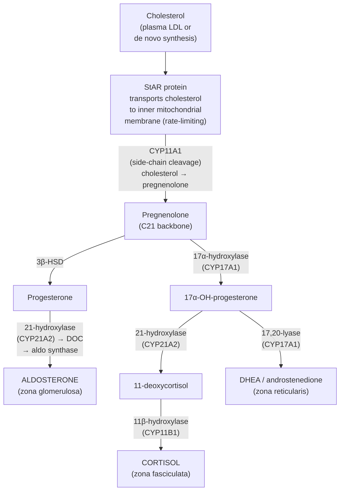
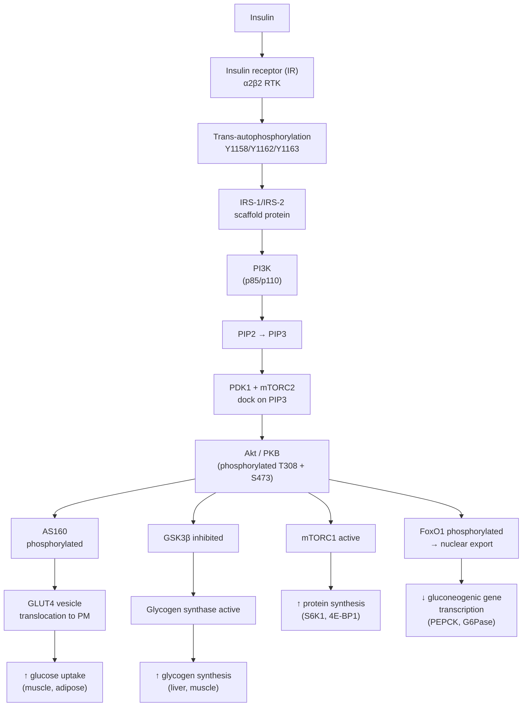
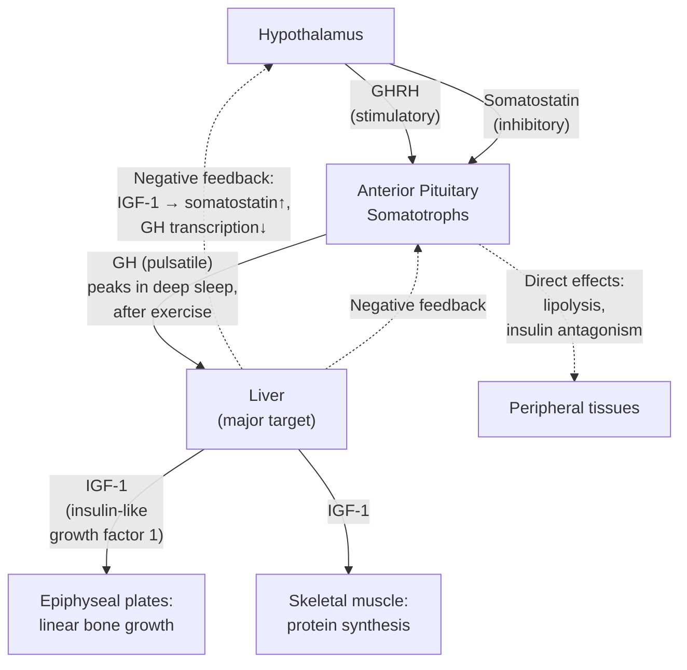
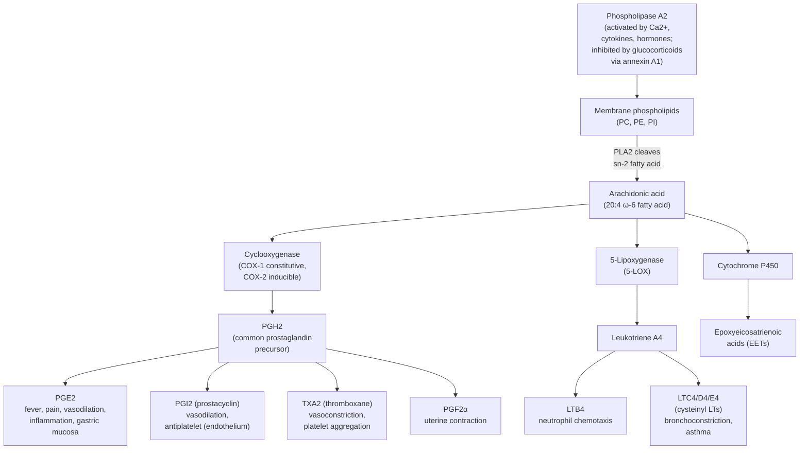
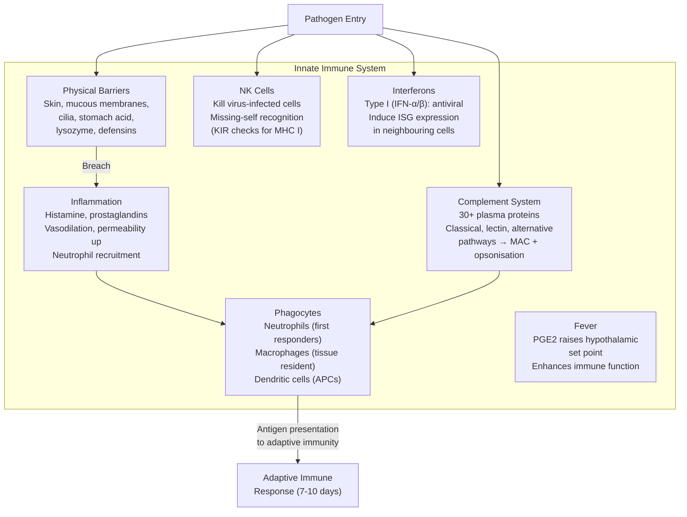
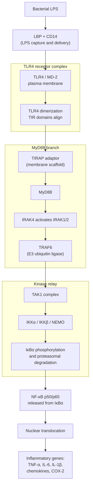
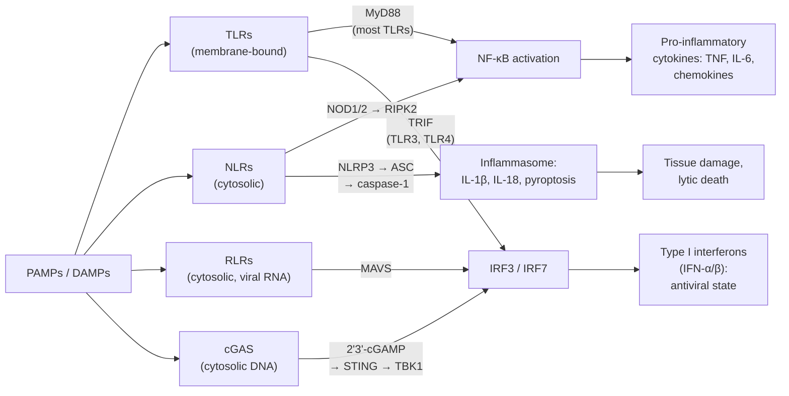
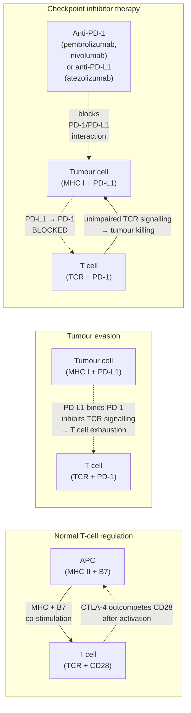
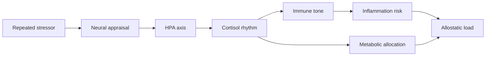

# Endocrine and Immune Systems

\label{sec:unit_IX_endocrine_and_immune}

<!-- chapter-metadata-badge -->
> **Ch 31** · Level 2/3 · 55 min read · 75 min lecture · Prerequisites: \cref{sec:unit_IX_circulation_respiration_homeostasis}

## Learning Objectives

1. Compare endocrine and nervous system signalling in terms of speed, duration, and specificity.
2. Classify [**hormone**](#gl:hormone)s by chemical class (peptide, steroid, amine, eicosanoid) and describe their synthesis, transport, receptor location, and signalling duration.
3. Explain the HPA, HPT, and HPG axes with feedback regulation, including detailed steroidogenesis and the circadian profile of cortisol.
4. Trace insulin and glucagon signalling in glucose [**homeostasis**](#gl:homeostasis), including IR/IRS/PI3K/Akt/GLUT4, crosstalk with leptin and GLP-1, and the pathophysiology of diabetes.
5. Describe the adrenal gland structure and function (cortex and medulla), including cortisol synthesis from cholesterol.
6. Describe thyroid hormone synthesis, T4→T3 conversion, the nuclear receptor mechanism, and the Wolff-Chaikoff effect.
7. Describe the growth hormone axis and IGF-1.
8. Explain prostaglandin and eicosanoid synthesis from arachidonic acid; differentiate non-selective NSAIDs from COX-2 selective inhibitors.
9. Describe endocrine disruption by xenoestrogens, BPA, phthalates, and PFAS.
10. Distinguish innate and adaptive immunity, including PRRs (TLRs, NLRs, RLRs) and their downstream signalling pathways (MyD88/NF-κB vs TRIF/IRF3 vs cGAS-STING).
11. Explain the complement system (classical, lectin, alternative pathways), the C3/C5 convertases, the MAC, and amplification dynamics.
12. Describe T cell development through the DN1–DN4 stages, positive and negative thymic selection, and TCR diversity generation.
13. Describe B cell activation, T-dependent vs T-independent responses, germinal centre reactions, somatic hypermutation, and class switching.
14. Tabulate the cytokine network and key cytokines (IL-1, IL-6, TNF, IFN-γ, IL-10, IL-4, IL-17, etc.).
15. Describe immunological memory formation and explain why memory cells respond faster.
16. Explain mechanisms of central and peripheral tolerance and how their failure causes autoimmunity (molecular mimicry, bystander activation, epitope spreading).
17. Describe the Type I–IV classification of hypersensitivity reactions and their treatments.
18. Explain immunotherapy: checkpoint inhibitors (PD-1/PD-L1, CTLA-4) and CAR-T cell therapy.

<!-- curriculum-scaffold-start -->
### Study Blueprint

- **Big idea:** Long-range signaling and immune recognition coordinate body-wide adaptation and defense.
- **Core concepts:** hormones, receptors, innate immunity, adaptive immunity.
- **Framework alignment:** Vision & Change: Structure and function, Systems; AP Biology: Systems Interactions, Energetics; NGSS-style topics: Structure and Function.
- **Model or quantitative lens:** Hormone feedback, dose-response, and immune-memory reasoning.
- **Data skill:** Interpret endocrine or immune data from time courses, titers, or perturbations.
- **Practice cadence:** Visual Representations, Statistical Tests and Data Analysis, Argumentation.
- **Common misconception to repair:** Immunity is not just attack; recognition, tolerance, memory, and regulation are equally central.
- **Primary lab:** \cref{sec:lab_unit_IX_endocrine_and_immune}.
- **Question bank:** \cref{sec:q_unit_IX_endocrine_and_immune}.
- **Transfer task:** Transfer signaling and immunity reasoning to vaccination, autoimmunity, stress, and metabolism.
- **Bridge to computation:** `biology.physiology.physiology.homeostasis_response`.
<!-- curriculum-scaffold-end -->

---

> **Opening Vignette — The Hormone That Changed Medicine Forever**
>
> Before 1921, Type 1 diabetes was a death sentence. Children diagnosed with it were placed on starvation diets — sometimes eating fewer than 500 calories per day — which extended their lives by months while slowly wasting them. Then Frederick Banting, a young Canadian surgeon, persuaded the University of Toronto to give him laboratory space and a few dogs. Working with student Charles Best and biochemist J.B. Collip to purify the extract, they isolated the pancreatic secretion that controlled blood glucose — insulin. The first human injection was given to 14-year-old Leonard Thompson on January 11, 1922. He had been near death; within days his blood glucose normalised and he survived. Banting and John Macleod received the Nobel Prize in 1923. Insulin was the first hormone to be purified, the first to be sequenced (by Frederick Sanger, 1951), and the first to be produced by recombinant DNA technology (1982). No single molecule has had a more direct impact on human survival.

## Endocrine System Overview

### Endocrine vs Nervous System

| Feature | Nervous System | Endocrine System |
| ------- | -------------- | ---------------- |
| Signal type | Electrical + chemical (neurotransmitter) | Chemical (hormone) |
| Speed | Fast (ms) | Slow (seconds to hours) |
| Duration | Brief (ms) | Prolonged (minutes to days) |
| Target | Specific (synapse) | Widespread (most cells with receptor) |
| Distance | Short (synaptic cleft, 20 nm) | Long (via blood circulation) |

**Mixed signalling:** Neuroendocrine cells (e.g., hypothalamic [**neuron**](#gl:neuron)s secreting releasing hormones, adrenal medulla chromaffin cells) bridge both systems. Sterling and Eyer's concept of [**allostasis**](#gl:allostasis) \citep{sterling1988,sterling2015} extends classical homeostasis: the brain anticipates physiological needs and adjusts setpoints predictively, integrating endocrine and autonomic outputs.

### Hormone Classes — Synthesis, Transport, and Mechanism

| Class | Solubility | Synthesis | Transport in Blood | Receptor Location | Signalling Speed | Duration | Examples |
| ----- | ---------- | --------- | ------------------ | ----------------- | ---------------- | -------- | -------- |
| **Peptide/[**protein**](#gl:protein)** | Water-soluble | Ribosomal synthesis as preprohormones; cleaved in ER/Golgi; stored in secretory granules | Free in plasma | Plasma membrane (RTKs, GPCRs) | Seconds to minutes | Minutes to hours | Insulin, glucagon, GH, ACTH, ADH, PTH, prolactin |
| **Steroid** | Lipid-soluble | Synthesised on demand from cholesterol (no storage); enzymatic cascades in mitochondria/SER | Bound to carrier proteins (CBG, SHBG, albumin) — about 5% free and bioactive | Nuclear receptors (intracellular) | Hours (transcription required) | Hours to days | [**Cortisol**](#gl:cortisol), aldosterone, oestrogen, testosterone, vitamin D |
| **Amine — Catecholamines** | Water-soluble | Tyrosine → DOPA → dopamine → norepinephrine → epinephrine; stored in chromaffin granules | Free in plasma; very short half-life | Plasma membrane (α/β adrenergic GPCRs) | Seconds | Seconds to minutes | Epinephrine, norepinephrine, dopamine |
| **Amine — Thyroid hormones** | Lipid-soluble | Synthesised on iodinated thyroglobulin scaffold in colloid; T4 prohormone converted to T3 peripherally | 99.97% bound to TBG, transthyretin, albumin | Nuclear receptors (TRα, TRβ) | Hours (transcription required) | Days (T4 t½ ~7 d) | T3, T4 |
| **Eicosanoids** | Lipid-soluble | Generated locally on demand from arachidonic acid; not stored | Diffuse to neighbouring cells (paracrine) | GPCRs and nuclear receptors (PPARs) | Seconds to minutes | Seconds to minutes (rapid degradation) | PGE$_2$, PGI$_2$, TXA$_2$, leukotrienes |

#### Comprehensive hormone table — synthesis location, transport, receptor, half-life

| Hormone | Class | Synthesis location | Plasma transport | Receptor | Signal duration | Half-life |
| ------- | ----- | ------------------ | ---------------- | -------- | --------------- | --------- |
| **Insulin** | Peptide (51 aa) | β-cells, islets of Langerhans | Free | IR (RTK, plasma membrane) | Minutes | ~5 min |
| **Glucagon** | Peptide (29 aa) | α-cells, islets of Langerhans | Free | GcgR (G$_s$ GPCR, hepatocyte) | Minutes | ~5 min |
| **Growth hormone (GH)** | Peptide (191 aa) | Anterior pituitary somatotrophs | Free; some bound to GHBP | GHR (JAK2/STAT5 cytokine receptor, liver) | Hours (via IGF-1) | ~20 min |
| **PTH** | Peptide (84 aa) | Parathyroid chief cells | Free | PTH1R (G$_s$/G$_q$ GPCR; bone, kidney) | Minutes | ~4 min |
| **ADH (vasopressin)** | Peptide (9 aa) | Hypothalamic SON/PVN; stored in posterior pituitary | Free | V$_2$R (G$_s$, kidney); V$_1$R (G$_q$, vessels) | Minutes | ~15 min |
| **Cortisol** | Steroid (C$_{21}$) | Adrenal cortex (zona fasciculata) | 90% CBG; 5% albumin; 5% free | GR (NR3C1, cytoplasmic→nuclear) | Hours to days | ~60–90 min |
| **Aldosterone** | Steroid (C$_{21}$) | Adrenal cortex (zona glomerulosa) | ~50% bound to CBG/albumin | MR (NR3C2, cytoplasmic→nuclear) | Hours | ~20 min |
| **Testosterone** | Steroid (C$_{19}$) | Leydig cells (testis); zona reticularis (adrenal) | 60% SHBG; 38% albumin; 2% free | AR (NR3C4, cytoplasmic→nuclear) | Hours to days | ~70 min |
| **Oestradiol** | Steroid (C$_{18}$) | Ovarian granulosa cells (aromatase from androgens) | SHBG, albumin; 1–2% free | ERα/ERβ (nuclear); GPER (membrane) | Hours to days | ~13 h |
| **Progesterone** | Steroid (C$_{21}$) | Corpus luteum, placenta | CBG, albumin | PR (NR3C3, nuclear) | Hours | ~5 min |
| **Vitamin D (1,25-(OH)$_2$D$_3$)** | Steroid (secosteroid) | Kidney (CYP27B1 hydroxylation of 25-OH-D) | DBP (vitamin D binding protein) | VDR (nuclear) | Days | ~15 h |
| **Epinephrine** | Catecholamine | Adrenal medulla chromaffin cells | Free | α/β adrenergic (GPCRs) | Seconds–minutes | ~2 min |
| **Norepinephrine** | Catecholamine | Adrenal medulla; sympathetic neurons | Free | α/β adrenergic (GPCRs) | Seconds–minutes | ~2 min |
| **T4 (thyroxine)** | Iodinated tyrosine | Thyroid follicular cells | 99.97% TBG/TTR/albumin; 0.03% free | TRα/β (nuclear) after D2 conversion to T3 | Days–weeks | ~6–7 d |
| **T3 (triiodothyronine)** | Iodinated tyrosine | Thyroid (~20%); peripheral D1/D2 (~80%) | 99.7% bound; 0.3% free | TRα/β (nuclear) | Days | ~1 d |
| **Melatonin** | Indolamine | Pineal gland (from tryptophan via serotonin) | Albumin | MT$_1$, MT$_2$ (G$_i$ GPCRs) | Minutes–hours | ~30–50 min |
| **PGE$_2$** | Eicosanoid | Most cells (COX-2 inducible) | Local (paracrine) | EP$_1$–EP$_4$ (GPCRs) | Seconds | ~30 s |
| **TXA$_2$** | Eicosanoid | Platelets (TXAS) | Local | TP receptor (G$_q$) | Seconds | ~30 s |
| **Leptin** | Peptide (167 aa) | Adipocytes (proportional to fat mass) | Free; some bound | LepR (JAK2/STAT3, hypothalamus) | Hours | ~25 min |
| **Adiponectin** | Peptide (244 aa) | Adipocytes | Free; trimers/hexamers/HMW | AdipoR1, AdipoR2 (AMPK pathway) | Hours | ~14 h |

**Key contrasts:**

- **Speed vs duration trade-off.** Membrane receptor signalling (peptides, catecholamines) is fast but transient: cAMP, IP$_3$, and Ca$^{2+}$ signals decay in seconds when ligand washes away. Nuclear receptor signalling (steroids, T3) is slow but persistent: transcribed mRNAs and translated proteins last hours to days.
- **Storage vs synthesis.** Peptide hormones are pre-synthesised and stored in granules ready for rapid release — insulin can be released within seconds of glucose elevation. Steroids cannot be stored (lipid-soluble, would diffuse away); they are synthesised on demand, which limits acute response speed.
- **Carrier proteins as a reservoir.** CBG (cortisol binding globulin), SHBG (sex hormone binding globulin), and TBG (thyroxine binding globulin) bind 95–99% of their target hormones. The bound fraction is biologically inactive but provides a circulating reservoir, buffering plasma levels and extending half-life. Free hormone is in equilibrium with bound; pregnancy elevates oestrogen which raises CBG, increasing total cortisol while free cortisol remains normal.

### Quantitative Endocrinology

**Hormone–receptor binding.** The dissociation constant $K_d$ characterises receptor affinity (lower $K_d$ = higher affinity):

\begin{equation}
K_d = \frac{[\text{H}][\text{R}]}{[\text{HR}]}; \qquad \text{fractional occupancy} = \frac{[\text{H}]}{[\text{H}] + K_d}
\label{eq:unit_IX_kd}
\end{equation}

Typical $K_d$ values: [**insulin receptor**](#gl:insulin-receptor) ~0.1 nM; glucocorticoid receptor ~5 nM; epinephrine at $\beta_2$ receptor ~1 μM. The enormous affinity difference explains why insulin circulates at picomolar concentrations while catecholamines require nanomolar–micromolar levels for effect.

**Hormone half-life and clearance.** Plasma hormone concentration decays exponentially after secretion ceases:

\begin{equation}
C(t) = C_0 \, e^{-kt}, \qquad k = \frac{\ln 2}{t_{1/2}}
\label{eq:unit_IX_halflife}
\end{equation}

Half-lives vary enormously: catecholamines ~1–2 min (rapid enzymatic degradation by MAO/COMT); cortisol ~60–90 min (hepatic metabolism); thyroid hormone (T4) ~6–7 days (protein binding extends clearance). Protein-bound hormones (e.g., TBG-bound T4, CBG-bound cortisol) are protected from degradation and renal filtration.

**Dose–response relationship.** The sigmoidal (Hill) dose–response curve relates hormone concentration to biological effect:

\begin{equation}
E = E_{\max} \cdot \frac{[\text{H}]^{n}}{EC_{50}^{n} + [\text{H}]^{n}}
\label{eq:unit_IX_doseresponse}
\end{equation}

where $EC_{50}$ is the concentration producing 50% of maximal effect and $n$ is the Hill coefficient (cooperativity). Spare receptors shift the $EC_{50}$ leftward from $K_d$: insulin requires occupation of about 5% of receptors for maximal glucose uptake.

**[Herd immunity](#gl:herd-immunity) threshold.** The fraction of the population that must be immune to prevent epidemic spread is:

\begin{equation}
p_c = 1 - \frac{1}{R_0}
\label{eq:unit_IX_herd}
\end{equation}

where $R_0$ is the basic reproductive number. For measles ($R_0 \approx 12$–18), $p_c \approx 92$–95%, explaining why even small drops in vaccination coverage trigger outbreaks.

---

## Hypothalamic-Pituitary Axes

The hypothalamus serves as the master integrator, linking the nervous and endocrine systems. It produces releasing and inhibiting hormones that control the anterior pituitary, which in turn controls target glands throughout the body.

**Anterior pituitary hormones:** ACTH (corticotrophs), TSH (thyrotrophs), GH (somatotrophs), LH and FSH (gonadotrophs), prolactin (lactotrophs).

**Posterior pituitary:** Stores and releases ADH (vasopressin) and oxytocin, which are synthesised in hypothalamic supraoptic and paraventricular nuclei and transported down axons to the posterior pituitary for release.

```mermaid
flowchart TD
    subgraph HPA ["HPA Axis (Stress Response)"]
        H1["Hypothalamus<br/>PVN neurons"] -->|"CRH"| P1["Anterior Pituitary<br/>Corticotrophs"]
        P1 -->|"ACTH"| A1["Adrenal Cortex<br/>Zona Fasciculata"]
        A1 -->|"CORTISOL"| T1["Target Tissues:<br/>Gluconeogenesis<br/>Immunosuppression<br/>Lipolysis<br/>Muscle catabolism"]
        T1 -.->|"Negative feedback<br/>at hypothalamus<br/>and pituitary"| H1
        T1 -.->|"Negative feedback"| P1
    end

    subgraph HPT ["HPT Axis (Metabolism)"]
        H2["Hypothalamus"] -->|"TRH"| P2["Anterior Pituitary<br/>Thyrotrophs"]
        P2 -->|"TSH"| Th["Thyroid Gland<br/>Follicular Cells"]
        Th -->|"T4 then T3"| T2["Target Tissues:<br/>Basal metabolic rate<br/>Na+/K+-ATPase<br/>Cardiac contractility<br/>Neurodevelopment"]
        T2 -.->|"Negative feedback"| H2
        T2 -.->|"Negative feedback"| P2
    end

    subgraph HPG ["HPG Axis (Reproduction)"]
        H3["Hypothalamus<br/>(Pulsatile GnRH)"] -->|"GnRH"| P3["Anterior Pituitary<br/>Gonadotrophs"]
        P3 -->|"LH + FSH"| G["Gonads"]
        G -->|"Sex steroids<br/>(E2, T, P4)"| T3["Target Tissues:<br/>Sexual development<br/>Reproductive function<br/>Bone density<br/>Muscle mass"]
        T3 -.->|"Negative feedback<br/>(except mid-cycle<br/>positive feedback<br/>of E2 causing LH surge)"| H3
    end
```


<!-- alt: Flowchart showing three major hypothalamic-pituitary axes Each follows the same hierarchical pattern: hypothalamic releasing hormone stimulates anterior pituitary tropic hormone, which stimulates target gland hormone production. Negative feedback at multiple levels prevents overstimulation. The HPG axis uniquely features positive feedback during the mid-cycle LH surge. -->

*The three major hypothalamic-pituitary axes Each follows the same hierarchical pattern: hypothalamic releasing hormone stimulates anterior pituitary tropic hormone, which stimulates target gland hormone production. Negative feedback at multiple levels prevents overstimulation. The HPG axis uniquely features positive feedback during the mid-cycle LH surge.*

### HPA Axis (Hypothalamic-Pituitary-Adrenal) — Detailed Cortisol Physiology

#### Cortisol synthesis from cholesterol (steroidogenesis)

Most adrenal steroids derive from cholesterol via a series of cytochrome P450-mediated hydroxylations and oxidations. The rate-limiting step is the transport of cholesterol from the outer to the inner mitochondrial membrane, mediated by **StAR (steroidogenic acute regulatory protein)** and stimulated by ACTH via cAMP/PKA.


<!-- alt: Flowchart showing adrenal steroidogenesis The pathway diverges from common precursor pregnenolone into three parallel routes producing aldosterone (zona glomerulosa), cortisol (zona fasciculata), and androgens (zona reticularis). Each zone expresses zone-specific enzymes; for example, primarily the zona glomerulosa expresses aldosterone synthase (CYP11B2), and primarily the zona fasciculata expresses 11β-hydroxylase (CYP11B1). -->

*Adrenal steroidogenesis The pathway diverges from common precursor pregnenolone into three parallel routes producing aldosterone (zona glomerulosa), cortisol (zona fasciculata), and androgens (zona reticularis). Each zone expresses zone-specific enzymes; for example, primarily the zona glomerulosa expresses aldosterone synthase (CYP11B2), and primarily the zona fasciculata expresses 11β-hydroxylase (CYP11B1).*

#### Glucocorticoid receptor (GR) mechanism

Cortisol diffuses freely across the plasma membrane (lipid-soluble) and binds the cytoplasmic GR (NR3C1). In the unliganded state, GR is held in an inactive complex with HSP90, HSP70, and immunophilins. Cortisol binding induces a conformational change, releasing the chaperones and exposing nuclear localisation signals. The activated GR translocates to the nucleus, dimerises, and binds **glucocorticoid response elements (GREs)** in target gene promoters with the consensus sequence 5'-AGAACAnnnTGTTCT-3'.

GR has **two transcriptional modes:**

- **Transactivation** at positive GREs: directly upregulates gluconeogenic enzymes (PEPCK, G6Pase) and anti-inflammatory proteins (annexin A1, MKP-1, IκBα, IL-10).
- **Transrepression** by tethering to NF-κB or AP-1: GR binds these pro-inflammatory transcription factors and prevents their activation of cytokine genes (IL-2, IL-6, TNF-α, COX-2). Transrepression mediates much of the anti-inflammatory action of glucocorticoid drugs.

The dual mechanism is therapeutically central. Most classical glucocorticoids (prednisone, dexamethasone) drive both modes — the unwanted metabolic effects (hyperglycaemia, osteoporosis, muscle wasting) come predominantly from transactivation, while the anti-inflammatory benefit comes mostly from transrepression. Pharmaceutical efforts to design "selective GR agonists" (SEGRAs) that drive transrepression preferentially have been an enduring (but largely unrealised) goal.

#### Cortisol effects (anti-inflammatory gene programme)

- **Gluconeogenesis** (transactivation of PEPCK, G6Pase via GR; mobilises amino acids from muscle protein catabolism)
- **Immunosuppression** at multiple levels:
  - Direct: NF-κB inhibition; lymphocyte [**apoptosis**](#gl:apoptosis); suppression of IL-2 transcription; mast-cell stabilisation
  - Indirect: induction of IL-10, TGF-β, annexin A1; suppression of leukocyte trafficking by reducing E-selectin and ICAM-1
  - Net cytokine effect: **down** TNF-α, IL-1β, IL-2, IL-6, IFN-γ; **up** IL-10
- **Lipolysis** in peripheral adipose tissue (with central fat redistribution from chronic excess)
- **Anti-inflammatory** (inhibits COX-2, phospholipase A$_2$ via annexin A1 induction; reduces histamine, leukotriene production)
- **Permissive effects** on catecholamine action (β-adrenergic receptor expression maintenance)
- **Bone resorption** (chronic excess: osteoporosis via direct osteoblast suppression and indirect calcium handling)
- **CNS effects** (mood — chronic excess: depression, psychosis, cognitive impairment via hippocampal atrophy)

#### Circadian rhythm and feedback

Cortisol secretion follows a robust **circadian rhythm** driven by the suprachiasmatic nucleus (SCN): peak at approximately 08:00 (cortisol awakening response, CAR), nadir at midnight. Superimposed are **ultradian pulses** every 60–90 minutes. The pulsatile pattern is essential for proper GR function — continuous (non-pulsatile) cortisol exposure desensitises target tissues.

Schematically, plasma cortisol $\approx 18\,\mu\text{g/dL}$ at 08:00, drops through the day to $\approx 8\,\mu\text{g/dL}$ at 16:00, and is $<5\,\mu\text{g/dL}$ at midnight. Disrupted circadian rhythm (shift work, depression, Cushing's) loses the diurnal variation; **midnight salivary cortisol** is one of the most sensitive screening tests for endogenous Cushing's syndrome.

**Negative feedback** operates at two levels:

- **Fast feedback** (minutes): non-genomic; cortisol acts on hypothalamic CRH neurons via membrane GRs and presynaptic endocannabinoid release to suppress CRH secretion within minutes.
- **Slow feedback** (hours): genomic; cortisol downregulates POMC gene transcription (the ACTH precursor) in pituitary corticotrophs and CRH transcription in hypothalamus.

#### Stress vs basal regulation

Under **basal (non-stress)** conditions, the HPA axis runs on its circadian/ultradian rhythm with tight negative feedback. The day's cortisol output is roughly 10–20 mg/24 h.

Under **acute stress** (trauma, hypoglycaemia, infection, surgery), hypothalamic PVN neurons receive convergent inputs (limbic, brainstem, circulating cytokines, baroreceptors) and override basal restraint:

- CRH secretion rises 5–10 fold
- ACTH plasma concentration rises within 5–15 min
- Cortisol peaks ~30 min after stress onset
- Cortisol output can increase 3–10 fold over basal (50–100 mg/24 h in major surgery)
- Negative feedback is partially suppressed, allowing sustained elevation

Chronic psychosocial stress engages the same axis but with **glucocorticoid receptor downregulation** and **flattened diurnal rhythm** — features now linked to metabolic syndrome, depression, hippocampal atrophy, and accelerated cognitive decline.

**Pathology:**

- **Cushing's syndrome:** Cortisol excess. Causes: pituitary adenoma (Cushing's disease, 70%), ectopic ACTH (lung small cell carcinoma), adrenal adenoma, iatrogenic (chronic glucocorticoid therapy). Features: central obesity, moon face, purple striae, hyperglycaemia, osteoporosis, immunosuppression, hypertension (cortisol cross-reacts with mineralocorticoid receptor).
- **Addison's disease:** Primary adrenal insufficiency (cortisol deficiency). Most common cause: autoimmune adrenalitis. Features: hypotension, hyperpigmentation (elevated ACTH drives melanocyte-stimulating hormone activity, since both are cleaved from the same precursor POMC), fatigue, salt craving. Can cause life-threatening adrenal crisis.

> **Clinical Connection:** The dexamethasone suppression test exploits negative feedback to diagnose Cushing's syndrome. Dexamethasone is a synthetic glucocorticoid that normally suppresses CRH and ACTH secretion. In Cushing's disease (pituitary adenoma), low-dose dexamethasone fails to suppress cortisol, but high-dose dexamethasone does. In ectopic ACTH production, neither dose suppresses cortisol. This distinguishes the source of excess cortisol.

### HPT Axis (Hypothalamic-Pituitary-Thyroid) — Detailed Mechanism

#### Thyroid hormone synthesis

Follicular cells of the thyroid gland surround a colloid-filled follicle and execute a multi-step iodination process:

1. **Iodide uptake.** The basolateral Na$^+$/I$^-$ symporter (NIS) actively concentrates iodide ~25–100-fold above plasma. Pertechnetate ($^{99m}$TcO$_4^-$) is also transported by NIS and is used in thyroid scintigraphy.
2. **Thyroglobulin synthesis.** Follicular cells produce thyroglobulin (Tg, ~660 kDa glycoprotein with ~120 tyrosine residues), packaged into vesicles and exocytosed into the colloid lumen.
3. **Iodide oxidation and tyrosine iodination.** At the apical membrane, **thyroid peroxidase (TPO)** oxidises I$^-$ to a reactive iodinating species (I$_2$ or I$^+$) using H$_2$O$_2$ as cofactor. Tyrosines on Tg are iodinated to form monoiodotyrosine (MIT) and diiodotyrosine (DIT).
4. **Coupling reaction.** Still on the Tg scaffold, TPO catalyses oxidative coupling: DIT + DIT → T4 (thyroxine, 4 iodines); MIT + DIT → T3 (3 iodines).
5. **Endocytosis and proteolysis.** TSH stimulation triggers endocytosis of Tg into the follicular cell, where lysosomal proteases cleave the iodothyronines from Tg. T4 and T3 are released into the bloodstream.
6. **Recycling.** MIT and DIT not coupled into T3/T4 are deiodinated by intracellular dehalogenase, recycling iodide.

#### Wolff-Chaikoff effect

Acutely high iodide (e.g., from radiocontrast, amiodarone, or seaweed binge) paradoxically **inhibits** thyroid hormone synthesis: excess iodide downregulates NIS expression and impairs TPO-mediated organification. Most healthy individuals "escape" within 7–10 days as NIS resets. In patients with autoimmune thyroid disease, escape may fail — producing **iodine-induced hypothyroidism**. Conversely, in nodular goitres with autonomous follicles, iodine load can drive **iodine-induced hyperthyroidism (Jod-Basedow)**. The Wolff-Chaikoff effect is exploited therapeutically: **potassium iodide** (Lugol's solution, SSKI) is given pre-operatively in Graves' disease to reduce thyroid vascularity and slow hormone release before thyroidectomy.

#### T4 → T3 conversion (deiodinases)

T4 is the predominant secreted form (~80%) but is largely a **prohormone**. Three iodothyronine deiodinases activate or inactivate T4 in target tissues:

| Deiodinase | Reaction | Tissue | Function |
| ---------- | -------- | ------ | -------- |
| **D1** | T4 → T3 (5'-deiodination) | Liver, kidney, thyroid | Bulk plasma T3 production |
| **D2** | T4 → T3 (5'-deiodination) | Brain, pituitary, brown adipose | Local T3 generation; pituitary feedback set-point |
| **D3** | T4 → reverse T3 (rT3); T3 → T2 | Placenta, fetal tissues | Inactivation; protects fetus from maternal T3 |

T3 is **~4× more potent** than T4 at the nuclear receptor. During fasting, illness, or stress (non-thyroidal illness), D1 activity drops and D3 activity rises, shifting balance toward inactive rT3 — adaptive metabolic slowing.

#### Nuclear thyroid receptor mechanism

T3 enters cells via MCT8/MCT10 transporters and binds nuclear **thyroid hormone receptors TRα (cardiac, neural)** and **TRβ (liver, pituitary)**. TRs heterodimerise with **RXR (retinoid X receptor)** and bind **thyroid response elements (TREs)** in target gene promoters — even in the absence of T3.

- **Without T3:** Unliganded TR/RXR recruits corepressors (NCoR, SMRT, HDACs) and **represses** target gene transcription.
- **With T3:** Conformational change releases corepressors and recruits coactivators (SRC-1, p300/CBP, histone acetyltransferases) → **active transcription**.

This dual mechanism explains why hypothyroidism causes such pronounced symptoms: target genes are not merely "not turned on" but are actively repressed below baseline.

#### Effects on metabolism

- **Increased basal metabolic rate (BMR)** through upregulation of Na$^+$/K$^+$-ATPase (each cell uses ~25% of ATP for this pump; T3 increases pump density).
- **Mitochondrial uncoupling** via UCP-mediated proton leak (heat production, calorigenic effect).
- **Increased cardiac output** ($\beta_1$-adrenergic receptor upregulation; positive chronotropic and inotropic effects).
- **Lipolysis and cholesterol degradation** (hyperthyroidism lowers LDL; hypothyroidism causes hypercholesterolaemia).
- **Neurodevelopment:** essential for myelination, synaptogenesis, neuronal migration in fetus and infant. Severe untreated congenital hypothyroidism produces cretinism (intellectual disability, growth retardation) — preventable by neonatal screening.

**Pathology:**

- **Hypothyroidism:** Low T3/T4, elevated TSH. Hashimoto's thyroiditis (autoimmune; anti-TPO and anti-thyroglobulin antibodies). Features: fatigue, weight gain, cold intolerance, bradycardia, constipation, myxoedema.
- **Hyperthyroidism:** High T3/T4, suppressed TSH. Graves' disease (autoimmune; TSH receptor-stimulating antibodies — thyroid-stimulating immunoglobulins, TSI). Features: weight loss, heat intolerance, tachycardia/atrial fibrillation, tremor, exophthalmos (due to retro-orbital inflammation), diffuse goitre.
- **Iodine deficiency:** Most common preventable cause of intellectual disability worldwide; affects approximately 1.9 billion people. Addressed by salt iodisation programmes.

### Worked Example: Thyroid Hormone Negative Feedback and TSH Compensatory Rise

**Problem:** A healthy adult has steady-state TSH around 2 mU/L, T4 around 100 nmol/L (within normal range), and a free T3 set by peripheral D1/D2 deiodination. Autoimmune destruction (Hashimoto's thyroiditis) reduces T4 secretion capacity by approximately 60%. Predict the new steady-state TSH, estimate the time to reach the new steady state, and identify the rate-limiting step.

**Setup of the feedback loop.**

$$\text{TRH (hypothalamus)} \longrightarrow \text{TSH (anterior pituitary)} \longrightarrow \text{T4 (thyroid)} \xrightarrow{\text{D1/D2}} \text{T3 (active)}.$$

T3 (and to a lesser extent T4) feeds back negatively on both TRH and TSH transcription. The loop is well approximated as a near-linear feedback over the clinically observed range: a $k$-fold drop in T4 input drives an approximately $k$-fold (often higher because of nonlinearity at low T4) rise in TSH.

**Solution.**

1. **Steady-state TSH after damage.** A 60% reduction in T4 input ($\times 0.4$) typically produces an approximately 10-fold rise in TSH at the new equilibrium (the system is *nonlinearly* sensitive at low T4 because TRH transcription is sharply derepressed). New TSH $\approx 2 \times 10 = 20$ mU/L — squarely in the overt-hypothyroid range.

2. **Half-lives that set the time-to-steady-state.**

   - TSH plasma half-life: $t_{1/2} \approx 50$ min. Time constant $\tau_{\text{TSH}} = t_{1/2} / \ln 2 \approx 72$ min.
   - T4 plasma half-life: $t_{1/2} \approx 7$ d. Time constant $\tau_{\text{T4}} = 7 / 0.693 \approx 10$ d.

3. **Rate-limiting step.** The slow variable governs convergence. Even though TSH responds within hours, the actual T4 distribution re-equilibrates on the order of $3 \tau_{\text{T4}} \approx 30$ days to reach approximately 95% of the new steady state, and approximately $5 \tau_{\text{T4}} \approx 50$ days to reach approximately 99%. *Practical implication:* TSH measured 1–2 weeks after starting levothyroxine replacement is misleading — the T4 pool has not finished re-equilibrating. Clinical guidelines correctly recommend re-checking TSH 6–8 weeks after any dose change.

4. **Sanity check with the loop gain.** Order-of-magnitude: loop gain (sensitivity of TSH to T4) at the operating point is approximately $-2$ (one-log T4 drop → approximately 2-log TSH rise, per the log-linear TSH–T4 relationship that clinicians use at the bedside). Our predicted approximately 10-fold TSH rise for an approximately 2.5-fold T4 drop is consistent with this gain. The same logarithmic logic explains why a small dose of levothyroxine restoring T4 to a near-normal value rapidly normalises TSH — provided one waits a full T4 half-life-set.

**Interpretation.** Hashimoto's hypothyroidism is *biochemically* a textbook negative-feedback restoration problem. The clinical art is timing: lab measurements taken before the T4 pool re-equilibrates will lead to over-dosing. The molecular ledger — TRH at the top, T4 half-life at the bottom — determines that we must wait approximately 6–8 weeks before believing the TSH number.


### HPG Axis and Reproductive Hormones

**GnRH pulsatility is critical:** High-frequency pulses (every 60–90 min) favour LH secretion; low-frequency pulses (every 2–4 h) favour FSH. Continuous GnRH paradoxically suppresses the axis (downregulates GnRH receptors), which is the basis of GnRH agonist therapy for prostate cancer, endometriosis, and precocious puberty.

**Male reproductive endocrinology:** LH stimulates Leydig cells (testosterone production). FSH + testosterone stimulate Sertoli cells (support spermatogenesis; produce inhibin B, which provides negative feedback on FSH). Testosterone effects: muscle mass, bone density, secondary sexual characteristics, spermatogenesis, libido.

**Female menstrual cycle (28-day average):**

- **Follicular phase** (days 1–14): FSH promotes follicular growth. [**Dominant**](#gl:dominant) follicle produces rising oestradiol. Oestradiol initially provides negative feedback.
- **Ovulation** (day approximately 14): **Positive feedback** — sustained high oestradiol above a threshold for >36 h switches from negative to positive feedback, triggering an LH surge. The LH surge induces ovulation (follicular rupture, oocyte release).
- **Luteal phase** (days 14–28): Corpus luteum (remnant of ovulated follicle) produces progesterone + oestradiol. Progesterone prepares the endometrium for implantation (secretory phase). If no implantation occurs, corpus luteum degenerates (luteolysis), progesterone and oestradiol fall, endometrium sheds (menstruation).

**Development and reproduction as endocrine timing problems:** Fertilisation, implantation, placentation, fetal growth, birth, lactation, puberty, and reproductive senescence depend on timed endocrine signals interacting with local tissue cues. Early embryos are initially regulated by maternal transcripts and local morphogen gradients; later development adds fetal-placental endocrine exchange, thyroid-hormone-dependent neurodevelopment, glucocorticoid-driven lung maturation, and sex-steroid-dependent reproductive tract differentiation. Clinically, infertility is diagnosed after 12 months of regular unprotected intercourse without pregnancy (or after 6 months when the female partner is 35 years or older), because reproductive physiology depends on ovulation, sperm production, tubal transport, implantation, uterine receptivity, endocrine timing, and age-dependent gamete quality \citep{cdc2024reproductivehealth}. The organismal point is that reproduction is not one organ system; it is a coordinated life-history transition linking gonads, hypothalamus, pituitary, placenta, metabolism, immune tolerance, and behaviour.

> **Concept Check 1:** Why does continuous GnRH administration paradoxically suppress the HPG axis rather than stimulate it? How is this exploited clinically in prostate cancer treatment, where the goal is to lower testosterone?

---

## Pancreatic Hormones, Glucose Homeostasis, and Energy Balance

**Normal fasting blood glucose:** 4.0–5.5 mmol/L (72–99 mg/dL). Post-prandial peak: <7.8 mmol/L (<140 mg/dL).

### Insulin signalling — molecular detail

**After a meal (high glucose):**

1. Glucose enters β-cells via GLUT2 transporter (high-K$_m$ "glucose sensor")
2. Glucose metabolism increases the ATP/ADP ratio
3. ATP-sensitive K$^+$ channels (K$_{ATP}$, SUR1/Kir6.2 subunits) close → membrane depolarisation
4. Voltage-gated L-type Ca$^{2+}$ channels open → Ca$^{2+}$ influx
5. Ca$^{2+}$ triggers **insulin exocytosis** from dense-core granules (mature insulin = A and B chains held by disulphide bonds; C-peptide co-released as marker)
6. **Insulin signalling in target cells:**
   - Insulin binds **insulin receptor (IR)** — an $\alpha_2\beta_2$ tetrameric receptor tyrosine kinase. Each α-subunit is extracellular and binds insulin; β-subunits span the membrane and contain intracellular tyrosine kinase domains.
   - Binding causes conformational change → **trans-autophosphorylation** of β-subunit tyrosine residues (Y1158, Y1162, Y1163 in the activation loop)
   - Phosphotyrosines recruit **IRS1/IRS2** scaffold proteins → IRS phosphorylation
   - IRS phosphotyrosines recruit **PI3K** (p85 regulatory + p110 catalytic) via SH2 domains
   - PI3K converts PIP$_2$ → **PIP$_3$**; PDK1 and mTORC2 dock on PIP$_3$ and activate **Akt (PKB)** by phosphorylation at T308 and S473
   - **Akt phosphorylates AS160 (TBC1D4)**, releasing Rab-GAP inhibition of GLUT4-vesicle exocytosis → **[GLUT4](#gl:glut4) translocation to plasma membrane** in muscle and adipose (the dominant mechanism for postprandial glucose disposal)
   - **Akt inhibits GSK3β** → glycogen synthase activation → **glycogen synthesis**
   - **Akt activates mTORC1** → ribosomal S6K1 and 4E-BP1 phosphorylation → **protein synthesis**
   - **Akt phosphorylates FoxO1** → nuclear export → represses gluconeogenic gene transcription (PEPCK, G6Pase)


<!-- alt: Flowchart showing insulin signalling cascade Insulin binding to IR triggers trans-autophosphorylation, recruitment of IRS, activation of PI3K, generation of PIP_3, and activation of Akt. Akt then drives four parallel branches: GLUT4 translocation, glycogen synthesis, protein synthesis, and suppression of gluconeogenic gene transcription. -->

*Insulin signalling cascade Insulin binding to IR triggers trans-autophosphorylation, recruitment of IRS, activation of PI3K, generation of PIP$_3$, and activation of Akt. Akt then drives four parallel branches: GLUT4 translocation, glycogen synthesis, protein synthesis, and suppression of gluconeogenic gene transcription.*

#### Glucagon signalling

**During fasting (low glucose):**

1. α-cells release **glucagon** (triggered by low glucose, sympathetic activation, amino acids)
2. Glucagon binds G$_s$-coupled receptor on hepatocytes
3. cAMP-PKA pathway: phosphorylase kinase activates **glycogen phosphorylase** for **glycogenolysis**
4. cAMP also activates **CREB** → PEPCK and G6Pase gene transcription → **gluconeogenesis**
5. PKA phosphorylates and inhibits PFK-2/FBPase-2 (PFKFB1), lowering F2,6BP → favours fructose-1,6-bisphosphatase over PFK-1 → gluconeogenesis dominates

#### Crosstalk with leptin, adiponectin, and GLP-1

**Leptin** is secreted by adipocytes in proportion to fat mass and acts on hypothalamic neurons (arcuate nucleus POMC and AgRP/NPY neurons) via the leptin receptor (LepR, JAK2/STAT3 signalling) to suppress appetite and increase energy expenditure. Leptin enhances central insulin sensitivity and provides a long-term signal of energy stores. Most obese individuals have high leptin but show **leptin resistance** — impaired hypothalamic LepR signalling and JAK2/STAT3 attenuation, partly via SOCS3 induction.

**Adiponectin** is also secreted by adipocytes — but **inversely** with fat mass (higher in lean states). It acts via AdipoR1 and AdipoR2, activating **AMPK** (AMP-activated protein kinase, the cellular "energy sensor"). AMPK activation:

- Increases fatty acid oxidation (phosphorylates ACC, decreasing malonyl-CoA, releasing CPT-1 from inhibition)
- Decreases hepatic gluconeogenesis (decreases CREB-regulated transcription)
- Increases skeletal muscle glucose uptake (independent of insulin)
- Decreases mTORC1 and protein synthesis (reciprocal to insulin/Akt)

Adiponectin therefore acts as an **insulin sensitiser**. Plasma adiponectin is reduced in T2DM, obesity, and metabolic syndrome; pioglitazone (a thiazolidinedione, PPARγ agonist) raises adiponectin and improves insulin sensitivity.

**GLP-1 (glucagon-like peptide 1)** is an **incretin** released from intestinal L-cells in response to nutrient ingestion. It acts via GLP-1R (G$_s$-coupled GPCR) to:

- Enhance glucose-dependent insulin secretion (primarily when glucose elevated → low hypoglycaemia risk)
- Suppress glucagon release from α-cells
- Slow gastric emptying
- Activate hypothalamic anorexigenic circuits → reduce food intake
- Promote β-cell survival and proliferation (animal studies)

GLP-1 has a very short half-life (~2 min) due to degradation by **DPP-4** (dipeptidyl peptidase-4). Drug strategies: GLP-1 analogues with DPP-4–resistant modifications (semaglutide, liraglutide), or DPP-4 inhibitors (sitagliptin) that prolong endogenous GLP-1.

### Diabetes Mellitus

**Type 1 diabetes mellitus (T1DM):**

- Autoimmune destruction of β-cells (anti-GAD65, anti-IA-2, anti-insulin, anti-ZnT8 antibodies)
- Complete insulin deficiency
- Onset usually in childhood/adolescence (but can occur at any age — "LADA" in adults)
- Without insulin: hyperglycaemia, ketoacidosis (lipolysis produces FFA, hepatic β-oxidation produces ketone bodies, metabolic acidosis)
- Treatment: exogenous insulin (basal-bolus regimen), increasingly closed-loop insulin pump systems

**Type 2 diabetes mellitus (T2DM):**

- Peripheral insulin resistance: ceramide and pro-inflammatory cytokines (TNF-α, IL-6 from visceral adipose tissue) cause serine phosphorylation of IRS1, blocking normal tyrosine phosphorylation. ER stress and mitochondrial dysfunction also contribute.
- Compensatory β-cell hyperinsulinaemia initially maintains normoglycaemia
- Progressive β-cell failure (glucotoxicity, lipotoxicity, amyloid deposition) leads to overt hyperglycaemia
- Treatment: lifestyle modification + metformin (AMPK activation, reduced hepatic glucose production) + GLP-1 receptor agonists (semaglutide) + SGLT2 inhibitors (empagliflozin: blocks renal glucose reabsorption)

> **Clinical Connection:** Semaglutide (Ozempic/Wegovy) has transformed T2DM and obesity management. Clinical trials show 15–20% body weight reduction with semaglutide, plus cardiovascular and renal benefits, by mimicking natural GLP-1 signalling at hypothalamic appetite centres and pancreatic β-cells.

> **Concept Check 2:** A type-1 diabetic receives a long-acting insulin analogue (glargine) once daily. Blood glucose is well controlled during the day but the patient develops reactive hyperglycaemia every morning ("dawn phenomenon"). Given that cortisol, GH, and glucagon most rise in the pre-waking hours, explain *which* counter-regulatory hormones are responsible for the morning rise and *why* glargine's 24-hour profile is insufficient to cover it. What feature of a more modern analogue (e.g. degludec, with ~42-h half-life) addresses this?

### Adrenal Gland — Zonal Architecture

**Adrenal cortex** (mesodermal origin, steroid hormones):

- **Zona glomerulosa:** Aldosterone (mineralocorticoid). Regulated by RAAS and K$^+$. Promotes Na$^+$ reabsorption, K$^+$ secretion in collecting duct.
- **Zona fasciculata:** Cortisol (glucocorticoid). Regulated by ACTH.
- **Zona reticularis:** DHEA, androstenedione (adrenal androgens). Puberty (adrenarche).

**Adrenal medulla** (neural crest origin, modified sympathetic ganglion):

- Chromaffin cells release epinephrine (80%) and norepinephrine (20%) directly into blood
- Epinephrine effects: heart rate increase ($\beta_1$), bronchodilation ($\beta_2$), glycogenolysis ($\beta_2$ in liver), lipolysis ($\beta_3$ in adipose), vasoconstriction ($\alpha_1$) in skin/viscera, vasodilation ($\beta_2$) in skeletal muscle
- Duration: seconds to minutes (rapid metabolic clearance by MAO and COMT)

### Growth Hormone Axis and IGF-1


<!-- alt: Flowchart showing growth hormone axis GHRH stimulates and somatostatin inhibits pituitary GH release. GH acts directly on tissues (lipolysis, insulin antagonism — "diabetogenic") and indirectly via hepatic IGF-1, which mediates linear growth and protein synthesis. IGF-1 provides negative feedback at hypothalamus (somatostatin) and pituitary (GH transcription). -->

*Growth hormone axis GHRH stimulates and somatostatin inhibits pituitary GH release. GH acts directly on tissues (lipolysis, insulin antagonism — "diabetogenic") and indirectly via hepatic IGF-1, which mediates linear growth and protein synthesis. IGF-1 provides negative feedback at hypothalamus (somatostatin) and pituitary (GH transcription).*

GH from anterior pituitary somatotrophs: pulsatile release (peaks during deep sleep and exercise). GH binds the GH receptor (a JAK2-coupled cytokine receptor) on hepatocytes, activating STAT5, which drives **IGF-1 (insulin-like growth factor 1)** transcription and secretion. Circulating IGF-1 is bound to IGFBP-3 (extends half-life from minutes to hours).

**GH/IGF-1 effects:**

- Linear bone growth (epiphyseal plate chondrogenesis driven by IGF-1)
- Protein synthesis (positive nitrogen balance)
- Lipolysis (direct GH effect; "diabetogenic")
- Reduced peripheral glucose uptake (GH antagonises insulin)

**Pathology:**

- **Acromegaly:** Excess GH in adults (pituitary adenoma). Characteristic features: enlarged hands, feet, jaw; organomegaly; impaired glucose tolerance. Diagnosed by failure to suppress GH during oral glucose tolerance test.
- **Gigantism:** Excess GH before epiphyseal plate closure (childhood). Tall stature.
- **GH deficiency in children:** Short stature; treated with recombinant human GH (somatropin).
- **Laron syndrome:** GH receptor mutation; high GH but no IGF-1 response. Short stature; remarkably, low IGF-1 confers resistance to cancer and diabetes.

---

## Prostaglandins and Eicosanoids

**Eicosanoids** are 20-carbon paracrine signalling lipids derived from membrane phospholipids. Unlike conventional hormones, they are not stored, are synthesised on demand, act locally (paracrine/autocrine), and are rapidly inactivated.

### Synthesis from arachidonic acid


<!-- alt: Flowchart showing eicosanoid biosynthesis pathways Phospholipase A_2 liberates arachidonic acid from membrane phospholipids. Three branches generate distinct families: cyclooxygenase (COX) → prostaglandins and thromboxanes; 5-lipoxygenase → leukotrienes; cytochrome P450 → epoxyeicosatrienoic acids. Glucocorticoids inhibit at the PLA_2 step; NSAIDs inhibit at COX. -->

*Eicosanoid biosynthesis pathways Phospholipase A$_2$ liberates arachidonic acid from membrane phospholipids. Three branches generate distinct families: cyclooxygenase (COX) → prostaglandins and thromboxanes; 5-lipoxygenase → leukotrienes; cytochrome P450 → epoxyeicosatrienoic acids. Glucocorticoids inhibit at the PLA$_2$ step; NSAIDs inhibit at COX.*

### COX-1 vs COX-2 — distinct physiology

| Feature | **COX-1** | **COX-2** |
| ------- | --------- | --------- |
| Expression | Constitutive (most tissues) | Inducible (inflammation, growth factors); constitutive in kidney, brain, vascular endothelium |
| Function | Gastric mucosa protection (PGE$_2$, PGI$_2$); platelet TXA$_2$; renal autoregulation | Inflammatory PGE$_2$/PGI$_2$; pain, fever; renal salt/water handling |
| Knockout phenotype | Gastric ulcers; reduced platelet aggregation | Reduced inflammation; renal abnormalities; fertility defects |
| Selective inhibitor | (none in clinical use) | Celecoxib, etoricoxib, parecoxib |

**Selective COX-2 inhibitors (coxibs)** were developed to spare COX-1 (preserving gastric prostaglandins and reducing GI bleeding). Initial successes (Vioxx/rofecoxib, Bextra/valdecoxib) were tempered by cardiovascular concerns: selective COX-2 inhibition reduces endothelial PGI$_2$ (antiplatelet, vasodilator) without reducing platelet TXA$_2$ (made by COX-1) — shifting the haemostatic balance toward thrombosis. Rofecoxib was withdrawn in 2004; celecoxib remains in use with cardiovascular labelling.

### Pharmacological targets

| Drug | Target | Mechanism | Use |
| ---- | ------ | --------- | --- |
| **Glucocorticoids** | Phospholipase A$_2$ (indirectly via annexin A1) | Block most eicosanoid synthesis at the source | Inflammation (broad effect) |
| **Aspirin** | COX-1, COX-2 | **Irreversible** acetylation of Ser529; permanently inactivates platelet COX-1 (no nucleus → cannot resynthesise) | Antiplatelet, anti-inflammatory, analgesic, antipyretic |
| **Ibuprofen, naproxen** | COX-1, COX-2 | Reversible competitive inhibition | Anti-inflammatory, analgesic |
| **Celecoxib** | COX-2 selective | Reversible | Reduced GI toxicity (COX-1 spared in gastric mucosa); slight ↑ thrombotic risk (PGI$_2$ ↓ without TXA$_2$ ↓) |
| **Montelukast** | CysLT$_1$ receptor | LT receptor antagonist | Asthma, allergic rhinitis |
| **Zileuton** | 5-lipoxygenase | Direct enzyme inhibition | Asthma |
| **Misoprostol** | PGE$_1$ analogue | Synthetic prostaglandin | Gastric protection, induction of labour |
| **Latanoprost** | PGF$_{2\alpha}$ analogue | Increases uveoscleral outflow | Glaucoma (lowers IOP) |

> **Clinical Connection — The aspirin paradox:** Low-dose aspirin (75–100 mg/day) selectively inhibits platelet COX-1 (anucleate platelets cannot regenerate the enzyme; 7-day duration) but primarily transiently inhibits endothelial COX-2 (nucleated cells continuously resynthesise). Result: net antiplatelet effect with preserved endothelial PGI$_2$ → reduced thrombotic risk. High-dose aspirin loses this selectivity.

---

## Endocrine Disruption

**Endocrine-disrupting chemicals (EDCs)** are exogenous substances that interfere with hormone synthesis, secretion, transport, binding, or elimination. They are particularly concerning for fetal and neonatal development, when small hormone perturbations can have lifelong consequences.

### Mechanisms of disruption

1. **Receptor agonism (mimicry):** Exogenous compound binds and activates a hormone receptor, mimicking the endogenous ligand (e.g., xenoestrogens activate ER).
2. **Receptor antagonism:** Block native hormone binding (e.g., DDE blocks AR; flutamide-like effect).
3. **Altered hormone synthesis:** Inhibit steroidogenic enzymes (e.g., conazole fungicides inhibit aromatase; perchlorate blocks NIS at the thyroid).
4. **Altered transport/clearance:** Disrupt carrier protein binding or hepatic metabolism (e.g., PCBs displace T4 from transthyretin).
5. **Altered receptor expression:** Epigenetic modification of hormone receptor genes.

### Bisphenol A (BPA) and other xenoestrogens

**Bisphenol A** is a high-volume industrial monomer used in polycarbonate plastics, epoxy resins, and thermal receipts. Estimated production exceeds 6 million tonnes/year. BPA leaches from food containers, especially when heated or contacting acidic foods. Detectable BPA is found in >90% of US adults' urine.

**Mechanism:**

- Weak agonist at classical nuclear oestrogen receptors (ERα, ERβ; affinity ~10,000× lower than oestradiol)
- High-affinity agonist at the membrane-bound G-protein–coupled oestrogen receptor (GPER, formerly GPR30)
- Binds androgen receptor as antagonist
- Binds thyroid hormone receptor as antagonist
- Activates pregnane X receptor (xenobiotic metabolism)

The combination of multiple low-affinity but high-prevalence interactions makes BPA a "low-dose" disruptor — its non-monotonic dose–response curve (effects at very low doses absent at higher doses) violates the classical toxicological assumption that "the dose makes the poison."

**Effects** (animal and observational human studies): altered pubertal timing, reduced sperm count and quality, increased risk of breast and prostate cancers, metabolic dysfunction (obesity, diabetes), neurodevelopmental and behavioural effects in children. Regulatory responses have lowered BPA exposure limits and led to bans in baby bottles in the EU, Canada, and US — though substitutes (BPS, BPF) appear to share similar disrupting profiles ("regrettable substitution").

### Phthalates, PFAS, and other major EDCs

**Phthalates** (DEHP, DBP, BBzP) are plasticisers added to PVC to confer flexibility; also used in personal-care products as solvents/fragrance carriers. Dietary intake is the main route. Mechanism: act as **anti-androgens** via reduced testosterone synthesis (suppression of StAR and CYP17A1) and AR antagonism in the developing male reproductive tract. Animal exposures during the male sex-differentiation window produce the **"phthalate syndrome"**: cryptorchidism, hypospadias, reduced anogenital distance, decreased sperm count. Human cohort studies link prenatal phthalate exposure to similar genitourinary endpoints.

**PFAS (per- and polyfluoroalkyl substances)** — the so-called "**forever chemicals**" (e.g., PFOA, PFOS, GenX) — are characterised by C–F bonds that resist environmental and biological breakdown. Half-lives in humans range from years to decades. Sources: non-stick cookware (Teflon), water-repellent textiles, firefighting foams (AFFF), food packaging. Mechanisms include PPARα activation (fatty-acid metabolism disruption), thyroid hormone displacement from carrier proteins, and dose-dependent immunosuppression (reduced antibody response to childhood vaccines documented in Faroe Islands cohort studies). The C8 Health Project (West Virginia) linked high-dose occupational PFOA exposure to elevated risks of testicular cancer, kidney cancer, ulcerative colitis, thyroid disease, hypercholesterolaemia, and pregnancy-induced hypertension.

| EDC | Source | Targets | Effects |
| --- | ------ | ------- | ------- |
| **Phthalates** (DEHP, DBP) | Plasticisers in PVC, cosmetics | AR antagonism; PPARα, PPARγ activation; ↓ testosterone synthesis | Anti-androgenic effects on male reproductive development |
| **DDT/DDE** | Banned pesticide; persistent | ER agonism; AR antagonism | Eggshell thinning (raptors); breast cancer association |
| **PCBs** | Banned but persistent industrial chemicals | Bind transthyretin; AhR agonism | Thyroid disruption; neurodevelopmental harm |
| **Atrazine** | Herbicide | Aromatase induction | Feminisation of male amphibians |
| **PFAS** (PFOA, PFOS) | Non-stick coatings, firefighting foam, water | PPARα; thyroid; immune | "Forever chemicals"; thyroid disruption, immunosuppression, cancer |
| **Phytoestrogens** (genistein, daidzein) | Soy, legumes | Weak ER agonist (preferentially ERβ) | Modest health effects; debate about infant soy formula |
| **Tributyltin** | Marine antifouling paint | RXR/PPARγ agonism (obesogen) | Imposex in molluscs; potential adipogenesis |
| **Pesticides (vinclozolin, linuron)** | Agriculture | AR antagonism | Anti-androgenic, transgenerational epigenetic effects |

### Vulnerability of development

Fetal and early-life development is uniquely vulnerable to EDCs:

- **Hormone-dependent organogenesis:** Sex differentiation (Wolffian/Müllerian fates), brain dimorphism, and thyroid-driven CNS myelination depend on tightly timed hormone windows. A small perturbation during these windows can permanently rewire the architecture in ways that would not occur in adults.
- **Limited metabolic clearance:** Fetal liver enzymes (CYPs, UGTs) are immature; placenta does not always exclude lipophilic toxicants.
- **Exponential cell division:** Programming events, including DNA methylation and histone modifications, are particularly susceptible to epigenetic disruption during rapid cell division.
- **Critical periods are non-recoverable:** Once a developmental window closes, the missing signal cannot be replaced by later supplementation.

> **Concept Check 3:** Why might the developmental period (fetal life through puberty) be uniquely vulnerable to endocrine disruptors compared to adult exposures? Consider hormone-dependent organ development and the absence of redundant pathways during organogenesis.

---

\newpage

## Immune System

The immune system protects against pathogens and tumour cells while preserving tolerance to self. It comprises two integrated arms: **innate immunity** (rapid, non-specific, germline-encoded) and **adaptive immunity** (slow, antigen-specific, somatically generated).

### Innate Immunity

[**Innate immunity**](#gl:innate-immunity) provides immediate (seconds to hours), non-specific protection:


<!-- alt: Graph showing components of innate immunity Physical barriers form the first line of defence. When breached, inflammation recruits phagocytes, complement activates, NK cells kill infected cells, and interferons establish an antiviral state. Antigen-presenting cells bridge innate to adaptive immunity. -->

*Components of innate immunity Physical barriers form the first line of defence. When breached, inflammation recruits phagocytes, complement activates, NK cells kill infected cells, and interferons establish an antiviral state. Antigen-presenting cells bridge innate to adaptive immunity.*

**Key innate immune cells:**

| Cell Type | Function | Key Features |
| --------- | -------- | ------------ |
| **Neutrophils** | First responders; phagocytosis; NETs; oxidative burst | Most abundant WBC (60–70%); short-lived (hours) |
| **Macrophages** | Phagocytosis; antigen presentation; cytokine production | Tissue-resident (Kupffer cells in liver, microglia in brain, alveolar macrophages in lung) |
| **Dendritic cells** | Professional APCs; bridge innate and adaptive | Most potent antigen presenters |
| **NK cells** | Kill virus-infected and tumour cells | "Missing self" detection via KIR receptors |
| **Mast cells** | Histamine release; IgE-mediated degranulation | Allergy; [**parasite**](#gl:parasite) defence |
| **Eosinophils** | Parasite defence; allergic inflammation | Major basic protein toxic to helminths |
| **Basophils** | Histamine; IL-4 production | Rarest WBC (<1%) |

### Pattern Recognition Receptors (PRRs)

Innate immune cells detect pathogens through germline-encoded **PRRs** that recognise conserved molecular signatures unique to pathogens — **pathogen-associated molecular patterns (PAMPs)** — or signals of cellular damage — **damage-associated molecular patterns (DAMPs)**. PRRs fall into four major families based on cellular location and ligand class.

#### Toll-like receptors (TLRs)

Membrane-bound (plasma membrane or endosomal). Humans express 10 TLRs.

Species specificity matters here. Human TLR1--TLR10 are not a comprehensive mammalian template: mice lack a direct functional equivalent of human TLR10 but retain TLR11--TLR13, which detect microbial ligands such as profilin-like proteins and bacterial RNA. TLR10 itself remains less mechanistically settled than TLR4, TLR7/8, or TLR9. When comparing innate-immunity experiments across humans, mice, and cell lines, students should ask whether the receptor repertoire and ligand preparation actually match the claimed pathogen-sensing pathway.

| TLR | Location | Ligand | Pathogen class |
| --- | -------- | ------ | -------------- |
| TLR1/2 | Plasma membrane | Triacyl lipopeptides | Bacteria (mycobacteria) |
| TLR2/6 | Plasma membrane | Diacyl lipopeptides, peptidoglycan | Gram+ bacteria, fungi |
| TLR3 | Endosomal | dsRNA | Viruses |
| **TLR4** | Plasma membrane | **LPS (lipopolysaccharide)** | Gram− bacteria |
| TLR5 | Plasma membrane | Flagellin | Motile bacteria |
| TLR7/8 | Endosomal | ssRNA | RNA viruses |
| TLR9 | Endosomal | Unmethylated CpG DNA | Bacteria, DNA viruses |

#### TLR4 → MyD88 → NF-κB pathway (bacterial LPS response)


<!-- alt: Flowchart showing TLR4/MyD88/NF-κB pathway. LBP and CD14 deliver bacterial LPS to TLR4/MD-2, TLR4 dimerization recruits TIRAP and MyD88, IRAK kinases and TRAF6 activate TAK1 and IKK, and IκBα degradation releases NF-κB to induce inflammatory genes. -->

*TLR4/MyD88/NF-κB pathway. LBP and CD14 deliver bacterial LPS to TLR4/MD-2, TLR4 dimerization recruits TIRAP and MyD88, IRAK kinases and TRAF6 activate TAK1 and IKK, and IκBα degradation releases NF-κB to induce inflammatory genes.*

#### TLR3/TRIF → IRF3 → IFN-β pathway (antiviral response)

A parallel branch is engaged by TLR3 (endosomal dsRNA) and the late-endosome pool of TLR4. The adaptor **TRIF** recruits TBK1, which phosphorylates **IRF3**. Phospho-IRF3 dimerises, enters the nucleus, and drives transcription of **type I interferons (IFN-α/β)**. IFN-β released into the extracellular space binds IFNAR on neighbouring cells, activating JAK1/TYK2 → STAT1/STAT2 → ISGF3 → induction of hundreds of **interferon-stimulated genes (ISGs)** that establish an antiviral state. The MyD88/NF-κB vs TRIF/IRF3 dichotomy explains why bacterial LPS produces fever and inflammation while viral dsRNA produces an interferon-driven antiviral state.

#### NOD-like receptors (NLRs) and the NLRP3 inflammasome

Cytosolic. Detect intracellular bacterial components (peptidoglycan derivatives) and danger signals.

- **NOD1** detects iE-DAP (Gram−); **NOD2** detects MDP (comprehensive). Both activate NF-κB. NOD2 mutations cause Crohn's disease (impaired mucosal immunity → dysbiosis → inflammation).

The **NLRP3 inflammasome** illustrates the **two-signal** model:

- **Signal 1 (priming):** TLR or cytokine engagement → NF-κB → upregulates NLRP3 and pro-IL-1β transcription. Without this, no inflammasome assembly.
- **Signal 2 (activation):** Diverse triggers — extracellular ATP (P2X7), K$^+$ efflux, lysosomal rupture (urate crystals, cholesterol crystals, silica, alum), mitochondrial ROS, mitochondrial DNA in cytosol — activate NLRP3.
- **Assembly:** NLRP3 oligomerises via its NACHT domain; recruits ASC adaptor via PYD–PYD interactions; ASC nucleates pro-caspase-1 via CARD–CARD; pro-caspase-1 self-cleaves to active caspase-1.
- **Output:** Caspase-1 cleaves pro-IL-1β → IL-1β (released via gasdermin D pores) and pro-IL-18 → IL-18; cleaves gasdermin D, whose N-terminal fragment forms 10–20 nm pores in the plasma membrane causing **pyroptosis** (lytic cell death with massive cytokine release).

NLRP3 mutations cause cryopyrin-associated periodic syndromes (CAPS); chronic NLRP3 activity drives gout (urate crystals), atherosclerosis (cholesterol crystals), Alzheimer's-related neuroinflammation, and type 2 diabetes. **Anakinra** (recombinant IL-1Ra) and **canakinumab** (anti-IL-1β) target the inflammasome output.

#### RIG-I-like receptors (RLRs)

Cytosolic RNA sensors detecting viral replication.

- **RIG-I:** detects 5'-triphosphate RNA (host RNA is capped; viral RNA is not).
- **MDA5:** detects long dsRNA.
- Signal via **MAVS** (mitochondrial antiviral signalling protein) → IRF3/IRF7 → type I interferons.

#### cGAS–STING pathway (cytosolic DNA sensing)

The **cGAS–STING** axis is the principal sensor for cytosolic DNA — a hallmark of intracellular bacterial or viral infection (and, problematically, mislocalised mitochondrial or self DNA).

- **cGAS (cyclic GMP–AMP synthase)** binds dsDNA non-sequence-specifically through a phase-separation-like condensation. Activated cGAS catalyses synthesis of the cyclic dinucleotide **2'3'-cGAMP** from ATP and GTP.
- **STING (stimulator of interferon genes)**, an ER-resident transmembrane protein, binds 2'3'-cGAMP, undergoes a major conformational change, traffics from ER to ERGIC/Golgi, and recruits **TBK1**, which phosphorylates **IRF3** → type I interferon transcription. STING also activates NF-κB via a parallel branch.

The cGAS–STING pathway is essential for control of HSV-1, vaccinia, and many cytosolic bacteria. **Dysregulation drives autoimmunity:** mutations causing constitutive STING activation produce **SAVI (STING-associated vasculopathy with onset in infancy)**, an interferonopathy. Aicardi-Goutières syndrome arises when defective DNases (TREX1, RNASEH2) cannot clear cytoplasmic nucleic acids, chronically engaging cGAS-STING. Pharmacologically, STING agonists (ADU-S100) are being trialled as cancer adjuvants because tumour-induced type I IFN can boost antitumour immunity.


<!-- alt: Flowchart showing PRR signalling pathways TLRs, NLRs, RLRs, and cGAS converge on transcription factors NF-κB (inflammation), IRF3/7 (interferons), and the inflammasome (IL-1β, pyroptosis). Different pathogen classes preferentially engage different sensors. -->

*PRR signalling pathways TLRs, NLRs, RLRs, and cGAS converge on transcription factors NF-κB (inflammation), IRF3/7 (interferons), and the inflammasome (IL-1β, pyroptosis). Different pathogen classes preferentially engage different sensors.*

### Complement System — Comprehensive Overview

The complement system comprises ~30 plasma proteins that amplify innate responses through enzymatic cascades. There are three pathways of activation, most converging on a common terminal pathway.

#### Three activation pathways

| Pathway | Trigger | Initiation step | Convergence |
| ------- | ------- | --------------- | ----------- |
| **Classical** | Antibody (IgM, IgG) bound to antigen on pathogen | C1q binds Fc → activates C1r → C1s → cleaves C4 + C2 | C3 convertase = C4b2a |
| **Lectin** | Pathogen surface mannose / GlcNAc | MBL or ficolins bind sugars → MASP1/MASP2 (analogous to C1r/C1s) → cleave C4 + C2 | C3 convertase = C4b2a |
| **Alternative** | Spontaneous "tick-over" hydrolysis of C3; amplified on pathogen surfaces lacking complement regulators | C3(H$_2$O) + factor B + factor D → C3(H$_2$O)Bb (initial fluid-phase convertase) → deposits C3b on surface → C3bBb (surface convertase, stabilised by properdin) | C3 convertase = C3bBb |

#### C3 convertase, C5 convertase, MAC

Most three pathways generate a **C3 convertase** (C4b2a or C3bBb) that cleaves **C3 → C3a + C3b**. C3b is deposited on the pathogen surface; binding of an additional C3b to the existing C3 convertase yields the **C5 convertase** (C4b2aC3b or C3bBbC3b) that cleaves **C5 → C5a + C5b**.

C5b initiates the **terminal pathway**: C5b → C5b-C6 → C5b-C6-C7 (membrane-inserting) → C5b-C6-C7-C8 → addition of multiple C9 monomers polymerising into the **membrane attack complex (MAC, C5b-9)**. The MAC forms a 10 nm transmembrane pore that lyses the target cell. Gram-negative bacteria are particularly vulnerable; encapsulated bacteria (*Neisseria*) require complement for clearance, which is why C5–C9 deficiencies present with recurrent meningococcal infection.

#### Effector functions

- **Opsonisation:** C3b coats pathogen → recognised by phagocyte receptors **CR1** (C3b/C4b), **CR3** (iC3b), **CR4**. Opsonised particles are 1000-fold more efficiently phagocytosed.
- **Membrane attack complex (MAC):** C5b-9 polymerises in target membrane, forming a 10 nm pore.
- **Anaphylatoxins (chemotaxis and inflammation):** C3a and **C5a** (the most potent) recruit neutrophils, activate mast cells, increase vascular permeability, and amplify local inflammation.
- **Immune complex clearance:** CR1 on erythrocytes binds C3b-coated immune complexes and ferries them to liver/spleen for disposal.
- **B cell co-stimulation:** C3d coupled to antigen lowers the BCR signalling threshold ~10,000 fold via CR2 (CD21).

#### Amplification dynamics and regulation

The cascade is intrinsically amplifying because each enzyme cleaves many substrates. If one C3 convertase cleaves N copies of C3 per second, with decay rate $k_d$, the steady-state C3b concentration scales as

\begin{equation}
[\text{C3b}] = \frac{[\text{C3conv}] \cdot N}{k_d}
\label{eq:unit_IX_amplification}
\end{equation}

The **alternative pathway amplification loop** is positive: each new C3b binds factor B → C3 convertase → cleaves more C3 → more C3b. Without regulators, this loop would consume most plasma C3 within minutes.

Regulators confine the cascade to pathogen surfaces:

| Regulator | Location | Function |
| --------- | -------- | -------- |
| **DAF (CD55)** | GPI-anchored on host cells | Accelerates C3/C5 convertase decay |
| **CD59** | GPI-anchored on host cells | Blocks MAC assembly (C9 incorporation) |
| **Factor H** | Soluble plasma protein | Binds host-specific sialic acid; cofactor for factor I cleavage of C3b |
| **C4BP (C4b binding protein)** | Soluble | Inactivates C4b |
| **C1-INH (C1 esterase inhibitor)** | Soluble | Inhibits C1r/C1s and MASPs |
| **CR1 (CD35)** | Erythrocytes, lymphocytes | Cofactor for factor I; immune complex clearance |

Patients with **paroxysmal nocturnal hemoglobinuria (PNH)** lack the GPI anchor that tethers DAF and CD59 to RBCs → uncontrolled complement activation → haemolysis. Treated with **eculizumab** (anti-C5 monoclonal antibody; blocks C5 cleavage and MAC formation). **C1-INH deficiency** causes **hereditary angioedema** (uncontrolled C1 → bradykinin generation via the kinin–kallikrein system → sudden tissue swelling).

### Adaptive Immunity Overview

[**Adaptive immunity**](#gl:adaptive-immunity) is slower (7–10 days for primary response) but provides **specificity** (each lymphocyte recognises a unique antigen) and **memory** (faster, stronger response on re-exposure — basis of vaccination).

**Two arms:**

- **Cell-mediated:** T cells (CD8+ cytotoxic kill infected cells; CD4+ helper coordinate response)
- **Humoral:** B cells produce antibodies that neutralise pathogens, opsonise, activate complement

**Antigen presentation via MHC:**

- **MHC class I** (on most nucleated cells): presents endogenous peptides (8–10 aa) from cytosolic proteins. Pathway: cytosolic protein → proteasome → TAP transporter → ER → loaded onto MHC I → surface. Presented to **CD8+ T cells**.
- **MHC class II** (on professional APCs: dendritic cells, macrophages, B cells): presents exogenous peptides (12–25 aa) from internalised pathogens. Pathway: phagocytosis → endolysosome → cathepsin cleavage → loaded onto MHC II (after CLIP removal by HLA-DM) → surface. Presented to **CD4+ T cells**.
- **Cross-presentation:** Dendritic cells can also load exogenous antigens onto MHC I, important for activating CD8+ responses against viruses that don't directly infect APCs.

### T Cell Development and Selection

T cell precursors leave the bone marrow as immature CD4$^-$CD8$^-$ "double-negative" thymocytes and migrate to the thymus, where they undergo somatic recombination and selection.

#### Double-negative (DN1–DN4) staging

Within the thymic cortex, double-negative thymocytes pass through four sequential stages defined by surface CD44 and CD25 expression:

| Stage | CD44 | CD25 | Major event |
| ----- | ---- | ---- | ----------- |
| **DN1** | + | − | Early thymic progenitor; multipotent (T/NK/myeloid) |
| **DN2** | + | + | Lineage commitment; TCR β/γ/δ rearrangement begins |
| **DN3** | − | + | TCR β rearrangement complete; **β-selection checkpoint** (primarily cells with productive TCR β survive, via signalling from pre-TCR with surrogate α chain pTα) |
| **DN4** | − | − | Proliferative burst; transition to double-positive (CD4+CD8+) |

Cells then become **double-positive (CD4+CD8+)** and rearrange TCR α. With both TCR chains expressed, they undergo **positive** then **negative** selection.

#### TCR diversity generation

Like immunoglobulin loci, the T cell receptor (TCR) loci undergo **V(D)J recombination** mediated by RAG1/RAG2 endonucleases:

- TCR β chain: V–D–J recombination (~52 V × 2 D × 13 J segments → ~1,400 combinations)
- TCR α chain: V–J recombination (~70 V × ~61 J segments → ~4,300 combinations)
- **Junctional diversity:** TdT (terminal deoxynucleotidyl transferase) adds non-templated N-nucleotides at junctions
- **Combinatorial diversity:** αβ pairing creates ~6 × 10$^6$ unique receptors before junctional diversity
- **With junctional diversity:** the theoretical TCR repertoire exceeds 10$^{18}$, far larger than the ~10$^{11}$ T cells in the human body — most TCRs are rarely realised.

Rough calculation: $1{,}400 \times 4{,}300 \approx 6 \times 10^6$ V(D)J combinations × ~10$^{12}$ junctional possibilities ≈ 10$^{18}$ theoretical receptors.

Defects in this recombination machinery cause severe combined immunodeficiencies (RAG1/RAG2 SCID — "bubble boy" disease); ataxia-telangiectasia (ATM mutation) causes radiosensitivity and lymphoid malignancy.

#### Positive selection (cortex)

In the thymic cortex, double-positive (CD4+CD8+) thymocytes encounter **cortical thymic epithelial cells (cTECs)** displaying self-peptide–MHC complexes. T cells whose TCR engages MHC with sufficient (but not excessive) affinity receive a survival signal. T cells with no MHC affinity die by neglect (~95% of thymocytes).

- TCR engagement of MHC I → CD8+ single-positive T cell
- TCR engagement of MHC II → CD4+ single-positive T cell

Positive selection ensures the surviving repertoire is **MHC-restricted** — primarily recognises antigen presented in the context of self MHC.

#### Negative selection (medulla) — AIRE and Treg generation

Surviving thymocytes migrate to the medulla and encounter **medullary thymic epithelial cells (mTECs)** and dendritic cells. mTECs express the autoimmune regulator **AIRE** transcription factor, which drives ectopic expression of thousands of tissue-specific antigens (insulin, thyroglobulin, myelin proteins) normally restricted to peripheral tissues. T cells whose TCR binds self-peptide–MHC complexes with **high affinity** undergo apoptosis (clonal deletion). A small fraction with intermediate self-reactivity become **regulatory T cells (Tregs)** — CD4+CD25+FoxP3+ cells that police self-tolerance in the periphery.

**AIRE mutations** cause autoimmune polyendocrinopathy syndrome type 1 (APS-1, APECED) — patients fail to delete autoreactive T cells against multiple endocrine organs, developing chronic mucocutaneous candidiasis, hypoparathyroidism, and adrenal insufficiency. **FoxP3 mutations** cause IPEX syndrome — fatal multi-organ autoimmunity in infancy from absent Tregs.

### B Cell Activation and Antibody Diversification

#### Stepwise B cell activation

1. **Antigen encounter.** Naïve B cell in lymphoid follicle encounters cognate antigen (in soluble form, or displayed on subcapsular sinus macrophages and follicular dendritic cells).
2. **BCR cross-linking.** Multivalent antigen cross-links several BCRs → tyrosine phosphorylation of Igα/Igβ ITAMs by Lyn/Fyn → recruitment of Syk → activation of PI3K, PLCγ2, Ras/MAPK cascades.
3. **Antigen internalisation.** B cell internalises antigen via BCR, processes peptides in MHC class II compartment.
4. **Migration to T-B border.** Activated B cell upregulates CCR7, migrates to T-cell zone of lymph node.
5. **T cell help.** Cognate Tfh (follicular helper T cell) recognises B cell-presented peptide on MHC II. Engagement of **CD40L (Tfh) – CD40 (B cell)** plus cytokines (IL-4, IL-21) provides "second signal."
6. **Outcome:** B cells either differentiate into **short-lived extrafollicular plasmablasts** (rapid IgM, low affinity) or enter the germinal centre.

#### B cell activation modes

- **T-independent (TI) responses:** Polysaccharide and repetitive antigens cross-link many BCRs simultaneously. Produces predominantly IgM, no germinal centre, no affinity maturation, weak memory. Important for encapsulated bacteria (*Streptococcus pneumoniae*, *Haemophilus influenzae*); explains why polysaccharide vaccines work poorly in children <2 years.
- **T-dependent (TD) responses:** Protein antigens. B cell internalises antigen via BCR, processes it, presents peptide on MHC II, is recognised by cognate CD4+ T helper cell (specifically Tfh — follicular helper T cell). T:B interaction at the T-B border activates the B cell to enter the **germinal centre reaction**. Produces high-affinity, class-switched antibodies and long-lived memory.

#### Germinal centre reaction — somatic hypermutation and affinity maturation

In secondary lymphoid organs (lymph nodes, spleen, Peyer's patches), activated B cells form **germinal centres** with two zones:

- **Dark zone (centroblasts):** Rapid proliferation. **Activation-induced cytidine deaminase (AID)** introduces somatic point mutations into the variable regions of immunoglobulin genes — **somatic hypermutation (SHM)**, ~10$^{-3}$ mutations per base per generation (~10$^6$ × normal mutation rate).
- **Light zone (centrocytes):** B cells re-encounter antigen displayed on follicular dendritic cells (FDCs). Cells whose mutated BCR has improved antigen affinity capture more antigen, internalise it, present more peptide on MHC II, and receive stronger Tfh help → survival and re-cycling. Cells with reduced affinity die by apoptosis. This is **affinity maturation** — Darwinian selection at the cellular level, driving 1000-fold increases in antibody affinity over weeks.

Light-zone cells differentiate into:

- **Plasma cells** (long-lived in bone marrow, secrete antibodies for years/decades)
- **Memory B cells** (rapidly mobilised on antigen re-encounter)

#### Class switch recombination (CSR)

Initially B cells produce IgM (default isotype). Cytokines from Tfh cells direct **class switching** to IgG, IgA, or IgE by recombining the heavy chain constant region (the variable region — and thus antigen specificity — is preserved). At the molecular level, **AID** deaminates cytidines in switch (S) regions upstream of each constant-region gene; subsequent base-excision repair generates double-strand breaks that are joined by NHEJ to produce switch recombination, deleting intervening DNA.

| Cytokine | Switch to | Function |
| -------- | --------- | -------- |
| IFN-γ | IgG1, IgG3 | Opsonisation, complement, intracellular pathogens |
| IL-4 | IgG4, IgE | Allergy, helminth defence |
| TGF-β | IgA | Mucosal immunity |
| IL-21 | IgG1, IgG3 | Synergises with other switches |

Defects in AID cause **hyper-IgM syndrome** (HIGM2 — failure of class switching and somatic hypermutation; primarily IgM is produced). CD40L mutations cause an X-linked form (HIGM1) — failure of cognate T-cell help.

#### Antibody isotypes

| Class | Form | Half-life | Function |
| ----- | ---- | --------- | -------- |
| **IgM** | Pentamer | ~5 d | Primary response; complement activation |
| **IgG** | Monomer | ~21 d | Secondary response; opsonisation; placental transfer; complement |
| **IgA** | Dimer (mucosal) | ~6 d | Mucosal immunity (gut, respiratory, breast milk) |
| **IgE** | Monomer | ~2 d (3 weeks bound to FcεR on mast cells) | Allergy; helminth defence |
| **IgD** | Monomer | ~3 d | B cell receptor (function unclear) |

### Cytokine Network — Comprehensive Reference

Cytokines are small (~15–25 kDa) signalling proteins that coordinate immune cell function. They act locally (paracrine/autocrine) at very low concentrations (pM–nM) via JAK/STAT or other receptor families.

| Cytokine | Major Source | Major Targets | Receptor / Signalling | Key effects |
| -------- | ------------ | ------------- | --------------------- | ----------- |
| **IL-1 (α/β)** | Macrophages, DCs (NLRP3 inflammasome for IL-1β) | Endothelium, hypothalamus, T cells | IL-1R / MyD88 → NF-κB | Fever (PGE$_2$), endothelial activation, T cell co-stimulation |
| **IL-2** | Activated CD4+ T cells | T cells, NK cells, Tregs | IL-2R (αβγ) / JAK1/3 → STAT5 | T cell proliferation; Treg survival (Treg uses IL-2 as 'sink') |
| **IL-4** | Th2 cells, mast cells, basophils | B cells, Th2 polarisation | IL-4R / JAK1/3 → STAT6 | IgE class switch; Th2 differentiation; allergy |
| **IL-5** | Th2 cells, ILC2 | Eosinophils | IL-5R / JAK2 → STAT5 | Eosinophil growth/activation (helminths, allergy) |
| **IL-6** | Macrophages, T cells, hepatocytes | Liver, B cells, T cells | IL-6R/gp130 / JAK1/2 → STAT3 | Acute phase response (CRP, fibrinogen); Th17 differentiation; B cell maturation |
| **IL-7** | Stromal cells (BM, thymus) | Naïve and memory T cells | IL-7R / JAK1/3 → STAT5 | T cell development and homeostatic survival |
| **IL-8 (CXCL8)** | Macrophages, endothelium | Neutrophils | CXCR1/CXCR2 (G$_i$ GPCRs) | Neutrophil chemotaxis |
| **IL-10** | Tregs, macrophages, B cells | Macrophages, T cells | IL-10R / JAK1/TYK2 → STAT3 | **Anti-inflammatory** — suppresses Th1 and macrophage activation |
| **IL-12** | Macrophages, DCs | NK cells, T cells | IL-12R / TYK2/JAK2 → STAT4 | Th1 differentiation; IFN-γ induction |
| **IL-13** | Th2, ILC2, mast cells | B cells, smooth muscle, epithelium | IL-13Rα1/IL-4Rα / STAT6 | Allergy/asthma; goblet cell mucus; tissue remodelling; target of dupilumab |
| **IL-15** | DCs, monocytes | NK, memory CD8+ T cells | IL-15R / JAK1/3 → STAT5 | NK and memory T cell maintenance |
| **IL-17** | Th17 cells, γδ T cells | Epithelium, neutrophils | IL-17R / Act1 → NF-κB | Mucocutaneous defence (fungi, extracellular bacteria); psoriasis, IBD when dysregulated |
| **IL-21** | Tfh cells | B cells, T cells | IL-21R / JAK1/3 → STAT3 | Germinal centre reactions, class switching |
| **IL-22** | Th17, Th22, ILC3 | Epithelium | IL-22R / JAK1/2 → STAT3 | Mucosal barrier defence; antimicrobial peptide production |
| **IL-23** | Macrophages, DCs | Th17 cells | IL-23R / JAK2/TYK2 → STAT3 | Th17 stabilisation; target of ustekinumab/risankizumab in psoriasis/IBD |
| **TNF-α** | Macrophages, T cells | Endothelium, tumour cells | TNFR1/2 → NF-κB / apoptosis | Inflammation, septic shock, apoptosis; target of anti-TNF biologics |
| **IFN-α/β (Type I)** | Most cells (esp. plasmacytoid DCs) | Most nucleated cells | IFNAR1/2 / JAK1/TYK2 → STAT1/2 → ISGF3 | Antiviral state (induces hundreds of ISGs); MHC I upregulation |
| **IFN-γ (Type II)** | Th1 cells, NK cells, CD8+ | Macrophages, most cells | IFNGR1/2 / JAK1/2 → STAT1 | Macrophage activation; MHC upregulation; intracellular pathogen defence |
| **TGF-β** | Tregs, many cells | Many | TβR-I/II / SMAD2/3 | Treg induction; tissue repair; wound healing; oncogenic in late cancer |
| **GM-CSF** | T cells, macrophages, endothelium | Myeloid progenitors | CSF2R / JAK2 → STAT5 | Granulocyte/macrophage growth; DC differentiation; therapeutic in neutropenia |

**Th polarisation:**

- **Th1** (driven by IL-12; produces IFN-γ): intracellular pathogens, viruses, autoimmunity (MS, T1DM)
- **Th2** (driven by IL-4; produces IL-4/5/13): helminths, allergy, asthma
- **Th17** (driven by IL-6 + TGF-β; produces IL-17): extracellular bacteria, fungi; psoriasis, IBD
- **Treg** (driven by TGF-β; FoxP3+): peripheral tolerance, suppression
- **Tfh** (in germinal centres; produces IL-21): B cell help

### Immunological Memory — Why Memory Cells Respond Faster

After antigen clearance, ~95% of effector T and B cells die by apoptosis (contraction phase). The remaining 5% become long-lived memory cells. Memory cells respond to re-exposure 100–1000× faster and stronger than naïve cells:

| Property | Naïve cell | Memory cell |
| -------- | ---------- | ----------- |
| **Frequency for given antigen** | ~1 in 10$^6$ | 100–1000-fold higher (clonal expansion preserved) |
| **Activation threshold** | High (needs 24–48 h priming, full co-stimulation) | Low (rapid proliferation on re-encounter) |
| **Effector repertoire** | Naïve, must differentiate | Pre-armed; rapid cytokine production / class-switched antibody |
| **Tissue distribution** | Recirculate through 2° lymphoid organs | T$_{CM}$ recirculate; T$_{EM}$/T$_{RM}$ patrol peripheral and barrier tissues |
| **Homeostatic maintenance** | None | Tonic IL-7 + IL-15; long lifespan (decades for some clones) |

The signalling determinants of effector vs memory differentiation include:

- **Strong, prolonged TCR signalling + IL-2** → effector (terminally differentiated, short-lived, KLRG1$^{hi}$)
- **Brief TCR signalling + IL-7, IL-15** → memory precursors (CD127$^{hi}$, CD62L$^+$)
- **Memory subsets:**
  - **Central memory (T$_{CM}$):** CCR7$^+$, CD62L$^+$; recirculate through lymph nodes; high proliferative potential
  - **Effector memory (T$_{EM}$):** CCR7$^-$; patrol peripheral tissues; immediate effector function
  - **Tissue-resident memory (T$_{RM}$):** CD69$^+$, CD103$^+$; reside in barrier tissues (skin, gut, lung); first to detect re-infection

Memory persistence depends on tonic IL-7 and IL-15 cytokine signalling and homeostatic proliferation, not antigen re-stimulation. This is why vaccine immunity can last decades despite no reinfection — and why immunosuppressive therapies that cripple homeostatic cytokines (e.g., IL-7 axis blockade) reduce memory.

> **Concept Check (Synthesis --- Cross-Unit Connection):** The immune system can be reframed as an active inference agent. The adaptive immune system maintains a generative model of self (MHC-presented peptides) and non-self (pathogen-associated patterns). B and T cell clonal selection = model updating; clonal expansion = precision-weighting of high-evidence hypotheses; immunological memory = compressed posterior over past pathogens; autoimmunity = failure of the self/non-self model. (a) In Bayesian terms, what does the MHC-peptide-TCR recognition step represent --- the likelihood, the prior, or the posterior? Justify. (b) Vaccination trains the immune system's generative model with attenuated antigen: in FEP terms, why does repeated low-dose exposure (prime-boost) produce stronger immunity than a single high-dose exposure? (c) Tolerance to commensal gut bacteria requires the immune system to hold stable priors despite constant microbial exposure --- identify the cellular mechanism that maintains this prior and predict what happens when it fails (as in IBD).

### Tolerance and Autoimmunity

Self-tolerance is maintained at two levels:

Autoimmunity is rarely explained by a single broken checkpoint. Susceptibility alleles, sex-biased immune regulation, molecular mimicry, epitope spreading, tissue damage, microbiome state, and timing of infection can most shift the threshold between protective immunity and self-damage. A precise answer should therefore distinguish the initiating trigger, the self-antigen or tissue compartment, the effector mechanism, and the evidence that tolerance failed rather than merely inflammation increased.

#### Central tolerance (thymus and bone marrow)

- T cells: Negative selection in thymic medulla (AIRE-driven self-antigen expression)
- B cells: Receptor editing and clonal deletion in bone marrow upon BCR engagement of self-antigen

Failure modes: AIRE mutations (APS-1); central tolerance is incomplete because not most self-antigens can be expressed in primary lymphoid organs.

#### Peripheral tolerance

- **Anergy:** TCR engagement without co-stimulation (CD28 by B7) inactivates rather than activates the T cell.
- **Treg suppression:** FoxP3+ regulatory T cells suppress conventional T cell activation by IL-2 consumption, IL-10/TGF-β secretion, CTLA-4 outcompeting CD28, and granzyme killing.
- **Inhibitory checkpoints:** **CTLA-4** and **PD-1** restrain T cell responses (see immunotherapy below).
- **Activation-induced cell death (AICD):** Repeatedly activated T cells upregulate Fas → undergo apoptosis on Fas ligation.

#### Mechanisms of autoimmunity

Failures of tolerance produce autoimmunity through several archetypal mechanisms:

- **Molecular mimicry:** A pathogen antigen shares structural similarity with self-antigen. Memory cells generated to fight the pathogen cross-react with self.
  - *Example:* Group A *Streptococcus* M protein mimics cardiac myosin → **rheumatic heart disease** after streptococcal pharyngitis.
  - *Example:* *Campylobacter jejuni* lipo-oligosaccharide mimics peripheral nerve gangliosides → **Guillain-Barré syndrome**.
- **Bystander activation:** Local infection/inflammation drives massive cytokine release, MHC upregulation, and APC maturation. Autoreactive T cells that escaped thymic deletion are activated by their cognate self-antigen now presented in a strongly stimulatory context.
- **Epitope spreading:** Initial response to one self-antigen broadens over time as tissue damage releases additional self-antigens that are taken up by APCs and presented to new autoreactive T cell clones.
  - *Example:* In **Type 1 diabetes**, autoantibodies often appear in stereotyped sequence (insulin → GAD65 → IA-2 → ZnT8) over months to years before clinical onset, reflecting progressive epitope spreading within the islet.
  - *Example:* In **multiple sclerosis**, initial myelin basic protein (MBP) response can spread to PLP, MOG, and other myelin antigens.
- **Loss of regulatory T cells:** FoxP3 mutations cause IPEX syndrome (Immunodysregulation Polyendocrinopathy Enteropathy X-linked) — fatal multi-organ autoimmunity in infancy.
- **Defective apoptosis:** Fas / FasL mutations (autoimmune lymphoproliferative syndrome, ALPS) prevent AICD → accumulation of self-reactive lymphocytes.

| Autoimmune disease | Target tissue | Type | Mechanism |
| ----------------- | ------------- | ---- | --------- |
| Type 1 diabetes | β-cells | Cell-mediated (CD8+) | Anti-GAD65, anti-IA-2 antibodies; T cell destruction; epitope spreading |
| Multiple sclerosis | CNS myelin | Cell-mediated (Th1/Th17) | Anti-MBP T cells; molecular mimicry to EBV nuclear antigen 1 implicated |
| Rheumatoid arthritis | Synovial joints | Mixed | Anti-CCP, RF antibodies; TNF-driven |
| SLE | Multi-organ | Antibody/IC | Anti-dsDNA, anti-Sm; immune complex deposition |
| Hashimoto's | Thyroid | Antibody | Anti-TPO, anti-Tg |
| Graves' | Thyroid | Antibody (stimulating) | Anti-TSH-R (agonist) |
| Myasthenia gravis | NMJ | Antibody | Anti-AChR antibodies block receptors |
| Goodpasture's | Kidney, lung | Antibody (Type II) | Anti-α3(IV) collagen |

### Hypersensitivity Reactions (Gell-Coombs Classification)

The four-tier Gell-Coombs classification organises immune-mediated hypersensitivity by mechanism, time course, and treatment.

| Type | Mechanism | Onset | Examples | Treatment |
| ---- | --------- | ----- | -------- | --------- |
| **Type I (immediate)** | IgE-mediated; mast cell degranulation; histamine, leukotrienes, tryptase | Minutes | Anaphylaxis, allergic asthma, food allergy, hay fever | Epinephrine (anaphylaxis), antihistamines (H1 blockers — diphenhydramine, cetirizine), inhaled corticosteroids, cromolyn (mast cell stabiliser), allergen immunotherapy (gradual desensitisation), anti-IgE (omalizumab) |
| **Type II (cytotoxic)** | IgG/IgM antibody against cell-surface antigen → complement, ADCC | Hours | Autoimmune haemolytic anaemia, transfusion reaction, Goodpasture's, Graves' (stimulating) | Plasmapheresis, IVIG, immunosuppression (rituximab anti-CD20 for ITP/AIHA) |
| **Type III (immune complex)** | Soluble antigen-antibody complexes deposit in tissues → complement, neutrophils | Hours to days | SLE, serum sickness, post-streptococcal glomerulonephritis, hypersensitivity pneumonitis | Corticosteroids, cyclophosphamide, removal of antigen source, plasmapheresis |
| **Type IV (delayed/cell-mediated)** | T cell-mediated; no antibody | 24–72 h | Contact dermatitis (poison ivy, nickel), tuberculin/PPD test, Type 1 diabetes onset, MS, contact allergy to nickel | Topical/systemic corticosteroids, calcineurin inhibitors (tacrolimus), allergen avoidance |

#### Type I — molecular detail

Sensitisation: First encounter with allergen → APCs prime Th2 → IL-4 drives B cells to class-switch to **IgE**. IgE binds **FcεRI** on mast cells and basophils with extraordinarily high affinity (K$_d$ ~10$^{-10}$ M) and remains bound for weeks.

Effector: Re-encounter with allergen cross-links mast cell-bound IgE → degranulation within seconds: **histamine** (vasodilation, vascular leak, smooth muscle contraction, pruritus), **tryptase** (tissue damage), **leukotrienes (C4, D4, E4)** (delayed bronchoconstriction), **prostaglandins**, **TNF**, **IL-4/IL-5/IL-13** (late phase, 4–8 h: eosinophil and Th2 recruitment).

Clinical spectrum: localised (allergic rhinitis, urticaria) → systemic (anaphylaxis with hypotension, bronchospasm, laryngeal oedema). Treatment of anaphylaxis: **intramuscular epinephrine** (α$_1$ vasoconstriction reverses hypotension; β$_2$ bronchodilates; β$_2$ stabilises mast cells), oxygen, fluids, antihistamines, corticosteroids, possible airway management. **Allergen immunotherapy (AIT)** gradually shifts the response from Th2/IgE toward Th1/IgG4 ("blocking antibodies") and induces Tregs — the primary disease-modifying therapy for allergy.

### Immunotherapy

Modern oncology has been transformed by therapies that release brakes on antitumour immunity (**checkpoint inhibitors**) or redirect T cells (**CAR-T**). Because the product roster and safety language change, treatment tables below should be read with current FDA product pages and labels, not as a permanent formulary \citep{fda2026cellulargeneproducts,fda2024cartwarning}.

#### Immune checkpoint inhibitors — PD-1/PD-L1 and CTLA-4 biology

**PD-1 (programmed death 1)** is an inhibitory receptor expressed on activated T cells (and B cells, NK cells, Tregs). Its ligand **PD-L1** is widely expressed under inflammatory conditions and constitutively on many tumours; **PD-L2** is more restricted to APCs. PD-1 engagement recruits the SHP-2 phosphatase to the immune synapse, dephosphorylating proximal TCR-signalling components (CD3ζ, ZAP70) — this functionally "exhausts" chronically activated T cells and limits collateral damage. Tumours hijack this brake by upregulating PD-L1 (often in response to local IFN-γ from infiltrating T cells — a paradoxical "adaptive resistance"), tonically inhibiting tumour-infiltrating T cells. Current drug examples and approved-use language should be checked against NCI or regulatory pages before publication because checkpoint indications change by tumour type, biomarker, and line of therapy \citep{nci2026checkpointinhibitors}.

**CTLA-4 (cytotoxic T-lymphocyte-associated 4, CD152)** is also inhibitory but acts at the priming stage in lymph nodes. Resting T cells receive co-stimulation when CD28 binds B7-1/B7-2 (CD80/CD86) on APCs. Upon activation, CTLA-4 is upregulated and translocates to the immune synapse, where it binds B7 with much higher affinity than CD28 and trans-endocytoses B7 from the APC — depriving CD28 of its co-stimulus. CTLA-4 is also constitutively expressed on Tregs, contributing to their suppressive function. CTLA-4 blockade therefore acts earlier and more broadly than PD-1 blockade, with stronger autoimmune toxicity.


<!-- alt: Flowchart showing immune checkpoint blockade Normal T cells use CTLA-4 and PD-1 as brakes to prevent over-activation. Tumours exploit PD-L1 to suppress local T cells. Anti-PD-1 antibodies (pembrolizumab) and anti-CTLA-4 antibodies (ipilimumab) block these interactions, releasing the immune brake on antitumour T cells. -->

*Immune checkpoint blockade Normal T cells use CTLA-4 and PD-1 as brakes to prevent over-activation. Tumours exploit PD-L1 to suppress local T cells. Anti-PD-1 antibodies (pembrolizumab) and anti-CTLA-4 antibodies (ipilimumab) block these interactions, releasing the immune brake on antitumour T cells.*

| Drug | Target | Approved indications | Approx. response rate |
| ---- | ------ | -------------------- | --------------------- |
| **Ipilimumab** | CTLA-4 | Melanoma, RCC (combined with nivolumab) | ~10–15% monotherapy, ~50% with anti-PD-1 |
| **Nivolumab, pembrolizumab** | PD-1 | Melanoma, NSCLC, RCC, head/neck, Hodgkin, MMR-deficient cancers | ~20–40% across indications |
| **Atezolizumab, durvalumab** | PD-L1 | NSCLC, urothelial, TNBC | ~15–30% |
| **Relatlimab** | LAG-3 | Melanoma (combined with nivolumab) | Combination effect; LAG-3 alone modest |
| **Tislelizumab, cemiplimab** | PD-1 | NSCLC, cutaneous SCC | Variable |

The 2018 Nobel Prize in Physiology or Medicine was awarded to James Allison (CTLA-4) and Tasuku Honjo (PD-1) for the discoveries underlying this field. Response rates vary widely by tumour type, biomarker status, line of therapy, and combination regimen; the table's approximate ranges are orientation values, not patient-level predictions. A key qualitative pattern remains **durable remissions** in some responders (the "tail of the curve"). Side effects: **immune-related adverse events (irAEs)** — colitis, pneumonitis, hypophysitis, thyroiditis, hepatitis, dermatitis — reflecting the breaking of self-tolerance. Management: corticosteroids; if severe, infliximab (anti-TNF) for colitis.

#### CAR-T cell therapy — design and clinical outcomes

**Chimeric antigen receptor T cells:** Patient T cells are removed by leukapheresis, genetically engineered ex vivo (lentiviral or retroviral vector) to express a synthetic receptor combining:

- **Extracellular antigen-binding domain:** Single-chain variable fragment (scFv) derived from a tumour-specific monoclonal antibody (e.g., anti-CD19 scFv from FMC63 antibody).
- **Hinge and transmembrane:** From CD8α or IgG.
- **Co-stimulatory domain:** CD28 (rapid effector function, shorter persistence) or 4-1BB/CD137 (slower expansion, longer persistence).
- **Activation domain:** CD3ζ (TCR-derived ITAMs).

Modified T cells are expanded in vitro and infused back into the patient. The CAR-T cells recognise the surface antigen (e.g., CD19 on B-cell malignancies) **without MHC restriction**, which enables recognition of MHC-low tumours that escape conventional T cells.

| Product | Target | Approved indication | Co-stim | Remission rate |
| ------- | ------ | ------------------- | ------- | --------------- |
| **Tisagenlecleucel (Kymriah)** | CD19 | Pediatric/young adult B-cell acute lymphoblastic leukaemia | 4-1BB | ~80% at 3 months |
| **Axicabtagene ciloleucel (Yescarta)** | CD19 | DLBCL (3rd line+, then earlier) | CD28 | ~50–60% complete response |
| **Brexucabtagene autoleucel (Tecartus)** | CD19 | Mantle cell lymphoma; B-cell acute lymphoblastic leukaemia | CD28 | ~67% in MCL |
| **Idecabtagene vicleucel (Abecma)** | BCMA | Multiple myeloma | 4-1BB | ~30% complete response |
| **Ciltacabtagene autoleucel (Carvykti)** | BCMA | Multiple myeloma | 4-1BB | ~80% overall response |

**Toxicity:**

- **Cytokine release syndrome (CRS):** fever, hypotension, hypoxia within hours-to-days from massive cytokine release (esp. IL-6, IFN-γ, TNF) — graded 1–4. Treatment: **tocilizumab** (anti-IL-6R), corticosteroids if severe.
- **Immune effector cell-associated neurotoxicity syndrome (ICANS):** confusion, aphasia, seizures, cerebral oedema; treated with corticosteroids.
- **B cell aplasia:** Anti-CD19 CAR-T kills normal B cells too; long-term IVIG replacement may be needed.
- **Second-malignancy surveillance:** FDA required boxed-warning language for T-cell malignancies after BCMA-directed or CD19-directed autologous CAR-T products in 2024, making long-term follow-up part of the source-governance burden for any current CAR-T table \citep{fda2024cartwarning}.

> **Concept Check 4:** A patient on pembrolizumab (anti-PD-1) for metastatic melanoma develops new-onset hyperthyroidism with elevated free T4 and undetectable TSH. Explain mechanistically why checkpoint blockade can trigger autoimmune endocrinopathy. What does this teach us about the normal role of PD-1 in maintaining peripheral tolerance to thyroid antigens?

> **Concept Check 5:** Why do polysaccharide vaccines (e.g., the original 23-valent pneumococcal vaccine) fail in children younger than 2 years, while conjugate vaccines (PCV13 — same polysaccharides covalently linked to a carrier protein) work well? Connect your answer to T-dependent vs T-independent B cell activation and germinal centre formation.

> **Concept Check 6:** A patient with Type 1 diabetes is found to have autoantibodies against multiple islet antigens (GAD65, IA-2, ZnT8) in addition to the originally targeted insulin. Explain this observation in terms of **epitope spreading** and discuss why early immunomodulatory therapy (before extensive β-cell destruction) might be more effective than later intervention.

> **Concept Check 7:** During a CAR-T infusion for B-cell acute lymphoblastic leukaemia, the patient develops high fever, hypotension, and elevated IL-6. Why does CAR-T therapy frequently cause cytokine release syndrome, and why is anti-IL-6R (tocilizumab) effective without abrogating the antitumour response?

> **Concept Check 8:** Compare central and peripheral tolerance. A patient with FoxP3 mutation (IPEX syndrome) develops autoimmunity in infancy despite intact thymic negative selection. What does this teach us about the redundancy and complementarity of these two tolerance mechanisms?

> **Concept Check 9:** A patient with hereditary angioedema has frequent episodes of facial/laryngeal swelling. Genetic testing reveals a C1-INH (C1-inhibitor) deficiency. Why does deficiency of this complement regulator cause swelling — and why is the swelling primarily mediated by **bradykinin** rather than complement-derived anaphylatoxins?

> **Concept Check 10 (Analyze) — Complement cascade, MAC, and capsule resistance.** The classical pathway proceeds C1q (antibody-antigen) $\rightarrow$ C4b2a (C3 convertase) $\rightarrow$ C3b deposition + C5 convertase (C4b2a3b) $\rightarrow$ C5b–9 (MAC) — a 10 nm transmembrane pore that lyses the target. The alternative pathway loops back through factor B and properdin to amplify C3b deposition on any surface lacking host regulators. (a) Trace the molecular requirements for MAC formation on a Gram-negative bacterial surface and identify the single most rate-limiting step (C3b deposition density on the surface). (b) *Neisseria meningitidis* has a polysaccharide capsule but is famously vulnerable to MAC-mediated lysis — explaining why C5–C9 complement deficiencies present as recurrent meningococcal infection. *Klebsiella pneumoniae*, also encapsulated, *resists* MAC by binding host factor H to its capsule, accelerating C3 convertase decay locally. Analyze (i) what biochemical feature of the *Klebsiella* capsule allows factor H recruitment, (ii) why *Neisseria* lacks this property, and (iii) why repeated meningococcal disease in young adults should trigger a complement-component screen (CH50, AH50) rather than an immunoglobulin work-up.

> **Concept Check 11 (Evaluate) — Checkpoint inhibitors, response heterogeneity, and rational combinations.** Anti-PD-1 (pembrolizumab, nivolumab) blocks the PD-1/PD-L1 brake on T-cell exhaustion and produces durable remissions in approximately 20–40% of patients across many solid tumours. Anti-CTLA-4 (ipilimumab) acts earlier, at T-cell priming, with stronger autoimmune toxicity. (a) Evaluate why monotherapy fails the *majority* of patients despite high target expression, drawing on at least three biological factors (low tumour mutational burden; loss of MHC-I presentation; T-cell exhaustion irreversibility; immunosuppressive tumour microenvironment). (b) Propose three biomarkers — tumour mutational burden (TMB), PD-L1 immunohistochemistry score, and tumour-infiltrating lymphocyte (TIL) density — and rank them by predictive power per available evidence; identify which biomarker has the strongest mechanistic justification and which is the most commercially deployed. (c) Evaluate two combination strategies expected to convert non-responders into responders: anti-CTLA-4 + anti-PD-1 (broader brake release) and anti-VEGF + anti-PD-1 (normalising tumour vasculature so T cells can infiltrate). For each combination, identify the most likely mechanism of synergy, the principal toxicity risk, and one tumour type where the combination is now standard of care.


> **Concept Check 10:** Why do anti-IL-17 (secukinumab) and anti-IL-23 (risankizumab) biologics treat psoriasis but exacerbate Crohn's disease in some patients? Connect your answer to the dual role of Th17 in barrier defence and pathological inflammation.

---

## Worked Example

**Problem:** A 35-year-old woman is found to have an elevated total cortisol level of 28 μg/dL on a morning blood draw. CBG (cortisol-binding globulin) is also elevated at 60 μg/mL (normal: ~30 μg/mL). She is six months pregnant. Estimate her **free (bioactive) cortisol** assuming free cortisol normally accounts for ~5% of total at baseline CBG. Should she be diagnosed with Cushing's syndrome?

**Solution:**

**Step 1.** Recognise that pregnancy elevates oestrogen, which increases hepatic CBG synthesis ~2-fold. Total cortisol rises in parallel with CBG, but **free cortisol** — the biologically active fraction — remains in the normal range.

**Step 2.** Estimate baseline free cortisol fraction. With normal CBG, 5% of total cortisol is free. With doubled CBG, the free fraction drops because more cortisol is sequestered:

$$\text{free fraction} \propto \frac{1}{1 + [\text{CBG}]/K_d^{\text{CBG}}} \label{eq:unit_IX_endocrine_and_immune_item_1}$$


$$\text{free fraction (pregnancy)} \approx \frac{5\%}{2} = 2.5\% \label{eq:unit_IX_endocrine_and_immune_item_2}$$


**Step 3.** Calculate free cortisol:

$$[\text{cortisol}]_{\text{free}} = 0.025 \times 28\;\mu\text{g/dL} = 0.7\;\mu\text{g/dL} \label{eq:unit_IX_endocrine_and_immune_item_3}$$


This is within the normal range (free cortisol ~0.5–1.0 μg/dL).

**Answer:** The elevated total cortisol reflects increased CBG, not pathological cortisol excess. **Free cortisol** is normal. The patient should not be diagnosed with Cushing's syndrome based on total cortisol alone. The appropriate test in pregnancy is **24-h urinary free cortisol** (which measures the unbound fraction excreted by the kidney) or salivary cortisol (free cortisol equilibrates with saliva).

This illustrates a fundamental principle: **for protein-bound hormones, total plasma concentration is misleading; primarily the free fraction is biologically active.** The same applies to thyroid hormones (TBG changes during pregnancy), testosterone (SHBG), and many others.

---

## Worked Example: Clonal Expansion

**Problem:** During a T-dependent germinal-centre response, an antigen-specific B-cell clone proliferates in the dark zone with a doubling time of $t_d = 6$ h. Starting from $N_0 = 100$ antigen-specific cells, calculate the fold expansion and the absolute clone size after $t = 72$ h (3 days). Compare the result with the 100--1000-fold higher precursor frequency that defines an established memory pool.

**Solution:**

**Step 1.** State the exponential-growth relation for a clone dividing with a fixed doubling time. Each doubling multiplies cell number by 2, and the number of doublings in time $t$ is $t/t_d$:

$$N = N_0 \cdot 2^{\,t/t_d} \label{eq:unit_IX_endocrine_and_immune_clonal_1}$$

**Step 2.** Substitute the measured values. With $t = 72$ h and $t_d = 6$ h, the number of doublings is $t/t_d = 72/6 = 12$. The fold expansion is therefore $2^{12}$:

$$\frac{N}{N_0} = 2^{72/6} = 2^{12} = 4096 \label{eq:unit_IX_endocrine_and_immune_clonal_2}$$

**Step 3.** Compute the absolute clone size: $N = 100 \times 4096 = 4.10 \times 10^{5}$ cells --- a roughly 4000-fold expansion in three days.

**Answer:** A 6-hour doubling time yields 12 doublings in 72 h, expanding the clone ~4096-fold (from 100 to ~4.1 × 10$^5$ cells). This magnitude matches the chapter's account of dark-zone proliferation and explains how a naive precursor frequency of ~1 in 10$^6$ can be driven up to the 100--1000-fold higher frequency that characterises an established memory pool. The same $N = N_0 \cdot 2^{\,t/t_d}$ relation predicts that even a one-hour increase in doubling time markedly slows the response --- which is why memory cells, with their lower activation threshold and shorter effective doubling time, clear a re-challenge far faster than naive cells.

---

## Computational Bridge

Generic negative-feedback controllers map errors to corrective outputs:

```python
from biology.physiology import homeostasis_response

h = homeostasis_response(37.0, 38.5, gain=0.8)
print(round(h.corrective_response, 3), h.is_within_tolerance)
```

> **Clinical / systems note:** Glucose clamp studies in humans literally estimate controller gain for insulin secretion — the same proportional picture in a different domain.

---

## Current Evidence and Frontier Biology

For **Endocrine and Immune Systems**, frontier biology belongs inside the evidence logic of
the chapter. Physiology now blends mechanism with allostasis, immune-endocrine-neural coupling, wearable data, and individualized risk without reducing bodies to simple machines. The core reading question is this: endocrine-immune claims should include feedback, timing, receptor sensitivity, inflammation, and allostatic load.

- **What to verify:** identify the observation, model, assay, or dataset that
  would make the claim stronger or weaker.
- **What to qualify:** state the scale, organism, cell type, environmental
  condition, or population where the claim is expected to hold.
- **What to compare:** test at least one alternative explanation, baseline, or
  null model before treating the pattern as causal.
- **What to cite:** distinguish primary evidence, review synthesis, public
  dataset, and institutional guidance; for recent or numeric claims, prefer
  the source closest to the measurement and state what has changed since it was
  published.

Interpret physiological data by separating baseline variation, perturbation response, compensation, and the threshold where compensation becomes pathology.

**Source practice:** For physiology claims, cite the measurement context and distinguish baseline variation, compensation, pathophysiology, and treatment evidence.

### Current Evidence Map: Allostasis and Immune-Endocrine Coupling


<!-- alt: Flowchart showing physiology is often adaptive over short time scales and costly over long time scales, so baseline, perturbation, compensation, and pathology must be distinguished. -->

*Physiology is often adaptive over short time scales and costly over long time scales, so baseline, perturbation, compensation, and pathology must be distinguished.*

## Summary

- **Endocrine system:** Hierarchical hypothalamic-pituitary-target gland axes with negative feedback. Three hormone classes: peptide (surface receptors, second messengers), steroid (nuclear receptors, transcription), amino acid derivatives (variable). Carrier proteins (CBG, SHBG, TBG) buffer plasma levels of lipid-soluble hormones.
- **HPA axis:** Stress → CRH → ACTH → cortisol. Cortisol synthesised from cholesterol via StAR-mediated transport and CYP enzymes. GR acts via transactivation (gluconeogenic genes) and transrepression (NF-κB). Circadian (peak 08:00) and pulsatile. Cushing's (excess) vs Addison's (deficiency).
- **HPT axis:** TRH → TSH → T4/T3. T4 synthesised on iodinated thyroglobulin scaffold by TPO. T4 is prohormone; D1/D2 deiodinases convert to active T3. T3 binds nuclear TR/RXR heterodimers at TREs (active repression in absence of T3). Increases BMR via Na$^+$/K$^+$-ATPase, mitochondrial uncoupling. Hashimoto's (hypo) vs Graves' (hyper). Wolff-Chaikoff effect on iodine load.
- **HPG axis:** Pulsatile GnRH → LH/FSH → sex steroids. Continuous GnRH suppresses (basis of agonist therapy). Menstrual cycle: follicular (oestrogen), ovulation (positive feedback LH surge), luteal (progesterone).
- **Glucose homeostasis:** Insulin (β-cells) → IR (RTK) → IRS → PI3K → Akt → GLUT4 translocation, glycogen synthesis, FoxO inactivation. Glucagon (α-cells) → cAMP/PKA → glycogenolysis/gluconeogenesis. Crosstalk with leptin (long-term energy stores), adiponectin (AMPK insulin sensitiser), and GLP-1 (postprandial incretin). T1DM: autoimmune. T2DM: insulin resistance then β-cell failure. GLP-1 agonists (semaglutide) and SGLT2 inhibitors transforming treatment.
- **Adrenal medulla:** Chromaffin cells release epinephrine/NE on sympathetic stimulation; brief, fight-or-flight effects.
- **GH axis:** Pulsatile GH → JAK2/STAT5 → hepatic IGF-1. Linear bone growth, protein synthesis, lipolysis. Acromegaly (excess), gigantism, GH deficiency.
- **Eicosanoids:** PLA$_2$ liberates arachidonic acid from membrane phospholipids. COX → prostaglandins/thromboxanes. 5-LOX → leukotrienes. Glucocorticoids inhibit at PLA$_2$; aspirin irreversibly acetylates COX-1. COX-2 selective inhibitors (celecoxib) reduce GI toxicity but raise thrombotic risk.
- **Endocrine disruption:** BPA, phthalates, PFAS interact with hormone receptors and enzymes. Most concerning during fetal/neonatal development. Non-monotonic dose-responses violate classical toxicology assumptions.
- **Innate immunity:** Immediate, non-specific. Physical barriers, complement (opsonisation, MAC, chemotaxis with positive amplification feedback), phagocytes (neutrophils, macrophages, DCs), NK cells (missing self), inflammation, interferons, fever. PRRs: TLRs (membrane; TLR4→MyD88→NF-κB or TLR3→TRIF→IRF3→IFN-β); NLRs (cytosolic; NLRP3 inflammasome → caspase-1 → IL-1β + pyroptosis); RLRs (viral RNA); cGAS-STING (cytosolic DNA → IFN-β).
- **Complement:** Three pathways converge on C3 convertase → C5 convertase → MAC. Effector functions: opsonisation (C3b), MAC (C5b-9), anaphylatoxins (C3a, C5a). Regulators (DAF, CD59, factor H, C1-INH) confine to pathogen surfaces. PNH, hereditary angioedema, eculizumab.
- **Adaptive immunity:** Specific, slow (7–10 days), memory. MHC I (endogenous) → CD8+ CTL. MHC II (exogenous) → CD4+ Th. T cell development DN1→DN4→DP→positive selection (cTECs)→negative selection (mTECs/AIRE/Tregs). Th polarisation: Th1, Th2, Th17, Treg, Tfh.
- **B cells:** T-dependent vs T-independent activation. Germinal centre reaction: SHM (AID) → affinity maturation; CSR → IgG/IgA/IgE. Antibody isotypes: IgM (primary), IgG (secondary, opsonisation, placenta), IgA (mucosal), IgE (allergy).
- **Cytokine network:** IL-1/IL-6/TNF (inflammation), IL-2 (T cell expansion), IL-4 (Th2/IgE), IL-17 (Th17/barrier), IFN-γ (Th1/macrophage activation), IL-10/TGF-β (anti-inflammatory).
- **Memory:** T$_{CM}$ (recirculating), T$_{EM}$ (peripheral), T$_{RM}$ (tissue-resident); maintained by IL-7/IL-15. Pre-existing antigen-specific cells, lower activation threshold, pre-armed effector machinery explain the rapid recall response.
- **Tolerance and autoimmunity:** Central (thymic/BM deletion, AIRE) and peripheral (Treg, anergy, PD-1, CTLA-4). Mechanisms of failure: molecular mimicry, bystander activation, epitope spreading, defective Tregs/apoptosis. Diseases: SLE, RA, T1DM, MS. Hypersensitivity I–IV.
- **Immunotherapy:** Checkpoint inhibitors (anti-PD-1, anti-CTLA-4, anti-LAG-3) — 2018 Nobel Prize; response rates vary by tumour, biomarker, line of therapy, and combination strategy, with durable "tail of the curve" remissions in some responders. CAR-T for haematological malignancies (anti-CD19 for B-cell acute lymphoblastic leukaemia and DLBCL; anti-BCMA for myeloma); CRS managed by tocilizumab.
- **Connections:** See \cref{sec:unit_III_metabolic_integration} for insulin/glucagon integration, \cref{sec:unit_VII_infectious_disease} for PAMP recognition, and \cref{sec:unit_IX_circulation_respiration_homeostasis} for stress axes.

---

## Key Terms

| Term | Definition |
| ---- | ---------- |
| **Hormone** | Chemical signal secreted into blood; acts at distant target via specific receptor |
| **HPA axis** | Hypothalamus–pituitary–adrenal; stress response; cortisol |
| **HPT axis** | Hypothalamus–pituitary–thyroid; metabolism; T3/T4 |
| **HPG axis** | Hypothalamus–pituitary–gonad; reproduction; sex steroids |
| **StAR** | Steroidogenic acute regulatory protein; rate-limiting cholesterol transport |
| **GR** | Glucocorticoid receptor; nuclear receptor with transactivation and transrepression modes |
| **Deiodinase** | T4→T3 conversion enzymes (D1, D2 activate; D3 inactivates) |
| **Wolff-Chaikoff effect** | Acute iodide excess transiently inhibits thyroid hormone synthesis |
| **Insulin receptor** | $\alpha_2\beta_2$ RTK; phosphorylates IRS → PI3K → Akt → GLUT4 |
| **Leptin** | Adipocyte hormone; satiety; long-term energy signal; LepR/JAK2/STAT3 |
| **Adiponectin** | Adipocyte hormone; insulin sensitiser via AMPK |
| **GLP-1** | Incretin from intestinal L-cells; potentiates glucose-stimulated insulin |
| **PRR** | Pattern recognition receptor (TLR, NLR, RLR, cGAS) |
| **TLR4** | Recognises LPS; signals via MyD88 → NF-κB |
| **NLRP3** | Cytosolic inflammasome; activates caspase-1 → IL-1β + pyroptosis |
| **cGAS-STING** | Cytosolic DNA sensor → type I interferons |
| **Complement** | Cascade producing opsonisation (C3b), MAC (C5b-9), anaphylatoxins (C3a, C5a) |
| **C3 convertase / C5 convertase** | Central enzyme amplifying complement (C4b2a or C3bBb / C4b2aC3b) |
| **MAC** | Membrane attack complex (C5b-9); 10 nm pore lyses target cell |
| **MHC I/II** | Antigen-presenting molecules to CD8+/CD4+ T cells |
| **AIRE** | Thymic transcription factor enabling expression of tissue-specific antigens for negative selection |
| **AID** | Activation-induced cytidine deaminase; somatic hypermutation and class switching |
| **Germinal centre** | Lymphoid microenvironment for affinity maturation and class switching |
| **Treg** | FoxP3+ regulatory T cell; peripheral tolerance |
| **PD-1 / PD-L1** | Inhibitory checkpoint exploited by tumours; target of pembrolizumab |
| **CTLA-4** | Inhibitory checkpoint on activated T cells; target of ipilimumab |
| **CAR-T cell** | Engineered T cell with synthetic antigen receptor for tumour killing |
| **Hypersensitivity I–IV** | Allergy/anaphylaxis (IgE), cytotoxic, immune complex, delayed cell-mediated |
| **Molecular mimicry** | Pathogen antigen resembles self; triggers cross-reactive autoimmunity |
| **Epitope spreading** | Autoimmune response broadens from one self-antigen to many over time |

---

## Review Questions

1. Compare peptide and steroid hormone signalling in terms of synthesis, transport, receptor location, signalling speed, and duration. Why do steroid hormones have longer-lasting effects despite similar half-lives?

2. Explain cortisol synthesis from cholesterol, including the role of StAR. Which enzyme deficiency causes the most common form of congenital adrenal hyperplasia, and why does it produce both glucocorticoid deficiency and androgen excess?

3. Compare the two transcriptional modes of the glucocorticoid receptor (transactivation vs transrepression). Which mediates the anti-inflammatory effect of glucocorticoid drugs, and why does this dual mechanism complicate the development of "dissociated" glucocorticoids with anti-inflammatory action but no metabolic side effects?

4. Explain why T4 is called a prohormone. Describe the role of D1, D2, and D3 deiodinases. Why is rT3 elevated during severe illness ("low T3 syndrome")?

5. A patient has elevated TSH but normal free T4 ("subclinical hypothyroidism"). Explain the mechanism (think about the slope of the TSH–T4 feedback curve) and the clinical decision about treatment.

6. Trace the molecular pathway from insulin binding to GLUT4 translocation in muscle. Identify three nodes where Type 2 diabetes-associated defects occur.

7. Explain how leptin signals body energy stores to the brain and why most obese individuals have leptin resistance. How does adiponectin act as a complementary signal? Why doesn't exogenous leptin work for obesity?

8. Describe TLR4 signalling in response to bacterial LPS. Compare with the TRIF-IRF3 branch and the cGAS-STING pathway. Why does septic shock result from massive cytokine release, and what is the mechanism of action of "anti-TNF" therapeutics like infliximab?

9. Explain how the alternative complement pathway amplifies its own activation. Describe the formation of C3 convertase, C5 convertase, and the MAC. Why is complement activity restricted to pathogen surfaces and not host cells? What goes wrong in PNH, and how does eculizumab work?

10. Describe the DN1–DN4 stages of T cell development. What is β-selection? Then describe positive and negative T cell selection in the thymus. What is the role of AIRE, and what disease results from its mutation?

11. Compare T-dependent and T-independent B cell responses. Why are conjugate vaccines (PCV13, Hib) more effective in young children than pure polysaccharide vaccines? Trace the steps from naïve B cell antigen encounter to long-lived plasma cell.

12. Explain the molecular basis of affinity maturation in the germinal centre. How does AID-mediated somatic hypermutation combined with antigen-driven selection produce 1000-fold increases in antibody affinity?

13. Compare the four types of hypersensitivity reactions. Identify a clinical example and treatment for each. Explain the difference in time course between Type I and Type IV.

14. Explain the difference between molecular mimicry, bystander activation, and epitope spreading as mechanisms of autoimmunity. Give a specific clinical example for each.

15. A patient on pembrolizumab develops new-onset hypothyroidism, vitiligo, and colitis. Explain mechanistically why anti-PD-1 therapy causes these immune-related adverse events. What does this reveal about the normal role of PD-1?

16. Describe the design of an anti-CD19 CAR-T cell — antigen recognition domain, hinge, transmembrane, co-stimulatory, and activation domains. Why does CAR-T therapy frequently cause cytokine release syndrome, and how does anti-IL-6R tocilizumab treat CRS without compromising tumour killing?

17. Bisphenol A binds oestrogen receptors with much lower affinity than oestradiol. Explain the concept of non-monotonic dose-response curves and why low-dose endocrine disruption can have greater developmental impact than high-dose adult exposure.

18. Aspirin and ibuprofen both inhibit cyclooxygenase, but primarily aspirin permanently inhibits platelet COX-1. Explain the molecular and cellular basis of this difference and its therapeutic significance. Why did selective COX-2 inhibitors like rofecoxib increase cardiovascular risk?

19. Explain why memory T and B cells respond more rapidly and strongly to re-exposure than naïve cells. Identify at least four mechanistic differences.

20. A patient develops anaphylaxis after a wasp sting. Trace the cellular and molecular events from prior sensitisation through the acute reaction. Explain why intramuscular epinephrine is the first-line treatment and how each of its receptor effects (α$_1$, β$_1$, β$_2$) addresses different components of anaphylaxis.

---

## Further Reading and Source Notes

- Sterling & Eyer (1988). Allostasis: a new paradigm to explain arousal pathology. In *Handbook of Life Stress, Cognition and Health* \citep{sterling1988}.
- Sterling (2015). Principles of allostasis: optimal design, predictive regulation, pathophysiology, and rational therapeutics \citep{sterling2015}.
- Cannon (1932). *The Wisdom of the Body*. W. W. Norton.

---

### Companion Source Module

**Endocrine and Immune Systems** should leave a reproducible trail from a biological claim to
the code, figure, diagram, or paper-based activity that can test it. Use the
surfaces below to inspect the chapter's assumptions, rerun the relevant model,
or compare the manuscript explanation with companion labs and figures.

| Surface | Use it for |
| --- | --- |
| `src/biology/physiology/physiology.py` (`homeostasis_response`) | Compare hormone feedback and inflammatory regulation as control problems. |
| `src/biology/cell/cell_biology.py` (`receptor_occupancy`, `signal_amplification`) | Quantify receptor sensitivity and cascade gain. |
| `src/mermaid/biology_diagrams.py` (`immune_response_diagram`, `hormone_signaling_diagram`) | Connect endocrine and immune sequence logic. |

**Reproducibility check:** specify ligand/cytokine, receptor, timing, tissue, feedback loop, and readout before calling a response adaptive or pathological. **Cross-reference:** use \cref{sec:unit_II_cell_signaling}, \cref{sec:unit_IX_circulation_respiration_homeostasis}, and \cref{sec:unit_VII_infectious_disease}.
