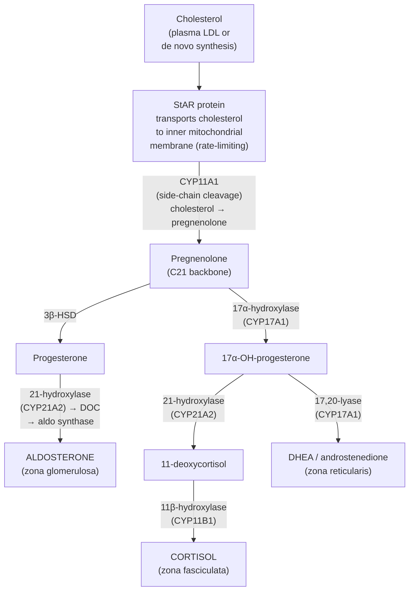
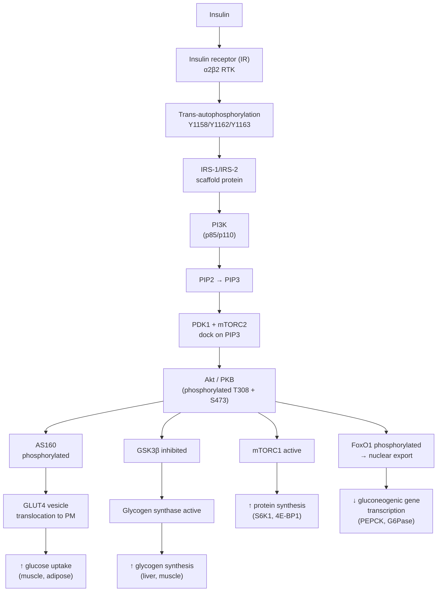
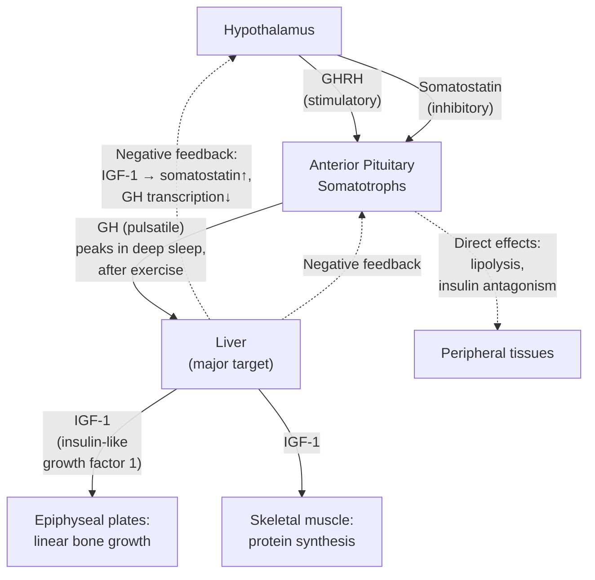
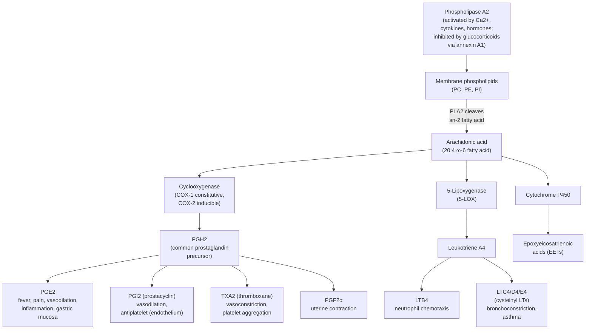
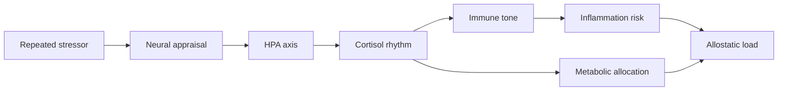

# Endocrine Signaling and Homeostasis

\label{sec:unit_IX_endocrine_signaling}

<!-- chapter-metadata-badge -->
> Level 2/3 · 30 min read · 40 min lecture · Prerequisites: \cref{sec:unit_IX_circulation_respiration_homeostasis}

## Learning Objectives

1. Compare endocrine and nervous system signaling in terms of speed, duration, and specificity.
2. Classify [**hormone**](#gl:hormone)s by chemical class (peptide, steroid, amine, eicosanoid) and describe their synthesis, transport, receptor location, and signaling duration.
3. Explain the HPA, HPT, and HPG axes with feedback regulation, including detailed steroidogenesis and the circadian profile of cortisol.
4. Trace insulin and glucagon signaling in glucose [**homeostasis**](#gl:homeostasis), including IR/IRS/PI3K/Akt/GLUT4, crosstalk with leptin and GLP-1, and the pathophysiology of diabetes.
5. Describe the adrenal gland structure and function (cortex and medulla), including cortisol synthesis from cholesterol.
6. Describe thyroid hormone synthesis, T4→T3 conversion, the nuclear receptor mechanism, and the Wolff-Chaikoff effect.
7. Describe the growth hormone axis and IGF-1.
8. Explain prostaglandin and eicosanoid synthesis from arachidonic acid; differentiate non-selective NSAIDs from COX-2 selective inhibitors.
9. Describe endocrine disruption by xenoestrogens, BPA, phthalates, and PFAS.

<!-- curriculum-scaffold-start -->
### Study Blueprint

- **Big idea:** Hormone feedback loops coordinate long-range physiological homeostasis.
- **Core concepts:** hormones, feedback, receptors, homeostasis.
- **Framework alignment:** Vision & Change: Structure and function, Systems; AP Biology: Systems Interactions, Energetics; NGSS-style topics: Structure and Function.
- **Model or quantitative lens:** Hormone feedback and dose-response reasoning.
- **Data skill:** Interpret endocrine time courses, panels, and perturbations.
- **Practice cadence:** Visual Representations, Statistical Tests and Data Analysis, Argumentation.
- **Common misconception to repair:** A hormone surge is not always pathological; context and set-point matter.
- **Primary lab:** \nameref{sec:lab_unit_IX_endocrine_signaling}.
- **Question bank:** \nameref{sec:q_unit_IX_endocrine_signaling}.
- **Transfer task:** Transfer endocrine reasoning to metabolism, stress, and development.
- **Bridge to computation:** `biology.physiology.physiology.homeostasis_response`.
<!-- curriculum-scaffold-end -->

---

> **Opening Vignette — The Hormone That Changed Medicine Forever**
>
> Before 1921, Type 1 diabetes was a death sentence. Children diagnosed with it were placed on starvation diets — sometimes eating fewer than 500 calories per day — which extended their lives by months while slowly wasting them. Then Frederick Banting, a young Canadian surgeon, persuaded the University of Toronto to give him laboratory space and a few dogs. Working with student Charles Best and biochemist J.B. Collip to purify the extract, they isolated the pancreatic secretion that controlled blood glucose — insulin. The first human injection was given to 14-year-old Leonard Thompson on January 11, 1922. He had been near death; within days his blood glucose normalized and he survived. Banting and John Macleod received the Nobel Prize in 1923. Insulin was the first hormone to be purified, the first to be sequenced (by Frederick Sanger, 1951), and the first to be produced by recombinant DNA technology (1982) \citep{sanger1955insulin}. No single molecule has had a more direct impact on human survival.

## Endocrine System Overview

### Endocrine vs Nervous System

: Endocrine vs Nervous System: Feature and Nervous System. {#tbl:unit_IX_endocrine_signaling_endocrine_vs_nervous_system}
| Feature | Nervous System | Endocrine System |
| ------- | -------------- | ---------------- |
| Signal type | Electrical + chemical (neurotransmitter) | Chemical (hormone) |
| Speed | Fast (ms) | Slow (seconds to hours) |
| Duration | Brief (ms) | Prolonged (minutes to days) |
| Target | Specific (synapse) | Widespread (most cells with receptor) |
| Distance | Short (synaptic cleft, 20 nm) | Long (via blood circulation) |

**Mixed signaling:** Neuroendocrine cells (e.g., hypothalamic [**neuron**](#gl:neuron)s secreting releasing hormones, adrenal medulla chromaffin cells) bridge both systems. Sterling and Eyer's concept of [**allostasis**](#gl:allostasis) \citep{sterling1988,sterling2015} extends Cannon's classical homeostasis \citep{cannon1932}: the brain anticipates physiological needs and adjusts setpoints predictively, integrating endocrine and autonomic outputs.

### Hormone Classes — Synthesis, Transport, and Mechanism

: Hormone Classes — Synthesis, Transport, and Mechanism: Class and Solubility. {#tbl:unit_IX_endocrine_signaling_hormone_classes_synthesis_transport_and_mechanism}
| Class | Solubility | Synthesis | Transport in Blood | Receptor Location | Signaling Speed | Duration | Examples |
| ----- | ---------- | --------- | ------------------ | ----------------- | ---------------- | -------- | -------- |
| **Peptide/[**protein**](#gl:protein)** | Water-soluble | Ribosomal synthesis as preprohormones; cleaved in ER/Golgi; stored in secretory granules | Free in plasma | Plasma membrane (RTKs, GPCRs) | Seconds to minutes | Minutes to hours | Insulin, glucagon, GH, ACTH, ADH, PTH, prolactin |
| **Steroid** | Lipid-soluble | Synthesized on demand from cholesterol (no storage); enzymatic cascades in mitochondria/SER | Bound to carrier proteins (CBG, SHBG, albumin) — about 5% free and bioactive | Nuclear receptors (intracellular) | Hours (transcription required) | Hours to days | [**Cortisol**](#gl:cortisol), aldosterone, estrogen, testosterone, vitamin D |
| **Amine — Catecholamines** | Water-soluble | Tyrosine → DOPA → dopamine → norepinephrine → epinephrine; stored in chromaffin granules | Free in plasma; very short half-life | Plasma membrane (α/β adrenergic GPCRs) | Seconds | Seconds to minutes | Epinephrine, norepinephrine, dopamine |
| **Amine — Thyroid hormones** | Lipid-soluble | Synthesized on iodinated thyroglobulin scaffold in colloid; T4 prohormone converted to T3 peripherally | 99.97% bound to TBG, transthyretin, albumin | Nuclear receptors (TRα, TRβ) | Hours (transcription required) | Days (T4 t½ ~7 d) | T3, T4 |
| **Eicosanoids** | Lipid-soluble | Generated locally on demand from arachidonic acid; not stored | Diffuse to neighboring cells (paracrine) | GPCRs and nuclear receptors (PPARs) | Seconds to minutes | Seconds to minutes (rapid degradation) | PGE$_2$, PGI$_2$, TXA$_2$, leukotrienes |

#### Hormone table — synthesis location, transport, receptor, half-life

: Hormone table — synthesis location, transport, receptor, half-life: Hormone and Class. {#tbl:unit_IX_endocrine_signaling_hormone_table_synthesis_location_transport_receptor_half_life}
| Hormone | Class | Synthesis location | Plasma transport | Receptor | Signal duration | Half-life |
| ------- | ----- | ------------------ | ---------------- | -------- | --------------- | --------- |
| **Insulin** | Peptide (51 aa) | β-cells, islets of Langerhans | Free | IR (RTK, plasma membrane) | Minutes | ~5 min |
| **Glucagon** | Peptide (29 aa) | α-cells, islets of Langerhans | Free | GcgR (G$_s$ GPCR, hepatocyte) | Minutes | ~5 min |
| **Growth hormone (GH)** | Peptide (191 aa) | Anterior pituitary somatotrophs | Free; some bound to GHBP | GHR (JAK2/STAT5 cytokine receptor, liver) | Hours (via IGF-1) | ~20 min |
| **PTH** | Peptide (84 aa) | Parathyroid chief cells | Free | PTH1R (G$_s$/G$_q$ GPCR; bone, kidney) | Minutes | ~4 min |
| **ADH (vasopressin)** | Peptide (9 aa) | Hypothalamic SON/PVN; stored in posterior pituitary | Free | V$_2$R (G$_s$, kidney); V$_1$R (G$_q$, vessels) | Minutes | ~15 min |
| **Cortisol** | Steroid (C$_{21}$) | Adrenal cortex (zona fasciculata) | 90% CBG; 5% albumin; 5% free | GR (NR3C1, cytoplasmic→nuclear) | Hours to days | ~60–90 min |
| **Aldosterone** | Steroid (C$_{21}$) | Adrenal cortex (zona glomerulosa) | ~50% bound to CBG/albumin | MR (NR3C2, cytoplasmic→nuclear) | Hours | ~20 min |
| **Testosterone** | Steroid (C$_{19}$) | Leydig cells (testis); zona reticularis (adrenal) | 60% SHBG; 38% albumin; 2% free | AR (NR3C4, cytoplasmic→nuclear) | Hours to days | ~70 min |
| **Oestradiol** | Steroid (C$_{18}$) | Ovarian granulosa cells (aromatase from androgens) | SHBG, albumin; 1–2% free | ERα/ERβ (nuclear); GPER (membrane) | Hours to days | ~13 h |
| **Progesterone** | Steroid (C$_{21}$) | Corpus luteum, placenta | CBG, albumin | PR (NR3C3, nuclear) | Hours | ~5 min |
| **Vitamin D (1,25-(OH)$_2$D$_3$)** | Steroid (secosteroid) | Kidney (CYP27B1 hydroxylation of 25-OH-D) | DBP (vitamin D binding protein) | VDR (nuclear) | Days | ~15 h |
| **Epinephrine** | Catecholamine | Adrenal medulla chromaffin cells | Free | α/β adrenergic (GPCRs) | Seconds–minutes | ~2 min |
| **Norepinephrine** | Catecholamine | Adrenal medulla; sympathetic neurons | Free | α/β adrenergic (GPCRs) | Seconds–minutes | ~2 min |
| **T4 (thyroxine)** | Iodinated tyrosine | Thyroid follicular cells | 99.97% TBG/TTR/albumin; 0.03% free | TRα/β (nuclear) after D2 conversion to T3 | Days–weeks | ~6–7 d |
| **T3 (triiodothyronine)** | Iodinated tyrosine | Thyroid (~20%); peripheral D1/D2 (~80%) | 99.7% bound; 0.3% free | TRα/β (nuclear) | Days | ~1 d |
| **Melatonin** | Indolamine | Pineal gland (from tryptophan via serotonin) | Albumin | MT$_1$, MT$_2$ (G$_i$ GPCRs) | Minutes–hours | ~30–50 min |
| **PGE$_2$** | Eicosanoid | Most cells (COX-2 inducible) | Local (paracrine) | EP$_1$–EP$_4$ (GPCRs) | Seconds | ~30 s |
| **TXA$_2$** | Eicosanoid | Platelets (TXAS) | Local | TP receptor (G$_q$) | Seconds | ~30 s |
| **Leptin** | Peptide (167 aa) | Adipocytes (proportional to fat mass) | Free; some bound | LepR (JAK2/STAT3, hypothalamus) | Hours | ~25 min |
| **Adiponectin** | Peptide (244 aa) | Adipocytes | Free; trimers/hexamers/HMW | AdipoR1, AdipoR2 (AMPK pathway) | Hours | ~14 h |

**Key contrasts:**

- **Speed vs duration trade-off.** Membrane receptor signaling (peptides, catecholamines) is fast but transient: cAMP, IP$_3$, and Ca$^{2+}$ signals decay in seconds when ligand washes away \citep{sutherland1958cyclicamp}. Nuclear receptor signaling (steroids, T3) is slow but persistent: transcribed mRNAs and translated proteins last hours to days.
- **Storage vs synthesis.** Peptide hormones are pre-synthesized and stored in granules ready for rapid release — insulin can be released within seconds of glucose elevation. Steroids cannot be stored (lipid-soluble, would diffuse away); they are synthesized on demand, which limits acute response speed.
- **Carrier proteins as a reservoir.** CBG (cortisol binding globulin), SHBG (sex hormone binding globulin), and TBG (thyroxine binding globulin) bind 95–99% of their target hormones. The bound fraction is biologically inactive but provides a circulating reservoir, buffering plasma levels and extending half-life. Free hormone is in equilibrium with bound; pregnancy elevates estrogen which raises CBG, increasing total cortisol while free cortisol remains normal.

### Quantitative Endocrinology

**Hormone–receptor binding.** The dissociation constant $K_d$ characterizes receptor affinity (lower $K_d$ = higher affinity):

\begin{equation}
K_d = \frac{[\text{H}][\text{R}]}{[\text{HR}]}; \qquad \text{fractional occupancy} = \frac{[\text{H}]}{[\text{H}] + K_d}
\label{eq:unit_IX_kd}
\end{equation}

Typical $K_d$ values: [**insulin receptor**](#gl:insulin-receptor) ~0.1 nM; glucocorticoid receptor ~5 nM; epinephrine at $\beta_2$ receptor ~1 μM. The enormous affinity difference explains why insulin circulates at picomolar concentrations while catecholamines require nanomolar–micromolar levels for effect.

**Hormone half-life and clearance.** Plasma hormone concentration decays exponentially after secretion ceases:

\begin{equation}
C(t) = C_0 \, e^{-kt}, \qquad k = \frac{\ln 2}{t_{1/2}}
\label{eq:unit_IX_halflife}
\end{equation}

Half-lives vary enormously: catecholamines ~1–2 min (rapid enzymatic degradation by MAO/COMT); cortisol ~60–90 min (hepatic metabolism); thyroid hormone (T4) ~6–7 days (protein binding extends clearance). Protein-bound hormones (e.g., TBG-bound T4, CBG-bound cortisol) are protected from degradation and renal filtration.

**Dose–response relationship.** The sigmoidal (Hill) dose–response curve relates hormone concentration to biological effect:

\begin{equation}
E = E_{\max} \cdot \frac{[\text{H}]^{n}}{EC_{50}^{n} + [\text{H}]^{n}}
\label{eq:unit_IX_doseresponse}
\end{equation}

where $EC_{50}$ is the concentration producing 50% of maximal effect and $n$ is the Hill coefficient (cooperativity). Spare receptors shift the $EC_{50}$ leftward from $K_d$: insulin requires occupation of about 5% of receptors for maximal glucose uptake.

**[Herd immunity](#gl:herd-immunity) threshold.** The fraction of the population that must be immune to prevent epidemic spread is:

\begin{equation}
p_c = 1 - \frac{1}{R_0}
\label{eq:unit_IX_herd}
\end{equation}

where $R_0$ is the basic reproductive number. For measles ($R_0 \approx 12$–18), $p_c \approx 92$–95%, explaining why even small drops in vaccination coverage trigger outbreaks.

---

## Hypothalamic-Pituitary Axes

The hypothalamus serves as the master integrator, linking the nervous and endocrine systems. It produces releasing and inhibiting hormones that control the anterior pituitary, which in turn controls target glands throughout the body.

**Anterior pituitary hormones:** ACTH (corticotrophs), TSH (thyrotrophs), GH (somatotrophs), LH and FSH (gonadotrophs), prolactin (lactotrophs).

**Posterior pituitary:** Stores and releases ADH (vasopressin) and oxytocin, which are synthesized in hypothalamic supraoptic and paraventricular nuclei and transported down axons to the posterior pituitary for release.

```mermaid
flowchart TD
    subgraph HPA ["HPA Axis (Stress Response)"]
        H1["Hypothalamus<br/>PVN neurons"] -->|"CRH"| P1["Anterior Pituitary<br/>Corticotrophs"]
        P1 -->|"ACTH"| A1["Adrenal Cortex<br/>Zona Fasciculata"]
        A1 -->|"CORTISOL"| T1["Target Tissues:<br/>Gluconeogenesis<br/>Immunosuppression<br/>Lipolysis<br/>Muscle catabolism"]
        T1 -.->|"Negative feedback<br/>at hypothalamus<br/>and pituitary"| H1
        T1 -.->|"Negative feedback"| P1
    end

    subgraph HPT ["HPT Axis (Metabolism)"]
        H2["Hypothalamus"] -->|"TRH"| P2["Anterior Pituitary<br/>Thyrotrophs"]
        P2 -->|"TSH"| Th["Thyroid Gland<br/>Follicular Cells"]
        Th -->|"T4 then T3"| T2["Target Tissues:<br/>Basal metabolic rate<br/>Na+/K+-ATPase<br/>Cardiac contractility<br/>Neurodevelopment"]
        T2 -.->|"Negative feedback"| H2
        T2 -.->|"Negative feedback"| P2
    end

    subgraph HPG ["HPG Axis (Reproduction)"]
        H3["Hypothalamus<br/>(Pulsatile GnRH)"] -->|"GnRH"| P3["Anterior Pituitary<br/>Gonadotrophs"]
        P3 -->|"LH + FSH"| G["Gonads"]
        G -->|"Sex steroids<br/>(E2, T, P4)"| T3["Target Tissues:<br/>Sexual development<br/>Reproductive function<br/>Bone density<br/>Muscle mass"]
        T3 -.->|"Negative feedback<br/>(except mid-cycle<br/>positive feedback<br/>of E2 causing LH surge)"| H3
    end
```

<!-- alt: Flowchart showing three major hypothalamic-pituitary axes Each follows the same hierarchical pattern: hypothalamic releasing hormone stimulates anterior pituitary tropic hormone, which stimulates target gland hormone production. Negative feedback at multiple levels prevents overstimulation. The HPG axis uniquely features positive feedback during the mid-cycle LH surge. -->

*The three major hypothalamic-pituitary axes Each follows the same hierarchical pattern: hypothalamic releasing hormone stimulates anterior pituitary tropic hormone, which stimulates target gland hormone production. Negative feedback at multiple levels prevents overstimulation. The HPG axis uniquely features positive feedback during the mid-cycle LH surge.*

### HPA Axis (Hypothalamic-Pituitary-Adrenal) — Detailed Cortisol Physiology

#### Cortisol synthesis from cholesterol (steroidogenesis)

Most adrenal steroids derive from cholesterol via a series of cytochrome P450-mediated hydroxylations and oxidations. The rate-limiting step is the transport of cholesterol from the outer to the inner mitochondrial membrane, mediated by **StAR (steroidogenic acute regulatory protein)** and stimulated by ACTH via cAMP/PKA.

<!-- alt: Flowchart showing adrenal steroidogenesis The pathway diverges from common precursor pregnenolone into three parallel routes producing aldosterone (zona glomerulosa), cortisol (zona fasciculata), and androgens (zona reticularis). Each zone expresses zone-specific enzymes; for example, primarily the zona glomerulosa expresses aldosterone synthase (CYP11B2), and primarily the zona fasciculata expresses 11β-hydroxylase (CYP11B1). -->

*Adrenal steroidogenesis The pathway diverges from common precursor pregnenolone into three parallel routes producing aldosterone (zona glomerulosa), cortisol (zona fasciculata), and androgens (zona reticularis). Each zone expresses zone-specific enzymes; for example, primarily the zona glomerulosa expresses aldosterone synthase (CYP11B2), and primarily the zona fasciculata expresses 11β-hydroxylase (CYP11B1).*

#### Glucocorticoid receptor (GR) mechanism

Cortisol diffuses freely across the plasma membrane (lipid-soluble) and binds the cytoplasmic GR (NR3C1). In the unliganded state, GR is held in an inactive complex with HSP90, HSP70, and immunophilins. Cortisol binding induces a conformational change, releasing the chaperones and exposing nuclear localization signals. The activated GR translocates to the nucleus, dimerises, and binds **glucocorticoid response elements (GREs)** in target gene promoters with the consensus sequence 5'-AGAACAnnnTGTTCT-3'.

GR has **two transcriptional modes:**

- **Transactivation** at positive GREs: directly upregulates gluconeogenic enzymes (PEPCK, G6Pase) and anti-inflammatory proteins (annexin A1, MKP-1, IκBα, IL-10).
- **Transrepression** by tethering to NF-κB or AP-1: GR binds these pro-inflammatory transcription factors and prevents their activation of cytokine genes (IL-2, IL-6, TNF-α, COX-2). Transrepression mediates much of the anti-inflammatory action of glucocorticoid drugs.

The dual mechanism is therapeutically central. Most classical glucocorticoids (prednisone, dexamethasone) drive both modes — the unwanted metabolic effects (hyperglycaemia, osteoporosis, muscle wasting) come predominantly from transactivation, while the anti-inflammatory benefit comes mostly from transrepression. Pharmaceutical efforts to design "selective GR agonists" (SEGRAs) that drive transrepression preferentially have been an enduring (but largely unrealised) goal.

#### Cortisol effects (anti-inflammatory gene program)

- **Gluconeogenesis** (transactivation of PEPCK, G6Pase via GR; mobilizes amino acids from muscle protein catabolism)
- **Immunosuppression** at multiple levels:
  - Direct: NF-κB inhibition; lymphocyte [**apoptosis**](#gl:apoptosis); suppression of IL-2 transcription; mast-cell stabilization
  - Indirect: induction of IL-10, TGF-β, annexin A1; suppression of leukocyte trafficking by reducing E-selectin and ICAM-1
  - Net cytokine effect: **down** TNF-α, IL-1β, IL-2, IL-6, IFN-γ; **up** IL-10
- **Lipolysis** in peripheral adipose tissue (with central fat redistribution from chronic excess)
- **Anti-inflammatory** (inhibits COX-2, phospholipase A$_2$ via annexin A1 induction; reduces histamine, leukotriene production)
- **Permissive effects** on catecholamine action (β-adrenergic receptor expression maintenance)
- **Bone resorption** (chronic excess: osteoporosis via direct osteoblast suppression and indirect calcium handling)
- **CNS effects** (mood — chronic excess: depression, psychosis, cognitive impairment via hippocampal atrophy)

#### Circadian rhythm and feedback

Cortisol secretion follows a robust **circadian rhythm** driven by the suprachiasmatic nucleus (SCN): peak at approximately 08:00 (cortisol awakening response, CAR), nadir at midnight. Superimposed are **ultradian pulses** every 60–90 minutes. The pulsatile pattern is essential for proper GR function — continuous (non-pulsatile) cortisol exposure desensitises target tissues.

Schematically, plasma cortisol $\approx 18\,\mu\text{g/dL}$ at 08:00, drops through the day to $\approx 8\,\mu\text{g/dL}$ at 16:00, and is $<5\,\mu\text{g/dL}$ at midnight. Disrupted circadian rhythm (shift work, depression, Cushing's) loses the diurnal variation; **midnight salivary cortisol** is one of the most sensitive screening tests for endogenous Cushing's syndrome.

**Negative feedback** operates at two levels:

- **Fast feedback** (minutes): non-genomic; cortisol acts on hypothalamic CRH neurons via membrane GRs and presynaptic endocannabinoid release to suppress CRH secretion within minutes.
- **Slow feedback** (hours): genomic; cortisol downregulates POMC gene transcription (the ACTH precursor) in pituitary corticotrophs and CRH transcription in hypothalamus.

#### Stress vs basal regulation

Under **basal (non-stress)** conditions, the HPA axis runs on its circadian/ultradian rhythm with tight negative feedback. The day's cortisol output is roughly 10–20 mg/24 h.

Under **acute stress** (trauma, hypoglycaemia, infection, surgery), hypothalamic PVN neurons receive convergent inputs (limbic, brainstem, circulating cytokines, baroreceptors) and override basal restraint:

- CRH secretion rises 5–10 fold
- ACTH plasma concentration rises within 5–15 min
- Cortisol peaks ~30 min after stress onset
- Cortisol output can increase 3–10 fold over basal (50–100 mg/24 h in major surgery)
- Negative feedback is partially suppressed, allowing sustained elevation

Chronic psychosocial stress engages the same axis but with **glucocorticoid receptor downregulation** and **flattened diurnal rhythm** — features now linked to metabolic syndrome, depression, hippocampal atrophy, and accelerated cognitive decline.

**Pathology:**

- **Cushing's syndrome:** Cortisol excess. Causes: pituitary adenoma (Cushing's disease, 70%), ectopic ACTH (lung small cell carcinoma), adrenal adenoma, iatrogenic (chronic glucocorticoid therapy). Features: central obesity, moon face, purple striae, hyperglycaemia, osteoporosis, immunosuppression, hypertension (cortisol cross-reacts with mineralocorticoid receptor).
- **Addison's disease:** Primary adrenal insufficiency (cortisol deficiency). Most common cause: autoimmune adrenalitis. Features: hypotension, hyperpigmentation (elevated ACTH drives melanocyte-stimulating hormone activity, since both are cleaved from the same precursor POMC), fatigue, salt craving. Can cause life-threatening adrenal crisis.

> **Clinical Connection:** The dexamethasone suppression test exploits negative feedback to diagnose Cushing's syndrome. Dexamethasone is a synthetic glucocorticoid that normally suppresses CRH and ACTH secretion. In Cushing's disease (pituitary adenoma), low-dose dexamethasone fails to suppress cortisol, but high-dose dexamethasone does. In ectopic ACTH production, neither dose suppresses cortisol. This distinguishes the source of excess cortisol.

### HPT Axis (Hypothalamic-Pituitary-Thyroid) — Detailed Mechanism

#### Thyroid hormone synthesis

Follicular cells of the thyroid gland surround a colloid-filled follicle and execute a multi-step iodination process:

1. **Iodide uptake.** The basolateral Na$^+$/I$^-$ symporter (NIS) actively concentrates iodide ~25–100-fold above plasma. Pertechnetate ($^{99m}$TcO$_4^-$) is also transported by NIS and is used in thyroid scintigraphy.
2. **Thyroglobulin synthesis.** Follicular cells produce thyroglobulin (Tg, ~660 kDa glycoprotein with ~120 tyrosine residues), packaged into vesicles and exocytosed into the colloid lumen.
3. **Iodide oxidation and tyrosine iodination.** At the apical membrane, **thyroid peroxidase (TPO)** oxidises I$^-$ to a reactive iodinating species (I$_2$ or I$^+$) using H$_2$O$_2$ as cofactor. Tyrosines on Tg are iodinated to form monoiodotyrosine (MIT) and diiodotyrosine (DIT).
4. **Coupling reaction.** Still on the Tg scaffold, TPO catalyses oxidative coupling: DIT + DIT → T4 (thyroxine, 4 iodines); MIT + DIT → T3 (3 iodines).
5. **Endocytosis and proteolysis.** TSH stimulation triggers endocytosis of Tg into the follicular cell, where lysosomal proteases cleave the iodothyronines from Tg. T4 and T3 are released into the bloodstream.
6. **Recycling.** MIT and DIT not coupled into T3/T4 are deiodinated by intracellular dehalogenase, recycling iodide.

#### Wolff-Chaikoff effect

Acutely high iodide (e.g., from radiocontrast, amiodarone, or seaweed binge) paradoxically **inhibits** thyroid hormone synthesis: excess iodide downregulates NIS expression and impairs TPO-mediated organification. Most healthy individuals "escape" within 7–10 days as NIS resets. In patients with autoimmune thyroid disease, escape may fail — producing **iodine-induced hypothyroidism**. Conversely, in nodular goitres with autonomous follicles, iodine load can drive **iodine-induced hyperthyroidism (Jod-Basedow)**. The Wolff-Chaikoff effect is exploited therapeutically: **potassium iodide** (Lugol's solution, SSKI) is given pre-operatively in Graves' disease to reduce thyroid vascularity and slow hormone release before thyroidectomy.

#### T4 → T3 conversion (deiodinases)

T4 is the predominant secreted form (~80%) but is largely a **prohormone**. Three iodothyronine deiodinases activate or inactivate T4 in target tissues:

: T4 → T3 conversion (deiodinases): Deiodinase and Reaction. {#tbl:unit_IX_endocrine_signaling_t4_t3_conversion_deiodinases}
| Deiodinase | Reaction | Tissue | Function |
| ---------- | -------- | ------ | -------- |
| **D1** | T4 → T3 (5'-deiodination) | Liver, kidney, thyroid | Bulk plasma T3 production |
| **D2** | T4 → T3 (5'-deiodination) | Brain, pituitary, brown adipose | Local T3 generation; pituitary feedback set-point |
| **D3** | T4 → reverse T3 (rT3); T3 → T2 | Placenta, fetal tissues | Inactivation; protects fetus from maternal T3 |

T3 is **~4× more potent** than T4 at the nuclear receptor. During fasting, illness, or stress (non-thyroidal illness), D1 activity drops and D3 activity rises, shifting balance toward inactive rT3 — adaptive metabolic slowing.

#### Nuclear thyroid receptor mechanism

T3 enters cells via MCT8/MCT10 transporters and binds nuclear **thyroid hormone receptors TRα (cardiac, neural)** and **TRβ (liver, pituitary)**. TRs heterodimerise with **RXR (retinoid X receptor)** and bind **thyroid response elements (TREs)** in target gene promoters — even in the absence of T3.

- **Without T3:** Unliganded TR/RXR recruits corepressors (NCoR, SMRT, HDACs) and **represses** target gene transcription.
- **With T3:** Conformational change releases corepressors and recruits coactivators (SRC-1, p300/CBP, histone acetyltransferases) → **active transcription**.

This dual mechanism explains why hypothyroidism causes such pronounced symptoms: target genes are not merely "not turned on" but are actively repressed below baseline.

#### Effects on metabolism

- **Increased basal metabolic rate (BMR)** through upregulation of Na$^+$/K$^+$-ATPase (each cell uses ~25% of ATP for this pump; T3 increases pump density).
- **Mitochondrial uncoupling** via UCP-mediated proton leak (heat production, calorigenic effect).
- **Increased cardiac output** ($\beta_1$-adrenergic receptor upregulation; positive chronotropic and inotropic effects).
- **Lipolysis and cholesterol degradation** (hyperthyroidism lowers LDL; hypothyroidism causes hypercholesterolaemia).
- **Neurodevelopment:** essential for myelination, synaptogenesis, neuronal migration in fetus and infant. Severe untreated congenital hypothyroidism produces cretinism (intellectual disability, growth retardation) — preventable by neonatal screening.

**Pathology:**

- **Hypothyroidism:** Low T3/T4, elevated TSH. Hashimoto's thyroiditis (autoimmune; anti-TPO and anti-thyroglobulin antibodies). Features: fatigue, weight gain, cold intolerance, bradycardia, constipation, myxoedema.
- **Hyperthyroidism:** High T3/T4, suppressed TSH. Graves' disease (autoimmune; TSH receptor-stimulating antibodies — thyroid-stimulating immunoglobulins, TSI). Features: weight loss, heat intolerance, tachycardia/atrial fibrillation, tremor, exophthalmos (due to retro-orbital inflammation), diffuse goitre.
- **Iodine deficiency:** Most common preventable cause of intellectual disability worldwide; affects approximately 1.9 billion people. Addressed by salt iodisation programs.

### Worked Example: Thyroid Hormone Negative Feedback and TSH Compensatory Rise

**Problem:** A healthy adult has steady-state TSH around 2 mU/L, T4 around 100 nmol/L (within normal range), and a free T3 set by peripheral D1/D2 deiodination. Autoimmune destruction (Hashimoto's thyroiditis) reduces T4 secretion capacity by approximately 60%. Predict the new steady-state TSH, estimate the time to reach the new steady state, and identify the rate-limiting step.

**Setup of the feedback loop.** Proportional error correction toward a set point (\cref{fig:unit_IX_homeostasis_feedback}) is the generic logic shared by endocrine axes and other homeostatic controllers.

\begin{figure}[htbp]
\centering
\includegraphics[width=0.85\textwidth]{../figures/homeostasis_feedback.png}
\caption{Proportional negative-feedback correction of a temperature deviation toward a set point. Each iteration applies a corrective response proportional to the measured error.}
\label{fig:unit_IX_homeostasis_feedback}
\end{figure}

<!-- alt: Line plot of measured temperature converging toward set point with overlaid corrective responses. -->

$$\text{TRH (hypothalamus)} \longrightarrow \text{TSH (anterior pituitary)} \longrightarrow \text{T4 (thyroid)} \xrightarrow{\text{D1/D2}} \text{T3 (active)}.$$

T3 (and to a lesser extent T4) feeds back negatively on both TRH and TSH transcription. The loop is well approximated as a near-linear feedback over the clinically observed range: a $k$-fold drop in T4 input drives an approximately $k$-fold (often higher because of nonlinearity at low T4) rise in TSH.

**Solution.**

1. **Steady-state TSH after damage.** A 60% reduction in T4 input ($\times 0.4$) typically produces an approximately 10-fold rise in TSH at the new equilibrium (the system is *nonlinearly* sensitive at low T4 because TRH transcription is sharply derepressed). New TSH $\approx 2 \times 10 = 20$ mU/L — squarely in the overt-hypothyroid range.

2. **Half-lives that set the time-to-steady-state.**

   - TSH plasma half-life: $t_{1/2} \approx 50$ min. Time constant $\tau_{\text{TSH}} = t_{1/2} / \ln 2 \approx 72$ min.
   - T4 plasma half-life: $t_{1/2} \approx 7$ d. Time constant $\tau_{\text{T4}} = 7 / 0.693 \approx 10$ d.

3. **Rate-limiting step.** The slow variable governs convergence. Even though TSH responds within hours, the actual T4 distribution re-equilibrates on the order of $3 \tau_{\text{T4}} \approx 30$ days to reach approximately 95% of the new steady state, and approximately $5 \tau_{\text{T4}} \approx 50$ days to reach approximately 99%. *Practical implication:* TSH measured 1–2 weeks after starting levothyroxine replacement is misleading — the T4 pool has not finished re-equilibrating. Clinical guidelines correctly recommend re-checking TSH 6–8 weeks after any dose change.

4. **Sanity check with the loop gain.** Order-of-magnitude: loop gain (sensitivity of TSH to T4) at the operating point is approximately $-2$ (one-log T4 drop → approximately 2-log TSH rise, per the log-linear TSH–T4 relationship that clinicians use at the bedside). Our predicted approximately 10-fold TSH rise for an approximately 2.5-fold T4 drop is consistent with this gain. The same logarithmic logic explains why a small dose of levothyroxine restoring T4 to a near-normal value rapidly normalizes TSH — provided one waits a full T4 half-life-set.

**Interpretation.** Hashimoto's hypothyroidism is *biochemically* a textbook negative-feedback restoration problem. The clinical art is timing: lab measurements taken before the T4 pool re-equilibrates will lead to over-dosing. The molecular ledger — TRH at the top, T4 half-life at the bottom — determines that we must wait approximately 6–8 weeks before believing the TSH number.

### HPG Axis and Reproductive Hormones

**GnRH pulsatility is critical:** High-frequency pulses (every 60–90 min) favor LH secretion; low-frequency pulses (every 2–4 h) favor FSH. Continuous GnRH paradoxically suppresses the axis (downregulates GnRH receptors), which is the basis of GnRH agonist therapy for prostate cancer, endometriosis, and precocious puberty.

**Male reproductive endocrinology:** LH stimulates Leydig cells (testosterone production). FSH + testosterone stimulate Sertoli cells (support spermatogenesis; produce inhibin B, which provides negative feedback on FSH). Testosterone effects: muscle mass, bone density, secondary sexual characteristics, spermatogenesis, libido.

**Female menstrual cycle (28-day average):**

- **Follicular phase** (days 1–14): FSH promotes follicular growth. [**Dominant**](#gl:dominant) follicle produces rising oestradiol. Oestradiol initially provides negative feedback.
- **Ovulation** (day approximately 14): **Positive feedback** — sustained high oestradiol above a threshold for >36 h switches from negative to positive feedback, triggering an LH surge. The LH surge induces ovulation (follicular rupture, oocyte release).
- **Luteal phase** (days 14–28): Corpus luteum (remnant of ovulated follicle) produces progesterone + oestradiol. Progesterone prepares the endometrium for implantation (secretory phase). If no implantation occurs, corpus luteum degenerates (luteolysis), progesterone and oestradiol fall, endometrium sheds (menstruation).

**Development and reproduction as endocrine timing problems:** Fertilization, implantation, placentation, fetal growth, birth, lactation, puberty, and reproductive senescence depend on timed endocrine signals interacting with local tissue cues. Early embryos are initially regulated by maternal transcripts and local morphogen gradients; later development adds fetal-placental endocrine exchange, thyroid-hormone-dependent neurodevelopment, glucocorticoid-driven lung maturation, and sex-steroid-dependent reproductive tract differentiation. Clinically, infertility is diagnosed after 12 months of regular unprotected intercourse without pregnancy (or after 6 months when the female partner is 35 years or older), because reproductive physiology depends on ovulation, sperm production, tubal transport, implantation, uterine receptivity, endocrine timing, and age-dependent gamete quality \citep{cdc2024reproductivehealth}. The organismal point is that reproduction is not one organ system; it is a coordinated life-history transition linking gonads, hypothalamus, pituitary, placenta, metabolism, immune tolerance, and behavior.

> **Concept Check 1:** Why does continuous GnRH administration paradoxically suppress the HPG axis rather than stimulate it? How is this exploited clinically in prostate cancer treatment, where the goal is to lower testosterone?

---

## Pancreatic Hormones, Glucose Homeostasis, and Energy Balance

**Normal fasting blood glucose:** 4.0–5.5 mmol/L (72–99 mg/dL). Post-prandial peak: <7.8 mmol/L (<140 mg/dL).

### Insulin signaling — molecular detail

**After a meal (high glucose):**

1. Glucose enters β-cells via GLUT2 transporter (high-K$_m$ "glucose sensor")
2. Glucose metabolism increases the ATP/ADP ratio
3. ATP-sensitive K$^+$ channels (K$_{ATP}$, SUR1/Kir6.2 subunits) close → membrane depolarization
4. Voltage-gated L-type Ca$^{2+}$ channels open → Ca$^{2+}$ influx
5. Ca$^{2+}$ triggers **insulin exocytosis** from dense-core granules (mature insulin = A and B chains held by disulphide bonds; C-peptide co-released as marker) \citep{sanger1955insulin}
6. **Insulin signaling in target cells:**
   - Insulin binds **insulin receptor (IR)** — an $\alpha_2\beta_2$ tetrameric receptor tyrosine kinase. Each α-subunit is extracellular and binds insulin; β-subunits span the membrane and contain intracellular tyrosine kinase domains.
   - Binding causes conformational change → **trans-autophosphorylation** of β-subunit tyrosine residues (Y1158, Y1162, Y1163 in the activation loop)
   - Phosphotyrosines recruit **IRS1/IRS2** scaffold proteins → IRS phosphorylation
   - IRS phosphotyrosines recruit **PI3K** (p85 regulatory + p110 catalytic) via SH2 domains
   - PI3K converts PIP$_2$ → **PIP$_3$**; PDK1 and mTORC2 dock on PIP$_3$ and activate **Akt (PKB)** by phosphorylation at T308 and S473
   - **Akt phosphorylates AS160 (TBC1D4)**, releasing Rab-GAP inhibition of GLUT4-vesicle exocytosis → **[GLUT4](#gl:glut4) translocation to plasma membrane** in muscle and adipose (the dominant mechanism for postprandial glucose disposal)
   - **Akt inhibits GSK3β** → glycogen synthase activation → **glycogen synthesis**
   - **Akt activates mTORC1** → ribosomal S6K1 and 4E-BP1 phosphorylation → **protein synthesis**
   - **Akt phosphorylates FoxO1** → nuclear export → represses gluconeogenic gene transcription (PEPCK, G6Pase)

<!-- alt: Flowchart showing insulin signaling cascade. Insulin binding to IR triggers trans-autophosphorylation, recruitment of IRS, activation of PI3K, generation of PIP_3, and activation of Akt. Akt drives GLUT4 translocation, glycogen synthesis, protein synthesis, and suppression of gluconeogenic gene transcription. -->

*Insulin signaling cascade. Insulin binding to IR triggers trans-autophosphorylation, recruitment of IRS, activation of PI3K, generation of PIP$_3$, and activation of Akt. Akt drives GLUT4 translocation, glycogen synthesis, protein synthesis, and suppression of gluconeogenic gene transcription.*

### Worked Example: Postprandial Glucose Clearance and Insulin Dose Scaling

**Problem:** A 70 kg adult absorbs 75 g glucose from a meal. Skeletal muscle stores ~400 g glycogen and can take up glucose at ~8 mg kg$^{-1}$ min$^{-1}$ when insulin is maximal. If peak plasma insulin reaches 80 mU/L and insulin half-life is 5 min, estimate (a) the muscle glucose-uptake capacity over the first 30 min, and (b) whether hepatic glycogen synthesis must also contribute \citep{yalow1959}.

**Solution.**

1. **Muscle uptake capacity.** Rate = $8\,\text{mg kg}^{-1}\text{ min}^{-1} \times 70\,\text{kg} = 560\,\text{mg min}^{-1}$.
   Over 30 min: $560 \times 30 = 16{,}800\,\text{mg} = 16.8\,\text{g}$.

2. **Compare to absorbed load.** Absorbed glucose = 75 g. Muscle alone disposes of roughly 22% of the load in 30 min at this rate, so liver glycogen synthesis and delayed muscle uptake over 2–3 h are required — consistent with the biphasic insulin secretory response and sustained Akt signaling.

3. **Insulin decay check.** With $t_{1/2} = 5$ min, insulin falls to 25 mU/L at 5 min and ~6 mU/L at 15 min ($80 \times 0.5^{15/5}$). GLUT4 translocation tracks Akt activity, so the second-phase insulin pulse (not modeled here) extends disposal beyond the first 30 min.

**Interpretation.** Postprandial normoglycaemia depends on coordinated muscle GLUT4 translocation and hepatic glycogen storage; the numeric comparison shows why isolated muscle uptake is insufficient to clear a 75 g load within half an hour.

#### Glucagon signaling

**During fasting (low glucose):**

1. α-cells release **glucagon** (triggered by low glucose, sympathetic activation, amino acids)
2. Glucagon binds G$_s$-coupled receptor on hepatocytes \citep{sutherland1958cyclicamp}
3. cAMP-PKA pathway: phosphorylase kinase activates **glycogen phosphorylase** for **glycogenolysis**
4. cAMP also activates **CREB** → PEPCK and G6Pase gene transcription → **gluconeogenesis**
5. PKA phosphorylates and inhibits PFK-2/FBPase-2 (PFKFB1), lowering F2,6BP → favors fructose-1,6-bisphosphatase over PFK-1 → gluconeogenesis dominates

#### Crosstalk with leptin, adiponectin, and GLP-1

**Leptin** is secreted by adipocytes in proportion to fat mass and acts on hypothalamic neurons (arcuate nucleus POMC and AgRP/NPY neurons) via the leptin receptor (LepR, JAK2/STAT3 signaling) to suppress appetite and increase energy expenditure. Leptin enhances central insulin sensitivity and provides a long-term signal of energy stores. Most obese individuals have high leptin but show **leptin resistance** — impaired hypothalamic LepR signaling and JAK2/STAT3 attenuation, partly via SOCS3 induction.

**Adiponectin** is also secreted by adipocytes — but **inversely** with fat mass (higher in lean states). It acts via AdipoR1 and AdipoR2, activating **AMPK** (AMP-activated protein kinase, the cellular "energy sensor"). AMPK activation:

- Increases fatty acid oxidation (phosphorylates ACC, decreasing malonyl-CoA, releasing CPT-1 from inhibition)
- Decreases hepatic gluconeogenesis (decreases CREB-regulated transcription)
- Increases skeletal muscle glucose uptake (independent of insulin)
- Decreases mTORC1 and protein synthesis (reciprocal to insulin/Akt)

Adiponectin therefore acts as an **insulin sensitiser**. Plasma adiponectin is reduced in T2DM, obesity, and metabolic syndrome; pioglitazone (a thiazolidinedione, PPARγ agonist) raises adiponectin and improves insulin sensitivity.

**GLP-1 (glucagon-like peptide 1)** is an **incretin** released from intestinal L-cells in response to nutrient ingestion. It acts via GLP-1R (G$_s$-coupled GPCR) to:

- Enhance glucose-dependent insulin secretion (primarily when glucose elevated → low hypoglycaemia risk)
- Suppress glucagon release from α-cells
- Slow gastric emptying
- Activate hypothalamic anorexigenic circuits → reduce food intake
- Promote β-cell survival and proliferation (animal studies)

GLP-1 has a very short half-life (~2 min) due to degradation by **DPP-4** (dipeptidyl peptidase-4). Drug strategies: GLP-1 analogs with DPP-4–resistant modifications (semaglutide, liraglutide), or DPP-4 inhibitors (sitagliptin) that prolong endogenous GLP-1.

### Diabetes Mellitus

**Type 1 diabetes mellitus (T1DM):**

- Autoimmune destruction of β-cells (anti-GAD65, anti-IA-2, anti-insulin, anti-ZnT8 antibodies)
- Complete insulin deficiency
- Onset usually in childhood/adolescence (but can occur at any age — "LADA" in adults)
- Without insulin: hyperglycaemia, ketoacidosis (lipolysis produces FFA, hepatic β-oxidation produces ketone bodies, metabolic acidosis)
- Treatment: exogenous insulin (basal-bolus regimen), increasingly closed-loop insulin pump systems

**Type 2 diabetes mellitus (T2DM):**

- Peripheral insulin resistance: ceramide and pro-inflammatory cytokines (TNF-α, IL-6 from visceral adipose tissue) cause serine phosphorylation of IRS1, blocking normal tyrosine phosphorylation. ER stress and mitochondrial dysfunction also contribute.
- Compensatory β-cell hyperinsulinaemia initially maintains normoglycaemia
- Progressive β-cell failure (glucotoxicity, lipotoxicity, amyloid deposition) leads to overt hyperglycaemia
- Treatment: lifestyle modification + metformin (AMPK activation, reduced hepatic glucose production) + GLP-1 receptor agonists (semaglutide) + SGLT2 inhibitors (empagliflozin: blocks renal glucose reabsorption)

> **Clinical Connection:** Semaglutide (Ozempic/Wegovy) has transformed T2DM and obesity management. Clinical trials show 15–20% body weight reduction with semaglutide, plus cardiovascular and renal benefits, by mimicking natural GLP-1 signaling at hypothalamic appetite centers and pancreatic β-cells.

> **Concept Check 2:** A type-1 diabetic receives a long-acting insulin analog (glargine) once daily. Blood glucose is well controlled during the day but the patient develops reactive hyperglycaemia every morning ("dawn phenomenon"). Given that cortisol, GH, and glucagon most rise in the pre-waking hours, explain *which* counter-regulatory hormones are responsible for the morning rise and *why* glargine's 24-hour profile is insufficient to cover it. What feature of a more modern analog (e.g. degludec, with ~42-h half-life) addresses this?

### Adrenal Gland — Zonal Architecture

**Adrenal cortex** (mesodermal origin, steroid hormones):

- **Zona glomerulosa:** Aldosterone (mineralocorticoid). Regulated by RAAS and K$^+$. Promotes Na$^+$ reabsorption, K$^+$ secretion in collecting duct.
- **Zona fasciculata:** Cortisol (glucocorticoid). Regulated by ACTH.
- **Zona reticularis:** DHEA, androstenedione (adrenal androgens). Puberty (adrenarche).

**Adrenal medulla** (neural crest origin, modified sympathetic ganglion):

- Chromaffin cells release epinephrine (80%) and norepinephrine (20%) directly into blood
- Epinephrine effects: heart rate increase ($\beta_1$), bronchodilation ($\beta_2$), glycogenolysis ($\beta_2$ in liver), lipolysis ($\beta_3$ in adipose), vasoconstriction ($\alpha_1$) in skin/viscera, vasodilation ($\beta_2$) in skeletal muscle
- Duration: seconds to minutes (rapid metabolic clearance by MAO and COMT)

### Growth Hormone Axis and IGF-1

<!-- alt: Flowchart showing growth hormone axis GHRH stimulates and somatostatin inhibits pituitary GH release. GH acts directly on tissues (lipolysis, insulin antagonism — "diabetogenic") and indirectly via hepatic IGF-1, which mediates linear growth and protein synthesis. IGF-1 provides negative feedback at hypothalamus (somatostatin) and pituitary (GH transcription). -->

*Growth hormone axis GHRH stimulates and somatostatin inhibits pituitary GH release. GH acts directly on tissues (lipolysis, insulin antagonism — "diabetogenic") and indirectly via hepatic IGF-1, which mediates linear growth and protein synthesis. IGF-1 provides negative feedback at hypothalamus (somatostatin) and pituitary (GH transcription).*

GH from anterior pituitary somatotrophs: pulsatile release (peaks during deep sleep and exercise). GH binds the GH receptor (a JAK2-coupled cytokine receptor) on hepatocytes, activating STAT5, which drives **IGF-1 (insulin-like growth factor 1)** transcription and secretion. Circulating IGF-1 is bound to IGFBP-3 (extends half-life from minutes to hours).

**GH/IGF-1 effects:**

- Linear bone growth (epiphyseal plate chondrogenesis driven by IGF-1)
- Protein synthesis (positive nitrogen balance)
- Lipolysis (direct GH effect; "diabetogenic")
- Reduced peripheral glucose uptake (GH antagonises insulin)

**Pathology:**

- **Acromegaly:** Excess GH in adults (pituitary adenoma). Characteristic features: enlarged hands, feet, jaw; organomegaly; impaired glucose tolerance. Diagnosed by failure to suppress GH during oral glucose tolerance test.
- **Gigantism:** Excess GH before epiphyseal plate closure (childhood). Tall stature.
- **GH deficiency in children:** Short stature; treated with recombinant human GH (somatropin).
- **Laron syndrome:** GH receptor mutation; high GH but no IGF-1 response. Short stature; remarkably, low IGF-1 confers resistance to cancer and diabetes.

---

## Prostaglandins and Eicosanoids

**Eicosanoids** are 20-carbon paracrine signaling lipids derived from membrane phospholipids. Unlike conventional hormones, they are not stored, are synthesized on demand, act locally (paracrine/autocrine), and are rapidly inactivated.

### Synthesis from arachidonic acid

<!-- alt: Flowchart showing eicosanoid biosynthesis pathways Phospholipase A_2 liberates arachidonic acid from membrane phospholipids. Three branches generate distinct families: cyclooxygenase (COX) → prostaglandins and thromboxanes; 5-lipoxygenase → leukotrienes; cytochrome P450 → epoxyeicosatrienoic acids. Glucocorticoids inhibit at the PLA_2 step; NSAIDs inhibit at COX. -->

*Eicosanoid biosynthesis pathways Phospholipase A$_2$ liberates arachidonic acid from membrane phospholipids. Three branches generate distinct families: cyclooxygenase (COX) → prostaglandins and thromboxanes; 5-lipoxygenase → leukotrienes; cytochrome P450 → epoxyeicosatrienoic acids. Glucocorticoids inhibit at the PLA$_2$ step; NSAIDs inhibit at COX.*

### COX-1 vs COX-2 — distinct physiology

: COX-1 vs COX-2 — distinct physiology: Feature and COX-1. {#tbl:unit_IX_endocrine_signaling_cox_1_vs_cox_2_distinct_physiology}
| Feature | **COX-1** | **COX-2** |
| ------- | --------- | --------- |
| Expression | Constitutive (most tissues) | Inducible (inflammation, growth factors); constitutive in kidney, brain, vascular endothelium |
| Function | Gastric mucosa protection (PGE$_2$, PGI$_2$); platelet TXA$_2$; renal autoregulation | Inflammatory PGE$_2$/PGI$_2$; pain, fever; renal salt/water handling |
| Knockout phenotype | Gastric ulcers; reduced platelet aggregation | Reduced inflammation; renal abnormalities; fertility defects |
| Selective inhibitor | (none in clinical use) | Celecoxib, etoricoxib, parecoxib |

**Selective COX-2 inhibitors (coxibs)** were developed to spare COX-1 (preserving gastric prostaglandins and reducing GI bleeding). Initial successes (Vioxx/rofecoxib, Bextra/valdecoxib) were tempered by cardiovascular concerns: selective COX-2 inhibition reduces endothelial PGI$_2$ (antiplatelet, vasodilator) without reducing platelet TXA$_2$ (made by COX-1) — shifting the haemostatic balance toward thrombosis. Rofecoxib was withdrawn in 2004; celecoxib remains in use with cardiovascular labeling.

### Pharmacological targets

: Pharmacological targets: Drug and Target. {#tbl:unit_IX_endocrine_signaling_pharmacological_targets}
| Drug | Target | Mechanism | Use |
| ---- | ------ | --------- | --- |
| **Glucocorticoids** | Phospholipase A$_2$ (indirectly via annexin A1) | Block most eicosanoid synthesis at the source | Inflammation (broad effect) |
| **Aspirin** | COX-1, COX-2 | **Irreversible** acetylation of Ser529; permanently inactivates platelet COX-1 (no nucleus → cannot resynthesise) | Antiplatelet, anti-inflammatory, analgesic, antipyretic |
| **Ibuprofen, naproxen** | COX-1, COX-2 | Reversible competitive inhibition | Anti-inflammatory, analgesic |
| **Celecoxib** | COX-2 selective | Reversible | Reduced GI toxicity (COX-1 spared in gastric mucosa); slight ↑ thrombotic risk (PGI$_2$ ↓ without TXA$_2$ ↓) |
| **Montelukast** | CysLT$_1$ receptor | LT receptor antagonist | Asthma, allergic rhinitis |
| **Zileuton** | 5-lipoxygenase | Direct enzyme inhibition | Asthma |
| **Misoprostol** | PGE$_1$ analog | Synthetic prostaglandin | Gastric protection, induction of labor |
| **Latanoprost** | PGF$_{2\alpha}$ analog | Increases uveoscleral outflow | Glaucoma (lowers IOP) |

> **Clinical Connection — The aspirin paradox:** Low-dose aspirin (75–100 mg/day) selectively inhibits platelet COX-1 (anucleate platelets cannot regenerate the enzyme; 7-day duration) but primarily transiently inhibits endothelial COX-2 (nucleated cells continuously resynthesise). Result: net antiplatelet effect with preserved endothelial PGI$_2$ → reduced thrombotic risk. High-dose aspirin loses this selectivity.

---

## Endocrine Disruption

**Endocrine-disrupting chemicals (EDCs)** are exogenous substances that interfere with hormone synthesis, secretion, transport, binding, or elimination. They are particularly concerning for fetal and neonatal development, when small hormone perturbations can have lifelong consequences.

### Mechanisms of disruption

1. **Receptor agonism (mimicry):** Exogenous compound binds and activates a hormone receptor, mimicking the endogenous ligand (e.g., xenoestrogens activate ER).
2. **Receptor antagonism:** Block native hormone binding (e.g., DDE blocks AR; flutamide-like effect).
3. **Altered hormone synthesis:** Inhibit steroidogenic enzymes (e.g., conazole fungicides inhibit aromatase; perchlorate blocks NIS at the thyroid).
4. **Altered transport/clearance:** Disrupt carrier protein binding or hepatic metabolism (e.g., PCBs displace T4 from transthyretin).
5. **Altered receptor expression:** Epigenetic modification of hormone receptor genes.

### Bisphenol A (BPA) and other xenoestrogens

**Bisphenol A** is a high-volume industrial monomer used in polycarbonate plastics, epoxy resins, and thermal receipts. Estimated production exceeds 6 million tonnes/year. BPA leaches from food containers, especially when heated or contacting acidic foods. Detectable BPA is found in >90% of US adults' urine.

**Mechanism:**

- Weak agonist at classical nuclear estrogen receptors (ERα, ERβ; affinity ~10,000× lower than oestradiol)
- High-affinity agonist at the membrane-bound G-protein–coupled estrogen receptor (GPER, formerly GPR30)
- Binds androgen receptor as antagonist
- Binds thyroid hormone receptor as antagonist
- Activates pregnane X receptor (xenobiotic metabolism)

The combination of multiple low-affinity but high-prevalence interactions makes BPA a "low-dose" disruptor — its non-monotonic dose–response curve (effects at very low doses absent at higher doses) violates the classical toxicological assumption that "the dose makes the poison."

**Effects** (animal and observational human studies): altered pubertal timing, reduced sperm count and quality, increased risk of breast and prostate cancers, metabolic dysfunction (obesity, diabetes), neurodevelopmental and behavioral effects in children. Regulatory responses have lowered BPA exposure limits and led to bans in baby bottles in the EU, Canada, and US — though substitutes (BPS, BPF) appear to share similar disrupting profiles ("regrettable substitution").

### Phthalates, PFAS, and other major EDCs

**Phthalates** (DEHP, DBP, BBzP) are plasticisers added to PVC to confer flexibility; also used in personal-care products as solvents/fragrance carriers. Dietary intake is the main route. Mechanism: act as **anti-androgens** via reduced testosterone synthesis (suppression of StAR and CYP17A1) and AR antagonism in the developing male reproductive tract. Animal exposures during the male sex-differentiation window produce the **"phthalate syndrome"**: cryptorchidism, hypospadias, reduced anogenital distance, decreased sperm count. Human cohort studies link prenatal phthalate exposure to similar genitourinary endpoints.

**PFAS (per- and polyfluoroalkyl substances)** — the so-called "**forever chemicals**" (e.g., PFOA, PFOS, GenX) — are characterized by C–F bonds that resist environmental and biological breakdown. Half-lives in humans range from years to decades. Sources: non-stick cookware (Teflon), water-repellent textiles, firefighting foams (AFFF), food packaging. Mechanisms include PPARα activation (fatty-acid metabolism disruption), thyroid hormone displacement from carrier proteins, and dose-dependent immunosuppression (reduced antibody response to childhood vaccines documented in Faroe Islands cohort studies). The C8 Health Project (West Virginia) linked high-dose occupational PFOA exposure to elevated risks of testicular cancer, kidney cancer, ulcerative colitis, thyroid disease, hypercholesterolaemia, and pregnancy-induced hypertension.

: Phthalates, PFAS, and other major EDCs: EDC and Source. {#tbl:unit_IX_endocrine_signaling_phthalates_pfas_and_other_major_edcs}
| EDC | Source | Targets | Effects |
| --- | ------ | ------- | ------- |
| **Phthalates** (DEHP, DBP) | Plasticisers in PVC, cosmetics | AR antagonism; PPARα, PPARγ activation; ↓ testosterone synthesis | Anti-androgenic effects on male reproductive development |
| **DDT/DDE** | Banned pesticide; persistent | ER agonism; AR antagonism | Eggshell thinning (raptors); breast cancer association |
| **PCBs** | Banned but persistent industrial chemicals | Bind transthyretin; AhR agonism | Thyroid disruption; neurodevelopmental harm |
| **Atrazine** | Herbicide | Aromatase induction | Feminisation of male amphibians |
| **PFAS** (PFOA, PFOS) | Non-stick coatings, firefighting foam, water | PPARα; thyroid; immune | "Forever chemicals"; thyroid disruption, immunosuppression, cancer |
| **Phytoestrogens** (genistein, daidzein) | Soy, legumes | Weak ER agonist (preferentially ERβ) | Modest health effects; debate about infant soy formula |
| **Tributyltin** | Marine antifouling paint | RXR/PPARγ agonism (obesogen) | Imposex in molluscs; potential adipogenesis |
| **Pesticides (vinclozolin, linuron)** | Agriculture | AR antagonism | Anti-androgenic, transgenerational epigenetic effects |

### Vulnerability of development

Fetal and early-life development is uniquely vulnerable to EDCs:

- **Hormone-dependent organogenesis:** Sex differentiation (Wolffian/Müllerian fates), brain dimorphism, and thyroid-driven CNS myelination depend on tightly timed hormone windows. A small perturbation during these windows can permanently rewire the architecture in ways that would not occur in adults.
- **Limited metabolic clearance:** Fetal liver enzymes (CYPs, UGTs) are immature; placenta does not always exclude lipophilic toxicants.
- **Exponential cell division:** Programming events, including DNA methylation and histone modifications, are particularly susceptible to epigenetic disruption during rapid cell division.
- **Critical periods are non-recoverable:** Once a developmental window closes, the missing signal cannot be replaced by later supplementation.

> **Concept Check 3:** Why might the developmental period (fetal life through puberty) be uniquely vulnerable to endocrine disruptors compared to adult exposures? Consider hormone-dependent organ development and the absence of redundant pathways during organogenesis.

---

\newpage

---

## Current Evidence and Frontier Biology: Endocrine Signaling and Homeostasis

For **Endocrine Signaling and Homeostasis**, frontier biology belongs inside the evidence logic of
the chapter. Physiology now blends mechanism with allostasis, immune-endocrine-neural coupling, wearable data, and individualized risk without reducing bodies to simple machines. The core reading question is this: endocrine-immune claims should include feedback, timing, receptor sensitivity, inflammation, and allostatic load.

- **What to verify:** identify the observation, model, assay, or dataset that
  would make the claim stronger or weaker.
- **What to qualify:** state the scale, organism, cell type, environmental
  condition, or population where the claim is expected to hold.
- **What to compare:** test at least one alternative explanation, baseline, or
  null model before treating the pattern as causal.
- **What to cite:** distinguish primary evidence, review synthesis, public
  dataset, and institutional guidance; for recent or numeric claims, prefer
  the source closest to the measurement and state what has changed since it was
  published.

Separate baseline set point, perturbation response, compensation, and failure threshold before interpreting physiological data.

**Source practice:** For body-system claims, cite the measurement context and distinguish set point, perturbation, compensation, pathophysiology, and treatment evidence.

### Current Evidence Map: Allostasis and Immune-Endocrine Coupling

<!-- alt: Flowchart showing physiology is often adaptive over short time scales and costly over long time scales, so baseline, perturbation, compensation, and pathology must be distinguished. -->

*Physiology is often adaptive over short time scales and costly over long time scales, so baseline, perturbation, compensation, and pathology must be distinguished.*

## Summary

- **Endocrine system:** Hierarchical hypothalamic-pituitary-target gland axes with negative feedback. Three hormone classes: peptide (surface receptors, second messengers), steroid (nuclear receptors, transcription), amino acid derivatives (variable).
- **HPA / HPT / HPG axes:** Stress, thyroid, and reproductive control via CRH–ACTH–cortisol, TRH–TSH–T4/T3, and GnRH–LH/FSH cascades with circadian and feedback regulation.
- **Glucose homeostasis:** Insulin and glucagon balance uptake, glycogen metabolism, and gluconeogenesis; leptin, adiponectin, and GLP-1 provide long-term and incretin modulation.
- **Eicosanoids and disruption:** Arachidonic-acid derivatives mediate inflammation; glucocorticoids and NSAIDs target PLA$_2$ and COX; EDCs perturb hormone signaling during development.
- **Connections:** See \cref{sec:unit_IX_immune_system_defense} for immune-endocrine coupling and \cref{sec:unit_III_metabolic_integration} for metabolic integration.

## Further Reading and Source Notes: Endocrine Signaling and Homeostasis

- Sterling & Eyer (1988). Allostasis: A new paradigm to explain arousal pathology. Wiley.
- Sterling (2012). Allostasis: A model of predictive regulation. *Physiology \& Behavior*, 106.
- McEwen (1998). Protective and damaging effects of stress mediators. *New England Journal of Medicine*, 338.
- Friedman & Halaas (1998). Leptin and the regulation of body weight in mammals. *Nature*, 395.
- Jameson & De Groot, eds. (2016). *Endocrinology: Adult and Pediatric* (7th ed.). Elsevier.

---

## Companion Source Module: Endocrine Signaling and Homeostasis

**Endocrine Signaling and Homeostasis** should leave a reproducible trail from a biological claim to
the code, figure, diagram, or paper-based activity that can test it. Use the
surfaces below to inspect the chapter's assumptions, rerun the relevant model,
or compare the manuscript explanation with companion labs and figures.

: Companion source surfaces for Endocrine Signaling and Homeostasis. {#tbl:unit_IX_endocrine_signaling_companion_source_surfaces}
| Surface | Use it for |
| --- | --- |
| `src/biology/physiology/physiology.py` (`homeostasis_response`) | Compare hormone feedback and inflammatory regulation as control problems. |
| `src/biology/cell/cell_biology.py` (`receptor_occupancy`, `signal_amplification`) | Quantify receptor sensitivity and cascade gain. |
| `src/mermaid/biology_diagrams.py` (`immune_response_diagram`, `hormone_signaling_diagram`) | Connect endocrine and immune sequence logic. |

**Reproducibility check:** specify ligand/cytokine, receptor, timing, tissue, feedback loop, and readout before calling a response adaptive or pathological. **Cross-reference:** use \cref{sec:unit_II_cell_signaling}, \cref{sec:unit_IX_circulation_respiration_homeostasis}, and \cref{sec:unit_VII_host_immunity_and_vaccines,sec:unit_VII_antimicrobial_resistance_and_epidemiology}.
