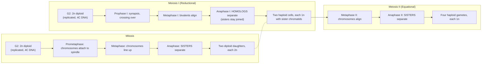
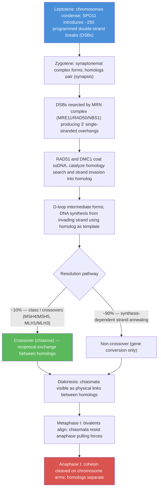
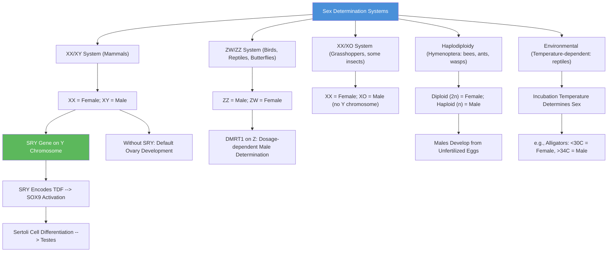
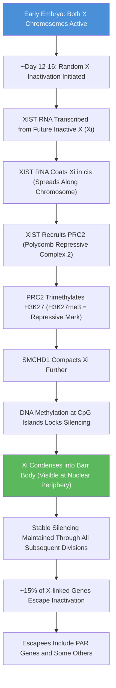
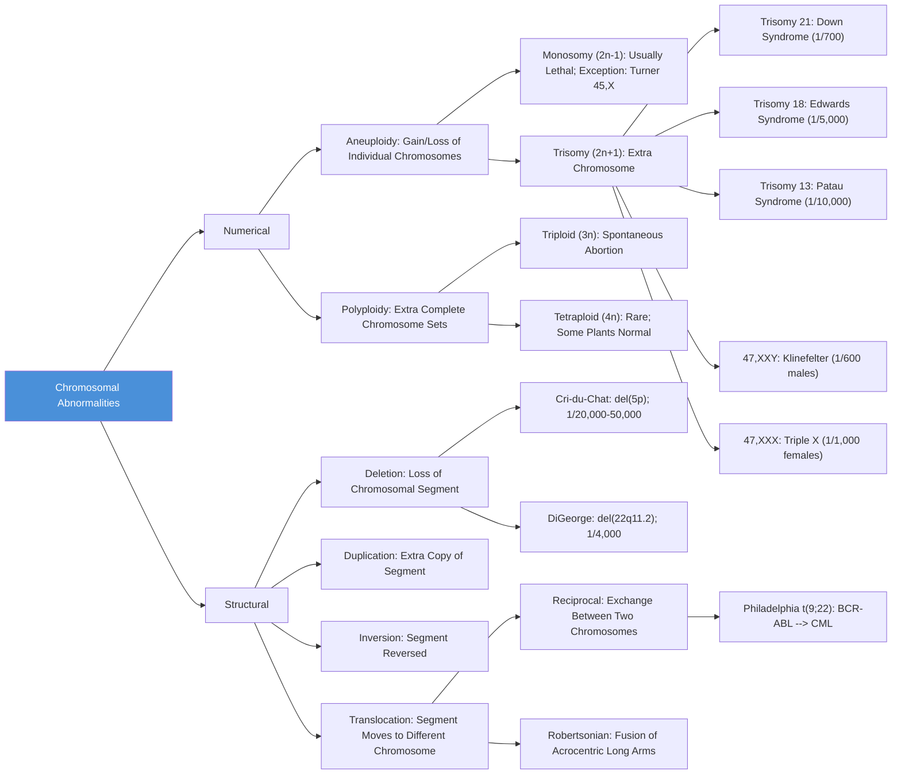
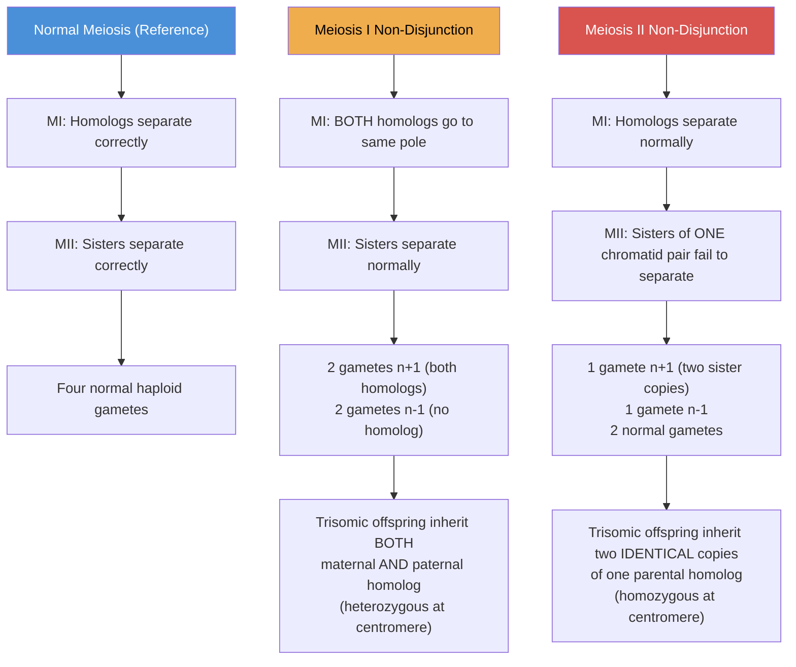
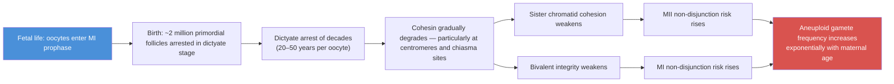

# Chromosomal Inheritance and Linkage

\label{sec:unit_V_chromosomal_inheritance}


<!-- chapter-metadata-badge -->
> **Ch 17** · Level 2/3 · 60 min read · 75 min lecture · Prerequisites: \cref{sec:unit_V_mendelian_genetics}

## Learning Objectives

1. Explain the [**chromosome**](#gl:chromosome) theory of heredity and its experimental support from Sutton, Boveri, and Morgan.
2. Describe chromosome architecture (centromere, telomere, heterochromatin/euchromatin) and connect it to chromosome behavior at meiosis.
3. Compare meiosis and mitosis at the level of cellular events, ploidy, recombination, and outcomes.
4. Describe the sex determination systems used across different organisms.
5. Explain the molecular mechanism of X-inactivation, including the role of XIST RNA, and outline broader dosage-compensation strategies.
6. Describe X-linked inheritance patterns and calculate expected offspring ratios for X-linked traits.
7. Explain meiotic non-disjunction (meiosis I vs. meiosis II), aneuploidy outcomes, and the maternal age effect.
8. Define genetic [**linkage**](#gl:linkage) and [**recombination**](#gl:recombination); calculate map distance from cross data.
9. Perform three-point test cross analysis to determine [**gene**](#gl:gene) order and map distances.
10. Classify chromosomal rearrangements (translocations, inversions, deletions, duplications) and their clinical consequences, including the Philadelphia chromosome, DiGeorge, and Cri-du-chat syndromes.
11. Connect chromosome behavior to genomic imprinting and uniparental disomy (cross-link to \cref{sec:unit_IV_epigenetics_and_gene_regulation}).
12. Calculate inbreeding coefficients and predict their effect on offspring homozygosity and fitness.

<!-- curriculum-scaffold-start -->
### Study Blueprint

- **Big idea:** Genes travel on chromosomes, so linkage, recombination, and chromosome structure shape inheritance.
- **Core concepts:** linkage, recombination, sex linkage, chromosomal rearrangements.
- **Framework alignment:** Vision & Change: Information flow, exchange, and storage, Evolution; AP Biology: Information Storage and Transmission, Evolution; NGSS-style topics: Inheritance and Variation of Traits, Natural Selection and Evolution.
- **Model or quantitative lens:** Recombination frequency and three-point mapping.
- **Data skill:** Infer gene order or chromosomal mechanism from offspring counts.
- **Practice cadence:** Statistical Tests and Data Analysis, Representing and Describing Data.
- **Common misconception to repair:** Independent assortment applies to unlinked loci, not to every pair of genes.
- **Primary lab:** \cref{sec:lab_unit_V_chromosomal_inheritance}.
- **Question bank:** \cref{sec:q_unit_V_chromosomal_inheritance}.
- **Transfer task:** Transfer linkage reasoning to disease mapping, breeding, and genome assemblies.
- **Bridge to computation:** `biology.genetics.genetics.infer_three_point_order`.
<!-- curriculum-scaffold-end -->

---

> **Opening Vignette — A Fly's White Eye Opens the Chromosome Era**
> 
> In 1910, Thomas Hunt Morgan was cultivating thousands of *Drosophila melanogaster* in a "fly room" at Columbia University when he noticed a single male with white eyes among thousands of red-eyed flies. When he crossed this mutant with normal red-eyed females and counted the offspring across two generations, a striking pattern emerged: white eyes appeared almost exclusively in male offspring. Morgan immediately recognized that the white-eye trait was linked to the X chromosome — the first gene mapped to a specific chromosome in any organism. The discovery of sex-linkage validated the chromosome theory of heredity (which Mendel's work alone could not prove), won Morgan the 1933 Nobel Prize, and launched the entire field of chromosome mapping. The humble fruit fly, with its four chromosome pairs, short generation time, and thousands of offspring, remains one of the most productive research organisms in genetics to this day.

## The Chromosome Theory of Heredity

In 1902, Walter Sutton (studying grasshopper *Brachystola magna*) and Theodor Boveri (studying sea urchin embryos) independently proposed that chromosomes are the physical carriers of Mendel's "factors" (genes):

| Mendel's Observation | Chromosomal Parallel |
|---------------------|---------------------|
| Genes exist in pairs in somatic cells | Chromosomes exist in homologous pairs (diploid) |
| [**Allele**](#gl:allele)s segregate during [**gamete**](#gl:gamete) formation | Homologous chromosomes separate at [**meiosis**](#gl:meiosis) I |
| Different genes assort independently | Non-homologous chromosomes orient independently at metaphase I |
| Gametes carry one allele per gene | Gametes are haploid (one chromosome from each pair) |

**Morgan's confirmation (1910-1915)**: Thomas Hunt Morgan's experiments with *Drosophila melanogaster* provided the definitive proof. His discovery of **white-eyed males** (X-linked recessive) demonstrated that a specific gene (white, *w*) segregated with the X chromosome, proving that genes reside on chromosomes. Morgan received the Nobel Prize in Physiology or Medicine in 1933.

---

## Chromosome Architecture: The Hardware of Heredity

A eukaryotic chromosome is far more than a passive package of DNA — it is a structurally organized object whose every architectural feature has a functional role in transmission, expression, and protection of the genetic material. Understanding chromosome behavior requires understanding chromosome **anatomy**: the metaphase chromosome in \cref{fig:unit_V_chromosome_structure} shows how the centromere, telomeres, and heterochromatic and euchromatic domains discussed below are arranged along the sister chromatids.

### Centromeres

The **centromere** is the chromosomal region where sister chromatids are held together after DNA replication and where the **kinetochore** assembles to attach to spindle microtubules during cell division. Centromeres position chromosomes correctly at metaphase and are essential for the orderly disjunction of chromatids at anaphase.

- **Position-based classification**: Metacentric (centromere central — chromosome 1), submetacentric (slightly off-center — chromosome 6), acrocentric (near one end — chromosome 21), telocentric (terminal — present in some species but not in normal humans).
- **Sequence composition**: Human centromeres contain **alpha-satellite DNA** — tandem repeats of a 171-bp monomer organized into higher-order arrays spanning 0.3–5 Mb. The DNA sequence is rapidly evolving, but centromere identity is **epigenetically defined** by the histone variant **CENP-A**, which replaces canonical H3 in centromeric nucleosomes and recruits the kinetochore.
- **Robertsonian translocations** involve fusion of two acrocentric chromosomes through their centromeres — a phenomenon that depends on the unique architecture of acrocentric short arms and is revisited in the structural-rearrangements discussion.

### Telomeres

The ends of linear eukaryotic chromosomes pose a structural problem: the cell must distinguish a true chromosome end from a double-strand break (which would otherwise trigger DNA damage signaling). **Telomeres** solve this with specialized terminal structures.

- **Sequence**: Human telomeres consist of tandem repeats of **TTAGGG** (5–15 kb at birth), bound by the **shelterin complex** (TRF1, TRF2, POT1, TIN2, TPP1, RAP1) that masks the chromosome end and inhibits inappropriate repair responses.
- **The end-replication problem**: DNA polymerase cannot fully replicate the lagging strand, so chromosomes shorten by 50–200 bp per division. Without compensation, cells become senescent after ~50 divisions (the **Hayflick limit**).
- **Telomerase**: A specialized reverse transcriptase (catalytic subunit TERT, RNA template TERC) extends telomeres in stem cells, germ cells, and ~85% of cancers — making telomerase a cancer therapeutic target.
- **Clinical relevance**: **Dyskeratosis congenita** results from telomerase mutations and causes premature aging, bone marrow failure, and cancer. **Werner syndrome** (helicase mutations) accelerates telomere shortening.

### Euchromatin and Heterochromatin

Chromatin is not uniform — it exists in two functionally and structurally distinct states.

| Feature | Euchromatin | Heterochromatin |
|---------|-------------|------------------|
| Compaction | Open, accessible | Densely packed |
| Histone marks | H3K4me3, H3K27ac, H3K36me3 | H3K9me3, H3K27me3, H4K20me3 |
| Replication timing | Early S phase | Late S phase |
| GC content | Higher | Lower |
| Recombination | Frequent | Suppressed |
| Transcription | Active genes | Silenced/repetitive |
| Examples | Most gene-rich regions | Centromeres, telomeres, inactive X (Barr body) |

- **Constitutive heterochromatin** is permanent and structural — centromeric and pericentric regions, telomeres, the Y chromosome long-arm heterochromatin, and tandemly repeated satellite DNAs. Constitutive heterochromatin maintains chromosome architecture and silences transposable elements.
- **Facultative heterochromatin** is **inducible** — formed in specific cell types or developmental states. The classic example is the **inactive X chromosome (Barr body)** in female mammals, formed *de novo* in early embryos through XIST-mediated silencing as developed in the X-inactivation section.
- **Position-effect variegation (PEV)**: When a gene is relocated by translocation or transposition into a heterochromatic region, it can be silenced — but with stochastic, mosaic patterns that depend on heterochromatin spreading. Classic *Drosophila* PEV experiments (the *white^m4* allele) revealed how heterochromatin propagates and provided the first hints of histone-based silencing.

\begin{figure}[htbp]
\centering
\includegraphics[width=0.85\textwidth]{../figures/chromosome_structure.png}
\caption{Anatomy of a metaphase chromosome: two sister chromatids joined at the centromere (containing CENP-A nucleosomes that recruit the kinetochore), capped by telomeres of TTAGGG repeats bound by the shelterin complex, with constitutive heterochromatin flanking the centromere and facultative heterochromatin at silenced loci such as the inactive X.}
\label{fig:unit_V_chromosome_structure}
\end{figure}

<!-- alt: Diagram of a metaphase chromosome showing two sister chromatids joined at a constricted centromere, with TTAGGG telomere caps at each end, dense heterochromatin around the centromere, and lighter euchromatic gene-rich regions along the arms. -->

---

## Meiosis vs. Mitosis: Two Cell-Division Programs

The chromosomal theory of inheritance rests on a single comparative observation — that **meiosis differs systematically from mitosis** in ways that exactly produce Mendelian segregation. The two programs share machinery (spindle, cohesin, kinetochores) but diverge in chromosome behavior.

| Feature | Mitosis | Meiosis |
|---------|---------|---------|
| **Number of divisions** | One (M phase) | Two (Meiosis I, Meiosis II) |
| **DNA replication** | Once before division | Once before Meiosis I; none between MI and MII |
| **Daughter cells per parent** | 2 | 4 |
| **Ploidy change** | Diploid → diploid (2n → 2n) | Diploid → haploid (2n → n) |
| **Homolog pairing** | None | Synapsis with synaptonemal complex at prophase I |
| **Crossing over (recombination)** | None (rare exceptions) | Required at prophase I; ~1.5–3 crossovers per bivalent in humans |
| **Anaphase I event** | N/A | Homologs disjoin (sisters remain joined) |
| **Anaphase II event** | Sisters disjoin | Sisters disjoin |
| **Genetic outcome** | Identical genetic copies | Genetically unique haploid gametes |
| **Cohesin protection** | None at centromere; cleaved at anaphase | **Shugoshin** protects centromeric cohesin until anaphase II |
| **Cellular function** | Growth, repair, asexual reproduction | Sexual reproduction; gamete formation |
| **Failure consequences** | Tumor formation, aneuploid somatic cells | Aneuploid gametes (Down syndrome, miscarriage) |


<!-- alt: Flowchart showing mitosis vs. meiosis: a single division producing two diploid copies versus a two-division program producing four haploid, recombined gametes. The defining event of meiosis is anaphase I, when homologs (not sisters) separate. -->

*Mitosis vs. meiosis: a single division producing two diploid copies versus a two-division program producing four haploid, recombined gametes. The defining event of meiosis is anaphase I, when homologs (not sisters) separate.*

The combination of (1) homolog pairing in prophase I, (2) crossing over, (3) random orientation of bivalents at metaphase I, and (4) reductional division at anaphase I produces gametes that are **genetically unique** and that satisfy Mendel's laws. Each of these four events can fail — and each failure has a recognizable disease signature.

### Molecular details of meiotic recombination

The orderly behavior of bivalents at metaphase I depends on **physical connections** (chiasmata) created by reciprocal recombination during prophase I. The molecular events that generate these chiasmata are conserved across eukaryotes and are essential — failure of recombination is a leading cause of meiotic non-disjunction in human oogenesis.


<!-- alt: Flowchart showing molecular events of meiotic recombination from SPO11 DSB induction through RAD51/DMC1-mediated strand invasion to chiasma formation. Approximately 10% of programmed double-strand breaks resolve as crossovers; the remainder become non-crossover gene conversions. -->

*Molecular events of meiotic recombination from SPO11 DSB induction through RAD51/DMC1-mediated strand invasion to chiasma formation. Approximately 10% of programmed double-strand breaks resolve as crossovers; the remainder become non-crossover gene conversions.*

**Key molecular players:**

- **SPO11** is a topoisomerase-VI-like enzyme that creates **programmed double-strand breaks** by covalent attachment to 5′ ends of DNA. In humans, ~250 DSBs are generated per meiosis (~10× the number of crossovers — most DSBs are repaired without crossover). SPO11 binding sites are determined by **PRDM9**, which trimethylates H3K4 at specific DNA motifs to mark recombination hotspots. *Spo11* knockout mice are sterile because no chiasmata form, leading to bivalent disjunction failure and aneuploid gametes.
- **MRE11–RAD50–NBS1 (MRN complex)** binds the DSB and resects the 5′ ends, exposing 3′ single-stranded overhangs ~1–2 kb long.
- **RAD51 and DMC1** are RecA-family recombinases that polymerize on the single-stranded DNA, forming a nucleoprotein filament that searches for homology in the homologous chromosome and catalyzes strand invasion. DMC1 is meiosis-specific and is essential for inter-homolog (rather than inter-sister) recombination.
- **MSH4–MSH5** and **MLH1–MLH3** are required for the major crossover pathway (class I); their mutations reduce crossover frequency and increase non-disjunction. **MUS81–EME1** mediates a minor (~10%) class II crossover pathway.
- **Synaptonemal complex**: A protein scaffold (SYCP1, SYCP2, SYCP3) that physically holds homologs together along their entire length during pachytene. The complex provides the platform on which crossovers form and assures proper pairing.

The molecular specifics matter because **mutations in many of these genes cause human infertility, recurrent pregnancy loss, and elevated aneuploidy risk**: *SYCP3* mutations are associated with azoospermia and pregnancy loss; *MSH4* mutations with primary ovarian insufficiency; *DMC1* mutations with sterility; and reduced *PRDM9* function correlates with diminished ovarian reserve. Meiotic recombination is far from a passive structural process — it is an actively regulated DNA-damage event without which sexual reproduction fails.

---

## Sex Chromosomes and Sex Determination


<!-- alt: Flowchart showing sex determination systems across organisms. The XX/XY system is used by mammals, with the SRY gene on the Y chromosome being the master switch. Other organisms use ZW, XO, haplodiploidy, or temperature-dependent systems. -->

*Sex determination systems across organisms. The XX/XY system is used by mammals, with the SRY gene on the Y chromosome being the master switch. Other organisms use ZW, XO, haplodiploidy, or temperature-dependent systems.*

### Mammalian Sex Determination (XX/XY)

**The Y chromosome and SRY**:
- Human Y chromosome: ~57 Mb; carries ~78 [**protein**](#gl:protein)-coding genes (compared to ~900 on the X)
- **SRY** (sex-determining region Y): Located at Yp11.31; encodes **TDF** (testis-determining factor), a [**transcription**](#gl:transcription) factor with an HMG-box DNA-binding domain
- SRY activates **SOX9**, which drives Sertoli cell differentiation in the bipotential gonad
- Sertoli cells produce **anti-Mullerian [**hormone**](#gl:hormone) (AMH)**, causing regression of Mullerian ducts
- Leydig cells produce **testosterone**, driving Wolffian duct development (epididymis, vas deferens, seminal vesicles) and external male genitalia

**Pseudoautosomal regions (PARs)**:
- **PAR1** (2.6 Mb at Xp/Yp tips): contains ~24 genes; mandatory crossover during male meiosis ensures proper X-Y segregation
- **PAR2** (320 kb at Xq/Yq tips): smaller; crossover not required
- Genes in PARs escape X-inactivation (expressed from both X chromosomes in females)
- **SHOX gene** (in PAR1): Short stature homeobox; haploinsufficiency causes short stature in Turner syndrome; extra copies cause tall stature in sex chromosome polysomies

**Evidence for SRY as the master switch**:
- XX males (de la Chapelle syndrome): ~1/20,000; caused by translocation of SRY to the X chromosome
- XY females (Swyer syndrome): SRY [**mutation**](#gl:mutation)s lead to female [**phenotype**](#gl:phenotype) with streak gonads despite 46,XY karyotype

### Non-Mammalian Sex Determination

| System | Organisms | Male | Female | Key Gene |
|--------|-----------|------|--------|----------|
| ZW/ZZ | Birds, snakes, butterflies | ZZ | ZW | DMRT1 (Z-linked; dosage determines sex) |
| XX/XO | Grasshoppers, some nematodes | XO | XX | X:autosome ratio (C. elegans) |
| Haplodiploidy | Hymenoptera (bees, ants, wasps) | Haploid (n) | [**Diploid (2n)**](#gl:diploid) | CSD locus (complementary sex determiner) |
| Temperature-dependent | Crocodilians, some turtles | Temperature-dependent | Temperature-dependent | Aromatase (converts testosterone to estradiol) |

---

## X-Inactivation and Dosage Compensation

### Lyon Hypothesis and X-Inactivation

Mary \citet{lyon1961} proposed that in each female somatic cell, one of the two X chromosomes is randomly inactivated early in embryonic development (~day 5.5 in mouse, ~day 12-16 in human). This inactivation is:

- **Random**: Either the maternal or paternal X can be inactivated in any given cell
- **Clonal**: Once established, most daughter cells maintain the same inactive X
- **Result**: Adult females are **genetic mosaics** -- a patchwork of cells expressing the maternal X and cells expressing the paternal X


<!-- alt: Flowchart showing molecular mechanism of X-inactivation. XIST RNA coats the future inactive X chromosome, recruiting Polycomb complexes that establish repressive histone marks and DNA methylation, ultimately condensing the chromosome into a Barr body. -->

*The molecular mechanism of X-inactivation. XIST RNA coats the future inactive X chromosome, recruiting Polycomb complexes that establish repressive [**histone**](#gl:histone) marks and DNA methylation, ultimately condensing the chromosome into a Barr body.*

### Molecular Mechanism

1. **XIST** (X-inactive specific transcript): A 17 kb lncRNA transcribed primarily from the X that will be inactivated
2. XIST RNA **coats** the Xi chromosome *in cis* -- spreading outward from the X-inactivation center (XIC) at Xq13
3. XIST recruits **PRC2** (Polycomb repressive complex 2), which catalyzes histone H3K27 trimethylation
4. Additional silencing factors: **SMCHD1** (structural maintenance of chromosomes flexible hinge domain-containing 1) further compacts [**chromatin**](#gl:chromatin)
5. **DNA methylation** at [**CpG island**](#gl:cpg-island)s provides stable, long-term silencing
6. The silenced X is visible as a **Barr body** at the nuclear periphery (sex chromatin test)

**Escape from X-inactivation**: ~15% of X-linked genes "escape" inactivation and are expressed from both the active and inactive X. These include genes in the pseudoautosomal regions and some genes with Y-chromosome homologs. Escape genes explain some phenotypic features of X-chromosome aneuploidy.

**Barr body count** = number of X chromosomes minus 1:
- 46,XX: 1 Barr body
- 47,XXX: 2 Barr bodies
- 45,X (Turner): 0 Barr bodies
- 47,XXY (Klinefelter): 1 Barr body

### Dosage Compensation Across Species and Beyond Sex Chromosomes

| Organism | Mechanism | Result |
|----------|-----------|--------|
| **Mammals** | X-inactivation (XIST) | One X silenced in XX females; equal dosage with XY males |
| **Drosophila** | X upregulation in males (MSL/roX RNA complex) | Male single X transcribed ~2x; equals female XX |
| **C. elegans** | X downregulation in XX hermaphrodites (DCC complex) | Each X transcribed ~0.5x; equals male XO single X |

**Dosage compensation beyond X-inactivation**: The principle that gene dosage must be balanced applies far more broadly than the sex chromosomes. Several other mechanisms address dosage imbalances:

- **Autosomal dosage sensitivity**: Most genes tolerate small dosage changes (1.5x or 2x) without phenotype, but **dosage-sensitive genes** — typically transcription factors, signaling components, and members of multi-protein complexes — produce phenotypes when copy number changes. The **Williams syndrome** deletion (7q11.23) and its reciprocal duplication produce opposite cognitive-behavioral phenotypes precisely because of dosage sensitivity in the *GTF2I* gene region.
- **Gene balance hypothesis**: Genes whose products participate in stoichiometric complexes (e.g., ribosomal proteins, transcription complexes, RNA polymerases) cannot tolerate copy-number changes because subunit imbalance disrupts complex assembly. This explains why most autosomal monosomies are lethal even when the underlying gene mutations would not be.
- **Compensatory feedback at promoters**: In *Drosophila* and yeast, deletion of one allele of a dosage-sensitive gene often triggers transcriptional upregulation of the remaining allele, partially restoring protein levels (cis-compensation).
- **microRNA buffering**: Individual miRNAs can buffer the expression of dozens of target genes against perturbation. The miR-17~92 cluster, for example, buffers cell-cycle gene dosage during proliferation.
- **Polycomb-mediated maintenance of dosage**: Active and inactive states established at gene clusters (Hox genes, the imprinted regions of chromosome 15) are maintained through cell division by Polycomb (silencing) and Trithorax (activation) complexes, ensuring stable gene dosage in each tissue.

The core insight is that **gene dosage is itself a regulated variable**, defended by multiple parallel mechanisms. X-inactivation is the most spectacular example because an entire chromosome is silenced, but it is one strategy among many.

> **Clinical Connection: Calico Cats and X-Inactivation**
> The calico coat pattern in cats is a visible demonstration of X-inactivation. The *O* gene (orange) is X-linked: $X^O$ produces orange pigment; $X^o$ produces black pigment. [**Heterozygous**](#gl:heterozygous) females ($X^OX^o$) are mosaics -- patches of orange (cells with $X^o$ inactivated) and black (cells with $X^O$ inactivated). White patches come from a separate autosomal spotting gene. Nearly most calico cats are female; rare calico males are usually 47,XXY (Klinefelter).

---

## X-Linked Inheritance

### X-Linked Recessive Inheritance

For X-linked recessive traits, males are affected more frequently because they are hemizygous (a single X):

- **Affected males**: $X^aY$ -- one copy of the recessive allele is sufficient
- **Affected females**: $X^aX^a$ -- must be homozygous (very rare; requires carrier mother AND affected father)
- **Carrier females**: $X^AX^a$ -- phenotypically normal (usually); can show mosaic expression due to random X-inactivation

**Key X-linked recessive conditions:**

| Condition | Gene | Location | Frequency | Key Features |
|-----------|------|----------|-----------|-------------|
| **Hemophilia A** | *F8* (Factor VIII) | Xq28 | 1/5,000 males | Prolonged bleeding; joint hemorrhages; treated with recombinant Factor VIII |
| **Hemophilia B** | *F9* (Factor IX) | Xq27.1 | 1/30,000 males | Similar to hemophilia A; "Christmas disease" |
| **Duchenne muscular dystrophy** | *DMD* (dystrophin) | Xp21.2 | 1/3,500 males | Largest human gene (2.4 Mb); progressive muscle wasting; frameshift mutations cause complete dystrophin loss; onset age 2-5; wheelchair by age 12; cardiac/respiratory failure |
| **Becker muscular dystrophy** | *DMD* (dystrophin) | Xp21.2 | 1/18,000 males | In-frame deletions; partially functional dystrophin; milder course |
| **Red-green color blindness** | *OPN1LW/OPN1MW* | Xq28 | 8% of males, 0.5% of females | Deutan (green) or protan (red) deficiency; unequal crossing over between tandem opsin genes |
| **G6PD deficiency** | *G6PD* | Xq28 | ~400 million affected worldwide | Hemolytic anemia triggered by oxidative stress (fava beans, certain drugs); heterozygote advantage against malaria |

## Worked Example: X-Linked Recessive Inheritance

A carrier woman ($X^HX^h$ for hemophilia) marries an unaffected man ($X^HY$):

| | $X^H$ | $Y$ |
|---|-------|-----|
| $X^H$ | $X^HX^H$ (normal female) | $X^HY$ (normal male) |
| $X^h$ | $X^HX^h$ (carrier female) | $X^hY$ (affected male) |

Results: $\frac{1}{4}$ normal daughters, $\frac{1}{4}$ carrier daughters, $\frac{1}{4}$ normal sons, $\frac{1}{4}$ affected sons.

Among sons primarily: $\frac{1}{2}$ affected. Among daughters primarily: $\frac{1}{2}$ carriers.

> **Clinical Connection: Duchenne Muscular Dystrophy and [**Exon**](#gl:exon) Skipping**
> The *DMD* gene (2.4 Mb, 79 exons) is a frequent target of deletions. Out-of-frame deletions cause Duchenne (no dystrophin); in-frame deletions cause Becker (partial dystrophin). **Exon-skipping therapy** uses antisense oligonucleotides (ASOs) to mask specific exons during splicing, converting an out-of-frame deletion to an in-frame deletion (Duchenne to Becker phenotype). **Eteplirsen** (FDA-approved 2016) targets exon 51; applicable to ~13% of DMD patients. Newer ASOs target other exons.

**Concept Check 17.5**

> 1. A pedigree shows an affected trait that appears primarily in males, is rarely transmitted father-to-son, and reaches grandsons through phenotypically normal daughters of affected men: explain why these three features together identify X-linked recessive inheritance, and state which single observation would instead force an autosomal-recessive interpretation.

> **Concept Check (Analysis):** X-inactivation (lyonization) in female mammals silences one X chromosome per cell, creating a mosaic. In heterozygous females for X-linked recessive conditions (carriers): (a) Why do carriers of Duchenne muscular dystrophy (DMD) sometimes develop mild cardiomyopathy, and what does this reveal about the distribution of X-inactivation in cardiac muscle? (b) Skewed X-inactivation (>80% of cells inactivate the same X) can be adaptive or pathological. If a woman is a carrier for a cell-lethal X-linked mutation, predict the direction of skewing and explain the selection pressure on cells during development. (c) Becker muscular dystrophy (BMD) patients have in-frame deletions in DMD gene, while Duchenne patients have out-of-frame deletions — both lack large portions of the dystrophin protein but BMD is milder. Explain this at the protein level and explain why the reading-frame rule predicts clinical severity.

> **Worked Example — Linkage Mapping and LOD Scores:** Two loci, A and B, are studied in 100 two-generation families. Observed recombinant offspring: 23/100 = θ = 0.23. Calculate the LOD score at θ = 0.23 vs θ = 0.5 (null hypothesis, unlinked). LOD = log₁₀[L(θ)/L(0.5)] = log₁₀[(0.23)^23(0.77)^77 / (0.5)^100] = 23×log(0.23) + 77×log(0.77) - 100×log(0.5) = 23×(-0.638) + 77×(-0.114) - 100×(-0.301) = -14.67 - 8.78 + 30.10 = +6.65. LOD > 3.0 is traditionally considered evidence of linkage. This LOD of 6.65 is very strong evidence. The maximum LOD (across every θ value) occurs at θ_hat = 0.23, which corresponds to approximately 23 cM genetic distance.

---

## Linkage and Recombination

### Morgan's Experiments

Thomas Hunt Morgan (1910-1915) discovered that some genes do NOT assort independently -- they are **linked** on the same chromosome.

In a testcross for body color (b: black recessive) and wing type (vg: vestigial recessive) in *Drosophila*:

**Expected (if unlinked)**: 1:1:1:1 ratio of four phenotype classes
**Observed**: Excess **parental types** (gray-normal, black-vestigial) and deficiency of **recombinant types** (gray-vestigial, black-normal)

This means b and vg are on the same chromosome, and **crossing over** during meiosis generates recombinants at a frequency proportional to the physical distance between the genes.

### Map Distance and Recombination Frequency

**Recombination frequency (RF)**:

\begin{equation}
RF = \frac{\text{number of recombinant offspring}}{\text{total offspring}} \times 100\%
\label{eq:unit_V_chromosomal_rf_definition}
\end{equation}

**Map distance** in centimorgans (cM): 1 cM = 1% recombination frequency.

- RF < 50%: genes are **linked** (on the same chromosome)
- RF = 50%: genes are **unlinked** (on different chromosomes OR so far apart on the same chromosome that at least one crossover typically occurs between them)
- RF can rarely exceed 50% because a single crossover between two loci produces 50% recombinant and 50% parental gametes (two chromatids involved out of four)

### Three-Point Test Cross

The three-point test cross determines the order of three linked genes and the distances between them simultaneously. It is more efficient than three separate two-point crosses and reveals **interference**.

## Worked Example: 17.2: In *Drosophila*, three linked genes on chromosome 2:
- dp (dumpy wings): recessive
- b (black body): recessive
- cn (cinnabar eyes): recessive

A triply heterozygous female (dp+ b+ cn+ / dp b cn) is testcrossed to a triply homozygous recessive male (dp b cn / dp b cn). The offspring are:

| Phenotype class | Count | Classification |
|----------------|-------|----------------|
| dp+ b+ cn+ | 350 | Parental |
| dp b cn | 345 | Parental |
| dp+ b cn | 62 | Single crossover (region II) |
| dp b+ cn+ | 58 | Single crossover (region II) |
| dp+ b+ cn | 40 | Single crossover (region I) |
| dp b cn+ | 38 | Single crossover (region I) |
| dp+ b cn+ | 5 | Double crossover |
| dp b+ cn | 2 | Double crossover |
| **Total** | **900** | |

**Step 1: Determine gene order.**
Compare the parental classes (most frequent) to the double crossover classes (least frequent). The gene that switches position in the double crossover class is the **middle gene**.

- Parental: dp+ b+ cn+; dp b cn
- Double crossover: dp+ b cn+; dp b+ cn

The b gene has switched relative to dp and cn. Therefore, the gene order is: **dp -- b -- cn** (b is in the middle).

**Step 2: Calculate map distances.**

$$\text{Distance dp-b} = \frac{40 + 38 + 5 + 2}{900} \times 100 = \frac{85}{900} \times 100 = 9.4 \text{ cM} \tag{17.1}$$

$$\text{Distance b-cn} = \frac{62 + 58 + 5 + 2}{900} \times 100 = \frac{127}{900} \times 100 = 14.1 \text{ cM} \tag{17.2}$$

$$\text{Total map distance dp-cn} = 9.4 + 14.1 = 23.5 \text{ cM} \tag{17.3}$$

**Step 3: Calculate interference.**

$$\text{Expected double crossovers} = 0.094 \times 0.141 \times 900 = 11.9 \tag{17.4}$$

$$\text{Observed double crossovers} = 5 + 2 = 7 \tag{17.5}$$

$$\text{Coefficient of coincidence (CoC)} = \frac{\text{observed}}{\text{expected}} = \frac{7}{11.9} = 0.59 \tag{17.6}$$

$$\text{Interference (I)} = 1 - \text{CoC} = 1 - 0.59 = 0.41 \tag{17.7}$$

An interference of 0.41 means that 41% of expected double crossovers did not occur -- a crossover in one region partially suppresses crossovers in the adjacent region (**positive interference**).

### Mapping Functions

Simple RF underestimates true genetic distance because multiple crossovers between distant loci are undetectable (double crossovers restore parental configuration).

**Haldane mapping function** (1919, assumes no chromatid interference):

\begin{equation}
m = -\frac{1}{2}\ln(1 - 2\theta) \quad \text{(morgans)}
\label{eq:unit_V_chromosomal_haldane}
\end{equation}

where θ = observed RF. As $\theta \to 0.5$, $m \to \infty$.

**Kosambi mapping function** (1944, accounts for positive chromatid interference):

\begin{equation}
m = \frac{1}{4}\ln\left(\frac{1 + 2\theta}{1 - 2\theta}\right)
\label{eq:unit_V_chromosomal_kosambi}
\end{equation}

Kosambi's function better fits empirical data for moderate distances.

### LOD Score Analysis

**LOD (logarithm of odds) score**: Statistical method for testing linkage in human pedigrees (where controlled crosses are ethically unfeasible).

\begin{equation}
LOD = \log_{10}\frac{L(\theta)}{L(\theta = 0.5)}
\label{eq:unit_V_chromosomal_lod}
\end{equation}

Where $L(\theta)$ is the likelihood of the data given recombination fraction θ, and $L(0.5)$ is the likelihood under no linkage.

- **LOD >= 3**: Evidence for linkage (θ value estimates map distance)
- **LOD <= -2**: Evidence against linkage
- **-2 < LOD < 3**: Inconclusive

### Recombination Hotspots and Sex Differences in Map Length

Recombination is **not distributed uniformly** across the genome — it concentrates in narrow **hotspots** of ~1–2 kb separated by larger cold regions, and the total map length differs sharply between male and female meiosis.

- **PRDM9 and hotspots**: In humans and mice, the zinc-finger histone methyltransferase **PRDM9** binds specific DNA motifs and trimethylates H3K4 and H3K36 at the binding site, recruiting the meiotic double-strand break machinery (SPO11). Crossovers preferentially form at these PRDM9-marked sites. PRDM9 is itself rapidly evolving — its zinc-finger array changes between populations and species, and *Prdm9* knockout mice are sterile due to meiotic defects. **PRDM9 is one of very few genes implicated in mammalian speciation through hybrid sterility.**
- **Hotspot rates**: Within hotspots, recombination rates can reach 10–100× the genome-wide average. The **HLA region** on chromosome 6 contains some of the most active hotspots, contributing to the immense allelic diversity of MHC genes.
- **Cold regions**: Centromeric and pericentric heterochromatin is recombination-suppressed, both because of structural constraints and because crossovers near centromeres can disrupt segregation. Recombination is also reduced near telomeres (in some species) and in regions of strong purifying selection.
- **Sex differences in map length**: The female human genetic map is roughly **1.5–1.8× longer** than the male map (~4,400 cM in females vs. ~2,700 cM in males). This reflects more crossovers per meiosis in oogenesis (~70 per cell) than spermatogenesis (~50 per cell), and dramatic regional differences — recombination is enriched at telomeres in male meiosis (where obligate crossovers occur to ensure disjunction) and more uniformly distributed in female meiosis.
- **Consequences**: Sex-specific maps must be used in linkage analysis when transmissions go through one sex predominantly. Large family genetic studies routinely report male, female, and sex-averaged maps separately.

#### Why do females have more crossovers?

The pronounced sex difference in recombination rate has several proposed explanations, and most empirical studies suggest more than one is operating simultaneously:

1. **Oocyte time available**: Female meiosis includes a prolonged pachytene during which homolog pairing and crossover designation occur. Spermatogenesis is faster and may impose stricter checkpoints that limit crossover-pathway entry.
2. **Telomeric vs. interstitial recombination**: Male meiosis enriches crossovers at telomeres because the **obligate crossover** rule (every bivalent must have at least one chiasma to segregate properly) is satisfied near chromosome ends, where pairing can complete in less time. Female meiosis has the time to distribute crossovers more uniformly, including in interstitial regions distant from telomeres.
3. **Selection for accuracy in oogenesis**: Because errors during the long oocyte arrest are catastrophic, female meiosis may have evolved higher recombination rates to ensure **at least one chiasma per bivalent**. Achiasmate bivalents segregate randomly, producing aneuploid gametes — the female reproductive system tolerates this poorly because each oocyte represents irreplaceable investment.
4. **Sexually antagonistic selection on chromosome conformation**: Some authors propose that male and female germlines have different optima for genome stability, with selection acting in opposite directions on regulators of recombination.

#### Haldane's rule and recombination

Haldane's classic 1922 observation extends beyond sex-determination biology to recombination patterns: in many species the **homogametic sex** (XX females in mammals; ZZ males in birds) shows higher recombination rates than the heterogametic sex. In *Drosophila*, the asymmetry is extreme — males have **no meiotic recombination at most**, while females have normal crossover-mediated recombination. In humans, the pattern is muted but present, with females having ~1.6× the male map length. The **achiasmate male meiosis** of *Drosophila* and several other dipterans is supported by alternative bivalent-tethering mechanisms (the *Mnm* complex) that maintain homolog pairing without crossovers. The mammalian intermediate pattern reflects partial achiasmatism — males still recombine, but with reduced rate and biased localization to telomeres. Why these sex differences evolved remains an open question and is one of the most robust empirical generalizations in the genetics of meiosis.

**Concept Check 17.1**

> 1. In a three-point cross, why are double crossover classes typically the least frequent?
> 2. If genes A and B have RF = 45%, are they linked? Explain.
> 3. What does positive interference tell you about the biology of crossing over?
> 4. PRDM9 binds specific DNA motifs to direct recombination hotspots. What does its rapid evolution suggest about hotspot evolution between human populations?

---

## Chromosomal Abnormalities


<!-- alt: Flowchart showing classification of chromosomal abnormalities. Numerical abnormalities include aneuploidy and polyploidy; structural abnormalities include deletions, duplications, inversions, and translocations. -->

*Classification of chromosomal abnormalities. Numerical abnormalities include aneuploidy and polyploidy; structural abnormalities include deletions, duplications, inversions, and translocations.*

### Aneuploidy: Non-Disjunction in Meiosis I vs. Meiosis II

**Non-disjunction** is the failure of chromosomes to separate properly during cell division and is the principal source of human aneuploidy \citep{hassold2001}. It can occur in either meiosis I or meiosis II, and the two failure modes have **distinguishable genetic signatures**.


<!-- alt: Flowchart showing two distinct molecular failure modes of meiotic non-disjunction. MI errors produce trisomic gametes carrying both parental homologs; MII errors produce trisomic gametes carrying two sister copies of a single homolog. Centromere-region marker analysis distinguishes the two — clinically important because they have different mechanisms and risk factors. -->

*Two distinct molecular failure modes of meiotic non-disjunction. MI errors produce trisomic gametes carrying both parental homologs; MII errors produce trisomic gametes carrying two sister copies of a single homolog. Centromere-region marker analysis distinguishes the two — clinically important because they have different mechanisms and risk factors.*

This MI/MII distinction is clinically important because:
- **~75% of trisomy 21 cases originate in maternal meiosis I** (the cohesin-decay mechanism described below).
- Paternal trisomy 21 (~5–10% of cases) is typically meiosis II in origin.
- Trisomy 18 has a higher proportion of MII errors than trisomy 21, suggesting different mechanistic pressures.

**Risk factors for non-disjunction**:

| Factor | Effect | Mechanism |
|--------|--------|-----------|
| **Maternal age (>35)** | Strong, exponential increase in non-disjunction risk | Cohesin decay during prolonged dictyate arrest |
| **Achiasmate bivalents** | Strong increase | A bivalent without a chiasma cannot stay paired through MI; mis-segregates |
| **Telomeric crossovers primarily** | Increased | Distal-biased chiasmata are unstable; inadequate to retain bivalent integrity |
| **Smoking** | Modest increase | Oxidative damage to oocyte DNA and proteins |
| **Folate deficiency** | Modest increase | Impaired methylation may affect centromeric heterochromatin |
| **Ovarian endometriosis** | Modest increase | Inflammatory effects on oocyte quality |

**Autosomal trisomies:**

| Condition | Karyotype | Key Features | Live Birth Frequency | Survival |
|-----------|-----------|-------------|---------------------|----------|
| **Down syndrome** | 47,+21 | Intellectual disability (IQ 25-75); congenital heart defects (40-50%); increased Alzheimer risk (APP gene on chr 21); characteristic facies | 1/700 | Most survive to adulthood (median ~60 years) |
| **Edwards syndrome** | 47,+18 | Severe; clenched fists with overlapping fingers; rocker-bottom feet; cardiac defects | 1/5,000 | ~5-10% survive to 1 year |
| **Patau syndrome** | 47,+13 | Holoprosencephaly; polydactyly; cleft lip/palate; cardiac defects | 1/10,000 | ~5-10% survive to 1 year |

**Sex chromosome aneuploidies:**

| Condition | Karyotype | Barr Bodies | Key Features | Frequency |
|-----------|-----------|-------------|-------------|-----------|
| **Turner syndrome** | 45,X | 0 | Female; short stature (SHOX haploinsufficiency); webbed neck; coarctation of aorta; streak gonads; infertility | 1/2,500 females |
| **Klinefelter syndrome** | 47,XXY | 1 | Male; tall; gynecomastia; small testes; reduced fertility; learning difficulties | 1/600 males |
| **Triple-X** | 47,XXX | 2 | Female; usually tall; mild learning difficulties; fertile | 1/1,000 females |
| **Jacobs syndrome** | 47,XYY | 0 | Male; tall; usually normal phenotype and fertility | 1/1,000 males |

**Maternal age effect**: Non-disjunction risk for chromosome 21 increases exponentially with maternal age:

| Maternal Age | Risk of Trisomy 21 |
|-------------|-------------------|
| 20 | ~1/1,500 |
| 25 | ~1/1,250 |
| 30 | ~1/900 |
| 35 | ~1/270 |
| 40 | ~1/100 |
| 45 | ~1/50 |
| 49 | ~1/12 |


<!-- alt: Flowchart showing cohesin-decay model of the maternal age effect. Female oocytes enter MI prophase before birth and remain arrested for decades. Loss of cohesin during this prolonged arrest weakens chromosome cohesion, producing exponentially rising non-disjunction risk with maternal age. -->

*The cohesin-decay model of the maternal age effect. Female oocytes enter MI prophase before birth and remain arrested for decades. Loss of cohesin during this prolonged arrest weakens chromosome cohesion, producing exponentially rising non-disjunction risk with maternal age.*

#### Quantitative model of the maternal age curve

The empirical risk of trisomy 21 with maternal age is well fit by an exponential function:

\begin{equation}
P(\text{T21} \mid \text{age } a) \approx P_0 \, e^{k(a - a_0)}
\label{eq:unit_V_maternal_age_risk}
\end{equation}

with $P_0 \approx 6.7 \times 10^{-4}$ at age $a_0 = 20$ and $k \approx 0.18$ per year for ages 30–45. This corresponds to a **doubling of risk every ~4 years** in the late 30s and early 40s. Between ages 45 and 49, the curve rises even more steeply as the oocyte pool nears exhaustion. Because the underlying mechanism — cohesin decay during dictyate arrest — accumulates throughout reproductive life, the exponential form reflects compounding error rates per oocyte rather than a sudden threshold. Reproductive endocrinology uses this curve to set screening recommendations; many countries trigger non-invasive prenatal testing offers automatically at maternal ages above 35.

Approximately 90% of trisomy 21 conceptions and 99% of trisomy 18 conceptions arise in maternal meiosis; paternal contributions are minor. The asymmetry reflects the fundamental difference between oogenesis (limited oocyte pool, decades-long arrest, gradual cohesin decay) and spermatogenesis (continuous stem-cell division, no arrest, robust quality control through germ-cell apoptosis).

### Structural Chromosomal Rearrangements: Detailed Survey

Beyond losses and gains of whole chromosomes, **structural rearrangements** cause a wide range of human disease. Each rearrangement type has characteristic mechanisms and clinical signatures.

#### Translocations

A **translocation** is an exchange of chromosomal material between non-homologous chromosomes. Two major classes exist.

**Reciprocal translocations** exchange segments between two non-homologous chromosomes. Carriers of *balanced* reciprocal translocations usually retain full genetic dosage — just rearranged — and are typically phenotypically normal. However, their gametes face severe segregation problems at meiosis I: the four chromosomes involved must form a quadrivalent at metaphase I, and **alternate segregation** produces balanced gametes (~50% of meioses). **Adjacent-1 and adjacent-2 segregation** produces unbalanced gametes, leading to recurrent miscarriage (10–25% per pregnancy) and a 1–10% risk of an unbalanced live-born child.

**The Philadelphia Chromosome — A Cancer Paradigm**:

The **t(9;22)(q34;q11.2)** reciprocal translocation fuses the **BCR** gene (chromosome 22) to the **ABL1** gene (chromosome 9), creating the **BCR-ABL1** fusion gene on the derivative chromosome 22 (the Philadelphia chromosome, [**pH**](#gl:ph)).

- **BCR-ABL1** encodes a constitutively active tyrosine kinase (210 kDa in CML; 190 kDa in Philadelphia-positive acute lymphoblastic leukaemia)
- Activates RAS/MAPK, PI3K/AKT, and JAK/STAT signaling -- driving uncontrolled proliferation
- **Imatinib (Gleevec)**: ATP-competitive inhibitor of BCR-ABL1 tyrosine kinase domain
  - CML 5-year survival: ~30% (pre-imatinib) to >90% (post-imatinib)
  - Resistance mutations (e.g., T315I "gatekeeper" mutation) necessitated second-generation (dasatinib, nilotinib) and third-generation (ponatinib) inhibitors
  - **Asciminib**: First [**allosteric**](#gl:allosteric) BCR-ABL1 inhibitor (binds myristoyl pocket, not ATP site); approved 2021

The Philadelphia chromosome story is one of the great triumphs of molecular targeted therapy: a structural rearrangement → a fusion oncogene → a kinase domain → a small-molecule drug → a chronic disease that is no longer fatal for most patients.

**Robertsonian translocations** fuse two acrocentric chromosomes (chromosomes 13, 14, 15, 21, 22 in humans) at their centromeres, producing one large derivative chromosome and losing the small short arms. Carriers have 45 chromosomes but a normal genome content (the lost short arms contain primarily ribosomal RNA gene clusters, present in multiple copies elsewhere). The clinical consequence appears in offspring: a Robertsonian carrier can produce gametes with two copies of one chromosome, leading to trisomic offspring. **Robertsonian translocation t(14;21) is the cause of approximately 4% of Down syndrome cases**, with a recurrence risk of 10–15% (much higher than the population rate of ~1/700) — making karyotype analysis essential for genetic counseling of recurrent Down syndrome families.

#### Worked Example 17.3: Robertsonian translocation segregation

A phenotypically normal woman has a Robertsonian translocation rob(14;21), giving her a karyotype 45,XX,rob(14;21). At meiosis, the trivalent formed by chromosome 14, chromosome 21, and the rob(14;21) derivative can segregate in **six** different ways, producing six possible gamete types — three balanced and three unbalanced:

| Gamete | Chromosomes carried | After fertilization with normal sperm | Outcome |
|--------|---------------------|---------------------------------------|---------|
| Normal alternate | normal 14 + normal 21 | 46,XX or 46,XY | Karyotypically normal |
| Translocation alternate | rob(14;21) primarily | 45,XX,rob(14;21) | Phenotypically normal carrier |
| Adjacent — extra 14 | rob(14;21) + normal 14 | 46,+14,rob — trisomy 14 equivalent | Embryonic lethal (early miscarriage) |
| Adjacent — missing 14 | normal 21 primarily | 45,–14 — monosomy 14 | Embryonic lethal |
| Adjacent — extra 21 | rob(14;21) + normal 21 | 46,+21,rob — **translocation Down syndrome** | Live-born child with Down syndrome |
| Adjacent — missing 21 | normal 14 primarily | 45,–21 — monosomy 21 | Embryonic lethal |

The empirical recurrence risk of Down syndrome from a maternal rob(14;21) carrier is **10–15%** — far below the theoretical 1/3 viable expectation because most monosomic and trisomy-14 conceptuses miscarry early, and because adjacent segregation patterns are not equally likely. **For a paternal carrier** the recurrence risk is much lower (~1–2%), because sperm with unbalanced chromosome content are largely incapable of fertilization (sperm selection effects). This sex difference in recurrence — same translocation, 10× different risk depending on the parent of origin — is one of the most clinically important consequences of male versus female meiotic biology and dramatically affects genetic counseling.

#### Inversions

An **inversion** is a chromosomal segment that has been reversed end-to-end. Two types exist based on whether the centromere is included.

- **Pericentric inversions** include the centromere; the inverted segment spans both arms.
- **Paracentric inversions** are confined to one arm; the centromere is outside the inverted region.

Like balanced reciprocal translocations, inversion carriers are typically phenotypically normal. The clinical problem arises in meiosis: to pair correctly with the non-inverted homolog, the inverted segment must form an **inversion loop**. Crossovers within the loop produce unbalanced gametes:

- **Pericentric inversions**: Crossovers inside the loop generate gametes with duplications and deficiencies (and corresponding live-born offspring with congenital abnormalities). Recurrence risk depends on inversion size and crossover frequency, ranging from 1% to 15%.
- **Paracentric inversions**: Crossovers inside the loop generate dicentric and acentric chromosomes that are typically lost during meiosis or early embryonic development; consequently, paracentric inversion carriers have higher rates of miscarriage but lower rates of liveborn unbalanced offspring than pericentric inversion carriers.
- **Inversion 9** is a common pericentric inversion (~1% of Europeans) that is generally considered a normal variant — though some studies suggest mildly elevated risk for recurrent pregnancy loss.

#### Deletion Syndromes

**Deletions** remove chromosomal material and produce **haploinsufficiency** — one functional copy is not enough for normal function. Some classic deletion syndromes:

| Syndrome | Deletion | Frequency | Key Features |
|----------|----------|-----------|--------------|
| **Cri-du-chat** | 5p15.2 | 1/20,000–50,000 | Distinctive high-pitched mewing cry in infancy (laryngeal abnormalities); microcephaly; severe intellectual disability; characteristic facies; cardiac defects |
| **DiGeorge / 22q11.2 deletion** | 22q11.2 (3 Mb) | 1/4,000 | Conotruncal cardiac defects (tetralogy of Fallot, interrupted aortic arch); thymic hypoplasia (T-cell immunodeficiency); hypocalcemia (parathyroid hypoplasia); cleft palate; characteristic facies; learning disabilities; schizophrenia risk increased ~25× |
| **Williams syndrome** | 7q11.23 (1.55 Mb, 26 genes including *ELN*) | 1/7,500–20,000 | "Elfin" facies; supravalvular aortic stenosis (elastin haploinsufficiency); hypercalcemia; intellectual disability with **paradoxically preserved language** and hypersociability |
| **Prader-Willi syndrome** | 15q11-q13 paternal deletion | 1/15,000 | Hypotonia; hyperphagia; obesity; intellectual disability; short stature (see imprinting below) |
| **Angelman syndrome** | 15q11-q13 maternal deletion | 1/15,000 | Severe intellectual disability; seizures; ataxic gait; characteristic happy demeanor with frequent laughter |
| **Wolf-Hirschhorn** | 4p16.3 | 1/50,000 | Severe growth retardation; "Greek warrior helmet" facies; intellectual disability; seizures |
| **WAGR syndrome** | 11p13 | rare | Wilms tumor + Aniridia + Genitourinary abnormalities + intellectual disability (Range) |
| **Smith-Magenis** | 17p11.2 | 1/25,000 | Intellectual disability; sleep disturbances (inverted melatonin cycle); behavioral abnormalities |

**DiGeorge / 22q11.2 deletion syndrome** deserves special attention as one of the most common microdeletion syndromes and a paradigm for **contiguous gene syndromes** — phenotypes resulting from haploinsufficiency of multiple adjacent genes simultaneously. The deletion is typically caused by **non-allelic homologous recombination (NAHR)** between low-copy repeats (LCRs) flanking the region. Within the deleted region, **TBX1** is the key driver of cardiac and craniofacial features; other deleted genes contribute to immune, neurological, and behavioral phenotypes. The 22q11.2 deletion confers an approximately 25-fold increased risk of schizophrenia, making it one of the strongest known genetic risk factors for psychotic illness.

**Cri-du-chat syndrome** (5p deletion) was first described in 1963 by Jérôme Lejeune (who had identified trisomy 21 four years earlier). The distinctive cat-like cry in infancy results from laryngeal cartilage abnormalities. Survival to adulthood is common but with severe intellectual disability requiring lifelong care.

#### Duplications

Duplications (extra copies of chromosomal segments) typically produce **gain-of-function** phenotypes — opposite to deletions. Many duplication syndromes are reciprocal to known deletion syndromes:

- **22q11.2 duplication syndrome**: Reciprocal to DiGeorge. Highly variable, often mild; some carriers are phenotypically normal.
- **Charcot-Marie-Tooth disease type 1A**: Duplication of 17p11.2 containing *PMP22* causes peripheral neuropathy through PMP22 overexpression.
- **MECP2 duplication syndrome** (Xq28): Severe intellectual disability and recurrent infections; reciprocal to Rett syndrome (caused by *MECP2* loss-of-function mutations in girls).

The reciprocal relationship between deletion and duplication phenotypes confirms gene dosage as the proximate cause and reinforces the dosage-sensitivity principle developed in the chromosomal-rearrangements section.

> **Clinical Connection: Prenatal Screening for Chromosomal Abnormalities**
> **Cell-free fetal DNA (cfDNA) testing** (NIPT -- non-invasive prenatal testing): Analyzes fetal DNA fragments circulating in maternal blood (from ~10 weeks gestation). Detects trisomies 21, 18, 13 and sex chromosome aneuploidies with >99% sensitivity and >99.5% specificity for trisomy 21. Has largely replaced first-trimester combined screening (nuchal translucency + biochemical markers) as the primary screening tool. Diagnostic confirmation still requires amniocentesis or chorionic villus sampling (CVS) for karyotyping or chromosomal microarray. **Chromosomal microarray (CMA)** is now the first-line test for fetal abnormalities or developmental delay, detecting copy-number changes at sub-megabase resolution.

---

## Genomic Imprinting and Uniparental Disomy

Mendel's laws assume that the phenotypic effect of an allele is **independent of which parent transmitted it**. For most loci this is true. But ~100–200 human genes show **genomic imprinting** — they are expressed from a single parental allele, with the other allele silenced by parent-of-origin-specific epigenetic marks (methylation, chromatin) established during gametogenesis (\cref{sec:unit_IV_epigenetics_and_gene_regulation}).

### The principle of imprinting

For an imprinted gene:
- A maternally-imprinted (paternally-expressed) gene contributes primarily the paternal allele to the offspring's expression.
- A paternally-imprinted (maternally-expressed) gene contributes primarily the maternal allele.
- The "silent" allele is not deleted — it carries methylation marks acquired during egg or sperm formation that are preserved through embryogenesis.

This violates Mendel's assumption because the phenotype now depends on **which parent contributed which allele**, even at otherwise equivalent loci.

### Canonical imprinted regions

| Region | Imprinting status | Disease (loss of expressed allele) |
|--------|-------------------|-------------------------------------|
| **15q11–q13** | Paternal expression of *SNRPN*, *NDN*, *MAGEL2*, others; maternal expression of *UBE3A* in neurons | Loss of paternal expression → **Prader-Willi syndrome**; loss of maternal *UBE3A* → **Angelman syndrome** |
| **11p15.5** | Paternal expression of *IGF2*; maternal expression of *H19* and *CDKN1C* | Disrupted imprinting → **Beckwith-Wiedemann syndrome** (overgrowth, Wilms tumor risk); reciprocal disruption → **Russell-Silver syndrome** (growth restriction) |
| **14q32** | *DLK1, MEG3* imprinted | Maternal UPD14 → Temple syndrome; paternal UPD14 → Kagami-Ogata syndrome |

### Mechanisms causing imprinting disorders

Imprinting disorders arise through several distinct mechanisms — and a key clinical insight is that **the underlying mutation type is independent of the disease phenotype**, which depends primarily on whether the active parental allele is present:

1. **Deletion of the active allele** (~70–75% of Prader-Willi and Angelman cases). A microdeletion of 15q11-q13 on the paternally inherited chromosome causes Prader-Willi; the same microdeletion on the maternally inherited chromosome causes Angelman. The deletion is identical at the DNA level — the disease depends on which parent transmitted it.
2. **Uniparental disomy (UPD)** (~25% of Prader-Willi, ~5% of Angelman cases). Both copies of chromosome 15 are inherited from one parent. Maternal UPD15 (no paternal contribution) causes Prader-Willi; paternal UPD15 (no maternal contribution) causes Angelman. UPD usually arises through **trisomy rescue** — a trisomic conceptus loses one chromosome to revert to disomy; if the lost chromosome was from the parent with a single copy, the result is UPD.

   **Isodisomy vs. heterodisomy.** UPD comes in two genetically distinct flavors that depend on *when* the meiotic error occurred:

   - **Heterodisomy** — both inherited copies derive from **different homologs** of the parent (the two copies are heterozygous for parental polymorphisms). Heterodisomy arises from **meiosis I non-disjunction** followed by trisomy rescue. The two homologs of one parent are inherited together, and the offspring is heterozygous at centromeric markers from that parent.
   - **Isodisomy** — both inherited copies are **identical** sister-chromatid copies of a single parental homolog. Isodisomy arises from **meiosis II non-disjunction** plus trisomy rescue, or from a postzygotic mitotic error. The offspring is **homozygous along the entire chromosome** for the parent-of-origin's allele.

   Isodisomy is clinically important because it can **unmask recessive alleles**: if the contributing parent is a carrier for a recessive disease on the affected chromosome, isodisomy produces homozygosity for the recessive allele and the offspring is affected — even though a single parent was a carrier. Documented examples include cystic fibrosis from maternal isodisomy 7 and rod monochromacy from paternal isodisomy 14. Mixed UPD (heterodisomy at the centromere with isodisomic distal regions) reflects a meiosis I error followed by a crossover; the relative proportions of iso- and heterodisomic regions trace the meiotic crossover that occurred in the parent's germline.
3. **Imprinting center mutations** (~1–2% of cases). Mutations in the imprinting control regions disrupt the establishment or maintenance of methylation marks, producing functional UPD without sequence changes elsewhere.
4. ***UBE3A* point mutations** (~10% of Angelman cases). Mutations in the *UBE3A* gene itself, which is expressed primarily from the maternal allele in neurons, cause Angelman syndrome.

### Connection to chromosome behavior

The imprinting story directly connects molecular biology (DNA methylation), gametogenesis (where parent-of-origin marks are established), meiosis (where non-disjunction can produce UPD via trisomy rescue), and clinical genetics (where the same chromosomal lesion produces different diseases depending on parental origin). For details on the establishment and erasure of imprinting marks during germline development, see \cref{sec:unit_IV_epigenetics_and_gene_regulation}.

> **Clinical Connection: Why Both Parents Are Needed**
> Imprinting explains why mammalian parthenogenesis (development from an unfertilized egg) and androgenesis (development from sperm primarily) fail. Mouse experiments combining two pronuclei from one parent — gynogenetic embryos with two maternal pronuclei or androgenetic embryos with two paternal pronuclei — fail at distinct embryonic stages, demonstrating that **maternal and paternal genomes are not interchangeable**. Imprinted genes have evolved to enforce biparental contribution in mammalian reproduction.

**Concept Check 17.3**

> 1. A trisomy 21 fetus inherits two centromeric markers from the mother — one identical to grandmother's and one identical to grandfather's — and one paternal centromere. Was the non-disjunction event in maternal meiosis I or maternal meiosis II? Explain.
> 2. Using \cref{eq:unit_V_maternal_age_risk} with $P_0 = 6.7 \times 10^{-4}$, $a_0 = 20$, and $k = 0.18$, estimate the trisomy 21 risk at maternal age 38. How does it compare to age 28?
> 3. A child with cystic fibrosis is born to a mother known to be a CFTR carrier and a father whose CFTR sequencing shows two wild-type alleles (paternity confirmed). What chromosomal mechanism could explain the diagnosis, and what kind of UPD would it require?
> 4. Why does *Drosophila* hyper-transcribe the single male X (MOF/MSL) while *C. elegans* halves transcription of both XX hermaphrodite chromosomes (DCC), yet mammals silence one X (XIST)? What general biological problem do most three solve?

---

## Recombination Mapping: Physical vs. Genetic Distance

**Genetic distance** (cM) does not always correspond linearly to **physical distance** (Mb):

\begin{equation}
1 \text{ cM} \approx 1 \text{ Mb (genome-wide average in humans)}
\label{eq:unit_V_chromosomal_cm_to_mb}
\end{equation}

However, this ratio varies dramatically:
- **Hotspots**: Recombination rates can be 10-100x the average in small regions (~1-2 kb); determined by PRDM9 protein (zinc finger domain recognizes specific DNA motifs)
- **Coldspots**: Centromeric and heterochromatic regions have very low recombination
- **Sex differences**: Female genetic maps are ~1.5-1.8x longer than male maps (more crossovers in female meiosis)

**Concept Check 17.4**

> 1. From a three-point testcross of 1{,}000 progeny you score 440 + 435 parentals, 48 + 45 single crossovers in one region, 14 + 12 single crossovers in the other, and 4 + 2 double crossovers: use the double-crossover class to fix the gene order, then compute both map distances and explain why the directly summed parental-to-parental distance underestimates the true physical separation.

---

## Inbreeding and the Inbreeding Coefficient

### The Inbreeding Coefficient (F)

The **inbreeding coefficient (F)** is the probability that an individual has two alleles at a locus that are identical by descent (IBD) -- inherited from the same ancestral allele through both parents.

**Calculation for offspring of first-cousin mating**:

First cousins share one pair of grandparents. For a specific rare recessive allele (frequency q) in one grandparent:

\begin{equation}
F = \frac{1}{16} = 0.0625 \quad \text{(for first-cousin offspring)}
\label{eq:unit_V_chromosomal_F_first_cousin}
\end{equation}

**General formula using path coefficients** \citep{wright1922}:

\begin{equation}
F = \sum\left(\frac{1}{2}\right)^{n_1 + n_2 + 1}
\label{eq:unit_V_chromosomal_F_path}
\end{equation}

where $n_1$ and $n_2$ are the number of links from one parent to the common ancestor and from the common ancestor to the other parent, summed over most paths through most common ancestors.

### Consequences of Inbreeding

- **Increased homozygosity**: $F$ proportion of loci become homozygous beyond random expectation
- **Exposure of recessive alleles**: Rare deleterious recessive alleles are more likely to become homozygous
- **Inbreeding depression**: Reduced fitness (fertility, viability) in inbred populations
- **Examples**: Amish (Ellis-van Creveld syndrome, 1/5,000 vs. 1/200,000 in general population due to [**founder effect**](#gl:founder-effect) + consanguinity); Finnish disease heritage (36 rare diseases enriched in Finland due to founder effects)

> **Clinical Connection: Consanguinity and Genetic Disease**
> In populations where consanguineous marriage is common (parts of Middle East, South Asia, North Africa: 20-50% of marriages are consanguineous), the incidence of autosomal recessive disorders is significantly elevated. First-cousin offspring have ~6-8% risk of congenital abnormality (vs. ~2-3% in outbred populations). Genetic counseling and carrier screening programs are important in these communities.

**Concept Check 17.2**

> 1. Why are nearly most calico cats female? What would the karyotype of a rare calico male be?
> 2. Explain why maternal age increases the risk of trisomy 21 but paternal age does not have the same effect.
> 3. Calculate the inbreeding coefficient for offspring of a half-sibling mating (sharing one parent).
> 4. Why does the Philadelphia chromosome produce a constitutively active kinase? What is the normal function of ABL1?
> 5. A child has Prader-Willi syndrome with a normal-appearing chromosome 15 by FISH. What molecular tests would you order, and what mechanisms might be responsible?
> 6. Distinguish reciprocal from Robertsonian translocation. Why are Robertsonian carriers especially relevant to Down syndrome counseling?

---

## Worked Example: Linkage Analysis

**Problem**: In a testcross, the following offspring are observed from a female heterozygous for three linked genes (A, B, C) crossed with a homozygous recessive male:

| Class | Phenotype | Count |
|-------|-----------|-------|
| 1 | A B C | 412 |
| 2 | a b c | 405 |
| 3 | A b C | 82 |
| 4 | a B c | 78 |
| 5 | A B c | 32 |
| 6 | a b C | 28 |
| 7 | A b c | 3 |
| 8 | a B C | 2 |
| Total | | 1,042 |

(a) Determine gene order.

Parental classes: 1 and 2 (most frequent); DCO classes: 7 and 8 (least frequent).

Compare: Parental = A B C / a b c; DCO = A b c / a B C.

The **B** gene has switched relative to A and C. Gene order: **A -- B -- C**.

(b) Calculate map distances.

$$d_{A-B} = \frac{82 + 78 + 3 + 2}{1042} \times 100 = \frac{165}{1042} \times 100 = 15.8 \text{ cM} \tag{17.8}$$

$$d_{B-C} = \frac{32 + 28 + 3 + 2}{1042} \times 100 = \frac{65}{1042} \times 100 = 6.2 \text{ cM} \tag{17.9}$$

(c) Calculate interference.

$$\text{Expected DCO} = 0.158 \times 0.062 \times 1042 = 10.2 \tag{17.10}$$

$$\text{CoC} = \frac{5}{10.2} = 0.49; \quad I = 1 - 0.49 = 0.51 \tag{17.11}$$

---

## Computational Bridge

Recombination and mutation models often begin from pairwise sequence disparity:

```python
from biology.genetics import hamming_distance

print(hamming_distance("ATGCATGC", "ATACATGC"))
```

> **Clinical / systems note:** Non-invasive prenatal testing counts fetal DNA fragments mapped to chromosomes --- high-throughput karyotyping that detects trisomies without invasive sampling.

---

## Current Evidence and Frontier Biology

For **Chromosomal Inheritance and Linkage**, frontier biology belongs inside the evidence logic of
the chapter. Classical genetics remains essential, but modern interpretation adds penetrance, polygenicity, structural variation, ancestry-aware inference, and uncertainty in risk prediction. The core reading question is this: chromosome-scale inheritance depends on recombination, segregation, structural variation, and dosage compensation.

- **What to verify:** identify the observation, model, assay, or dataset that
  would make the claim stronger or weaker.
- **What to qualify:** state the scale, organism, cell type, environmental
  condition, or population where the claim is expected to hold.
- **What to compare:** test at least one alternative explanation, baseline, or
  null model before treating the pattern as causal.
- **What to cite:** distinguish primary evidence, review synthesis, public
  dataset, and institutional guidance; for recent or numeric claims, prefer
  the source closest to the measurement and state what has changed since it was
  published.

A good genetics answer separates the Mendelian transmission model from the evidence needed to use it in a population, family, or clinical setting.

**Source practice:** For inheritance and population claims, separate the model assumptions from sampling, ancestry representation, penetrance, linkage, and environment.

## Summary

- **Chromosome theory**: \citet{sutton1902} proposed chromosomes carry genes; Morgan proved this with X-linked *white* in *Drosophila*.
- **Chromosome architecture**: Centromeres (CENP-A, alpha-satellite, kinetochore docking), telomeres (TTAGGG, shelterin, telomerase), and the heterochromatin/euchromatin distinction shape both mechanics and expression.
- **Meiosis vs. mitosis**: A two-division reductional/equational program with synapsis, crossing over, and reductional segregation at MI is the cellular basis of Mendel's laws.
- **Sex determination**: XX/XY (mammals, SRY gene), ZW/ZZ (birds), XO (grasshoppers), haplodiploidy (hymenoptera), temperature-dependent (reptiles).
- **X-inactivation**: Lyon hypothesis (1961); XIST RNA coats Xi; Polycomb-mediated H3K27me3; DNA methylation; Barr body. ~15% of genes escape.
- **Dosage compensation**: X-inactivation in mammals, MSL upregulation in *Drosophila*, DCC downregulation in *C. elegans*; broader principles include autosomal dosage sensitivity, gene-balance constraints, miRNA buffering, and Polycomb maintenance.
- **X-linked recessive inheritance**: Males affected >> females; no male-to-male transmission; carrier mothers pass to 50% of sons.
- **Linkage and recombination**: RF < 50% indicates linkage; 1 cM ≈ 1% recombination; three-point cross determines gene order and detects interference; Haldane and Kosambi mapping functions correct for undetected double crossovers; PRDM9 directs hotspots; female maps are ~1.5–1.8× longer than male maps.
- **Non-disjunction**: MI errors produce trisomies inheriting both parental homologs; MII errors produce trisomies inheriting two sister copies of one homolog. The cohesin-decay model explains the maternal age effect.
- **Chromosomal abnormalities**: Aneuploidy from non-disjunction (trisomies 21, 18, 13; Turner 45,X; Klinefelter 47,XXY); structural rearrangements include reciprocal and Robertsonian translocations (Philadelphia chromosome → BCR-ABL1 → CML), pericentric and paracentric inversions, deletion syndromes (DiGeorge 22q11.2, Cri-du-chat 5p, Williams 7q11.23, Wolf-Hirschhorn 4p), and reciprocal duplication syndromes.
- **Imprinting and uniparental disomy**: ~100–200 imprinted human genes; deletion of an expressed allele, UPD via trisomy rescue, imprinting-center mutations, or *UBE3A* point mutations most cause Prader-Willi or Angelman depending on parental origin.
- **Inbreeding**: F = probability of identity by descent; increases homozygosity; exposes recessive alleles; inbreeding depression.
- **Connections:** See \cref{sec:unit_IV_dna_replication_and_cell_cycle} for meiosis errors, \cref{sec:unit_V_population_genetics} for $F_{ST}$ and drift, and \cref{sec:unit_IV_epigenetics_and_gene_regulation} for imprinting disorders.

---

## Review Questions

1. Explain Morgan's evidence that the *white* gene is on the X chromosome. What cross results would differ if *white* were autosomal recessive?
2. Describe the role of XIST RNA in X-inactivation. Why do ~15% of genes escape inactivation, and what are the phenotypic consequences?
3. A woman is a carrier for both hemophilia A (F8, Xq28) and red-green color blindness (OPN1LW, Xq28). These genes are ~6 cM apart. What proportion of her sons will have both conditions? A single? Neither?
4. Perform a three-point test cross analysis given the following data: [provide data if assigned]
5. Explain the maternal age effect on non-disjunction. What molecular mechanism has been proposed?
6. Why is trisomy 21 the most common viable autosomal trisomy? (Hint: consider chromosome 21 gene content.)
7. Describe the BCR-ABL1 fusion and explain why imatinib was a breakthrough in cancer therapy. What is the T315I resistance mutation?
8. Compare NHEJ and HR as mechanisms for joining chromosome translocation breakpoints. Which is more likely to produce the Philadelphia chromosome?
9. Calculate the inbreeding coefficient for offspring of a double first-cousin mating (where both parents are first cousins through independent lineages).
10. Explain why dosage compensation is necessary and compare the three known mechanisms (mammals, *Drosophila*, *C. elegans*).
11. A child carries a de novo balanced reciprocal translocation with no gene interruption. When is genetic counselling still indicated?
12. Contrast **Robertsonian** vs. **reciprocal** translocations regarding segregation products at meiosis I.
13. Distinguish meiosis I from meiosis II non-disjunction. How would centromere-region marker analysis identify the failure mode in a trisomic conception?
14. A 22q11.2 deletion is found in a child with congenital heart disease. List four other phenotypic systems likely affected, and explain why a single contiguous deletion produces such diverse features.
15. Why does maternal UPD15 cause Prader-Willi syndrome rather than Angelman syndrome?

---


## Further Reading and Source Notes

- Lyon (1961). Gene action in the {X}-chromosome of the mouse ({Mus musculus L.}). *Nature*, 190.
- Hassold & Hunt (2001). To err (meiotically) is human: The genesis of human aneuploidy. *Nature Reviews Genetics*, 2.
- Wright (1922). Coefficients of inbreeding and relationship. *American Naturalist*, 56.
- Sutton (1902). On the morphology of the chromosome group in {Brachystola magna}. *Biological Bulletin*, 4.

---

## Key Terms

1. **Chromosome theory of heredity** -- genes are located on chromosomes; chromosomal behavior in meiosis explains Mendelian laws
2. **Centromere** -- chromosomal region holding sister chromatids; site of kinetochore assembly; CENP-A defines identity epigenetically
3. **Telomere** -- terminal TTAGGG repeats bound by shelterin; protected by telomerase in stem and germ cells
4. **Heterochromatin** -- densely packed, transcriptionally silenced chromatin; constitutive vs. facultative
5. **SRY** -- sex-determining region Y; master switch for male development in mammals
6. **X-inactivation** -- silencing of one X chromosome in female somatic cells for dosage compensation
7. **XIST** -- long non-coding RNA that coats and silences the inactive X chromosome
8. **Barr body** -- condensed, transcriptionally inactive X chromosome visible at nuclear periphery
9. **Hemizygous** -- having a single copy of a gene (e.g., X-linked genes in males)
10. **Linkage** -- tendency of genes on the same chromosome to be inherited together
11. **Recombination frequency (RF)** -- proportion of recombinant offspring; measure of genetic distance
12. **Centimorgan (cM)** -- unit of genetic distance; 1 cM = 1% recombination frequency
13. **Three-point test cross** -- cross using three linked markers to determine gene order and distances simultaneously
14. **Interference** -- suppression of nearby crossovers; I = 1 - coefficient of coincidence
15. **PRDM9** -- zinc-finger histone methyltransferase that directs meiotic recombination hotspots
16. **Non-disjunction** -- failure of chromosomes to separate during meiosis, leading to aneuploidy
17. **Aneuploidy** -- abnormal chromosome number (monosomy, trisomy)
18. **Reciprocal translocation** -- exchange of segments between two non-homologous chromosomes
19. **Robertsonian translocation** -- centromeric fusion of two acrocentric chromosomes
20. **Pericentric inversion** -- inversion that includes the centromere
21. **Paracentric inversion** -- inversion confined to one chromosome arm
22. **Philadelphia chromosome** -- t(9;22) translocation producing BCR-ABL1 fusion; hallmark of CML
23. **Inbreeding coefficient (F)** -- probability that two alleles at a locus are identical by descent
24. **LOD score** -- statistical measure of evidence for genetic linkage in pedigrees
25. **Pseudoautosomal region** -- segments at X and Y chromosome tips that recombine during male meiosis
26. **Dosage compensation** -- mechanism equalizing X-linked gene expression between XX and XY individuals
27. **Uniparental disomy (UPD)** -- both copies of a chromosome inherited from one parent; cause of imprinting disorders via trisomy rescue
28. **Genomic imprinting** -- parent-of-origin-specific expression resulting from gametic methylation marks

---

### Companion Source Module

**Chromosomal Inheritance and Linkage** should leave a reproducible trail from a biological claim to
the code, figure, diagram, or paper-based activity that can test it. Use the
surfaces below to inspect the chapter's assumptions, rerun the relevant model,
or compare the manuscript explanation with companion labs and figures.

| Surface | Use it for |
| --- | --- |
| `src/biology/genetics/genetics.py` (`recombination_frequency`, `genetic_distance`, `infer_three_point_order`) | Convert offspring counts into linkage maps and gene order. |
| `src/visualization/plots.py` (`plot_chromosome_structure`) | Connect cytogenetic structure to inheritance patterns. |
| `src/mermaid/biology_diagrams.py` (`chromosome_inheritance_diagram`, `x_inactivation_diagram`) | Compare segregation, linkage, and dosage compensation. |

**Reproducibility check:** specify phase, recombinant classes, crossover assumptions, and mapping limits before inferring chromosome structure. **Cross-reference:** use \cref{sec:unit_V_mendelian_genetics}, \cref{sec:unit_IV_epigenetics_and_gene_regulation}, and \cref{sec:unit_V_population_genetics}.
