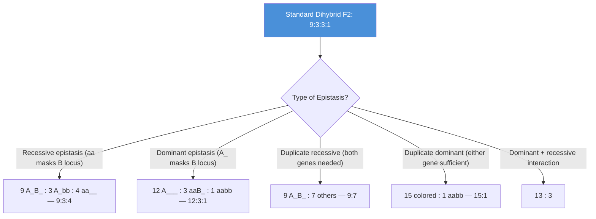
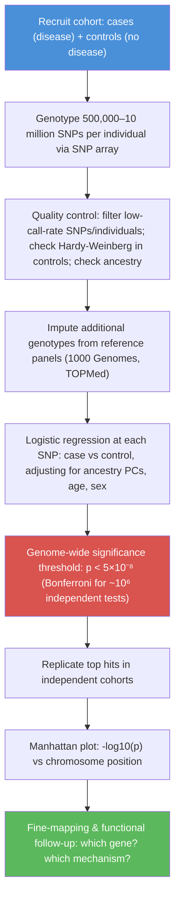
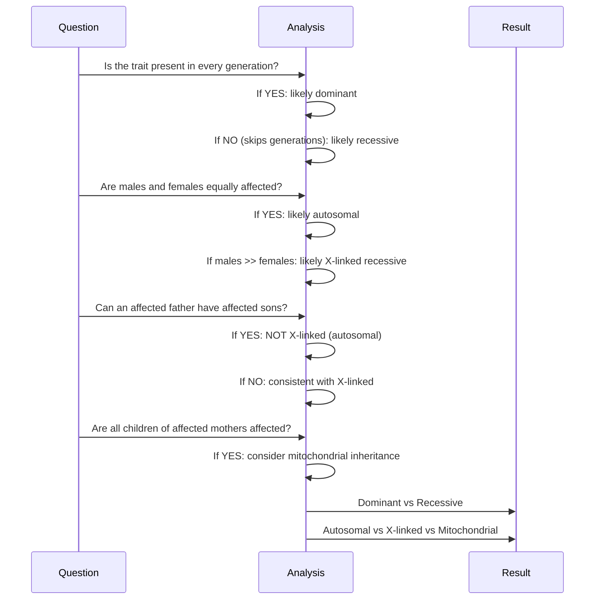

# Mendelian Extensions and Human Genetics

\label{sec:unit_V_mendelian_extensions_and_human_genetics}

<!-- chapter-metadata-badge -->
> Level 2/3 · 35 min read · 55 min lecture · Prerequisites: \cref{sec:unit_V_mendelian_principles}

## Learning Objectives

1. Describe extensions to Mendelian genetics including incomplete dominance, codominance, epistasis, and imprinting.
2. Solve pedigree and probability problems for human inheritance patterns.
3. Apply chi-squared tests and interpret penetrance, expressivity, and phenocopy.
4. Connect Mendelian extensions to GWAS and polygenic risk in populations.

5. Interpret a multi-generational pedigree with both X-linked and autosomal loci.
6. Distinguish monogenic, oligogenic, and polygenic inheritance using family and population evidence.
7. Evaluate polygenic risk scores with ancestry representation and calibration limits.

---

## Extensions to Mendelian Genetics

### Incomplete Dominance and Dosage-Sensitive Phenotypes

Neither allele is completely dominant; the heterozygote displays an **intermediate** phenotype:

- **Snapdragon flower color**: $C^R C^R$ (red) x $C^W C^W$ (white) → $C^R C^W$ (pink)
- F$_2$: 1 red : 2 pink : 1 white (**1:2:1 phenotype ratio = genotype ratio**)

Molecular basis: In many cases, gene dosage explains the intermediate phenotype. One copy of $C^R$ produces half the amount of red pigment compared to two copies.

### Codominance and Joint Allelic Expression

Both alleles are **fully and simultaneously expressed** in the heterozygote:

- **ABO blood groups**: $I^A I^A$ or $I^A i$ (type A) vs. $I^B I^B$ or $I^B i$ (type B) vs. $I^A I^B$ (type AB -- both A and B antigens present on red blood cell surface)
- Molecular basis: $I^A$ encodes N-acetylgalactosaminyltransferase (adds GalNAc to H antigen); $I^B$ encodes galactosyltransferase (adds Gal); both [**enzyme**](#gl:enzyme)s are functional in heterozygotes; $i$ encodes a nonfunctional enzyme

### Multiple Alleles and Population-Level Variation

A gene can have more than two alleles in a population (though any individual still carries at most two):

**ABO blood group system** (three alleles: $I^A$, $I^B$, $i$):

\begin{table}[htbp]
\label{tbl:unit_V_mendelian_genetics_1}
\centering
\small
\begin{tabular}{@{}p{2.8cm}p{0.8cm}p{2.0cm}p{2.6cm}p{2.6cm}p{3.0cm}@{}}
\toprule
\textbf{Genotype} & \textbf{Phen.} & \textbf{Antigens} & \textbf{Antibodies} & \textbf{Can Donate To} & \textbf{Can Receive From} \\
\midrule
$I^A I^A$ or $I^A i$ & A & A & Anti-B & A, AB & A, O \\
$I^B I^B$ or $I^B i$ & B & B & Anti-A & B, AB & B, O \\
$I^A I^B$ & AB & A and B & Neither & AB only & Universal recipient \\
$ii$ & O & Neither (H antigen only) & Anti-A and Anti-B & Universal donor & O only \\
\bottomrule
\end{tabular}
\end{table}

**Rabbit coat color** (4 alleles at the *C* locus): $c^+$ (full color) > $c^{ch}$ (chinchilla) > $c^h$ (Himalayan) > $c$ (albino). Dominance hierarchy gives 10 possible genotypes and 5 phenotypic classes.

> **Clinical Connection: Rh Disease of the Newborn**
> The Rh blood group system involves the RhD [**protein**](#gl:protein). Rh-negative mothers (RhD-/RhD-) carrying an Rh-positive fetus can become sensitized during delivery when fetal RhD+ red blood cells enter maternal circulation. Maternal IgG anti-RhD antibodies cross the placenta in subsequent pregnancies, destroying fetal RhD+ erythrocytes (hemolytic disease of the fetus and newborn, HDFN). Prevention: **anti-RhD immunoglobulin (RhoGAM)** administered at 28 weeks and within 72 hours of delivery clears fetal RhD+ cells before maternal sensitization occurs.

### Pleiotropy and Multi-Trait Gene Effects

A single gene affects **multiple phenotypic traits**:

**Sickle cell disease (HbS)**: A single [**nucleotide**](#gl:nucleotide) change (GAG to GTG, Glu6Val) in the beta-globin gene (*HBB*) produces sickle hemoglobin. Under low oxygen tension, HbS polymerizes, deforming red blood cells into rigid sickle shapes. This single [**mutation**](#gl:mutation) causes:

- Vaso-occlusive crises (pain)
- Hemolytic anemia (shortened RBC lifespan: ~17 days vs. ~120 days)
- Splenic sequestration and autosplenectomy
- Stroke (large vessel occlusion)
- Acute chest syndrome
- Avascular necrosis of bones
- Renal papillary necrosis
- Retinopathy

**Phenylketonuria (PKU)**: Phenylalanine hydroxylase (PAH) deficiency leads to phenylalanine accumulation, causing intellectual disability, fair skin/hair (reduced melanin from phenylalanine competition with tyrosine), musty body odor, and eczema. Newborn screening and phenylalanine-restricted diet prevent neurological damage.

**Marfan syndrome**: Mutations in *FBN1* (fibrillin-1) affect connective tissue throughout the body: tall stature, arachnodactyly, lens subluxation, mitral valve prolapse, and aortic root dilation (risk of aortic dissection).

### Epistasis: When One Gene Masks Another

**Epistasis** describes the interaction between two or more genes in which the phenotype produced by one gene depends on the genotype at a second locus. The 9:3:3:1 dihybrid ratio applies primarily when two independently assorting genes act independently on the phenotype. When the genes interact — when one gene's protein product feeds the substrate that another gene's product modifies, or when one gene controls whether another gene's product is even visible — the dihybrid F$_2$ ratio is **modified** in characteristic ways. Each modified ratio is a genetic signature of a specific kind of biochemical interaction.


<!-- alt: Flowchart showing modified dihybrid ratios produced by different types of epistasis. Each ratio is a modification of the standard 9:3:3:1 ratio. -->

*Modified dihybrid ratios produced by different types of epistasis. Each ratio is a modification of the standard 9:3:3:1 ratio.*

#### Recessive Epistasis (9:3:4) — Labrador coat color

Recessive epistasis occurs when **homozygosity at one locus masks the phenotype produced by a second locus**. The Labrador retriever coat color illustrates the principle through a two-step pigment pathway:

- **B locus** (Brown): determines whether eumelanin is black ($B$) or brown/chocolate ($b$).
- **E locus** (Extension): determines whether eumelanin is **deposited at most** in the hair shaft. $E$ alleles deposit pigment; $ee$ homozygotes block deposition entirely, producing yellow coats regardless of B genotype.

| Genotype | Pigment chemistry | Coat |
|----------|-------------------|------|
| B\_E\_ | Black eumelanin deposited | Black |
| bbE\_ | Brown eumelanin deposited | Chocolate |
| B\_ee | Black eumelanin made but **not deposited** | Yellow |
| bbee | Brown eumelanin made but **not deposited** | Yellow |

Because $ee$ is **epistatic** to the B locus, the standard 9:3:3:1 collapses into **9 black : 3 chocolate : 4 yellow** in an F$_2$ from BbEe × BbEe.

#### Worked Example: Recessive Epistasis

In a cross BbEe × BbEe, what is the probability of a chocolate Labrador puppy?

$$P(\text{chocolate}) = P(bb) \times P(E\_) = \tfrac{1}{4} \times \tfrac{3}{4} = \tfrac{3}{16} \label{eq:unit_V_mendelian_genetics_item_12}$$


#### Dominant Epistasis (12:3:1) — Squash fruit color

Dominant epistasis occurs when **the dominant allele at one locus masks expression at a second locus**. White-fruited summer squash (*Cucurbita pepo*) is a classic case. Allele $W$ produces white fruit and is **dominant** to $w$ (colored fruit). At a second locus, $Y$ produces yellow and $y$ produces green pigment — but primarily when $ww$ allows pigment to develop.

| Genotype | Phenotype |
|----------|-----------|
| W\_Y\_ | White |
| W\_yy | White |
| wwY\_ | Yellow |
| wwyy | Green |

The F$_2$ from WwYy × WwYy yields **12 white : 3 yellow : 1 green**, written 12:3:1. Dominant $W$ shuts down the entire pathway downstream of the Y locus.

#### Duplicate Recessive Epistasis (9:7) — Sweet pea flower color

Sweet pea (*Lathyrus odoratus*) flower color requires the **complementary action** of two unlinked genes, both encoding biosynthetic enzymes in the anthocyanin pathway. Bateson and Punnett (1905) crossed two pure-breeding white strains and obtained purple F$_1$ offspring — an unexpected result that reflected complementation between the recessive defects in the two parental lines. The F$_2$ ratio is **9 purple : 7 white**.

| Genotype | Both enzymes functional? | Color |
|----------|--------------------------|-------|
| C\_P\_ | Yes — full pathway active | Purple |
| C\_pp | No — pathway blocked at second step | White |
| ccP\_ | No — pathway blocked at first step | White |
| ccpp | No — pathway blocked at both steps | White |

Either single-locus block (cc or pp) produces white; primarily doubly-dominant individuals build pigment. This **9:7 ratio** is a hallmark of **complementary gene action** in linear biosynthetic pathways.

#### Duplicate Dominant Epistasis (15:1) — Shepherd's purse seed shape

When **either dominant allele alone is sufficient** to produce the phenotype, primarily the double-recessive shows the alternative trait. F$_2$ ratio: **15 phenotype A : 1 phenotype B**. Shepherd's purse seed-capsule shape is the classic example: triangular ($A\_$ or $B\_$) versus narrow ($aabb$).

#### Combinatorics summary

| Modified F$_2$ ratio | Mechanism | Example |
|---------------------|-----------|---------|
| 9:3:4 | Recessive epistasis | Labrador coat color (B/E) |
| 12:3:1 | Dominant epistasis | White squash fruit (W/Y) |
| 9:7 | Duplicate recessive (complementation) | Sweet pea flower color |
| 15:1 | Duplicate dominant | Shepherd's purse capsules |
| 13:3 | Dominant + recessive interaction | White Leghorn × white Wyandotte chickens |

In every case the ratio sums to 16, betraying its origin in 9:3:3:1 — epistasis is **typically a regrouping of the same dihybrid classes**, rarely the introduction of new ones.

#### Epistasis in mouse coat color: agouti × albino

A second worked example consolidates the recessive-epistasis logic. In the laboratory mouse, the **A locus** (agouti) determines whether hairs have a yellow band (A\_) or are uniformly black (aa). At the **C locus**, the C allele is required to deposit any pigment — cc homozygotes are albino regardless of the A genotype. A cross of AaCc × AaCc produces F$_2$ offspring in a **9 agouti : 3 black : 4 albino** ratio, with the albino class combining both A\_cc and aacc genotypes (because pigment deposition fails in either case).

The **9:3:4 signature ratio** therefore appears whenever:

1. A gene at one locus produces a substrate or precursor.
2. A gene at a second locus deposits, modifies, or expresses the product of the first.
3. Homozygosity for the loss-of-function allele at the second locus completely blocks phenotypic expression.

This logic underlies the genetic basis of many recessive epistatic systems: **Bombay phenotype** at the H locus (cc-equivalent for ABO blood groups), **albinism in mammals** masking coat-pattern loci, and **white-flower mutants** in many ornamental plants.

#### Worked Example: Duplicate Dominant Ratio in Shepherd's Purse

In a cross of two heterozygous shepherd's purse plants (AaBb × AaBb), what fraction of F$_2$ offspring are predicted to have **narrow** seed capsules (the alternative phenotype)?

Narrow capsules require the double-recessive genotype aabb. Each locus contributes $\tfrac{1}{4}$ probability of double-recessive at that locus:

$$P(\text{narrow}) = P(aa) \times P(bb) = \tfrac{1}{4} \times \tfrac{1}{4} = \tfrac{1}{16} \label{eq:unit_V_mendelian_genetics_item_13}$$


The remaining $\tfrac{15}{16}$ of offspring have triangular capsules. The 15:1 ratio is the genetic signature of **functional redundancy** — when either gene alone is sufficient, primarily the simultaneous loss of both produces the alternative phenotype. The same logic explains why **paralogous gene families** often show 15:1-like behavior in knockout studies: knocking out either paralog alone produces no phenotype, but the double knockout reveals the shared function.

### Polygenic Inheritance and Quantitative Traits

**Multiple genes** contribute additively to a single continuous (quantitative) trait:

- **Human skin color**: At least 7 genes contribute (SLC24A5, SLC45A2, TYR, TYRP1, OCA2, KITLG, MC1R and others). Each gene has alleles that contribute incrementally to melanin production. The result is a **continuous distribution** (approximately normal/Gaussian) rather than discrete classes.
- **Human height**: ~700 GWAS loci identified; each has a small effect (1-2 mm per allele). Environmental factors (nutrition, health) also contribute significantly. Heritability ~0.8 in well-nourished populations.

The number of phenotypic classes for n contributing loci (each with two alleles, additive effects) = $2n + 1$.

### Penetrance and Expressivity

Mendelian ratios assume that every individual carrying a given genotype displays the expected phenotype, and displays it identically. In reality, the genotype–phenotype map is leaky on **two distinct axes** — *whether* the phenotype appears at most (penetrance) and *how strongly* it appears when it does (expressivity).

- **Penetrance** is the **proportion of individuals with a given genotype who actually display the expected phenotype**. A trait with 100% penetrance is **completely penetrant**; a trait with less than 100% is **incompletely penetrant**.
- **Expressivity** is the **degree or severity of phenotype expression** among individuals who *are* penetrant. Variable expressivity means the same genotype produces a range of phenotypic intensities.
- **Phenocopy** is an **environmentally induced phenotype that mimics a genetic condition** without the underlying genotype. Phenocopies can confound pedigree analysis if not recognized.

#### Disease examples

| Phenomenon | Disorder | Detail |
|-----------|----------|--------|
| Reduced penetrance | **BRCA1/BRCA2** breast/ovarian cancer | ~70–80% lifetime breast cancer risk in BRCA1 carriers; some carriers rarely develop disease |
| Reduced penetrance | **Familial hypercholesterolemia** (LDLR mutations) | Variable age of onset for cardiovascular disease; modified by diet and other genes |
| Reduced penetrance | **Retinoblastoma (RB1)** | ~90% penetrance; some heterozygous carriers escape because the second hit (loss of the wild-type allele) does not occur in retinal precursor cells |
| Variable expressivity | **Neurofibromatosis type 1 (NF1)** | *NF1* tumor suppressor (encodes neurofibromin, a Ras-GAP); same mutation produces café-au-lait macules in some individuals, severe plexiform neurofibromas, optic gliomas, and skeletal dysplasia in others. Loss-of-heterozygosity (second hit) at *NF1* in Schwann cell lineages produces the variable tumor burden |
| Variable expressivity | **Polydactyly** (e.g., *GLI3* mutations, Greig cephalopolysyndactyly) | Affected family members carrying the identical mutation may show one extra digit on one hand, two extra digits on both hands and feet, or post-axial duplication varying side-to-side. Limb-bud stochastic patterning during weeks 4–7 produces this variability |
| Variable expressivity | **Marfan syndrome (FBN1)** | Aortic root size varies dramatically among affected family members carrying the same mutation |
| Variable expressivity | **Huntington's disease** | Age of onset varies inversely with CAG repeat length but also among individuals with identical repeat counts (modifier loci) |
| Phenocopy | **Thalidomide-induced phocomelia** | Limb shortening from drug exposure (1958–1962) mimicked the rare genetic condition |
| Phenocopy | **Congenital rubella syndrome** | Maternal rubella infection causes deafness and cataracts that resemble genetic syndromes |

The biological causes of incomplete penetrance and variable expressivity include **modifier genes** (other loci that influence how the primary mutation manifests), **stochastic developmental events** (random fluctuations during embryogenesis), **environmental triggers** (diet, infection, smoking), **epigenetic state** (methylation patterns inherited or established during development), and — for X-linked traits in females — **random X-inactivation patterns** (\cref{sec:unit_V_chromosomal_inheritance}).

For genetic counseling, incomplete penetrance complicates risk prediction: a "negative" family member is not certainly mutation-free, and a "positive" family history is not a assurance of disease. Penetrance estimates are typically reported as age-specific cumulative risks (e.g., "80% by age 70 for BRCA1") rather than single numbers.

### Genomic Imprinting and Parent-of-Origin Effects

Some genes are expressed in a **parent-of-origin-specific** manner due to differential DNA methylation established during gametogenesis:

**Prader-Willi syndrome vs. Angelman syndrome** (chromosome 15q11-13):
- **Prader-Willi syndrome**: Deletion/loss of the **paternal** 15q11-13 region (or maternal uniparental disomy). Genes in this region are normally expressed primarily from the paternal chromosome. Features: hypotonia in infancy, hyperphagia and obesity, intellectual disability, short stature.
- **Angelman syndrome**: Deletion/loss of the **maternal** 15q11-13 region (specifically the *UBE3A* gene, which is maternally expressed in [**neuron**](#gl:neuron)s). Features: severe intellectual disability, seizures, ataxic gait, happy demeanor with frequent laughter.

Same chromosomal region, but different disease depending on which parent's copy is affected -- a clear demonstration that the [**genome**](#gl:genome) "remembers" parental origin.

### Maternal Effect Genes

The **mother's genotype** (not the offspring's) determines the offspring's phenotype:

- **Bicoid in *Drosophila***: The bicoid mRNA is deposited into the oocyte by the mother. It localizes to the anterior end and is translated after fertilization, producing a [**transcription**](#gl:transcription) factor gradient that specifies anterior structures (head, thorax). A mother homozygous for a *bicoid* mutation produces embryos lacking anterior structures -- regardless of the embryo's own genotype.

**Concept Check 16.2**

> 1. Distinguish between codominance and incomplete dominance at the molecular level.
> 2. Two yellow Labradors are mated. Can they produce chocolate puppies? Explain.
> 3. If a trait is 70% penetrant, what fraction of heterozygous carriers will NOT show the phenotype?
> 4. A mother with Prader-Willi syndrome (paternal deletion) has a child. Can the child inherit Prader-Willi? Angelman? Explain.
> 5. Distinguish reduced penetrance from variable expressivity. Give one disease example of each.

---

<!-- curriculum-scaffold-start -->
### Study Blueprint

- **Big idea:** Extensions to Mendelian ratios and human pedigree analysis reveal when simple dominance fails.
- **Core concepts:** incomplete dominance, epistasis, pedigrees, penetrance.
- **Framework alignment:** Vision & Change: Information flow, exchange, and storage, Evolution; AP Biology: Information Storage and Transmission, Evolution; NGSS-style topics: Inheritance and Variation of Traits, Natural Selection and Evolution.
- **Model or quantitative lens:** Pedigree, epistasis, and multi-locus probability calculations.
- **Data skill:** Infer inheritance mode and extension mechanism from family or cross data.
- **Practice cadence:** Statistical Tests and Data Analysis, Representing and Describing Data.
- **Common misconception to repair:** A single-gene model is a starting hypothesis, not always sufficient by itself.
- **Primary lab:** \cref{sec:lab_unit_V_mendelian_extensions_and_human_genetics}.
- **Question bank:** \cref{sec:q_unit_V_mendelian_extensions_and_human_genetics}.
- **Transfer task:** Transfer extension reasoning to counseling, GWAS interpretation, and breeding.
- **Bridge to computation:** `biology.genetics.genetics.punnett_square`.
<!-- curriculum-scaffold-end -->

---

> **Opening Vignette — Mendelian Extensions and Human Genetics**
>
> This chapter connects mendelian extensions and human genetics to measurable evidence: models, datasets, and experiments that can strengthen or weaken each claim.

## Human Genetic Disorders: Mechanism Meets Mendel

Human genetics has historically been the inverse of Mendel's pea garden — instead of designing crosses, clinicians infer genotypes from pedigrees and clinical features. The core inheritance patterns (autosomal dominant, autosomal recessive, X-linked, mitochondrial) follow directly from Mendelian principles applied to specific chromosomal architecture. The molecular mechanisms behind individual disorders, however, illustrate the rich biology that makes Mendel's abstract "factors" into proteins, enzymes, and regulatory RNAs.

### Autosomal Dominant Disorders: Huntington's Disease and CAG Repeat Expansion

**Huntington's disease (HD)** is an adult-onset neurodegenerative disorder caused by mutations in the *HTT* gene on chromosome 4p16.3. It is **autosomal dominant** with nearly complete penetrance by age 65 — a rare example of a fully penetrant late-onset disorder. The clinical features include progressive chorea (involuntary writhing movements), psychiatric symptoms (depression, irritability, psychosis), and cognitive decline (executive dysfunction, dementia). Median survival from symptom onset is approximately 15–20 years.

**Molecular mechanism**: The *HTT* gene contains a polymorphic CAG trinucleotide repeat in its first exon, encoding a polyglutamine (polyQ) tract in the huntingtin protein. The number of CAG repeats determines disease status:

| CAG repeats | Disease status |
|-------------|----------------|
| ≤ 26 | Normal — no risk; stable inheritance |
| 27–35 | Intermediate — usually unaffected, but unstable in transmission and may expand into the affected range in offspring (especially through paternal transmission) |
| 36–39 | Reduced penetrance — disease may or may not develop in a normal lifespan |
| ≥ 40 | Fully penetrant — disease will develop if individual lives long enough |

The expanded polyQ tract causes the huntingtin protein to misfold and aggregate, forming intranuclear inclusions in neurons (especially in the striatum). The precise pathogenic mechanism remains debated — gain of toxic function, loss of normal function, and disruption of axonal transport most contribute.

**Anticipation**: Disease severity worsens and age of onset decreases across generations because the CAG repeat is **unstable during meiosis**, especially during spermatogenesis. A father with 42 repeats may transmit 50 repeats to his son; that son's children may inherit 60 or more. **Juvenile-onset HD** (onset before age 20) almost typically reflects paternal transmission of severely expanded alleles (>60 repeats). This phenomenon — anticipation — is also observed in fragile X syndrome, myotonic dystrophy, and several spinocerebellar ataxias, most of which are **trinucleotide repeat expansion disorders**.

**Inverse correlation**: Within the affected range, age of onset correlates inversely with repeat number, but with substantial variance attributable to modifier genes (e.g., *FAN1*, *MSH3*) that influence somatic repeat instability. This explains why two siblings with the same CAG count can have onset ages differing by a decade or more.

**Genetic counseling**: Because HD is autosomal dominant, each child of an affected parent has a 50% risk. Predictive testing in unaffected adults raises difficult ethical questions — there is no preventive therapy, and testing carries psychological consequences (depression, suicidality) that mandate pre-test and post-test genetic counseling. Many at-risk individuals choose not to be tested.

### Autosomal Recessive Disorders: PKU and the Logic of Newborn Screening

**Phenylketonuria (PKU)** is an autosomal recessive disorder caused by mutations in the *PAH* gene on chromosome 12q23.2 encoding **phenylalanine hydroxylase**, the liver enzyme that converts phenylalanine to tyrosine. PKU illustrates how a single biochemical defect cascades into multiple phenotypes (pleiotropy) and how early detection plus dietary intervention can prevent the most devastating manifestations.

**Biochemistry**: PAH is a tetrameric enzyme requiring tetrahydrobiopterin (BH4) as cofactor. In its absence, phenylalanine accumulates to toxic concentrations (>20 mg/dL versus normal <2 mg/dL) while tyrosine — the precursor of dopamine, melanin, and thyroid hormone — becomes deficient. The metabolic consequences include:

- **Phenylalanine accumulation** in blood and brain, where excess phenylalanine competes with other large neutral amino acids (tyrosine, tryptophan, leucine) for the L-type amino acid transporter (LAT1) at the blood-brain barrier. Brain tyrosine and tryptophan deficiency disrupts catecholamine and serotonin synthesis.
- **Phenylketones**: when phenylalanine is in excess, alternative metabolic pathways produce phenylpyruvate, phenyllactate, and phenylacetate — the "ketones" detectable in urine that gave the disease its name.
- **Tyrosine deficiency** reduces melanin synthesis (causing fair skin, blond hair, and blue eyes — distinctive features in untreated patients) and may contribute to neurological symptoms.

**Clinical features (untreated)**: severe intellectual disability (IQ typically <50 by age 1), seizures (in ~25% of untreated patients), microcephaly, motor abnormalities, eczema, characteristic musty body odor (from phenylacetate excretion), and reduced melanin pigmentation. Untreated PKU was a leading cause of intellectual disability before comprehensive newborn screening.

**Newborn screening**: Robert Guthrie developed the **Guthrie test** in 1962 — a bacterial inhibition assay using *Bacillus subtilis* requiring phenylalanine. A heel-prick blood spot from a 24–72-hour-old newborn is dried on filter paper and screened en masse. Modern programs use tandem mass spectrometry to measure dozens of metabolites simultaneously. Newborn screening for PKU was the first widespread genetic screening program and remains the prototype for population screening programs worldwide.

**Treatment**: A **phenylalanine-restricted diet** initiated within the first weeks of life prevents intellectual disability almost entirely. Patients consume specially formulated medical foods low in phenylalanine but supplemented with tyrosine. Treatment is lifelong — relaxation of dietary restrictions in adolescence or adulthood causes neuropsychiatric symptoms (depression, anxiety, executive dysfunction) and, in pregnant women with PKU, **maternal PKU syndrome** (intellectual disability, microcephaly, congenital heart disease in the fetus, even when the fetus is heterozygous). New therapies include sapropterin (synthetic BH4, useful for ~30% of patients with residual PAH activity) and pegvaliase (PEGylated phenylalanine ammonia lyase enzyme replacement, approved 2018).

**Population genetics**: PKU disease frequency is ~1/10,000–15,000 in northern European populations, giving a carrier frequency of ~1/55–60. PKU is more common in Ireland (~1/4,500), Turkey (~1/3,000–6,500), and parts of China (~1/15,000–17,000), with population-specific allele spectra that allow targeted carrier screening.

### Other key autosomal disorders

| Disorder | Inheritance | Gene | Mechanism |
|----------|-------------|------|-----------|
| **Cystic fibrosis** | AR | *CFTR* | Chloride channel defect; thick mucus; ΔF508 most common |
| **Sickle cell disease** | AR | *HBB* | Glu6Val in β-globin; sickle hemoglobin polymerization |
| **Tay-Sachs disease** | AR | *HEXA* | β-hexosaminidase A deficiency; GM2 ganglioside accumulation; founder effect in Ashkenazi Jews |
| **Achondroplasia** | AD | *FGFR3* | Constitutively active FGFR3; chondrocyte proliferation defect; ~80% de novo mutations |
| **Marfan syndrome** | AD | *FBN1* | Fibrillin-1 connective tissue defect |
| **Familial hypercholesterolemia** | AD | *LDLR* | Defective LDL receptor; extreme hypercholesterolemia |
| **Hereditary nonpolyposis colon cancer (Lynch)** | AD | *MLH1, MSH2, MSH6, PMS2* | DNA mismatch repair defects |

#### CFTR mutation classes — a paradigm for genotype–phenotype maps

The 2,000+ identified *CFTR* variants are grouped into **six classes** by their effect on protein production and function — a classification that now drives **mutation-specific therapy**:

| Class | Defect | Examples | Therapy |
|-------|--------|----------|---------|
| I | No protein synthesis (premature stop codons) | W1282X, G542X | Read-through agents (ataluren — limited efficacy) |
| II | Misfolding / proteasomal degradation | **ΔF508** (~70% of CF alleles in Northern Europeans) | Correctors (lumacaftor, tezacaftor, elexacaftor) |
| III | Channel does not open ("gating defect") | G551D | Potentiators (ivacaftor) |
| IV | Reduced channel conductance | R117H | Potentiators |
| V | Reduced protein levels (splicing defects) | 3849+10kb C→T | Mixed |
| VI | Reduced channel stability at cell surface | rescued ΔF508 | Stabilizers |

The combination therapy **elexacaftor/tezacaftor/ivacaftor (Trikafta)**, approved 2019, is effective for ~90% of CF patients (those carrying at least one ΔF508) and has dramatically improved life expectancy — a paradigm for translating mendelian genetics into precision medicine.

### Achondroplasia and Marfan as Autosomal Dominant Models

**Achondroplasia** is the most common form of dwarfism (~1/25,000 births), caused by gain-of-function mutations in *FGFR3* (fibroblast growth factor receptor 3). The vast majority (~98%) of cases involve a single recurrent mutation: **G380R** in the transmembrane domain. The mutation produces a constitutively active receptor that inhibits chondrocyte proliferation and endochondral ossification, shortening long bones while sparing membranous bones (skull vault, vertebrae). Approximately **80% of cases are de novo mutations** arising in the paternal germline, and risk increases with paternal age — illustrating that autosomal dominant disease can persist in populations even when affected individuals have reduced reproductive fitness, because new mutations replenish the disease allele each generation. Homozygous achondroplasia (two affected parents — ~1 in 4 pregnancies if both are heterozygous) is lethal in infancy due to severe rib cage abnormalities.

**Marfan syndrome** illustrates how a single connective-tissue gene, *FBN1* (fibrillin-1), produces pleiotropic effects across organ systems. Fibrillin-1 forms microfibrils that scaffold elastic fibers and sequester latent TGF-β. Mutations cause both **structural failure** (loose connective tissue → tall stature, long limbs, lens dislocation, joint hypermobility) and **dysregulated TGF-β signaling** (aortic root dilation → dissection risk). Variable expressivity is dramatic: aortic root sizes among affected family members carrying the same mutation can vary by 2–3-fold, depending on modifier genes and environment. Modern management includes annual echocardiography, β-blockers or losartan to slow aortic dilation, and elective aortic root replacement when diameter exceeds ~5 cm — extending life expectancy from a historical median of ~32 years to nearly normal.

> **Clinical Connection: Why Are Some AR Diseases Common?**
> Cystic fibrosis carrier frequency of ~1/25 in Northern Europeans far exceeds what mutation-selection balance alone predicts. Hypothesized heterozygote advantage against historical pathogens — possibly **typhoid fever** (CFTR is a receptor for *Salmonella typhi*) or **cholera** (heterozygotes may have reduced fluid secretion in cholera infection) — could explain the elevated frequency. Sickle cell heterozygosity confers strong protection against severe *Plasmodium falciparum* malaria, and Tay-Sachs heterozygotes may have had protection against tuberculosis in pre-industrial European cities. These hypotheses remain debated, but they illustrate how Mendelian disease alleles can be maintained by ancient selective pressures we no longer experience.

### X-linked disorders: the molecular basis of male susceptibility

Males are hemizygous for X-linked genes (one X, one Y), so a single recessive allele on the X chromosome produces the full phenotype in a male. Females, with two X chromosomes, must be homozygous (or display unfavorable random X-inactivation patterns) to be fully affected. This asymmetry — recognized first by Morgan's *white*-eyed *Drosophila* — produces the diagnostic pedigree pattern of "skipping generations through carrier mothers" that distinguishes X-linked recessive inheritance.

#### Hemophilia A — F8 and Factor VIII

**Hemophilia A** (~1 in 5,000 male births) is caused by mutations in the *F8* gene at Xq28 encoding **coagulation factor VIII**, a 2,332-amino-acid plasma glycoprotein that forms a tenase complex with activated factor IXa to activate factor X in the intrinsic coagulation pathway. The clinical phenotype is dose-dependent on residual factor VIII activity:

| Severity | Factor VIII activity | Bleeding pattern |
|----------|----------------------|------------------|
| Severe | < 1% | Spontaneous joint and muscle hemorrhage; treated prophylactically |
| Moderate | 1–5% | Bleeding after minor trauma |
| Mild | 6–40% | Bleeding primarily after surgery or major trauma |

The most common mutation in severe hemophilia A is the **intron 22 inversion**, which disrupts the *F8* gene and accounts for ~45% of severe cases. The gene is unusually large (186 kb, 26 exons), and its 32-kb intron 22 contains the *F8A1* gene with two homologous repeats elsewhere on Xq28; non-allelic homologous recombination during male meiosis produces the inversion. Modern treatment uses **recombinant factor VIII concentrates** (Kogenate, Advate) for replacement therapy, **emicizumab** (a bispecific antibody mimicking factor VIIIa), and increasingly **gene therapy**: in 2022 the FDA approved Hemgenix (etranacogene dezaparvovec) for hemophilia B, with similar AAV-based gene therapies for hemophilia A in advanced trials.

The Romanov royal family tragedy is the most famous historical case: Queen Victoria was a carrier (likely de novo mutation), and through her descendants the allele entered the Russian, Spanish, and German royal families. The hemophilia of Tsarevich Alexei contributed to the political collapse of the Romanov dynasty.

#### Color blindness — OPN1LW and OPN1MW

**Red-green color blindness** affects ~8% of males and ~0.5% of females of European ancestry. The disorder reflects defects in two tandem opsin genes on Xq28:

- ***OPN1LW*** (long-wavelength opsin) — sensitive to red light (~560 nm peak)
- ***OPN1MW*** (medium-wavelength opsin) — sensitive to green light (~530 nm peak)

The two genes are >96% identical and lie head-to-tail in a tandem array (1–6 copies of *OPN1MW* per X chromosome) at Xq28. The high sequence similarity makes them prone to **unequal crossing over** during female meiosis, producing chromosomes with deleted, duplicated, or hybrid (chimeric) opsin genes:

- **Protan defects** (red-blindness): loss or alteration of *OPN1LW*
- **Deutan defects** (green-blindness): loss or alteration of *OPN1MW*

Hybrid genes — formed when the upstream portion of one opsin fuses with the downstream portion of the other — produce shifted spectral sensitivities (anomalous trichromacy). The unique vulnerability of this gene cluster to misalignment during recombination explains why color blindness is far more common than other X-linked traits despite no obvious selective advantage.

#### Duchenne muscular dystrophy — DMD and dystrophin

**Duchenne muscular dystrophy (DMD)** affects ~1 in 3,500 male births and is caused by mutations in the ***DMD*** gene at Xp21.2 encoding **dystrophin** — at 2.4 megabases the largest known human gene (79 exons), accounting for ~0.1% of the entire genome. Dystrophin links the actin cytoskeleton inside muscle fibers to the dystrophin-glycoprotein complex spanning the sarcolemma, transmitting force during contraction and protecting the membrane from mechanical stress.

The genotype–phenotype rule for *DMD* mutations is the **reading-frame rule**: deletions that disrupt the reading frame produce no functional dystrophin and cause **Duchenne** (severe, wheelchair by age 12, cardiac/respiratory failure by ~25 years), whereas in-frame deletions produce truncated but partially functional dystrophin and cause **Becker muscular dystrophy** (milder, much later onset, normal lifespan possible). This rule has therapeutic consequences: **exon-skipping antisense oligonucleotides** mask specific exons during splicing to convert an out-of-frame Duchenne mutation into an in-frame Becker-like protein. **Eteplirsen** (FDA-approved 2016) skips exon 51 and is applicable to ~13% of DMD patients; **golodirsen** (exon 53) and **viltolarsen** (exon 53) treat additional subgroups. CRISPR-mediated exon excision is in clinical trials.

The very large size of *DMD* makes it the most mutation-prone gene in the human genome, with ~1/3 of cases representing de novo mutations rather than inheritance from a carrier mother — a fact that affects recurrence-risk counseling for affected families.

#### Female carriers — random X-inactivation and "manifesting carriers"

Female carriers of X-linked recessive disorders are typically clinically normal, but ~10–20% of *DMD* female carriers show muscle weakness, cramping, or even cardiomyopathy. The reason is **skewed X-inactivation**: by chance, the X chromosome carrying the wild-type allele is preferentially inactivated in many of her muscle cells, leaving the mutant X expressed. The clinical severity depends on the proportion of cells with skewed X-inactivation patterns. Similar manifesting-carrier phenotypes occur in hemophilia A (~10% of carriers have prolonged bleeding) and ornithine transcarbamylase deficiency (urea cycle disorder; manifesting carriers may experience hyperammonemic crises).

#### Carrier frequency vs. affected-male frequency: a population-genetic asymmetry

A diagnostic feature of X-linked recessive inheritance is that **carrier frequency in females greatly exceeds affected-female frequency**, even though both sexes draw from the same X-linked allele frequency $q$. The arithmetic follows directly from hemizygosity in males and Hardy-Weinberg expectations in females (\cref{sec:unit_V_population_genetics}):

| Quantity | Formula | Reason |
|----------|---------|--------|
| Affected males | $q$ | Hemizygous: one mutant allele suffices |
| Affected females | $q^2$ | Homozygous: both X alleles must be mutant |
| Carrier females (heterozygous) | $2pq \approx 2q$ for small $q$ | Heterozygous and asymptomatic with random X-inactivation |

Worked numbers for the three X-linked recessive disorders above (Northern European frequencies):

- **Hemophilia A**: affected-male frequency $\approx 1/5{,}000$, so $q \approx 2 \times 10^{-4}$. Carrier-female frequency $2pq \approx 4 \times 10^{-4}$ (~1 in 2,500 women). Affected-female frequency $q^2 \approx 4 \times 10^{-8}$ (~1 in 25 million) — meaning carriers outnumber affected females by ~10,000-fold.
- **Duchenne muscular dystrophy**: affected-male frequency $\approx 1/3{,}500$, $q \approx 2.9 \times 10^{-4}$. Carrier-female frequency $\approx 1/1{,}750$ women.
- **Red-green color blindness** (high allele frequency): affected-male frequency $\approx 0.08$, so $q \approx 0.08$. Carrier-female frequency $2pq \approx 0.147$, and affected-female frequency $q^2 \approx 0.0064$ — recovering the empirical ~0.5–1% color-blind female frequency.

Two consequences follow. First, **most pathogenic X-linked alleles in the population reside in unaffected female carriers**, who are invisible to phenotypic screening. Second, when a new disease-causing X-linked mutation arises (frequently de novo, especially for *DMD*), it persists for many generations through carrier mothers before reaching another affected male — producing the characteristic "skipping generations through unaffected females" pattern in pedigrees. Genetic counseling for X-linked disorders therefore prioritizes **carrier testing of female relatives of affected males**, even when those women appear clinically normal.

**Concept Check 16.5**

> 1. NF1 shows highly variable expressivity within a single family carrying the same mutation. Identify three biological reasons why identical genotypes can produce dramatically different phenotypes.
> 2. In a population where 1 in 4,000 males is affected with hemophilia A, what fraction of women are carriers? What is the probability that a randomly chosen woman is a carrier?
> 3. A man's brother has Duchenne muscular dystrophy (X-linked recessive). The brother's mother is confirmed by molecular testing to be a non-carrier (the affected brother arose from a de novo mutation). Should the man worry that his own future sons could inherit the disease through him? Explain.
> 4. Compare the dihybrid F$_2$ ratio expected when (a) two genes act independently in separate biosynthetic pathways and (b) two genes encode sequential enzymes in the same pathway where both are required for product formation. Which produces 9:3:3:1, which produces 9:7, and why?
> 5. A researcher studying Huntington's disease finds that two siblings carry identical *HTT* CAG repeat lengths (45 each) but have onset ages differing by 12 years. What is this discrepancy a manifestation of, and what general lesson does it teach about the genotype-phenotype map?

---

## GWAS: Mendel Meets the Genome

Mendel studied traits with simple, dichotomous inheritance — round vs. wrinkled, yellow vs. green. Most human traits and diseases, however, are **polygenic** (influenced by many loci) and **multifactorial** (influenced by both genes and environment). Height, body mass index, blood pressure, type 2 diabetes, schizophrenia, and most common diseases do not segregate as Mendelian traits in pedigrees — they are **complex traits**. The modern tool for dissecting their genetic architecture is the **genome-wide association study (GWAS)**.

### How GWAS works

GWAS scans the genome for **statistical association** between genetic variants — typically common single-nucleotide polymorphisms ([**SNP**](#gl:snp)s with minor allele frequency ≥ 1%) — and a phenotype, comparing thousands of cases to thousands of controls. The basic design is a **case-control association test**: at each SNP, compare the allele frequency in cases versus controls and ask whether the difference exceeds chance expectation.


<!-- alt: Flowchart showing GWAS workflow, from cohort recruitment through genome-wide significance testing to functional follow-up. The genome-wide significance threshold of p < 5×10⁻⁸ corresponds to a Bonferroni correction for ~10⁶ independent common variants tested across the genome. -->

*The GWAS workflow, from cohort recruitment through genome-wide significance testing to functional follow-up. The genome-wide significance threshold of p < 5×10⁻⁸ corresponds to a Bonferroni correction for ~10⁶ independent common variants tested across the genome.*

### What GWAS has revealed

Since the first successful GWAS (age-related macular degeneration, 2005), tens of thousands of genome-wide significant associations have been catalogued. Several lessons have emerged:

1. **Most common diseases are highly polygenic.** Schizophrenia: >270 loci. Type 2 diabetes: >400 loci. Height: >12,000 contributing variants. The "one-gene, one-disease" Mendelian model rarely applies to common conditions.
2. **Effect sizes are small.** Individual common variants typically increase disease risk by 1.05–1.3-fold (odds ratios of 1.05–1.3). The largest common-variant effects are typically in immune disorders (HLA region, OR up to 5–10 for specific autoimmune conditions).
3. **Most GWAS hits are non-coding.** Approximately 90% of GWAS-associated variants lie outside protein-coding regions, in regulatory elements (enhancers, promoters, 3′ UTRs). They alter gene **expression** rather than protein sequence — connecting GWAS to the regulatory biology of \cref{sec:unit_IV_chromatin_and_epigenetic_mechanisms}.
4. **Pleiotropy is the rule, not the exception.** Many GWAS loci affect multiple traits. A locus near *FTO* influences both BMI and diabetes risk. A locus near *TCF7L2* affects type 2 diabetes, fasting glucose, and bone mineral density.
5. **"Missing heritability"** persists — common GWAS variants typically explain 5–25% of trait heritability, far less than twin studies suggest is genetic. The gap reflects rare variants (insufficient power), structural variation (poorly captured by SNP arrays), gene-environment interactions, and non-additive effects (epistasis, dominance).

### Polygenic risk scores (PRS)

GWAS results can be combined into a **polygenic risk score** — a weighted sum of risk alleles across many SNPs:

$$\text{PRS}_i = \sum_{j=1}^{M} \beta_j \cdot g_{ij} \label{eq:unit_V_mendelian_genetics_item_14}$$


where $g_{ij}$ is the count of risk alleles (0, 1, or 2) at SNP $j$ in individual $i$, and $\beta_j$ is the GWAS effect estimate. PRS provides individual-level risk predictions that, for some diseases, equal or exceed the predictive power of family history. PRS is becoming clinically useful in cardiovascular disease, breast cancer, and prostate cancer screening, though equity concerns remain because most GWAS were conducted in European-ancestry populations and PRS performance degrades when transferred to other ancestries.

### GWAS as the modern face of Mendel's program

Mendel's deepest contribution was not the laws themselves but the **method**: count phenotypes, treat heredity as a probabilistic system, and test genetic hypotheses against quantitative ratios. GWAS is Mendel's program rescaled to millions of loci and billions of genotype calls — every Manhattan plot is a vast, statistically corrected dihybrid cross conducted across the entire genome.

> **Clinical Connection: When GWAS Becomes Drug Discovery**
> GWAS hits sometimes identify proteins that become drug targets. The discovery that *PCSK9* loss-of-function variants confer protection against cardiovascular disease (low LDL cholesterol, no apparent harm) led directly to the development of monoclonal antibodies (evolocumab, alirocumab) and small interfering RNAs (inclisiran) inhibiting PCSK9 — now major cholesterol-lowering therapies. Similarly, *HMGCR* variants supported statins as a drug class. Genetics-informed drugs are roughly twice as likely to succeed in clinical trials as drugs developed without genetic support.

### The Manhattan Plot and Genome-Wide Significance

The standard visual display of GWAS results is the **Manhattan plot** — a scatter of $-\log_{10}(p)$ values plotted against genomic position. The horizontal axis traverses chromosomes 1 through 22 (and X) in order; each point is a single SNP. Strong associations form vertical "skyscrapers" of co-associated SNPs in the same locus (because nearby SNPs are in linkage disequilibrium), giving the plot its skyline-like appearance.

The genome-wide significance threshold is conventionally set at $p < 5 \times 10^{-8}$ — the line drawn horizontally across most Manhattan plots. This threshold derives from a **Bonferroni correction** for multiple testing:

$$p_{\text{threshold}} = \frac{\alpha}{\text{number of independent tests}} = \frac{0.05}{10^6} = 5 \times 10^{-8} \label{eq:unit_V_mendelian_genetics_item_15}$$


The denominator of $\sim 10^6$ reflects the number of approximately independent common variants in the human genome (after accounting for linkage disequilibrium between adjacent SNPs). A "suggestive" threshold of $p < 10^{-5}$ is sometimes reported for hits that warrant follow-up but do not meet genome-wide significance. Replication in an independent cohort is the gold standard for confirming a true association.

### Polygenic Risk Scores: Detailed Example

Consider type 2 diabetes (T2D), one of the most extensively GWAS-studied complex diseases. Over 400 independent loci have been identified, each with small individual effects (odds ratios typically 1.05–1.20). A polygenic risk score combines these signals into an individual-level prediction:

\begin{equation}
\text{PRS}_i = \sum_{j=1}^{M} \beta_j \cdot g_{ij}
\label{eq:unit_V_mendelian_prs}
\end{equation}

where $g_{ij}$ is the dosage of the risk allele (0, 1, or 2) at SNP $j$ for individual $i$, $\beta_j$ is the GWAS-derived effect size for that SNP (usually log-odds ratio for case-control studies), and $M$ is the number of SNPs included (often hundreds of thousands when modern PRS methods like LDpred or PRS-CS are used).

**Clinical performance**: Modern PRS for T2D can identify individuals in the top percentile of genetic risk who have ~3–5× the population baseline lifetime risk of developing the disease — comparable in predictive power to having a single first-degree relative with the disease, but available decades before clinical onset and therefore actionable through lifestyle modification.

**Equity caveat**: Most large GWAS to date have been conducted in European-ancestry populations. PRS performance degrades substantially when applied to other ancestries, with predictive accuracy 50–75% lower in African-ancestry individuals. Closing this "PRS performance gap" requires diverse GWAS cohorts and cross-ancestry methods — an active area of research and a matter of healthcare equity.

### Clinical Interpretation and Governance Checkpoint

A PRS should be treated as a calibrated, ancestry- and context-dependent risk model, not as a diagnosis. A responsible report states the discovery cohort, target population, calibration method, confidence interval, and action threshold; checks whether the risk strata were validated in the patient's ancestry and care setting; and interprets the score alongside family history, monogenic testing when indicated, and modifiable clinical risk factors. Current PRS accuracy is several-fold higher in European-ancestry cohorts than in other cohorts, so premature deployment can widen health gaps if diverse validation does not keep pace \citep{martin2019prsdisparities}.

Governance is part of the biological interpretation. Consent should specify secondary use, data retention, reidentification risk, and which relatives might be indirectly implicated. In the United States, GINA addresses health-insurance and employment discrimination, but it does not extend to life, disability, or long-term-care insurance \citep{hhs2009gina}. A genetic-counseling workflow therefore separates what the score estimates from what clinicians, insurers, employers, families, or law-enforcement agencies are permitted to do with it.

**Concept Check 16.3**

> 1. Why is the genome-wide significance threshold $p < 5 \times 10^{-8}$ and not the conventional $p < 0.05$?
> 2. A father with 42 CAG repeats has Huntington's disease. His daughter inherits the affected allele. What can you predict about her CAG count and age of onset?
> 3. PKU is treatable with diet, yet newborn screening remains comprehensive in many countries. Why is comprehensive screening preferred over targeted screening of high-risk families?
> 4. Most GWAS hits lie outside protein-coding regions. What does this tell us about the genetic architecture of common diseases?
> 5. A patient's PRS for coronary artery disease places her in the top 1% of the population. Her standard cholesterol panel is normal at age 30. How should this affect her clinical management, and what are the limitations of acting on PRS alone?
> 6. Why does PRS performance degrade when applied across ancestries? What practical and ethical issues does this raise for clinical deployment?

---

## The Chi-Squared ($\chi^2$) Test

The $\chi^2$ test for goodness of fit evaluates whether observed offspring ratios deviate significantly from expected Mendelian ratios.

### Formula and Procedure

\begin{equation}
\chi^2 = \sum_{i=1}^{k} \frac{(O_i - E_i)^2}{E_i}
\label{eq:unit_V_mendelian_chi_squared}
\end{equation}

Where:
- $O_i$ = observed count in category $i$
- $E_i$ = expected count in category $i$ (based on the hypothesis)
- $k$ = number of categories

**Degrees of freedom (df)** = $k - 1$

**Decision rule**: Compare calculated $\chi^2$ to critical value from the chi-squared distribution at significance level $\alpha = 0.05$. If $\chi^2_{calc} > \chi^2_{crit}$, **reject** the null hypothesis (the data do not fit the expected ratio).

**Critical values:**

| df | $\alpha = 0.05$ | $\alpha = 0.01$ |
|----|-----------------|-----------------|
| 1 | 3.841 | 6.635 |
| 2 | 5.991 | 9.210 |
| 3 | 7.815 | 11.345 |
| 4 | 9.488 | 13.277 |

### Worked Example: Chi-Squared Test for a 3:1 Ratio

**Problem**: F$_2$ from a monohybrid cross, 100 offspring observed: 68 dominant, 32 recessive. Expected ratio: 3:1 (H$_0$: the trait follows simple Mendelian inheritance).

**Step 1**: Calculate expected values.
- Expected dominant = $100 \times \frac{3}{4} = 75$
- Expected recessive = $100 \times \frac{1}{4} = 25$

**Step 2**: Calculate $\chi^2$.

\begin{equation}
\chi^2 = \frac{(68-75)^2}{75} + \frac{(32-25)^2}{25} = \frac{49}{75} + \frac{49}{25} = 0.653 + 1.960 = 2.613
\label{eq:unit_V_mendelian_genetics_item_16}
\end{equation}


**Step 3**: Determine df = 2 - 1 = 1.

**Step 4**: Compare to critical value. $\chi^2_{crit}(df=1, \alpha=0.05) = 3.841$.

Since $2.613 < 3.841$, we **fail to reject** H$_0$. The observed data are consistent with a 3:1 Mendelian ratio ($p \approx 0.106$).

### Worked Example: Dihybrid Chi-Squared Test

**Problem**: A dihybrid cross produces: 315 round yellow, 108 round green, 101 wrinkled yellow, 32 wrinkled green (total = 556). Test the 9:3:3:1 hypothesis.

**Expected values**: $\frac{9}{16} \times 556 = 312.75$; $\frac{3}{16} \times 556 = 104.25$; $\frac{3}{16} \times 556 = 104.25$; $\frac{1}{16} \times 556 = 34.75$

\begin{equation}
\chi^2 = \frac{(315-312.75)^2}{312.75} + \frac{(108-104.25)^2}{104.25} + \frac{(101-104.25)^2}{104.25} + \frac{(32-34.75)^2}{34.75}
\label{eq:unit_V_mendelian_genetics_item_17}
\end{equation}


\begin{equation}
= 0.016 + 0.135 + 0.101 + 0.218 = 0.470
\label{eq:unit_V_mendelian_genetics_item_18}
\end{equation}


df = 4 - 1 = 3. $\chi^2_{crit}(df=3, \alpha=0.05) = 7.815$.

Since $0.470 < 7.815$, we fail to reject H$_0$. The data are consistent with a 9:3:3:1 ratio ($p > 0.90$). These are, in fact, Mendel's actual data for seed shape and color.

> **Clinical Connection: Using Chi-Squared in Genetic Counseling**
> In clinical genetics, the chi-squared test (or exact binomial tests for small families) helps evaluate whether a family's disease pattern is consistent with a specific inheritance model. For example, if a rare disease appears in 5 of 20 siblings (25%), a chi-squared test could evaluate whether this is consistent with autosomal recessive inheritance (expected 25% affected). However, for small family sizes, exact probability calculations are preferred.

---

## Pedigree Analysis and Inheritance-Pattern Inference

### Pedigree Symbols and Conventions

- **Squares**: males; **Circles**: females
- **Filled symbols**: affected individuals
- **Half-filled**: carrier (when known)
- **Horizontal line**: mating pair
- **Vertical line**: parent-offspring connection
- **Double horizontal line**: consanguineous mating (mating between relatives)
- **Roman numerals**: generations (I, II, III...)
- **Arabic numerals**: individuals within a generation (1, 2, 3...)

### Inheritance Pattern Recognition


<!-- alt: Sequence diagram showing pedigree analysis works as a decision tree: affected relatives across generations, sex bias, and transmission through parents distinguish dominant, recessive, X-linked, mitochondrial, and de novo patterns. -->

*Pedigree analysis works as a decision tree: affected relatives across generations, sex bias, and transmission through parents distinguish dominant, recessive, X-linked, mitochondrial, and de novo patterns.*

| Pattern | Key Diagnostic Clues |
|---------|---------------------|
| **Autosomal dominant** | Affected in every generation; unaffected parents produce primarily unaffected children; males and females equally affected; affected individuals have at least one affected parent |
| **Autosomal recessive** | Often skips generations; affected children from unaffected (carrier) parents; consanguinity increases risk; males and females equally affected |
| **X-linked recessive** | Males affected far more than females; carrier mothers pass to ~50% of sons; affected fathers cannot pass to sons (but most daughters are carriers); no male-to-male transmission |
| **X-linked dominant** | Both sexes affected but more females than males; affected father passes the allele to daughters but not sons; affected heterozygous mother passes to ~50% of sons and ~50% of daughters |
| **Mitochondrial** | Most children of an affected mother are affected; affected father does NOT transmit; maternal inheritance primarily |
| **Y-linked** | Primarily males affected; most sons of affected father are affected |

### Worked Pedigree Problem

**Problem**: A pedigree shows:
- Generation I: Unaffected father, unaffected mother
- Generation II: 3 unaffected daughters, 2 affected sons, 1 unaffected son
- One affected son (Generation II) marries an unaffected woman
- Generation III: 2 unaffected sons, 1 unaffected daughter

**Analysis**:
1. Trait skips Generation I (unaffected parents have affected children) -- suggests **recessive**
2. Primarily males affected -- suggests **X-linked**
3. Affected father (Gen II) has unaffected sons (Gen III) -- consistent with X-linked (father gives Y to sons)
4. Most daughters of affected father are unaffected -- but they are obligate carriers ($X^AX^a$) if the mother is $X^AX^A$ or $X^AY$ -- wait, the mother is female so $X^AX^A$ or $X^AX^a$

**Conclusion**: **X-linked recessive** inheritance. Mother in Gen I is a carrier ($X^HX^h$); Father in Gen I is unaffected ($X^HY$).

Probability that Gen III daughter (from affected father $X^hY$ x unaffected mother $X^HX^H$) is a carrier:

Most daughters of an affected father receive his $X^h$: probability = **1 (100% carriers)**.

## Worked Example: Conditional Probability in Pedigrees

A couple seeks genetic counseling. The woman's brother has cystic fibrosis (CF, autosomal recessive, $q = 0.02$ in the general population). The man has no family history.

(a) What is the probability the woman is a carrier?

Her parents must both be carriers (Cc x Cc). Among unaffected siblings, the probability of being a carrier:

\begin{equation}
P(\text{Cc} | \text{unaffected}) = \frac{P(\text{Cc})}{P(\text{unaffected})} = \frac{2/4}{3/4} = \frac{2}{3}
\label{eq:unit_V_mendelian_genetics_item_19}
\end{equation}


(b) What is the probability the man is a carrier?

Using Hardy-Weinberg: carrier frequency = $2pq \approx 2(0.98)(0.02) \approx \frac{1}{25}$

(c) What is the probability their first child will have CF?

\begin{equation}
P = P(\text{mom carrier}) \times P(\text{dad carrier}) \times P(\text{child cc} | \text{both carriers}) = \frac{2}{3} \times \frac{1}{25} \times \frac{1}{4} = \frac{2}{300} = \frac{1}{150}
\label{eq:unit_V_mendelian_genetics_item_20}
\end{equation}


**Concept Check 16.4**

> 1. An affected father and carrier mother have children. For an X-linked recessive trait, what fraction of daughters will be affected? What fraction of sons?
> 2. Why does consanguinity increase the risk of autosomal recessive disorders?
> 3. Can mitochondrial inheritance be distinguished from autosomal dominant maternal inheritance in a single pedigree? What additional information would help?

---

## Worked Example: Complex Multi-Locus Genetics

**Problem**: In mice, coat color is controlled by two independently assorting loci. At the A locus: A (agouti) is dominant to a (non-agouti/black). At the C locus: C (colored) is dominant to c (albino, epistatic -- no pigment regardless of A genotype). This is recessive epistasis.

(a) Cross AaCc x AaCc. Predict the F$_2$ phenotype ratio.

Using branching:
- A locus: $\frac{3}{4}$ A\_ (agouti pattern) : $\frac{1}{4}$ aa (black pattern)
- C locus: $\frac{3}{4}$ C\_ (colored) : $\frac{1}{4}$ cc (albino)

| Genotype | Phenotype | Fraction |
|----------|-----------|----------|
| A\_C\_ | Agouti | $\frac{9}{16}$ |
| aaC\_ | Black | $\frac{3}{16}$ |
| A\_cc | Albino | $\frac{3}{16}$ |
| aacc | Albino | $\frac{1}{16}$ |

**Phenotype ratio: 9 agouti : 3 black : 4 albino (9:3:4)**

(b) Among the albino offspring, what fraction are heterozygous at both loci (AaCc)?

Wait -- albino mice are cc, so they must be \_\_cc. Among A\_cc offspring (fraction $\frac{3}{16}$), the Aa fraction = $\frac{2}{3}$ of A\_. And most are cc (no Cc among albinos).

The question asks for AaCc, but cc individuals cannot be Cc. Therefore the answer is **0** -- no albino offspring can be AaCc.

If the question intended Aacc: Among most albino mice ($\frac{4}{16}$), the fraction that is Aacc = $\frac{2/16}{4/16} = \frac{1}{2}$.

---

## Computational Bridge

Mendelian ratios are enumerated exactly by `punnett_square`:

```python
from biology.genetics import punnett_square

r = punnett_square("Aa", "Aa")
print(r.genotype_ratios, r.phenotype_ratios)
```

> **Clinical / systems note:** Pedigree risk counselling translates identical probability trees into prior odds for carrier screening (CF, SMA, Ashkenazi panels) before any DNA test is ordered.

---

## Current Evidence and Frontier Biology: Mendelian Extensions and Human Genetics

For **Mendelian Extensions and Human Genetics**, frontier biology belongs inside the evidence logic of
the chapter. Classical genetics remains essential, but modern interpretation adds penetrance, polygenicity, structural variation, ancestry-aware inference, and uncertainty in risk prediction. The core reading question is this: Mendelian patterns are starting models that must be qualified by penetrance, linkage, environment, and sampling.

- **What to verify:** identify the observation, model, assay, or dataset that
  would make the claim stronger or weaker.
- **What to qualify:** state the scale, organism, cell type, environmental
  condition, or population where the claim is expected to hold.
- **What to compare:** test at least one alternative explanation, baseline, or
  null model before treating the pattern as causal.
- **What to cite:** distinguish primary evidence, review synthesis, public
  dataset, and institutional guidance; for recent or numeric claims, prefer
  the source closest to the measurement and state what has changed since it was
  published.

A good genetics answer separates the Mendelian transmission model from the evidence needed to use it in a population, family, or clinical setting.

**Source practice:** For genetics claims, separate model assumptions from sampling, ancestry representation, penetrance, linkage, and environment.

## Summary

- **Mendel's experiments**: Garden peas, quantitative analysis of 7 characters, statistical reasoning -- the first application of statistics to biology.
- **Law of Segregation**: Two alleles separate at meiosis I (anaphase I); each gamete gets one allele.
- **Law of Independent Assortment**: Genes on different chromosomes orient independently at metaphase I; exceptions for linked genes.
- **Molecular basis of Mendel's laws**: Sutton-Boveri chromosome theory unifies abstract "factors" with homolog behavior at meiosis; every Punnett square is a model of meiotic chromosome dynamics.
- **Monohybrid F$_2$**: 3:1 phenotype ratio; 1:2:1 genotype ratio. Testcross confirms genotype.
- **Dihybrid F$_2$**: 9:3:3:1 phenotype ratio (product of two independent 3:1 ratios).
- **Non-Mendelian inheritance**: Incomplete dominance (1:2:1 phenotype), codominance (both alleles expressed), multiple alleles (ABO), pleiotropy (sickle cell), polygenic traits (continuous distribution), epistasis (modified dihybrid ratios — 9:3:4, 12:3:1, 9:7, 15:1, 13:3), genomic imprinting (parent-of-origin expression), maternal effect (mother's genotype determines offspring phenotype).
- **Penetrance and expressivity**: Reduced penetrance (BRCA1, retinoblastoma) and variable expressivity (NF1, Marfan) explain why identical genotypes produce divergent clinical outcomes.
- **Human genetic disorders**: Huntington's disease (CAG repeat expansion, autosomal dominant, anticipation); PKU (autosomal recessive, screened almost universally at birth, dietary therapy); CF, sickle cell, Tay-Sachs as paradigm autosomal recessive disorders maintained at elevated frequencies by likely heterozygote advantage.
- **GWAS**: Genome-wide association studies extend Mendel's logic to millions of common variants, revealing that complex traits are highly polygenic, that most causal variants are non-coding, and that polygenic risk scores can predict disease risk at the individual level.
- **Chi-squared test**: $\chi^2 = \sum \frac{(O-E)^2}{E}$; df = k-1; compare to critical value at $\alpha = 0.05$.
- **Pedigree analysis**: Autosomal dominant (every generation, equal sex ratio), autosomal recessive (skips generations, consanguinity), X-linked recessive (males >> females, no male-to-male), mitochondrial (maternal primarily).
- **Connections:** See \cref{sec:unit_V_chromosomal_inheritance} for linkage and sex chromosomes, \cref{sec:unit_V_population_genetics} for allele frequencies in populations, and \nameref{sec:unit_IV_unit_intro} for the molecular basis of alleles.

---

## Review Questions

1. Explain why Mendel's laws were not widely recognized for 34 years after their publication. What developments in cell biology (1900) made them comprehensible?
2. Perform a trihybrid cross AaBbCc x AaBbCc. What fraction of offspring will show the three dominant phenotypes? What fraction will be heterozygous at the three loci?
3. A snapdragon cross between two pink flowers ($C^RC^W$ x $C^RC^W$) produces 240 offspring. How many of each color would you expect? Perform a chi-squared test if the observed counts are 55 red, 128 pink, 57 white.
4. In the ABO blood group system, a type A mother and type B father have a type O child. What are the parents' genotypes? What is the probability their next child will be type AB?
5. Describe three examples of pleiotropy and explain how one gene can affect multiple organ systems.
6. A Labrador cross produces 48 black, 16 chocolate, and 20 yellow puppies. Perform a chi-squared test for a 9:3:4 ratio.
7. Explain the molecular basis of Prader-Willi and Angelman syndromes. Why do deletions of the same chromosomal region cause different diseases?
8. A woman whose father had hemophilia A marries an unaffected man. What is the probability their first son will be affected? Their first daughter?
9. Using the Hardy-Weinberg equation, calculate the carrier frequency for phenylketonuria (PKU) if the disease frequency is 1/10,000.
10. Explain why the chi-squared test can rarely prove that a hypothesis is correct -- primarily fail to reject it.
11. For a dominant disorder with 80% penetrance, how does risk to offspring of an affected × unaffected cross change compared with complete penetrance?
12. Explain why mitochondrial pedigrees show **most-maternal** transmission yet may still include unaffected mothers.
13. A man with 38 CAG repeats in *HTT* fathers two children. Predict the inheritance, repeat-count distribution, and clinical phenotypes of his offspring. What does this illustrate about anticipation?
14. Explain why comprehensive newborn screening for PKU has been more cost-effective than family-history-based screening.
15. A GWAS for type 2 diabetes identifies a SNP with odds ratio 1.15 ($p = 2 \times 10^{-12}$). Why is this a "successful" finding even though the odds ratio is small?

---

## Further Reading and Source Notes: Mendelian Extensions and Human Genetics

- Mendel (1866). Versuche {\"u}ber Pflanzenhybriden. *Verhandlungen des naturforschenden Vereines in Br{\"u}nn*, 4.
- Bateson (1909). *Mendel's Principles of Heredity*. Cambridge University Press.
- Morgan (1910). Sex limited inheritance in Drosophila. *Science*, 32.
- Sturtevant (1913). The linear arrangement of six sex-linked factors in Drosophila, as shown by their mode of association. *Journal of Experimental Zoology*, 14.
- Punnett (1907). *Mendelism*. Macmillan.
- Griffiths et al. (latest ed.). *Introduction to Genetic Analysis* (Mendelian inheritance chapters). W. H. Freeman.

---

## Key Terms

1. **Allele** -- alternative form of a gene at a given locus
2. **Dominant** -- allele whose phenotype is expressed in heterozygotes
3. **Recessive** -- allele whose phenotype is masked in heterozygotes
4. **Homozygous** -- two identical alleles at a locus (AA or aa)
5. **Heterozygous** -- two different alleles at a locus (Aa)
6. **Genotype** -- the genetic constitution of an organism at specified loci
7. **Phenotype** -- the observable characteristics resulting from genotype and environment
8. **Testcross** -- cross of an individual with dominant phenotype to a homozygous recessive
9. **Incomplete dominance** -- heterozygote phenotype intermediate between two homozygotes
10. **Codominance** -- both alleles fully expressed in the heterozygote
11. **Epistasis** -- interaction where one gene masks the expression of another gene
12. **Pleiotropy** -- one gene influencing multiple phenotypic traits
13. **Polygenic inheritance** -- multiple genes contributing additively to a continuous trait
14. **Penetrance** -- proportion of individuals with a genotype who express the expected phenotype
15. **Expressivity** -- degree of phenotype expression among penetrant individuals
16. **Phenocopy** -- environmentally induced phenotype mimicking a genetic condition
17. **Anticipation** -- earlier onset and increased severity across generations, characteristic of trinucleotide repeat expansion disorders
18. **Genomic imprinting** -- parent-of-origin-specific gene expression via epigenetic marks
19. **Chi-squared test** -- statistical test comparing observed to expected frequencies
20. **Pedigree** -- diagram of family phenotypes across generations used to determine inheritance patterns
21. **Consanguinity** -- mating between related individuals; increases homozygosity
22. **GWAS** -- genome-wide association study; statistical scan of common variants for trait associations across the genome
23. **Polygenic risk score (PRS)** -- weighted sum of risk alleles producing an individual-level genetic risk estimate
24. **Trinucleotide repeat expansion** -- mutation class in which an unstable triplet repeat expands across generations, causing diseases such as Huntington's, fragile X, and myotonic dystrophy

---

## Companion Source Module: Mendelian Extensions and Human Genetics

**Mendelian Extensions and Human Genetics** should leave a reproducible trail from a biological claim to
the code, figure, diagram, or paper-based activity that can test it. Use the
surfaces below to inspect the chapter's assumptions, rerun the relevant model,
or compare the manuscript explanation with companion labs and figures.

| Surface | Use it for |
| --- | --- |
| `src/biology/genetics/genetics.py` (`punnett_square`, `hardy_weinberg`, `chi_squared_test`) | Reproduce inheritance ratios, equilibrium expectations, and goodness-of-fit tests. |
| `src/visualization/plots.py` (`plot_punnett_square`) | Check genotype and phenotype tables visually. |
| `src/mermaid/biology_diagrams.py` (`mendelian_cross_diagram`) | Link segregation logic to diagrammed crosses. |

**Reproducibility check:** state genotype notation, dominance model, sample size, and statistical expectation before interpreting a ratio. **Cross-reference:** compare with \cref{sec:unit_V_chromosomal_inheritance} and \cref{sec:unit_V_population_genetics}.
