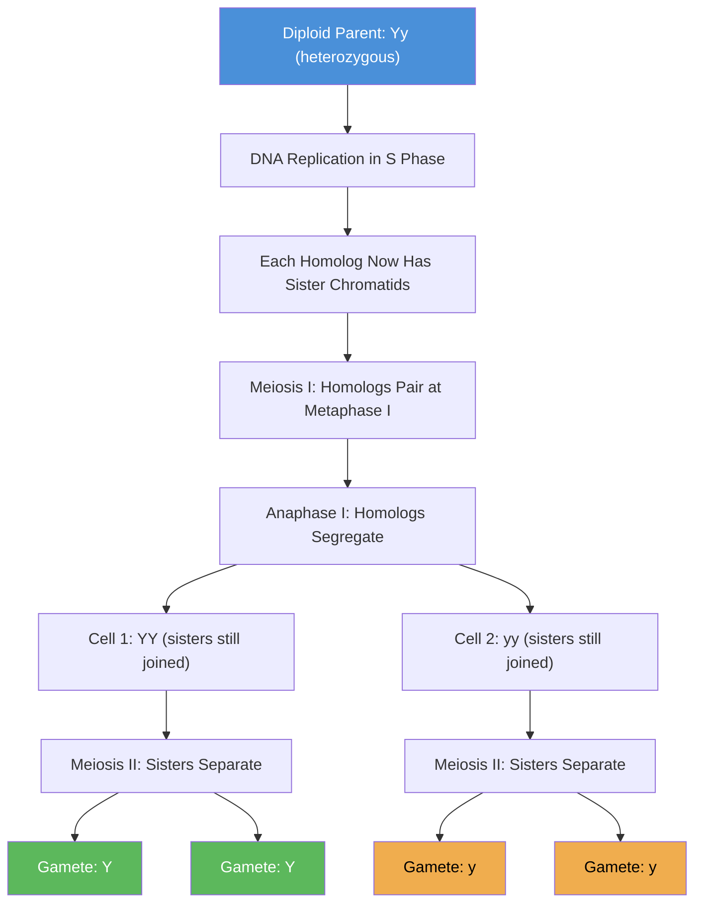

# Mendelian Principles and Probability

\label{sec:unit_V_mendelian_principles}

<!-- chapter-metadata-badge -->
> Level 2/3 · 35 min read · 55 min lecture · Prerequisites: \cref{sec:unit_IV_dna_replication_and_cell_cycle}

## Learning Objectives

1. Describe Mendel \citep{mendel1866}'s experimental system and explain why *Pisum sativum* was ideal for genetic analysis.
2. State Mendel's laws of segregation and [**independent assortment**](#gl:independent-assortment) and explain their mechanistic basis in [**meiosis**](#gl:meiosis).
3. Solve monohybrid, dihybrid, and trihybrid cross problems using Punnett squares and probability.
4. Describe extensions to Mendelian genetics: incomplete dominance, codominance, multiple [**allele**](#gl:allele)s, pleiotropy, epistasis, polygenic inheritance, genomic imprinting, and maternal effect.
5. Explain penetrance, expressivity, and phenocopy with disease examples.
6. Apply the chi-squared test for goodness of fit to evaluate Mendelian ratios.
7. Construct and interpret pedigrees for autosomal [**dominant**](#gl:dominant), autosomal recessive, X-linked recessive, X-linked dominant, and mitochondrial inheritance patterns.
8. Solve multi-step genetics problems involving probability rules (product rule, sum rule, conditional probability).
9. Connect Mendelian segregation to chromosome behavior at meiosis and explain the molecular basis of human autosomal-dominant and autosomal-recessive disorders.
10. Outline how genome-wide association studies (GWAS) extend Mendelian thinking to polygenic traits in human populations.

\begin{figure}[htbp]
\centering
\includegraphics[width=0.85\textwidth]{../figures/punnett_AaxAa.png}
\caption{Punnett square for a monohybrid cross Aa × Aa. Each cell shows the zygote genotype; the 3:1 phenotype ratio follows directly from the 1:2:1 genotype ratio.}
\label{fig:unit_V_punnett_square}
\end{figure}

<!-- alt: Two-by-two Punnett square labelled with Aa times Aa showing four offspring: one AA homozygous dominant, two Aa heterozygous, one aa homozygous recessive. -->

<!-- curriculum-scaffold-start -->
### Study Blueprint

- **Big idea:** Mendelian segregation and probability explain inheritance when alleles assort independently.
- **Core concepts:** segregation, independent assortment, Punnett squares, probability.
- **Framework alignment:** Vision & Change: Information flow, exchange, and storage, Evolution; AP Biology: Information Storage and Transmission, Evolution; NGSS-style topics: Inheritance and Variation of Traits, Natural Selection and Evolution.
- **Model or quantitative lens:** Punnett, binomial, and chi-square calculations.
- **Data skill:** Use cross data to infer genotype probabilities.
- **Practice cadence:** Statistical Tests and Data Analysis, Representing and Describing Data.
- **Common misconception to repair:** Dominant does not mean common, stronger, or better.
- **Primary lab:** \cref{sec:lab_unit_V_mendelian_principles}.
- **Question bank:** \cref{sec:q_unit_V_mendelian_principles}.
- **Transfer task:** Transfer Mendelian probability to model organisms and introductory human genetics.
- **Bridge to computation:** `biology.genetics.genetics.chi_squared_test`.
<!-- curriculum-scaffold-end -->

---

> **Opening Vignette — The Forgotten Friar and the Laws of Inheritance**
> 
> Gregor Mendel spent eight years (1856–1863) growing and cross-pollinating nearly 28,000 pea plants in the garden of St. Thomas's Abbey in Brno, recording data with statistical rigour unprecedented in biology at the time. He presented his findings to the Brno Natural History Society in 1865, and published them in the society's journal in 1866. The audience of 40 scientists was politely unenthusiastic. For 35 years, his paper languished in obscurity — unread, uncited, misunderstood. Then in 1900, three botanists working independently — Hugo de Vries, Carl Correns, and Erich von Tschermak — each rediscovered the same ratios Mendel had documented and, searching the literature, found his paper. Overnight, an unknown friar's meticulous garden statistics became the foundation of modern genetics. Mendel rarely knew he had founded a science.

## Mendel's Experiments: Historical Context

Gregor Johann Mendel (1822-1884), an Augustinian friar and physics-trained scientist, conducted breeding experiments on garden peas (*Pisum sativum*) from 1856 to 1863 in the monastery garden at Brno (now Czech Republic). His 1866 paper, "Versuche uber Pflanzen-Hybriden" (Experiments on Plant Hybrids), was largely ignored until 1900 when it was independently "rediscovered" by de Vries, Correns, and von Tschermak.

**Why peas were ideal:**

| Advantage | Significance |
|-----------|-------------|
| Distinct, discontinuous traits | 7 characters with clear dominant/recessive forms (no blending) |
| True-breeding lines available | Commercially available pure varieties; years of inbreeding |
| Short generation time | ~3 months seed to seed |
| Self-compatible flowers | Could self-fertilize (controlled crosses possible by emasculation) |
| Large number of offspring | Each pod contains ~7 seeds; massive sample sizes |
| Easy to cross-pollinate | Large flowers with accessible reproductive parts |

**Mendel's seven characters:**

| Character | Dominant | Recessive |
|-----------|----------|-----------|
| Seed shape | Round | Wrinkled |
| Seed color | Yellow | Green |
| Flower color | Purple | White |
| Flower position | Axial | Terminal |
| Pod shape | Inflated | Constricted |
| Pod color | Green | Yellow |
| Stem length | Tall | Short |

Mendel's genius was **quantitative**: he counted offspring in each class and applied **binomial probability** reasoning -- the first application of statistics to biology. He analyzed ~28,000 pea plants over 8 years.

---

## Mendel's Laws of Segregation and Independent Assortment

### Law of Segregation (Mendel's First Law)

**Statement**: Each organism possesses two alleles for each [**gene**](#gl:gene). These alleles **segregate** (separate) during [**gamete**](#gl:gamete) formation, such that each gamete receives exactly one allele. Upon fertilization, the diploid state is restored.

**Molecular basis**: Separation of homologous [**chromosomes**](#gl:chromosome) during **[anaphase I of meiosis](#gl:anaphase)**. The two alleles of a gene reside on homologous chromosomes; when homologs are pulled to opposite poles, each gamete receives one allele.

<!-- alt: Flowchart showing molecular basis of the Law of Segregation. A heterozygous (Yy) individual produces equal proportions of Y and y gametes because homologous chromosomes separate at anaphase I of meiosis. -->

*Molecular basis of the Law of Segregation. A [**heterozygous**](#gl:heterozygous) (Yy) individual produces equal proportions of Y and y gametes because homologous chromosomes separate at anaphase I of meiosis.*

### The Molecular Basis of Mendel's Laws: From Bivalents to Binomials

Mendel formulated his laws in 1866 without any knowledge of chromosomes, meiosis, or DNA. He treated alleles as abstract "factors" — discrete particles that combined and segregated according to mathematical rules. The chromosomal interpretation came nearly four decades later, when Walter \citet{sutton1902} and Theodor Boveri independently noticed that chromosomes in meiosis behaved exactly the way Mendel's factors had to behave for his laws to hold:

| Mendel's abstract law | Chromosomal mechanism |
|-----------------------|------------------------|
| Each individual has two factors per trait | Diploid cells have two homologs per chromosome |
| Factors separate equally into gametes | Homologs disjoin at anaphase I; each gamete inherits one |
| Factors at different loci assort independently | Non-homologous bivalents orient independently at metaphase I |
| Factors are particulate, not blended | Chromosomes maintain integrity across generations (apart from crossing over) |

The synthesis of Mendel's laws with the chromosome theory of inheritance — completed by Thomas Hunt Morgan's *Drosophila* work between 1910 and 1915 — is one of the central convergences in biology. Every Punnett square is, at heart, a model of homologous-chromosome behavior in meiosis (\cref{sec:unit_V_chromosomal_inheritance}). The 3:1 ratio is not a numerical coincidence; it is the inevitable algebraic shadow of two homologs segregating independently into haploid gametes that then unite at fertilization. When meiosis fails — non-disjunction, translocation, or imprinting errors — Mendelian ratios fail predictably with it.

### Law of Independent Assortment (Mendel's Second Law)

**Statement**: Alleles at different gene loci are distributed to gametes **independently** of one another -- the inheritance of one gene does not affect the inheritance of another.

**Molecular basis**: Random orientation of non-homologous bivalents at **metaphase I**. Each bivalent can orient with either homolog facing either pole, and this orientation is independent of the other bivalents.

**Important exception**: This law applies only to genes on **different chromosomes** (or very far apart on the same chromosome, >50 cM). Genes on the same chromosome that are close together exhibit **[linkage](#gl:linkage)** and violate independent assortment (see *Chromosomal Inheritance and Linkage*).

**Concept Check 16.1**

> 1. If the law of segregation is based on meiosis I, what specific cellular event during meiosis II is relevant?
> 2. A student claims that Mendel's laws prove genes are on chromosomes. Is this historically accurate? When was this connection established?
> 3. If two genes are 5 cM apart on the same chromosome, do they assort independently? Explain.

---

## Monohybrid Crosses and Single-Gene Segregation

### The Standard Monohybrid Cross

**Worked example -- seed color:**

\begin{equation}
P: \quad YY \text{ (yellow)} \times yy \text{ (green)}
\label{eq:unit_V_mendelian_p_cross}
\end{equation}

\begin{equation}
F_1: \quad Yy \text{ (most yellow -- Y is dominant)}
\label{eq:unit_V_mendelian_f1}
\end{equation}

\begin{equation}
F_1 \times F_1: \quad Yy \times Yy
\label{eq:unit_V_mendelian_f1_self}
\end{equation}

**Punnett square:**

|  | **Y** | **y** |
|---|-------|-------|
| **Y** | YY | Yy |
| **y** | Yy | yy |

**F$_2$ genotype ratio**: $\frac{1}{4}$ YY : $\frac{2}{4}$ Yy : $\frac{1}{4}$ yy = **1:2:1**

**F$_2$ [**phenotype**](#gl:phenotype) ratio**: $\frac{3}{4}$ yellow : $\frac{1}{4}$ green = **3:1**, the canonical heterozygote-cross outcome visualised in \cref{fig:unit_V_punnett_square}, where the 3:1 phenotype ratio falls out directly from the underlying 1:2:1 genotype ratio.

### The Testcross as a Genotype-Revealing Cross

To determine whether an individual showing the dominant phenotype is homozygous (YY) or heterozygous (Yy), cross it with a **homozygous recessive** (yy):

- If **YY x yy**: the offspring are Yy (yellow) -- no recessive offspring
- If **Yy x yy**: $\frac{1}{2}$ Yy (yellow) : $\frac{1}{2}$ yy (green) -- 1:1 ratio reveals heterozygosity

### Probability Rules for Independent Genetic Events

**Product rule (AND)**: The probability of two independent events both occurring = product of individual probabilities.

\begin{equation}
P(A \text{ and } B) = P(A) \times P(B)
\label{eq:unit_V_mendelian_product_rule}
\end{equation}

**Sum rule (OR)**: The probability of either of two mutually exclusive events occurring = sum of individual probabilities.

\begin{equation}
P(A \text{ or } B) = P(A) + P(B)
\label{eq:unit_V_mendelian_sum_rule}
\end{equation}

## Worked Example: Probability Rules in a Monohybrid Cross

(a) The first child is yy?

\begin{equation}
P(yy) = \frac{1}{4}
\label{eq:unit_V_mendelian_genetics_item_1}
\end{equation}

(b) The first two children are both yy?

\begin{equation}
P = \frac{1}{4} \times \frac{1}{4} = \frac{1}{16} \quad \text{(product rule; independent events)}
\label{eq:unit_V_mendelian_genetics_item_2}
\end{equation}

(c) Among three children, exactly one is yy?

\begin{equation}
P = \binom{3}{1}\left(\frac{1}{4}\right)^1\left(\frac{3}{4}\right)^2 = 3 \times \frac{1}{4} \times \frac{9}{16} = \frac{27}{64} \approx 0.422
\label{eq:unit_V_mendelian_genetics_item_3}
\end{equation}

---

## Dihybrid and Trihybrid Crosses

### The Dihybrid Cross

Two independently assorting genes: seed color (Y/y) and seed shape (R = round, r = wrinkled):

\begin{equation}
P: \quad YYRR \times yyrr
\label{eq:unit_V_mendelian_genetics_item_4}
\end{equation}

\begin{equation}
F_1: \quad YyRr \text{ (yellow, round)}
\label{eq:unit_V_mendelian_genetics_item_5}
\end{equation}

\begin{equation}
F_1 \times F_1: \quad YyRr \times YyRr
\label{eq:unit_V_mendelian_genetics_item_6}
\end{equation}

Each parent produces 4 gamete types in equal frequency: YR, Yr, yR, yr.

**F$_2$ phenotype ratio**: 9 Y\_R\_ : 3 Y\_rr : 3 yyR\_ : 1 yyrr = **9:3:3:1**

This ratio is the product of two independent 3:1 ratios:

\begin{equation}
\left(\frac{3}{4}Y\_ + \frac{1}{4}yy\right) \times \left(\frac{3}{4}R\_ + \frac{1}{4}rr\right) = \frac{9}{16} + \frac{3}{16} + \frac{3}{16} + \frac{1}{16}
\label{eq:unit_V_mendelian_9331}
\end{equation}

### The Forked-Line (Branch Diagram) Method

For a trihybrid cross (AaBbCc x AaBbCc), the Punnett square would require 64 cells. Instead, use the forked-line method:

\begin{equation}
\text{A locus:} \quad \tfrac{3}{4}A\_ \text{ and } \tfrac{1}{4}aa
\label{eq:unit_V_mendelian_genetics_item_7}
\end{equation}
\begin{equation}
\text{B locus:} \quad \tfrac{3}{4}B\_ \text{ and } \tfrac{1}{4}bb
\label{eq:unit_V_mendelian_genetics_item_8}
\end{equation}
\begin{equation}
\text{C locus:} \quad \tfrac{3}{4}C\_ \text{ and } \tfrac{1}{4}cc
\label{eq:unit_V_mendelian_genetics_item_9}
\end{equation}

Probability of A\_B\_C\_ = $\frac{3}{4} \times \frac{3}{4} \times \frac{3}{4} = \frac{27}{64}$

Total number of phenotypic classes = $2^3 = 8$

Number of genotypic classes = $3^3 = 27$

## Worked Example: Trihybrid Cross Probabilities

In a trihybrid cross AaBbCc x AaBbCc, what fraction of offspring will be:

(a) AaBbCc (triple heterozygous)?

\begin{equation}
P = \frac{2}{4} \times \frac{2}{4} \times \frac{2}{4} = \frac{8}{64} = \frac{1}{8}
\label{eq:unit_V_mendelian_genetics_item_10}
\end{equation}

(b) Homozygous for the three loci (AA BB CC or aa bb cc etc.)?

Each locus has probability $\frac{1}{4}$ + $\frac{1}{4}$ = $\frac{1}{2}$ of being homozygous (either AA or aa).

\begin{equation}
P(\text{homozygous at most 3}) = \frac{1}{2} \times \frac{1}{2} \times \frac{1}{2} = \frac{1}{8}
\label{eq:unit_V_mendelian_genetics_item_11}
\end{equation}

> **Worked Example — Trihybrid Cross Probability:** A dihybrid cross AaBbCc × AaBbCc produces offspring. Calculate the probability of the genotype AaBbCc (triple heterozygote). Since each locus is independent: P(Aa) = 2/4 = 0.5; P(Bb) = 0.5; P(Cc) = 0.5. P(AaBbCc) = 0.5³ = 0.125 = 12.5%. Extended: in a trihybrid cross, the 27 distinct phenotypic classes (when alleles show simple dominance) occur with probabilities following (3/4 + 1/4)³ expansion: dominant at each of three loci occurs (3/4)³ = 27/64 ≈ 42.2%; recessive at each of three occurs (1/4)³ = 1/64 ≈ 1.6%. For a class with specific genotype aaB_C_: P(aa) × P(B_) × P(C_) = (1/4)(3/4)(3/4) = 9/64. Chi-squared test with 8 df would require at least 8 expected class sizes of ≥5, meaning a minimum sample size of 8 × 5/(1/64) = 2,560 offspring for the rarest class to have expected count ≥5.

> **Concept Check (Evaluation):** Genome-wide association studies (GWAS) identify thousands of SNPs associated with complex traits like height, BMI, and schizophrenia — but each SNP has tiny effect size (odds ratio 1.01-1.10) and explains <0.1% of trait variance. Yet the identified SNPs together explain <50% of heritability for most traits — the "missing heritability" problem. (a) Evaluate four possible explanations for missing heritability: (i) rare variants with large effects (not detected by GWAS), (ii) gene-gene interactions (epistasis), (iii) overestimated heritability from twin studies, (iv) epigenetic variants not captured by SNP arrays. For each, predict what experimental approach would resolve it. (b) Polygenic risk scores (PRS) aggregate genome-wide SNP effects. A PRS for coronary artery disease has a population AUC of 0.64. Explain what this means clinically and why population-level prediction does not translate to individual risk certainty.

---
## Current Evidence and Frontier Biology: Mendelian Principles and Probability

For **Mendelian Principles and Probability**, frontier biology belongs inside the evidence logic of
the chapter. Classical genetics remains essential, but modern interpretation adds penetrance, polygenicity, structural variation, ancestry-aware inference, and uncertainty in risk prediction. The core reading question is this: Mendelian patterns are starting models that must be qualified by penetrance, linkage, environment, and sampling.

- **What to verify:** identify the observation, model, assay, or dataset that
  would make the claim stronger or weaker.
- **What to qualify:** state the scale, organism, cell type, environmental
  condition, or population where the claim is expected to hold.
- **What to compare:** test at least one alternative explanation, baseline, or
  null model before treating the pattern as causal.
- **What to cite:** distinguish primary evidence, review synthesis, public
  dataset, and institutional guidance; for recent or numeric claims, prefer
  the source closest to the measurement and state what has changed since it was
  published.

A good genetics answer separates the Mendelian transmission model from the evidence needed to use it in a population, family, or clinical setting.

**Source practice:** For genetics claims, separate model assumptions from sampling, ancestry representation, penetrance, linkage, and environment.

## Summary

- Describe Mendel 's experimental system and explain why *Pisum sativum* was ideal for genetic analysis.
- State Mendel's laws of segregation and **independent assortment** and explain their mechanistic basis in **meiosis**.
- Solve monohybrid, dihybrid, and trihybrid cross problems using Punnett squares and probability.
- Describe extensions to Mendelian genetics: incomplete dominance, codominance, multiple **allele**s, pleiotropy, epistasis, polygenic inheritance, genomic imprinting, and maternal effect.
- Explain penetrance, expressivity, and phenocopy with disease examples.
- Apply the chi-squared test for goodness of fit to evaluate Mendelian ratios.
- Construct and interpret pedigrees for autosomal **dominant**, autosomal recessive, X-linked recessive, X-linked dominant, and mitochondrial inheritance patterns.
- Solve multi-step genetics problems involving probability rules (product rule, sum rule, conditional probability).

## Further Reading and Source Notes: Mendelian Principles and Probability

- Mendel (1866). Versuche {\"u}ber Pflanzenhybriden. *Verhandlungen des naturforschenden Vereines in Br{\"u}nn*, 4.
- Sutton (1902). On the morphology of the chromosome group in {Brachystola magna}. *Biological Bulletin*, 4.

---

## Companion Source Module: Mendelian Principles and Probability

**Mendelian Principles and Probability** should leave a reproducible trail from a biological claim to
the code, figure, diagram, or paper-based activity that can test it. Use the
surfaces below to inspect the chapter's assumptions, rerun the relevant model,
or compare the manuscript explanation with companion labs and figures.

| Surface | Use it for |
| --- | --- |
| `src/biology/genetics/genetics.py` (`punnett_square`, `hardy_weinberg`, `chi_squared_test`) | Reproduce inheritance ratios, equilibrium expectations, and goodness-of-fit tests. |
| `src/visualization/plots.py` (`plot_punnett_square`) | Check genotype and phenotype tables visually. |
| `src/mermaid/biology_diagrams.py` (`mendelian_cross_diagram`) | Link segregation logic to diagrammed crosses. |

**Reproducibility check:** state genotype notation, dominance model, sample size, and statistical expectation before interpreting a ratio. **Cross-reference:** compare with \cref{sec:unit_V_chromosomal_inheritance} and \cref{sec:unit_V_population_genetics}.
