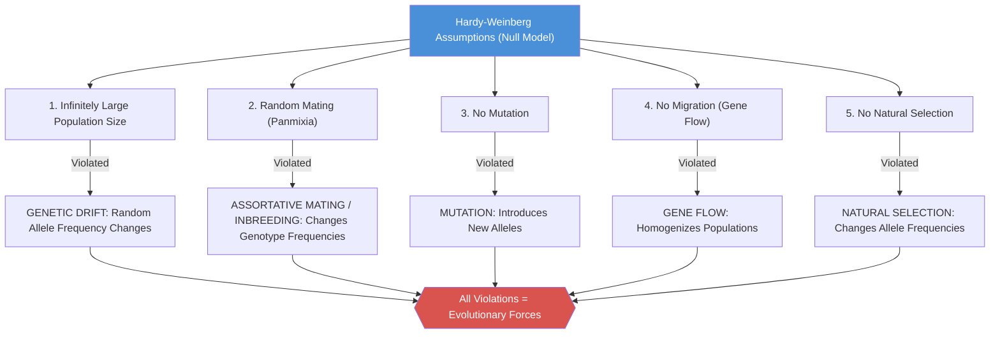
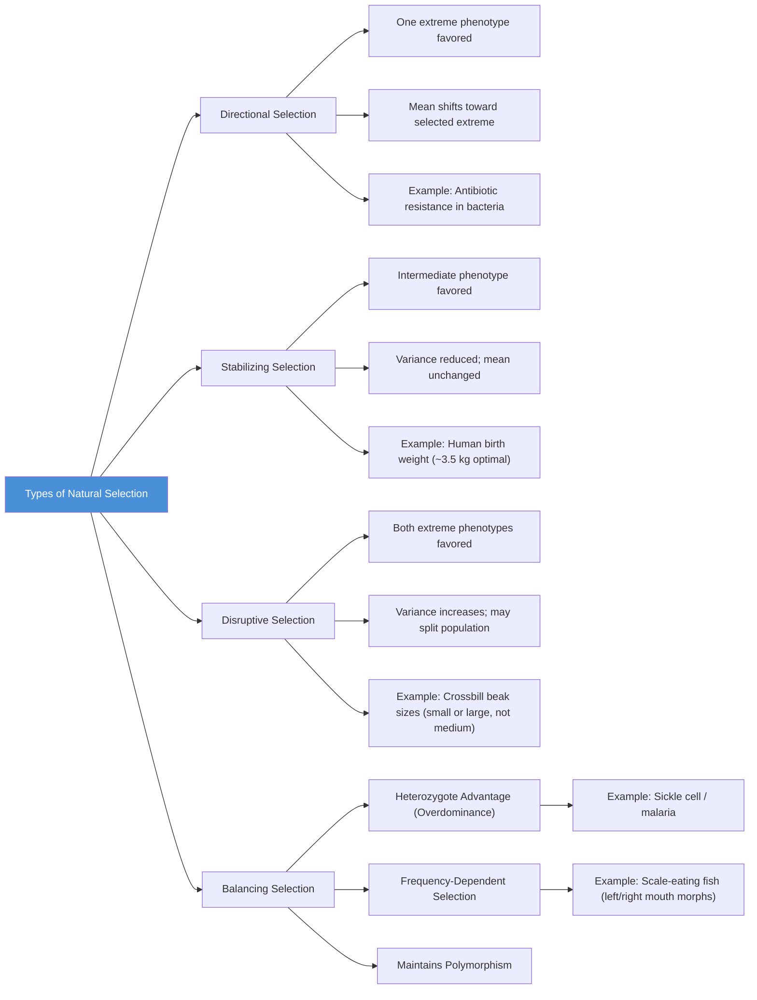
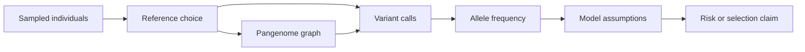

# Population Genetics and Hardy-Weinberg Equilibrium

\label{sec:unit_V_population_genetics}


<!-- chapter-metadata-badge -->
> **Ch 18** · Level 3/3 · 75 min read · 100 min lecture · Prerequisites: \cref{sec:unit_V_mendelian_genetics}, \cref{sec:unit_V_chromosomal_inheritance}

## Learning Objectives

1. Define [**allele**](#gl:allele) frequency, genotype frequency, and [**gene**](#gl:gene) pool.
2. State the Hardy-Weinberg \citep{weinberg1908} principle, derive the equilibrium equation, and list most five assumptions.
3. Apply [**Hardy-Weinberg equilibrium**](#gl:hardy-weinberg-equilibrium) (Equation~\eqref{eq:population_genetics_1}) to calculate carrier frequencies and estimate disease prevalence.
4. Test a population for HWE using the chi-squared test.
5. Describe [**natural selection**](#gl:natural-selection): fitness, selection coefficient, dominance coefficient, and types of selection.
6. Calculate allele frequency change under selection and predict equilibrium conditions for balancing selection.
7. Explain [**genetic drift**](#gl:genetic-drift), effective population size, bottleneck and [**founder effect**](#gl:founder-effect)s.
8. Describe gene flow and its effects on population differentiation (Fst).
9. Apply [**mutation**](#gl:mutation)-selection balance to estimate equilibrium frequencies.
10. Explain the [**neutral theory**](#gl:neutral-theory) of molecular evolution, Ka/Ks ratios, and coalescent theory.
11. Use [**molecular clock**](#gl:molecular-clock) methods to estimate divergence times.

<!-- curriculum-scaffold-start -->
### Study Blueprint

- **Big idea:** Allele frequencies change when assumptions about random mating, population size, and fitness are violated.
- **Core concepts:** Hardy-Weinberg, selection, mutation, genetic drift.
- **Framework alignment:** Vision & Change: Information flow, exchange, and storage, Evolution; AP Biology: Information Storage and Transmission, Evolution; NGSS-style topics: Inheritance and Variation of Traits, Natural Selection and Evolution.
- **Model or quantitative lens:** Hardy-Weinberg and allele-frequency recurrence calculations.
- **Data skill:** Estimate genotype or allele frequencies from population data.
- **Practice cadence:** Statistical Tests and Data Analysis, Representing and Describing Data.
- **Common misconception to repair:** Hardy-Weinberg is a null model, not a claim that populations do not evolve.
- **Primary lab:** \cref{sec:lab_unit_V_population_genetics}.
- **Question bank:** \cref{sec:q_unit_V_population_genetics}.
- **Transfer task:** Apply population-genetic reasoning to screening, conservation, and pathogen evolution.
- **Bridge to computation:** `biology.genetics.genetics.hardy_weinberg`.
<!-- curriculum-scaffold-end -->

---

> **Opening Vignette — Algebra, Moths, and the Mathematics of Populations**
> 
> In 1908, a cricket enthusiast named G.H. Hardy — then England's most distinguished pure mathematician — was irritated by a biologist's claim that [**dominant**](#gl:dominant) alleles automatically increase in frequency over time. Hardy spent an afternoon at the cricket match and, in a brief letter to *Science*, produced the algebraic proof that in the absence of disturbing forces, allele frequencies remain constant generation after generation. A German physician, Wilhelm Weinberg, had independently derived the same principle. The Hardy-Weinberg equilibrium became the null hypothesis of [**population genetics**](#gl:population-genetics) — and its deviations became the heartbeat of evolutionary biology. Nowhere is this better illustrated than the peppered moth (*Biston betularia*) during England's Industrial Revolution: pollution blackened tree bark, shifting the population from mostly pale moths to mostly dark (melanic) ones within decades — textbook natural selection altering allele frequencies in real time.

### Chapter Roadmap

The chapter is long because it bridges three levels of time and scale — read it as a narrowing lens:

- **The Hardy-Weinberg null model.** Alleles, genotype frequencies, the equilibrium theorem and its assumptions; χ² tests of fit.
- **Four forces that perturb it.** Selection, drift, gene flow, and mutation. Each is a named violation of an HWE assumption.
- **Consequences at the [**genome**](#gl:genome) scale.** Neutral theory and molecular evolution, F-statistics and population structure, coalescent theory and molecular clocks.

If you are reading for the core Mendelian-genetics course, prioritise the Hardy-Weinberg model and the four evolutionary forces. The genome-scale extensions connect population genetics to molecular evolution (\nameref{sec:unit_VI_unit_intro}) and are helpful but optional.

\begin{figure}[htbp]
\centering
\includegraphics[width=0.85\textwidth]{../figures/genetic_drift_trajectories.png}
\caption{Wright--Fisher genetic-drift trajectories for the same starting allele frequency under three effective population sizes. Smaller populations show larger stochastic swings and faster approach to fixation or loss.}
\label{fig:unit_V_genetic_drift_trajectories}
\end{figure}
<!-- alt: Multiple allele-frequency trajectories over generations for effective population sizes 25, 100, and 1000. The smallest population size has the widest random excursions, while the largest remains closest to the initial frequency. -->

## The Gene Pool

A **population** is a group of individuals of the same species living in the same area at the same time and that interbreed. The **gene pool** is the population's allele set across loci.

### Allele and Genotype Frequencies

For a biallelic locus with alleles A (frequency $p$) and a (frequency $q$):

\begin{equation}
p + q = 1
\label{eq:population_genetics_1}
\end{equation}

**Calculating allele frequencies from genotype counts:**

Given $N$ total diploid individuals with $N_{AA}$ homozygous dominant, $N_{Aa}$ [**heterozygous**](#gl:heterozygous), and $N_{aa}$ homozygous recessive:

\begin{equation}
p = \frac{2N_{AA} + N_{Aa}}{2N}
\label{eq:population_genetics_2}
\end{equation}

\begin{equation}
q = \frac{2N_{aa} + N_{Aa}}{2N}
\label{eq:population_genetics_3}
\end{equation}

**Genotype frequencies:**

\begin{equation}
F_{AA} + F_{Aa} + F_{aa} = 1
\label{eq:population_genetics_4}
\end{equation}

Note that allele frequencies can be calculated from genotype frequencies but not vice versa (without additional assumptions), because different combinations of genotype frequencies can yield the same allele frequencies.

## Worked Example: 18.1: In a population of 1,000 individuals: 360 AA, 480 Aa, 160 aa.

\begin{equation}
p = \frac{2(360) + 480}{2(1000)} = \frac{1200}{2000} = 0.60
\label{eq:population_genetics_5}
\end{equation}

\begin{equation}
q = \frac{2(160) + 480}{2(1000)} = \frac{800}{2000} = 0.40
\label{eq:population_genetics_6}
\end{equation}

Check: $p + q = 0.60 + 0.40 = 1.00$ (correct).

**Concept Check 18.5**

> 1. A population of 1{,}000 has 250 AA, 500 Aa, and 250 aa: show that although $p = q = 0.5$, the genotype counts are not those Hardy-Weinberg predicts, and decide from the direction of the heterozygote discrepancy whether inbreeding or heterozygote advantage is the more likely cause.

---

## Hardy-Weinberg Equilibrium

> **Mathematical Background:** Hardy-Weinberg calculations use basic probability and algebra. For a review of probability rules and their biological applications, see \cref{sec:appendix_math_review}.

The **Hardy-Weinberg principle** (G.H. Hardy and Wilhelm Weinberg, 1908) states: in a large, randomly mating population with no evolutionary forces acting, allele frequencies and genotype frequencies remain constant from generation to generation.

### Derivation

Under random mating, [**gamete**](#gl:gamete)s combine randomly. The probability of drawing an A allele from the gene pool is $p$, and of drawing an a allele is $q$:

\begin{equation}
P(AA) = p \times p = p^2
\label{eq:population_genetics_7}
\end{equation}
\begin{equation}
P(Aa) = p \times q + q \times p = 2pq
\label{eq:population_genetics_8}
\end{equation}
\begin{equation}
P(aa) = q \times q = q^2
\label{eq:population_genetics_9}
\end{equation}

Therefore, at equilibrium:

\begin{equation}
\boxed{p^2 + 2pq + q^2 = 1}
\label{eq:population_genetics_10}
\end{equation}

This can also be written as $(p + q)^2 = 1$, which is simply the binomial expansion.

**Key insight**: HW equilibrium is reached in a **single generation** of random mating (for autosomal loci), and allele frequencies do not change across generations.


<!-- alt: Flowchart showing five assumptions of Hardy-Weinberg equilibrium and the evolutionary forces that result from their violation. HWE serves as a null model - deviations indicate evolutionary forces are acting. -->

*The five assumptions of Hardy-Weinberg equilibrium and the evolutionary forces that result from their violation. HWE serves as a null model -- deviations indicate evolutionary forces are acting.*

### Testing for Hardy-Weinberg Equilibrium

**Chi-squared test for HWE:** A real population is tested against HWE as the
null model. Estimate the allele frequencies $p$ and $q$ from the observed
genotype counts, compute the genotype counts *expected* under HWE ($Np^2$, $2Npq$,
$Nq^2$ for a sample of $N$ individuals), and form
$\chi^2 = \sum (O-E)^2 / E$ over the genotype classes. The degrees of freedom
equal the number of genotype classes minus the number of alleles — for a
biallelic locus, $3 - 2 = 1$ (one degree is spent estimating $p$ from the same
data). A statistic exceeding the critical value $\chi^2_{0.05,\,1} = 3.84$
rejects HWE and indicates that at least one assumption — random mating, no
selection, no drift, no migration, no mutation — is violated.

#### Worked Example: MN Blood Group Equilibrium

MN blood group data for codominant alleles M and N in a population of 1,000:

| Genotype | Observed | Allele Frequency |
|----------|----------|-----------------|
| MM | 298 | |
| MN | 489 | |
| NN | 213 | |

Step 1: Calculate allele frequencies.

\begin{equation}
p(M) = \frac{2(298) + 489}{2000} = \frac{1085}{2000} = 0.5425
\label{eq:population_genetics_11}
\end{equation}

\begin{equation}
q(N) = \frac{2(213) + 489}{2000} = \frac{915}{2000} = 0.4575
\label{eq:population_genetics_12}
\end{equation}

Step 2: Calculate expected genotype frequencies under HWE.

\begin{equation}
E(MM) = p^2 \times 1000 = (0.5425)^2 \times 1000 = 294.3
\label{eq:population_genetics_13}
\end{equation}

\begin{equation}
E(MN) = 2pq \times 1000 = 2(0.5425)(0.4575) \times 1000 = 496.4
\label{eq:population_genetics_14}
\end{equation}

\begin{equation}
E(NN) = q^2 \times 1000 = (0.4575)^2 \times 1000 = 209.3
\label{eq:population_genetics_15}
\end{equation}

Step 3: Chi-squared test.

\begin{equation}
\chi^2 = \frac{(298-294.3)^2}{294.3} + \frac{(489-496.4)^2}{496.4} + \frac{(213-209.3)^2}{209.3}
\label{eq:population_genetics_16}
\end{equation}

\begin{equation}
= 0.047 + 0.110 + 0.065 = 0.222
\label{eq:population_genetics_17}
\end{equation}

Degrees of freedom = 3 genotypes - 1 constraint (total N) - 1 estimated parameter (p) = **1 df**.

$\chi^2_{crit}(1 \text{ df}, \alpha = 0.05) = 3.841$

Since $0.222 < 3.841$, we **fail to reject** HWE. This population is in Hardy-Weinberg equilibrium for the MN locus.

### HWE as a Clinical Tool

**Estimating carrier frequencies:**

Hardy-Weinberg estimates are useful clinical first approximations, not diagnoses. Carrier-frequency calculations assume random mating, correct disease prevalence, complete ascertainment, and a well-defined population; those assumptions can fail when founder effects, consanguinity, population stratification, penetrance, or reference bias shape the sample. Modern screening therefore combines the HWE null model with ancestry-aware variant panels, family history, and increasingly graph-aware or long-read evidence for loci where structural variants affect interpretation \citep{humanpangenome2023}.

## Worked Example: Cystic Fibrosis Carrier Frequency

Cystic fibrosis (CF) prevalence in Northern Europeans has disease (aa) frequency $\frac{1}{2,500}$.

\begin{equation}
q^2 = \frac{1}{2500} \implies q = \frac{1}{50} = 0.02
\label{eq:population_genetics_18}
\end{equation}

\begin{equation}
p = 1 - q = 0.98
\label{eq:population_genetics_19}
\end{equation}

\begin{equation}
\text{Carrier frequency} = 2pq = 2(0.98)(0.02) = 0.0392 \approx \frac{1}{25}
\label{eq:population_genetics_20}
\end{equation}

Approximately 1 in 25 Northern Europeans is a CF carrier -- critical information for genetic counseling.

**ABO blood group HWE analysis** (three alleles: $I^A$, $I^B$, $i$):

For a triallelic system: $p(I^A) + q(I^B) + r(i) = 1$

Genotype frequencies under HWE:

\begin{equation}
\text{Type A} = p^2 + 2pr, \quad \text{Type B} = q^2 + 2qr, \quad \text{Type AB} = 2pq, \quad \text{Type O} = r^2
\label{eq:population_genetics_21}
\end{equation}

> **Clinical Connection: Newborn Screening and Hardy-Weinberg**
> Hardy-Weinberg predictions guide newborn screening programs. For PKU (q approximately 0.01, disease frequency 1/10,000), carrier frequency approximately 2%. For sickle cell disease in African Americans (q approximately 0.05), carrier frequency approximately 9.5%. For Tay-Sachs in Ashkenazi Jewish populations (q approximately 0.018), carrier frequency approximately 1/28. These calculations determine cost-effectiveness of carrier screening programs.

**Concept Check 18.1**

> 1. Can genotype frequencies be in HWE if allele frequencies are changing? Explain.
> 2. Inbreeding does not change allele frequencies but does change genotype frequencies. Explain how.
> 3. Why does it take a single generation of random mating to restore HWE for an autosomal locus?
> 4. For a disease with q = 0.001, what is the expected carrier frequency? What is the ratio of carriers to affected individuals?

---

## Natural Selection

### Fitness and Selection

**Absolute [**fitness (w)**](#gl:fitness)**: Expected number of offspring produced by an individual with a given genotype.

**Relative fitness (w)**: Fitness of a genotype relative to the most fit genotype (which is set to 1).

**[Selection coefficient (s)](#gl:selection-coefficient)**: The reduction in fitness: $s = 1 - w$.

**Dominance coefficient (h)**: Describes the fitness of the heterozygote relative to the two homozygotes:

| Genotype | Fitness |
|----------|---------|
| AA | $w_{AA} = 1$ |
| Aa | $w_{Aa} = 1 - hs$ |
| aa | $w_{aa} = 1 - s$ |

- $h = 0$: A completely dominant (Aa has same fitness as AA)
- $h = 0.5$: Additive (codominant fitness effect)
- $h = 1$: A completely recessive (Aa has same fitness as aa)
- $h < 0$: Overdominance (heterozygote advantage)

### Change in Allele Frequency Under Selection

For selection against a recessive homozygote (h = 0):

\begin{equation}
\Delta q = \frac{-spq^2}{\bar{w}}
\label{eq:population_genetics_22}
\end{equation}

where $\bar{w} = 1 - sq^2$ is the mean fitness of the population.

**Important result**: Selection against a recessive allele becomes very slow at low frequencies because the allele is "hidden" in heterozygotes. The time to reduce $q$ from 0.01 to 0.001 is much longer than from 0.5 to 0.01.

For selection against a dominant allele: much faster because every carrier is exposed to selection.

## Worked Example: Recessive Deleterious Allele

In a population with $q = 0.3$ (frequency of a recessive deleterious allele) and $s = 0.2$ (20% fitness reduction for aa homozygotes):

\begin{equation}
\bar{w} = 1 - s \cdot q^2 = 1 - 0.2(0.09) = 1 - 0.018 = 0.982
\label{eq:population_genetics_23}
\end{equation}

\begin{equation}
\Delta q = \frac{-0.2 \times 0.7 \times 0.09}{0.982} = \frac{-0.0126}{0.982} = -0.0128
\label{eq:population_genetics_24}
\end{equation}

After one generation: $q' = 0.3 - 0.0128 = 0.287$

### Types of Selection


<!-- alt: Flowchart showing types of natural selection and their effects on allele frequency distributions. Directional selection shifts the mean; stabilizing selection reduces variance; disruptive selection increases variance; balancing selection maintains polymorphism. -->

*Types of natural selection and their effects on allele frequency distributions. Directional selection shifts the mean; stabilizing selection reduces variance; disruptive selection increases variance; balancing selection maintains polymorphism.*

### Heterozygote Advantage (Balancing Selection)

When the heterozygote has higher fitness than either homozygote ($w_{Aa} > w_{AA}$ and $w_{Aa} > w_{aa}$), both alleles are maintained at a **stable equilibrium**:

\begin{equation}
\hat{q} = \frac{s_1}{s_1 + s_2}
\label{eq:population_genetics_25}
\end{equation}

where $s_1$ = selection against AA and $s_2$ = selection against aa.

**The sickle cell-malaria paradigm:**

In malaria-endemic regions of sub-Saharan Africa:
- **HbA/HbA** (normal): susceptible to *Plasmodium falciparum* malaria; $w_{AA} = 1 - s_1$, where $s_1 \approx 0.1-0.15$
- **HbA/HbS** (sickle trait): ~10-15x reduced malaria mortality; highest fitness; $w_{Aa} = 1$
- **HbS/HbS** (sickle cell disease): severe disease; $w_{aa} = 1 - s_2$, where $s_2 \approx 0.8-1.0$

Equilibrium frequency of HbS allele:

\begin{equation}
\hat{q} = \frac{s_1}{s_1 + s_2} = \frac{0.12}{0.12 + 0.90} = 0.118
\label{eq:population_genetics_26}
\end{equation}

This predicts HbS frequency of ~12%, remarkably close to the observed ~10-20% in malaria-endemic West Africa.

**Other examples of heterozygote advantage:**
- **HbC** (beta-globin E6K): heterozygotes also resistant to malaria; found in West Africa
- **G6PD deficiency**: heterozygous females have mosaic RBCs; malaria resistance
- **CF heterozygotes**: possibly resistant to cholera or typhoid (debated); explains high carrier frequency (~4% in Europeans)
- **MHC/HLA diversity**: heterozygotes present more pathogen antigens; frequency-dependent selection also contributes

**Concept Check 18.2**

> 1. Why does selection against a recessive allele become slower as the allele frequency decreases?
> 2. If heterozygote advantage maintains the sickle cell allele at ~12% in malaria-endemic regions, predict what happens to HbS frequency in a population that migrates to a malaria-free region.
> 3. Calculate the equilibrium frequency of a deleterious recessive allele if $s_1 = 0.05$ and $s_2 = 0.50$.

---

## Genetic Drift

In finite populations, allele frequencies change from generation to generation by **random sampling error** -- this is **genetic drift**.

### Wright-Fisher Model

The Wright-Fisher model is the simplest mathematical framework for drift:
- Non-overlapping generations
- Constant population size $N$
- Random mating
- No selection, mutation, or migration

Each generation, $2N$ allele copies are drawn randomly (with replacement) from the parental gene pool.

**Variance in allele frequency change per generation:**

\begin{equation}
\sigma^2_{\Delta p} = \frac{pq}{2N_e}
\label{eq:population_genetics_27}
\end{equation}

where $N_e$ = **effective population size** (the size of an ideal Wright-Fisher population that would experience the same rate of drift).

**Key results of drift:**
- Over time, alleles are either **fixed** ($p = 1$) or **lost** ($p = 0$)
- The probability of fixation for a new neutral allele = its initial frequency = $\frac{1}{2N}$
- Time to fixation of a new neutral mutation = $4N_e$ generations
- Heterozygosity decreases at rate $\frac{1}{2N_e}$ per generation

```mermaid
stateDiagram-v2
    [*] --> InitialFrequency: New Neutral Mutation (p = 1/2N)

    state "Large Population (N = 10,000)" as Large {
        [*] --> SlowDrift: Allele Frequency Fluctuates Slowly
        SlowDrift --> SlowDrift: Small Random Changes Each Generation
        SlowDrift --> EventualFixation: Rarely Fixes (p = 1)
        SlowDrift --> EventualLoss: Usually Lost (p = 0)
        note right of SlowDrift: Time to fixation ~4Ne generations\nMost new mutations lost
    }

    state "Small Population (N = 50)" as Small {
        [*] --> RapidDrift: Allele Frequency Fluctuates Widely
        RapidDrift --> QuickFixation: Can Fix Rapidly
        RapidDrift --> QuickLoss: Can Be Lost Rapidly
        note right of RapidDrift: Rapid loss of heterozygosity\nRandom alleles fix regardless of fitness
    }

    state "Bottleneck Event" as Bottleneck {
        [*] --> Crash: Population Size Drops Dramatically
        Crash --> Recovery: Survivors Carry Subset of Alleles
        Recovery --> ReducedDiversity: Genetic Diversity Permanently Reduced
        note right of Crash: Example: Cheetah bottleneck ~10,000 ya\nNorthern elephant seal: 20 individuals
    }

    InitialFrequency --> Large
    InitialFrequency --> Small
    Large --> Bottleneck: Environmental Catastrophe
```
<!-- alt: State diagram showing genetic drift in populations of different sizes. Small populations experience rapid allele frequency changes and loss of diversity. Bottleneck events dramatically reduce effective population size, causing lasting genetic effects. -->

*Genetic drift in populations of different sizes. Small populations experience rapid allele frequency changes and loss of diversity. Bottleneck events dramatically reduce effective population size, causing lasting genetic effects.*

### Effective Population Size ($N_e$)

$N_e$ is usually **much smaller** than census size $N$ because:

| Factor | Effect on $N_e$ | Formula |
|--------|-----------------|---------|
| Unequal sex ratio | Reduces $N_e$ | $N_e = \frac{4N_mN_f}{N_m + N_f}$ |
| Fluctuating population size | Reduces $N_e$ | $N_e = $ harmonic mean of $N$ over generations |
| Variance in reproductive success | Reduces $N_e$ | High variance (few individuals produce most offspring) reduces $N_e$ |

The three workhorse formulas for $N_e$ are presented below — each corresponds to a distinct biological scenario, and conservation geneticists routinely combine them to estimate $N_e$ from real demographic data \citep{frankham1995, frankham2014}.

#### Sex-ratio $N_e$ formula

When the breeding population has unequal numbers of males ($N_m$) and females ($N_f$), the effective population size is governed by the rarer sex because each offspring receives one allele from each:

\begin{equation}
N_e = \frac{4 N_m N_f}{N_m + N_f}
\label{eq:unit_V_ne_sex}
\end{equation}

**Worked example — sex-biased breeding:** Consider a herd of 100 elk consisting of 10 breeding males and 90 breeding females (a strongly female-biased operational sex ratio common in harem-forming ungulates):

$$N_e = \frac{4 \times 10 \times 90}{10 + 90} = \frac{3{,}600}{100} = 36 \label{eq:unit_V_population_genetics_item_1}$$

Despite a census size of 100, the effective population size is primarily **36** — barely a third of the count. The intuition: every offspring's paternal allele must come from one of just 10 males, so 90% of females are functionally redundant for tracking allelic diversity through paternal lineages. This asymmetry is why captive-breeding programs aggressively manage sex ratios and why studbook software optimizes founder representation rather than census numbers. If the same population had 50 males and 50 females, $N_e$ would equal 100 — the full census size.

#### Bottleneck $N_e$ formula

For a population that experiences a single-generation bottleneck of size $N_b$ embedded within $t$ generations of size $N_0$, the effective population size over the entire interval is the **harmonic mean** of generation sizes:

\begin{equation}
\frac{1}{N_e} = \frac{1}{t} \sum_{i=1}^{t} \frac{1}{N_i}
\label{eq:unit_V_ne_bottle}
\end{equation}

The reciprocal-mean form is the same harmonic structure given equivalently as:

\begin{equation}
N_e = \frac{t}{\sum_{i=1}^{t} \frac{1}{N_i}}
\label{eq:unit_V_ne_harmonic}
\end{equation}

Because the harmonic mean is dominated by the smallest term, **a single bottleneck generation can drag $N_e$ far below the long-term arithmetic mean of population size**. As an example: 99 generations of $N_0 = 10{,}000$ plus one generation of $N_b = 10$ yields:

$$N_e = \frac{100}{99/10{,}000 + 1/10} = \frac{100}{0.0099 + 0.1} = \frac{100}{0.1099} \approx 910 \label{eq:unit_V_population_genetics_item_2}$$

— not the arithmetic mean of ~9,901. **One bad generation undoes a century of large population size**, and this asymmetry is precisely why bottleneck events leave such durable genetic signatures.

#### $N_e$ for fluctuating populations

For populations that vary cyclically (boom-bust dynamics in microbes, seasonally migrating species, populations with cyclic predator-prey dynamics):

\begin{equation}
N_e \approx \frac{1}{\frac{1}{T}\sum_{i=1}^{T}\frac{1}{N_i}}
\label{eq:unit_V_population_Ne_fluctuating}
\end{equation}

Drosophila in seasonal climates oscillate between $N_b \approx 10^3$ in winter and $N_0 \approx 10^7$ in summer — and the harmonic mean yields $N_e$ close to $4 \times N_b$, not anywhere near the summer maximum.

#### $N_e$ with variance in reproductive success

When the variance in offspring number ($V_k$) exceeds the mean ($\bar{k} = 2$ for a stable population), $N_e$ is reduced:

\begin{equation}
N_e \approx \frac{4N - 2}{V_k + 2}
\label{eq:unit_V_population_Ne_variance}
\end{equation}

In species with extreme reproductive skew — elephant seals (one beachmaster male sires nearly the offspring), salmon (a few females spawn the majority of fertilized eggs), or hierarchical primates — $N_e$ may be 10–100× smaller than census size. **Conservation programs that calculate $N_e$ from stud-book pedigree data routinely find $N_e \ll N$**, with significant implications for genetic-rescue planning.

**Human $N_e$**: Despite ~8 billion people alive today, human $N_e$ estimated from genetic diversity is about 10,000-15,000, reflecting an ancient bottleneck ~70,000 years ago (possibly associated with the Toba supervolcanic eruption, though this is debated). The harmonic-mean nature of $N_e$ explains why such a long-ago bottleneck still dominates the genetic diversity calculation despite billions of intervening generations of population growth.

### Bottleneck and Founder Effects

**Bottleneck effect**: Severe reduction in population size causes random loss of alleles:
- **Cheetah**: Extreme genetic homogeneity; can accept skin grafts from unrelated individuals; $N_e$ probably dropped to hundreds ~10,000 years ago
- **Northern elephant seal**: Hunted to ~20 individuals by 1890s; now >200,000 but almost no genetic variation at many loci

**Founder effect**: A small group colonizes a new area, carrying a non-representative sample of the original population's alleles:
- **Amish/Old Order Mennonites**: Founded by ~200 individuals in 18th century; high frequency of Ellis-van Creveld syndrome, maple syrup urine disease, glutaric aciduria type I
- **Finnish disease heritage**: 36 rare genetic diseases at elevated frequencies due to sequential founder events
- **Afrikaners**: High frequency of porphyria variegata (traced to a single Dutch couple who arrived in 1688)

**Concept Check 18.4**

> 1. An allele tracked for ten generations rises smoothly and monotonically from $q = 0.10$ to $q = 0.45$ in a census population of millions, whereas in a population of 30 it instead jumps erratically up and down between 0.05 and 0.60: explain which trajectory is the signature of natural selection and which of genetic drift, and why population size — not the size of the change — is the deciding feature.

---

## Gene Flow (Migration)

Movement of individuals (and their alleles) between populations.

### One-Island Model

If a fraction $m$ of population 1 is replaced by migrants from population 2 each generation:

\begin{equation}
p_1' = (1-m)p_1 + mp_2
\label{eq:population_genetics_28}
\end{equation}

\begin{equation}
\Delta p_1 = m(p_2 - p_1)
\label{eq:population_genetics_29}
\end{equation}

Gene flow **homogenizes** populations -- reducing differentiation. Even a small amount of gene flow ($Nm > 1$ migrant per generation) is sufficient to prevent populations from diverging by drift alone.

### Measuring Population Differentiation: $F_{ST}$

**Wright's F-statistics** quantify the distribution of genetic variation within and among populations:

\begin{equation}
F_{ST} = \frac{H_T - H_S}{H_T}
\label{eq:population_genetics_30}
\end{equation}

where $H_T$ = expected heterozygosity in the total population and $H_S$ = average expected heterozygosity within subpopulations.

| $F_{ST}$ Value | Interpretation |
|---------------|---------------|
| 0 | No differentiation (panmixia) |
| 0-0.05 | Little differentiation |
| 0.05-0.15 | Moderate differentiation |
| 0.15-0.25 | Great differentiation |
| >0.25 | Very great differentiation |

### Interpreting $F_{ST}$ in Human Populations

**Quick interpretation reference for $F_{ST}$**: continental-scale comparisons between human populations consistently fall in the **0.10–0.15 range** — moderate differentiation by Wright's classification. This empirical magnitude provides a benchmark when interpreting $F_{ST}$ from any other species: humans are *less* differentiated than most large mammals, *comparably* differentiated to some highly mobile species (large carnivores, migratory birds), and *more* differentiated than panmictic marine species with planktonic larvae.

**Human $F_{ST} \approx 0.10$–$0.15$**: Human populations are about 10–15% differentiated -- meaning ~85–90% of human genetic variation exists within populations, not between them (Lewontin, 1972; Rosenberg et al., 2002). This is lower than most large mammals, reflecting recent common ancestry (the species is about 300,000 years old) and substantial gene flow throughout human history.

#### Pairwise $F_{ST}$ between human populations

Continental-scale $F_{ST}$ values from the 1000 Genomes and HGDP projects illustrate the typical magnitudes:

| Population pair | Approximate $F_{ST}$ |
|----------------|---------------------|
| West African vs. East Asian | 0.10–0.15 |
| West African vs. European | 0.10–0.13 |
| European vs. East Asian | 0.07–0.11 |
| Within Europe (e.g., French vs. Russian) | 0.005–0.02 |
| Within East Asia (Han Chinese vs. Japanese) | 0.005–0.015 |
| Within sub-Saharan Africa (Yoruba vs. Maasai) | 0.02–0.05 |
| Globally averaged across most human populations | ~0.12 |

The largest within-Africa $F_{ST}$ values (sub-Saharan vs. Khoisan) reach ~0.10, comparable to between-continental comparisons elsewhere — a genetic signature of Africa's status as the origin and longest-inhabited continent, with the deepest population-genetic divergences globally.

#### What $F_{ST} = 0.12$ does and does not mean

**It DOES mean**: A small but real fraction of human genetic variation is partitioned between populations. Allele frequencies do differ — for some loci substantially. Genes under local selection (skin pigmentation: SLC24A5, MC1R; lactase persistence: LCT/MCM6; high-altitude adaptation: EPAS1) show **far higher locus-specific $F_{ST}$ values** (0.4–0.9) than the genome-wide average, reflecting the differential selective pressures of latitude, diet, altitude, and pathogens.

**It does NOT mean**: Human populations are sharply discrete, biologically distinct "races." The reverse: 88% of variation is shared **within** any given population, meaning two random individuals from the same continental population are nearly as genetically different as two random individuals from different continents. The continuous-variation pattern dominates: human variation is graded geographically, with no sharp boundaries between any defined groups (the **clinal** pattern). Lewontin's 1972 observation has been confirmed by every subsequent dataset, including whole-genome sequencing of millions of individuals.

#### $F_{ST}$ as a tool for detecting selection

Because population-genetic models predict the **genome-wide** $F_{ST}$ distribution under neutral evolution, **outlier loci** with unusually high $F_{ST}$ can flag positive selection at specific genes. The lactase persistence allele (rs4988235) shows $F_{ST} \approx 0.7$ between Northern Europeans (allele frequency ~0.7) and East Asians (frequency ~0.01) — a textbook example of recent strong directional selection driving population differentiation. Similarly, EDAR (East Asian hair texture, sweat glands), DARC (West African malaria resistance), and SLC24A5 (light skin in Europeans) show $F_{ST}$ outliers consistent with population-specific selective sweeps.

**Isolation by distance**: $F_{ST}$ increases with geographic distance. **Ring species** (e.g., Ensatina salamanders around California's Central Valley) demonstrate that populations at the endpoints of a geographic ring may be reproductively isolated despite continuous gene flow along the ring. Within human populations, $F_{ST}$ correlates approximately linearly with geographic distance up to 5,000 km, a signature of the stepping-stone migration pattern out of Africa.

---

## Mutation

### Mutation-Selection Balance

For a deleterious recessive allele maintained by mutation-selection balance:

Forward mutation rate μ (A -> a) introduces new copies; selection removes them:

\begin{equation}
\hat{q} = \sqrt{\frac{\mu}{s}} \quad \text{(for completely recessive, s = 1 for lethals)}
\label{eq:population_genetics_31}
\end{equation}

## Worked Example: Mutation-Selection Balance

For a recessive lethal allele with $\mu = 10^{-5}$:

\begin{equation}
\hat{q} = \sqrt{\frac{10^{-5}}{1}} = 0.00316
\label{eq:population_genetics_32}
\end{equation}

\begin{equation}
\text{Disease frequency} = q^2 = 10^{-5} = 1/100,000
\label{eq:population_genetics_33}
\end{equation}

\begin{equation}
\text{Carrier frequency} = 2pq \approx 2(0.00316) = 0.00632 \approx 1/158
\label{eq:population_genetics_34}
\end{equation}

For **CF** ($s \approx 1$, $q \approx 0.02$): Implied $\mu \approx q^2 s = (0.02)^2(1) = 4 \times 10^{-4}$. This is much higher than the typical point mutation rate ($\sim 10^{-8}$ per [**nucleotide**](#gl:nucleotide) per generation), suggesting that **heterozygote advantage** or other selective forces maintain CF carrier frequency above what mutation-selection balance alone would predict.

For a deleterious **dominant** allele:

\begin{equation}
\hat{q} \approx \frac{\mu}{hs}
\label{eq:population_genetics_35}
\end{equation}

Since selection acts on heterozygotes (who are much more common than rare homozygotes), dominant alleles reach much lower equilibrium frequencies.

> **Concept Check (Synthesis):** The neutral theory of molecular evolution (Kimura 1968) proposes that most molecular variation is neutral or nearly neutral, with evolution driven by genetic drift rather than selection. (a) The neutral substitution rate equals the neutral mutation rate μ, independent of population size. Explain why: K = μ × (probability of fixation) = μ × (1/2N) × 2N = μ. (b) Now consider a deleterious mutation with selection coefficient s = 0.001 (nearly neutral). In a small population (N = 100), would this mutation behave neutrally? Use the criterion Ns < 1. In a large population (N = 10,000)? (c) The nearly neutral theory (Ohta) predicts that effectively neutral mutations ($\lvert s\rvert < 1/(4N)$) accumulate faster in small populations. Predict the direction of difference in synonymous vs. non-synonymous substitution rates between an island endemic species (small N) and its mainland relative (large N), and name the metric dN/dS that captures this.

> **Worked Example — Balancing Selection at MHC:** The MHC (HLA) locus in humans shows extraordinarily high polymorphism: HLA-A has >7,000 known alleles. Under neutrality, expected heterozygosity He = 1 - Σpᵢ² ≈ 1 when many equally common alleles exist. Observed He at HLA ≈ 0.95-0.99. For comparison, a neutral locus in a population of size 10⁶ with μ = 10⁻⁸ has expected He ≈ 4Nμ/(1+4Nμ) = 0.04/(1.04) ≈ 0.038 — vastly lower. MHC heterozygosity ≈ 25× higher than neutral expectation. Balancing selection mechanisms maintaining this diversity: (1) Heterozygote advantage (overdominance) — each MHC combination presents different peptides, and heterozygotes present broader pathogen coverage. (2) Frequency-dependent selection — rare alleles confer advantages against pathogens that have evolved to evade common alleles (Red Queen dynamics). The Tajima's D statistic at MHC is strongly positive (+3 to +5), indicating an excess of intermediate-frequency alleles — the signature of balancing selection.

---

## Molecular Evolution

### Neutral Theory \citep{kimura1968}

Motoo Kimura's **neutral theory of molecular evolution** proposes that most molecular variation within and between species is selectively **neutral** -- not affected by natural selection, but evolving by genetic drift.

**Key predictions:**
1. The rate of neutral substitution = the neutral mutation rate $\mu_n$, **independent of population size**
   - Proof: Rate of new neutral mutations = $2N \times \mu_n$; probability each fixes = $\frac{1}{2N}$; substitution rate = $2N\mu_n \times \frac{1}{2N} = \mu_n$
2. Heterozygosity at equilibrium = $\frac{4N_e\mu}{1 + 4N_e\mu}$ (for diploid, biallelic loci)
3. Synonymous substitution rate ($K_S$) should be approximately constant across genes (molecular clock)

### The Nearly Neutral Theory

Tomoko \citet{ohta1973} extended neutral theory: mutations with selection coefficients $\lvert s\rvert < \frac{1}{2N_e}$ behave as if neutral (drift overwhelms selection). In large populations, weakly deleterious mutations are efficiently removed; in small populations, they can drift to fixation. This predicts slightly higher substitution rates in small populations -- observed in island species and endangered populations.

### Ka/Ks (dN/dS) Ratio

The ratio of nonsynonymous (amino acid-changing, Ka or dN) to synonymous (silent, Ks or dS) substitution rates:

| Ka/Ks | Interpretation | Example |
|-------|---------------|---------|
| << 1 | **Purifying (negative) selection** | Most genes; [**histone**](#gl:histone)s (Ka/Ks ~ 0.005) |
| = 1 | **Neutral evolution** | Pseudogenes |
| >> 1 | **Positive (adaptive) selection** | MHC antigen-binding sites; reproductive [**protein**](#gl:protein)s (e.g., bindin in sea urchins) |

**Detecting positive selection**: Methods like the McDonald-Kreitman test compare within-species polymorphism to between-species divergence at synonymous and nonsynonymous sites. An excess of nonsynonymous divergence relative to polymorphism indicates positive selection.

---

## Population Structure

### Wright's F-Statistics

Wright defined three hierarchical F-statistics:

- **$F_{IS}$** (inbreeding coefficient of individuals relative to subpopulation): Measures departure from random mating within a subpopulation (excess or deficiency of heterozygotes)
- **$F_{ST}$** (fixation index of subpopulations relative to total): Measures genetic differentiation among subpopulations
- **$F_{IT}$** (inbreeding coefficient of individuals relative to total): Overall departure from HWE in the total population

Relationship: $(1 - F_{IT}) = (1 - F_{IS})(1 - F_{ST})$

### STRUCTURE Analysis

The program STRUCTURE (Pritchard et al., 2000) uses Bayesian clustering to assign individuals to $K$ populations based on multilocus genotype data. It has been widely used in human population genetics to identify population structure (though the number of clusters $K$ is a modeling choice, not a biological fact -- an important caveat against over-interpretation).

---

## Coalescent Theory

### The Coalescent Framework

Rather than tracing alleles forward in time (classical population genetics), **coalescent theory** \citep{kingman1982} traces allele lineages **backward in time** to their **most recent common ancestor (MRCA)**.

**Key results:**
- For 2 alleles in a diploid population of size $N$: Expected coalescence time = $2N_e$ generations
- For $k$ alleles: Expected total time to MRCA = $4N_e(1 - 1/k)$ generations
- As $k \to \infty$: TMRCA $\to 4N_e$ generations

**Mitochondrial Eve**: The TMRCA for most human mitochondrial DNA lineages is estimated at ~150,000-200,000 years ago. This does NOT mean there was a single woman alive at that time -- it means most other maternal lineages have gone extinct by chance (drift). Many women were alive, but a single lineage survived to the present through unbroken maternal descent.

**Y-chromosomal Adam**: The TMRCA for most human Y [**chromosome**](#gl:chromosome)s is estimated at ~200,000-300,000 years ago. Same caveat applies.

### Molecular Clocks

If neutral substitutions accumulate at a roughly constant rate ($\mu_n$), sequence divergence between species provides a "clock" for estimating divergence times.

**Jukes-Cantor correction** for observed divergence $d$:

\begin{equation}
d_{JC} = -\frac{3}{4}\ln\left(1 - \frac{4d}{3}\right)
\label{eq:population_genetics_36}
\end{equation}

This corrects for multiple substitutions at the same site (back mutations, parallel mutations, convergent mutations).

**Divergence time**:

\begin{equation}
t = \frac{d_{JC}}{2\mu}
\label{eq:population_genetics_37}
\end{equation}

The factor of 2 accounts for divergence along both lineages since the split.

## Worked Example: Molecular Clock Estimate

Human-chimpanzee cytochrome c has roughly 1% sequence divergence; use a neutral mutation rate for this gene of approximately $2 \times 10^{-9}$ substitutions/site/year.

\begin{equation}
d_{JC} = -\frac{3}{4}\ln\left(1 - \frac{4(0.01)}{3}\right) = -0.75 \times \ln(0.9867) = -0.75 \times (-0.01339) = 0.01004
\label{eq:population_genetics_38}
\end{equation}

\begin{equation}
t = \frac{0.01004}{2 \times 2 \times 10^{-9}} = \frac{0.01004}{4 \times 10^{-9}} = 2.51 \times 10^6 \text{ years} \approx 2.5 \text{ Ma}
\label{eq:population_genetics_39}
\end{equation}

(Note: The actual human-chimp divergence is estimated at 6-7 Ma using whole-genome data and calibrated clocks with fossil constraints. Cytochrome c evolves slowly and gives an underestimate.)

**Calibrated molecular clocks using fossil data:**

| Comparison | Estimated Divergence |
|-----------|---------------------|
| Human-Chimpanzee | 6-7 Ma |
| Human-Gorilla | 8-10 Ma |
| Human-Orangutan | 14-16 Ma |
| Human-Old World Monkeys | 25-30 Ma |
| Human-Mouse | 75-80 Ma |
| Human-Chicken | ~310 Ma |

> **Clinical Connection: Molecular Clock and HIV Forensics**
> The molecular clock has been used in HIV forensic cases. In the 1998 Louisiana case (State of Louisiana v. Richard Schmidt), phylogenetic analysis of HIV sequences showed that the viral strains in the victim and the defendant's HIV-positive patient were more closely related to each other than to any other strains, consistent with direct transmission. Coalescent analysis estimated the transmission date, providing critical forensic evidence.

**Concept Check 18.3**

> 1. What is the probability that a new neutral mutation in a diploid population of $N_e = 5,000$ will eventually fix? How many generations would this take on average?
> 2. Explain why synonymous substitution rates are approximately constant across genes (molecular clock) while nonsynonymous rates vary widely.
> 3. "Mitochondrial Eve" lived ~200,000 years ago. Does this mean she was the sole woman alive at that time? Explain.
> 4. Why does the Jukes-Cantor correction give a larger value than the raw observed divergence?

---

## Worked Example: Comprehensive Population Genetics

**Problem**: In a population of 10,000 grasshoppers, you observe the following genotype counts at a color locus with codominant alleles:

| Genotype | Count |
|----------|-------|
| RR (red) | 4,200 |
| Rr (orange) | 4,800 |
| rr (yellow) | 1,000 |

(a) Calculate allele frequencies.

\begin{equation}
p(R) = \frac{2(4200) + 4800}{20000} = \frac{13200}{20000} = 0.66
\label{eq:population_genetics_40}
\end{equation}

\begin{equation}
q(r) = \frac{2(1000) + 4800}{20000} = \frac{6800}{20000} = 0.34
\label{eq:population_genetics_41}
\end{equation}

(b) Is this population in HWE?

Expected under HWE:
- $E(RR) = (0.66)^2 \times 10000 = 4356$
- $E(Rr) = 2(0.66)(0.34) \times 10000 = 4488$
- $E(rr) = (0.34)^2 \times 10000 = 1156$

\begin{equation}
\chi^2 = \frac{(4200-4356)^2}{4356} + \frac{(4800-4488)^2}{4488} + \frac{(1000-1156)^2}{1156}
\label{eq:population_genetics_42}
\end{equation}

\begin{equation}
= \frac{24336}{4356} + \frac{97344}{4488} + \frac{24336}{1156} = 5.59 + 21.69 + 21.05 = 48.33
\label{eq:population_genetics_43}
\end{equation}

$\chi^2_{crit}(1 \text{ df}, \alpha = 0.05) = 3.841$.

Since $48.33 >> 3.841$, we **reject HWE**. This population is NOT in Hardy-Weinberg equilibrium. The excess of heterozygotes (observed 4,800 vs. expected 4,488) could indicate **heterozygote advantage** (balancing selection) or **negative assortative mating** (like-unlike pairing).

---

## Computational Bridge

Selection recursions used in the chapter are iterated in `simulate_selection`:

```python
from biology.evolution import Population, simulate_selection

pop = Population("demo", p=0.2, q=0.8, fitness_AA=1.0, fitness_Aa=0.95, fitness_aa=0.5)
traj = simulate_selection(pop, 30)
print(round(traj[-1].p, 4))
```

> **Clinical / systems note:** Pathogen resistance evolution (TB, HIV, malaria) is tracked with the same allele-frequency dynamics; combination therapy aims to prevent peaks of $p$ for any single resistance mutation.

---

## Current Evidence and Frontier Biology

For **Population Genetics and Hardy-Weinberg Equilibrium**, frontier biology belongs inside the evidence logic of
the chapter. Classical genetics remains essential, but modern interpretation adds penetrance, polygenicity, structural variation, ancestry-aware inference, and uncertainty in risk prediction. The core reading question is this: allele-frequency explanations should name the force, parameter values, assumptions, and data needed to distinguish forces.

- **What to verify:** identify the observation, model, assay, or dataset that
  would make the claim stronger or weaker.
- **What to qualify:** state the scale, organism, cell type, environmental
  condition, or population where the claim is expected to hold.
- **What to compare:** test at least one alternative explanation, baseline, or
  null model before treating the pattern as causal.
- **What to cite:** distinguish primary evidence, review synthesis, public
  dataset, and institutional guidance; for recent or numeric claims, prefer
  the source closest to the measurement and state what has changed since it was
  published.

A good genetics answer separates the Mendelian transmission model from the evidence needed to use it in a population, family, or clinical setting.

**Source practice:** For inheritance and population claims, separate the model assumptions from sampling, ancestry representation, penetrance, linkage, and environment.

### Current Evidence Map: Ancestry-Aware Variant Interpretation


<!-- alt: Flowchart showing graph references can reduce reference bias, but population-genetic interpretation still depends on sampling design, assumptions, and validation. -->

*Graph references can reduce reference bias, but population-genetic interpretation still depends on sampling design, assumptions, and validation \citep{humanpangenome2023}.*

## Summary

- **Hardy-Weinberg equilibrium**: $p^2 + 2pq + q^2 = 1$ in large, randomly mating populations with no mutation, migration, or selection. Reached in one generation. Serves as a null model for detecting evolutionary forces.
- **Natural selection**: Fitness ($w$), selection coefficient ($s$), dominance coefficient ($h$). Directional selection shifts allele frequencies; balancing selection (heterozygote advantage) maintains polymorphism at stable equilibrium ($\hat{q} = s_1/(s_1 + s_2)$).
- **Genetic drift**: Random allele frequency changes in finite populations; variance $\propto 1/2N_e$; fixation or loss inevitable. Bottleneck and founder effects cause non-representative gene pools.
- **Gene flow**: Homogenizes populations; $\Delta p_1 = m(p_2 - p_1)$. $F_{ST}$ measures population differentiation (~0.12 for humans).
- **Mutation-selection balance**: $\hat{q} = \sqrt{\mu/s}$ for deleterious recessives. CF carrier frequency suggests heterozygote advantage beyond mutation alone.
- **Neutral theory** (Kimura): Most molecular variation is neutral; substitution rate = neutral mutation rate (independent of $N$). Ka/Ks ratio distinguishes purifying, neutral, and positive selection.
- **Coalescent theory**: Traces lineages backward; TMRCA for mitochondrial DNA ~200,000 years; for Y chromosome ~200,000-300,000 years.
- **Molecular clock**: $t = d_{JC}/2\mu$; calibrated with fossils; widely used for estimating divergence times. Human-chimp ~6-7 Ma.
- **Connections:** See \nameref{sec:unit_VI_unit_intro} (tree thinking and substitution models), \nameref{sec:unit_X_unit_intro} (metapopulation structure), \nameref{sec:unit_VII_unit_intro} (microbial effective population sizes).

---

## Review Questions

1. Derive the Hardy-Weinberg equation from first principles, starting with random mating.
2. A population has the following genotype counts: AA = 200, Aa = 500, aa = 300. Calculate allele frequencies and test for HWE.
3. Sickle cell trait (HbAS) provides ~10-fold protection against severe *P. falciparum* malaria. If $s_1 = 0.10$ (cost of malaria susceptibility in HbAA) and $s_2 = 0.85$ (cost of sickle cell disease in HbSS), calculate the equilibrium frequency of HbS.
4. A population of 100 individuals has $p = 0.5$. Calculate the expected variance in $\Delta p$ per generation due to drift. What is the expected heterozygosity loss per generation?
5. Explain why $N_e$ is usually much less than census size $N$. Give three factors that reduce $N_e$.
6. A population on a remote island was founded by 10 individuals 200 years ago. Predict the genetic consequences using the founder effect concept.
7. Compare directional, stabilizing, disruptive, and balancing selection. Give an example of each.
8. Using the Jukes-Cantor correction, calculate the evolutionary distance for two sequences with 20% observed divergence.
9. Explain why the neutral theory predicts that substitution rate equals mutation rate regardless of population size. Show the mathematical proof.
10. What is $F_{ST}$? Calculate $F_{ST}$ for two populations with allele frequencies $p_1 = 0.8$ and $p_2 = 0.2$.
11. If `simulate_selection` is run for 200 generations with $s=0.01$ against the $a$ allele, when does $\Delta p$ per generation approximately linearise vs. saturate?
12. Explain why **soft sweeps** complicate signatures of selection relative to classic hard sweeps.

---


## Further Reading and Source Notes

- Weinberg (1908). {\"U}ber den Nachweis der Vererbung beim Menschen. *Jahreshefte des Vereins f{\"u}r vaterl{\"a}ndische Naturkunde in W{\"u}rttemberg*, 64.
- Kimura (1968). Evolutionary Rate at the Molecular Level. *Nature*, 217.
- Ohta (1973). Slightly deleterious and nearly neutral mutations in molecular evolution. *Proceedings of the National Academy of Sciences*, 70.
- Kingman (1982). The coalescent. *Stochastic Processes and their Applications*, 13.

---

## Key Terms

1. **Gene pool** -- the allele set carried by a population across its loci
2. **Allele frequency** -- the proportion of sampled gene copies carrying a specified allele
3. **Hardy-Weinberg equilibrium** -- state in which allele and genotype frequencies remain constant across generations
4. **Fitness (w)** -- relative reproductive success of a genotype
5. **Selection coefficient (s)** -- magnitude of selection against a genotype ($s = 1 - w$)
6. **Heterozygote advantage (overdominance)** -- heterozygote has higher fitness than either homozygote
7. **Genetic drift** -- random changes in allele frequency due to finite population size
8. **Effective population size ($N_e$)** -- size of an ideal population experiencing the same drift as the actual population
9. **Bottleneck effect** -- drastic reduction in population size causing loss of genetic diversity
10. **Founder effect** -- reduced genetic diversity when a small group establishes a new population
11. **Gene flow** -- movement of alleles between populations via migration
12. **$F_{ST}$ (fixation index)** -- measure of genetic differentiation among populations
13. **Mutation-selection balance** -- equilibrium allele frequency determined by mutation introducing and selection removing deleterious alleles
14. **Neutral theory** -- most molecular variation is selectively neutral and evolves by drift
15. **Ka/Ks ratio (dN/dS)** -- ratio of nonsynonymous to synonymous substitution rates; indicates selection regime
16. **Coalescent theory** -- framework tracing allele lineages backward to their most recent common ancestor
17. **Molecular clock** -- assumption that neutral substitutions accumulate at a roughly constant rate
18. **Jukes-Cantor distance** -- correction for multiple substitutions at the same site: $d_{JC} = -\frac{3}{4}\ln(1-\frac{4d}{3})$
19. **TMRCA** -- time to the most recent common ancestor of a set of allele lineages

---

### Companion Source Module

**Population Genetics and Hardy-Weinberg Equilibrium** should leave a reproducible trail from a biological claim to
the code, figure, diagram, or paper-based activity that can test it. Use the
surfaces below to inspect the chapter's assumptions, rerun the relevant model,
or compare the manuscript explanation with companion labs and figures.

| Surface | Use it for |
| --- | --- |
| `src/biology/genetics/genetics.py` (`hardy_weinberg`, `chi_squared_test`, `jukes_cantor_distance`) | Test equilibrium, goodness of fit, and molecular-distance assumptions. |
| `src/biology/evolution/evolution.py` (`simulate_selection`, `wright_fisher_drift`, `molecular_clock_divergence_time`) | Compare deterministic and stochastic allele-frequency change. |
| `src/visualization/plots.py` (`plot_selection_simulation`) | Inspect trajectories and sampling effects. |

**Reproducibility check:** state population size, mating model, selection coefficient, migration, mutation, and sampling uncertainty before attributing allele-frequency change. **Cross-reference:** connect with \cref{sec:unit_V_mendelian_genetics}, \cref{sec:unit_VI_evolution_and_selection}, and \cref{sec:unit_VI_genetic_drift_and_speciation}.
