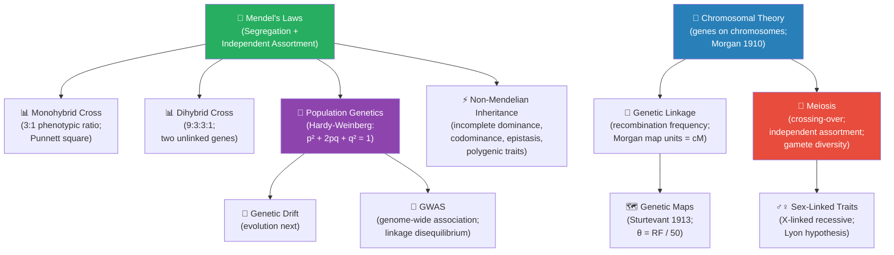

# Unit V — Classical Genetics and Heredity: Introduction {.unnumbered}


\label{sec:unit_V_unit_intro}
## Why This Unit Matters {.unnumbered}

In 1866, an Augustinian friar in Brno published a mathematical analysis of 29,000 pea plants he had
grown in the monastery garden. Gregor Mendel showed that heritable traits are passed from parent to
offspring in discrete, predictable ratios — 3:1 for monohybrid crosses, 9:3:3:1 for dihybrid crosses.
His paper, \"Versuche über Pflanzenhybriden,\" went unread for 34 years. When it was rediscovered
simultaneously by de Vries, Correns, and Tschermak in 1900, it ignited a revolution: the laws of
segregation and independent assortment described the behaviour of something that Mendel had rarely
seen — chromosomes, structures not visualised until the 1880s, and connected to genes primarily by Thomas
Hunt Morgan's fruit fly experiments in 1910.

The synthesis of Mendel's mathematical laws with chromosomal theory, and later with population
genetics, constitutes one of the great intellectual achievements of twentieth-century science. It
unified patterns of inheritance visible to naked-eye observation with the molecular machinery of DNA
replication and meiosis. It transformed agriculture, medicine, forensic science, and evolutionary
theory simultaneously. Today, genome-wide association studies (GWAS) identify thousands of loci
contributing to human traits; pedigree analysis diagnoses rare recessive disorders; and population
genetics models predict drug-resistance evolution in pathogens.

This unit bridges the gap between the molecular genetics of \nameref{sec:unit_IV_unit_intro} and the evolutionary dynamics of
\nameref{sec:unit_VI_unit_intro}. You will derive Mendelian ratios from first principles, work through the mathematics of
incomplete dominance, codominance, and epistasis, map gene positions using recombination frequencies,
and apply the Hardy-Weinberg equations to natural populations.

---

## Landmark Discoveries {.unnumbered}

| Discoverer(s) | Year | Journal / Source | Discovery | Significance |
| ------------- | ---- | ---------------- | --------- | ------------ |
| Gregor Mendel | 1866 | *Verh. naturf. Vereines Brünn* | Laws of segregation and independent assortment | Mathematical foundation of genetics; rediscovered 1900 |
| Walther Flemming | 1882 | *Zellsubstanz, Kern und Zelltheilung* | Chromosomes during mitosis (\"chromatin\") | First visualisation of chromosomal segregation |
| Thomas Hunt Morgan | 1910 | *Science* | Sex-linked inheritance in *Drosophila* | Proved genes reside on chromosomes; Nobel Prize 1933 |
| Alfred Sturtevant | 1913 | *J. Exp. Zool.* | First genetic map (6 X-linked *Drosophila* genes) | Showed recombination frequency ∝ map distance |
| Barbara McClintock | 1950 | *Proc. Natl. Acad. Sci.* | Transposable elements (\"jumping genes\") | Showed genomes are dynamic; Nobel Prize 1983 |
| Hardy & Weinberg | 1908 | *Science; Jahreshefte d. Ver. f. Vaterländ. Naturk.* | Population genetic equilibrium | Allele frequencies stable without evolution; quantitative tool for deviations |
| Human Genome Project Consortium | 2001 | *Nature* | Draft human genome sequence | ~3.2 Gb; ~20,000 protein-coding genes; foundation for GWAS |

---

## Key Concepts and Connections {.unnumbered}


<!-- alt: Flowchart for Key Concepts and Connections: 1 phenotypic ratio; Punnett square)"], 🫛 Mendel's Laws (Segregation + Independent Assortment), 📊 Monohybrid Cross (3:1 phenotypic ratio; Punnett square), and 3:3:1; two unlinked genes)"] form the diagram's primary path or branches. -->

*Flowchart for Key Concepts and Connections: 1 phenotypic ratio; Punnett square)"], 🫛 Mendel's Laws (Segregation + Independent Assortment), 📊 Monohybrid Cross (3:1 phenotypic ratio; Punnett square), and 3:3:1; two unlinked genes)"] form the diagram's primary path or branches.*

**\nameref{sec:unit_V_unit_intro} concept map — Classical Genetics and Heredity.**

---

## Current Evidence Thread {.unnumbered}

Treat inheritance in this unit as something that is *evidenced*, not just asserted: pedigrees and controlled crosses test transmission rules, allele-frequency time series test which evolutionary force is acting, and biobank-scale association data test whether a 'Mendelian' trait is really single-gene. Classical genetics remains essential, but modern interpretation adds penetrance, polygenicity, structural variation, ancestry-aware inference, and uncertainty in risk prediction. As you
move through the chapters, keep a two-column note: **claim** on the left,
**evidence that would change my confidence** on the right. By the end of the
unit, each major idea should be tied to a measurement, model, citation, or
paper-based lab decision.

## Chapter Roadmap {.unnumbered}

| Chapter | Title | Core Question | Key Equation / Model |
| ------- | ----- | ------------- | -------------------- |
| **16** | Mendelian Genetics | How do Mendel's laws explain the inheritance of discrete traits? | Binomial expansion; chi-square test for goodness of fit |
| **17** | Chromosomal Inheritance | How do chromosomes carry genes, and what happens when chromosomal segregation errors occur? | Recombination frequency θ; map function; trisomy probability |
| **18** | Population Genetics | How do allele frequencies change — or not change — in populations? | Hardy-Weinberg: $p^2 + 2pq + q^2 = 1$; $\Delta p$ under selection; $F_{ST}$ |

---

## Connections Across the Textbook {.unnumbered}

- **Meiosis and crossing-over** (\cref{sec:unit_V_chromosomal_inheritance}) build directly on DNA replication and chromosome structure from \nameref{sec:unit_IV_unit_intro}, and provide the mechanistic basis for recombination in \nameref{sec:unit_VI_unit_intro} (evolution).
- **Hardy-Weinberg equilibrium** (\cref{sec:unit_V_population_genetics}) is the null model for both natural selection (\cref{sec:unit_VI_evolution_and_selection}) and genetic drift (\cref{sec:unit_VI_genetic_drift_and_speciation}).
- **Pedigree analysis** and **inheritance patterns** reappear throughout \nameref{sec:unit_IX_unit_intro} (genetic basis of cardiovascular disease, endocrine disorders, immune deficiencies).
- **Epistasis and polygenic traits** link to \nameref{sec:unit_VI_unit_intro} (quantitative trait loci, QTL mapping) and \nameref{sec:unit_X_unit_intro} (population-level phenotypic variation in ecology).

> **Key vocabulary introduced here:** allele, locus, genotype, phenotype, dominant, recessive, homozygous, heterozygous, test cross, chi-square test, centimorgan (cM), Hardy-Weinberg equilibrium, inbreeding coefficient, linkage disequilibrium, aneuploidy, nondisjunction.


## Computational Toolbox — Unit V {.unnumbered}

```python
from biology.genetics import hardy_weinberg, hamming_distance, chi_squared_test

# Hardy-Weinberg equilibrium: cystic fibrosis (autosomal recessive)
# Carrier frequency q ≈ 1/22 in Northern Europeans → q ≈ 0.045, p ≈ 0.955
hw = hardy_weinberg(p=0.955, q=0.045)
print(f"AA (unaffected non-carrier): {hw.p_squared:.4f} = {hw.p_squared*100:.1f}%")
print(f"Aa (carrier):               {hw.two_pq:.4f} = {hw.two_pq*100:.1f}%")
print(f"aa (affected):              {hw.q_squared:.5f} = 1 in {1/hw.q_squared:.0f}")
# Expected:
# AA (unaffected non-carrier): 0.9120 = 91.2%
# Aa (carrier):               0.0860 = 8.6%  (≈ 1 in 23 — matches observed carrier rate)
# aa (affected):              0.00203 = 1 in 493

# Sequence distance between two short alleles
dist = hamming_distance("ATGCTAGC", "ATGATAGT")
print(f"Sequence differences: {dist}")
# Expected: Sequence differences: 2

# Chi-square test: 3:1 vs observed 290:110 (n=400 plants)
chi = chi_squared_test(observed=[290, 110], expected=[300, 100])
print(f"χ² = {chi.chi_squared:.2f}, p ≈ {chi.p_value_approx:.3f}")
# Expected: χ² ≈ 1.33, p ≈ 0.25 (not significant; consistent with 3:1)
```

> **Try it yourself:** Change carrier frequency to `q = 0.02` (rare disease).
> What fraction of affected individuals are born to two carrier parents?

---

*Source note: genetics helpers support Punnett squares, Hardy-Weinberg checks, sequence distances, and chi-squared tests.*
*Figures: `src/visualization/` (Mendelian ratio histograms, Hardy-Weinberg surface plots).*

## Cross-Unit Integration {.unnumbered}

The Mendelian genetics and Hardy–Weinberg framework of \nameref{sec:unit_V_unit_intro} provide the static accounting of allele frequencies — the inventory at equilibrium. \nameref{sec:unit_VI_unit_intro} breaks that equilibrium open: natural selection, genetic drift, mutation, and gene flow are precisely the forces that *violate* Hardy–Weinberg assumptions, and the magnitude of each violation determines evolutionary trajectory. Population-genetic intuitions about allele frequency, heterozygosity, and effective population size carry directly into \nameref{sec:unit_VI_unit_intro}'s quantitative treatment of fitness, selection coefficients, and the fixation index. When \nameref{sec:unit_VI_unit_intro} introduces selection differentials and response equations, recognize them as Hardy–Weinberg with a forcing term — the same machinery in motion rather than at rest.
