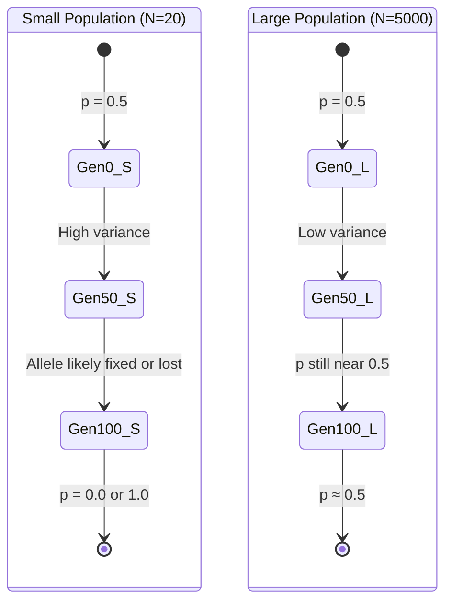
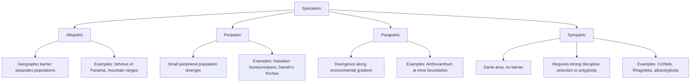
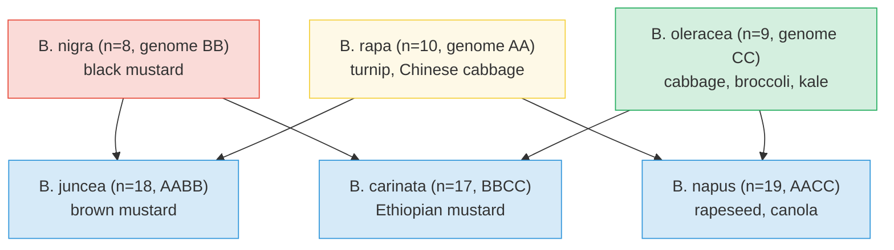
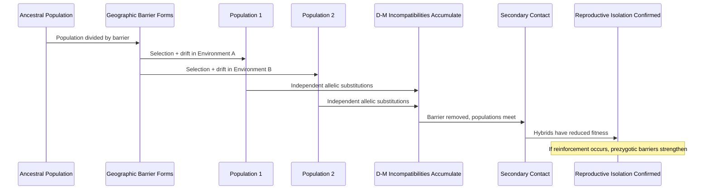

# Genetic Drift, Gene Flow, and Speciation

\label{sec:unit_VI_genetic_drift_and_speciation}


<!-- chapter-metadata-badge -->
> **Ch 20** · Level 3/3 · 60 min read · 75 min lecture · Prerequisites: \cref{sec:unit_VI_evolution_and_selection}

## Learning Objectives

By the end of this chapter, you should be able to:

1. Define [**genetic drift**](#gl:genetic-drift) and explain why its effects are strongest in small populations, using the Wright-Fisher model mathematically.
2. Distinguish bottleneck and [**founder effect**](#gl:founder-effect)s and describe their genetic consequences with real-world examples.
3. Calculate effective population size ($N_e$) and explain why it is typically much smaller than census population size.
4. Describe [**gene**](#gl:gene) flow, its effects on population differentiation, and how $F_{ST}$ quantifies population structure.
5. Compare and contrast species concepts (biological, morphological, phylogenetic, ecological, cohesion) and evaluate their strengths and limitations.
6. Explain allopatric, peripatric, parapatric, and [**sympatric speciation**](#gl:sympatric-speciation) mechanisms, including the role of polyploidy and adaptive radiation.
7. Differentiate prezygotic from postzygotic reproductive barriers and explain Haldane's rule and reinforcement as outcomes of selection on isolation.
8. Calculate the fixation probability and mean fixation time of a neutral mutation under Kimura's neutral theory and explain why the neutral substitution rate is independent of population size.
9. Evaluate evidence for archaic introgression in modern humans, including Neanderthal and Denisovan ancestry, and explain how adaptive introgression can transfer beneficial alleles between lineages.

<!-- curriculum-scaffold-start -->
### Study Blueprint

- **Big idea:** Chance, population structure, and barriers to gene flow can generate divergence even without adaptive change.
- **Core concepts:** drift, effective population size, gene flow, speciation.
- **Framework alignment:** Vision & Change: Evolution, Systems; AP Biology: Evolution, Systems Interactions; NGSS-style topics: Natural Selection and Evolution, Interdependent Relationships in Ecosystems.
- **Model or quantitative lens:** Fixation probability, effective population size, and migration-selection balance.
- **Data skill:** Distinguish stochastic from directional change in allele-frequency data.
- **Practice cadence:** Visual Representations, Statistical Tests and Data Analysis, Argumentation.
- **Common misconception to repair:** Random does not mean patternless; stochastic processes have predictable distributions.
- **Primary lab:** \cref{sec:lab_unit_VI_genetic_drift_and_speciation}.
- **Question bank:** \cref{sec:q_unit_VI_genetic_drift_and_speciation}.
- **Transfer task:** Apply drift reasoning to endangered populations, founder effects, and island radiations.
- **Bridge to computation:** `biology.evolution.evolution.simulate_drift`.
<!-- curriculum-scaffold-end -->

---

> **Opening Vignette — [**Speciation**](#gl:speciation) on the Underground**
> 
> Beneath London's streets, in the tunnels of the Underground railway system, a mosquito silently diverged from its surface relatives. *Culex pipiens pipiens* lives above ground, hibernates through winter, and feeds on birds. Its descendant, *Culex pipiens molestus*, rarely hibernates, bites mammals, and can breed without a blood meal — perfectly adapted to the warm, mammal-rich tunnels of the Tube. Genetic analysis published in 1999 confirmed that the two are reproductively isolated, despite sharing the same city. The London Underground mosquito has become a textbook example of parapatric speciation without geographic separation — showing that [**reproductive isolation**](#gl:reproductive-isolation) can evolve from a founder event and novel selection pressures even within a few kilometers and a few hundred years. Tube passengers helped document evolution in progress every time they got bitten.

## Genetic Drift

### Definition and Significance

**Genetic drift** is the random change in [**allele**](#gl:allele) frequencies across generations that results from the sampling error inherent in finite populations. Unlike [**natural selection**](#gl:natural-selection), drift is **undirected** -- it is equally likely to increase or decrease the frequency of any allele, regardless of its effect on fitness. Drift is a consequence of probability, not adaptation.

The power of drift is inversely proportional to population size. In large populations, the law of large numbers ensures that actual allele frequencies closely match expected frequencies. In small populations, random sampling can cause dramatic, unpredictable fluctuations -- and ultimately, the fixation or loss of alleles.

### Mathematical Treatment

Under the **Wright-Fisher model**, a population of $N$ diploid individuals contains $2N$ gene copies at each locus. Each generation, the new population is formed by randomly sampling $2N$ alleles (with replacement) from the current generation's gene pool.

If the current frequency of allele $A$ is $p$, the number of $A$ alleles in the next generation follows a binomial distribution:

\begin{equation}
P(k \mid p) = \binom{2N}{k} p^k (1-p)^{2N-k}
\label{eq:genetic_drift_and_speciation_1}
\end{equation}

Key properties:

- **Expected frequency**: $E[p'] = p$ (drift has no directional bias)
- **Variance per generation**: $\text{Var}[\Delta p] = \frac{p(1-p)}{2N_e}$

The variance expression reveals that doubling population size halves the variance in allele frequency change per generation.

**Expected time to fixation**: For a neutral allele currently at frequency $p$, the probability of eventual fixation is simply $p$ (its current frequency). The expected time to fixation, conditional on fixation occurring, is:

\begin{equation}
\bar{t}_{\text{fix}} \approx -4N_e \cdot \frac{(1-p)}{p} \cdot \ln(1-p)
\label{eq:genetic_drift_and_speciation_2}
\end{equation}

For a newly arisen neutral [**mutation**](#gl:mutation) ($p = 1/2N$), the expected time to fixation is approximately $4N_e$ generations.

**Heterozygosity decline**: Expected heterozygosity declines geometrically:

\begin{equation}
H_t = H_0 \left(1 - \frac{1}{2N_e}\right)^t
\label{eq:genetic_drift_and_speciation_3}
\end{equation}

The half-life of heterozygosity is $t_{1/2} = N_e \ln 2 \approx 0.693 N_e$ generations.


<!-- alt: State diagram for Mathematical Treatment showing transitions among p = 0.5, High variance, Allele likely fixed or lost, and p = 0.0 or 1.0. -->

*State diagram for Mathematical Treatment showing transitions among p = 0.5, High variance, Allele likely fixed or lost, and p = 0.0 or 1.0.*

### Effective Population Size

> **Mathematical Background:** Effective population size calculations use basic probability. For a review of variance and probability relevant to genetic drift, see \cref{sec:appendix_math_review}.

The **effective population size** ($N_e$) is the size of an ideal Wright-Fisher population that would experience the same magnitude of genetic drift as the actual population. In nearly most real populations, $N_e$ is substantially smaller than the census size $N$ because of:

**Unequal sex ratio**: If the number of breeding females ($N_f$) differs from the number of breeding males ($N_m$):

\begin{equation}
\frac{1}{N_e} = \frac{1}{4N_f} + \frac{1}{4N_m}
\label{eq:genetic_drift_and_speciation_4}
\end{equation}

### Worked Example: Effective Population Size

**Problem:**
In a breeding colony of northern elephant seals, extreme male-male competition limits mating opportunities to primarily the most [**dominant**](#gl:dominant) males. Suppose a specific breeding group contains $N_f = 40$ sexually mature females, but primarily $N_m = 1$ dominant "beachmaster" male successfully mates with most of them. 
1. What is the census size ($N$) of the breeding adults?
2. What is the effective population size ($N_e$)?

**Solution:**

1. **Calculate the census size:**
   $$ N = N_f + N_m = 40 + 1 = 41 \text{ adults}  \label{eq:unit_VI_genetic_drift_and_speciation_item_1}$$


2. **Calculate the effective population size:**
   Using the rearranged formula $N_e = \frac{4N_m N_f}{N_m + N_f}$:
   $$ N_e = \frac{4(1)(40)}{1 + 40}  \label{eq:unit_VI_genetic_drift_and_speciation_item_2}$$

   $$ N_e = \frac{160}{41} \approx 3.9  \label{eq:unit_VI_genetic_drift_and_speciation_item_3}$$

   
Even though there are 41 breeding animals, the genetic diversity transmitted to the next generation is equivalent to an ideal Wright-Fisher population of **fewer than 4 individuals**. This extreme reproductive skew severely limits the effective population size and subjects the colony to powerful genetic drift.

**Variance in reproductive success**: If the variance in offspring number ($V_k$) exceeds the mean ($\bar{k} = 2$ for a stable population):

\begin{equation}
N_e = \frac{4N - 2}{V_k + 2}
\label{eq:genetic_drift_and_speciation_5}
\end{equation}

Species with high reproductive skew (most individuals leave zero offspring while a few leave many) have dramatically reduced $N_e$.

**Fluctuating population size**: $N_e$ is the harmonic mean of population sizes across generations:

\begin{equation}
\frac{1}{N_e} = \frac{1}{t} \sum_{i=1}^{t} \frac{1}{N_i}
\label{eq:genetic_drift_and_speciation_6}
\end{equation}

The harmonic mean is dominated by the smallest values. A single generation bottleneck of $N = 10$ followed by 99 generations of $N = 10{,}000$ yields $N_e \approx 909$ -- not the arithmetic mean of about 9,900.

**Human effective population size**: Despite a current census size of about 8 billion, human $N_e \approx 10{,}000$--$15{,}000$ (estimated from genomic diversity). This reflects severe ancestral bottlenecks, including the Out-of-Africa event approximately 70,000 years ago.

### The Neutral Theory and Nearly Neutral Theory

Motoo Kimura's **[neutral theory](#gl:neutral-theory) of molecular evolution** (1968) proposed that the majority of substitutions observed at the molecular level are selectively neutral -- neither advantageous nor deleterious. Under neutrality, the rate of substitution equals the mutation rate ($k = \mu$), independent of population size. This seemingly paradoxical result arises because, while drift fixes neutral alleles more slowly in large populations ($\bar{t}_{\text{fix}} = 4N_e$), more neutral mutations arise per generation in large populations ($2N_e \mu$). These effects cancel exactly.

Tomoko Ohta extended this to the **nearly neutral theory** (1973), which recognizes that most mutations are slightly deleterious. The fate of a slightly deleterious mutation depends on population size: if $\lvert s\rvert < 1/(2N_e)$, selection is too weak to overcome drift, and the mutation behaves effectively as neutral. In small populations, more mutations fall into this "nearly neutral" category, leading to faster accumulation of slightly deleterious substitutions. This predicts that species with small $N_e$ (e.g., large-bodied vertebrates) should accumulate more slightly deleterious mutations than species with large $N_e$ (e.g., bacteria) -- a prediction confirmed by comparative genomics.

### Bottleneck Effect

A **population bottleneck** occurs when a population undergoes a dramatic, temporary reduction in size. The genetic consequences are severe and often irreversible:

- Loss of rare alleles (alleles at low frequency are most likely to be lost by chance)
- Reduction in heterozygosity
- Random fixation of alleles unrelated to fitness
- Increased inbreeding and expression of deleterious recessives

**Cheetah (*Acinonyx jubatus*)**: Cheetahs experienced at least two severe bottlenecks -- one approximately 100,000 years ago and another during the Late Pleistocene (about 10,000--12,000 years ago). The genetic consequences are dramatic:

- [**Nucleotide**](#gl:nucleotide) diversity $\pi \approx 0.0001$ -- comparable to inbred laboratory mice
- MHC near-monomorphism: skin grafts between unrelated cheetahs are not rejected, indicating almost no immune system genetic variation
- High frequency of sperm abnormalities (about 70% morphologically abnormal)
- Extreme susceptibility to feline coronavirus and other pathogens
- Conservation implication: even wild cheetah populations suffer inbreeding depression

**Northern elephant seal (*Mirounga angustirostris*)**: Hunted to approximately 20 individuals by the 1890s, the population has since recovered to over 200,000. However, genetic diversity at allozyme loci is essentially zero -- most individuals are genetically nearly identical at many loci. The population is a genetic time capsule of a tiny founding group.

> **Real-World Connection: Conservation Genetics -- The Cheetah Crisis**
>
> The cheetah illustrates why genetic diversity matters for species survival. With minimal MHC variation, a single pathogen could potentially devastate the entire species -- every individual lacks the immune diversity that protects genetically variable populations. Conservation geneticists use molecular markers to assess genetic health of endangered populations, guide captive breeding programs to maximize $N_e$, and identify genetically distinct populations that should be managed separately. The Florida panther recovery program successfully increased genetic diversity by introducing Texas pumas -- a controversial but effective genetic rescue. Similar approaches are being considered for cheetahs, using the more genetically diverse East African populations to supplement Southern African populations.

### Founder Effect

The **founder effect** occurs when a small number of individuals establish a new population, carrying primarily a non-representative sample of the source population's genetic variation. Unlike bottlenecks, founder effects involve colonization of new territory, and the resulting population may remain small for many generations.

| Case | Founding event | Genetic consequence |
| ---- | -------------- | ------------------- |
| **Ellis-van Creveld syndrome in Amish** | One couple (Samuel King and wife) emigrated from Europe to Lancaster County, Pennsylvania, about 1744 | Frequency of EVS allele: 1 in 8 ([**heterozygous**](#gl:heterozygous) carriers) vs. 1 in 60,000 in general population |
| **Finnish disease heritage** | Multiple founding events about 4,000 years ago; population remained small and isolated | Over 30 genetic diseases enriched in Finns (e.g., congenital nephrotic syndrome, aspartylglucosaminuria) |
| **Tristan da Cunha** | 15 original settlers on remote South Atlantic island (1816) | High frequency of asthma and retinitis pigmentosa traced to specific founders |
| **Pingelap atoll achromatopsia** | Typhoon in about 1775 reduced population to about 20 survivors; chief carried achromatopsia allele | about 10% of population has complete color blindness (vs. 1 in 30,000 globally) |

#### Documented founder cases in detail

**Old Order Amish, Lancaster County (Pennsylvania).** The Lancaster County Amish trace their ancestry to ~200 founding families (~700 individuals) who emigrated from the German Palatinate and Switzerland between 1720 and 1770; the population has subsequently grown to ~45,000 with extensive endogamy. The genetic consequences are dramatic. **Ellis–van Creveld syndrome (EvC)** — an autosomal-recessive chondrodysplasia (short-limbed dwarfism, polydactyly, dental anomalies, cardiac septal defects) — has a Lancaster Amish prevalence of approximately **1 in 200 live births**, compared with ~**1 in 60,000–70,000** in the general European-descent population. Coalescent analysis traces every Amish EvC allele to a single founding couple — Samuel King and his wife — who emigrated in ~1744. This is a textbook case of how a **single founder chromosome**, with its specific *EVC* mutation, rose to high frequency through genetic drift in a small endogamous population. Other recessive diseases enriched among the Lancaster Amish include glutaric aciduria type 1, maple syrup urine disease, and a specific *KCNQ1* long QT-syndrome mutation.

**Pingelap atoll, Federated States of Micronesia.** Pingelap is a small (1.8 km²) coral atoll in the Caroline Islands. In approximately **1775**, **Typhoon Lengkieki** struck the island, killing most residents and reducing the surviving population to roughly **20 individuals** — a severe single-generation bottleneck. One survivor, the paramount chief Nahnmwarki Mwanenihsed, was a heterozygous carrier of an autosomal recessive *CNGB3* mutation causing **complete achromatopsia** (total color blindness, photophobia, severe visual impairment, with cone photoreceptors entirely non-functional from birth). Genealogical and molecular analyses, popularised in Oliver Sacks's *The Island of the Colorblind* (1996), trace nearly every modern Pingelap achromatopsia case to this single founder chromosome. The condition, which afflicts roughly **1 in 30,000–50,000 people globally**, occurs in approximately **5–10 % of the modern Pingelap population** (with carrier frequency around 30 %) — a >1,000-fold elevation produced by a single chance founder allele surviving the typhoon.

**French Canadians of Quebec.** Quebec was colonized between 1608 and 1759 by approximately **8,500 French settlers** — a small founding population that subsequently expanded to ~6 million descendants while remaining geographically and culturally isolated from broader European-descent populations through mid-twentieth century. This combination of a small founder population, large subsequent expansion, and limited gene flow produced one of the world's best-studied founder populations. Specific recessive disorders enriched among French Canadians include:

- **Tay-Sachs disease**: A different *HEXA* mutation than the Ashkenazi founder allele — the French Canadian variant (a 7.6-kb deletion) reaches a carrier frequency of ~1/14 in some Quebec subpopulations, comparable to the Ashkenazi rate.
- **Tyrosinemia type I**: Caused by a *FAH* (fumarylacetoacetate hydrolase) splice-site mutation, with a carrier frequency of ~1/14 in the Saguenay-Lac-Saint-Jean region (vs. ~1/100,000 worldwide). The single Quebec founder was traced to a Norman settler from the 1600s.
- **Autosomal recessive spastic ataxia of Charlevoix-Saguenay (ARSACS)**: A neurodegenerative disorder reaching ~1/1,500 in the Charlevoix region, caused by a specific *SACS* mutation absent elsewhere.
- **Hereditary fructose intolerance, congenital lactic acidosis, oculopharyngeal muscular dystrophy**: Most show elevated frequencies in specific French Canadian subpopulations traceable to identifiable founder events.

These three cases illustrate that the founder effect is **not selection** but **probability**: a recessive allele survives the bottleneck because the founder happens to carry it, and subsequent endogamous mating compounds homozygosity over generations. Modern genetic medicine in such populations leverages founder-effect concentration: a single targeted assay at one chromosomal site can screen for the population-specific high-prevalence allele, which would be cost-prohibitive in genetically heterogeneous outbred populations.

> **Concept Check 1:** A population of 100 individuals experiences a bottleneck to 5 individuals for one generation, then immediately recovers to 100. Using the harmonic mean formula, calculate $N_e$ over these two generations. How does this compare to the arithmetic mean?

### Worked Example: Effective Population Size with Unequal Sex Ratio

**Problem:** A small mammal population contains $N = 100$ diploid adults distributed with $N_m = 10$ breeding males and $N_f = 90$ breeding females (an extreme sex-ratio bias caused by male-biased mortality during a harsh winter). Estimate (a) the effective population size $N_e$ from the unequal-sex-ratio formula, (b) the expected per-generation heterozygosity loss $\Delta H / H = 1/(2N_e)$, and (c) the expected heterozygosity retained after 50 generations.

**Solution:**

1. **Effective population size from sex ratio.** Using $\frac{1}{N_e} = \frac{1}{4N_f} + \frac{1}{4N_m}$, equivalently $N_e = \dfrac{4 N_m N_f}{N_m + N_f}$:

   $$ N_e = \frac{4 \times 10 \times 90}{10 + 90} = \frac{3600}{100} = 36 \label{eq:unit_VI_genetic_drift_and_speciation_worked_ne_1} $$

   Even with $N = 100$ census adults, the genetic drift behaves as if the population had merely $N_e = 36$ ideal-Wright–Fisher individuals — a ~64 % reduction in effective size driven entirely by the sex-ratio skew.

2. **Per-generation heterozygosity loss.**

   $$ \frac{\Delta H}{H} = \frac{1}{2 N_e} = \frac{1}{72} \approx 0.014 = 1.4\,\% \text{ per generation} \label{eq:unit_VI_genetic_drift_and_speciation_worked_ne_2} $$

3. **Heterozygosity after 50 generations.** Geometric decay:

   $$ H_{50} = H_0 \left(1 - \frac{1}{2 N_e}\right)^{50} = H_0 \left(1 - \frac{1}{72}\right)^{50} \approx H_0 \times 0.50 \label{eq:unit_VI_genetic_drift_and_speciation_worked_ne_3} $$

   Heterozygosity is approximately halved in 50 generations.

**Conservation implication.** The Florida panther (*Puma concolor coryi*) reached an $N_e \approx 20$ in the early 1990s before genetic-rescue introductions of Texas pumas; over just a few decades the subspecies showed elevated rates of cryptorchidism, atrial septal defects, and reduced sperm quality — clinical signatures of inbreeding depression driven exactly by the heterozygosity-loss trajectory derived above. The numerical worked example shows why **census size $N$ alone misleads conservation managers**: an apparently healthy adult count masks an effective size small enough to lose half its remaining genetic diversity in a human lifetime.


---

## Gene Flow and Mutation

### Gene Flow

**Gene flow** (migration) is the movement of alleles between populations through the dispersal and reproduction of individuals (or their [**gamete**](#gl:gamete)s, such as pollen). Gene flow has two primary evolutionary effects:

1. **Homogenization**: Gene flow tends to equalize allele frequencies between populations, counteracting divergence due to drift or local selection.
2. **Introduction of variation**: Migrants introduce novel alleles that may not have arisen locally, increasing genetic diversity within recipient populations.

### Measuring Population Differentiation: $F_{ST}$

Wright's **fixation index** ($F_{ST}$) quantifies the proportion of total genetic variation attributable to differences between populations:

\begin{equation}
F_{ST} = \frac{H_T - H_S}{H_T} = \frac{\sigma^2_p}{\bar{p}(1-\bar{p})}
\label{eq:genetic_drift_and_speciation_7}
\end{equation}

where $H_T$ is the expected heterozygosity of the total (pooled) population and $H_S$ is the mean expected heterozygosity within subpopulations.

- $F_{ST} = 0$: No differentiation (panmixia -- gene flow fully homogenizes populations)
- $F_{ST} = 1$: Complete differentiation (populations fixed for different alleles)

**Wright's island model**: At migration-drift equilibrium:

\begin{equation}
F_{ST} \approx \frac{1}{1 + 4N_e m}
\label{eq:unit_VI_fst_nm}
\end{equation}

where $m$ is the proportion of each subpopulation composed of migrants per generation. This compact relationship — equating differentiation to the inverse of the **scaled migration rate** $4N_em$ — is one of the most-used results in molecular ecology. It reveals a striking insight: even very low migration rates ($m$) can prevent substantial differentiation. $N_em = 1$ (just one migrant per generation) yields $F_{ST} = 0.20$; $N_em = 4$ yields $F_{ST} = 0.06$. **One migrant per generation is the rule of thumb for keeping populations from drifting apart**, regardless of population size — because the homogenizing effect of migration scales with $m \cdot N_e$ while the diverging effect of drift scales with $1/N_e$, leaving the dimensionless product $N_em$ as the controlling parameter.

The relationship can be inverted for empirical use: given a measured $F_{ST}$, the implied number of migrants per generation is

$$N_em \approx \frac{1 - F_{ST}}{4 F_{ST}}. \label{eq:unit_VI_genetic_drift_and_speciation_item_4}$$


For $F_{ST} = 0.05$ (moderate human population structure), $N_em \approx 4.75$ — about five effective migrants between subpopulations per generation, sufficient to keep differentiation modest.

### Isolation by Distance

**Isolation by distance (IBD)**: In continuously distributed populations, gene flow decreases with geographic distance. This produces a positive correlation between pairwise $F_{ST}$ (or genetic distance) and geographic distance, detectable by a **Mantel test** (matrix correlation between genetic and geographic distance matrices).

IBD patterns confirm that most natural populations show continuous genetic gradients (clines) rather than sharp boundaries. Human genetic variation, for example, shows strong IBD patterns corresponding to the out-of-Africa expansion routes.

### Secondary Contact and Hybrid Zones

When previously allopatric populations come back into contact, the outcome depends on the degree of reproductive isolation that evolved during separation:

- **Fusion**: If reproductive isolation is weak, populations merge and homogenize.
- **Reinforcement**: If hybrids have reduced fitness, selection strengthens prezygotic barriers, as developed in the reproductive-isolation discussion.
- **Stable hybrid zone**: A narrow geographic zone of hybridization maintained by a balance between dispersal into the zone and selection against hybrids — called a **tension zone**.

#### Tension zone width and the dispersal-selection balance

Following Barton & Hewitt (1985), the equilibrium **width** $w$ of a tension zone follows:

\begin{equation}
w \approx \frac{\sigma}{\sqrt{s}}
\label{eq:unit_VI_tension_zone}
\end{equation}

where σ is the per-generation dispersal distance and $s$ is the selection coefficient against hybrids. Tension zones are **independent of geography** in a key sense: their width is a function primarily of dispersal and selection, not of the underlying environmental gradient. The same hybrid zone can move across the landscape (as one parental population expands at the expense of the other) while maintaining its width. Tension zones become trapped at landscape features (mountain passes, river crossings) where dispersal rates dip locally — explaining why hybrid zones often coincide with geographic obstacles even when the species' ranges are broadly continuous.

**Empirical examples**:

- **European crow hybrid zone** (carrion crow *Corvus corone* × hooded crow *C. cornix*): The hybrid zone runs through Europe from Italy and Denmark up through Russia, with a width of ~20–30 km. *Corone* and *cornix* differ at a small number of pigmentation loci. Genome-wide $F_{ST}$ across the zone is dramatic at color-loci but minimal elsewhere — a "porous" species barrier consistent with reinforcement primarily at loci affected by mate choice.
- **Northern flicker** (*Colaptes auratus*) hybrid zone: yellow-shafted (eastern) × red-shafted (western) flickers form a narrow hybrid zone running ~3,000 km along the central Great Plains, with width ~100–200 km. Despite extensive interbreeding in the zone, the parental forms persist on either side — assortative mating and reduced hybrid fitness preserve the polymorphism.
- ***Bombina bombina* × *B. variegata*** toads: A 5–8 km tension zone runs through Central Europe. Genome-wide $F_{ST}$ patterns reveal both barrier loci (under strong selection against hybrids) and freely-introgressing neutral loci. The genome behaves like a mosaic of differently permeable regions.

#### Reinforcement and Dobzhansky-Muller incompatibilities

When hybrids have reduced fitness, **reinforcement** strengthens prezygotic barriers — natural selection favors mate-discrimination alleles that prevent hybridization. The genetic basis of postzygotic isolation typically involves **Dobzhansky-Muller incompatibilities** (BDMI): pairs of alleles at different loci that function fine in their respective parental backgrounds but produce sterile or inviable hybrids when combined.

The classic two-locus BDMI: ancestral genotype $A_1B_1$. Population 1 evolves to $A_2B_1$ (the new $A_2$ is tested against $B_1$ — works fine). Population 2 evolves to $A_1B_2$ (the new $B_2$ is tested against $A_1$ — works fine). The hybrid genotype $A_2B_2$ has rarely been tested by selection; if $A_2$ and $B_2$ interact deleteriously, hybrids fail. Because each parental population independently accumulates substitutions, the number of potential incompatibilities grows as $k^2$ (Orr's snowball) — explaining why isolation often appears suddenly after a long period of gradual divergence.

Sympatric divergence (without geographic separation) is rare because gene flow continuously breaks up co-adapted gene complexes. Reinforcement can complete divergence after an initial allopatric phase: secondary contact selects for prezygotic isolation alleles that prevent the formation of low-fitness hybrid combinations. **The genomic signature of reinforcement** — sharper differentiation at mate-choice and behavioral-isolation loci than at genome-wide background — has been documented in *Drosophila* species pairs and in cichlid radiations.

### Coalescent Theory and the TMRCA

The **coalescent** is a backward-in-time view of population genealogies that has become the dominant statistical framework in modern population genetics \citep{kingman1982}. Rather than tracking allele frequencies forward through generations, the coalescent traces ancestral lineages of currently sampled alleles backward until they merge ("coalesce") at common ancestors.

#### Expected coalescence time

For a sample of $k$ alleles drawn from a Wright-Fisher population of effective size $N_e$ diploid individuals (so $2N_e$ allele copies), the expected time for any two specific lineages to coalesce is $2N_e$ generations. Generalizing to a sample of $k$ lineages, the expected total time to the most recent common ancestor (TMRCA) is:

\begin{equation}
E[T_{\text{MRCA}}] = 4N_e \left(1 - \frac{1}{k}\right)
\label{eq:unit_VI_tmrca}
\end{equation}

For large samples ($k \to \infty$), $E[T_{\text{MRCA}}] \to 4N_e$ generations. The coalescent has several remarkable properties:

- **Most coalescences happen recently**: the expected time for the **last** two lineages to coalesce ($2N_e$ generations) is half of the total tree depth. The genealogy is "top-heavy": coalescent events are most rapid at the tips of the tree, slowest near the root.
- **Independent of forward dynamics**: Under neutrality, the topology of the coalescent tree is independent of mutations. Mutations are sprinkled onto branches at rate μ; the expected number of segregating sites in a sample of $k$ is $\theta \sum_{i=1}^{k-1} 1/i$, where $\theta = 4N_e\mu$.
- **Variance**: TMRCA has a wide distribution. The variance of TMRCA grows with $k$ but the **most likely TMRCA** values are surprisingly broad — different loci sampled from the same population yield TMRCAs spanning an order of magnitude.

#### Why "Mitochondrial Eve" was not the only woman alive

Coalescent logic explains why the TMRCA of human mitochondrial DNA (~150,000 years ago) does **not** mean a single ancestress. Many women were alive 150 kya — the coalescent estimate refers primarily to the lineage of mtDNA that survived to the present. Most other maternal lineages were lost by drift along the way; their loss is statistically inevitable in finite populations. Indeed, of $k$ ancestral lineages alive in the founding population, most but one will eventually be lost to drift — with the surviving lineage tracing back through "Eve" by definition. The surprising thing is not that an MRCA exists, but that the coalescent pinpoints when she lived.

#### Coalescent applications

- **Effective population size estimation** from segregating-site counts uses the relationship $\theta = 4N_e\mu$.
- **Detecting selective sweeps** identifies regions with anomalously short TMRCAs — a recent advantageous mutation drags linked variation toward fixation, collapsing the genealogy.
- **Demographic inference** from extended coalescent models reconstructs population growth, bottlenecks, and migration history. PSMC (pairwise sequentially Markovian coalescent) and SMC++ are standard tools.

#### TMRCA for two alleles: derivation and intuition

The single most-cited coalescent result is the expected coalescence time of two randomly sampled alleles in a Wright–Fisher diploid population of effective size $N_e$. In each generation, two specific allele copies have probability $1/(2N_e)$ of sharing the same parent (because a parent is chosen uniformly from $2N_e$ possibilities). The coalescence time is therefore geometrically distributed with success probability $1/(2N_e)$, giving:

\begin{equation}
E[T_{\text{MRCA, 2-alleles}}] = 2N_e \text{ generations}
\label{eq:unit_VI_tmrca_pairwise}
\end{equation}

For $N_e = 10{,}000$ (a typical estimate for ancestral humans), the expected pairwise coalescence is **20,000 generations** ≈ 500,000 years (assuming 25-year generation time). This figure is the **statistical baseline** against which observed pairwise sequence divergences are interpreted; deeper coalescences indicate population structure or balancing selection, shallower coalescences suggest bottlenecks or selective sweeps.

For a sample of $k$ alleles, total tree depth (root to most recent tip) is $4N_e(1 - 1/k)$ — the value introduced in \cref{eq:unit_VI_tmrca}. For two alleles ($k = 2$), this reduces to $2N_e$, recovering the pairwise result of \cref{eq:unit_VI_tmrca_pairwise}.

#### Structured coalescent

When a population is subdivided into subpopulations with limited migration, the coalescent becomes **structured**: lineages can primarily coalesce when they are in the same subpopulation, and migration events transfer lineages between subpopulations. Two lineages drawn from the same subpopulation typically coalesce on the timescale $2N_e$ (within-deme coalescence). Two lineages drawn from **different subpopulations** must first meet in the same deme before they can coalesce — adding a waiting time inversely proportional to the migration rate $m$. The result is that **between-population pairwise TMRCA exceeds within-population pairwise TMRCA**, with the difference scaling as $\sim 1/(2m)$ generations.

This produces an empirical signature: $F_{ST}$ between subpopulations grows as the fraction of the genealogy spent in the "between" rather than "within" coalescent regime. Conversely, **migration reduces between-population TMRCA** because lineages can quickly transfer between subpopulations; high-migration models behave like a single panmictic population with effective size equal to the sum of deme sizes. Modern coalescent inference tools (msprime, IM, PhyloGeoTools) explicitly model structured-coalescent dynamics to estimate ancient migration rates and population-divergence times — a key application in human population history (e.g., African ↔ Eurasian migration after Out-of-Africa) and in conservation genetics of fragmented populations.

### Mutation as the Ultimate Source of Variation

**Mutation** is the ultimate source of most genetic variation. Without mutation, evolution would eventually cease as selection and drift exhausted existing variation.

- **De novo mutation rate in humans**: approximately $1.2 \times 10^{-8}$ per nucleotide per generation, corresponding to about 70 new mutations per individual per generation.
- **Paternal age effect**: Male germline cells undergo many more mitotic divisions than female germline cells. Each year of paternal age adds approximately 1--2 additional mutations to offspring. This contributes to the increased incidence of some genetic conditions (e.g., achondroplasia, autism spectrum disorder) with advanced paternal age.

### Mutation-Selection Balance

For a deleterious recessive allele maintained by recurrent mutation against purifying selection, the equilibrium frequency is:

\begin{equation}
\hat{q} \approx \sqrt{\frac{\mu}{s}}
\label{eq:genetic_drift_and_speciation_9}
\end{equation}

where μ is the mutation rate and $s$ is the selection coefficient against the homozygous genotype. This explains why many genetic diseases persist at low frequencies -- new mutations continually reintroduce them even as selection removes them.

**Example**: Cystic fibrosis (CF) is caused by homozygosity for loss-of-function alleles in the *CFTR* gene. With $\mu \approx 6.7 \times 10^{-7}$ and $s \approx 1$ (CF was historically lethal before modern medicine), mutation-selection balance predicts $\hat{q} \approx \sqrt{6.7 \times 10^{-7}} \approx 0.0008$. However, the actual carrier frequency in European populations is approximately 1 in 25 ($q \approx 0.02$), far exceeding the mutation-selection prediction. This suggests an additional force -- possibly heterozygote advantage against cholera, typhoid fever, or tuberculosis -- maintains the CF allele at elevated frequency, similar to the sickle cell / malaria relationship.

> **Real-World Connection: Mutation Rates and Cancer**
>
> The same mutational processes that drive evolution also drive cancer. Somatic mutations accumulate in cells throughout an organism's lifetime at rates of approximately $0.5$--$5 \times 10^{-9}$ per nucleotide per cell division. Larger and longer-lived organisms should, by simple probability, experience more cancer -- yet elephants (with 100 times more cells than humans) have lower cancer rates than humans. This is **Peto's paradox**. The resolution involves the evolution of enhanced cancer suppression mechanisms: elephants carry approximately 20 copies of the *TP53* tumor suppressor gene (humans have one), and their cells are hypersensitive to DNA damage, triggering [**apoptosis**](#gl:apoptosis) rather than attempting repair. This represents an evolutionary adaptation to large body size.

> **Concept Check 2:** Using Wright's island model, calculate the equilibrium $F_{ST}$ for two populations with $N_e = 500$ and $m = 0.005$. How many migrants per generation does this represent? Would you consider these populations significantly differentiated?

> **Concept Check (Analysis — Interpreting $F_{ST}$ on a Sliding Scale):** Three pairs of populations have measured $F_{ST}$ values of $0.05$, $0.15$, and $0.35$. (a) For each, calculate the implied number of effective migrants per generation using $N_e m \approx (1 - F_{ST}) / (4 F_{ST})$. (b) Interpret the three regimes biologically: which corresponds to ongoing extensive gene flow, which to weak structure, and which to substantially differentiated populations approaching reproductive isolation? (c) Critically evaluate the assumption-set behind the island-model conversion — what would change if the populations exchange migrants asymmetrically, or if migration is recent rather than at equilibrium? (d) For the $F_{ST} = 0.15$ pair, what fraction of total genetic variation is **between** populations versus **within** populations? Connect this back to the $F_{ST}$ definition $F_{ST} = (H_T - H_S) / H_T$.

---

## Species Concepts

Defining what constitutes a "species" is one of the most contentious issues in biology. Multiple species concepts exist, each emphasizing different aspects of biological reality.

### Biological Species Concept (BSC)

Ernst \citet{mayr1942} defined species as "groups of actually or potentially interbreeding natural populations that are reproductively isolated from other such groups." This concept emphasizes **reproductive isolation** as the defining criterion.

**Strengths**: Biologically meaningful; focuses on the process (gene flow) that maintains species cohesion.

**Limitations**: Cannot be applied to asexual organisms, fossils (where reproductive behavior is unobservable), or ring species; hybridization between "good" species is common (e.g., about 10% of bird species hybridize).

### Morphological/Typological Species Concept

Species are distinguished by consistent morphological differences. This is the oldest concept, rooted in Linnaeus's original classifications.

**Strengths**: Practical and widely applicable; the basis of most field identification.

**Limitations**: Subjective -- how much difference constitutes a species? Fails for cryptic species (morphologically identical but reproductively isolated) and polymorphic species (morphologically variable within a single species).

### Phylogenetic Species Concept (PSC)

A species is the smallest diagnosable monophyletic group -- the smallest cluster of organisms that share a common ancestor and can be distinguished from other such clusters by unique character combinations (synapomorphies).

**Strengths**: Applicable to any organism (sexual, asexual, fossil); consistent with modern systematics.

**Limitations**: Tends to "oversplit" -- recognizing more species than the BSC from the same organisms. With sufficient genetic data, nearly every population is diagnosable.

### Ecological Species Concept

A species is a set of organisms exploiting a single ecological [**niche**](#gl:niche) (Hutchinson's hypervolume). This concept focuses on the ecological role rather than reproductive boundaries.

**Strengths**: Applicable to asexual organisms; emphasizes the role of selection in maintaining species identity.

**Limitations**: Niche boundaries are often fuzzy; different populations of the same species may occupy different niches.

### Cohesion Species Concept

Alan \citet{templeton1989} proposed the most comprehensive definition: a species is the most inclusive group of organisms having the potential for **genetic exchangeability** (gene flow) and/or **demographic exchangeability** (ecological interchangeability). This concept subsumes elements of the BSC and ecological concepts.

### Ring Species

**Ring species** demonstrate speciation as a gradual process. A series of populations forms a ring around a geographic barrier, with neighboring populations interbreeding freely. However, at the point where the ring closes, the terminal populations are reproductively isolated despite being connected by a chain of interbreeding intermediates.

- **Larus gulls**: Around the Arctic, a chain of herring gull and lesser black-backed gull populations form a ring. Adjacent populations interbreed, but the end members (in Europe) coexist as distinct, reproductively isolated species.
- **Ensatina salamanders**: In California, populations encircle the Central Valley. Adjacent populations hybridize, but where the ring closes in southern California, the terminal forms (*E. e. eschscholtzii* and *E. e. klauberi*) rarely interbreed.

Ring species challenge the BSC because reproductive isolation is not absolute but graded.

> **Concept Check 3:** A researcher discovers two populations of beetles that are morphologically identical but reproductively isolated in the laboratory. Would the BSC and morphological species concept agree on whether these are one species or two? Which concept would you favor, and why?

---

## Speciation Mechanisms


<!-- alt: Flowchart for Speciation Mechanisms: Speciation, Allopatric, Peripatric, and Parapatric form the diagram's primary path or branches. -->

*Flowchart for Speciation Mechanisms: Speciation, Allopatric, Peripatric, and Parapatric form the diagram's primary path or branches.*

### Allopatric Speciation

**Allopatric speciation** -- speciation resulting from geographic isolation -- is the most common and best-documented mode. A geographic barrier (mountain range, ocean, ice sheet, river) divides a population, preventing gene flow. The isolated populations then diverge through a combination of natural selection (adapting to different local environments) and genetic drift, eventually accumulating enough differences that reproductive isolation is a byproduct of divergence.

**Isthmus of Panama**: The formation of the Central American land bridge approximately 3 Mya divided many marine populations into Caribbean and Pacific components. The resulting **geminate species pairs** (closely related species on either side of the isthmus) provide natural experiments in allopatric divergence. Snapping shrimp (*Alpheus* spp.) separated by the isthmus show increasing reproductive isolation correlated with divergence time.

**Dobzhansky-Muller incompatibilities**: The genetic basis of reproductive isolation often involves epistatic interactions between independently evolved alleles. Consider two populations with ancestral genotype $A_1B_1$. Population 1 evolves to $A_2B_1$ and Population 2 evolves to $A_1B_2$. Each derived genotype is functional because the new allele was tested against the existing genetic background. But hybrids ($A_2B_2$) carry a combination that has rarely been tested by natural selection -- and this untested epistatic combination may cause developmental failure, sterility, or inviability. The number of potential incompatibilities grows as the square of the number of substitutions (**Orr's snowball effect**):

\begin{equation}
\text{Incompatibilities} \propto k^2
\label{eq:genetic_drift_and_speciation_10}
\end{equation}

This accelerating accumulation explains why reproductive isolation often appears suddenly after a period of gradual divergence.

### Peripatric Speciation

**Peripatric speciation** occurs when a small population at the periphery of a species' range becomes isolated. The small founding population experiences strong genetic drift (founder effect), which, combined with potentially different selective pressures at the range margin, can drive rapid divergence.

- **Hawaiian honeycreepers**: Approximately 55 species evolved from one or two founding finch-like ancestors that colonized the Hawaiian Islands approximately 5 Mya. The radiation produced an extraordinary diversity of bill shapes -- from long, curved bills for nectar feeding (*Drepanis*) to massive, parrot-like bills for seed cracking (*Pseudonestor*) to thin, warbler-like bills for insect gleaning (*Oreomystis*). Many species are now critically endangered or extinct.
- **Darwin's finches**: Fifteen species on the Galapagos Islands, diversified from a single South American ancestor approximately 1--2 Mya. Beak depth and width vary with seed size and hardness. **Character displacement** -- divergence in beak morphology is greater where two species co-occur (sympatry) than where each occurs alone (allopatry) -- provides evidence that competition drives morphological divergence.

### Parapatric Speciation

**Parapatric speciation** occurs along an environmental gradient without a clear geographic barrier. Adjacent populations experience different selective pressures, and if selection against intermediates is strong enough to overcome gene flow, divergence can proceed.

**Sweet vernal grass (*Anthoxanthum odoratum*)**: On heavy-metal-contaminated mine tailings in Wales, grass populations have evolved heavy metal tolerance within meters of the mine boundary. Tolerant and non-tolerant populations grow adjacent to each other. Flowering time has shifted between the two ecotypes, providing a prezygotic barrier -- tolerant plants flower approximately one week earlier than adjacent non-tolerant plants. Wind-mediated gene flow between the two populations is substantial (pollen travels freely), yet the ecotypes maintain their distinctness because of strong selection against non-tolerant genotypes on contaminated soil and against tolerant genotypes (which pay a fitness cost) on clean soil. This is parapatric speciation in progress -- divergence without geographic isolation, driven by strong disruptive selection.

**Hybrid zones as natural laboratories**: The parapatric boundary between ecotypes often produces a narrow **cline** -- a geographic gradient in allele frequency. The width of the cline reflects the balance between selection (which narrows it) and gene flow (which broadens it). Cline width $w$ can be estimated as:

\begin{equation}
w \approx \frac{\sigma}{\sqrt{s}}
\label{eq:genetic_drift_and_speciation_11}
\end{equation}

where σ is the dispersal distance per generation and $s$ is the selection coefficient against immigrants. Narrow clines indicate strong selection relative to dispersal.

### Sympatric Speciation

**Sympatric speciation** -- speciation within a single, freely mixing population -- has long been controversial because gene flow should homogenize populations. However, several mechanisms can overcome gene flow:

**Cichlid fish in Lake Victoria**: Approximately 500 species evolved within a single lake basin in approximately 15,000 years -- one of the most spectacular adaptive radiations known. Sexual selection on male coloration, driven by female preference under different light environments (clear versus turbid water), appears to be a primary driver. When experimental turbidity eliminates the ability to distinguish colors, species boundaries break down and hybridization occurs -- demonstrating that assortative mating by color maintains species isolation.

**Apple maggot fly (*Rhagoletis pomonella*)**: The ancestral host plant is hawthorn. Following the introduction of domestic apples to North America in the 1600s, a population shifted to apple as a host. Apple and hawthorn races now differ in emergence timing (matching fruit ripening), host preference, and multiple genomic regions under divergent selection. This represents host race formation -- an early stage of sympatric speciation.

**Polyploidy in plants**: Whole-[**genome**](#gl:genome) duplication creates **instantaneous reproductive isolation** because polyploid offspring cannot successfully mate with diploid parents (triploid offspring are sterile or inviable due to meiotic irregularities — odd chromosome number prevents proper homolog pairing at meiosis I, producing unbalanced gametes that fail to develop). The triploid block is the mechanistic basis for why polyploidy can speciate in a **single generation**: a tetraploid individual that arises by chromosome non-disjunction is reproductively isolated from its diploid parents from the moment of formation.

- **Autopolyploidy**: Genome doubling within a single species without hybridization. Potato (*Solanum tuberosum*) is autotetraploid (4n = 48). Alfalfa (*Medicago sativa*) is autotetraploid. Some wild *Tolmiea* (piggyback plant) populations exhibit autotetraploid forms sympatric with diploid forms. Autopolyploids face less severe meiotic challenges than allopolyploids because their four homologs share recent ancestry, but **multivalent formation at meiosis I** (where four near-identical homologs may pair as quadrivalents rather than two bivalents) can produce aneuploid gametes at higher rates than in diploids. Reproductive isolation can arise rapidly because an autotetraploid (4n) crossed with a diploid (2n) parent often produces low-fertility triploid (3n) offspring.
- **Allopolyploidy**: Hybridization between two distinct species followed by [**chromosome**](#gl:chromosome) doubling. The chromosome doubling restores fertility because each chromosome now has a homolog to pair with at meiosis I (the parental homolog), eliminating the meiotic irregularities that would otherwise sterilize the F1 hybrid. Major allopolyploid crops illustrate the pattern across the angiosperms:
  - **Bread wheat (*Triticum aestivum*)**: an allohexaploid (2n = 42 = AABBDD) derived from three diploid ancestors through two rounds of hybridization and genome doubling, completed within the last ~8,000–10,000 years coinciding with the origin of agriculture.
  - **Cultivated tobacco (*Nicotiana tabacum*)**: an allotetraploid (2n = 48 = SSTT), formed ~200,000 years ago by hybridization between *N. sylvestris* (S genome) and an *N. tomentosiformis*-like progenitor (T genome).
  - **Cultivated cotton (*Gossypium hirsutum*, upland cotton)**: an allotetraploid (2n = 52 = AADD) formed ~1–2 Mya by hybridization between an Old World A-genome species and a New World D-genome species — followed by trans-oceanic dispersal of A-genome ancestors to the Americas. Modern upland cotton accounts for ~95% of global cotton production.

#### How widespread is polyploidy?

Polyploidy is a major mode of sympatric speciation in plants and is **far more common than once thought**. Recent genomic analyses indicate that **~35% of extant angiosperm species** are polyploid or have polyploid ancestors detectable in the recent past, and many flowering plant lineages show evidence of paleopolyploid events (whole-genome duplications followed by gene loss and rediploidisation) during their evolutionary history. The seed plants share at least one whole-genome duplication ~320 Mya, and the flowering plants share a more recent duplication ~150 Mya. Major crop genomes (rice, maize, soybean, *Brassica*, banana, sugarcane) bear paleopolyploid signatures. **Polyploidy is not a peculiarity of a few weedy lineages** — it is a recurring engine of plant evolution that contributes substantially to angiosperm diversification, novel gene functions arising from duplicated copies (sub- and neofunctionalisation), and rapid speciation. In animals, polyploidy is rarer because dosage-sensitive development and sex-determination systems often make genome doubling costly, but it has occurred in salmonid fish, *Xenopus* frogs, and some invertebrates.

#### Wheat: a paradigm of agricultural allopolyploidy

The polyploid origin of bread wheat is one of the best-documented allopolyploid speciation events in agriculture. Approximately 500,000 years ago, *Triticum urartu* (genome AA) hybridized with *Aegilops speltoides* (genome BB), producing the tetraploid emmer wheat (*Triticum turgidum*, AABB). Some 8,000 years ago, emmer crossed with *Aegilops tauschii* (genome DD), producing modern hexaploid bread wheat (AABBDD). Each genome retains ~85% of its ancestral gene content; the **homoeologous** chromosome sets pair specifically with their partners thanks to the *Ph1* locus on chromosome 5B, which suppresses pairing between non-identical chromosomes and prevents chaos at meiosis. Modern wheat breeding takes advantage of the genetic diversity in the three subgenomes — beneficial alleles can be sourced from any of the diploid ancestor lineages and introduced into bread wheat by chromosomal manipulations.

#### The Brassica triangle (Triangle of U)

The cultivated *Brassica* species form one of the most elegant illustrations of allopolyploid speciation, formalized by Korean botanist Woo Jang-choon (U Nagaharu) in 1935:


<!-- alt: Flowchart showing triangle of U: three diploid Brassica species (corners) and the three allotetraploid species (sides) formed by their pairwise hybridizations and chromosome doublings. Each allopolyploid carries the chromosome complements of its two diploid ancestors. -->

*The Triangle of U: three diploid Brassica species (corners) and the three allotetraploid species (sides) formed by their pairwise hybridizations and chromosome doublings. Each allopolyploid carries the chromosome complements of its two diploid ancestors.*

Each diploid ancestor contributes its full chromosome set to the corresponding allotetraploid; the resulting hexaploid is reproductively isolated from most parents. The Triangle of U accounts for cabbage (*B. oleracea*, CC), turnip (*B. rapa*, AA), and mustard (*B. nigra*, BB) plus their three allotetraploid descendants — canola (*B. napus*, AACC), brown mustard (*B. juncea*, AABB), and Ethiopian mustard (*B. carinata*, BBCC). The triangle forms one of the most important agricultural-genetic systems in the world; understanding the polyploid relationships drives breeding programs and resistance-gene transfer between species.

An estimated 15% of [**angiosperm**](#gl:angiosperm) speciation events involve polyploidy, and up to 70% of grass genomes show evidence of ancient polyploid ancestry — including the deep polyploidy events that gave rise to the cereals (rice, maize, wheat, barley) that feed the human species.

---

## Reproductive Isolation

Reproductive isolation is the hallmark of speciation under the BSC. Barriers to reproduction are classified as **prezygotic** (preventing formation of a hybrid [**zygote**](#gl:zygote)) or **postzygotic** (reducing fitness of hybrid offspring).

### Haldane's Rule

**Haldane's rule** (1922): In interspecific hybrids, when a single sex is inviable or sterile, it is the **heterogametic sex** (XY males in mammals and flies; ZW females in birds and butterflies). Three complementary mechanisms explain this pattern:

1. **Dominance theory**: Recessive incompatibility alleles on the X (or Z) chromosome are fully exposed in the heterogametic sex (which has a single copy), but masked in the homogametic sex (which may carry a compatible allele on the other X/Z chromosome).
2. **Faster-X evolution**: X-linked genes evolve faster than autosomal genes because beneficial recessive mutations are immediately exposed to selection in hemizygous males. This accelerated divergence produces more X-linked incompatibilities.
3. **Meiotic drive and sex chromosome conflict**: Segregation distortion elements on sex chromosomes can cause hybrid sterility by disrupting normal chromosome segregation during [**meiosis**](#gl:meiosis).

Haldane's rule has been confirmed across a broad range of animal taxa examined, making it one of the most robust generalizations in speciation biology.

### Prezygotic Barriers

| Barrier type | Mechanism | Example |
| ------------ | --------- | ------- |
| **Temporal** | Different breeding seasons or times of day | Two species of field cricket: *Gryllus veletis* breeds in spring; *G. pennsylvanicus* breeds in fall |
| **Habitat** | Different microhabitats reduce encounter rate | *Rhagoletis* apple vs. hawthorn races live on different host trees |
| **Behavioral** | Species-specific courtship signals (song, dance, pheromones, color) | Firefly *Photinus* species: each has a unique flash pattern recognized primarily by conspecific females |
| **Mechanical** | Incompatible reproductive structures | *Salvia* flower species: bee-pollinated species have different petal structures than hummingbird-pollinated species, preventing pollen transfer |
| **Gametic** | Sperm-egg recognition molecules are species-specific | Sea urchin bindin [**protein**](#gl:protein): species-specific sperm-egg binding prevents cross-fertilization |

### Postzygotic Barriers

**Hybrid inviability**: Hybrids fail to develop properly due to Dobzhansky-Muller incompatibilities. Gene regulatory networks that function within each parental species produce dysfunctional combinations in hybrids.

**Hybrid sterility**: Hybrids develop normally but cannot reproduce. The mule (horse $\times$ donkey) is the classic example. Horses have $2n = 64$ chromosomes; donkeys have $2n = 62$. The mule has $2n = 63$ -- odd chromosome number prevents proper pairing at meiosis I, resulting in sterility.

**Hybrid breakdown**: F1 hybrids may be viable and fertile, but F2 or backcross offspring show reduced fitness. This occurs when [**recombination**](#gl:recombination) in the F1 generation breaks up co-adapted gene complexes, producing incompatible allele combinations in the F2.

### Reinforcement

**Reinforcement** (also called the Wallace effect) occurs when natural selection strengthens prezygotic barriers after secondary contact. If hybrids have low fitness (due to postzygotic barriers), individuals who mate with members of their own species leave more viable offspring than those who hybridize. This selects for enhanced mate discrimination.

Evidence: In *Drosophila* species pairs, female mate discrimination is stronger in **sympatric** populations (where the two species co-occur and could hybridize) than in **allopatric** populations (where a single species is present). This pattern -- called **reproductive character displacement** -- is a predicted signature of reinforcement.

### Hybridization and Introgression

Hybridization does not inevitably lead to reproductive isolation breakdown. **Introgression** -- the incorporation of alleles from one species into the gene pool of another through backcrossing -- can be an important source of adaptive variation.

**Neanderthal introgression into modern humans**: Non-African modern humans carry approximately 1--4% Neanderthal-derived DNA, resulting from interbreeding that occurred approximately 50,000--60,000 years ago in the Middle East. Specific Neanderthal alleles have been maintained by selection because they provided adaptive advantages:

- **HLA immune genes**: Neanderthal-derived HLA alleles increased immune diversity in migrating modern human populations.
- **Keratin genes**: Neanderthal variants affecting skin and hair may have helped modern humans adapt to cold Eurasian climates.

**Denisovan introgression**: Melanesian populations carry approximately 4--6% Denisovan-derived DNA. The **EPAS1** gene variant that helps Tibetans adapt to high altitude was introgressed from Denisovans -- a striking example of **adaptive introgression** where a borrowed allele provides significant fitness benefits in a new environment.

Recent evidence also suggests introgression from an unknown "ghost lineage" into West African populations, indicating that archaic admixture was more widespread than initially recognized.

> **Real-World Connection: Archaic Human Introgression**
>
> The discovery that modern humans carry DNA from extinct hominin species has revolutionized our understanding of human evolution. Far from a simple out-of-Africa replacement, human evolution involved repeated episodes of admixture. Neanderthal-derived alleles influence modern human traits ranging from immune function to depression risk to skin pigmentation. Some Neanderthal alleles are beneficial (immune genes), while others are deleterious (associated with increased risk for certain diseases). Natural selection is gradually purging Neanderthal DNA from functionally important regions of the genome, while neutral or beneficial segments persist. This ongoing process of post-introgression selection provides a window into the fitness consequences of hybridization over evolutionary time.

> **Concept Check 4:** A horse ($2n = 64$) crossed with a donkey ($2n = 62$) produces a mule ($2n = 63$). Explain, in terms of meiosis, why the mule is sterile. What type of reproductive barrier does this represent?

> **Concept Check (Evaluate — Reinforcement vs. Fusion on Secondary Contact):** Two allopatric populations of field crickets have evolved different male calling songs over ~50,000 years of geographic isolation. Female crickets locate mates by phonotaxis to species-specific calling songs. When the geographic barrier breaks down and the two populations come back into sympatry, song features differ by ~70 % (pulse rate, carrier frequency, syllable duration). (a) Outline the two extreme evolutionary outcomes — **reinforcement** (further divergence in song to complete reproductive isolation) versus **fusion** (homogenisation back to a single species) — and identify which is favoured if hybrid offspring are largely viable and fertile versus largely inviable. (b) Apply the tension-zone framework: if the dispersal scale $\sigma$ across the contact zone is ~5 km/generation and selection against hybrids is $s$, derive the zone width $w \approx \sigma / \sqrt{s}$ for $s = 0.01$, $0.1$, and $0.5$, and interpret what each width implies for whether reinforcement can complete. (c) Evaluate the role of **female mate preference variance** — if females in the contact zone are genetically variable in their preferences, does this accelerate or slow reinforcement? (d) Design a single field experiment that could distinguish reinforcement from sensory drift as the source of post-contact song divergence.

---

## Adaptive Radiation

**Adaptive radiation** is the rapid diversification of a single ancestral lineage into multiple species occupying diverse ecological niches. Radiations are typically triggered by one of three circumstances: mass extinction (opening ecological opportunities), colonization of a new, underexploited territory, or the evolution of a key innovation that opens new adaptive zones.


<!-- alt: Sequence diagram for Adaptive Radiation showing ordered interaction among Ancestral Population, Geographic Barrier Forms, Population 1, and Population 2. -->

*Sequence diagram for Adaptive Radiation showing ordered interaction among Ancestral Population, Geographic Barrier Forms, Population 1, and Population 2.*

### Hawaiian Honeycreepers

The Hawaiian honeycreeper radiation (family Fringillidae, tribe Drepanidini) produced approximately 55 species from one or two founding finch-like ancestors that arrived approximately 5 Mya. Bill morphology diversified to exploit a remarkable range of food sources:

- **Nectarivores** (long, curved bills): *Drepanis*, *Hemignathus* -- probe tubular flowers for nectar
- **Seed crackers** (massive bills): *Pseudonestor*, *Chloridops* -- crush hard seeds and nuts
- **Insectivores** (thin, warbler-like bills): *Oreomystis*, *Paroreomyza* -- glean insects from bark and foliage
- **Generalists**: *Telespiza* -- omnivorous diet

Tragically, over one-third of honeycreeper species are now extinct, and most survivors are critically endangered, primarily due to avian malaria (transmitted by introduced mosquitoes), habitat loss, and introduced predators.

### Cichlid Fish in African Great Lakes

The cichlid radiations in Lakes Victoria (about 500 species, about 15,000 years), Malawi (about 800 species, about 2 Mya), and Tanganyika (about 250 species, about 10 Mya) represent the most species-rich vertebrate adaptive radiations known.

Key features driving cichlid diversification:

- **Trophic specialization**: Jaw morphology (particularly the pharyngeal jaw apparatus -- a second set of jaws in the throat) has diversified to process algae, plankton, snails, fish, scales, and even eyes of other fish.
- **Sexual selection on color**: Female mate choice based on male nuptial coloration drives assortative mating. In Lake Victoria, species that are distinguished solely by color can hybridize when visual cues are disrupted by turbidity.
- **Rapid speciation**: Genetic divergence between species is often minimal, suggesting that speciation was driven primarily by sexual selection and ecological specialization rather than accumulated genetic distance.

### Galapagos Finches

Darwin's finches (15 species across the Galapagos Islands and Cocos Island) diversified from a single South American ancestor approximately 1--2 Mya. The Grants' long-term research on Daphne Major island documented natural selection in real time:

- During the 1977 drought, large seeds predominated. Finches with deeper, stronger beaks survived preferentially -- directional selection increased mean beak depth by 4% in a single generation.
- **Character displacement**: On islands where medium ground finches (*Geospiza fortis*) co-occur with large ground finches (*G. magnirostris*), *G. fortis* beaks are smaller than on islands where *G. fortis* occurs alone. This divergence reduces competition for seeds.

### Mammalian Radiation After K-Pg Extinction

The extinction of non-avian dinosaurs 66 Mya released enormous ecological space. Mammals, which had been small, nocturnal insectivores for over 100 million years, rapidly diversified into most modern orders within approximately 10 million years. This radiation produced bats (flight), whales (marine adaptation), elephants (megaherbivory), primates (arboreality and eventually bipedalism), and the full range of modern mammalian diversity.

> **Concept Check 5:** What conditions are necessary for an adaptive radiation to occur? Why do island archipelagos and post-extinction periods seem particularly conducive to adaptive radiation?

> **Concept Check 6:** Apply the structured-coalescent intuition. Two human populations (effective size $N_e \approx 10{,}000$ each) exchange migrants at rate $m = 0.001$ per generation. (a) What is the expected pairwise coalescence time within each subpopulation? (b) Why is the pairwise coalescence time **longer** for two alleles drawn from different subpopulations than for two alleles drawn from the same subpopulation? (c) How does this asymmetry generate $F_{ST}$?

> **Concept Check 7:** Bread wheat (*Triticum aestivum*) is an allohexaploid (AABBDD). Cultivated tobacco is an allotetraploid (SSTT). Cultivated upland cotton is an allotetraploid (AADD). For each, identify (i) how many parental species contributed, (ii) why the immediate F1 hybrid was likely sterile before chromosome doubling, and (iii) why the polyploid is reproductively isolated from each diploid parent. Why is the analogous story for **autopolyploidy** less common as a route to speciation in animals than in plants?

> **Clinical Connection — Founder effects and Mendelian disease in isolated populations.** Ashkenazi Jews (~500-year bottleneck, $N_e \approx 250-400$), Finns (isolation since the Neolithic), Amish, and French Canadians carry elevated frequencies of specific recessive alleles (Tay-Sachs *HEXA*, BRCA1/2 185delAG, Canavan disease *ASPA*, phenylketonuria *PAH*). In many cases these alleles rose from a single founder chromosome, detectable as a shared haplotype. Modern targeted screens (e.g. the Ashkenazi panel) are possible precisely *because* drift + bottleneck has concentrated a handful of distinctive alleles; in outbred populations, the allelic heterogeneity for the same gene is often too great for panel-based screening to be useful.

> **Clinical Connection — Speciation of SARS-CoV-2 variants.** Allopatric speciation analogues appear in real time during pandemics. A single index case seeding a geographic region generates a local founder population; drift plus selection for transmissibility produce variants (Alpha, Delta, Omicron) that then contact and partially displace each other. Phylogenetic analysis of >15 million SARS-CoV-2 genomes has documented exactly the processes this chapter formalises — drift at low incidence, bottleneck at importation, selection under [**vaccine**](#gl:vaccine) pressure — on timescales of weeks rather than millennia, making clinical virology the fastest-moving evolutionary laboratory in human history.

---

## Computational Bridge

Wright--Fisher sampling noise is simulated explicitly:

```python
from biology.evolution import simulate_drift

traj = simulate_drift(0.5, N=30, generations=50, rng_seed=7)
print(round(traj[-1], 4))
```

> **Clinical / systems note:** Founder effects in human isolates (Amish, Finns) mirror conservation breeding programs where small $N$ amplifies drift --- informing genetic screening panels.

---

### Worked Example: Kimura's Neutral Fixation Probability

Motoo Kimura's **neutral theory of molecular evolution** (1968) predicts the fate of neutral mutations (selection coefficient $s = 0$) under drift alone. The probability that a new neutral mutation (initial frequency $1/(2N)$ in a diploid population) *eventually reaches fixation* is equal to its initial frequency:

$$u_{\text{neutral}} = \dfrac{1}{2N_e} \label{eq:unit_VI_genetic_drift_and_speciation_item_5}$$


**Worked example.** In a diploid population of $N_e = 10^4$, a new neutral mutation has a fixation probability of $u = 1/(2 \times 10^4) = 5 \times 10^{-5}$ — one in 20 000. Of the mutations that do fix, the mean time to fixation is $\bar{t}_{\text{fix}} = 4N_e = 40\,000$ generations; *most* neutral mutations in fact go extinct within ~$2N_e$ generations.

At the molecular level, the **neutral substitution rate** equals the per-individual-per-generation mutation rate μ (remarkable: substitution rate is *independent of population size* for neutral alleles, because ${\rm rate} = 2N\mu \times u = 2N\mu \times 1/(2N) = \mu$). This is the molecular clock's theoretical basis: if a site evolves neutrally, the rate of divergence between lineages is constant regardless of their $N_e$ histories. For **slightly deleterious** mutations, Ohta's near-neutral theory modifies this to $u \approx \dfrac{1 - e^{-2s}}{1 - e^{-4N_e s}}$, which for $|4N_e s| < 1$ reduces to the neutral result but for $|4N_e s| > 1$ predicts sharp selection-dominated fixation or loss. **Biological significance**: the 1 % sequence divergence between human and chimpanzee at synonymous sites (~6 million years of separation, ~$6 \times 10^5$ generations) gives $\mu \approx 1.6 \times 10^{-8}$ per site per generation — consistent with pedigree-based mutation rate estimates from trio whole-genome sequencing (deCODE 2012, 2023). Kimura's simple formula thus *quantitatively anchors* the molecular clock to the fossil record.

---

## Current Evidence and Frontier Biology

For **Genetic Drift, Gene Flow, and Speciation**, frontier biology belongs inside the evidence logic of
the chapter. Evolutionary claims are strongest when they combine mechanism, comparative evidence, population process, and explicit uncertainty. The core reading question is this: speciation claims should separate gene flow, reproductive isolation, demographic history, and genomic architecture.

- **What to verify:** identify the observation, model, assay, or dataset that
  would make the claim stronger or weaker.
- **What to qualify:** state the scale, organism, cell type, environmental
  condition, or population where the claim is expected to hold.
- **What to compare:** test at least one alternative explanation, baseline, or
  null model before treating the pattern as causal.
- **What to cite:** distinguish primary evidence, review synthesis, public
  dataset, and institutional guidance; for recent or numeric claims, prefer
  the source closest to the measurement and state what has changed since it was
  published.

Distinguish adaptation from drift, phylogenetic signal from convergence, and historical explanation from a testable prediction about present-day data.

**Source practice:** For evolutionary claims, prefer evidence that compares alternatives such as selection, drift, gene flow, constraint, convergence, and shared ancestry.

## Summary

- **Genetic drift** is the random change in allele frequencies due to finite population size. Its effects are strongest in small populations, where $\text{Var}[\Delta p] = p(1-p)/(2N_e)$.
- **Effective population size** ($N_e$) is typically much smaller than census size due to unequal sex ratios, variance in reproductive success, and population fluctuations.
- **Bottlenecks** (cheetah, northern elephant seal) and **founder effects** (Amish, Finnish disease heritage) dramatically reduce genetic diversity, with consequences persisting for thousands of generations.
- **Gene flow** homogenizes populations; $F_{ST}$ measures differentiation; Wright's island model predicts $F_{ST} \approx 1/(1 + 4N_em)$.
- **Species concepts** differ in emphasis: BSC (reproductive isolation), morphological (appearance), PSC (monophyly), ecological (niche), cohesion (exchangeability). Ring species challenge discrete species boundaries.
- **Allopatric speciation** (geographic isolation) is most common; **peripatric** involves small peripheral populations; **parapatric** occurs along environmental gradients; **sympatric** requires strong disruptive selection or polyploidy.
- **Reproductive isolation** includes prezygotic (temporal, habitat, behavioral, mechanical, gametic) and postzygotic (inviability, sterility, breakdown) barriers. Reinforcement strengthens prezygotic barriers after secondary contact.
- **Hybridization and introgression** contribute to adaptation (Neanderthal DNA in modern humans; Denisovan EPAS1 in Tibetans).
- **Adaptive radiations** (honeycreepers, cichlids, finches, post-K-Pg mammals) demonstrate rapid diversification following ecological opportunity.
- **Connections:** See \cref{sec:unit_V_population_genetics} for $F_{ST}$ and migration, \cref{sec:unit_VI_phylogenetics} for gene trees vs. species trees, and \cref{sec:unit_X_biomes_and_conservation} for conservation genetics.

---

## Key Terms

| Term | Definition |
| ---- | ---------- |
| **Genetic drift** | Random change in allele frequencies due to sampling error in finite populations |
| **Effective population size ($N_e$)** | Size of an ideal Wright-Fisher population experiencing equivalent drift to the real population |
| **Bottleneck effect** | Severe temporary reduction in population size causing loss of genetic diversity |
| **Founder effect** | Establishment of a new population by a small, genetically non-representative group of colonizers |
| **Gene flow** | Movement of alleles between populations through migration and reproduction |
| **$F_{ST}$** | Fixation index measuring the proportion of genetic variation between (versus within) populations |
| **Isolation by distance** | Positive correlation between genetic differentiation and geographic distance |
| **Biological species concept** | Species defined as reproductively isolated groups of interbreeding populations \citep{mayr1942} |
| **Phylogenetic species concept** | Species defined as the smallest diagnosable monophyletic group |
| **Allopatric speciation** | Speciation resulting from geographic isolation of populations |
| **Sympatric speciation** | Speciation within a single geographic area without physical barriers |
| **Peripatric speciation** | Speciation involving a small peripheral population experiencing founder effects |
| **Dobzhansky-Muller incompatibility** | Epistatic incompatibility in hybrids from independently evolved alleles at interacting loci |
| **Reinforcement** | Natural selection strengthening prezygotic barriers when hybrids have reduced fitness |
| **Adaptive radiation** | Rapid diversification of a lineage into multiple species exploiting diverse ecological niches |
| **Allopolyploidy** | Speciation via hybridization between species followed by whole-genome duplication |
| **Introgression** | Incorporation of alleles from one species into another through hybridization and backcrossing |
| **Ring species** | Chain of interbreeding populations forming a geographic ring, with terminal populations reproductively isolated |

---

## Review Questions

1. A population of 200 individuals has initial heterozygosity $H_0 = 0.80$. Calculate the expected heterozygosity after 50 generations of pure drift (no mutation, no selection). How many generations until heterozygosity drops below 0.40?

2. Explain why the effective population size of northern elephant seals is far smaller than their current census size of 200,000. What specific aspects of their biology and history contribute to low $N_e$?

3. Two island populations have $N_e = 300$ each. Calculate the equilibrium $F_{ST}$ if (a) $m = 0.001$, (b) $m = 0.01$, and (c) $m = 0.1$ using Wright's island model. What biological conclusion can you draw about the relationship between migration rate and population differentiation?

4. The Amish founder effect produced a frequency of the Ellis-van Creveld allele approximately 8,750 times higher than in the general population. Explain, using the concepts of founder effect and genetic drift, how a rare allele can reach such high frequency. Would natural selection alone predict this outcome?

5. Compare the biological and phylogenetic species concepts as applied to a ring species such as *Ensatina* salamanders. Which concept handles this situation more satisfactorily, and why?

6. Describe the formation of bread wheat (*Triticum aestivum*) through allopolyploidy. Why does polyploidy create instantaneous reproductive isolation? What is the evolutionary significance of the observation that about 15% of angiosperm speciation events involve polyploidy?

7. Neanderthal DNA constitutes approximately 1--4% of non-African modern human genomes. Explain how adaptive introgression of the EPAS1 allele from Denisovans illustrates that hybridization can be evolutionarily beneficial rather than merely a breakdown of species boundaries.

8. Compare and contrast the cichlid radiation in Lake Victoria with Darwin's finch radiation on the Galapagos. What factors (sexual selection, ecological opportunity, geographic isolation) played different roles in each case? Why has the cichlid radiation produced far more species?

9. A conservation biologist is managing a population of 25 endangered wolves. The population has $H_0 = 0.65$. (a) How rapidly will heterozygosity decline per generation? (b) If genetic rescue introduces 5 individuals from a genetically distinct population per generation, qualitatively describe how this affects the trajectory. (c) What are the risks and benefits of genetic rescue?

10. Explain why Dobzhansky-Muller incompatibilities accumulate as the square of the number of substitutions (Orr's snowball effect). What does this predict about the relationship between genetic divergence time and the strength of reproductive isolation?
11. Re-run `simulate_drift` with $N=200$ vs. $N=20$ for the same number of generations. Which trajectory shows larger $|p_{50}-p_0|$ on average?
12. Contrast **reinforcement** with **fusion** at secondary contact; give one genomic signature expected under each.
## Further Reading and Source Notes

- Mayr (1942). *Systematics and the Origin of Species*. Columbia University Press.
- Templeton (1989). The meaning of species and speciation: A genetic perspective. Sinauer.

---

### Companion Source Module

**Genetic Drift, Gene Flow, and Speciation** should leave a reproducible trail from a biological claim to
the code, figure, diagram, or paper-based activity that can test it. Use the
surfaces below to inspect the chapter's assumptions, rerun the relevant model,
or compare the manuscript explanation with companion labs and figures.

| Surface | Use it for |
| --- | --- |
| `src/biology/evolution/evolution.py` (`wright_fisher_drift`, `simulate_drift`, `isolation_index`) | Compare stochastic drift, bottlenecks, and isolation measures. |
| `src/mermaid/biology_diagrams.py` (`speciation_diagram`, `phylogenetic_tree_diagram`) | Connect reproductive isolation to lineage divergence. |

**Reproducibility check:** report effective population size, migration, selection possibility, and time scale before assigning divergence to drift or speciation. **Cross-reference:** compare with \cref{sec:unit_V_population_genetics}, \cref{sec:unit_VI_evolution_and_selection}, and \cref{sec:unit_VI_phylogenetics}.
