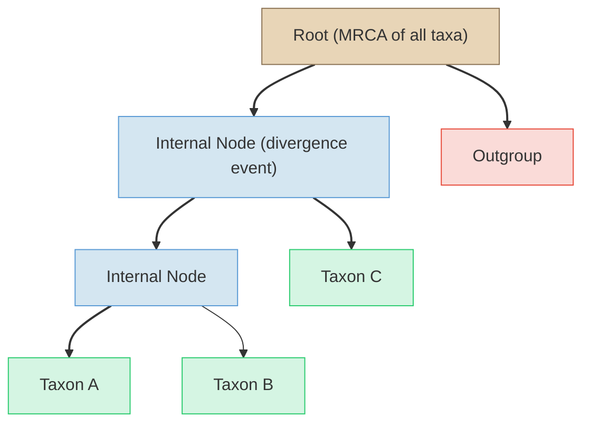
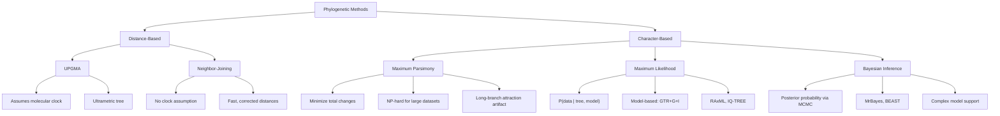
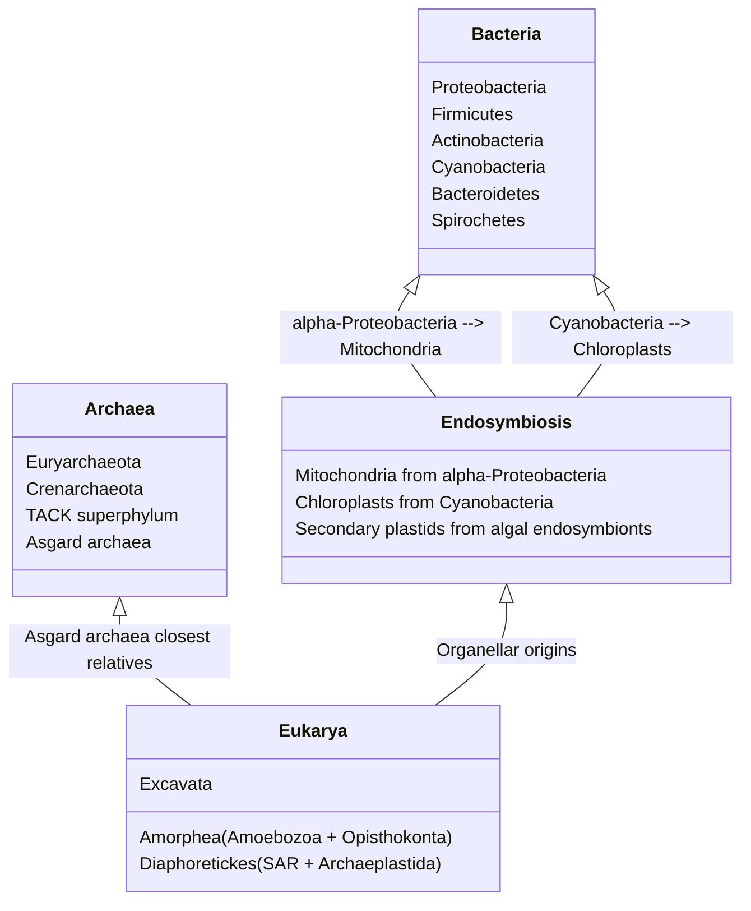

# Phylogenetics and the Tree of Life

\label{sec:unit_VI_phylogenetics}


<!-- chapter-metadata-badge -->
> **Ch 21** · Level 3/3 · 60 min read · 100 min lecture · Prerequisites: \cref{sec:unit_VI_genetic_drift_and_speciation}

## Learning Objectives

By the end of this chapter, you should be able to:

1. Explain what phylogenetics reveals about evolutionary relationships, ancestral states, divergence timing, and biogeographic origins.
2. Read and interpret phylogenetic trees, distinguishing between clades, paraphyletic groups, polyphyletic groups, and key character types (synapomorphy, symplesiomorphy, homoplasy).
3. Compare phylogenetic reconstruction methods: distance-based (UPGMA, Neighbor-Joining), maximum parsimony, maximum likelihood, and Bayesian inference.
4. Apply [**molecular clock**](#gl:molecular-clock) calculations to estimate divergence times and evaluate the assumptions and limitations of clock models.
5. Describe the three-domain tree of life, including endosymbiotic origins of [**organelle**](#gl:organelle)s and the significance of Asgard [**archaea**](#gl:archaea).
6. Outline human phylogeny, including fossil hominin diversity and archaic introgression events.
7. Calculate a Jukes-Cantor corrected distance from observed sequence divergence and estimate a divergence time, explaining why the correction is needed and why mitochondrial estimates differ from nuclear calibrations.
8. Explain how long-read sequencing (PacBio HiFi, Oxford Nanopore) resolves deep-divergence and polyploid phylogenies that short reads cannot, using the animal tree of life and ancient-DNA examples.
9. Evaluate a phylogenetic claim by identifying the dataset, model, and null hypothesis needed to distinguish shared ancestry from convergence and to assess sampling and calibration uncertainty.

<!-- curriculum-scaffold-start -->
### Study Blueprint

- **Big idea:** Phylogenies are evidence-based hypotheses about ancestry, not ladders of progress.
- **Core concepts:** homology, tree topology, parsimony, molecular clocks.
- **Framework alignment:** Vision & Change: Evolution, Systems; AP Biology: Evolution, Systems Interactions; NGSS-style topics: Natural Selection and Evolution, Interdependent Relationships in Ecosystems.
- **Model or quantitative lens:** Tree-distance, parsimony, and molecular-clock calculations.
- **Data skill:** Read trees correctly and map traits or sequences onto branches.
- **Practice cadence:** Visual Representations, Statistical Tests and Data Analysis, Argumentation.
- **Common misconception to repair:** Living species are cousins, not ancestors of one another.
- **Primary lab:** \cref{sec:lab_unit_VI_phylogenetics}.
- **Question bank:** \cref{sec:q_unit_VI_phylogenetics}.
- **Transfer task:** Transfer tree thinking to pathogens, conservation units, gene families, and development.
- **Bridge to computation:** `biology.genetics.genetics.jukes_cantor_distance`.
<!-- curriculum-scaffold-end -->

---

> **Opening Vignette — The Tree That Changed Everything**
> 
> In the 1970s, Carl Woese was alone in his University of Illinois laboratory, painstakingly sequencing ribosomal RNA by subjecting it to nuclease digestion and then separating fragments on two-dimensional electrophoresis gels — an agonisingly laborious technique that took months per organism. When he sequenced methanogens (thought to be unusual bacteria), the rRNA pattern was unlike any bacterium. It was unlike any [**eukaryote**](#gl:eukaryote) too. Woese concluded they formed a third domain of life — the Archaea. His 1977 *PNAS* paper was widely dismissed for nearly a decade: a microbiologist claiming to overturn a century of classification with RNA fingerprints? Yet the phylogenetic evidence was incontrovertible, and by the 1990s the three-domain tree had rearranged most of biology. The lesson: molecular sequence data can reveal evolutionary relationships invisible to morphology, and great paradigm shifts are often dismissed before they are accepted.

## What Phylogenetics Tells Us

**Phylogenetics** is the study of evolutionary relationships among organisms, inferred from heritable characters (DNA sequences, [**protein**](#gl:protein) sequences, morphological traits, behavioral traits). A phylogenetic analysis produces a tree (or network) that represents the historical pattern of descent from common ancestors.

Phylogenetics addresses four fundamental questions:

1. **Evolutionary relationships**: Which organisms are most closely related? This is the foundation of modern biological classification -- taxonomy based on shared ancestry rather than superficial similarity.
2. **Ancestral character states**: What did the ancestors look like? By mapping traits onto phylogenies, we can reconstruct the sequence in which characters evolved (e.g., when did flight originate in insects?).
3. **Timing of diversification**: When did lineages diverge? Molecular clocks calibrated with fossil data allow estimation of divergence dates even when the fossil record is incomplete.
4. **Biogeographic origins**: Where did lineages originate and how did they disperse? Phylogeography combines phylogenetics with geographic data to trace the spatial history of lineages.

### Applications Beyond Systematics

Phylogenetics has become indispensable across biology and medicine:

- **Drug discovery**: Phylogenetic analysis identifies which organisms are likely to produce useful bioactive compounds. If a species in one clade produces a valuable compound, closely related species in the same clade are promising candidates for novel variants.
- **Epidemiology**: Genomic phylogenetics tracks pathogen spread in real time (SARS-CoV-2, HIV, Ebola). Phylogenetic clustering reveals transmission chains, identifies superspreader events, and dates outbreak origins.
- **Conservation**: **Phylogenetic diversity (PD)** metrics identify lineages that represent the greatest amount of unique evolutionary history. Losing a phylogenetically isolated species (e.g., the tuatara, sole survivor of order Rhynchocephalia) eliminates more evolutionary history than losing one species from a large, diverse clade.

> **Concept Check 1:** Why might a conservation strategy based on phylogenetic diversity differ from one based simply on species counts? Give an example of a species with high phylogenetic distinctiveness.

### Phylogenetic Diversity and the EDGE Framework

**Phylogenetic diversity (PD)**, formalized by Daniel Faith (1992), is the **total branch length** of the phylogeny subtending a given set of species. A clade of 100 species that diverged 5 Ma has lower PD than a clade of 30 species spanning 200 Ma, because PD measures evolutionary history rather than species count alone. The **EDGE (Evolutionarily Distinct and Globally Endangered)** initiative of the Zoological Society of London uses PD-based metrics to prioritize conservation:

\begin{equation}
\text{EDGE score} = \log(1 + \text{ED}) + \text{GE} \cdot \log(2)
\label{eq:unit_VI_edge_score}
\end{equation}

where **ED** (evolutionary distinctness) is each species' share of the phylogeny it sits in, weighted by branch length, and **GE** (global endangerment) is the IUCN Red List category as a numerical score (Least Concern = 0, Critically Endangered = 4). Top EDGE species are both phylogenetically isolated and at high extinction risk — their loss would erase irreplaceable amounts of evolutionary history.

**EDGE flagship examples**:

- **Tuatara** (*Sphenodon punctatus*) — sole extant member of order Rhynchocephalia, sister group to most squamates (lizards and snakes). The tuatara's lineage diverged ~250 Ma, making it one of the most phylogenetically distinct vertebrates alive. Restricted to ~30 small islands off New Zealand.
- **Pygmy hippopotamus** (*Choeropsis liberiensis*) — sole survivor of one of two extant hippo lineages, with deep evolutionary history.
- **Aye-aye** (*Daubentonia madagascariensis*) — sole member of the family Daubentoniidae, an evolutionarily distinct lemur lineage on Madagascar.
- **Yangtze giant softshell turtle** (*Rafetus swinhoei*) — fewer than four known living individuals; an entire evolutionary line nearly extinct.

The EDGE approach contrasts sharply with species-count-based conservation. A reserve protecting 100 closely related warbler species preserves much less evolutionary history than a reserve protecting 30 phylogenetically diverse tetrapods — a counterintuitive but biologically meaningful prioritization rule.

---

## Tree Terminology and Reading Phylogenies


<!-- alt: Flowchart for tree terminology and reading phylogenies: root (MRCA of sampled taxa), internal node (divergence event), outgroup, and branch labels define how to read relatedness. -->

*Flowchart for tree terminology and reading phylogenies: root (MRCA of sampled taxa), internal node (divergence event), outgroup, and branch labels define how to read relatedness.*

**Key: A and B are sister taxa. The clade (A, B, C) is monophyletic. The outgroup roots the tree.**

### Fundamental Tree Components

**Root**: The node representing the most recent common ancestor (MRCA) of the sampled taxa in the tree. An **outgroup** -- a taxon known to be outside the group of interest (the ingroup) -- is used to determine the position of the root on an unrooted tree.

**Internal nodes**: Each internal node represents a divergence event -- a [**speciation**](#gl:speciation) event where an ancestral lineage split into two daughter lineages. Nodes are hypothetical ancestors; they are not observed directly but inferred from the data.

**Branches**: The lines connecting nodes. In a **cladogram**, branch lengths have no meaning (primarily topology matters). In a **phylogram**, branch lengths represent the amount of evolutionary change (e.g., substitutions per site). In a **chronogram** (ultrametric tree), branch lengths represent time.

**Tips (leaves)**: The terminal nodes, representing observed taxa -- either extant species or fossil specimens.

**Clade (monophyletic group)**: An ancestor and its descendant lineage. Clades are the preferred units in modern phylogenetic classification because they preserve common ancestry. The clade Mammalia includes the descendants of the MRCA of mammals -- bats, whales, humans, and monotremes alike.

**Sister groups**: Two clades that share an immediate common ancestor. In the diagram above, Taxon A and Taxon B are sister taxa; their clade is sister to Taxon C.

**Polytomy**: An unresolved node where three or more lineages diverge simultaneously. A "hard" polytomy reflects genuine simultaneous speciation (rare); a "soft" polytomy reflects insufficient data to resolve the branching order (common).

### Paraphyletic and Polyphyletic Groups

**Paraphyletic group**: An ancestor and SOME (but not most) of its descendants. The traditional "Reptilia" (turtles, lizards, snakes, crocodilians) is paraphyletic because it excludes birds, which are nested within the reptile clade. Modern systematics recognizes that crocodilians are more closely related to birds than to lizards -- a fact that the traditional grouping obscures.

**Polyphyletic group**: A group whose members do NOT share a most recent common ancestor exclusive to that group. "Warm-blooded animals" (birds + mammals) is polyphyletic because endothermy evolved independently in each lineage. Polyphyletic groups reflect convergent evolution, not shared ancestry.

### Character Types

**Synapomorphy**: A shared derived character that defines a clade. The amniotic egg is a synapomorphy of Amniota (reptiles, birds, and mammals). Synapomorphies are the characters most informative for identifying clades.

**Symplesiomorphy**: A shared ancestral character inherited from a deeper ancestor. The vertebral column is shared by most vertebrates but does not diagnose any particular clade within vertebrates -- it is a symplesiomorphy for any subgroup of vertebrates.

**Autapomorphy**: A unique derived character found in a single taxon. Feathers are an autapomorphy of Aves (or more precisely, of Maniraptora within the dinosaur phylogeny, though some non-avian maniraptorans also had feathers).

**Homoplasy**: A character state that appears similar in two or more taxa but was NOT inherited from their common ancestor. Homoplasy arises through **convergent evolution** (independent evolution of similar features -- e.g., wings in bats and birds) or **reversal** (return to an ancestral state). Homoplasy confounds phylogenetic analysis because it falsely suggests shared ancestry.

### Rooting Trees

An **unrooted tree** shows the relationships among taxa but does not indicate the direction of evolutionary time. To root a tree (and thereby determine which character states are ancestral versus derived), one of two approaches is used:

- **Outgroup rooting**: Include a taxon known to be outside the group of interest. The root is placed on the branch connecting the outgroup to the ingroup. This is the most common method. For example, when constructing a phylogeny of mammals, a reptile (e.g., a crocodilian) serves as the outgroup.
- **Midpoint rooting**: Place the root at the midpoint of the longest path between any two taxa. This assumes approximately equal rates of evolution across lineages -- an assumption that is often violated.

### Reading Trees Correctly

A critical skill is reading phylogenetic trees by **topology** (branching pattern) rather than by the visual arrangement of tips. Trees can be rotated around any internal node without changing the evolutionary relationships they depict. The common error of reading relationships from left to right along the tips (treating one end as "primitive" and the other as "advanced") is incorrect. Evolution does not proceed along a ladder from simple to complex; every living species is equally evolved — each has been evolving for the same amount of time since the last comprehensive common ancestor.

#### Common tree-thinking misconceptions

Decades of cognitive-science research on student tree-reading reveal a recurring set of errors. Recognizing these misconceptions is the foundation of phylogenetic literacy:

| Misconception | Correction |
|---------------|-----------|
| **Ladder thinking**: Trees show a progression from "primitive" tips on one side to "advanced" tips on the other. | Trees can be rotated around any node; tip order has no biological meaning. Every tip is equally distant from the root in time. |
| **Reading along the tips**: Adjacent tips are necessarily more closely related than non-adjacent tips. | Adjacency on the page does not imply evolutionary closeness. Look at the **branching topology** — count the nodes shared on the path back to the MRCA. |
| **"More evolved"**: Some tips ("higher" organisms) are more evolved than others. | Most living species have been evolving for the same time. There is no "scala naturae". A bacterium's lineage is as long as a human's. |
| **The root is the oldest extant species**: The root represents an existing ancestor whose features can be observed today. | The root is a hypothetical reconstructed ancestor, not a living species. Living species are at the tips, not the root. |
| **A polytomy means simultaneous origin**: Three branches emerging from a single node mean three lineages arose at the same instant. | Most polytomies are "soft" — they reflect insufficient data to resolve close branching events, not actual simultaneous origin. Hard polytomies (true simultaneous divergence) are rare. |
| **Branch length typically means time**: Most trees show time on a horizontal axis. | Primarily **chronograms** (ultrametric trees) show time. **Cladograms** show primarily topology. **Phylograms** show evolutionary change (substitutions). Typically check the scale bar. |
| **Convergent traits = relatedness**: Similar traits (wings in bats and birds, dorsal fins in dolphins and sharks) imply close relationship. | Convergent traits are **homoplasy** — they reflect similar selection pressures, not shared ancestry. Use synapomorphies, not overall similarity, to define clades. |
| **Cousins versus ancestors**: Living species can be ancestors of other living species. | Living species are sister taxa to each other, rarely ancestor–descendant. The MRCA of two living species is a hypothetical extinct ancestor, even if one species is "older" or "less changed." |

#### Tips for reading phylogenetic trees

1. **Identify the root** — it represents the most recent common ancestor of the sampled taxa shown. Check the scale bar and any axis labels.
2. **Trace lineages back to the MRCA** — don't read across tips horizontally. Find where two taxa share their nearest common ancestor by going **down** to the node where their lineages converge.
3. **Look at the branching pattern, not the layout** — the same topology can be displayed in many visually distinct ways (rectangular, slanted, radial, circular).
4. **Distinguish character types** — mapped traits should be inferred from synapomorphies (shared derived characters), not from overall similarity.
5. **Note the scale** — a chronogram with branch lengths in millions of years tells a different story from a phylogram with branch lengths in substitutions/site.

> **Concept Check 2:** Consider the traditional classification "Reptilia" that includes turtles, lizards, snakes, and crocodilians but excludes birds. Is this group monophyletic, paraphyletic, or polyphyletic? Explain your reasoning based on the phylogenetic position of birds relative to crocodilians.

---

## Phylogenetic Reconstruction Methods


<!-- alt: Flowchart for Phylogenetic Reconstruction Methods: Phylogenetic Methods, Distance-Based, Character-Based, and UPGMA form the diagram's primary path or branches. -->

*Flowchart for Phylogenetic Reconstruction Methods: Phylogenetic Methods, Distance-Based, Character-Based, and UPGMA form the diagram's primary path or branches.*

### Distance Methods

**UPGMA (Unweighted Pair Group Method with Arithmetic Mean)**: The simplest clustering algorithm. It assumes a strict molecular clock (equal rates of evolution across most lineages) and produces an ultrametric tree where most tips are equidistant from the root. UPGMA works by iteratively joining the two most similar sequences and recalculating distances.

**Limitation**: If the molecular clock assumption is violated (and it usually is), UPGMA produces incorrect topologies. It is not recommended for most phylogenetic analyses but remains useful for constructing guide trees in sequence alignment.

**Neighbor-Joining (NJ)**: Developed by \citet{saitou1987}, NJ does NOT assume a molecular clock. It works by star decomposition: starting with an unresolved star tree, it iteratively identifies the pair of taxa whose joining minimizes the total branch length. NJ is fast ($O(n^3)$ time complexity), produces additive trees with unequal branch lengths, and provides a good starting tree for more sophisticated analyses. It is appropriate for large datasets where ML or Bayesian methods would be computationally prohibitive.

### Worked Example: One UPGMA Clustering Step from a Distance Matrix

**Problem:**
Four taxa (A, B, C, D) have the symmetric pairwise distance matrix below (substitutions/site). Perform the first UPGMA clustering step: identify the closest pair, place their common node, and recompute the reduced distance matrix.

| | A | B | C | D |
|---|---|---|---|---|
| **A** | — | 0.10 | 0.40 | 0.42 |
| **B** | 0.10 | — | 0.38 | 0.40 |
| **C** | 0.40 | 0.38 | — | 0.12 |
| **D** | 0.42 | 0.40 | 0.12 | — |

**Solution:**

1. **Identify the smallest off-diagonal distance.** Scanning the matrix, the minimum is $d_{AB} = 0.10$ substitutions/site. Join A and B into cluster $(AB)$.

2. **Place the internal node.** UPGMA builds an ultrametric tree, so the node $U$ joining A and B sits at half the pair distance; the branch length from each of A and B up to $U$ is

   \begin{equation}
   h_U = \frac{d_{AB}}{2} = \frac{0.10}{2} = 0.05 \text{ substitutions/site}
   \label{eq:phylogenetics_8}
   \end{equation}

3. **Recompute distances from the new cluster** as the size-weighted arithmetic mean over member pairs (here $|A| = |B| = 1$):

   \begin{equation}
   d_{(AB),C} = \frac{d_{AC} + d_{BC}}{2} = \frac{0.40 + 0.38}{2} = 0.39, \qquad
   d_{(AB),D} = \frac{d_{AD} + d_{BD}}{2} = \frac{0.42 + 0.40}{2} = 0.41
   \label{eq:phylogenetics_9}
   \end{equation}

   The distance $d_{CD} = 0.12$ is unchanged.

**Interpretation:** A and B cluster first at node height 0.05 substitutions/site; in the reduced matrix the smallest remaining distance is $d_{CD} = 0.12$, so the next step joins C and D, yielding the tree $((A,B),(C,D))$ — exactly what an equal-rate (clock-like) dataset should produce.

### Maximum Parsimony

**Maximum parsimony** selects the tree (or trees) requiring the fewest total character-state changes. This is an application of Occam's razor -- the simplest explanation is preferred.

**Procedure**: For each possible tree topology, map character changes onto branches to find the minimum number of steps. The tree requiring the fewest total steps across most characters is the most parsimonious.

**Strengths**: Intuitive; does not require an explicit model of evolution; works well when evolutionary rates are low and homoplasy is rare.

**Limitations**:
- **Computationally NP-hard**: The number of possible tree topologies grows super-exponentially with the number of taxa. For $n$ taxa, the number of unrooted bifurcating trees is $(2n-5)!! = (2n-5)(2n-7)(2n-9)\cdots(3)(1)$. For 10 taxa: 2,027,025 trees. For 20 taxa: $> 10^{21}$ trees. Heuristic search algorithms are required.
- **Long-branch attraction (LBA)**: When two distantly related lineages evolve rapidly, they accumulate homoplasies (convergent substitutions) that parsimony interprets as synapomorphies, incorrectly grouping them together. LBA is a systematic error -- adding more data makes it worse, not better.

### Worked Example: Computing a Parsimony Score for a Small Character Matrix

**Problem:**
Four taxa (A, B, C, D) are scored for four binary morphological characters (state 0 or 1). Using the fixed rooted tree $((A,B),(C,D))$, compute the total parsimony score (minimum number of character-state changes).

| Taxon | Char 1 | Char 2 | Char 3 | Char 4 |
|-------|--------|--------|--------|--------|
| **A** | 0 | 0 | 1 | 0 |
| **B** | 0 | 1 | 1 | 0 |
| **C** | 1 | 1 | 0 | 1 |
| **D** | 1 | 1 | 0 | 1 |

**Solution:**

Apply the Fitch bottom-up algorithm to each character independently. At each internal node take the intersection of its two children's state sets; if the intersection is empty, take the union and add one step. Internal nodes: $X$ = ancestor of $(A,B)$, $Y$ = ancestor of $(C,D)$, $R$ = root.

1. **Char 1** ($A{=}0, B{=}0, C{=}1, D{=}1$): $X = \{0\}\cap\{0\}=\{0\}$ (0 steps); $Y = \{1\}\cap\{1\}=\{1\}$ (0 steps); $R = \{0\}\cap\{1\}=\varnothing \Rightarrow \{0,1\}$ (**1 step**). Subtotal = 1.

2. **Char 2** ($A{=}0, B{=}1, C{=}1, D{=}1$): $X = \{0\}\cap\{1\}=\varnothing \Rightarrow \{0,1\}$ (**1 step**); $Y = \{1\}\cap\{1\}=\{1\}$ (0 steps); $R = \{0,1\}\cap\{1\}=\{1\}$ (0 steps). Subtotal = 1.

3. **Char 3** ($A{=}1, B{=}1, C{=}0, D{=}0$): $X=\{1\}$ (0 steps); $Y=\{0\}$ (0 steps); $R=\{1\}\cap\{0\}=\varnothing\Rightarrow\{0,1\}$ (**1 step**). Subtotal = 1.

4. **Char 4** ($A{=}0, B{=}1, C{=}1, D{=}1$): same pattern as Char 2 → **1 step**. Subtotal = 1.

5. **Total parsimony score:**

   \begin{equation}
   S = 1 + 1 + 1 + 1 = 4 \text{ steps}
   \label{eq:phylogenetics_10}
   \end{equation}

**Interpretation:** The tree $((A,B),(C,D))$ requires 4 changes; the two alternative unrooted topologies $((A,C),(B,D))$ and $((A,D),(B,C))$ each require 7, so $((A,B),(C,D))$ is the most-parsimonious tree — Characters 1 and 3 are the parsimony-informative synapomorphies that group $(A,B)$ apart from $(C,D)$.

> **Concept Check (Analysis — Parsimony vs. Maximum Likelihood on a Conflicted Alignment):** Consider a four-taxon alignment with three parsimony-informative sites. **Site 1** supports topology $T_A = ((W,X),(Y,Z))$ — that is, $W$ and $X$ share a derived state, and $Y$ and $Z$ share a different derived state. **Sites 2 and 3** support topology $T_B = ((W,Y),(X,Z))$. (a) Calculate the **parsimony score** for $T_A$ and $T_B$ on this alignment and identify which topology parsimony prefers. (b) Now suppose lineages $W$ and $Y$ have evolved on **very long branches** with elevated substitution rates relative to $X$ and $Z$, while sites 2 and 3 reside in fast-evolving regions and site 1 in a slow-evolving region. Explain how a substitution model that accounts for **rate heterogeneity across sites** (e.g., GTR+Γ) and **branch-length heterogeneity** could lead maximum likelihood to prefer $T_A$ — the **opposite** of the parsimony preference. (c) Define **long-branch attraction (LBA)** in terms of this example and explain why adding more data makes parsimony *worse* under LBA conditions (a statistical inconsistency) while making likelihood more reliable. (d) Propose two diagnostic tests one could run on a real alignment to detect that LBA is biasing parsimony.

### Maximum Likelihood (ML)

Maximum likelihood selects the tree that maximizes the probability of the observed data given the tree topology, branch lengths, and an explicit model of sequence evolution:

\begin{equation}
L(\text{tree}, \theta) = \prod_{i=1}^{L} P(\text{site}_i \mid \text{tree}, \theta)
\label{eq:phylogenetics_1}
\end{equation}

where $L$ is the alignment length and θ represents the parameters of the substitution model.

**Substitution models** describe the probability of one [**nucleotide**](#gl:nucleotide) changing to another over a given evolutionary time:

| Model | Description | Parameters |
| ----- | ----------- | ---------- |
| **JC69** (Jukes-Cantor, 1969) | Most substitutions equally likely; equal base frequencies | 0 free parameters |
| **K2P** (Kimura 2-parameter, 1980) | Transitions $\neq$ transversions; equal base frequencies | 1 (Ti/Tv ratio) |
| **HKY85** (Hasegawa-Kishino-Yano) | Ti $\neq$ Tv + unequal base frequencies | 4 |
| **GTR** (General Time Reversible) | Most 6 substitution types have independent rates + unequal base frequencies | 9 |
| **GTR+Γ+I** | GTR + gamma-distributed rate variation across sites + proportion of invariant sites | 11 |

**Model selection** uses information criteria: **AIC** $= 2k - 2\ln L$ (where $k$ = number of parameters) or **BIC** $= k\ln n - 2\ln L$ (where $n$ = sample size). The model with the lowest AIC or BIC provides the best balance of fit and complexity. Tools: ModelFinder (implemented in IQ-TREE), jModelTest2.

**Software**: RAxML (Randomized Axelerated Maximum Likelihood), IQ-TREE (fast ML with ultrafast bootstrap UFBoot2), FastTree (approximate ML for very large alignments).

### Bayesian Inference

Bayesian phylogenetics uses Bayes' theorem to estimate the posterior probability of trees:

\begin{equation}
P(\text{tree} \mid \text{data}) = \frac{P(\text{data} \mid \text{tree}) \cdot P(\text{tree})}{P(\text{data})}
\label{eq:phylogenetics_2}
\end{equation}

Since $P(\text{data})$ -- the marginal likelihood -- is computationally intractable (it requires summing over most possible trees), Bayesian inference uses **Markov Chain Monte Carlo (MCMC)** to sample trees from the posterior distribution. The Metropolis-Hastings algorithm proposes modifications to the current tree, accepts changes that improve the likelihood, and occasionally accepts changes that decrease it (allowing escape from local optima).

**Output**: A set of posterior trees summarized as a majority-rule consensus tree. Each node receives a **posterior probability (PP)** -- the proportion of sampled trees containing that node. PP $\geq 0.95$ is considered statistically significant support.

**Software**: MrBayes (standard Bayesian phylogenetics), BEAST/BEAST2 (specialized for time-calibrated chronograms, molecular clock models, and phylogeography).

#### Bayesian phylogenetics in practice

A typical Bayesian phylogenetic workflow consists of the following steps. **(1) Specify priors**: a tree prior (often a Yule pure-birth or birth–death process for species trees, or a coalescent prior for population-genetic data), a clock-rate prior (e.g., a lognormal distribution centered at a calibrated rate), and substitution-model parameter priors. **(2) Run two or more independent MCMC chains** for $10^7$–$10^9$ generations, sampling the tree topology, branch lengths, and model parameters at intervals (typically every 1,000 generations). **(3) Diagnose convergence**: discard the first 10–25% of samples as "burn-in", then verify that independent chains have reached the same stationary distribution by inspecting Effective Sample Size (ESS > 200 for most parameters), Potential Scale Reduction Factor (PSRF ≈ 1.0), and visual trace plots in Tracer. **(4) Summarize**: produce a maximum clade credibility (MCC) tree, with each node labeled by its posterior probability and (for chronograms) its 95% highest posterior density (HPD) age interval.

**Comparison with bootstrap support.** A widely cited rule of thumb is that **posterior probability ≥ 0.95 is approximately equivalent to bootstrap support ≥ 70%**, but the two measures are not interchangeable. Posterior probabilities tend to be higher than bootstrap values for the same node — sometimes considerably so when the substitution model is misspecified. The interpretation differs as well: a 95% posterior probability means "given the model and data, there is a 95% probability that this clade is correct"; a 70% bootstrap value means "70% of pseudoreplicate datasets recover this clade". Modern best practice is to report both measures, and to treat single nodes with PP < 0.95 or bootstrap < 70 as **unresolved**.

#### Strict clock vs. relaxed clock: when to use each

Bayesian phylogenetic dating uses one of two molecular-clock frameworks. A **strict clock** assumes a single substitution rate across the entire tree; this is appropriate for **closely related taxa** (within-species or recent congeners), where the assumption is testable and often defensible — e.g., dating SARS-CoV-2 lineages within a single pandemic, or dating Native American mtDNA lineages relative to the Bering Strait crossing. A **relaxed clock** allows substitution rates to vary across branches, drawn from a prior distribution (uncorrelated lognormal, exponential, or autocorrelated random walk). Relaxed clocks are appropriate for **divergent taxa with rate heterogeneity** — for example, mammalian phylogenies where rodents evolve 5–10× faster than cetaceans, or insect phylogenies where holometabolous lineages have generation-time-correlated rate shifts. The choice of clock is **testable**: a likelihood-ratio test or Bayes-factor comparison between strict and relaxed clock models, evaluated under the same data and tree prior, indicates which is supported. In practice, modern phylogeneticists routinely default to relaxed clocks and primarily revert to strict clocks when relaxed-clock parameter estimates indicate near-uniform rates.

### Bootstrap Analysis

**Non-parametric bootstrap** \citep{felsenstein1985} assesses branch support by resampling:

1. Create pseudoreplicates by randomly sampling alignment columns with replacement (same length as original alignment).
2. Reconstruct a tree from each pseudoreplicate (typically 100--1,000 replicates).
3. The **bootstrap value** for each branch is the percentage of pseudoreplicate trees containing that branch.

**Interpretation**: Bootstrap $\geq 70$% is generally considered moderate to strong support. Bootstrap values are conservative estimates -- a true clade may receive bootstrap support below 70% if the supporting signal is concentrated in a few alignment positions that are not always sampled.

**Bootstrap vs. Bayesian PP**: Bayesian posterior probabilities tend to be higher than bootstrap values for the same node. A common rule of thumb treats bootstrap support of at least 70% and posterior probability of at least 0.95 as broadly comparable thresholds, not interchangeable measures. However, PP can be inflated by model misspecification — when the substitution model fails to capture features of the data, posterior probabilities become falsely confident. **Both metrics should be reported** for each node, and discordance (high PP, low bootstrap, or vice versa) is itself diagnostic of either signal heterogeneity or model violation. Modern best practice typically reports nodes as well-supported primarily when **both** bootstrap $\geq 70\%$ **and** PP $\geq 0.95$ are achieved.

**MCMC convergence diagnostics**: A Bayesian phylogeny depends strongly on the convergence of the MCMC chains that produced it; high posterior probabilities are misleading when chains have not mixed across tree space. Standard diagnostics include:

1. **Effective sample size (ESS)**: For each parameter (tree length, individual branch lengths, model parameters), the number of independent samples after autocorrelation correction. ESS values $\geq 200$ are typically required for confident inference.
2. **Multiple independent runs**: The same analysis run from different random starting points should converge to indistinguishable posterior distributions. Discrepancies signal that the chains are stuck in local optima.
3. **Trace plots**: Visual inspection of parameter values across MCMC iterations should show a stationary "fuzzy caterpillar" pattern, not directional trends or sticking at single values.
4. **Burn-in removal**: The first 10–25% of MCMC iterations are typically discarded as the chain finds the high-posterior region of parameter space.

Tools like **Tracer** (BEAST suite) automate these checks, and submitting trees without convergence verification is now considered methodologically inadequate in published phylogenomics.

### Gene Tree versus Species Tree Discordance

A central insight of modern phylogenomics is that **gene trees frequently disagree with species trees**, even when the underlying biological process is straightforward speciation. The two main biological causes:

#### Incomplete lineage sorting (ILS)

When two speciation events occur in rapid succession, ancestral polymorphism may not have time to sort completely between the daughter lineages. Some loci will retain the ancestral relationship while others will track the species tree — producing a mosaic of gene trees that disagree with each other and with the true species history. ILS is most severe when:

- **Effective population size of the ancestor is large** ($4N_e$ ~ time between speciations)
- **Speciation events are temporally close** (the "anomaly zone" of phylogenetics)
- **Recombination is high** so that adjacent loci have independent histories

The classic case is the human–chimpanzee–gorilla trichotomy: ~30% of human nuclear loci show **gene trees grouping human with gorilla, or chimp with gorilla**, rather than the species-tree topology of (human, chimp) sister to gorilla. The discordance reflects ILS during the rapid succession of human–chimp–gorilla speciation events ~6–8 Ma.

**Coalescent-based methods** (ASTRAL, MP-EST, *BEAST) explicitly model gene-tree discordance under the multi-species coalescent and infer the **species tree** as the topology that maximizes likelihood across many gene trees. Concatenation methods (which simply combine most loci into one alignment) can be **statistically inconsistent** under high ILS — they sometimes converge to the wrong tree as more data are added.

#### Horizontal gene transfer (HGT)

In prokaryotes, gene-tree discordance often reflects **horizontal acquisition** rather than incomplete sorting. A gene tree that places a thermophilic bacterium within the archaea may indicate that the bacterium acquired the gene from an archaeal source through HGT, rather than the species tree placing it incorrectly. Detecting HGT requires:

1. **Phylogenetic incongruence**: gene tree topology contradicts the consensus species tree.
2. **Atypical sequence features**: GC content, codon usage bias, or dinucleotide signature differing from the host genome.
3. **Patchy phylogenetic distribution**: gene present in distantly related organisms while absent from close relatives.

Tools like **DistAL** and reconciliation methods (Notung, Ranger-DTL) systematically identify HGT events by comparing gene trees with reference species trees.

> **Real-World Connection: COVID-19 Phylogenetics**
>
> The SARS-CoV-2 pandemic demonstrated the power of real-time phylogenetics. Within weeks of the first [**genome**](#gl:genome) sequence being shared (January 2020), phylogenetic analysis confirmed the virus's origin in the betacoronavirus clade related to bat coronaviruses. Platforms like Nextstrain (nextstrain.org) provided continuously updated phylogenetic trees from millions of viral genomes deposited in GISAID. Bayesian time-calibrated analyses (BEAST) dated the most recent common ancestor to approximately November 2019. Phylogenetic tracking identified the emergence and global spread of Variants of Concern (Alpha, Delta, Omicron), revealing that each arose from a single geographic origin and spread globally through human travel. Genomic epidemiology became a standard public health tool, guiding variant surveillance, [**vaccine**](#gl:vaccine) updating, and travel policy. The pandemic validated decades of investment in phylogenetic methodology and demonstrated that evolutionary biology has direct, immediate public health applications.

### Worked Example: Molecular Clock Calibration — Cytochrome b in Mammals

**Problem:** Two mammalian taxa differ at 8 % of cytochrome *b* nucleotide positions ($p = 0.08$). Mammalian cytochrome *b* evolves at a rate of approximately **2 % sequence divergence per million years** (lineage-summed; equivalently ~ 1 % per lineage per Myr). Estimate the divergence time between the two taxa, and discuss principal uncertainty sources.

**Solution:**

1. **Naive estimate (uncorrected p-distance).** If sequences accumulate substitutions linearly with time at 2 % per Myr:

   $$ t \approx \frac{p}{\text{rate}} = \frac{0.08}{0.02 \text{ per Myr}} = 4 \text{ Mya} \label{eq:phylogenetics_worked_clock_1} $$

2. **Jukes-Cantor-corrected distance.** Multiple substitutions at the same site cause saturation; the JC correction is:

   $$ d_{JC} = -\tfrac{3}{4} \ln\left(1 - \tfrac{4}{3} p\right) = -\tfrac{3}{4} \ln\left(1 - 0.1067\right) = -\tfrac{3}{4} \ln(0.8933) \approx 0.0846 \label{eq:phylogenetics_worked_clock_2} $$

   Using the corrected distance and the lineage-summed rate ($k = 0.02$ per Myr):

   $$ t = \frac{d_{JC}}{k} \approx \frac{0.0846}{0.02} = 4.23 \text{ Mya} \label{eq:phylogenetics_worked_clock_3} $$

   The correction is small at $p = 0.08$ (still well below saturation) but grows nonlinearly as $p$ approaches the JC asymptote of 0.75.

3. **Uncertainty sources to quantify.** A defensible reported estimate would be **~4 ± 1 Mya**, with the uncertainty driven by:
   - **Rate heterogeneity across lineages.** The 2 %-per-Myr rate is an average; cytochrome *b* in rodents evolves 2–5× faster than in cetaceans. A **relaxed clock** (uncorrelated lognormal or autocorrelated rate prior) properly propagates this rate variance and typically widens the 95 % HPD by 30–60 %.
   - **Fossil calibration error.** The 2 %-per-Myr rate is itself calibrated against fossil divergence dates with their own uncertainty (typically ±10–20 % on the calibrating node). Compounding error.
   - **Incomplete lineage sorting (ILS).** Gene trees may not match the species tree; a single locus (cyt *b*) over a short coalescent time can give a TMRCA that predates the species divergence by 0.5–2× the ancestral $N_e$ generations. For mammalian $N_e \sim 10^5$ and generation time ~ 2 yr, this is up to ~ 200 kyr of additional uncertainty.
   - **Strict-clock assumption.** If a strict clock is forced where rates are heterogeneous, the point estimate is biased toward the average — but lineages with elevated rates appear systematically older than they are.

4. **Bayesian relaxed-clock alternative.** BEAST2 with an uncorrelated-lognormal relaxed clock, a fossil-calibrated tree prior, and a substitution model selected via Bayes factors typically gives a 95 % HPD interval roughly twice as wide as the naive JC point estimate above. For this problem, a Bayesian relaxed-clock analysis would likely report a posterior median of ~ 4 Mya with 95 % HPD ~ [2.5, 5.8] Mya. The strict clock would report a tighter but potentially overconfident interval.

**Interpretation.** Molecular-clock dating gives a quantitative null model against which fossil constraints, biogeographic events, and other lines of evidence are integrated. The naive point estimate (4 Mya) is a useful first-order anchor; honest reporting requires the relaxed-clock interval plus an explicit accounting of ILS for sub-population-genetic-time divergences.

> **Concept Check 3:** Why is long-branch attraction a problem specifically for maximum parsimony but less so for maximum likelihood? (Hint: consider whether each method uses an explicit model of substitution rates.)

> **Concept Check (Synthesis — Phylogenomic Conflict in a Songbird Radiation):** A phylogenomic study of a recent songbird radiation (5 species, divergence times 1–4 Mya) reconstructs both the **nuclear consensus tree** (concatenated 5,000 conserved nuclear loci) and the **mitochondrial tree** (whole mtDNA). The two trees agree at 60 % of nodes but **disagree at 40 % of nodes** — including the basal split of the radiation. (a) Propose **three biological mechanisms** that could generate this nuclear–mitochondrial discordance: incomplete lineage sorting (ILS), ancestral hybridisation and introgression (including mitochondrial capture, where an entire mtDNA lineage is replaced by introgression), and sex-biased dispersal causing differential effective population sizes for nuclear vs. mitochondrial loci. (b) Identify **one technical artefact** that could mimic biological discordance — for example, base-compositional non-stationarity (some lineages drifted to AT-rich mtDNA, attracting unrelated AT-rich lineages under poorly-fitting substitution models). (c) **Design a test that distinguishes ILS from hybridisation** at one specific node using the ABBA–BABA D-statistic: given four populations $((P_1, P_2), P_3, O)$ where $O$ is an outgroup, ILS produces equal frequencies of ABBA and BABA site patterns (D ≈ 0), while introgression from $P_3$ into either $P_1$ or $P_2$ produces an excess of one pattern (D ≠ 0). Specify how to compute D from genome-wide SNP data, what null distribution to use, and what sample size of SNPs is needed for statistical power. (d) If the D-statistic test returns $D = 0.08$ with $|Z| = 6$ — strongly significant — synthesise what this finding means for the species-tree reconstruction: which population received introgression, and how should this be communicated in the published phylogeny?

---

## Molecular Clocks

### The Molecular Clock Hypothesis

\citet{zuckerkandl1965} observed that the number of amino acid differences between homologous proteins from different species is roughly proportional to the time since those species diverged. This **molecular clock** hypothesis -- that neutral substitutions accumulate at an approximately constant rate -- allows divergence times to be estimated from sequence data.

The theoretical basis comes from Kimura's [**neutral theory**](#gl:neutral-theory) (1968): the rate of neutral substitution equals the neutral [**mutation**](#gl:mutation) rate, μ, regardless of population size. For strictly neutral mutations:

\begin{equation}
k = \mu
\label{eq:phylogenetics_3}
\end{equation}

where $k$ is the substitution rate per site per generation.

### Clock Calculations

**Jukes-Cantor correction**: Observed sequence divergence underestimates true divergence because of multiple substitutions at the same site (saturation). The JC69 correction accounts for this:

\begin{equation}
d_{JC} = -\frac{3}{4} \ln\left(1 - \frac{4}{3}p\right)
\label{eq:phylogenetics_4}
\end{equation}

where $p$ is the observed proportion of differing sites.

**Divergence time estimation**:

\begin{equation}
t = \frac{d_{JC}}{2\mu}
\label{eq:phylogenetics_5}
\end{equation}

The factor of 2 accounts for substitutions accumulating independently in both lineages since their divergence from a common ancestor.

### Worked Example: Estimating Divergence Time using Jukes-Cantor

**Problem:**
Human and chimpanzee mitochondrial *cytochrome b* sequences differ by approximately 1.5% ($p = 0.015$). Assume a mitochondrial substitution rate of $\mu \approx 2 \times 10^{-8}$ substitutions per site per year. 
1. Calculate the Jukes-Cantor distance ($d_{JC}$).
2. Estimate the divergence time ($t$) between the two lineages.

**Solution:**

1. **Calculate the Jukes-Cantor distance:**
   Using the Jukes-Cantor correction formula to account for multiple substitutions at the same site:
   \begin{equation}
   d_{JC} = -\frac{3}{4} \ln\left(1 - \frac{4}{3}(0.015)\right) \approx 0.01511 \text{ substitutions/site}
   \label{eq:phylogenetics_6}
   \end{equation}

2. **Estimate the divergence time:**
   Apply the divergence time estimation formula, remembering the factor of 2 (since mutations accumulate along both lineages branching from the MRCA):
   \begin{equation}
   t = \frac{d_{JC}}{2\mu} = \frac{0.01511}{2 \times 2 \times 10^{-8}} \approx 3.78 \times 10^5 \text{ years}
   \label{eq:phylogenetics_7}
   \end{equation}

*Note:* This estimate of about 378,000 years for mtDNA is much lower than the accepted species divergence time of about 6--7 Mya. This occurs because mitochondrial [**gene**](#gl:gene)s evolve significantly faster than the genome-wide average, and substituting a long-term nuclear calibration rate yields an artificially recent divergence for rapidly evolving loci.

### Rate Calibration

Molecular clocks must be calibrated against independent time estimates:

- **Fossil record**: Fossils provide **minimum age constraints** -- a fossil establishes that a lineage existed by that time, but the actual divergence must be older. The oldest known fossil of a clade provides a minimum bound on the clade's age.
- **Biogeographic events**: The formation of the Isthmus of Panama (about 3 Mya), the separation of Australia from Antarctica (about 45 Mya), or the formation of volcanic islands (known radiometric ages) provide calibration points.

### Strict vs. Relaxed Clocks

**Strict molecular clock**: Assumes a constant substitution rate across most lineages. This assumption is often violated because substitution rates vary with generation time (shorter-generation organisms evolve faster per unit time), metabolic rate, DNA repair efficiency, and population size (through the interplay of drift and selection).

**Relaxed molecular clock**: Allows the rate to vary among lineages while still estimating divergence times. Two main approaches:
- **Autocorrelated rates**: Closely related lineages have similar rates (rates evolve gradually along the tree). Implemented in BEAST.
- **Uncorrelated rates**: Each branch draws its rate independently from a statistical distribution (e.g., lognormal). Implemented in BEAST2.

### Limitations

- **Rate heterogeneity**: Substitution rates can vary dramatically among lineages. Rodents evolve approximately 5--10 times faster than cetaceans at synonymous sites.
- **Generation time effect**: Species with shorter generation times accumulate more mutations per unit time because there are more DNA replication events per year.
- **Saturation**: At very large divergence times, multiple substitutions at the same site erase the phylogenetic signal. Slowly evolving genes (18S rRNA, about 1--2 $\times 10^{-9}$ substitutions per site per year) are needed for deep divergences.

### Tip Dating and Bayesian Skyline Plots

Modern molecular clock analyses go beyond simple point estimates of divergence times:

- **Tip dating**: When sequences are sampled at different calendar dates (e.g., viral genomes collected over the course of an epidemic), the sampling dates themselves provide calibration points. BEAST software uses tip dates to estimate substitution rates directly from serially sampled data — no fossil calibration needed. This approach was critical for dating the SARS-CoV-2 origin, HIV emergence, and influenza evolution.
- **Bayesian Skyline Plots**: These reconstruct changes in effective population size ($N_e$) through time from a single population sample. By analyzing the distribution of coalescence times in a gene genealogy, skyline plots reveal historical population expansions, bottlenecks, and declines. Applied to human mtDNA, skyline analyses confirm the Out-of-Africa expansion approximately 60–70 kya.

### A timeline of major events in life's phylogeny

Phylogenetic methods, when calibrated against the geological record, reconstruct a deep-time timeline of life on Earth. The major events span four billion years:

| Era | Approximate date | Event |
|-----|------------------|-------|
| Hadean–Eoarchean | ~4.5–4.0 Ga | Earth forms (~4.54 Ga); oceans condense (~4.4 Ga); abiogenesis events (debated dates) |
| Eoarchean | ~3.8–3.5 Ga | Earliest evidence of life (graphite isotope signatures from Greenland; stromatolites in Australia) |
| LUCA | ~3.8 Ga | Last Comprehensive Common Ancestor — root of the tree of life. Inferred from comprehensive molecular machinery (rRNA, ribosomal proteins, ATP synthase, key tRNAs). LUCA was likely an anaerobic, hyperthermophilic prokaryote dependent on H₂/CO₂ chemistry near hydrothermal vents. |
| Mesoarchean–Paleoproterozoic | ~3.0–2.4 Ga | Cyanobacteria evolve oxygenic photosynthesis; **Great Oxidation Event** (~2.4 Ga) transforms atmosphere from anoxic to oxic |
| Paleoproterozoic | ~2.0 Ga | LECA (Last Eukaryotic Common Ancestor) — already possessed a nucleus, mitochondria (from α-proteobacterial endosymbiont), endomembrane system, cytoskeleton, and meiotic sexual reproduction. The mitochondrial endosymbiosis is dated to ~2.0–1.5 Ga. |
| Mesoproterozoic | ~1.6–1.0 Ga | Plastid endosymbiosis (cyanobacterium → primary plastid in archaeplastid ancestor); diversification of eukaryotic supergroups |
| Neoproterozoic | ~1.0 Ga – 540 Ma | Snowball Earth events; first multicellular eukaryotes; **Ediacaran biota** (~575–540 Ma) — soft-bodied multicellular organisms, mostly enigmatic in affinity |
| Cambrian | ~540–485 Ma | **Cambrian explosion**: most modern animal phyla appear in the fossil record within ~25 million years. Evolution of mineralized skeletons, predator-prey ecosystems, complex sensory systems |
| Ordovician | ~485–445 Ma | Diversification of marine invertebrates; first land plants (bryophytes); **end-Ordovician extinction** (~445 Ma): ~85% of marine species lost |
| Silurian–Devonian | ~445–360 Ma | Vascular plants colonize land; jawed fish (Gnathostomata) diversify; **first tetrapods** (~375 Ma; *Tiktaalik*); **late Devonian extinction** |
| Carboniferous | ~360–299 Ma | Coal-forest ecosystems; first amniotes (reptilian-line ancestors); insects undergo first major radiation |
| Permian | ~299–252 Ma | Synapsids (mammal ancestors) dominate; **end-Permian extinction (Great Dying, ~252 Ma)**: ~96% of marine species lost — the largest extinction event in life's history |
| Triassic–Jurassic | ~252–145 Ma | Dinosaurs diversify; first mammals (~225 Ma) and first birds (Late Jurassic); **end-Triassic extinction** (~201 Ma) |
| Cretaceous | ~145–66 Ma | Flowering plants (angiosperms) emerge and diversify; mammals remain small but radiate quietly; **K-Pg extinction** (~66 Ma): asteroid impact + Deccan Traps volcanism eliminate non-avian dinosaurs |
| Cenozoic | ~66 Ma – present | Mammalian and bird radiations fill ecological niches; primates evolve; *Homo sapiens* appears (~300 ka); **Holocene/Anthropocene extinction** ongoing |

The central insight from this timeline: life persists across cataclysms but is reshuffled. The five mass extinctions did not erase the tree of life but pruned it dramatically — and **post-extinction radiations** repeatedly produce explosive diversification as surviving lineages occupy emptied ecological space (mammals after the K-Pg, modern teleost fish after the Permian, etc.).

### Ancestral Sequence Reconstruction (ASR)

One of the most striking applications of phylogenetic methods is **ancestral sequence reconstruction** — inferring the DNA or protein sequences of extinct ancestors from their living descendants. Given a tree and a substitution model, ASR uses **maximum likelihood** or **Bayesian** methods to estimate the most probable ancestral state at each internal node and at each site.

#### How ASR works

For each site in a multiple sequence alignment, ASR computes:

$$P(\text{ancestor} = X \mid \text{tip data, tree, model}) \label{eq:unit_VI_phylogenetics_item_1}$$


using the **Felsenstein pruning algorithm** (which efficiently sums over most possible ancestral states at internal nodes). Marginal reconstructions estimate the most probable state at each node independently; joint reconstructions estimate the most probable combined ancestral states across the whole tree. Confidence is reported as the posterior probability for each reconstructed residue — high-confidence sites have a single dominant residue (>95% probability), while low-confidence sites have several plausible alternatives.

#### "Lazarus proteins": resurrecting extinct enzymes

Once an ancestral sequence is reconstructed, it can be **synthesized** as a real protein in the laboratory — a "Lazarus protein" brought back from extinction. This approach has revolutionized our understanding of how protein function evolves:

- **Ancestral steroid receptors** (Joe Thornton's lab, since the early 2000s): The mineralocorticoid and glucocorticoid receptors split ~450 Mya. Resurrection of the ancestral receptor showed it was a glucocorticoid-like receptor; specificity for cortisol versus aldosterone evolved later through a small number of historical substitutions. The reconstruction made testable predictions about which substitutions enabled the functional shift — confirmed experimentally by mutagenesis on the modern proteins.
- **Ancestral elongation factors** (Akanuma et al. 2013, Gaucher et al. 2008): Ancestral bacterial EF-Tu proteins reconstructed from extant sequences proved highly thermostable, with melting temperatures of 60–73°C. The thermostability profile across nodes traces planetary cooling — providing **biological thermometers** that measure the temperature history of Earth.
- **Ancestral β-lactamases**: Reconstructed enzymes from before the antibiotic era reveal "promiscuous" ancestral activity — the ancestral enzymes catalyzed multiple reactions efficiently. Modern descendants are more specialized but less catalytically robust. This pattern of ancestral promiscuity → descendant specialization is widespread in enzyme evolution.
- **Ancestral rhodopsins** illuminate the spectral history of vision: by reconstructing visual pigments at deep nodes in the vertebrate tree, researchers have inferred the wavelengths of light that ancestral fish, amphibians, and reptiles could detect — and found that color vision was repeatedly lost and re-evolved across many lineages.

#### Practical applications of ASR

ASR is more than a historical exercise — it is now a **protein-engineering platform**. Resurrected ancestral proteins are routinely **more thermostable** and **more catalytically robust** than their modern descendants — a pattern repeatedly observed across ancestral β-lactamases, EF-Tu elongation factors, alcohol dehydrogenases, and rhodopsins. The hypothesised explanation is that ancestral proteins evolved under broader environmental tolerances (early Earth was warmer; ancestral metabolisms more flexible), and that **modern descendants are specialised but brittle** — selection has pruned away robustness in favor of niche-specific performance. The applied consequence: industrial enzyme engineering increasingly uses ASR to **prospect for thermostable scaffolds**, then optimises the resurrected protein for specific substrate specificity. Ancestral *Bacillus* α-amylases have been engineered into industrial laundry-detergent enzymes that retain function at 60–80 °C; ancestral *Pseudomonas* esterases have been used as starting points for plastic-degrading enzymes (PETase variants); and pharmaceutical biotechnology uses ASR to design more thermostable vaccine antigens (e.g., 

The 16S rRNA gene is ideal for deep phylogenetics because it is present in all cellular organisms, contains both highly conserved regions (for universal primer design) and variable regions (for discriminating taxa), and is long enough (about 1,550 bp) for robust phylogenetic inference.

### Domain Bacteria

Bacteria are the most metabolically diverse domain of life. Major phyla include:

- **Proteobacteria**: The largest and most diverse bacterial phylum.
  - Alpha-proteobacteria: includes *Rickettsia* (obligate intracellular pathogen) and the SAR11 clade (most abundant organisms in the ocean). The ancestor of **mitochondria** was an alpha-proteobacterium.
  - Gamma-proteobacteria: includes *Escherichia coli*, *Pseudomonas*, *Salmonella*, *Vibrio cholerae*.
  - Epsilon-proteobacteria: includes *Helicobacter pylori* (causes gastric ulcers and gastric cancer).
- **Firmicutes**: Gram-positive, low-GC content. Includes *Bacillus* (anthrax), *Clostridium* (tetanus, botulism), *Staphylococcus*, *Lactobacillus* (probiotic fermenters), *Streptococcus*.
- **Bacteroidetes**: [**Dominant**](#gl:dominant) gut anaerobes; critical for polysaccharide digestion. *Bacteroides* species compose 30--40% of human fecal bacteria.
- **Actinobacteria**: Gram-positive, high-GC content. *Streptomyces* produces over two-thirds of clinically used antibiotics. *Mycobacterium tuberculosis* causes tuberculosis.
- **Cyanobacteria**: Oxygenic photosynthesizers that produced Earth's oxygen atmosphere (Great Oxidation Event, about 2.4 Ga). The ancestor of **[chloroplast](#gl:chloroplast)s** was a cyanobacterium.
- **Spirochetes**: Helical morphology. *Treponema pallidum* (syphilis), *Borrelia burgdorferi* (Lyme disease).
- **Chlamydiae**: Obligate intracellular [**parasite**](#gl:parasite)s with a unique biphasic developmental cycle.

### Domain Archaea

Archaea were originally found primarily in extreme environments, but culture-independent methods (metagenomics) have revealed that they are ubiquitous -- in soils, oceans, and the human gut.

- **Euryarchaeota**: The most diverse archaeal phylum.
  - Methanogens (*Methanobacterium*, *Methanosarcina*): produce methane as a metabolic byproduct; dominant in [**anaerobic**](#gl:anaerobic) environments (wetlands, ruminant guts, landfills).
  - Extreme halophiles (*Halobacterium*): thrive in salt-saturated environments; use bacteriorhodopsin for light-driven proton pumping.
  - Thermoacidophiles (*Thermoplasma*): grow at [**pH**](#gl:ph) 1--2 and temperatures up to 60 degrees C.
- **Crenarchaeota**: Many are hyperthermophiles. *Sulfolobus* grows at 80 degrees C and pH 2--3. *Thermoproteus* is an anaerobic sulfur-reducing hyperthermophile.
- **TACK superphylum**: Thaumarchaeota (ammonia-oxidizing archaea -- major players in the nitrogen cycle), Aigarchaeota, Crenarchaeota, and Korarchaeota.
- **Asgard archaea**: The most significant discovery in archaeal biology in decades. Named after Norse mythology:
  - **Lokiarchaeota**: Discovered via metagenome-assembled genomes from Loki's Castle hydrothermal vent, Arctic Mid-Ocean Ridge. Contains **eukaryotic signature proteins** including homologs of [**actin**](#gl:actin), tubulin-like GTPases, ESCRT membrane remodeling complex, and Arp2/3 complex regulators.
  - **Thorarchaeota**, **Odinarchaeota**, **Heimdallarchaeota**: Additional Asgard lineages with progressively more eukaryotic-like features.
  - The Asgard archaea are the **closest known living relatives of eukaryotes**, supporting the "two-domain" tree (Eocyte hypothesis) in which eukaryotes arose from within Archaea rather than as a separate domain.

### Domain Eukarya

The **Last Eukaryotic Common Ancestor (LECA)** already possessed a nucleus, mitochondria, endomembrane system, [**cytoskeleton**](#gl:cytoskeleton), and sexual reproduction. Modern eukaryotic diversity is organized into several supergroups:

- **Amorphea**:
  - **Amoebozoa**: Amoebas, slime molds (*Dictyostelium*), *Entamoeba histolytica* (amoebic dysentery).
  - **Opisthokonta**: Fungi + Metazoa (animals) + choanoflagellates (closest unicellular relatives of animals). This grouping -- placing fungi as the sister group of animals rather than plants -- was one of the great surprises of molecular phylogenetics.
- **Diaphoretickes**:
  - **SAR clade**: Stramenopiles (diatoms, brown algae, oomycetes) + Alveolata (*Plasmodium*, dinoflagellates, ciliates) + Rhizaria (foraminifera, radiolarians).
  - **Archaeplastida**: Glaucophyta + Rhodophyta (red algae) + Chloroplastida (green algae + land plants). This clade acquired plastids through **primary [**endosymbiosis**](#gl:endosymbiosis)** with a cyanobacterium.
- **Excavata** (debated monophyly): Deep-branching protists including *Giardia* (intestinal parasite), *Trichomonas* (STI pathogen), *Trypanosoma* (sleeping sickness, Chagas disease), and *Euglena*.

### Endosymbiotic Theory

Lynn Margulis (1967, then writing as Lynn Sagan) proposed that mitochondria and chloroplasts originated as free-living bacteria engulfed by ancestral eukaryotic cells. Decades of molecular evidence have confirmed this theory:

**Primary endosymbiosis**:
- **Mitochondria**: Descended from an alpha-proteobacterium. Evidence: mitochondria have their own circular DNA, replicate by binary fission, have double membranes (inner membrane = bacterial membrane), use bacterial-type [**ribosome**](#gl:ribosome)s (70S), and their gene sequences cluster with alpha-proteobacteria in phylogenetic analyses.
- **Chloroplasts**: Descended from a cyanobacterium. Evidence: chloroplasts have circular DNA, 70S ribosomes, double membranes, and gene sequences grouping with cyanobacteria. Thylakoid membranes resemble cyanobacterial internal membranes.

**Secondary endosymbiosis**: A eukaryotic cell engulfs a photosynthetic eukaryote (which already has a primary plastid). This explains the three or four membranes surrounding plastids in groups such as euglenids (two extra membranes from the engulfed cell), diatoms, dinoflagellates, and cryptophytes. Some secondary plastids even retain a vestigial nucleus (nucleomorph) from the engulfed alga.

### Horizontal Gene Transfer and the Web of Life

**Horizontal gene transfer (HGT)** -- the transfer of genetic material between organisms outside of parent-to-offspring transmission -- is widespread in prokaryotes and fundamentally challenges the tree metaphor for representing life's history.

Mechanisms of HGT:
- **Transformation**: Uptake of free environmental DNA through competence proteins.
- **Transduction**: Bacteriophage-mediated DNA transfer.
- **Conjugation**: Direct cell-to-cell transfer via pili; the primary route for antibiotic resistance [**plasmid**](#gl:plasmid) transfer.

An estimated 20--30% of genes in a typical prokaryotic genome have been acquired by HGT. In *E. coli* MG1655, \citet{lawrence1998} identified approximately 755 genes (about 18% of the genome) acquired by HGT, identifiable by atypical GC content, [**codon**](#gl:codon) usage, and phylogenetic incongruence.

The prevalence of HGT means that prokaryotic evolution is better represented by a **network** or **web** of life rather than a strictly bifurcating tree. For eukaryotes, vertical inheritance dominates the nuclear genome, but organellar genomes and some nuclear genes (acquired by endosymbiotic gene transfer, EGT) record the history of endosymbiosis.


<!-- alt: Diagram showing three domains of life with endosymbiotic organelle origins: mitochondria from alpha-Proteobacteria, chloroplasts from Cyanobacteria, and the Asgard-archaea root of Eukarya. -->

*The three domains of life with endosymbiotic organelle origins: mitochondria from alpha-Proteobacteria, chloroplasts from Cyanobacteria, and the Asgard-archaea root of Eukarya.*

> **Real-World Connection: Antibiotic Resistance and HGT**
>
> The spread of antibiotic resistance among pathogenic bacteria is fundamentally a problem of horizontal gene transfer. Resistance genes -- encoding [**enzyme**](#gl:enzyme)s that degrade antibiotics (beta-lactamases), modify antibiotics (aminoglycoside acetyltransferases), or pump them out of the cell (efflux pumps) -- are frequently carried on mobile genetic elements: plasmids, transposons, and integrons. A single conjugation event can transfer multi-drug resistance from a harmless gut bacterium to a pathogenic strain. The NDM-1 (New Delhi metallo-beta-lactamase) gene, first identified in 2008, has spread globally within years via plasmid-mediated HGT, conferring resistance to nearly most beta-lactam antibiotics including carbapenems -- the "last resort" drugs. Understanding HGT is essential for combating the antibiotic resistance crisis.

> **Concept Check 5:** Explain why the discovery of Asgard archaea (particularly Lokiarchaeota) supports a two-domain rather than three-domain tree of life. What eukaryotic signature proteins were found in Lokiarchaeota genomes?

---

## Human Phylogeny

### Great Apes and Molecular Phylogeny

Humans belong to the superfamily **Hominoidea** (great apes and lesser apes). Molecular phylogenetics has resolved the relationships within this group with high confidence:

- **Gibbons** (family Hylobatidae): lesser apes; diverged from the great ape lineage approximately 18--20 Mya.
- **Orangutans** (*Pongo*): diverged approximately 14 Mya. Two species: Bornean (*P. pygmaeus*) and Sumatran (*P. abelii*), plus the recently described Tapanuli orangutan (*P. tapanuliensis*).
- **Gorillas** (*Gorilla*): diverged approximately 9--10 Mya. Two species: western (*G. gorilla*) and eastern (*G. beringei*).
- **Chimpanzees and bonobos** (*Pan*): Our closest living relatives. Humans and chimpanzees share approximately 98.7% DNA sequence identity across alignable regions. Divergence approximately 6--7 Mya.
- **Humans** (*Homo sapiens*): The primarily surviving species of genus *Homo*.

The molecular phylogeny contradicts earlier morphology-based classifications that grouped orangutans, gorillas, and chimpanzees as "great apes" separate from humans. DNA data unambiguously place humans within the great apes, as the sister taxon of *Pan*.

### Fossil Hominins

The human fossil record is one of the richest and most intensively studied:

| Species | Approximate dates | Key features |
| ------- | ---------------- | ------------ |
| *Sahelanthropus tchadensis* | about 7 Mya | Oldest possible hominin; anterior foramen magnum suggests bipedality |
| *Ardipithecus ramidus* | about 4.4 Mya | Partial skeleton ("Ardi"); woodland bipedality with grasping feet |
| *Australopithecus afarensis* | about 3.9--2.9 Mya | "Lucy" (AL 288-1); bipedal with small brain (about 430 cc); Laetoli footprints |
| *Australopithecus africanus* | about 3.3--2.1 Mya | South African "gracile" australopith; Taung child |
| *Homo habilis* | about 2.4--1.4 Mya | First stone tools (Oldowan industry); brain about 600--700 cc |
| *Homo ergaster/erectus* | about 1.8 Mya--110 kya | First hominin to leave Africa; Acheulean hand axes; brain about 900--1100 cc; controlled use of fire |
| *Homo heidelbergensis* | about 700--200 kya | Common ancestor of Neanderthals and modern humans; brain about 1200 cc |
| *Homo neanderthalensis* | about 400--40 kya | Adapted to cold European/Western Asian environments; brain about 1500 cc; burial of dead, use of pigments |
| *Homo sapiens* | about 300 kya--present | Anatomically modern; fully symbolic culture; originated in Africa |

### Out of Africa

The **Out of Africa** hypothesis, supported by both genetic and fossil evidence, proposes that anatomically modern *Homo sapiens* evolved in Africa and subsequently dispersed to populate the rest of the world, largely replacing (but partially admixing with) archaic hominin populations:

- **Mitochondrial Eve**: Coalescence analysis of mtDNA places the most recent common ancestor of living human mitochondrial lineages in Africa approximately 150--200 kya.
- **Y-chromosomal Adam**: The most recent common ancestor of living human Y [**chromosome**](#gl:chromosome)s dates to approximately 200--340 kya.
- **Multiple dispersal events**: Genetic evidence suggests at least two major dispersal waves -- an early dispersal to Australia/Oceania (about 65 kya) and a later dispersal populating Europe and Asia (about 45--50 kya).

### Archaic Introgression

One of the most remarkable discoveries of the genomic era is that modern humans carry DNA from extinct hominin species, acquired through interbreeding:

- **Neanderthal admixture**: Non-African modern human populations carry approximately 1--4% Neanderthal-derived DNA. Interbreeding occurred approximately 50,000--60,000 years ago in the Middle East. Neanderthal [**allele**](#gl:allele)s contribute to traits including skin pigmentation, hair texture, immune function, and susceptibility to certain diseases.
- **Denisovan admixture**: Melanesian and Australian Aboriginal populations carry approximately 4--6% Denisovan-derived DNA. The Denisovans are known primarily from a few fragmentary fossils from Denisova Cave, Siberia, and a mandible from Tibet, but their genomic legacy is substantial.
- **Adaptive introgression**: Some introgressed alleles have been maintained by [**natural selection**](#gl:natural-selection) because they conferred adaptive advantages:
  - **EPAS1**: A Denisovan-derived allele of this [**transcription**](#gl:transcription) factor helps Tibetans adapt to high-altitude hypoxia by blunting the erythropoietic response to low oxygen, preventing polycythemia.
  - **HLA alleles**: Neanderthal and Denisovan-derived HLA variants increased immune diversity in modern human populations expanding into new pathogen environments.
  - **BNC2**: A Neanderthal-derived skin pigmentation gene at high frequency in European populations.
- **Ghost lineage introgression**: Analysis of West African genomes (Yoruba, Mende) reveals approximately 2--19% of their ancestry from an unknown archaic hominin that diverged from the modern human lineage approximately 625 kya -- a "ghost" population for which no fossils have been identified.

> **Concept Check 6:** Explain why "Mitochondrial Eve" does not mean there was a single woman alive at that time. What does the coalescence of mitochondrial lineages actually tell us?

> **Concept Check 7:** A phylogenomic analysis of 1,000 mammalian loci finds that 70% of gene trees support topology A, 20% support topology B, and 10% support topology C, where A places mouse with rat (sister taxa), B groups mouse with primates, and C groups rat with primates. Is this pattern consistent with incomplete lineage sorting, horizontal gene transfer, or model misspecification? Which species-tree-inference method would be most appropriate here?

> **Concept Check 8:** A researcher reconstructs an ancestral steroid receptor by maximum likelihood from 50 modern sequences. The reconstructed ancestral residue at one critical position has posterior probability 0.55 (versus 0.40 for the second-most-likely residue). What does this low confidence imply about the resurrected protein, and how should it influence the experimental design? (Consider: should both candidate ancestors be synthesized?)

> **Concept Check 9:** A SARS-CoV-2 lineage emerges in late 2021 with a novel constellation of mutations not directly descended from any of the previously detected variants. The Bayesian time-calibrated tree dates the most recent common ancestor of this lineage to early 2020. What scenarios could explain this temporal mismatch — sustained cryptic transmission, evolution in an immunocompromised host, or zoonotic re-emergence? What additional data would discriminate among these hypotheses?

> **Clinical Connection — Genomic epidemiology.** Phylogenetic trees built from pathogen genomes are now routine public-health infrastructure. For HIV, each new clinical isolate is placed on a national phylogeny to identify transmission clusters and guide focused intervention. For hospital-acquired infections (MRSA, *C. difficile*), whole-genome sequencing plus phylogenetic analysis distinguishes ward-level outbreaks from sporadic community acquisitions — a 2013 Cambridge study traced 15 distinct *C. difficile* lineages in a single hospital, revealing that about 35 % of cases were nosocomial. For SARS-CoV-2, the real-time GISAID phylogeny guided variant-specific vaccine updates.

> **Clinical Connection — Identifying zoonotic spillover sources.** When Ebola, SARS-CoV, MERS, or H5N1 emerge, the first question is: where did it come from? Phylogenetic analysis places the human isolate within the tree of known animal reservoirs, identifying the ancestor branch. SARS-CoV-2's closest known relatives are horseshoe-bat (*Rhinolophus*) coronaviruses from Yunnan, China, sharing ~96 % sequence identity — a divergence time estimated by molecular clock at 40–70 years. These analyses direct surveillance (which wild populations to screen) and inform policy on wildlife-market regulation.

---

## Computational Bridge

Strict-clock time from fractional divergence (per site) is:

```python
from biology.evolution import molecular_clock_divergence_time

years = molecular_clock_divergence_time(1e-9, 0.02)
print(years)
```

> **Clinical / systems note:** Pathogen phylogenomics during outbreaks uses the same clock logic with externally calibrated rates (serial sampling) rather than fossils.

---

### Long-Read Sequencing and Deep-Divergence Phylogenetics

The accuracy of any phylogenetic tree is bounded by the fidelity of its underlying sequence data — and for billion-year divergences the short-read Illumina platform (150–300 bp fragments) has been the bottleneck. Short reads mis-assemble through repetitive regions, collapse paralogs, and cannot span structural variants. **Long-read platforms** — **PacBio HiFi** (HIFI: 15–25 kb reads at 99.9 % accuracy via circular consensus sequencing) and **Oxford Nanopore Ultra-long reads** (100 kb – 2 Mb reads at 97–99 % raw accuracy, 99.9 % after polishing) — have transformed the field since 2020.

Three phylogenetic problems that long reads solved: **(1) The animal tree of life.** Sponges vs. ctenophores as the earliest-branching animal clade — a 10-year controversy — was re-adjudicated with 1178 long-read-assembled orthologs (Redmond & McLysaght, *Nat. Commun.* 2021); the analysis supported **ctenophores-first**, implying convergent evolution of the nervous system (or its loss in sponges). **(2) Polyploid plant genomes.** The hexaploid wheat genome (5 × the human genome size) was resolvable primarily with HiFi + Hi-C scaffolding (*Nature* 2023), enabling the first accurate subgenome-level phylogeny of grass evolution. **(3) Ancient DNA phylogenetics.** PacBio HiFi on Pleistocene-age samples now reaches < 50 000-year mammoths and permafrost wolves; Nanopore ultra-long sequencing on sediment-trapped eDNA (eDNA-seq) reconstructs environments without individual organisms — extending phylogenetics to ecosystems rather than single species.

**Practical workflow for a 2025 phylogenomic study**: HiFi sequencing to 30× coverage (~$3000 per vertebrate-scale genome, 2024 prices) → assembly with hifiasm → BUSCO completeness check → orthologue identification with OrthoFinder → multiple sequence alignment with MAFFT-einsi → species-tree inference with ASTRAL under the multi-species coalescent → dating with MCMCTree against molecular-clock calibrations from the fossil record. The bottleneck has shifted from sequence generation to **taxonomic sampling** — we have the tools, we need the specimens.

---

## Current Evidence and Frontier Biology

For **Phylogenetics and the Tree of Life**, frontier biology belongs inside the evidence logic of
the chapter. Evolutionary claims are strongest when they combine mechanism, comparative evidence, population process, and explicit uncertainty. The core reading question is this: phylogenetic confidence depends on sampling, model choice, homology, conflict among loci, and calibration.

- **What to verify:** identify the observation, model, assay, or dataset that
  would make the claim stronger or weaker.
- **What to qualify:** state the scale, organism, cell type, environmental
  condition, or population where the claim is expected to hold.
- **What to compare:** test at least one alternative explanation, baseline, or
  null model before treating the pattern as causal.
- **What to cite:** distinguish primary evidence, review synthesis, public
  dataset, and institutional guidance; for recent or numeric claims, prefer
  the source closest to the measurement and state what has changed since it was
  published.

Distinguish adaptation from drift, phylogenetic signal from convergence, and historical explanation from a testable prediction about present-day data.

**Source practice:** For evolutionary claims, prefer evidence that compares alternatives such as selection, drift, gene flow, constraint, convergence, and shared ancestry.

## Summary

- **Phylogenetics** reconstructs evolutionary relationships from molecular and morphological data, enabling classification, divergence dating, biogeographic reconstruction, and applications in medicine, conservation, and drug discovery.
- **Tree terminology**: Root (MRCA), nodes (divergence events), branches (lineages), tips (observed taxa), clades (monophyletic groups). Paraphyletic and polyphyletic groups are invalid in modern systematics. Synapomorphies define clades; symplesiomorphies and homoplasies do not.
- **Reconstruction methods**: UPGMA (assumes clock; not recommended), Neighbor-Joining (fast, no clock), Maximum Parsimony (fewest changes; vulnerable to long-branch attraction), Maximum Likelihood (model-based; GTR+Γ+I; RAxML, IQ-TREE), Bayesian Inference (MCMC sampling; posterior probabilities; MrBayes, BEAST).
- **Molecular clocks**: $d_{JC} = -\frac{3}{4}\ln(1 - \frac{4}{3}p)$; $t = d/(2\mu)$; calibrated from fossils and biogeographic events; strict vs. relaxed clocks accommodate rate variation.
- **Three domains**: Bacteria (metabolically diverse; source of mitochondria and chloroplasts), Archaea (Asgard archaea closest to eukaryotes), Eukarya (Amorphea, Diaphoretickes, Excavata). Endosymbiosis produced mitochondria (alpha-proteobacterium) and chloroplasts (cyanobacterium).
- **HGT** is pervasive in prokaryotes (20--30% of genes); the tree of life is more accurately a web for prokaryotes. HGT drives antibiotic resistance spread.
- **Human phylogeny**: Diverged from chimpanzees about 6--7 Mya; fossil record spans *Sahelanthropus* to *Homo sapiens*; Out-of-Africa dispersal; archaic introgression from Neanderthals (1--4% in non-Africans) and Denisovans (4--6% in Melanesians); adaptive introgression (EPAS1, HLA alleles).
- **Connections:** See \cref{sec:unit_VII_bacteria_archaea_viruses} for HGT vs. vertical signal, \cref{sec:unit_IV_mutations_and_genomics} for variant interpretation, and \cref{sec:unit_X_biomes_and_conservation} for phylogenetic diversity in triage.

---

## Key Terms

| Term | Definition |
| ---- | ---------- |
| **Phylogenetics** | The study of evolutionary relationships among organisms, inferred from heritable characters |
| **Clade** | A monophyletic group: an ancestor and its complete descendant lineage |
| **Synapomorphy** | A shared derived character that defines a clade |
| **Symplesiomorphy** | A shared ancestral character inherited from a more distant ancestor; uninformative for grouping |
| **Homoplasy** | Similarity not due to shared ancestry; arises from convergent evolution or reversal |
| **Outgroup** | A taxon known to fall outside the ingroup; used to root phylogenetic trees |
| **Maximum parsimony** | Phylogenetic method selecting the tree requiring the fewest total character-state changes |
| **Maximum likelihood** | Method selecting the tree maximizing $P(\text{data} \mid \text{tree, model})$ |
| **Bayesian inference** | Method estimating the posterior probability of trees using MCMC sampling |
| **Posterior probability** | $P(\text{tree} \mid \text{data})$; Bayesian branch support; $\geq 0.95$ is significant |
| **Bootstrap** | Resampling technique for assessing branch support; $\geq 70$% indicates moderate-strong support |
| **Molecular clock** | Hypothesis that neutral substitutions accumulate at approximately constant rate, enabling divergence time estimation |
| **Substitution model** | Mathematical description of nucleotide or amino acid replacement probabilities (e.g., JC69, GTR+Γ+I) |
| **Horizontal gene transfer** | Transfer of genetic material between organisms outside parent-offspring inheritance |
| **Endosymbiosis** | Origin of organelles (mitochondria, chloroplasts) from free-living bacteria engulfed by ancestral eukaryotes |
| **Asgard archaea** | Archaeal superphylum (Lokiarchaeota, Thorarchaeota, etc.) that are the closest known relatives of eukaryotes |
| **Phylogenetic diversity (PD)** | Total branch length of a phylogeny containing a set of species; used in conservation prioritization |
| **LECA** | Last Eukaryotic Common Ancestor; possessed nucleus, mitochondria, endomembrane system |
| **Introgression** | Incorporation of alleles from one species into another through hybridization and backcrossing |

---

## Review Questions

1. Define monophyletic, paraphyletic, and polyphyletic groups. For each, provide an example from vertebrate taxonomy and explain why primarily monophyletic groups are valid in modern systematics.

2. Reconstruct a parsimony analysis for four taxa (A, B, C, D) given the following binary characters: Character 1: A=1, B=1, C=0, D=0; Character 2: A=1, B=0, C=1, D=0; Character 3: A=1, B=1, C=1, D=0. Which tree requires the fewest steps? Is there homoplasy?

3. A researcher obtains a 600 bp alignment of the COI gene from two beetle species, finding 42 differences. (a) Calculate the observed divergence ($p$). (b) Apply the Jukes-Cantor correction. (c) Using a COI substitution rate of $2.3 \times 10^{-2}$ per site per million years, estimate the divergence time.

4. Compare maximum likelihood and Bayesian inference as phylogenetic methods. What are the advantages and disadvantages of each? When would you choose one over the other?

5. Explain why the GTR+Γ+I substitution model is preferred over simpler models (JC69, K2P) for most real phylogenetic datasets. What biological realities does each additional parameter capture?

6. Describe the evidence supporting the endosymbiotic origin of mitochondria from alpha-proteobacteria. List at least four independent lines of evidence.

7. Explain how Asgard archaea challenge the three-domain tree of life. What specific eukaryotic features have been found in Asgard genomes, and what does this imply about the origin of eukaryotes?

8. The SARS-CoV-2 pandemic relied heavily on phylogenetic analysis. Describe how Bayesian time-calibrated phylogenetics (BEAST) was used to (a) date the origin of the pandemic, (b) track the emergence of Variants of Concern, and (c) reconstruct transmission chains. How is a molecular clock calibrated for a virus with no fossil record?

9. Modern non-African humans carry approximately 1--4% Neanderthal DNA. Explain the process by which this DNA was acquired and describe one example of adaptive introgression. Why is Neanderthal DNA being gradually purged from functionally important genomic regions?

10. A conservation biologist must choose between protecting Species X (one of 50 species in a diverse, recently radiated clade) and Species Y (the sole surviving member of an ancient lineage). Using the concept of phylogenetic diversity, argue for which species should receive priority and explain the logic behind the EDGE conservation framework.
11. Why does uncorrected $p$-distance **underestimate** deep divergences, and when is Jukes--Cantor inadequate compared with GTR+Γ?
12. Name one scenario where a **network** rather than a bifurcating tree better represents genome evolution.
## Further Reading and Source Notes

- Saitou & Nei (1987). The neighbor-joining method: a new method for reconstructing phylogenetic trees. *Molecular Biology and Evolution*, 4.
- Felsenstein (1985). Confidence limits on phylogenies: An approach using the bootstrap. *Evolution*, 39.
- Zuckerkandl & Pauling (1965). Evolutionary divergence and convergence in proteins. *Evolving Genes and Proteins*.
- Lawrence & Ochman (1998). Molecular archaeology of the {Escherichia coli} genome. *Proceedings of the National Academy of Sciences*, 95.
- Woese & Fox (1977). Phylogenetic structure of the prokaryotic domain: The primary kingdoms. *Proceedings of the National Academy of Sciences*, 74.

---

### Companion Source Module

**Phylogenetics and the Tree of Life** should leave a reproducible trail from a biological claim to
the code, figure, diagram, or paper-based activity that can test it. Use the
surfaces below to inspect the chapter's assumptions, rerun the relevant model,
or compare the manuscript explanation with companion labs and figures.

| Surface | Use it for |
| --- | --- |
| `src/biology/evolution/evolution.py` (`molecular_clock_divergence_time`) | Translate genetic distance and rate assumptions into divergence-time estimates. |
| `src/biology/genetics/genetics.py` (`hamming_distance`, `jukes_cantor_distance`) | Compare raw and corrected sequence distances. |
| `src/mermaid/biology_diagrams.py` (`phylogenetic_tree_diagram`) | Keep topology, branch length, and interpretation visually distinct. |

**Reproducibility check:** state alignment quality, homology assumption, substitution model, sampling, and calibration before treating a tree as history. **Cross-reference:** use \cref{sec:unit_VI_genetic_drift_and_speciation} and \cref{sec:unit_VII_bacteria_archaea_viruses}.
