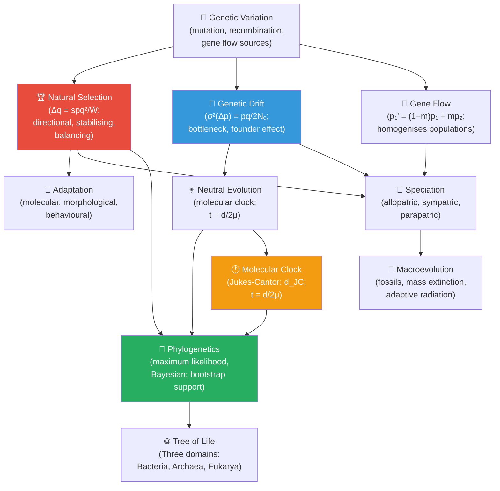

# Unit VI — Evolution: Introduction {.unnumbered}


\label{sec:unit_VI_unit_intro}
## Why This Unit Matters {.unnumbered}

On 24 November 1859, Charles Darwin published *On the Origin of Species by Means of Natural Selection*.
The book sold out on its first day. Within a decade, the concept of evolution by natural selection had
overturned centuries of natural theology and provided biology with its first unifying theory. Theodosius
Dobzhansky's 1973 essay captured this with a sentence that has become a biologist's creed: *\"Nothing
in biology makes sense except in the light of evolution.\"*

Darwin's central insight — that heritable variation + differential reproductive success produces
cumulative directional change in populations over generations — was elegant but incomplete. He had
no mechanism for inheritance. The Modern Synthesis (1930s–1940s), forged by Fisher, Haldane, Wright,
Dobzhansky, and Mayr, married Darwinian selection to Mendelian genetics and population genetics, giving
evolution a precise mathematical foundation. A further deepening came with the neutral theory (Kimura,
1968): not most genetic change is driven by selection; much molecular evolution is stochastic, driven by
genetic drift. Understanding evolution now requires integrating selection, drift, mutation, gene flow,
and non-random mating — the five forces that perturb Hardy-Weinberg equilibrium.

This unit treats evolution quantitatively. You will simulate allele frequency trajectories under
selection and drift, derive the molecular clock equation and apply it to evolutionary divergence times,
model speciation as a bifurcation in population structure, and reconstruct phylogenetic trees using
maximum-likelihood and Bayesian methods. The tools here are the same used in clinical epidemiology
(tracking antibiotic resistance alleles), crop improvement (genomic selection), and forensic genetics
(ancestral inference from SNP profiles).

---

## Landmark Discoveries {.unnumbered}

| Discoverer(s) | Year | Journal / Source | Discovery | Significance |
| ------------- | ---- | ---------------- | --------- | ------------ |
| Darwin & Wallace | 1858–59 | *Proc. Linn. Soc.*; *On the Origin of Species* | Natural selection as mechanism of evolution | Provided the first mechanistic explanation for biological diversity |
| Gregor Mendel (rediscovered) | 1900 | de Vries, Correns, Tschermak | Mendelian inheritance = mechanism for variation | Fused genetics with evolution; launched Modern Synthesis |
| Ronald Fisher | 1930 | *The Genetical Theory of Natural Selection* | Mathematical synthesis of Darwinism + Mendelism | Fundamental theorem of natural selection; $\Delta q = spq^2/\bar{W}$ |
| Sewall Wright | 1931 | *Genetics* | Genetic drift and adaptive landscapes | Showed small populations diverge by chance; $\sigma^2(\Delta p) = pq/2N_e$ |
| Motoo Kimura | 1968 | *Nature* | Neutral theory of molecular evolution | Most amino acid substitutions are selectively neutral; molecular clock |
| Woese & Fox | 1977 | *Proc. Natl. Acad. Sci.* | Three domains of life (Archaea identified by rRNA) | Completely restructured the comprehensive tree of life |
| Svante Pääbo et al. | 2010 | *Science* | Neanderthal genome sequencing | Showed interbreeding between modern humans and Neanderthals; Nobel Prize 2022 |

---

## Key Concepts and Connections {.unnumbered}


<!-- alt: Graph showing amerefsec:unit_VI_unit_intro concept map — Evolution. Red = selection; blue = drift; green = phylogenetics; orange = molecular clock. -->

*\nameref{sec:unit_VI_unit_intro} concept map — Evolution. Red = selection; blue = drift; green = phylogenetics; orange = molecular clock.*

---

## Current Evidence Thread {.unnumbered}

Treat this unit as a converging body of evidence for evolution: the fossil record documenting transitional forms and deep time, comparative genomics revealing shared ancestry and the molecular footprints of selection, real-time selection measured in experimental and wild populations, and phylogenies that reconstruct the branching history those data imply. Evolutionary claims are strongest when they combine mechanism, comparative evidence, population process, and explicit uncertainty. As you
move through the chapters, keep a two-column note: **claim** on the left,
**evidence that would change my confidence** on the right. By the end of the
unit, each major idea should be tied to a measurement, model, citation, or
paper-based lab decision.

## Chapter Roadmap {.unnumbered}

| Chapter | Title | Core Question | Key Equation / Model |
| ------- | ----- | ------------- | -------------------- |
| **19** | Evolution and Natural Selection | How does natural selection change allele frequencies, and how fast? | $\Delta q = -spq^2/\bar{W}$; fitness surface; selection coefficient |
| **20** | Genetic Drift and Speciation | How do chance events in small populations lead to divergence and new species? | $\sigma^2(\Delta p) = pq/2N_e$; isolation index; speciation models |
| **21** | Phylogenetics and the Tree of Life | How do we reconstruct evolutionary history from molecular data? | Jukes-Cantor correction; molecular clock: $t = d_{JC}/2\mu$ |

---

## Connections Across the Textbook {.unnumbered}

- **Hardy-Weinberg equilibrium** in \cref{sec:unit_V_population_genetics} is the null model disrupted by most five evolutionary forces analysed here.
- **Molecular clock** and **Jukes-Cantor distances** connect to \nameref{sec:unit_IV_unit_intro} (mutation rates in DNA replication) and \nameref{sec:unit_VII_unit_intro} (phylogeny of pathogens and antibiotic-resistance evolution).
- **Speciation** links to \nameref{sec:unit_X_unit_intro} (biogeography, island species-area relationship, MacArthur-Wilson model).
- **Adaptive evolution** of immune genes connects to \nameref{sec:unit_IX_unit_intro} (MHC diversity and pathogen immunity), and antibiotic resistance evolution motivates the clinical sections of \nameref{sec:unit_VII_unit_intro}.

> **Key vocabulary introduced here:** fitness, selection coefficient, genetic drift, effective population size ($N_e$), founder effect, bottleneck, molecular clock, phylogeny, clade, synapomorphy, allopatric speciation, sympatric speciation, neutral theory, molecular systematics, maximum likelihood, bootstrap support.


## Computational Toolbox — Unit VI {.unnumbered}

```python
from biology.evolution import simulate_selection, simulate_drift

# Natural selection on a beneficial mutation (s = 0.02, starting frequency p0 = 0.01)
from biology.evolution import Population

initial = Population("beneficial allele", p=0.01, q=0.99, fitness_AA=1.02, fitness_Aa=1.01, fitness_aa=1.0)
trajectory = simulate_selection(initial, generations=200)
print(f"Generation 1:   p = {trajectory[0].p:.4f}")
print(f"Generation 100: p = {trajectory[99].p:.4f}")
print(f"Generation 200: p = {trajectory[199].p:.4f}")

# Genetic drift: small population bottleneck (Ne=50) vs. large (Ne=1000)
import random; random.seed(42)
small_pop = simulate_drift(p=0.5, N=50, generations=200)
large_pop = simulate_drift(p=0.5, N=1000, generations=200)
print(f"Ne=50  terminal p:  {small_pop[-1]:.3f}  (fixed={'yes' if small_pop[-1] in (0,1) else 'no'})")
print(f"Ne=1000 terminal p: {large_pop[-1]:.3f}")
# Small populations show large random fluctuations; large populations stay near 0.5.
```

> **Try it yourself:** Run `simulate_drift` 100 times with `N=20` and count how many
> runs fix the allele (p=1.0) versus lose it (p=0.0). Theory predicts fixation = p₀ = 0.5.

---

*Source note: the evolution module supports selection, drift, fitness-landscape, molecular-clock, sequence-distance, and isolation-index examples. Figures and Mermaid diagrams provide the selection and phylogenetic visuals.*

## Cross-Unit Integration {.unnumbered}

The mechanisms of evolution — selection, drift, mutation, gene flow, speciation — that \nameref{sec:unit_VI_unit_intro} develops in eukaryotic and metazoan systems take on a particularly stark form in the microbial world of \nameref{sec:unit_VII_unit_intro}. Bacteria and viruses evolve on timescales of hours to days; horizontal gene transfer, plasmid exchange, and conjugation bypass the vertical-inheritance assumptions that made the population-genetic models tractable; antibiotic resistance is selection-in-real-time, observable in a single hospital ward. As you encounter microbial life histories and pathogen-host coevolution in \nameref{sec:unit_VII_unit_intro}, return to the selection and drift equations of \nameref{sec:unit_VI_unit_intro} and ask what changes when generation time collapses to minutes and the "population" includes a swarm of genomes exchanging parts. The principles persist; the timescales and recombination assumptions do not.
