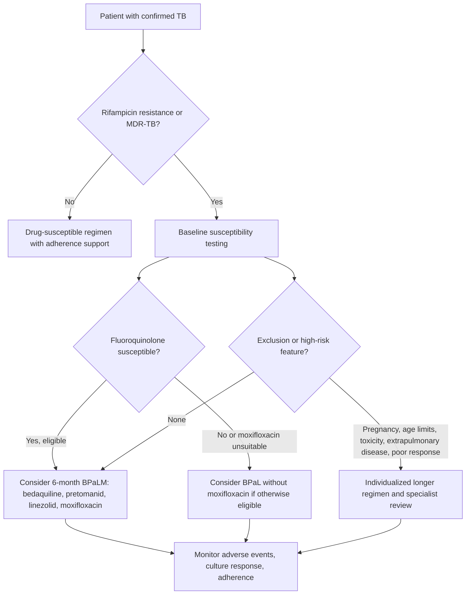
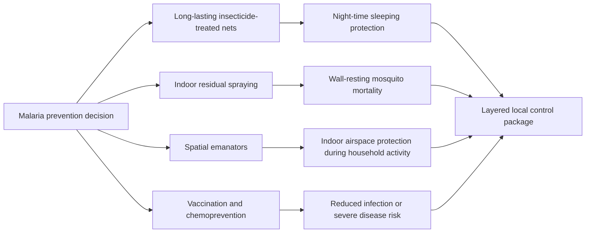
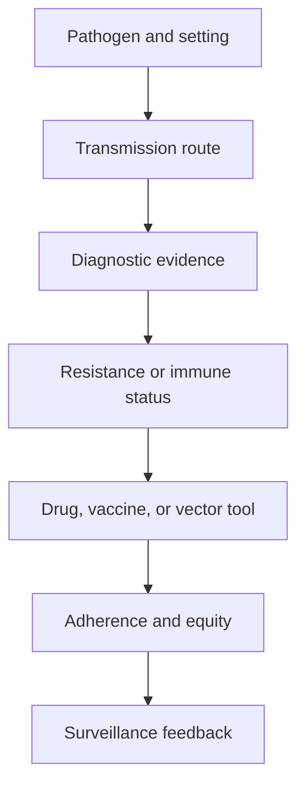

# Antimicrobial Resistance and Epidemiology

\label{sec:unit_VII_antimicrobial_resistance_and_epidemiology}

<!-- chapter-metadata-badge -->
> Level 2/3 · 35 min read · 45 min lecture · Prerequisites: \cref{sec:unit_VII_host_immunity_and_vaccines}

## Learning Objectives

1. Classify antibiotic-resistance mechanisms in multidrug-resistant pathogens.
2. Interpret epidemic curves, R0, and herd-immunity thresholds.
3. Compare stewardship, surveillance, and public-health interventions.
4. Evaluate resistance evolution under selection and horizontal gene transfer.

5. Propose a stewardship intervention that lowers resistance selection without blocking necessary treatment.
6. Model resistance spread with selection coefficients and horizontal gene transfer.
7. Interpret surveillance datasets such as GLASS reports with explicit sampling limits.

---

## Antibiotic Resistance Mechanisms in Multidrug-Resistant Pathogens

Antibiotic resistance can be classified into five mechanistic categories. Most clinically important multi-drug-resistant pathogens combine multiple mechanisms; an isolate may simultaneously hydrolyse β-lactams, modify aminoglycosides, methylate ribosomal RNA, and pump out fluoroquinolones.

### Mechanism 1: Enzymatic Inactivation

Direct destruction of the drug by hydrolysis or modification.

**β-lactamases** are the most clinically important and most diverse resistance enzymes. They hydrolyse the β-lactam ring (with the active-site serine — a tetrahedral covalent intermediate — or via a metallo-zinc mechanism) before the drug reaches its PBP target. The Ambler classification:

| Class | Mechanism | Spectrum | Inhibitor sensitivity | Examples |
|-------|-----------|----------|------------------------|----------|
| **Class A** (serine) | Active-site serine (Ser70) | Penicillins; ESBL extends to 3GC | Inhibited by clavulanate, sulbactam, tazobactam, avibactam | TEM-1, SHV-1 (penicillinases); CTX-M (the dominant ESBL globally); KPC (carbapenemase) |
| **Class B** (metallo-β-lactamase, MBL) | Zn$^{2+}$ active site; hydroxide nucleophile | Penicillins, cephalosporins, and carbapenems; monobactams such as aztreonam are structurally spared by the MBL but can be hydrolysed by co-produced ESBLs | Inhibited by EDTA in vitro; **not inhibited by clinical inhibitors**; aztreonam-avibactam combinations | **NDM-1** (New Delhi metallo-β-lactamase, 2008 emergence; global spread); **VIM**, **IMP** |
| **Class C** (AmpC) | Active-site serine | Cephalosporins (including 3GC); poorly inhibited by clavulanate | Cefepime, carbapenems retain activity | Chromosomal AmpC inducible in *Enterobacter*, *Serratia*, *Citrobacter*, *Pseudomonas*; plasmid-borne (CMY) |
| **Class D** (oxacillinase, OXA) | Active-site serine | Variable (penicillins → carbapenems for OXA-48) | Variable inhibitor susceptibility | OXA-48 (Klebsiella, Mediterranean); OXA-23 (Acinetobacter pan-resistance) |

**Other inactivating enzymes:**

- **Aminoglycoside-modifying enzymes (AMEs)** — three families: acetyltransferases (AAC), phosphotransferases (APH), nucleotidyltransferases (ANT). Modify amino or hydroxyl groups on the drug, abolishing ribosome binding. Plasmid-encoded; > 50 enzyme variants known.
- **Chloramphenicol acetyltransferase (CAT)** — acetylates the drug.
- **Macrolide esterases / phosphotransferases** (Ere, Mph) — less common than ribosomal methylation.
- **β-glucuronidases** that activate the cancer drug irinotecan into its toxic form (gut bacteria; relevant for drug-drug-microbiome interactions).

### Mechanism 2: Target Modification

Altering the drug target so the antibiotic no longer binds.

| Antibiotic | Original target | Modified target | Resistance mechanism |
|------------|-----------------|------------------|----------------------|
| **β-lactams** | PBP2 (transpeptidase) | **PBP2a** in MRSA (encoded by *mecA*) | Low-affinity transpeptidase that performs cross-linking even when normal PBPs are inhibited; SCC*mec* cassette mobile element |
| **Vancomycin** | D-Ala-D-Ala terminus of Lipid II | **D-Ala-D-Lac** (VanA, VanB) or **D-Ala-D-Ser** (VanC) | One H-bond replaced by an oxygen lone pair; ≥ 1000-fold loss of vancomycin affinity |
| **Macrolides, lincosamides, streptogramin B (MLS$_B$)** | 23S rRNA peptidyl-transferase center | **Methylated A2058 of 23S rRNA** by Erm methylase | Single methyl group blocks the three drug classes — cross-resistance |
| **Aminoglycosides (high-level)** | 16S rRNA A-site | **16S rRNA methylation** by ArmA, RmtB, RmtC, RmtD | Plasmid-borne; confers pan-aminoglycoside resistance |
| **Linezolid** | 23S rRNA, U2504 | **G2576T or T2500A 23S rRNA mutation**; **cfr methylase** (methylates A2503) | Cfr also confers cross-resistance to phenicols, lincosamides, streptogramins, oxazolidinones (PhLOPS$_A$) |
| **Fluoroquinolones** | DNA gyrase (GyrA, GyrB), topoisomerase IV (ParC, ParE) | **Mutations in QRDR (quinolone-resistance-determining region)**: GyrA Ser83, Asp87 | Stepwise mutations: each step adds resistance; *qnr* genes encode gyrase-protecting proteins (low-level) |
| **Rifampin** | RNA polymerase β subunit (RpoB) | **RpoB mutations**, especially Ser531Leu, His526Tyr | Single mutations confer high-level resistance |
| **Trimethoprim** | DHFR (dihydrofolate reductase) | Acquired *dfr* genes encoding drug-resistant DHFR; chromosomal mutations | Bypass through alternative DHFR |
| **Sulfonamides** | DHPS (dihydropteroate synthase) | Acquired *sul* genes; chromosomal mutations | Bypass through alternative DHPS |
| **Colistin (polymyxin)** | LPS lipid A | **mcr-1 phosphoethanolamine transferase** (plasmid-borne, 2015 discovery, China); chromosomal *pmrAB / phoPQ* mutations | Modifies lipid A phosphates → reduced affinity for cationic colistin |

**MRSA mechanism in detail.** *S. aureus* resistant to methicillin and most earlier β-lactams carries the **mecA gene** on a mobile genetic element — **SCC*mec*** (staphylococcal cassette chromosome mec). *mecA* encodes **PBP2a**, an alternative transpeptidase whose β-lactam-binding pocket has rearranged to drastically lower affinity. The K$_i$ for ceftriaxone increases from ~ 0.05 μM (PBP2) to ~ 50 μM (PBP2a). When normal PBPs are acylated by β-lactam, PBP2a can still cross-link cell wall, allowing growth. Newer **5th-generation cephalosporins** (ceftaroline, ceftobiprole) were specifically engineered with side chains that bind PBP2a and are now used clinically against MRSA.

### Mechanism 3: Efflux Pumps

Active export of antibiotics out of the cell, often accomplishing **multi-drug resistance** through a single pump system.

| Pump family | Energy source | Drugs effluxed | Examples |
|-------------|---------------|----------------|----------|
| **RND (Resistance-Nodulation-Division)** | Proton motive force | β-lactams, fluoroquinolones, tetracyclines, chloramphenicol, macrolides | **AcrAB-TolC** (*E. coli*); **MexAB-OprM**, **MexCD-OprJ**, **MexEF-OprN**, **MexXY-OprM** (*P. aeruginosa*); **AdeABC** (*Acinetobacter*) |
| **MFS (Major Facilitator Superfamily)** | PMF | Tetracyclines (TetA, TetB), macrolides (Mef), fluoroquinolones | TetA, TetB; MdfA |
| **MATE** | PMF / Na$^+$ gradient | Fluoroquinolones, aminoglycosides | NorM (*V. parahaemolyticus*) |
| **SMR (Small Multidrug Resistance)** | PMF | QACs, lipophilic cations | EmrE |
| **ABC (ATP-Binding Cassette)** | ATP | Macrolides, ketolides | LmrA |

**RND tripartite pumps** in Gram-negatives are particularly devastating because they span the entire cell envelope: an inner-membrane efflux transporter (e.g., AcrB) coupled via a periplasmic adaptor (AcrA) to an outer-membrane channel (TolC). The pump exports drugs straight from the cytoplasm or inner membrane into the extracellular space, bypassing the periplasm. *P. aeruginosa* MexAB-OprM is the textbook example: constitutive expression confers intrinsic resistance to multiple drug classes; mutations in regulators (e.g., *nfxB*, *mexR*) cause overexpression and clinical failure.

### Mechanism 4: Reduced Permeability

Decreasing drug uptake by altering cell-envelope permeability.

- **Porin loss** in Gram-negatives: deletions or down-regulation of OmpF, OmpC, OprD — particularly important for hydrophilic β-lactams and carbapenems. **OprD loss in *P. aeruginosa*** confers imipenem resistance.
- **LPS modification** in Gram-negatives: reduces hydrophobic-drug entry.
- **Mycobacterial cell wall**: the mycolic-acid layer is intrinsically impermeable; *M. tuberculosis* is naturally resistant to most antibiotics.

### Mechanism 5: Bypass / Target Overproduction

Producing more target or alternative target to dilute drug action.

- **Trimethoprim resistance via** *dfr* genes that encode a drug-insensitive DHFR (target replacement).
- **Sulfonamide resistance via** *sul* genes that encode a drug-insensitive DHPS.
- **Methotrexate resistance** in cancer cells via DHFR overexpression — same principle in eukaryotes.

### Resistance in Action: A Pan-Resistant *Klebsiella pneumoniae*

A clinical isolate from a 2019 outbreak in a Greek ICU was reported with the following resistance profile:

| Mechanism | Genetic determinant | Drug class affected |
|-----------|---------------------|---------------------|
| **NDM-1** (Class B MBL) | *bla*$_\text{NDM-1}$ on plasmid | Penicillins, cephalosporins, and carbapenems; aztreonam is spared by MBL chemistry but vulnerable to co-produced ESBLs |
| **CTX-M-15** ESBL (Class A) | *bla*$_\text{CTX-M-15}$ | Cephalosporins (residual) |
| **OXA-48** (Class D) | *bla*$_\text{OXA-48}$ | Carbapenems (residual) |
| **mcr-1** | *mcr-1* | Colistin |
| **Aac(6')-Ib-cr** | Plasmid | Aminoglycosides + ciprofloxacin |
| **rmtB** | Plasmid | Pan-aminoglycoside |
| **AcrAB-TolC overexpression** | *ramA* mutation | Multiple |
| **GyrA Ser83Leu** | Chromosome | Fluoroquinolones |
| **OmpK35 loss** | Chromosome | Reduced β-lactam entry |

Such isolates may have no reliable standard single-agent option, so treatment depends on isolate-specific susceptibility testing, source control, and expert consultation. Options can include cefiderocol, ceftazidime-avibactam plus aztreonam for some MBL-producing isolates, aminoglycoside or fosfomycin combinations when active, and investigational phage therapy. The case illustrates that resistance is **modular and additive**: each mechanism arrives independently, often on plasmids, and accumulates over time. This is why antibiotic stewardship, infection control, diagnostics, and new drug development must operate together.

> **Concept Check 6b:**
> A *K. pneumoniae* isolate is resistant to the tested β-lactams including carbapenems (KPC-2 carbapenemase), tigecycline (RamA-dependent AcrAB overexpression), and ciprofloxacin (GyrA + ParC mutations). The lab reports it as susceptible to colistin and ceftazidime-avibactam. Explain (a) why ceftazidime-avibactam works against KPC-2 specifically while ceftazidime alone would not, (b) why the same combination would fail against an NDM-producer, and (c) how ESBL-restricted versus carbapenemase-positive resistance is distinguished by the meropenem-EDTA versus meropenem-boronic-acid double-disk synergy test.

---

<!-- curriculum-scaffold-start -->
### Study Blueprint

- **Big idea:** Antimicrobial resistance and epidemic dynamics emerge from pathogen evolution and transmission networks.
- **Core concepts:** antibiotic resistance, R0, transmission, surveillance.
- **Framework alignment:** Vision & Change: Evolution, Systems, Structure and function; AP Biology: Evolution, Systems Interactions; NGSS-style topics: Structure and Function, Interdependent Relationships in Ecosystems.
- **Model or quantitative lens:** R0, resistance-mechanism, and outbreak-trajectory calculations.
- **Data skill:** Interpret resistance assays and outbreak curves.
- **Practice cadence:** Questions and Methods, Representing and Describing Data, Argumentation.
- **Common misconception to repair:** R0 is not a fixed property of a pathogen alone; it depends on host behaviour and environment.
- **Primary lab:** \cref{sec:lab_unit_VII_antimicrobial_resistance_and_epidemiology}.
- **Question bank:** \cref{sec:q_unit_VII_antimicrobial_resistance_and_epidemiology}.
- **Transfer task:** Transfer resistance and epidemiology reasoning to stewardship and public-health policy.
- **Bridge to computation:** `biology.microbiology.microbiology.sir_model`.
<!-- curriculum-scaffold-end -->

---

> **Opening Vignette — Antimicrobial Resistance and Epidemiology**
>
> This chapter connects antimicrobial resistance and epidemiology to measurable evidence: models, datasets, and experiments that can strengthen or weaken each claim.

## Epidemiology of antimicrobial resistance and epidemiology

### Key Epidemiological Metrics

| Metric | Definition | Significance |
|--------|-----------|-------------|
| $R_0$ (basic reproduction number) | Mean secondary cases per primary case in fully susceptible population | Determines epidemic potential; $R_0 > 1$ = epidemic growth |
| $R_e$ (effective reproduction number) | $R_0 \times (1 - \text{fraction immune})$; real-time transmission | Guides intervention: goal is $R_e < 1$ |
| CFR (case fatality rate) | Deaths / confirmed cases | Overestimates true mortality (denominator misses mild cases) |
| IFR (infection fatality rate) | Deaths / most infections (including asymptomatic) | More accurate; requires seroprevalence data |
| Incubation period | Time from infection to symptom onset | Determines quarantine duration |
| Serial interval | Time between symptom onset in successive cases | Determines epidemic speed |

### Worked Example: Estimating R0 from an Epidemic Curve

**Problem:**
Early in an outbreak, confirmed cases double every $T_d = 3.0$ days. The mean serial interval (time between symptom onset in successive cases) is $T_s = 5.0$ days. Estimate the basic reproduction number $R_0$, then the herd-immunity threshold.

**Solution:**

1. **Exponential growth rate $r$ from the doubling time.** Early case counts grow as $N(t) = N_0\,2^{t/T_d} = N_0\,e^{rt}$, so equating exponents gives $r = \ln 2 / T_d$:

$$ r = \frac{\ln 2}{T_d} = \frac{0.6931}{3.0} = 0.2310 \text{ day}^{-1} \label{eq:unit_VII_infectious_disease_item_3}$$

2. **Convert growth rate to $R_0$.** For a fixed (delta-distributed) serial interval, the renewal equation gives $R_0 = e^{r T_s}$:

$$ R_0 = e^{r T_s} = e^{0.2310 \times 5.0} = e^{1.155} = 3.17 \label{eq:unit_VII_infectious_disease_item_4}$$

   (The simpler linear approximation $R_0 \approx 1 + r T_s = 1 + 0.2310 \times 5.0 = 2.16$ is a lower bound that ignores serial-interval dispersion.)

3. **Herd-immunity threshold.** Substituting $R_0 = 3.17$ into the herd-immunity relation $p_c = 1 - 1/R_0$ from \cref{eq:unit_VII_herd_immunity}:

$$ p_c = 1 - \frac{1}{3.17} = 0.685 \;\rightarrow\; 68.5\,\% \label{eq:unit_VII_infectious_disease_item_5}$$

**Interpretation:** A 3-day doubling time with a 5-day serial interval implies $R_0 \approx 3.2$, so roughly 69 % of the population must be immune to halt sustained transmission — a value consistent with an early pandemic-respiratory pathogen, and one that grows sharply if the doubling time shortens.

### Worked Example: Herd Immunity Threshold and Required Vaccination Coverage

**Problem:** Compare two pathogens with very different transmissibility: **measles** ($R_0 \approx 15$) and the **original SARS-CoV-2 (Wuhan) strain** ($R_0 \approx 4$). For each, compute (a) the **herd-immunity threshold** $p_c = 1 - 1/R_0$, and (b) the **required vaccination coverage** $V$ to reach that threshold, given imperfect vaccine efficacy $\varepsilon$ (MMR for measles: $\varepsilon = 0.97$; original mRNA vaccine for ancestral SARS-CoV-2: $\varepsilon = 0.95$ against symptomatic disease).

**Solution:**

1. **Herd-immunity threshold for measles** ($R_0 = 15$):

   $$ p_c^{\text{measles}} = 1 - \frac{1}{R_0} = 1 - \frac{1}{15} = 0.933 \;\rightarrow\; 93.3\,\% \label{eq:unit_VII_infectious_disease_worked_herd_1} $$

2. **Required vaccination coverage for measles**, accounting for vaccine efficacy:

   $$ V_{\text{measles}} = \frac{p_c}{\varepsilon} = \frac{0.933}{0.97} \approx 0.962 = 96.2\,\% \label{eq:unit_VII_infectious_disease_worked_herd_2} $$

   To halt sustained measles transmission, **at least 96.2 % of the population must be vaccinated** with a two-dose MMR schedule. This is the most demanding vaccination target for any current vaccine programme.

3. **Herd-immunity threshold for ancestral SARS-CoV-2** ($R_0 = 4$):

   $$ p_c^{\text{COVID}} = 1 - \frac{1}{4} = 0.75 \;\rightarrow\; 75\,\% \label{eq:unit_VII_infectious_disease_worked_herd_3} $$

4. **Required vaccination coverage for ancestral SARS-CoV-2**, accounting for vaccine efficacy:

   $$ V_{\text{COVID}} = \frac{0.75}{0.95} \approx 0.789 = 78.9\,\% \label{eq:unit_VII_infectious_disease_worked_herd_4} $$

5. **Implication for variant evolution.** As more transmissible variants emerged, $R_0$ rose: Alpha ~ 5, Delta ~ 6, Omicron BA.1 ~ 8–10. Substituting into the same formulae:

   - Delta ($R_0 = 6$): $p_c = 0.833$; required coverage at $\varepsilon = 0.85$ (waned immunity vs. Delta) = $0.833/0.85 \approx 98 \%$.
   - Omicron BA.1 ($R_0 = 9$): $p_c = 0.889$; required coverage at $\varepsilon = 0.50$ (waned, immune-escape) = $0.889/0.50 = 1.78$ — i.e., **vaccination alone cannot achieve herd immunity** because the required coverage exceeds 100 %.

**Interpretation.** The herd-immunity calculation is mechanically simple but operationally demanding. **Two structural points emerge: (i) Vaccine efficacy is a multiplier, not an additive cost** — even a modest efficacy reduction (95 % → 85 %) substantially elevates the required coverage. **(ii) When $\varepsilon \times p_c > 1$ is unreachable**, vaccination alone cannot reach the herd-immunity threshold and **complementary interventions** (boosters, ventilation, masking, therapeutics) become essential. The original elimination calculus for measles depended on the combination of $R_0 \approx 15$ with an exceptional $\varepsilon = 0.97$ — and even there, a 1–3 % refusal rate is sufficient to lose herd immunity and trigger localised outbreaks, as observed repeatedly in the 2018–2024 measles resurgences worldwide.


### Major antimicrobial resistance and epidemiologys

**Tuberculosis** (*Mycobacterium tuberculosis*):

- Global burden: an estimated 10.7 million people fell ill with TB in 2024 and 1.23 million died, including 150,000 people with HIV \citep{who2025tb}. TB remains the leading cause of death from a single infectious agent and a major contributor to AMR-associated mortality.
- Transmission: Airborne droplet nuclei (1-5 μm); can remain suspended for hours
- Pathogenesis: Inhaled bacilli are phagocytosed by alveolar macrophages but arrest phagosome maturation (LAM inhibits PI3K -> blocks Ca$^{2+}$/calmodulin -> prevents phagolysosomal fusion); survive within macrophages at pH 6.4 instead of lethal pH 4.5
- **Granuloma**: Hallmark of TB pathology -- organized aggregate of infected macrophages, epithelioid cells, multinucleated giant cells, and T cells; hypoxic caseous necrotic center; both contains and protects the bacilli
- Latent TB: 90-95% of infected individuals contain the infection as LTBI (latent TB infection); 5-10% lifetime risk of reactivation, increased by HIV, immunosuppression, malnutrition
- Treatment: standard drug-susceptible pulmonary TB is treated with a multi-drug rifamycin-based regimen, classically 6 months of isoniazid + rifampicin + pyrazinamide + ethambutol followed by continuation therapy; adherence support matters because metabolically slow bacilli and granuloma drug penetration make undertreatment risky.
- **MDR/RR-TB** (multidrug-resistant or rifampicin-resistant TB), **pre-XDR-TB** (MDR/RR-TB with fluoroquinolone resistance), and **XDR-TB** (MDR/RR-TB plus resistance to a fluoroquinolone and at least one additional Group A drug such as bedaquiline or linezolid) remain major AMR threats. WHO's consolidated 2025 treatment guidance now prioritises shorter most-oral regimens for eligible patients, including 6-month BPaLM/BPaL-based options, while reserving longer individualized regimens for resistance, toxicity, pregnancy/age limits, extrapulmonary disease, or poor early response \citep{who2025tb}.


<!-- alt: Flowchart showing TB regimen decision schematic. WHO's shorter BPaLM/BPaL options are eligibility-dependent tools for MDR/RR-TB, not a comprehensive replacement for susceptibility testing, toxicity monitoring, or individualized care. -->

*TB regimen decision schematic. WHO's shorter BPaLM/BPaL options are eligibility-dependent tools for MDR/RR-TB, not a comprehensive replacement for susceptibility testing, toxicity monitoring, or individualized care \citep{who2025tb}.*

- Global burden: an estimated 282 million cases and 610,000 deaths in 2024 across 80 countries \citep{who2025malaria}. The WHO African Region still accounts for the overwhelming majority of cases and deaths, with young children carrying the greatest mortality burden.
- Species: *P. falciparum* (most lethal; 99% of deaths), *P. vivax* (most widespread; hypnozoites cause relapse), *P. malariae*, *P. ovale*, *P. knowlesi* (zoonotic, from macaques)
- Transmission: Female *Anopheles* mosquito vector; sporozoites injected during blood meal
- Life cycle: Sporozoites -> liver (hepatocyte invasion, asymptomatic) -> merozoites -> erythrocyte invasion (clinical disease: cyclic fever every 48-72 hours synchronized with schizogony) -> some become gametocytes (taken up by mosquito)
- Immune evasion: *P. falciparum* erythrocyte membrane protein 1 (PfEMP1) expressed on infected RBC surface mediates cytoadherence (sticking to endothelium, avoiding splenic clearance) and rosetting; ~60 *var* genes enable antigenic variation
- Vaccine: RTS,S/AS01E (Mosquirix): first approved malaria vaccine (2021); targets circumsporozoite protein; protection is partial and wanes without booster dosing. R21/Matrix-M is now the second WHO-recommended malaria vaccine; both are best understood as additions to bed nets, chemoprevention, diagnosis, and vector control rather than replacements \citep{who2025malaria}.
- Treatment: Artemisinin-based combination therapy (ACT); artemisinin resistance emerging in Southeast Asia (K13 propeller mutations)
- Vector control frontier: WHO issued a 2025 conditional recommendation for indoor **spatial emanators** (also called spatial repellents) as an additional tool in areas with ongoing transmission, used alongside insecticide-treated nets rather than replacing them. These devices release active ingredients such as transfluthrin into indoor air to repel, disorient, or kill mosquitoes, with evidence strongest for added indoor protection and remaining gaps for standalone use, outdoor protection, humanitarian settings, and resistance management \citep{who2025spatialemanators}.


<!-- alt: Flowchart showing malaria vector-control comparison. Spatial emanators add an indoor airspace tool to nets and spraying, but local programmes still need entomological surveillance, insecticide-resistance monitoring, and equity-aware deployment. -->

*Malaria vector-control comparison. Spatial emanators add an indoor airspace tool to nets and spraying, but local programmes still need entomological surveillance, insecticide-resistance monitoring, and equity-aware deployment.*

**HIV/AIDS**:

- Global burden: an estimated 40.8 million people were living with HIV at the end of 2024, with about 1.3 million new infections in 2024 and AIDS-related deaths far below their early-2000s peak but still above global targets \citep{unaids2025factsheet}.
- Pathogenesis: Progressive depletion of CD4$^+$ T cells; AIDS defined as CD4 count <200 cells/μL or AIDS-defining illness
- **ART** (antiretroviral therapy): Combination of 3+ drugs from different classes; suppresses viral load to undetectable (<50 copies/mL); near-normal life expectancy if initiated early; does not cure (latent proviral reservoir in resting CD4$^+$ memory T cells persists for decades)
- **PrEP** (pre-exposure prophylaxis): Oral TDF/FTC or TAF/FTC remains highly effective when taken as prescribed; long-acting injectable cabotegravir and twice-yearly lenacapavir add adherence-sparing options. FDA approved lenacapavir PrEP in 2025, and CDC guidance reports trial efficacy of 100% in a cisgender-female trial and 96% in a primarily male trial over 52 weeks \citep{cdc2025lenacapavirprep}.
- **U=U** (Undetectable = Untransmittable): Individuals with sustained undetectable viral load on ART cannot sexually transmit HIV (PARTNER study, HPTN 052)

**Influenza**:

- RNA virus (Orthomyxoviridae); 8 segmented (-)ssRNA genome segments
- Surface glycoproteins: hemagglutinin (HA, 18 subtypes) and neuraminidase (NA, 11 subtypes); nomenclature: H1N1, H3N2, etc.
- See "Antigenic Variation" section above for full discussion of drift and shift.

> **Concept Check (Analysis — Influenza Antigenic Drift vs. Shift):** Influenza A hemagglutinin (HA) has **18 subtypes** (H1–H18) and neuraminidase (NA) has **11 subtypes** (N1–N11), giving 198 possible HA/NA combinations (though merely a fraction are observed in nature). Two distinct mechanisms generate antigenic novelty: **antigenic drift** (point mutations in the HA head domain accumulating gradually under positive selection from population immunity) and **antigenic shift** (genome **reassortment** between two influenza strains co-infecting a single host, producing a hybrid virus with a novel HA/NA combination). (a) Analyse why **drift causes seasonal re-infection** (epidemic-scale, requiring annual vaccine reformulation) while **shift causes pandemics** (population-naive, no pre-existing immunity). Use the immune-escape logic to predict the expected $R_e$ trajectory of each. (b) The 1918 **H1N1 pandemic** strain shared HA antigenic identity with the 1957 **H2N2 pandemic** strain at less than 50 % at antibody-neutralising sites — a shift event. The seasonal H3N2 strains evolving since 1968, however, share 80–90 % HA identity year-to-year, requiring annual vaccine updates — drift. Compare the **rates of accumulation** of HA epitope substitutions in drift (~0.5–1 % per year at antigenic sites) vs. shift (instantaneous swap to a completely novel HA). (c) Predict **which HA residues are most selectively constrained** (i.e., highly conserved across subtypes) and which are under strongest positive selection. The receptor-binding pocket residues are constrained because mutation destroys sialic-acid binding; the surface-exposed antigenic loops (Sa, Sb, Ca, Cb sites) are under strongest positive selection because they evade neutralising antibodies. (d) Design a phylogenetic test that distinguishes drift-driven from shift-driven changes in a sampled HA sequence, using the topological signature (clock-like accumulation vs. abrupt change in neighbour identity).

### One Health and Emerging Pathogens

The **One Health** framework recognizes the interconnection of human, animal, and environmental health:

- Over 70% of emerging infectious diseases are **zoonotic** (originating from animal reservoirs).
- Drivers of emergence: deforestation and habitat destruction (increasing human-wildlife contact), wildlife trade (live animal markets), climate change (expanding vector ranges), intensive animal agriculture (influenza reassortment, AMR selection).
- Examples: SARS-CoV-2 (probable bat origin via intermediate host), Ebola (bat reservoir), avian influenza H5N1 (poultry), Nipah (bat-to-pig-to-human), Lyme disease (deer-tick-mouse cycle expanding with climate change), mpox (rodent reservoirs in West/Central Africa).
- AMR as a One Health issue: antibiotic exposure in people, food animals, aquaculture, and shared environments selects for resistance genes that can move through water, soil, food chains, plasmids, and mobile genetic elements. Stewardship therefore has to cover prescribing, veterinary practice, sanitation, surveillance, and access to effective treatment \citep{cdc2025antibioticuse,who2024bppl}.
- Fungal disease also belongs in the AMR frame: the WHO fungal priority pathogens list highlights *Candida auris*, *Aspergillus fumigatus*, *Cryptococcus neoformans*, and other fungi where limited diagnostics, few drug classes, immunocompromised hosts, and agricultural azole exposure make resistance a One Health problem rather than a hospital-confined issue \citep{who2022fungalpriority}. CDC guidance treats *Candida auris* as a healthcare-transmissible yeast that is often multidrug-resistant, can colonise patients without symptoms, persists on surfaces, requires sequencing or mass spectrometry for reliable identification, and should be treated primarily when causing clinical infection; echinocandins remain typical initial adult therapy, but echinocandin-resistant and pan-resistant reports are increasing \citep{cdc2026candidaauris,cdc2024candidaauristreatment}. Mechanistically, the warning is that AMR phenotypes are assembled from enzymes, target changes, efflux, permeability shifts, biofilms, tolerance states, and mobile genetic elements; the same resistance label can hide different treatment constraints.

**Spillover risk factors.** Modern surveillance and modelling have identified several quantifiable predictors of zoonotic spillover risk:

1. **Phylogenetic distance** — viruses from primates spill more easily than viruses from rodents than from invertebrates.
2. **Receptor compatibility** — ACE2 in bats, civets, and humans is similar enough to permit SARS-CoV-2 cross-species transmission; H5N1 sialic-acid receptor preference shifts (α-2,3 → α-2,6) signal mammalian adaptation.
3. **Population density at the human-animal interface** — wet markets, intensive agriculture, deforestation edges.
4. **Reservoir host species richness** — Bat species richness correlates with the number of zoonotic viruses; rodents are similarly important but underrecognised.
5. **Anthropogenic disruption** — deforestation, climate change, urbanisation increase contact rates.

**The PREDICT and Global Virome Project** approaches systematically sample wildlife to catalog viral diversity and identify high-risk lineages **before** spillover. By 2026, sequencing > 200,000 viral genomes from > 30,000 animals across > 30 countries has identified ~ 10,000 candidate zoonotic viruses, of which ~ 1700 share key receptor-binding features with known human pathogens — a sobering reservoir.

> **Clinical Connection: Antibiotic Stewardship and Real-Time Resistance Surveillance**
> The WHO has declared antimicrobial resistance one of the top 10 global public health threats. An estimated 1.27 million deaths were directly attributable to bacterial AMR in 2019 \citep{murray2022amr}. The O'Neill review's 10-million-deaths-per-year scenario is a policy warning about uncontrolled resistance, not an inevitable destiny \citep{oneill2016amr}. Genomic surveillance networks such as the CDC AR Lab Network and WHO GLASS \citep{who2025glass} now track carbapenemases, *mcr* genes, and emerging plasmids across hospitals and regions. The lesson from SARS-CoV-2 — pathogen genomes can be sequenced and interpreted at population scale — is being adapted to bacterial AMR, where slower growth and horizontal gene transfer make the analysis more complicated.

> **Concept Check 7:**
> Trace a potential pandemic pathway from deforestation in Southeast Asia. Identify (a) the ecological factors that elevate spillover risk, (b) the molecular features (receptor compatibility, reassortment potential) that determine human transmissibility, (c) the early-warning indicators that PREDICT-style surveillance would detect, and (d) the One Health interventions that could reduce future risk.

> **Concept Check (Evaluate — One Health Quantification of Nipah Spillover Risk):** **Nipah virus** (NiV, family *Paramyxoviridae*, genus *Henipavirus*) circulates enzootically in *Pteropus* fruit bats across South and Southeast Asia. The canonical spillover pathway runs **bats → pigs → humans** (1998–1999 Malaysian outbreak, ~ 100 deaths) or **bats → date palm sap → humans** (recurring Bangladesh outbreaks, 70–90 % case-fatality ratio). Spillover probability per unit time can be decomposed as:

$$ P_{\text{spillover}} = f(\text{contact rate}, \text{viral shedding load in reservoir}, \text{human/intermediate-host susceptibility}). $$

(a) **Evaluate how deforestation alters each factor.** When tropical forest is converted to oil-palm plantation or pig farms, *Pteropus* bats lose foraging habitat and are **forced to roost closer to human settlements and livestock**, increasing the bat–pig and bat–human contact rate by 10–100×. Concurrently, **nutritional stress** in bats elevates NiV viral shedding (immune compromise → higher faecal/saliva viral load). And **immunologically-naïve human and pig populations** at the deforestation edge have high susceptibility. The product of three multiplicative increases produces a sharply non-linear rise in spillover probability — the hallmark of an emerging-disease hot zone.

(b) **Quantify the contact-rate change.** In the 1998 Malaysian outbreak, GIS analysis showed that pig farms within **8 km of deforested fruit-bat habitat** experienced spillover, while those > 30 km away did not. The bat–pig spatial-overlap index correlates strongly ($r \approx 0.8$) with outbreak occurrence — a directly measurable, intervenable variable.

(c) **Propose three surveillance interventions with cost-effectiveness estimates** (in approximate USD per averted Disability-Adjusted Life Year, DALY):

1. **Bat-reservoir serosurveillance** (annual sampling of 500 bats per region, NiV IgG ELISA): ~ \$50,000/yr per region; cost-effective in regions with > 10 % bat seroprevalence (~ \$200–500 / DALY).
2. **Date-palm sap protection** (covering sap-collection pots with bamboo skirts to exclude bats): ~ \$2 per pot, scalable to 100,000 pots per year; demonstrated to reduce contamination by > 80 %; estimated ~ \$50–150 / DALY.
3. **Pig-farm zoning** (mandating no new farms within 5 km of fruit-bat colonies): regulatory cost is low but politically costly; cost-effectiveness depends on the regulatory baseline.

(d) **Evaluate the limits of intervention.** Even a perfectly executed One Health surveillance programme cannot eliminate spillover risk — it can merely reduce the probability per unit time. The fundamental risk reduction requires **landscape-scale habitat preservation** (preventing the bat–human interface from forming in the first place), which is a slow, politically difficult, and incompletely controllable intervention. Synthesise the spillover-control hierarchy: prevention (habitat) > deterrence (surveillance + barriers) > rapid response (outbreak containment). Each tier accepts a higher residual risk in exchange for tractability.

---

## Computational Bridge

Early outbreak growth is often sketched with discrete exponential models:

```python
from biology.ecology import exponential_growth

series = exponential_growth(N0=20.0, r=0.3, t_end=12.0, steps=12)
print(round(series.populations[-1], 2))
```

> **Clinical / systems note:** $R_e$ reductions from vaccines behave like lowering effective $r$ in these caricatures; heterogeneity in contact networks breaks the homogeneous assumption.

---

### mRNA Vaccine Platforms: From Lab Curiosity to Global Deployment

Messenger RNA vaccines — once a neglected technology because of mRNA's instability and strong innate-immune activation — became the [**dominant**](#gl:dominant) pandemic response platform between 2020 and 2023. **BNT162b2 (Pfizer–BioNTech) and mRNA-1273 (Moderna)** demonstrated ≥ 94 % efficacy against symptomatic COVID-19 in phase III trials (> 40 000 participants each) within **11 months from pathogen identification** — an unprecedented pace driven entirely by the modularity of the platform: once a lipid-nanoparticle delivery system and a nucleoside-modified mRNA scaffold are validated, swapping the antigen-coding sequence is a matter of days.

Three molecular innovations make mRNA vaccines work. **(1) Nucleoside modification** — substituting uridines with **pseudouridine (Ψ) or 1-methyl-pseudouridine (m1Ψ)** (Karikó & Weissman, Nobel Prize 2023) reduces TLR7/8 activation and blocks 2'-5'-oligoadenylate synthetase / RNase L degradation, so [**translation**](#gl:translation) is 10–100× more efficient and innate-immune activation is manageable. **(2) Lipid nanoparticle (LNP) delivery** — a four-component formulation (ionisable lipid ALC-0315 or SM-102, phospholipid DSPC, cholesterol, PEG-lipid) self-assembles into ~80 nm particles that endocytose into dendritic cells; at endosomal pH ~5 the ionisable lipid becomes cationic, fusing with the endosome and releasing mRNA into the cytoplasm. **(3) Antigen design** — the SARS-CoV-2 spike is locked in the prefusion conformation by two proline substitutions (**2P mutation**) that preserve neutralising epitopes. Manufacturing uses *in vitro* transcription from linear DNA templates (T7 polymerase), capping with CleanCap analogue, and microfluidic LNP assembly — a single ~20 000 L bioreactor run can produce > 1 billion doses. Remaining challenges: cold-chain dependence (though ARCT-154 self-amplifying mRNA vaccines stable at 2–8 °C are in trials), rare myocarditis risk in young males (~1–10 per 100 000 doses, typically mild and self-limiting), and waning antibody titres (6-month boosting needed). The platform is now extending to influenza (mRNA-1010), RSV (mRNA-1345, approved 2024), and personalised cancer neoantigen vaccines (mRNA-4157, phase III for melanoma).

### cGAS–STING: Innate Cytosolic DNA Sensing and Anti-Tumour Immunity

**Cyclic GMP–AMP synthase (cGAS)** is a cytosolic DNA sensor identified in 2013 (Chen lab) that binds double-stranded DNA non-sequence-specifically and, upon DNA engagement, synthesises the second messenger **2'3'-cyclic GMP–AMP (2'3'-cGAMP)** from ATP and GTP. 2'3'-cGAMP binds the ER-resident adaptor **STING (Stimulator of Interferon Genes)**, driving TBK1 phosphorylation of IRF3 and thus **Type I interferon (IFN-α/β)** transcription. Evolutionarily, the pathway detects pathogen-derived or mis-localised self-DNA — cytosolic DNA is otherwise absent in healthy cells.

Three rapid-fire translational applications: **(1) Cancer immunotherapy** — dying tumour cells release DNA that, once dendritic cells endocytose it, activates cGAS–STING, priming CD8⁺ T-cell responses. STING agonists (ADU-S100, MK-1454, diABZI) are in > 30 oncology clinical trials; **radiation therapy** is an accidental STING activator (sub-lethal DNA damage → micronuclei → cytosolic DNA). **(2) Autoimmunity** — gain-of-function STING mutations cause **SAVI (STING-associated vasculopathy)**, a paediatric interferonopathy with pulmonary fibrosis and skin ulcerations; chronic cGAS–STING activation also contributes to **age-related inflammation** as mitochondrial and cytosolic DNA accumulate. **(3) Anti-viral defence** — SARS-CoV-2 ORF9b, HSV-1 ICP27, and HIV-1 capsid most suppress cGAS–STING, demonstrating its evolutionary importance as a front-line sensor. The pathway is now a canonical example of how fundamental discovery (2013) can translate to phase III oncology trials in under a decade.

---

## Current Evidence and Frontier Biology: Antimicrobial Resistance and Epidemiology

For **Antimicrobial Resistance and Epidemiology**, frontier biology belongs inside the evidence logic of
the chapter. Microbiology and infectious disease now require One Health reasoning across people, animals, environments, genomics, and antimicrobial stewardship. The core reading question is this: infectious-disease reasoning should connect pathogen biology, transmission, immunity, diagnostics, interventions, and equity.

- **What to verify:** identify the observation, model, assay, or dataset that
  would make the claim stronger or weaker.
- **What to qualify:** state the scale, organism, cell type, environmental
  condition, or population where the claim is expected to hold.
- **What to compare:** test at least one alternative explanation, baseline, or
  null model before treating the pattern as causal.
- **What to cite:** distinguish primary evidence, review synthesis, public
  dataset, and institutional guidance; for recent or numeric claims, prefer
  the source closest to the measurement and state what has changed since it was
  published.

For resistance or outbreak claims, name the organism, determinant, selection pressure, transmission route, and surveillance evidence \citep{who2024bppl,cdc2025antibioticuse,murray2022amr}.

**Source practice:** For pathogen, resistance, and intervention claims, tie statements to organism-resistance pairs, surveillance evidence, official guidance, and trial/regulatory status \citep{who2024bppl,who2025tb,who2025malaria,cdc2025lenacapavirprep,cdc2026candidaauris}.

### Current Evidence Map: Intervention Choice Across Pathogens


<!-- alt: Decision map for infectious-disease intervention choice across transmission, diagnostics, resistance, adherence, equity, and surveillance feedback. -->
*TB regimens, malaria spatial emanators, lenacapavir PrEP, Candida auris control, and Long COVID mechanisms are cases where intervention choices depend on evidence and setting. \citep{who2025tb,who2025spatialemanators,cdc2025lenacapavirprep,cdc2026candidaauris,longcovid2026mechanisms}*

## Summary

- **Koch's postulates** remain foundational for establishing disease causation but have important limitations (asymptomatic carriers, unculturable organisms, polymicrobial disease). Molecular Koch's postulates extend the framework to virulence genes.
- **Virulence factors** include adhesins (pili, FimH), invasion machinery (T3SS), toxins (A-B exotoxins: cholera, diphtheria, tetanus, botulinum; endotoxin/LPS), capsules, and immune evasion strategies (protein A, antigenic variation, phagosome arrest).
- **[Innate immunity](#gl:innate-immunity)** provides immediate, non-specific defense: barriers (skin, mucus, acid, lysozyme, defensins), PRRs (TLRs, NLRs, RIG-I, cGAS-STING) → NF-κB + IRF3 → cytokines + type I IFN; **complement** with three pathways (classical via C1q, lectin via MBL/MASPs, alternative via spontaneous C3 tickover) converging at C3 convertase, then C5 cleavage and MAC formation; cellular effectors (neutrophils with MPO/HOCl oxidative burst and NETosis, macrophages M1/M2, NK cells with missing-self via inhibitory KIRs and induced-self via NKG2D).
- **Adaptive immunity**: V(D)J recombination generates diverse TCRs and BCRs; MHC-I presents endogenous peptides to CD8$^+$ CTLs; MHC-II presents exogenous peptides to CD4$^+$ T helpers (Th1, Th2, Th17, Treg, Tfh); B cells undergo germinal center reactions (SHM, affinity maturation, CSR) producing high-affinity class-switched antibodies and long-lived memory.
- **Vaccines** exploit immunological memory: eight platforms (live attenuated, inactivated, subunit, VLP, toxoid, conjugate, mRNA, viral vector) span the spectrum from MMR (single-dose lifetime immunity) to mRNA (rapid platform with 48-hour design cycle). Herd-immunity threshold $p_c = 1 - 1/R_0$ (\cref{eq:unit_VII_herd_immunity}) — measles requires > 93 %, polio ~ 80 %, original COVID-19 ~ 60 %, but Omicron-era $R_0 \sim 10$ combined with imperfect vaccine efficacy can exceed achievable coverage.
- **Antigenic variation** in influenza occurs via gradual drift (HA point mutations → seasonal epidemics) and abrupt shift (segment reassortment in animal reservoirs → pandemics: 1918, 1957, 1968, 2009). HIV reverse transcriptase (3 × 10⁻⁵ errors/bp/cycle) generates a quasi-species cloud that defeats monotherapy and complicates vaccine development.
- **Antibiotic resistance** falls into five categories: enzymatic inactivation (β-lactamases — Class A/B/C/D Ambler; AMEs; CAT; ESBLs and carbapenemases KPC/NDM/OXA-48); target modification (PBP2a in MRSA; D-Ala-D-Lac in VRE; 23S methylation in MLS; gyrase QRDR mutations); efflux (RND tripartite pumps AcrAB-TolC, MexAB-OprM, AdeABC); reduced permeability (porin loss); and bypass / target overproduction (Dfr, Sul). Pan-resistant ESKAPE isolates combine multiple mechanisms simultaneously.
- **Major infectious diseases**: TB (granuloma, phagosome arrest, MDR/XDR crisis), malaria (erythrocyte invasion, PfEMP1 antigenic variation, artemisinin resistance), HIV (CD4 depletion, latent reservoir, ART, PrEP, U=U), influenza (antigenic drift/shift, pandemic potential).
- **One Health and emerging pathogens**: > 70 % of emerging infections are zoonotic; deforestation, climate change, wildlife trade, and agricultural antibiotic use drive emergence and AMR. PREDICT-style surveillance now catalogs > 10 000 candidate zoonotic viruses for early-warning monitoring.
- **Connections:** See \cref{sec:unit_VII_bacteria_archaea_viruses} for pathogen biology, \cref{sec:unit_VII_microbial_ecology} for microbiome colonisation resistance, and \cref{sec:unit_X_population_ecology} for demographic models.

---

## Review Questions

1. Apply Koch's postulates to *Helicobacter pylori* and peptic ulcer disease. Barry Marshall famously fulfilled these postulates by self-experimentation in 1984. Identify which postulate was most difficult to satisfy and explain why the medical establishment was initially skeptical.

2. Compare the mechanisms of action of cholera toxin and diphtheria toxin. Both use A-B structure and ADP-ribosylation, but they target different host proteins. Explain how the same enzymatic mechanism (ADP-ribosylation) produces completely different clinical outcomes.

3. A patient with terminal complement component deficiency (C5-C9) presents with recurrent *Neisseria meningitidis* infections. Explain why this specific pathogen is problematic in MAC deficiency while most other bacterial infections are handled normally. What does this tell you about the relative importance of opsonization versus MAC lysis for different pathogens?

4. Describe the molecular events of T cell activation, including the three signals. Explain why Signal 2 (co-stimulation) is critical for preventing autoimmunity, and predict what would happen if a pharmaceutical agent blocked B7-CD28 interaction globally.

5. A mother's IgG antibodies cross the placenta and protect the newborn for the first 3-6 months of life. Explain why this passive immunity wanes and why active vaccination is necessary starting at 2 months. Which antibody class is most important in breast milk, and how does it protect the infant's mucosal surfaces?

6. **Herd immunity calculation.** Calculate from \cref{eq:unit_VII_herd_immunity} the herd immunity threshold for a novel respiratory pathogen with $R_0 = 8$. If a vaccine with 90% efficacy is available, what percentage of the population must be vaccinated to achieve herd immunity? Show your work using the formula $p_v = p_c / E$.

7. Explain why tuberculosis treatment requires 6-9 months of multi-drug therapy while most bacterial infections are treated with 7-14 days of a single antibiotic. Include the concepts of metabolically dormant persisters, granuloma pharmacokinetics, and the rationale for combination therapy.

8. **Drift vs shift.** Compare antigenic drift and antigenic shift in influenza. Explain why antigenic shift can produce pandemics while antigenic drift produces seasonal epidemics. Why is influenza A (but not influenza B) capable of antigenic shift, and what role do animal reservoirs play? How does the HIV quasi-species cloud differ mechanistically from influenza, and why does each strategy defeat conventional vaccine design?

9. The mRNA COVID-19 vaccines (BNT162b2, mRNA-1273) demonstrated ~95% efficacy in clinical trials but this declined over time and with new variants. Explain: (a) the immunological mechanism of mRNA vaccines, (b) why booster doses are needed (waning immunity vs. antigenic evolution), and (c) how the N1-methylpseudouridine modification improves mRNA vaccine performance.

10. Using the One Health framework, explain how deforestation in Southeast Asia could lead to a novel pandemic. Trace the pathway from habitat destruction to zoonotic spillover, identifying the ecological, virological, and epidemiological factors at each step.
11. Derive the herd immunity threshold $p_c = 1 - 1/R_0$ from the next-generation intuition and relate to Question 6.
12. Explain **antigenic sin** and how it might bias booster responses after sequential variant exposure.
13. **Resistance mechanism integration.** A clinical microbiology lab reports a *Klebsiella pneumoniae* isolate with MICs: meropenem ≥ 16 (R), ceftazidime-avibactam 1 (S), cefepime 8 (R), ciprofloxacin ≥ 4 (R), gentamicin ≥ 16 (R), tigecycline 0.5 (S), colistin 0.5 (S). Sequencing reveals: KPC-2 carbapenemase, AAC(6')-Ib-cr, GyrA Ser83Leu, ParC Ser80Ile, RamA overexpression. (a) Which mechanism is responsible for each resistance phenotype? (b) Why does ceftazidime-avibactam still work? (c) Predict whether this strain would respond to imipenem-relebactam and meropenem-vaborbactam, and justify.
14. **Vaccine platform comparison.** A new pathogen emerges with seasonal transmission and mild illness in adults, severe in infants, no available therapy. Compare the trade-offs for a (a) live-attenuated, (b) inactivated, (c) subunit-VLP, (d) mRNA, and (e) viral-vector vaccine platform decision, given a 9-month timeline to first dose.
15. **Innate immunity integration.** A patient with AIDS (CD4 < 50) develops disseminated *Mycobacterium avium complex* infection. Explain why both adaptive and innate arms of immunity have failed despite intact NK cells, neutrophils, complement, and antibodies. What is the role of granuloma formation, and why is IFN-γ critical?

## Further Reading and Source Notes: Antimicrobial Resistance and Epidemiology

- Janeway, Travers, Walport & Shlomchik (latest ed.). *Janeway's Immunobiology*. Garland Science.
- Medzhitov & Janeway (2000). Innate immunity. *New England Journal of Medicine*, 343.
- Plotkin (2010). Correlates of protection induced by vaccination. *Clinical and Vaccine Immunology*, 17.
- Anderson & May (1991). *antimicrobial resistance and epidemiologys of Humans: Dynamics and Control*. Oxford University Press.
- Kermack & McKendrick (1927). A contribution to the mathematical theory of epidemics. *Proceedings of the Royal Society A*, 115.
- Davies, Spagnolo & Walsh (2010). Origins and evolution of antibiotic resistance. *Microbiology and Molecular Biology Reviews*, 74.
- WHO (latest). *Global Antimicrobial Resistance and Use Surveillance System (GLASS) Report*. World Health Organization.

---

## Key Terms

| Term | Definition |
|------|-----------|
| **Koch's postulates** | Four criteria for establishing that a specific microorganism causes a specific disease |
| **Virulence factor** | Microbial product or strategy that contributes to pathogenicity (adhesins, toxins, capsules, immune evasion) |
| **Exotoxin** | Secreted bacterial protein toxin; often A-B structure (cholera, diphtheria, tetanus, botulinum) |
| **Endotoxin (LPS)** | Gram-negative outer membrane component released upon lysis; activates TLR4; causes fever, septic shock |
| **PAMP** | Pathogen-Associated Molecular Pattern -- conserved microbial structure detected by host PRRs |
| **[Toll-like receptor (TLR)](#gl:toll-like-receptor)** | Membrane-bound PRR that recognizes PAMPs and initiates innate immune signaling |
| **Inflammasome** | Intracellular multiprotein complex (NLRP3-ASC-caspase-1) that processes IL-1β and IL-18 and triggers pyroptosis |
| **Complement** | Plasma protein cascade with three pathways (classical via C1q-antibody, lectin via MBL-carbohydrate, alternative via spontaneous C3 hydrolysis) converging at the C3 convertase |
| **C3 convertase** | Central enzyme of complement (C4b2a or C3bBb) that cleaves C3 into C3a (anaphylatoxin) and C3b (opsonin) |
| **MAC** | Membrane attack complex (C5b-C9$_n$); 10-nm pore that osmotically lyses Gram-negative bacteria |
| **Factor H** | Soluble alternative-pathway regulator that binds C3b on self surfaces; co-opted by *Neisseria* to evade complement |
| **NETosis** | Programmed neutrophil death pathway in which decondensed chromatin is extruded as antimicrobial extracellular traps; PAD4-dependent |
| **Missing-self hypothesis** | Ljunggren-Karre model: NK cells kill cells lacking inhibitory MHC-I signals |
| **NKG2D** | Activating NK-cell receptor recognising stress-induced ligands (MICA/B, ULBPs); the "induced-self" sensor |
| **MHC class I** | Presents endogenous peptides to CD8$^+$ CTLs; expressed on most nucleated cells |
| **MHC class II** | Presents exogenous peptides to CD4$^+$ T helpers; expressed on professional APCs |
| **Clonal selection** | Antigen selects and expands primarily the specific lymphocyte clone with matching receptor |
| **Affinity maturation** | Progressive improvement of antibody affinity through somatic hypermutation and selection in germinal centers |
| **Class switch recombination** | AID-mediated change of antibody constant region (IgM -> IgG, IgA, or IgE) preserving antigen specificity |
| **Herd immunity threshold** | $p_c = 1 - 1/R_0$; fraction of population that must be immune to prevent sustained transmission |
| **$R_0$** | Basic reproduction number; mean secondary infections per primary case in fully susceptible population |
| **Antigenic drift** | Gradual mutation of surface antigens (influenza HA/NA) producing seasonal variants |
| **Antigenic shift** | Reassortment of genome segments between different influenza strains producing novel pandemic subtypes |
| **Quasi-species** | The mutant cloud generated by an error-prone polymerase (HIV reverse transcriptase, RNA-virus RdRp) — the substrate of within-host evolution |
| **VLP (virus-like particle)** | Self-assembled viral capsid lacking genome; basis of HPV (Gardasil) and HBV vaccines |
| **mRNA vaccine** | LNP-encapsulated, nucleoside-modified mRNA that the host translates into antigen; e.g., BNT162b2, mRNA-1273 |
| **β-lactamase** | Enzyme that hydrolyses β-lactam antibiotics; Ambler classes A/C/D (serine) and B (metallo); ESBLs, KPC, NDM, OXA |
| **PBP2a** | Alternative penicillin-binding protein in MRSA, encoded by *mecA*; low β-lactam affinity |
| **AcrAB-TolC, MexAB-OprM** | Tripartite RND-family efflux pumps spanning the entire Gram-negative cell envelope; major multi-drug resistance mechanism |
| **mcr-1** | Plasmid-borne phosphoethanolamine transferase; first transferable colistin resistance gene (China, 2015) |
| **ART** | Antiretroviral therapy; combination drug regimen that suppresses HIV viral load to undetectable levels |
| **One Health** | Framework recognizing the interconnection of human, animal, and environmental health in infectious disease and AMR |

---

## Companion Source Module: Antimicrobial Resistance and Epidemiology

**Antimicrobial Resistance and Epidemiology** should leave a reproducible trail from a biological claim to
the code, figure, diagram, or paper-based activity that can test it. Use the
surfaces below to inspect the chapter's assumptions, rerun the relevant model,
or compare the manuscript explanation with companion labs and figures.

| Surface | Use it for |
| --- | --- |
| `src/biology/microbiology/microbiology.py` (`basic_reproduction_number`, `sir_model`, `mic_fold_dilution`) | Reproduce transmission and antimicrobial-resistance calculations. |
| `src/biology/ecology/ecology.py` (`exponential_growth`) | Compare early outbreak growth with ecological growth models. |
| `src/mermaid/biology_diagrams.py` (`immune_response_diagram`, `viral_replication_cycle_diagram`) | Connect pathogen life cycle to host response. |

**Reproducibility check:** identify pathogen, host population, transmission route, diagnostic window, intervention, and surveillance source before comparing disease claims. **Cross-reference:** connect with \cref{sec:unit_VII_bacteria_archaea_viruses}, \cref{sec:unit_IX_endocrine_signaling,sec:unit_IX_immune_system_defense}, and \cref{sec:unit_X_community_interactions,sec:unit_X_biodiversity_and_food_webs}.
