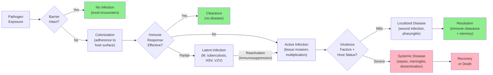
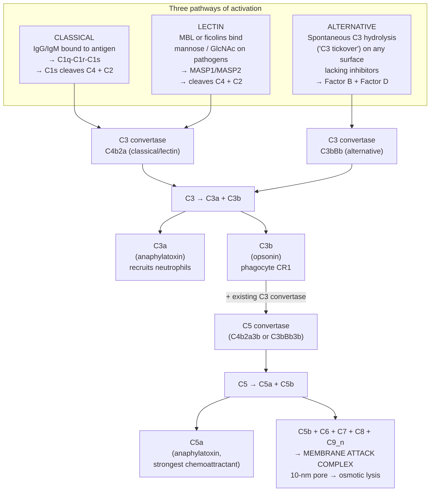
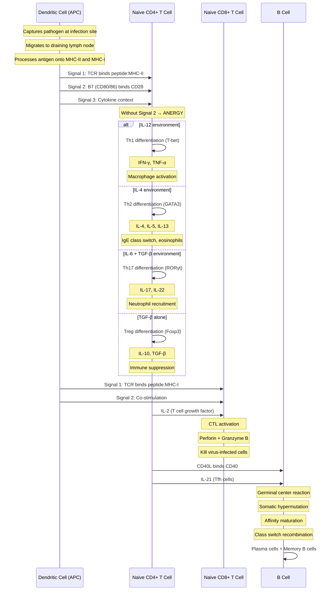
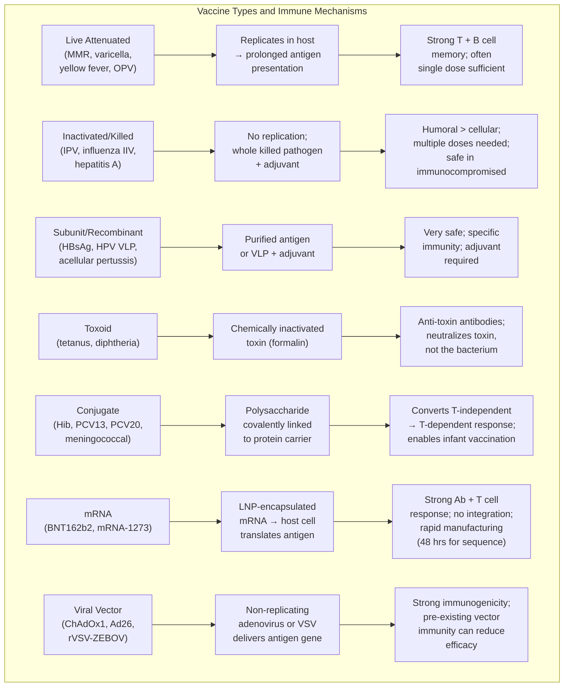
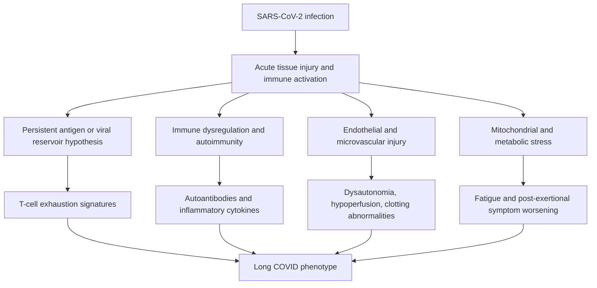
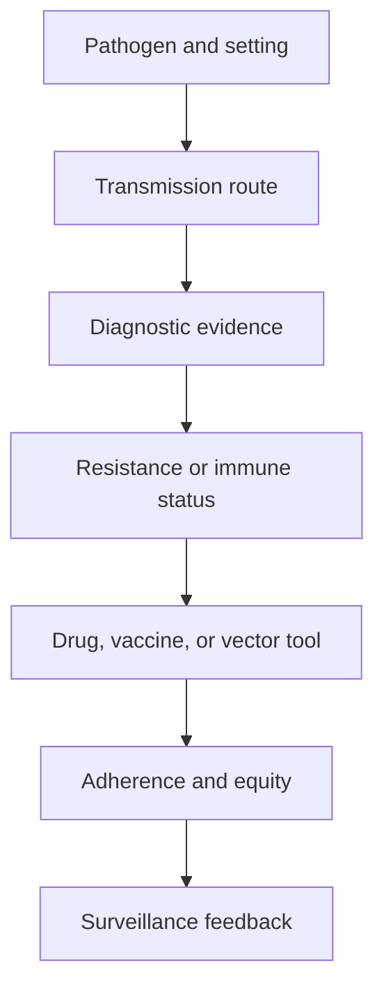

# Host Immunity and Vaccines

\label{sec:unit_VII_host_immunity_and_vaccines}

<!-- chapter-metadata-badge -->
> Level 2/3 · 30 min read · 40 min lecture · Prerequisites: \cref{sec:unit_VII_bacteria_archaea_viruses}

## Learning Objectives

By the end of this chapter, you should be able to:

1. Apply Koch's postulates and molecular Koch's postulates to evaluate evidence for microbial causation of disease, and identify their limitations.
2. Describe [**virulence**](#gl:virulence) factors (adhesins, toxins, invasion machinery, immune evasion strategies) used by major bacterial, viral, and eukaryotic pathogens.
3. Explain innate immune defenses including physical barriers, pattern recognition receptors (TLRs, NLRs, RIG-I, cGAS-STING), the three complement pathways and their convergence at C3, and cellular effectors (neutrophils with NETosis, macrophages, NK cells with missing-self recognition).
4. Describe adaptive immunity including V(D)J [**recombination**](#gl:recombination), MHC restriction, T helper cell subsets, cytotoxic T cell killing mechanisms, B cell activation, affinity maturation, and antibody class switching.
5. Compare the eight major [**vaccine**](#gl:vaccine) platforms (live attenuated, inactivated, subunit, virus-like-particle, toxoid, conjugate, mRNA, viral vector) and apply the [**herd immunity**](#gl:herd-immunity) equation $p_c = 1 - 1/R_0$ to compute thresholds for measles, polio, and COVID-19 variants.
6. Describe antigenic variation in influenza (drift vs shift) and HIV (reverse-transcriptase quasi-species clouds), and connect this to vaccine reformulation and pandemic risk.
7. Classify the principal antibiotic-resistance mechanisms (β-lactamases including ESBLs and carbapenemases, efflux pumps, target modification including PBP2a in MRSA and 23S rRNA methylation in MLS-resistant streptococci, reduced permeability, bypass pathways) and link each to specific drug classes.
8. Describe the epidemiology and pathogenesis of major infectious diseases including tuberculosis, malaria, HIV/AIDS, and influenza, and explain the One Health framework.

<!-- curriculum-scaffold-start -->
### Study Blueprint

- **Big idea:** Host immunity and vaccination reshape pathogen transmission by changing susceptible fractions.
- **Core concepts:** innate immunity, adaptive immunity, vaccination, herd immunity.
- **Framework alignment:** Vision & Change: Evolution, Systems, Structure and function; AP Biology: Evolution, Systems Interactions; NGSS-style topics: Structure and Function, Interdependent Relationships in Ecosystems.
- **Model or quantitative lens:** Herd-immunity threshold and basic immunological reasoning.
- **Data skill:** Interpret antibody, cellular, and vaccine-response evidence.
- **Practice cadence:** Questions and Methods, Representing and Describing Data, Argumentation.
- **Common misconception to repair:** Immunity is not binary; timing, dose, and variant matter.
- **Primary lab:** \nameref{sec:lab_unit_VII_host_immunity_and_vaccines}.
- **Question bank:** \nameref{sec:q_unit_VII_host_immunity_and_vaccines}.
- **Transfer task:** Transfer immunity reasoning to outbreak response and clinical decision-making.
- **Bridge to computation:** `biology.microbiology.microbiology.sir_model`.
<!-- curriculum-scaffold-end -->

\begin{figure}[htbp]
\centering
\includegraphics[width=0.85\textwidth]{../figures/sir_model.png}
\caption{SIR compartment trajectories for a closed population. Susceptible individuals decline as the infected compartment peaks, then recoveries accumulate; $R_0$ sets outbreak scale.}
\label{fig:unit_VII_sir_model}
\end{figure}

<!-- alt: Time series of susceptible, infected, and recovered populations during an SIR epidemic. -->

---

> **Opening Vignette — The Pandemic That Shaped Modern Immunology**
> 
> The 1918 influenza pandemic infected an estimated 500 million people — one-third of the world's population — and killed between 50 and 100 million, more than World War I. Most victims were healthy young adults, a terrifying reversal of the usual mortality pattern, caused by a cytokine storm in which a vigorous immune response became catastrophically self-destructive. The pandemic revealed in gruesome detail the cost of a misdirected immune response and the urgency of understanding host-pathogen dynamics. From its ashes grew modern epidemiology, the concept of herd immunity, and the influenza surveillance networks that today sequence viral [**genome**](#gl:genome)s in near-real time. When SARS-CoV-2 emerged in 2019, it was 1918's lessons — social distancing, masking, rapid vaccine development — that shaped the global response. Infectious disease is not a relic of the past; it is the central selective pressure on immune system evolution.

## Host-Pathogen Relationships and Virulence

### Koch's Postulates

In 1884, Robert Koch formalized criteria for establishing that a specific microorganism causes a specific disease. These four postulates remain foundational in infectious disease \citep{koch1884}:

1. The microorganism must be found in most cases of the disease but not in healthy individuals
2. The microorganism must be isolated from the diseased host and grown in pure culture
3. The cultured microorganism must cause the same disease when inoculated into a healthy, susceptible host
4. The same microorganism must be re-isolated from the experimentally infected host

**Limitations of Koch's postulates** have become apparent with advancing knowledge:

- **Asymptomatic carriers**: *Salmonella typhi* (Typhoid Mary), *Neisseria meningitidis* -- healthy carriers exist, violating postulate 1
- **Unculturable organisms**: Viruses (until cell culture), *Treponema pallidum*, *Mycobacterium leprae* -- cannot fulfill postulate 2
- **Ethical constraints**: Human experimentation with lethal pathogens is prohibited
- **Polymicrobial disease**: Periodontal disease, bacterial vaginosis -- caused by community shifts, not single organisms
- **Host factors**: *Mycobacterium tuberculosis* causes disease in about 5-10% of infected individuals (the rest maintain latent infection)

### Molecular Koch's Postulates

In 1988, Stanley Falkow proposed a molecular framework for identifying virulence determinants:

1. The virulence [**gene**](#gl:gene) (or its product) should be found in pathogenic strains but not in non-pathogenic relatives
2. Inactivation of the gene (by [**mutation**](#gl:mutation) or deletion) should reduce virulence in an appropriate model
3. Complementation (restoration of the gene) should restore virulence

This framework has been essential for identifying virulence factors through targeted gene knockouts and complementation studies in model organisms.

### The Infection Continuum

<!-- alt: Flowchart showing decision-tree of pathogen exposure outcomes from initial encounter through clearance, latency, or systemic disease. -->

*Decision-tree of pathogen exposure outcomes from initial encounter through clearance, latency, or systemic disease.*

Not every exposure leads to colonization, not every colonization leads to infection, and not every infection leads to disease. The outcome depends on pathogen virulence, inoculum size, route of entry, and host immune status.

### Virulence Factors and Host-Tissue Damage

Pathogens deploy specific molecular tools to adhere to host tissues, invade cells, obtain nutrients, and evade immune defenses, while host pattern-recognition systems translate microbial signatures into inflammatory and adaptive responses \citep{medzhitov2007recognition}:

**Adhesins** mediate initial attachment to host surfaces:

- **Type IV pili** (*Neisseria gonorrhoeae*, *N. meningitidis*): Retractile pili that mediate attachment to epithelial surfaces and facilitate twitching motility
- **FimH** (*E. coli*): Type 1 fimbrial adhesin that binds mannose residues on uroepithelial cells, enabling urinary tract infection
- **Fibronectin-binding [**protein**](#gl:protein)s** (*Staphylococcus aureus*): Mediate attachment to extracellular matrix, enabling wound infections and endocarditis

**Invasion factors**:

- **Type III secretion system (T3SS)**: *Salmonella enterica* SPI-1 (Salmonella Pathogenicity Island 1) encodes a molecular syringe that injects effector proteins (SopE, SipA) directly into host epithelial cells, triggering [**actin**](#gl:actin) [**cytoskeleton**](#gl:cytoskeleton) rearrangement and bacterial internalization via membrane ruffling
- **Internalins** (*Listeria monocytogenes*): InlA binds E-cadherin, InlB binds Met receptor; trigger receptor-mediated [**endocytosis**](#gl:endocytosis); once internalized, Listeria escapes the phagosome (listeriolysin O) and propels itself through the [**cytoplasm**](#gl:cytoplasm) using actin polymerization (ActA recruits host Arp2/3 complex)

**Capsules**: Polysaccharide capsules (*Streptococcus pneumoniae*, *Neisseria meningitidis*, *Haemophilus influenzae* type b) inhibit phagocytosis by preventing complement C3b deposition and obscuring surface antigens. The pneumococcal capsule has >90 serotypes, forming the basis for conjugate vaccine design (PCV13, PCV20).

### Toxins and Molecular Mechanisms of Pathogenesis

**Exotoxins** are secreted proteins with specific mechanisms of action. Many have the A-B structure: the B (binding) subunit binds a host cell receptor, and the A (active) subunit enters the cell to exert its toxic effect:

: Toxins and Molecular Mechanisms of Pathogenesis: Toxin and Organism. {#tbl:unit_VII_host_immunity_and_vaccines_toxins_and_molecular_mechanisms_of_pathogenesis}
| Toxin | Organism | B-Subunit Target | A-Subunit Activity | Clinical Effect |
|-------|----------|-------------------|-------------------|----------------|
| Cholera toxin | *V. cholerae* | GM1 ganglioside | ADP-ribosylates Gsα -> constitutive adenylyl cyclase activation -> cAMP $\uparrow$ | Cl$^-$/H$_2$O secretion -> watery diarrhea (up to 20 L/day) |
| Diphtheria toxin | *C. diphtheriae* | HB-EGF receptor | ADP-ribosylates EF-2 -> halts protein synthesis | Pseudomembrane in throat; myocarditis |
| Tetanospasmin | *C. tetani* | Gangliosides (retrograde transport) | Zinc metalloprotease cleaves VAMP/synaptobrevin | Blocks inhibitory neurotransmitter release (glycine, GABA) -> spastic paralysis |
| Botulinum toxin | *C. botulinum* | Gangliosides (peripheral nerve) | Zinc metalloprotease cleaves SNARE proteins (SNAP-25, syntaxin) | Blocks ACh release at NMJ -> flaccid paralysis |
| Shiga toxin | *Shigella*, STEC *E. coli* | Gb3 (globotriaosylceramide) | N-glycosidase cleaves 28S rRNA | Halts protein synthesis; HUS (hemolytic uremic syndrome) |

**Endotoxin (LPS)**: Unlike exotoxins, endotoxin is not secreted but released upon bacterial lysis. Lipid A activates TLR4 on macrophages, triggering release of TNF-α, IL-1β, and IL-6. At high concentrations (Gram-negative bacteremia), this causes fever, hypotension, disseminated intravascular coagulation (DIC), multi-organ failure, and septic shock.

**Immune evasion strategies**:

- **Protein A** (*S. aureus*): Binds the Fc region of IgG in the "wrong" orientation, preventing opsonization and ADCC
- **IgA protease** (*N. gonorrhoeae*, *H. influenzae*): Cleaves secretory IgA at mucosal surfaces
- **Antigenic variation**: *Trypanosoma brucei* expresses variant surface glycoprotein (VSG) from a library of >1,000 *vsg* genes, switching expression before the host mounts an effective antibody response
- **Phagosome arrest**: *M. tuberculosis* inhibits phagosome-lysosome fusion via LAM (lipoarabinomannan)

> **Concept Check 1:**
> *Vibrio cholerae* produces cholera toxin that causes massive fluid secretion, yet the bacterium rarely invades beyond the intestinal epithelium. Explain why this non-invasive strategy is advantageous for the pathogen's transmission, and predict what would happen to cholera epidemiology if the toxin were eliminated by gene deletion.

---

## Innate Immunity and Rapid Pattern Recognition

### Physical and Chemical Barriers

The first line of defense prevents pathogen entry into sterile body compartments:

A barrier is not just a wall; it is an active ecological and immunological interface. Skin acidity, mucus flow, antimicrobial peptides, secretory IgA, iron sequestration, and resident microbiota most create selection pressures that pathogens must evade. Barrier failure can therefore come from physical breach, altered chemistry, disrupted microbial competition, or medical devices that bypass normal surfaces.

: Physical and Chemical Barriers: Barrier and Mechanism. {#tbl:unit_VII_host_immunity_and_vaccines_physical_and_chemical_barriers}
| Barrier | Mechanism | Pathogens That Breach It |
|---------|-----------|------------------------|
| **Skin** | Intact keratin layer; low [**pH**](#gl:ph) (~5.5); fatty acids; defensins; commensal [**microbiota**](#gl:microbiota) | Burns, wounds, catheter insertion bypass skin |
| **Mucociliary escalator** | Respiratory mucus traps particles; cilia beat at 12-15 Hz, propelling mucus upward | *P. aeruginosa* [**biofilm**](#gl:biofilm) in CF; influenza HA cleaves sialic acid in mucus |
| **Gastric acid** | pH 1.5-3.5; pepsin activation | *H. pylori*: urease produces NH$_3$ to neutralize local pH |
| **Lysozyme** | Muramidase: cleaves NAG-NAM bonds in peptidoglycan | Present in tears, saliva, nasal secretions, breast milk |
| **Lactoferrin** | Iron sequestration (bacteriostatic) | Found at mucosal surfaces; deprives bacteria of essential iron |
| **Defensins** | Antimicrobial peptides (AMPs); form pores in microbial membranes | Produced by epithelial cells and neutrophils; α-defensins (Paneth cells), β-defensins (skin, respiratory) |
| **Resident microbiota** | Colonization resistance (nutrient competition, bacteriocins, bile acid metabolism) | *C. difficile* exploits antibiotic-disrupted microbiota |

### Pattern Recognition Receptors (PRRs)

The innate immune system detects conserved microbial structures -- **pathogen-associated molecular patterns (PAMPs)** -- through germline-encoded PRRs. This system provides immediate recognition without prior exposure:

: Pattern Recognition Receptors (PRRs): PRR and Location. {#tbl:unit_VII_host_immunity_and_vaccines_pattern_recognition_receptors_prrs}
| PRR | Location | PAMP Recognized | Signaling Pathway | Outcome |
|-----|----------|----------------|-------------------|---------|
| **TLR4** | Plasma membrane | LPS (lipid A) | MyD88 -> NF-κB; TRIF -> IRF3 | Pro-inflammatory cytokines + type I IFN |
| **TLR2** | Plasma membrane | Peptidoglycan, lipoteichoic acid, zymosan | MyD88 -> NF-κB | Pro-inflammatory cytokines |
| **TLR3** | Endosome | dsRNA | TRIF -> IRF3 | IFN-β (antiviral state) |
| **TLR7/8** | Endosome | ssRNA | MyD88 -> NF-κB + IRF7 | Type I IFN + cytokines |
| **TLR9** | Endosome | Unmethylated CpG DNA | MyD88 -> NF-κB | Type I IFN + cytokines |
| **RIG-I / MDA5** | Cytoplasm | Viral RNA (5'-ppp, long dsRNA) | MAVS -> IRF3 | IFN-β |
| **NLRP3** | Cytoplasm | DAMPs (ATP, uric acid, cholesterol crystals) | ASC -> [**Caspase**](#gl:caspase)-1 | IL-1β, IL-18, gasdermin D -> pyroptosis |
| **cGAS-STING** | Cytoplasm-ER | Cytoplasmic dsDNA | cGAMP -> STING -> IRF3 | IFN-β; critical for DNA virus detection |

Key signaling outcomes of PRR activation:

- **NF-κB pathway**: [**Transcription**](#gl:transcription) of pro-inflammatory cytokines (IL-1β, IL-6, TNF-α, IL-8/CXCL8) and chemokines
- **IRF3/7 pathway**: Type I interferons (IFN-α/β) -> JAK-STAT signaling -> interferon-stimulated genes (ISGs: OAS/RNase L, Mx proteins, PKR) -> antiviral state in neighboring cells

### The Complement System: Three Pathways, One Cascade

The complement system is a cascade of ~ 30 plasma proteins that opsonize pathogens, recruit inflammation, and lyse Gram-negative bacteria. Three pathways converge on a common effector cascade through the central enzyme **C3 convertase**, which hydrolyses C3 into C3a (anaphylatoxin) and C3b (opsonin).

<!-- alt: Flowchart showing three pathways of complement activation (classical, lectin, alternative) converge at the C3 convertase, producing C3b (opsonin) and C3a (anaphylatoxin); a second cleavage at C5 generates C5a and the C5b–C9 membrane-attack complex. -->

*Three pathways of complement activation (classical, lectin, alternative) converge at the C3 convertase, producing C3b (opsonin) and C3a (anaphylatoxin); a second cleavage at C5 generates C5a and the C5b–C9 membrane-attack complex.*

- **C3a** — a 9-kDa anaphylatoxin: binds C3aR on mast cells (degranulation, histamine), endothelial cells (vasodilation, vascular permeability), and granulocytes (recruitment).
- **C3b** — a 175-kDa opsonin: covalently binds pathogen surface; recognized by complement receptor 1 (CR1, CD35) on phagocytes, dramatically enhancing phagocytosis.

A second cleavage step generates:

- **C5a** — the strongest neutrophil chemoattractant in plasma (effective at picomolar concentrations); binds C5aR1.
- **C5b** — initiates the **membrane attack complex (MAC)**: C5b + C6 + C7 + C8 + (10–18 copies of) C9 polymerize into a 10-nm transmembrane pore that lyses the target cell osmotically. The MAC is most effective against Gram-negative bacteria (which lack the thick peptidoglycan barrier of Gram-positives); *Neisseria meningitidis* and *N. gonorrhoeae* are particularly MAC-susceptible — terminal-complement deficiencies (C5–C9) cause recurrent neisserial infections almost exclusively.

**Complement regulation.** Self cells avoid complement attack via membrane-bound and soluble regulators:

: The Complement System: Three Pathways, One Cascade: Regulator and Action. {#tbl:unit_VII_host_immunity_and_vaccines_the_complement_system_three_pathways_one_cascade}
| Regulator | Action | Defect → disease |
|-----------|--------|-------------------|
| **CD46 (MCP, membrane cofactor protein)** | Cofactor for Factor I cleavage of C3b/C4b | Atypical hemolytic uremic syndrome (aHUS) |
| **CD55 (DAF, decay-accelerating factor)** | Accelerates decay of C3 and C5 convertases | Paroxysmal nocturnal haemoglobinuria (PNH; CD55+CD59 GPI loss) |
| **CD59 (protectin)** | Blocks C9 polymerization (MAC) | PNH (hemolysis) |
| **Factor H** | Inhibits alternative pathway on self surfaces | aHUS; age-related macular degeneration (AMD) |
| **C1 inhibitor** | Blocks C1r/C1s and MASPs | Hereditary angioedema (HAE) |

*Neisseria meningitidis* and *N. gonorrhoeae* have evolved a remarkable trick — they bind host Factor H to their surface using **factor H–binding protein (fHbp)**, mimicking self and inactivating alternative-pathway amplification. fHbp is now a target antigen in two licensed meningococcal-B vaccines (Bexsero, Trumenba).

### Phagocytosis and Cellular Effectors

#### Neutrophil Killing: Oxidative Burst and NETosis

**Neutrophils** are the most abundant circulating leukocytes (50–70 % of blood leukocytes) and the first cells to arrive at sites of infection (within minutes of chemokine signal). Their lifespan is extraordinarily short — ~ 6–8 hours in circulation, ~ 1–4 days at tissue sites — reflecting a cell programmed for rapid microbial killing followed by apoptosis to limit collateral tissue damage.

**Oxidative burst (respiratory burst).** Upon phagosome formation, the **NADPH oxidase complex (NOX2)** assembles at the phagosome membrane:

$$ 2\text{O}_2 + \text{NADPH} \xrightarrow{\text{NOX2}} 2\text{O}_2^- + \text{NADP}^+ + \text{H}^+  \label{eq:unit_VII_infectious_disease_item_1}$$

Superoxide ($O_2^-$) is rapidly converted to hydrogen peroxide ($H_2O_2$) by superoxide dismutase. **Myeloperoxidase (MPO)** — abundant in neutrophil azurophilic granules — then catalyses the most potent step of microbial killing:

$$ \text{H}_2\text{O}_2 + \text{Cl}^- \xrightarrow{\text{MPO}} \text{HOCl} + \text{OH}^-  \label{eq:unit_VII_infectious_disease_item_2}$$

**HOCl (hypochlorous acid, household-bleach chemistry)** is one of the most potent oxidants in biology — it chlorinates microbial proteins, lipids, and DNA, killing many phagocytosed microbes within minutes. The phagosome is also acidified (pH ~ 4.5) and accumulates antimicrobial peptides (defensins, BPI, lactoferrin). Survival is uncommon for non-adapted microbes but biologically important pathogens such as *M. tuberculosis*, *Salmonella*, and *Leishmania* persist by blocking phagosome maturation, resisting reactive species, or escaping the vacuole.

### Worked Example: Quantifying the Neutrophil Oxidative Burst

**Problem:** A neutrophil phagosome contains $2.0 \times 10^{-15}$ L volume and local NADPH concentration reaches 0.5 mM during NOX2 activation. Assuming stoichiometric conversion via \cref{eq:unit_VII_infectious_disease_item_1} and complete superoxide dismutase conversion to $H_2O_2$, then MPO-mediated HOCl production via \cref{eq:unit_VII_infectious_disease_item_2} with abundant chloride, estimate the maximum $H_2O_2$ (mmol) available for HOCl synthesis in one burst.

**Solution.**

1. **NADPH moles in phagosome.** $n = 0.5\,\text{mmol L}^{-1} \times 2.0 \times 10^{-15}\,\text{L} = 1.0 \times 10^{-18}\,\text{mol}$.

2. **Stoichiometry.** Each NADPH yields one $H_2O_2$ after dismutase: $n(H_2O_2) = 1.0 \times 10^{-18}\,\text{mol} = 1.0 \times 10^{-15}\,\text{mmol}$.

3. **Scale check.** Although the absolute moles are tiny, local concentrations in the phagosome lumen reach millimolar HOCl for microseconds — sufficient to oxidise microbial surface proteins before dilution. Chronic granulomatous disease (CGD), in which NOX2 is defective, removes this flux entirely, explaining recurrent catalase-positive infections.

**Interpretation.** The burst is a volume-concentrated chemical weapon: small total moles, extreme local reactivity.

**NETosis.** Discovered in 2004 (Brinkmann *et al.*, *Science*), NETosis is a programmed neutrophil death pathway in which the cell releases its decondensed [**chromatin**](#gl:chromatin) — decorated with citrullinated [**histone**](#gl:histone)s, neutrophil elastase, MPO, defensins, and granule contents — to form **neutrophil extracellular traps (NETs)** that physically capture and chemically kill extracellular bacteria, fungi, and large parasites. The molecular pathway:

1. Activation by PAMPs / immune complexes / cytokines triggers ROS production by NOX2.
2. **PAD4 (peptidylarginine deiminase 4)** citrullinates histone H3 (Arg → citrulline), neutralizing positive charge and decompacting chromatin.
3. Nuclear membrane breaks down; chromatin enters cytoplasm; granule contents bind to chromatin.
4. Plasma membrane lyses, releasing the NET into the extracellular space (cell death).

NETs are evolutionarily ancient (zebrafish neutrophils, *Drosophila* haemocytes, even sea-anemone amoebocytes form similar traps). Pathological NETosis is now implicated in **immunothrombosis** in severe COVID-19 (NETs trap platelets and trigger coagulation, contributing to microvascular clots), in autoimmune diseases (citrullinated histones drive ACPA antibodies in rheumatoid arthritis; anti-NET antibodies in lupus), and in chronic wound failure.

**Macrophages** are tissue-resident phagocytes with diverse functions:

- Tissue-specific names: Kupffer cells (liver), alveolar macrophages (lung), microglia (brain), osteoclasts (bone), Langerhans cells (skin -- actually dendritic cells)
- **M1 polarization** (IFN-γ + LPS): Pro-inflammatory; produces iNOS -> nitric oxide (NO); secretes TNF-α, IL-12; activates Th1 responses against intracellular pathogens
- **M2 polarization** (IL-4, IL-13): Anti-inflammatory; produces arginase; secretes IL-10, TGF-β; promotes wound healing, tissue repair, and fibrosis

#### NK Cells: Missing-Self and Induced-Self Recognition

**Natural killer (NK) cells** are innate lymphocytes (~ 5–15 % of blood lymphocytes) that kill virus-infected and transformed cells without prior sensitization. They are the innate immune system's solution to a fundamental problem: how to detect cells that are *abnormal* from the inside, when no conserved pathogen pattern is present on the cell surface.

NK-cell killing is governed by an **integration of inhibitory and activating receptor signals** — the "balance hypothesis." A cell is killed when activating signals exceed inhibitory signals.

**Missing-self hypothesis (Ljunggren and Karre, 1990).** Healthy cells display abundant MHC class I on their surface, presenting peptides for surveillance by CD8$^+$ T cells. NK cells carry **inhibitory KIRs (killer immunoglobulin-like receptors; KIR2DL, KIR3DL)** that recognize self MHC-I. Engagement delivers an **inhibitory signal** through ITIMs (immunoreceptor tyrosine-based inhibitory motifs), suppressing the NK-cell killing program. Many viruses (CMV, HIV, KSHV) and tumors **downregulate MHC class I** to avoid CD8$^+$ T cell detection — but this loss removes the inhibitory signal to NK cells, unmasking the cell for NK-mediated killing. The strategy has trade-offs: CMV has evolved decoy MHC-I-like proteins (UL18) that bind inhibitory NK receptors to mimic self.

**Induced-self via NKG2D.** A complementary mechanism detects cellular stress. **NKG2D** is an activating receptor on NK cells (and on subsets of CD8$^+$ T cells, γδ T cells, NKT cells) that recognizes **stress-induced ligands**: **MICA, MICB** (MHC class I chain-related), **ULBP1–6** (UL16-binding proteins). These ligands are **absent on healthy cells** but induced by:

- DNA damage (ATR/ATM pathway) — common in transformed cells.
- Viral infection.
- Heat shock response.
- Oxidative stress.

NKG2D ligands are MHC-I-like in fold but lack peptide-binding groove and β2-microglobulin association. Their induction provides a "danger signal" that bypasses normal MHC-I inhibition. NKG2D engagement signals through DAP10/DAP12 adaptors to activate cytotoxicity. Many cancers shed soluble MICA/MICB into circulation as a decoy that downmodulates surface NKG2D — an immune escape mechanism now targeted by anti-MICA-shedding antibodies in cancer immunotherapy.

**NK-cell killing mechanisms** (shared with CTLs):

- **Perforin/granzyme** — perforin polymerizes in target membrane (similar to MAC); granzymes (especially granzyme B) enter and cleave caspase-3/7 → [**apoptosis**](#gl:apoptosis).
- **Death receptor ligands** — FasL, TRAIL on NK cell engage Fas, DR4/DR5 on target → DISC → caspase-8 → apoptosis.
- **Antibody-dependent cellular cytotoxicity (ADCC)**: NK cell **CD16 (FcγRIII)** binds IgG bound to target cell surface → directed degranulation. ADCC is the principal mechanism by which anti-tumor antibodies (rituximab, trastuzumab) kill cancer cells, and a substantial fraction of vaccine-induced antiviral protection.

### Inflammation and Vascular Recruitment of Immune Cells

The cardinal signs of inflammation (rubor, calor, tumor, dolor -- redness, heat, swelling, pain) result from vascular changes triggered by innate immune activation:

- **Mast cell degranulation**: Histamine, tryptase, leukotrienes -> vasodilation + increased vascular permeability
- **Cytokine cascade**: IL-1β (fever, endothelial activation); TNF-α (fever, hypotension, acute-phase response); IL-6 (hepatic acute-phase proteins: CRP, fibrinogen, complement, ferritin); IL-8/CXCL8 (neutrophil chemotaxis)
- **Acute-phase response**: Liver produces C-reactive protein (CRP), which binds phosphocholine on bacterial surfaces and activates complement

> **Clinical Connection: Sepsis and Cytokine Storm**
> Sepsis is defined as life-threatening organ dysfunction caused by a dysregulated host response to infection (Sepsis-3 criteria, 2016). It affects approximately 49 million people and causes 11 million deaths annually worldwide (WHO). In sepsis, the normally protective inflammatory response becomes pathologically amplified: massive cytokine release (TNF-α, IL-1β, IL-6) causes widespread endothelial dysfunction, capillary leak, coagulopathy (DIC), and multi-organ failure. The SOFA (Sequential Organ Failure Assessment) score quantifies organ dysfunction. Cytokine storm -- a related phenomenon -- was observed in severe COVID-19 (IL-6 pathway hyperactivation; treated with tocilizumab, an IL-6 receptor antagonist) and in cytokine release syndrome (CRS) following CAR-T cell therapy.

> **Concept Check 2:**
> A child with chronic granulomatous disease (CGD) has a mutation in the gp91phox subunit of NADPH oxidase. Predict which types of infections this child will be susceptible to, and explain why catalase-positive bacteria (*S. aureus*, *Aspergillus*) are particularly dangerous in CGD while catalase-negative bacteria (*Streptococcus*) are not.

> **Concept Check 2b:**
> A patient with paroxysmal nocturnal haemoglobinuria (PNH) has a somatic mutation in *PIGA* causing loss of GPI-anchored proteins on red blood cells, including CD55 and CD59. Explain (a) why these red cells are constantly haemolysed by their own complement system, (b) why the disease is paroxysmal (worse at night/with sleep), and (c) why eculizumab (anti-C5 monoclonal antibody) is curative. Which complement step does eculizumab block, and what infectious-disease vaccination is mandatory before starting it?

---

## Adaptive Immunity: Antigen Presentation, T Cells, and Clonal Specificity

The adaptive immune system provides antigen-specific responses with immunological memory. Its defining features include the coordinated innate-to-adaptive handoff that determines which lymphocyte programs are selected \citep{chaplin2010immuneresponse,iwasaki2015innateadaptive}:

- **Specificity**: Each lymphocyte clone bears a unique antigen receptor (TCR or BCR) generated by somatic recombination
- **Diversity**: $>10^{12}$ possible TCR specificities; $>10^8$ BCR specificities
- **Clonal selection**: Antigen selects and expands primarily those lymphocyte clones with matching receptors
- **Memory**: Long-lived memory cells mount faster, stronger secondary responses upon re-encounter
- **Self-tolerance**: Autoreactive clones are eliminated (central tolerance) or suppressed (peripheral tolerance)

### MHC Molecules and Antigen Presentation

Major histocompatibility complex (MHC) molecules present peptide fragments to T cells, providing the context for antigen recognition:

**MHC class I** (HLA-A, HLA-B, HLA-C in humans):

- Expressed on **most nucleated cells**
- Present **endogenous peptides** (from cytoplasmic proteins): proteasome -> peptide fragments -> TAP transporter -> ER -> peptide loading onto MHC-I -> cell surface
- Recognized by **CD8$^+$ T cells** (cytotoxic T lymphocytes)
- Presents viral antigens and tumor antigens from within the cell

**MHC class II** (HLA-DR, HLA-DP, HLA-DQ):

- Expressed on **professional antigen-presenting cells (APCs)**: dendritic cells, macrophages, B cells
- Present **exogenous peptides** (from phagocytosed material): endosomal/lysosomal degradation -> CLIP removal by HLA-DM -> peptide loading onto MHC-II -> cell surface
- Recognized by **CD4$^+$ T cells** (helper T cells)

MHC genes are the most polymorphic in the human genome (~20,000 HLA [**allele**](#gl:allele)s in the population), ensuring that no pathogen peptide can escape presentation in most individuals -- a population-level defense strategy.

### T Cell Activation and Differentiation

<!-- alt: Sequence diagram showing three-signal T cell activation by dendritic cells, with cytokine-context-driven differentiation into Th1/Th2/Th17/Treg/Tfh subsets and downstream activation of cytotoxic CD8^+ T cells and antibody-producing B cells. -->

*Three-signal T cell activation by dendritic cells, with cytokine-context-driven differentiation into Th1/Th2/Th17/Treg/Tfh subsets and downstream activation of cytotoxic CD8$^+$ T cells and antibody-producing B cells.*

- **Signal 1**: TCR recognition of peptide:MHC complex (specificity signal)
- **Signal 2**: Co-stimulatory signal -- CD28 on T cell binds B7 molecules (CD80/CD86) on APC. Without this signal, the T cell becomes **anergic** (functionally unresponsive) -- a mechanism of peripheral tolerance
- **Signal 3**: Cytokine environment determines effector subset differentiation

**T helper cell subsets**:

: T Cell Activation and Differentiation: Subset and Inducing Cytokines. {#tbl:unit_VII_host_immunity_and_vaccines_t_cell_activation_and_differentiation}
| Subset | Inducing Cytokines | Master Transcription Factor | Signature Cytokines | Primary Function |
|--------|-------------------|---------------------------|-------------------|-----------------|
| Th1 | IL-12, IFN-γ | T-bet | IFN-γ, TNF-α | Macrophage activation; intracellular pathogens |
| Th2 | IL-4 | GATA3 | IL-4, IL-5, IL-13 | B cell IgE switching; eosinophils; helminths; allergy |
| Th17 | IL-6 + TGF-β + IL-23 | RORγt | IL-17, IL-22 | Neutrophil recruitment; mucosal defense; fungi |
| Treg | TGF-β | Foxp3 | IL-10, TGF-β | Suppress excessive inflammation; maintain tolerance |
| Tfh | IL-6, IL-21 | Bcl6 | IL-21, CXCL13 | B cell help in germinal centers |

**Cytotoxic T lymphocytes (CTLs, CD8$^+$)** recognize viral or tumor antigens on MHC-I and kill target cells through:

- **Perforin/granzyme pathway**: Perforin polymerizes in the target membrane, forming pores; granzyme B enters and activates caspase-3/7 -> apoptosis
- **Fas-FasL pathway**: CTL-expressed FasL binds Fas (CD95) on target -> DISC formation -> caspase-8 -> apoptosis
- **Serial killing**: A single CTL can kill 2-25 target cells sequentially via directed degranulation at the immunological synapse
- **Exhaustion**: In chronic infections (HBV, HCV, HIV), persistent antigen exposure leads to upregulation of inhibitory receptors (PD-1, TIM-3, LAG-3) and progressive loss of effector function -- the basis for PD-1/PD-L1 checkpoint inhibitor therapy in cancer

> **Concept Check 3:**
> Explain why a patient with a CD4$^+$ T cell count below 200 cells/μL (as in AIDS) is susceptible to opportunistic infections that healthy individuals easily control. Specifically, describe which arm of the immune response is most compromised and why both cellular and humoral immunity are affected despite B cells and CD8$^+$ T cells being present.

---

## B Cells and Antibodies

### B Cell Activation

B cell activation pathways differ depending on the nature of the antigen:

**T-dependent antigens** (protein antigens): BCR binds and internalizes antigen -> processes and presents peptides on MHC-II -> recognized by cognate Tfh cell -> CD40L-CD40 interaction + IL-21 -> B cell activation, proliferation, and entry into the germinal center reaction. This pathway produces high-affinity antibodies, class-switched isotypes, and long-lived memory.

**T-independent antigens** (repetitive polysaccharides, LPS): Cross-link multiple BCRs on the B cell surface -> activation without T cell help. Produces primarily IgM; limited affinity maturation; poor memory response. This is why polysaccharide vaccines (pneumococcal, meningococcal) are poorly immunogenic in children under 2 years (immature T-independent response) and why **conjugate vaccines** were developed.

### Germinal Center Reaction

The germinal center (GC) in secondary lymphoid organs is the site of antibody optimization:

1. **Clonal expansion**: Activated B cells (centroblasts) proliferate rapidly in the dark zone
2. **Somatic hypermutation (SHM)**: Activation-induced cytidine deaminase (AID) introduces point mutations in the variable (V) regions of immunoglobulin genes at a rate of ~$10^{-3}$ per base pair per division -- one million-fold higher than the normal mutation rate. AID deaminates cytidine to uridine in DNA, which is then processed by base excision repair or mismatch repair to generate diverse mutations.
3. **Affinity maturation**: Mutant B cells (centrocytes) migrate to the light zone, where they compete for antigen displayed on follicular dendritic cells (FDCs). Primarily B cells with improved BCR affinity receive survival signals; the rest undergo apoptosis. This Darwinian selection process progressively increases antibody affinity over successive rounds.
4. **Class switch recombination (CSR)**: AID also introduces double-strand breaks in switch (S) regions upstream of constant region genes, enabling recombination that changes the antibody class from IgM to IgG, IgA, or IgE while preserving antigen specificity. Cytokine signals determine which class is selected: IL-4 -> IgE; IFN-γ -> IgG1; TGF-β -> IgA.

The GC reaction produces two critical outputs: **long-lived plasma cells** (migrate to bone marrow; secrete high-affinity antibody for years to decades) and **memory B cells** (reside in secondary lymphoid organs; rapidly reactivate upon antigen re-encounter).

### Antibody Structure and Function

An antibody molecule consists of two identical heavy (H) chains and two identical light (L) chains, each containing variable (V) and constant (C) domains:

- **Fab region** (fragment antigen-binding): Contains the variable domains (VH + VL) that form the antigen-binding site (paratope). The three complementarity-determining regions (CDR1, CDR2, CDR3) within each variable domain make direct contact with antigen.
- **Fc region** (fragment crystallizable): The constant domains that determine antibody class and mediate effector functions (complement activation, Fc receptor binding on phagocytes and NK cells, placental transfer).
- **Hinge region**: Provides flexibility between Fab and Fc, allowing bivalent binding to spatially separated epitopes.

### Antibody Classes and Effector Functions

: Antibody Classes and Effector Functions: Isotype and Structure. {#tbl:unit_VII_host_immunity_and_vaccines_antibody_classes_and_effector_functions}
| Isotype | Structure | Location | Key Functions |
|---------|-----------|----------|--------------|
| **IgM** | Pentamer (10 binding sites) | Blood (primary response) | First antibody produced; efficient complement activation via classical pathway; low affinity compensated by high avidity |
| **IgG** | Monomer (4 subclasses) | Blood, extravascular; **crosses placenta** via FcRn | Most abundant serum antibody; opsonization; ADCC (via CD16 on NK cells); complement; neonatal passive immunity |
| **IgA** | Dimer (secretory IgA with secretory component) | Mucosal surfaces: saliva, tears, breast milk, intestinal lumen | Most produced antibody class (>3 g/day); neutralization at mucosal surfaces; immune exclusion |
| **IgE** | Monomer | Bound to mast cells and basophils via high-affinity FcεRI | Very low serum concentration; cross-linking by allergen -> mast cell degranulation -> immediate hypersensitivity; anti-helminth defense (eosinophil ADCC) |
| **IgD** | Monomer | Naive B cell surface (co-expressed with IgM) | BCR signaling; poorly understood effector function |

**Immunological memory** -- the basis of vaccination -- results from the persistence of long-lived plasma cells and memory B cells. Upon re-exposure, the secondary response is:

- **Faster**: Days instead of 1-2 weeks
- **Stronger**: 10-100 fold higher antibody titers
- **Higher affinity**: Memory B cells express somatically hypermutated, affinity-matured BCRs
- **Class-switched**: Predominantly IgG (or IgA at mucosal surfaces)

> **Concept Check 4:**
> Conjugate vaccines (e.g., PCV13) link bacterial polysaccharide antigens to protein carriers (e.g., CRM197, a nontoxic diphtheria toxoid). Explain the immunological rationale: why does conjugation convert a T-independent antigen into a T-dependent antigen, and why is this critical for vaccinating infants?

---

## Vaccines and Immunological Memory

### Vaccine Platforms: Eight Strategies for Inducing Memory

Vaccines exploit the same memory mechanisms that protect us after natural infection, but without the disease. The eight major platform classes — each with distinct strengths, limitations, and clinical exemplars — represent a 200-year-progressive enrichment of strategies for safely tricking the immune system into making memory.

<!-- alt: Flowchart showing eight vaccine platforms, the immune mechanism each engages, and characteristic clinical responses. -->

*Eight vaccine platforms, the immune mechanism each engages, and characteristic clinical responses.*

: Vaccine Platforms: Eight Strategies for Inducing Memory: Platform and Examples. {#tbl:unit_VII_host_immunity_and_vaccines_vaccine_platforms_eight_strategies_for_inducing_memory}
| Platform | Examples | Antigen form | Strengths | Limitations |
|----------|----------|--------------|-----------|-------------|
| **Live attenuated** | MMR, varicella (Varivax), yellow fever 17D, oral polio (OPV), BCG, rotavirus | Weakened replicating organism | Strong T + B memory; often a single dose; mucosal immunity (OPV) | Reversion to virulence (rare; OPV → cVDPV); contraindicated in immunocompromised and pregnancy |
| **Inactivated / killed** | IPV (Salk), inactivated influenza (IIV), hepatitis A (Havrix), rabies, whole-cell pertussis (legacy) | Chemically/heat-killed whole organism | Safe in immunocompromised; stable | Weaker than live; requires adjuvant + multiple doses |
| **Subunit / recombinant protein** | Hepatitis B (HBsAg in yeast), acellular pertussis (aP), zoster (Shingrix gE + AS01) | Purified protein antigen + adjuvant | Very safe; no infectious risk | Less immunogenic; adjuvant essential |
| **Virus-like particles (VLPs)** | HPV (Gardasil, Cervarix), HBV (also classified as subunit) | Self-assembled capsid proteins (no genome) | Particulate, highly immunogenic; structurally identical to virus | Difficult to engineer for some viruses |
| **Toxoid** | Tetanus (TT), diphtheria (DT, Tdap), botulism toxoid | Formalin-inactivated toxin | Anti-toxin antibodies neutralize the *toxin*, not the bacterium | No antibacterial protection; periodic boosters needed |
| **Conjugate** | Hib, PCV13, PCV20 (pneumococcal), meningococcal ACWY (Menactra) | Bacterial polysaccharide covalently linked to a protein carrier (CRM197, TT) | Converts T-independent → T-dependent response; enables infant immunization; affinity-matured response | Carrier-specific T cells diverted; serotype replacement after PCV introduction |
| **mRNA** | BNT162b2 (Pfizer-BioNTech), mRNA-1273 (Moderna), mRNA-1345 (RSV, 2024); flu mRNA-1010 (trial) | LNP-encapsulated nucleoside-modified mRNA encoding the antigen | Rapid design (48 hr from sequence); strong T + B response; no genome integration | Cold-chain dependent; rare myocarditis; waning antibody titres |
| **Viral vector** | rVSV-ZEBOV (Ebola), ChAdOx1 (AstraZeneca COVID), Ad26.COV2.S (J&J), gene-therapy AAV vectors | Non-replicating recombinant virus carrying antigen gene | Strong durable response; mucosal IgA achievable | Pre-existing vector immunity (Ad5 in adult populations) reduces efficacy; rare thrombosis (ChAdOx1) |

**mRNA vaccines** are the newest platform and represented a paradigm shift during the COVID-19 pandemic:

- The spike protein sequence of SARS-CoV-2 was published on January 11, 2020; Moderna had designed its mRNA-1273 vaccine candidate within 48 hours.
- The mRNA is modified (N1-methylpseudouridine replaces uridine, Karikó and Weissman discovery, Nobel Prize 2023) to reduce TLR7/8 recognition, block 2'-5'-OAS / RNase L degradation, and increase translational efficiency 10–100×.
- Lipid nanoparticle (LNP) encapsulation protects the mRNA from extracellular nucleases and facilitates cellular uptake; the four-component LNP (ionisable lipid, phospholipid, cholesterol, PEG-lipid) self-assembles into ~ 80-nm particles.
- Upon injection, host cells (predominantly muscle and dendritic cells at the injection site) translate the mRNA into spike protein, which is presented on MHC-I (activating CD8$^+$ CTLs) and secreted/surface-displayed (activating B cells and CD4$^+$ T cells).
- No integration into host DNA occurs — mRNA is degraded within hours to days.
- Spike is locked in the prefusion conformation by two proline substitutions (**2P mutation**) that preserve neutralizing epitopes.

The platform is now extending to **influenza** (mRNA-1010), **RSV** (mRNA-1345, FDA-approved 2024), **CMV**, and **personalised cancer neoantigen vaccines** (Moderna mRNA-4157 in Phase III for melanoma).

### Antigenic Variation: How Pathogens Outpace Antibody Responses

The single greatest challenge for vaccine development against many viruses is that the immune target itself **evolves under the selection pressure of the population's own immune response**. Two paradigmatic examples illustrate the strategies and the resulting public-health consequences.

**Influenza A: drift and shift.** Influenza A is a Class V segmented (-)ssRNA virus with 8 genome segments. Its surface glycoproteins **hemagglutinin (HA, 18 subtypes)** and **neuraminidase (NA, 11 subtypes)** are the primary targets of neutralizing antibodies. Influenza A undergoes two distinct mechanisms of antigenic change:

: Antigenic Variation: How Pathogens Outpace Antibody Responses: Feature and Antigenic drift. {#tbl:unit_VII_host_immunity_and_vaccines_antigenic_variation_how_pathogens_outpace_antibody_responses}
| Feature | **Antigenic drift** | **Antigenic shift** |
|---|---|---|
| Mechanism | Point mutations in HA (and NA) accumulating during replication | **Reassortment** of whole genome segments during co-infection of one cell by two influenza A strains (often in pigs as the "mixing vessel") |
| Rate | Continuous; ~ 0.5–1 % per year on HA1 | Episodic; rare events |
| Consequence | Antigenic mismatch with prior immunity → **seasonal epidemics** | Novel HA subtype unseen by population → **pandemic potential** |
| Vaccine response | Annual reformulation (WHO twice-yearly recommendation) | Requires entirely new pandemic vaccine |
| Why influenza A primarily? | Influenza B drifts but does not reassort with animal reservoirs at meaningful frequency; influenza A has a wide animal host range | Influenza A naturally infects birds, swine, humans, and other mammals — sustaining a reservoir of segments for reassortment |

**Pandemic history:**
- **1918 H1N1** ("Spanish flu") — 50–100 million deaths.
- **1957 H2N2** ("Asian flu") — 1–2 million deaths; H2 from avian source reassorted with circulating H1N1.
- **1968 H3N2** ("Hong Kong flu") — 1 million deaths; H3 from avian source.
- **2009 H1N1** (pandemic) — ~ 284,000 deaths; quadruple reassortant (avian + human + two swine lineages); milder than predicted because of partial cross-immunity from related H1N1 strains.
- **H5N1 highly pathogenic avian influenza (HPAI)** — ongoing outbreaks in dairy cattle and poultry (2024–26); ~ 60 % case-fatality rate in the rare human cases; intense surveillance for adaptation to mammalian transmission.

**HIV reverse transcriptase: the quasi-species cloud.** HIV uses an entirely different mechanism — extreme intra-host evolution. Reverse transcriptase has an **error rate of ~ 3 × 10⁻⁵ per base per replication cycle**, and HIV makes ~ $10^{10}$ virions per day in an untreated patient. With a 9.7-kb genome, this produces **every single point mutation in the viral genome multiple times every day** and a substantial fraction of possible double mutations. The resulting population — a cloud of related sequences around a consensus — is termed a **quasi-species**.

Consequences:

1. **Drug resistance is essentially preformed**: any single-target monotherapy fails within weeks because resistant variants pre-exist in the quasi-species cloud. This is why HIV treatment requires **combination ART** (≥ 3 drugs from ≥ 2 classes); the simultaneous probability of a virion carrying mutations conferring resistance to most drugs is astronomically low.
2. **Antibody escape is continuous**: the env gene (gp120/gp41) evolves rapidly under neutralizing-antibody pressure, with the variable loops V1/V2/V3 changing every few weeks within an individual.
3. **Vaccine difficulty**: a vaccine that elicits primarily narrowly-specific antibodies will fail. Successful HIV vaccine candidates aim for **broadly neutralizing antibodies (bNAbs)** that target conserved sites (CD4-binding site, fusion peptide) — but these require unusual germline B cells and prolonged affinity maturation, which most vaccinees do not develop.

The HIV quasi-species lesson — that within-host evolution can generate resistance faster than therapy can clear the virus — has now been applied to influenza, hepatitis C, and SARS-CoV-2 (the 32-spike-mutation Omicron emergence almost certainly arose from chronic infection of an immunocompromised host, where prolonged replication permitted accumulation of escape mutations).

### Herd Immunity and Population-Level Protection

When a sufficient proportion of a population is immune, the pathogen's transmission is interrupted even for non-immune individuals. The **herd-immunity threshold** is given by:

\begin{equation}
p_c = 1 - \frac{1}{R_0}
\label{eq:unit_VII_herd_immunity}
\end{equation}

where $p_c$ is the critical fraction of the population that must be immune and $R_0$ is the **basic reproduction number** (the expected number of secondary cases from one primary case in a fully susceptible population). \cref{fig:unit_VII_sir_model} shows how susceptible, infected, and recovered compartments evolve when $R_0>1$. The intuition: each case must produce on average less than one secondary case for the epidemic to die out; immunity removes a fraction of the contacts an infectious person makes, so the **effective reproduction number** is $R_e = R_0 (1 - p)$. Solving for $R_e = 1$ gives $p = 1 - 1/R_0$.

### Worked Example: Calculating Herd Immunity Threshold (Three Pathogens)

**Problem:** Compute the herd immunity threshold from \cref{eq:unit_VII_herd_immunity} for measles ($R_0 = 15$), polio ($R_0 = 5$), and original-strain SARS-CoV-2 ($R_0 = 2.5$), and discuss the implications for vaccination policy.

**Solution:**

: Calculating Herd Immunity Threshold (Three Pathogens): Pathogen and R_0. {#tbl:unit_VII_host_immunity_and_vaccines_worked_example_calculating_herd_immunity_threshold_three_pathogens}
| Pathogen | $R_0$ | $p_c = 1 - 1/R_0$ | Realistic vaccine efficacy $E$ | Required coverage $p_v = p_c / E$ |
|----------|-------|-------------------|--------------------------------|------------------------------------|
| **Measles** | 15 | $1 - 1/15 = 0.933$ → **93.3 %** | 0.97 (MMR two-dose) | $0.933 / 0.97 = 0.962$ → **96.2 %** |
| **Polio** | 5 | $1 - 1/5 = 0.800$ → **80 %** | 0.99 (IPV three-dose) | $0.800 / 0.99 = 0.808$ → **80.8 %** |
| **COVID-19 (original)** | 2.5 | $1 - 1/2.5 = 0.600$ → **60 %** | 0.95 (BNT162b2 against original) | $0.600 / 0.95 = 0.632$ → **63.2 %** |
| **COVID-19 (Omicron)** | 10 | $1 - 1/10 = 0.900$ → **90 %** | 0.50 (vs symptomatic infection) | $0.900 / 0.50 = 1.80$ → **unattainable** |

**Interpretation:**

1. **Measles is the textbook case for high-coverage vaccination.** Even with the excellent MMR vaccine ($E \approx 97 \%$), > 96 % of the population must be vaccinated. A drop from 96 % to 92 % (e.g., due to vaccine hesitancy) reduces immunity below threshold and allows outbreaks — exactly what has happened in the 2018–2019 US/EU measles resurgences.
2. **Polio's lower $R_0$** makes it much more tractable: 80 % coverage with IPV is sufficient. This is why polio is on the verge of global eradication while measles is not.
3. **COVID-19 Omicron** illustrates the **vaccine-coverage impossibility** result: when efficacy against transmission is moderate (~ 50 %) and $R_0$ is high (~ 10 due to immune escape and inherent transmissibility), the formula $p_v = p_c / E$ exceeds 100 %, meaning **herd immunity by vaccination alone is unattainable**. Public-health strategy must rely on a combination of vaccination (reducing severity), non-pharmaceutical interventions (reducing $R_0$ below the achievable coverage), and accepting endemicity.

The herd-immunity equation also explains why **small reductions in vaccine coverage produce disproportionate disease resurgences for high-$R_0$ pathogens**: at $R_0 = 15$, a 1-percentage-point drop in immune coverage raises the effective reproduction number $R_e$ by about $R_0 \times 0.01 = 0.15$. This non-linearity is why measles outbreaks dominate vaccine-hesitancy clusters.

### R$_0$ Comparison: Why Pathogens Differ

: R_0 Comparison: Why Pathogens Differ: Pathogen and R_0. {#tbl:unit_VII_host_immunity_and_vaccines_r_0_comparison_why_pathogens_differ}
| Pathogen | $R_0$ | Herd-immunity threshold | Notes |
|----------|-------|-------------------------|-------|
| **Measles** | 12–18 | 92–94 % | Most contagious common pathogen |
| **Mumps** | 4–7 | 75–86 % | MMR-vaccine-preventable |
| **Pertussis** | 12–17 | 92–94 % | Resurgent due to waning aP-vaccine immunity |
| **Diphtheria** | 6–7 | 83–86 % | Toxin-driven; toxoid-vaccinable |
| **Polio** | 4–7 | 75–86 % | Near eradication |
| **Smallpox** | 5–7 | 80–86 % | Eradicated 1980 |
| **Rubella** | 6–7 | 83–86 % | MMR-vaccine-preventable |
| **HIV** | 2–5 | 50–80 % | Sexual / parenteral transmission |
| **Influenza (seasonal)** | 1.3–2 | 23–50 % | Annual drift; vaccine reformulated yearly |
| **Influenza (1918)** | 2–3 | 50–67 % | Pandemic |
| **SARS-CoV-2 (original)** | 2.5–3 | 60–67 % | Wuhan strain |
| **SARS-CoV-2 (Delta)** | 5–8 | 80–88 % | L452R + T478K spike |
| **SARS-CoV-2 (Omicron, BA.5)** | 8–15 | 88–93 % | Immune escape pushes effective threshold higher |
| **Mpox (clade IIb, 2022)** | 1.0–1.5 | 0–33 % | Sustained MSM transmission; vaccine + behavior change controlled |

### Adjuvants and Innate Immune Activation

Adjuvants amplify the innate immune response to vaccine antigens, improving adaptive immunity:

- **Aluminum salts (Alum)**: Oldest adjuvant (since 1926); activates NLRP3 inflammasome; depot effect (slow antigen release); used in most childhood vaccines
- **AS04** (Alum + monophosphoryl lipid A): TLR4 agonist; used in Cervarix (HPV vaccine)
- **MF59**: Oil-in-water squalene emulsion; enhances antigen uptake by APCs; used in some influenza vaccines
- **CpG oligodeoxynucleotides**: TLR9 agonist; used in Heplisav-B (hepatitis B vaccine)
- **Matrix-M** (saponin-based): Used in Novavax COVID-19 vaccine; potent Th1 and CTL response
- **AS01** (liposomal MPL + QS-21): Used in Shingrix (zoster) and RTS,S (malaria); strong Th1 response

> **Clinical Connection: SARS-CoV-2 and the COVID-19 Pandemic**
> SARS-CoV-2 enters cells via its spike protein binding ACE2, with TMPRSS2 protease facilitating membrane fusion. Variants of concern (Alpha, Delta, Omicron) accumulated mutations in the spike protein's receptor-binding domain (RBD) that increased transmissibility and/or enabled immune evasion. Omicron-lineage viruses substantially escaped neutralizing antibodies from both vaccination and prior infection, while population immunity and viral evolution shifted severe-disease risk compared with early pandemic waves. mRNA vaccine development demonstrated the power of platform technology -- Moderna designed its vaccine sequence within 48 hours of the viral genome publication, though regulatory approval required 11 months of clinical trials. Long COVID is now defined operationally as a chronic condition present at least 3 months after SARS-CoV-2 infection; prevalence estimates vary by cohort, variant era, vaccination status, and case definition. Mechanistic studies now emphasize persistent immune activation, T-cell exhaustion signatures, metabolic dysregulation, possible viral-antigen persistence, autoimmunity, [**microbiome**](#gl:microbiome) disruption, dysautonomia, and endothelial dysfunction rather than a single cause \citep{cdc2026longcovid,longcovid2025immune}.

<!-- alt: Flowchart showing long COVID mechanism network. Current evidence supports overlapping immune, vascular, neuroautonomic, metabolic, and possible persistence mechanisms; the diagram should be read as a differential-mechanism map, not a single-cause pathway. -->

*Long COVID mechanism network. Current evidence supports overlapping immune, vascular, neuroautonomic, metabolic, and possible persistence mechanisms; the diagram should be read as a differential-mechanism map, not a single-cause pathway \citep{longcovid2026mechanisms}.*

> **Concept Check 5:**
> Calculate the effective reproduction number ($R_e$) for measles ($R_0 = 15$) in a community where 80% of the population is immune. Is an epidemic possible? How many additional percentage points of immunity are needed to prevent sustained transmission?

> **Concept Check 5b:**
> A new COVID-19 vaccine candidate has 60 % efficacy against transmission. The Omicron sublineage circulating has $R_0 = 10$. Apply \cref{eq:unit_VII_herd_immunity} to determine whether achievable vaccine coverage can suppress transmission. If not, what additional public-health measures (and at what magnitude of $R_0$ reduction) would make the situation tractable with this vaccine?

> **Concept Check 6:**
> Influenza A viruses can undergo antigenic shift through genomic reassortment, but SARS-CoV-2 (a non-segmented RNA virus) cannot. Despite this, SARS-CoV-2 has generated numerous variants of concern. Explain the mechanism by which SARS-CoV-2 generates antigenic diversity and why its approach, while different from influenza, has still enabled significant immune evasion.

---

## Current Evidence and Frontier Biology: Host Immunity and Vaccines

For **Host Immunity and Vaccines**, frontier biology belongs inside the evidence logic of
the chapter. Microbiology and infectious disease now require One Health reasoning across people, animals, environments, genomics, and antimicrobial stewardship. The core reading question is this: infectious-disease reasoning should connect pathogen biology, transmission, immunity, diagnostics, interventions, and equity.

- **What to verify:** identify the observation, model, assay, or dataset that
  would make the claim stronger or weaker.
- **What to qualify:** state the scale, organism, cell type, environmental
  condition, or population where the claim is expected to hold.
- **What to compare:** test at least one alternative explanation, baseline, or
  null model before treating the pattern as causal.
- **What to cite:** distinguish primary evidence, review synthesis, public
  dataset, and institutional guidance; for recent or numeric claims, prefer
  the source closest to the measurement and state what has changed since it was
  published.

For resistance or outbreak claims, name the organism, determinant, selection pressure, transmission route, and surveillance evidence \citep{who2024bppl,cdc2025antibioticuse,murray2022amr}.

**Source practice:** For pathogen, resistance, and intervention claims, tie statements to organism-resistance pairs, surveillance evidence, official guidance, and trial/regulatory status \citep{who2024bppl,who2025tb,who2025malaria,cdc2025lenacapavirprep,cdc2026candidaauris}.

### Current Evidence Map: Intervention Choice Across Pathogens

<!-- alt: Flowchart showing TB regimens, malaria spatial emanators, lenacapavir PrEP, Candida auris control, and Long COVID mechanisms are cases where intervention choices depend on evidence and setting. -->

*TB regimens, malaria spatial emanators, lenacapavir PrEP, Candida auris control, and Long COVID mechanisms are cases where intervention choices depend on evidence and setting. \citep{who2025tb,who2025spatialemanators,cdc2025lenacapavirprep,cdc2026candidaauris,longcovid2026mechanisms}.*

## Summary

- Apply Koch's postulates and molecular Koch's postulates to evaluate evidence for microbial causation of disease, and identify their limitations.
- Describe **virulence** factors (adhesins, toxins, invasion machinery, immune evasion strategies) used by major bacterial, viral, and eukaryotic pathogens.
- Explain innate immune defenses including physical barriers, pattern recognition receptors (TLRs, NLRs, RIG-I, cGAS-STING), the three complement pathways and their convergence at C3, and cellular effectors (neutrophils with NETosis, macrophages, NK cells with missing-self recognition).
- Describe adaptive immunity including V(D)J **recombination**, MHC restriction, T helper cell subsets, cytotoxic T cell killing mechanisms, B cell activation, affinity maturation, and antibody class switching.
- Compare the eight major **vaccine** platforms (live attenuated, inactivated, subunit, virus-like-particle, toxoid, conjugate, mRNA, viral vector) and apply the **herd immunity** equation $p_c = 1 - 1/R_0$ to compute thresholds for measles, polio, and COVID-19 variants.
- Describe antigenic variation in influenza (drift vs shift) and HIV (reverse-transcriptase quasi-species clouds), and connect this to vaccine reformulation and pandemic risk.
- Classify the principal antibiotic-resistance mechanisms (β-lactamases including ESBLs and carbapenemases, efflux pumps, target modification including PBP2a in MRSA and 23S rRNA methylation in MLS-resistant streptococci, reduced permeability, bypass pathways) and link each to specific drug classes.
- Describe the epidemiology and pathogenesis of major infectious diseases including tuberculosis, malaria, HIV/AIDS, and influenza, and explain the One Health framework.

## Further Reading and Source Notes: Host Immunity and Vaccines

- Control & Prevention} (2026). Long COVID Basics.
- Aid et al. (2026). Long COVID involves activation of proinflammatory and immune exhaustion pathways. *Nature Immunology*, 27.
- Faghy et al. (2026). Current status and future perspectives on the mechanistic and pathophysiological understanding of long COVID. *Communications Medicine*, 6.

---

## Companion Source Module: Host Immunity and Vaccines

**Host Immunity and Vaccines** should leave a reproducible trail from a biological claim to
the code, figure, diagram, or paper-based activity that can test it. Use the
surfaces below to inspect the chapter's assumptions, rerun the relevant model,
or compare the manuscript explanation with companion labs and figures.

: Companion source surfaces for Host Immunity and Vaccines. {#tbl:unit_VII_host_immunity_and_vaccines_companion_source_surfaces}
| Surface | Use it for |
| --- | --- |
| `src/biology/microbiology/microbiology.py` (`basic_reproduction_number`, `sir_model`, `mic_fold_dilution`) | Reproduce transmission and antimicrobial-resistance calculations. |
| `src/biology/ecology/ecology.py` (`exponential_growth`) | Compare early outbreak growth with ecological growth models. |
| `src/mermaid/biology_diagrams.py` (`immune_response_diagram`, `viral_replication_cycle_diagram`) | Connect pathogen life cycle to host response. |

**Reproducibility check:** identify pathogen, host population, transmission route, diagnostic window, intervention, and surveillance source before comparing disease claims. **Cross-reference:** connect with \cref{sec:unit_VII_bacteria_archaea_viruses}, \cref{sec:unit_IX_endocrine_signaling,sec:unit_IX_immune_system_defense}, and \cref{sec:unit_X_community_interactions,sec:unit_X_biodiversity_and_food_webs}.
