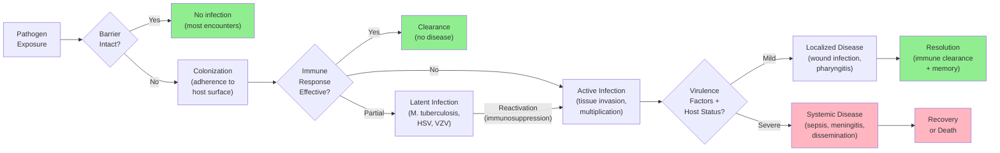
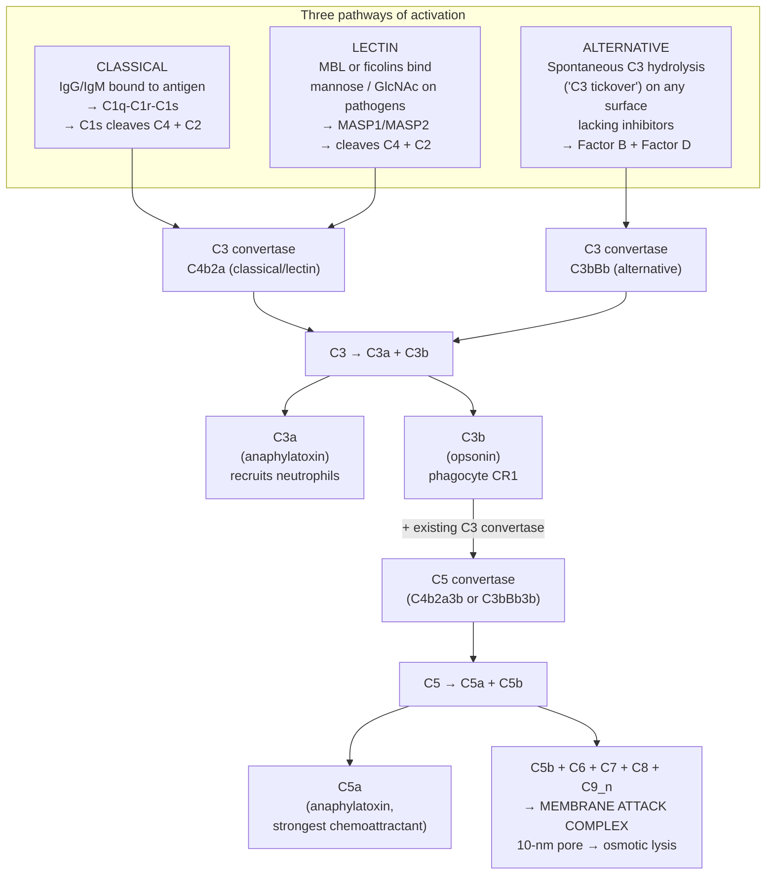
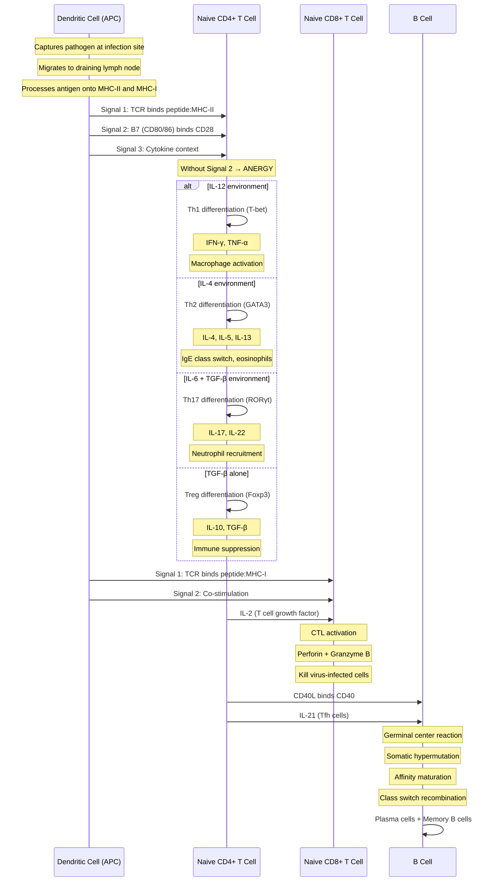
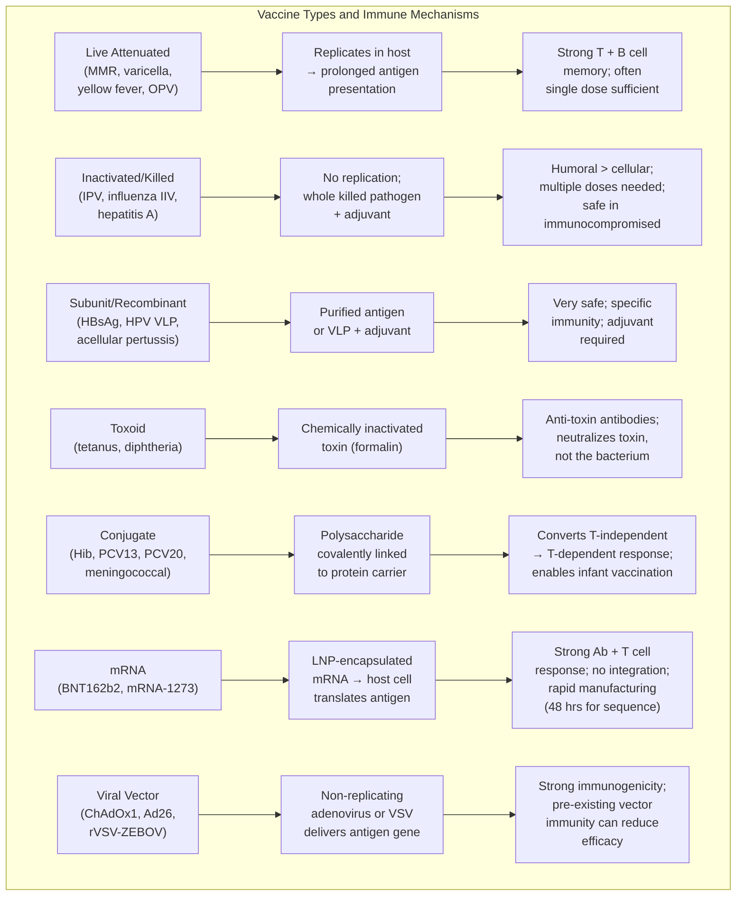
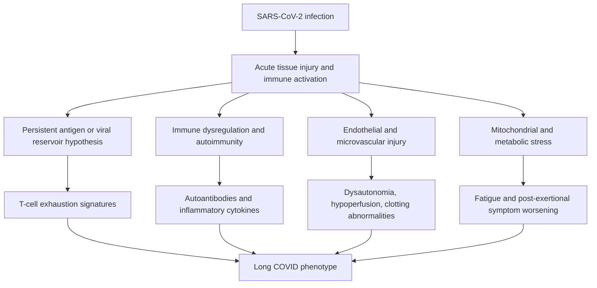
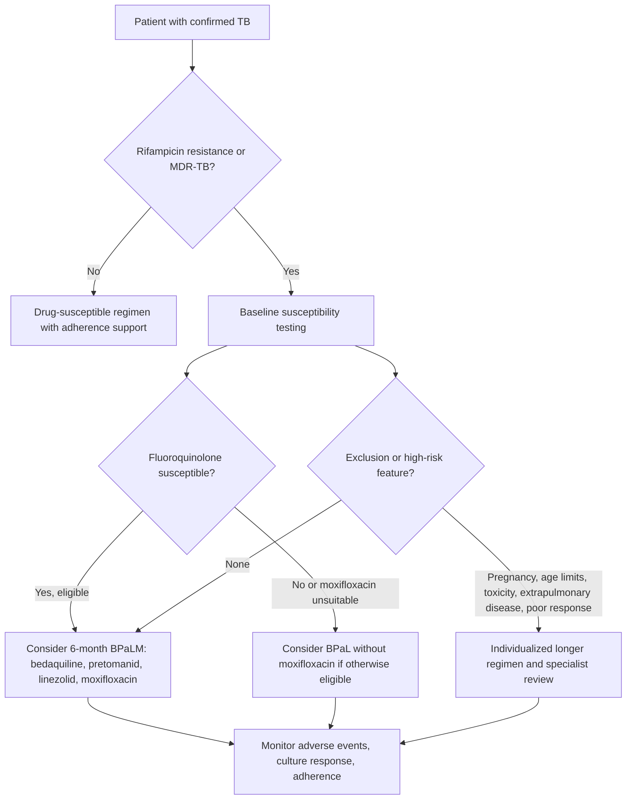
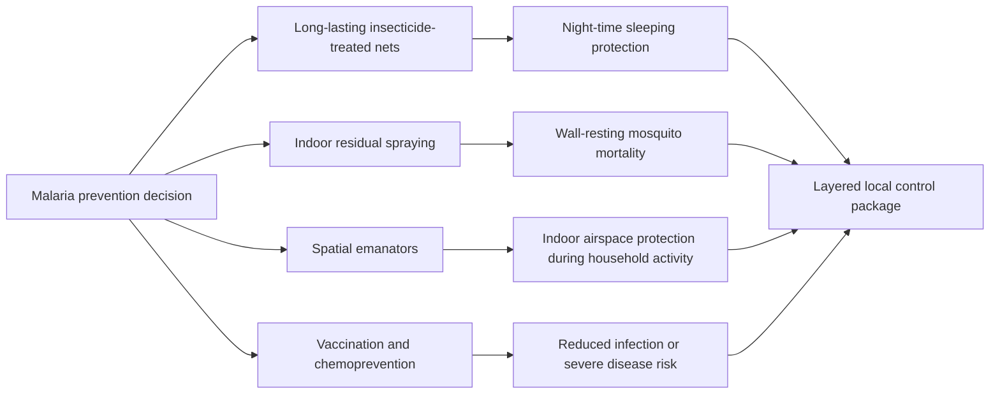
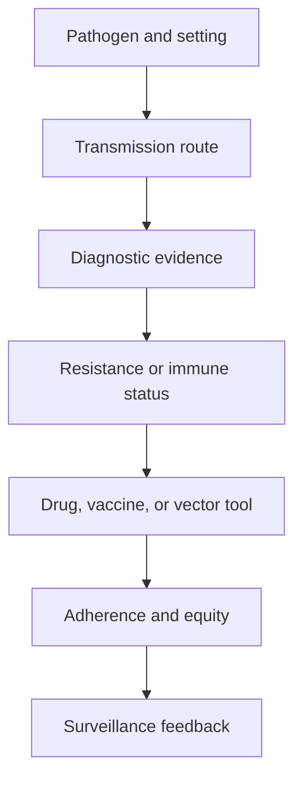

# Infectious Disease and Immunity

\label{sec:unit_VII_infectious_disease}


<!-- chapter-metadata-badge -->
> **Ch 24** · Level 2/3 · 60 min read · 75 min lecture · Prerequisites: \cref{sec:unit_VII_bacteria_archaea_viruses}

## Learning Objectives

By the end of this chapter, you should be able to:

1. Apply Koch's postulates and molecular Koch's postulates to evaluate evidence for microbial causation of disease, and identify their limitations.
2. Describe [**virulence**](#gl:virulence) factors (adhesins, toxins, invasion machinery, immune evasion strategies) used by major bacterial, viral, and eukaryotic pathogens.
3. Explain innate immune defenses including physical barriers, pattern recognition receptors (TLRs, NLRs, RIG-I, cGAS-STING), the three complement pathways and their convergence at C3, and cellular effectors (neutrophils with NETosis, macrophages, NK cells with missing-self recognition).
4. Describe adaptive immunity including V(D)J [**recombination**](#gl:recombination), MHC restriction, T helper cell subsets, cytotoxic T cell killing mechanisms, B cell activation, affinity maturation, and antibody class switching.
5. Compare the eight major [**vaccine**](#gl:vaccine) platforms (live attenuated, inactivated, subunit, virus-like-particle, toxoid, conjugate, mRNA, viral vector) and apply the [**herd immunity**](#gl:herd-immunity) equation $p_c = 1 - 1/R_0$ to compute thresholds for measles, polio, and COVID-19 variants.
6. Describe antigenic variation in influenza (drift vs shift) and HIV (reverse-transcriptase quasi-species clouds), and connect this to vaccine reformulation and pandemic risk.
7. Catalogue the principal antibiotic-resistance mechanisms (β-lactamases including ESBLs and carbapenemases, efflux pumps, target modification including PBP2a in MRSA and 23S rRNA methylation in MLS-resistant streptococci, reduced permeability, bypass pathways) and link each to specific drug classes.
8. Describe the epidemiology and pathogenesis of major infectious diseases including tuberculosis, malaria, HIV/AIDS, and influenza, and explain the One Health framework.

<!-- curriculum-scaffold-start -->
### Study Blueprint

- **Big idea:** Disease dynamics emerge from host susceptibility, pathogen traits, transmission networks, and immunity.
- **Core concepts:** transmission, R0, immunity, vaccination.
- **Framework alignment:** Vision & Change: Evolution, Systems, Structure and function; AP Biology: Evolution, Systems Interactions; NGSS-style topics: Structure and Function, Interdependent Relationships in Ecosystems.
- **Model or quantitative lens:** R0, herd-immunity threshold, and SIR trajectory calculations.
- **Data skill:** Interpret outbreak curves and intervention effects.
- **Practice cadence:** Questions and Methods, Representing and Describing Data, Argumentation.
- **Common misconception to repair:** R0 is not a fixed property of a pathogen alone; it depends on host behaviour and environment.
- **Primary lab:** \cref{sec:lab_unit_VII_infectious_disease}.
- **Question bank:** \cref{sec:q_unit_VII_infectious_disease}.
- **Transfer task:** Transfer disease-dynamic reasoning to vaccination, antimicrobial resistance, and public-health policy.
- **Bridge to computation:** `biology.microbiology.microbiology.sir_model`.
<!-- curriculum-scaffold-end -->

---

> **Opening Vignette — The Pandemic That Shaped Modern Immunology**
> 
> The 1918 influenza pandemic infected an estimated 500 million people — one-third of the world's population — and killed between 50 and 100 million, more than World War I. Most victims were healthy young adults, a terrifying reversal of the usual mortality pattern, caused by a cytokine storm in which a vigorous immune response became catastrophically self-destructive. The pandemic revealed in gruesome detail the cost of a misdirected immune response and the urgency of understanding host-pathogen dynamics. From its ashes grew modern epidemiology, the concept of herd immunity, and the influenza surveillance networks that today sequence viral [**genome**](#gl:genome)s in near-real time. When SARS-CoV-2 emerged in 2019, it was 1918's lessons — social distancing, masking, rapid vaccine development — that shaped the global response. Infectious disease is not a relic of the past; it is the central selective pressure on immune system evolution.

## Host-Pathogen Relationships

### Koch's Postulates

In 1884, Robert Koch formalized criteria for establishing that a specific microorganism causes a specific disease. These four postulates remain foundational in infectious disease:

1. The microorganism must be found in most cases of the disease but not in healthy individuals
2. The microorganism must be isolated from the diseased host and grown in pure culture
3. The cultured microorganism must cause the same disease when inoculated into a healthy, susceptible host
4. The same microorganism must be re-isolated from the experimentally infected host

**Limitations of Koch's postulates** have become apparent with advancing knowledge:

- **Asymptomatic carriers**: *Salmonella typhi* (Typhoid Mary), *Neisseria meningitidis* -- healthy carriers exist, violating postulate 1
- **Unculturable organisms**: Viruses (until cell culture), *Treponema pallidum*, *Mycobacterium leprae* -- cannot fulfill postulate 2
- **Ethical constraints**: Human experimentation with lethal pathogens is prohibited
- **Polymicrobial disease**: Periodontal disease, bacterial vaginosis -- caused by community shifts, not single organisms
- **Host factors**: *Mycobacterium tuberculosis* causes disease in about 5-10% of infected individuals (the rest maintain latent infection)

### Molecular Koch's Postulates

In 1988, Stanley Falkow proposed a molecular framework for identifying virulence determinants:

1. The virulence [**gene**](#gl:gene) (or its product) should be found in pathogenic strains but not in non-pathogenic relatives
2. Inactivation of the gene (by [**mutation**](#gl:mutation) or deletion) should reduce virulence in an appropriate model
3. Complementation (restoration of the gene) should restore virulence

This framework has been essential for identifying virulence factors through targeted gene knockouts and complementation studies in model organisms.

### The Infection Continuum


<!-- alt: Flowchart showing decision-tree of pathogen exposure outcomes from initial encounter through clearance, latency, or systemic disease. -->

*Decision-tree of pathogen exposure outcomes from initial encounter through clearance, latency, or systemic disease.*

Not every exposure leads to colonization, not every colonization leads to infection, and not every infection leads to disease. The outcome depends on pathogen virulence, inoculum size, route of entry, and host immune status.

### Virulence Factors

Pathogens deploy specific molecular tools to adhere to host tissues, invade cells, obtain nutrients, and evade immune defenses:

**Adhesins** mediate initial attachment to host surfaces:

- **Type IV pili** (*Neisseria gonorrhoeae*, *N. meningitidis*): Retractile pili that mediate attachment to epithelial surfaces and facilitate twitching motility
- **FimH** (*E. coli*): Type 1 fimbrial adhesin that binds mannose residues on uroepithelial cells, enabling urinary tract infection
- **Fibronectin-binding [**protein**](#gl:protein)s** (*Staphylococcus aureus*): Mediate attachment to extracellular matrix, enabling wound infections and endocarditis

**Invasion factors**:

- **Type III secretion system (T3SS)**: *Salmonella enterica* SPI-1 (Salmonella Pathogenicity Island 1) encodes a molecular syringe that injects effector proteins (SopE, SipA) directly into host epithelial cells, triggering [**actin**](#gl:actin) [**cytoskeleton**](#gl:cytoskeleton) rearrangement and bacterial internalization via membrane ruffling
- **Internalins** (*Listeria monocytogenes*): InlA binds E-cadherin, InlB binds Met receptor; trigger receptor-mediated [**endocytosis**](#gl:endocytosis); once internalized, Listeria escapes the phagosome (listeriolysin O) and propels itself through the [**cytoplasm**](#gl:cytoplasm) using actin polymerization (ActA recruits host Arp2/3 complex)

**Capsules**: Polysaccharide capsules (*Streptococcus pneumoniae*, *Neisseria meningitidis*, *Haemophilus influenzae* type b) inhibit phagocytosis by preventing complement C3b deposition and obscuring surface antigens. The pneumococcal capsule has >90 serotypes, forming the basis for conjugate vaccine design (PCV13, PCV20).

### Toxins

**Exotoxins** are secreted proteins with specific mechanisms of action. Many have the A-B structure: the B (binding) subunit binds a host cell receptor, and the A (active) subunit enters the cell to exert its toxic effect:

| Toxin | Organism | B-Subunit Target | A-Subunit Activity | Clinical Effect |
|-------|----------|-------------------|-------------------|----------------|
| Cholera toxin | *V. cholerae* | GM1 ganglioside | ADP-ribosylates Gsα -> constitutive adenylyl cyclase activation -> cAMP $\uparrow$ | Cl$^-$/H$_2$O secretion -> watery diarrhea (up to 20 L/day) |
| Diphtheria toxin | *C. diphtheriae* | HB-EGF receptor | ADP-ribosylates EF-2 -> halts protein synthesis | Pseudomembrane in throat; myocarditis |
| Tetanospasmin | *C. tetani* | Gangliosides (retrograde transport) | Zinc metalloprotease cleaves VAMP/synaptobrevin | Blocks inhibitory neurotransmitter release (glycine, GABA) -> spastic paralysis |
| Botulinum toxin | *C. botulinum* | Gangliosides (peripheral nerve) | Zinc metalloprotease cleaves SNARE proteins (SNAP-25, syntaxin) | Blocks ACh release at NMJ -> flaccid paralysis |
| Shiga toxin | *Shigella*, STEC *E. coli* | Gb3 (globotriaosylceramide) | N-glycosidase cleaves 28S rRNA | Halts protein synthesis; HUS (hemolytic uremic syndrome) |

**Endotoxin (LPS)**: Unlike exotoxins, endotoxin is not secreted but released upon bacterial lysis. Lipid A activates TLR4 on macrophages, triggering release of TNF-α, IL-1β, and IL-6. At high concentrations (Gram-negative bacteremia), this causes fever, hypotension, disseminated intravascular coagulation (DIC), multi-organ failure, and septic shock.

**Immune evasion strategies**:

- **Protein A** (*S. aureus*): Binds the Fc region of IgG in the "wrong" orientation, preventing opsonization and ADCC
- **IgA protease** (*N. gonorrhoeae*, *H. influenzae*): Cleaves secretory IgA at mucosal surfaces
- **Antigenic variation**: *Trypanosoma brucei* expresses variant surface glycoprotein (VSG) from a library of >1,000 *vsg* genes, switching expression before the host mounts an effective antibody response
- **Phagosome arrest**: *M. tuberculosis* inhibits phagosome-lysosome fusion via LAM (lipoarabinomannan)

> **Concept Check 1:**
> *Vibrio cholerae* produces cholera toxin that causes massive fluid secretion, yet the bacterium rarely invades beyond the intestinal epithelium. Explain why this non-invasive strategy is advantageous for the pathogen's transmission, and predict what would happen to cholera epidemiology if the toxin were eliminated by gene deletion.

---

## Innate Immunity

### Physical and Chemical Barriers

The first line of defense prevents pathogen entry into sterile body compartments:

A barrier is not just a wall; it is an active ecological and immunological interface. Skin acidity, mucus flow, antimicrobial peptides, secretory IgA, iron sequestration, and resident microbiota most create selection pressures that pathogens must evade. Barrier failure can therefore come from physical breach, altered chemistry, disrupted microbial competition, or medical devices that bypass normal surfaces.

| Barrier | Mechanism | Pathogens That Breach It |
|---------|-----------|------------------------|
| **Skin** | Intact keratin layer; low [**pH**](#gl:ph) (~5.5); fatty acids; defensins; commensal [**microbiota**](#gl:microbiota) | Burns, wounds, catheter insertion bypass skin |
| **Mucociliary escalator** | Respiratory mucus traps particles; cilia beat at 12-15 Hz, propelling mucus upward | *P. aeruginosa* [**biofilm**](#gl:biofilm) in CF; influenza HA cleaves sialic acid in mucus |
| **Gastric acid** | pH 1.5-3.5; pepsin activation | *H. pylori*: urease produces NH$_3$ to neutralize local pH |
| **Lysozyme** | Muramidase: cleaves NAG-NAM bonds in peptidoglycan | Present in tears, saliva, nasal secretions, breast milk |
| **Lactoferrin** | Iron sequestration (bacteriostatic) | Found at mucosal surfaces; deprives bacteria of essential iron |
| **Defensins** | Antimicrobial peptides (AMPs); form pores in microbial membranes | Produced by epithelial cells and neutrophils; α-defensins (Paneth cells), β-defensins (skin, respiratory) |
| **Resident microbiota** | Colonization resistance (nutrient competition, bacteriocins, bile acid metabolism) | *C. difficile* exploits antibiotic-disrupted microbiota |

### Pattern Recognition Receptors (PRRs)

The innate immune system detects conserved microbial structures -- **pathogen-associated molecular patterns (PAMPs)** -- through germline-encoded PRRs. This system provides immediate recognition without prior exposure:

| PRR | Location | PAMP Recognized | Signaling Pathway | Outcome |
|-----|----------|----------------|-------------------|---------|
| **TLR4** | Plasma membrane | LPS (lipid A) | MyD88 -> NF-κB; TRIF -> IRF3 | Pro-inflammatory cytokines + type I IFN |
| **TLR2** | Plasma membrane | Peptidoglycan, lipoteichoic acid, zymosan | MyD88 -> NF-κB | Pro-inflammatory cytokines |
| **TLR3** | Endosome | dsRNA | TRIF -> IRF3 | IFN-β (antiviral state) |
| **TLR7/8** | Endosome | ssRNA | MyD88 -> NF-κB + IRF7 | Type I IFN + cytokines |
| **TLR9** | Endosome | Unmethylated CpG DNA | MyD88 -> NF-κB | Type I IFN + cytokines |
| **RIG-I / MDA5** | Cytoplasm | Viral RNA (5'-ppp, long dsRNA) | MAVS -> IRF3 | IFN-β |
| **NLRP3** | Cytoplasm | DAMPs (ATP, uric acid, cholesterol crystals) | ASC -> [**Caspase**](#gl:caspase)-1 | IL-1β, IL-18, gasdermin D -> pyroptosis |
| **cGAS-STING** | Cytoplasm-ER | Cytoplasmic dsDNA | cGAMP -> STING -> IRF3 | IFN-β; critical for DNA virus detection |

Key signaling outcomes of PRR activation:

- **NF-κB pathway**: [**Transcription**](#gl:transcription) of pro-inflammatory cytokines (IL-1β, IL-6, TNF-α, IL-8/CXCL8) and chemokines
- **IRF3/7 pathway**: Type I interferons (IFN-α/β) -> JAK-STAT signaling -> interferon-stimulated genes (ISGs: OAS/RNase L, Mx proteins, PKR) -> antiviral state in neighboring cells

### The Complement System: Three Pathways, One Cascade

The complement system is a cascade of ~ 30 plasma proteins that opsonize pathogens, recruit inflammation, and lyse Gram-negative bacteria. Three pathways converge on a common effector cascade through the central enzyme **C3 convertase**, which hydrolyses C3 into C3a (anaphylatoxin) and C3b (opsonin).


<!-- alt: Flowchart showing three pathways of complement activation (classical, lectin, alternative) converge at the C3 convertase, producing C3b (opsonin) and C3a (anaphylatoxin); a second cleavage at C5 generates C5a and the C5b–C9 membrane-attack complex. -->

*Three pathways of complement activation (classical, lectin, alternative) converge at the C3 convertase, producing C3b (opsonin) and C3a (anaphylatoxin); a second cleavage at C5 generates C5a and the C5b–C9 membrane-attack complex.*

- **C3a** — a 9-kDa anaphylatoxin: binds C3aR on mast cells (degranulation, histamine), endothelial cells (vasodilation, vascular permeability), and granulocytes (recruitment).
- **C3b** — a 175-kDa opsonin: covalently binds pathogen surface; recognized by complement receptor 1 (CR1, CD35) on phagocytes, dramatically enhancing phagocytosis.

A second cleavage step generates:

- **C5a** — the strongest neutrophil chemoattractant in plasma (effective at picomolar concentrations); binds C5aR1.
- **C5b** — initiates the **membrane attack complex (MAC)**: C5b + C6 + C7 + C8 + (10–18 copies of) C9 polymerise into a 10-nm transmembrane pore that lyses the target cell osmotically. The MAC is most effective against Gram-negative bacteria (which lack the thick peptidoglycan barrier of Gram-positives); *Neisseria meningitidis* and *N. gonorrhoeae* are particularly MAC-susceptible — terminal-complement deficiencies (C5–C9) cause recurrent neisserial infections almost exclusively.

**Complement regulation.** Self cells avoid complement attack via membrane-bound and soluble regulators:

| Regulator | Action | Defect → disease |
|-----------|--------|-------------------|
| **CD46 (MCP, membrane cofactor protein)** | Cofactor for Factor I cleavage of C3b/C4b | Atypical haemolytic uraemic syndrome (aHUS) |
| **CD55 (DAF, decay-accelerating factor)** | Accelerates decay of C3 and C5 convertases | Paroxysmal nocturnal haemoglobinuria (PNH; CD55+CD59 GPI loss) |
| **CD59 (protectin)** | Blocks C9 polymerization (MAC) | PNH (haemolysis) |
| **Factor H** | Inhibits alternative pathway on self surfaces | aHUS; age-related macular degeneration (AMD) |
| **C1 inhibitor** | Blocks C1r/C1s and MASPs | Hereditary angioedema (HAE) |

*Neisseria meningitidis* and *N. gonorrhoeae* have evolved a remarkable trick — they bind host Factor H to their surface using **factor H–binding protein (fHbp)**, mimicking self and inactivating alternative-pathway amplification. fHbp is now a target antigen in two licensed meningococcal-B vaccines (Bexsero, Trumenba).

### Phagocytosis and Cellular Effectors

#### Neutrophil Killing: Oxidative Burst and NETosis

**Neutrophils** are the most abundant circulating leukocytes (50–70 % of blood leukocytes) and the first cells to arrive at sites of infection (within minutes of chemokine signal). Their lifespan is extraordinarily short — ~ 6–8 hours in circulation, ~ 1–4 days at tissue sites — reflecting a cell programmed for rapid microbial killing followed by apoptosis to limit collateral tissue damage.

**Oxidative burst (respiratory burst).** Upon phagosome formation, the **NADPH oxidase complex (NOX2)** assembles at the phagosome membrane:

$$ 2\text{O}_2 + \text{NADPH} \xrightarrow{\text{NOX2}} 2\text{O}_2^- + \text{NADP}^+ + \text{H}^+  \label{eq:unit_VII_infectious_disease_item_1}$$


Superoxide ($O_2^-$) is rapidly converted to hydrogen peroxide ($H_2O_2$) by superoxide dismutase. **Myeloperoxidase (MPO)** — abundant in neutrophil azurophilic granules — then catalyses the most potent step of microbial killing:

$$ \text{H}_2\text{O}_2 + \text{Cl}^- \xrightarrow{\text{MPO}} \text{HOCl} + \text{OH}^-  \label{eq:unit_VII_infectious_disease_item_2}$$


**HOCl (hypochlorous acid, household-bleach chemistry)** is one of the most potent oxidants in biology — it chlorinates microbial proteins, lipids, and DNA, killing many phagocytosed microbes within minutes. The phagosome is also acidified (pH ~ 4.5) and accumulates antimicrobial peptides (defensins, BPI, lactoferrin). Survival is uncommon for non-adapted microbes but biologically important pathogens such as *M. tuberculosis*, *Salmonella*, and *Leishmania* persist by blocking phagosome maturation, resisting reactive species, or escaping the vacuole.

**NETosis.** Discovered in 2004 (Brinkmann *et al.*, *Science*), NETosis is a programmed neutrophil death pathway in which the cell releases its decondensed [**chromatin**](#gl:chromatin) — decorated with citrullinated [**histone**](#gl:histone)s, neutrophil elastase, MPO, defensins, and granule contents — to form **neutrophil extracellular traps (NETs)** that physically capture and chemically kill extracellular bacteria, fungi, and large parasites. The molecular pathway:

1. Activation by PAMPs / immune complexes / cytokines triggers ROS production by NOX2.
2. **PAD4 (peptidylarginine deiminase 4)** citrullinates histone H3 (Arg → citrulline), neutralizing positive charge and decompacting chromatin.
3. Nuclear membrane breaks down; chromatin enters cytoplasm; granule contents bind to chromatin.
4. Plasma membrane lyses, releasing the NET into the extracellular space (cell death).

NETs are evolutionarily ancient (zebrafish neutrophils, *Drosophila* haemocytes, even sea-anemone amoebocytes form similar traps). Pathological NETosis is now implicated in **immunothrombosis** in severe COVID-19 (NETs trap platelets and trigger coagulation, contributing to microvascular clots), in autoimmune diseases (citrullinated histones drive ACPA antibodies in rheumatoid arthritis; anti-NET antibodies in lupus), and in chronic wound failure.

**Macrophages** are tissue-resident phagocytes with diverse functions:

- Tissue-specific names: Kupffer cells (liver), alveolar macrophages (lung), microglia (brain), osteoclasts (bone), Langerhans cells (skin -- actually dendritic cells)
- **M1 polarization** (IFN-γ + LPS): Pro-inflammatory; produces iNOS -> nitric oxide (NO); secretes TNF-α, IL-12; activates Th1 responses against intracellular pathogens
- **M2 polarization** (IL-4, IL-13): Anti-inflammatory; produces arginase; secretes IL-10, TGF-β; promotes wound healing, tissue repair, and fibrosis

#### NK Cells: Missing-Self and Induced-Self Recognition

**Natural killer (NK) cells** are innate lymphocytes (~ 5–15 % of blood lymphocytes) that kill virus-infected and transformed cells without prior sensitization. They are the innate immune system's solution to a fundamental problem: how to detect cells that are *abnormal* from the inside, when no conserved pathogen pattern is present on the cell surface.

NK-cell killing is governed by an **integration of inhibitory and activating receptor signals** — the "balance hypothesis." A cell is killed when activating signals exceed inhibitory signals.

**Missing-self hypothesis (Ljunggren and Karre, 1990).** Healthy cells display abundant MHC class I on their surface, presenting peptides for surveillance by CD8$^+$ T cells. NK cells carry **inhibitory KIRs (killer immunoglobulin-like receptors; KIR2DL, KIR3DL)** that recognise self MHC-I. Engagement delivers an **inhibitory signal** through ITIMs (immunoreceptor tyrosine-based inhibitory motifs), suppressing the NK-cell killing programme. Many viruses (CMV, HIV, KSHV) and tumours **downregulate MHC class I** to avoid CD8$^+$ T cell detection — but this loss removes the inhibitory signal to NK cells, unmasking the cell for NK-mediated killing. The strategy has trade-offs: CMV has evolved decoy MHC-I-like proteins (UL18) that bind inhibitory NK receptors to mimic self.

**Induced-self via NKG2D.** A complementary mechanism detects cellular stress. **NKG2D** is an activating receptor on NK cells (and on subsets of CD8$^+$ T cells, γδ T cells, NKT cells) that recognises **stress-induced ligands**: **MICA, MICB** (MHC class I chain-related), **ULBP1–6** (UL16-binding proteins). These ligands are **absent on healthy cells** but induced by:

- DNA damage (ATR/ATM pathway) — common in transformed cells.
- Viral infection.
- Heat shock response.
- Oxidative stress.

NKG2D ligands are MHC-I-like in fold but lack peptide-binding groove and β2-microglobulin association. Their induction provides a "danger signal" that bypasses normal MHC-I inhibition. NKG2D engagement signals through DAP10/DAP12 adaptors to activate cytotoxicity. Many cancers shed soluble MICA/MICB into circulation as a decoy that downmodulates surface NKG2D — an immune escape mechanism now targeted by anti-MICA-shedding antibodies in cancer immunotherapy.

**NK-cell killing mechanisms** (shared with CTLs):

- **Perforin/granzyme** — perforin polymerizes in target membrane (similar to MAC); granzymes (especially granzyme B) enter and cleave caspase-3/7 → [**apoptosis**](#gl:apoptosis).
- **Death receptor ligands** — FasL, TRAIL on NK cell engage Fas, DR4/DR5 on target → DISC → caspase-8 → apoptosis.
- **Antibody-dependent cellular cytotoxicity (ADCC)**: NK cell **CD16 (FcγRIII)** binds IgG bound to target cell surface → directed degranulation. ADCC is the principal mechanism by which anti-tumor antibodies (rituximab, trastuzumab) kill cancer cells, and a substantial fraction of vaccine-induced antiviral protection.

### Inflammation

The cardinal signs of inflammation (rubor, calor, tumor, dolor -- redness, heat, swelling, pain) result from vascular changes triggered by innate immune activation:

- **Mast cell degranulation**: Histamine, tryptase, leukotrienes -> vasodilation + increased vascular permeability
- **Cytokine cascade**: IL-1β (fever, endothelial activation); TNF-α (fever, hypotension, acute-phase response); IL-6 (hepatic acute-phase proteins: CRP, fibrinogen, complement, ferritin); IL-8/CXCL8 (neutrophil chemotaxis)
- **Acute-phase response**: Liver produces C-reactive protein (CRP), which binds phosphocholine on bacterial surfaces and activates complement

> **Clinical Connection: Sepsis and Cytokine Storm**
> Sepsis is defined as life-threatening organ dysfunction caused by a dysregulated host response to infection (Sepsis-3 criteria, 2016). It affects approximately 49 million people and causes 11 million deaths annually worldwide (WHO). In sepsis, the normally protective inflammatory response becomes pathologically amplified: massive cytokine release (TNF-α, IL-1β, IL-6) causes widespread endothelial dysfunction, capillary leak, coagulopathy (DIC), and multi-organ failure. The SOFA (Sequential Organ Failure Assessment) score quantifies organ dysfunction. Cytokine storm -- a related phenomenon -- was observed in severe COVID-19 (IL-6 pathway hyperactivation; treated with tocilizumab, an IL-6 receptor antagonist) and in cytokine release syndrome (CRS) following CAR-T cell therapy.

> **Concept Check 2:**
> A child with chronic granulomatous disease (CGD) has a mutation in the gp91phox subunit of NADPH oxidase. Predict which types of infections this child will be susceptible to, and explain why catalase-positive bacteria (*S. aureus*, *Aspergillus*) are particularly dangerous in CGD while catalase-negative bacteria (*Streptococcus*) are not.

> **Concept Check 2b:**
> A patient with paroxysmal nocturnal haemoglobinuria (PNH) has a somatic mutation in *PIGA* causing loss of GPI-anchored proteins on red blood cells, including CD55 and CD59. Explain (a) why these red cells are constantly haemolysed by their own complement system, (b) why the disease is paroxysmal (worse at night/with sleep), and (c) why eculizumab (anti-C5 monoclonal antibody) is curative. Which complement step does eculizumab block, and what infectious-disease vaccination is mandatory before starting it?

---

## Adaptive Immunity Overview

The adaptive immune system provides antigen-specific responses with immunological memory. Its defining features include:

- **Specificity**: Each lymphocyte clone bears a unique antigen receptor (TCR or BCR) generated by somatic recombination
- **Diversity**: $>10^{12}$ possible TCR specificities; $>10^8$ BCR specificities
- **Clonal selection**: Antigen selects and expands primarily those lymphocyte clones with matching receptors
- **Memory**: Long-lived memory cells mount faster, stronger secondary responses upon re-encounter
- **Self-tolerance**: Autoreactive clones are eliminated (central tolerance) or suppressed (peripheral tolerance)

### MHC Molecules

Major histocompatibility complex (MHC) molecules present peptide fragments to T cells, providing the context for antigen recognition:

**MHC class I** (HLA-A, HLA-B, HLA-C in humans):

- Expressed on **most nucleated cells**
- Present **endogenous peptides** (from cytoplasmic proteins): proteasome -> peptide fragments -> TAP transporter -> ER -> peptide loading onto MHC-I -> cell surface
- Recognized by **CD8$^+$ T cells** (cytotoxic T lymphocytes)
- Presents viral antigens and tumor antigens from within the cell

**MHC class II** (HLA-DR, HLA-DP, HLA-DQ):

- Expressed on **professional antigen-presenting cells (APCs)**: dendritic cells, macrophages, B cells
- Present **exogenous peptides** (from phagocytosed material): endosomal/lysosomal degradation -> CLIP removal by HLA-DM -> peptide loading onto MHC-II -> cell surface
- Recognized by **CD4$^+$ T cells** (helper T cells)

MHC genes are the most polymorphic in the human genome (~20,000 HLA [**allele**](#gl:allele)s in the population), ensuring that no pathogen peptide can escape presentation in most individuals -- a population-level defense strategy.

### T Cell Activation and Differentiation


<!-- alt: Sequence diagram showing three-signal T cell activation by dendritic cells, with cytokine-context-driven differentiation into Th1/Th2/Th17/Treg/Tfh subsets and downstream activation of cytotoxic CD8^+ T cells and antibody-producing B cells. -->

*Three-signal T cell activation by dendritic cells, with cytokine-context-driven differentiation into Th1/Th2/Th17/Treg/Tfh subsets and downstream activation of cytotoxic CD8$^+$ T cells and antibody-producing B cells.*

- **Signal 1**: TCR recognition of peptide:MHC complex (specificity signal)
- **Signal 2**: Co-stimulatory signal -- CD28 on T cell binds B7 molecules (CD80/CD86) on APC. Without this signal, the T cell becomes **anergic** (functionally unresponsive) -- a mechanism of peripheral tolerance
- **Signal 3**: Cytokine environment determines effector subset differentiation

**T helper cell subsets**:

| Subset | Inducing Cytokines | Master Transcription Factor | Signature Cytokines | Primary Function |
|--------|-------------------|---------------------------|-------------------|-----------------|
| Th1 | IL-12, IFN-γ | T-bet | IFN-γ, TNF-α | Macrophage activation; intracellular pathogens |
| Th2 | IL-4 | GATA3 | IL-4, IL-5, IL-13 | B cell IgE switching; eosinophils; helminths; allergy |
| Th17 | IL-6 + TGF-β + IL-23 | RORγt | IL-17, IL-22 | Neutrophil recruitment; mucosal defense; fungi |
| Treg | TGF-β | Foxp3 | IL-10, TGF-β | Suppress excessive inflammation; maintain tolerance |
| Tfh | IL-6, IL-21 | Bcl6 | IL-21, CXCL13 | B cell help in germinal centers |

**Cytotoxic T lymphocytes (CTLs, CD8$^+$)** recognize viral or tumor antigens on MHC-I and kill target cells through:

- **Perforin/granzyme pathway**: Perforin polymerizes in the target membrane, forming pores; granzyme B enters and activates caspase-3/7 -> apoptosis
- **Fas-FasL pathway**: CTL-expressed FasL binds Fas (CD95) on target -> DISC formation -> caspase-8 -> apoptosis
- **Serial killing**: A single CTL can kill 2-25 target cells sequentially via directed degranulation at the immunological synapse
- **Exhaustion**: In chronic infections (HBV, HCV, HIV), persistent antigen exposure leads to upregulation of inhibitory receptors (PD-1, TIM-3, LAG-3) and progressive loss of effector function -- the basis for PD-1/PD-L1 checkpoint inhibitor therapy in cancer

> **Concept Check 3:**
> Explain why a patient with a CD4$^+$ T cell count below 200 cells/μL (as in AIDS) is susceptible to opportunistic infections that healthy individuals easily control. Specifically, describe which arm of the immune response is most compromised and why both cellular and humoral immunity are affected despite B cells and CD8$^+$ T cells being present.

---

## B Cells and Antibodies

### B Cell Activation

B cell activation pathways differ depending on the nature of the antigen:

**T-dependent antigens** (protein antigens): BCR binds and internalizes antigen -> processes and presents peptides on MHC-II -> recognized by cognate Tfh cell -> CD40L-CD40 interaction + IL-21 -> B cell activation, proliferation, and entry into the germinal center reaction. This pathway produces high-affinity antibodies, class-switched isotypes, and long-lived memory.

**T-independent antigens** (repetitive polysaccharides, LPS): Cross-link multiple BCRs on the B cell surface -> activation without T cell help. Produces primarily IgM; limited affinity maturation; poor memory response. This is why polysaccharide vaccines (pneumococcal, meningococcal) are poorly immunogenic in children under 2 years (immature T-independent response) and why **conjugate vaccines** were developed.

### Germinal Center Reaction

The germinal center (GC) in secondary lymphoid organs is the site of antibody optimization:

1. **Clonal expansion**: Activated B cells (centroblasts) proliferate rapidly in the dark zone
2. **Somatic hypermutation (SHM)**: Activation-induced cytidine deaminase (AID) introduces point mutations in the variable (V) regions of immunoglobulin genes at a rate of ~$10^{-3}$ per base pair per division -- one million-fold higher than the normal mutation rate. AID deaminates cytidine to uridine in DNA, which is then processed by base excision repair or mismatch repair to generate diverse mutations.
3. **Affinity maturation**: Mutant B cells (centrocytes) migrate to the light zone, where they compete for antigen displayed on follicular dendritic cells (FDCs). Primarily B cells with improved BCR affinity receive survival signals; the rest undergo apoptosis. This Darwinian selection process progressively increases antibody affinity over successive rounds.
4. **Class switch recombination (CSR)**: AID also introduces double-strand breaks in switch (S) regions upstream of constant region genes, enabling recombination that changes the antibody class from IgM to IgG, IgA, or IgE while preserving antigen specificity. Cytokine signals determine which class is selected: IL-4 -> IgE; IFN-γ -> IgG1; TGF-β -> IgA.

The GC reaction produces two critical outputs: **long-lived plasma cells** (migrate to bone marrow; secrete high-affinity antibody for years to decades) and **memory B cells** (reside in secondary lymphoid organs; rapidly reactivate upon antigen re-encounter).

### Antibody Structure and Function

An antibody molecule consists of two identical heavy (H) chains and two identical light (L) chains, each containing variable (V) and constant (C) domains:

- **Fab region** (fragment antigen-binding): Contains the variable domains (VH + VL) that form the antigen-binding site (paratope). The three complementarity-determining regions (CDR1, CDR2, CDR3) within each variable domain make direct contact with antigen.
- **Fc region** (fragment crystallizable): The constant domains that determine antibody class and mediate effector functions (complement activation, Fc receptor binding on phagocytes and NK cells, placental transfer).
- **Hinge region**: Provides flexibility between Fab and Fc, allowing bivalent binding to spatially separated epitopes.

### Antibody Classes

| Isotype | Structure | Location | Key Functions |
|---------|-----------|----------|--------------|
| **IgM** | Pentamer (10 binding sites) | Blood (primary response) | First antibody produced; efficient complement activation via classical pathway; low affinity compensated by high avidity |
| **IgG** | Monomer (4 subclasses) | Blood, extravascular; **crosses placenta** via FcRn | Most abundant serum antibody; opsonization; ADCC (via CD16 on NK cells); complement; neonatal passive immunity |
| **IgA** | Dimer (secretory IgA with secretory component) | Mucosal surfaces: saliva, tears, breast milk, intestinal lumen | Most produced antibody class (>3 g/day); neutralization at mucosal surfaces; immune exclusion |
| **IgE** | Monomer | Bound to mast cells and basophils via high-affinity FcεRI | Very low serum concentration; cross-linking by allergen -> mast cell degranulation -> immediate hypersensitivity; anti-helminth defense (eosinophil ADCC) |
| **IgD** | Monomer | Naive B cell surface (co-expressed with IgM) | BCR signaling; poorly understood effector function |

**Immunological memory** -- the basis of vaccination -- results from the persistence of long-lived plasma cells and memory B cells. Upon re-exposure, the secondary response is:

- **Faster**: Days instead of 1-2 weeks
- **Stronger**: 10-100 fold higher antibody titers
- **Higher affinity**: Memory B cells express somatically hypermutated, affinity-matured BCRs
- **Class-switched**: Predominantly IgG (or IgA at mucosal surfaces)

> **Concept Check 4:**
> Conjugate vaccines (e.g., PCV13) link bacterial polysaccharide antigens to protein carriers (e.g., CRM197, a nontoxic diphtheria toxoid). Explain the immunological rationale: why does conjugation convert a T-independent antigen into a T-dependent antigen, and why is this critical for vaccinating infants?

---

## Vaccines and Immunological Memory

### Vaccine Platforms: Eight Strategies for Inducing Memory

Vaccines exploit the same memory mechanisms that protect us after natural infection, but without the disease. The eight major platform classes — each with distinct strengths, limitations, and clinical exemplars — represent a 200-year-progressive enrichment of strategies for safely tricking the immune system into making memory.


<!-- alt: Flowchart showing eight vaccine platforms, the immune mechanism each engages, and characteristic clinical responses. -->

*Eight vaccine platforms, the immune mechanism each engages, and characteristic clinical responses.*

| Platform | Examples | Antigen form | Strengths | Limitations |
|----------|----------|--------------|-----------|-------------|
| **Live attenuated** | MMR, varicella (Varivax), yellow fever 17D, oral polio (OPV), BCG, rotavirus | Weakened replicating organism | Strong T + B memory; often a single dose; mucosal immunity (OPV) | Reversion to virulence (rare; OPV → cVDPV); contraindicated in immunocompromised and pregnancy |
| **Inactivated / killed** | IPV (Salk), inactivated influenza (IIV), hepatitis A (Havrix), rabies, whole-cell pertussis (legacy) | Chemically/heat-killed whole organism | Safe in immunocompromised; stable | Weaker than live; requires adjuvant + multiple doses |
| **Subunit / recombinant protein** | Hepatitis B (HBsAg in yeast), acellular pertussis (aP), zoster (Shingrix gE + AS01) | Purified protein antigen + adjuvant | Very safe; no infectious risk | Less immunogenic; adjuvant essential |
| **Virus-like particles (VLPs)** | HPV (Gardasil, Cervarix), HBV (also classified as subunit) | Self-assembled capsid proteins (no genome) | Particulate, highly immunogenic; structurally identical to virus | Difficult to engineer for some viruses |
| **Toxoid** | Tetanus (TT), diphtheria (DT, Tdap), botulism toxoid | Formalin-inactivated toxin | Anti-toxin antibodies neutralise the *toxin*, not the bacterium | No antibacterial protection; periodic boosters needed |
| **Conjugate** | Hib, PCV13, PCV20 (pneumococcal), meningococcal ACWY (Menactra) | Bacterial polysaccharide covalently linked to a protein carrier (CRM197, TT) | Converts T-independent → T-dependent response; enables infant immunisation; affinity-matured response | Carrier-specific T cells diverted; serotype replacement after PCV introduction |
| **mRNA** | BNT162b2 (Pfizer-BioNTech), mRNA-1273 (Moderna), mRNA-1345 (RSV, 2024); flu mRNA-1010 (trial) | LNP-encapsulated nucleoside-modified mRNA encoding the antigen | Rapid design (48 hr from sequence); strong T + B response; no genome integration | Cold-chain dependent; rare myocarditis; waning antibody titres |
| **Viral vector** | rVSV-ZEBOV (Ebola), ChAdOx1 (AstraZeneca COVID), Ad26.COV2.S (J&J), gene-therapy AAV vectors | Non-replicating recombinant virus carrying antigen gene | Strong durable response; mucosal IgA achievable | Pre-existing vector immunity (Ad5 in adult populations) reduces efficacy; rare thrombosis (ChAdOx1) |

**mRNA vaccines** are the newest platform and represented a paradigm shift during the COVID-19 pandemic:

- The spike protein sequence of SARS-CoV-2 was published on January 11, 2020; Moderna had designed its mRNA-1273 vaccine candidate within 48 hours.
- The mRNA is modified (N1-methylpseudouridine replaces uridine, Karikó and Weissman discovery, Nobel Prize 2023) to reduce TLR7/8 recognition, block 2'-5'-OAS / RNase L degradation, and increase translational efficiency 10–100×.
- Lipid nanoparticle (LNP) encapsulation protects the mRNA from extracellular nucleases and facilitates cellular uptake; the four-component LNP (ionisable lipid, phospholipid, cholesterol, PEG-lipid) self-assembles into ~ 80-nm particles.
- Upon injection, host cells (predominantly muscle and dendritic cells at the injection site) translate the mRNA into spike protein, which is presented on MHC-I (activating CD8$^+$ CTLs) and secreted/surface-displayed (activating B cells and CD4$^+$ T cells).
- No integration into host DNA occurs — mRNA is degraded within hours to days.
- Spike is locked in the prefusion conformation by two proline substitutions (**2P mutation**) that preserve neutralising epitopes.

The platform is now extending to **influenza** (mRNA-1010), **RSV** (mRNA-1345, FDA-approved 2024), **CMV**, and **personalised cancer neoantigen vaccines** (Moderna mRNA-4157 in Phase III for melanoma).

### Antigenic Variation: How Pathogens Outpace Antibody Responses

The single greatest challenge for vaccine development against many viruses is that the immune target itself **evolves under the selection pressure of the population's own immune response**. Two paradigmatic examples illustrate the strategies and the resulting public-health consequences.

**Influenza A: drift and shift.** Influenza A is a Class V segmented (-)ssRNA virus with 8 genome segments. Its surface glycoproteins **hemagglutinin (HA, 18 subtypes)** and **neuraminidase (NA, 11 subtypes)** are the primary targets of neutralising antibodies. Influenza A undergoes two distinct mechanisms of antigenic change:

| Feature | **Antigenic drift** | **Antigenic shift** |
|---|---|---|
| Mechanism | Point mutations in HA (and NA) accumulating during replication | **Reassortment** of whole genome segments during co-infection of one cell by two influenza A strains (often in pigs as the "mixing vessel") |
| Rate | Continuous; ~ 0.5–1 % per year on HA1 | Episodic; rare events |
| Consequence | Antigenic mismatch with prior immunity → **seasonal epidemics** | Novel HA subtype unseen by population → **pandemic potential** |
| Vaccine response | Annual reformulation (WHO twice-yearly recommendation) | Requires entirely new pandemic vaccine |
| Why influenza A primarily? | Influenza B drifts but does not reassort with animal reservoirs at meaningful frequency; influenza A has a wide animal host range | Influenza A naturally infects birds, swine, humans, and other mammals — sustaining a reservoir of segments for reassortment |

**Pandemic history:**
- **1918 H1N1** ("Spanish flu") — 50–100 million deaths.
- **1957 H2N2** ("Asian flu") — 1–2 million deaths; H2 from avian source reassorted with circulating H1N1.
- **1968 H3N2** ("Hong Kong flu") — 1 million deaths; H3 from avian source.
- **2009 H1N1** (pandemic) — ~ 284,000 deaths; quadruple reassortant (avian + human + two swine lineages); milder than predicted because of partial cross-immunity from related H1N1 strains.
- **H5N1 highly pathogenic avian influenza (HPAI)** — ongoing outbreaks in dairy cattle and poultry (2024–26); ~ 60 % case-fatality rate in the rare human cases; intense surveillance for adaptation to mammalian transmission.

**HIV reverse transcriptase: the quasi-species cloud.** HIV uses an entirely different mechanism — extreme intra-host evolution. Reverse transcriptase has an **error rate of ~ 3 × 10⁻⁵ per base per replication cycle**, and HIV makes ~ $10^{10}$ virions per day in an untreated patient. With a 9.7-kb genome, this produces **every single point mutation in the viral genome multiple times every day** and a substantial fraction of possible double mutations. The resulting population — a cloud of related sequences around a consensus — is termed a **quasi-species**.

Consequences:

1. **Drug resistance is essentially preformed**: any single-target monotherapy fails within weeks because resistant variants pre-exist in the quasi-species cloud. This is why HIV treatment requires **combination ART** (≥ 3 drugs from ≥ 2 classes); the simultaneous probability of a virion carrying mutations conferring resistance to most drugs is astronomically low.
2. **Antibody escape is continuous**: the env gene (gp120/gp41) evolves rapidly under neutralising-antibody pressure, with the variable loops V1/V2/V3 changing every few weeks within an individual.
3. **Vaccine difficulty**: a vaccine that elicits primarily narrowly-specific antibodies will fail. Successful HIV vaccine candidates aim for **broadly neutralising antibodies (bNAbs)** that target conserved sites (CD4-binding site, fusion peptide) — but these require unusual germline B cells and prolonged affinity maturation, which most vaccinees do not develop.

The HIV quasi-species lesson — that within-host evolution can generate resistance faster than therapy can clear the virus — has now been applied to influenza, hepatitis C, and SARS-CoV-2 (the 32-spike-mutation Omicron emergence almost certainly arose from chronic infection of an immunocompromised host, where prolonged replication permitted accumulation of escape mutations).

### Herd Immunity

When a sufficient proportion of a population is immune, the pathogen's transmission is interrupted even for non-immune individuals. The **herd-immunity threshold** is given by:

\begin{equation}
p_c = 1 - \frac{1}{R_0}
\label{eq:unit_VII_herd_immunity}
\end{equation}

where $p_c$ is the critical fraction of the population that must be immune and $R_0$ is the **basic reproduction number** (the expected number of secondary cases from one primary case in a fully susceptible population). The intuition: each case must produce on average less than one secondary case for the epidemic to die out; immunity removes a fraction of the contacts an infectious person makes, so the **effective reproduction number** is $R_e = R_0 (1 - p)$. Solving for $R_e = 1$ gives $p = 1 - 1/R_0$.

### Worked Example: Calculating Herd Immunity Threshold (Three Pathogens)

**Problem:** Compute the herd immunity threshold from \cref{eq:unit_VII_herd_immunity} for measles ($R_0 = 15$), polio ($R_0 = 5$), and original-strain SARS-CoV-2 ($R_0 = 2.5$), and discuss the implications for vaccination policy.

**Solution:**

| Pathogen | $R_0$ | $p_c = 1 - 1/R_0$ | Realistic vaccine efficacy $E$ | Required coverage $p_v = p_c / E$ |
|----------|-------|-------------------|--------------------------------|------------------------------------|
| **Measles** | 15 | $1 - 1/15 = 0.933$ → **93.3 %** | 0.97 (MMR two-dose) | $0.933 / 0.97 = 0.962$ → **96.2 %** |
| **Polio** | 5 | $1 - 1/5 = 0.800$ → **80 %** | 0.99 (IPV three-dose) | $0.800 / 0.99 = 0.808$ → **80.8 %** |
| **COVID-19 (original)** | 2.5 | $1 - 1/2.5 = 0.600$ → **60 %** | 0.95 (BNT162b2 against original) | $0.600 / 0.95 = 0.632$ → **63.2 %** |
| **COVID-19 (Omicron)** | 10 | $1 - 1/10 = 0.900$ → **90 %** | 0.50 (vs symptomatic infection) | $0.900 / 0.50 = 1.80$ → **unattainable** |

**Interpretation:**

1. **Measles is the textbook case for high-coverage vaccination.** Even with the excellent MMR vaccine ($E \approx 97 \%$), > 96 % of the population must be vaccinated. A drop from 96 % to 92 % (e.g., due to vaccine hesitancy) reduces immunity below threshold and allows outbreaks — exactly what has happened in the 2018–2019 US/EU measles resurgences.
2. **Polio's lower $R_0$** makes it much more tractable: 80 % coverage with IPV is sufficient. This is why polio is on the verge of global eradication while measles is not.
3. **COVID-19 Omicron** illustrates the **vaccine-coverage impossibility** result: when efficacy against transmission is moderate (~ 50 %) and $R_0$ is high (~ 10 due to immune escape and inherent transmissibility), the formula $p_v = p_c / E$ exceeds 100 %, meaning **herd immunity by vaccination alone is unattainable**. Public-health strategy must rely on a combination of vaccination (reducing severity), non-pharmaceutical interventions (reducing $R_0$ below the achievable coverage), and accepting endemicity.

The herd-immunity equation also explains why **small reductions in vaccine coverage produce disproportionate disease resurgences for high-$R_0$ pathogens**: at $R_0 = 15$, a 1-percentage-point drop in immune coverage raises the effective reproduction number $R_e$ by about $R_0 \times 0.01 = 0.15$. This non-linearity is why measles outbreaks dominate vaccine-hesitancy clusters.

### R$_0$ Comparison: Why Pathogens Differ

| Pathogen | $R_0$ | Herd-immunity threshold | Notes |
|----------|-------|-------------------------|-------|
| **Measles** | 12–18 | 92–94 % | Most contagious common pathogen |
| **Mumps** | 4–7 | 75–86 % | MMR-vaccine-preventable |
| **Pertussis** | 12–17 | 92–94 % | Resurgent due to waning aP-vaccine immunity |
| **Diphtheria** | 6–7 | 83–86 % | Toxin-driven; toxoid-vaccinable |
| **Polio** | 4–7 | 75–86 % | Near eradication |
| **Smallpox** | 5–7 | 80–86 % | Eradicated 1980 |
| **Rubella** | 6–7 | 83–86 % | MMR-vaccine-preventable |
| **HIV** | 2–5 | 50–80 % | Sexual / parenteral transmission |
| **Influenza (seasonal)** | 1.3–2 | 23–50 % | Annual drift; vaccine reformulated yearly |
| **Influenza (1918)** | 2–3 | 50–67 % | Pandemic |
| **SARS-CoV-2 (original)** | 2.5–3 | 60–67 % | Wuhan strain |
| **SARS-CoV-2 (Delta)** | 5–8 | 80–88 % | L452R + T478K spike |
| **SARS-CoV-2 (Omicron, BA.5)** | 8–15 | 88–93 % | Immune escape pushes effective threshold higher |
| **Mpox (clade IIb, 2022)** | 1.0–1.5 | 0–33 % | Sustained MSM transmission; vaccine + behaviour change controlled |

### Adjuvants

Adjuvants amplify the innate immune response to vaccine antigens, improving adaptive immunity:

- **Aluminum salts (Alum)**: Oldest adjuvant (since 1926); activates NLRP3 inflammasome; depot effect (slow antigen release); used in most childhood vaccines
- **AS04** (Alum + monophosphoryl lipid A): TLR4 agonist; used in Cervarix (HPV vaccine)
- **MF59**: Oil-in-water squalene emulsion; enhances antigen uptake by APCs; used in some influenza vaccines
- **CpG oligodeoxynucleotides**: TLR9 agonist; used in Heplisav-B (hepatitis B vaccine)
- **Matrix-M** (saponin-based): Used in Novavax COVID-19 vaccine; potent Th1 and CTL response
- **AS01** (liposomal MPL + QS-21): Used in Shingrix (zoster) and RTS,S (malaria); strong Th1 response

> **Clinical Connection: SARS-CoV-2 and the COVID-19 Pandemic**
> SARS-CoV-2 enters cells via its spike protein binding ACE2, with TMPRSS2 protease facilitating membrane fusion. Variants of concern (Alpha, Delta, Omicron) accumulated mutations in the spike protein's receptor-binding domain (RBD) that increased transmissibility and/or enabled immune evasion. Omicron-lineage viruses substantially escaped neutralising antibodies from both vaccination and prior infection, while population immunity and viral evolution shifted severe-disease risk compared with early pandemic waves. mRNA vaccine development demonstrated the power of platform technology -- Moderna designed its vaccine sequence within 48 hours of the viral genome publication, though regulatory approval required 11 months of clinical trials. Long COVID is now defined operationally as a chronic condition present at least 3 months after SARS-CoV-2 infection; prevalence estimates vary by cohort, variant era, vaccination status, and case definition. Mechanistic studies now emphasise persistent immune activation, T-cell exhaustion signatures, metabolic dysregulation, possible viral-antigen persistence, autoimmunity, [**microbiome**](#gl:microbiome) disruption, dysautonomia, and endothelial dysfunction rather than a single cause \citep{cdc2026longcovid,longcovid2025immune}.


<!-- alt: Flowchart showing long COVID mechanism network. Current evidence supports overlapping immune, vascular, neuroautonomic, metabolic, and possible persistence mechanisms; the diagram should be read as a differential-mechanism map, not a single-cause pathway. -->

*Long COVID mechanism network. Current evidence supports overlapping immune, vascular, neuroautonomic, metabolic, and possible persistence mechanisms; the diagram should be read as a differential-mechanism map, not a single-cause pathway \citep{longcovid2026mechanisms}.*

> **Concept Check 5:**
> Calculate the effective reproduction number ($R_e$) for measles ($R_0 = 15$) in a community where 80% of the population is immune. Is an epidemic possible? How many additional percentage points of immunity are needed to prevent sustained transmission?

> **Concept Check 5b:**
> A new COVID-19 vaccine candidate has 60 % efficacy against transmission. The Omicron sublineage circulating has $R_0 = 10$. Apply \cref{eq:unit_VII_herd_immunity} to determine whether achievable vaccine coverage can suppress transmission. If not, what additional public-health measures (and at what magnitude of $R_0$ reduction) would make the situation tractable with this vaccine?

> **Concept Check 6:**
> Influenza A viruses can undergo antigenic shift through genomic reassortment, but SARS-CoV-2 (a non-segmented RNA virus) cannot. Despite this, SARS-CoV-2 has generated numerous variants of concern. Explain the mechanism by which SARS-CoV-2 generates antigenic diversity and why its approach, while different from influenza, has still enabled significant immune evasion.

---

## Antibiotic Resistance: A Comprehensive Mechanism Catalogue

Antibiotic resistance can be classified into five mechanistic categories. Most clinically important multi-drug-resistant pathogens combine multiple mechanisms; an isolate may simultaneously hydrolyse β-lactams, modify aminoglycosides, methylate ribosomal RNA, and pump out fluoroquinolones.

### Mechanism 1: Enzymatic Inactivation

Direct destruction of the drug by hydrolysis or modification.

**β-lactamases** are the most clinically important and most diverse resistance enzymes. They hydrolyse the β-lactam ring (with the active-site serine — a tetrahedral covalent intermediate — or via a metallo-zinc mechanism) before the drug reaches its PBP target. The Ambler classification:

| Class | Mechanism | Spectrum | Inhibitor sensitivity | Examples |
|-------|-----------|----------|------------------------|----------|
| **Class A** (serine) | Active-site serine (Ser70) | Penicillins; ESBL extends to 3GC | Inhibited by clavulanate, sulbactam, tazobactam, avibactam | TEM-1, SHV-1 (penicillinases); CTX-M (the dominant ESBL globally); KPC (carbapenemase) |
| **Class B** (metallo-β-lactamase, MBL) | Zn$^{2+}$ active site; hydroxide nucleophile | Penicillins, cephalosporins, and carbapenems; monobactams such as aztreonam are structurally spared by the MBL but can be hydrolysed by co-produced ESBLs | Inhibited by EDTA in vitro; **not inhibited by clinical inhibitors**; aztreonam-avibactam combinations | **NDM-1** (New Delhi metallo-β-lactamase, 2008 emergence; global spread); **VIM**, **IMP** |
| **Class C** (AmpC) | Active-site serine | Cephalosporins (including 3GC); poorly inhibited by clavulanate | Cefepime, carbapenems retain activity | Chromosomal AmpC inducible in *Enterobacter*, *Serratia*, *Citrobacter*, *Pseudomonas*; plasmid-borne (CMY) |
| **Class D** (oxacillinase, OXA) | Active-site serine | Variable (penicillins → carbapenems for OXA-48) | Variable inhibitor susceptibility | OXA-48 (Klebsiella, Mediterranean); OXA-23 (Acinetobacter pan-resistance) |

**Other inactivating enzymes:**

- **Aminoglycoside-modifying enzymes (AMEs)** — three families: acetyltransferases (AAC), phosphotransferases (APH), nucleotidyltransferases (ANT). Modify amino or hydroxyl groups on the drug, abolishing ribosome binding. Plasmid-encoded; > 50 enzyme variants known.
- **Chloramphenicol acetyltransferase (CAT)** — acetylates the drug.
- **Macrolide esterases / phosphotransferases** (Ere, Mph) — less common than ribosomal methylation.
- **β-glucuronidases** that activate the cancer drug irinotecan into its toxic form (gut bacteria; relevant for drug-drug-microbiome interactions).

### Mechanism 2: Target Modification

Altering the drug target so the antibiotic no longer binds.

| Antibiotic | Original target | Modified target | Resistance mechanism |
|------------|-----------------|------------------|----------------------|
| **β-lactams** | PBP2 (transpeptidase) | **PBP2a** in MRSA (encoded by *mecA*) | Low-affinity transpeptidase that performs cross-linking even when normal PBPs are inhibited; SCC*mec* cassette mobile element |
| **Vancomycin** | D-Ala-D-Ala terminus of Lipid II | **D-Ala-D-Lac** (VanA, VanB) or **D-Ala-D-Ser** (VanC) | One H-bond replaced by an oxygen lone pair; ≥ 1000-fold loss of vancomycin affinity |
| **Macrolides, lincosamides, streptogramin B (MLS$_B$)** | 23S rRNA peptidyl-transferase center | **Methylated A2058 of 23S rRNA** by Erm methylase | Single methyl group blocks most three drug classes — cross-resistance |
| **Aminoglycosides (high-level)** | 16S rRNA A-site | **16S rRNA methylation** by ArmA, RmtB, RmtC, RmtD | Plasmid-borne; confers pan-aminoglycoside resistance |
| **Linezolid** | 23S rRNA, U2504 | **G2576T or T2500A 23S rRNA mutation**; **cfr methylase** (methylates A2503) | Cfr also confers cross-resistance to phenicols, lincosamides, streptogramins, oxazolidinones (PhLOPS$_A$) |
| **Fluoroquinolones** | DNA gyrase (GyrA, GyrB), topoisomerase IV (ParC, ParE) | **Mutations in QRDR (quinolone-resistance-determining region)**: GyrA Ser83, Asp87 | Stepwise mutations: each step adds resistance; *qnr* genes encode gyrase-protecting proteins (low-level) |
| **Rifampin** | RNA polymerase β subunit (RpoB) | **RpoB mutations**, especially Ser531Leu, His526Tyr | Single mutations confer high-level resistance |
| **Trimethoprim** | DHFR (dihydrofolate reductase) | Acquired *dfr* genes encoding drug-resistant DHFR; chromosomal mutations | Bypass through alternative DHFR |
| **Sulfonamides** | DHPS (dihydropteroate synthase) | Acquired *sul* genes; chromosomal mutations | Bypass through alternative DHPS |
| **Colistin (polymyxin)** | LPS lipid A | **mcr-1 phosphoethanolamine transferase** (plasmid-borne, 2015 discovery, China); chromosomal *pmrAB / phoPQ* mutations | Modifies lipid A phosphates → reduced affinity for cationic colistin |

**MRSA mechanism in detail.** *S. aureus* resistant to methicillin and most earlier β-lactams carries the **mecA gene** on a mobile genetic element — **SCC*mec*** (staphylococcal cassette chromosome mec). *mecA* encodes **PBP2a**, an alternative transpeptidase whose β-lactam-binding pocket has rearranged to drastically lower affinity. The K$_i$ for ceftriaxone increases from ~ 0.05 μM (PBP2) to ~ 50 μM (PBP2a). When normal PBPs are acylated by β-lactam, PBP2a can still cross-link cell wall, allowing growth. Newer **5th-generation cephalosporins** (ceftaroline, ceftobiprole) were specifically engineered with side chains that bind PBP2a and are now used clinically against MRSA.

### Mechanism 3: Efflux Pumps

Active export of antibiotics out of the cell, often accomplishing **multi-drug resistance** through a single pump system.

| Pump family | Energy source | Drugs effluxed | Examples |
|-------------|---------------|----------------|----------|
| **RND (Resistance-Nodulation-Division)** | Proton motive force | β-lactams, fluoroquinolones, tetracyclines, chloramphenicol, macrolides | **AcrAB-TolC** (*E. coli*); **MexAB-OprM**, **MexCD-OprJ**, **MexEF-OprN**, **MexXY-OprM** (*P. aeruginosa*); **AdeABC** (*Acinetobacter*) |
| **MFS (Major Facilitator Superfamily)** | PMF | Tetracyclines (TetA, TetB), macrolides (Mef), fluoroquinolones | TetA, TetB; MdfA |
| **MATE** | PMF / Na$^+$ gradient | Fluoroquinolones, aminoglycosides | NorM (*V. parahaemolyticus*) |
| **SMR (Small Multidrug Resistance)** | PMF | QACs, lipophilic cations | EmrE |
| **ABC (ATP-Binding Cassette)** | ATP | Macrolides, ketolides | LmrA |

**RND tripartite pumps** in Gram-negatives are particularly devastating because they span the entire cell envelope: an inner-membrane efflux transporter (e.g., AcrB) coupled via a periplasmic adaptor (AcrA) to an outer-membrane channel (TolC). The pump exports drugs straight from the cytoplasm or inner membrane into the extracellular space, bypassing the periplasm. *P. aeruginosa* MexAB-OprM is the textbook example: constitutive expression confers intrinsic resistance to multiple drug classes; mutations in regulators (e.g., *nfxB*, *mexR*) cause overexpression and clinical failure.

### Mechanism 4: Reduced Permeability

Decreasing drug uptake by altering cell-envelope permeability.

- **Porin loss** in Gram-negatives: deletions or down-regulation of OmpF, OmpC, OprD — particularly important for hydrophilic β-lactams and carbapenems. **OprD loss in *P. aeruginosa*** confers imipenem resistance.
- **LPS modification** in Gram-negatives: reduces hydrophobic-drug entry.
- **Mycobacterial cell wall**: the mycolic-acid layer is intrinsically impermeable; *M. tuberculosis* is naturally resistant to most antibiotics.

### Mechanism 5: Bypass / Target Overproduction

Producing more target or alternative target to dilute drug action.

- **Trimethoprim resistance via** *dfr* genes that encode a drug-insensitive DHFR (target replacement).
- **Sulfonamide resistance via** *sul* genes that encode a drug-insensitive DHPS.
- **Methotrexate resistance** in cancer cells via DHFR overexpression — same principle in eukaryotes.

### Resistance in Action: A Pan-Resistant *Klebsiella pneumoniae*

A clinical isolate from a 2019 outbreak in a Greek ICU was reported with the following resistance profile:

| Mechanism | Genetic determinant | Drug class affected |
|-----------|---------------------|---------------------|
| **NDM-1** (Class B MBL) | *bla*$_\text{NDM-1}$ on plasmid | Penicillins, cephalosporins, and carbapenems; aztreonam is spared by MBL chemistry but vulnerable to co-produced ESBLs |
| **CTX-M-15** ESBL (Class A) | *bla*$_\text{CTX-M-15}$ | Cephalosporins (residual) |
| **OXA-48** (Class D) | *bla*$_\text{OXA-48}$ | Carbapenems (residual) |
| **mcr-1** | *mcr-1* | Colistin |
| **Aac(6')-Ib-cr** | Plasmid | Aminoglycosides + ciprofloxacin |
| **rmtB** | Plasmid | Pan-aminoglycoside |
| **AcrAB-TolC overexpression** | *ramA* mutation | Multiple |
| **GyrA Ser83Leu** | Chromosome | Fluoroquinolones |
| **OmpK35 loss** | Chromosome | Reduced β-lactam entry |

Such isolates may have no reliable standard single-agent option, so treatment depends on isolate-specific susceptibility testing, source control, and expert consultation. Options can include cefiderocol, ceftazidime-avibactam plus aztreonam for some MBL-producing isolates, aminoglycoside or fosfomycin combinations when active, and investigational phage therapy. The case illustrates that resistance is **modular and additive**: each mechanism arrives independently, often on plasmids, and accumulates over time. This is why antibiotic stewardship, infection control, diagnostics, and new drug development must operate together.

> **Concept Check 6b:**
> A *K. pneumoniae* isolate is resistant to the tested β-lactams including carbapenems (KPC-2 carbapenemase), tigecycline (RamA-dependent AcrAB overexpression), and ciprofloxacin (GyrA + ParC mutations). The lab reports it as susceptible to colistin and ceftazidime-avibactam. Explain (a) why ceftazidime-avibactam works against KPC-2 specifically while ceftazidime alone would not, (b) why the same combination would fail against an NDM-producer, and (c) how ESBL-restricted versus carbapenemase-positive resistance is distinguished by the meropenem-EDTA versus meropenem-boronic-acid double-disk synergy test.

---

## Epidemiology of Infectious Disease

### Key Epidemiological Metrics

| Metric | Definition | Significance |
|--------|-----------|-------------|
| $R_0$ (basic reproduction number) | Mean secondary cases per primary case in fully susceptible population | Determines epidemic potential; $R_0 > 1$ = epidemic growth |
| $R_e$ (effective reproduction number) | $R_0 \times (1 - \text{fraction immune})$; real-time transmission | Guides intervention: goal is $R_e < 1$ |
| CFR (case fatality rate) | Deaths / confirmed cases | Overestimates true mortality (denominator misses mild cases) |
| IFR (infection fatality rate) | Deaths / most infections (including asymptomatic) | More accurate; requires seroprevalence data |
| Incubation period | Time from infection to symptom onset | Determines quarantine duration |
| Serial interval | Time between symptom onset in successive cases | Determines epidemic speed |

### Worked Example: Estimating R0 from an Epidemic Curve

**Problem:**
Early in an outbreak, confirmed cases double every $T_d = 3.0$ days. The mean serial interval (time between symptom onset in successive cases) is $T_s = 5.0$ days. Estimate the basic reproduction number $R_0$, then the herd-immunity threshold.

**Solution:**

1. **Exponential growth rate $r$ from the doubling time.** Early case counts grow as $N(t) = N_0\,2^{t/T_d} = N_0\,e^{rt}$, so equating exponents gives $r = \ln 2 / T_d$:

$$ r = \frac{\ln 2}{T_d} = \frac{0.6931}{3.0} = 0.2310 \text{ day}^{-1} \label{eq:unit_VII_infectious_disease_item_3}$$

2. **Convert growth rate to $R_0$.** For a fixed (delta-distributed) serial interval, the renewal equation gives $R_0 = e^{r T_s}$:

$$ R_0 = e^{r T_s} = e^{0.2310 \times 5.0} = e^{1.155} = 3.17 \label{eq:unit_VII_infectious_disease_item_4}$$

   (The simpler linear approximation $R_0 \approx 1 + r T_s = 1 + 0.2310 \times 5.0 = 2.16$ is a lower bound that ignores serial-interval dispersion.)

3. **Herd-immunity threshold.** Substituting $R_0 = 3.17$ into the herd-immunity relation $p_c = 1 - 1/R_0$ from \cref{eq:unit_VII_herd_immunity}:

$$ p_c = 1 - \frac{1}{3.17} = 0.685 \;\rightarrow\; 68.5\,\% \label{eq:unit_VII_infectious_disease_item_5}$$

**Interpretation:** A 3-day doubling time with a 5-day serial interval implies $R_0 \approx 3.2$, so roughly 69 % of the population must be immune to halt sustained transmission — a value consistent with an early pandemic-respiratory pathogen, and one that grows sharply if the doubling time shortens.

### Worked Example: Herd Immunity Threshold and Required Vaccination Coverage

**Problem:** Compare two pathogens with very different transmissibility: **measles** ($R_0 \approx 15$) and the **original SARS-CoV-2 (Wuhan) strain** ($R_0 \approx 4$). For each, compute (a) the **herd-immunity threshold** $p_c = 1 - 1/R_0$, and (b) the **required vaccination coverage** $V$ to reach that threshold, given imperfect vaccine efficacy $\varepsilon$ (MMR for measles: $\varepsilon = 0.97$; original mRNA vaccine for ancestral SARS-CoV-2: $\varepsilon = 0.95$ against symptomatic disease).

**Solution:**

1. **Herd-immunity threshold for measles** ($R_0 = 15$):

   $$ p_c^{\text{measles}} = 1 - \frac{1}{R_0} = 1 - \frac{1}{15} = 0.933 \;\rightarrow\; 93.3\,\% \label{eq:unit_VII_infectious_disease_worked_herd_1} $$

2. **Required vaccination coverage for measles**, accounting for vaccine efficacy:

   $$ V_{\text{measles}} = \frac{p_c}{\varepsilon} = \frac{0.933}{0.97} \approx 0.962 = 96.2\,\% \label{eq:unit_VII_infectious_disease_worked_herd_2} $$

   To halt sustained measles transmission, **at least 96.2 % of the population must be vaccinated** with a two-dose MMR schedule. This is the most demanding vaccination target for any current vaccine programme.

3. **Herd-immunity threshold for ancestral SARS-CoV-2** ($R_0 = 4$):

   $$ p_c^{\text{COVID}} = 1 - \frac{1}{4} = 0.75 \;\rightarrow\; 75\,\% \label{eq:unit_VII_infectious_disease_worked_herd_3} $$

4. **Required vaccination coverage for ancestral SARS-CoV-2**, accounting for vaccine efficacy:

   $$ V_{\text{COVID}} = \frac{0.75}{0.95} \approx 0.789 = 78.9\,\% \label{eq:unit_VII_infectious_disease_worked_herd_4} $$

5. **Implication for variant evolution.** As more transmissible variants emerged, $R_0$ rose: Alpha ~ 5, Delta ~ 6, Omicron BA.1 ~ 8–10. Substituting into the same formulae:

   - Delta ($R_0 = 6$): $p_c = 0.833$; required coverage at $\varepsilon = 0.85$ (waned immunity vs. Delta) = $0.833/0.85 \approx 98 \%$.
   - Omicron BA.1 ($R_0 = 9$): $p_c = 0.889$; required coverage at $\varepsilon = 0.50$ (waned, immune-escape) = $0.889/0.50 = 1.78$ — i.e., **vaccination alone cannot achieve herd immunity** because the required coverage exceeds 100 %.

**Interpretation.** The herd-immunity calculation is mechanically simple but operationally demanding. **Two structural points emerge: (i) Vaccine efficacy is a multiplier, not an additive cost** — even a modest efficacy reduction (95 % → 85 %) substantially elevates the required coverage. **(ii) When $\varepsilon \times p_c > 1$ is unreachable**, vaccination alone cannot reach the herd-immunity threshold and **complementary interventions** (boosters, ventilation, masking, therapeutics) become essential. The original elimination calculus for measles depended on the combination of $R_0 \approx 15$ with an exceptional $\varepsilon = 0.97$ — and even there, a 1–3 % refusal rate is sufficient to lose herd immunity and trigger localised outbreaks, as observed repeatedly in the 2018–2024 measles resurgences worldwide.


### Major Infectious Diseases

**Tuberculosis** (*Mycobacterium tuberculosis*):

- Global burden: an estimated 10.7 million people fell ill with TB in 2024 and 1.23 million died, including 150,000 people with HIV \citep{who2025tb}. TB remains the leading cause of death from a single infectious agent and a major contributor to AMR-associated mortality.
- Transmission: Airborne droplet nuclei (1-5 μm); can remain suspended for hours
- Pathogenesis: Inhaled bacilli are phagocytosed by alveolar macrophages but arrest phagosome maturation (LAM inhibits PI3K -> blocks Ca$^{2+}$/calmodulin -> prevents phagolysosomal fusion); survive within macrophages at pH 6.4 instead of lethal pH 4.5
- **Granuloma**: Hallmark of TB pathology -- organized aggregate of infected macrophages, epithelioid cells, multinucleated giant cells, and T cells; hypoxic caseous necrotic center; both contains and protects the bacilli
- Latent TB: 90-95% of infected individuals contain the infection as LTBI (latent TB infection); 5-10% lifetime risk of reactivation, increased by HIV, immunosuppression, malnutrition
- Treatment: standard drug-susceptible pulmonary TB is treated with a multi-drug rifamycin-based regimen, classically 6 months of isoniazid + rifampicin + pyrazinamide + ethambutol followed by continuation therapy; adherence support matters because metabolically slow bacilli and granuloma drug penetration make undertreatment risky.
- **MDR/RR-TB** (multidrug-resistant or rifampicin-resistant TB), **pre-XDR-TB** (MDR/RR-TB with fluoroquinolone resistance), and **XDR-TB** (MDR/RR-TB plus resistance to a fluoroquinolone and at least one additional Group A drug such as bedaquiline or linezolid) remain major AMR threats. WHO's consolidated 2025 treatment guidance now prioritises shorter most-oral regimens for eligible patients, including 6-month BPaLM/BPaL-based options, while reserving longer individualized regimens for resistance, toxicity, pregnancy/age limits, extrapulmonary disease, or poor early response \citep{who2025tb}.


<!-- alt: Flowchart showing TB regimen decision schematic. WHO's shorter BPaLM/BPaL options are eligibility-dependent tools for MDR/RR-TB, not a comprehensive replacement for susceptibility testing, toxicity monitoring, or individualized care. -->

*TB regimen decision schematic. WHO's shorter BPaLM/BPaL options are eligibility-dependent tools for MDR/RR-TB, not a comprehensive replacement for susceptibility testing, toxicity monitoring, or individualized care \citep{who2025tb}.*

- Global burden: an estimated 282 million cases and 610,000 deaths in 2024 across 80 countries \citep{who2025malaria}. The WHO African Region still accounts for the overwhelming majority of cases and deaths, with young children carrying the greatest mortality burden.
- Species: *P. falciparum* (most lethal; 99% of deaths), *P. vivax* (most widespread; hypnozoites cause relapse), *P. malariae*, *P. ovale*, *P. knowlesi* (zoonotic, from macaques)
- Transmission: Female *Anopheles* mosquito vector; sporozoites injected during blood meal
- Life cycle: Sporozoites -> liver (hepatocyte invasion, asymptomatic) -> merozoites -> erythrocyte invasion (clinical disease: cyclic fever every 48-72 hours synchronized with schizogony) -> some become gametocytes (taken up by mosquito)
- Immune evasion: *P. falciparum* erythrocyte membrane protein 1 (PfEMP1) expressed on infected RBC surface mediates cytoadherence (sticking to endothelium, avoiding splenic clearance) and rosetting; ~60 *var* genes enable antigenic variation
- Vaccine: RTS,S/AS01E (Mosquirix): first approved malaria vaccine (2021); targets circumsporozoite protein; protection is partial and wanes without booster dosing. R21/Matrix-M is now the second WHO-recommended malaria vaccine; both are best understood as additions to bed nets, chemoprevention, diagnosis, and vector control rather than replacements \citep{who2025malaria}.
- Treatment: Artemisinin-based combination therapy (ACT); artemisinin resistance emerging in Southeast Asia (K13 propeller mutations)
- Vector control frontier: WHO issued a 2025 conditional recommendation for indoor **spatial emanators** (also called spatial repellents) as an additional tool in areas with ongoing transmission, used alongside insecticide-treated nets rather than replacing them. These devices release active ingredients such as transfluthrin into indoor air to repel, disorient, or kill mosquitoes, with evidence strongest for added indoor protection and remaining gaps for standalone use, outdoor protection, humanitarian settings, and resistance management \citep{who2025spatialemanators}.


<!-- alt: Flowchart showing malaria vector-control comparison. Spatial emanators add an indoor airspace tool to nets and spraying, but local programmes still need entomological surveillance, insecticide-resistance monitoring, and equity-aware deployment. -->

*Malaria vector-control comparison. Spatial emanators add an indoor airspace tool to nets and spraying, but local programmes still need entomological surveillance, insecticide-resistance monitoring, and equity-aware deployment.*

**HIV/AIDS**:

- Global burden: an estimated 40.8 million people were living with HIV at the end of 2024, with about 1.3 million new infections in 2024 and AIDS-related deaths far below their early-2000s peak but still above global targets \citep{unaids2025factsheet}.
- Pathogenesis: Progressive depletion of CD4$^+$ T cells; AIDS defined as CD4 count <200 cells/μL or AIDS-defining illness
- **ART** (antiretroviral therapy): Combination of 3+ drugs from different classes; suppresses viral load to undetectable (<50 copies/mL); near-normal life expectancy if initiated early; does not cure (latent proviral reservoir in resting CD4$^+$ memory T cells persists for decades)
- **PrEP** (pre-exposure prophylaxis): Oral TDF/FTC or TAF/FTC remains highly effective when taken as prescribed; long-acting injectable cabotegravir and twice-yearly lenacapavir add adherence-sparing options. FDA approved lenacapavir PrEP in 2025, and CDC guidance reports trial efficacy of 100% in a cisgender-female trial and 96% in a primarily male trial over 52 weeks \citep{cdc2025lenacapavirprep}.
- **U=U** (Undetectable = Untransmittable): Individuals with sustained undetectable viral load on ART cannot sexually transmit HIV (PARTNER study, HPTN 052)

**Influenza**:

- RNA virus (Orthomyxoviridae); 8 segmented (-)ssRNA genome segments
- Surface glycoproteins: hemagglutinin (HA, 18 subtypes) and neuraminidase (NA, 11 subtypes); nomenclature: H1N1, H3N2, etc.
- See "Antigenic Variation" section above for full discussion of drift and shift.

> **Concept Check (Analysis — Influenza Antigenic Drift vs. Shift):** Influenza A hemagglutinin (HA) has **18 subtypes** (H1–H18) and neuraminidase (NA) has **11 subtypes** (N1–N11), giving 198 possible HA/NA combinations (though merely a fraction are observed in nature). Two distinct mechanisms generate antigenic novelty: **antigenic drift** (point mutations in the HA head domain accumulating gradually under positive selection from population immunity) and **antigenic shift** (genome **reassortment** between two influenza strains co-infecting a single host, producing a hybrid virus with a novel HA/NA combination). (a) Analyse why **drift causes seasonal re-infection** (epidemic-scale, requiring annual vaccine reformulation) while **shift causes pandemics** (population-naive, no pre-existing immunity). Use the immune-escape logic to predict the expected $R_e$ trajectory of each. (b) The 1918 **H1N1 pandemic** strain shared HA antigenic identity with the 1957 **H2N2 pandemic** strain at less than 50 % at antibody-neutralising sites — a shift event. The seasonal H3N2 strains evolving since 1968, however, share 80–90 % HA identity year-to-year, requiring annual vaccine updates — drift. Compare the **rates of accumulation** of HA epitope substitutions in drift (~0.5–1 % per year at antigenic sites) vs. shift (instantaneous swap to a completely novel HA). (c) Predict **which HA residues are most selectively constrained** (i.e., highly conserved across subtypes) and which are under strongest positive selection. The receptor-binding pocket residues are constrained because mutation destroys sialic-acid binding; the surface-exposed antigenic loops (Sa, Sb, Ca, Cb sites) are under strongest positive selection because they evade neutralising antibodies. (d) Design a phylogenetic test that distinguishes drift-driven from shift-driven changes in a sampled HA sequence, using the topological signature (clock-like accumulation vs. abrupt change in neighbour identity).

### One Health and Emerging Pathogens

The **One Health** framework recognizes the interconnection of human, animal, and environmental health:

- Over 70% of emerging infectious diseases are **zoonotic** (originating from animal reservoirs).
- Drivers of emergence: deforestation and habitat destruction (increasing human-wildlife contact), wildlife trade (live animal markets), climate change (expanding vector ranges), intensive animal agriculture (influenza reassortment, AMR selection).
- Examples: SARS-CoV-2 (probable bat origin via intermediate host), Ebola (bat reservoir), avian influenza H5N1 (poultry), Nipah (bat-to-pig-to-human), Lyme disease (deer-tick-mouse cycle expanding with climate change), mpox (rodent reservoirs in West/Central Africa).
- AMR as a One Health issue: antibiotic exposure in people, food animals, aquaculture, and shared environments selects for resistance genes that can move through water, soil, food chains, plasmids, and mobile genetic elements. Stewardship therefore has to cover prescribing, veterinary practice, sanitation, surveillance, and access to effective treatment \citep{cdc2025antibioticuse,who2024bppl}.
- Fungal disease also belongs in the AMR frame: the WHO fungal priority pathogens list highlights *Candida auris*, *Aspergillus fumigatus*, *Cryptococcus neoformans*, and other fungi where limited diagnostics, few drug classes, immunocompromised hosts, and agricultural azole exposure make resistance a One Health problem rather than a hospital-confined issue \citep{who2022fungalpriority}. CDC guidance treats *Candida auris* as a healthcare-transmissible yeast that is often multidrug-resistant, can colonise patients without symptoms, persists on surfaces, requires sequencing or mass spectrometry for reliable identification, and should be treated primarily when causing clinical infection; echinocandins remain typical initial adult therapy, but echinocandin-resistant and pan-resistant reports are increasing \citep{cdc2026candidaauris,cdc2024candidaauristreatment}. Mechanistically, the warning is that AMR phenotypes are assembled from enzymes, target changes, efflux, permeability shifts, biofilms, tolerance states, and mobile genetic elements; the same resistance label can hide different treatment constraints.

**Spillover risk factors.** Modern surveillance and modelling have identified several quantifiable predictors of zoonotic spillover risk:

1. **Phylogenetic distance** — viruses from primates spill more easily than viruses from rodents than from invertebrates.
2. **Receptor compatibility** — ACE2 in bats, civets, and humans is similar enough to permit SARS-CoV-2 cross-species transmission; H5N1 sialic-acid receptor preference shifts (α-2,3 → α-2,6) signal mammalian adaptation.
3. **Population density at the human-animal interface** — wet markets, intensive agriculture, deforestation edges.
4. **Reservoir host species richness** — Bat species richness correlates with the number of zoonotic viruses; rodents are similarly important but underrecognised.
5. **Anthropogenic disruption** — deforestation, climate change, urbanisation increase contact rates.

**The PREDICT and Global Virome Project** approaches systematically sample wildlife to catalog viral diversity and identify high-risk lineages **before** spillover. By 2026, sequencing > 200,000 viral genomes from > 30,000 animals across > 30 countries has identified ~ 10,000 candidate zoonotic viruses, of which ~ 1700 share key receptor-binding features with known human pathogens — a sobering reservoir.

> **Clinical Connection: Antibiotic Stewardship and Real-Time Resistance Surveillance**
> The WHO has declared antimicrobial resistance one of the top 10 global public health threats. An estimated 1.27 million deaths were directly attributable to bacterial AMR in 2019 \citep{murray2022amr}. The O'Neill review's 10-million-deaths-per-year scenario is a policy warning about uncontrolled resistance, not an inevitable destiny \citep{oneill2016amr}. Genomic surveillance networks such as the CDC AR Lab Network and WHO GLASS now track carbapenemases, *mcr* genes, and emerging plasmids across hospitals and regions. The lesson from SARS-CoV-2 — pathogen genomes can be sequenced and interpreted at population scale — is being adapted to bacterial AMR, where slower growth and horizontal gene transfer make the analysis more complicated.

> **Concept Check 7:**
> Trace a potential pandemic pathway from deforestation in Southeast Asia. Identify (a) the ecological factors that elevate spillover risk, (b) the molecular features (receptor compatibility, reassortment potential) that determine human transmissibility, (c) the early-warning indicators that PREDICT-style surveillance would detect, and (d) the One Health interventions that could reduce future risk.

> **Concept Check (Evaluate — One Health Quantification of Nipah Spillover Risk):** **Nipah virus** (NiV, family *Paramyxoviridae*, genus *Henipavirus*) circulates enzootically in *Pteropus* fruit bats across South and Southeast Asia. The canonical spillover pathway runs **bats → pigs → humans** (1998–1999 Malaysian outbreak, ~ 100 deaths) or **bats → date palm sap → humans** (recurring Bangladesh outbreaks, 70–90 % case-fatality ratio). Spillover probability per unit time can be decomposed as:

$$ P_{\text{spillover}} = f(\text{contact rate}, \text{viral shedding load in reservoir}, \text{human/intermediate-host susceptibility}). $$

(a) **Evaluate how deforestation alters each factor.** When tropical forest is converted to oil-palm plantation or pig farms, *Pteropus* bats lose foraging habitat and are **forced to roost closer to human settlements and livestock**, increasing the bat–pig and bat–human contact rate by 10–100×. Concurrently, **nutritional stress** in bats elevates NiV viral shedding (immune compromise → higher faecal/saliva viral load). And **immunologically-naïve human and pig populations** at the deforestation edge have high susceptibility. The product of three multiplicative increases produces a sharply non-linear rise in spillover probability — the hallmark of an emerging-disease hot zone.

(b) **Quantify the contact-rate change.** In the 1998 Malaysian outbreak, GIS analysis showed that pig farms within **8 km of deforested fruit-bat habitat** experienced spillover, while those > 30 km away did not. The bat–pig spatial-overlap index correlates strongly ($r \approx 0.8$) with outbreak occurrence — a directly measurable, intervenable variable.

(c) **Propose three surveillance interventions with cost-effectiveness estimates** (in approximate USD per averted Disability-Adjusted Life Year, DALY):

1. **Bat-reservoir serosurveillance** (annual sampling of 500 bats per region, NiV IgG ELISA): ~ \$50,000/yr per region; cost-effective in regions with > 10 % bat seroprevalence (~ \$200–500 / DALY).
2. **Date-palm sap protection** (covering sap-collection pots with bamboo skirts to exclude bats): ~ \$2 per pot, scalable to 100,000 pots per year; demonstrated to reduce contamination by > 80 %; estimated ~ \$50–150 / DALY.
3. **Pig-farm zoning** (mandating no new farms within 5 km of fruit-bat colonies): regulatory cost is low but politically costly; cost-effectiveness depends on the regulatory baseline.

(d) **Evaluate the limits of intervention.** Even a perfectly executed One Health surveillance programme cannot eliminate spillover risk — it can merely reduce the probability per unit time. The fundamental risk reduction requires **landscape-scale habitat preservation** (preventing the bat–human interface from forming in the first place), which is a slow, politically difficult, and incompletely controllable intervention. Synthesise the spillover-control hierarchy: prevention (habitat) > deterrence (surveillance + barriers) > rapid response (outbreak containment). Each tier accepts a higher residual risk in exchange for tractability.

---

## Computational Bridge

Early outbreak growth is often sketched with discrete exponential models:

```python
from biology.ecology import exponential_growth

series = exponential_growth(N0=20.0, r=0.3, t_end=12.0, steps=12)
print(round(series.populations[-1], 2))
```

> **Clinical / systems note:** $R_e$ reductions from vaccines behave like lowering effective $r$ in these caricatures; heterogeneity in contact networks breaks the homogeneous assumption.

---

### mRNA Vaccine Platforms: From Lab Curiosity to Global Deployment

Messenger RNA vaccines — once a neglected technology because of mRNA's instability and strong innate-immune activation — became the [**dominant**](#gl:dominant) pandemic response platform between 2020 and 2023. **BNT162b2 (Pfizer–BioNTech) and mRNA-1273 (Moderna)** demonstrated ≥ 94 % efficacy against symptomatic COVID-19 in phase III trials (> 40 000 participants each) within **11 months from pathogen identification** — an unprecedented pace driven entirely by the modularity of the platform: once a lipid-nanoparticle delivery system and a nucleoside-modified mRNA scaffold are validated, swapping the antigen-coding sequence is a matter of days.

Three molecular innovations make mRNA vaccines work. **(1) Nucleoside modification** — substituting uridines with **pseudouridine (Ψ) or 1-methyl-pseudouridine (m1Ψ)** (Karikó & Weissman, Nobel Prize 2023) reduces TLR7/8 activation and blocks 2'-5'-oligoadenylate synthetase / RNase L degradation, so [**translation**](#gl:translation) is 10–100× more efficient and innate-immune activation is manageable. **(2) Lipid nanoparticle (LNP) delivery** — a four-component formulation (ionisable lipid ALC-0315 or SM-102, phospholipid DSPC, cholesterol, PEG-lipid) self-assembles into ~80 nm particles that endocytose into dendritic cells; at endosomal pH ~5 the ionisable lipid becomes cationic, fusing with the endosome and releasing mRNA into the cytoplasm. **(3) Antigen design** — the SARS-CoV-2 spike is locked in the prefusion conformation by two proline substitutions (**2P mutation**) that preserve neutralising epitopes. Manufacturing uses *in vitro* transcription from linear DNA templates (T7 polymerase), capping with CleanCap analogue, and microfluidic LNP assembly — a single ~20 000 L bioreactor run can produce > 1 billion doses. Remaining challenges: cold-chain dependence (though ARCT-154 self-amplifying mRNA vaccines stable at 2–8 °C are in trials), rare myocarditis risk in young males (~1–10 per 100 000 doses, typically mild and self-limiting), and waning antibody titres (6-month boosting needed). The platform is now extending to influenza (mRNA-1010), RSV (mRNA-1345, approved 2024), and personalised cancer neoantigen vaccines (mRNA-4157, phase III for melanoma).

### cGAS–STING: Innate Cytosolic DNA Sensing and Anti-Tumour Immunity

**Cyclic GMP–AMP synthase (cGAS)** is a cytosolic DNA sensor identified in 2013 (Chen lab) that binds double-stranded DNA non-sequence-specifically and, upon DNA engagement, synthesises the second messenger **2'3'-cyclic GMP–AMP (2'3'-cGAMP)** from ATP and GTP. 2'3'-cGAMP binds the ER-resident adaptor **STING (Stimulator of Interferon Genes)**, driving TBK1 phosphorylation of IRF3 and thus **Type I interferon (IFN-α/β)** transcription. Evolutionarily, the pathway detects pathogen-derived or mis-localised self-DNA — cytosolic DNA is otherwise absent in healthy cells.

Three rapid-fire translational applications: **(1) Cancer immunotherapy** — dying tumour cells release DNA that, once dendritic cells endocytose it, activates cGAS–STING, priming CD8⁺ T-cell responses. STING agonists (ADU-S100, MK-1454, diABZI) are in > 30 oncology clinical trials; **radiation therapy** is an accidental STING activator (sub-lethal DNA damage → micronuclei → cytosolic DNA). **(2) Autoimmunity** — gain-of-function STING mutations cause **SAVI (STING-associated vasculopathy)**, a paediatric interferonopathy with pulmonary fibrosis and skin ulcerations; chronic cGAS–STING activation also contributes to **age-related inflammation** as mitochondrial and cytosolic DNA accumulate. **(3) Anti-viral defence** — SARS-CoV-2 ORF9b, HSV-1 ICP27, and HIV-1 capsid most suppress cGAS–STING, demonstrating its evolutionary importance as a front-line sensor. The pathway is now a canonical example of how fundamental discovery (2013) can translate to phase III oncology trials in under a decade.

---

## Current Evidence and Frontier Biology

For **Infectious Disease and Immunity**, frontier biology belongs inside the evidence logic of
the chapter. Microbiology and infectious disease now require One Health reasoning across people, animals, environments, genomics, and antimicrobial stewardship. The core reading question is this: infectious-disease reasoning should connect pathogen biology, transmission, immunity, diagnostics, interventions, and equity.

- **What to verify:** identify the observation, model, assay, or dataset that
  would make the claim stronger or weaker.
- **What to qualify:** state the scale, organism, cell type, environmental
  condition, or population where the claim is expected to hold.
- **What to compare:** test at least one alternative explanation, baseline, or
  null model before treating the pattern as causal.
- **What to cite:** distinguish primary evidence, review synthesis, public
  dataset, and institutional guidance; for recent or numeric claims, prefer
  the source closest to the measurement and state what has changed since it was
  published.

For AMR and pathogen claims, name the organism-resistance pair, the selection pressure, the transmission route, and the surveillance evidence that would change triage \citep{who2024bppl,cdc2025antibioticuse,murray2022amr}.

**Source practice:** For pathogen, AMR, and intervention claims, tie statements to organism-resistance pairs, surveillance evidence, official guidance, and trial/regulatory status \citep{who2024bppl,who2025tb,who2025malaria,cdc2025lenacapavirprep,cdc2026candidaauris}.

### Current Evidence Map: Intervention Choice Across Pathogens


<!-- alt: Flowchart showing TB regimens, malaria spatial emanators, lenacapavir PrEP, Candida auris control, and Long COVID mechanisms are cases where intervention choices depend on evidence and setting. -->

*TB regimens, malaria spatial emanators, lenacapavir PrEP, Candida auris control, and Long COVID mechanisms are cases where intervention choices depend on evidence and setting. \citep{who2025tb,who2025spatialemanators,cdc2025lenacapavirprep,cdc2026candidaauris,longcovid2026mechanisms}.*

## Summary

- **Koch's postulates** remain foundational for establishing disease causation but have important limitations (asymptomatic carriers, unculturable organisms, polymicrobial disease). Molecular Koch's postulates extend the framework to virulence genes.
- **Virulence factors** include adhesins (pili, FimH), invasion machinery (T3SS), toxins (A-B exotoxins: cholera, diphtheria, tetanus, botulinum; endotoxin/LPS), capsules, and immune evasion strategies (protein A, antigenic variation, phagosome arrest).
- **[Innate immunity](#gl:innate-immunity)** provides immediate, non-specific defense: barriers (skin, mucus, acid, lysozyme, defensins), PRRs (TLRs, NLRs, RIG-I, cGAS-STING) → NF-κB + IRF3 → cytokines + type I IFN; **complement** with three pathways (classical via C1q, lectin via MBL/MASPs, alternative via spontaneous C3 tickover) converging at C3 convertase, then C5 cleavage and MAC formation; cellular effectors (neutrophils with MPO/HOCl oxidative burst and NETosis, macrophages M1/M2, NK cells with missing-self via inhibitory KIRs and induced-self via NKG2D).
- **Adaptive immunity**: V(D)J recombination generates diverse TCRs and BCRs; MHC-I presents endogenous peptides to CD8$^+$ CTLs; MHC-II presents exogenous peptides to CD4$^+$ T helpers (Th1, Th2, Th17, Treg, Tfh); B cells undergo germinal center reactions (SHM, affinity maturation, CSR) producing high-affinity class-switched antibodies and long-lived memory.
- **Vaccines** exploit immunological memory: eight platforms (live attenuated, inactivated, subunit, VLP, toxoid, conjugate, mRNA, viral vector) span the spectrum from MMR (single-dose lifetime immunity) to mRNA (rapid platform with 48-hour design cycle). Herd-immunity threshold $p_c = 1 - 1/R_0$ (\cref{eq:unit_VII_herd_immunity}) — measles requires > 93 %, polio ~ 80 %, original COVID-19 ~ 60 %, but Omicron-era $R_0 \sim 10$ combined with imperfect vaccine efficacy can exceed achievable coverage.
- **Antigenic variation** in influenza occurs via gradual drift (HA point mutations → seasonal epidemics) and abrupt shift (segment reassortment in animal reservoirs → pandemics: 1918, 1957, 1968, 2009). HIV reverse transcriptase (3 × 10⁻⁵ errors/bp/cycle) generates a quasi-species cloud that defeats monotherapy and complicates vaccine development.
- **Antibiotic resistance** falls into five categories: enzymatic inactivation (β-lactamases — Class A/B/C/D Ambler; AMEs; CAT; ESBLs and carbapenemases KPC/NDM/OXA-48); target modification (PBP2a in MRSA; D-Ala-D-Lac in VRE; 23S methylation in MLS; gyrase QRDR mutations); efflux (RND tripartite pumps AcrAB-TolC, MexAB-OprM, AdeABC); reduced permeability (porin loss); and bypass / target overproduction (Dfr, Sul). Pan-resistant ESKAPE isolates combine multiple mechanisms simultaneously.
- **Major infectious diseases**: TB (granuloma, phagosome arrest, MDR/XDR crisis), malaria (erythrocyte invasion, PfEMP1 antigenic variation, artemisinin resistance), HIV (CD4 depletion, latent reservoir, ART, PrEP, U=U), influenza (antigenic drift/shift, pandemic potential).
- **One Health and emerging pathogens**: > 70 % of emerging infections are zoonotic; deforestation, climate change, wildlife trade, and agricultural antibiotic use drive emergence and AMR. PREDICT-style surveillance now catalogs > 10 000 candidate zoonotic viruses for early-warning monitoring.
- **Connections:** See \cref{sec:unit_VII_bacteria_archaea_viruses} for pathogen biology, \cref{sec:unit_VII_microbial_ecology} for microbiome colonisation resistance, and \cref{sec:unit_X_population_ecology} for demographic models.

---

## Key Terms

| Term | Definition |
|------|-----------|
| **Koch's postulates** | Four criteria for establishing that a specific microorganism causes a specific disease |
| **Virulence factor** | Microbial product or strategy that contributes to pathogenicity (adhesins, toxins, capsules, immune evasion) |
| **Exotoxin** | Secreted bacterial protein toxin; often A-B structure (cholera, diphtheria, tetanus, botulinum) |
| **Endotoxin (LPS)** | Gram-negative outer membrane component released upon lysis; activates TLR4; causes fever, septic shock |
| **PAMP** | Pathogen-Associated Molecular Pattern -- conserved microbial structure detected by host PRRs |
| **[Toll-like receptor (TLR)](#gl:toll-like-receptor)** | Membrane-bound PRR that recognizes PAMPs and initiates innate immune signaling |
| **Inflammasome** | Intracellular multiprotein complex (NLRP3-ASC-caspase-1) that processes IL-1β and IL-18 and triggers pyroptosis |
| **Complement** | Plasma protein cascade with three pathways (classical via C1q-antibody, lectin via MBL-carbohydrate, alternative via spontaneous C3 hydrolysis) converging at the C3 convertase |
| **C3 convertase** | Central enzyme of complement (C4b2a or C3bBb) that cleaves C3 into C3a (anaphylatoxin) and C3b (opsonin) |
| **MAC** | Membrane attack complex (C5b-C9$_n$); 10-nm pore that osmotically lyses Gram-negative bacteria |
| **Factor H** | Soluble alternative-pathway regulator that binds C3b on self surfaces; co-opted by *Neisseria* to evade complement |
| **NETosis** | Programmed neutrophil death pathway in which decondensed chromatin is extruded as antimicrobial extracellular traps; PAD4-dependent |
| **Missing-self hypothesis** | Ljunggren-Karre model: NK cells kill cells lacking inhibitory MHC-I signals |
| **NKG2D** | Activating NK-cell receptor recognising stress-induced ligands (MICA/B, ULBPs); the "induced-self" sensor |
| **MHC class I** | Presents endogenous peptides to CD8$^+$ CTLs; expressed on most nucleated cells |
| **MHC class II** | Presents exogenous peptides to CD4$^+$ T helpers; expressed on professional APCs |
| **Clonal selection** | Antigen selects and expands primarily the specific lymphocyte clone with matching receptor |
| **Affinity maturation** | Progressive improvement of antibody affinity through somatic hypermutation and selection in germinal centers |
| **Class switch recombination** | AID-mediated change of antibody constant region (IgM -> IgG, IgA, or IgE) preserving antigen specificity |
| **Herd immunity threshold** | $p_c = 1 - 1/R_0$; fraction of population that must be immune to prevent sustained transmission |
| **$R_0$** | Basic reproduction number; mean secondary infections per primary case in fully susceptible population |
| **Antigenic drift** | Gradual mutation of surface antigens (influenza HA/NA) producing seasonal variants |
| **Antigenic shift** | Reassortment of genome segments between different influenza strains producing novel pandemic subtypes |
| **Quasi-species** | The mutant cloud generated by an error-prone polymerase (HIV reverse transcriptase, RNA-virus RdRp) — the substrate of within-host evolution |
| **VLP (virus-like particle)** | Self-assembled viral capsid lacking genome; basis of HPV (Gardasil) and HBV vaccines |
| **mRNA vaccine** | LNP-encapsulated, nucleoside-modified mRNA that the host translates into antigen; e.g., BNT162b2, mRNA-1273 |
| **β-lactamase** | Enzyme that hydrolyses β-lactam antibiotics; Ambler classes A/C/D (serine) and B (metallo); ESBLs, KPC, NDM, OXA |
| **PBP2a** | Alternative penicillin-binding protein in MRSA, encoded by *mecA*; low β-lactam affinity |
| **AcrAB-TolC, MexAB-OprM** | Tripartite RND-family efflux pumps spanning the entire Gram-negative cell envelope; major multi-drug resistance mechanism |
| **mcr-1** | Plasmid-borne phosphoethanolamine transferase; first transferable colistin resistance gene (China, 2015) |
| **ART** | Antiretroviral therapy; combination drug regimen that suppresses HIV viral load to undetectable levels |
| **One Health** | Framework recognizing the interconnection of human, animal, and environmental health in infectious disease and AMR |

---

## Review Questions

1. Apply Koch's postulates to *Helicobacter pylori* and peptic ulcer disease. Barry Marshall famously fulfilled these postulates by self-experimentation in 1984. Identify which postulate was most difficult to satisfy and explain why the medical establishment was initially skeptical.

2. Compare the mechanisms of action of cholera toxin and diphtheria toxin. Both use A-B structure and ADP-ribosylation, but they target different host proteins. Explain how the same enzymatic mechanism (ADP-ribosylation) produces completely different clinical outcomes.

3. A patient with terminal complement component deficiency (C5-C9) presents with recurrent *Neisseria meningitidis* infections. Explain why this specific pathogen is problematic in MAC deficiency while most other bacterial infections are handled normally. What does this tell you about the relative importance of opsonization versus MAC lysis for different pathogens?

4. Describe the molecular events of T cell activation, including most three signals. Explain why Signal 2 (co-stimulation) is critical for preventing autoimmunity, and predict what would happen if a pharmaceutical agent blocked B7-CD28 interaction globally.

5. A mother's IgG antibodies cross the placenta and protect the newborn for the first 3-6 months of life. Explain why this passive immunity wanes and why active vaccination is necessary starting at 2 months. Which antibody class is most important in breast milk, and how does it protect the infant's mucosal surfaces?

6. **Herd immunity calculation.** Calculate from \cref{eq:unit_VII_herd_immunity} the herd immunity threshold for a novel respiratory pathogen with $R_0 = 8$. If a vaccine with 90% efficacy is available, what percentage of the population must be vaccinated to achieve herd immunity? Show your work using the formula $p_v = p_c / E$.

7. Explain why tuberculosis treatment requires 6-9 months of multi-drug therapy while most bacterial infections are treated with 7-14 days of a single antibiotic. Include the concepts of metabolically dormant persisters, granuloma pharmacokinetics, and the rationale for combination therapy.

8. **Drift vs shift.** Compare antigenic drift and antigenic shift in influenza. Explain why antigenic shift can produce pandemics while antigenic drift produces seasonal epidemics. Why is influenza A (but not influenza B) capable of antigenic shift, and what role do animal reservoirs play? How does the HIV quasi-species cloud differ mechanistically from influenza, and why does each strategy defeat conventional vaccine design?

9. The mRNA COVID-19 vaccines (BNT162b2, mRNA-1273) demonstrated ~95% efficacy in clinical trials but this declined over time and with new variants. Explain: (a) the immunological mechanism of mRNA vaccines, (b) why booster doses are needed (waning immunity vs. antigenic evolution), and (c) how the N1-methylpseudouridine modification improves mRNA vaccine performance.

10. Using the One Health framework, explain how deforestation in Southeast Asia could lead to a novel pandemic. Trace the pathway from habitat destruction to zoonotic spillover, identifying the ecological, virological, and epidemiological factors at each step.
11. Derive the herd immunity threshold $p_c = 1 - 1/R_0$ from the next-generation intuition and relate to Question 6.
12. Explain **antigenic sin** and how it might bias booster responses after sequential variant exposure.
13. **Resistance mechanism integration.** A clinical microbiology lab reports a *Klebsiella pneumoniae* isolate with MICs: meropenem ≥ 16 (R), ceftazidime-avibactam 1 (S), cefepime 8 (R), ciprofloxacin ≥ 4 (R), gentamicin ≥ 16 (R), tigecycline 0.5 (S), colistin 0.5 (S). Sequencing reveals: KPC-2 carbapenemase, AAC(6')-Ib-cr, GyrA Ser83Leu, ParC Ser80Ile, RamA overexpression. (a) Which mechanism is responsible for each resistance phenotype? (b) Why does ceftazidime-avibactam still work? (c) Predict whether this strain would respond to imipenem-relebactam and meropenem-vaborbactam, and justify.
14. **Vaccine platform comparison.** A new pathogen emerges with seasonal transmission and mild illness in adults, severe in infants, no available therapy. Compare the trade-offs for a (a) live-attenuated, (b) inactivated, (c) subunit-VLP, (d) mRNA, and (e) viral-vector vaccine platform decision, given a 9-month timeline to first dose.
15. **Innate immunity integration.** A patient with AIDS (CD4 < 50) develops disseminated *Mycobacterium avium complex* infection. Explain why both adaptive and innate arms of immunity have failed despite intact NK cells, neutrophils, complement, and antibodies. What is the role of granuloma formation, and why is IFN-γ critical?

## Further Reading and Source Notes

- Janeway, Travers, Walport & Shlomchik (latest ed.). *Janeway's Immunobiology*. Garland Science.
- Medzhitov & Janeway (2000). Innate immunity. *New England Journal of Medicine*, 343.
- Plotkin (2010). Correlates of protection induced by vaccination. *Clinical and Vaccine Immunology*, 17.
- Anderson & May (1991). *Infectious Diseases of Humans: Dynamics and Control*. Oxford University Press.
- Kermack & McKendrick (1927). A contribution to the mathematical theory of epidemics. *Proceedings of the Royal Society A*, 115.
- Davies, Spagnolo & Walsh (2010). Origins and evolution of antibiotic resistance. *Microbiology and Molecular Biology Reviews*, 74.
- WHO (latest). *Global Antimicrobial Resistance and Use Surveillance System (GLASS) Report*. World Health Organization.

---

### Companion Source Module

**Infectious Disease and Immunity** should leave a reproducible trail from a biological claim to
the code, figure, diagram, or paper-based activity that can test it. Use the
surfaces below to inspect the chapter's assumptions, rerun the relevant model,
or compare the manuscript explanation with companion labs and figures.

| Surface | Use it for |
| --- | --- |
| `src/biology/microbiology/microbiology.py` (`basic_reproduction_number`, `sir_model`, `mic_fold_dilution`) | Reproduce transmission and antimicrobial-resistance calculations. |
| `src/biology/ecology/ecology.py` (`exponential_growth`) | Compare early outbreak growth with ecological growth models. |
| `src/mermaid/biology_diagrams.py` (`immune_response_diagram`, `viral_replication_cycle_diagram`) | Connect pathogen life cycle to host response. |

**Reproducibility check:** identify pathogen, host population, transmission route, diagnostic window, intervention, and surveillance source before comparing disease claims. **Cross-reference:** connect with \cref{sec:unit_VII_bacteria_archaea_viruses}, \cref{sec:unit_IX_endocrine_and_immune}, and \cref{sec:unit_X_community_ecology}.
