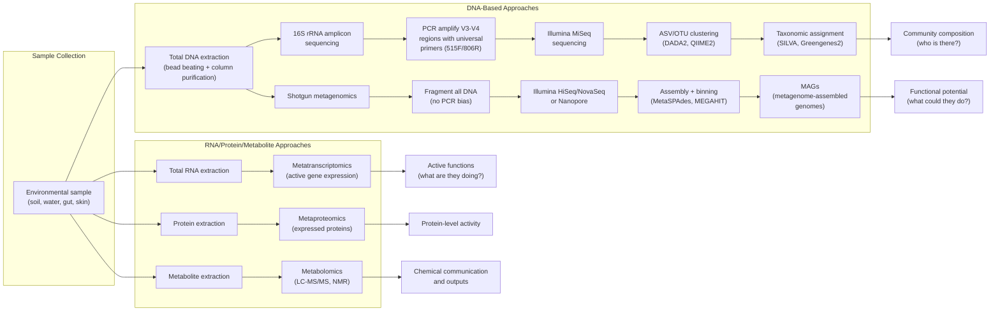
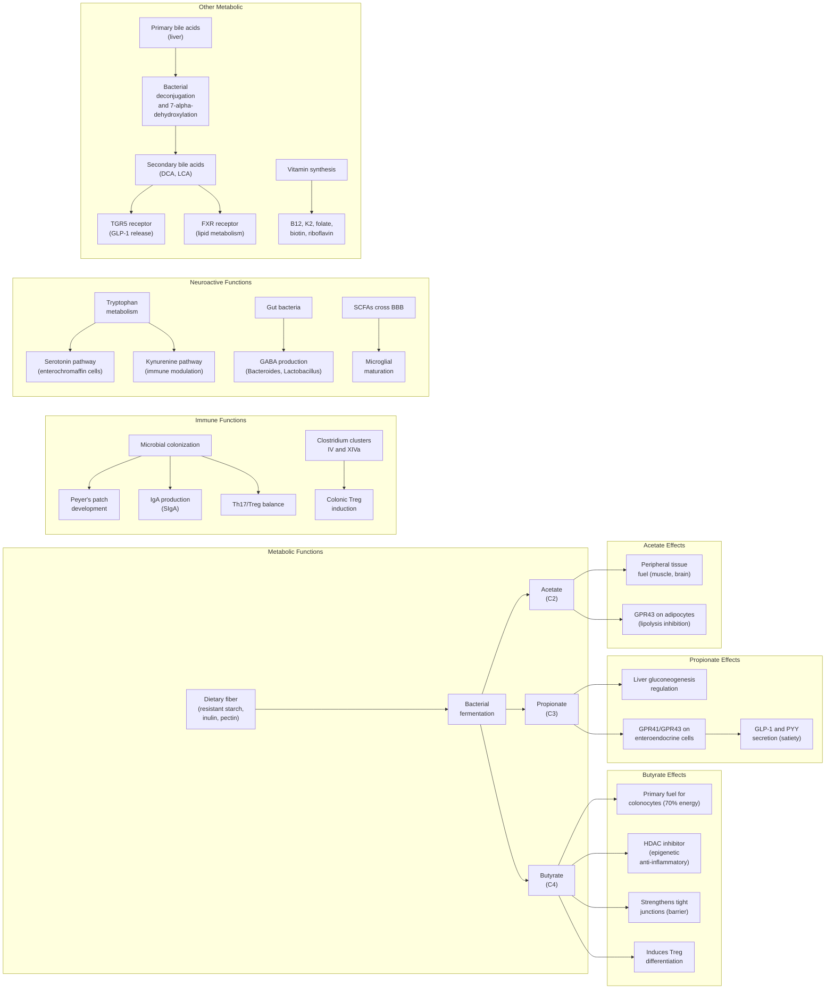
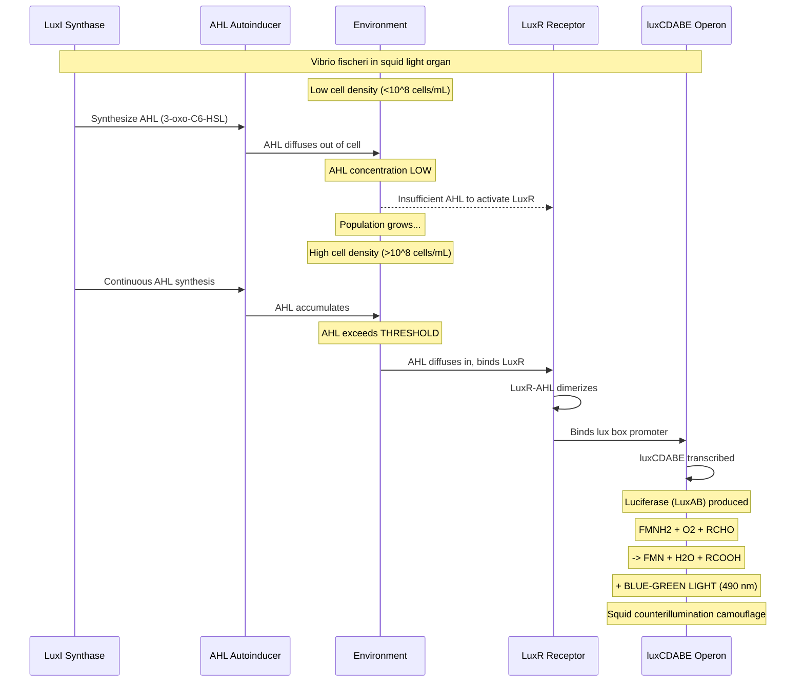
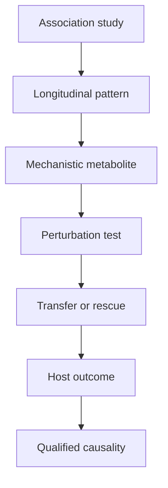

# Microbial Ecology and the Microbiome

\begin{figure}[htbp]
\centering
\includegraphics[width=0.85\textwidth]{../figures/mic_dilution_series.png}
\caption{Serial two-fold broth dilution series for minimum inhibitory concentration (MIC) testing. Antibiotic concentration halves in each successive tube from the starting stock.}
\label{fig:unit_VII_mic_dilution_series}
\end{figure}

<!-- alt: Log-scaled bar chart of antibiotic concentration across eight serial dilution tubes. -->

\label{sec:unit_VII_microbial_ecology}


<!-- chapter-metadata-badge -->
> Level 2/3 · 60 min read · 75 min lecture · Prerequisites: \cref{sec:unit_VII_bacteria_archaea_viruses}

## Learning Objectives

By the end of this chapter, you should be able to:

1. Explain the "great plate count anomaly" and describe culture-independent methods for studying microbial communities, including 16S rRNA amplicon sequencing and shotgun metagenomics.
2. Calculate and interpret alpha and beta diversity metrics for microbial communities, including Shannon entropy, Simpson and inverse-Simpson indices, and Chao1 richness estimation.
3. Distinguish OTU (operational taxonomic unit at 97% identity) from ASV (exact sequence variant) approaches and explain the role of rarefaction curves in normalizing diversity comparisons.
4. Describe the composition and functional roles of the human [**microbiome**](#gl:microbiome) across body sites, with emphasis on the gut microbiome and its core/variable components.
5. Explain microbiome-host interactions through pattern recognition receptors and short-chain fatty acid signaling.
6. Explain the relationship between dysbiosis and disease, including obesity, inflammatory bowel disease, and colorectal cancer.
7. Describe microbial roles in biogeochemical cycles (nitrogen, sulfur, carbon), including the gene markers used to track each transformation, and explain kill-the-winner dynamics in ocean phage-host systems.
8. Describe the roles of microorganisms in [**biofilm**](#gl:biofilm) formation, quorum sensing, and bioremediation.

<!-- curriculum-scaffold-start -->
### Study Blueprint

- **Big idea:** Microbes organize communities, cycles, and host physiology through interactions and metabolism.
- **Core concepts:** microbiomes, symbiosis, diversity, biogeochemical cycling.
- **Framework alignment:** Vision & Change: Evolution, Systems, Structure and function; AP Biology: Evolution, Systems Interactions; NGSS-style topics: Structure and Function, Interdependent Relationships in Ecosystems.
- **Model or quantitative lens:** Diversity indices, richness estimates, and interaction-network reasoning.
- **Data skill:** Compute or interpret community metrics from abundance data.
- **Practice cadence:** Questions and Methods, Representing and Describing Data, Argumentation.
- **Common misconception to repair:** A microbiome is not automatically beneficial; context determines the effect.
- **Primary lab:** \nameref{sec:lab_unit_VII_microbial_ecology}.
- **Question bank:** \nameref{sec:q_unit_VII_microbial_ecology}.
- **Transfer task:** Transfer microbial ecology to soils, oceans, digestion, disease, and climate feedbacks.
- **Bridge to computation:** `biology.ecology.ecology.biodiversity_indices`.
<!-- curriculum-scaffold-end -->

---

> **Opening Vignette — You Are Mostly Not You**
> 
> For decades, textbooks cited the figure that the human body contains ten times more bacterial cells than human cells. In 2016, Sender, Fuchs, and Milo published a careful recalculation: the ratio is approximately 1:1, with roughly 38 trillion bacteria and 30 trillion human cells \citep{sender2016cells}. But the bacteria contribute only about 0.2 kg of body mass, compared to 70 kg of self. What changed science was not the ratio but the Human Microbiome Project (2007–2016), which used 16S rRNA sequencing and shotgun metagenomics to map healthy human-associated microbial communities across body sites \citep{hmp2012structure}. The project revealed that gut microbiome composition influences immunity, metabolism, neurotransmitter production, and drug efficacy — and differs between individuals as distinctly as a fingerprint. The microbiome is now recognized as an additional organ, and its disruption (dysbiosis) is linked to inflammatory bowel disease, obesity, depression, and antibiotic-associated colitis. We are ecosystems, not individuals.

## Measuring Microbial Communities Across Scales

### The Great Plate Count Anomaly

In 1985, Staley and Konopka formalized a long-recognized paradox in microbiology: when environmental samples are examined by direct microscopic counts or flow cytometry, cell densities of $10^6$ per milliliter are typical in aquatic environments \citep{staley1985insitu}. Yet when the same samples are plated on standard laboratory media, primarily $10^2$-$10^3$ colony-forming units (CFU) per milliliter grow -- less than 1% of the organisms present. This discrepancy, termed the **great plate count anomaly**, revealed that the vast majority of microbial diversity is invisible to traditional culture-based microbiology.

The reasons for unculturability are diverse:

- Unknown nutrient requirements or growth factors
- Obligate syntrophic relationships (organisms that depend on metabolites from partner species)
- Extremely slow growth rates (generation times of weeks to months)
- Sensitivity to atmospheric oxygen levels (many are strict anaerobes or microaerophiles)
- Dormancy or viable-but-not-culturable (VBNC) states
- Requirement for cell-cell signaling or quorum sensing to initiate growth

### Culture-Independent Methods

Modern microbial ecology relies on molecular approaches that bypass cultivation entirely:


<!-- alt: Flowchart showing multi-omic workflow for culture-independent microbial community profiling: 16S amplicon and shotgun metagenomic DNA approaches answer "who is there" and "what could they do," while metatranscriptomics, metaproteomics, and metabolomics answer "what are they actually doing". -->

*Multi-omic workflow for culture-independent microbial community profiling: 16S amplicon and shotgun metagenomic DNA approaches answer "who is there" and "what could they do," while metatranscriptomics, metaproteomics, and metabolomics answer "what are they actually doing".*

### The 16S rRNA Amplicon Pipeline: From Sample to ASV Table

**16S rRNA amplicon sequencing** is the workhorse of microbial community profiling. Understanding the full pipeline, with its choices and biases, is essential for interpreting any modern microbiome paper.

**Why 16S?** The 16S rRNA gene is ideal as a phylogenetic marker because of three intrinsic properties:

- **Almost universally present** in most bacteria and [**archaea**](#gl:archaea) (~ 1500 bp).
- **Mosaic of conserved and variable regions** — nine hypervariable regions (V1–V9) are sandwiched between highly conserved regions that allow universal primer design (e.g., 27F, 515F, 806R, 1492R).
- **Slow evolutionary rate** in conserved domains preserves deep phylogenetic signal; rapid evolution in V regions enables genus- to species-level discrimination.

**Region selection.** Different V regions perform differently:

: The 16S rRNA Amplicon Pipeline: From Sample to ASV Table: Region and Length. {#tbl:unit_VII_microbial_ecology_the_16s_rrna_amplicon_pipeline_from_sample_to_asv_table}
| Region | Length | Strengths | Weaknesses |
|--------|--------|-----------|-----------|
| V1–V3 | ~ 480 bp | Good genus resolution; *Staphylococcus*-friendly | Misses some Bifidobacterium |
| **V3–V4** | ~ 460 bp | **De facto standard** for human microbiome (HMP); good Illumina MiSeq fit | Underestimates Bifidobacterium and some archaea |
| V4 primarily | ~ 250 bp | Single-end MiSeq; high read depth | Lower taxonomic resolution |
| V6–V8 | ~ 440 bp | Better for environmental archaea | Less reference-database coverage |
| Full-length (1.5 kb) | 1500 bp | Species- to strain-level resolution; PacBio HiFi or Nanopore | Higher per-base error rate; lower throughput |

**Workflow.**

1. **DNA extraction** — bead beating (mechanical lysis of Gram-positives, fungi, spores) plus a column-based purification (e.g., DNeasy PowerSoil). Extraction kit choice introduces bias of up to ± 30 % in relative abundances and is now considered a major reproducibility issue.
2. **PCR amplification** — universal primers (515F/806R for V4, 341F/805R for V3–V4) plus barcoded adapters allow multiplexing. **PCR cycles should be minimized (≤ 25)** to reduce chimera formation; high-fidelity polymerases (Q5, Phusion) reduce error.
3. **Library preparation and sequencing** — Illumina MiSeq 2 × 300 bp is standard; ~ 100 000 reads/sample is typical for diversity analyses, with ~ 10 × that needed to detect rare taxa.
4. **Quality filtering** — trim adapters and primers; discard reads with average Q < 25 or expected errors > 1.
5. **OTU clustering vs ASV inference** — see comparison below.
6. **Taxonomic assignment** — match representative sequences against reference databases (SILVA 138.2, Greengenes2, RDP) using naive Bayes (RDP classifier) or k-mer methods (VSEARCH); confidence threshold typically 80 % \citep{chuvochina2025silva2026}.
7. **Diversity analyses and statistics** — alpha (within-sample) and beta (between-sample) diversity, with multiple-comparison correction.

Taxonomy itself is now a versioned data product. GTDB release R10-RS226 organized 715,230 bacterial and 17,245 archaeal genomes into 136,646 bacterial and 6,968 archaeal species clusters, using average nucleotide identity for species and relative evolutionary divergence on marker-gene trees for higher ranks \citep{parks2026gtdb}. That makes a microbial name an evidence claim: reports should state the database and release used, especially when MAGs or uncultured lineages drive the biological conclusion.

### OTU vs ASV: A Decade-Long Methodological Shift

For ~ 15 years (2007–2017), microbiome studies clustered reads into **operational taxonomic units (OTUs)** at a ≥ 97 % identity threshold (corresponding roughly to genus-level groupings). Around 2017, a methodological revolution replaced this with **amplicon sequence variants (ASVs)** — exact, error-corrected sequences resolved at single-nucleotide precision. The contrast:

: OTU vs ASV: A Decade-Long Methodological Shift: Property and OTUs (de novo, closed-reference). {#tbl:unit_VII_microbial_ecology_otu_vs_asv_a_decade_long_methodological_shift}
| Property | **OTUs (de novo, closed-reference)** | **ASVs (DADA2, Deblur, UNOISE3)** |
|----------|--------------------------------------|------------------------------------|
| Clustering | Group reads at 97 % identity | Statistical denoising; each unique error-corrected sequence is its own ASV |
| Resolution | Roughly genus-level | Single-nucleotide; potentially strain-level |
| Reproducibility across studies | **Poor** (cluster boundaries depend on dataset) | **Good** (ASVs are exact sequences) |
| Tolerance to PCR/sequencing errors | High (errors collapsed into clusters) | Requires explicit error model |
| False-positive rare ASVs | Lower | Higher unless filtered |
| Computational cost | Lower | Higher (DADA2 ~ 1 hr per 1000 samples) |
| Modern recommendation | Legacy use primarily | **De facto standard since ~ 2018** |

The Callahan *et al.* (2017, *ISME Journal*) "Exact sequence variants should replace OTUs" argument has been broadly adopted: ASVs are reproducible across studies and labs, allow meta-analyses across datasets, and resolve closely related taxa that 97 %-clustering would merge. Closed-reference OTU pipelines (clustering to a fixed reference database) remain useful for very large meta-analyses but are increasingly being supplanted.

**Rarefaction and normalization.** Different samples are sequenced to different depths, which artificially inflates richness in deeply sequenced samples (you see more rare taxa simply because you looked harder). Two approaches address this:

- **Rarefaction** — randomly subsample every sample down to the minimum library size before computing diversity. Plotting richness as a function of subsample size yields a **rarefaction curve**: a curve that plateaus indicates sufficient sampling depth; one still rising indicates undersampling.
- **Normalization by total-sum scaling, CSS (cumulative-sum scaling), or DESeq2-style geometric means** — preserves the original count data with a statistical correction.

Modern best practice: report results from both approaches, confirm robustness, and rarely compare unrarefied richness across samples of unequal depth.

### Other Omics Layers

- **Shotgun metagenomics** sequences most DNA in a sample without amplification: no PCR bias; captures most organisms including viruses and eukaryotic microbes; enables functional gene profiling; produces **metagenome-assembled genomes (MAGs)** — reconstructed genomes of uncultured organisms from metagenomic reads using coverage depth and tetranucleotide frequency binning. The Human Microbiome Project (HMP, 2008-2014) characterized the microbiomes of healthy adults across body sites and showed that microbial metabolic pathways can be more stable than taxonomic composition \citep{hmp2012structure}.
- **Metatranscriptomics** (total mRNA sequencing) reveals which genes are actively expressed -- the functional state of the community at the time of sampling. This distinguishes between metabolic potential (metagenomics) and metabolic activity.
- **Metaproteomics** identifies the proteins actually translated, capturing post-transcriptional regulation.
- **Metabolomics** profiles the small molecules present in a sample using mass spectrometry (LC-MS/MS) or nuclear magnetic resonance (NMR). This captures the chemical outputs and communication molecules of the microbial community, including short-chain fatty acids, bile acid metabolites, tryptophan derivatives, and quorum sensing signals.

> **Concept Check 1:**
> A researcher sequences the 16S rRNA gene from a soil sample and identifies 500 distinct amplicon sequence variants (ASVs). She then performs shotgun metagenomics on the same sample and assembles 200 MAGs. Explain why these numbers differ and what types of organisms might be captured by one method but not the other.

> **Concept Check 1b:**
> A reviewer criticises a 2016 microbiome paper for using 97 %-identity OTU clustering instead of ASVs. The authors respond that re-running with DADA2 gives the same overall conclusions. Explain (a) what the reviewer's underlying concern is, (b) why the conclusions might still be the same in this case, and (c) one biological situation where OTU vs ASV could change a paper's conclusions.

### Diversity Metrics for Microbial Communities

Quantifying microbial community diversity requires mathematical frameworks borrowed from classical ecology. Diversity has two components — **richness** (how many distinct taxa?) and **evenness** (how uniformly are they distributed?) — and most metrics are weighted combinations of these.

**Alpha diversity** (within-sample diversity):

- **Observed ASVs/OTUs**: Simple count of distinct taxa; sensitive to sequencing depth.
- **Shannon entropy**: weights both richness and evenness logarithmically.
- **Simpson index** and its **inverse**: dominance-weighted; emphasizes common taxa.
- **Chao1 estimator**: extrapolates from observed singletons/doubletons to estimate true richness.
- **Faith's phylogenetic diversity (PD)**: Sum of branch lengths in the phylogenetic tree connecting most observed taxa; incorporates evolutionary relationships.

#### Shannon Diversity Index

The Shannon entropy is the single most-used alpha-diversity metric. It is defined as:

\begin{equation}
H' = -\sum_{i=1}^{S} p_i \ln p_i
\label{eq:unit_VII_shannon}
\end{equation}

where $S$ is the number of species and $p_i$ is the relative abundance (fraction) of species $i$. Higher $H'$ means greater diversity. The maximum $H'$ for $S$ species is $\ln S$, achieved when most species are perfectly even ($p_i = 1/S$); the minimum is 0 (single species). A useful intuition: $e^{H'}$ is the **effective number of equally common species** — a community with $H' = 2.30$ has the same Shannon diversity as 10 perfectly even species.

#### Worked Example: Computing Shannon Diversity for Five Species

**Problem:**
A gut microbiome sample contains five dominant species with the following observed counts: *Bacteroides* (500), *Faecalibacterium* (300), *Roseburia* (100), *Akkermansia* (60), *Bifidobacterium* (40). Compute the Shannon diversity index $H'$ from \cref{eq:unit_VII_shannon}.

**Solution:**

1. **Total counts:** $N = 500 + 300 + 100 + 60 + 40 = 1000$.
2. **Relative abundances:**
   $$ p_1 = 0.500,\ p_2 = 0.300,\ p_3 = 0.100,\ p_4 = 0.060,\ p_5 = 0.040.  \label{eq:unit_VII_microbial_ecology_item_1}$$

3. **Compute $-p_i \ln p_i$ term-by-term:**

: Computing Shannon Diversity for Five Species: Species and p_i. {#tbl:unit_VII_microbial_ecology_worked_example_computing_shannon_diversity_for_five_species}
   | Species | $p_i$ | $\ln p_i$ | $-p_i \ln p_i$ |
   |---------|-------|-----------|-----------------|
   | *Bacteroides* | 0.500 | $-0.693$ | 0.347 |
   | *Faecalibacterium* | 0.300 | $-1.204$ | 0.361 |
   | *Roseburia* | 0.100 | $-2.303$ | 0.230 |
   | *Akkermansia* | 0.060 | $-2.813$ | 0.169 |
   | *Bifidobacterium* | 0.040 | $-3.219$ | 0.129 |

4. **Sum:**
   $$ H' = 0.347 + 0.361 + 0.230 + 0.169 + 0.129 \approx 1.236.  \label{eq:unit_VII_microbial_ecology_item_2}$$


5. **Interpretation:** $e^{H'} = e^{1.236} \approx 3.44$. The community has the same Shannon diversity as a perfectly even community of ~ 3.4 species — capturing the fact that although there are 5 species present, the dominance of *Bacteroides* and *Faecalibacterium* substantially lowers the effective diversity. The maximum possible $H'$ for 5 species is $\ln 5 = 1.609$; this community has 77 % of maximum evenness.

#### Simpson Index and Inverse Simpson

The **Simpson index** λ measures dominance — the probability that two individuals drawn at random belong to the *same* species:

$$ \lambda = \sum_{i=1}^{S} p_i^2 .  \label{eq:unit_VII_microbial_ecology_item_3}$$


For the example above, $\lambda = 0.500^2 + 0.300^2 + 0.100^2 + 0.060^2 + 0.040^2 = 0.250 + 0.090 + 0.010 + 0.0036 + 0.0016 = 0.355$. Two complementary forms are usually reported:

- **Gini–Simpson** $D = 1 - \lambda = 0.645$ — probability that two random individuals are *different* species.
- **Inverse Simpson** $1/\lambda = 1/0.355 \approx 2.82$ — the effective number of species under Simpson weighting.

Compare with the Shannon effective number ($e^{H'} = 3.44$): Simpson weights are more dominance-sensitive, so its effective number is smaller because dominant species count more heavily. Reporting both Shannon and Simpson is now standard because they emphasize different aspects of community structure: Shannon weights most species roughly logarithmically; Simpson is dominated by abundant taxa and is less sensitive to rare taxa or sequencing errors.

### Worked Example: Estimating Species Richness using Chao1

**Problem:**
A researcher sequences 16S rRNA amplicons from a deep-sea sediment sample. The initial bioinformatics pipeline identifies a total of $S_{obs} = 150$ distinct bacterial species (ASVs). Examining the abundance tables, the researcher notes that 30 of these species were observed exactly once ($f_1 = 30$, singletons), and 10 species were observed exactly twice ($f_2 = 10$, doubletons). Use the Chao1 estimator to predict the true species richness of the community.

**Solution:**

1. **Identify the variables:**
   - Observed species ($S_{obs}$) = 150
   - Singletons ($f_1$) = 30
   - Doubletons ($f_2$) = 10

2. **Apply the Chao1 formula:**
   $$ \hat{S}_{Chao1} = S_{obs} + \frac{f_1^2}{2f_2}  \label{eq:unit_VII_microbial_ecology_item_4}$$

   $$ \hat{S}_{Chao1} = 150 + \frac{30^2}{2(10)}  \label{eq:unit_VII_microbial_ecology_item_5}$$

   $$ \hat{S}_{Chao1} = 150 + \frac{900}{20}  \label{eq:unit_VII_microbial_ecology_item_6}$$

   $$ \hat{S}_{Chao1} = 150 + 45 = 195  \label{eq:unit_VII_microbial_ecology_item_7}$$

   
The Chao1 estimator predicts that the true species richness is **195 species**. This means that despite sequencing deep enough to find 150 species, approximately 45 rare species remain undetected in the sample. The high number of singletons relative to doubletons suggests that the community has a "long tail" of rare taxa and requires deeper sequencing to capture full diversity.

**Beta diversity** (between-sample diversity):

- **Bray-Curtis dissimilarity**: Abundance-weighted; ranges from 0 (identical) to 1 (completely different); $BC_{jk} = 1 - \frac{2C_{jk}}{S_j + S_k}$, where $C_{jk}$ is the sum of lesser abundances shared between samples
- **UniFrac distance**: Incorporates phylogenetic information; unweighted UniFrac considers primarily presence/absence of taxa; weighted UniFrac also considers abundance
- **Jaccard index**: Presence/absence primarily; $J = \frac{|A \cap B|}{|A \cup B|}$

**Rarefaction curves** plot species richness against sampling effort (number of sequences). A curve that plateaus indicates sufficient sampling depth; a curve still rising indicates undersampling.

> **Concept Check 2:**
> Two gut microbiome samples have identical Shannon entropy values ($H' = 3.5$) but very different Bray-Curtis dissimilarity (0.85). Explain how two samples can have the same within-sample diversity but be highly dissimilar to each other.

> **Concept Check 2b:**
> Compute the Shannon and inverse-Simpson values for these two communities and explain why the rankings differ:
> 
> - Community A: 4 species at proportions 0.97, 0.01, 0.01, 0.01
> - Community B: 4 species at proportions 0.40, 0.30, 0.20, 0.10
> 
> Which is more diverse by Shannon? By inverse Simpson? Why?

### Worked Example: Species-Area Relationship for Marine Microbial Communities

**Problem:** Island biogeography theory predicts a power-law species-area relationship $S = c \, A^z$, where $S$ is species richness, $A$ is habitat area, and $z$ is the species-area exponent. A marine 16S rRNA survey of ocean provinces yields **$S = 1{,}000$ OTUs at $A = 10^3$ km$^2$** with a fitted exponent $z \approx 0.25$ (typical for free-living bacteria). Predict the expected species richness at the scale of an entire ocean basin, $A = 10^6$ km$^2$, and compare microbial vs. macro-organism $z$-values.

**Solution:**

1. **Fit the constant $c$.** From $S = c A^z$ at $A = 10^3, S = 1{,}000$:

   $$ c = \frac{S}{A^z} = \frac{1000}{(10^3)^{0.25}} = \frac{1000}{10^{0.75}} \approx \frac{1000}{5.623} \approx 177.8 \label{eq:unit_VII_microbial_ecology_worked_sar_1} $$

2. **Predict richness at the basin scale**, $A = 10^6$ km$^2$:

   $$ S(10^6) = c \cdot (10^6)^{0.25} = 177.8 \cdot 10^{1.5} \approx 177.8 \cdot 31.62 \approx 5{,}623 \text{ OTUs} \label{eq:unit_VII_microbial_ecology_worked_sar_2} $$

   Equivalently and more directly: $S_{\text{new}} = S_{\text{old}} \cdot (A_{\text{new}} / A_{\text{old}})^z = 1000 \cdot (10^6 / 10^3)^{0.25} = 1000 \cdot 10^{0.75} \approx 5{,}623$ OTUs — a **~5.6-fold increase in richness for a 1,000-fold increase in area**.

3. **Compare microbial vs. macro-organism $z$.** Continental and large-island vertebrates have $z \approx 0.30-0.40$; insects ~0.30; vascular plants ~0.25-0.35; free-living bacteria and archaea ~0.10-0.30. The **lower microbial $z$** (vs. macro-organisms) is the empirical signature of the **dispersal-limitation versus everything-is-everywhere** debate: lower $z$ implies that bacteria are more effectively cosmopolitan — a doubling of area adds fewer new species than for macro-organisms, because microbial dispersal is high relative to range size. Higher microbial $z$ (closer to 0.30) is found in habitat-island systems (lakes, hot springs, host-associated microbiomes) where dispersal is genuinely limited by physical barriers.

4. **Caveats and interpretation.**
   - **Sampling depth confounds $z$.** Under-sequenced provinces miss rare taxa, artificially flattening the curve; rarefaction to uniform depth is mandatory before fitting.
   - **OTU vs. ASV vs. species.** Operational-taxonomic-unit clustering (97 % similarity) collapses cryptic diversity; amplicon sequence variants (ASVs) recover finer resolution and typically inflate $S$ by 20–50 %, but the **slope $z$ is largely conserved across taxonomic-unit definitions**.
   - **Endemism vs. cosmopolitanism.** A low $z$ does not mean the same set of species occupies the entire ocean — it means relatively few species are **truly local**. Distance-decay analyses (Bray-Curtis similarity vs. geographic distance) reveal that even cosmopolitan microbial communities show distance-dependent compositional turnover.

**Take-home.** The species-area relationship applies to microbes but with a flatter slope than to plants and animals, quantitatively supporting (with important caveats) the "everything is everywhere, but the environment selects" hypothesis. Microbial macroecology is now a quantitative science with its own laws — Taylor's power law, Shannon-area scaling, distance-decay relationships — that parallel and refine those derived for macro-organisms.


---

## The Human Microbiome

### Human Microbiome Scale, Body-Site Ecology, and Gene Content

The human body harbors approximately $3.8 \times 10^{13}$ bacterial cells -- close to the number of human somatic cells ($3.0$-$3.7 \times 10^{13}$, depending on counting assumptions) \citep{sender2016cells}. The microbial gene catalog is far larger: millions of microbial genes compared to approximately 20,000 human [**protein**](#gl:protein)-coding genes. This "second genome" provides metabolic capabilities that human cells lack, effectively extending our biochemical repertoire.

The total mass of the human microbiome is approximately 200 g, predominantly residing in the colon. Each body site harbors a distinct microbial community shaped by local environmental conditions ([**pH**](#gl:ph), oxygen, moisture, nutrient availability, immune surveillance).

### Gut Microbiome Gradients and Functional Guilds

The gastrointestinal tract represents the densest microbial habitat on the human body, with a gradient from relatively sparse colonization in the stomach ($10^1$-$10^3$ bacteria/mL, limited by gastric acid) to extraordinary density in the colon ($10^{11}$ bacteria/mL -- approaching the theoretical packing limit for bacterial cells).

**[Dominant](#gl:dominant) phyla in healthy adults:**

: Gut Microbiome Gradients and Functional Guilds: Phylum and Relative Abundance. {#tbl:unit_VII_microbial_ecology_gut_microbiome_gradients_and_functional_guilds}
| Phylum | Relative Abundance | Key Genera | Functional Roles |
|--------|-------------------|------------|-----------------|
| Firmicutes | ~60-65% | *Faecalibacterium*, *Roseburia*, *Eubacterium*, *Ruminococcus*, *Lactobacillus* | Major butyrate producers; fiber [**fermentation**](#gl:fermentation) |
| Bacteroidetes | ~20-25% | *Bacteroides*, *Prevotella* | Complex polysaccharide degradation via PULs |
| Actinobacteria | ~3-5% | *Bifidobacterium*, *Collinsella* | Dominant in breastfed infants; acetate and lactate production |
| Proteobacteria | <5% (in health) | *Escherichia*, *Klebsiella* | Expansion is a marker of dysbiosis |
| Verrucomicrobia | ~1-3% | *Akkermansia muciniphila* | Mucin degradation; associated with metabolic health |
| Euryarchaeota (Archaea) | ~1% | *Methanobrevibacter smithii* | Methanogenesis; removes H$_2$ to improve fermentation efficiency |

The gut microbiome exhibits considerable inter-individual variation, influenced by diet (plant-rich diets favor *Prevotella*; animal-rich diets favor *Bacteroides*), geography, age (dramatic changes in infancy and old age), mode of birth (vaginal delivery vs. cesarean section), breastfeeding, and antibiotic exposure.

### Core vs Variable Microbiome and the F/B Ratio

Two complementary frameworks describe gut-microbiome composition:

**Core microbiome** — taxa present in ≥ 90 % of healthy individuals at ≥ 0.1 % relative abundance. Surprisingly few species qualify at the species level (5–20 across populations), but at the **functional gene** level the core is much larger: > 50 % of *gene families* are shared across most healthy adults. The biological inference is that **functional redundancy is conserved even when species composition differs** — the gut requires SCFA production, bile-acid transformation, and vitamin synthesis, but many species can supply each function. This is a textbook example of community-level convergence under functional selection.

**Variable microbiome** — the remaining ~ 80 % of taxa, which differ markedly between individuals. Variation is driven by diet (long-term fiber → *Prevotella*-dominant; meat-rich Western → *Bacteroides*-dominant), geography (the Hadza hunter-gatherers carry > 50 % of taxa absent from industrialised populations), age, and antibiotic history.

**Firmicutes / Bacteroidetes (F/B) ratio.** The two dominant phyla in the colon historically defined an enterotype-like axis. The Turnbaugh *et al.* finding that obesity-associated mouse microbiomes had increased energy-harvest capacity prompted thousands of follow-up studies \citep{turnbaugh2006obesity}; the relationship in humans is **considerably more nuanced** than initially reported. Key caveats: (1) the ratio is method-sensitive (PCR primer choice affects Bacteroidetes recovery by ± 30 %); (2) human F/B in obesity does not robustly replicate across cohorts (some studies show the opposite direction); (3) the *functional* signal — increased polysaccharide-degradation gene capacity in some obese microbiomes — is more reproducible than the *taxonomic* F/B ratio. Modern microbiome research has largely moved away from F/B as a single biomarker and toward **functional gene profiles**, **specific keystone taxa** (*F. prausnitzii*, *Akkermansia*, *Roseburia*), and **microbial metabolites** (SCFAs, secondary bile acids, indole derivatives).

***Akkermansia muciniphila* as a health marker.** *A. muciniphila* (Verrucomicrobia, 1–4 % of healthy gut) degrades intestinal mucin and stimulates host mucin replenishment, paradoxically *strengthening* the gut barrier. Lower *Akkermansia* abundance is associated with obesity, type 2 diabetes, IBD, and aging. Pasteurised *A. muciniphila* (a single non-replicating bacterial supplement, killed by gentle pasteurisation that preserves the membrane protein Amuc_1100 — which acts on TLR2 to upregulate tight junctions) has shown improved insulin sensitivity and reduced LDL in early human trials (Depommier *et al.*, 2019, *Nature Medicine*) — a striking case of a defined "next-generation probiotic" with a known molecular mechanism. The European Food Safety Authority approved pasteurised *A. muciniphila* as a novel food in 2021.

**Other keystone taxa:**

- ***Faecalibacterium prausnitzii*** (Firmicutes, 5–15 % of healthy gut) — major butyrate producer; depleted in IBD; produces a 15-kDa anti-inflammatory peptide that inhibits NF-κB activation in colonocytes.
- ***Bacteroides fragilis*** — produces polysaccharide A (PSA), a TLR2-Treg-inducing immunomodulator.
- ***Lactobacillus rhamnosus*** GG — adheres to epithelium, secretes p40/p75 proteins that promote tight-junction integrity; the most-studied probiotic strain in clinical use.
- ***Roseburia intestinalis*** — secondary butyrate producer via the butyrate-CoA-transferase pathway; depleted with fiber-poor diets.

### Oral Microbiome and Biofilm Niches

The oral cavity harbors over 700 species across distinct habitats (teeth, gingival crevice, tongue dorsum, buccal mucosa, hard palate). Key species include:

- *Streptococcus mutans*: Primary agent of dental caries; metabolizes sucrose to produce lactic acid, lowering local pH below the critical threshold (~5.5) for enamel demineralization
- *Porphyromonas gingivalis*: Keystone pathogen in chronic periodontitis; produces gingipain proteases that degrade host tissues and subvert complement
- *Fusobacterium nucleatum*: Bridge organism in dental plaque biofilm formation; recently implicated as enriched in colorectal cancer tumors

### Skin Microbiome Across Moist, Dry, and Sebaceous Sites

The skin (about 1.5 m$^2$ surface area) harbors $10^4$-$10^6$ bacteria per cm$^2$, with community composition varying by microenvironment:

- **Sebaceous (oily) sites** (forehead, back): Dominated by *Cutibacterium acnes* (formerly *Propionibacterium acnes*); metabolizes sebum triglycerides; implicated in acne vulgaris
- **Moist sites** (axillae, groin, toe web): *Staphylococcus*, *Corynebacterium*; body odor results from bacterial metabolism of apocrine sweat components
- **Dry sites** (forearm, leg): Most diverse; *Cutibacterium*, *Staphylococcus*, *Micrococcus*

### Vaginal Microbiome and Lactobacillus-Dominated Protection

In reproductive-age women, the vaginal microbiome is typically dominated by *Lactobacillus* species (L. crispatus, L. iners, L. gasseri, L. jensenii), which maintain a protective low pH (~3.8-4.5) through lactic acid production. They also produce hydrogen peroxide and bacteriocins that inhibit pathogen colonization.

Disruption of *Lactobacillus* dominance -- replacement by anaerobes such as *Gardnerella vaginalis*, *Atopobium vaginae*, and *Prevotella* -- characterizes **bacterial vaginosis (BV)**, associated with preterm birth, increased susceptibility to sexually transmitted infections including HIV, and pelvic inflammatory disease.

> **Clinical Connection: Fecal [**Microbiota**](#gl:microbiota) Transplant (FMT)**
> Recurrent *Clostridioides difficile* infection (rCDI) occurs when antibiotic-disrupted gut microbiota fails to recover, allowing *C. difficile* spores to germinate and produce toxins A and B. FMT -- transfer of processed stool from a healthy, screened donor -- restores colonization resistance and achieves cure rates exceeding 90%, compared to approximately 30% for repeated vancomycin courses. The FDA approved the first standardized FMT products in 2022-2023 (REBYOTA, a microbiota-based product, and VOWST, purified *Firmicutes* spores in oral capsules). The mechanism involves restoration of secondary bile acid production by commensal *Clostridium scindens*, which inhibits *C. difficile* spore germination, combined with [**competitive exclusion**](#gl:competitive-exclusion) and bacteriocin production by restored commensals.

---

## Microbiome Functions and Host Interactions

### Microbiome–Host Molecular Communication

Host-microbiome interaction is mediated by three classes of molecular interface: **(i) pattern-recognition receptors** that surveil microbe-associated patterns; **(ii) microbial metabolites** that act on host receptors; and **(iii) physical and immune barriers** that contain the microbiota.

**Pattern recognition receptors (PRRs).** The intestinal epithelium and lamina propria express a rich repertoire of PRRs that read the local microbial milieu in real time:

- **TLR2** (with TLR1 or TLR6 heterodimers) — recognizes Gram-positive lipoteichoic acid, lipopeptides, and *B. fragilis* polysaccharide A (PSA). PSA is a remarkable case: it is a microbial ligand that activates *anti-inflammatory* Treg responses via TLR2, demonstrating that PRR signaling is not uniformly pro-inflammatory but tunable by ligand.
- **TLR4** — recognizes Gram-negative lipid A; in healthy gut TLR4 is low-expressed apically and signals are dampened by negative regulators (A20, SIGIRR). Loss of this dampening (e.g., increased TLR4 in IBD) drives chronic inflammation.
- **TLR5** — flagellin sensor; intestinal expression is **basolateral primarily**, so commensal flagellated bacteria in the lumen do not trigger inflammation, but invading flagellated pathogens that cross the epithelium do. A beautiful example of spatial PRR localization as a discrimination strategy.
- **TLR9** — unmethylated CpG DNA; engaged by bacterial DNA in endosomes.
- **NOD1, NOD2** — cytosolic peptidoglycan fragment sensors; NOD2 mutations are the strongest single genetic risk for Crohn's disease, illustrating how loss of microbial sensing predisposes to dysbiosis.
- **AhR (aryl hydrocarbon receptor)** — sensor for tryptophan-derived microbial metabolites (indoles, IPA, indole-3-aldehyde from *Lactobacillus*); upregulates IL-22, mucin, and antimicrobial peptide production by intestinal cells.

**Short-chain fatty acid (SCFA) signaling.** SCFAs are not only fuel but signaling molecules with three identified receptors and one direct enzymatic mechanism:

: Microbiome–Host Molecular Communication: Receptor / target and Ligand preference. {#tbl:unit_VII_microbial_ecology_microbiome_host_molecular_communication}
| Receptor / target | Ligand preference | Cell type | Effect |
|---|---|---|---|
| **GPR41 (FFAR3)** | Propionate > butyrate ≫ acetate | Enteroendocrine L-cells; sympathetic neurons | PYY, GLP-1 release; sympathetic activation |
| **GPR43 (FFAR2)** | Acetate ≈ propionate > butyrate | L-cells; adipocytes; neutrophils | GLP-1; lipogenesis regulation; neutrophil chemotaxis |
| **GPR109A (HCAR2)** | Butyrate (also niacin) | Colonocytes; macrophages; dendritic cells | Treg induction; anti-inflammatory cascade |
| **HDAC inhibition** | Butyrate (mM concentrations in the colon) | Colonocytes; immune cells | Hyperacetylation of histones; epigenetic anti-inflammatory programs |

Butyrate has been called a "molecular bridge" between microbiome and host because it can engage four mechanisms simultaneously: G-protein-coupled signaling (GPR41/43/109A), epigenetic regulation (HDAC inhibition), mitochondrial fuel (β-oxidation provides ~ 70 % of colonocyte ATP), and Treg differentiation (via GPR109A and HDAC-dependent FoxP3 upregulation). Butyrate concentrations in the colonic lumen reach 10–20 mM — 1000× higher than in serum, justifying the local-action interpretation.

### Metabolic Functions of Microbial Communities

The gut microbiome functions as a metabolic organ, performing biochemical transformations that human cells cannot:


<!-- alt: Graph showing microbiome metabolic functions: fermentation of fiber to short-chain fatty acids (butyrate, propionate, acetate) with their specific receptor targets and immune outputs; bile-acid deconjugation; vitamin synthesis; and neuroactive metabolite production. -->

*Microbiome metabolic functions: fermentation of fiber to short-chain fatty acids (butyrate, propionate, acetate) with their specific receptor targets and immune outputs; bile-acid deconjugation; vitamin synthesis; and neuroactive metabolite production.*

- **Butyrate** (about 20% of SCFA): Produced primarily by *Faecalibacterium prausnitzii*, *Roseburia intestinalis*, and *Eubacterium rectale*. Serves as the primary energy source for colonocytes (providing ~70% of their energy needs). Acts as a [**histone**](#gl:histone) deacetylase (HDAC) inhibitor, promoting anti-inflammatory gene expression. Strengthens intestinal barrier function by upregulating tight junction proteins (claudins, occludin). Induces colonic regulatory T cell (Treg) differentiation via GPR109A, promoting immune tolerance.

- **Propionate** (about 25% of SCFA): Transported to the liver via portal circulation where it regulates gluconeogenesis. Activates GPR41 and GPR43 receptors on enteroendocrine L-cells, stimulating release of GLP-1 (glucagon-like peptide-1, promotes insulin secretion and satiety) and PYY (peptide YY, reduces appetite).

- **Acetate** (about 55% of SCFA): The most abundant SCFA; enters systemic circulation to serve as fuel for peripheral tissues including muscle and brain. Activates GPR43 on adipocytes, regulating lipolysis and fat storage.

**Vitamin synthesis**: Gut bacteria produce essential vitamins including vitamin K2 (menaquinone, synthesized by *Bacteroides* and other gut anaerobes), vitamin B12 (cobalamin, by *Propionibacterium*), folate, biotin, and riboflavin. However, most microbially produced vitamins are absorbed in the colon, where absorption efficiency is lower than in the small intestine.

**Bile acid metabolism**: The liver synthesizes primary bile acids (cholic acid, chenodeoxycholic acid) conjugated with glycine or taurine. In the colon, gut bacteria deconjugate these bile acids (bile salt hydrolases) and perform 7α-dehydroxylation to produce secondary bile acids (deoxycholic acid, lithocholic acid). Secondary bile acids are potent signaling molecules that activate the TGR5 receptor (stimulating GLP-1 release and energy expenditure) and the farnesoid X receptor (FXR, regulating lipid and glucose metabolism).

**Drug metabolism**: The gut microbiome can profoundly affect drug pharmacokinetics through first-pass microbial biotransformation. The cardiac glycoside digoxin is inactivated by *Eggerthella lenta*; the anti-cancer prodrug irinotecan is reactivated to its toxic form by bacterial β-glucuronidase, causing severe diarrhea; the Parkinson's drug L-DOPA is decarboxylated by gut bacteria, reducing its bioavailability.

### Immune Development Shaped by Early Microbial Exposure

The microbiome is essential for proper immune system development. Germ-free mice (raised in sterile isolators) exhibit:

- Atrophied Peyer's patches and mesenteric lymph nodes
- Reduced secretory IgA (SIgA) production
- Deficient Th17 cell populations in the lamina propria
- Impaired regulatory T cell function
- Increased susceptibility to infection

Colonization of germ-free mice with specific bacteria restores immune function: segmented filamentous bacteria (SFB) induce Th17 cells in the small intestine; *Clostridium* clusters IV and XIVa induce colonic Tregs; *Bacteroides fragilis* polysaccharide A (PSA) activates TLR2 on Tregs, promoting IL-10 production.

In humans, neonatal microbiome composition during a critical developmental window (first 1-3 years of life) shapes lifelong immune tone. Disruptions during this window (cesarean delivery, formula feeding, early antibiotic exposure) are associated with increased risk of allergic diseases, asthma, and autoimmunity -- consistent with the "hygiene hypothesis" and its modern refinement, the "old friends hypothesis."

### Gut-Brain Axis

The bidirectional communication network between the gut microbiome and the central nervous system operates through multiple channels:

- **Vagus nerve**: The tenth cranial nerve provides a direct neural pathway from the enteric nervous system (~100-500 million [**neuron**](#gl:neuron)s, sometimes called the "second brain") to the brainstem. Specific bacterial metabolites (SCFAs, tryptamine) activate vagal afferents.
- **Neurotransmitter production**: Approximately 95% of the body's serotonin (5-hydroxytryptamine, 5-HT) is produced by enterochromaffin cells in the gut, stimulated by tryptophan metabolites from gut bacteria (especially *Clostridiales*). Gut bacteria also produce GABA (*Lactobacillus*, *Bacteroides*), dopamine, and norepinephrine.
- **SCFAs**: Cross the blood-brain barrier; modulate microglial maturation and function; influence neuroinflammation
- **Immune mediators**: Microbial-induced cytokines (IL-6, TNF-α) affect brain function via circumventricular organs

Experimental evidence includes dramatic behavioral differences in germ-free mice (increased anxiety-like behavior in some strains, decreased in others), which can be partially normalized by colonization with specific probiotic strains (*Lactobacillus rhamnosus* JB-1 reduces anxiety-like behavior via vagal signaling).

### Colonization Resistance Against Pathogen Invasion

The resident microbiota provides a critical defense against pathogen colonization through multiple mechanisms:

- **Competitive exclusion**: Commensals occupy ecological [**niche**](#gl:niche)s (nutrient sources, attachment sites), preventing pathogen establishment
- **Bacteriocin production**: Antimicrobial peptides produced by commensals directly inhibit pathogen growth
- **Bile acid-mediated resistance**: Secondary bile acids produced by commensals (e.g., *Clostridium scindens* produces deoxycholic acid) inhibit *C. difficile* spore germination and vegetative growth
- **Immune priming**: Commensals maintain baseline immune surveillance (SIgA, antimicrobial peptide production by Paneth cells)

*Salmonella* enterica has evolved strategies to overcome colonization resistance: it triggers intestinal inflammation (via T3SS effectors), which disrupts the resident microbiota and generates unique nutrient sources (tetrathionate, ethanolamine) that *Salmonella* can metabolize but commensals cannot.

> **Concept Check 3:**
> Explain why broad-spectrum antibiotic treatment increases the risk of *Clostridioides difficile* infection, using the concepts of colonization resistance and secondary bile acid metabolism. Why does FMT work when repeated courses of vancomycin often fail?

> **Concept Check 3b:**
> A patient with refractory ulcerative colitis is treated with butyrate enemas. Symptoms improve over 4 weeks. Explain the multiple molecular mechanisms by which luminal butyrate can attenuate colonic inflammation, naming at least three host receptors / targets engaged. Why might oral butyrate supplements fail where rectal butyrate succeeds?

---

## Dysbiosis and Disease

**Dysbiosis** refers to a compositional and functional imbalance in the microbiome associated with disease. While causation versus correlation remains a major challenge in microbiome research, several disease associations have strong mechanistic evidence:

**Obesity and Metabolic Syndrome**:

The landmark study by Turnbaugh et al. demonstrated that an obesity-associated gut microbiome had increased energy-harvest capacity and could transfer increased adiposity to germ-free mice \citep{turnbaugh2006obesity}. The original taxonomic signal was important historically, but the more durable teaching point is functional: the obese microbiome showed enhanced capacity to ferment complex carbohydrates and altered SCFA profiles affecting host energy regulation.

Metabolic endotoxemia provides an additional mechanism: gut barrier dysfunction ("leaky gut") allows LPS translocation into the bloodstream, triggering chronic low-grade inflammation via TLR4 activation on adipose tissue macrophages, contributing to insulin resistance.

**Inflammatory Bowel Disease (IBD)**:

Both Crohn's disease and ulcerative colitis are associated with:

- Reduced overall microbial diversity
- Reduced butyrate-producing bacteria (especially *Faecalibacterium prausnitzii*, a potent anti-inflammatory species that produces butyrate and secretes anti-inflammatory metabolites)
- Increased Proteobacteria (adherent-invasive *E. coli* in ileal Crohn's)
- Reduced secondary bile acid production
- Altered tryptophan metabolism favoring the kynurenine pathway

**Colorectal Cancer (CRC)**:

*Fusobacterium nucleatum* is significantly enriched in CRC tumors compared to adjacent normal tissue. Mechanistic studies demonstrate that *F. nucleatum*:

- Adheres to cancer cells via its FadA adhesin binding to E-cadherin
- Activates the Wnt/β-catenin signaling pathway, promoting cell proliferation
- Recruits tumor-infiltrating myeloid cells that suppress anti-tumor immunity
- Correlates with poor prognosis and chemoresistance
- Serves as a potential diagnostic biomarker (detectable in stool samples)

**Antibiotic-Induced Dysbiosis**:

Broad-spectrum antibiotics cause profound disruption of the gut microbiome that can persist for months. Clinical consequences include:

- *Clostridioides difficile* infection (CDI): disrupted colonization resistance
- Pediatric antibiotic exposure and later obesity, asthma, and allergies (multiple epidemiological studies)
- Selection for antibiotic-resistant organisms within the microbiome (resistome expansion)
- Loss of bile acid-metabolizing bacteria, altering host metabolic signaling

> **Clinical Connection: Microbiome-Based Diagnostics and Therapeutics**
> The microbiome is emerging as both a diagnostic tool and therapeutic target. Stool-based tests for *Fusobacterium nucleatum* DNA are being developed as non-invasive colorectal cancer screening supplements. Live biotherapeutic products (LBPs) -- defined microbial consortia -- are in clinical trials for IBD, metabolic syndrome, and immune checkpoint inhibitor response enhancement. *Akkermansia muciniphila* supplementation has shown promise in improving metabolic parameters in overweight individuals (Depommier et al., 2019, *Nature Medicine*). The field is moving from correlation to causation through gnotobiotic mouse models, Mendelian randomization studies, and interventional trials.

---

## Environmental Microbiology Across Soil, Ocean, and Biofilms

### Soil Microbiology and Rhizosphere Processes

Soil is among Earth's most microbially diverse habitats, containing roughly $10^8$-$10^9$ bacterial cells per gram and thousands to tens of thousands of amplicon sequence variants per gram depending on soil type, sequencing depth, and the taxonomic cutoff used. The dominant phyla often include Proteobacteria, Firmicutes, Actinobacteria, Bacteroidetes, and Acidobacteria, but relative abundances shift strongly with pH, moisture, carbon input, and land management.

Soil microorganisms drive global carbon decomposition, nitrogen cycling, phosphorus solubilization, and organic matter turnover. The **rhizosphere** (soil zone immediately surrounding plant roots) is a hotspot of microbial activity, enriched 10-100 fold compared to bulk soil, driven by root exudates (sugars, amino acids, organic acids) that feed microbial communities.

### Termite Guts as Lignocellulose Bioreactors

Termites make microbial ecology visible at animal scale. Wood and grass are dominated by lignocellulose, a polymer-rich substrate that most animals cannot digest alone. Termite hindguts solve that problem by housing dense consortia of protists, bacteria, and archaea that hydrolyse cellulose and hemicellulose, ferment sugars to acetate used by the host, recycle hydrogen through methanogenesis or reductive acetogenesis, and supply nitrogen through fixation and recycling pathways \citep{brune2014symbiotic}. The termite is therefore not just an insect consumer; it is a mobile anaerobic bioreactor whose microbial partners connect plant litter to carbon, methane, and nitrogen cycling.

This example also clarifies symbiosis as a systems claim. Removing the gut community removes a metabolic capability, while changing diet, oxygen gradients, or host lineage changes the community. The unit of function is host plus microbiome, and the relevant evidence is not just "who is there" by 16S sequencing but which enzymes, redox reactions, and fermentation products actually move carbon and nitrogen.

### Marine and Environmental Microbiome Diversity

Microbial diversity in environmental systems dwarfs that of multicellular life. The dominant numerical fact about life on Earth is that there are ~ $10^{30}$ microbial cells globally — > 99 % of Earth's biological cells, and 70–90 % of Earth's biomass nitrogen and phosphorus.

**Ocean.** The ocean contains approximately $1.2 \times 10^{29}$ microbial cells in the photic zone alone. Two organisms dominate the global ocean microbiome:

- **SAR11 (*Pelagibacterales*)**: The most abundant free-living organism on Earth, estimated at $\sim 2.4 \times 10^{28}$ cells globally — i.e., ~ 25 % of ocean bacteria. Its genome (~ 1.3 Mbp) is among the smallest for free-living bacteria, reflecting extreme **genomic streamlining**: the *minimal-cell-cost hypothesis* posits that in oligotrophic surface waters where every nitrogen atom is precious, selection ruthlessly eliminates non-essential genes. SAR11 lacks transcription regulators, sigma factors, sugar-uptake systems, and most regulatory pathways — it lives a high-throughput, regulation-free metabolic life.
- ***Prochlorococcus*** **and *Synechococcus***: The most abundant photosynthetic organisms on Earth (~ $10^{27}$ cells of *Prochlorococcus* and ~ $7 \times 10^{26}$ of *Synechococcus*). *Prochlorococcus* was discovered primarily in 1986 (Chisholm), demonstrating how recently we have grasped basic ocean ecology. This tiny cyanobacterium ($< 1$ μm diameter) accounts for approximately **20 % of global ocean primary production** — it makes about 5 % of the oxygen we breathe. Different ecotypes partition the water column by light intensity, with high-light ecotypes near the surface and low-light ecotypes extending to 200 m depth.

**Soil.** Containing ~ $10^8$ bacteria per gram and often ~ $10^4$–$10^5$ ASVs per gram in deep sequencing studies, soil is one of the largest reservoirs of microbial diversity. Globally, soil holds ~ $2.6 \times 10^{29}$ microbial cells. The dominant phyla — Proteobacteria, Acidobacteria, Actinobacteria, Bacteroidetes, Verrucomicrobia, Firmicutes — vary continuously with pH, moisture, and organic matter. Acidobacteria, in particular, are abundant in molecular surveys but remain under-cultured relative to their environmental abundance, which is why metagenomics, single-cell genomics, and enrichment culture are most needed to connect sequence diversity to physiology.

**Deep biosphere.** A relatively recent realization is that the **subsurface biosphere** (rocks, sediments, and aquifers below ~ 100 m depth) contains an estimated $10^{29}$ cells — comparable to or exceeding most surface marine biomass. These extremely slow-growing chemolithotrophs (doubling times of years to centuries) couple H$_2$ from rock-water reactions to CO$_2$ fixation, sustaining ecosystems that have been functionally isolated from surface life for ~ Ma timescales. The deep biosphere now constitutes one of the largest reservoirs of unstudied microbial diversity on the planet.

**Hydrothermal vents.** Chemolithoautotrophic communities at hydrothermal vents form the base of food webs whose carbon and energy are independent of sunlight (though most aerobic vent microbes still depend on dissolved oxygen that ultimately originates from surface photosynthesis). Sulfur-oxidizing bacteria (*Thiomicrospira*, *Beggiatoa*) and hydrogen-oxidizing archaea (*Methanopyrus*) sustain ecosystems including tube worms (*Riftia pachyptila*, which lack a digestive system and rely entirely on endosymbiotic sulfur-oxidizing bacteria housed in a specialized organ called the trophosome).

### Microbial Biogeochemistry in Carbon, Nitrogen, and Sulfur Cycles

Microbes catalyse virtually every redox transformation of nitrogen, sulfur, and carbon at the global scale. The key enzymatic steps are now well-characterized, each linked to a marker gene that ecologists use to track the corresponding flux in environmental DNA.

**Nitrogen cycle.** The biogeochemical nitrogen cycle is a quasi-closed loop of microbially-catalysed redox reactions, every step of which has a diagnostic gene:

: Microbial Biogeochemistry in Carbon, Nitrogen, and Sulfur Cycles: Transformation and Reaction. {#tbl:unit_VII_microbial_ecology_microbial_biogeochemistry_in_carbon_nitrogen_and_sulfur_cycles}
| Transformation | Reaction | Organisms | Marker gene |
|---|---|---|---|
| **Nitrogen fixation** | N$_2$ → NH$_3$ | *Rhizobium*, *Azotobacter*, cyanobacteria, *Nostoc* | *nifH* (Fe protein subunit of nitrogenase) |
| **Ammonia assimilation** | NH$_3$ → glutamate / glutamine | Most organisms | *gln*A, *gdhA* |
| **Nitrification step 1 (AOA / AOB)** | NH$_3$ → NO$_2^-$ | *Nitrosomonas*, *Nitrospira*, ammonia-oxidising archaea (AOA, *Nitrosopumilus*) | *amoA* (ammonia monooxygenase) |
| **Nitrification step 2** | NO$_2^-$ → NO$_3^-$ | *Nitrobacter*, *Nitrospira* | *nxrA* (nitrite oxidoreductase) |
| **Comammox** (complete ammonia oxidation, 2015 discovery) | NH$_3$ → NO$_3^-$ in one organism | *Nitrospira inopinata* | *amoA* + *nxrA* |
| **Denitrification** | NO$_3^-$ → NO$_2^-$ → NO → N$_2$O → N$_2$ | *Pseudomonas*, *Paracoccus*, many facultatives | *narG, nirK/nirS, norB,* ***nosZ*** (N$_2$O reductase) |
| **Anammox** (anaerobic ammonia oxidation, 1995 discovery) | NH$_4^+$ + NO$_2^-$ → N$_2$ | *Brocadia*, *Kuenenia* (*Planctomycetes*) | *hzsA, hzsB* (hydrazine synthase) |
| **DNRA** (dissimilatory NO$_3^-$ → NH$_4^+$) | NO$_3^-$ → NH$_4^+$ | *E. coli*, *Salmonella*, sulfate reducers | *nrfA* |

Two transformations deserve special attention. **Nitrogen fixation** by nitrogenase ($N_2 + 8H^+ + 8e^- + 16$ATP $\rightarrow 2$NH$_3 + $H$_2 + 16$ADP $+ 16$P$_i$) is irreversibly inactivated by oxygen, presenting a paradox for [**aerobic**](#gl:aerobic) diazotrophs. Solutions include *Rhizobium*-legume symbiosis (root nodules contain **leghemoglobin** delivering O$_2$ to bacteroid respiration while keeping free O$_2$ below the threshold for nitrogenase inactivation, ~ 10 nM); cyanobacterial **heterocysts** (specialized thick-walled cells lacking photosystem II, expressing nitrogenase, connected to vegetative cells by microplasmodesmata); and free-living *Azotobacter vinelandii* using respiratory protection (extremely high respiration rate consumes O$_2$ before it reaches nitrogenase) plus conformational protection (FeSII protein binds nitrogenase in O$_2$ presence).

**Anammox** — anaerobic ammonia oxidation — was a stunning 1995 discovery (Mulder *et al.*) showing that *Planctomycetes* couple NH$_4^+$ oxidation to NO$_2^-$ reduction, producing N$_2$ via the toxic intermediate hydrazine (N$_2$H$_4$, rocket fuel). Anammox is responsible for ~ 30–50 % of marine N$_2$ production globally and is now used industrially in wastewater nitrogen removal (~ 90 % less aeration energy than conventional nitrification + denitrification).

**Sulfur cycle.** Parallel redox cycle:

: Microbial Biogeochemistry in Carbon, Nitrogen, and Sulfur Cycles: Transformation and Marker gene. {#tbl:unit_VII_microbial_ecology_microbial_biogeochemistry_in_carbon_nitrogen_and_sulfur_cycles_2}
| Transformation | Marker gene | Organisms |
|---|---|---|
| **Sulfate reduction** (SO$_4^{2-}$ → H$_2$S) | *dsrA* (dissimilatory sulfite reductase) | *Desulfovibrio*, *Desulfobacter* |
| **Sulfide oxidation** (H$_2$S → SO$_4^{2-}$) | *soxB* | *Thiobacillus*, *Beggiatoa*, hydrothermal-vent symbionts |
| **Disproportionation** (S$^0$ → SO$_4^{2-}$ + H$_2$S) | *dsrA* (reverse) | *Desulfocapsa* |

**Carbon cycle.** Microbial carbon transformations include CO$_2$ fixation (Calvin cycle: *cbbL/cbbM* RuBisCO; reverse TCA, *aclB*; Wood–Ljungdahl, *fhs/cooS*), methanogenesis (*mcrA* gene of methyl-CoM reductase — diagnostic for most methanogenic archaea), and anaerobic oxidation of methane (AOM, ANME archaea + sulfate reducers acting via reverse methanogenesis), which consumes ~ 80 % of methane produced in marine sediments before it reaches the atmosphere — a globally important methane filter.

### Phage–Host Dynamics: Kill-the-Winner

Viruses (almost entirely phages) outnumber cellular life in the ocean by ~ 10 : 1, with $\sim 10^{30}$ viral particles globally. Phages are the dominant agents of bacterial mortality, killing 20–40 % of marine bacteria per day — comparable to grazing pressure — and the dominant agent of horizontal gene transfer.

The **kill-the-winner (KTW) hypothesis** (Thingstad, 2000) explains why marine microbial communities can be enormously diverse despite competitive exclusion:

- When a bacterial species blooms (becomes the "winner" — high cell density), its cognate phage finds it efficiently (encounter rate is bilinear in $B \times P$).
- Phage proliferation crashes the bloom (the proliferation threshold $B^* = m/(bk)$, derived in the previous chapter, is exceeded once $B$ is high enough).
- Other less-abundant species are not at high enough density to sustain their own phages, so they are **not** killed proportionally — they are released from competitive pressure.
- Diversity is *maintained* because phage predation specifically punishes dominance, opening niches for rare taxa.

The dynamics are analogous to Lotka–Volterra predator–prey cycles but with one twist: phage population growth is bursty (each successful infection produces ~ 50–500 progeny in ~ 30 minutes), giving boom-and-bust cycles superimposed on the long-term equilibrium. **Cyanophage-cyanobacteria oscillations** in the ocean have been directly observed via metagenomics, with measurable phage-mediated turnover of *Prochlorococcus* populations every few days. KTW is now considered as fundamental as competitive exclusion for understanding microbial-community structure: the predator-mediated maintenance of diversity that ecologists discovered in macroscopic systems (Paine's keystone-predator experiments) operates equally — perhaps more strongly — in microbial systems.

### Biofilms as Structured Microbial Communities

Over 80% of bacteria in natural environments exist in **biofilms** -- structured communities enclosed in a self-produced extracellular polymeric substance (EPS) matrix of polysaccharides, proteins, extracellular DNA (eDNA), and lipids.

Biofilm formation proceeds through five stages:

1. **Reversible attachment**: Planktonic cells contact a surface via [**van der Waals forces**](#gl:van-der-waals-forces) and hydrophobic interactions
2. **Irreversible attachment**: Specific adhesin-receptor interactions; early EPS production; c-di-GMP (cyclic diguanylate monophosphate) levels rise, promoting sessile lifestyle
3. **Microcolony formation**: Cell division and EPS accumulation; quorum sensing coordinates gene expression
4. **Mature biofilm**: Complex 3D architecture with water channels; metabolic gradients (O$_2$, pH, nutrients) create distinct microniches; HGT frequency increases 1,000-fold
5. **Dispersal**: c-di-GMP degradation; EPS-degrading enzymes released; motility genes reactivated; planktonic cells seed new surfaces

Biofilms are **10-1,000-fold more antibiotic-resistant** than planktonic cells due to:

\cref{fig:unit_VII_mic_dilution_series} illustrates the serial two-fold dilution layout used to determine minimum inhibitory concentration (MIC) in broth assays.

- EPS barrier limiting antibiotic diffusion
- Metabolically dormant persister cells (not susceptible to growth-dependent antibiotics)
- Local accumulation of resistance enzymes (β-lactamases in the matrix)
- Microenvironment heterogeneity (anaerobic zones where aminoglycosides are ineffective)

Clinical impact: ~80% of chronic bacterial infections involve biofilms (CDC), including cystic fibrosis lung infections (*Pseudomonas aeruginosa*), dental plaque, prosthetic joint infections, catheter-associated UTIs, and endocarditis.

### Quorum Sensing and Density-Dependent Gene Regulation

**Quorum sensing (QS)** is a cell density-dependent communication system in which bacteria produce and detect small signaling molecules (**autoinducers**) that accumulate as the population grows. When autoinducer concentration exceeds a threshold, coordinate gene expression is triggered across the population:


<!-- alt: Sequence diagram showing quorum sensing in *Vibrio fischeri*: at low cell density LuxI-synthesized AHL diffuses away; once a quorum is reached AHL accumulates, binds LuxR, and triggers the *luxCDABE* operon producing bioluminescence — used for counterillumination camouflage in the bobtail squid. -->

*Quorum sensing in *Vibrio fischeri*: at low cell density LuxI-synthesized AHL diffuses away; once a quorum is reached AHL accumulates, binds LuxR, and triggers the *luxCDABE* operon producing bioluminescence — used for counterillumination camouflage in the bobtail squid.*

: Quorum Sensing and Density-Dependent Gene Regulation: QS System and Signal. {#tbl:unit_VII_microbial_ecology_quorum_sensing_and_density_dependent_gene_regulation}
| QS System | Signal | Organisms | Regulated Functions |
|-----------|--------|-----------|-------------------|
| LuxI/LuxR | N-acyl homoserine lactones (AHLs) | Gram-negatives (*V. fischeri*, *P. aeruginosa*) | Bioluminescence, biofilm, [**virulence**](#gl:virulence) factors |
| Agr | Autoinducing peptides (AIPs) | Gram-positives (*S. aureus*) | Toxin production, biofilm dispersal |
| AI-2 (LuxS) | Furanosyl borate diester | Cross-species (most bacteria with LuxS) | Interspecies communication |
| PQS | 2-heptyl-3-hydroxy-4-quinolone | *P. aeruginosa* | Iron acquisition, virulence |

### Bioremediation and Engineered Microbial Metabolism

Microorganisms can be harnessed to degrade environmental pollutants:

- *Pseudomonas putida*: Degrades toluene and xylene via the TOL [**plasmid**](#gl:plasmid)-encoded pathways; model organism for aromatic hydrocarbon bioremediation
- *Geobacter sulfurreducens*: Reduces Fe$^{3+}$ and U$^{6+}$; used for uranium immobilization at contaminated sites; generates electricity in microbial fuel cells via extracellular electron transfer
- *Ideonella sakaiensis*: Discovered in 2016 at a PET bottle recycling facility in Japan; produces PETase enzyme that degrades polyethylene terephthalate (PET) plastic; engineered variants with enhanced activity are being developed for plastic waste bioremediation
- Oil spill bioremediation: *Alcanivorax borkumensis* and *Marinobacter* species bloom after oil spills, degrading alkanes and polycyclic aromatic hydrocarbons; nutrient addition (biostimulation with nitrogen and phosphorus) accelerates degradation

> **Concept Check 4:**
> *Pseudomonas aeruginosa* uses quorum sensing to coordinate virulence factor production. A pharmaceutical company designs a drug that blocks AHL binding to the LuxR-type receptor (LasR) without killing the bacteria. Explain the therapeutic rationale for this "quorum quenching" approach compared to traditional antibiotics, and predict a potential limitation.

> **Concept Check (Analysis — Hierarchical Quorum Sensing as a Threshold Detection Mechanism):** *Pseudomonas aeruginosa* uses **hierarchically nested** quorum-sensing systems: the **Las** system (LasI synthase → 3-oxo-C₁₂-HSL autoinducer → LasR receptor) activates the **Rhl** system (RhlI → C₄-HSL → RhlR), which in turn induces a cascade of virulence factors (elastase, rhamnolipid, pyocyanin) and biofilm maturation. (a) Analyze why this **two-tier hierarchy** is functionally different from a single QS system at a higher signal threshold. Specifically, evaluate how the requirement for *both* Las and Rhl signals to exceed thresholds creates an **AND gate** that filters out spurious signals and prevents premature virulence-factor expression. (b) Predict how a **synthetic 3-oxo-C₁₂-HSL analog** delivered at **sub-threshold concentrations** (e.g., 10 % of the natural threshold) would affect biofilm biomass. The analog binds LasR competitively but does not activate it — it occupies the receptor without triggering downstream transcription. Trace the consequences: (i) reduced las-system activation despite normal natural AHL accumulation; (ii) failure to activate the rhl downstream system; (iii) impaired biofilm maturation; (iv) attenuated virulence in a clinical infection model. (c) Quantitative analysis: if the natural threshold for LasR activation is $[3O\text{-}C_{12}\text{-HSL}] = 1\,\mu$M and the analog has affinity equal to the natural signal but is delivered at 0.1 μM, derive the fractional receptor occupancy and predict the fractional reduction in downstream gene expression. (d) Connect this to **anti-virulence drug design**: why does competitive antagonism at the QS receptor avoid the strong evolutionary selection for resistance that growth-inhibitory antibiotics produce? What is the residual selection pressure?

> **Concept Check 4b:**
> Marine *Prochlorococcus* populations oscillate with their cyanophages on a ~ 5–7 day cycle, while their Shannon diversity (~ 1.5 nats) is approximately constant. Use the kill-the-winner framework to (a) explain why high overall diversity is maintained despite a single species dominating numerically, (b) predict what happens to phage population during a *Prochlorococcus* crash, and (c) describe how a metagenomic time-series experiment could test these predictions.

> **Concept Check (Synthesis — Syntrophic Coupling and Obligate Cooperation):** In anaerobic sediments, **acetate oxidation** to CO$_2$ and H$_2$ has a standard Gibbs free energy of $\Delta G^{\circ\prime} = +104$ kJ/mol — strongly **endergonic** under standard conditions. The reaction therefore cannot proceed unless **H$_2$ is kept at extremely low partial pressures** (typically below ~10 Pa) by a syntrophic partner that consumes it: a **hydrogenotrophic methanogen** (e.g., *Methanobacterium*) catalysing CO$_2$ + 4 H$_2$ → CH$_4$ + 2 H$_2$O ($\Delta G^{\circ\prime} = -131$ kJ/mol). The two reactions coupled give a small but favorable net $\Delta G^{\circ\prime} \approx -27$ kJ/mol, sufficient to drive both partners' metabolism. (a) **Synthesize how this obligate syntrophic coupling parallels eukaryotic intracellular compartmentalization.** Eukaryotic cells use organelle compartments (mitochondria, peroxisomes) to keep incompatible reactions spatially segregated and pool resources across compartments; syntrophic bacteria and methanogens accomplish the same by **interspecies hydrogen transfer (IHT)** — H$_2$ produced by the bacterium diffuses through a few micrometres of intercellular space and is immediately consumed by the methanogen, the spatial proximity functioning as a "metabolic compartment" without a single-cell boundary. (b) **Quantitatively justify** why ~10 Pa H$_2$ is the threshold: at this pressure, the H$_2$ term in the Nernst-style equation for $\Delta G$ (acetate oxidation) drops below the methanogen H$_2$-consumption $\Delta G$, making the coupled system favorable. (c) **Predict the experimental consequence of inhibiting methanogenesis** with **2-bromoethanesulfonate (BES)** — a structural analog of methyl-CoM that competitively inhibits the methyl-CoM reductase (Mcr) enzyme. Trace through: (i) BES blocks H$_2$ consumption by the methanogen; (ii) H$_2$ partial pressure rises rapidly above 10 Pa; (iii) acetate oxidation becomes thermodynamically infeasible and stops; (iv) the syntrophic bacterium starves; (v) within hours both partners' growth ceases. **Both populations collapse**, not just the methanogen — demonstrating that the cooperation is obligate, not facultative. (d) **Connect to the origin of eukaryotes**: the syntrophy hypothesis of eukaryogenesis (Martin & Müller 1998) proposes that the original endosymbiotic relationship between archaeal host and α-proteobacterial ancestor of mitochondria was exactly this kind of H$_2$ exchange — formalising the parallel between extracellular syntrophy and intracellular metabolic compartmentalization.

---

## Microbial Biotechnology for Production and Environmental Engineering

### Industrial Fermentation and Metabolic Control

Microorganisms have been harnessed for food production for millennia, and modern biotechnology has expanded their applications enormously:

The current frontier is less about replacing fermentation with a new idea and more about instrumenting it. Genome-scale metabolic models, automated strain engineering, continuous bioreactors, metagenomic enzyme discovery, and precision fermentation now let researchers tune yield, by-product formation, feedstock use, and contamination risk. Claims about "sustainable" biomanufacturing should therefore report substrate source, energy input, purification burden, waste stream, and life-cycle context rather than primarily the engineered microbe.

: Industrial Fermentation and Metabolic Control: Product and Organism. {#tbl:unit_VII_microbial_ecology_industrial_fermentation_and_metabolic_control}
| Product | Organism | Process | Application |
|---------|----------|---------|-------------|
| Ethanol | *Saccharomyces cerevisiae* | Glucose fermentation | Beverages, biofuel |
| Lactic acid | *Lactobacillus*, *Streptococcus thermophilus* | Lactose/glucose fermentation | Yogurt, cheese, sauerkraut |
| Acetic acid | *Acetobacter aceti* | Ethanol oxidation | Vinegar |
| Antibiotics | *Streptomyces* spp. | Secondary metabolism | Streptomycin, tetracycline, erythromycin |
| Amino acids | *Corynebacterium glutamicum* | Engineered fermentation | L-glutamate (MSG), L-lysine |

### Recombinant Protein Production

*E. coli* remains the workhorse for recombinant protein production:

- **Human insulin (Humulin)**: First recombinant therapeutic protein, approved 1982; replaced porcine/bovine insulin
- **Human growth [**hormone**](#gl:hormone)**: Replaced cadaveric pituitary extracts (which transmitted CJD prions)
- **Erythropoietin (EPO)**: Stimulates red blood cell production; produced in CHO (Chinese hamster ovary) cells for proper glycosylation
- **Hepatitis B [**vaccine**](#gl:vaccine)**: Recombinant HBsAg produced in yeast (*Saccharomyces cerevisiae*) -- the first recombinant vaccine

### Environmental Biotechnology and Waste-Stream Remediation

- **Biogas production**: Anaerobic digestion by methanogenic archaea converts organic waste to methane for energy; widely used in wastewater treatment and agricultural waste management
- **Constructed wetlands**: Engineered ecosystems using microbial communities for water purification
- **Synthetic biology**: Engineered microbial biosensors for environmental monitoring (arsenic detection, water quality); metabolic engineering for production of biofuels, pharmaceuticals, and commodity chemicals from renewable feedstocks

> **Concept Check 5:**
> The enzyme PETase from *Ideonella sakaiensis* degrades PET plastic at a rate too slow for industrial application. Describe two protein engineering approaches (one rational, one directed evolution) that could be used to improve PETase activity, and explain why thermostability would be a desirable trait for an industrial PET-degrading enzyme.

> **Concept Check 5b:**
> Anammox bacteria couple ammonium oxidation to nitrite reduction with hydrazine as an intermediate. (a) Why is anammox more energy-efficient than the conventional nitrification + denitrification pathway used in sewage treatment plants? (b) Why have anammox bacteria been so difficult to grow in pure culture (doubling times of 11+ days)? (c) Predict, in molar terms, the alkalinity change associated with anammox versus conventional nitrification — why does this matter for plant operation?

---

## Computational Bridge

Shannon diversity $H'$ for tabulated OTU counts matches `biodiversity_indices`:

```python
from biology.ecology import biodiversity_indices

res = biodiversity_indices([120, 80, 40, 10])
print(round(res.shannon_index, 3), res.species_richness)
```

> **Clinical / systems note:** FMT trials stratify donors partly on diversity and bile-acid-transforming guilds --- operationalisations of the same richness/evenness concepts.

---

## Current Evidence and Frontier Biology: Microbial Ecology and the Microbiome

For **Microbial Ecology and the Microbiome**, frontier biology belongs inside the evidence logic of
the chapter. Microbiology and infectious disease now require One Health reasoning across people, animals, environments, genomics, and antimicrobial stewardship. The core reading question is this: microbiome claims should distinguish correlation, mechanism, host context, perturbation, and causality.

- **What to verify:** identify the observation, model, assay, or dataset that
  would make the claim stronger or weaker.
- **What to qualify:** state the scale, organism, cell type, environmental
  condition, or population where the claim is expected to hold.
- **What to compare:** test at least one alternative explanation, baseline, or
  null model before treating the pattern as causal.
- **What to cite:** distinguish primary evidence, review synthesis, public
  dataset, and institutional guidance; for recent or numeric claims, prefer
  the source closest to the measurement and state what has changed since it was
  published.

For resistance or outbreak claims, name the organism, determinant, selection pressure, transmission route, and surveillance evidence \citep{who2024bppl,cdc2025antibioticuse,murray2022amr}.

**Source practice:** For pathogen, resistance, and intervention claims, tie statements to organism-resistance pairs, surveillance evidence, official guidance, and trial/regulatory status \citep{who2024bppl,who2025tb,who2025malaria,cdc2025lenacapavirprep,cdc2026candidaauris}.

### Current Evidence Map: Microbiome Causality Ladder


<!-- alt: Flowchart showing microbiome claims become stronger as they move from correlation toward perturbation and rescue evidence; many human associations remain context-dependent. -->

*Microbiome claims become stronger as they move from correlation toward perturbation and rescue evidence; many human associations remain context-dependent.*

## Summary

- The **great plate count anomaly** reveals that <1% of environmental microbes are culturable. Culture-independent methods (16S amplicon sequencing, shotgun metagenomics, metatranscriptomics, metabolomics) have revolutionized microbial ecology, revealing entire new phyla and functional capabilities. **ASVs (exact sequence variants)** have replaced 97 %-clustered OTUs as the de facto standard since ~ 2018.
- **Diversity metrics**: Alpha diversity quantifies within-sample diversity. Shannon entropy $H' = -\sum p_i \ln p_i$ (\cref{eq:unit_VII_shannon}), Simpson index λ and inverse Simpson $1/\lambda$, Chao1 richness, and Faith's PD weight richness and evenness differently. Beta diversity (Bray-Curtis, UniFrac, Jaccard) quantifies between-sample differences. Rarefaction curves diagnose sampling depth.
- The **human microbiome** ($3.8 \times 10^{13}$ cells, 3.3 million genes) varies by body site. The gut microbiome (Firmicutes, Bacteroidetes dominant) has a small **species-level core** but a large **functional core**; *Akkermansia muciniphila*, *F. prausnitzii*, *B. fragilis*, and *Roseburia* are keystone taxa. Microbial SCFAs (butyrate as colonocyte fuel, HDAC inhibitor, GPR109A agonist; propionate via GPR41/43; acetate as systemic fuel) signal through three GPCRs and HDAC. Pattern-recognition receptors (TLR2/4/5, NOD1/2, AhR) read the microbial milieu in real time, with PSA from *B. fragilis* a striking example of microbial control of Tregs.
- **Dysbiosis** is associated with obesity (functional polysaccharide-degradation gene shift; F/B ratio is method-sensitive and not a reliable single biomarker), IBD (reduced *F. prausnitzii*, reduced butyrate), colorectal cancer (*F. nucleatum* enrichment), and antibiotic-induced *C. difficile* infection (FMT achieves >90% cure).
- **Environmental microbiology**: Soil harbors $10^8$-$10^9$ bacteria/g; ocean contains *Prochlorococcus* (~ $10^{27}$ cells, 20 % of global primary production) and SAR11 (~ $10^{28}$ cells); deep biosphere holds another $10^{29}$ cells. Termite hindguts show how animal hosts can carry anaerobic microbial bioreactors that convert lignocellulose into acetate, methane precursors, and recycled nitrogen. **[Nitrogen fixation](#gl:nitrogen-fixation)** by nitrogenase requires 16 ATP per N$_2$ and O$_2$ protection. The microbial nitrogen cycle is tracked by *nifH* (fixation), *amoA* (nitrification), *nosZ* (denitrification), and *hzsA* (anammox); sulfur by *dsrA* and *soxB*; carbon by *mcrA* (methanogenesis) and various CO$_2$-fixation markers. **Anammox** accounts for 30–50 % of marine N$_2$ production.
- **Phage-host kill-the-winner dynamics** maintain ocean diversity: phages preferentially predate dominant bacterial species, releasing rare species from competitive exclusion. Phages turn over 20–40 % of marine bacteria daily.
- **Biofilms** (80% of natural bacteria) are 10-1,000x more antibiotic-resistant; **quorum sensing** coordinates population-level behavior via autoinducers (AHL, AIP, AI-2).
- **Bioremediation** uses microbial metabolism to degrade pollutants including hydrocarbons, heavy metals, and plastics (PETase).
- **Connections:** See \cref{sec:unit_X_ecosystem_ecology} for nutrient cycles, \cref{sec:unit_III_bioenergetics_and_respiration} for fermentation products, and \cref{sec:unit_VII_host_immunity_and_vaccines} for dysbiosis and infection.

---

## Key Terms

: Current Evidence Map: Microbiome Causality Ladder: Term and Definition. {#tbl:unit_VII_microbial_ecology_current_evidence_map_microbiome_causality_ladder}
| Term | Definition |
|------|-----------|
| **Great plate count anomaly** | Observation that <1% of environmental microorganisms grow on standard laboratory culture media |
| **16S rRNA sequencing** | Culture-independent method using the conserved/variable 16S rRNA gene as a phylogenetic marker for bacterial identification |
| **V3–V4 region** | The most common 16S amplicon target (~ 460 bp) used in human microbiome studies; provides genus-level resolution on Illumina MiSeq |
| **ASV (amplicon sequence variant)** | Error-corrected exact sequence inferred by DADA2/Deblur/UNOISE3; replaces 97 %-identity OTUs as the modern standard |
| **OTU (operational taxonomic unit)** | Cluster of 16S sequences at a fixed identity threshold (typically 97 %); legacy approach, reproducibility-limited |
| **Rarefaction curve** | Plot of richness versus sampling depth used to assess whether sequencing was deep enough |
| **Metagenomics** | Shotgun sequencing of total environmental DNA; reveals community composition and functional gene content without cultivation |
| **MAG** | Metagenome-assembled genome; computationally reconstructed genome of an uncultured organism from metagenomic data |
| **Alpha diversity** | Within-sample diversity measured by richness (number of taxa) and evenness (relative abundance distribution) |
| **Beta diversity** | Between-sample diversity; measures compositional differences between microbial communities |
| **Shannon entropy** | Alpha diversity metric: $H' = -\sum p_i \ln p_i$; accounts for both richness and evenness; effective species number is $e^{H'}$ |
| **Simpson index** | Probability that two random individuals belong to the same species: $\lambda = \sum p_i^2$; complement $1-\lambda$ is the Gini-Simpson; reciprocal $1/\lambda$ is the inverse Simpson effective number |
| **Chao1** | Estimator of true richness using singletons and doubletons: $\hat{S}_{Chao1} = S_{obs} + f_1^2/(2 f_2)$ |
| **Microbiome** | The collective community of microorganisms (and their genomes) inhabiting a defined environment |
| **Termite gut microbiome** | Anaerobic symbiotic community that digests lignocellulose, ferments sugars, and links host feeding to carbon and nitrogen cycling |
| **Core microbiome** | Taxa or genes present in nearly every healthy individual; smaller at species level than at functional-gene level |
| **Akkermansia muciniphila** | Mucin-degrading Verrucomicrobia species correlated with metabolic health; pasteurised *A. muciniphila* approved as novel food (EFSA, 2021) |
| **Dysbiosis** | Compositional and functional imbalance of the microbiome associated with disease states |
| **Short-chain fatty acids (SCFAs)** | Bacterial fermentation products (butyrate, propionate, acetate) with roles in colonocyte nutrition, immune regulation, and metabolic signaling |
| **GPR41 / GPR43 / GPR109A** | Three SCFA-sensing GPCRs that translate microbial fermentation into host hormonal and immune responses |
| **Colonization resistance** | Protection against pathogen establishment provided by resident microbiota through competition, bacteriocins, and bile acid metabolism |
| **Fecal microbiota transplant (FMT)** | Transfer of processed donor stool to restore microbial community in recipients with dysbiosis, especially recurrent *C. difficile* infection |
| **Biofilm** | Structured microbial community enclosed in self-produced EPS matrix; highly antibiotic-resistant |
| **Quorum sensing** | Cell density-dependent gene regulation via secreted autoinducer molecules (AHL, AIP, AI-2) |
| **Nitrogenase** | Enzyme complex (NifH, NifD, NifK) that reduces N$_2$ to NH$_3$; oxygen-sensitive; requires 16 ATP per N$_2$ |
| **Anammox** | Anaerobic ammonia oxidation; *Planctomycetes* couple NH$_4^+$ + NO$_2^-$ → N$_2$ via hydrazine; key gene *hzsA* |
| **Comammox** | Complete ammonia oxidation in a single organism (*Nitrospira inopinata*, 2015 discovery) carrying both *amoA* and *nxrA* |
| **Kill-the-winner** | Phage-driven mechanism that maintains bacterial diversity by preferentially predating dominant taxa |
| **Bioremediation** | Use of microbial metabolism to degrade or immobilize environmental pollutants |
| **Gut-brain axis** | Bidirectional communication between gut microbiome and CNS via vagus nerve, neurotransmitters, SCFAs, and immune mediators |

---

## Review Questions

1. Explain the great plate count anomaly and describe three specific reasons why environmental microorganisms may fail to grow on standard laboratory media. How has metagenomics addressed this limitation?

2. A researcher collects gut microbiome samples from 50 healthy individuals and 50 patients with Crohn's disease. Describe which alpha and beta diversity metrics you would calculate, what statistical test you would use to compare communities (e.g., PERMANOVA on Bray-Curtis distances), and predict the expected differences.

3. Trace the fate of dietary fiber (resistant starch) from ingestion to its effects on host metabolism and immunity. Include the specific bacteria involved, the SCFAs produced, the host receptors activated, and the downstream physiological effects.

4. A patient has experienced four recurrences of *Clostridioides difficile* infection despite multiple courses of vancomycin. Explain the mechanism by which FMT achieves cure rates exceeding 90%, focusing on colonization resistance and secondary bile acid metabolism. Why does vancomycin itself perpetuate the cycle?

5. Compare the ecological strategies of SAR11 (genome ~1.3 Mbp) and *Prochlorococcus* (genome ~1.7 Mbp). Explain why both organisms have undergone extreme genome streamlining despite occupying different ecological niches, and discuss the evolutionary trade-offs of minimal genomes.

6. Explain why *Pseudomonas aeruginosa* biofilms in the lungs of cystic fibrosis patients are resistant to antibiotic therapy. Describe at least four distinct resistance mechanisms that operate within the biofilm, and suggest a multi-target therapeutic strategy.

7. The Firmicutes/Bacteroidetes ratio is often cited as a biomarker for obesity. Critically evaluate this claim by discussing: (a) the strength of evidence from gnotobiotic mouse experiments, (b) confounding factors in human studies, (c) why this ratio alone is an oversimplification of the microbiome-obesity relationship, and (d) what functional or species-specific biomarkers have replaced F/B in modern research.

8. Design an experiment using germ-free mice to determine whether the gut microbiome influences anxiety-like behavior through the vagus nerve. Include appropriate controls, specify which bacterial species you would use for colonization, and describe how you would test vagal involvement.

9. Nitrogenase is irreversibly inactivated by oxygen, yet *Azotobacter vinelandii* is an obligate aerobe that fixes nitrogen. Explain the molecular mechanisms by which this organism protects its nitrogenase from oxygen damage.

10. A biofilm-forming *Staphylococcus aureus* strain causes recurrent prosthetic joint infection despite appropriate systemic antibiotic therapy. Explain why biofilm removal (surgical debridement) is often necessary in addition to antibiotic treatment, and describe how persister cells within the biofilm contribute to recurrence.
11. **Shannon diversity practice.** Compute $H'$ from \cref{eq:unit_VII_shannon} for the community $\{200, 100, 50, 20, 10, 10, 5, 5\}$. Then compute the inverse Simpson index. Interpret which species drive each metric.
12. Using the bridge counts, compute Simpson diversity manually from $p_i$ and compare to `res.simpson_index`.
13. Contrast **Faith's PD** with Shannon richness for prioritizing conservation of microbial lineages.
14. **Marker-gene biogeochemistry.** Describe what biogeochemical inference you can draw from a soil metagenome that contains: (a) abundant *nifH* but very little *amoA*; (b) abundant *amoA* and *nxrA*; (c) *dsrA* and *mcrA* in the same sample. What environmental setting could each combination represent?
15. **Anammox vs denitrification.** Why has anammox replaced conventional denitrification in many modern wastewater plants? Compute the stoichiometric advantage in O$_2$ demand per mole of N removed.
16. **Kill-the-winner test.** Design a 30-day metagenomic time-series experiment in a marine mesocosm to test whether *Prochlorococcus* abundance and cyanophage abundance show predator-prey oscillations. Specify sampling frequency, sequencing approach, and the statistical analysis (cross-correlation, lagged regression) you would use.

## Further Reading and Source Notes: Microbial Ecology and the Microbiome

- Woese & Fox (1977). Phylogenetic structure of the prokaryotic domain: The primary kingdoms. *Proceedings of the National Academy of Sciences*, 74.
- The Human Microbiome Project Consortium (2012). Structure, function and diversity of the healthy human microbiome \citep{hmp2012structure}.
- Turnbaugh et al. (2006). An obesity-associated gut microbiome with increased capacity for energy harvest \citep{turnbaugh2006obesity}.
- Falkowski, Fenchel & Delong (2008). The microbial engines that drive Earth's biogeochemical cycles. *Science*, 320.
- Sender, Fuchs & Milo (2016). Revised estimates for the number of human and bacteria cells in the body \citep{sender2016cells}.
- Lozupone, Stombaugh, Gordon, Jansson & Knight (2012). Diversity, stability and resilience of the human gut microbiota. *Nature*, 489.
- Madsen (latest ed.). *Environmental Microbiology: From Genomes to Biogeochemistry*. Wiley-Blackwell.
- Strous et al. (1999). Missing lithotroph identified as new planctomycete (anammox). *Nature*, 400.

---

## Companion Source Module: Microbial Ecology and the Microbiome

**Microbial Ecology and the Microbiome** should leave a reproducible trail from a biological claim to
the code, figure, diagram, or paper-based activity that can test it. Use the
surfaces below to inspect the chapter's assumptions, rerun the relevant model,
or compare the manuscript explanation with companion labs and figures.

: Companion source surfaces for Microbial Ecology and the Microbiome. {#tbl:unit_VII_microbial_ecology_companion_source_surfaces}
| Surface | Use it for |
| --- | --- |
| `src/biology/microbiology/microbiology.py` (`bacterial_growth_curve`, `doubling_time`) | Quantify growth constraints for interacting microbial populations. |
| `src/biology/ecology/ecology.py` (`lotka_volterra`, `connectance`, `biodiversity_indices`) | Treat microbiomes as communities with measurable interaction structure. |
| `src/mermaid/biology_diagrams.py` (`food_web_diagram`) | Compare cross-feeding and competition with broader food-web logic. |

**Reproducibility check:** distinguish association, perturbation response, mechanism, and host/environment context before making a microbiome-causality claim. **Cross-reference:** use \cref{sec:unit_X_community_interactions,sec:unit_X_biodiversity_and_food_webs} and \cref{sec:unit_VII_host_immunity_and_vaccines,sec:unit_VII_antimicrobial_resistance_and_epidemiology}.
