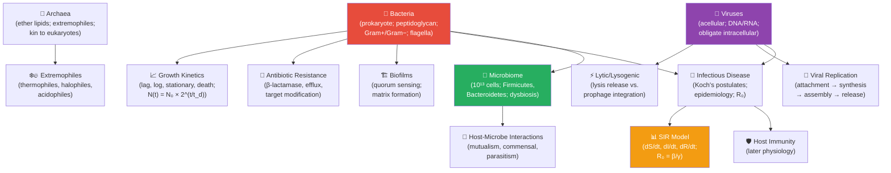

# Unit VII — Microbiology: Introduction {.unnumbered}


\label{sec:unit_VII_unit_intro}
## Why This Unit Matters {.unnumbered}

The living world is microbial. In mass, in metabolic diversity, and in evolutionary history, microorganisms
dominate life on Earth. The total number of prokaryotic cells on Earth (~10³⁰) exceeds the number of
stars in the observable universe by a factor of 100,000. The deepest branches of the tree of life are
most microbial. Photosynthesis — the ultimate source of energy for most ecosystems — was invented
by cyanobacteria more than 2.7 billion years ago. Nitrogen fixation, without which terrestrial
agriculture would collapse, is performed exclusively by bacteria and archaea. The atmosphere itself
was transformed by microbial metabolism long before any animal breathed it.

Medical microbiology became possible primarily after Robert Koch's postulates (1877–1884) established the
germ theory of disease — the revolutionary idea that specific microorganisms cause specific infections.
Alexander Fleming's observation in 1928 that *Penicillium* mould killed staphylococcal colonies
initiated the antibiotic era, saving an estimated 200 million lives over the following century. But
pathogens evolve. The emergence of multidrug-resistant organisms (MRSA, XDR-TB, carbapenem-resistant
*Enterobacteriaceae*) represents one of the most urgent public health crises of the 21st century:
an estimated 1.27 million deaths were attributable to antimicrobial resistance in 2019 (Murray et al.,
2022, *The Lancet*).

This unit combines cell biology (structure of bacteria, archaea, and viruses), quantitative
microbiology (growth curves, MIC calculations, viral replication kinetics), and ecology (the microbiome,
biogeochemical cycles, infectious disease dynamics). You will apply the S-I-R epidemiological model
and calculate R₀; model bacterial growth and antibiotic kill curves; and examine the microbiome as a
complex ecological community whose disruption underlies diseases from *C. difficile* colitis to
metabolic syndrome.

---

## Landmark Discoveries {.unnumbered}

| Discoverer(s) | Year | Journal / Source | Discovery | Significance |
| ------------- | ---- | ---------------- | --------- | ------------ |
| Antoni van Leeuwenhoek | 1676 | *Philos. Trans. R. Soc.* | First observation of bacteria (\"animalcules\") | Founded microbiology; showed microorganisms are everywhere |
| Louis Pasteur | 1859–1861 | *Ann. Sci. Nat.* | Disproof of spontaneous generation | Established germ theory; revolutionised medicine and food safety |
| Robert Koch | 1876–1884 | *Investigations into the Etiology of Traumatic Infective Diseases* | Koch's postulates; anthrax, TB, cholera | Rigorous criteria for linking pathogen to disease |
| Alexander Fleming | 1928 | *Brit. J. Exp. Pathol.* | Penicillin discovery | Launched the antibiotic era; Nobel Prize 1945 |
| Carl Woese & George Fox | 1977 | *Proc. Natl. Acad. Sci.* | Archaea as third domain (16S rRNA) | Restructured the comprehensive tree of life; archaea are closer to eukaryotes than to bacteria |
| David Relman et al. | 1999–2006 | *Proc. Natl. Acad. Sci.; Science* | Human microbiome characterisation by 16S rRNA | Revealed ~10¹³ microbial cells as an integral part of human biology |
| Murray et al. | 2022 | *The Lancet* | Global mortality from antimicrobial resistance (1.27 million deaths, 2019) | Quantified the scale of the AMR crisis as a call to action |

---

## Key Concepts and Connections {.unnumbered}


<!-- alt: Graph showing microbiology concept map — red = bacteria; purple = viruses; green = microbiome; orange = epidemiological models. -->

*Microbiology concept map — red = bacteria; purple = viruses; green = microbiome; orange = epidemiological models.*

---

## Current Evidence Thread {.unnumbered}

In microbiology, a claim is primarily as strong as the way the organism was observed: read this unit as an evidence trail in which microbial life is established through culture, sequencing, and surveillance rather than as a list of named taxa and diseases. Microbiology and infectious disease now require One Health reasoning across people, animals, environments, genomics, and antimicrobial stewardship. As you
move through the chapters, keep a two-column note: **claim** on the left,
**evidence that would change my confidence** on the right. By the end of the
unit, each major idea should be tied to a measurement, model, citation, or
paper-based lab decision.

## Chapter Roadmap {.unnumbered}

| Chapter | Title | Core Question | Key Equation / Model |
| ------- | ----- | ------------- | -------------------- |
| **22** | Bacteria, Archaea, and Viruses | What distinguishes the three major types of microorganism, and how do they replicate? | Doubling time: $t_d = \ln 2 / \mu$; viral burst size |
| **23** | Microbial Ecology | What roles do microorganisms play in ecosystems and the human body? | MIC, MBC; diversity indices (Shannon $H'$) |
| **24** | Infectious Disease | How do pathogens cause disease, and how do epidemics spread? | SIR model: $R_0 = \beta / \gamma$; basic reproductive number |

---

## Connections Across the Textbook {.unnumbered}

- **Prokaryotic cell structure** in \cref{sec:unit_II_cell_theory} and \cref{sec:unit_II_cell_structure} provides the foundation for understanding antibiotic mechanisms (cell wall, ribosome 70S targets).
- **Viral replication** links to \nameref{sec:unit_IV_unit_intro} (CRISPR discovered as a bacterially-encoded anti-phage defence system; RNA viruses and reverse transcriptase).
- **Antibiotic resistance evolution** is a direct application of \nameref{sec:unit_VI_unit_intro} (natural selection, fitness, molecular clocks on resistance genes).
- **Infectious disease epidemiology** (SIR model) connects to \nameref{sec:unit_X_unit_intro} (disease ecology, parasite-host dynamics in community ecology).
- **Microbiome** connects to \nameref{sec:unit_IX_unit_intro} (gut-brain axis, immune regulation) and \nameref{sec:unit_X_unit_intro} (decomposer role in nutrient cycling).

> **Key vocabulary introduced here:** peptidoglycan, Gram stain, endotoxin (LPS), exotoxin, minimum inhibitory concentration (MIC), basic reproductive number (R₀), prophage, bacteriophage, quorum sensing, biofilm, prion, viroid, microbiome, dysbiosis, Koch's postulates.


## Computational Toolbox — Unit VII {.unnumbered}

```python
from biology.microbiology import bacterial_growth_curve, doubling_time

# Bacterial growth: E. coli at 37°C, doubling time ~20 min (0.333 h)
growth = bacterial_growth_curve(N0=1e3, doubling_time_hr=1/3, t_end_hr=4, lag_phase_hr=0)
print(f"Start: {growth.populations[0]:.0f} cells")
print(f"After 4 h: {growth.populations[-1]:.2e} cells")
print(f"Growth rate: {growth.growth_rate_per_hr:.2f} h⁻¹")
# Expected:
# Start: 1000 cells
# After 4 h: 4.10e+06 cells
# Growth rate: 2.08 h⁻¹

# Doubling time from two measurements
td = doubling_time(N0=1e3, Nt=4.096e6, elapsed_time_hr=4)
print(f"Estimated doubling time: {td*60:.1f} min")
# Expected: Estimated doubling time: 20.0 min
```

> **Try it yourself:** Change `doubling_time_hr` from `1/3` to `1.0` and compare final population size after 4 hours.

---

*Source modules: `src/biology/microbiology/` — `bacterial_growth_curve()`, `doubling_time()`, `mic_fold_dilution()`, `VIRAL_REPLICATION_CYCLES`.*
*Figures: `src/visualization/` (growth curves, SIR dynamics); `src/mermaid/biology_diagrams.py` (viral replication cycle diagrams).*

## Cross-Unit Integration {.unnumbered}

\nameref{sec:unit_VII_unit_intro}'s microbiology — bacterial growth, viral replication, antimicrobial action, host–pathogen coevolution — sets up an immune-recognition problem that \nameref{sec:unit_VIII_unit_intro} confronts from the plant side first. Plants face a constant assault from microbial and viral pathogens but lack circulating immune cells; instead they deploy pattern-recognition receptors (PRRs) at the cell surface, intracellular NLR proteins, systemic acquired resistance signaling, and chemical defenses (phytoalexins, glucosinolates) that mirror — through convergent evolution — the innate-immune logic of animals. As \nameref{sec:unit_VIII_unit_intro} develops plant biology, recognize the immune-signaling motifs from \nameref{sec:unit_VII_unit_intro} (PAMP recognition, RNA-silencing antiviral defense, quorum-disrupting chemistry) reappearing in a stationary, autotrophic organism. The shared logic is older than the kingdoms.
