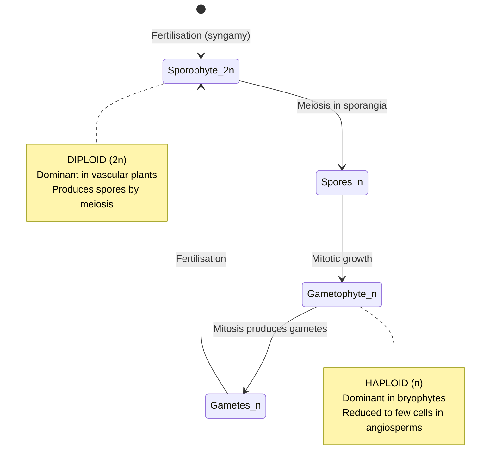
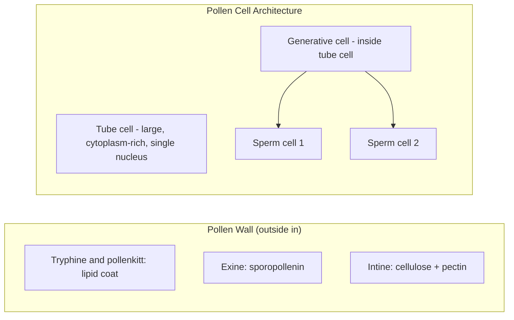
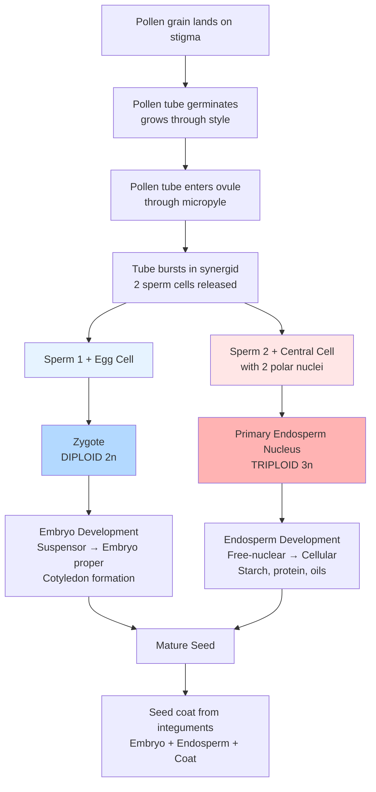
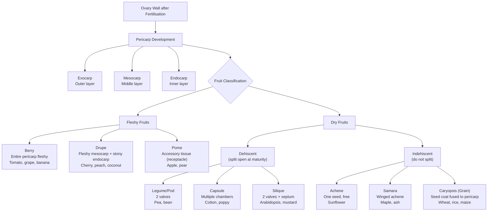

# Plant Reproduction and Development

\label{sec:unit_VIII_plant_reproduction}


<!-- chapter-metadata-badge -->
> **Ch 26** · Level 2/3 · 55 min read · 75 min lecture · Prerequisites: \cref{sec:unit_VIII_plant_structure_and_water}

## Learning Objectives

By the end of this chapter, you should be able to:

1. Describe the alternation of generations and explain the evolutionary trend from gametophyte-[**dominant**](#gl:dominant) to sporophyte-dominant life cycles across the plant kingdom.
2. Compare reproduction in non-vascular plants, seedless vascular plants, gymnosperms, and [**angiosperm**](#gl:angiosperm)s.
3. Describe angiosperm flower structure and explain the ABCDE model of floral organ identity \citep{coen1991}, including the molecular identities of MADS-box transcription factors.
4. Describe pollen grain and embryo sac architecture at cellular resolution; trace double fertilisation in detail \citep{nawaschin1898}, including pollen tube chemotropism, synergid degeneration, and sperm cell delivery.
5. Explain microsporogenesis, megasporogenesis, and endosperm development (free-nuclear, cellular, PEG-pathway) including the 2m:1p genome dosage.
6. Compare seed dormancy types (physical, physiological, morphological, morphophysiological, combinatorial) and the molecular basis of germination triggers (stratification, scarification, light via phytochrome).
7. Describe self-incompatibility (SSI vs GSI), apomixis (sporophytic vs gametophytic), polyploidy, and vegetative propagation strategies.
8. Explain embryogenesis and meristem organisation (SAM/RAM) including the WUS-CLV3 feedback loop, fruit development, and parthenocarpy.

<!-- curriculum-scaffold-start -->
### Study Blueprint

- **Big idea:** Plant reproduction integrates life cycles, development, dispersal, and environmental timing.
- **Core concepts:** alternation of generations, flowers, seeds, development.
- **Framework alignment:** Vision & Change: Structure and function, Pathways and transformations of energy and matter, Systems; AP Biology: Energetics, Systems Interactions; NGSS-style topics: Structure and Function, Matter and Energy in Organisms and Ecosystems.
- **Model or quantitative lens:** Life-cycle accounting and phyllotaxis/growth-pattern calculations.
- **Data skill:** Track ploidy, tissue origin, and reproductive stage from diagrams or observations.
- **Practice cadence:** Visual Representations, Questions and Methods, Argumentation.
- **Common misconception to repair:** Pollen, spores, seeds, and gametes are not interchangeable terms.
- **Primary lab:** \cref{sec:lab_unit_VIII_plant_reproduction}.
- **Question bank:** \cref{sec:q_unit_VIII_plant_reproduction}.
- **Transfer task:** Transfer reproductive reasoning to agriculture, pollination ecology, and plant evolution.
- **Bridge to computation:** `biology.botany.botany.plant_biomass_growth`.
<!-- curriculum-scaffold-end -->

---

> **Opening Vignette — The Seeds That Fed a Billion People**
>
> In the 1950s, famines threatened South Asia and Latin America as human population growth outpaced food production. Norman Borlaug, an American agronomist working in Mexico with the Rockefeller Foundation, spent a decade cross-breeding wheat varieties — shuttling seeds between winter and summer growing seasons to double selection speed — until he produced semi-dwarf, disease-resistant wheat varieties that yielded three to four times as much grain as traditional tall-stem wheats. Unlike traditional wheats, the short stems didn't fall over when supporting heavy grain heads. He introduced these seeds to Pakistan and India in 1965. By 1970, wheat production had doubled in both countries, and famine had been averted. Borlaug received the 1970 Nobel Peace Prize. The same innovations, later extended to rice by the International Rice Research Institute, constitute the Green Revolution — a triumph of applied plant reproductive biology that is estimated to have saved over a billion lives.

## Alternation of Generations

Plants have a **diphasic life cycle** -- alternating between a diploid **sporophyte** (spore-producing) generation and a haploid **gametophyte** ([**gamete**](#gl:gamete)-producing) generation. This alternation is unique to plants and some algae; animals have primarily a brief haploid gametic phase.


<!-- alt: State diagram showing alternation of generations showing the two phases of the plant life cycle The sporophyte (2n) produces haploid spores by meiosis. Spores develop into the gametophyte (n), which produces gametes by mitosis. Fertilisation restores the diploid sporophyte. -->

*Alternation of generations showing the two phases of the plant life cycle The sporophyte (2n) produces haploid spores by [**meiosis**](#gl:meiosis). Spores develop into the gametophyte (n), which produces gametes by [**mitosis**](#gl:mitosis). Fertilisation restores the diploid sporophyte.*

| Plant group | Dominant generation | Gametophyte description | Fertilisation requirement |
| ----------- | ------------------- | ----------------------- | ------------------------- |
| Bryophytes (mosses, liverworts) | **Haploid gametophyte** (the leafy "plant") | Free-living; nutritionally independent | Water required (flagellated sperm swim) |
| Pteridophytes (ferns, horsetails) | **Diploid sporophyte** | Small, free-living prothallus (~1 cm$^2$); needs moisture | Water required |
| Gymnosperms (*Pinus*, *Ginkgo*, cycads) | Diploid sporophyte | Reduced; pollen = 4-celled male gametophyte; archegonia in ovule = female gametophyte | Wind pollination; no water needed |
| Angiosperms (flowering plants) | Diploid sporophyte | Microscopic, dependent: pollen = 3-celled; embryo sac = 7-celled, 8-nuclei | Wind or animal pollination |

**Why does dominance shift to the sporophyte?** Diploid cells can mask deleterious recessive [**mutation**](#gl:mutation)s ([**heterozygous**](#gl:heterozygous) advantage). A diploid sporophyte can accumulate more genetic material enabling structural complexity -- leaves, stems, vascular tissue, seeds -- allowing colonisation of increasingly dry terrestrial habitats. The seed is the key innovation: it encases the embryo and gametophyte within maternal tissue, eliminating dependence on external water for fertilisation.

### Worked Example: Tracking Ploidy Through the Angiosperm Life Cycle

**Problem:**
Maize (*Zea mays*) has a sporophyte chromosome number of $2n = 20$. Track the chromosome number at each stage of alternation of generations, then determine the ploidy of the zygote and the primary endosperm nucleus produced by double fertilisation.

**Solution:**

1. **Establish the haploid number.** The gametophyte (haploid) number is half the sporophyte number:
$$ n = \frac{2n}{2} = \frac{20}{2} = 10 \text{ chromosomes} \label{eq:unit_VIII_plant_reproduction_item_7}$$

2. **Meiosis in the sporophyte.** The diploid megaspore mother cell ($2n = 20$) undergoes meiosis, producing haploid megaspores with $n = 10$. The surviving megaspore divides **mitotically** to build the embryo sac, so the egg cell and each of the two polar nuclei most carry $n = 10$. The pollen (microgametophyte) likewise delivers sperm cells with $n = 10$.

3. **First fusion — the zygote.** One sperm fuses with the egg:
$$ \text{zygote} = n_{\text{egg}} + n_{\text{sperm}} = 10 + 10 = 20 \;\; (2n,\ \text{diploid embryo}) \label{eq:unit_VIII_plant_reproduction_item_8}$$

4. **Second fusion — the endosperm.** The second sperm fuses with the two polar nuclei of the central cell:
$$ \text{primary endosperm nucleus} = n + n + n = 10 + 10 + 10 = 30 \;\; (3n,\ \text{triploid}) \label{eq:unit_VIII_plant_reproduction_item_9}$$

5. **Genome dosage of the endosperm.** Two of the three genomes are maternal (the polar nuclei) and one is paternal (the sperm):
$$ \frac{\text{maternal}}{\text{paternal}} = \frac{2n}{1n} = \frac{20}{10} = \frac{2}{1} \label{eq:unit_VIII_plant_reproduction_item_10}$$

**Interpretation:** Meiosis halves $2n = 20$ to $n = 10$ for the gametophyte generation; the two sperm-mediated fusions of double fertilisation then restore a $2n = 20$ embryo and create a distinctive $3n = 30$ endosperm with a fixed 2:1 maternal:paternal dosage — the genetic substrate for the parent-of-origin conflict conserved across flowering plants.

---

## Plant Group Reproductive Strategies

### Non-Vascular Plants (Bryophytes)

**Mosses** (Bryophyta, ~12,000 species), **liverworts** (Marchantiophyta), and **hornworts** (Anthocerotophyta) represent the ancestral condition:

- The **gametophyte** is the dominant, photosynthetic plant body
- The sporophyte is small, attached to, and nutritionally dependent on the gametophyte
- Flagellated sperm must swim through water films to reach the archegonium (female reproductive structure)
- Spores dispersed from capsule (sporangium) at tip of sporophyte seta
- Ecological importance: pioneer colonisers of bare rock, form peat (carbon reservoir), retain moisture

**Concept Check 1:** Why are mosses restricted to moist habitats? What aspect of their reproduction limits their distribution?

### Seedless Vascular Plants (Ferns and Allies)

**Ferns** (Polypodiopsida, ~10,500 species) represent the first major shift to sporophyte dominance:

- The **sporophyte** is the dominant plant (the familiar fern [**frond**](#gl:frond))
- Sporangia are clustered in **sori** (singular: sorus) on the underside of fronds, often protected by an indusium
- Meiosis in sporangia produces haploid spores
- Spores germinate into a small, heart-shaped **prothallus** (the independent gametophyte, ~1 cm)
- The prothallus bears both antheridia (produce flagellated sperm) and archegonia (produce eggs)
- Sperm must swim through water to the archegonium -- the limiting step
- After fertilisation, the new sporophyte grows from the prothallus, which eventually withers

Horsetails (*Equisetum*) and club mosses (*Lycopodium*, *Selaginella*) are also seedless vascular plants. *Selaginella* shows early heterospory (different-sized spores for male and female gametophytes), a precursor to the seed habit.

### Gymnosperms

Gymnosperms ("naked seed") include conifers (~630 species), cycads (~350), *Ginkgo biloba* (1 species), and gnetophytes (~70). Key reproductive features:

- **Heterospory:** Microsporangia (in pollen cones/microstrobili) produce microspores that develop into pollen grains (male gametophyte). Megasporangia (in ovulate cones) produce megaspores that develop into the female gametophyte (with archegonia).
- **Pollen eliminates the need for water** for fertilisation. Wind-dispersed pollen lands on the ovule (pollination drop mechanism in many gymnosperms).
- **Slow fertilisation:** In pines, 12-18 months elapse between pollination and fertilisation. The pollen tube grows slowly through the nucellus to reach the archegonium.
- **Seeds:** The fertilised ovule develops into a seed containing the embryo, stored food (female gametophyte tissue), and a protective seed coat derived from the integuments. Seeds are "naked" (not enclosed in a fruit).

### Angiosperms (Flowering Plants)

Angiosperms (~300,000 species) are the most diverse plant group, with several key innovations:

- **Flowers:** Specialised reproductive structures that facilitate pollination (including animal pollination)
- **Double fertilisation:** Unique to angiosperms, producing both embryo and endosperm
- **Fruits:** Mature ovary wall enclosing seeds; facilitate dispersal
- **Reduced gametophytes:** Male gametophyte = 3-celled pollen grain; female gametophyte = 7-celled, 8-nucleate embryo sac

---

## Angiosperm Flower Structure and the ABCDE Model

### Flower Architecture

Angiosperm flowers are **modified shoots** (shoot lateral organs with determinate growth). A **complete flower** contains four whorls (from outside inward):

| Whorl | Name | Organ | Function |
| ----- | ---- | ----- | -------- |
| 1 (outermost) | Calyx | Sepals | Protect flower bud; photosynthetic; sometimes petaloid |
| 2 | Corolla | Petals | Attract pollinators via colour (UV patterns visible to bees), scent (monoterpenes), oil rewards |
| 3 | Androecium | Stamens (filament + anther) | Pollen production (male gametophyte) |
| 4 (innermost) | Gynoecium | Carpels (pistil) = stigma + style + ovary | Pollen reception; pollen tube guidance; ovule enclosure |

**Floral symmetry:**
- **Actinomorphic (radially symmetric):** *Rosa*, *Ranunculus*, most basal angiosperms -- generalised pollinators
- **Zygomorphic (bilaterally symmetric):** Orchidaceae, Fabaceae, Scrophulariaceae -- specialised pollinators

**Incomplete flowers** lack one or more whorls. **Imperfect flowers** lack either stamens (pistillate/female flowers) or carpels (staminate/male flowers). Monoecious plants bear both on the same individual (maize); dioecious plants bear them on separate individuals (holly, willow).

### The ABCDE Model and MADS-Box Floral Quartets \citep{coen1991}

The combinatorial control of floral organ identity by **MADS-box transcription factors** is the foundational discovery of plant evo-devo, and it provides a quantitative framework for understanding floral diversity. The classical ABC model (Coen and Meyerowitz, 1991) was extended by the discovery of D and E classes:

| Whorl | Organ | Classes active | [**Gene**](#gl:gene)s (*Arabidopsis*) |
| ----- | ----- | -------------- | --------------------- |
| 1 | Sepal | A + E | AP1, AP2, SEP1-4 |
| 2 | Petal | A + B + E | AP1, AP2, AP3, PI, SEP1-4 |
| 3 | Stamen | B + C + E | AP3, PI, AG, SEP1-4 |
| 4 | Carpel | C + E | AG, SEP1-4 |
| Inside whorl 4 | Ovule | D + E | SHP1, SHP2, STK, SEP1-4 |

**Molecular identities of the ABC classes:**

- **A class (AP1, AP2):** AP1 is itself a MADS-box gene; AP2 belongs to the unrelated AP2/ERF family — an "ABC anomaly" reflecting the fact that the canonical model was assembled before most molecular identities were known. AP1 specifies sepal identity in whorl 1 and contributes to petal identity in whorl 2.
- **B class (AP3 and PI):** Both are MADS-box genes; AP3 and PI form an obligate heterodimer (AP3-PI). This heterodimer is required for petal (with A) and stamen (with C) specification. *ap3* or *pi* single mutants lose petals and stamens.
- **C class (AG = AGAMOUS):** A MADS-box gene that specifies stamen identity (with B) and carpel identity (alone, with E). AG also enforces floral meristem determinacy: in *ag* mutants, the floral meristem proliferates indefinitely, generating extra petals in place of stamens and a new flower in place of a carpel — the genetic basis of "double flowers" in cultivated roses, carnations, and chrysanthemums.
- **D class (STK, SHP1, SHP2):** MADS-box genes specifying ovule identity within whorl 4. Loss of D-class function converts ovules to leaf-like structures.
- **E class (SEP1, SEP2, SEP3, SEP4):** SEPALLATA MADS-box genes; required for combinatorial action of A, B, C, D. *sep1 sep2 sep3 sep4* quadruple mutants produce primarily sepal-like organs in most whorls.

**The MADS-box and the floral quartet model:**

The **MADS-box** is a 56-amino-acid DNA-binding domain (named for MCM1, AGAMOUS, DEFICIENS, SRF — the founding members). MADS-box proteins bind CArG-box DNA motifs (CC[A/T]$_6$GG) and form **floral quartets** (Theissen and Saedler, 2001): tetrameric complexes that combinatorially specify each whorl's identity by binding two CArG boxes simultaneously, looping the intervening DNA. The four-protein composition determines target gene specificity:

- AP1-AP1-SEP3-SEP3 → sepal
- AP3-PI-AP1-SEP3 → petal
- AP3-PI-AG-SEP3 → stamen
- AG-AG-SEP3-SEP3 → carpel

\begin{equation}
\text{A} + \text{B} + \text{C} + \text{D} + \text{E} \xrightarrow{\text{combinatorial CArG binding}} \text{floral quartet}
\label{eq:unit_VIII_floral_quartet}
\end{equation}

**Key predictions and experimental validation:**

- Removing A class (*ap1*/*ap2* mutants) results in carpels in whorls 1 and 2 (C class spreads to fill most whorls)
- Removing B class (*ap3*/*pi* mutants): sepals in whorls 1 and 2; carpels in whorls 3 and 4
- Removing C class (*ag* mutant): petals instead of stamens (whorl 3) and further petals indefinitely instead of carpel (whorl 4); produces double-petalled "full" flowers — the classic phenotype of cultivated double roses, carnations, and chrysanthemums
- Removing E class (*sep1 sep2 sep3 sep4* quadruple mutant): most whorls produce sepal-like organs, demonstrating SEP genes are required for B, C, and D function
- **Quintuple ABCDE mutant:** Most whorls produce leaf-like organs — confirming the molecular interpretation of Goethe's 1790 metamorphosis hypothesis that most floral organs are modified leaves

> **Clinical Connection:** Understanding the ABCDE model has practical applications in crop breeding. Manipulating floral organ identity genes can create male-sterile lines (essential for hybrid seed production in rice and wheat) by silencing the B class to convert stamens to petals. Conversely, increasing petal number in ornamental varieties relies on partial loss-of-function *ag* alleles. The multi-billion dollar cut flower industry relies directly on MADS-box gene variants for double-flowered roses, carnations, and chrysanthemums.

See \cref{eq:unit_VIII_floral_quartet} for the combinatorial logic; the empirical demonstration in *Antirrhinum* and *Arabidopsis* is the foundational work of \citet{coen1991}.

---

## Gametophyte Generation -- Cellular Architecture

### Male Gametophyte: Microsporogenesis and Pollen Grain Architecture

The mature pollen grain is the most reduced male gametophyte known — three cells encased in a desiccation-resistant wall. Its development is a textbook case of asymmetric cell division.


<!-- alt: Flowchart showing architecture of an angiosperm pollen grain at maturity The tube cell envelops the generative cell, which divides to yield two sperm cells either before pollen release (tricellular pollen) or during tube growth (bicellular pollen at release). -->

*Architecture of an angiosperm pollen grain at maturity The tube cell envelops the generative cell, which divides to yield two sperm cells either before pollen release (tricellular pollen) or during tube growth (bicellular pollen at release).*

**Pollen wall layers:**

- **Intine (inner):** Cellulose + pectin; uniform thickness; secreted by the gametophyte itself
- **Exine (outer):** Sporopollenin (oxidatively polymerised phenylpropanoids and fatty acids); deposited by the surrounding sporophytic tapetum. Sporopollenin is among the most chemically inert biopolymers known — it is essentially indestructible by acid, base, or enzymatic attack, allowing pollen to survive millions of years in sediment. Exine sculpturing patterns (colpi, pores, reticulations) are diagnostic for plant families and form the basis of **palynology** (fossil pollen analysis).
- **Tryphine and pollenkitt:** Lipid-rich material in exine cavities; contains species-specific recognition factors (S-locus proteins, lipidic adhesins) and is essential for hydration on the stigma surface

**Pollen cell architecture and microsporogenesis:**

The mature pollen grain is a 3-celled structure: one large **vegetative (tube) cell** with a single decondensed nucleus, enclosing two small **sperm cells** (the germline). Its development proceeds through five steps:

1. **Archesporial cells** within the anther microsporangium differentiate into diploid **microspore mother cells (MMCs)** — also called pollen mother cells
2. Each MMC undergoes **meiosis I + II** to produce **4 haploid microspores**, initially held as a tetrad surrounded by a **callose** wall (β-1,3-glucan). The tapetum (a sporophytic somatic cell layer surrounding the developing microspores) secretes **callase** (β-1,3-glucanase) at a precisely timed point to dissolve callose and release individual microspores.
3. **Microspore mitosis I** is **asymmetric**: the microspore nucleus migrates to one side, and an asymmetric division produces a small **generative cell** and a large **vegetative cell**. The generative cell is engulfed by the vegetative cell cytoplasm — a "cell within a cell" architecture unique to plant gametogenesis. Asymmetric division depends on the GAMETOPHYTE-DEFECTIVE 1 / DUO1 transcriptional network.
4. **Microspore mitosis II** divides the generative cell to produce **2 sperm cells**:
   - In **tricellular pollen** (~30% of species; *Arabidopsis*, *Brassicaceae*, grasses) mitosis II completes before pollen is released from the anther
   - In **bicellular pollen** (~70% of species; most flowering plants) mitosis II occurs in the growing pollen tube after pollination
5. The mature pollen grain = 1 vegetative cell + 2 sperm cells = the complete **male gametophyte**

The two sperm cells are not equivalent: one is "leading" and tends to fuse with the egg, the other "trailing" with the central cell. The recognition mechanism uses cell-surface markers — though preferred matching is statistical rather than absolute.

### Female Gametophyte: Megasporogenesis and the Polygonum-Type Embryo Sac

The angiosperm female gametophyte is also drastically reduced — a 7-celled, 8-nucleate structure embedded in the ovule. The **Polygonum-type** embryo sac (~70% of angiosperms) is the canonical form.

**Cell types and their functions:**

- **Egg cell** (1, micropylar): Haploid; becomes the zygote upon fertilisation. Polarised: nucleus near the chalazal end, large vacuole at the micropylar end. Specifies the apical–basal axis of the future embryo.
- **Synergids** (2, micropylar; flank the egg): Haploid. Critical functions:
  - Secrete **LURE peptides** (CRP810 family; species-specific) through the **filiform apparatus** (an elaborate cell-wall labyrinth at the micropylar pole that increases secretory surface area), guiding the pollen tube to the ovule
  - One synergid degenerates (programmed cell death) upon pollen tube arrival, providing the entry channel
  - Express the **FERONIA-LORELEI receptor complex** required for pollen tube reception and rupture
- **Central cell** (1, large, central): Contains **2 polar nuclei** (which fuse before or during fertilisation to form a diploid secondary nucleus). Becomes the **triploid endosperm** upon fertilisation with one sperm. The canonical 2:1 maternal:paternal genome dosage is widespread across angiosperms and is the substrate for genomic imprinting and parental conflict, as discussed in the genomic-imprinting section.
- **Antipodal cells** (3, chalazal): Function in nutritive/transfer roles. Highly polyploid (up to 32 n via endoreduplication) in grasses, where they are long-lived; in *Arabidopsis* and most dicots, antipodals degenerate before fertilisation.

**Megasporogenesis and Embryo Sac Development:**

1. A single **megaspore mother cell (MMC)** (also called megasporocyte) within the ovule's nucellus undergoes meiosis, producing 4 haploid megaspores in a linear tetrad along the chalazal-micropylar axis
2. **Three megaspores degenerate** via programmed cell death; the surviving (typically chalazal) **functional megaspore** alone gives rise to the female gametophyte. The selectivity of which megaspore survives is partly genetic (auxin gradients, AGO9-dependent siRNA silencing of competing megaspores) and partly stochastic.
3. The functional megaspore undergoes **3 rounds of free nuclear mitosis** (without cytokinesis) producing an 8-nucleate coenocyte. The 8 nuclei migrate to specific positions: 4 nuclei toward each pole.
4. **Cellularisation:** Cell walls form around the 8 nuclei to establish the 7 cells: 1 egg + 2 synergids + 1 central cell (with 2 polar nuclei, one from each pole) + 3 antipodals = the **mature embryo sac**

**Concept Check 2:** A mutation eliminates the synergids during embryo sac development (synergid-less *gametophyte mutant1*). Predict which steps of fertilisation will fail and why double fertilisation cannot proceed.

---

## Pollination, Pollen-Pistil Interactions, and Double Fertilisation

### Pollination Systems

**Transfer of pollen from anther to stigma** occurs by various vectors, each associated with characteristic floral traits (pollination syndromes):

| Vector | Syndrome | Flower morphology | Plant examples |
| ------ | -------- | ----------------- | -------------- |
| Bees (*Apis*, *Bombus*) | Melittophily | Blue/yellow/UV-reflective; landing platform; nectar guide | *Trifolium*, *Solanum*, *Linaria* |
| Butterflies | Psychophily | Red/pink; narrow tube; nectar platform; day-opening | *Asclepias*, *Buddleja* |
| Hawkmoths | Sphingophily | White; strong scent dusk-dawn; long narrow tube; night-opening | *Nicotiana*, *Datura* |
| Bats | Chiropterophily | Large; white/pale; fermented/fruity scent; nocturnal; robust | *Agave*, *Ceiba*, *Adansonia* |
| Birds (hummingbirds) | Ornithophily | Red/orange (beyond bee vision); no or little scent; abundant dilute nectar; tubular | *Strelitzia*, *Lobelia*, *Fuchsia* |
| Wind | Anemophily | Small, inconspicuous; no nectar; enormous pollen quantities; feathery stigma | *Poa*, *Quercus*, grasses, *Betula* |
| Water | Hydrophily | Variable; pollen at water level | *Vallisneria*, *Ceratophyllum* |

**80% of flowering plants** are insect-pollinated (entomophilous). Global pollination services estimated at ~$577 billion/year (IPBES 2016).

**Concept Check 3:** A plant species has small, green, scentless flowers that produce copious dry pollen. What is its likely pollination vector? What other structural features would you expect?

### Pollen-Pistil Interactions: Self-Incompatibility (SI) Systems

Self-incompatibility (SI) is a widespread genetic mechanism preventing self-pollination and inbreeding depression. Approximately **40% of angiosperm species** have functional SI. The molecular logic divides into two paradigms based on whether the pollen's incompatibility phenotype is determined by its own (haploid) genotype or by the (diploid) genotype of the pollen-producing parent.

**Sporophytic SI (SSI)** — *Brassica* (cabbage, mustard), *Ipomoea*, Asteraceae

The pollen rejection phenotype is determined by the **diploid** sporophytic tissue of the anther (specifically, the tapetum that deposits proteins onto the pollen wall) — *not* by the pollen grain's own haploid genotype.

- **S-locus genes:**
  - **SRK** (S-receptor kinase): Stigma-expressed; receptor on the stigma papilla membrane
  - **SCR/SP11** (S-locus cysteine-rich protein 11; pollen coat protein): Deposited on pollen exine by the diploid tapetum during pollen maturation
- **Mechanism:** When SRK on the stigma encounters its matching SCR on the incoming pollen (i.e., self-pollen sharing the same S-haplotype as the stigma), SRK autophosphorylates and recruits **ARC1** (E3 ubiquitin ligase). ARC1 ubiquitinates **Exo70A1**, a key component of the secretion exocyst required for pollen hydration. The pollen fails to hydrate and is rejected at the stigma surface — before pollen tube germination.
- **Genetic consequence:** Because pollen carries the diploid parental S-genotype, most pollen from a heterozygous *S₁S₂* plant is rejected by *S₁S₂*, *S₁S₃*, and *S₂S₃* stigmas.

**Gametophytic SI (GSI)** — Solanaceae (*Petunia*, *Nicotiana*, tomato), Rosaceae (apple, pear, almond), Papaveraceae

The pollen rejection phenotype is determined by the pollen grain's own **haploid** S-genotype.

- **S-locus genes (S-RNase / SLF system):**
  - **S-RNase**: Pistil-expressed; ribonuclease secreted into the style transmitting tract
  - **SLF (S-locus F-box protein)**: Pollen-expressed; multiple SLFs per haplotype, acting collectively
- **Mechanism (collaborative non-self recognition):** S-RNase enters the growing pollen tube non-specifically. Each SLF can "tag" non-self S-RNases (those whose haplotype does not match the pollen tube's own) for ubiquitination and proteasomal degradation by the SCF^SLF^ complex. **Self S-RNase escapes degradation** because the pollen tube's SLFs cannot recognise the matching S-RNase. Surviving S-RNase enters the cytoplasm and degrades pollen tube ribosomal RNA, halting tube growth before fertilisation.
- **Genetic consequence:** A cross between *S₁S₂* and *S₁S₃* plants: *S₁* pollen is rejected by both stigmas; *S₂* pollen succeeds on the *S₁S₃* stigma; *S₃* pollen succeeds on the *S₁S₂* stigma. Half the pollen is accepted; offspring genotypes are *S₁S₂*, *S₁S₃*, *S₂S₃* (no homozygotes possible).

**Comparative summary:**

| Feature | Sporophytic SI (Brassica) | Gametophytic SI (Solanaceae) |
| ------- | ------------------------- | ---------------------------- |
| Determinant of pollen phenotype | Diploid parental tissue (tapetum) | Pollen's own haploid genome |
| Pollen recognition | At stigma surface (before germination) | In style during tube growth |
| Female factor | SRK (membrane receptor kinase) | S-RNase (secreted RNase) |
| Male factor | SCR (pollen coat protein) | SLF (F-box) |
| Number of S-haplotypes | Often 50–100 | Often 50–200 |

**Evolutionary significance of SI:** Self-incompatibility maintains heterozygosity and avoids inbreeding depression in obligate outbreeders. Its breakdown (typically by loss of S-RNase or SLF function) gives rise to self-compatible lineages, which often go extinct because of genetic load — but occasionally undergo spectacular adaptive radiations (e.g., self-compatible *Arabidopsis thaliana* descended from self-incompatible *A. lyrata*; the loss of SI may have facilitated *A. thaliana*'s colonisation of new habitats by enabling single-individual founder events).

### Polyploidy and Speciation in Plants

Plants exhibit far higher rates of polyploidy than animals; **~70% of angiosperm species** retain evidence of one or more whole-genome duplications in their evolutionary history.

**Modes of polyploid origin:**

- **Autopolyploidy:** Whole-genome duplication within a single species; chromosomes form quadrivalents at meiosis, often causing reduced fertility initially
- **Allopolyploidy:** Hybridisation between two species followed by chromosome doubling; chromosomes from each parental genome pair separately as bivalents, restoring fertility. Most cultivated polyploids are allopolyploids.

**Pathways:**

1. **Unreduced gamete fusion:** Two 2n gametes fuse to form a 4n zygote (one in 1000 gametes is unreduced)
2. **Somatic doubling:** Spontaneous chromosome doubling in a meristematic cell during somatic growth
3. **Triploid bridge:** Triploids (3n) produce a wide variety of unbalanced gametes; some 4n offspring arise from these

**Polyploid crops:** Wheat (hexaploid: AABBDD genomes from three ancestral diploids), cotton (tetraploid), strawberry (octoploid), banana (often triploid, sterile), oats (hexaploid).

**Polyploidy promotes speciation** because new polyploids are reproductively isolated from their parental species (triploid offspring of a 2n × 4n cross are sterile), creating an instant reproductive barrier. Polyploids often exhibit **heterosis** (hybrid vigour), enlarged organs (the basis of many crop polyploids), and increased ecological tolerance.

### Double Fertilisation \citep{nawaschin1898}

Sergei Nawaschin's 1898 discovery of double fertilisation in *Lilium martagon* and *Fritillaria tenella* — observing two simultaneous nuclear fusions in a single ovule — was transformative for plant biology and remains the defining synapomorphy of angiosperms.


<!-- alt: Flowchart showing double fertilisation in angiosperms One sperm fuses with the egg to form the diploid zygote (which develops into the embryo). The second sperm fuses with the central cell's two polar nuclei to form the triploid primary endosperm nucleus (which develops into the nutritive endosperm). This process is unique to angiosperms. -->

*Double fertilisation in angiosperms One sperm fuses with the egg to form the diploid [**zygote**](#gl:zygote) (which develops into the embryo). The second sperm fuses with the central cell's two polar nuclei to form the triploid primary endosperm nucleus (which develops into the nutritive endosperm). This process is unique to angiosperms.*

1. **Pollen tube germination on the stigma:** Compatible pollen hydrates within minutes on the stigma surface; the **vegetative (tube) cell** extends a callose-walled tube. Tip growth is driven by:
   - A **tip-focused [Ca$^{2+}$] gradient** (~1.5–10 µM at the apex; ~150 nM in the shank)
   - Vesicle-mediated wall deposition (callose for tube wall, pectin for the inner wall)
   - Cytoplasmic streaming carrying the generative/sperm cells to the tip
   - Growth rates: 1–10 mm/h in *Lilium*, 1 cm/h in maize

2. **Spermatogenesis during tube elongation (in bicellular species):** The generative cell, carried in the tube cell cytoplasm, undergoes mitosis II during pollen tube growth, producing the two sperm cells. In tricellular species (*Arabidopsis*, grasses), this division has already occurred before pollen release.

3. **Pollen tube guidance — chemotropism:** The pollen tube navigates through the style and ovary toward a single receptive ovule via a cascade of guidance cues:
   - **Style cues:** γ-aminobutyric acid (GABA) gradient in the transmitting tract; cysteine-rich peptides
   - **Funicular guidance:** Short-range cues from ovary tissue
   - **Micropylar guidance:** **LURE peptides** (defensin-like, cysteine-rich; CRP810 family) released from the synergid filiform apparatus; species-specific. *Torenia* LURE1/LURE2 attract pollen tubes specifically of the same species — the molecular basis of inter-species pollination barriers. LURE peptides bind PRK6 receptor kinases on the pollen tube tip, biasing tip growth toward the source.

4. **Synergid degeneration:** As the pollen tube approaches the ovule, **one of the two synergids undergoes programmed cell death** (within minutes; the receptive synergid). Loss of synergid integrity:
   - Creates the entry channel into the embryo sac
   - Releases pre-stored signalling molecules
   - Exposes the **FERONIA (FER)** receptor kinase / **LORELEI (LRE)** GPI-anchored co-receptor complex on the persisting synergid surface

5. **Pollen tube reception and rupture:** FER-LRE signalling, via reactive oxygen species (ROS) generated by RBOH NADPH oxidases and elevated cytosolic [Ca$^{2+}$], triggers explosive rupture of the pollen tube tip, releasing the two sperm cells into the embryo sac. The signalling depends on RALF peptides binding FER. In *fer* mutants, pollen tubes enter the synergid but fail to rupture (continued growth and "supernumerary" pollen tube delivery — the polyspermy phenotype).

6. **Sperm cell delivery and double fusion:**
   - **Sperm 1 + egg cell** → karyogamy → **2n zygote** → embryo
   - **Sperm 2 + 2 polar nuclei (central cell)** → triple fusion → **3n primary endosperm nucleus** → endosperm

\begin{equation}
\text{LURE} \xrightarrow{\text{LRE-FER complex}} \text{tube rupture} \rightarrow 2 \text{ sperm released}
\label{eq:unit_VIII_lre_fer}
\end{equation}

**Significance of double fertilisation:**

- Endosperm provides a "payment on delivery" mechanism — primarily fertilised ovules develop endosperm, ensuring optimal parental investment
- Endosperm in cereals: starch (70-80%), storage proteins (gluten in wheat, zein in maize), oils, vitamins — source of ~60% of global human caloric intake
- Triploid endosperm (2 maternal : 1 paternal genome dose) provides a unique genetic substrate for **parental conflict** (paternally-imprinted genes promote nutrient transfer; maternally-imprinted genes restrict it) — conserved in ratio across most flowering plants

> **Clinical Connection:** Understanding pollen tube guidance has implications for crop fertility. In interspecific crosses (e.g., wheat × rye to produce triticale), pollen tube guidance often fails because LURE peptides are species-specific. Genetic engineering of LURE receptors could enable wider crosses for crop improvement.

### Worked Example: Endosperm Ploidy and Parental Genome Dosage

**Problem:** Compute the genomic dosage of the endosperm under normal angiosperm double fertilisation and under a maternal mutant that has doubled the central-cell genome, and explain why endosperm imprinting makes the dosage shift matter for seed viability.

**Normal case.** A wild-type ovule contains a haploid egg (n) and a central cell with two haploid polar nuclei (n + n = 2n). The pollen delivers two haploid sperm (n each):

- Sperm 1 (n) + egg (n) $\rightarrow$ **zygote 2n** $\rightarrow$ embryo
- Sperm 2 (n) + central cell (2n) $\rightarrow$ **primary endosperm nucleus 3n** $\rightarrow$ endosperm

Maternal : paternal genome ratio in normal endosperm $= 2 : 1$.

**Mutant case (maternal *4n* central cell — e.g., from a polyploid maternal lineage; assume each polar nucleus is 2n instead of n).** Same haploid pollen.

- Sperm 1 (n) + egg (n) $\rightarrow$ zygote 2n (unchanged)
- Sperm 2 (n) + central cell (2n + 2n = 4n) $\rightarrow$ **endosperm 5n**

Maternal : paternal genome ratio in mutant endosperm $= 4 : 1$.

**Solution:**

1. **Compute the dosage shift.** From $2:1$ (normal) to $4:1$ (mutant) doubles the maternal contribution per paternal copy.
2. **Map the shift onto imprinting.** Endosperm carries strong parent-of-origin imprinting. Maternally-expressed imprinted genes (MEGs; e.g., *FIS2*, *MEDEA*) restrict endosperm growth and nutrient transfer; paternally-expressed imprinted genes (PEGs; e.g., *PHE1*) drive endosperm proliferation and nutrient pull. The $2:1$ ratio sets the canonical balance.
3. **Predict the seed phenotype.** In the mutant, maternal "restraint" genes are now in fourfold excess relative to paternal "growth" genes. Endosperm cellularisation is accelerated, nutrient transfer to the embryo is curtailed, and seed size collapses. This is precisely the phenotype seen in interploidy crosses where a tetraploid mother is crossed to a diploid father — the so-called *maternal excess* seed-failure syndrome.
4. **Symmetric prediction.** A reciprocal cross (diploid mother $\times$ tetraploid father) produces *paternal excess* endosperm ($2:2 \rightarrow$ effective $1:1$ or worse), with the opposite phenotype: delayed cellularisation, overgrown endosperm, and seed abortion from a different failure mode. Together these explain the triploid block — a major reproductive barrier in interploidy crosses and a quantitative test of the parental-conflict theory of imprinting.

**Interpretation.** Double fertilisation is not merely a developmental quirk; it is the substrate on which parental-conflict-driven imprinting plays out. The canonical $2 : 1$ ratio is the genomic ledger that keeps embryo provisioning balanced. Disrupt the ratio and you disrupt the seed.


---

## Endosperm Development and Seed Biology

### Endosperm Development: Free-Nuclear, Cellular, Helobial

After triple fusion, the primary endosperm cell (3n; typically 2m:1p genome ratio) undergoes a stereotyped developmental sequence that determines the storage architecture of the mature seed. The 2:1 maternal:paternal genome ratio is the canonical angiosperm pattern and is important for normal seed development, while some lineages show dosage and developmental variation.

**Three modes of endosperm development:**

1. **Nuclear (free-nuclear) endosperm — most common:** The primary endosperm nucleus undergoes repeated mitosis without cytokinesis, producing a **syncytium** of hundreds to thousands of nuclei in a common cytoplasm with a large central vacuole. Examples: *Arabidopsis*, maize, rice, wheat, coconut (the "coconut water" of an immature coconut is liquid free-nuclear endosperm). After ~6–8 nuclear divisions, **cellularisation** initiates from the periphery inward, with cell walls forming radially around each nucleus. The mature cellular endosperm then accumulates storage products (starch, protein, oil).
2. **Cellular endosperm:** Cytokinesis accompanies every mitosis from the start; the endosperm is cellular throughout. Examples: *Petunia*, tobacco, magnoliid lineages.
3. **Helobial endosperm:** The first division separates a small chalazal cell from a large micropylar cell; subsequent divisions are nuclear in the micropylar half and cellular in the chalazal half. Examples: many monocots in Alismatales.

**Seed filling:** During the maturation phase (after cellularisation), endosperm cells accumulate massive amounts of storage compounds:
- **Starch:** Synthesised from sucrose imported from maternal phloem; deposited in plastids (amyloplasts). Cereal grain starch can reach 60–70% of dry mass.
- **Storage proteins:** Family-specific (zeins in maize, glutenins/gliadins in wheat, prolamines in rice, globulins in legumes). Stored in protein bodies derived from the ER and vacuole.
- **Oils:** Triacylglycerols stored in oil bodies (oleosomes); dominant in oilseeds (sunflower, canola, soybean).

**The PEG/MEG pathway and parental conflict:**

The **FIS-PRC2** (FERTILIZATION INDEPENDENT SEED – Polycomb Repressive Complex 2) complex — comprising MEDEA (MEA), FIS2, FIE, and MSI1 — is the master regulator of endosperm initiation and parental conflict resolution:

\begin{equation}
\text{Maternal MEA-FIE-FIS2-MSI1} \xrightarrow{\text{H3K27me3}} \text{repression of paternally-imprinted genes (PEGs)}
\label{eq:unit_VIII_peg_pathway}
\end{equation}

- **PEGs (Paternally Expressed Genes):** Expressed primarily from the paternal allele in endosperm (the maternal allele is silenced by H3K27me3 deposited by FIS-PRC2). Examples: *PHE1*, *YUC10*, *AHL10*. PEGs tend to **promote** endosperm growth and nutrient transfer to the embryo.
- **MEGs (Maternally Expressed Genes):** Expressed primarily from the maternal allele. MEGs tend to **restrict** endosperm growth.
- **Imbalance in PEG/MEG dosage** (e.g., crosses between species with different ploidy) causes seed abortion via the **endosperm balance number (EBN)** mechanism. This is why interploidy crosses fail: a 2x × 4x cross produces triploid embryos with imbalanced PEG/MEG expression, triggering seed abortion.

The 2m:1p endosperm dosage thus becomes the principal arena for **parent-of-origin genetic conflict**, with paternally-imprinted PEGs evolutionarily favoured to extract more maternal resources for the offspring, and maternally-imprinted MEGs favoured to ration resources across multiple offspring.

### Seed Dormancy: Five Classes and Triggers

**Seed dormancy** delays germination until conditions favour seedling survival. Baskin and Baskin (2004) classify dormancy into five types:

| Dormancy type | Cause | Trigger to break | Examples |
| ------------- | ----- | ---------------- | -------- |
| **Physical (PY)** | Water-impermeable seed coat (dense palisade of macrosclereids; suberin layers) | Scarification: physical abrasion, fire heat, gut passage, freeze-thaw | Many legumes (clover, *Acacia*); *Convolvulus*; many Malvaceae |
| **Physiological (PD)** | Hormonal balance (high ABA / low GA) blocks germination despite imbibition; embryo viable | Stratification (cold-moist); after-ripening (dry storage at warm); light (Pfr) | *Arabidopsis*, lettuce, apple, most temperate trees |
| **Morphological (MD)** | Embryo immature at dispersal; needs time to develop | Time + warm-moist conditions | *Ginkgo*, *Magnolia*, parsnips, celery |
| **Morphophysiological (MPD)** | Combined immature embryo + hormonal block | Warm followed by cold stratification (or vice versa) | Many woodland herbaceous spring ephemerals; *Trillium*, *Anemone* |
| **Combinational (PY+PD)** | Both impermeable coat and hormonal block | Both scarification and stratification | *Tilia* (linden), some Rosaceae |

**Germination triggers (sensory inputs):**

- **Stratification (cold, moist):** Cold treatment (1–5 °C, weeks to months) progressively degrades **ABA** and induces **GA biosynthesis** genes, shifting the ABA/GA balance toward germination. Required by many temperate tree seeds. Mechanism involves cold-induced demethylation of GA-biosynthesis gene promoters.
- **Scarification (mechanical or chemical):** Cracks or thins the testa, allowing water and oxygen to enter. Can be achieved naturally by passage through animal digestive tracts (where stomach acid + abrasion abrade the coat), fire (heat scarification of fire-adapted species like *Banksia*), or freeze-thaw cycles. Many savanna acacia seeds germinate primarily after passage through elephant or ungulate guts.
- **Light (phytochrome-mediated):** Red light (R, 660 nm) converts Pr to active Pfr, promoting germination in light-requiring seeds (lettuce, *Arabidopsis*, many small-seeded weeds). Far-red light (FR, 730 nm) inhibits germination. The R:FR ratio under a leaf canopy is low (chlorophyll absorbs R, transmits FR), so seeds under shade remain dormant until canopy opening — an exquisite mechanism for detecting gaps in vegetation. The Borthwick-Hendricks experiments (1952) on lettuce seeds first demonstrated the R/FR reversibility that defined phytochrome.
- **Temperature fluctuation:** Diurnal temperature swings (e.g., 40 °C day / 10 °C night, typical of bare soil under sun without insulating vegetation) signal a gap in canopy cover. Many desert and weed species require such fluctuations.
- **Smoke and karrikins:** Karrikin compounds (KAR1–KAR6) in plant-derived smoke bind the **KAI2 receptor** (a strigolactone-related α/β hydrolase). KAR signalling promotes germination of fire-adapted species and many weeds (KAR2 promotes germination in *Arabidopsis*).
- **Chemical leaching:** Some desert species require leaching of inhibitory compounds (e.g., NaCl in halophytes; phenolic germination inhibitors) by sufficient rainfall — ensuring germination primarily after enough rain has fallen to support seedling establishment.

### Germination Physiology — Molecular Framework

The balance between ABA (dormancy-promoting) and GA (germination-promoting) signals is the central regulatory axis:

**ABA pathway (dormancy):**

**DOG1** (DELAY OF GERMINATION 1): A seed-specific RNA-binding-domain protein. DOG1 dosage determines dormancy depth by stabilising ABI3 and ABI5 mRNA — master transcription factors of the ABA response. *DOG1* expression peaks at seed maturation, quantitative trait locus (QTL) responsible for natural variation in dormancy across *Arabidopsis* accessions (Bentsink *et al.*, *PNAS* 2006).

\begin{equation}
\text{ABA} + \text{PYR/RCAR} \rightleftharpoons \text{ABA-PYR complex} \xrightarrow{} \text{PP2C inhibition (ABI1/ABI2 released)} \rightarrow \text{SnRK2 kinase active}
\label{eq:unit_VIII_aba_germination}
\end{equation}

Active SnRK2 phosphorylates **ABF/AREB** transcription factors → dormancy gene transcription (ABI5 targets: *LEA* proteins, stress tolerance genes). PP2C inhibition is the key switch: normally PP2C keeps SnRK2 dephosphorylated (inactive); ABA binding to PYR/RCAR pulls PP2C off SnRK2.

**GA pathway (germination):**

\begin{equation}
\text{GA} + \text{GID1} \rightleftharpoons \text{GA-GID1-DELLA complex} \xrightarrow{\text{SCF}^{\text{GID2}}} \text{Ub-DELLA} \xrightarrow{26S} \text{DELLA degradation}
\label{eq:unit_VIII_ga_della}
\end{equation}

DELLA degradation (of RGA, GAI, RGL1-3 in *Arabidopsis*) releases repression of:
- α-Amylase [**promoter**](#gl:promoter)s (mobilise endosperm starch → maltose → glucose)
- Lipase genes (mobilise stored triacylglycerols)
- Protease genes (mobilise globulins and albumins)

**ABA–GA antagonism:**
- ABA stabilises DELLA proteins (by downregulating GID1 and upregulating PP2C)
- GA degrades DELLA and suppresses ABI5
- Environmental cues (light via Pfr, cold via DOG1 degradation, smoke via KAI2) tip the balance toward GA-dominated germination competence

**Concept Check 4:** Some desert annual plant seeds require specific temperature fluctuations (e.g., 40 °C day / 10 °C night) to break dormancy. Explain why this diurnal fluctuation — rather than constant warm temperature — is required. Connect your answer to the molecular ABA/GA balance.

**Concept Check 5:** A *dog1* loss-of-function mutant of *Arabidopsis* shows severely reduced primary dormancy: seeds germinate immediately at maturity. Predict the ecological consequence in (a) a Mediterranean climate with hot dry summers, and (b) a tropical evergreen forest understory.

**Concept Check 6 (Analyze) — Pollen-tube guidance and the LURE–PRK6 axis.** Pollen tubes navigate the style by chemotropism, eventually homing on the embryo sac via LURE peptides (defensin-like) secreted from synergid cells. LURE binds the receptor-like kinase PRK6 at the tube tip, biasing a tip-focused Ca$^{2+}$ gradient and actin remodelling toward the source. (a) Diagram the LURE $\rightarrow$ PRK6 $\rightarrow$ Ca$^{2+}$ $\rightarrow$ actin pathway, marking which step is conserved with the FERONIA–RALF system at tube reception. (b) A homozygous *prk6* loss-of-function plant is used as the female parent and crossed to wild-type pollen. Predict the fertilisation phenotype, distinguishing tube *attraction* from tube *reception/rupture*. (c) Design a complementation test that would prove PRK6 acts cell-autonomously on the pollen tube rather than on the synergid producing the LURE cue, and predict the *Torenia* inter-species cross outcome if you swap PRK6 orthologues.

**Concept Check 7 (Evaluate) — Seed dormancy, the ABA : GA ratio, and a warming winter.** ABA-stabilised DELLA proteins enforce dormancy; imbibition plus cold stratification plus light tilts the balance toward GA biosynthesis, DELLA degradation, and germination. Many temperate annuals (e.g., *Arabidopsis* winter-annual accessions, vernalisation-dependent cereals) require weeks of below-$5\,^{\circ}$C exposure to clear dormancy. (a) Use the ABA : GA framework to explain why a *constant* 5 $^{\circ}$C signal is required rather than a single cold shock — what molecular variable is being integrated over weeks (DOG1 protein turnover; FLC chromatin state; VIN3 accumulation)? (b) A climate-change scenario raises mean winter temperatures by 10 $^{\circ}$C, so a planting region that previously averaged 5 $^{\circ}$C now averages 15 $^{\circ}$C. Predict the directional shift in germination timing, percent germination, and seedling synchrony for (i) a vernalisation-dependent winter wheat cultivar and (ii) a Mediterranean summer annual with after-ripening dormancy. (c) Evaluate two breeding strategies that would restore reliable germination — a *dog1* loss-of-function allele vs. a stronger FLC repressor — and identify which carries lower agronomic risk if the climate later cools.


---

## Embryogenesis and Meristem Organisation

### Early Embryogenesis

**Arabidopsis** embryogenesis is the best-studied model:

| Stage | Description | Key events |
| ----- | ----------- | ---------- |
| 1-cell zygote | Polar asymmetric cell | PIN7 (apical) + PIN1 (basal) establish auxin gradient |
| 2-cell | Asymmetric division: apical cell (embryo) + basal cell (suspensor) | WOX9 signalling |
| Globular | 8-cell through 32-cell globular stage | WOX2 (apical domain), WOX9 (basal) pattern embryo |
| Heart | Cotyledon primordia emerge; first visible bilateral symmetry | YAB/PIN1 separate cotyledons; ARF5/MP establishes vascular axis |
| Torpedo | Elongation; hypocotyl + radicle extend | Protoderm, procambium, ground meristem differentiate |
| Mature embryo | Desiccation; ABA accumulates; storage proteins deposited | Two cotyledons + SAM + RAM + hypocotyl + radicle |

The **suspensor** (from the basal cell) anchors the embryo to the maternal tissue and transfers nutrients. It is programmed for cell death after the globular stage.

### Shoot Apical Meristem (SAM) -- Stem Cell Niche

The SAM maintains a pool of pluripotent stem cells throughout the plant's life:

- **Central Zone (CZ):** 2-4 slowly dividing stem cells at the summit
- **Peripheral Zone (PZ):** Faster-dividing cells that are displaced outward and form lateral organ primordia (leaves, flowers)
- **Rib Zone:** Beneath the CZ; contributes to stem internodes

**WUS-CLV3 negative feedback loop** (the "stem cell thermostat"):

1. **WUSCHEL (WUS)** -- homeodomain transcription factor expressed in the organising centre (below CZ). WUS protein moves to CZ via plasmodesmata. Activates **CLAVATA3 (CLV3)** expression.
2. **CLV3** -- a secreted CLE peptide (12 amino acids). CLV3 binds the **CLV1/CLV2/CRN receptor kinase** complex in underlying cells, activating a MAPK cascade that represses **WUS** transcription.
3. **Negative feedback:** WUS activates CLV3; CLV3 represses WUS. This maintains a constant stem cell pool size.

**SAM auxin-driven phyllotaxis:**
- Each leaf primordium is initiated where PIN1 (auxin efflux carrier) creates a local auxin maximum
- The established primordium depletes local auxin from surrounding cells
- The next primordium arises at the position of the next auxin maximum
- Mathematical result: primordia arise at **137.5 degrees divergence angle** (the "golden angle" = 360 degrees $\times$ (1 $-$ 1/$\varphi^2$) where $\varphi$ = golden ratio 1.618)
- This produces Fibonacci spirals (1, 1, 2, 3, 5, 8, 13...) visible in pine cones, sunflower heads, and succulent leaf arrangements

### Worked Example: Calculating the Golden Angle in Phyllotaxis

**Problem:**
The arrangement of leaves on a stem (phyllotaxis) is often determined by the golden angle, which minimises shading of lower leaves by upper leaves. Calculate the exact value of the golden angle in degrees using the golden ratio $\varphi \approx 1.618034$. If a plant produces a new leaf every 5 days, what will be the total angular divergence between the first leaf and a fourth leaf (leaf 1 and leaf 4)?

**Solution:**

1. **Calculate the golden angle:**
   Using the formula given: Angle $= 360^\circ \cdot (1 - \frac{1}{\varphi^2})$
   First, calculate $\varphi^2$:
   $$ 1.618034^2 \approx 2.618034  \label{eq:unit_VIII_plant_reproduction_item_1}$$

   Calculate the fraction:
   $$ \frac{1}{2.618034} \approx 0.381966  \label{eq:unit_VIII_plant_reproduction_item_2}$$

   Apply to the angle formula:
   $$ \text{Angle} = 360^\circ \cdot (1 - 0.381966) = 360^\circ \cdot 0.618034 \approx 222.49^\circ  \label{eq:unit_VIII_plant_reproduction_item_3}$$

   However, angles are typically measured by the shorter path around the circle, so we subtract from $360^\circ$:
   $$ 360^\circ - 222.49^\circ = 137.51^\circ  \label{eq:unit_VIII_plant_reproduction_item_4}$$

   This is the **golden angle (~137.5°)**.

2. **Calculate the total angular divergence:**
   Between leaf 1 and leaf 4, there are 3 developmental intervals (1 to 2, 2 to 3, and 3 to 4).
   $$ \text{Total Divergence} = 3 \cdot 137.5^\circ = 412.5^\circ  \label{eq:unit_VIII_plant_reproduction_item_5}$$

   To find the apparent angle relative to the first leaf on a single $360^\circ$ circle, take the modulo:
   $$ 412.5^\circ - 360^\circ = 52.5^\circ  \label{eq:unit_VIII_plant_reproduction_item_6}$$

   The fourth leaf will be separated from the first leaf by **$52.5^\circ$** on the stem circumference.

### Root Apical Meristem (RAM)

RAM structure mirrors SAM with distinct anatomy:
- **Quiescent Centre (QC):** 4-6 slowly dividing cells (divide ~once per 200 h); WOX5 expression maintains surrounding stem cells
- **Initial (stem) cells** directly surrounding QC produce clonal cell files for most root tissues
- **Root cap/columella:** Rapidly replaced (slough off as root grows); amyloplast-containing statocytes for gravitropism
- **Casparian strip** in endodermal cells seals apoplastic pathway for selective mineral transport

---

## Fruit Development, Vegetative Reproduction, and Apomixis

### Fruit Development: Hormonal Regulation, Parthenocarpy, and Climacteric Ripening

Fruit development is initiated by fertilisation and proceeds through cell division, expansion, and ripening — each phase under distinct hormonal control.

**Phase 1: Fruit set (post-fertilisation initiation):** Auxin from developing seeds and gibberellins from the maternal pericarp suppress the abscission programme that would otherwise drop unfertilised flowers. Without seeds, **parthenocarpy** can be induced — fruit development without fertilisation:
- Natural parthenocarpy: cultivated banana (triploid, sterile), pineapple, navel orange, some *Citrus* and *Vitis* cultivars
- Induced parthenocarpy: exogenous auxin (NAA, 2,4-D) or GA (GA$_3$) sprayed at anthesis. Used commercially in seedless grapes, watermelons, and tomatoes
- Genetic parthenocarpy: *pin* mutants (pinoid; auxin-overproducing) or *fwf* mutants (FRUIT WITHOUT FERTILIZATION; tomato) develop fruit without seeds

**Phase 2: Cell division and expansion:** Cytokinins drive early cell division in the pericarp; auxin and GA drive subsequent cell expansion. Cucumbers and watermelons reach mature size by predominantly cell expansion (each cell can balloon 30-fold).

**Phase 3: Ripening — climacteric vs non-climacteric fruits**

The most studied transition is in **climacteric fruits** (banana, tomato, apple, avocado, peach, mango), characterised by an **autocatalytic burst of ethylene production** at the onset of ripening:

\begin{equation}
\text{Methionine} \xrightarrow{\text{SAM synthetase}} \text{SAM} \xrightarrow{\text{ACC synthase (ACS)}} \text{ACC} \xrightarrow{\text{ACC oxidase (ACO), O}_2} \text{Ethylene}
\label{eq:unit_VIII_ethylene_pathway}
\end{equation}

**Two systems of ethylene biosynthesis:**

- **System 1:** Basal, auto-inhibited ethylene production occurring in vegetative tissues and pre-climacteric fruit. Low ethylene levels. Maintained at low rates throughout development.
- **System 2:** Auto-catalytic, ripening-associated ethylene burst. Activated by transcription factors (RIN/MADS-RIN, NOR, CNR) that turn on a ripening-specific ACS isoform (ACS2) and ACO1. Once initiated, the ethylene produced positively feeds back on its own biosynthesis (auto-catalysis), generating an exponential rise. Ethylene then orchestrates ripening.

**Ripening events under ethylene control:**

- **Cell wall softening:** Polygalacturonase (PG), pectin methylesterase (PME), expansins, β-galactosidase degrade cell wall polysaccharides; tissue softens
- **Sugar accumulation:** Starch → soluble sugars via amylases; sucrose conversion via invertase. Banana goes from 1% to 18% sugar content during ripening
- **Pigment changes:** Chlorophyll degradation (Stay-Green protein, chlorophyllase) reveals carotenoids (red/orange) and anthocyanins (red/purple)
- **Volatile production:** Esters (banana: isoamyl acetate), lactones, terpenes — aroma compounds that attract dispersers
- **Acid metabolism:** Malic and citric acids decline, sometimes through respiratory consumption

**Non-climacteric fruits** (strawberry, grape, citrus, pineapple, cherry) do not show the ethylene burst; ABA and auxin appear to substitute as the master ripening signals. Strawberries in particular are ABA-responsive: applying ABA accelerates ripening; inhibiting ABA biosynthesis (NDGA) blocks ripening.

> **Clinical Connection:** The commercial fruit industry manipulates ethylene extensively. Bananas are picked green, shipped under ethylene-suppressed conditions (using KMnO$_4$ as an ethylene scrubber or 1-MCP — 1-methylcyclopropene — as an ethylene perception inhibitor that competitively blocks ETR1), and then ripened on demand by ethylene gas treatment at distribution centres. The Flavr Savr tomato (1994) was the first commercial GMO food, with antisense PG suppressing wall softening; ethylene-resistant tomatoes (silenced ACS or ACO) preserve fruit quality during long-distance transport.

### Fruit Types and Dispersal


<!-- alt: Flowchart showing fruit development and classification The ovary wall develops into the pericarp (exocarp, mesocarp, endocarp), which differentiates into diverse fruit types adapted for specific dispersal strategies. -->

*Fruit development and classification The ovary wall develops into the pericarp (exocarp, mesocarp, endocarp), which differentiates into diverse fruit types adapted for specific dispersal strategies.*

A **fruit** is the mature ovary wall (**pericarp**: exocarp + mesocarp + endocarp) often incorporating accessory tissues:

| Fruit type | Structures | Example | Dispersal mechanism |
| ---------- | ---------- | ------- | ------------------- |
| Drupe | Fleshy mesocarp + hard endocarp (stone) | Cherry, mango, olive, coconut | Endozoochory (animal ingestion); ocean for coconut |
| Berry (true) | Entire pericarp fleshy | Tomato, grape, blueberry, capsicum, banana | Endozoochory |
| Achene | Dry, indehiscent; one seed; pericarp free from seed coat | Sunflower, dandelion (+ pappus) | Wind (dandelion); gravity |
| Samara | Achene-like + wing of pericarp tissue | Maple (*Acer*), ash (*Fraxinus*) | Wind (autorotation; helicoid flight) |
| Legume | Dehiscent pod; two valves split along two sutures | Pea, bean, soybean | Explosive hygroscopic dehiscence |
| Capsule | Dry; multiple septa; dehisces by pores or valves | Cotton, poppy, *Arabidopsis* | Wind-shaken; gravity |
| Bur | Achene with hooks or spines | Burdock (*Arctium*), cocklebur (*Xanthium*) | Epizoochory (animal fur/feathers) |

### Vegetative Reproduction: Mechanisms and Practical Applications

Plants have diverse mechanisms for **vegetative (asexual) reproduction**, each with distinct anatomical and ecological characteristics that have been widely exploited in agriculture and horticulture:

| Mechanism | Description | Examples | Practical applications |
| --------- | ----------- | -------- | ---------------------- |
| **Stolons (runners)** | Horizontal above-ground stems that root and form daughter plants at nodes | Strawberry (*Fragaria*), spider plant (*Chlorophytum*) | Commercial strawberry production: each "mother" plant produces 5–10 daughter plants per season; entire fields propagated clonally from elite cultivars |
| **Rhizomes** | Horizontal underground stems with nodes, scale-leaves, and adventitious roots | Ginger (*Zingiber*), bamboo, iris, bracken fern, turmeric | Survives fire, frost, and grazing — one rhizome system can persist for centuries (single bracken stand >1000 years; *Pando* aspen clone in Utah, ~80,000 years old). Commercial ginger and turmeric grown entirely from rhizome divisions |
| **Bulbs** | Modified shoots with fleshy storage leaves on a short basal plate; central apical bud | Tulip, garlic, onion, daffodil, lily | Year-round storage in cold rooms allows seasonal flower forcing (Dutch tulip industry); garlic propagated entirely by clove (a single bulb scale) |
| **Corms** | Solid swollen stem base; superficially bulb-like but no fleshy storage leaves | Crocus, gladiolus, taro (*Colocasia*) | Annual replacement: each corm produces "cormels" used for the next planting |
| **Tubers** | Swollen subterranean stem (stem tubers, e.g., potato) or root (root tubers, e.g., sweet potato) with axillary buds (eyes) | Potato (*Solanum tuberosum*), Jerusalem artichoke, sweet potato | Each "eye" can regenerate a complete plant. Global potato cultivation is essentially clonal — major cultivars (Russet Burbank, Yukon Gold) are genetically uniform clones. This uniformity is also their vulnerability (e.g., the 1845 Irish potato famine, in which a single *Phytophthora infestans* genotype destroyed a near-monoclonal crop) |
| **Adventitious roots** | Roots forming on stem cuttings, leaves, or other non-root tissue | Willow (*Salix*) cuttings root readily; many succulents form leaves | Foundation of horticultural cuttings: roses, grape, citrus, blueberry are commercially propagated by stem cuttings under mist with rooting hormone (auxin) treatment |
| **Adventitious plantlets** | Plantlets form spontaneously on leaves or other organs | *Kalanchoe* (leaf margins), *Bryophyllum* | Drop from parent and root in soil — example of natural clonal propagation |
| **Fragmentation** | Twig or stem fragments that detach and root | Willows, many aquatic plants (*Elodea*, *Myriophyllum*) | Aggressive invasive species often spread by fragmentation (e.g., *Elodea canadensis* in European waterways) |
| **Layering** | Stem touches soil and roots while still attached to parent | Blackberry, raspberry; horticultural air layering | Common in commercial production of difficult-to-root species; air layering used for tropical fruit trees and ornamentals |

**Grafting** (not strictly vegetative reproduction but related): Joining a scion (desired cultivar) onto a rootstock (provides root system, often with disease/drought resistance). Used almost universally in apple, pear, citrus, grape, and stone fruit cultivation. The 19th-century *Phylloxera* aphid pandemic destroyed European vineyards; the rescue was grafting European *Vitis vinifera* scions onto American *V. labrusca* rootstocks (which carry natural resistance) — every European wine grape today is grown on American roots.

### Apomixis: Sporophytic and Gametophytic Pathways

**Apomixis** is seed formation without fertilisation, producing genetically identical maternal clones in a seed package. Apomixis is a powerful evolutionary "frozen" genotype dispersal mechanism and the holy grail of crop breeding.

**Types of apomixis:**

1. **Sporophytic (adventitious) apomixis (adventive embryony):** Embryos arise directly from sporophytic (somatic) cells of the ovule (typically the **nucellus** or **integuments**) — bypassing the gametophyte entirely. The embryo is genotypically identical to the maternal parent (2n, same as mother). Multiple embryos may form per seed (**polyembryony**). Example: citrus (most cultivars produce both zygotic and apomictic embryos in the same seed; nucellar embryos eventually outcompete the zygotic embryo, preserving the elite genotype). Mango polyembryonic cultivars use the same mechanism.

2. **Gametophytic apomixis:** A diploid embryo sac forms without meiosis, retaining the maternal genome unreduced. Two sub-types:
   - **Apospory:** Embryo sac arises from a somatic nucellar cell that does not undergo meiosis. The MMC degenerates without producing megaspores; instead, an adjacent nucellar cell expands and divides mitotically to form an unreduced (2n) embryo sac. Examples: *Hieracium* (hawkweed), *Pennisetum* (pearl millet relatives), *Hypericum*
   - **Diplospory:** Megaspore mother cell skips or modifies meiosis (replacing meiosis with mitosis; "MiMe"), producing an unreduced megaspore that develops into a 2n embryo sac. Examples: dandelion (*Taraxacum*; many dandelion species are obligate apomicts), *Tripsacum* (relative of maize), some *Boechera*
   - In both, the egg cell is unreduced (2n) and develops parthenogenetically into a 2n embryo (matching the mother)
   - **Endosperm formation in gametophytic apomicts:**
     - **Pseudogamous:** Central cell still requires fertilisation by sperm to form endosperm (typical in apomictic grasses like *Poa*, *Pennisetum*)
     - **Autonomous:** Central cell develops into endosperm without fertilisation (typical of dandelions and *Hieracium*)

**Agricultural significance — clonal seed and the holy grail of breeding:**

The dream of apomixis in major crops: capture the **hybrid vigour (heterosis)** of an elite F1 hybrid in a self-perpetuating apomictic seed, eliminating the need to re-create the hybrid each generation. Currently, F1 hybrid maize, rice, and sorghum require expensive annual production crosses (typically requiring ~2–3 isolated hectares of cytoplasmic male sterile mother lines and pollen donor lines). If apomixis could be engineered into rice or maize, subsistence farmers could save F1 seed indefinitely and continue to capture hybrid vigour.

**Synthetic apomixis breakthrough:** Synthetic apomixis studies in rice combine apomeiosis with parthenogenesis triggers to produce clonal seed from hybrid plants. High-frequency systems in hybrid rice reported many lines with >80% clonal seeds and selected lines above 95%, while subsequent transgenerational work found largely stable clonal inheritance with rare aneuploid progeny that still require monitoring \citep{vernet2022highfrequencyapomixis,liu2023syntheticapomixis}. The mechanism combines three modifications:

1. **MiMe** (Mitosis instead of Meiosis): triple knockout of *OSD1*, *PAIR1*, *REC8* converts meiosis into mitosis, producing unreduced gametes
2. **MTL** (MATRILINEAL): pollen-specific phospholipase knockout enabling haploid induction — sperm cannot complete fusion with the egg
3. **BBML** or **DMP** transgenes inducing parthenogenesis — egg cells initiate embryogenesis without sperm contribution

The combination yields rice plants that produce maternal clones in seed form across multiple generations — a foundational step toward apomictic crops at scale. Field translation remains conditional: breeders must quantify seed-set frequency, transgene segregation, rare chromosome loss, fitness under local climates, containment of gene flow to wild relatives, and whether farmers would gain durable access rather than new seed-locking arrangements.

**Risks to wild relatives:** Apomictic hybrids could become invasive (since each seed is a perfect copy of the elite plant) and could erode genetic diversity in wild populations through escapes. Regulatory caution is warranted.

### Plant Biotechnology

Modern plant biotechnology builds on understanding of plant reproduction:

- **Tissue culture and micropropagation:** Totipotent plant cells can regenerate whole organisms. The auxin:cytokinin ratio determines differentiation: high auxin promotes roots; high cytokinin promotes shoots; balanced ratio maintains callus.
- **Somatic embryogenesis:** Somatic cells (non-reproductive) can be induced to form embryo-like structures that develop into complete plants. Used commercially for oil palm, conifers, coffee.
- **Agrobacterium tumefaciens:** Natural genetic engineer. Its Ti [**plasmid**](#gl:plasmid) contains T-DNA that integrates into the plant [**genome**](#gl:genome). Modified T-DNA (with antibiotic resistance and gene of interest replacing oncogenes) is the primary tool for plant transformation.
- **Applications:** Bt crops (insecticidal crystal protein gene from *Bacillus thuringiensis*), golden rice (beta-carotene biosynthesis genes), drought-tolerant cultivars (DREB/CBF overexpression), herbicide-resistant varieties (modified EPSPS gene).

> **Clinical Connection:** The Bt toxin proteins (Cry proteins) are harmless to mammals because they require alkaline gut [**pH**](#gl:ph) (found in insect midguts but not mammalian stomachs) to become active. Bt crops have reduced insecticide use by 37% globally while increasing yields 22% in developing countries (meta-analysis, Klumper & Qaim, 2014).

**Concept Check 6:** A breeder wishes to create a triploid (3n) seedless watermelon for commercial sale. Outline the crossing scheme starting from diploid (2n) parents. Why are triploid offspring sterile (no viable seeds), and which cross — 2n × 4n or 4n × 2n — yields the best fruit set?

**Concept Check 7:** *Pyrus communis* (European pear) requires a pollinator of a different cultivar to set fruit (pollinizer system) due to gametophytic SI. A grower plants 100% 'Bartlett' (S₁S₂) pears in an orchard. Predict the fruit yield. Then describe the genetic logic of selecting a pollinizer cultivar — what S-genotype is required?

**Concept Check 8:** Argue for or against this proposition: "Apomixis is evolutionarily dead-end because it eliminates genetic recombination. Hence apomictic species should be short-lived geologically." Cite specific apomictic lineages in your answer (e.g., dandelions are apomictic and remain abundant on multiple continents).

**Concept Check 9:** A tomato cultivar bred for parthenocarpy carries a constitutively active PIN1 transgene driving auxin overproduction in the ovary. Predict fruit set in the absence of pollination, and predict the dormancy and germination behaviour of any seeds that do form (assuming some pollination occurs by accident).

---

## Current Evidence and Frontier Biology

For **Plant Reproduction and Development**, frontier biology belongs inside the evidence logic of
the chapter. Plant biology links molecular regulation to climate stress, water limitation, crop resilience, phenology, and ecosystem feedbacks. The core reading question is this: plant reproduction links pollination, development, genetics, phenology, dispersal, and environmental filtering.

- **What to verify:** identify the observation, model, assay, or dataset that
  would make the claim stronger or weaker.
- **What to qualify:** state the scale, organism, cell type, environmental
  condition, or population where the claim is expected to hold.
- **What to compare:** test at least one alternative explanation, baseline, or
  null model before treating the pattern as causal.
- **What to cite:** distinguish primary evidence, review synthesis, public
  dataset, and institutional guidance; for recent or numeric claims, prefer
  the source closest to the measurement and state what has changed since it was
  published.

A strong plant explanation names the tissue, signal, environmental driver, measurable trait, and tradeoff between growth, reproduction, defence, and water use.

**Source practice:** For plant-stress and crop claims, name the tissue, environmental driver, field context, and growth-reproduction tradeoff; separate laboratory potential from agronomic adoption.

## Key Terms

| Term | Definition |
| ---- | ---------- |
| **Alternation of generations** | Diploid sporophyte (spore-producing) alternates with haploid gametophyte (gamete-producing) |
| **Sporophyte** | [**Diploid (2n)**](#gl:diploid) generation; produces spores by meiosis; dominant in vascular plants |
| **Gametophyte** | Haploid (n) generation; produces gametes by mitosis; dominant in bryophytes |
| **Sporopollenin** | Highly resistant polymer of pollen exine; survives millions of years in sediment |
| **Tube cell** | Vegetative cell of pollen grain; forms the pollen tube |
| **Generative cell** | Cell of pollen grain that divides to produce two sperm cells |
| **Microsporogenesis** | Meiotic + mitotic divisions producing pollen grain from microspore mother cell |
| **Megasporogenesis** | Meiotic divisions producing functional megaspore from megaspore mother cell |
| **Synergid** | Two cells flanking the egg in the embryo sac; secrete LURE peptides; regulate sperm release |
| **Filiform apparatus** | Cell-wall labyrinth at the synergid micropylar pole; secretes LURE peptides |
| **Central cell** | Large embryo sac cell containing two polar nuclei; gives rise to endosperm (3n; 2m:1p) |
| **Antipodal cells** | Three cells at the chalazal end of embryo sac; nutritive function |
| **Double fertilisation** | Unique to angiosperms: sperm 1 + egg = embryo (2n); sperm 2 + polar nuclei = endosperm (3n) |
| **LURE peptides** | Cysteine-rich defensin-like peptides from synergids; species-specific pollen tube attractants |
| **FERONIA-LORELEI** | Receptor complex on synergid surface; required for pollen tube rupture |
| **ABCDE model** | Model of floral organ identity; combinatorial MADS-box TF activity specifies each whorl |
| **MADS-box** | DNA-binding domain in floral organ identity transcription factors; binds CArG-box motifs |
| **AP1, AP3, PI, AG, SEP** | MADS-box gene families: A, B, B, C, E classes respectively |
| **Floral quartet** | Tetrameric MADS-box complex specifying organ identity by binding two CArG boxes |
| **Sporophytic SI** | Self-incompatibility where pollen [**phenotype**](#gl:phenotype) determined by diploid tapetum; SRK-SCR system |
| **Gametophytic SI** | Self-incompatibility where pollen phenotype determined by its own haploid genotype; S-RNase/SLF |
| **Polyploidy** | Whole-genome duplication; ~70% of angiosperms are paleopolyploids |
| **Autopolyploid** | Polyploid arising within a single species |
| **Allopolyploid** | Polyploid arising from interspecific hybridisation followed by chromosome doubling |
| **Phyllotaxis** | Arrangement of leaves/organs on stem; golden angle 137.5 degrees; Fibonacci spirals |
| **WUS-CLV3 circuit** | Negative feedback loop maintaining stem cell population in the SAM |
| **Karrikins** | Smoke-derived butenolides; activate KAI2 receptor; break seed dormancy after fire |
| **Apomixis** | Asexual reproduction through seed without fertilisation; produces maternal clones |
| **Adventive embryony** | Sporophytic apomixis: embryos from nucellar/integument cells |
| **Apospory** | Gametophytic apomixis with embryo sac from somatic cell |
| **Diplospory** | Gametophytic apomixis with embryo sac from modified meiosis |
| **MiMe** | Mitosis-instead-of-Meiosis triple knockout (OSD1, PAIR1, REC8); basis of synthetic apomixis |
| **Endosperm** | Triploid (3n; 2m:1p) nutritive tissue in angiosperm seeds; stores starch, protein, oils |
| **Free-nuclear endosperm** | Endosperm form with multiple nuclei in shared cytoplasm before cellularisation |
| **PEG (Paternally Expressed Gene)** | Gene expressed primarily from paternal allele in endosperm |
| **MEG (Maternally Expressed Gene)** | Gene expressed primarily from maternal allele in endosperm |
| **FIS-PRC2** | Polycomb complex (MEA-FIS2-FIE-MSI1) regulating endosperm imprinting |
| **Heterospory** | Production of two different spore sizes (micro- and megaspores); precursor to seed habit |
| **Pericarp** | Mature ovary wall comprising exocarp, mesocarp, and endocarp; forms the fruit |
| **Parthenocarpy** | Fruit development without fertilisation; can be natural or induced by auxin/GA |
| **Climacteric fruit** | Fruit type with autocatalytic ethylene burst at ripening (banana, tomato, apple) |
| **System 1/System 2 ethylene** | Basal vs auto-catalytic ripening ethylene biosynthesis |
| **1-MCP** | Synthetic ethylene perception inhibitor used commercially to delay fruit ripening |
| **Stratification** | Cold-moist treatment that breaks seed dormancy; simulates winter |
| **Scarification** | Physical or chemical disruption of seed coat enabling water uptake |
| **DOG1** | Master regulator of seed dormancy; QTL in *Arabidopsis* |
| **[Totipotency](#gl:totipotency)** | Ability of a single plant cell to regenerate an entire organism |

---

## Review Questions

1. Compare the male gametophyte of a *Pinus* tree to that of a *Solanum lycopersicum* (tomato). How many cells in each? Where is mitosis 2 completed? How is sperm delivered to the egg? What is the evolutionary significance of the reduction in gametophyte size?

2. An *Arabidopsis* triple mutant lacks functional A, B, and C domain transcription factors (abc mutant). Predict the identity of organs in each floral whorl. Then predict what would happen if, in the same mutant, you ectopically expressed B-class genes in whorls 1 and 2 during flower development. Reference \cref{eq:unit_VIII_floral_quartet} in your answer.

3. Explain the mechanism of gametophytic self-incompatibility in Solanaceae. A researcher crosses two plants with S-genotypes $S_1S_2$ and $S_1S_3$. What fraction of pollen will be accepted? Which S-[**allele**](#gl:allele) combinations appear in the viable offspring? Compare with the same scheme under sporophytic SI in *Brassica*.

4. Compare primary and secondary seed dormancy. For a temperate tree species requiring both stratification and light for germination, trace the environmental cues from autumn seed fall through spring germination, linking each cue to its molecular mechanism (DOG1, ABA/GA balance, phytochrome). Identify the dormancy class (PD, PY, MD, MPD, combinational).

5. The goal of introducing synthetic apomixis into hybrid rice is to allow subsistence farmers to save F1 hybrid seed. (a) What genetic modifications are needed to create apomictic seed (cite Wang *et al.* 2022)? (b) What risks might apomictic crops pose to wild relatives via gene flow? (c) Compare the genetic diversity implications of apomixis vs vegetative propagation.

6. Explain why double fertilisation \citep{nawaschin1898} is considered a key evolutionary innovation. What advantage does the triploid endosperm provide over the gymnosperm approach where the female gametophyte tissue serves as the nutritive tissue? Discuss the parental conflict implications via the PEG/MEG mechanism. Why is the canonical 2m:1p genome dosage common, and what kinds of exceptions would challenge an over-simple rule?

7. A fruit biologist examines a mystery fruit and finds: fleshy mesocarp, hard endocarp containing a single seed, and thin exocarp. Classify this fruit type. Name three plants that produce this type of fruit and describe the most likely dispersal mechanism. Is this likely a climacteric or non-climacteric fruit?

8. Describe the WUS-CLV3 feedback loop. Predict the phenotype of: (a) a loss-of-function *clv3* mutant, (b) a gain-of-function *WUS* overexpression line, and (c) a double mutant lacking both WUS and CLV3.

9. Run `plant_biomass_growth` from 1 g to 40 g capacity over 60 days. How does the curve differ from unrestricted exponential growth?

10. Why might **endosperm ploidy** (3n) stabilise parent-offspring conflict compared with purely maternal provisioning? Use the FIS-PRC2 mechanism in your answer.

11. A breeder wants to create double-flowered carnations (extra petals). Which class of MADS-box gene should be partially inactivated and why? Cite the relevant Coen and Meyerowitz framework \citep{coen1991} and the molecular identity of the gene (AG).

12. Explain the commercial pre-harvest treatment with 1-MCP for apples in long-distance export. Which step of the ethylene pathway shown in \cref{eq:unit_VIII_ethylene_pathway} does 1-MCP block, and how does this preserve fruit firmness during shipping? Distinguish System 1 and System 2 ethylene biosynthesis.

13. A plant exhibits adventive embryony (sporophytic apomixis) in some seeds and zygotic embryos in others. From a single cross, predict the genotypic distribution of offspring and the agricultural value of this dual-mode reproduction.

---


## Further Reading and Source Notes

- \citet{coen1991} — The war of the whorls: Genetic interactions controlling flower development. *Nature*, 353.
- \citet{nawaschin1898} — Resultate einer Revision der Befruchtungsvorgänge bei *Lilium martagon* und *Fritillaria tenella*. *Bulletin de l'Académie Impériale des Sciences de Saint-Pétersbourg*, 9.

---

## Computational Bridge

Sporophyte growth phases are approximated logistically in `plant_biomass_growth`:

```python
from biology.botany import plant_biomass_growth

out = plant_biomass_growth(1.0, 0.15, 80.0, 40.0, steps=40)
print(round(out.biomass_g[-1], 2))
```

> **Clinical / systems note:** Apomixis and clonal crops change epidemiological risk profiles (uniform genetics) much like monocultures in human agriculture policy.
> Phenological mismatch adds a second systems risk: if warming advances spring plant emergence faster than pollinator activity, reproductive success can fall even when each species remains locally present \citep{kudo2019phenologicalmismatch}. Gene-drive or engineered reproductive interventions therefore need ecological governance as well as molecular feasibility review \citep{nasem2016genedrives}.

---

## Summary

- **Alternation of generations:** Sporophyte (2n) produces spores by meiosis; gametophyte (n) produces gametes by mitosis. Evolutionary trend: sporophyte dominant, gametophyte reduced.
- **Plant group diversity:** Bryophytes (gametophyte dominant, water-dependent fertilisation) through gymnosperms (pollen, seeds, wind pollination) to angiosperms (flowers, double fertilisation, fruits, animal pollination).
- **Floral ABCDE model \citep{coen1991}:** A+E = sepal; A+B+E = petal; B+C+E = stamen; C+E = carpel; D+E = ovule. MADS-box TFs (AP1, AP3-PI heterodimer, AG, SEP1-4) form floral quartets binding two CArG boxes simultaneously.
- **Gametophytes:** Male = 3-cell pollen grain (tube cell + 2 sperm) inside sporopollenin exine; female = 7-cell, 8-nucleate Polygonum-type embryo sac (egg + 2 synergids + central cell with 2 polar nuclei + 3 antipodals). Microsporogenesis: MMC → meiosis → 4 microspores → asymmetric mitosis I → 2-cell pollen; mitosis II yields 2 sperm. Megasporogenesis: MMC → meiosis → 1 functional + 3 degenerating megaspores → 3 free nuclear divisions → 8 nuclei → cellularisation → 7-cell embryo sac.
- **Double fertilisation \citep{nawaschin1898}:** LURE-LRE-FER signalling triggers pollen tube rupture in synergid; sperm 1 + egg = 2n zygote → embryo; sperm 2 + 2 polar nuclei = 3n primary endosperm. Pollen tube guidance: tip-focused Ca$^{2+}$ gradient + LURE chemotropism; spermatogenesis during tube elongation in bicellular pollen species.
- **Endosperm (typically 3n; 2m:1p):** Free-nuclear → cellular development; PEG/MEG imprinting via FIS-PRC2 drives parent-of-origin expression and parental-conflict regulation. Dosage is canonically 2m:1p but varies in some lineages and developmental contexts.
- **Self-incompatibility:** Sporophytic SI (SRK-SCR-ARC1; *Brassica*) acts at stigma surface; gametophytic SI (S-RNase/SLF; Solanaceae, Rosaceae) acts in style by collaborative non-self recognition.
- **Polyploidy:** Auto- vs allopolyploids; 70% of angiosperms have paleopolyploid history; major crop genomes (wheat, cotton, strawberry) are polyploid.
- **Fruit types:** Diverse adaptations for dispersal (endozoochory, anemochory, explosive dehiscence, epizoochory). Climacteric fruits (banana, tomato, apple) ripen via System 2 autocatalytic ethylene burst — controlled commercially with 1-MCP. Parthenocarpy can be induced by auxin/GA (seedless grapes, watermelons).
- **Seed dormancy:** Five classes (PD, PY, MD, MPD, combinational); broken by stratification, scarification, light (Pfr), smoke-karrikins (KAI2), or temperature fluctuation. Germination: GA degrades DELLA, releasing α-amylase transcription; ABA-DOG1-PP2C-SnRK2 axis maintains dormancy.
- **Vegetative reproduction:** Stolons, rhizomes, bulbs, corms, tubers, adventitious roots/plantlets, fragmentation, layering, grafting. Foundation of clonal crop production (banana, potato, garlic, grape).
- **Apomixis:** Sporophytic (adventive embryony, e.g., citrus nucellar) vs gametophytic (apospory in *Hieracium*, diplospory in *Taraxacum*; pseudogamous vs autonomous endosperm). Wang *et al.* 2022 synthetic apomixis in rice via MiMe + MTL/BBML.
- **Meristems:** SAM (WUS-CLV3 feedback, PIN1-auxin phyllotaxis at golden angle); RAM (QC + initials). Both maintain lifelong growth.
- **Biotechnology:** Tissue culture exploits totipotency; *Agrobacterium* Ti plasmid enables genetic transformation; Bt crops, golden rice.
- **Connections:** See \nameref{sec:unit_IV_unit_intro} for meiosis and life cycle, \cref{sec:unit_VIII_plant_structure_and_water} for water and growth, and \cref{sec:unit_III_photosynthesis} for photosynthate partitioning.

---

---

### Companion Source Module

**Plant Reproduction and Development** should leave a reproducible trail from a biological claim to
the code, figure, diagram, or paper-based activity that can test it. Use the
surfaces below to inspect the chapter's assumptions, rerun the relevant model,
or compare the manuscript explanation with companion labs and figures.

| Surface | Use it for |
| --- | --- |
| `src/biology/botany/botany.py` (`plant_biomass_growth`) | Explore growth allocation and reproductive tradeoffs. |
| `src/biology/genetics/genetics.py` (`punnett_square`, `chi_squared_test`) | Connect inheritance evidence to breeding and reproductive outcomes. |
| `src/mermaid/biology_diagrams.py` (`hormone_signaling_diagram`) | Link developmental timing to hormone signalling. |

**Reproducibility check:** state pollination mechanism, developmental stage, genetic model, and environmental filter before interpreting reproductive success. **Cross-reference:** connect with \cref{sec:unit_V_mendelian_genetics} and \cref{sec:unit_VIII_plant_responses}.
