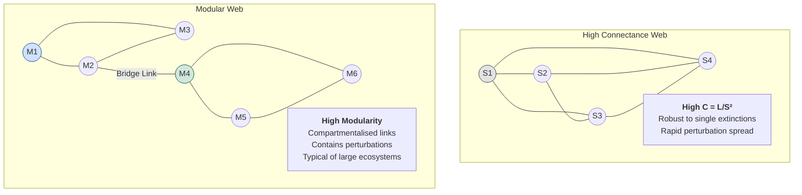

# Biodiversity, Food Webs, and Biogeography

\label{sec:unit_X_biodiversity_and_food_webs}

<!-- chapter-metadata-badge -->
> Level 2/3 · 40 min read · 50 min lecture · Prerequisites: \cref{sec:unit_X_community_interactions}

## Learning Objectives

1. Apply island biogeography and species-area relationships to habitat fragments.
2. Analyse food-web structure, keystone species, and trophic cascades.
3. Calculate Shannon diversity and interpret evenness versus richness.
4. Evaluate biodiversity-ecosystem function and conservation tradeoffs.

5. Compare SLOSS reserve design with single large reserve using island biogeography logic.
6. Predict trophic cascade direction from keystone removal in a documented food web.
7. Connect biodiversity metrics to ecosystem function using measured response variables.

---

## Island Biogeography Theory

### MacArthur-Wilson Equilibrium Model

**\citet{macarthur1967}:** *The Theory of Island Biogeography* — equilibrium species richness on islands balances immigration (colonisation) rate and extinction rate:

- **Immigration rate** decreases as $S$ increases (fewer uncolonised species remain in the mainland pool)
- **Extinction rate** increases as $S$ increases (more species present means more potential extinctions)
- At **equilibrium** ($\hat{S}$): immigration rate = extinction rate

**Effects of island characteristics:**

| Factor | Effect on $\hat{S}$ | Mechanism |
| ------ | ------------------- | --------- |
| **Larger area** | Higher $\hat{S}$ | Lower extinction rate (larger populations, more habitats) |
| **Closer to mainland** | Higher $\hat{S}$ | Higher immigration rate (easier colonisation) |
| **Small + far** | Lowest $\hat{S}$ | High extinction, low immigration |
| **Large + near** | Highest $\hat{S}$ | Low extinction, high immigration |

---

### Visualizing Food Web Connectance and Modularity


<!-- alt: Graph showing food-web connectance and modularity shape stability: dense linkage can buffer single losses but spread disturbances, while modularity can confine perturbations. -->

*Food-web connectance and modularity shape stability: dense linkage can buffer single losses but spread disturbances, while modularity can confine perturbations.*

---

### Species-Area Relationship

\begin{equation}
S = cA^z
\label{eq:community_ecology_12}
\end{equation}

Log-transformed: $\log S = \log c + z \log A$

| Context | Typical $z$ | Interpretation |
| ------- | ----------- | -------------- |
| True islands | 0.20-0.35 | Higher $z$ because islands are more isolated |
| Mainland habitat fragments | 0.12-0.17 | Lower $z$ due to rescue effect from surrounding matrix |
| Archipelagoes | 0.25-0.33 | Standard island prediction |

**Practical calculation:** Doubling area increases $S$ by $\approx 19\%$ (when $z = 0.25$, since $2^{0.25} - 1 = 0.189$).

```python
import math

def species_area(c, A, z):
    return c * (A ** z)

for area_ha in [1, 10, 100, 1000, 10000]:
    S = species_area(c=5, A=area_ha, z=0.25)
    print(f"Area = {area_ha:>6} ha → S = {S:.1f} bird species")
```

### Empirical Tests of Island Biogeography

- **Post-Krakatoa recolonisation** (1883-1983): After complete sterilisation by eruption, species accumulated toward equilibrium; initial overshoot then relaxation \citep{whittaker1975}
- **Florida Keys experiment** \citep{simberloff1969}: Fumigated small mangrove islands → recolonisation to predicted equilibrium within 2 years; confirmed immigration-extinction dynamics
- **Habitat fragments as islands:** Biological Dynamics of Forest Fragments Project (BDFFP, Amazonia; Laurance et al. 2011) — 40 years of data on isolated 1-100 ha fragments showing predictable species loss following species-area relationship

### SLOSS Debate in Reserve Design

**Single Large Or Several Small** — for conservation, which reserve design maximises biodiversity?

| Design | Advantages | Disadvantages |
| ------ | ---------- | ------------- |
| **Single large** | Lower edge-to-interior ratio; larger MVPs; protects area-demanding species | Vulnerability to single catastrophe; may miss regional habitat diversity |
| **Several small** | Redundancy against disaster; covers more habitat types; protects local endemics | Edge effects dominant; lower $S$ per patch; connectivity problems |

**Modern consensus: Core-corridor-matrix design:**
- Large core reserves (the "single large" benefit)
- Habitat corridors or stepping stones connecting reserves
- Matrix land uses compatible with wildlife movement (agroforestry, wildlife-friendly farming)
- Example initiatives: Yellowstone-to-Yukon (Y2Y, 3,200 km); Florida Wildlife Corridor (1,000+ miles)

### Extinction Debt After Habitat Loss

**Extinction debt** (Tilman et al. 1994, *Nature*): Species currently present in degraded/fragmented habitats may be committed to future extinction — but the extinction is **delayed** by decades to centuries as existing individuals slowly die without replacement.

\begin{equation}
\text{Species committed to extinction} = S_{\text{pre-fragmentation}} - c \cdot A_{\text{remaining}}^z
\label{eq:community_ecology_13}
\end{equation}

**Implications:**
- Present-day species richness **overestimates** long-term viability
- Conservation assessments based on current presence may be dangerously optimistic
- European calcareous grasslands: 20-50% of plant species face committed extinction due to historical fragmentation \citep{lindborg2004}
- Amazon deforestation: 25-year extinction debt means current biodiversity surveys underestimate eventual losses

### Metapopulation Dynamics (Levins, 1969; Hanski, 1994)

A patchwork of habitat fragments connected by dispersal — local extinctions offset by recolonisation. Metapopulation persistence requires fraction of occupied patches to exceed extinction threshold:

\begin{equation}
\hat{p} = 1 - \frac{e}{c}
\label{eq:community_ecology_14}
\end{equation}

where $e$ = extinction rate per patch, $c$ = colonisation rate; metapopulation persists if $e/c < 1$.

**Hanski's incidence function model** extends this by incorporating patch area (affects extinction rate) and isolation (affects colonisation rate):

\begin{equation}
J_i = \frac{1}{1 + (e_i/c_i)^2}
\label{eq:community_ecology_15}
\end{equation}

where $J_i$ = probability that patch $i$ is occupied, $e_i \propto A_i^{-x}$, and $c_i$ depends on distance to occupied patches.

> 🔬 **Clinical Connection — Habitat Fragmentation and Zoonotic Disease:** As forests are fragmented into small patches, edge effects increase human-wildlife contact, facilitating zoonotic pathogen spillover. The emergence of Nipah virus in Malaysia (1998-99) was linked to bat habitat loss: displaced fruit bats (*Pteropus* spp.) moved to pig farms near forest fragments, facilitating transmission to livestock and then humans. Similarly, Ebola outbreaks correlate spatially with deforestation frontiers. Island biogeography theory predicts that small fragments lose apex predators first (mesopredator release), increasing populations of rodents and bats that serve as pathogen reservoirs.

> **Concept Check:** A national park of 10,000 km$^2$ is split by a highway into two fragments of 6,000 km$^2$ and 4,000 km$^2$. Using $S = 50A^{0.25}$, calculate species richness for: (a) the intact park, (b) each fragment separately, (c) both fragments combined assuming no species overlap. How does a wildlife corridor change your prediction?

---

<!-- curriculum-scaffold-start -->
### Study Blueprint

- **Big idea:** Biodiversity patterns, food webs, and island biogeography scale from local interactions to landscape structure.
- **Core concepts:** food webs, keystone species, species-area, diversity indices.
- **Framework alignment:** Vision & Change: Systems, Evolution, Pathways and transformations of energy and matter; AP Biology: Systems Interactions, Evolution, Energetics; NGSS-style topics: Interdependent Relationships in Ecosystems, Matter and Energy in Organisms and Ecosystems, Natural Selection and Evolution.
- **Model or quantitative lens:** Shannon, species-area, and network connectance reasoning.
- **Data skill:** Interpret food-web, richness, or biogeography datasets.
- **Practice cadence:** Representing and Describing Data, Statistical Tests and Data Analysis, Argumentation.
- **Common misconception to repair:** Richness alone does not equal functional stability.
- **Primary lab:** \cref{sec:lab_unit_X_biodiversity_and_food_webs}.
- **Question bank:** \cref{sec:q_unit_X_biodiversity_and_food_webs}.
- **Transfer task:** Transfer biodiversity reasoning to conservation planning and habitat fragmentation.
- **Bridge to computation:** `biology.ecology.ecology.species_area_relationship`.
<!-- curriculum-scaffold-end -->

---

> **Opening Vignette — Biodiversity, Food Webs, and Biogeography**
>
> This chapter connects biodiversity, food webs, and biogeography to measurable evidence: models, datasets, and experiments that can strengthen or weaken each claim.

## Food Web Structure and Network Ecology

### Food Web Topology

Food webs are network representations of feeding relationships in communities — a graph where nodes are species (or trophic units) and directed edges encode "$i$ eats $j$." Treating the community as a graph unlocks the entire toolbox of network science (degree distributions, clustering, modularity, motif analysis), which has reshaped community ecology over the past two decades. Key metrics:

| Metric | Definition | Typical value |
| ------ | ---------- | ------------- |
| **Connectance ($C$)** | $C = L/S^2$ (or $L/[S(S-1)/2]$); fraction of possible links realised | 0.05-0.30 |
| **Links per species ($L/S$)** | Average number of trophic links per species | ~2 for most food webs |
| **Chain length** | Number of links from base to top | 3-5 typically |
| **Omnivory** | Fraction of species feeding at >1 trophic level | ~50% in many webs |
| **Mean trophic level** | Average path length from primary producers | 2.5–3.5 typical |
| **Generality** | Mean number of resources per consumer | Skewed: most consumers specialised |
| **Vulnerability** | Mean number of consumers per resource | Skewed: most prey have few predators |
| **Nestedness** | Specialists' diets are subsets of generalists' diets | High in mutualistic networks |

```python
# Minimal food-web statistics from an adjacency dictionary
def web_stats(web):
    species = set(web).union({p for prey in web.values() for p in prey})
    S = len(species)
    L = sum(len(v) for v in web.values())
    C = L / (S * S)
    return {"S": S, "L": L, "L/S": L / S, "connectance": C}

example = {
    "phyto": [], "zoo": ["phyto"], "shrimp": ["phyto"],
    "minnow": ["zoo", "shrimp"], "bass": ["minnow", "shrimp"],
}
print(web_stats(example))
```

### Cascade Effects and Robustness

Food webs are not just descriptive: their topology predicts how perturbations propagate. Removal experiments (real or simulated) reveal three classes of network response:

| Response | Mechanism | Topological signature |
| -------- | --------- | --------------------- |
| **Bottom-up cascade** | Loss of a producer ripples upward through consumers | Few generalist consumers; long chains |
| **Top-down cascade** (\cref{eq:community_ecology_5} system) | Loss of a top predator releases mesopredators or herbivores | Strong vertical interaction strengths |
| **Horizontal cascade** | Loss of one prey shifts predator to alternative prey, harming it indirectly | Apparent competition; shared predators |

**Robustness analysis** (Dunne et al. 2002, *Ecol. Lett.*) sequentially removes species (random order, most-connected first, or rarest first) and tracks the fraction of secondary extinctions. Results across 16 well-resolved food webs:

- Random removal: ~50% of species can disappear before web collapse
- **Most-connected-first removal: collapse after about 20% of species removed** — hubs (highly connected generalists) are disproportionately important
- Rarest-first: minimal cascade — rare species are weakly embedded

This is a striking parallel to the **scale-free network** robustness literature (Barabási & Albert 1999): tolerance to random failure but vulnerability to targeted attack. For conservation, hub species are ecological-network analogues of keystone species, identifiable from topology alone.

### Complexity-Stability Debate

**May (1972, *Nature*):** Mathematical analysis of random community matrices showed that complexity (high $S$, high $C$, strong interaction strengths) **destabilises** communities — contradicting the intuitive "diversity begets stability" hypothesis. The May criterion: a random Jacobian is locally stable primarily if $\sigma\sqrt{SC} < 1$ (with σ = standard deviation of interaction strengths).

**Resolution (McCann 2000, *Nature*; Allesina & Tang 2012, *Nature*):**
- Weak interactions stabilise food webs (dampen oscillations)
- Non-random interaction structure (modularity, nestedness) promotes stability
- Real food webs are not random — they have specific architectures that enhance stability
- **Weak-interaction dominance:** most interactions are weak; few are strong. The many weak links act as stabilisers.

**Modularity:** food webs are organised into modules (compartments) with strong within-module interactions and weak between-module interactions. This structure limits the spread of perturbations — a forest pathogen outbreak in one module rarely cascades into the aquatic module of the same landscape food web.

---

## Neutral Theory of Biodiversity

The competition-coexistence theory developed earlier explains community structure through **niches** — species coexist because they differ. **Hubbell's unified neutral theory of biodiversity and biogeography (UNTB; Hubbell 2001)** proposes the radical alternative: at the scale of trophically similar species (e.g., canopy trees in a tropical forest), **most individuals are demographically equivalent** regardless of species, and observed community patterns emerge from random birth–death–dispersal–speciation alone.

### The Neutral Assumption

Each individual, regardless of species, has the same per-capita probabilities of:
- Birth (replacement of a vacancy by an offspring)
- Death (creation of a vacancy)
- Immigration $m$ from a regional **metacommunity** (replaces local community via dispersal)
- Speciation (rate ν in the metacommunity)

The local community has fixed size $J$ (zero-sum constraint — every death is replaced); dynamics are pure ecological drift, mathematically isomorphic to neutral [**genetic drift**](#gl:genetic-drift) (\cref{sec:unit_V_population_genetics}). Two parameters do most of the work:

\begin{equation}
\theta = 2 J_M \nu \qquad \text{(fundamental biodiversity number)}
\label{eq:unit_X_neutral_theta}
\end{equation}

\begin{equation}
m = \text{immigration probability per local death}
\label{eq:unit_X_neutral_m}
\end{equation}

The metacommunity size is $J_M$. Together, θ and $m$ predict species abundance distributions, species–area curves, and beta diversity — without invoking niche differences at most.

### Predictions and Empirical Successes

UNTB predicts:
- **Species abundance distribution** follows a zero-sum multinomial (very close to the rank-abundance pattern introduced earlier, but with a heavier tail of rare species)
- **Species–area relationships** with $z \approx 0.20$–0.30 (matching empirical island values, \cref{eq:community_ecology_12})
- **Beta diversity** declines with geographic distance even in homogeneous habitat (purely from limited dispersal)

Hubbell's analysis of the Barro Colorado Island 50-ha forest plot (Panama, > 200 tree species) showed UNTB fit the species abundance distribution as well as niche-based models. Volkov et al. (2003, *Nature*) confirmed neutral fits across forests in Panama, Ecuador, India, and Malaysia.

### Limits and Synthesis

UNTB has been heavily criticised: real species are *not* equivalent (massive trait variation; clear niche differences in measured demographic rates), and dynamic predictions (e.g., extinction times) often fail. The modern view, following Adler, HilleRisLambers & Levine (2007, *Ecol. Lett.*), is that **niche and neutral processes co-occur**: Chesson-style niche differences stabilise coexistence, while neutral drift adds stochastic variation in relative abundance. UNTB is the null model — if your data look neutral, you have not yet found the ecology that distinguishes species.

> **Concept Check:** Two tropical forest plots have nearly identical species-abundance distributions. The first sits in a homogeneous lowland habitat; the second spans a steep elevation gradient. Why is the *neutral* explanation of the species-abundance pattern more plausible for the first plot than the second, and what additional data would discriminate the two hypotheses?

---

## Trait-Based biodiversity and food webs

Counting species ignores that a 1 mm aphid and a 10 m oak both add "+1" to richness. **Trait-based ecology** replaces (or complements) species lists with measured **functional traits** — morphological, physiological, or phenological attributes that influence performance. This shifts community ecology from a taxonomic enterprise to a quantitative, predictive one.

### Grime's CSR Triangle

Grime's CSR scheme (1977, 2001) classifies plant strategies along two stress axes — disturbance and stress (resource limitation) — yielding three primary strategies and the gradients between them:

| Strategy | Conditions | Trait syndrome | Examples |
| -------- | ---------- | -------------- | -------- |
| **C — Competitor** | Low stress, low disturbance | Tall, fast-growing, high biomass, deep roots; leaves long-lived but expensive | Mature forest dominants (oak, beech, *Eucalyptus*) |
| **S — Stress-tolerator** | High stress, low disturbance | Slow growth, evergreen, sclerophyllous leaves, conservative resource use | Desert succulents, alpine cushion plants, lichens, conifers in nutrient-poor soils |
| **R — Ruderal** | Low stress, high disturbance | Short-lived, high seed output, rapid maturation, weak competitors | Annual weeds (*Senecio*, *Capsella*); pioneer trees |

Most species fall along intermediates (CR, CS, SR, CSR). Crucially, the CSR axes capture independent gradients to the [**r-strategist**](#gl:r-strategist)/[**K-strategist**](#gl:k-strategist) axis of population ecology — a stress-tolerator is K-like in longevity but slow-growing, not high-fecundity.

### The Leaf Economics Spectrum

Wright et al. (2004, *Nature*) analysed > 2,500 plant species globally and uncovered a stunningly tight axis along which leaf traits co-vary — the **leaf economics spectrum (LES)**:

| Acquisitive (fast) end | Conservative (slow) end |
| ---------------------- | ----------------------- |
| High specific leaf area (SLA, m$^2$ kg$^{-1}$) | Low SLA (thick, dense leaves) |
| High mass-based photosynthetic rate ($A_{\text{mass}}$) | Low $A_{\text{mass}}$ |
| High leaf N concentration (Rubisco-rich) | Low leaf N |
| Short leaf lifespan (months) | Long leaf lifespan (years; evergreen) |
| Low construction cost per unit area | High construction cost; defended |

The LES is widely observed across biomes — tropical pioneer trees and desert annuals can occupy the same acquisitive end of the axis despite very different evolutionary histories. The axis captures a major trade-off between rapid resource capture and resource conservation, but local exceptions occur because water stress, herbivory, nutrient limitation, and phylogeny can bend the relationship. Analogous spectra exist for roots (Bergmann et al. 2020, *Sci. Adv.*) and for whole-plant strategy axes (Diaz et al. 2016, *Nature*).

### Functional Diversity and Community Assembly

Trait data enable **functional diversity** indices (functional richness, evenness, divergence; Villéger, Mason & Mouillot 2008, *Ecology*) that detect community assembly mechanisms invisible to species lists:

- **Functional clustering** (traits more similar than expected by chance) → *environmental filtering* (primarily some strategies tolerate the local abiotic conditions)
- **Functional overdispersion** (traits more different than expected) → *competitive exclusion* via limiting similarity and Chesson-style stabilising mechanisms.

A community of 30 alpine cushion plants and a community of 30 tropical canopy trees both have $S = 30$, but their trait spreads on the LES are wildly different — and that difference predicts ecosystem function (productivity, decomposition, drought response) far better than richness alone.

> **Concept Check:** Two grassland plots have identical Shannon diversity $H' = 2.5$. Plot A's plants cluster tightly on the conservative end of the LES; plot B's plants span the entire LES. Which plot is more productive on average, which is more drought-resilient, and which would you predict has stronger competitive interactions?

---

## Biological Control and Ecological Risk Management

The competition, predation, and parasitism theory developed above has direct translational application: **biological control** uses natural enemies to suppress pest populations, replacing or reducing chemical pesticides. It is community ecology deployed for agriculture, public health, and invasive-species management.

Invasive ants illustrate why social insects are high-stakes community actors. Argentine ants, fire ants, and yellow crazy ants can form dense, aggressive populations that displace native ants, disrupt seed dispersal and pollination networks, protect honeydew-producing pests, and change nutrient cycling. The mechanism is not merely "more ants"; it is colony structure, propagule pressure, enemy release, mutualisms with hemipterans, and human-assisted transport acting together \citep{holway2002causes}. Management therefore has to identify the interaction network being changed, not just the invader's presence.

### Three Classical Strategies

| Strategy | Approach | Time scale | Risk profile |
| -------- | -------- | ---------- | ------------ |
| **Classical (importation)** | Import a specialist natural enemy from the pest's native range; expect it to establish and self-perpetuate | Years to decades; one-shot release | High — non-target effects if enemy is not specialist enough |
| **Augmentative** | Mass-rear and release natural enemies repeatedly to suppress current outbreak | Weeks to months; greenhouse, glasshouse | Low — released organisms typically fail to overwinter |
| **Conservation** | Modify habitat to favour resident natural enemies (hedgerows, beetle banks, insectary plants, reduced pesticide use) | Continuous | Lowest — uses native species |

### Classical Successes and Failures

**Cottony cushion scale (*Icerya purchasi*) and the vedalia beetle (*Rodolia cardinalis*).** Imported in 1888 from Australia to California citrus groves — within two years the citrus industry was saved. This is the textbook success and the prototype for most subsequent classical biocontrol programs.

**Prickly pear (*Opuntia stricta*) and *Cactoblastis cactorum*.** Released in 1925 in Australia, the moth larvae cleared 25 million ha of invasive cactus by 1940 — one of the largest-scale ecological interventions in history.

**Cane toad (*Rhinella marina*).** Released in 1935 in Queensland to control sugarcane beetles; the toads ignored the beetles, ate everything else, and are now an invasive plague across northern Australia. Classical biocontrol's most-cited cautionary tale: a generalist natural enemy will eat non-target species, and the lesson cost ecologists decades of credibility.

### Risk Assessment and Modern Practice

After the cane-toad era, regulatory frameworks (e.g., the FAO **Code of Conduct for the Import and Release of Exotic Biological Control Agents**, 1996) require:

1. **Host-specificity testing** — quarantine trials against native non-target species
2. **Climate matching** — does the agent's native climate predict its spread in the target range?
3. **Population modelling** — Lotka–Volterra or matrix projection of agent and target dynamics; predicted suppression vs. escape
4. **Reversibility analysis** — can the agent be eradicated if it causes damage? (Almost typically: no.)

Modern programs increasingly favour **conservation biological control**, which avoids introducing non-native species entirely. Field margins of insectary plants (e.g., *Phacelia*, *Fagopyrum*) increase syrphid and parasitoid wasp populations that suppress aphids in adjacent crops by 30–50 % (Tscharntke et al. 2007, *Biol. Control*). This connects directly to ecosystem-services valuation (\cref{sec:unit_X_ecosystem_ecology}).

> 🔬 **Clinical Connection — *Wolbachia* and Mosquito-Borne Disease.** Conservation biological control extends to public health. *Wolbachia* is an intracellular bacterium that, when introduced into *Aedes aegypti* mosquitoes, blocks dengue, Zika, and chikungunya virus transmission. Field trials in Yogyakarta (Indonesia) and Niterói (Brazil) released *Wolbachia*-carrying mosquitoes that spread the bacterium through the wild population via cytoplasmic incompatibility. Within 27 months of release in Yogyakarta, dengue incidence dropped 77% in treated neighbourhoods (Utarini et al. 2021, *N. Engl. J. Med.*). This is biological control of disease vectors via a manipulative endosymbiont — community ecology in service of pandemic prevention.

> **Concept Check:** A regulator must approve or reject a proposed classical biocontrol release of a parasitoid wasp against an invasive moth pest. (a) What three host-specificity tests would you require? (b) Why is "the agent attacks the target moth in the lab" insufficient evidence for safety? (c) How does a sound elasticity analysis (\cref{eq:unit_X_sensitivity_elasticity}) of the *target's* matrix model help you predict whether the release will succeed?

---

## Worked Example: Shannon Diversity in a Forest Patch

**Problem:**
An ecologist surveys a small forest patch and identifies three species of trees:
- Species A: 50 individuals
- Species B: 30 individuals
- Species C: 20 individuals

Calculate the Shannon Diversity Index ($H$) for this tree community. The formula is:
$$H = -\sum (p_i \ln p_i) \label{eq:unit_X_community_ecology_item_1}$$

where $p_i$ is the proportion of total individuals belonging to the $i$-th species.

**Solution:**

**Step 1. Calculate the total number of individuals ($N$).**
$$N = 50 + 30 + 20 = 100 \label{eq:unit_X_community_ecology_item_2}$$


**Step 2. Calculate the proportion ($p_i$) for each species.**
- $p_A = 50 / 100 = 0.50$
- $p_B = 30 / 100 = 0.30$
- $p_C = 20 / 100 = 0.20$

**Step 3. Calculate $p_i \ln p_i$ for each species.**
- Species A: $0.50 \times \ln(0.50) \approx 0.50 \times (-0.693) \approx -0.347$
- Species B: $0.30 \times \ln(0.30) \approx 0.30 \times (-1.204) \approx -0.361$
- Species C: $0.20 \times \ln(0.20) \approx 0.20 \times (-1.609) \approx -0.322$

**Step 4. Sum the values and multiply by $-1$.**
$$H = - (-0.347 + -0.361 + -0.322) = - (-1.030) = 1.030 \label{eq:unit_X_community_ecology_item_3}$$


**Answer:**
The Shannon Diversity Index for this tree community is approximately **1.03**.

---

### Worked Example: Intermediate Disturbance Hypothesis Quantified

**Problem:**
The intermediate disturbance hypothesis predicts a unimodal relationship between disturbance frequency $f \in [0, 1]$ and species richness $S$. A simple closed-form parameterization is

$$S(f) = S_{\max} \times 4 f (1 - f)$$

which peaks at $f = 0.5$ and falls to zero at the endpoints. For a temperate rocky-intertidal community, $S_{\max} = 25$ species. Calculate $S$ at $f = 0.2$, $f = 0.5$, and $f = 0.8$, and interpret each regime ecologically.

**Solution:**

**Step 1. Evaluate the unimodal kernel $4 f (1 - f)$.**

- $f = 0.2$: $4 \times 0.2 \times 0.8 = 0.64$, so $S = 25 \times 0.64 = 16$ species.
- $f = 0.5$: $4 \times 0.5 \times 0.5 = 1.00$, so $S = 25 \times 1.00 = 25$ species (maximum).
- $f = 0.8$: $4 \times 0.8 \times 0.2 = 0.64$, so $S = 25 \times 0.64 = 16$ species.

**Step 2. Interpret each regime ecologically.**

- *Low disturbance ($f = 0.2$, $S = 16$).* The community is on a trajectory toward competitive exclusion; dominants accumulate biomass and crowd out subordinates. Diversity is depressed not by lack of colonizers but by interspecific competition winnowing the assemblage toward the climax dominant.
- *Intermediate disturbance ($f = 0.5$, $S = 25$).* The disturbance interval is short enough to interrupt competitive exclusion but long enough to permit colonization and recruitment. This is the regime in which Paine's classic *Pisaster* removal experiments revealed predator-mediated coexistence; mussel monoculture appears once the keystone is removed and the system slides toward the low-$f$ endpoint.
- *High disturbance ($f = 0.8$, $S = 16$).* Primarily disturbance-tolerant pioneer species persist; communities are repeatedly reset before competitive sorting can proceed. Diversity is depressed by a colonization-rate bottleneck rather than by competitive exclusion.

**Step 3. Field calibration.**

The model is an idealization: real communities show asymmetric curves (skewed toward high $f$ when colonization is the limiting step) and the location of the peak shifts with productivity (Huston's dynamic equilibrium model). The qualitative prediction — that diversity is maximized at intermediate, not minimum, disturbance — is what management exploits when prescribing controlled burns, mowing regimes, or pulsed flows below dams.

**Answer:** $S(0.2) = S(0.8) = 16$, $S(0.5) = 25$. The symmetric drop on either side of $f = 0.5$ is the mathematical fingerprint of two distinct ecological mechanisms — competitive exclusion at low $f$, colonization failure at high $f$ — that look identical in a richness count but differ in management response.

---

### Concept Check (Analyze) — Trophic Cascades, Efficiency, and Eutrophication

A pelagic food web has the following annual production (kcal/m²/yr) at a baseline 10% trophic transfer efficiency: phytoplankton $= 10^6$, zooplankton $= 10^5$, planktivorous fish $= 10^4$, tuna $= 10^3$.

(a) An orca population collapse removes apex predation on tuna. Tuna biomass increases 5-fold; planktivorous fish decline by 50% (predation release from tuna); zooplankton increases by roughly 50%; phytoplankton declines. Sketch the qualitative cascade and identify which links are top-down and which are bottom-up.

(b) Now overlay agricultural nutrient loading. Nitrogen runoff increases phytoplankton production by 3×. Analyze how this bottom-up perturbation interacts with the top-down cascade in (a): does eutrophication amplify or dampen the cascade signature in zooplankton biomass? Reason explicitly about whether the limiting variable for zooplankton is now food supply or predation pressure.

(c) Predict the sign of the change in community Shannon diversity at the phytoplankton trophic level under sustained eutrophication. Reason about competitive exclusion among phytoplankton functional groups (large diatoms vs. bloom-forming cyanobacteria) at high $N$, and compare to your reasoning for the intermediate-disturbance worked example above.

---

### Concept Check (Evaluate) — Biotic Resistance and Invasive Species

Elton's diversity-resistance hypothesis predicts that high-diversity communities are harder to invade because resident species preempt resources and natural enemies are more diverse. The empirical record is split:

- **Hawaiian terrestrial bird communities** (low native diversity, severe historical isolation) were catastrophically invaded once introduced species (rats, mosquitoes, mongoose, alien plants) arrived. Tens of native bird species have gone extinct or are critically endangered.
- **Cedar Creek grassland experiments** (Tilman and collaborators) show that experimental plots seeded with higher native species richness resist exotic seedling establishment more strongly than monocultures.

(a) Evaluate which mechanism — resource preemption, enemy release, or propagule pressure — best explains the Hawaiian outcome, and which best explains the Cedar Creek outcome. Justify with at least one ecological feature of each system (isolation history, propagule supply, soil-resource limitation, herbivore community).

(b) Critique the simple Elton hypothesis: under what conditions does the diversity-resistance relationship reverse (i.e., diverse communities are *more* invasible)? Hint: consider productivity gradients and the scale at which diversity is measured (local plot vs. regional pool).

(c) Recommend a single conservation intervention for each system (Hawaii vs. Cedar Creek-type grassland) consistent with your mechanistic diagnosis, and explain why a "one-size-fits-all" invasive species strategy fails when the underlying mechanisms differ.

---

## Current Evidence and Frontier Biology: Biodiversity, Food Webs, and Biogeography

For **Biodiversity, Food Webs, and Biogeography**, frontier biology belongs inside the evidence logic of
the chapter. Ecology and conservation decisions increasingly combine field data, remote sensing, community knowledge, model uncertainty, and explicit values. The core reading question is this: community claims should identify interaction type, network position, disturbance regime, and observational limits.

- **What to verify:** identify the observation, model, assay, or dataset that
  would make the claim stronger or weaker.
- **What to qualify:** state the scale, organism, cell type, environmental
  condition, or population where the claim is expected to hold.
- **What to compare:** test at least one alternative explanation, baseline, or
  null model before treating the pattern as causal.
- **What to cite:** distinguish primary evidence, review synthesis, public
  dataset, and institutional guidance; for recent or numeric claims, prefer
  the source closest to the measurement and state what has changed since it was
  published.

Select biodiversity and conservation metrics by decision need: abundance, interaction, function, risk, service, and governance metrics answer different questions \citep{ipbes2019global,ipbes2024transformative,wwf2024livingplanet,iucn2025redlist,fao2024sofia}.

**Source practice:** For ecology and conservation claims, cite assessment sources and state whether the evidence is an index, risk assessment, service valuation, satellite product, or policy synthesis \citep{ipbes2024transformative,noaa2025coralbleaching,fao2025sofi}.

## Summary

- **Biotic interactions:** mutualism (+/+), commensalism (+/0), parasitism (+/-), predation (+/-), competition (-/-), amensalism (0/-) — shape community composition and evolution.
- **Competition:** Lotka-Volterra equations; competitive exclusion if niches overlap completely; stable coexistence if intraspecific > interspecific effects. Modern coexistence theory \citep{chesson2000}: stabilising + equalising mechanisms.
- **Niche theory:** Hutchinson's n-dimensional hypervolume; fundamental vs. realised niche; paradox of the plankton resolved by non-equilibrium dynamics and niche partitioning.
- **Trophic cascades:** keystone predators suppress herbivores → plant biomass increases (wolves→elk→willows; sea otters→urchins→kelp). Behavioural cascades via "landscape of fear."
- **Succession:** primary (bare substrate, slow) vs. secondary (disturbed community, faster); facilitation/tolerance/inhibition mechanisms; IDH: intermediate disturbance maximises diversity; alternative stable states and regime shifts with hysteresis.
- **Diversity indices:** $H'$ (Shannon) combines richness + evenness; Simpson $1-D$ = probability of inter-specific encounter; $J'$ (evenness) = $H'/\ln S$. Alpha, beta, gamma diversity at different spatial scales.
- **Island biogeography:** $S = cA^z$; equilibrium balances colonisation and extinction; SLOSS debate resolved toward core-corridor-matrix design; extinction debt warns of delayed species loss.
- **Food web structure:** connectance, modularity, weak-interaction dominance stabilise complex communities. **Network robustness** under targeted (most-connected-first) deletion collapses faster than under random deletion — hub species are topological keystones.
- **Neutral theory (UNTB):** Hubbell's per-capita-equivalence framework; two parameters θ and $m$ predict species-abundance distributions and species–area relationships from drift, dispersal, and speciation alone. Best treated as a null model that niche-based theory must beat.
- **Trait-based ecology:** Grime's CSR triangle; the leaf economics spectrum (LES) is a widely observed acquisitive↔conservative axis with local exceptions. Functional diversity diagnoses assembly mechanisms (clustering = environmental filtering; overdispersion = limiting similarity) that species lists miss.
- **Biological control and invasion:** classical importation (vedalia beetle success; cane toad disaster), augmentative releases, and conservation biological control. Social insects add network-scale cases: invasive ants can restructure mutualisms, seed dispersal, pest protection, and nutrient cycling, while pollinator conservation depends on protecting whole interaction networks. *Wolbachia*-loaded *Aedes aegypti* extends the framework to vector-borne disease.
- **Connections:** See \cref{sec:unit_X_population_ecology} for consumer-resource oscillations, \cref{sec:unit_X_ecosystem_ecology} for energy flux, and \cref{sec:unit_VII_microbial_ecology} for microbial communities.

---

## Review Questions

1. Two warbler species (*Dendroica castanea* and *D. fusca*) share a boreal spruce tree habitat. MacArthur (1958) showed they coexist by partitioning the tree into feeding zones. Using Chesson's modern coexistence theory: (a) Which of Chesson's two mechanisms (equalising vs. stabilising) enables their coexistence? (b) Write [**Lotka-Volterra equations**](#gl:lotka-volterra-equations) and specify the condition for stable coexistence in terms of $\alpha_{12}$ and $\alpha_{21}$.

2. A trophic cascade operates in Yellowstone: wolves → elk → willows → beavers → altered stream morphology. (a) Is this a bottom-up or top-down cascade? (b) Predict what happens to each level if chronic wasting disease eliminates 90% of the elk population. (c) How does the "landscape of fear" concept modify purely density-mediated cascade predictions?

3. A tropical rainforest island (area = 500 km$^2$) currently has $S = 200$ bird species. Deforestation reduces area to 125 km$^2$ (25% of original). (a) Using the species-area relationship with $z = 0.25$ and appropriate $c$, predict the final equilibrium species richness. (b) If the extinction debt takes 50 years to fully manifest, what is the expected species number at year 10 assuming linear debt decay?

4. Compare the Shannon diversity index ($H'$) for three communities:
   - Community A: 4 species, abundances = [25, 25, 25, 25]
   - Community B: 4 species, abundances = [97, 1, 1, 1]
   - Community C: 8 species, abundances = [50, 20, 10, 8, 5, 4, 2, 1]
   Calculate $H'$ and $J'$ for each. Which community shows: highest richness? highest evenness? highest $H'$?

5. Explain Hutchinson's "paradox of the plankton." Why does the coexistence of hundreds of phytoplankton species apparently violate competitive exclusion, and what are three mechanisms that resolve the paradox?

6. The Biological Dynamics of Forest Fragments Project (BDFFP) in Amazonia found that 1-ha fragments lost 50% of their bird species within 15 years, while 100-ha fragments lost 10%. (a) Calculate $z$ from these two data points. (b) Predict the species richness of a 10-ha fragment relative to a 100-ha fragment. (c) What role do edge effects play beyond the simple species-area prediction?

7. A shallow lake in the Netherlands exists in a clear-water state with abundant macrophytes. Nutrient loading from agriculture gradually increases. Describe the regime shift to the turbid, algal-dominated state using the framework of alternative stable states. Why is reducing nutrients back to the original level insufficient to restore the clear-water state (hysteresis)?

8. Design a reserve system for a large mammal species (home range = 100 km$^2$, $N_e$ requirement = 500) in a landscape of forest fragments. Use island biogeography principles to specify: (a) minimum total reserve area, (b) number and size of core reserves, (c) corridor design, (d) matrix management. Justify each design element.

9. The rough-skinned newt and common garter snake represent one of the best-documented coevolutionary arms races. Describe the escalation: what toxin does the newt produce, what resistance mechanism has the snake evolved, and what geographic mosaic pattern is observed? How does this relate to Red Queen dynamics?

10. Explain how the competitive exclusion principle applies to *Clostridium difficile* infection and its treatment by fecal microbiota transplantation. What ecological principles make FMT more effective than antibiotic treatment for recurrent CDI?
11. Using `lotka_volterra`, estimate whether predator peak **lags** prey peak for default parameters (inspect time series qualitatively).
12. How does **connectance** $C=L/S^2$ relate to stability arguments in diverse food webs?
13. Hubbell's neutral theory predicts a species-abundance distribution from drift and dispersal alone. (a) Why is UNTB best regarded as a *null model* rather than a competitor to niche theory? (b) If a community fits UNTB perfectly, what does that *not* prove about the underlying ecology? Cite the Adler, HilleRisLambers & Levine (2007) synthesis.
14. Two oak forests share identical species lists ($S = 30$, $H' = 2.8$) but differ markedly in leaf economics: forest A's species cluster on the conservative end of the LES; forest B's species span the entire spectrum. (a) Which forest is more functionally diverse? (b) Predict relative productivity, decomposition rate, and drought-resilience for each. (c) Why do two communities with identical Shannon diversity behave differently?
15. A food-web robustness analysis simulates extinctions in random vs. most-connected-first orders. The web collapses after 50% removal under random deletion but after 18% removal under most-connected-first deletion. (a) Explain the asymmetry using network topology. (b) Translate the result into a conservation prioritisation rule for hub species (analogous to keystone identification but topological).
16. A government agency proposes releasing a parasitoid wasp from East Asia to control an invasive aphid species in California. (a) Outline the host-specificity testing required before approval. (b) Why is the cane toad disaster relevant precedent? (c) Sketch how the agent and aphid populations would interact in a coupled Lotka-Volterra model — and what condition supports long-term aphid suppression rather than coexistence?

---

## Further Reading and Source Notes: Biodiversity, Food Webs, and Biogeography

- Paine (1966). Food Web Complexity and Species Diversity. *The American Naturalist*, 100.
- Connell (1978). Diversity in tropical rain forests and coral reefs. *Science*, 199.
- Gause (1934). *The Struggle for Existence*. Williams \& Wilkins.
- Hutchinson (1957). Concluding remarks. *Cold Spring Harbor Symposia on Quantitative Biology*, 22.
- Chesson (2000). Mechanisms of maintenance of species diversity. *Annual Review of Ecology and Systematics*, 31.
- Ehrlich & Raven (1964). Butterflies and plants: A study in coevolution. *Evolution*, 18.

---

## Computational Bridge

Predator--prey cycles from the chapter are reproduced by numerical integration:

```python
from biology.ecology import lotka_volterra

lv = lotka_volterra(40.0, 9.0, 0.5, 0.02, 0.01, 0.2, t_end=80.0)
print(len(lv.times), round(lv.prey[-1], 2))
```

> **Clinical / systems note:** FMT restores diversity and colonisation resistance --- an ecological intervention for a microbiome community treated as a competitive network.

---

## Key Terms

| Term | Definition |
| ---- | ---------- |
| **Competitive exclusion principle** | Two species cannot stably coexist if they occupy the exact same niche; the superior competitor excludes the other |
| **Keystone species** | Species with disproportionately large effects on community structure relative to its abundance |
| **Trophic cascade** | Indirect effect of apex predator on plant biomass via suppressing herbivores; top-down regulation |
| **Succession** | Directional change in community composition over time; primary (bare substrate) or secondary (after disturbance) |
| **Intermediate Disturbance Hypothesis** | Moderate disturbance frequency/intensity maximises species diversity by preventing competitive exclusion |
| **Shannon diversity ($H'$)** | $H' = -\sum p_i \ln p_i$; quantifies species richness and evenness simultaneously |
| **Simpson index ($1-D$)** | Probability that two random individuals are from different species; weighted toward dominant species |
| **Species-area relationship** | $S = cA^z$; species richness increases with area; $z \approx 0.25$ for habitat islands |
| **SLOSS** | Single Large Or Several Small reserves debate in conservation biology |
| **Extinction debt** | Species present today but predicted to go extinct based on current habitat loss; time-delayed response |
| **Metapopulation** | Network of semi-isolated subpopulations connected by dispersal; local extinctions offset by recolonisation |
| **Alternative stable states** | Multiple stable community configurations under the same environmental conditions; regime shifts between states |
| **Niche differentiation** | Process by which competing species evolve to use different resources, reducing niche overlap |
| **Fundamental niche** | Full range of environmental conditions where a species can maintain $r \geq 0$ (Hutchinson) |
| **Realised niche** | Subset of fundamental niche actually occupied after biotic interactions |
| **Connectance** | Proportion of possible trophic links that are realised in a food web |
| **Facilitation** | One species improves survival or reproduction of another; mechanism of succession |
| **Beta diversity** | Species turnover between communities; measured by Jaccard or Bray-Curtis indices |
| **Neutral theory (UNTB)** | Hubbell's framework: per-capita demographic equivalence; biodiversity arises from drift, dispersal, and speciation |
| **Fundamental biodiversity number (θ)** | $\theta = 2J_M\nu$; controls species richness in the metacommunity under UNTB |
| **CSR strategies** | Grime's competitor / stress-tolerator / ruderal classification of plant strategies |
| **Leaf economics spectrum (LES)** | Comprehensive axis from acquisitive (high SLA, short-lived leaves) to conservative (thick, long-lived) leaves |
| **Functional diversity** | Trait-based diversity metric; clustering vs. overdispersion diagnoses assembly mechanism |
| **Classical biological control** | Importation of a specialist natural enemy from a pest's native range |
| **Conservation biological control** | Habitat modification to favour resident natural enemies; lowest-risk strategy |
| **Network robustness** | Resilience of a food web to species removal; collapses fastest under most-connected-first deletion |

---

## Companion Source Module: Biodiversity, Food Webs, and Biogeography

**Biodiversity, Food Webs, and Biogeography** should leave a reproducible trail from a biological claim to
the code, figure, diagram, or paper-based activity that can test it. Use the
surfaces below to inspect the chapter's assumptions, rerun the relevant model,
or compare the manuscript explanation with companion labs and figures.

| Surface | Use it for |
| --- | --- |
| `src/biology/ecology/ecology.py` (`lotka_volterra`, `connectance`, `biodiversity_indices`) | Quantify interactions, network structure, and community diversity. |
| `src/visualization/plots.py` (`plot_lotka_volterra`, `plot_species_area_relationship`) | Inspect dynamics and richness-area patterns. |
| `src/mermaid/biology_diagrams.py` (`food_web_diagram`) | Keep trophic links and interaction signs explicit. |

**Reproducibility check:** define interaction sign, spatial scale, sampling effort, disturbance history, and network boundary before interpreting community patterns. **Cross-reference:** use \cref{sec:unit_X_population_ecology}, \cref{sec:unit_X_ecosystem_ecology}, and \cref{sec:unit_VII_microbial_ecology}.
