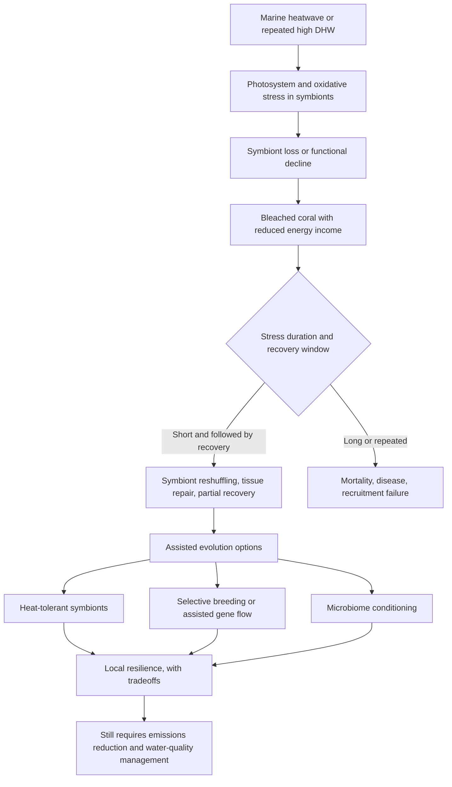
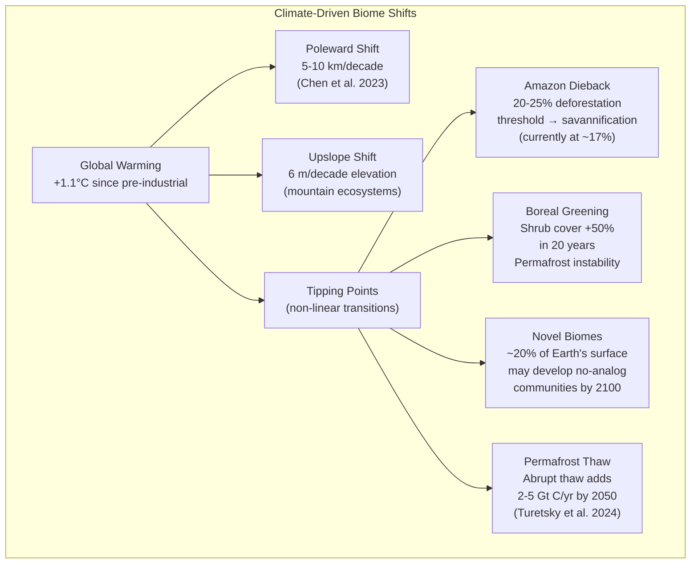
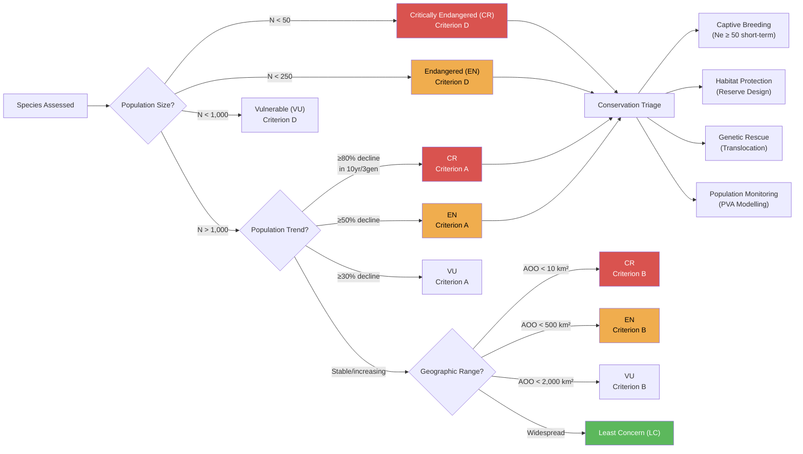
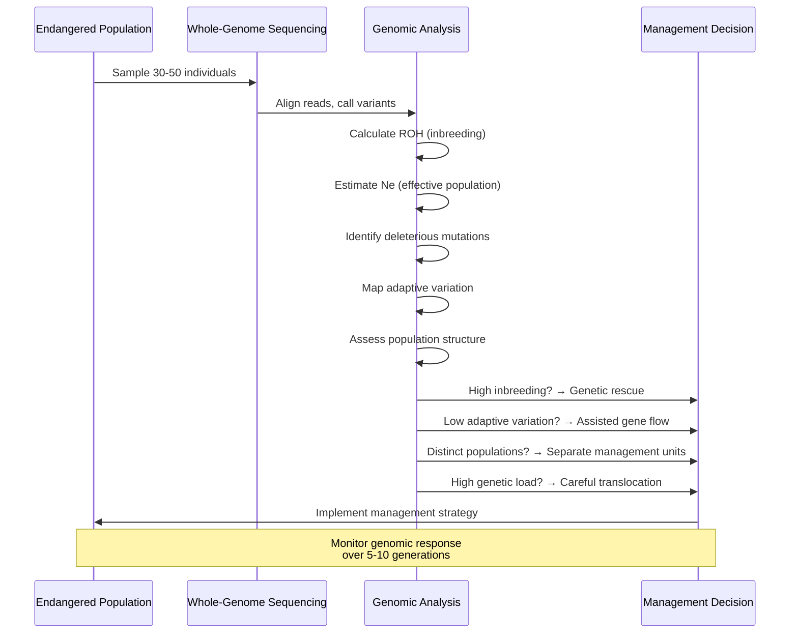
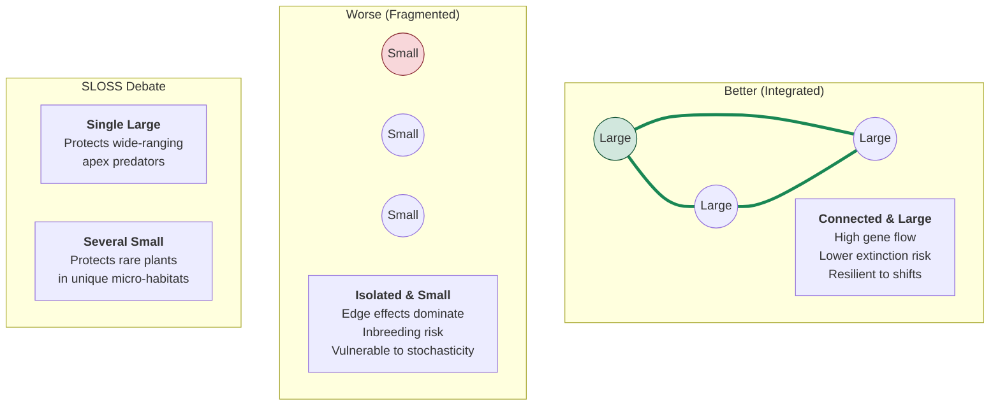
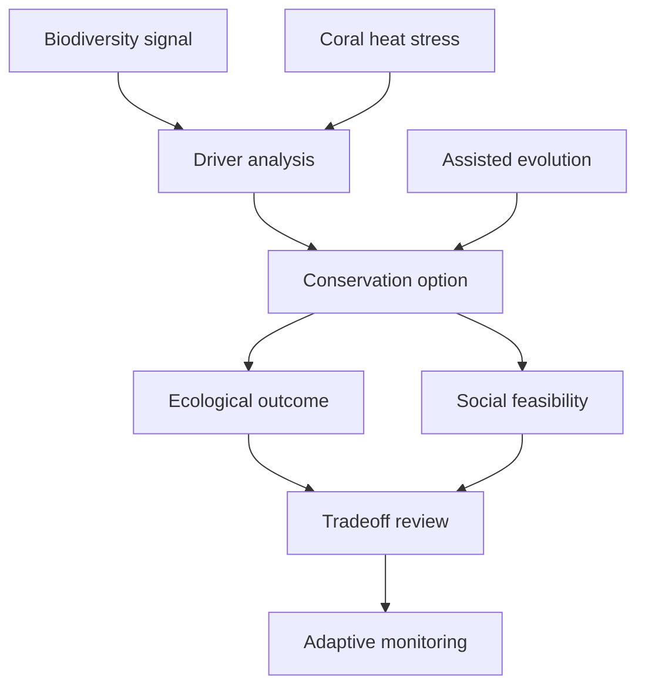

# Biomes and Conservation Biology

\label{sec:unit_X_biomes_and_conservation}


<!-- chapter-metadata-badge -->
> **Ch 35** · Level 2/3 · 70 min read · 75 min lecture · Prerequisites: \cref{sec:unit_X_ecosystem_ecology}

## Learning Objectives

1. Describe the 9 major terrestrial [**biome**](#gl:biome)s and 5 aquatic biome types with climate, NPP, and indicator species.
2. Explain climate-driven biome boundary shifts and tipping points from 2023-2025 scholarship.
3. Define the IUCN Red List categories, [**minimum viable population (MVP)**](#gl:minimum-viable-population), and the 50/500 rule.
4. Explain extinction debt and its implications for conservation timescales.
5. Design nature reserves using [**island biogeography**](#gl:island-biogeography) and SLOSS principles with quantitative examples.
6. Describe rewilding and climate-adaptive management as emerging conservation strategies.
7. Explain conservation genomics and assisted [**gene**](#gl:gene) flow as tools for managing threatened populations.
8. Evaluate the effectiveness of international conservation frameworks (CBD, 30x30, CITES).
9. Quantify IPBES findings (extinction rates, decline of vertebrate populations, drivers of biodiversity loss) and use them to evaluate conservation priorities.
10. Compute climate velocity for different landscape gradients and identify topographic, hydrological, microclimatic, and elevational refugia.
11. Compare ecosystem-based adaptation strategies (mangroves, urban greening, wetlands, coral reefs) with hard infrastructure on cost-benefit and co-benefit dimensions.

\begin{figure}[htbp]
\centering
\includegraphics[width=0.85\textwidth]{../figures/biome_distribution.png}
\caption{Representative biome positions in temperature-precipitation space. Point area scales with net primary productivity, making tropical rainforest, temperate forest, savanna/grassland, desert, tundra, and marine reference conditions visually comparable.}
\label{fig:unit_X_biome_distribution}
\end{figure}

<!-- alt: Scatter plot with mean annual precipitation on the x-axis and mean annual temperature on the y-axis. Six labelled biome points are sized by net primary productivity. -->

<!-- curriculum-scaffold-start -->
### Study Blueprint

- **Big idea:** Biodiversity patterns and conservation decisions emerge from climate, history, disturbance, and human choice.
- **Core concepts:** biomes, biodiversity, extinction risk, conservation planning.
- **Framework alignment:** Vision & Change: Systems, Evolution, Pathways and transformations of energy and matter; AP Biology: Systems Interactions, Evolution, Energetics; NGSS-style topics: Interdependent Relationships in Ecosystems, Matter and Energy in Organisms and Ecosystems, Natural Selection and Evolution.
- **Model or quantitative lens:** Species-area, risk, and prioritization calculations.
- **Data skill:** Use maps, trend data, and threat categories to justify conservation priorities.
- **Practice cadence:** Representing and Describing Data, Statistical Tests and Data Analysis, Argumentation.
- **Common misconception to repair:** Conservation is decision-making under constraints and uncertainty, not only preserving untouched nature.
- **Primary lab:** \cref{sec:lab_unit_X_biomes_and_conservation}.
- **Question bank:** \cref{sec:q_unit_X_biomes_and_conservation}.
- **Transfer task:** Transfer conservation reasoning to land use, climate corridors, restoration, and environmental justice.
- **Bridge to computation:** `biology.ecology.ecology.species_area_relationship`.
<!-- curriculum-scaffold-end -->

---

> **Opening Vignette — The Experiment That Launched Conservation Biology**
> 
> In 1966, ecologist E.O. Wilson and his student Daniel Simberloff tested a bold prediction of island biogeography theory — that small islands far from the mainland support fewer species, and that a disturbed island will bounce back to a predictable species count. Simberloff hired professional exterminators to fumigate small mangrove islands off the Florida Keys with methyl bromide, killing most arthropods. He then monitored recolonisation. Within a year, species counts had returned to near the pre-defaunation levels predicted by island area and distance equations Wilson had developed with Robert MacArthur in 1967. The MacArthur-Wilson Theory of Island Biogeography — predicting species number from area $S = cA^z$ — became the mathematical foundation for reserve design in conservation biology. The SLOSS debate (Single Large Or Several Small reserves), minimum viable populations, habitat fragmentation analysis, and biodiversity hotspot identification most derive from Wilson and MacArthur's equations. And it most started with methyl bromide on tiny Keys mangroves.

## Biome Concepts and Classification

A **biome** is a large-scale ecological zone characterised by climate (principally temperature and precipitation) and the type of vegetation and animal communities adapted to those conditions. Biome distribution follows Whittaker's (1975) climate-vegetation gradient map, subsequently confirmed and refined by MODIS satellite NPP data (Running et al. 2004, *Science*) and updated with machine-learning-enhanced Koppen-Geiger classifications (Monzon-Alvarado et al. 2023, *Glob. Change Biol.*).

### Climate as the Master Variable

The distribution of biomes is determined primarily by two climate variables:

1. **Mean annual temperature (MAT)** — determines the length of the growing season and the type of vegetation (tropical vs. temperate vs. boreal)
2. **Mean annual precipitation (MAP)** — determines vegetation structure (forest vs. grassland vs. desert)

**Whittaker's biome diagram** (\cref{fig:unit_X_biome_distribution}) plots MAT vs. MAP and shows that biome boundaries are remarkably predictable from these two variables alone. However, other factors also matter: seasonality, soil type, fire frequency, and evolutionary history.

### The Nine Major Terrestrial Biomes

| Biome | Temperature | Precipitation | Characteristic adaptations | NPP (g C/m$^2$/yr) |
| ----- | ----------- | ------------- | -------------------------- | ------------------- |
| **Tropical rainforest** | 25-30$^\circ$C year-round | >2,000 mm/yr | Buttress roots, [**epiphyte**](#gl:epiphyte)s, drip tips, fig-wasp [**mutualism**](#gl:mutualism), stratified canopy (emergent/canopy/understory/forest floor) | 1,000-1,750 |
| **Tropical seasonal forest / savanna** | 25$^\circ$C; distinct dry season | 1,000-2,000 mm/yr | Deciduousness (dry season); fire-adapted grasses (resprouting); ungulate herding; C4 grasses | 450-1,000 |
| **Desert** | Extreme diurnal range; hot or cold | <250 mm/yr | CAM [**photosynthesis**](#gl:photosynthesis); nocturnal behaviour; waxy cuticles; deep taproots; water storage | 45-125 |
| **Temperate grassland / prairie** | 0-25$^\circ$C; large annual range | 300-1,500 mm/yr | Deep root systems (>2 m); C4 grasses in warm areas; burrowing animals; fire-maintained | 250-450 |
| **Temperate deciduous forest** | 0-20$^\circ$C; 4 distinct seasons | 750-1,500 mm/yr | Autumn leaf senescence (ABA-mediated); arbuscular mycorrhizae; spring ephemerals | 500-1,250 |
| **Temperate rainforest** | 5-15$^\circ$C; ocean-moderated | >1,500 mm/yr | Tallest trees on Earth (coastal redwood *Sequoia sempervirens*, 115 m); heavy epiphytic moss cover | 750-1,500 |
| **Boreal forest (taiga)** | -10 to 10$^\circ$C | 300-850 mm/yr (snow) | Conical crown shape (snow shedding); antifreeze [**protein**](#gl:protein)s; permafrost soils; low decomposition | 300-600 |
| **Tundra (arctic)** | -30 to 10$^\circ$C; short growing season | <250 mm/yr | Cushion plants; freeze-tolerance (cryoprotectants); permafrost (active layer <1 m); lichens | 50-200 |
| **Mediterranean shrubland (chaparral)** | Mild wet winters; hot dry summers | 300-800 mm/yr | Sclerophyllous leaves (thick cuticle, high fibre); fire-serotinous cones; resprouting lignotubers | 225-650 |

### Five Major Aquatic Biome Types

| Biome | Key features | Indicator species | NPP (g C/m$^2$/yr) |
| ----- | ------------ | ----------------- | ------------------- |
| **Freshwater lakes & rivers** | Salinity <0.5 ppt; thermal stratification (epilimnion/hypolimnion); lotic vs. lentic | Trout, cattails, caddisfly larvae | 50-750 |
| **Wetlands** | High organic load; [**anaerobic**](#gl:anaerobic) sediment; CH$_4$ production; water table at or near surface | Herons, *Sphagnum* moss, alligators | 400-1,750 |
| **Coastal/neritic marine** | Shallow (<200 m); upwelling nutrients; high turbidity; continental shelf | Kelp, cod, sea otters, oysters | 100-1,250 |
| **Open ocean (pelagic)** | Nutrient-poor subtropical gyres; stratified; "blue desert" | [**Phytoplankton**](#gl:phytoplankton), bluefin tuna, sperm whale | 25-200 |
| **Coral reefs** | Tropical; 20-30$^\circ$C; high light; mutualistic *Symbiodiniaceae* (zooxanthellae) | Brain coral, parrotfish, reef sharks | 500-2,000 |

### Lake Stratification and Turnover

Temperate lakes exhibit seasonal stratification:

| Layer | Temperature | Density | Characteristics |
| ----- | ----------- | ------- | --------------- |
| **Epilimnion** | Warm (20-25$^\circ$C) | Low | Surface; mixed by wind; O$_2$-rich, nutrient-depleted |
| **Thermocline** (metalimnion) | Rapid change | Transition | Density barrier prevents mixing |
| **Hypolimnion** | Cold (4$^\circ$C) | High | Deep; O$_2$-depleted; nutrient-rich from decomposition |

**Turnover** occurs in spring and autumn when surface temperature passes through 4$^\circ$C (maximum density of water), eliminating the thermocline and allowing complete mixing. This redistributes O$_2$ and nutrients throughout the water column.

### Coral Reef Bleaching

**Mechanism:** Thermal stress (anomaly >1$^\circ$C sustained >4 weeks, measured as degree heating weeks or DHW) triggers expulsion of symbiotic zooxanthellae (*Symbiodiniaceae*) from coral tissue. Without their photosynthetic partners, corals lose 90% of energy supply and appear white ("bleached"). If thermal stress persists >8 weeks, coral mortality follows.

**Recent mass bleaching events:** The Great Barrier Reef experienced mass bleaching in 2016, 2017, 2020, 2022, 2024, and **2025** (six events in ten years). NOAA and the International Coral Reef Initiative confirmed the fourth global bleaching event beginning in 2023; by late 2025, bleaching-level heat stress had affected about 84% of the world's coral reef area \citep{noaa2025coralbleaching}. At >2$^\circ$C global warming, >99% of coral reefs are projected to experience annual severe bleaching \citep{ipcc2021ar6wg1}.

**Assisted evolution caveat:** Conservation tools now include selective breeding, assisted gene flow, symbiont manipulation, and microbiome conditioning for heat tolerance. These interventions can protect specific reefs or buy time, but they do not remove the thermal driver; without emissions reduction and local water-quality management, heat-tolerant genotypes still face repeated bleaching, acidification, disease, and storm damage.


<!-- alt: Flowchart showing coral bleaching and assisted-evolution response. Heat-tolerant hosts, symbionts, or microbiomes can improve local resilience in some settings, but they are complements to climate mitigation and reef-water-quality management, not substitutes. -->

*Coral bleaching and assisted-evolution response. Heat-tolerant hosts, symbionts, or microbiomes can improve local resilience in some settings, but they are complements to climate mitigation and reef-water-quality management, not substitutes \citep{noaa2025coralbleaching,strader2022coralheat}.*

> 🔬 **Clinical Connection — Reef-Derived Pharmaceuticals:** Coral reef ecosystems are a source of bioactive compounds for drug development. **Pseudopterosin** (from the Caribbean sea whip *Pseudopterogorgia elisabethae*) has potent anti-inflammatory and analgesic properties and is used in commercial wound-healing formulations. **Discodermolide** (from the deep-sea sponge *Discodermia dissoluta*) shows anti-cancer properties by stabilising microtubules, similar to taxol. The cone snail toxin **ziconotide** (Prialt) is an FDA-approved non-opioid analgesic for severe chronic pain. Reef destruction through bleaching and acidification threatens the loss of undiscovered pharmaceutical compounds before they can be identified — a form of pharmacological extinction debt.

> **Concept Check:** What climatic variables determine whether a region supports tropical rainforest vs. tropical savanna? How does fire interact with precipitation to maintain the savanna biome?

---

## Climate Change and Biome Boundary Shifts


<!-- alt: Flowchart for Climate Change and Biome Boundary Shifts: Global Warming +1.1°C since pre-industrial, Poleward Shift 5-10 km/decade (Chen et al. 2023), Upslope Shift 6 m/decade elevation (mountain ecosystems), and Tipping Points (non-linear transitions) form the diagram's primary path or branches. -->

*Flowchart for Climate Change and Biome Boundary Shifts: Global Warming +1.1°C since pre-industrial, Poleward Shift 5-10 km/decade (Chen et al. 2023), Upslope Shift 6 m/decade elevation (mountain ecosystems), and Tipping Points (non-linear transitions) form the diagram's primary path or branches.*

### Key Findings (2023-2025)

| Finding | Study | Key result |
| ------- | ----- | ---------- |
| Biome boundaries shifting poleward | Chen et al. (2023, *Nat. Clim. Change*) | 5-10 km/decade poleward; 6 m/decade upslope |
| Amazon dieback tipping point | Lovejoy & Nobre (2024, *Sci. Adv.*) | 20-25% deforestation → runaway savannification; currently at ~17% |
| Boreal → tundra greening | Elmendorf et al. (2023, *Nat. Ecol. Evol.*) | Shrub cover +50% in 20 years; permafrost destabilisation |
| Novel biomes (no-analog climates) | Williams et al. (2023, *Proc. R. Soc. B*) | ~20% of Earth's surface may develop novel biome types by 2100 |
| Permafrost thaw methane pulse | Turetsky et al. (2024, *Nat. Geosci.*) | Abrupt thaw adds 2-5 Gt C/yr by 2050; omitted from most models |
| Tree mortality acceleration | McDowell et al. (2024, *Science*) | Global tree mortality rates doubled since 1970s; drought/heat/insects |

### Biome Suitability Modelling

\begin{equation}
S = \sum_i w_i \cdot f_i(T, P)
\label{eq:biomes_and_conservation_1}
\end{equation}

where $w_i$ = variable weights (temperature, precipitation, seasonality index), $f_i$ = Gaussian response function centred on optimal conditions.

**Species distribution models (SDMs)** project future range shifts by correlating current distributions with climate variables and projecting onto future climate scenarios:

| Model type | Approach | Strengths | Limitations |
| ---------- | -------- | --------- | ----------- |
| **Bioclimatic envelope** | Correlative (climate → presence) | Simple; good for many species | Ignores dispersal, biotic interactions |
| **MaxEnt** | Machine learning; maximum entropy | High predictive power; handles sparse data | Overfitting risk; correlative primarily |
| **Process-based (e.g., LPJ-GUESS)** | Mechanistic plant physiology | Captures mechanisms; projects novel climates | Data-intensive; computationally expensive |

### Climate Velocity

**Climate velocity** = the speed at which climate conditions shift geographically:

\begin{equation}
v_{climate} = \frac{\text{rate of temperature change (°C/yr)}}{\text{spatial temperature gradient (°C/km)}}
\label{eq:biomes_and_conservation_2}
\end{equation}

In flat landscapes (e.g., Amazon basin), spatial gradients are shallow → climate velocity is fast (~10 km/yr). In mountains, steep gradients → slow climate velocity (~1 km/yr). Species must disperse at least as fast as climate velocity to track suitable conditions.

**Migration lag:** Many species cannot track climate velocity:
- Trees: typical dispersal rate = 0.1-0.5 km/yr via seed dispersal
- Climate velocity in temperate lowlands: ~4-10 km/yr
- Gap: 10-100x faster movement needed than most trees can achieve

> **Concept Check:** The Amazon rainforest is at ~17% deforestation, with a tipping point estimated at 20-25%. Why is the tipping point non-linear (i.e., why doesn't the forest simply lose area proportionally to deforestation)? What role does [**transpiration**](#gl:transpiration) recycling play in the tipping mechanism?

---

## Conservation Biology Fundamentals

### IPBES Global Assessment: The Quantified Crisis

The **Intergovernmental Science-Policy Platform on Biodiversity and Ecosystem Services (IPBES)** — analogous to the IPCC for climate — released its first Global Assessment in 2019 and its Transformative Change Assessment in 2024 \citep{ipbes2019global,ipbes2024transformative}. Its findings frame contemporary conservation:

| IPBES finding | Quantitative result |
| ------------- | ------------------- |
| Species threatened with extinction | ~1,000,000 in the IPBES synthesis; the IUCN Red List provides the tracked assessed-species subset \citep{iucn2025redlist} |
| Average abundance of native species in major terrestrial biomes | Declined ≥ 20% (mostly since 1900) |
| Monitored vertebrate populations | 73% average decline since 1970 in the Living Planet Index; this is a population-index trend, not a count of individual animals \citep{wwf2024livingplanet} |
| Wetlands | 85% lost since 1700 |
| Forest cover | 32% lost (vs. pre-industrial) |
| Coral reef cover | 50% lost since 1870 |
| Pollinator populations | 40% of insect pollinators threatened |
| Local livestock breeds | 9% extinct; another 1,000 threatened (genetic erosion of food security) |

### Quantified Drivers (IPBES 2019)

IPBES ranked the relative importance of the five direct drivers of biodiversity loss in **terrestrial and freshwater systems**:

| Rank | Driver | Approximate contribution |
| ---- | ------ | ------------------------ |
| 1 | Land-use change (agriculture, urbanisation, infrastructure) | ~30% |
| 2 | Direct exploitation (hunting, fishing, logging) | ~23% |
| 3 | Climate change | ~14% (rising fast, projected to dominate by 2050) |
| 4 | Pollution (nutrients, plastics, persistent organics) | ~14% |
| 5 | Invasive alien species | ~11% |

For **marine systems**, the ranking changes: direct exploitation > climate change > pollution > land-/sea-use change > invasive species. Climate change is projected to overtake direct exploitation as the dominant marine driver by 2050.

The Transformative Change Assessment (IPBES 2024) goes further: **incremental conservation alone cannot meet 30x30 or biodiversity targets**. Systemic changes to economic, financial, and governance systems are required — including reforming environmentally harmful subsidies, shifting incentives toward ecosystem stewardship, and integrating biodiversity into most policy domains (the "whole-of-government" approach) \citep{ipbes2024transformative}.

Food systems are a useful place to make "transformative change" concrete. FAO, IFAD, UNICEF, WFP, and WHO report that high food-price inflation continues to undermine access to healthy diets, especially for low-income populations \citep{fao2025sofi}. Conservation biology therefore cannot treat agricultural landscapes as outside nature: agroecology, diversified crop rotations, soil-carbon restoration, pollinator habitat, reduced food waste, sustainable fisheries, and equitable market access are biodiversity strategies and food-security strategies at the same time. The claim is not that agroecology alone solves hunger; it is that biodiversity, nutrition, farm livelihoods, and climate resilience are coupled enough that single-objective policies often fail.

### The Sixth Mass Extinction

Earth currently experiences the **Sixth Mass Extinction** — driven primarily by human activities:

| Driver | Mechanism | Relative contribution |
| ------ | --------- | -------------------- |
| **Habitat destruction** | Land-use change, deforestation, urbanisation | ~30% of threatened species |
| **Overexploitation** | Hunting, fishing, wildlife trade | ~20% |
| **Invasive species** | Competition, predation, disease introduction | ~15% |
| **Pollution** | Pesticides, plastics, nutrient loading | ~10% |
| **Climate change** | Range shifts, phenological mismatch, extreme events | ~8% (increasing rapidly) |
| **Disease** | Chytrid fungus (Bd), white-nose syndrome | ~5% |

**Key statistics:**
- Current extinction rate: 100-1,000x background rate (Ceballos et al. 2017, *PNAS*)
- IPBES 2019 Global Assessment: ~1 million species threatened with extinction
- **Living Planet Index** (WWF 2024): 73% average decline in monitored vertebrate population sizes since 1970; this measures a weighted set of monitored populations, not every vertebrate individual \citep{wwf2024livingplanet}
- 75% of terrestrial ecosystems significantly altered by humans
- 50% of global wetland area lost since 1900
- 33% of marine fish stocks overfished in FAO's recent global assessments \citep{fao2024sofia}

### IUCN Red List Categories (2025 Update)

| Category | Code | Quantitative threshold |
| -------- | ---- | ---------------------- |
| **Extinct** | EX | No reasonable doubt that last individual has died |
| **Extinct in the Wild** | EW | Primarily in cultivation or captivity |
| **Critically Endangered** | CR | at least 80% reduction over 10 yr or 3 generations |
| **Endangered** | EN | at least 50% reduction over 10 yr or 3 generations |
| **Vulnerable** | VU | at least 30% reduction over 10 yr or 3 generations |
| **Near Threatened** | NT | Close to qualifying for VU; being monitored |
| **Least Concern** | LC | Widespread and abundant |
| **Data Deficient** | DD | Insufficient data to assess |

The IUCN Red List is a tracked subset of assessed species, not a census of global biodiversity. Version 2025-1 listed 169,420 assessed species, with 47,187 classified as threatened (Vulnerable, Endangered, or Critically Endangered), about 28% of assessed species \citep{iucn2025redlist}. Counts change with new assessments and reassessments, so the category logic is more durable than any single annual total.

**Criteria for listing** (IUCN uses 5 criteria, any one sufficient):
- **A:** Population reduction (quantitative decline thresholds)
- **B:** Geographic range (extent of occurrence or area of occupancy) with fragmentation/decline
- **C:** Small population size ($N < 10,000$ for VU; $N < 2,500$ for EN; $N < 250$ for CR) with decline
- **D:** Very small population ($N < 1,000$ for VU; $N < 250$ for EN; $N < 50$ for CR)
- **E:** Quantitative analysis (PVA) showing extinction probability >10% within 100 years (VU)

> **Concept Check:** A bird species has a global population of 8,000 mature individuals with a documented 35% decline over the past 15 years (approximately 3 generations). Under which IUCN criteria and category would this species be listed?


<!-- alt: Flowchart showing IUCN Red List assessment framework and conservation triage decision tree. Species are assessed against five criteria (population decline, geographic range, small population, very small population, quantitative analysis). Threatened species receive conservation interventions based on urgency and feasibility. -->

*IUCN Red List assessment framework and conservation triage decision tree. Species are assessed against five criteria (population decline, geographic range, small population, very small population, quantitative analysis). Threatened species receive conservation interventions based on urgency and feasibility.*

---

## Population Viability and the 50/500 Rule

### Minimum Viable Population (MVP)

The **minimum viable population** is the smallest population with at least 95% probability of persistence for at least 100 generations, accounting for four types of stochasticity:

| Stochasticity type | Mechanism | Effect on small populations |
| ------------------ | --------- | -------------------------- |
| **Demographic** | Random variation in births/deaths | Even when $r > 0$, small $N$ → high extinction probability |
| **Environmental** | Weather, food fluctuations | Entire population experiences same bad conditions |
| **Genetic** | Inbreeding depression, drift | $F$ per generation $= 1/(2N_e)$; $F > 0.10$ → fitness costs |
| **Catastrophes** | Fire, disease epidemic, storm | Sudden >50% mortality events; frequency matters |

### Franklin's 50/500 Rule

**Franklin (1980) and \citet{franklinsoule1980}:**

- **$N_e \geq 50$:** Short-term viability — prevents rapid inbreeding depression
  - Inbreeding rate: $\Delta F = \frac{1}{2N_e} \leq 1\%$ per generation
  - At $F > 0.10$: measurable inbreeding depression (reduced litter size, increased juvenile mortality)

- **$N_e \geq 500$:** Long-term viability — maintains additive genetic variance for adaptive evolution
  - Genetic variance lost per generation: $\frac{1}{2N_e} = 0.1\%$
  - Balanced by new [**mutation**](#gl:mutation) if $N_e > 500$ \citep{frankham1995}

**Revised 100/1000 rule** (Frankham et al. 2014, *Biol. Conserv.*): More conservative; accounts for reduced purging effectiveness and updated genomic data.

**$N_e$ vs. census $N$:** Effective population size is typically much smaller than census size:

\begin{equation}
N_e = \frac{4N_m N_f}{N_m + N_f}
\label{eq:biomes_and_conservation_3}
\end{equation}

Typical $N_e/N$ ratio: 0.10-0.25 for vertebrates. Therefore, to achieve $N_e = 500$, census population needs to be $N = 2,000-5,000$.

### Population Viability Analysis (PVA)

**PVA** uses species-specific demographic data and stochastic simulation models (VORTEX, RAMAS) to project extinction probability:

**Inputs:** age/sex-specific survival, fecundity, variance in vital rates, carrying capacity, catastrophe frequency, inbreeding coefficients, habitat area.

**Outputs:** extinction probability over specified time horizon, mean time to extinction, quasi-extinction threshold probability.

**Case study — Florida panther** (*Puma concolor coryi*):
- 1994 PVA → predicted extinction within 25 years without intervention
- $N \approx 30$, $N_e \approx 10$ → severe inbreeding (kinked tails, cryptorchidism, heart defects)
- 1995: 8 female Texas cougars introduced → **genetic rescue**
- 2023: population >200 individuals; heterozygosity increased, inbreeding depression reversed
- One of conservation biology's greatest success stories

> 🔬 **Clinical Connection — Conservation Genetics and Inbreeding Depression in Human Populations:** The principles of MVP and inbreeding depression apply to human populations. Small, isolated populations (e.g., the Amish community of Lancaster County, Pennsylvania) show elevated frequencies of rare autosomal recessive disorders including Ellis-van Creveld syndrome (6-fingered dwarfism; ~5% carrier frequency vs. ~0.001% in general population), maple syrup urine disease, and glutaric aciduria. The **[founder effect](#gl:founder-effect)** — establishment of a population by a small number of individuals carrying a non-representative sample of the gene pool — mirrors the [**genetic drift**](#gl:genetic-drift) effects that reduce $N_e$ in endangered wildlife. Genomic screening programs in such communities follow the same logic as conservation genomics: identifying deleterious [**allele**](#gl:allele)s and managing their frequency.

---

## Extinction Debt and Its Conservation Implications

**Extinction debt** (Tilman et al. 1994, *Nature*): Species present in degraded/fragmented habitats are committed to future extinction because habitat can no longer support viable populations — but extinction is **delayed** (50-500 years) by existing long-lived individuals.

### Mathematical Framework

\begin{equation}
\text{Species committed to extinction} = S_{\text{pre-fragmentation}} - c \cdot A_{\text{remaining}}^z
\label{eq:biomes_and_conservation_4}
\end{equation}

where $S_{\text{pre-fragmentation}}$ is species richness before habitat loss, $A_{\text{remaining}}$ is remaining habitat area, and $c$ and $z$ are the species-area parameters whose log--log slope steepens from contiguous continental biomes toward isolated oceanic islands (\cref{fig:unit_X_species_area}).

\begin{figure}[htbp]
\centering
\includegraphics[width=0.85\textwidth]{../figures/species_area_relationship.png}
\caption{Species--area relationship on log--log axes. Mainland-fragment and oceanic-island curves show contrasting slopes ($z \approx 0.15$ versus $z \approx 0.35$), with a dotted reference curve at $z = 0.25$.}
\label{fig:unit_X_species_area}
\end{figure}

<!-- alt: Log-log plot of species richness against habitat area. The oceanic-island line is steeper than the mainland-fragment line, and a dotted reference line sits between them. -->

### Relaxation Time

**Relaxation time** = the period between habitat loss and final extinction of committed species. Determined by:
- Longevity of individuals (trees: centuries; insects: months)
- Generation time (longer generation = longer debt)
- Habitat quality of remaining fragments
- Connectivity between patches (rescue effect)

### Case Studies

| System | Debt estimate | Relaxation time | Reference |
| ------ | ------------- | --------------- | --------- |
| European calcareous grasslands | 20-50% of plant species | 50-200 years | Lindborg & Eriksson 2004 |
| Amazon forest fragments | 30-50% of canopy trees | 100-500 years | Laurance et al. 2011 |
| African tropical forests | 10-30% of endemic species | Ongoing | Brooks et al. 1999 |
| Belgian forest herbs | 30-40% in fragments <1 ha | 100+ years | Vellend et al. 2006 |

**Conservation implication:** Present-day species richness **overestimates** long-term viability. Conservation assessments based on current presence may be dangerously optimistic. Extinction debt means that the full consequences of today's deforestation will not be realised for decades to centuries.

> **Concept Check:** A 10,000-ha forest is fragmented into ten 100-ha patches. Using $S = 20A^{0.25}$, calculate species richness for the intact forest and for each fragment. How many species are "committed" to extinction via extinction debt? How would wildlife corridors between patches modify this prediction?

---

## Reserve Design

### Island Biogeography Applied to Conservation

MacArthur-Wilson island biogeography theory provides the theoretical foundation for reserve design:

**[Species-area relationship](#gl:species-area-relationship):** $S = cA^z$ (see Community Ecology chapter for derivation)

```python
from biology.ecology import species_area_relationship

# Compare large vs. small reserves
S_large = species_area_relationship(area_ha=10_000, c=7, z=0.26)
S_small = species_area_relationship(area_ha=100, c=7, z=0.26)
print(f"Large reserve (10,000 ha): {S_large:.0f} species")
print(f"Small reserve (100 ha):    {S_small:.0f} species")
print(f"Species lost from fragmentation: {((S_large-S_small)/S_large)*100:.0f}%")
```

### SLOSS Debate Resolution

| Design principle | When it applies | Example |
| --------------- | -------------- | ------- |
| **Single large** preferred | Area-demanding species; interior habitat specialists; low landscape connectivity | Amazon: large reserves protect jaguar, harpy eagle |
| **Several small** preferred | Different habitat types in different patches; high beta diversity; patches protect local endemics | Caribbean islands: each island has unique endemic reptiles |
| **Core-corridor-matrix** (modern synthesis) | Most real-world situations | Y2Y (Yellowstone to Yukon, 3,200 km) |

### Diamond's Design Principles (1975, updated)

| Principle | Reasoning | Modern status |
| --------- | --------- | ------------- |
| Larger is better than smaller | Species-area relationship | Supported |
| One large > several small of equal total area | More interior habitat; lower extinction | Context-dependent |
| Close together better than far apart | Higher colonisation rate | Supported |
| Clustered better than linear arrangement | More connectivity | Supported |
| Circular better than elongated | Less edge effect | Supported |
| Connected by corridors better than isolated | Rescue effect; gene flow | Strongly supported |

### Edge Effects

Habitat edges create microclimatic gradients that penetrate 100-300 m into forest fragments:

| Edge effect | Penetration distance | Impact |
| ----------- | ------------------- | ------ |
| Increased light | 50-200 m | Favours pioneer species; dries forest interior |
| Wind damage | 100-300 m | Increased tree mortality |
| Elevated temperature | 50-100 m | Shifts microclimate; stresses shade species |
| Nest predation/parasitism | 200-600 m | Cowbird parasitism and corvid predation increase |
| Invasive species | 100-500 m | Exotic plants establish in disturbed edges |

For a circular reserve:

\begin{equation}
\text{Interior area} = \pi(r - d)^2
\label{eq:biomes_and_conservation_5}
\end{equation}

where $r$ = reserve radius and $d$ = edge penetration distance. For a 10-ha circular reserve ($r = 178$ m) with 200-m edge effects: **zero interior habitat.** This illustrates why small fragments are ecological traps for interior-dependent species.

### Habitat Corridors

**Evidence for corridor effectiveness:**
- Tewksbury et al. (2002, *PNAS*): Connected patches had 25-100% more pollinator movement than unconnected
- Gilbert-Norton et al. (2010, meta-analysis): Movement between patches 50% higher with corridors
- **Florida Wildlife Corridor** (legislated 2021): 1,000+ mile protected corridor from Everglades to Okefenokee Swamp

**Stepping stones:** For species that can cross moderate distances (birds, bats, strong-flying insects), stepping stone patches may be as effective as continuous corridors at lower cost.

> 🔬 **Clinical Connection — Urban Green Corridors and Human Health:** The principles of habitat corridors extend to urban planning and human health. Studies in Philadelphia, Chicago, and Singapore demonstrate that connected urban greenways (tree-lined corridors connecting parks) reduce urban heat island effects by 2-5$^\circ$C, decrease particulate matter (PM$_{2.5}$) by 15-25%, and increase physical activity by 30-40% in nearby residents. Green corridors also reduce stress biomarkers (salivary [**cortisol**](#gl:cortisol) decreased 20% after 30-minute walks in urban green corridors vs. streets; Roe et al. 2013). Conservation biology's core-corridor-matrix design principles thus have direct applications to One Health approaches integrating biodiversity conservation, climate adaptation, and human wellbeing.

> **Concept Check:** A conservation planner has a budget to protect 1,000 ha of tropical forest. Option A: one 1,000-ha reserve. Option B: ten 100-ha reserves spread across different habitat types. Option C: five 100-ha reserves connected by 100-m-wide corridors (total 500 ha reserves + 500 ha corridors). Which design best protects: (a) a large-bodied apex predator? (b) maximum regional species richness? (c) genetic connectivity? Justify each answer using island biogeography theory.

---

## Emerging Conservation Strategies

### Rewilding

**Rewilding** (Soule & Noss 1998; updated Jorgensen 2024, *Nat. Ecol. Evol.*): Restore ecological processes — especially trophic interactions — by reintroducing lost species, particularly apex predators and megaherbivores.

**Three types of rewilding:**

| Type | Approach | Example |
| ---- | -------- | ------- |
| **Trophic rewilding** | Reintroduce apex predators/herbivores to restore cascades | Wolves in Yellowstone (1995); lynx in UK (proposed) |
| **Pleistocene rewilding** | Use ecological proxies for extinct megafauna | Pleistocene Park, Siberia (bison, horses to create mammoth steppe) |
| **Passive rewilding** | Remove human disturbance; allow natural regeneration | European farmland abandonment → forest recovery |

**Quantitative outcomes of wolf reintroduction in Yellowstone:**
- Elk: population reduced ~50% (12,000 → 6,000); behaviour change (avoid riverbanks)
- Willows: height increased 5-fold in riparian areas within 15 years
- Beavers: 0 colonies in 1995 → 12 colonies by 2012
- Songbirds: 5 species returned to recovering riparian habitat
- Stream morphology: channels narrowed and deepened as bank vegetation stabilised soil
- Berry production: increased → grizzly bear diet shifted (consuming 10x more berries)

**Pleistocene Park hypothesis:** Zimov et al. (2012, *Science*): Reintroducing large herbivores to Arctic tundra compacts snow in winter, allowing cold air to freeze soil deeper, **slowing permafrost thaw** by ~80% compared to snow-insulated control plots.

### Conservation Genomics

**Whole-[**genome**](#gl:genome) sequencing** of threatened populations enables:

Conservation genomics is strongest when sequencing is tied to a management decision rather than treated as an expensive description. Runs of homozygosity estimate recent inbreeding, allele-frequency outliers can nominate local adaptation, pangenome or long-read approaches can reveal structural variation, and pedigree-aware sampling can separate ancestry from recent bottlenecks. The ethical layer is inseparable: sampling permits, Indigenous data sovereignty, benefit-sharing, and the risk of over-prioritising "genetically interesting" populations most affect whether the genomic evidence should guide action.

| Application | Method | Example |
| ----------- | ------ | ------- |
| **Inbreeding assessment** | Runs of homozygosity (ROH) analysis | Cheetah: ~10 Mb average ROH; severe bottleneck |
| **Adaptive variation** | Genome-wide association (GWAS) for climate-relevant loci | Coral heat tolerance alleles in *Acropora* |
| **Management units** | Population structure (FST, admixture analysis) | Tiger: 6 subspecies → conservation priorities |
| **Genetic rescue planning** | Identify source populations maximising heterozygosity | Florida panther × Texas cougar |
| **Ancient DNA** | Reconstruct historical diversity; identify lost alleles | Woolly mammoth → mammoth de-extinction project |


<!-- alt: Sequence diagram for Conservation Genomics showing ordered interaction among Endangered Population, Whole-Genome Sequencing, Genomic Analysis, and Management Decision. -->

*Sequence diagram for Conservation Genomics showing ordered interaction among Endangered Population, Whole-Genome Sequencing, Genomic Analysis, and Management Decision.*

### Assisted Gene Flow and Assisted Migration

**Assisted gene flow:** Intentionally moving alleles from adapted to non-adapted populations of the same species:
- Coral: transplanting heat-tolerant *Acropora* genotypes to vulnerable reefs (Palumbi et al. 2014, *Science*)
- Trees: moving southern seed sources to northern planting sites to pre-adapt to warming (assisted migration of *Pinus contorta* in British Columbia)

**Assisted migration (managed relocation):** Moving entire species to new locations outside their historical range where future climate is suitable. Controversial due to invasion risk.

**De-extinction:** Using genomic engineering to resurrect functional analogues of extinct species:
- **Woolly mammoth project** (Colossal Biosciences): Editing Asian elephant genome with mammoth cold-adaptation genes (TRPV3, haemoglobin variants, fat deposition); goal: produce cold-adapted elephants for Arctic rewilding
- **Thylacine project** (Colossal): Reconstructing thylacine genome from museum specimens
- **Ethical debates:** Should resources be spent on de-extinction rather than preventing current extinctions?

### Climate-Adaptive Management

Traditional conservation aims to preserve historical baselines. **Climate-adaptive management** accepts that ecosystems are changing and manages for future conditions:

The hard part is deciding when to resist change, when to help a system transition, and when to redirect effort toward ecosystem function rather than historical composition. Coral reefs illustrate the tradeoff: assisted gene flow, symbiont management, shading, and local water-quality improvement can raise local resilience, but they do not remove the external heat and acidification drivers. Climate-adaptive management is therefore a portfolio problem, pairing local stress reduction with monitoring, emissions context, social feasibility, and explicit thresholds for changing strategy \citep{noaa2025coralbleaching,ipbes2024transformative}.

| Approach | Strategy | Example |
| -------- | -------- | ------- |
| **Protect climate refugia** | Identify and protect areas where climate change impacts are minimised | Deep canyons, north-facing slopes, groundwater-fed wetlands |
| **Increase connectivity** | Corridors for range shifts | Continental-scale corridors (Y2Y, Florida Wildlife Corridor) |
| **Managed retreat** | Accept loss of some habitats; invest in new ones | Managed realignment of coastal defences; creating new marshland |
| **Reduce non-climate stressors** | Remove pollution, invasive species to increase resilience | Reducing sediment runoff on coral reefs |

---

### Visualizing Reserve Design Principles


<!-- alt: Flowchart for Visualizing Reserve Design Principles: Connected & Large High gene flow Lower extinction risk Resilient to shifts, Isolated & Small Edge effects dominate Inbreeding risk Vulnerable to stochasticity, Single Large Protects wide-ranging apex predators, and Several Small Protects rare plants in unique micro-habitats form the diagram's primary path or branches. -->

*Flowchart for Visualizing Reserve Design Principles: Connected & Large High gene flow Lower extinction risk Resilient to shifts, Isolated & Small Edge effects dominate Inbreeding risk Vulnerable to stochasticity, Single Large Protects wide-ranging apex predators, and Several Small Protects rare plants in unique micro-habitats form the diagram's primary path or branches.*

---

## 7B Climate Velocity, Refugia, and Range Shifts

\citet{ripple2012} and Loarie et al. (2009, *Nature*) established **climate velocity** as the central organising metric for climate-adaptive conservation. The velocity is the speed at which a given thermal envelope moves across the landscape, and species must disperse at least this fast to track their climatic niche.

\begin{equation}
v_{\text{climate}} = \frac{\partial T/\partial t}{|\nabla T|}
\label{eq:unit_X_climate_velocity}
\end{equation}

The numerator is the rate of climate change at a point (°C/yr); the denominator is the local spatial temperature gradient (°C/km). Rearranging gives velocity in km/yr.

| Landscape | Spatial gradient | Velocity at +0.03 °C/yr |
| --------- | ---------------- | ----------------------- |
| Mountain (e.g., Andes) | 5 °C/km vertically | 0.006 km/yr (6 m/yr — slow) |
| Boreal foothills | 0.5 °C/km | 0.06 km/yr |
| Temperate plains | 0.05 °C/km | 0.6 km/yr |
| Amazon basin (flat) | 0.005 °C/km | 6 km/yr |
| Subtropical plains | 0.003 °C/km | 10 km/yr |

The flattest landscapes generate the fastest velocities — exactly where species cannot escape upslope. **Migration lags** therefore cluster in lowland tropical and temperate plains: trees often disperse at roughly 0.1–0.5 km/yr, which can be 10–100× too slow for tropical lowlands but adequate for some mountain settings.

### Refugia and Their Identification

**Climate refugia** are locations where the local climate changes more slowly than the regional average, providing temporary or permanent havens for species unable to track climate velocity. Recognised refugia types:

| Type | Mechanism | Examples |
| ---- | --------- | -------- |
| **Topographic** | Cold-air pooling, north-facing slopes, deep canyons buffer temperature | Klamath-Siskiyou (NW USA); Mediterranean canyons |
| **Hydrological** | Groundwater-fed streams, springs, lakes maintain cool temperatures | Spring-fed cold-water salmonid habitat |
| **Microclimatic** | Forest interior buffering (–2 to –5 °C vs. open canopy) | Cathedral-grove old growth; tropical understory |
| **Elevational** | Mountains hold residual cool habitat above warming lowlands | Alpine ecosystems globally |
| **Coastal upwelling** | Cold-water upwelling buffers warming surface oceans | California Current; Benguela; Peru |
| **Cryptic / paleo** | Sites that remained inhabitable through Pleistocene glaciations | Many high-biodiversity hotspots map onto past refugia |

Refugia identification is a major effort of climate-adaptive conservation planning: high-resolution climate downscaling (≤ 1 km grids) plus species distribution modelling reveals locations where target species can persist longest, prioritising them for protection. The **Adapt West** initiative (Conservation Biology Institute) maps climate refugia for North American species; analogous tools exist in Australia, Europe, and parts of South America.

> **Concept Check:** Two endangered birds occupy similar habitat: species A in the high Andes (5 °C/km gradient) and species B on the Brazilian cerrado (flat). With identical thermal requirements and warming rates, which species faces the greater extinction risk from climate change, and what reserve-design implications follow?

---

## 7C Ecosystem-Based Adaptation: Using Nature for Climate Resilience

**Ecosystem-Based Adaptation (EbA)** uses biodiversity and ecosystem services as part of an overall adaptation strategy to help people adapt to climate change. The framework — formalised by the CBD and IUCN in 2009 — sits at the intersection of conservation and human resilience: protecting and restoring ecosystems to buffer communities against floods, storms, droughts, heat waves, and rising seas, while simultaneously sequestering carbon and conserving biodiversity.

### Major EbA Strategies

| Strategy | Mechanism | Co-benefit |
| -------- | --------- | ---------- |
| **Mangrove restoration** | Wave attenuation; coastal sediment stabilisation; storm surge buffering (each 100 m of mangrove reduces wave height ~20 %) | Carbon sequestration (3–5 × tropical forest density); fisheries nursery |
| **Coral reef restoration** | Wave dissipation (reefs reduce wave energy 70–95 %); coastal protection valued at ~\$10,000/km/yr | Tourism; fisheries; biodiversity |
| **Urban green infrastructure** | Tree canopy reduces urban heat island by 2–5 °C; permeable surfaces reduce flooding | Air quality; mental health; physical activity |
| **Wetland conservation** | Floodplain water storage; nutrient filtration | Wildlife habitat; recreation |
| **Reforestation / agroforestry** | Soil retention; rainfall recycling; microclimate stabilisation | Carbon storage; smallholder livelihoods |
| **Drought-tolerant agroecosystems** | Diverse cropping, perennial roots, soil organic matter | Food security; reduced N$_2$O |
| **Living shorelines** | Marsh and oyster reef construction replacing seawalls | Habitat; better long-term storm performance than hard infrastructure |

### Quantified Performance

EbA projects often outperform engineered alternatives on cost and resilience:

- **Mangroves vs. seawalls.** Coastal protection from mangroves in the Philippines averages \$94/m of coastline; equivalent seawall construction averages \$2,000/m, with no co-benefits and high maintenance (Beck et al. 2018, *Nat. Commun.*).
- **Hurricane Katrina (2005).** Wetland loss in the Mississippi Delta increased storm surge by ~25%; restoring 100 km$^2$ of marsh would reduce surge damage in vulnerable parishes by ~10–15 % (Day et al. 2007, *Science*).
- **2003 European heat wave.** Cities with dense urban green infrastructure (e.g., Vienna) experienced ~30 % fewer heat-related deaths than comparable cities with less greening (Smargiassi et al. 2009).

### Limits of EbA

EbA is not a panacea. Limitations:

- **Cannot substitute for emissions reduction.** No amount of coastal restoration prevents the catastrophic outcomes of 4 °C warming.
- **Climate change itself is undermining the adapters.** Coral bleaching kills the reefs we want to use for coastal protection; mangroves face sea-level rise faster than they can build sediment.
- **Equity and tenure issues.** EbA projects fail when they ignore Indigenous land rights or displace communities.

EbA is best understood as one component of a multi-layered adaptation portfolio that also includes hard infrastructure, social systems, and aggressive emissions cuts.

> 🔬 **Clinical Connection — Heat Action Plans and Public Health.** Following the 2003 European heat wave (~70,000 excess deaths) and the 2010 Russian heat wave (~55,000 excess deaths), cities increasingly couple ecological strategies (urban tree planting, cool roofs, restored wetlands and parks) with public health interventions (heat warning systems, cooling shelters, vulnerable-population outreach). Ahmedabad, India implemented South Asia's first Heat Action Plan in 2013 after a 2010 heat wave killed > 1,300 residents; subsequent years saw ~30% reductions in heat-related mortality despite continued warming. Mexico City, Phoenix, and Chicago have similar plans. These One Health interventions integrate biodiversity conservation, urban ecology, and human health — operationalising the EbA framework.

> **Concept Check:** A coastal municipality must spend its limited adaptation budget on protecting 20 km of shoreline from increasing storm surge. (a) Compare the cost-benefit profile of seawall construction vs. mangrove restoration. (b) Why is EbA not always the best choice — what conditions favour hard infrastructure? (c) How does coral bleaching complicate the math?

---

## International Conservation Frameworks

### Key Agreements

| Framework | Year | Target | Status (2024) |
| --------- | ---- | ------ | ------------- |
| **CITES** | 1975 | Regulate international wildlife trade | Parties and listed taxa change as appendices are amended; cite the live appendices for current counts \citep{cites2026appendices} |
| **CBD** (Convention on Biological Diversity) | 1992 | Conservation, sustainable use, equitable sharing | 196 parties (US has not ratified) |
| **Aichi Targets** | 2010 | 20 targets for 2020 | Most targets missed |
| **Kunming-Montreal Framework** (30x30) | 2022 | Protect 30% of land and ocean by 2030 | Currently ~17% land, ~8% ocean protected |
| **Paris Agreement** | 2015 | Limit warming to 1.5-2$^\circ$C | Tracking toward 2.5-3$^\circ$C |

### The 30x30 Target

The Kunming-Montreal Global Biodiversity Framework (GBF, 2022) set a target to protect 30% of land and 30% of ocean by 2030 \citep{cbd2022kunmingmontreal}. Current status:

\begin{equation}
\text{Terrestrial: } 16.7\% \xrightarrow{\text{need}} 30\% \text{ (add 20 million km}^2\text{)}
\label{eq:biomes_and_conservation_6}
\end{equation}

\begin{equation}
\text{Marine: } 8.3\% \xrightarrow{\text{need}} 30\% \text{ (add 78 million km}^2\text{)}
\label{eq:biomes_and_conservation_7}
\end{equation}

**Challenges:**
- Quality vs. quantity (many protected areas are "paper parks" with no enforcement)
- Indigenous and local community rights (30x30 must not displace indigenous peoples)
- Representativeness (current protected areas biased toward "rock and ice" — high-altitude, low-productivity areas)
- Financial gap: estimated $700 billion/yr needed; current spending ~$100 billion/yr

### Payments for Ecosystem Services

**REDD+** (Reducing Emissions from Deforestation and Forest Degradation): International carbon market payments incentivise forest-rich developing nations to avoid deforestation. $5 billion in pledges as of 2024, but implementation faces challenges of additionality, leakage, permanence, and measurement.

> **Concept Check:** The Aichi Targets (2010-2020) were largely unmet. What factors contributed to their failure, and how does the Kunming-Montreal Framework attempt to address these shortcomings?

---

## Worked Example

**Problem:**
An ecologist studies bird species on an archipelago. The species-area relationship for this region follows the equation $S = cA^z$, where $c = 10$ and $z = 0.3$. Island X has an area ($A$) of $1,000\text{ km}^2$. Calculate the expected number of bird species ($S$) on Island X.

**Solution:**

**Step 1. Identify the given variables.**
- Area ($A$) = $1,000\text{ km}^2$
- Constant ($c$) = 10
- Exponent ($z$) = 0.3

**Step 2. Substitute the values into the species-area equation.**
$$S = cA^z \label{eq:unit_X_biomes_and_conservation_item_1}$$

$$S = 10 \times (1000)^{0.3} \label{eq:unit_X_biomes_and_conservation_item_2}$$


**Step 3. Calculate the exponent.**
Notice that $1000 = 10^3$. Therefore:
$$(10^3)^{0.3} = 10^{(3 \times 0.3)} = 10^{0.9} \label{eq:unit_X_biomes_and_conservation_item_3}$$

Let's approximate $10^{0.9}$. Since $10^1 = 10$ and $10^{0.5} \approx 3.16$, $10^{0.9} \approx 7.94$.
(Exact value: $10^{0.9} \approx 7.943$)

**Step 4. Solve for $S$.**
$$S = 10 \times 7.943 \label{eq:unit_X_biomes_and_conservation_item_4}$$

$$S \approx 79.43 \label{eq:unit_X_biomes_and_conservation_item_5}$$


**Answer:**
Island X is expected to support approximately **79 bird species**.

---

## Worked Example: Effective Population Size and the 50/500 Rule

**Problem:**
A captive recovery herd of an endangered ungulate has a census size of $N = 120$ individuals, but primarily $N_m = 20$ males and $N_f = 100$ females actually breed. Calculate the effective population size $N_e$, the per-generation inbreeding rate $\Delta F$, and evaluate the herd against the 50/500 rule for short-term and long-term viability.

**Solution:**

**Step 1. Identify the given variables.**
- Breeding males ($N_m$) = 20
- Breeding females ($N_f$) = 100
- Census size ($N$) = 120

**Step 2. Substitute into the unequal-sex-ratio effective-size equation.**
$$N_e = \frac{4 N_m N_f}{N_m + N_f} \label{eq:unit_X_biomes_and_conservation_item_6}$$

$$N_e = \frac{4 \times 20 \times 100}{20 + 100} = \frac{8{,}000}{120} \approx 66.7 \label{eq:unit_X_biomes_and_conservation_item_7}$$

**Step 3. Compute the per-generation inbreeding rate.**
$$\Delta F = \frac{1}{2 N_e} = \frac{1}{2 \times 66.7} \approx 0.0075 = 0.75\%\text{ per generation} \label{eq:unit_X_biomes_and_conservation_item_8}$$

**Step 4. Evaluate against the 50/500 rule.**
With $N_e \approx 67$, the herd clears the short-term threshold ($N_e \geq 50$) that guards against rapid inbreeding depression, but it falls far short of the long-term threshold ($N_e \geq 500$) needed to retain additive genetic variance for future adaptation. The skewed sex ratio is the cause: the effective size is barely over half the census size, even though 120 animals are present.

**Answer:**
$N_e \approx 67$ and $\Delta F \approx 0.75\%$ per generation. The herd is demographically defensible in the short term but is genetically committed to losing roughly 0.75% of its heterozygosity each generation; without managed gene flow or population growth it remains at elevated long-term extinction risk because it cannot meet the $N_e \geq 500$ adaptive-potential standard.

---

### Minimum Viable Population and Genetic Rescue: Case Studies from Conservation Biology

**Minimum viable population (MVP)** is defined as the smallest population size with $\geq 95\ \%$ probability of persistence over 100 generations, incorporating demographic stochasticity, environmental variance, and genetic deterioration from inbreeding depression and loss of adaptive variation. The classical rule-of-thumb is the **"50 / 500 rule"** (Franklin 1980): $N_e \geq 50$ to avoid short-term inbreeding depression, $N_e \geq 500$ to retain long-term adaptive potential against mutation-drift balance. Modern refinements (Frankham, Brook & Bradshaw 2014) revise these upward — $N_e \geq 100$ and $N_e \geq 1000$ — as the more defensible thresholds given empirical estimates of mutational-variance and inbreeding-load effects.

**Case 1 — The Arabian Oryx (*Oryx leucoryx*)**. Extinct in the wild by 1972 after hunting reduced the Arabian population to zero, the species survived primarily in a 9-founder "World Herd" assembled at Phoenix Zoo. Careful pedigree management and reintroduction programs (Oman 1982, Saudi Arabia 1989, Jordan 1997) have grown the wild population to ~1250 (IUCN 2017, Vulnerable). The genetic cost: current population heterozygosity is ~70 % of the pre-bottleneck estimate, and most 6 microsatellite loci have at most 2 alleles — a cautionary example that demographic recovery does not erase the genetic signature of a bottleneck.

**Case 2 — The California Condor (*Gymnogyps californianus*)**. From a 1982 low of 22 individuals (the entire species in captivity by 1987), a captive-breeding / release program has grown the population to > 500 (half wild, half captive). Genomic sequencing (Ralls et al. 2020) detected **23 known deleterious alleles** in the founders, two fixed during the bottleneck. The ongoing challenge is not census size but **lead toxicosis** from ingestion of lead ammunition in carcasses — a clear example of *why* habitat and regulatory intervention remain necessary even when demographic targets are met.

**Genetic rescue** is the deliberate introduction of unrelated individuals into a small, inbred population to restore heterozygosity. The textbook case is the **Florida panther (*Puma concolor coryi*)**: by the 1990s, about 30 individuals remained, with striking inbreeding-depression [**phenotype**](#gl:phenotype)s (cryptorchidism, cardiac defects). Introducing 8 female Texas cougars in 1995 doubled heterozygosity within one generation; population is now ~200 with reduced deformities and increased reproductive success (Johnson et al., *Science* 2010). The Isle Royale wolves (introduction of 19 wolves 2018–2021) represent the latest live experiment. Genetic rescue is *not* a comprehensive solution — it can disrupt locally adapted gene complexes, introduce maladapted alleles, and dilute evolutionary uniqueness (the Florida panther now bears ~5 % Texas-cougar ancestry). The decision is typically a balance of short-term demographic benefit against long-term evolutionary coherence.

---

### Worked Example — Island Biogeography and Species-Area Loss

**Problem:**
The MacArthur–Wilson species-area relationship in the power-law form is

$$S = c A^z$$

where $S$ is species richness, $A$ is area, and $c$ and $z$ are taxon- and biome-specific constants. For mammals on a network of "sky island" mountain ranges, empirical estimates are $z = 0.25$ and $c = 5$.

(a) Compute $S$ at $A = 100 \text{ km}^2$ (intact) and at $A = 10 \text{ km}^2$ (after 90% habitat loss). (b) What fraction of species is predicted to be lost? (c) Discuss the implication for the SLOSS (single large vs. several small) debate.

**Solution:**

**Step 1. Evaluate $S$ at intact area.**

$$S_{\text{intact}} = 5 \times 100^{0.25} = 5 \times 3.162 \approx 16 \text{ species}$$

**Step 2. Evaluate $S$ after 90% habitat loss.**

$$S_{\text{loss}} = 5 \times 10^{0.25} = 5 \times 1.778 \approx 9 \text{ species}$$

**Step 3. Predicted species loss.**

$$\Delta S = 16 - 9 = 7 \text{ species}; \quad \Delta S / S_{\text{intact}} = 7/16 \approx 0.44 \text{ (44 percent loss)}$$

This is the well-known asymmetry of the species-area curve: a 90% reduction in area produces a 44% reduction in species. The non-linearity comes from the exponent $z \approx 0.25$ for habitat fragments (it is closer to $0.15$ for nested sub-samples of a continuous habitat — Preston's distinction between isolated islands and within-habitat sampling).

**Step 4. SLOSS implication.**

Compare a single large reserve of 100 km² ($S \approx 16$) against ten small reserves of 10 km² each. If each small reserve harbors an independent draw from the same species pool (a generous assumption — most small fragments are subsets of the same dominant species), the upper-bound species count is $10 \times 9 = 90$ in additive count, but ecologically, most species overlap, so the realized total is closer to $S(\text{total area}) = 5 \times 100^{0.25} = 16$ — the same as the single large reserve. Per-patch, however, small reserves suffer higher extinction rates (smaller $K$, edge effects, demographic stochasticity), so a single large reserve typically wins for area-sensitive species. SLOSS is not resolved by area alone; it depends on $z$, the degree of species turnover between patches ($\beta$ diversity), and the dispersal capacity of focal taxa.

**Answer:** Intact $S \approx 16$; post-loss $S \approx 9$; predicted loss is 7 species (44%) from a 90% area reduction.

---

### Concept Check (Analyze) — Metapopulation Dynamics and Corridor Effects

The Levins metapopulation model is

$$\frac{dp}{dt} = m\,p\,(1 - p) - e\,p$$

where $p$ is the fraction of habitat patches occupied, $m$ is the per-patch colonization rate, and $e$ is the per-patch extinction rate. At equilibrium, $\hat{p} = 1 - e/m$.

(a) Baseline: $e = 0.1$, $m = 0.2$. Compute $\hat{p}$. Identify the extinction threshold condition (in terms of the ratio $e/m$) at which the metapopulation collapses regionally even though individual patches remain habitable.

(b) Habitat fragmentation doubles the per-patch extinction rate to $e = 0.2$ while $m$ stays at $0.2$. Compute the new $\hat{p}$. Analyze the qualitative behavior: this is a phase transition, not a smooth response — explain why management interventions that "just barely" maintain $m > e$ are far less robust than they appear.

(c) A corridor construction project increases $m$ by 50% from $0.2$ to $0.3$ while leaving $e = 0.2$ unchanged. Compute the new $\hat{p}$ and explain in mechanistic terms why corridors (which raise $m$) generally yield larger conservation gains than within-patch interventions (which lower $e$) when the system sits near the extinction threshold.

(d) Synthesize: connect the Levins extinction threshold to the SLOSS debate from the worked example above. Which spatial configuration (SL vs. SS) is more robust when the per-patch extinction rate is environmentally elevated (e.g., climate change raising $e$ system-wide)?

---

### Concept Check (Evaluate) — Climate Velocity and the Boreal-Tundra Tipping Point

The boreal–tundra ecotone is advancing northward at a velocity of approximately 50 km/decade as tree-line species (spruce, larch) establish on warming, previously permafrost-dominated soils. Permafrost globally stores roughly $1.5 \times 10^{12}$ kg C — about twice the mass of carbon currently in the atmosphere.

(a) Evaluate the two competing carbon-flux mechanisms triggered by tree encroachment onto tundra:
- *Above-ground biomass gain.* New tree biomass sequesters carbon into wood, root systems, and forest litter. Estimate the order-of-magnitude per-hectare gain over a decade (a typical boreal forest holds $\sim 100$ MgC/ha above ground; tundra holds $\sim 5$ MgC/ha above ground).
- *Permafrost thaw carbon loss.* Soils warm under tree canopy and thawed permafrost respires previously frozen organic matter. The boreal soil column can hold $\sim 200$–$500$ MgC/ha in the upper 1 m, of which a significant fraction is microbially labile once thawed.

(b) Compare the two magnitudes. Which dominates the regional carbon balance over a 50-year horizon? Justify by reasoning about which pool is larger, which has the faster turnover, and which is bounded vs. continuously growing.

(c) Evaluate the climate-feedback sign. Does boreal-tundra advance constitute a *negative* feedback (sequestration mitigating warming) or a *positive* feedback (net release amplifying warming) at multi-decadal scales? Discuss why the answer depends on the time horizon: above-ground sequestration is fast but capped at the new forest's standing biomass, while permafrost respiration is slow but ongoing for centuries.

(d) Design a monitoring study to discriminate between these two scenarios. Specify: (i) which two measurements are most diagnostic (e.g., eddy-covariance net ecosystem exchange, soil-profile dissolved organic carbon flux, satellite-derived NDVI greening), (ii) what spatial and temporal sampling design is needed, and (iii) what would constitute a falsifying observation for each scenario. Conclude with a recommendation for conservation policy: should boreal-tundra ecotone management prioritize carbon sequestration through afforestation incentives, or permafrost protection through restricted disturbance?

---

## Current Evidence and Frontier Biology

For **Biomes and Conservation Biology**, frontier biology belongs inside the evidence logic of
the chapter. Ecology and conservation decisions increasingly combine field data, remote sensing, community knowledge, model uncertainty, and explicit values. The core reading question is this: conservation claims must separate ecological evidence, social values, feasibility, and uncertainty in tradeoffs.

- **What to verify:** identify the observation, model, assay, or dataset that
  would make the claim stronger or weaker.
- **What to qualify:** state the scale, organism, cell type, environmental
  condition, or population where the claim is expected to hold.
- **What to compare:** test at least one alternative explanation, baseline, or
  null model before treating the pattern as causal.
- **What to cite:** distinguish primary evidence, review synthesis, public
  dataset, and institutional guidance; for recent or numeric claims, prefer
  the source closest to the measurement and state what has changed since it was
  published.

Use biodiversity metrics carefully: population indices, extinction risk categories, ecosystem services, and management targets answer different questions \citep{ipbes2019global,ipbes2024transformative,wwf2024livingplanet,iucn2025redlist,fao2024sofia}.

**Source practice:** For conservation claims, cite assessment sources and state whether the evidence is a population index, extinction-risk assessment, ecosystem-service valuation, satellite product, or policy synthesis \citep{ipbes2024transformative,noaa2025coralbleaching,fao2025sofi}.

### Current Evidence Map: Conservation Decision Evidence Chain


<!-- alt: Flowchart showing coral assisted evolution and IPBES transformative-change examples show why conservation decisions need evidence, values, feasibility, and monitoring in the same frame. -->

*Coral assisted evolution and IPBES transformative-change examples show why conservation decisions need evidence, values, feasibility, and monitoring in the same frame \citep{ipbes2024transformative,noaa2025coralbleaching,strader2022coralheat}.*

## Key Terms

| Term | Definition |
| ---- | ---------- |
| **Biome** | Large-scale ecological zone defined by climate and [**dominant**](#gl:dominant) vegetation type |
| **Net primary productivity (NPP)** | Carbon fixed by plants minus autotrophic respiration; g C/m$^2$/yr |
| **IUCN Red List** | Global system for evaluating extinction risk using quantitative criteria |
| **Minimum viable population (MVP)** | Smallest population with at least 95% persistence probability for at least 100 generations |
| **50/500 rule** | $N_e \geq 50$ short-term; $N_e \geq 500$ long-term viability (Franklin/Soule) |
| **Effective population size ($N_e$)** | Genetically effective number of breeding individuals; typically $0.1-0.25 \times N$ |
| **Extinction debt** | Delayed extinction of species committed to disappear due to past habitat loss |
| **SLOSS debate** | Trade-off between single large vs. several small reserves |
| **Rewilding** | Restoration of ecological processes via reintroduction of lost species |
| **Population Viability Analysis (PVA)** | Stochastic simulation of extinction probability |
| **Conservation genomics** | Application of whole-genome analysis to conservation management |
| **Assisted gene flow** | Intentional translocation of alleles from adapted to non-adapted populations |
| **Genetic rescue** | Introduction of unrelated individuals to reverse inbreeding depression |
| **Climate velocity** | Speed at which climate conditions shift geographically (km/yr) |
| **Edge effect** | Microclimatic and biotic changes at habitat fragment boundaries |
| **Coral bleaching** | Thermal stress-induced expulsion of zooxanthellae; loss of coral energy supply |
| **30x30** | Target to protect 30% of land and ocean by 2030 (Kunming-Montreal GBF) |
| **De-extinction** | Using genomic engineering to resurrect functional analogues of extinct species |
| **Novel biome** | Ecosystem with no historical analog, arising from climate change |
| **IPBES** | Intergovernmental Science-Policy Platform on Biodiversity and Ecosystem Services; "IPCC for biodiversity" |
| **Climate refugia** | Locations where local climate changes more slowly than the regional average; havens for slow-dispersing species |
| **Ecosystem-based adaptation (EbA)** | Use of biodiversity and ecosystem services to help people adapt to climate change |
| **Living shorelines** | Marsh, oyster reef, and mangrove infrastructure replacing seawalls for coastal protection |
| **Living Planet Index** | WWF metric of mean change in monitored vertebrate populations since 1970 |
| **Heat Action Plan** | Coupled public-health and ecological response to extreme heat events |
| **Genetic load** | Accumulated deleterious alleles; heightened in bottlenecked populations; affects translocation strategies |
| **Runs of homozygosity (ROH)** | Long stretches of homozygous DNA indicating recent inbreeding; key conservation-genomic metric |

---

## Review Questions

1. Using the species-area relationship $S = cA^z$ with $c = 6$ and $z = 0.28$, calculate species richness for a 50,000 ha intact forest and after fragmentation into 5 patches of 1,000 ha each. What fraction of species are committed to extinction via the fragmentation-driven extinction debt? How long might this debt take to be "paid" for long-lived tree species?

2. A population of sea turtles has $N_e = 35$ and current heterozygosity $H = 0.60$. (a) Apply the 50/500 rule to evaluate its short-term and long-term viability. (b) Calculate how many generations until $H < 0.40$ using $H_t = H_0(1 - 1/2N_e)^t$. (c) What genetic rescue strategy could improve the prognosis?

3. The Amazon has currently lost ~17% of its original forest cover. Lovejoy and Nobre's tipping point threshold is ~20-25%. (a) Explain the tipping mechanism (why is it non-linear?). (b) What conservation interventions are needed in terms of scale, urgency, and geographic targeting? (c) How does the transpiration recycling mechanism create a positive feedback loop during deforestation?

4. Explain the difference between demographic, environmental, genetic, and catastrophic stochasticity in an MVP context. Which was most important in the Florida panther case, and how was it mitigated? Calculate the inbreeding rate ($\Delta F$) for the panther population at $N_e = 10$ vs. after genetic rescue at $N_e = 50$.

5. Compare rewilding and assisted gene flow as conservation strategies for climate change adaptation. For each, give one specific quantitative example (species, location, outcome metric, timescale).

6. A conservation biologist must design a reserve system for a large carnivore with home range = 200 km$^2$ and an MVP of $N_e = 500$ ($N/N_e$ ratio = 4). Calculate: (a) minimum total census population needed, (b) minimum reserve area assuming 50% habitat overlap between individuals, (c) whether a single reserve or corridor-connected system is more feasible. Design the reserve system.

7. The Great Barrier Reef has experienced 6 mass bleaching events in 10 years. Using the degree heating weeks (DHW) metric, explain the mechanism of bleaching. At what level of global warming does coral reef survival become highly improbable? What is the economic value at stake (cite Deloitte or similar valuation studies)?

8. Evaluate the 30x30 target (Kunming-Montreal Framework). Calculate the additional area of land and ocean that must be protected to reach 30% from current levels. What are the three most significant implementation challenges, and how might they be addressed?

9. The woolly mammoth de-extinction project aims to create cold-adapted elephants for Arctic tundra. (a) What ecological function would they serve? (b) How would they slow permafrost thaw? (c) What are the strongest ecological and ethical arguments for and against this approach?

10. Using the concept of climate velocity, explain why montane species are at lower risk of range contraction than lowland species. Calculate climate velocity for a flat landscape with temperature change = 0.03$^\circ$C/yr and spatial gradient = 0.005$^\circ$C/km, vs. a mountain with spatial gradient = 5$^\circ$C/km. What are the implications for conservation prioritisation?
11. Compute `species_area_relationship` for $A \in \{1, 10, 100\}$ km$^2$ with $c=2$, $z=0.25$; discuss reserve sizing.
12. Contrast **inbreeding depression** vs. **outbreeding depression** in translocation programs.
13. The IPBES 2019 Global Assessment ranked land-use change as the dominant terrestrial driver of biodiversity loss (~30 %), with climate change at ~14 % but rising. (a) Why is this *current* ranking expected to invert by 2050? (b) How should conservation priority-setting respond to this projected shift? (c) The Transformative Change Assessment (IPBES 2024) argues that incremental conservation cannot meet biodiversity targets. What three systemic reforms does it recommend, and why are they outside traditional conservation biology?
14. Compare two endangered birds: species A in the high Andes (5 °C/km gradient) and species B on the Brazilian cerrado (0.005 °C/km gradient), with both facing 0.03 °C/yr warming. (a) Calculate climate velocity for each. (b) Predict their relative extinction risks. (c) How does this calculation re-prioritise conservation funding between the two regions?
15. A coastal municipality is choosing between (a) a 20-km concrete seawall (\$2,000/m, 50-yr lifetime, no co-benefits, requires periodic rebuilding) and (b) a 20-km mangrove restoration project (\$94/m initial, low maintenance, multiple co-benefits, but vulnerable to sea-level rise faster than mangrove sediment accretion). Calculate total costs over 50 years for each, and identify under what climate-change scenario each option is preferred.
16. Explain how the 50/500 rule, conservation genomics (runs of homozygosity, genetic load), and population viability analysis converge to inform genetic rescue decisions for the Florida panther. Why was the 1995 Texas-cougar introduction successful, and what risks (e.g., outbreeding depression) had to be balanced?
17. Define a climate refugium and list four types (topographic, hydrological, microclimatic, elevational). Why is identifying refugia critical for 21st-century reserve design? What datasets (climate models, species distribution models, paleoecology) does refugium identification require?
18. Critically evaluate the 30x30 target. (a) Calculate the additional area of land and ocean needed to reach 30 % from current levels. (b) Why is *quality* of protection (effective management, no "paper parks") at least as important as quantity? (c) How can 30x30 be implemented without violating Indigenous land rights, given that ~80 % of remaining biodiversity is on Indigenous-managed lands?

---


## Further Reading and Source Notes

- Soule (1980). Thresholds for Survival: Maintaining Fitness and Evolutionary Potential. *Conservation Biology: An Evolutionary-Ecological Perspective*.
- Frankham (1995). Effective population size/adult population size ratios in wildlife: A review. *Genetical Research*, 66.
- Frankham (2014). Conservation genetics: Setting the scene. *Philosophical Transactions of the Royal Society B*, 369.

---

## Computational Bridge

The power-law S--A curve is a one-liner:

```python
from biology.ecology import species_area_relationship

for a in (1.0, 10.0, 100.0):
    print(a, round(species_area_relationship(a, c=2.0, z=0.25), 2))
```

> **Clinical / systems note:** Habitat fragmentation in zoonotic emergence maps onto the same area-dependent extinction risk curves used in terrestrial conservation.

---

## Summary

- **Nine terrestrial biomes:** tropical rainforest highest NPP (~1,750 g C/m$^2$/yr); desert lowest (~45-125); boreal forest largest land biome by area. Five aquatic biome types including coral reefs (most biodiverse marine ecosystem, threatened by bleaching).
- **Climate change:** biome boundaries shifting 5-10 km/decade poleward; Amazon at ~17% deforestation approaching 20-25% tipping point; permafrost thaw adds 2-5 Gt C/yr; novel biomes emerging on ~20% of Earth's surface by 2100.
- **Sixth Mass Extinction:** 100-1,000x background extinction rate; 73% vertebrate population decline since 1970; 1 million species threatened.
- **IPBES findings:** ~1 million species threatened (12.5%); 85% of wetlands lost since 1700; 50% coral reef loss since 1870. Drivers ranked: land-use change > exploitation > climate change (rising fast) > pollution > invasives. Transformative Change Assessment (2024) argues incremental conservation insufficient.
- **Climate velocity** $v = (\partial T/\partial t)/|\nabla T|$: fast in flat tropical and temperate plains (6–10 km/yr), slow in mountains (6 m/yr); refugia (topographic, hydrological, microclimatic, elevational) are the key targets for climate-adaptive reserve design.
- **Ecosystem-based adaptation (EbA):** mangroves, coral reefs, urban green infrastructure, wetlands, agroforestry. Often outperforms hard infrastructure on cost ($94/m vs. $2,000/m for coastal protection) and provides co-benefits, but cannot substitute for emissions reduction.
- **IUCN Red List:** CR = at least 80% population decline under Criterion A; version 2025-1 listed 47,187 threatened species among 169,420 assessed, and totals change as assessments expand \citep{iucn2025redlist}.
- **MVP:** 50/500 rule (Franklin); revised 100/1000 \citep{frankham2014}; PVA accounts for most stochasticity types. $N_e/N$ ratio typically 0.10-0.25.
- **Extinction debt:** fragmented species committed to extinction with 50-500 yr lags; current surveys overestimate long-term viability.
- **Reserve design:** core-corridor-matrix; edge effects penetrate 100-300 m; corridors increase movement 50%; 30x30 target.
- **Emerging strategies:** rewilding ([**trophic cascade**](#gl:trophic-cascade)s), conservation genomics (ROH, adaptive variation), assisted gene flow (coral heat tolerance), de-extinction (mammoth project), climate-adaptive management.
- **International frameworks:** CBD, CITES, 30x30 target; $700 billion/yr funding gap; quality and representativeness challenges.
- **Connections:** See \cref{sec:unit_VI_phylogenetics} for phylogenetic diversity, \cref{sec:unit_X_community_ecology} for trophic rewilding, and \cref{sec:unit_V_population_genetics} for small-[**population genetics**](#gl:population-genetics).

---

---

### Companion Source Module

**Biomes and Conservation Biology** should leave a reproducible trail from a biological claim to
the code, figure, diagram, or paper-based activity that can test it. Use the
surfaces below to inspect the chapter's assumptions, rerun the relevant model,
or compare the manuscript explanation with companion labs and figures.

| Surface | Use it for |
| --- | --- |
| `src/biology/ecology/ecology.py` (`species_area_relationship`, `biodiversity_indices`, `connectance`) | Reproduce conservation metrics and tradeoff-sensitive summaries. |
| `src/visualization/plots.py` (`plot_species_area_relationship`, `plot_biome_distribution`) | Inspect species-area assumptions and biome comparisons. |
| `src/mermaid/biology_diagrams.py` (`food_web_diagram`, `nutrient_cycle_diagram`) | Connect conservation action to ecological pathways. |

**Reproducibility check:** separate ecological evidence, social objective, feasibility, uncertainty, and monitoring indicator before choosing a conservation action. **Cross-reference:** use \cref{sec:unit_X_population_ecology}, \cref{sec:unit_X_community_ecology}, and \cref{sec:unit_X_ecosystem_ecology}.
