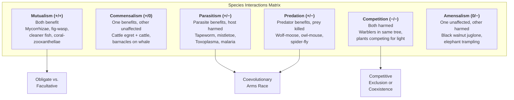
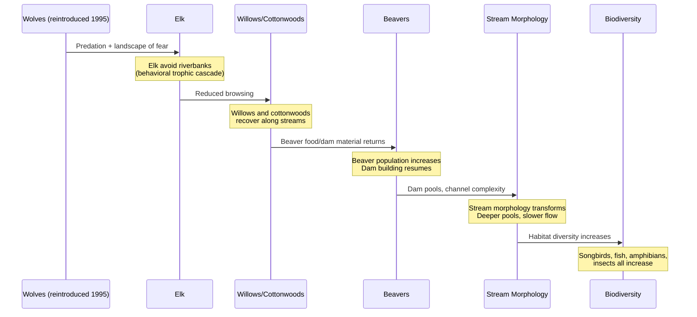
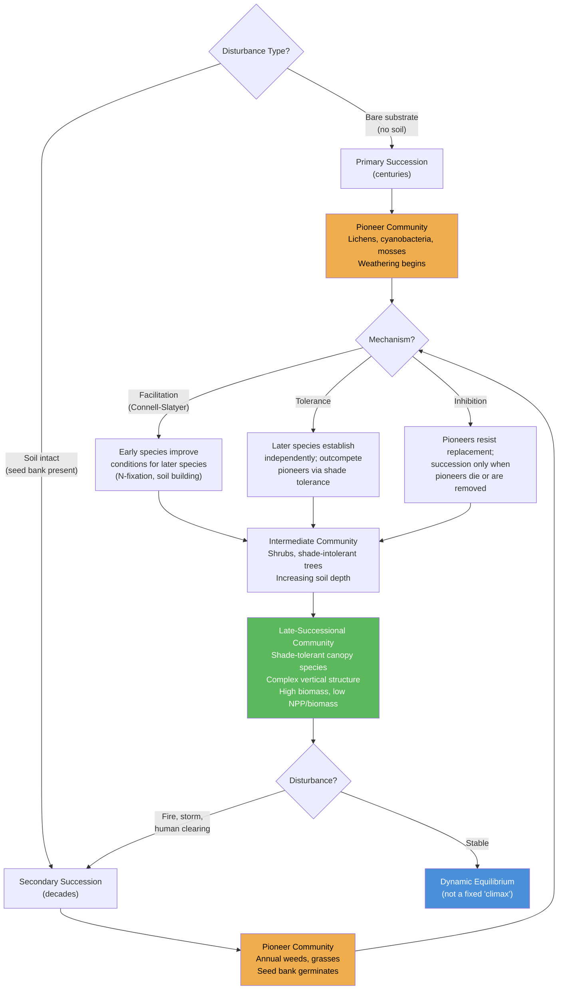

# Community Interactions and Succession

\label{sec:unit_X_community_interactions}

<!-- chapter-metadata-badge -->
> Level 2/3 · 45 min read · 55 min lecture · Prerequisites: \cref{sec:unit_X_population_ecology}

## Learning Objectives

By the end of this chapter, you should be able to:

1. Define a community and categorize the six types of biotic interactions with examples.
2. Apply Lotka-Volterra competition equations to predict competitive outcomes and explain the [**competitive exclusion**](#gl:competitive-exclusion) principle and [**niche**](#gl:niche) theory.
3. Explain [**trophic cascade**](#gl:trophic-cascade)s and keystone \citep{paine1966} species with quantitative examples.
4. Compare primary and [**secondary succession**](#gl:secondary-succession) and explain the intermediate disturbance \citep{connell1978} hypothesis.
5. Calculate Shannon diversity (H'), Simpson index, and species evenness and explain what each measures.
6. Apply [**island biogeography**](#gl:island-biogeography) theory, the [**species-area relationship**](#gl:species-area-relationship), and SLOSS debate to conservation design.
7. Describe the role of disturbance, facilitation, and alternative stable states in shaping communities.
8. Explain food web topology, connectance, network robustness, and the relationship between complexity and stability.
9. Compare niche-based and neutral theories of biodiversity, and explain when each null model is appropriate.
10. Use functional traits (CSR strategies, leaf economics spectrum) to predict community assembly and ecosystem function beyond species lists.
11. Distinguish classical, augmentative, and conservation biological control, and evaluate their risk profiles using community ecology principles.

\begin{figure}[htbp]
\centering
\includegraphics[width=0.85\textwidth]{../figures/biodiversity_indices.png}
\caption{Shannon and Simpson diversity indices compared for an even meadow assemblage and a dominant-species grassland. Evenness raises Shannon $H'$ and Simpson $1-D$ relative to skewed abundance distributions.}
\label{fig:unit_X_biodiversity_indices}
\end{figure}

<!-- alt: Bar chart comparing Shannon and Simpson indices for two communities with different evenness. -->

<!-- curriculum-scaffold-start -->
### Study Blueprint

- **Big idea:** Communities are structured by pairwise species interactions and successional change.
- **Core concepts:** competition, predation, mutualism, succession.
- **Framework alignment:** Vision & Change: Systems, Evolution, Pathways and transformations of energy and matter; AP Biology: Systems Interactions, Evolution, Energetics; NGSS-style topics: Interdependent Relationships in Ecosystems, Matter and Energy in Organisms and Ecosystems, Natural Selection and Evolution.
- **Model or quantitative lens:** Lotka-Volterra-style interaction reasoning.
- **Data skill:** Interpret abundance, interaction, or disturbance data from communities.
- **Practice cadence:** Representing and Describing Data, Statistical Tests and Data Analysis, Argumentation.
- **Common misconception to repair:** A species interaction is not permanently good or bad; the sign can change with context.
- **Primary lab:** \nameref{sec:lab_unit_X_community_interactions}.
- **Question bank:** \nameref{sec:q_unit_X_community_interactions}.
- **Transfer task:** Transfer interaction reasoning to restoration, agriculture, and invasion biology.
- **Bridge to computation:** `biology.ecology.ecology.biodiversity_indices`.
<!-- curriculum-scaffold-end -->

---

> **Opening Vignette — How Wolves Changed Rivers**
> 
> In 1995, 14 gray wolves were reintroduced to Yellowstone National Park after a 70-year absence. What happened next has become one of ecology's most vivid demonstrations of a trophic cascade. With predators back, elk avoided grazing in valleys and riverside areas where they were vulnerable. Vegetation in those areas — willows, aspens, cottonwoods — rebounded within years. With trees stabilizing river banks, erosion slowed. Beaver colonies, dependent on willows, increased sixfold. Beaver dams created wetlands that supported fish, otters, ducks, and amphibians. River channels narrowed and meandered, becoming more complex. The wolves, through fear alone — the "landscape of fear" effect documented by William Ripple — had changed the physical geography of the park. The Yellowstone study has been cited thousands of times, popularised by a viral YouTube video with 40 million views, and debated (some effects took decades to show). But it remains the canonical example that removing or restoring apex predators cascades through every [**trophic level**](#gl:trophic-level) of a community.

### Chapter Roadmap for Interaction Networks and Biodiversity Metrics

This is a long chapter that covers eight closely-related but distinguishable topics. Read it as *two halves*:

- **Part A — Local interactions between species:** what happens when two or a few species meet. The chapter begins with community definitions, then develops competition, predation and trophic cascades, [**mutualism**](#gl:mutualism), and parasitism.
- **Part B — Community-scale patterns and assembly:** what emerges when you scale up. Succession, diversity measurement, island biogeography, and food-web network structure become the organizing themes.
- **Part C — Process-level theory and applications:** neutral theory supplies a null model for biodiversity; trait-based ecology (CSR, leaf economics) predicts ecosystem function; biological control applies the entire chapter to pests and disease vectors.

If you are reading for a one-semester survey, Part A supplies the mechanistic vocabulary and Part B supplies the integrative patterns. Part C provides the modern frameworks and applied translations. Instructors wanting to split the chapter over two lectures can use the Part-A/Part-B boundary; a third lecture can cover Part C.

## Community Structure, Interaction Strength, and Scale

An **ecological community** is an assemblage of populations of different species occupying the same region and time, interacting with each other and their [**abiotic**](#gl:abiotic) environment. Community ecology analyses the **biotic interactions** among species and their effects on community structure — species composition and relative abundance — as well as the processes driving community assembly and succession.

### Emergent Properties of Communities

Communities possess properties that cannot be predicted from studying individual species in isolation:

: Emergent Properties of Communities: Property and Definition. {#tbl:unit_X_community_interactions_emergent_properties_of_communities}
| Property | Definition | Measurement |
| -------- | ---------- | ----------- |
| **Species richness ($S$)** | Number of species present | Count of unique species |
| **Species evenness** | How equal are species abundances? | Pielou's $J'$ |
| **Diversity** | Combined richness and evenness | Shannon $H'$, Simpson $1-D$ |
| **Community structure** | Food web topology, trophic levels, functional groups | Network analysis, connectance |
| **Resistance** | Ability to withstand perturbation without change | Deviation from baseline after disturbance |
| **Resilience** | Speed of return to baseline after perturbation | Recovery time |
| **Rank-abundance distribution** | Pattern of relative abundance across species | Log-normal, geometric series, broken stick |

### Rank-Abundance Models

The distribution of individuals among species in a community follows predictable patterns:

: Rank-Abundance Models: Model and Pattern. {#tbl:unit_X_community_interactions_rank_abundance_models}
| Model | Pattern | Interpretation | Typical community |
| ----- | ------- | -------------- | ----------------- |
| **Geometric series** | Steep, convex | Strong dominance; niche pre-emption | Species-poor, harsh environments |
| **Log-series** | Moderate slope | Many rare species, few common | Island faunas, successional communities |
| **Log-normal** | Moderate, symmetric bell curve on log scale | Most natural communities | Large, undisturbed communities |
| **Broken stick** | Shallow, even | Resources divided equally | Species-poor, saturated communities |

**Preston's canonical log-normal** (1962): In most large communities, when species are binned by abundance in octaves (doublings), the distribution is approximately log-normal. This has deep connections to the species-area relationship (\cref{fig:unit_X_species_area}) and to predator--prey oscillations (\cref{fig:unit_X_lotka_volterra}).

### Types of Biotic Interactions


<!-- alt: Graph showing biotic interactions classify fitness effects on participants: mutualism benefits both, parasitism and predation benefit one at a cost to another, and competition harms both. -->

*Biotic interactions classify fitness effects on participants: mutualism benefits both, parasitism and predation benefit one at a cost to another, and competition harms both.*

: Types of Biotic Interactions: Interaction and Species A effect. {#tbl:unit_X_community_interactions_types_of_biotic_interactions}
| Interaction | Species A effect | Species B effect | Mechanism | Example |
| ----------- | --------------- | --------------- | --------- | ------- |
| Mutualism (+/+) | Benefits | Benefits | Direct reciprocal benefit | Mycorrhizae (+plant, +fungus); fig-wasp pollination; bee pollination; ant-plant seed dispersal |
| Commensalism (+/0) | Benefits | Neutral | One benefits, other unaffected | Cattle egret + cattle (cattle disturb insects); barnacles on whale |
| Parasitism (+/-) | Benefits ([**parasite**](#gl:parasite)) | Harmed (host) | Partial exploitation; usually not lethal | Tapeworm + human; mistletoe + tree; *Toxoplasma* + rodent |
| Predation (+/-) | Benefits (predator) | Harmed (prey) | Prey consumed; drives prey adaptation | Wolf + moose; *Daphnia* + [**phytoplankton**](#gl:phytoplankton) |
| Competition (-/-) | Harmed | Harmed | Shared resource demand | Two warbler species in same niche; plants competing for light |
| Amensalism (0/-) | Neutral | Harmed | Inhibitory compounds; physical suppression | Juglone from black walnut; [**biofilm**](#gl:biofilm) quorum quenching |

> **Concept Check:** A remora fish attaches to a shark, feeding on scraps from the shark's meals. Is this mutualism, commensalism, or parasitism? What additional information would you need to determine the exact interaction type?

---

## Competition Theory and Coexistence Mechanisms

### Lotka-Volterra Interspecific Competition

Two competing species $N_1$ and $N_2$ with shared resources are modeled by:

\begin{equation}
\frac{dN_1}{dt} = r_1 N_1 \left(1 - \frac{N_1 + \alpha_{12} N_2}{K_1}\right)
\label{eq:community_ecology_1}
\end{equation}

\begin{equation}
\frac{dN_2}{dt} = r_2 N_2 \left(1 - \frac{N_2 + \alpha_{21} N_1}{K_2}\right)
\label{eq:community_ecology_2}
\end{equation}

where:
- $\alpha_{12}$ = competitive effect of species 2 on species 1 (per individual)
- $\alpha_{21}$ = competitive effect of species 1 on species 2
- $K_1$, $K_2$ = carrying capacities of each species

**Isocline analysis:** Four outcomes depending on isocline intersections:
1. **Species 1 wins:** $K_1 > K_2/\alpha_{12}$ AND $K_1/\alpha_{21} > K_2$
2. **Species 2 wins:** $K_2 > K_1/\alpha_{21}$ AND $K_2/\alpha_{12} > K_1$ (symmetric case)
3. **Unstable equilibrium (priority effect):** $K_1 > K_2/\alpha_{12}$ AND $K_2 > K_1/\alpha_{21}$ — whoever starts higher wins
4. **Stable coexistence:** $K_1 < K_2/\alpha_{12}$ AND $K_2 < K_1/\alpha_{21}$ — interspecific competition weaker than intraspecific

### Competitive Exclusion Principle (Gause's Law)

**\citet{gause1934}:** Two species competing for the same limiting resource cannot stably coexist; the superior competitor excludes the other. Demonstrated with *Paramecium aurelia* vs. *P. caudatum* grown together on a single bacterial food source — *P. aurelia* consistently drove *P. caudatum* to extinction within 20 days.

**Important qualifications:** Competitive exclusion requires (1) complete niche overlap, (2) constant environment, (3) no spatial refugia, and (4) sufficient time. In nature, these conditions are rarely fully met.

### Hutchinson's Niche Concept

**Fundamental niche** \citep{hutchinson1957}: the n-dimensional hypervolume of environmental conditions and resources permitting a species to maintain $r \geq 0$.

**Realized niche:** the subset of the fundamental niche actually occupied after accounting for interspecific competition, predation, and other biotic interactions. Typically smaller than or equal to the fundamental niche.

\begin{equation}
\text{Realised niche} = \text{Fundamental niche} - \text{Competitive exclusion zone}
\label{eq:community_ecology_3}
\end{equation}

**Hutchinson's paradox of the plankton** (1961): Why do hundreds of phytoplankton species coexist in the apparently homogeneous water column, most competing for the same light and nutrients? Violates competitive exclusion. Solutions:

1. **Temporal niche partitioning** — seasonal turnover, disturbance prevents equilibrium
2. **Spatial heterogeneity** — microscale gradients in light, nutrients, turbulence
3. **Predation (selective grazing)** — zooplankton preferentially graze [**dominant**](#gl:dominant) species
4. **Allelopathy** — chemical warfare among phytoplankton
5. **Non-equilibrium dynamics** — the system rarely reaches competitive exclusion

### Modern Coexistence Theory \citep{chesson2000}

Coexistence requires that **intraspecific competition > interspecific competition** for both species. This is enabled by two classes of mechanisms:

**Stabilizing mechanisms** (niche differences):
- **Resource partitioning:** different foods, microhabitats, activity times
- **Janzen-Connell effect:** species-specific enemies concentrate near conspecifics, giving heterospecifics an advantage
- **Storage effect:** temporal environmental variation favors different species at different times; long-lived adults "store" good years
- **Relative nonlinearity:** species respond differently to resource fluctuations

**Equalising mechanisms** (fitness similarity):
- Trade-offs between competitive ability and other traits (dispersal, stress tolerance)
- Similar per-capita growth rates at low density

The mathematical condition for coexistence is:

\begin{equation}
\rho < \frac{\kappa_j}{\kappa_i} < \frac{1}{\rho}
\label{eq:community_ecology_4}
\end{equation}

where ρ = niche overlap (0 to 1) and $\kappa_i/\kappa_j$ = fitness ratio. Lower ρ (more niche differentiation) allows greater fitness inequality.

```python
from biology.ecology.ecology import lotka_volterra

result = lotka_volterra(
    N1_0=100, N2_0=100,
    r1=0.5, r2=0.5,
    K1=500, K2=500,
    alpha12=0.6,   # species 2 slightly suppresses species 1
    alpha21=0.8,   # species 1 strongly suppresses species 2
    t_end=100
)
print(f"Final N1: {result.N1[-1]:.0f}, N2: {result.N2[-1]:.0f}")
# Expected: species 1 wins (lower alpha12 means less impact from competitor)
```

> 🔬 **Clinical Connection — Competitive Exclusion in the [**Microbiome**](#gl:microbiome):** The competitive exclusion principle operates within the human gut microbiome. **Clostridium difficile** infection (CDI) typically occurs after antibiotic treatment eliminates normal gut flora, removing competitive exclusion and allowing *C. difficile* to proliferate unopposed. **Fecal [**microbiota**](#gl:microbiota) transplantation (FMT)** restores competitive exclusion by reintroducing a diverse microbial community, achieving ~90% cure rates for recurrent CDI. This is Gause's principle applied to clinical medicine.

> **Concept Check:** Two species of Paramecium (*P. aurelia* and *P. bursaria*) coexist in the same pond. *P. aurelia* feeds on bacteria in open water; *P. bursaria* harbors symbiotic algae and feeds near the bottom. Explain their coexistence using Chesson's framework: what is the stabilizing mechanism?

---

## Predation, Keystone Species, and Trophic Cascades

### Predator-Prey Arms Races

[**Coevolution**](#gl:coevolution) \citep{ehrlich1964} between predators and prey drives a Red Queen dynamic of escalating adaptations:

**Anti-predator defenses:**

: Predator-Prey Arms Races: Strategy and Mechanism. {#tbl:unit_X_community_interactions_predator_prey_arms_races}
| Strategy | Mechanism | Example |
| -------- | --------- | ------- |
| **Crypsis** | Match background appearance | *Biston betularia* (peppered moth) — industrial melanism |
| **Aposematism** | Bright warning colors advertise toxicity | Poison dart frogs (*Dendrobates*) — alkaloid warning |
| **Mullerian mimicry** | Two toxic species converge on same warning signal | *Heliconius* butterflies sharing wing patterns |
| **Batesian mimicry** | Palatable species mimics toxic model | Viceroy (*Limenitis archippus*) mimics monarch |
| **Chemical defense** | Toxic compounds deter predators | Monarch butterflies sequester cardenolide glycosides |
| **Startle display** | Sudden reveal of eyespots or bright colors | Io moth (*Automeris io*) eyespot flash |
| **Behavioral** | Alarm calls, mobbing, confusion effect | Starling murmurations confuse raptors |
| **Morphological** | Spines, shells, armour | Porcupine quills; turtle shells; hedgehog spines |

**Counter-adaptations in predators:**
- **Kingsnakes** (*Lampropeltis*) evolved resistance to rattlesnake venom
- **Rough-skinned newt** (*Taricha granulosa*) vs. **garter snake** (*Thamnophis sirtalis*): escalating toxin (tetrodotoxin) and resistance — one of the best-documented coevolutionary arms races \citep{brodie1999}
- **Cuckoo** (*Cuculus canorus*) egg mimicry vs. host egg discrimination — classic parasitic arms race

### Hare-Lynx Cycle

*Lepus americanus* (snowshoe hare) and *Lynx canadensis* show coupled ~10-year population cycles in boreal Canada. Hudson's Bay Company fur trading records from 1736-1940 reveal the cycle. Modern analysis:

\begin{equation}
\frac{dH}{dt} = r_{max}H - aPH \qquad \frac{dP}{dt} = b \cdot a \cdot P \cdot H - dP
\label{eq:community_ecology_5}
\end{equation}

The cycle is driven by multiple feedback loops:
1. **Predation** (~60% of cycle) — lynx consumption drives hare decline
2. **Food quality** (~20%) — hare overgrazing induces phenolic toughening of willow/birch browse
3. **Stress physiology** (~20%) — predation risk elevates [**cortisol**](#gl:cortisol), suppressing reproduction
4. True cycles require **tri-trophic** feedbacks; purely Lotka-Volterra predation alone is insufficient (Krebs et al. 2001, *Science*)

### Keystone Species and Disproportionate Community Effects

A **[keystone species](#gl:keystone-species)** (Paine 1966, 1969) has disproportionately large effects on community structure relative to its abundance. Removal of the keystone causes dramatic community reorganisation.

**Types of keystone effects:**

: Keystone Species and Disproportionate Community Effects: Type and Mechanism. {#tbl:unit_X_community_interactions_keystone_species_and_disproportionate_community_effects}
| Type | Mechanism | Example |
| ---- | --------- | ------- |
| **Keystone predator** | Prevents competitive exclusion by suppressing dominant prey | *Pisaster ochraceus* (sea star) → prevents mussel monopoly |
| **Keystone herbivore** | Controls dominant plant, maintaining diversity | African elephant → prevents woodland encroachment on savanna |
| **Keystone mutualist** | Supports many other species through interaction network | Fig trees → fruit for 1,200+ vertebrate species in tropical forests |
| **Ecosystem engineer** | Physically modifies habitat | Beaver dams create wetland habitat; termite mounds and ant nests redistribute soil and nutrients |

### Trophic Cascades Across Food-Web Levels

A **trophic cascade** occurs when changes at one trophic level ripple through the food web to affect non-adjacent levels:

**Top-down cascade** (predator-driven):
- Sea otter → sea urchin → kelp cascade \citep{estes1974}
- Wolf → elk → willow cascade in Yellowstone \citep{ripple2012}

**Bottom-up cascade** (resource-driven):
- Nutrient enrichment → phytoplankton → zooplankton → fish


<!-- alt: Sequence diagram showing trophic cascades track indirect effects: predator recovery can reduce herbivory, allowing plant communities and ecosystem engineers to rebound. -->

*Trophic cascades track indirect effects: predator recovery can reduce herbivory, allowing plant communities and ecosystem engineers to rebound.*

**Quantitative trophic cascade — Sea Otter example:**
- 1 sea otter consumes ~10 kg sea urchin/day
- Each urchin removed protects ~1 m$^2$ of kelp
- Kelp productivity: ~300 g C/m$^2$/yr
- Therefore: 1 otter → ~3,650 m$^2$ kelp protected → ~1,095 kg C/yr sequestered
- Kelp forests also attenuate wave energy by 60-70%, providing coastal protection valued at about \$10,000/km/yr

**Mesopredator release:** removal of apex predators → explosion of medium-sized predators → disproportionate prey decline. Example: coyote increase after wolf removal → ground-nesting bird decline in North America.

> 🔬 **Clinical Connection — Trophic Cascades and Lyme Disease:** The decline of apex predators in eastern North America has contributed to a trophic cascade affecting human health. Wolf and cougar removal → deer population explosion → increased tick-deer encounters → increased *Borrelia burgdorferi* transmission → Lyme disease incidence increased 25-fold from 1990 to 2020 in the northeastern USA. Deer also browse forest understory, reducing small mammal habitat diversity, which concentrates ticks on the most competent reservoir hosts (white-footed mice), further amplifying transmission. Predator restoration could reduce disease burden — a health-relevant trophic cascade.

> **Concept Check:** In Yellowstone, wolves primarily cause a "behavioral trophic cascade" rather than a purely numerical one. What is the difference? How does the "landscape of fear" concept explain why elk behavior change (avoiding riverbanks) may be more important than elk population reduction?

---

## Mutualism, Parasitism, and Facilitation

### Mutualism and Reciprocal Fitness Benefits

**Obligate mutualism:** neither partner can survive without the other (e.g., fig-wasp pollination; lichens = fungus + alga/cyanobacterium).

**Facultative mutualism:** both benefit but can survive independently (e.g., seed-dispersing birds and fruiting trees).

**Mycorrhizal networks:**
- **Arbuscular mycorrhizae (AM, Glomeromycota):** obligate symbionts; hyphae form arbuscules inside root cortex cells; deliver P and micronutrients; receive up to 30% of plant photosynthate; present in ~80% of land plant species
- **Ectomycorrhizae (EM, Basidiomycota + Ascomycota):** hyphae form Hartig net around root cells; dominant in temperate/boreal forests (*Pinus*, *Betula*, *Fagus*); provide N via proteolytic [**enzyme**](#gl:enzyme)s
- **Common mycorrhizal networks (CMNs) — "Wood Wide Web":** CMNs transfer carbon, water, and nutrient signals between plants of same and different species; large "mother trees" supply carbon to understory seedlings (Simard et al. 1997, *Nature*). Contested: whether transfer is truly adaptive signaling or passive diffusion remains debated (Karst et al. 2023, *Nature Ecology & Evolution*)

### Pollination, Myrmecochory, and Ant-Plant Mutualisms

Plant-pollinator mutualisms are reciprocal but not symmetric. Flowers pay carbon and nutrient costs to produce nectar, pollen, scent, color, and shape; pollinators receive food while moving gametes among plants. IPBES treats animal pollination as both biodiversity process and food-system service, and crop syntheses show that wild pollinators can increase fruit set even where managed honey bees are present \citep{ipbes2016pollinators,garibaldi2013wild}. In network terms, a generalist bee can be a hub, while a specialist plant may be vulnerable if its few effective visitors decline.

Ant-plant mutualisms span defense, nutrition, and dispersal. Some plants feed or house defensive ants in domatia or extrafloral nectaries; the ants reduce herbivory but may also deter other visitors, so the net sign depends on context. In [**myrmecochory**](#gl:myrmecochory), ants carry elaiosome-bearing seeds, consume the reward, and discard the seed in protected or nutrient-enriched microsites. This creates a dispersal mutualism in which the plant gains directed movement and the ant colony gains food \citep{lengyel2009convergent}. These examples are useful because they show mutualism as a measured fitness balance, not a sentimental label.

### Parasitism and Disease Ecology

Parasites regulate host populations and can function as keystone species:

: Parasitism and Disease Ecology: Parasite type and Example. {#tbl:unit_X_community_interactions_parasitism_and_disease_ecology}
| Parasite type | Example | Ecological effect |
| ------------- | ------- | ----------------- |
| **Macroparasite** | Intestinal helminths, ticks, lice | Reduce host fitness; can regulate population size |
| **Microparasite** | *Batrachochytrium dendrobatidis* (Bd) | Chytrid fungus: >90 amphibian species extinctions since 1970 |
| **Parasitoid** | *Cotesia glomerata* (braconid wasp) | Lays eggs inside caterpillars; larvae consume host |
| **Social parasite** | Cuckoo (*Cuculus canorus*) | Brood parasitism; reduces host reproductive output |
| **Manipulative parasite** | *Toxoplasma gondii* | Alters rodent behavior (decreased fear of cats) to facilitate transmission |

**The parasite-mediated competition hypothesis:** parasites can determine competitive outcomes between host species, effectively functioning as "hidden" keystone species.

### Facilitation and Positive Species Interactions

**Facilitation** occurs when one species improves the survival or reproduction of another. Unlike mutualism, facilitation can be unidirectional:

- **Nurse plants** in deserts: cacti establish under the shade of nurse shrubs (*Larrea*, *Ambrosia*)
- **Foundation species:** create habitat structure (e.g., corals, kelp, *Spartina* grass in salt marshes)
- **Nitrogen fixers:** *Lupinus* colonises volcanic substrates, enriching soil N for later successional species (Mount St. Helens [**primary succession**](#gl:primary-succession))

> **Concept Check:** The relationship between clownfish and sea anemones is often described as mutualism. The clownfish gains protection from predators; the anemone may benefit from clownfish defending against butterfly fish that eat anemone tentacles. How would you design an experiment to determine whether this interaction is truly mutualism (+/+) or commensalism (+/0)?

---

## Ecological Succession and Community Assembly Over Time

**Succession** = directional, generally predictable change in community composition over time after disturbance or on newly available substrate.

Contemporary succession ecology is less deterministic than the classical "march to climax" story. Recovery trajectories depend on surviving legacies, seed banks, dispersal corridors, disturbance severity, herbivory, invasive species, soil microbes, and climate conditions during recovery. The practical question is not only which stage comes next, but which intervention would change the trajectory: protecting refuges, adding propagules, removing barriers, or accepting a novel stable state.

: Facilitation and Positive Species Interactions: Feature and Primary succession. {#tbl:unit_X_community_interactions_facilitation_and_positive_species_interactions}
| Feature | Primary succession | Secondary succession |
| ------- | ----------------- | -------------------- |
| Starting substrate | Bare rock/sterile substrate (no soil) | Disturbed community with soil intact |
| Typical rate | Centuries to millennia | Decades to centuries |
| Pioneer species | Cyanobacteria, lichens, mosses | Annual weeds, grasses |
| Soil development | Must form from scratch (weathering + organic accumulation) | Already present; seed bank may survive |
| Example | Krakatoa (1883); Surtsey, Iceland (1963); Mount St. Helens (1980) | Old-field succession (abandoned farmland); post-fire forest regrowth |

### Mechanisms of Succession

**\citet{connell1977}** proposed three mechanisms:

: Mechanisms of Succession: Model and Mechanism. {#tbl:unit_X_community_interactions_mechanisms_of_succession}
| Model | Mechanism | Example |
| ----- | --------- | ------- |
| **Facilitation** | Early species modify environment to favor later species | Nitrogen-fixing *Alnus* (alder) enriches soil, enabling spruce colonization (Glacier Bay, Alaska) |
| **Tolerance** | Later species can establish regardless of early species but grow more slowly | Shade-tolerant species slowly replace shade-intolerant pioneers |
| **Inhibition** | Early colonists resist replacement; succession proceeds primarily when pioneers die | *Cladonia* lichen crusts inhibit vascular plant establishment on sand dunes |


<!-- alt: Flowchart showing ecological succession pathways. Primary succession begins on bare substrate and takes centuries; secondary succession begins with intact soil and proceeds in decades. Three mechanisms (facilitation, tolerance, inhibition) operate at transition points. Modern ecology views the endpoint as a dynamic equilibrium rather than a fixed climax state. -->

*Ecological succession pathways. Primary succession begins on bare substrate and takes centuries; secondary succession begins with intact soil and proceeds in decades. Three mechanisms (facilitation, tolerance, inhibition) operate at transition points. Modern ecology views the endpoint as a dynamic equilibrium rather than a fixed climax state.*

In reality, most successional sequences involve the three mechanisms operating simultaneously at different stages and spatial scales.

### Climax Community Concept

**Classical view \citep{clements1916}:** Succession proceeds toward a single, deterministic climax community determined by regional climate (the "organismal" model — community as superorganism).

**Modern view (Gleason 1926; Whittaker 1953):** Communities are assemblages of individually distributed species (the "individualistic" model). Multiple stable endpoints possible; disturbance history, stochastic colonization, and priority effects most influence trajectory. The concept of a single climax is largely abandoned.

### Intermediate Disturbance Hypothesis (IDH)

**Connell (1978):** Communities at intermediate levels of disturbance frequency and intensity show maximum species diversity:

- **Low disturbance** → competitive exclusion → low diversity (dominant competitor wins)
- **High disturbance** → primarily r-selected pioneers survive → low diversity
- **Intermediate** → prevents competitive dominance while enabling diverse colonization

\begin{equation}
H' = f(\text{disturbance frequency, intensity})
\label{eq:community_ecology_6}
\end{equation}

**Evidence:** Coral reefs, tropical forests, stream invertebrate communities — moderate disturbance (hurricanes, floods, fires) increases diversity.

**Criticisms:** The IDH has been challenged as overly simplistic (Fox 2013, *Ecology*). Some communities show monotonic diversity-disturbance relationships. The hypothesis also assumes a competition-colonization trade-off that is not comprehensive.

### Alternative Stable States and Regime Shifts

**Alternative stable states** (Lewontin 1969; Scheffer et al. 2001): Some ecosystems can exist in multiple stable configurations under the same environmental conditions. Transitions between states (**regime shifts**) can be triggered by small perturbations near **tipping points**:

: Alternative Stable States and Regime Shifts: System and State 1. {#tbl:unit_X_community_interactions_alternative_stable_states_and_regime_shifts}
| System | State 1 | State 2 | Tipping mechanism |
| ------ | ------- | ------- | ----------------- |
| Shallow lake | Clear water (macrophytes dominant) | Turbid (algal bloom) | Nutrient loading exceeds P threshold |
| Coral reef | Coral dominated | Macroalgae dominated | Overfishing of herbivorous fish |
| Savanna | Grassland with scattered trees | Closed-canopy forest | Fire suppression |
| Arctic | Perennial sea ice | Seasonal/ice-free | Ocean warming threshold |

**Early warning signals** of approaching tipping points:
- Increased temporal variance (flickering)
- **Critical slowing down** — recovery from perturbation becomes slower
- Increased spatial correlation
- Skewed distribution of system state

These early warning indicators are being applied to monitor reef, lake, and climate system stability.

> 🔬 **Clinical Connection — Microbiome Regime Shifts:** The human gut microbiome exhibits alternative stable states analogous to ecological regime shifts. A healthy, diverse microbiome represents one stable state. Antibiotic treatment or *C. difficile* infection can trigger a regime shift to an impoverished, pathogenic state. Once established, the unhealthy state resists return to the diverse state (hysteresis) — explaining why probiotics alone are often insufficient and why fecal microbiota transplantation (which provides a complete microbial community) is more effective.

> **Concept Check:** After the 1980 eruption of Mount St. Helens, ecologists observed primary succession proceeding much faster than predicted. Surviving pocket gophers, ants, and lupine plants in patches of surviving soil created nuclei of rapid recovery. Which successional mechanism(s) does this illustrate, and why does it challenge Clements' classical model?

---

## Measuring Biodiversity Across Alpha, Beta, and Gamma Scales

### Alpha, Beta, and Gamma Diversity

**\citet{whittaker1960}** distinguished three scales of diversity:

These scales also clarify what modern biodiversity tools can and cannot show. Environmental DNA, acoustic monitoring, camera traps, remote sensing, and citizen-science records can reveal turnover across space faster than classical plots alone, but each method has detection bias, taxonomic gaps, and scale limits. A credible diversity comparison states the sampling unit, detection method, taxonomic resolution, and whether the result is richness, evenness, composition, or functional change.

: Alpha, Beta, and Gamma Diversity: Scale and Definition. {#tbl:unit_X_community_interactions_alpha_beta_and_gamma_diversity}
| Scale | Definition | Metric |
| ----- | ---------- | ------ |
| **Alpha (α) diversity** | Species richness within a single community/habitat | $H'$, Simpson's, species count |
| **Beta (β) diversity** | Turnover in species composition between communities | Jaccard index, Bray-Curtis dissimilarity |
| **Gamma (γ) diversity** | Total diversity across most communities in a landscape | $\gamma = \bar{\alpha} \times \beta$ (multiplicative) |

### Shannon-Wiener Diversity Index ($H'$)

\cref{fig:unit_X_biodiversity_indices} contrasts Shannon and Simpson indices for an even meadow versus a dominant-species grassland, illustrating why evenness matters alongside richness.

\begin{equation}
H' = -\sum_{i=1}^{S} p_i \ln p_i
\label{eq:community_ecology_7}
\end{equation}

where $p_i$ = proportion of individuals belonging to species $i$.

- Range: $H' = 0$ (monoculture) to $H' = \ln(S)$ (perfectly even)
- Sensitive to rare species
- Typical values: 1.5-3.5 for most communities; >4.0 for extremely diverse tropical communities

### Simpson Diversity Index ($1-D$)

\begin{equation}
D = \sum_{i=1}^{S} p_i^2 \qquad \text{Simpson's diversity} = 1 - D
\label{eq:community_ecology_8}
\end{equation}

- Range: 0-1; probability that two randomly selected individuals are from **different** species
- Weighted toward dominant species (less affected by rare species than $H'$)
- Also expressed as reciprocal: Simpson's reciprocal $= 1/D$ (effective number of species)

### Pielou's Evenness ($J'$)

\begin{equation}
J' = \frac{H'}{\ln S} \in [0, 1]
\label{eq:community_ecology_9}
\end{equation}

$J' = 1$ means most species equally abundant; $J' \to 0$ means dominated by one species.

### Worked Example: Shannon Diversity and Evenness

: Shannon Diversity and Evenness: Species and Abundance. {#tbl:unit_X_community_interactions_worked_example_shannon_diversity_and_evenness}
| Species | Abundance | $p_i$ | $p_i \ln p_i$ | $p_i^2$ |
| ------- | --------- | ----- | -------------- | ------- |
| A | 50 | 0.500 | -0.347 | 0.250 |
| B | 30 | 0.300 | -0.361 | 0.090 |
| C | 15 | 0.150 | -0.285 | 0.023 |
| D | 4 | 0.040 | -0.129 | 0.002 |
| E | 1 | 0.010 | -0.046 | 0.000 |
| **Total** | **100** | **1.000** | **-1.167** | **0.364** |

$H' = 1.167$; $H'_{max} = \ln 5 = 1.609$; $J' = 1.167/1.609 = 0.725$

Simpson's $D = 0.364$; Simpson's diversity $= 1 - 0.364 = 0.636$

### Beta Diversity: Measuring Turnover

**Jaccard similarity index:**

\begin{equation}
J = \frac{|A \cap B|}{|A \cup B|}
\label{eq:community_ecology_10}
\end{equation}

where $A$ and $B$ are species sets from two communities. $J = 1$ means identical composition; $J = 0$ means no shared species.

**Bray-Curtis dissimilarity** (incorporates abundance):

\begin{equation}
BC = 1 - \frac{2 \sum_i \min(a_i, b_i)}{\sum_i (a_i + b_i)}
\label{eq:community_ecology_11}
\end{equation}

```python
from biology.ecology.ecology import biodiversity_indices

# Community counts (array of species abundances)
counts = [50, 30, 15, 4, 1]    # 5 species; very uneven
result = biodiversity_indices(counts)
print(f"Species richness: {result.species_richness}")
print(f"Shannon H': {result.shannon_index:.3f}")
print(f"Simpson 1-D: {result.simpson_index:.3f}")
print(f"Evenness J': {result.evenness:.3f}")
```

> **Concept Check:** Community X has 4 species with abundances [100, 100, 100, 100]. Community Y has 4 species with abundances [394, 2, 2, 2]. Both have $S = 4$. Calculate $H'$ and $J'$ for each. Which community is more "diverse" and why does evenness matter as much as richness?

---

## Current Evidence and Frontier Biology: Community Interactions and Succession

For **Community Interactions and Succession**, frontier biology belongs inside the evidence logic of
the chapter. Ecology and conservation decisions increasingly combine field data, remote sensing, community knowledge, model uncertainty, and explicit values. The core reading question is this: community claims should identify interaction type, network position, disturbance regime, and observational limits.

- **What to verify:** identify the observation, model, assay, or dataset that
  would make the claim stronger or weaker.
- **What to qualify:** state the scale, organism, cell type, environmental
  condition, or population where the claim is expected to hold.
- **What to compare:** test at least one alternative explanation, baseline, or
  null model before treating the pattern as causal.
- **What to cite:** distinguish primary evidence, review synthesis, public
  dataset, and institutional guidance; for recent or numeric claims, prefer
  the source closest to the measurement and state what has changed since it was
  published.

Select biodiversity and conservation metrics by decision need: abundance, interaction, function, risk, service, and governance metrics answer different questions \citep{ipbes2019global,ipbes2024transformative,wwf2024livingplanet,iucn2025redlist,fao2024sofia}.

**Source practice:** For ecology and conservation claims, cite assessment sources and state whether the evidence is an index, risk assessment, service valuation, satellite product, or policy synthesis \citep{ipbes2024transformative,noaa2025coralbleaching,fao2025sofi}.

## Summary

- Define a community and categorize the six types of biotic interactions with examples.
- Apply Lotka-Volterra competition equations to predict competitive outcomes and explain the **competitive exclusion** principle and **niche** theory.
- Explain **trophic cascade**s and keystone  species with quantitative examples.
- Compare primary and **secondary succession** and explain the intermediate disturbance  hypothesis.
- Calculate Shannon diversity (H'), Simpson index, and species evenness and explain what each measures.
- Apply **island biogeography** theory, the **species-area relationship**, and SLOSS debate to conservation design.
- Describe the role of disturbance, facilitation, and alternative stable states in shaping communities.
- Explain food web topology, connectance, network robustness, and the relationship between complexity and stability.

## Further Reading and Source Notes: Community Interactions and Succession

- Paine (1966). Food Web Complexity and Species Diversity. *The American Naturalist*, 100.
- Connell (1978). Diversity in tropical rain forests and coral reefs. *Science*, 199.
- Gause (1934). *The Struggle for Existence*. Williams \& Wilkins.
- Hutchinson (1957). Concluding remarks. *Cold Spring Harbor Symposia on Quantitative Biology*, 22.
- Chesson (2000). Mechanisms of maintenance of species diversity. *Annual Review of Ecology and Systematics*, 31.
- Ehrlich & Raven (1964). Butterflies and plants: A study in coevolution. *Evolution*, 18.

---

## Companion Source Module: Community Interactions and Succession

**Community Interactions and Succession** should leave a reproducible trail from a biological claim to
the code, figure, diagram, or paper-based activity that can test it. Use the
surfaces below to inspect the chapter's assumptions, rerun the relevant model,
or compare the manuscript explanation with companion labs and figures.

: Companion source surfaces for Community Interactions and Succession. {#tbl:unit_X_community_interactions_companion_source_surfaces}
| Surface | Use it for |
| --- | --- |
| `src/biology/ecology/ecology.py` (`lotka_volterra`, `connectance`, `biodiversity_indices`) | Quantify interactions, network structure, and community diversity. |
| `src/visualization/plots.py` (`plot_lotka_volterra`, `plot_species_area_relationship`) | Inspect dynamics and richness-area patterns. |
| `src/mermaid/biology_diagrams.py` (`food_web_diagram`) | Keep trophic links and interaction signs explicit. |

**Reproducibility check:** define interaction sign, spatial scale, sampling effort, disturbance history, and network boundary before interpreting community patterns. **Cross-reference:** use \cref{sec:unit_X_population_ecology}, \cref{sec:unit_X_ecosystem_ecology}, and \cref{sec:unit_VII_microbial_ecology}.
