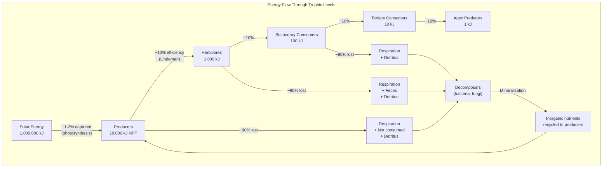
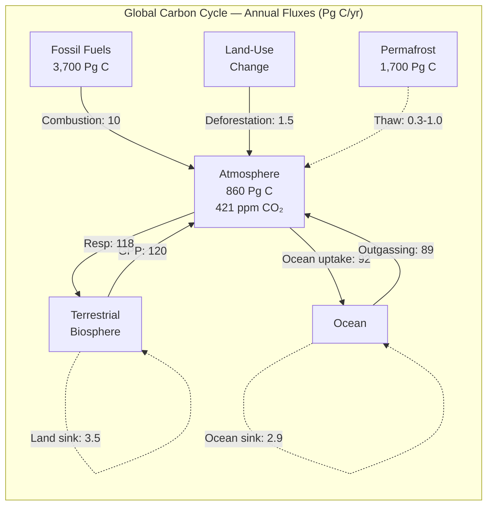
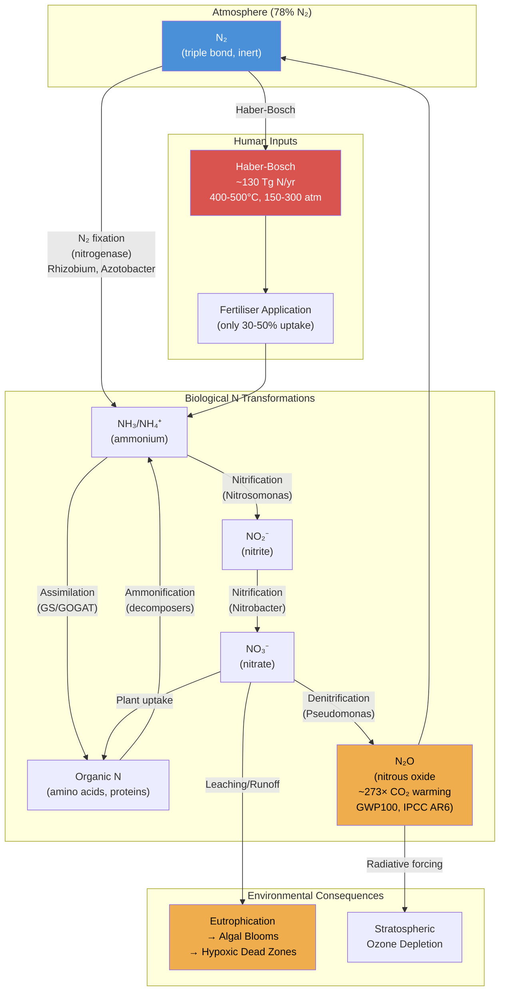
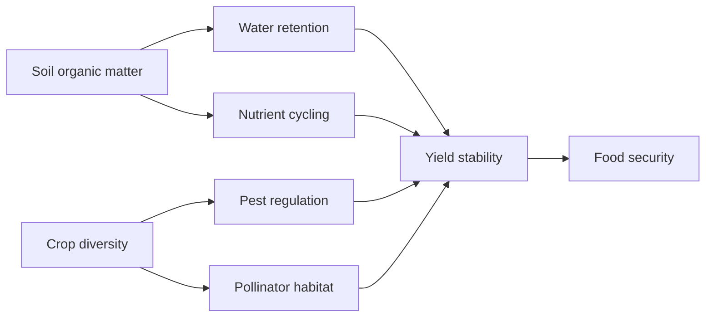

# Ecosystem Ecology and Biogeochemical Cycles

\label{sec:unit_X_ecosystem_ecology}


<!-- chapter-metadata-badge -->
> **Ch 34** · Level 2/3 · 65 min read · 75 min lecture · Prerequisites: \cref{sec:unit_X_community_ecology}, \cref{sec:unit_III_photosynthesis}

## Learning Objectives

By the end of this chapter, you should be able to:

1. Define an ecosystem \citep{levin1998} and distinguish [**abiotic**](#gl:abiotic) from biotic components; categorise consumers by trophic role.
2. Explain energy flow through [**trophic level**](#gl:trophic-level)s, calculate ecological efficiency, and explain why food chains are short.
3. Describe the carbon, nitrogen, phosphorus, and sulphur cycles and their key anthropogenic disruptions.
4. Calculate gross primary production (GPP), net primary production (NPP), and net ecosystem production (NEP).
5. Describe [**eutrophication**](#gl:eutrophication) and hypoxia as consequences of nutrient cycle disruption.
6. Explain ecosystem services and their economic valuation.
7. Describe climate change feedbacks involving biogeochemical cycles (permafrost carbon, ocean acidification).
8. Explain the biological pump and its role in ocean carbon sequestration.
9. Compare methods for measuring NPP (harvest, eddy covariance, $^{14}$C, remote sensing) and explain why ANPP/BNPP partitioning matters for global carbon accounting.
10. Use the Hubbard Brook watershed experiment to explain how live vegetation regulates nutrient retention, and contrast open vs. closed nutrient cycling regimes.
11. Describe ocean productivity zones (upwelling, gyres, polar) and the Martin curve, and connect soil pedogenesis (CLORPT, horizons) to long-term carbon storage.
12. Use the Redfield ratio to diagnose nutrient limitation, and evaluate the planetary boundaries and Gaia hypothesis as frameworks for Earth system thinking.

<!-- curriculum-scaffold-start -->
### Study Blueprint

- **Big idea:** Ecosystems couple energy flow and matter cycling across organisms, environments, and time.
- **Core concepts:** primary productivity, trophic efficiency, nutrient cycles, decomposition.
- **Framework alignment:** Vision & Change: Systems, Evolution, Pathways and transformations of energy and matter; AP Biology: Systems Interactions, Evolution, Energetics; NGSS-style topics: Interdependent Relationships in Ecosystems, Matter and Energy in Organisms and Ecosystems, Natural Selection and Evolution.
- **Model or quantitative lens:** Energy-flow, productivity, and nutrient-budget calculations.
- **Data skill:** Trace matter and energy through food webs and biogeochemical cycles.
- **Practice cadence:** Representing and Describing Data, Statistical Tests and Data Analysis, Argumentation.
- **Common misconception to repair:** Energy flows through ecosystems, but matter cycles; confusing the two breaks many explanations.
- **Primary lab:** \cref{sec:lab_unit_X_ecosystem_ecology}.
- **Question bank:** \cref{sec:q_unit_X_ecosystem_ecology}.
- **Transfer task:** Transfer ecosystem reasoning to eutrophication, carbon budgets, agriculture, and climate feedback.
- **Bridge to computation:** `biology.ecology.ecology.food_web_trophic_levels`.
<!-- curriculum-scaffold-end -->

---

> **Opening Vignette — Measuring What an Ecosystem Actually Runs On**
> 
> In 1953, Howard T. Odum waded into Silver Springs, Florida — a crystal-clear, constant-temperature spring — and spent months measuring oxygen concentrations at stations upstream and downstream to calculate the primary productivity of an entire ecosystem. His method, upstream-downstream dissolved oxygen change, was brilliantly simple: if an ecosystem produces oxygen during the day and consumes it at night, measuring both rates gives net and gross production. From his data, Odum constructed the first complete energy flow diagram of a natural ecosystem, quantifying how much energy entered via [**photosynthesis**](#gl:photosynthesis), how much was lost at each trophic level, and how much left the system as heat. The 10% rule — roughly 10% of energy transfers between trophic levels — came directly from Odum's data. The concept that ecosystems are energy-processing machines, quantifiable and modelable, born in Silver Springs, became foundational to biogeochemistry, conservation biology, fisheries management, and climate modelling. Silver Springs is still one of the most-studied aquatic ecosystems on Earth.

## Ecosystem Concepts

An **ecosystem** comprises most organisms (biotic component) and the physical/chemical environment (abiotic component) in a defined area, interacting through energy flow and nutrient cycling \citep{bormann1967}. Ecosystems vary from a few litres (rock pool) to thousands of km$^2$ (boreal forest). Their defining features are:

1. **Energy input** (solar or chemical) drives biological activity
2. **Nutrient cycling** — atoms cycle repeatedly between biotic and abiotic phases (unlike energy, which flows linearly through and out of the system)
3. **Emergent properties** — productivity, stability, resistance — cannot be predicted from individual species properties alone

### The Two Fundamental Processes

The distinction between energy **flow** and nutrient **cycling** is fundamental:

| Process | Energy | Nutrients |
| ------- | ------ | --------- |
| Direction | One-way (flows through system) | Cyclic (atoms recycled indefinitely) |
| Source | Solar radiation (99.9%) or chemosynthesis | Geological and atmospheric reservoirs |
| Efficiency | ~1-2% of solar energy captured by photosynthesis | ~100% recycled over geological time |
| Limiting? | Rarely limiting (except deep sea, caves) | Often limiting (N, P, Fe, water) |
| Conservation law | Energy conserved but degraded (2nd law) | Mass conserved (atoms neither created nor destroyed) |

### Ecosystem Services

**Costanza et al. (1997, *Nature*)** estimated global ecosystem services at >$33 trillion/year (updated to ~$125 trillion/year by Costanza et al. 2014). The four categories:

| Category | Services | Examples | Valuation approach |
| -------- | -------- | -------- | ------------------ |
| **Provisioning** | Materials and energy | Food, freshwater, timber, fuel, medicine, genetic resources | Market prices |
| **Regulating** | Environmental processes | Climate regulation (C sequestration), flood control, pollination, disease regulation, air purification, water purification | Avoided cost; replacement cost |
| **Cultural** | Non-material benefits | Recreation, ecotourism, spiritual value, aesthetic beauty, education | Willingness-to-pay surveys |
| **Supporting** | Foundation for most others | Soil formation, nutrient cycling, primary productivity, water cycling | Cost of replication |

The **Millennium Ecosystem Assessment** (2005; 1,300 scientists from 95 countries) concluded that 60% of Earth's ecosystem services are being degraded or used unsustainably. The **IPBES Global Assessment** (2019) expanded this to 75% of terrestrial and 66% of marine ecosystems significantly altered.

> **Concept Check:** A wetland provides flood attenuation, water purification, carbon sequestration, recreation, and biodiversity habitat. If this wetland is drained for agriculture, which ecosystem services are lost? How would you calculate the economic cost of losing flood attenuation alone?

---

## Trophic Structure and Energy Flow

**Trophic levels** (from Greek *trophe* = nourishment) describe feeding position in the food web:

| Trophic level | Organisms | Energy source |
| ------------- | --------- | ------------- |
| 1 — Producers ([**autotroph**](#gl:autotroph)s) | Plants, algae, cyanobacteria, chemolithotrophs | Solar energy (GPP) or chemical energy |
| 2 — Primary consumers (herbivores) | Insects, zooplankton, ungulates, small mammals | NPP consumed |
| 3 — Secondary consumers (carnivores) | Spiders, small fish, small birds | Primary consumer biomass |
| 4 — Tertiary consumers | Large fish, raptors | Secondary consumer biomass |
| Apex — Top predators | Orca, wolf, lion, large sharks | Top-down regulation |
| [**Decomposer**](#gl:decomposer)/detritivore (parallel) | Bacteria, fungi, earthworms, millipedes | Dead organic matter (detrital pathway) |

### Ecological Efficiency


<!-- alt: Flowchart for Ecological Efficiency: Solar Energy 1,000,000 kJ, Producers 10,000 kJ NPP, Herbivores 1,000 kJ, and Secondary Consumers 100 kJ form the diagram's primary path or branches. -->

*Flowchart for Ecological Efficiency: Solar Energy 1,000,000 kJ, Producers 10,000 kJ NPP, Herbivores 1,000 kJ, and Secondary Consumers 100 kJ form the diagram's primary path or branches.*

The **trophic efficiency** (10% rule, Lindeman 1942, *Ecology*) describes the fraction of energy at trophic level $n$ transferred to level $n+1$:

\begin{equation}
\text{Trophic Efficiency} = \frac{\text{Production}_{n+1}}{\text{Production}_n} \times 100\% \approx 5\text{-}20\%
\label{eq:ecosystem_ecology_1}
\end{equation}

**Decomposition of efficiency:**

\begin{equation}
\text{Trophic efficiency} = \text{Consumption efficiency} \times \text{Assimilation efficiency} \times \text{Production efficiency}
\label{eq:ecosystem_ecology_2}
\end{equation}

| Component | Definition | Typical range |
| --------- | ---------- | ------------- |
| **Consumption efficiency** | Fraction of available production ingested | 20-50% (herbivores); 50-100% (carnivores) |
| **Assimilation efficiency** | Fraction of ingested energy absorbed across gut | 20-60% (herbivores on plants); 60-90% (carnivores on animal tissue) |
| **Production efficiency** | Fraction of assimilated energy converted to new biomass | 1-3% (endotherms); 20-60% (ectotherms) |

### Production Efficiency by Organism Group

| Group | Production efficiency | Reason |
| ----- | -------------------- | ------ |
| Insects (ectotherms) | 40-60% | No [**thermoregulation**](#gl:thermoregulation) cost |
| Fish (ectotherms) | 20-30% | Moderate metabolic costs |
| Amphibians (ectotherms) | 30-40% | Low metabolic rate |
| Birds (endotherms) | 1-3% | ~97% of assimilated energy on thermoregulation |
| Mammals (endotherms) | 1-3% | High metabolic overhead |

**Consequence for food chain length:** 10% efficiency means energy decreases by an order of magnitude per trophic level. Chains longer than 4-5 levels are energetically unsustainable in most ecosystems.

**Human dietary implications:** Producing 1 kg beef requires ~7-8 kg grain and ~15,000 L water. Shifting from trophic level 3 (carnivore) to level 2 (herbivore) reduces land and water footprint by 5-10x. Insect [**protein**](#gl:protein) (40-60% production efficiency) is ~20x more efficient than beef protein (1-3%).

> 🔬 **Clinical Connection — Biomagnification and Human Health:** The 10% energy transfer rule has a dangerous corollary: persistent pollutants that are not metabolised **biomagnify** through the food chain. DDT (dichlorodiphenyltrichloroethane) concentrates ~10x per trophic level. In Lake Michigan in the 1960s: water = 0.014 ppm DDT → [**phytoplankton**](#gl:phytoplankton) = 5 ppm → zooplankton = 10 ppm → small fish = 50 ppm → large fish = 200 ppm → bald eagle eggs = 2,000 ppm. At 2,000 ppm, DDT metabolite DDE inhibits carbonic anhydrase in the shell gland, producing thin eggshells → reproductive failure → near-extinction. Mercury (methylmercury) follows the same pattern: tuna and swordfish accumulate mercury to levels that prompt FDA advisories for pregnant women (>0.5 ppm → neurological risk to developing fetus).

> **Concept Check:** A savanna ecosystem has NPP = 500 g C/m$^2$/yr. If herbivores consume 20% of NPP with 10% trophic efficiency, and a lion (tertiary consumer) eats herbivores with 10% efficiency, how much energy (g C/m$^2$/yr) is available to sustain the lion population?

> **Concept Check (Synthesis --- Cross-Unit Connection):** Ecosystems can be understood through the lens of thermodynamics and information theory introduced in \nameref{sec:unit_0_unit_intro}. The [**free energy**](#gl:free-energy) of a living system (its negentropy budget) is maintained by continuous energy input from the sun; dissipative structures (organisms, communities) sustain themselves by exporting entropy. (a) Odum's concept of ecological efficiency (~10% trophic transfer) represents a thermodynamic constraint on how much free energy is available at each level --- derive the expected biomass pyramid for a 4-level food chain starting with 10,000 kg of primary producers. (b) Mature ecosystems (late succession) tend to show higher species diversity, longer food chains, and slower nutrient cycling --- explain how this corresponds to more complex generative models with lower entropy production rates per unit biomass. (c) In \nameref{sec:unit_0_unit_intro}, prediction error minimization was applied to individual organisms. Scale this up: in what sense does ecosystem succession represent the ecosystem minimizing surprise (maximizing model evidence) over ecological timescales?

---

## Primary Productivity

**Gross Primary Production (GPP):** Total rate of CO$_2$ fixation by most autotrophs (μmol CO$_2$/m$^2$/s or g C/m$^2$/year).

**Net Primary Production (NPP):** GPP minus autotrophic respiration ($R_a$):

\begin{equation}
NPP = GPP - R_a
\label{eq:ecosystem_ecology_3}
\end{equation}

**Net Ecosystem Production (NEP):** NPP minus heterotrophic respiration ($R_h$, decomposers):

\begin{equation}
NEP = NPP - R_h
\label{eq:ecosystem_ecology_4}
\end{equation}

**Net [**Biome**](#gl:biome) Production (NBP):** NEP minus disturbance losses (fire, harvest, land-use change):

\begin{equation}
NBP = NEP - D
\label{eq:ecosystem_ecology_5}
\end{equation}

> NBP determines whether an ecosystem is a net carbon **sink** ($NBP > 0$) or **source** ($NBP < 0$).

### The Productivity Hierarchy

\begin{equation}
\text{Solar radiation} \xrightarrow{\sim 1\text{-}2\%} GPP \xrightarrow{-R_a (\sim 50\%)} NPP \xrightarrow{-R_h} NEP \xrightarrow{-D} NBP
\label{eq:ecosystem_ecology_6}
\end{equation}

Only about 1–2% of incident solar energy is captured photosynthetically as
**gross primary production** (GPP). Autotrophic respiration ($R_a$) consumes
roughly half of GPP, leaving **net primary production** (NPP) — the biomass
actually available to consumers. Subtracting heterotrophic respiration ($R_h$,
by animals, fungi, and microbes) gives **net ecosystem production** (NEP);
subtracting further non-respiratory losses such as fire, harvest, and erosion
($D$) gives **net biome production** (NBP), the quantity that determines
whether a region is a long-term carbon sink or source. Each arrow is a
quantitatively large loss, which is why food chains are short and why NBP is
small relative to GPP.

### Global Primary Production

| Ecosystem | NPP (g C/m$^2$/yr) | Area (10$^6$ km$^2$) | Global contribution |
| --------- | ------------------- | -------------------- | ------------------- |
| Tropical rainforests | 900-1,700 | 17 | ~30% of terrestrial NPP |
| Temperate forests | 400-900 | 12 | |
| Boreal forests | 100-400 | 12 | |
| Tropical grasslands/savanna | 200-600 | 22 | |
| Desert | 10-50 | 42 | Minimal |
| Tundra | 50-150 | 9 | |
| Open ocean | 50-150 | 332 | ~45% of global NPP |
| Coastal/upwelling | 200-600 | 27 | |
| Coral reefs | 500-2,000 | 0.6 | High per area, small total |
| **Global total** | — | — | **about 120 Pg C/yr (land) + 90 Pg C/yr (ocean)** |

### Factors Limiting GPP

| Factor | Terrestrial | Marine |
| ------ | ----------- | ------ |
| Light | Yes (canopy shading, LAI) | Yes (depth; turbidity; latitude) |
| Temperature | Yes ([**enzyme**](#gl:enzyme) rates; freeze) | Yes (Arctic/Antarctic) |
| Water | Primary limitation in many biomes | N/A |
| Nitrogen | Limiting in most ecosystems | Primary limiter in most open ocean |
| Phosphorus | Co-limiting, especially in old weathered soils | Co-limiting |
| Iron | Not typically | Yes; 30% of ocean is iron-limited (HNLC regions) |
| CO$_2$ | Potentially (CO$_2$ fertilisation effect) | Dissolved CO$_2$ rarely limiting |

### Measuring NPP

Different methods access different components of NPP and apply across different scales. No single method captures everything; the modern practice combines them.

| Method | Scale | Approach | Captures | Misses |
| ------ | ----- | -------- | -------- | ------ |
| **Harvest method** | Plot (m$^2$–ha) | Clip aboveground biomass at peak; correct for litterfall, herbivory, mortality | ANPP directly | BNPP; rapid turnover; non-peak production |
| **Eddy covariance** | Hectares (canopy footprint) | Tower-mounted sonic anemometer + IRGA measure CO$_2$ flux 10–20 Hz; partition NEP → GPP, $R_e$ | NEP at half-hourly resolution; 24/7/365 | Primarily the tower footprint; tall tower needed for forests |
| **Remote sensing** | Regional / global | MODIS NDVI → fAPAR (fraction absorbed PAR) → light-use-efficiency NPP models (e.g., MOD17) | Continental and global scales | Hidden BNPP; saturation in dense canopies; cloud occlusion |
| **$^{14}$C uptake** | Aquatic, bottle | Add NaH$^{14}$CO$_3$; incubate; filter and count $^{14}$C in cells | Phytoplankton primary production | Mostly net (some respired $^{14}$C lost); bottle effects |
| **O$_2$ light/dark bottles** | Aquatic | Incubate paired bottles; light = NPP, dark = respiration; sum = GPP | GPP and NPP simultaneously | Sensitive to incubation duration |
| **Litterfall traps + stem increment** | Forest plot | Annual leaf and twig fall + dendrometer band; sum = ANPP | Long-term forest dynamics | Belowground; understory |
| **Minirhizotrons / ingrowth cores** | Plot, root-specific | Image roots through transparent tubes or harvest from buried mesh cores | BNPP estimates | Disturbance artefacts; coarse roots underrepresented |

**Eddy covariance** is the current gold standard for ecosystem-level carbon flux measurement. A global network of ~800 flux towers (FLUXNET) provides continuous GPP, $R_e$, and NEP measurements across biomes; the data drive every modern terrestrial carbon model and are a primary input to the IPCC reports.

**Cross-validation matters.** Eddy covariance NEP at the Harvard Forest tower agreed with biometric (harvest + litterfall + dendrometer) NEP within 15% over 12 years (Barford et al. 2001, *Science*) — independent confirmation that the flux community's numbers are real, not artefacts of filtering or gap-filling.

### ANPP, BNPP, and Their Ratio

Total NPP partitions into **aboveground** (ANPP — leaves, stems, reproductive organs) and **belowground** (BNPP — roots, root exudates, mycorrhizal carbon transfer). Belowground production is notoriously hard to measure but is often the larger fraction:

| Biome | ANPP/NPP | BNPP/NPP | BNPP / ANPP | Driver |
| ----- | -------- | -------- | ----------- | ------ |
| Tropical rainforest | 0.65–0.75 | 0.25–0.35 | 0.4 | Resource-rich; allocation favours canopy competition |
| Temperate deciduous forest | 0.55–0.65 | 0.35–0.45 | 0.7 | Seasonal, balanced |
| Temperate grassland | 0.30–0.40 | 0.60–0.70 | 1.5–2.5 | Drought, fire, grazing favour root storage |
| Tundra | 0.20–0.30 | 0.70–0.80 | 3–4 | Cold soils; nutrient acquisition expensive; root protection from freezing |
| Boreal forest | 0.40–0.55 | 0.45–0.60 | 1.0–1.3 | Slow N mineralisation; mycorrhizal demand high |

Globally, BNPP is roughly half of total NPP — meaning *half* of the planet's photosynthate is invested below the soil surface, where carbon turnover times can stretch into millennia. Ignoring BNPP in carbon-stock estimates underestimates terrestrial sequestration by 30–50 % for grasslands and tundra.

> **Concept Check:** A grassland and a forest both report ANPP = 400 g C/m$^2$/yr. Which ecosystem has higher *total* NPP, and why does this matter for policy (e.g., carbon-credit accounting under REDD+)?

> **Concept Check:** A tropical rainforest has GPP = 3,000 g C/m$^2$/yr. If autotrophic respiration consumes 50% and heterotrophic respiration consumes 80% of NPP, calculate NPP and NEP. Is this ecosystem a net carbon sink?

---

## The Carbon Cycle and Climate Change

### Carbon Reservoirs

| Reservoir | Size (Pg C) | Turnover time | Notes |
| --------- | ----------- | ------------- | ----- |
| Atmosphere | ~860 (2024) | Years | 421 ppm CO$_2$ (Keeling Curve) |
| Vegetation | ~560 | Decades | Mainly tropical forests |
| Soil organic carbon | 1,500-2,400 | Decades-millennia | Largest terrestrial reservoir |
| Permafrost | ~1,700 | Millennia | Vulnerable to thaw |
| Ocean surface | ~900 | Months | Rapid exchange with atmosphere |
| Ocean deep | ~37,000 | Centuries-millennia | Largest active reservoir |
| Lithosphere (fossil fuels) | ~3,700 (recoverable) | Geological timescales | Being transferred to atmosphere |
| Marine sediments (carbonate) | >60,000,000 | Millions of years | Long-term geological storage |

### Annual Carbon Fluxes (2020s)


<!-- alt: Graph showing net atmospheric accumulation:. ~4.7 Pg C/yr → CO_2 rising at ~2.4 ppm/yr. -->

*Net atmospheric accumulation:. ~4.7 Pg C/yr → CO$_2$ rising at ~2.4 ppm/yr.*

### The Biological Pump

The **biological pump** transfers carbon from ocean surface to deep water via biological processes:

1. **Photosynthesis** by phytoplankton in euphotic zone fixes CO$_2$ into organic carbon
2. **Sinking particles** — dead phytoplankton, fecal pellets, aggregates (marine snow) sink to depth
3. **Active transport** — zooplankton diel vertical migration moves carbon downward (feeding at surface at night, metabolising at depth during day)
4. **Dissolution** at depth — organic carbon remineralised by bacteria, releasing CO$_2$ into deep water
5. **Carbonate pump** — CaCO$_3$ shells (foraminifera, coccolithophores) sink and dissolve below the carbonate compensation depth (~4,000 m)

The biological pump exports ~10-15 Pg C/yr to deep water, sequestering it for centuries to millennia. Without the pump, atmospheric CO$_2$ would be ~200 ppm higher.

### Key Climate Feedbacks

**1. Permafrost carbon feedback (positive):**
Arctic/subarctic permafrost contains ~1,700 Pg C (twice the atmospheric reservoir). Warming → thaw → CO$_2$ + CH$_4$ release → more warming.

- CH$_4$ from [**anaerobic**](#gl:anaerobic) decomposition in thermokarst lakes is 80x more potent than CO$_2$ over 20 years
- Estimated +1.5-2.5$^\circ$C additional warming if permafrost fully thaws (IPCC AR6 2021)
- **Abrupt thaw** (collapse of ice-rich permafrost) may be more important than gradual thaw; largely omitted from current climate models (Turetsky et al. 2020, *Nature Geoscience*)

**2. Ocean acidification:**

\begin{equation}
CO_2 + H_2O \rightarrow H_2CO_3 \rightarrow HCO_3^- + H^+
\label{eq:ecosystem_ecology_7}
\end{equation}

Ocean [**pH**](#gl:ph) has decreased from ~8.2 to ~8.05 since industrialisation (30% increase in [H$^+$]). Consequences:

- Decreased [CO$_3^{2-}$] → carbonate undersaturation → dissolution of calcareous shells
- **Aragonite saturation state:** $\Omega_{aragonite} = \frac{[Ca^{2+}][CO_3^{2-}]}{K_{sp,aragonite}}$
- When $\Omega < 1$: aragonite dissolves
- Tropical coral reefs projected to be in net erosion by 2050 at current emission trajectories (Hoegh-Guldberg et al. 2007, *Science*)
- Pteropods (sea butterflies) — thin aragonite shells already dissolving in Southern Ocean
- Ocean acidification also impairs fish olfaction (affecting predator avoidance behaviour)

**3. Methane hydrates (clathrate gun hypothesis):**
~500-2,500 Pg C locked in methane clathrates (ice-like structures) in ocean sediments and permafrost. Destabilisation during rapid warming → mass marine CH$_4$ release → catastrophic warming. Possible role in the Paleocene-Eocene Thermal Maximum (PETM, ~56 Ma): 5-8$^\circ$C warming over ~10,000 years, mass marine extinction.

**4. CO$_2$ fertilisation effect (negative feedback, partially):**
Higher atmospheric CO$_2$ increases photosynthetic rate (especially in C3 plants), partially offsetting emissions. However, this effect is limited by nitrogen and phosphorus availability, and saturates at high CO$_2$ levels. FACE (Free-Air CO$_2$ Enrichment) experiments show ~15-25% NPP increase at 550 ppm, but diminishing returns beyond this.

> 🔬 **Clinical Connection — Ocean Acidification and Food Security:** Ocean acidification threatens the $100 billion/year global shellfish industry. Oyster larvae in Pacific Northwest hatcheries experienced mass mortality beginning ~2005, traced to corrosive upwelled water with low $\Omega_{aragonite}$. Hatcheries now monitor real-time carbonate chemistry and [**buffer**](#gl:buffer) intake water with sodium carbonate. Wild shellfish populations cannot be similarly managed. By 2100, oyster calcification rates are projected to decline 25-40% under RCP 8.5, with cascading effects on coastal economies and nutrition — particularly in developing nations dependent on shellfish protein.

> **Concept Check:** The ocean currently absorbs ~2.9 Pg C/yr from the atmosphere. If ocean warming reduces the solubility pump by 20%, how much additional CO$_2$ would remain in the atmosphere annually? What would be the approximate additional warming contribution over 50 years?

---

## The Nitrogen Cycle

Nitrogen (N) is often the most limiting macronutrient in terrestrial and freshwater ecosystems. Despite comprising 78% of the atmosphere, $N_2$ is biologically inert — its triple bond ($\equiv$) requires enormous energy to break.

### Key Nitrogen Transformations

\begin{equation}
\text{N}_2 \xrightarrow{\text{nitrogenase}} \text{NH}_3 \xrightarrow{\text{GS/GOGAT}} \text{Organic N} \xrightarrow{\text{ammonification}} \text{NH}_4^+ \xrightarrow{\text{Nitrosomonas}} \text{NO}_2^- \xrightarrow{\text{Nitrobacter}} \text{NO}_3^- \xrightarrow{\text{denitrification}} \text{N}_2\text{O} \to \text{N}_2
\label{eq:ecosystem_ecology_8}
\end{equation}

| Process | Organisms | Reaction | Location | Oxygen |
| ------- | --------- | -------- | -------- | ------ |
| **N$_2$ fixation** | *Rhizobium*, *Azotobacter*, *Anabaena*, *Frankia* | N$_2$ + 8H$^+$ + 8e$^-$ + 16ATP → 2NH$_3$ + H$_2$ | Root nodules; soil; ocean | O$_2$-sensitive (nitrogenase) |
| **Ammonification** | Most decomposers | Organic N → NH$_4^+$ | Ubiquitous | [**Aerobic**](#gl:aerobic) or anaerobic |
| **[Nitrification](#gl:nitrification) (step 1)** | *Nitrosomonas*, *Nitrososphaera* (AOA) | NH$_3$ → NO$_2^-$ | Aerobic soil/water | Required |
| **Nitrification (step 2)** | *Nitrobacter*, *Nitrospira* | NO$_2^-$ → NO$_3^-$ | Aerobic soil/water | Required |
| **Comammox** | *Nitrospira inopinata* | NH$_3$ → NO$_3^-$ (complete) | Soil, engineered systems | Required |
| **Denitrification** | *Pseudomonas*, *Paracoccus* | NO$_3^-$ → N$_2$O → N$_2$ | Waterlogged soil; sediments | Anaerobic |
| **Anammox** | *Candidatus Kuenenia* | NH$_4^+$ + NO$_2^-$ → N$_2$ + 2H$_2$O | Marine sediments | Anaerobic |
| **DNRA** | Various bacteria | NO$_3^-$ → NH$_4^+$ | Low C:N sediments | Anaerobic |


<!-- alt: Flowchart showing nitrogen cycle showing biological transformations (fixation, ammonification, nitrification, denitrification) and anthropogenic disruption via the Haber-Bosch process. Excess reactive nitrogen cascades through ecosystems, causing eutrophication, hypoxia, and N₂O-mediated climate warming and ozone depletion. -->

*The nitrogen cycle showing biological transformations (fixation, ammonification, nitrification, denitrification) and anthropogenic disruption via the Haber-Bosch process. Excess reactive nitrogen cascades through ecosystems, causing eutrophication, hypoxia, and N₂O-mediated climate warming and ozone depletion.*

### Biological Nitrogen Fixation

The **nitrogenase enzyme complex** (Fe-Mo cofactor) catalyses the most energetically expensive biological reaction:

\begin{equation}
N_2 + 8H^+ + 8e^- + 16ATP \rightarrow 2NH_3 + H_2 + 16ADP + 16P_i
\label{eq:ecosystem_ecology_9}
\end{equation}

Nitrogenase is **irreversibly inactivated by O$_2$**. Strategies for O$_2$ protection:
- **Rhizobium** in legume root nodules: leghemoglobin (O$_2$-scavenging pink protein) maintains low O$_2$
- **Cyanobacteria** (*Anabaena*): specialised heterocyst cells lack photosystem II (no O$_2$ production)
- **Azotobacter**: very high respiration rate consumes O$_2$ before it reaches nitrogenase

Global biological N fixation: ~130 Tg N/yr (natural) + ~130 Tg N/yr (Haber-Bosch) = ~260 Tg N/yr total.

### Anthropogenic Nitrogen Disruption

**Haber-Bosch process** (1909; Fritz Haber, Nobel Prize 1918):

\begin{equation}
N_2 + 3H_2 \xrightarrow{400\text{-}500°C, 150\text{-}300\text{ atm, Fe catalyst}} 2NH_3
\label{eq:ecosystem_ecology_10}
\end{equation}

This single industrial process has **doubled global reactive nitrogen** and enabled the feeding of ~4 billion additional people. It is arguably the most important chemical invention of the 20th century — and one of the most environmentally damaging.

**The reactive nitrogen cascade:**
Anthropogenic N travels through multiple compartments, causing damage at each step:

1. **Fertiliser** → crop N (typically 30-50% taken up by plants)
2. **Runoff** → freshwater eutrophication → algal blooms
3. **Coastal zones** → marine eutrophication → hypoxia ("dead zones")
4. **Denitrification** → N$_2$O (potent greenhouse gas, 298x CO$_2$ warming potential over 100 years)
5. **N$_2$O** → stratospheric ozone depletion (now the primary ozone-depleting substance; Ravishankara et al. 2009, *Science*)

**Major hypoxic "dead zones":**
| Location | Area (km$^2$) | Primary nutrient source |
| -------- | ------------- | ---------------------- |
| Gulf of Mexico | >15,000 | Mississippi River agricultural runoff |
| Baltic Sea | ~60,000 | European agricultural + industrial |
| Chesapeake Bay | ~7,000 | Agricultural + urban |
| East China Sea | ~20,000 | Yangtze River |

> 🔬 **Clinical Connection — Nitrate Contamination of Drinking Water:** Agricultural nitrogen runoff contaminates groundwater with nitrate (NO$_3^-$). In infants, gut bacteria reduce NO$_3^-$ to NO$_2^-$, which oxidises hemoglobin to methemoglobin (Fe$^{3+}$), incapable of carrying O$_2$. This causes **methemoglobinemia** ("blue baby syndrome") — cyanosis and potentially fatal hypoxia. The EPA maximum contaminant level for nitrate is 10 mg/L as N. In the US Corn Belt, >20% of private wells exceed this limit. Chronic low-level nitrate exposure is also epidemiologically linked to colorectal cancer (Ward et al. 2018, *Int. J. Cancer*).

> **Concept Check:** The Haber-Bosch process has doubled global reactive nitrogen. Trace the fate of nitrogen applied as ammonium fertiliser to a cornfield: what percentage is taken up by the crop, what happens to the rest, and what environmental consequences arise at each step?

---

## The Phosphorus Cycle

Phosphorus has **no significant gaseous phase** — its cycle is sedimentary (unlike C and N):

### Phosphorus Reservoirs and Fluxes

| Reservoir | Size | Key features |
| --------- | ---- | ------------ |
| **Continental crust** | Primary source | P in phosphate rock (apatite: Ca$_5$(PO$_4$)$_3$(OH,F,Cl)); mined for fertiliser |
| **Soil** | Variable | P sorbed to Fe$^{3+}$ and Al$^{3+}$ oxides (makes P unavailable at pH < 5 or > 8) |
| **Freshwater** | Very low | Dissolved inorganic P (DIP) often < 10 μg/L |
| **Ocean** | Low | DIP at nanomolar concentrations in surface; higher at depth (remineralisation) |
| **Marine sediments** | Very large | Long-term geological sink |

### P Limitation in Ecosystems

- **Freshwater lakes:** primarily P-limited (Schindler 1977 — whole-lake experiment in Ontario demonstrated P controls algal growth; this finding led to P-detergent bans)
- **Open ocean:** co-limitation by N and P; N in short-term, P in long-term (Redfield ratio: 106C:16N:1P in marine phytoplankton)
- **Tropical soils:** severely P-limited (old weathered laterite soils; P leached over millions of years; mycorrhizal associations critical for P acquisition)

### The Redfield Ratio

**\citet{redfield1958}:** Marine phytoplankton consistently maintain an elemental ratio of:

\begin{equation}
106C : 16N : 1P
\label{eq:ecosystem_ecology_11}
\end{equation}

This stoichiometric constraint means:
- N:P ratio < 16 → N-limiting
- N:P ratio > 16 → P-limiting
- Deviation from Redfield ratio indicates which nutrient limits growth

### Phosphorus Crisis

Global phosphate rock reserves are concentrated in ~6 countries (Morocco controls >70% of reserves). Depletion projections vary widely (50-400 years at current extraction rates). **Phosphorus recovery** from wastewater (struvite precipitation: MgNH$_4$PO$_4 \cdot 6H_2O$) is critical for long-term food security. Unlike nitrogen, phosphorus cannot be synthesised — it must be mined or recycled.

> **Concept Check:** Schindler's whole-lake experiment added P to one half and N+C to the other half. Primarily the P-enriched half developed algal blooms. Why is P the primary limiting nutrient in freshwater but N is often more limiting in the ocean?

---

## The Sulphur Cycle

Sulphur (S) cycling connects biological, atmospheric, and geological processes:

Sulphur is a useful corrective to overly simple nutrient-cycle diagrams because it links metabolism, redox gradients, aerosols, odours, mining, acid rain, and ocean-atmosphere exchange. In sediments, sulphate reduction can dominate anaerobic respiration after oxygen and nitrate are depleted; at oxic-anoxic interfaces, sulphide oxidisers recycle reduced sulphur back toward sulphate. The biological interpretation therefore depends on redox state, electron donors, pH, and whether the system is microbial mat, wetland, hydrothermal vent, soil, or ocean surface.

### Key Sulphur Transformations

| Process | Organisms | Reaction | Environment |
| ------- | --------- | -------- | ----------- |
| **Assimilatory S reduction** | Plants, bacteria | SO$_4^{2-}$ → organic S (cysteine, methionine) | Ubiquitous |
| **Decomposition** | Decomposers | Organic S → H$_2$S | Anaerobic sediments |
| **Dissimilatory S reduction** | *Desulfovibrio*, *Desulfobacter* | SO$_4^{2-}$ + H$_2$ → H$_2$S | Anaerobic (below N-reduction zone) |
| **S oxidation** | *Thiobacillus*, *Beggiatoa* | H$_2$S → S$^0$ → SO$_4^{2-}$ | Chemolithotrophic; oxic-anoxic interface |
| **DMS production** | Marine phytoplankton | DMSP → DMS (dimethylsulphide) | Ocean surface |

### The CLAW Hypothesis

**Charlson-Lovelock-Andreae-Warren (1987):** Marine phytoplankton emit DMS → DMS oxidises to SO$_4^{2-}$ aerosols in the atmosphere → these aerosols serve as **cloud condensation nuclei (CCN)** → more clouds → increased albedo → cooling. This represents a potential **planetary thermostat** (negative feedback).

However, the strength of this feedback remains debated. Satellite studies show correlations between phytoplankton blooms and cloud properties, but the magnitude of the DMS-climate link is uncertain.

### Acid Rain

Fossil fuel combustion releases SO$_2$ and NO$_x$:

\begin{equation}
SO_2 + H_2O + \frac{1}{2}O_2 \rightarrow H_2SO_4
\label{eq:ecosystem_ecology_12}
\end{equation}

\begin{equation}
2NO_2 + H_2O \rightarrow HNO_3 + HNO_2
\label{eq:ecosystem_ecology_13}
\end{equation}

**Environmental effects:** pH < 4.2 in sensitive lakes → fish kills, forest dieback (1970s-1990s). The success of sulphur emission regulations (US Clean Air Act 1990) in reversing acid rain damage demonstrates that environmental recovery is possible with political action — a major environmental success story.

---

## 7B Nutrient Cycling Models: Open vs. Closed Systems

Whether an ecosystem is a net **sink** or **source** for a nutrient depends on the relative rates of input, internal recycling, and output (leakage). Two idealised limits are useful:

| Model | Inputs | Outputs | Internal recycling | Examples |
| ----- | ------ | ------- | ------------------ | -------- |
| **Closed** | $\to 0$ | $\to 0$ | Dominates | Mature tropical rainforest on ancient soil; coral reef interior |
| **Open** | Large | Large | Small relative to fluxes | Floodplain wetland; nutrient-loaded estuary; agricultural field |

For a single nutrient pool $X$ (e.g., soil-bound P, kg/ha) with input rate $I$ (e.g., atmospheric deposition + weathering) and output rate $O$ (leaching + erosion + harvest):

\begin{equation}
\frac{dX}{dt} = I - O = I - k X
\label{eq:ecosystem_ecology_nutrient_pool}
\end{equation}

where $k$ is the leakage rate (yr$^{-1}$). At steady state ($dX/dt = 0$): $\hat X = I/k$, and the **mean residence time** is $\tau = 1/k = X/O$. A closed system has $\tau \gg 1$ (nutrients cycle internally many times before leaving); an open system has $\tau \le 1$ (nutrients flow through quickly).

### Hubbard Brook: The Watershed That Defined the Field

The **Hubbard Brook Experimental Forest** (New Hampshire, USA) hosts the longest-running ecosystem-scale watershed experiment in the world \citep{bormann1967}. The design is brilliant: a small forested watershed has a single stream outlet, so weighing rainfall inputs against streamwater outputs gives the entire ecosystem nutrient budget — no plot extrapolation needed.

In 1965–1966, Bormann, Likens, and colleagues clear-cut Watershed 2 and suppressed regrowth with herbicides for three years, then compared inputs and outputs against an undisturbed reference watershed. The results overturned the dogma that mature forests "leak" nutrients in proportion to inputs:

| Stream output (kg/ha/yr) | Reference (intact) | Clear-cut (year 2) | Ratio |
| ------------------------ | ------------------ | ------------------ | ----- |
| **NO$_3^-$–N** | 2.0 | 53 | 26× |
| **Ca$^{2+}$** | 14 | 78 | 5.6× |
| **K$^+$** | 1.7 | 36 | 21× |
| **Streamflow (cm/yr)** | 73 | 100 | 1.4× (no transpiration) |

The clear-cut watershed lost more N in two years than it had accumulated over decades. The lessons:

1. **Live vegetation is the single largest control on nutrient retention.** Roots take up dissolved N-> build biomass -> N stays in the system.
2. **Transpiration moves water out of soils** and prevents nitrate-leaching events. Removing it raises water tables and flushes nutrients to streams.
3. **Mature forests are quasi-closed for most nutrients**, retaining 80–95 % of inputs through tight biological cycling.
4. The same logic explains why agricultural watersheds (no perennial deep-rooted vegetation) leak nitrate and drive hypoxic dead zones in downstream receiving waters.

Hubbard Brook also detected **acid rain** in the 1970s by tracking declining streamwater Ca$^{2+}$ concentration over decades; that signal contributed to the science underlying the U.S. Clean Air Act amendments of 1990. Few ecosystem experiments have had comparable scientific or policy impact.

> **Concept Check:** Why does a clear-cut forest lose 20× more nitrate in streamflow than an intact forest, even though the standing soil-N pool is the same? Trace the mechanism through (a) plant uptake, (b) decomposition rate, (c) hydrology.

---

## 7C Ocean Ecosystem Ecology

Marine ecosystems contribute roughly half of global NPP (~50 Pg C/yr) on just two-thirds of the planet's surface — but the productivity is enormously heterogeneous, structured by light, nutrients, and physical mixing.

### Productivity Zones of the Ocean

| Zone | Depth | Light | NPP (g C/m$^2$/yr) | Drivers |
| ---- | ----- | ----- | ------------------- | ------- |
| **Euphotic** | 0–100 m | > 1 % surface PAR | 50–600 | Phytoplankton growth; temperature- and nutrient-limited |
| **Mesopelagic (twilight)** | 100–1,000 m | < 1 % | 0 (heterotrophic) | Diel vertical migrators; remineralisation |
| **Bathypelagic / abyssopelagic** | 1,000–6,000 m | None | 0 (heterotrophic + chemo) | Marine snow rains down; deep-sea food webs |
| **Coastal upwelling** | 0–200 m | High | 500–2,000 | Wind-driven upwelling brings cold, nutrient-rich water (Peruvian, Benguela, Californian, Canary currents) |
| **Subtropical gyres ("ocean deserts")** | 0–200 m | High | 25–100 | Permanent thermal stratification; nutrients trapped at depth |
| **Polar oceans** | 0–200 m (seasonal) | Strong seasonality | 50–300 (intense in summer) | Diatom blooms after ice retreat |
| **Continental shelves** | 0–200 m | High | 100–600 | River nutrient inputs; tidal mixing |

The four major **coastal upwelling systems** (eastern boundaries of ocean basins) cover < 1 % of ocean area but produce ~20 % of global fisheries catch — a dramatic illustration of how local mixing physics can dwarf area-based productivity expectations.

### Biological Pump and Its Efficiency

The biological pump operates at three scales:

\begin{equation}
\text{Export production} = \text{NPP} \times \text{e-ratio}
\label{eq:ecosystem_ecology_export_ratio}
\end{equation}

where the **e-ratio** is the fraction of NPP that escapes the surface layer as sinking particles. Typical values: 0.1 in oligotrophic gyres (most carbon is recycled in surface), 0.3–0.5 in upwelling zones (large diatoms sink fast), and 0.5+ during diatom blooms in polar oceans.

\begin{equation}
\text{Sequestration efficiency} = \exp(-z/z_{1/2})
\label{eq:ecosystem_ecology_martin_curve}
\end{equation}

The **Martin curve** (Martin et al. 1987, *Deep-Sea Research*) describes how export flux attenuates with depth as bacteria remineralise sinking organic matter. Carbon that escapes below ~1,000 m is sequestered for centuries to millennia; carbon remineralised in the upper ocean returns to the atmosphere within years.

Climate change is reorganising both pumps. Warming **stratifies the surface ocean**, reducing nutrient supply from depth and lowering NPP; acidification reduces calcareous-shell production, weakening the carbonate pump; and oxygen minimum zones are expanding, shifting remineralisation pathways. The net effect on the future ocean carbon sink is one of the largest open questions in Earth-system science.

> 🔬 **Clinical Connection — Harmful Algal Blooms.** Nutrient-loaded coastal waters increasingly experience **harmful algal blooms** (HABs) by *Karenia brevis* (red tide, Florida — produces brevetoxins → respiratory distress, fish kills), *Pseudo-nitzschia* (Pacific coast — produces domoic acid → amnesic shellfish poisoning, lethal in birds and humans), and cyanobacterial blooms in Lake Erie (microcystin → liver toxicity; the 2014 Toledo, Ohio drinking-water shutdown affected 500,000 people). HABs are open-system biogeochemistry meeting public health: agricultural runoff loads N and P to coastal waters, warm summers stratify and warm the surface, and the resulting blooms produce neurotoxins that move up the food chain via shellfish and finfish to humans. Each of the carbon, nitrogen, and phosphorus cycle disruptions in this chapter contributes.

---

## 7D Soil Formation and Pedogenesis

Soils are the central terrestrial reservoir for organic carbon (1,500–2,400 Pg C, more than vegetation and atmosphere combined) and the medium through which nutrient cycles are mediated. **Pedogenesis** (soil formation) is itself an ecosystem-scale process operating over centuries to millennia.

### Five State Factors (Jenny 1941)

\begin{equation}
\text{Soil} = f\,(\text{climate, organisms, relief, parent material, time})
\label{eq:ecosystem_ecology_clorpt}
\end{equation}

This **CLORPT** framework remains the foundational organising principle of pedology. Climate sets the rates of weathering and decomposition; organisms (especially plants and microbes) drive organic matter accumulation; relief (topography) routes water and erosion; parent material (bedrock) supplies the mineralogy; and time integrates everything.

### Soil Horizons

A mature soil typically displays vertical layering reflecting depth-dependent processes:

| Horizon | Depth | Processes | Composition |
| ------- | ----- | --------- | ----------- |
| **O (organic)** | Top 0–10 cm | Litter accumulation; decomposition | Leaf litter; partially decomposed organic matter |
| **A (topsoil)** | 5–30 cm | Bioturbation; humification; root activity | Dark, organic-matter-rich; high biological activity |
| **E (eluvial)** | 0–50 cm (boreal/podzol) | Leaching of clays, Fe, Al downward | Pale, depleted; sandy texture |
| **B (subsoil)** | 30–150 cm | Illuviation: accumulation of leached materials | Clay, Fe, Al oxides; often reddish or yellowish |
| **C (parent material)** | Below B | Slow weathering of bedrock | Rock fragments transitioning to soil |
| **R (bedrock)** | Bottom | None | Unweathered rock |

### Three Stages of Pedogenesis

1. **Weathering and primary mineral breakdown.** Physical fragmentation and chemical hydrolysis of bedrock release mineral nutrients (Ca, Mg, K, P, Fe). Cyanobacteria and lichens accelerate weathering through carbonic and oxalic acid secretion. Net rate: 0.01–0.1 mm/yr (slow!).
2. **Organic matter accumulation.** Pioneer plants colonise; their litter fuels decomposers; humus forms (recalcitrant polymeric organic matter). Net soil organic carbon (SOC) increases at 5–50 g C/m$^2$/yr in temperate ecosystems for centuries.
3. **Horizon differentiation and steady-state.** Vertical translocation of clays, Fe/Al, and dissolved organic matter creates the A–E–B horizon sequence. Eventually inputs balance losses (leaching + decomposition + erosion) and SOC reaches a climate-determined ceiling.

Tropical soils on ancient Gondwanan parent material (Brazilian shield, Australian outback) are at stage 3 *and ancient* — most P has leached over millions of years, leaving extremely low-fertility laterites; this explains why tropical rainforest productivity is high (rapid recycling) but cleared tropical soils are infertile (no recyclable pool left). Glacier-Bay primary succession (\cref{sec:unit_X_community_ecology}) is the same process running at the centennial timescale.

### Soil Carbon and Climate Feedback

Warming accelerates microbial decomposition more than it accelerates plant productivity, so a warmer world is expected to release soil carbon to the atmosphere — a positive feedback estimated at +30 to +200 Pg C over the 21st century (Crowther et al. 2016, *Nature*). Permafrost soils contain ~1,700 Pg C, twice the atmospheric pool, and are one of the largest uncertainties in 21st-century climate trajectories.

---

## 7E Coupled Biogeochemical Cycles and the Redfield Stoichiometry

The C, N, and P cycles do not operate independently — biological demand stitches them into a coupled system whose stoichiometry is one of the most powerful diagnostic tools in ecosystem science.

### The Redfield Ratio Revisited

Marine phytoplankton consistently maintain an elemental composition of $106\,\text{C} : 16\,\text{N} : 1\,\text{P}$ \citep{redfield1958}. This ratio also describes the average composition of dissolved nutrients in deep ocean water — strong evidence that **biology actively controls ocean chemistry** (the Redfield insight). Deviations from Redfield diagnose limitation:

| Ambient N : P | Implication |
| ------------- | ----------- |
| < 16 (e.g., 8) | N-limiting; nitrogen-fixers favoured |
| ≈ 16 | Balanced; both potentially limiting |
| > 16 (e.g., 30) | P-limiting; high-P-affinity species favoured |

Terrestrial systems show similar but more variable ratios reflecting differences between woody (high C : N : P) and herbaceous tissues. Forest canopy: ~$1200 : 28 : 1$. Soil microbial biomass: ~$60 : 7 : 1$ (N- and P-rich relative to plants — explaining why microbes immobilise mineral nutrients).

### Stoichiometric Coupling

Ecosystem-scale stoichiometry generates predictable feedbacks:

- **CO$_2$ fertilisation has limits.** Higher atmospheric CO$_2$ raises plant C : N ratios; without proportional N input, growth saturates (the **progressive nitrogen limitation** hypothesis confirmed by long-term FACE experiments).
- **N deposition has P costs.** Anthropogenic N enrichment shifts ecosystems from N- to P-limited; soil and freshwater P demand rises sharply.
- **Anoxia shifts cycles.** Hypoxic dead zones suppress nitrate-dependent respiration pathways but enable iron and sulphate reduction; the N : P : Fe : S coupling reorganises.

### Planetary Boundaries

\citet{richardson2023earth} and the Stockholm Resilience Centre frame anthropogenic biogeochemical disruption as transgression of **planetary boundaries**. In the current assessment, six of nine boundaries are crossed: climate change, biosphere integrity, biogeochemical flows (N and P), land-system change, freshwater change, and novel entities (chemical pollution). Stratospheric ozone remains a regulatory success story, while ocean acidification is close to its boundary. Ecosystem ecology provides the quantitative basis for each of these limits — and for designing interventions to return inside them.

---

## 7F Ecosystem Services Quantification and Earth System Science

### Quantifying and Valuing Services

Beyond the opening qualitative categories, ecosystem services are increasingly quantified using three valuation approaches:

| Method | Approach | Strengths | Limitations |
| ------ | -------- | --------- | ----------- |
| **Market price** | Use observed prices for traded ecosystem outputs (timber, fish) | Direct; defensible | Primarily captures provisioning services |
| **Replacement cost** | Estimate cost of engineering substitutes (water treatment plants for wetland filtration) | Tangible | Assumes substitutes exist; ignores non-substitutables |
| **Willingness-to-pay** | Survey residents on what they would pay for clean air, biodiversity, etc. | Captures cultural and existence value | Hypothetical bias; income-dependent |

Costanza et al. (2014, *Ecosyst. Serv.*) updated their landmark 1997 estimate: global ecosystem services are worth ~$125 trillion/yr (vs. global GDP of ~$100 trillion/yr in 2024). The TEEB initiative (The Economics of Ecosystems and Biodiversity, 2010) extended these methods to corporate and government decision-making. Ecosystem-service trade-offs (e.g., cropland conversion gains provisioning food but loses regulating climate and water purification) are now standard in environmental impact assessments.

### The Gaia Hypothesis: Critical Evaluation

\citet{lovelock1974atmospheric} proposed the **Gaia hypothesis**: life and the abiotic environment form a coupled, self-regulating system. Modern Earth System Science keeps the coupling but rejects teleology; the key question is which feedbacks stabilise the Earth system and which amplify perturbations. Core claims and current standing:

| Gaia claim | Status |
| ---------- | ------ |
| Atmospheric composition (O$_2$, CH$_4$, N$_2$O) is biologically driven | **Strongly supported** — biology is essential |
| Earth's climate is biologically buffered (CLAW, biological pump, vegetation albedo) | **Partially supported** — feedbacks exist but are not always stabilising |
| Biota act *teleologically* to maintain habitability | **Rejected** — no mechanism for group/planetary selection (Doolittle 1981); selection acts on individuals |
| The biosphere is a **superorganism** | **Metaphorical** — useful for systems thinking but not a literal claim |

The modern synthesis treats Gaia as **Earth System Science**: biology, geochemistry, hydrology, and atmospheric science form a single coupled system, with feedbacks that can be stabilising (negative) or destabilising (positive) depending on the perturbation. The IPCC reports, the Anthropocene Working Group, and the Planetary Boundaries framework are the descendants of this line of thinking.

Per \citet{dobzhansky1973}'s dictum that "nothing in biology makes sense except in the light of evolution," nothing in 21st-century ecology makes sense except in the light of human-driven Earth system change. The ecosystem ecology of this chapter — energy flow, biogeochemical cycles, ecosystem services — is now the operating manual for managing the planet itself.

> **Concept Check:** The Gaia hypothesis predicts that the biosphere stabilises Earth's habitability. List two examples where biological feedbacks stabilise the climate system and two where they destabilise it. What does this tell you about the difference between "Gaia as superorganism" and "Earth as a coupled biogeochemical system"?

---

## The Water Cycle (Hydrological Cycle)

The water cycle connects most biogeochemical cycles and drives nutrient transport:

For biology, the water cycle is also a vegetation and land-use cycle. Roots, stomata, leaf area, soil organic matter, and microbial crusts influence infiltration, transpiration, runoff, and groundwater recharge; deforestation, drainage, compaction, and irrigation alter those same fluxes. Climate-change impacts on drought, flood risk, and food security therefore cannot be read from precipitation totals alone; residence time, timing, storage, and plant access to water matter just as much.

### Key Fluxes

| Process | Rate (10$^3$ km$^3$/yr) | Description |
| ------- | ----------------------- | ----------- |
| **Evaporation** (ocean) | 434 | Largest single flux |
| **Precipitation** (ocean) | 398 | |
| **Evapotranspiration** (land) | 71 | Plant [**transpiration**](#gl:transpiration) = 60-90% of terrestrial evaporation |
| **Precipitation** (land) | 107 | |
| **Runoff** (rivers to ocean) | 36 | Balances net ocean→land atmospheric transport |

**Plant transpiration** is a massively underappreciated flux: a single large oak tree transpires ~400 L/day. Tropical forests generate ~50% of their own rainfall through transpiration recycling (the "flying rivers" of the Amazon). Deforestation disrupts this cycle, potentially triggering tipping points toward savannification.

---

## Ecosystem Services and Conservation Economics

### Biodiversity-Ecosystem Functioning (BEF)

**Tilman et al. (1996, 2001):** Species richness generally increases ecosystem productivity, stability, and nutrient retention.

Mechanisms:
- **Complementarity:** different species use different resource pools/times; [**niche**](#gl:niche) partitioning increases total resource capture
- **Sampling effect:** more diverse communities more likely to contain highly productive species
- **Facilitation:** some species improve conditions for others (nitrogen fixers enrich soil for grasses)

**The insurance hypothesis** \citep{yachi1999}: Biodiversity provides insurance against environmental fluctuations. In diverse communities, when one species declines due to unfavourable conditions, others compensate. This stabilises ecosystem function over time.

### Payment for Ecosystem Services (PES)

| Program | Mechanism | Scale |
| ------- | --------- | ----- |
| **REDD+** | Carbon market payments to prevent deforestation | International |
| **Costa Rica PES** | Government payments to landowners for forest conservation | National |
| **Pollination services** | Beekeepers paid by orchardists | Local |
| **Wetland banking** | Developers purchase credits for wetland destruction | National (US) |

**Challenges:** Additionality (would conservation have happened anyway?), leakage (deforestation displaced elsewhere), permanence (forest may be cut later), measurement (how much carbon is actually stored?).

> **Concept Check:** The Millennium Ecosystem Assessment found that 60% of ecosystem services are degraded. Give three specific examples of degraded ecosystem services and explain how the degradation of each affects human wellbeing.

---

## Worked Example

**Problem:**
In a lake ecosystem, the gross primary productivity (GPP) of phytoplankton is $10,000\text{ J/m}^2\text{/yr}$. The phytoplankton expend $4,000\text{ J/m}^2\text{/yr}$ via cellular respiration ($R$). Primary consumers (zooplankton) subsequently ingest the phytoplankton with a trophic efficiency of 10%. Calculate the net primary productivity (NPP) of the phytoplankton and the energy available to the secondary consumers.

**Solution:**

**Step 1. Calculate Net Primary Productivity (NPP).**
NPP is the energy that remains in the primary producers after respiration.
$$NPP = GPP - R \label{eq:unit_X_ecosystem_ecology_item_1}$$

$$NPP = 10,000\text{ J} - 4,000\text{ J} = 6,000\text{ J/m}^2\text{/yr} \label{eq:unit_X_ecosystem_ecology_item_2}$$


**Step 2. Calculate the energy transferred to primary consumers.**
The zooplankton consume with a 10% trophic efficiency.
$$\text{Zooplankton Production} = NPP \times 0.10 \label{eq:unit_X_ecosystem_ecology_item_3}$$

$$\text{Zooplankton Production} = 6,000\text{ J} \times 0.10 = 600\text{ J/m}^2\text{/yr} \label{eq:unit_X_ecosystem_ecology_item_4}$$


**Step 3. Calculate the energy available to secondary consumers.**
If secondary consumers (e.g., small fish) also have a 10% trophic efficiency:
$$\text{Fish Production} = \text{Zooplankton Production} \times 0.10 \label{eq:unit_X_ecosystem_ecology_item_5}$$

$$\text{Fish Production} = 600\text{ J} \times 0.10 = 60\text{ J/m}^2\text{/yr} \label{eq:unit_X_ecosystem_ecology_item_6}$$


**Answer:**
The NPP of the phytoplankton is **$6,000\text{ J/m}^2\text{/yr}$**, and the energy available to the secondary consumers (produced by primary consumers) is **$60\text{ J/m}^2\text{/yr}$**.

---

## Worked Example: Nutrient Pool Mass Balance and Residence Time

**Problem:**
A forested watershed holds a soil-available nitrogen pool of $X = 800\text{ kg N/ha}$. Atmospheric deposition plus weathering supply an input of $I = 8\text{ kg N/ha/yr}$, and the pool is at steady state. Calculate the stream-plus-erosion output flux $O$, the mean residence time τ, and the leakage rate $k$, then verify the steady-state pool size and interpret whether the system is open or closed.

**Solution:**

**Step 1. Identify the given variables.**
- Nitrogen pool ($X$) = $800\text{ kg N/ha}$
- Input flux ($I$) = $8\text{ kg N/ha/yr}$
- Steady state: $dX/dt = 0$, so output equals input.

**Step 2. Determine the output flux from the steady-state mass balance.**
$$\frac{dX}{dt} = I - O = 0 \;\Rightarrow\; O = I = 8\text{ kg N/ha/yr} \label{eq:unit_X_ecosystem_ecology_item_7}$$

**Step 3. Compute the mean residence time.**
$$\tau = \frac{X}{O} = \frac{800\text{ kg N/ha}}{8\text{ kg N/ha/yr}} = 100\text{ yr} \label{eq:unit_X_ecosystem_ecology_item_8}$$

**Step 4. Compute the leakage rate and check the steady-state pool.**
$$k = \frac{1}{\tau} = \frac{1}{100\text{ yr}} = 0.01\text{ yr}^{-1} \label{eq:unit_X_ecosystem_ecology_item_9}$$

$$\hat{X} = \frac{I}{k} = \frac{8\text{ kg N/ha/yr}}{0.01\text{ yr}^{-1}} = 800\text{ kg N/ha} \label{eq:unit_X_ecosystem_ecology_item_10}$$

The recovered $\hat{X}$ equals the stated pool, confirming the system is genuinely at steady state.

**Answer:**
$O = 8\text{ kg N/ha/yr}$, $\tau = 100\text{ yr}$, and $k = 0.01\text{ yr}^{-1}$. Because $\tau = 100\text{ yr} \gg 1$, an average nitrogen atom is recycled internally about 100 times before it leaves the watershed, so this is a tightly retaining, quasi-closed system; a disturbance that strips deep-rooted vegetation would raise $O$, collapse τ, and rapidly flush the nitrogen pool to streamwater.

---

### Worked Example — Carbon Budget, NEP, and the Sink-to-Source Tipping Point

**Problem:**
A tropical rainforest has gross primary production $\text{GPP} = 3{,}000$ gC/m²/yr and autotrophic respiration $R_a = 1{,}500$ gC/m²/yr. Heterotrophic respiration (decomposers) is $R_h = 1{,}400$ gC/m²/yr. (a) Compute net primary production (NPP) and net ecosystem production (NEP). (b) A 1.5 °C warming increases $R_h$ by 10% with no change in GPP or $R_a$. Recompute NEP. (c) Calculate cumulative carbon flux change over a 50-year warming scenario relative to baseline.

**Solution:**

**Step 1. Compute baseline NPP and NEP.**

$$\text{NPP} = \text{GPP} - R_a = 3{,}000 - 1{,}500 = 1{,}500 \text{ gC/m}^2/\text{yr}$$

$$\text{NEP} = \text{NPP} - R_h = 1{,}500 - 1{,}400 = 100 \text{ gC/m}^2/\text{yr}$$

NEP $> 0$, so the ecosystem is a *net carbon sink* — it sequesters 100 gC/m² each year that does not return to the atmosphere.

**Step 2. Apply the 10% warming increase in $R_h$.**

$$R_{h,\text{new}} = 1{,}400 \times 1.10 = 1{,}540 \text{ gC/m}^2/\text{yr}$$

$$\text{NEP}_{\text{new}} = 1{,}500 - 1{,}540 = -40 \text{ gC/m}^2/\text{yr}$$

NEP $< 0$ — the ecosystem has *flipped from sink to source*. A modest fractional change in decomposer respiration (10%) overwhelms the absolute NPP advantage because NEP is the small difference between two large gross fluxes.

**Step 3. Cumulative 50-year flux change.**

Per-year change relative to baseline: $-40 - (+100) = -140$ gC/m²/yr. Over 50 years and per square meter:

$$\Delta C_{50} = -140 \times 50 = -7{,}000 \text{ gC/m}^2 = -7 \text{ kgC/m}^2$$

At an ecosystem footprint of $10^{12}$ m² (a representative tropical forest region of $\sim 10^6$ km²), this is $-7 \times 10^{12}$ kg C $= -7$ Pg C cumulative — comparable to a year of global fossil emissions, released from a single biome by a respiration sensitivity, not a deforestation event.

**Step 4. Interpretation.**

The structural lesson is asymmetry: GPP and $R_h$ have different temperature sensitivities ($Q_{10}$ values typically higher for $R_h$ than for photosynthesis at high baseline temperatures). NEP is a small residual of large opposing fluxes, so its sign is fragile. This is the mathematical core of why tropical forests, peatlands, and permafrost are tipping-point ecosystems: the sink they provide is not robust to a modest warming-driven imbalance between two large fluxes.

**Answer:** Baseline NEP $= +100$, warmed NEP $= -40$, cumulative 50-year flip $= -7$ kgC/m² (an order $-7$ Pg C over a representative tropical forest region).

---

### Concept Check (Analyze) — Redfield Stoichiometry, Liebig's Law, and Coastal Hypoxia

The Redfield ratio for marine phytoplankton is C:N:P $= 106:16:1$ by atoms (so N:P $= 16:1$). A coastal zone receives agricultural runoff with N:P $= 40:1$ — heavily enriched in N relative to P.

(a) Apply Liebig's law of the minimum to identify which nutrient limits phytoplankton growth at this incoming N:P ratio. Justify your answer by comparing the supply ratio to the Redfield demand ratio.

(b) Predict the resulting community composition shift. In particular, analyze why N-fixing cyanobacteria (which can fix atmospheric N₂ but still require P from the water column) might *not* dominate here, even though N is abundant. What does this say about the difference between "limiting" and "useful" in nutrient ecology?

(c) Algal bloom decomposition consumes oxygen. The stoichiometry of aerobic respiration is approximately $\text{CH}_2\text{O} + \text{O}_2 \rightarrow \text{CO}_2 + \text{H}_2\text{O}$ — one mole of O₂ consumed per mole of organic C oxidized. If a bloom adds 100 gC/m³ of organic matter and the water column initially holds 8 mg O₂/L, calculate whether hypoxia (defined as $< 2$ mg O₂/L) will develop assuming complete oxidation and no vertical mixing. (Hint: convert gC to moles, use 1:1 O₂:C stoichiometry, convert moles O₂ to mg/L using molar mass 32 g/mol.)

(d) Synthesize: explain why coastal "dead zones" (Gulf of Mexico, Baltic Sea, Chesapeake Bay) are a stoichiometric problem — a mismatch between the N:P supply ratio from agricultural watersheds and the Redfield demand ratio of the receiving plankton — not simply an over-fertilization problem.

---

### Concept Check (Evaluate) — Ecosystem Service Valuation

Costanza et al. (1997) estimated the annual value of global ecosystem services at roughly $33 trillion, larger than the global GDP at the time. The estimate combined replacement-cost, willingness-to-pay (contingent valuation), and market-price approaches.

(a) Evaluate each method's appropriateness for a specific service. (i) Pollination by wild bees: which method is most defensible, and why? (ii) Wetland aesthetic / cultural value: which method, and what biases does it introduce? (iii) Timber harvest from a managed forest: which method, and what externalities does it ignore?

(b) Critique the methodological asymmetry that produces systematically low valuations for *regulating* services (climate regulation, water purification, nutrient cycling) relative to *provisioning* services (food, fiber, timber). Reason about why markets exist for provisioning outputs but not for the regulating ones, and how the absence of a market signal biases policy.

(c) Construct a brief argument for or against using monetary valuation in conservation decision-making. Address at least one ethical objection (commodification of nature, intergenerational discounting) and one practical advantage (commensurability with infrastructure-cost analysis). Conclude with a recommendation about whether and how monetary valuation should enter an ecosystem-management decision framework.

---

## Current Evidence and Frontier Biology

For **Ecosystem Ecology and Biogeochemical Cycles**, frontier biology belongs inside the evidence logic of
the chapter. Ecology and conservation decisions increasingly combine field data, remote sensing, community knowledge, model uncertainty, and explicit values. The core reading question is this: ecosystem claims should track stocks, fluxes, residence times, boundaries, and coupled cycles.

- **What to verify:** identify the observation, model, assay, or dataset that
  would make the claim stronger or weaker.
- **What to qualify:** state the scale, organism, cell type, environmental
  condition, or population where the claim is expected to hold.
- **What to compare:** test at least one alternative explanation, baseline, or
  null model before treating the pattern as causal.
- **What to cite:** distinguish primary evidence, review synthesis, public
  dataset, and institutional guidance; for recent or numeric claims, prefer
  the source closest to the measurement and state what has changed since it was
  published.

Use biodiversity metrics carefully: population indices, extinction risk categories, ecosystem services, and management targets answer different questions \citep{ipbes2019global,ipbes2024transformative,wwf2024livingplanet,iucn2025redlist,fao2024sofia}.

**Source practice:** For conservation claims, cite assessment sources and state whether the evidence is a population index, extinction-risk assessment, ecosystem-service valuation, satellite product, or policy synthesis \citep{ipbes2024transformative,noaa2025coralbleaching,fao2025sofi}.

Vegetation-carbon claims are measurement-sensitive: daily rainfall variability can strongly affect global vegetation activity, so ecosystem productivity arguments should distinguish total precipitation from event timing and intensity \citep{feldman2024rainfallvariability}.

### Current Evidence Map: Agroecology as Coupled Fluxes


<!-- alt: Flowchart showing food-security claims should connect ecological mechanisms to access, resilience, livelihoods, and tradeoffs rather than equating yield alone with nutrition. -->

*Food-security claims should connect ecological mechanisms to access, resilience, livelihoods, and tradeoffs rather than equating yield alone with nutrition \citep{fao2025sofi}.*

## Key Terms

| Term | Definition |
| ---- | ---------- |
| **GPP** | Gross Primary Production; total CO$_2$ fixation rate in an ecosystem |
| **NPP** | Net Primary Production; GPP - autotrophic respiration; biomass available to consumers |
| **NEP** | Net Ecosystem Production; NPP - heterotrophic respiration; ecosystem carbon balance |
| **NBP** | Net Biome Production; NEP - disturbance losses; regional carbon balance |
| **Trophic efficiency** | Fraction of energy at trophic level $n$ transferred to level $n+1$; typically ~10% |
| **Biomagnification** | Increasing concentration of persistent pollutants at higher trophic levels |
| **Eutrophication** | Nutrient enrichment of water body → algal bloom → low O$_2$ → hypoxia |
| **Biogeochemical cycle** | Movement of an element through biotic and abiotic compartments |
| **Haber-Bosch process** | Industrial NH$_3$ synthesis; doubles global reactive N; drives eutrophication |
| **Biological pump** | Transfer of carbon from ocean surface to deep water via biological processes |
| **Permafrost feedback** | Warming → permafrost thaw → CO$_2$ + CH$_4$ release → further warming |
| **Ocean acidification** | CO$_2$ absorption → carbonic acid → pH decrease → carbonate undersaturation |
| **DMS (dimethylsulphide)** | Volatile S compound from phytoplankton; → cloud condensation nuclei |
| **Redfield ratio** | 106C:16N:1P stoichiometry of marine phytoplankton |
| **Reactive nitrogen cascade** | Sequential environmental damage as anthropogenic N moves through compartments |
| **REDD+** | International mechanism for carbon payments to prevent deforestation |
| **Eddy covariance** | Micrometeorological method for measuring ecosystem carbon flux |
| **CLAW hypothesis** | DMS-cloud-albedo feedback as planetary thermostat |
| **ANPP / BNPP** | Aboveground / belowground net primary production; ratio varies from 0.4 (rainforest) to 3+ (tundra) |
| **Eddy covariance** | Continuous tower-based measurement of ecosystem CO$_2$ flux; gold standard for NEP |
| **Martin curve** | Exponential attenuation of organic-matter flux with depth in the ocean |
| **Hubbard Brook** | Long-running watershed experiment that demonstrated the dominant role of vegetation in nutrient retention |
| **CLORPT** | Jenny's five soil-forming state factors: climate, organisms, relief, parent material, time |
| **Soil horizons** | Vertical layers (O, A, E, B, C, R) reflecting depth-dependent pedogenic processes |
| **Planetary boundaries** | Quantitative limits on anthropogenic perturbation across nine Earth-system processes |
| **Earth System Science** | Coupled study of biology, geochemistry, hydrology, and atmospheric science as a single planetary system |
| **Export production / e-ratio** | Fraction of NPP that escapes the surface ocean as sinking particles |
| **Open vs. closed cycle** | Whether a nutrient cycle is dominated by external fluxes (open) or internal recycling (closed) |
| **Mean residence time (τ)** | $X/O$; average time a nutrient atom spends in a pool before leaving |

---

## Review Questions

1. An estuary receives large inputs of fertiliser-derived N and P from agricultural runoff each spring. Trace the **cascade of events** from nutrient loading to hypoxia, naming each ecological and microbial process involved. Which specific microbial process creates the anoxic condition?

2. A tropical rainforest has GPP = 3,000 g C/m$^2$/yr and autotrophic respiration = 1,500 g C/m$^2$/yr. Heterotrophic respiration = 1,200 g C/m$^2$/yr. Calculate: (a) NPP, (b) NEP, (c) Is this ecosystem a net carbon sink or source? (d) If deforestation converts this to farmland with NEP = -200 g C/m$^2$/yr, what is the additional carbon released per hectare per year?

3. Iron fertilisation experiments (Martin 1990: "Give me half a tanker of iron and I will give you an ice age") showed that adding Fe to HNLC ocean regions triggers phytoplankton blooms. (a) Explain why these regions are high in N and P but low in phytoplankton. (b) Why doesn't iron fertilisation cause long-term net CO$_2$ drawdown? (c) What are the ecological risks of large-scale iron fertilisation?

4. The permafrost carbon feedback is estimated to release 1-1.5 Pg CO$_2$-equivalent per year for each degree of additional warming. Current warming projections suggest 2-4$^\circ$C above pre-industrial by 2100. Calculate the range of additional CO$_2$-equivalent that permafrost might contribute over 80 years, assuming linear temperature rise. Compare with annual fossil fuel emissions of ~10 Pg C/yr.

5. Compare the nitrogen and phosphorus cycles in terms of: (a) whether they have a significant atmospheric phase, (b) the primary anthropogenic disruption, (c) the main environmental consequence, and (d) whether the element can be industrially synthesised from atmospheric or geological sources.

6. Using the concept of trophic efficiency, calculate how many kilograms of phytoplankton are needed to produce 1 kg of tuna (assume tuna feeds at trophic level 4 with 10% efficiency at each step). How does this relate to the environmental footprint of eating high-trophic-level seafood?

7. Explain the biological pump in detail. Why is it important for climate regulation? If ocean warming stratifies the surface layer more strongly (reducing nutrient upwelling), what happens to the efficiency of the biological pump and atmospheric CO$_2$?

8. The Keeling Curve shows atmospheric CO$_2$ rising from 315 ppm in 1958 to 421 ppm in 2024. Given that ~55% of anthropogenic CO$_2$ emissions are absorbed by land and ocean sinks: (a) What would atmospheric CO$_2$ be without these sinks? (b) If ocean acidification reduces the ocean's capacity to absorb CO$_2$ by 15%, how much additional CO$_2$ would remain in the atmosphere per year?

9. A farmer applies 200 kg N/ha as ammonium nitrate fertiliser. Primarily 40% is taken up by the corn crop. Trace the fate of the remaining 120 kg N/ha through the nitrogen cycle: what fraction is likely denitrified, leached as nitrate, volatilised as NH$_3$, and converted to N$_2$O? What is the total environmental cost of this "excess" nitrogen?

10. Compare the CLAW hypothesis (DMS-cloud feedback) with the permafrost carbon feedback. One is a negative feedback and one is positive. Explain which is which, their relative magnitudes, and their implications for Earth's climate trajectory.
11. Assign trophic levels with `food_web_trophic_levels` for a three-species chain; verify tuna-style pyramids require multiplying efficiencies.
12. Why is **Redfield** stoichiometry a diagnostic for nutrient limitation rather than a comprehensive constant?
13. The Hubbard Brook clear-cut experiment increased streamwater NO$_3^-$ losses 26-fold. Trace the mechanism through (a) cessation of plant uptake, (b) accelerated decomposition without canopy cooling, (c) elevated water tables and reduced transpiration. Why is this evidence that mature forests function as quasi-closed nutrient systems?
14. Compare four methods for measuring NPP (harvest, eddy covariance, $^{14}$C, MODIS remote sensing). For each, give one ecosystem where it is the *most* defensible method and one where it would systematically underestimate true NPP.
15. A coastal upwelling zone has surface NPP = 1,500 g C/m$^2$/yr and an e-ratio of 0.4; a subtropical gyre has NPP = 50 g C/m$^2$/yr and an e-ratio of 0.1. (a) Calculate export production for each. (b) If both export equal *fractions* of carbon below 1,000 m via the Martin curve ($z_{1/2} = 200$ m), which contributes more to long-term carbon sequestration per unit area? (c) How does climate-driven stratification of the surface ocean change both numbers?
16. Explain the ANPP/BNPP partition for a temperate grassland (BNPP/ANPP ≈ 2) vs. a tropical rainforest (BNPP/ANPP ≈ 0.4). Why does this partition affect (a) carbon-credit accounting under REDD+, (b) ecosystem response to drought, (c) long-term soil organic carbon accumulation?
17. Apply the Redfield ratio to diagnose three scenarios: (a) ambient N : P = 6, (b) N : P = 16, (c) N : P = 35. For each, predict which nutrient is limiting and which functional groups (e.g., diatoms, cyanobacteria, dinoflagellates) you expect to dominate.
18. The Gaia hypothesis claims Earth's biosphere actively maintains habitability. Evaluate this claim by listing two stabilising biological feedbacks (negative) and two destabilising ones (positive). What is the difference between "Gaia as a metaphor for Earth System Science" and "Gaia as a literal superorganism"? Why was Doolittle (1981)'s critique decisive?

---


## Further Reading and Source Notes

- Levin (1998). Ecosystems and the Biosphere as Complex Adaptive Systems. *Ecosystems*, 1.
- Bormann & Likens (1967). Nutrient cycling. *Science*, 155.
- Redfield (1958). The biological control of chemical factors in the environment. *American Scientist*, 46.
- Yachi & Loreau (1999). Biodiversity and ecosystem productivity in a fluctuating environment: The insurance hypothesis. *Proceedings of the National Academy of Sciences*, 96.
- Feldman et al. (2024). Large global-scale vegetation sensitivity to daily rainfall variability. *Nature*, 636 \citep{feldman2024rainfallvariability}.

---

## Computational Bridge

Trophic position can be read off an adjacency list of "eats" relations:

```python
from biology.ecology import food_web_trophic_levels

web = {"phyto": [], "zooplankton": ["phyto"], "fish": ["zooplankton"]}
print(food_web_trophic_levels(web))
```

> **Clinical / systems note:** Biomagnification of methylmercury follows the same stepped energy flow you quantify with trophic level assignments.

---

## Summary

- **Ecosystems** = biotic + abiotic components; energy flows through trophic levels (~10% efficiency; Lindeman 1942); nutrient atoms cycle.
- **GPP → NPP → NEP → NBP** hierarchy; global terrestrial NPP ~120 Pg C/yr; tropical rainforests dominate.
- **Energy flow:** one-way through system with ~10% trophic efficiency; biomagnification of persistent pollutants concentrates toxins at higher levels.
- **Carbon cycle:** 10 Pg C/yr fossil fuel input; atmospheric CO$_2$ at 421 ppm (2024); biological pump exports 10-15 Pg C/yr to deep ocean; permafrost (1,700 Pg) vulnerable; ocean acidification ($\Omega < 1$ → coral dissolution).
- **Nitrogen cycle:** N$_2$ fixation (nitrogenase; Haber-Bosch doubles global reactive N) → nitrification → denitrification / anammox. Reactive N cascade causes eutrophication, hypoxia, N$_2$O (298x CO$_2$ warming potential).
- **Phosphorus cycle:** sedimentary (no gas phase); P-limiting in freshwater; Redfield ratio 106C:16N:1P; globally finite reserves.
- **Sulphur cycle:** DMS → cloud condensation nuclei → planetary thermostat (CLAW hypothesis); acid rain from SO$_2$ (reversed by regulation).
- **Measuring NPP:** harvest, eddy covariance (FLUXNET), $^{14}$C uptake, MODIS remote sensing — each captures different components; ANPP/BNPP partition varies from 0.4 (rainforest) to >3 (tundra) and shifts conclusions about global carbon storage.
- **Rainfall variability:** vegetation activity depends on event timing and intensity as well as precipitation totals, so productivity arguments should separate daily rainfall variability from mean water supply \citep{feldman2024rainfallvariability}.
- **Hubbard Brook \citep{bormann1967}:** the clear-cut experiment showed live vegetation retains 80–95% of nutrient inputs; mature forests are quasi-closed for most nutrients. Open vs. closed nutrient regimes governed by mean residence time $\tau = X/O$.
- **Ocean ecosystem ecology:** half of global NPP; productivity zones (euphotic, mesopelagic, abyssopelagic, upwelling, gyres, polar); biological pump exports ~10–15 Pg C/yr; Martin curve attenuates flux with depth.
- **Soil formation:** Jenny's CLORPT factors; horizon differentiation (O–A–E–B–C–R); soils store 1,500–2,400 Pg C; warming-driven SOC release is a major positive climate feedback.
- **Coupled cycles:** Redfield $106\,\text{C}:16\,\text{N}:1\,\text{P}$ diagnoses nutrient limitation; the planetary boundaries framework places six of nine Earth-system limits already crossed \citep{richardson2023earth}.
- **Water cycle:** plant transpiration drives 60-90% of terrestrial evaporation; tropical forests generate their own rainfall.
- **Ecosystem services** (~$125T/yr; Costanza 2014); 60% degraded (MEA 2005); biodiversity increases ecosystem function via complementarity and insurance.
- **Earth System Science / Gaia:** modern descendant of the Lovelock–Margulis hypothesis; biology and abiotic systems are coupled, but the "superorganism" claim is rejected — feedbacks can stabilise *or* destabilise.
- **Connections:** See \cref{sec:unit_III_photosynthesis} for photosynthetic GPP/NPP concepts, \nameref{sec:unit_VIII_unit_intro} for transpiration in the water cycle, and \cref{sec:unit_X_biomes_and_conservation} for biome NPP benchmarks.

---

### Companion Source Module

**Ecosystem Ecology and Biogeochemical Cycles** should leave a reproducible trail from a biological claim to
the code, figure, diagram, or paper-based activity that can test it. Use the
surfaces below to inspect the chapter's assumptions, rerun the relevant model,
or compare the manuscript explanation with companion labs and figures.

| Surface | Use it for |
| --- | --- |
| `src/biology/ecology/ecology.py` (`food_web_trophic_levels`, `connectance`, `biodiversity_indices`) | Translate ecosystem structure into trophic, network, and diversity calculations. |
| `src/biology/botany/botany.py` (`photosynthesis_rate`, `water_potential`) | Link primary production and plant-water constraints to ecosystem fluxes. |
| `src/mermaid/biology_diagrams.py` (`nutrient_cycle_diagram`, `food_web_diagram`) | Keep stocks, fluxes, and boundaries visually explicit. |

**Reproducibility check:** state system boundary, stock, flux, residence time, unit, and time window before comparing ecosystem budgets. **Cross-reference:** connect with \cref{sec:unit_III_photosynthesis}, \cref{sec:unit_X_community_ecology}, and \cref{sec:unit_X_biomes_and_conservation}.
