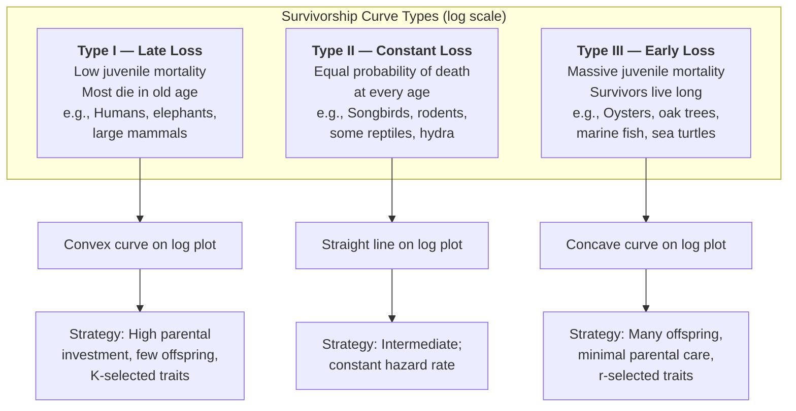
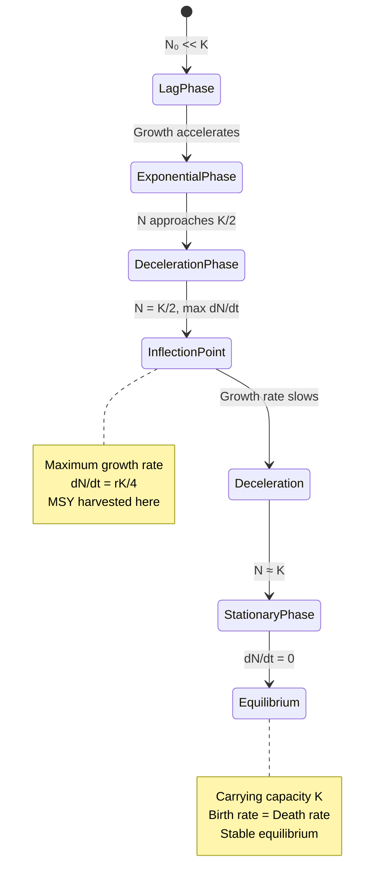
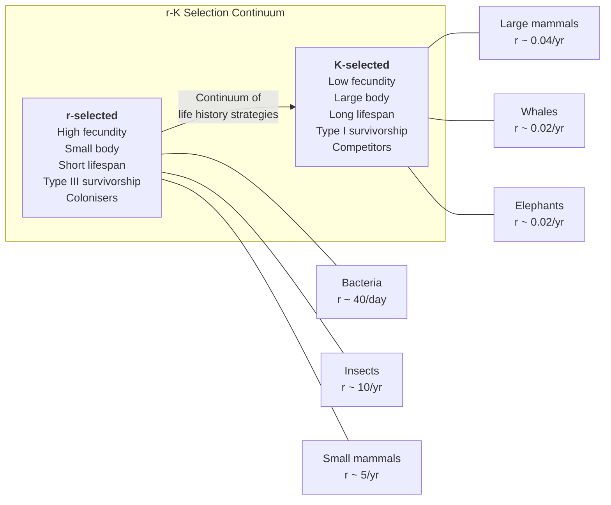
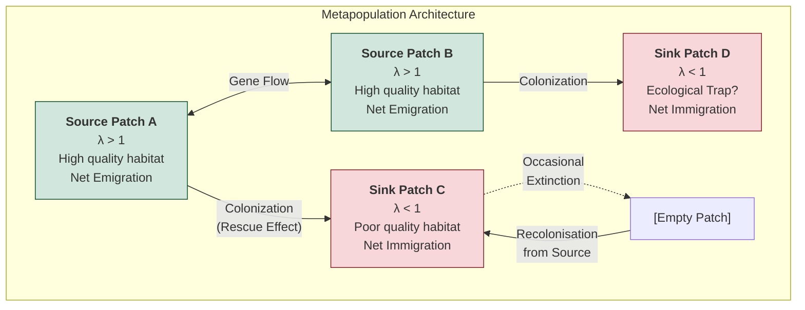

# Population Ecology and Growth Models

\label{sec:unit_X_population_ecology}


<!-- chapter-metadata-badge -->
> Level 3/3 · 75 min read · 100 min lecture · Prerequisites: \cref{sec:unit_V_population_genetics}

## Learning Objectives

1. Describe the key demographic parameters (birth rate, death rate, survivorship, net reproductive rate) of a population.
2. Derive and interpret the exponential and [**logistic growth**](#gl:logistic-growth) equations and apply them to real populations.
3. Construct and interpret [**life table**](#gl:life-table)s and [**survivorship curve**](#gl:survivorship-curve)s (Types I, II, III).
4. Explain the Allee effect and describe how it alters population dynamics in small populations.
5. Apply the Lotka \citep{lotka1925}-Volterra \citep{volterra1926} competition and predator-prey equations and interpret phase-plane outcomes.
6. Describe r vs. K selection strategies and their adaptive ecological contexts.
7. Explain metapopulation dynamics and source-sink models for fragmented habitats.
8. Apply mark-recapture methods and distance sampling to estimate population size.
9. Construct a Leslie matrix from a life table, compute $\lambda_1$ and the stable age distribution, and use sensitivity/elasticity analysis to identify management-critical demographic rates.
10. Distinguish individual-based models from deterministic models, and outline a population viability analysis (PVA) workflow for a small population.

\begin{figure}[htbp]
\centering
\includegraphics[width=0.85\textwidth]{../figures/logistic_growth.png}
\caption{Logistic growth of a population with carrying capacity K. Population size follows dN/dt = rN(1 - N/K); the S-shaped curve asymptotes at K after an inflection at N = K/2.}
\label{fig:unit_X_logistic_growth}
\end{figure}

<!-- alt: Sigmoid population growth curve rising from a small initial size to a plateau at the carrying capacity K. -->

<!-- curriculum-scaffold-start -->
### Study Blueprint

- **Big idea:** Population change reflects births, deaths, movement, age structure, and density dependence.
- **Core concepts:** exponential growth, logistic growth, life tables, population viability.
- **Framework alignment:** Vision & Change: Systems, Evolution, Pathways and transformations of energy and matter; AP Biology: Systems Interactions, Evolution, Energetics; NGSS-style topics: Interdependent Relationships in Ecosystems, Matter and Energy in Organisms and Ecosystems, Natural Selection and Evolution.
- **Model or quantitative lens:** Exponential/logistic growth, mark-recapture, and matrix projection.
- **Data skill:** Use abundance or age-structure data to estimate growth and risk.
- **Practice cadence:** Representing and Describing Data, Statistical Tests and Data Analysis, Argumentation.
- **Common misconception to repair:** Carrying capacity is not a fixed magic number; it changes with resources, interactions, and disturbance.
- **Primary lab:** \nameref{sec:lab_unit_X_population_ecology}.
- **Question bank:** \nameref{sec:q_unit_X_population_ecology}.
- **Transfer task:** Transfer population models to fisheries, invasive species, epidemiology, and endangered species.
- **Bridge to computation:** `biology.ecology.ecology.logistic_growth`.
<!-- curriculum-scaffold-end -->

---

> **Opening Vignette — The Equation That Explains Why Populations Don't Grow Forever**
> 
> In 1838, Belgian mathematician Pierre François Verhulst looked at census data and asked: why don't populations simply grow exponentially forever? His answer was the logistic equation — dN/dt = rN(1 − N/K) — where K, the carrying capacity, captures the idea that resources limit growth. For nearly a century, the logistic model was theoretical. Then in 1934, Russian ecologist Georgy Gause grew two *Paramecium* species in test tubes and observed the sigmoid growth curve Verhulst had predicted: slow growth, rapid growth, leveling off at carrying capacity. His experiments also showed [**competitive exclusion**](#gl:competitive-exclusion) — two species competing for the same [**niche**](#gl:niche) cannot coexist indefinitely. Gause published this in *The Struggle for Existence* at age 23. The logistic model now underlies fisheries management, epidemiology (the SIR model is a direct descendant), conservation minimum viable population estimates, and pandemic projections. Verhulst's equation, written in a 4-page paper with no data, may have saved more lives than any equation since Newton's second law.

### Chapter Roadmap for Population Models and Conservation Decisions

The chapter spans the full pipeline from individuals to metapopulations. Read it as three nested scales:

- **The individual scale.** Population attributes, life tables, survivorship. What you need before any growth equation makes sense.
- **The population scale.** Exponential growth, logistic growth, Allee effects, Lotka-Volterra interactions — the canonical equations and their named modifications.
- **The spatial, structured, and human scale.** r/K life histories, age-structured matrix models, individual-based simulation, population viability analysis, metapopulation dynamics, field-estimation techniques, and human demographic transitions.

For a brief treatment, focus on the core growth mathematics and the applied field-estimation and demographic-transition material. For a full quantitative course, work through most sections including the matrix-model and PVA toolkit, which underlie modern conservation practice.

## Populations as Bounded, Measurable Units

A **population** consists of individuals of a single species (conspecifics) inhabiting a defined area at a given time. Population ecology investigates the factors that regulate population size, density, distribution, and growth over time. Understanding population dynamics is fundamental to wildlife management, conservation biology, epidemiology, and sustainable resource harvest.

### Population Attributes: Size, Density, and Age Structure

Populations are characterized by several measurable attributes:

: Population Attributes: Size, Density, and Age Structure: Attribute and Symbol. {#tbl:unit_X_population_ecology_population_attributes_size_density_and_age_structure}
| Attribute | Symbol | Definition | Units |
| --------- | ------ | ---------- | ----- |
| Census size | $N$ | Total number of individuals | Individuals |
| Population density | $D$ | Individuals per unit area or volume | ind/km$^2$ or ind/L |
| Per capita birth rate | $b$ | Births per individual per time unit | births/ind/time |
| Per capita death rate | $d$ | Deaths per individual per time unit | deaths/ind/time |
| Intrinsic rate of increase | $r$ | $r = b - d$ (can be negative) | time$^{-1}$ |
| Finite rate of increase | λ | $\lambda = e^r$; $\lambda > 1$ growing; $\lambda < 1$ declining | dimensionless |
| Net reproductive rate | $R_0$ | $R_0 = \sum l_x m_x$; female offspring per female per lifetime | offspring/female |
| Generation time | $T$ | $T = \sum x \cdot l_x \cdot m_x / R_0$ | time units |

The fundamental relationship between $R_0$, $T$, and $r$ is the **Euler-Lotka equation**:

\begin{equation}
\sum_{x=0}^{\omega} e^{-rx} l_x m_x = 1
\label{eq:population_ecology_1}
\end{equation}

For approximate computation: $r \approx \ln(R_0) / T$

### Dispersion Patterns Across Space

Individuals within a population are distributed in one of three spatial patterns:

: Dispersion Patterns Across Space: Pattern and Description. {#tbl:unit_X_population_ecology_dispersion_patterns_across_space}
| Pattern | Description | Mechanism | Example |
| ------- | ----------- | --------- | ------- |
| **Clumped** | Aggregated in patches | Resource heterogeneity, social behavior, limited dispersal | Schooling fish, herding ungulates, fungi near rotting logs |
| **Uniform** | Evenly spaced | Territoriality, allelopathy, intraspecific competition | Nesting penguins, creosote bush in deserts |
| **Random** | No predictable pattern | Absence of strong attraction or repulsion | Wind-dispersed seeds in homogeneous habitat |

The **variance-to-mean ratio** ($\sigma^2 / \mu$) of quadrat counts distinguishes these patterns: ratio = 1 (random, Poisson), >1 (clumped, negative binomial), <1 (uniform).

> **Concept Check:** A researcher counts organisms in 20 quadrats and calculates a variance-to-mean ratio of 3.7. What dispersion pattern does this suggest, and what ecological mechanisms might produce it?

---

## Life Tables and Survivorship Curves

A **cohort life table** (also called a horizontal or dynamic life table) tracks a birth cohort from birth until most members die, recording survival and fecundity at each age:

: Dispersion Patterns Across Space: Age (x) and n_x (alive). {#tbl:unit_X_population_ecology_dispersion_patterns_across_space_2}
| Age ($x$) | $n_x$ (alive) | $l_x$ (survivorship) | $d_x$ (deaths) | $q_x$ (mortality rate) | $m_x$ (fecundity) | $l_x m_x$ | $x \cdot l_x m_x$ |
| --------- | -------------- | --------------------- | --------------- | ---------------------- | ------------------ | ---------- | ------------------- |
| 0 | 1000 | 1.000 | 200 | 0.200 | 0 | 0 | 0 |
| 1 | 800 | 0.800 | 200 | 0.250 | 0.5 | 0.400 | 0.400 |
| 2 | 600 | 0.600 | 400 | 0.667 | 1.2 | 0.720 | 1.440 |
| 3 | 200 | 0.200 | 180 | 0.900 | 1.0 | 0.200 | 0.600 |
| 4 | 20 | 0.020 | 20 | 1.000 | 0 | 0 | 0 |

From this table:

\begin{equation}
R_0 = \sum l_x m_x = 0 + 0.400 + 0.720 + 0.200 + 0 = 1.320
\label{eq:population_ecology_2}
\end{equation}

\begin{equation}
T = \frac{\sum x \cdot l_x m_x}{R_0} = \frac{2.440}{1.320} = 1.848 \text{ generations}
\label{eq:population_ecology_3}
\end{equation}

\begin{equation}
r \approx \frac{\ln(R_0)}{T} = \frac{\ln(1.320)}{1.848} = \frac{0.278}{1.848} = 0.150 \text{ per time unit}
\label{eq:population_ecology_4}
\end{equation}

Since $R_0 > 1$, this population is **growing**.

A **static life table** (vertical life table) uses age structure data from a single time point — useful when tracking cohorts is impractical (e.g., long-lived species like elephants or trees). It assumes stable age distribution.

### Survivorship Curves and Age-Specific Mortality

Three canonical survivorship curve types (Pearl 1928; Deevey 1947):


<!-- alt: Graph showing survivorship curves compare age-specific mortality patterns: Type I curves retain most individuals until late life, Type II curves decline steadily, and Type III curves lose many offspring early. -->

*Survivorship curves compare age-specific mortality patterns: Type I curves retain most individuals until late life, Type II curves decline steadily, and Type III curves lose many offspring early.*

**Mathematical representation of survivorship:**

For Type I: $l_x \approx e^{-bx^n}$ where $n > 1$ (Gompertz-Makeham law for human mortality)

For Type II: $l_x = e^{-\mu x}$ (constant hazard rate μ)

For Type III: $l_x \approx e^{-bx^n}$ where $n < 1$

> 🔬 **Clinical Connection — Actuarial Science and Human Survivorship:** Human survivorship curves have shifted dramatically over the past 200 years. In 1800, human survivorship resembled a Type II curve due to high infant and childhood mortality from infectious disease. Modern medicine, sanitation, and nutrition have transformed the human curve to an extreme Type I, with ~99% survival to age 50 in high-income countries. The **Gompertz law of mortality** states that human death rate doubles approximately every 8 years after age 30: $\mu(x) = \alpha e^{\beta x}$. This principle underlies life insurance actuarial tables and pension fund projections.

> **Concept Check:** Sea turtles lay 50-200 eggs per nesting event but about 1 in 1,000 hatchlings survives to reproductive age. Which survivorship curve type does this represent, and what would a conservation program need to achieve (in terms of stage-specific survival rates) to increase population growth?

### Reproductive Value and Future Genetic Contribution

Fisher's **reproductive value** ($v_x$) quantifies the expected future contribution of an individual of age $x$ to population growth:

\begin{equation}
v_x = \frac{e^{rx}}{l_x} \sum_{y=x}^{\omega} e^{-ry} l_y m_y
\label{eq:population_ecology_5}
\end{equation}

Reproductive value peaks at the age of first reproduction in growing populations and declines thereafter. This concept is critical for conservation: protecting age classes with highest $v_x$ yields the greatest impact on population recovery. For sea turtles, subadult and adult females have the highest reproductive value — hence **Turtle Excluder Devices (TEDs)** in fishing nets target this life stage.

---

## Exponential Growth Under Unlimited Resources

When resources are unlimited and the environment exerts no [**density-dependent regulation**](#gl:density-dependent-regulation), population growth is **exponential** (or geometric in discrete-time models):

**Continuous-time model:**

\begin{equation}
\frac{dN}{dt} = rN \quad \Rightarrow \quad N(t) = N_0 e^{rt}
\label{eq:population_ecology_6}
\end{equation}

**Discrete-time model (non-overlapping generations):**

\begin{equation}
N_{t+1} = \lambda N_t \quad \Rightarrow \quad N_t = N_0 \lambda^t
\label{eq:population_ecology_7}
\end{equation}

where $\lambda = e^r$ is the **finite rate of increase**.

**Doubling time:** $t_2 = \frac{\ln 2}{r} \approx \frac{0.693}{r}$

### Real-World Examples of Near-Exponential Growth

: Real-World Examples of Near-Exponential Growth: Population and r. {#tbl:unit_X_population_ecology_real_world_examples_of_near_exponential_growth}
| Population | $r$ | Doubling time | Context |
| ---------- | --- | ------------- | ------- |
| *E. coli* (optimal) | 1.7/hr | 24.5 min | Binary fission; unlimited glucose |
| World human population (1650–1800) | 0.005/yr | 139 yr | Pre-industrial, low density |
| COVID-19 early spread (March 2020) | 0.23/day | 3 days | Unmitigated, no immunity |
| Ring-necked pheasant, Protection Island (1937–42) | 1.02/yr | 0.68 yr | 8 birds introduced; no predators |
| Reindeer on St. Matthew Island (1944–63) | 0.34/yr | 2.0 yr | 29 animals introduced; no wolves |

The St. Matthew Island reindeer population illustrates the **catastrophic crash** that follows unsustainable exponential growth: 29 reindeer introduced in 1944 grew to 6,000 by 1963, then crashed to 42 by 1966 due to overgrazing of lichen habitat. This case study is a classic illustration of **ecological overshoot**.

```python
from biology.ecology import logistic_growth

# Exponential phase (K → ∞ approximation)
result = logistic_growth(
    initial_population=100,
    growth_rate=0.5,
    carrying_capacity=1e12,   # effectively unlimited
    time_steps=20
)
print(f"After 20 time steps: N = {result.trajectory[-1]:.0f}")
print(f"Predicted (analytic): N = {100 * 2.718**( 0.5*20 ):.0f}")
```

> **Concept Check:** If a bacterial culture starts with 500 cells and has $r = 1.4$/hr, how many cells will be present after 6 hours? What assumptions does this calculation require?

---

## Logistic Growth and Density Dependence

> **Mathematical Background:** Population growth models use differential equations. For a review of exponential and logistic ODEs and their closed-form solutions, see \nameref{sec:appendix_math_review}.

As $N$ approaches the **carrying capacity** ($K$), intraspecific competition for resources reduces the per capita growth rate. The **logistic growth equation** \citep{verhulst1838} incorporates this density dependence:

\begin{equation}
\frac{dN}{dt} = rN\left(1 - \frac{N}{K}\right)
\label{eq:population_ecology_8}
\end{equation}

The term $(1 - N/K)$ is the **density-dependence factor** (or unused portion of carrying capacity), and it bends exponential growth into the S-shaped trajectory of \cref{fig:unit_X_logistic_growth} with the following key properties:

- When $N \ll K$: growth is approximately exponential ($dN/dt \approx rN$)
- When $N = K/2$: $dN/dt$ is **maximized** (inflection point of the sigmoid curve)
- When $N = K$: $dN/dt = 0$ (population is at equilibrium)
- When $N > K$: $dN/dt < 0$ (population declines toward $K$)

**Analytical solution:**

\begin{equation}
N(t) = \frac{K}{1 + \left(\frac{K - N_0}{N_0}\right)e^{-rt}}
\label{eq:population_ecology_9}
\end{equation}


<!-- alt: State diagram showing logistic growth accelerates when population size is far below carrying capacity, reaches maximum growth near K/2, and slows as density-dependent limits dominate. -->

*Logistic growth accelerates when population size is far below carrying capacity, reaches maximum growth near K/2, and slows as density-dependent limits dominate.*

### Density-Dependent Factors

: Density-Dependent Factors: Factor and Mechanism. {#tbl:unit_X_population_ecology_density_dependent_factors}
| Factor | Mechanism | Example |
| ------ | --------- | ------- |
| **Intraspecific competition** | Scramble or contest competition for food, space, mates | Flour beetles (*Tribolium*): cannibalism increases at high density |
| **Disease transmission** | Contact rate increases with density | Distemper in Serengeti lions; COVID-19 in mink farms |
| **Predation** | Predators aggregate at high-density prey patches | Functional response Type III (sigmoidal) |
| **Territoriality** | [**Dominant**](#gl:dominant) individuals exclude subordinates | Red grouse: territorial males hold heather patches |
| **Toxic waste accumulation** | Metabolic byproducts inhibit growth | Yeast: ethanol accumulation limits [**fermentation**](#gl:fermentation) |

### Density-Independent Factors

Some factors affect populations regardless of density:

- **Weather extremes** (frost, drought, hurricanes)
- **Volcanic eruptions**, wildfires, floods
- **Pesticide application**

In practice, most populations are regulated by a combination of density-dependent and density-independent factors.

### Maximum Sustainable Yield (MSY)

From the logistic equation, the maximum absolute growth rate occurs at $N = K/2$:

\begin{equation}
\text{MSY} = \frac{rK}{4}
\label{eq:population_ecology_10}
\end{equation}

Fisheries and wildlife management use MSY to set harvest quotas. However, MSY has significant limitations:

1. **Assumes logistic growth** — real populations often show non-logistic dynamics
2. **K and r are difficult to estimate** — environmental stochasticity changes both
3. **Ignores age/size structure** — harvesting large, reproductively valuable individuals disproportionately impacts growth
4. **No safety margin** — harvesting exactly at MSY leaves no [**buffer**](#gl:buffer) for environmental variation

> 🔬 **Clinical Connection — Pacific Sardine Collapse:** The Pacific sardine (*Sardinops sagax*) fishery collapsed in the 1940s-1950s, with the population crashing from 3 million tonnes to near-zero. The collapse resulted from harvesting above MSY during a period when ocean conditions (Pacific Decadal Oscillation) shifted unfavorably, reducing $K$. The combined effect of over-exploitation and environmental change was catastrophic. This case led to the development of **precautionary reference points** in modern fisheries management, where harvest targets are set below MSY (typically at 0.5-0.8 MSY) to provide a buffer.

```python
from biology.ecology import logistic_growth

result = logistic_growth(
    initial_population=10,
    growth_rate=0.8,
    carrying_capacity=1000,
    time_steps=30
)
# Find maximum per-capita growth (should be near K/2 = 500)
growth_rates = [result.trajectory[i+1] - result.trajectory[i]
                for i in range(len(result.trajectory)-1)]
peak_N = result.trajectory[growth_rates.index(max(growth_rates))]
print(f"Peak growth at N ≈ {peak_N:.0f} (expect K/2 = 500)")
```

### Extensions of the Logistic Model

**Theta-logistic model** — allows flexible density dependence:

\begin{equation}
\frac{dN}{dt} = rN\left[1 - \left(\frac{N}{K}\right)^\theta\right]
\label{eq:population_ecology_11}
\end{equation}

When $\theta = 1$: standard logistic. When $\theta > 1$: density effects are weak until $N$ is close to $K$ (concave per-capita growth). When $\theta < 1$: density effects are strong even at low $N$ (convex). Empirical estimates for large mammals typically give $\theta \approx 2-7$ (Sibly et al. 2005, *Science*), meaning density dependence is weaker than the standard logistic assumes.

**Time-lagged logistic model:**

\begin{equation}
\frac{dN}{dt} = rN\left(1 - \frac{N(t-\tau)}{K}\right)
\label{eq:population_ecology_12}
\end{equation}

When the time lag τ is large relative to $1/r$, the population can **overshoot** $K$ and exhibit damped oscillations, limit cycles, or even chaos (May 1976, *Nature*).

> **Concept Check:** A population of deer has $r = 0.3$/yr and $K = 5000$. Calculate MSY and the population size at which it occurs. If the current population is 4000, how many deer can be sustainably harvested per year?

---

## The Allee Effect

The **Allee effect** \citep{allee1931} occurs when per capita fitness *decreases* at low population density — the opposite of standard logistic density-dependence. This creates a positive feedback loop where small populations become increasingly vulnerable.

### Strong vs. Weak Allee Effects

**Strong Allee effect** — per capita growth rate becomes negative below a threshold:

\begin{equation}
\frac{dN}{dt} = rN\left(\frac{N}{A} - 1\right)\left(1 - \frac{N}{K}\right)
\label{eq:population_ecology_13}
\end{equation}

where $A$ = **Allee threshold**. Below $A$, the population declines deterministically to extinction. \cref{fig:unit_X_allee_threshold_dynamics} compares trajectories for starting densities below, at, and above this threshold. There are three equilibria: $N = 0$ (stable), $N = A$ (unstable), and $N = K$ (stable).

\begin{figure}[htbp]
\centering
\includegraphics[width=0.85\textwidth]{../figures/allee_threshold_dynamics.png}
\caption{Strong Allee-effect threshold dynamics. Initial population sizes below, at, and above the Allee threshold show extinction, unstable threshold persistence, and recovery toward carrying capacity.}
\label{fig:unit_X_allee_threshold_dynamics}
\end{figure}
<!-- alt: Line plot of population size over time for three starting densities relative to an Allee threshold. The below-threshold trajectory declines to zero, the threshold trajectory stays near the unstable boundary, and the above-threshold trajectory grows toward carrying capacity. -->

**Weak Allee effect** — per capita growth rate decreases at low density but remains positive. No threshold exists; the population can recover from any positive size, but growth is slower than expected at low $N$.

### Mechanisms of Allee Effects

: Mechanisms of Allee Effects: Mechanism and Example. {#tbl:unit_X_population_ecology_mechanisms_of_allee_effects}
| Mechanism | Example | Effect on fitness |
| --------- | ------- | ----------------- |
| **Mate finding** | Ivory-billed woodpecker; many marine invertebrates | Low density → failed mate encounter → reduced reproduction |
| **Predator satiation** | Mast-seeding trees (oaks, beeches) | Below threshold seed output → disproportionate predation loss |
| **Cooperative breeding/hunting** | African wild dogs (pack size ≥ 5 for efficient hunting) | Small packs → insufficient prey capture → starvation |
| **Cooperative defense** | Muskoxen forming defensive circles | Too few adults → predators penetrate defense |
| **Genetic diversity** | Florida panther (pre-1995, $N_e \approx 25$) | Small $N$ → inbreeding depression → reduced fitness |
| **Pollination failure** | Rare plants in fragmented meadows | Low density → pollinators don't visit → seed set fails |
| **Environmental conditioning** | Soil [**microbiome**](#gl:microbiome) enrichment by plant roots | Few plants → soil biota depauperate → poor seedling establishment |

Social insects add a colony-level version of the same logic. In a [**eusocial**](#gl:eusociality) colony, a queen, workers, brood, nest architecture, stored resources, and microbial partners form one demographic unit. A founding queen or tiny fragment may fail even in good habitat because there are too few workers to forage, thermoregulate, defend the nest, rear brood, and maintain the fungus garden or gut-symbiont pathway. Once the worker force crosses a threshold, division of labor and positive feedback can make growth accelerate. The Allee effect therefore applies not only to populations of individuals but also to the minimum viable size of cooperative groups \citep{bourke2011principles}.

Stephens et al. (1999, *Trends Ecol. Evol.*) distinguished the **component Allee effect** (reduction in any fitness component at low density) from the **demographic Allee effect** (reduction in per capita population growth rate). A species may experience component Allee effects in reproduction without a demographic Allee effect if compensating survival increases at low density offset the reproductive reduction.

```python
from biology.ecology import allee_strong_growth

# Strong Allee: dN/dt = r N (N/A - 1)(1 - N/K) — same form as Eq. above
below = allee_strong_growth(N0=45.0, r=0.5, A=50.0, K=1000.0, t_end=25.0, steps=2500)
above = allee_strong_growth(N0=55.0, r=0.5, A=50.0, K=1000.0, t_end=40.0, steps=4000)
print(f"Below A: N_final ≈ {below.populations[-1]:.1f}")
print(f"Above A: N_final ≈ {above.populations[-1]:.1f}")
```

> 🔬 **Clinical Connection — Northern White Rhinoceros:** The northern white rhinoceros (*Ceratotherium simum cottoni*) represents a tragic Allee effect in action. As of 2024, two females remain (Najin and Fatu at Ol Pejeta Conservancy, Kenya). Even with preserved sperm and IVF technology, the population has fallen below plausible demographic and genetic recovery thresholds for conventional breeding. Stem cell-derived [**gamete**](#gl:gamete)s from banked fibroblasts represent a highly experimental rescue pathway rather than a routine conservation tool. This case illustrates that for species with strong Allee effects, conservation intervention must occur while demographic options and genetic variation are still large enough to matter.

> **Concept Check:** A whale population has an Allee threshold of $A = 200$ individuals. Current population is $N = 180$. The intrinsic growth rate (in the absence of Allee effects) is $r = 0.04$/yr. What will happen to this population without intervention? What minimum number of individuals would need to be translocated to push the population above the threshold?

---

## Lotka-Volterra Competition and Predator-Prey


\begin{figure}[htbp]
\centering
\includegraphics[width=0.85\textwidth]{../figures/lotka_volterra.png}
\caption{Lotka--Volterra predator--prey dynamics: oscillating population cycles of prey and predator plotted over time and as a phase-plane portrait.}
\label{fig:unit_X_lotka_volterra}
\end{figure}
<!-- alt: Two-panel figure — left panel: time series of prey and predator population sizes showing offset oscillating cycles (predator peak lags prey peak); right panel: phase-plane plot of predator vs prey densities tracing a closed counter-clockwise orbit around the coexistence equilibrium. -->


### Interspecific Competition and Niche Overlap

Two species sharing a limiting resource compete. The Lotka-Volterra competition model:

\begin{equation}
\frac{dN_1}{dt} = r_1 N_1 \left(1 - \frac{N_1 + \alpha_{12} N_2}{K_1}\right)
\label{eq:population_ecology_14}
\end{equation}

\begin{equation}
\frac{dN_2}{dt} = r_2 N_2 \left(1 - \frac{N_2 + \alpha_{21} N_1}{K_2}\right)
\label{eq:population_ecology_15}
\end{equation}

The **competition coefficient** $\alpha_{12}$ represents the per-capita effect of species 2 on species 1, expressed in units of species-1 equivalents. If $\alpha_{12} = 0.5$, each individual of species 2 has half the competitive impact of one individual of species 1.

**Zero-growth isoclines** (setting $dN/dt = 0$):
- Species 1 isocline: $N_1 = K_1 - \alpha_{12}N_2$ (line from $K_1$ on $N_1$-axis to $K_1/\alpha_{12}$ on $N_2$-axis)
- Species 2 isocline: $N_2 = K_2 - \alpha_{21}N_1$ (line from $K_2$ on $N_2$-axis to $K_2/\alpha_{21}$ on $N_1$-axis)

**Phase-plane outcomes:**

: Interspecific Competition and Niche Overlap: Condition and Outcome. {#tbl:unit_X_population_ecology_interspecific_competition_and_niche_overlap}
| Condition | Outcome | Biological interpretation |
| --------- | ------- | ------------------------- |
| $K_1 > K_2/\alpha_{12}$ and $K_2 < K_1/\alpha_{21}$ | Species 1 wins; species 2 excluded | Species 1 tolerates competition better |
| $K_2 > K_1/\alpha_{21}$ and $K_1 < K_2/\alpha_{12}$ | Species 2 wins; species 1 excluded | Species 2 tolerates competition better |
| $K_1 < K_2/\alpha_{12}$ and $K_2 < K_1/\alpha_{21}$ | **Stable coexistence** | Intraspecific > interspecific competition (niche differentiation) |
| $K_1 > K_2/\alpha_{12}$ and $K_2 > K_1/\alpha_{21}$ | **Unstable equilibrium** (priority effect) | Interspecific > intraspecific; winner depends on initial $N$ |

**Chesson's modern coexistence theory** (Chesson 2000, *Annu. Rev. Ecol. Syst.*): Stable coexistence requires that intraspecific competition exceed interspecific competition: $\alpha_{11}\alpha_{22} > \alpha_{12}\alpha_{21}$, or equivalently, niche overlap $< 1$. Two mechanisms enable this:

1. **Stabilizing mechanisms** — increase niche differentiation (negative frequency dependence; rare species advantage)
2. **Equalising mechanisms** — reduce fitness differences between species (similar competitive abilities)

### Lotka-Volterra Predator-Prey

\begin{equation}
\frac{dV}{dt} = \alpha V - \beta VP \quad \text{(prey: grow in absence of predator; decline with encounters)}
\label{eq:population_ecology_16}
\end{equation}

\begin{equation}
\frac{dP}{dt} = \delta VP - \gamma P \quad \text{(predator: grow via prey; decline without prey)}
\label{eq:population_ecology_17}
\end{equation}

This system produces **neutrally stable oscillations** with period $\approx 2\pi/\sqrt{\alpha\gamma}$ and amplitude that depends on initial conditions, tracing the offset prey--predator cycles and closed phase-plane orbit shown in \cref{fig:unit_X_lotka_volterra}.

**Functional responses** \citep{holling1959} describe the per capita predation rate as a function of prey density:

: Lotka-Volterra Predator-Prey: Type and Equation. {#tbl:unit_X_population_ecology_lotka_volterra_predator_prey}
| Type | Equation | Shape | Example |
| ---- | -------- | ----- | ------- |
| **Type I** | $f(V) = aV$ | Linear | Filter feeders (whale sharks, baleen whales) |
| **Type II** | $f(V) = \frac{aV}{1 + ahV}$ | Decelerating (hyperbolic) | Most predators; handling time $h$ limits intake |
| **Type III** | $f(V) = \frac{aV^2}{1 + ahV^2}$ | Sigmoidal | Predators that switch prey; search image formation |

The Type II functional response is also known as the **Michaelis-Menten** or **disc equation**. The parameter $a$ = attack rate and $h$ = handling time per prey item. Maximum consumption rate = $1/h$.

Type III responses are stabilizing because at low prey density, per-capita predation risk is low (predator switching to alternative prey), creating a **low-density refuge**.

**Numerical response:** predator population growth rate as a function of prey density — driven by the functional response but with a time lag (gestation, maturation).

```python
from biology.ecology import lotka_volterra

result = lotka_volterra(
    100.0, 20.0, 1.0, 0.1, 0.075, 1.5, t_end=30.0, steps=300,
)
print(f"Prey range: {min(result.prey):.0f}–{max(result.prey):.0f}")
print(f"Predator range: {min(result.predator):.0f}–{max(result.predator):.0f}")
```

### Lynx-Hare Cycle: A Case Study

The snowshoe hare (*Lepus americanus*) and Canada lynx (*Lynx canadensis*) display coupled ~10-year population cycles across boreal Canada, documented from Hudson's Bay Company fur trading records (1845-1935; Keith 1963). Modern analysis reveals the cycle is more complex than simple Lotka-Volterra:

1. **Predation** accounts for ~60% of the cycle driver (Krebs et al. 2001, *Science*)
2. **Food quality** — at high hare density, overgrazing induces plant chemical defenses (phenolic compounds in willow/birch browse), reducing hare food quality (~20% of cycle)
3. **Stress physiology** — high density and predation risk elevate [**cortisol**](#gl:cortisol), suppressing reproduction (~20% of cycle)
4. The **tri-trophic interaction** (vegetation-hare-lynx) is necessary to explain the observed amplitude and period

> **Concept Check:** In the basic Lotka-Volterra predator-prey model, the oscillations are neutrally stable. What modification to the model would produce damped oscillations converging to a stable equilibrium? (Hint: consider what happens when you add density dependence to the prey equation.)

---

## r vs. K Selection and Life History Theory

\citet{macarthur1967} proposed that [**natural selection**](#gl:natural-selection) shapes life histories along an r-K continuum:

: Lynx-Hare Cycle: A Case Study: Trait and [r-strategist](#gl:r-strategist)s. {#tbl:unit_X_population_ecology_lynx_hare_cycle_a_case_study}
| Trait | [**r-strategist**](#gl:r-strategist)s | [**K-strategist**](#gl:k-strategist)s |
| ----- | ------------- | ------------- |
| Body size | Small | Large |
| Life span | Short | Long |
| Maturation time | Fast | Slow |
| Offspring number | Many; small | Few; large |
| Parental investment | Minimal | Extensive |
| Population dynamics | Exponential; boom/bust; opportunistic | Near K; stable; competitive |
| Environmental tolerance | High variability; unpredictable | Low variability; stable niches |
| Survivorship curve | Type III | Type I |
| Examples | Dandelions, flies, bacteria, aphids | Elephants, whales, great apes, condors |


<!-- alt: Graph showing life-history strategies compare high-fecundity colonizers with slower, competitive species; real organisms vary continuously rather than falling into two fixed bins. -->

*Life-history strategies compare high-fecundity colonizers with slower, competitive species; real organisms vary continuously rather than falling into two fixed bins.*

### Beyond r-K: Modern Life History Theory

The r-K framework has been largely superseded by more nuanced models:

**Stearns' (1992) demographic classification** uses age-specific mortality patterns rather than a single r-K axis, predicting that:
- High juvenile mortality → early maturation, high fecundity
- High adult mortality → delayed maturation, high reproductive effort per event
- Variable mortality → bet-hedging strategies

**Bet-hedging** (Philippi & Seger 1989, *Trends Ecol. Evol.*): In variable environments, intermediate-risk reproductive strategies outperform extreme approaches by reducing **variance** in fitness rather than maximizing mean fitness:
- **Conservative bet-hedging:** Low-variance strategy (e.g., typically produce moderate number of offspring)
- **Diversified bet-hedging:** Produce variable [**phenotype**](#gl:phenotype)s (e.g., desert annual plants with variable seed dormancy — don't germinate most seeds in a single good year)

**Grime's CSR triangle** (plants): Competitors (large, slow), Stress-tolerators (tough, slow), Ruderals (fast, weedy) — a three-way classification rather than binary r-K.

> 🔬 **Clinical Connection — Human Life History and Demographic Transition:** Human populations have undergone a dramatic **demographic transition** as societies industrialise: from high birth rates and high death rates (Stage 1) through declining death rates (Stage 2, rapid population growth), declining birth rates (Stage 3), to low birth/death rates (Stage 4). Some developed nations are now in Stage 5 with birth rates below replacement ($R_0 < 1$). Japan's population declined by ~800,000 in 2023 alone ($r \approx -0.006$/yr). The demographic transition illustrates a shift from r-selected to K-selected reproductive strategy within a single species as environmental conditions change.

---

## Age-Structured Population Models and the Leslie Matrix

The scalar growth models treat most individuals as demographically identical. Real populations are structured by age (or stage), and demographic rates are highly age-specific: a one-year-old salmon and a four-year-old salmon contribute very differently to population growth. **Matrix population models** \citep{lotka1925} make this structure explicit and underlie virtually every modern population viability analysis, [**fisheries**](#gl:fisheries) stock assessment, and conservation triage exercise.

### Leslie Matrix Construction

A **Leslie matrix** $\mathbf{L}$ is a square non-negative matrix that projects an age-classified population vector $\mathbf{n}(t) = (n_0, n_1, \ldots, n_\omega)^T$ from time $t$ to $t+1$:

\begin{equation}
\mathbf{n}(t+1) = \mathbf{L}\,\mathbf{n}(t)
\label{eq:unit_X_leslie_projection}
\end{equation}

For a population with maximum age ω, the Leslie matrix has age-specific fecundities $F_x = l_x m_x / l_{x-1}$ on the top row and survival probabilities $P_x = l_{x+1}/l_x$ on the sub-diagonal:

\begin{equation}
\mathbf{L} = \begin{pmatrix}
F_0 & F_1 & F_2 & \cdots & F_{\omega-1} & F_\omega \\
P_0 & 0   & 0   & \cdots & 0           & 0 \\
0   & P_1 & 0   & \cdots & 0           & 0 \\
0   & 0   & P_2 & \cdots & 0           & 0 \\
\vdots & \vdots & \vdots & \ddots & \vdots & \vdots \\
0   & 0   & 0   & \cdots & P_{\omega-1} & 0
\end{pmatrix}
\label{eq:unit_X_leslie_matrix}
\end{equation}

By the **Perron–Frobenius theorem**, $\mathbf{L}$ has a unique positive dominant eigenvalue $\lambda_1$ — this is the **asymptotic finite rate of increase**. The associated right eigenvector $\mathbf{w}$ gives the **stable age distribution** (the proportions $n_x/N$ to which the population converges) and the left eigenvector $\mathbf{v}$ gives the **age-specific reproductive value** $v_x$ (\cref{eq:population_ecology_5}, but now read off the matrix directly).

\begin{equation}
\mathbf{L}\mathbf{w} = \lambda_1 \mathbf{w}, \qquad \mathbf{v}^T \mathbf{L} = \lambda_1 \mathbf{v}^T
\label{eq:unit_X_leslie_eigen}
\end{equation}

The Euler-Lotka equation (\cref{eq:population_ecology_1}) is the characteristic polynomial of $\mathbf{L}$ — every demographic statement made in the life-table and survivorship discussion is recoverable from the matrix.

### Sensitivity and Elasticity Analysis

Conservation managers rarely have the luxury of changing every demographic rate. Which rate, if perturbed by 1%, would change $\lambda_1$ the most? **Sensitivity** $s_{ij}$ and **elasticity** $e_{ij}$ answer this:

\begin{equation}
s_{ij} = \frac{\partial \lambda_1}{\partial a_{ij}} = \frac{v_i w_j}{\langle \mathbf{v}, \mathbf{w} \rangle}, \qquad e_{ij} = \frac{a_{ij}}{\lambda_1}\,s_{ij}
\label{eq:unit_X_sensitivity_elasticity}
\end{equation}

where $a_{ij}$ is the matrix entry, $\langle \mathbf{v}, \mathbf{w}\rangle = \sum_x v_x w_x$, and elasticities sum to one ($\sum_{ij} e_{ij} = 1$), making them directly interpretable as proportional contributions.

: Sensitivity and Elasticity Analysis. {#tbl:unit_X_population_ecology_sensitivity_and_elasticity_analysis}
| Quantity | Interpretation | Use |
| -------- | -------------- | --- |
| Sensitivity $s_{ij}$ | Absolute change in $\lambda_1$ per unit change in $a_{ij}$ | Rates measured on different scales (survival 0–1, fecundity 0–$\infty$) — direct comparison misleading |
| Elasticity $e_{ij}$ | Proportional change in $\lambda_1$ per proportional change in $a_{ij}$ | Comparing across rates; identifying highest-leverage management target |

**Worked Example — Loggerhead sea turtle.** Crouse, Crowder & Caswell (1987, *Ecology*) built a 7-stage Leslie-style matrix for *Caretta caretta* in the southeastern USA. Hatchling protection (the dominant 1980s strategy) had elasticity $\approx 0.04$, whereas adult survival had elasticity $\approx 0.20-0.30$. A 1 % increase in adult survival raised $\lambda_1$ five to seven times more than a 1 % increase in egg-stage survival. This elasticity result drove the regulatory adoption of **Turtle Excluder Devices** in shrimp trawls — a direct policy outcome of matrix sensitivity analysis. The same logic explains why protecting reproductive-aged females beats protecting eggs, echoing the reproductive-value argument developed earlier.

> **Concept Check:** A 3-stage matrix has elasticities $e_{\text{juvenile survival}} = 0.05$, $e_{\text{subadult survival}} = 0.35$, $e_{\text{adult survival}} = 0.50$, $e_{\text{adult fecundity}} = 0.10$. Which life-stage transition should a recovery plan target first, and why is "save the babies" intuition misleading here?

### Stage-Structured Generalisations

Many organisms are better classified by **stage** (size, instar, reproductive status) than by age — trees, corals, and indeterminate-growth fish are obvious examples. The **Lefkovitch matrix** generalizes Leslie by allowing positive entries on the diagonal (probability of remaining in the same stage) and on multiple sub-diagonals (skipping stages, regression). The eigen-analysis machinery is shared with Leslie models, while the biological interpretation of each entry changes.

```python
import numpy as np

# Loggerhead-style 5-stage matrix (illustrative)
L = np.array([
    [0.00, 0.00, 0.00, 4.66, 61.9],   # fecundities (eggs, hatchlings)
    [0.68, 0.74, 0.00, 0.00, 0.00],   # juvenile survival
    [0.00, 0.05, 0.66, 0.00, 0.00],   # subadult transition
    [0.00, 0.00, 0.02, 0.68, 0.00],   # novice breeder
    [0.00, 0.00, 0.00, 0.06, 0.81],   # mature breeder
])
eigvals, eigvecs = np.linalg.eig(L)
lam1 = max(eigvals.real)
w = eigvecs[:, np.argmax(eigvals.real)].real
w = w / w.sum()
print(f"lambda_1 = {lam1:.3f}")
print(f"stable stage distribution = {np.round(w, 3)}")
# elasticity of adult survival — the loggerhead conservation lever
```

---

## Individual-Based Population Models and Stochastic Simulation

Matrix models are deterministic and assume infinite, well-mixed populations. Two regimes break those assumptions and demand a different tool:

1. **Small populations** (conservation contexts) where demographic stochasticity dominates — a population of 30 condors with mean $\lambda_1 = 1.05$ can still go extinct from an unlucky run of male-heavy chicks.
2. **Heterogeneous individuals** — variation in body size, behavior, territory quality, or local conditions that cannot be averaged into a mean rate without losing the dynamics.

**Individual-based models (IBMs)**, also called agent-based models, simulate each organism explicitly. Births, deaths, dispersal, and interactions are drawn as random events from probability distributions parameterised by individual attributes. Across many replicate runs, IBMs produce *distributions* of outcomes (extinction probability, time to recovery) rather than single trajectories.

: Stage-Structured Generalisations: Advantage and Why IBMs deliver it. {#tbl:unit_X_population_ecology_stage_structured_generalisations}
| Advantage | Why IBMs deliver it |
| --------- | ------------------- |
| Demographic stochasticity | Discrete birth/death events — no fractional individuals |
| Individual heterogeneity | Each agent carries its own age, size, genotype, location |
| Spatial structure | Landscape grids, dispersal kernels, local interactions |
| Emergent dynamics | Allee effects, [**self-organization**](#gl:self-organization), threshold behaviors arise naturally |
| Complex behaviors | Mate choice, learning, territoriality without analytical closed form |

**Limitations:** IBMs trade analytical clarity for realism. They are computationally expensive (millions of replicates needed for tail-probability estimates), parameter-hungry, and validation is harder than for closed-form models. Best practice: build the simplest model that captures the focal mechanism, then add complexity primarily when justified by data (the **Pattern-Oriented Modeling** philosophy of Grimm & Railsback 2005).

> **Concept Check:** Two black-footed ferret populations both have mean $\lambda_1 = 1.02$. Population A has $N = 500$; population B has $N = 25$. Why does the IBM extinction probability differ vastly between them despite identical mean growth rates? What would a deterministic model predict?

---

## Population Viability Analysis and Extinction-Risk Forecasting

**Population viability analysis** integrates matrix models and stochastic simulation into a quantitative extinction-risk forecast. PVA is the formal answer to "How long does this species have, and what intervention buys the most time?" — required by the U.S. Endangered Species Act, the IUCN Red List Criterion E, and most national recovery plans.

### Inputs to a PVA

: Inputs to a PVA: Input and Source. {#tbl:unit_X_population_ecology_inputs_to_a_pva}
| Input | Source | Why it matters |
| ----- | ------ | -------------- |
| Stage- or age-specific vital rates | Mark-recapture, life table | Mean dynamics |
| Variance in vital rates | Long-term monitoring | Environmental stochasticity |
| Catastrophe frequency and severity | Disturbance history | Tail risk (fire, disease, storm) |
| Density dependence (often theta-logistic, \cref{eq:population_ecology_11}) | Time-series fits | Carrying-capacity feedback |
| Initial age/stage distribution | Field census | Starting condition |
| Habitat capacity $K$ | Resource estimates | Ceiling on population |
| Inbreeding cost on vital rates | Pedigree or ROH | Genetic stochasticity (link to \cref{sec:unit_X_biomes_and_conservation}) |

### Outputs and Decision Rules

The two headline outputs are **extinction probability** $P_{ext}(T)$ over a horizon $T$ (commonly 100 years or 100 generations) and **mean time to extinction** $\bar{T}_{ext}$.

\begin{equation}
P_{ext}(T) = \Pr\bigl(\,N(t) < N_{\text{crit}}\ \text{for some } t \le T\bigr)
\label{eq:unit_X_extinction_probability}
\end{equation}

The threshold $N_{\text{crit}}$ (often called the **quasi-extinction threshold**) is set above zero — typically the Allee threshold $A$ (\cref{eq:population_ecology_13}) or a number below which the population is "functionally extinct." Hitting $N_{\text{crit}}$ counts as failure even if the simulation has not bottomed out.

The **minimum viable population (MVP)** in standard usage is the smallest $N_0$ such that $P_{ext}(100\,\text{yr}) \le 0.05$. Reed et al. (2003, *Biol. Conserv.*) reviewed PVAs across 102 vertebrates and found MVPs clustering at 5,000–7,000 adults — far above the classical $N_e = 500$ rule of thumb (which ignores demographic and environmental stochasticity) and a key empirical result that pushed conservation toward the **100/1000 rule** discussed in \cref{sec:unit_X_biomes_and_conservation}.

### Worked Example — California Condor PVA

In 1982 the known California condor (*Gymnogyps californianus*) population had fallen to 22 birds. A PVA built around captive-breeding fecundity, juvenile mortality from lead poisoning, and stochastic catastrophe (wildfire) gave $P_{ext}(50\,\text{yr}) > 0.99$ for the no-intervention scenario. The same model showed $P_{ext}(50\,\text{yr}) < 0.10$ if (i) the remaining birds were captured for breeding, and (ii) released birds were protected from lead ammunition. The captive-breeding decision, controversial at the time, was justified directly by PVA elasticities — adult survival and juvenile lead mortality had the largest leverage on $\lambda_1$. The wild population is now > 250 (see \cref{sec:unit_X_biomes_and_conservation}).

### Limitations and Honest Use

PVA outputs depend on the model structure, input data, and uncertainty assumptions; small-population data are often sparse and biased toward observed survivors. Best practice (Beissinger & Westphal 1998, *J. Wildl. Manage.*):

- Treat absolute $P_{ext}$ values with skepticism; use *relative* comparisons across management scenarios
- Report sensitivity to parameter uncertainty (Monte Carlo over input distributions)
- Update PVAs as monitoring data accumulate — they are living tools, not one-off reports
- Avoid the temptation to over-parameterise; structural uncertainty often exceeds parameter uncertainty

> **Concept Check:** A PVA gives $P_{ext}(100\,\text{yr}) = 0.30$ under current management and 0.05 under a proposed habitat-corridor intervention. Should you trust the absolute numbers, the difference, or both? What three sources of uncertainty would you investigate before recommending the corridor?

---

## Metapopulation Dynamics Across Habitat Patches

A **metapopulation** (Levins 1969; Hanski 1994) is a "population of populations" — a set of spatially separated subpopulations (patches) connected by dispersal. Local extinctions are balanced by recolonisation from other patches.

In conservation practice, the important question is usually whether dispersal is functional, not whether habitat patches are merely drawn on a map. Roads, dams, fences, heat waves, disease, and behavioral avoidance can lower effective colonization even when patches appear close. Corridor design therefore needs demographic monitoring, genetic connectivity, mortality-risk mapping, and sensitivity analysis for $c$ and $e$, because a corridor that increases movement can still fail if it also increases mortality or spreads disease.

### The Levins Model

\begin{equation}
\frac{dp}{dt} = cp(1-p) - ep
\label{eq:population_ecology_18}
\end{equation}

where:
- $p$ = proportion of occupied patches
- $c$ = colonization rate
- $e$ = extinction rate per patch

At equilibrium: $\hat{p} = 1 - e/c$

The metapopulation persists if $e/c < 1$ (colonization rate exceeds extinction rate). If habitat patches are destroyed (reducing total patches available), the effective $c$ decreases, potentially pushing $e/c > 1$ and causing **metapopulation collapse**.

### Source-Sink Dynamics \citep{pulliam1988}

Patches differ in leverage:

: Source and sink patch roles in metapopulation dynamics. {#tbl:unit_X_population_ecology_source_sink_dynamics_citep_pulliam1988}
| Patch type | Growth rate | Role |
| ---------- | ----------- | ---- |
| **Source** | $\lambda > 1$ | Produces surplus individuals; net emigration |
| **Sink** | $\lambda < 1$ | Cannot sustain itself; relies on immigration from sources |

A population can persist in sink habitats indefinitely if immigration from sources is sufficient. This has profound conservation implications: protecting source habitats is critical, while sink habitats may appear to support populations but are "ecological traps" without the source.

### Rescue Effect and Connectivity

The **rescue effect** (Brown & Kodric-Brown 1977): immigration from nearby patches prevents or delays local extinction. This means:
- Closely spaced patches have lower extinction rates
- Habitat corridors increase connectivity and reduce local extinction
- Isolation increases both extinction probability and time to recolonisation

> **Concept Check:** A metapopulation has 100 habitat patches with $c = 0.3$ and $e = 0.1$. Calculate the equilibrium proportion of occupied patches. If 40% of patches are destroyed (reducing total to 60 patches), what happens to the metapopulation? (Consider how reduced patch number affects colonization rate.)

---

### Visualizing Metapopulation and Source-Sink Dynamics


<!-- alt: Graph showing metapopulation diagrams distinguish source patches with lambda > 1 from sink or trap patches that persist through immigration despite local decline. -->

*Metapopulation diagrams distinguish source patches with lambda > 1 from sink or trap patches that persist through immigration despite local decline.*

---

## Estimating Population Size

### Mark-Recapture Methods

The **Lincoln-Petersen method** (simplest mark-recapture) estimates population size from two sampling events:

\begin{equation}
\hat{N} = \frac{M \cdot C}{R}
\label{eq:population_ecology_19}
\end{equation}

where:
- $M$ = number marked and released in first sample
- $C$ = total captured in second sample
- $R$ = number of marked individuals recaptured

**Assumptions:** (1) Closed population (no births, deaths, immigration, emigration between samples), (2) marks are not lost, (3) marked and unmarked individuals have equal capture probability, (4) marks do not affect survival.

**Chapman's correction** for small samples:

\begin{equation}
\hat{N} = \frac{(M+1)(C+1)}{R+1} - 1
\label{eq:population_ecology_20}
\end{equation}

**Jolly-Seber method** — for open populations with multiple sampling occasions. Estimates $N$, survival rate (φ), and recruitment ($B$) at each time point. Computationally intensive; requires at least 3 capture occasions.

### Distance Sampling and Detection Probability

**Line transect distance sampling** estimates density from the perpendicular distances of detected objects from the transect line:

\begin{equation}
\hat{D} = \frac{n \cdot \hat{f}(0)}{2L}
\label{eq:population_ecology_21}
\end{equation}

where $n$ = number detected, $L$ = total transect length, $\hat{f}(0)$ = estimated probability density function of detection distances evaluated at zero distance. The key assumption is that most objects on the line are detected ($g(0) = 1$).

> 🔬 **Clinical Connection — Epidemiological Surveillance:** Mark-recapture methodology has been adapted for human epidemiology as **capture-recapture estimation** to estimate the completeness of disease registries. For example, comparing hospital records with death certificates as two independent "captures" allows estimation of the true number of opioid overdose deaths, accounting for under-reporting. The WHO uses this approach for HIV prevalence estimation in populations where direct surveys are impractical.

---

## Human Population Demographics

The global human population reached 8 billion in November 2022. The UN World Population Prospects 2024 projects continued growth to about 10.3 billion in the mid-2080s, followed by a slight decline toward about 10.2 billion by 2100 \citep{un2024population}. Treat this as a scenario-based projection rather than a fixed destiny: fertility, mortality, migration, policy, and environmental stress can shift regional trajectories.

### Age Structure and Population Pyramids

The **age structure** of a population determines its future growth trajectory:

- **Expansive pyramid** (broad base): high proportion of pre-reproductive individuals; rapid growth (e.g., Nigeria, $r \approx 0.025$/yr)
- **Stationary pyramid** (column shape): roughly equal proportions across age classes; near-zero growth (e.g., USA, $r \approx 0.002$/yr)
- **Constrictive pyramid** (narrow base): higher proportion of older individuals; declining population (e.g., Japan, $r \approx -0.006$/yr)

**Population momentum:** Even after fertility drops to replacement level ($R_0 = 1$), a population with an expansive age structure continues growing for decades because the large cohort of young people has not yet reproduced. This explains why the world population will continue growing despite declining global fertility rates (from 5.3 in 1963 to 2.3 in 2023).

### Total Fertility Rate (TFR) and Replacement Level

The **total fertility rate** is the average number of children born to a woman over her lifetime. **Replacement-level fertility** is TFR $\approx 2.1$ in developed nations (slightly above 2 to account for child mortality). In 2023, global TFR was 2.3 — barely above replacement.

**Demographic dividend:** Countries in mid-transition (declining fertility, large working-age cohort, low dependency ratio) experience accelerated economic growth. East Asia (1965-1990) and sub-Saharan Africa (projected 2030-2060) demonstrate this phenomenon.

---

## Worked Examples: Leslie Matrices and Population Growth

### Worked Example: Leslie Matrix Projection

**Problem:**
A 3-age-class population (juvenile, subadult, adult) has Leslie matrix
$$\mathbf{L} = \begin{pmatrix} 0 & 1.2 & 3.0 \\ 0.4 & 0 & 0 \\ 0 & 0.6 & 0.7 \end{pmatrix} \label{eq:unit_X_population_ecology_item_1}$$

with initial vector $\mathbf{n}(0) = (40, 20, 10)^T$. (a) Project the population one time step. (b) Compute $\lambda_1$ and decide whether the population is growing, stable, or declining.

**Solution:**

**Step 1. One-step projection.**
$\mathbf{n}(1) = \mathbf{L}\mathbf{n}(0)$
- $n_0(1) = 0 \cdot 40 + 1.2 \cdot 20 + 3.0 \cdot 10 = 54$
- $n_1(1) = 0.4 \cdot 40 + 0 + 0 = 16$
- $n_2(1) = 0 + 0.6 \cdot 20 + 0.7 \cdot 10 = 19$
- Total: $N(1) = 89$ vs. $N(0) = 70$ — apparent growth, but transient.

**Step 2. Characteristic polynomial.** The asymptotic rate $\lambda_1$ solves
$\det(\mathbf{L} - \lambda \mathbf{I}) = 0 \;\Rightarrow\; -\lambda^3 + 0.7\lambda^2 + 0.48\lambda + 0.72 = 0$

Numerical root-finding gives $\lambda_1 \approx 1.094$.

**Step 3. Interpretation.** Because $\lambda_1 > 1$, the population grows asymptotically at $\sim 9.4\%$ per time step once it converges to its stable age distribution. The transient ratio $89/70 = 1.27$ overstates long-run growth because the initial vector is juvenile-heavy.

**Answer:** $\lambda_1 \approx 1.09$; the population is **growing** in the long run.

---

### Worked Example: Mark-Recapture Estimation

**Problem:**
A population ecologist uses the mark-recapture method to estimate the size of a grasshopper population in a meadow. On the first day, she captures, marks, and releases 120 grasshoppers ($M$). On the second day, she captures a total of 150 grasshoppers ($C$), of which 30 are marked ($R$). Calculate the estimated population size ($N$).

**Solution:**

**Step 1. Identify the given variables.**
- Number marked in first sample ($M$) = 120
- Total number in second sample ($C$) = 150
- Number of marked recaptures ($R$) = 30

**Step 2. Use the Lincoln-Petersen estimator.**
The formula for the total population size ($N$) is:
$$N = \frac{M \times C}{R} \label{eq:unit_X_population_ecology_item_2}$$


**Step 3. Calculate $N$.**
$$N = \frac{120 \times 150}{30} \label{eq:unit_X_population_ecology_item_3}$$

$$N = \frac{18,000}{30} \label{eq:unit_X_population_ecology_item_4}$$

$$N = 600 \label{eq:unit_X_population_ecology_item_5}$$


**Answer:**
The estimated size of the grasshopper population is **600 individuals**.

---

### Worked Example: Logistic Projection and r/K Strategist Vulnerability

**Problem:**
A population obeys logistic growth with $r = 0.2$/yr, $K = 1000$, and $N_0 = 100$. (a) Project the population at $t = 10$ yr and $t = 20$ yr using the closed-form logistic solution. (b) Compare the recovery trajectory of an r-strategist ($r = 2.0$, $K = 200$) versus a K-strategist ($r = 0.1$, $K = 1000$) starting at the same $N_0 = 50$ after a population collapse.

**Solution:**

**Step 1. Apply the closed-form logistic solution.**

$$N(t) = \frac{K}{1 + \left(\frac{K - N_0}{N_0}\right) e^{-rt}}$$

With $K = 1000$, $N_0 = 100$: the bracket evaluates to $(1000 - 100)/100 = 9$, so

$$N(t) = \frac{1000}{1 + 9 e^{-0.2 t}}$$

**Step 2. Evaluate at $t = 10$ and $t = 20$.**

- $t = 10$: $e^{-2} \approx 0.135$, so $N(10) = 1000 / (1 + 9 \times 0.135) = 1000 / 2.215 \approx 451$ individuals (population is near the inflection point at $K/2 = 500$).
- $t = 20$: $e^{-4} \approx 0.0183$, so $N(20) = 1000 / (1 + 9 \times 0.0183) = 1000 / 1.165 \approx 858$ individuals. After $\sim 30$ yr the population approaches $K$ asymptotically (recomputing gives $N(30) \approx 943$).

**Step 3. Compare strategist vulnerability.**

The r-strategist ($r = 2.0$, $K = 200$) projected from $N_0 = 50$ reaches $K$ in roughly $\ln 3 / r \approx 0.55$ yr — fast numerical recovery, but the absolute headcount is small and the small $K$ makes it stochastically fragile. The K-strategist ($r = 0.1$, $K = 1000$) takes $\ln 19 / r \approx 29$ yr to approach $K$ from the same $N_0$, so even after the demographic causes of collapse are removed it remains depressed for decades — exactly the regime where demographic stochasticity, Allee effects, and inbreeding depression compound.

**Answer:** $N(10) \approx 451$, $N(20) \approx 858$. K-strategists are disproportionately vulnerable in conservation because their slow $r$ leaves them stranded in the low-$N$ regime far longer, regardless of whether the original threat has been mitigated.

---

### Concept Check (Analyze) — Allee Effects and Minimum Viable Population

A grizzly bear population has a critical Allee threshold $N_c = 50$ (below which mate-finding failure and reduced cooperative defense cause per-capita birth rate to fall). The current population is $N = 60$.

(a) Using the simple rule $P(\text{extinction}) \approx \exp[-(N - N_c)/\sigma]$ with demographic-stochasticity parameter $\sigma = 10$, estimate the short-horizon stochastic extinction probability.

(b) The expression for $P(\text{extinction})$ is monotone decreasing in $(N - N_c)$. Analyze what happens to this probability if inbreeding depression effectively raises $N_c$ from 50 to 58 while $N$ stays at 60. Why do Allee effects and inbreeding depression compound non-linearly in small populations?

(c) A managed translocation increases $N$ from 60 to 80 with no change in $N_c$. Compute the new $P(\text{extinction})$ and explain why a 33% headcount increase yields a much larger relative reduction in extinction risk than a naive linear intuition would suggest.

(Expected: (a) $P \approx e^{-1} \approx 0.37$. (b) $P \approx e^{-0.2} \approx 0.82$ — small shifts in the effective threshold dominate. (c) $P \approx e^{-3} \approx 0.05$, an order-of-magnitude drop. The exponential form is the structural reason small populations have non-linear, "cliff-edge" vulnerability.)

---

### Concept Check (Evaluate) — Leslie Matrix Sensitivity and Where to Manage

A perennial plant has the following demographic rates: seedling survival = 0.3, seedling-to-juvenile transition = 0.1, juvenile survival = 0.6, juvenile-to-adult transition = 0.2, adult survival = 0.8, adult fecundity = 5 (seedlings per adult per year).

(a) Construct the stage-structured projection matrix from these rates (stages: seedling, juvenile, adult). Identify which matrix entries correspond to "survival" terms versus "fecundity" terms.

(b) Without solving for $\lambda_1$ exactly, use the structural intuition from sensitivity / elasticity analysis (long-lived adult survival typically dominates elasticity in iteroparous organisms; fecundity dominates in semelparous organisms) to evaluate which single 10% improvement — boosting adult survival from 0.8 to 0.88, or boosting fecundity from 5.0 to 5.5 — would yield the larger $\lambda_1$ increase.

(c) Evaluate the practical conservation implication: management dollars are limited. A nursery program can plausibly raise fecundity (more seed set) at low cost; an adult-protection program (e.g., fencing against herbivory) is expensive but raises adult survival. Justify a management recommendation using the elasticity logic, and state at least one condition under which the opposite recommendation would be correct (e.g., severe seed limitation, recent disturbance regime).

---

## Current Evidence and Frontier Biology: Population Ecology and Growth Models

For **Population Ecology and Growth Models**, frontier biology belongs inside the evidence logic of
the chapter. Ecology and conservation decisions increasingly combine field data, remote sensing, community knowledge, model uncertainty, and explicit values. The core reading question is this: population claims require density dependence, demographic stochasticity, dispersal, age structure, and management objective.

- **What to verify:** identify the observation, model, assay, or dataset that
  would make the claim stronger or weaker.
- **What to qualify:** state the scale, organism, cell type, environmental
  condition, or population where the claim is expected to hold.
- **What to compare:** test at least one alternative explanation, baseline, or
  null model before treating the pattern as causal.
- **What to cite:** distinguish primary evidence, review synthesis, public
  dataset, and institutional guidance; for recent or numeric claims, prefer
  the source closest to the measurement and state what has changed since it was
  published.

Select biodiversity and conservation metrics by decision need: abundance, interaction, function, risk, service, and governance metrics answer different questions \citep{ipbes2019global,ipbes2024transformative,wwf2024livingplanet,iucn2025redlist,fao2024sofia}.

**Source practice:** For ecology and conservation claims, cite assessment sources and state whether the evidence is an index, risk assessment, service valuation, satellite product, or policy synthesis \citep{ipbes2024transformative,noaa2025coralbleaching,fao2025sofi}.

## Key Terms

: Concept Check (Evaluate) — Leslie Matrix Sensitivity and Where to Manage: Term and Definition. {#tbl:unit_X_population_ecology_concept_check_evaluate_leslie_matrix_sensitivity_and_where_to_manage}
| Term | Definition |
| ---- | ---------- |
| **Carrying capacity ($K$)** | Maximum population size supported by a given environment |
| **Intrinsic rate of increase ($r$)** | Per capita growth rate in ideal conditions ($= b - d$) |
| **Net reproductive rate ($R_0$)** | Mean lifetime offspring per individual; $R_0 > 1$ means growing |
| **Allee effect** | Positive density-dependence; fitness decreases at low $N$ |
| **Allee threshold ($A$)** | $N$ below which population declines deterministically (strong Allee effect) |
| **Competition coefficient (α)** | Per-capita interspecific competition effect |
| **Competitive exclusion** | One species eliminates another when niches overlap completely |
| **Maximum sustainable yield (MSY)** | $rK/4$; optimal harvest at $N = K/2$ |
| **[Lotka-Volterra equations](#gl:lotka-volterra-equations)** | ODEs describing competition and predator-prey dynamics |
| **Bet-hedging** | Variable reproductive strategy reducing variance in fitness |
| **Functional response** | Per-capita predation rate as a function of prey density (Types I, II, III) |
| **Metapopulation** | Network of subpopulations connected by dispersal; local extinction balanced by recolonisation |
| **Source-sink dynamics** | Source patches ($\lambda > 1$) sustain sink patches ($\lambda < 1$) via emigration |
| **Mark-recapture** | Method for estimating population size using marked individuals |
| **Reproductive value ($v_x$)** | Expected future contribution of age-$x$ individual to population growth |
| **Demographic transition** | Shift from high birth/death rates to low birth/death rates during development |
| **Theta-logistic model** | Extension of logistic growth with flexible density-dependence exponent θ |
| **Survivorship curve** | Plot of proportion surviving ($l_x$) vs. age; Types I (late loss), II (constant), III (early loss) |
| **Leslie matrix** | Age-structured projection matrix; dominant eigenvalue $= \lambda_1$ |
| **Sensitivity / Elasticity** | $\partial \lambda_1/\partial a_{ij}$ (absolute) and proportional analog; identify highest-leverage rate |
| **Stable age distribution** | Right eigenvector of Leslie matrix; long-run age proportions |
| **Individual-based model (IBM)** | Stochastic simulation tracking each organism; captures demographic stochasticity and heterogeneity |
| **Population viability analysis (PVA)** | Stochastic projection of extinction probability over a fixed horizon |
| **Quasi-extinction threshold** | $N_{\text{crit}}$ below which a population is treated as functionally extinct in PVA |

---

## Review Questions

1. A whale population has $R_0 = 0.95$ and $T = 20$ years. Estimate $r$. Is this population growing or declining? Calculate how many years until the population halves. What conservation interventions could change the trajectory?

2. Explain why maximum sustainable yield $\text{MSY} = rK/4$. A fisheries manager observes that the current catch equals MSY but the population continues to decline. Identify at least three reasons why this might occur despite apparently sustainable harvest levels.

3. A large predator population is reintroduced into a prey-depleted ecosystem with 40 prey individuals remaining. The predator's Allee threshold is $A = 100$. Quantitatively predict whether the predator population will recover. What two conditions must simultaneously be met for recovery?

4. Two grass species compete: $\alpha_{12} = 0.8$, $\alpha_{21} = 0.7$, $K_1 = 1000$, $K_2 = 900$. Use phase-plane analysis to determine whether stable coexistence, competitive exclusion, or priority effect is predicted. Show your work by comparing isocline intercepts.

5. Compare the lynx-hare cycle with a simple Lotka-Volterra prediction. What additional factors (beyond α, β, δ, γ parameters) are needed to explain the observed 10-year periodicity? Cite at least one primary study.

6. A metapopulation of a rare butterfly occupies 25 of 100 available habitat patches. The colonization rate is $c = 0.15$ and extinction rate is $e = 0.05$. (a) Calculate the expected equilibrium occupancy. (b) A highway project will destroy 30 patches. Will the metapopulation persist? (c) What colonization rate would be needed to maintain the same equilibrium occupancy after the loss, with 70 patches remaining?

7. You capture 200 salamanders from a pond, mark them, and release them. Two weeks later, you capture 250 salamanders and find that 40 are marked. (a) Estimate the population size using the Lincoln-Petersen method. (b) List three assumptions of this method and describe how violating each would bias your estimate.

8. Using the concept of reproductive value, explain why protecting adult female sea turtles (through Turtle Excluder Devices in fishing nets) is more effective for population recovery than protecting eggs on nesting beaches.

9. Japan has a current population of 125 million and $r \approx -0.006$/yr. Assuming constant $r$, project the population in 2050, 2075, and 2100. What demographic, economic, and social challenges does population decline create?

10. The St. Matthew Island reindeer population grew from 29 to 6,000 in 19 years, then crashed to 42. (a) Calculate $r$ during the growth phase. (b) What caused the crash in ecological terms? (c) How does this case study illustrate the limitations of exponential growth models?
11. From `logistic_growth`, read off $N(t)$ near $K/2$ and relate to MSY management targets.
12. When does the Levins metapopulation model $\hat p = 1 - e/c$ predict **rescue** vs. extinction?
13. A 4-stage Leslie matrix yields elasticities $e_{F_3} = 0.08$ (adult fecundity), $e_{P_1} = 0.32$ (juvenile→subadult survival), $e_{P_2} = 0.34$ (subadult→adult survival), $e_{P_3} = 0.26$ (adult survival). A wildlife agency proposes (i) doubling clutch size via supplemental feeding or (ii) a 5% absolute increase in subadult survival. Which delivers more growth, and what does the elasticity comparison imply about the limits of headcount-centered conservation?
14. Explain why an individual-based model and a deterministic Leslie matrix model can give the same $\lambda_1$ yet completely different extinction predictions for a small population. Under what conditions do the two approaches converge?
15. Sketch the workflow of a PVA for a critically endangered amphibian: (a) what data must be collected, (b) how is the quasi-extinction threshold $N_{\text{crit}}$ chosen, (c) why are *relative* comparisons across management scenarios more defensible than absolute extinction probabilities?

---


## Further Reading and Source Notes: Population Ecology and Growth Models

- Lotka (1925). *Elements of Physical Biology*. Williams \& Wilkins.
- Volterra (1926). Variazioni e fluttuazioni del numero d'individui in specie animali conviventi. *Memorie dell'Accademia dei Lincei*, 2.
- Verhulst (1838). Notice sur la loi que la population poursuit dans son accroissement. *Correspondance Math{\'e}matique et Physique*, 10.
- Allee (1931). *Animal Aggregations: A Study in General Sociology*. University of Chicago Press.
- Holling (1959). Some characteristics of simple types of predation and parasitism. *Canadian Entomologist*, 91.
- MacArthur & Wilson (1967). *The Theory of [**Island biogeography**](#gl:island-biogeography)*. Princeton University Press.

---

## Computational Bridge

Logistic time series are integrated deterministically:

```python
from biology.ecology import logistic_growth

ser = logistic_growth(N0=40.0, r=0.2, K=500.0, t_end=60.0, steps=240)
print(round(ser.populations[-1], 2))
```

> **Clinical / systems note:** Harvest models for fisheries and forest stands reuse the same $r$, $K$, and MSY logic; collapse usually means $F > F_\mathrm{MSY}$ for too long.

---

## Summary

- **Demographics:** $r = b - d$; $R_0 = \sum l_x m_x$; doubling time $= \ln 2/r$; generation time $T = \sum x \cdot l_x m_x / R_0$. Euler-Lotka equation provides exact relationship.
- **Dispersion patterns:** clumped (most common), uniform, random — detected by variance-to-mean ratio.
- **Survivorship curves:** Type I (late loss, K-selected), Type II (constant), Type III (early loss, r-selected). Gompertz law for human mortality.
- **Logistic growth:** $dN/dt = rN(1 - N/K)$; inflection at $K/2$; MSY $= rK/4$. Extensions: theta-logistic, time-lagged logistic.
- **Allee effect:** $dN/dt < 0$ below threshold $A$; threatens small surviving populations. Component vs. demographic Allee effects.
- **LV competition:** stable coexistence requires niche differentiation ($\alpha_{12}\alpha_{21} < 1$); otherwise exclusion or priority effects. Chesson's theory: stabilizing + equalising mechanisms.
- **LV predator-prey:** neutral oscillations; period $\approx 2\pi/\sqrt{\alpha\gamma}$; lynx-hare 10-yr cycle requires tri-trophic explanation.
- **Functional responses:** Type I (linear), Type II (decelerating, Holling disc equation), Type III (sigmoidal, stabilizing).
- **Age-structured models:** Leslie matrix $\mathbf{L}$ with fecundities on top row and survivorships on sub-diagonal; dominant eigenvalue $\lambda_1$ = asymptotic growth rate; right and left eigenvectors give stable age distribution and reproductive value. **Sensitivity** $s_{ij} = \partial \lambda_1/\partial a_{ij}$ and **elasticity** $e_{ij}$ identify highest-leverage demographic rates (loggerhead turtle adult survival → TEDs).
- **Individual-based models (IBMs):** stochastic agent-based simulations capture demographic stochasticity, individual heterogeneity, and emergent dynamics that mean-field models miss.
- **Population viability analysis (PVA):** integrates matrix and stochastic machinery into extinction-probability forecasts; quasi-extinction threshold $N_{\text{crit}}$; empirical MVPs cluster at 5,000–7,000 adults (Reed et al. 2003), well above the classical $N_e = 500$ rule.
- **r vs. K continuum:** life-history trade-offs shaped by habitat stability; superseded by Stearns' and Grime's frameworks; bet-hedging in variable environments.
- **Metapopulations:** Levins model ($\hat{p} = 1 - e/c$); source-sink dynamics; rescue effect. Habitat corridors increase connectivity.
- **Population estimation:** mark-recapture (Lincoln-Petersen, Jolly-Seber), distance sampling.
- **Human demographics:** 8 billion (2022); demographic transition; population momentum; TFR declining globally.
- **Connections:** See \cref{sec:unit_X_community_interactions} for species interactions, \cref{sec:unit_V_population_genetics} for [**allele**](#gl:allele) frequencies in subdivided populations, and \nameref{sec:unit_VI_unit_intro} for life-history evolution.

---

## Companion Source Module: Population Ecology and Growth Models

**Population Ecology and Growth Models** should leave a reproducible trail from a biological claim to
the code, figure, diagram, or paper-based activity that can test it. Use the
surfaces below to inspect the chapter's assumptions, rerun the relevant model,
or compare the manuscript explanation with companion labs and figures.

: Companion source surfaces for Population Ecology and Growth Models. {#tbl:unit_X_population_ecology_companion_source_surfaces}
| Surface | Use it for |
| --- | --- |
| `src/biology/ecology/ecology.py` (`exponential_growth`, `logistic_growth`, `allee_strong_growth`) | Reproduce density-independent, density-dependent, and Allee-effect scenarios. |
| `src/visualization/plots.py` (`plot_logistic_growth`) | Inspect carrying capacity and growth-rate assumptions. |
| `src/mermaid/biology_diagrams.py` (`population_growth_stages_diagram`) | Link model phases to visual summaries. |

**Reproducibility check:** state time step, units, density dependence, stochasticity, and management objective before forecasting a population. **Cross-reference:** compare with \cref{sec:unit_V_population_genetics} and \cref{sec:unit_X_community_interactions,sec:unit_X_biodiversity_and_food_webs}.
